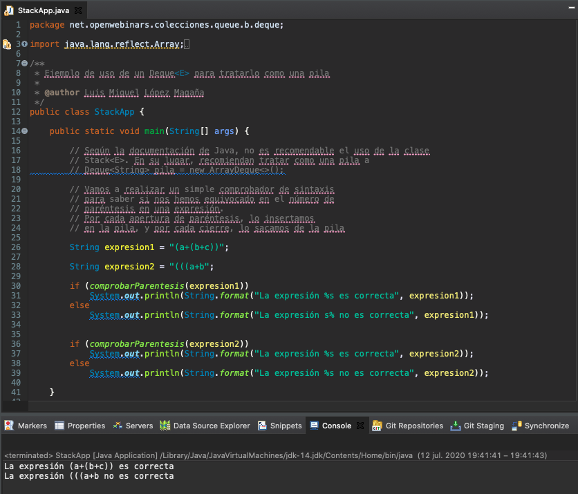

# `List<E>`


Pasamos a la siguiente interfaz, la interfaz `List<E>` será quizá la interfaz que más utilicéis se trata de un tipo de `Collection<E>` que si permite duplicados y que a las funcionalidades de `Collection<E>` añade el acceso posicional, la posibilidad de búsqueda, una iteración extendida y una operación sobre un rango de los elementos de la lista.


la implementación más usual, la que utilizaras en el 95% de los casos será `ArrayList<E>` después tendremos la implementación `Vector<E>` esta es bastante más antigua desde de la primera versión de Java esta presente, una implementación que si está sincronizada, es decir que sería adecuada en el caso de que quisiéramos utilizarlo en un contexto de concurrencia sin embargo, tiene varios métodos *legacy* y no es demasiado rápida y de hecho no suele ser muy recomendable si queremos tener una implementación sincronizada en una lista veremos que existen otras alternativas y por último tendríamos `LinkedList<E>` que si bien hereda `AbstractList<E>` al igual que `ArrayList<E>` también implementa la interfaz `Queue` y `deque` y va a ser eficiente solamente en algunas situaciones bastante bastante bastante concretas.


Las operaciones de acceso posicional son las mismas que tendría un array cualquiera, los índices también empiezan en 0 y nos permitiría acceder al tercer elemento por ejemplo de una lista en este caso sería el que está en la posición 2 y que no devolvería el elemento 3.


Si quisiéramos buscar por índice también podríamos y nos devolvería la posición en la que se encuentra un determinado elemento empezando por el principio o por el final, es decir la primera ocurrencia o la última.


Hemos visto que tenemos una serie de elementos de iteración también extendida de manera que en este iterador además de poder avanzar hacia adelante como en un iterador cualquiera, podríamos avanzar hacia adelante, hacia atrás, podríamos añadir, modificar además de eliminar es bastante potente en ese sentido.


Podemos también obtener un *View* una especie de copia de la lista pero que realmente no es una copia porque se ofrece a través de la lista subyacente y si queremos tener ese subconjunto de la lista podemos trabajar con el con cualquier tipo de operación de inserción actualización y borrado de manera que la lista subyacente la lista general grande se vería modificada por por ese tipo de operación.


La implementación de `List` la podemos hacer a través de un `ArrayList` o un `LinkedList`. `ArrayList` es la más adecuada en la mayoría de las situaciones, el acceso por índice se hacen en tiempo constante, la inserción en media también sería en un tiempo constante, ocupa menos espacio en memoria que `LinkedList` sin embargo `LinkedList` suele tener un peor rendimiento, las distintas operaciones en el acceso depende mucho del tamaño del `LinkedList` y suele ocupar más espacio por eso su uso suele estar circunscrito a una serie de operaciones muy concretas.


### :computer: Ejemplo de Aplicación `List<E>`

Vamos a comprobar esto en un ejemplo con `List<E>`.

*`ListApp`*

```java
package net.openwebinars.colecciones.list.a.list;

import java.util.Arrays;
import java.util.List;

/**
 * Ejemplo de uso de los métodos de List<E>
 *
 *
 */
public class ListApp {

    public static void main(String[] args) {

        // Una de las formas más sencillas de obtener una lista
        List<String> lista = Arrays.asList("Uno", "Dos", "Tres", "cinco", "Seis");

        // Uso posicional de la lista
        // Los índices comienzan en 0

        // Obtener el elemento en la posición 2 (tercer elemento)
        String tercerElemento = lista.get(2);

        // Iterar sobre los elementos
        lista.forEach((x) -> System.out.print(x + " "));
    }
}
```

Aquí tenemos lo que hemos visto sería bastante sencillo, tenemos la opción de hacer un acceso posicional y seguimos teniendo la posibilidad de iterar sobre los distintos elementos también con el bucle `for Each` o mediante el método `.forEach` y una expresión lambda.

### Ejecutar la Aplicación.


Si queremos ejecutar este ejemplo que es sencillo nos imprimiría `Uno Dos Tres cinco Seis` tal cual se los encuentra, en `tercerElemento` estaría `Tres`.

### :computer: Ejemplo de Aplicación `ArrayList<E>`

La implementación de `ArrayList<E>` ya digo que no agrega nada a lo que define la interfaz `List<E>` es decir que seguimos teniendo la posibilidad de acceso posicional tanto en modo lectura como en escritura.

*`ArrayListApp`*

```java
package net.openwebinars.colecciones.list.b.arraylist;

import java.util.ArrayList;
import java.util.Arrays;
import java.util.List;
import java.util.ListIterator;

/**
 * Ejemplo de uso de los métodos de ArrayList<E> (con una referencia de tipo List<E>
 *
 * 
 */
public class ArrayListApp {

    public static void main(String[] args) {

        // Podemos construir un ArrayList a partir de otra colección
        List<String> lista = new ArrayList<>(Arrays.asList("Uno", "Dos", "Tres", "cinco", "Seis"));

        // USO POSICIONAL

        // Uso posicional de la lista
        // Los índices comienzan en 0

        // Obtener el elemento en la posición 2 (tercer elemento)
        String tercerElemento = lista.get(2);

        // Añadir un elemento en una posición determinada
        lista.add(3, "Cuatro");

        // Sustituir un elemento de una determinada posición
        lista.set(4, "Cinco");

        // Eliminar un elemento de una determinada posición
        // Devuelve el elemento eliminado
        String eliminado = lista.remove(5);

        // Posibilidad de contener repetidos
        lista.add("Seis");
        lista.add("Seis");

        // Iterar sobre los elementos mediante un forEach
        lista.forEach((x) -> System.out.print(x + " "));

        // FUNCIONES DE BÚSQUEDA

        // Búsqueda de la primera o la última ocurrencia de un elemento
        int posicion1 = lista.indexOf("Dos");
        int posicion2 = lista.lastIndexOf("Seis");

        System.out.println("\n\nLa primera ocurrencia de Dos está en la posición " + posicion1);
        System.out.println("La última ocurrencia de Seis está en la posición " + posicion2);

        // ITERACIÓN EXTENDIDA

        // Se realiza a través del uso de ListIterator
        // Este nos permite iterar en cualquier dirección, así como
        // añadir, modificar y eliminar

        // Ejemplo de iteración hacia atrás
        for (ListIterator<String> listIterator = lista.listIterator(lista.size());
             listIterator.hasPrevious();) {
            System.out.print(listIterator.previous() + " ");
        }

        // OPERACIONES SOBRE UN RANGO DE ELEMENTOS

        // La lista que se obtiene no es una nueva lista
        // sino una "vista" de la ya existente.
        // Las operaciones que modifiquen la sublista,
        // modificarán la lista subyacente.

        List<String> subLista = lista.subList(3,5);
        System.out.println("\n\nElementos de la sublista");
        for (String s : subLista) {
            System.out.print(s + " ");
        }

        // Si eliminamos elementos de la sublista
        // se eliminan de la lista.
        subLista.clear();

        System.out.println("\n\nElementos de la lista modificados a través de la sublista");
        for (String s : lista) {
            System.out.print(s + " ");
        }

    }
}
```

Podemos construir un `ArrayList` a partir de otra colección

```java
// Podemos construir un ArrayList a partir de otra colección
List<String> lista = new ArrayList<>(Arrays.asList("Uno", "Dos", "Tres", "cinco", "Seis"));
```

Como seguimos teniendo la posibilidad de acceso posicional tanto en modo lectura como en escritura podemos recuperar un elemento en determinada posición, siempre teniendo en cuenta que los índices comienzan en 0.

```java
// Obtener el elemento en la posición 2 (tercer elemento)
String tercerElemento = lista.get(2);
```

Podríamos decirle que insertará un elemento en una determinada posición recorriendo los demás elementos a la derecha, actualmente tenemos los elementos `"Uno", "Dos", "Tres", "cinco", "Seis"` con la siguiente sentencia:  

```java
// Añadir un elemento en una posición determinada
lista.add(3, "Cuatro");
```

Lograríamos insertar el elemento `Cuatro` en la posición 3 por lo que `cinco` se recorrería a la posición 4 y así con el resto de los elementos por lo que ahora tendríamos  `"Uno", "Dos", "Tres", "Cuatro", "cinco", "Seis"`.

Mediante el método `set` podemos sustituir un elemento que se encuentre en una posición por otro.

```java
// Sustituir un elemento de una determinada posición
lista.set(4, "Cinco");
```

Con la sentencia anterior estaríamos remplazando `cinco` por `Cinco` para seguir el estilo del resto de elementos. 

También podríamos eliminar un elemento que se encuentra en una determinada posición.

```java
// Eliminar un elemento de una determinada posición
// Devuelve el elemento eliminado
String eliminado = lista.remove(5);
```

Podemos contener elementos repetidos es decir que podríamos añadir dos veces `Seis`.

```java
// Posibilidad de contener repetidos
lista.add("Seis");
lista.add("Seis");
```

Y si iteramos.

```java
// Iterar sobre los elementos mediante un forEach
lista.forEach((x) -> System.out.print(x + " "));
```

Podemos comprobar como tenemos `Uno Dos Tres Cuatro Cinco Seis Seis `, `Cuatro` lo añadimos nosotros, `Cinco` lo sustituimos por su primer letra en mayúscula y `Seis` que lo insertamos dos veces.


Tenemos determinadas funciones de búsqueda que nos permiten obtener la posición, ya que tenemos acceso a posicionar, la posición de la primera o última ocurrencia de un determinado elemento.

```java
// Búsqueda de la primera o la última ocurrencia de un elemento
int posicion1 = lista.indexOf("Dos");
int posicion2 = lista.lastIndexOf("Seis");

System.out.println("\n\nLa primera ocurrencia de Dos está en la posición " + posicion1);
System.out.println("La última ocurrencia de Seis está en la posición " + posicion2);
```


Por ejemplo la primera ocurrencia de `Dos` está en la posición 1, a sabiendas que se empieza a contar en 0, la última ocurrencia de `Seis` que estaba repetido está en la posición 6, es el séptimo elemento de la colección.

Hemos hablado también de que tenemos iteraciones extendida a través de `ListIterator` en el siguiente código:

```java
// ITERACIÓN EXTENDIDA

// Se realiza a través del uso de ListIterator
// Este nos permite iterar en cualquier dirección, así como
// añadir, modificar y eliminar

// Ejemplo de iteración hacia atrás
for (ListIterator<String> listIterator = lista.listIterator(lista.size());
   listIterator.hasPrevious();) {
   System.out.print(listIterator.previous() + " ");
}
```

Hacemos una iteración de atrás hacia adelante sobre este `ArrayList` mediante un `ListIterator`, `listIterator()` es un método que tiene el propio el propio `ArrayList` y qué de esta manera nos permitiría obtener el iterador que comenzaría en la posición que en este caso estamos marcando con `lista.size()` es decir que comenzaría en la posición 7 aquí comenzaría cómo podríamos comprobar a la derecha del último elemento `lista.size()` devolvería 7, lo colocaría en esta posición he iria iterando a través del ArrayList mientras haya un elemento anterior, es decir que cuando llegue al primer elemento, como no habrá un elemento anterior pararía esa iteración, de esta manera iterando hacia atrás podríamos tener los elementos cómo podemos ver aquí `Seis Seis Cinco Cuatro Tres Dos Uno`


Por último decíamos que teníamos las operaciones sobre un rango de elementos:

```java
// OPERACIONES SOBRE UN RANGO DE ELEMENTOS

// La lista que se obtiene no es una nueva lista
// sino una "vista" de la ya existente.
// Las operaciones que modifiquen la sublista,
// modificarán la lista subyacente.

List<String> subLista = lista.subList(3,5);
System.out.println("\n\nElementos de la sublista");
for (String s : subLista) {
   System.out.print(s + " ");
}
```

Podríamos obtenerlos desde la posición 3 a las 5 de la lista con lo cual nos devolvería los elementos `Cuatro Cinco`.


Y si limpiamos la sublista y volvemos a imprimir la lista subyacente.

```java
// Si eliminamos elementos de la sublista
// se eliminan de la lista.
subLista.clear();

System.out.println("\n\nElementos de la lista modificados a través de la sublista");
for (String s : lista) {
   System.out.print(s + " ");
}
```

Vemos que la lista original se ha visto modificada a través de la sublista puesto que `Cuatro Cinco` ya no aparecerían, solo aparecen `Uno Dos Tres Seis Seis`.


Todo esto como ejemplo de uso de `ArrayList<E>`.

### Ejecutar la Aplicación.


## Otras interfaces relacionados con `List<E>`


Otros interfaces relacionados con `List<E>` serían `Queue` y `Deque` que nos permiten implementar una cola y una cola doble, que también nos permitirán de esa manera obtener una una lista.


Una cola una `Queue` es una cola de tipo FIFO se suele poner como ejemplo siempre la cola del supermercado, es decir el primero que llega es el primero que sale, nosotros insertariamos los elemento al final de la cola llamada cola y saldrían por la cabeza, conforme vamos insertando elementos se van viendo empujado o mejor dicho conforme los vamos sacando se van desplazando los elementos de la cola hacia la cabeza. 


Tiene una serie de operaciones algunas lanzan una excepción:

* `add(e)` Inserción.
* `remove()` Extraer.
* `element()` Examinar, hace lo mismo que `remove()` pero sin eliminar el elemento de la cabeza de la cola.

Si sucede algún tipo de error lanzan una excepción.

Y tenemos también una implementación que devuelve un valor especial como:

* `offer(e)` Inserción.
* `poll()` Extraer.
* `peek` Examinar.

Que harían las misma operación pero que no lanzarían una una excepción si por ejemplo no se puede insertar un elemento nos devolvería un valor nulo, si no hay ningún elemento nos devolvería un valor nulo en lugar de lanzar una excepción.


La interfaz `Deque<E>` son las siglas de una cola doblemente enlazada,  Double Ended Que, nos permite tener una cola que funciona como cola en ambos extremos, que puede ser útil en algún tipo de sistema o también podría funcionar como una pila, incluso como una pila doble pero sobre todo como una pila que suele ser para lo que más se utiliza.


Si la tratamos como una cola tendríamos el siguiente mapeo en los métodos que tendríamos que utilizar.

* `add(e) -> addLast(e)` Inserción.
* `remove() -> removeFirst()` Extraer.
* `element() -> getFirst()` Examinar.

Y para la implementación que devuelve un valor especial:

* `offer(e) -> offerLast(e)` Inserción.
* `poll() -> pollFirst()` Extraer.
* `peek -> peekFirst()` Examinar.

Y si lo queremos trabajar como pila tenemos la clase `Stack<E>` que no vamos a visitar tampoco tiene una serie de métodos:

* `push(e)` Inserción.
* `pop()` Extraer.
* `peek` Examinar.

Y si tratamos `Deque<E>` como pilas tendríamos que hacer siempre la inserción y la obtención desde el principio.

* `addFirst(e)` Inserción.
* `removeFirst()` Extraer.
* `getFirst` Examinar.

Y para la implementación que devuelve un valor especial:

* `offerFirst(e)` Inserción.
* `pollFirst()` Extraer.
* `peekFirst` Examinar.


Si lo tratamos como una cola doble tendremos que trabajar con los mismos métodos pero en uno u otro extremo siempre con la coletilla de `First` o `Last`.


Vamos a ver algún ejemplo de estas implementaciones tenemos la posibilidad con la implementación de `Queue<E>` de trabajar con:

* `PriorityQueue<E>` 
* `ArrayQueue<E>` 
* `LinkedQueue<E>` 

Y con `Deque<E>` trabajar con:

* `ArrayDeque<E>`
* `LinkedDeque<E>`

Hemos visto antes `LinkedList<E>` tampoco sería `LinkedQueue<E>` la más adecuada si queremos trabajar con una cola, sería más adecuada por ejemplo `ArrayQueue<E>`, si queremos trabajar con prioridad por ejemplo `PriorityQueue<E>` y si queremos trabajar con `Deque<E>` pues podríamos trabajar con alguna de estas implementaciones  `ArrayDeque<E>` o `LinkedDeque<E>`. 

de la cena a la hora de hacer una cola con prioridad tendríamos prioritic yo vale

### :computer: Ejemplo de Aplicación `ArrayQueue<E>`

*`QueueArrayDequeApp`*

```java
package net.openwebinars.colecciones.queue.a.queue;

import java.util.ArrayDeque;
import java.util.Queue;

/**
 * Ejemplo de uso de los métodos de Queue<E>
 *
 * 
 */
public class QueueArrayDequeApp {

    public static void main(String[] args) {

        // Podemos usar una cola si necesitamos obtener los elementos en el orden
        // en el cual los hemos insertado
        Queue<String> meses = new ArrayDeque<>();

        // Insertamos los diferentes meses del año
        meses.add("Enero");
        meses.add("Febrero");
        meses.add("Marzo");
        meses.add("Abril");
        meses.add("Mayo");
        meses.add("Junio");
        meses.add("Julio");
        meses.add("Agosto");
        meses.add("Septiembre");
        meses.add("Octubre");
        meses.add("Noviembre");
        meses.add("Diciembre");

        // ¿Qué mes está ahora mismo en la cabecera de la cola?
        System.out.println(meses.element());

        System.out.println("\n\n");
        // Vaciamos la cola, obteniendo todos los meses
        while (!meses.isEmpty()) {
            System.out.println(meses.remove());
        }

    }
}
```

Aquí tenemosel ejemplo de una Cola `Queue` para gestionar los meses del año estamos usando la implementación con `ArrayDeque` que es la más eficiente.

```java
// Podemos usar una cola si necesitamos obtener los elementos en el orden
// en el cual los hemos insertado
Queue<String> meses = new ArrayDeque<>();
```

Podemos insertar los meses en un determinado orden de inserción.

```java
// Insertamos los diferentes meses del año
meses.add("Enero");
meses.add("Febrero");
meses.add("Marzo");
meses.add("Abril");
meses.add("Mayo");
meses.add("Junio");
meses.add("Julio");
meses.add("Agosto");
meses.add("Septiembre");
meses.add("Octubre");
meses.add("Noviembre");
meses.add("Diciembre");
```

El método `element()` nos permita consultar la cabecera es decir el primer elemento.

```java
// ¿Qué mes está ahora mismo en la cabecera de la cola?
System.out.println(meses.element());
```
El método `remove()` nos permite eliminar un elemento devolviendo el elemento eliminado, por lo que con el siguiente bucle:

```java
// Vaciamos la cola, obteniendo todos los meses
while (!meses.isEmpty()) {
   System.out.println(meses.remove());
}
```

Recorremos la cola mientras no este vacía, hasta que vaciamos la cola, obteniendo todos los meses, es como ver pasar los meses. Nos devolvera los meses en el orden de inserción. 

Si fueran personas en la caja de un supermercado representaría como vamos atendiendo a los clientes.

### Ejecutar la Aplicación.


### :computer: Ejemplo de Aplicación `PriorityQueue<E>`

La clase `PriorityQueueApp` nos permite crear una cola con prioridad de manera que los diferentes elementos deben implementar `Comparable` y aquellos elementos que mientras su orden natural sean mayores tendrán mayor prioridad.

Supongamos que lo que tenemos son pasajeros de un vuelo por ejemplo o de un tren y algunos tienen mayor prioridad por que han pagado más por su billete, tienen una prioridad más alta.

Lo primero es implementar la clase modelo `Pasajero` que tiene como novedad manejar esa prioridad y comparar los elementos por prioridad, la prioridad será más grande cuando mayor sea el número almacenado en la propiedad `prioridad` por eso hacemos un `compare` (` -Integer.compare(prioridad, o.getPrioridad())`) mediante `Integer` pero lo hacemos a la inversa, podríamos comprobar como de esta forma como aun que los pasajeros vayan llegando en un orden determinado después se obtienen en base a la prioridad, con una salvedad cuando tengamos elementos que tengan la misma prioridad se deven devolver en el orden en que llegarón, pero realmente `PriorityQueue<E>` no nos garantiza nada con elementos que tengan la misma prioridad. Para ello en la documentación que existe sobre la implementación de `PriorityQueue<E>` se nos sugiere que añadamos una especie de contenedor para que manejemos la cola de este tipo de contenedor de nuestra clase modelo y en este contenedor si podamos manejar de alguna manera el orden de llegada, para eso tenemos otra clase de Modelo `FifoEntry` donde tenemos un `AtomicLong` donde en el fondo lo que nos hace es devolver una secuencia de valores, cada valor que vayamos cereando, insertando se le asigna un valor de esa secuencia, de manera que a la hora de comparar comparariamos en primer lugar en base al contenido al pasajero a su prioridad y si la prioridad fuese la misma lo hariamos comparando en base a la secuencia, al orden de llegada. 

De esta forma si que podríamos tener  

*`Pasajero`*

```java
package net.openwebinars.colecciones.queue.a.queue.model;

import java.util.Objects;

/**
 * Clase modelo para algunos de los ejemplos
 */
public class Pasajero implements Comparable<Pasajero> {

    private String nombre;
    private int prioridad;

    public Pasajero(String nombre, int prioridad) {
        this.nombre = nombre;
        this.prioridad = prioridad;
    }

    public String getNombre() {
        return nombre;
    }

    public void setNombre(String nombre) {
        this.nombre = nombre;
    }

    public int getPrioridad() {
        return prioridad;
    }

    public void setPrioridad(int prioridad) {
        this.prioridad = prioridad;
    }

    @Override
    public boolean equals(Object o) {
        if (this == o) return true;
        if (o == null || getClass() != o.getClass()) return false;
        Pasajero pasajero = (Pasajero) o;
        return prioridad == pasajero.prioridad &&
                Objects.equals(nombre, pasajero.nombre);
    }

    @Override
    public int hashCode() {
        return Objects.hash(nombre, prioridad);
    }

    @Override
    public String toString() {
        return "Pasajero{" +
                "nombre='" + nombre + '\'' +
                ", prioridad=" + prioridad +
                '}';
    }

    // Las instancias de Pasajero se ordenan según prioridad
    // La prioridad es más grande cuanto mayor es el número
    // entero almacenado en la propiedad prioridad
    @Override
    public int compareTo(Pasajero o) {
        return -Integer.compare(prioridad, o.getPrioridad());
    }
}
```

*`FifoEntry`*

```java
package net.openwebinars.colecciones.queue.a.queue.model;

import java.util.concurrent.atomic.AtomicLong;

/**
 * Contenedor que nos permite manejar las entradas
 * de una cola de forma conveniente.
 * Propuesto en la documentación de Java
 * https://download.java.net/java/GA/jdk14/docs/api/java.base/java/util/concurrent/PriorityBlockingQueue.html
 */
public class FifoEntry<E extends Comparable<? super E>>
        implements Comparable<FifoEntry<E>> {

    static final AtomicLong seq = new AtomicLong(0);
    final long seqNum;
    final E entry;

    public FifoEntry(E entry) {
        seqNum = seq.getAndIncrement();
        this.entry = entry;
    }

    public E getEntry() { return entry; }

    // Se comprar según la prioridad del elemento.
    // A igual prioridad, se compara según el número
    // de la secuencia

    // Nos permite "ordenar" los elementos
    // de igual prioridad

    public int compareTo(FifoEntry<E> other) {
        int res = entry.compareTo(other.entry);
        if (res == 0 && other.entry != this.entry)
            res = (seqNum < other.seqNum ? -1 : 1);
        return res;
    }
}
```

*`PriorityQueueApp`*

```java
package net.openwebinars.colecciones.queue.a.queue;

import net.openwebinars.colecciones.queue.a.queue.model.FifoEntry;
import net.openwebinars.colecciones.queue.a.queue.model.Pasajero;

import java.util.PriorityQueue;
import java.util.Queue;

/**
 * Ejemplo de uso de una cola con prioridad, PriorityQueue
 *
 * 
 */
public class PriorityQueueApp {

    public static void main(String[] args) {

        // Una cola con prioridad nos permite "ordenar" un poco los
        // elementos dentro de la cola.
        // El tipo de los elementos debe implementar Comparable


        // Creamos una cola para gestionar el orden de embarque de algunos pasajeros
        // a un medio de transporte. Algunos pasajeros tiene mayor prioridad que otros,
        // según lo hayan abonado al comprar su billete.
        Queue<Pasajero> cola = new PriorityQueue<>();

        // Los pasajeros van llegando a la cola
        cola.add(new Pasajero("María", 1));
        cola.add(new Pasajero("Manuel", 2));
        cola.add(new Pasajero("Antonio", 1));
        cola.add(new Pasajero("Rosa", 3));
        cola.add(new Pasajero("Ana", 5));


        // Es hora de embarcar.
        // Los pasajeros van pasando conforme se va vaciando la cola
        while(!cola.isEmpty())
            System.out.println(cola.remove());


        // ¡OJO! No se nos asegura que los elementos de igual
        // prioridad se obtengan en orden de inserción :S
        // Para ello, tendríamos que añadir un segundo elemento
        // que nos permita manejar el orden de inserción

        Queue<FifoEntry<Pasajero>> cola2 = new PriorityQueue<>();


        cola2.add(new FifoEntry<Pasajero>(new Pasajero("María", 1)));
        cola2.add(new FifoEntry<Pasajero>(new Pasajero("Manuel", 2)));
        cola2.add(new FifoEntry<Pasajero>(new Pasajero("Antonio", 1)));
        cola2.add(new FifoEntry<Pasajero>(new Pasajero("Rosa", 3)));
        cola2.add(new FifoEntry<Pasajero>(new Pasajero("Ana", 5)));

        // Gracias a FifoEntry, ahora sí que obtenemos los elementos
        // de igual prioridad en orden de inserción
        System.out.println("\n\n");
        while(!cola2.isEmpty())
            System.out.println(cola2.remove().getEntry());

    }
}
```

### Ejecutar la Aplicación.


Al ejecutar la aplicación obtendremos los pasajeros por prioridad pero los que tienen la misma prioridad los desordena, sin embargo en el segundo bloque estan ordenados por prioridad y por orden de llegada como correspone.

Los de igual prioridad fijaos que nos ha desordenado vale compro aquí lo ha desordenado Antonio luego después que María y sin embargo lo ha puesto antes sin embargo aquí se ordena por prioridad y a igual prioridad no garantizaría que sería por el orden de llegada.


### :computer: Ejemplo de Aplicación `ArrayDeque<E>`

*`StackApp`*

```java
package net.openwebinars.colecciones.queue.b.deque;

import java.lang.reflect.Array;
import java.util.ArrayDeque;
import java.util.Deque;

/**
 * Ejemplo de uso de un Deque<E> para tratarlo como una pila
 *
 * 
 */
public class StackApp {

    public static void main(String[] args) {

        // Según la documentación de Java, no es recomendable el uso de la clase
        // Stack<E>. En su lugar, recomiendan tratar como una pila a
        // Deque<String> pila = new ArrayDeque<>();

        // Vamos a realizar un simple comprobador de sintaxis
        // para saber si nos hemos equivocado en el número de
        // paréntesis en una expresión.
        // Por cada apertura de paréntesis, lo insertamos
        // en la pila, y por cada cierre, lo sacamos de la pila

        String expresion1 = "(a+(b+c))";

        String expresion2 = "(((a+b";

        if (comprobarParentesis(expresion1))
            System.out.println(String.format("La expresión %s es correcta", expresion1));
        else
            System.out.println(String.format("La expresión s% no es correcta", expresion1));


        if (comprobarParentesis(expresion2))
            System.out.println(String.format("La expresión %s es correcta", expresion2));
        else
            System.out.println(String.format("La expresión %s no es correcta", expresion2));

    }

    /**
     * Comprueba si una expresión tiene el número correcto de paréntesis
     * @param expresion a comprobar
     * @return True, si el número de paréntesis es adecuado, false en otro caso
     */
    private static boolean comprobarParentesis(String expresion) {

        // Declaramos la pila
        Deque<Character> pila = new ArrayDeque<>();

        // Transformamos la expresión en un array de caracteres
        char[] expresionAsArray = expresion.toCharArray();

        // Suponemos que el resultado va a ser bueno
        boolean result = true;

        // Recorremos la expresión
        for (int i = 0; i < expresionAsArray.length; i++) {
            char actual = expresionAsArray[i];
            // Si es la apertura de un paréntesis, insertamos en la pila
            if (actual == '(')
                pila.addFirst(actual);
            // Si es el cierre de un paréntesis, lo sacamos la cabecera de la pila
            else if (actual == ')') {
                // Si devuelve nulo, quiere decir que no nay elementos
                // y por tanto, la expresión es errónea
                if (pila.pollFirst() == null)
                    result = false;
            }
        }

        // Si al terminar, la pila no está vacía,
        // también es errónea
        if (result && !pila.isEmpty())
            result = false;

        // Devolvemos el resultado
        return result;
    }
}
```

Para el ejemplo de `Deque<E>` podríamos ver un ejemplo de la comprobación de la sintaxis de una expresión para saber si tiene todos los paréntesis adecuados, podría ser un buen uso de una pila, les decía que existe la clase `Stack` pila pero la propia documentación de Java no nos recomienda que la utilicemos en su lugar nos recomiendan tratar como una pila a un `Deque<E>` construido sobre un `ArrayDeque<E>`.

```java
// Según la documentación de Java, no es recomendable el uso de la clase
// Stack<E>. En su lugar, recomiendan tratar como una pila a
// Deque<String> pila = new ArrayDeque<>();
```

Como podríamos hacer la comprobación de que si una expresión tiene los paréntesis de forma adecuada, bueno pues lo que podemos hacer es recorrerla carácter a carácter y si vamos insertando cada vez que nos encontremos con una apertura de paréntesis lo insertamos en la pila y cada vez que nos encontremos con un cierre de paréntesis sacaríamos de la pila, si al final de este recorrido la pila se ha quedado vacía lo normal es que la expresión sea correcta, si no se ha quedado vacía la expresión no sería correcta.

```java
String expresion1 = "(a+(b+c))";

String expresion2 = "(((a+b";

if (comprobarParentesis(expresion1))
   System.out.println(String.format("La expresión %s es correcta", expresion1));
else
   System.out.println(String.format("La expresión s% no es correcta", expresion1));


if (comprobarParentesis(expresion2))
   System.out.println(String.format("La expresión %s es correcta", expresion2));
else
   System.out.println(String.format("La expresión %s no es correcta", expresion2));
```

Lo hacemos en el método `comprobarParentesis(String expresion)`:

```java
    /**
     * Comprueba si una expresión tiene el número correcto de paréntesis
     * @param expresion a comprobar
     * @return True, si el número de paréntesis es adecuado, false en otro caso
     */
    private static boolean comprobarParentesis(String expresion) {

        // Declaramos la pila
        Deque<Character> pila = new ArrayDeque<>();

        // Transformamos la expresión en un array de caracteres
        char[] expresionAsArray = expresion.toCharArray();

        // Suponemos que el resultado va a ser bueno
        boolean result = true;

        // Recorremos la expresión
        for (int i = 0; i < expresionAsArray.length; i++) {
            char actual = expresionAsArray[i];
            // Si es la apertura de un paréntesis, insertamos en la pila
            if (actual == '(')
                pila.addFirst(actual);
            // Si es el cierre de un paréntesis, lo sacamos la cabecera de la pila
            else if (actual == ')') {
                // Si devuelve nulo, quiere decir que no nay elementos
                // y por tanto, la expresión es errónea
                if (pila.pollFirst() == null)
                    result = false;
            }
        }

        // Si al terminar, la pila no está vacía,
        // también es errónea
        if (result && !pila.isEmpty())
            result = false;

        // Devolvemos el resultado
        return result;


    }
```

Recibimos la expresión, construimos la pila

```java
// Declaramos la pila
Deque<Character> pila = new ArrayDeque<>();

```

transformamos la expresión en un array de caracteres que es lo que estamos guardando en la pila,

```java
// Transformamos la expresión en un array de caracteres
char[] expresionAsArray = expresion.toCharArray();
```

y suponemos que la expresión va a ser correcta, 

```java
// Suponemos que el resultado va a ser bueno
boolean result = true;
```

Recorremos cada uno de los caracteres de la expresión y si el carácter actual es una apertura de parentesis lo insertamos en la pila, recordar que había una serie de métodos de `Deque` que nos permiten tratar una cola doble como está, como si fuese una Pila `addFirst` y `pollFirst`, si encontramos una apertura de paréntesis lo metemos en la pila si el carácter es un cierre de paréntesis lo que hacemos es sacarlo de la pila,

```java
// Recorremos la expresión
for (int i = 0; i < expresionAsArray.length; i++) {
   char actual = expresionAsArray[i];
   // Si es la apertura de un paréntesis, insertamos en la pila
   if (actual == '(')
      pila.addFirst(actual);
      // Si es el cierre de un paréntesis, lo sacamos la cabecera de la pila
   else if (actual == ')') {
      // Si devuelve nulo, quiere decir que no nay elementos
      // y por tanto, la expresión es errónea
      if (pila.pollFirst() == null)
         result = false;
   }
}
```

`pollFirst` es la la implementación de métodos que nos permite obtener un valor nulo, si por ejemplo la pila no tiene elementos, con lo cual si al sacar el paréntesis se nos devuelve nulo quiere decir que hemos encontrado un cierre de paréntesis pero que la pila está vacía, eso quiere decir si hay algún paréntesis de cierre de más, con lo cual el resultado debería ser falso.

Si al terminar la pila no está vacía.

```java
// Si al terminar, la pila no está vacía,
// también es errónea
if (result && !pila.isEmpty())
   result = false;

// Devolvemos el resultado
return result;
```

Por ejemplo al tratar la expresión `(((a+b` la pila no está vacía no tiene ningún cierre de paréntesis la expresión también sería erróneo en cualquier caso lo que hacemos devolver el resultado.


### Ejecutar la Aplicación.



Vemos cómo sería el ejemplo de ejecución una expresión si es correcta realmente no hace una validación completa de la expresión, esto tendríamos que validar también el orden del operando, operadores, simplemente lo estamos haciendo a nivel de paréntesis, conforme vayamos abriendo un paréntesis se va cerrando se va cerrando y podemos ver como la segunda expresión no es correcta. 
