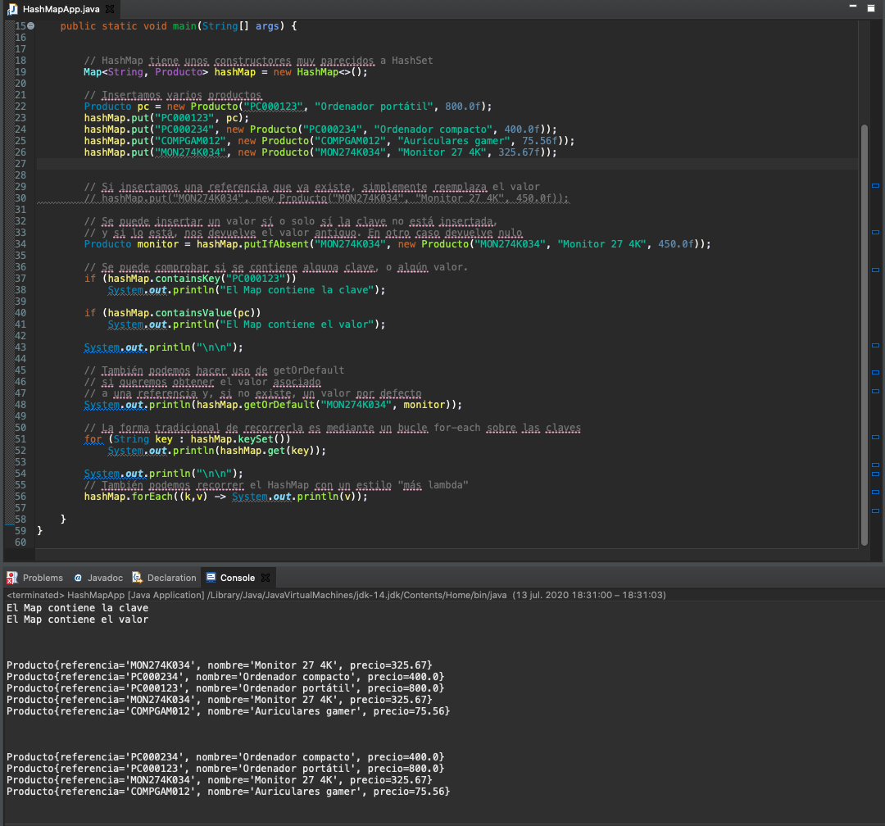
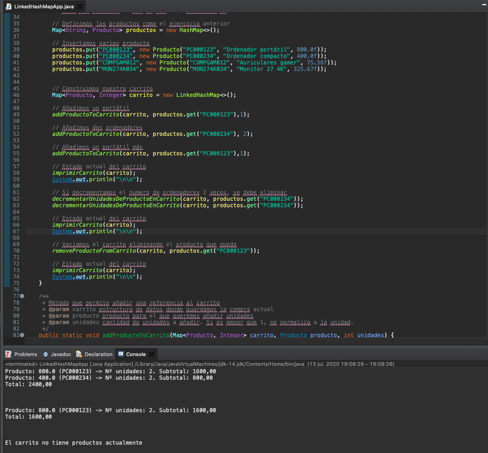
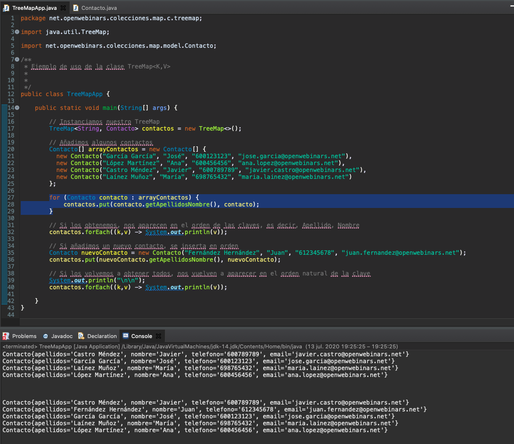

# `Map<K,V>`


El tercer gran conjunto de Colecciones es `Map<K,V>` se trata de la primera que no hereda de
`Collection` maneja pares clave-valor, para cada clave hay un solo valor, cada clave puede existir una sola vez en el `Map` no puede estar repetida, podríamos tener una clave nula una sola clave nula y múltiples valores nulos eso si, hay otro lenguaje de programación dónde se le conoce como diccionario, al igual que las colecciones anteriores por recordarlo en este punto, como no permite almacenar tipos primitivos tendríamos que usar siempre los tipos envoltorio en su lugar, en lugar de `int` usar `Integer` etc.


Existe una clase que aparece en alguna ocasión en la documentación que es `Map.Entry<K,V>` que es la clase que nos permite consultar de una manera conjunta el par clave-valor y de hecho hay un método `entrySet()` en la interfaz `Map` que nos devolverías un conjunto, un set de elementos de este tipo, de tipo `Map.Entry`.


Las operaciones más comunes con `Map<K,V>` son:

* La de insertar una clave y valor mediante el método `put(key, value)`.
* Obtener un valor en base a la clave con el método `get(key)`.
* Consultar si una determinada clave o un valor están contenidos dentro del `Map` con `containsKey(key)` o `containsValue(value)`.
* Eliminar un par clave-valor en base a la clave con el método `remove(key)`


Y veremos que para recorrerlo tenemos dos opciones a través de un forEach dónde obtendríamos mediante el método `entryKey` todas las claves en un `Set` recorreriamos ese `Set` y para cada uno podríamos obtener con el método `get` los distintos valores o podríamos utilizar el método `foreach` y usando Lambda con un Biconsumer que vamos a ver que sería una expresión muy sencilla, podríamos obtener tanto las claves como los distintos valores.


Vamos a comprobar como hay tres implementaciones, nos suena un montón, de hecho tienen los mismos nombres prácticamente que en el caso de `Set`, tenemos `HashMap` que serían el más rápido que no nos dice nada sobre el orden, el que mantiene el orden de inserción qué es `LinkedHashMap` y el que ordena según las claves que sería `TreeMap`.


Las distintas implementaciones como decimos se parecen un montón a las de `Set` tanto en `HashMap`.


En `LinkedHashMap` que ordena según inserción.


Y `TreeMap` que mantiene las claves en en orden natural.

Veámoslo los distintos ejemplos que tenemos de `Map`.

### :computer: Ejemplo de Aplicación `HashMap<E>`

Un ejemplo con `HashMap<E>` podría ser si quisiéramos almacenar una serie de productos en base a su referencia.

*`Producto`*

```java
package net.openwebinars.colecciones.map.model;

import java.util.Objects;

/**
 * Modelo para los ejemplos con Map<K,V>
 *
 * 
 */
public class Producto implements Comparable<Producto> {

    private String referencia;
    private String nombre;
    private float precio;

    public Producto(String referencia, String nombre, float precio) {
        this.referencia = referencia;
        this.nombre = nombre;
        this.precio = precio;
    }

    public String getReferencia() {
        return referencia;
    }

    public void setReferencia(String referencia) {
        this.referencia = referencia;
    }

    public String getNombre() {
        return nombre;
    }

    public void setNombre(String nombre) {
        this.nombre = nombre;
    }

    public float getPrecio() {
        return precio;
    }

    public void setPrecio(float precio) {
        this.precio = precio;
    }

    @Override
    public boolean equals(Object o) {
        if (this == o) return true;
        if (o == null || getClass() != o.getClass()) return false;
        Producto producto = (Producto) o;
        return Float.compare(producto.precio, precio) == 0 &&
                Objects.equals(referencia, producto.referencia) &&
                Objects.equals(nombre, producto.nombre);
    }

    @Override
    public int hashCode() {
        return Objects.hash(referencia, nombre, precio);
    }

    @Override
    public String toString() {
        return "Producto{" +
                "referencia='" + referencia + '\'' +
                ", nombre='" + nombre + '\'' +
                ", precio=" + precio +
                '}';
    }

    // Ordenamos los productos por precio
    @Override
    public int compareTo(Producto o) {
        return Float.compare(precio, o.getPrecio());
    }
}
```

*`HashMapApp`*

```java
package net.openwebinars.colecciones.map.a.hashmap;

import net.openwebinars.colecciones.map.model.Producto;

import java.util.HashMap;
import java.util.Map;

/**
 * Ejemplo de uso de la implementación HashMap<K,V>
 *
 * 
 */
public class HashMapApp {

    public static void main(String[] args) {

        // HashMap tiene unos constructores muy parecidos a HashSet
        Map<String, Producto> hashMap = new HashMap<>();

        // Insertamos varios productos
        Producto pc = new Producto("PC000123", "Ordenador portátil", 800.0f);
        hashMap.put("PC000123", pc);
        hashMap.put("PC000234", new Producto("PC000234", "Ordenador compacto", 400.0f));
        hashMap.put("COMPGAM012", new Producto("COMPGAM012", "Auriculares gamer", 75.56f));
        hashMap.put("MON274K034", new Producto("MON274K034", "Monitor 27 4K", 325.67f));

        // Si insertamos una referencia que ya existe, simplemente reemplaza el valor
        // hashMap.put("MON274K034", new Producto("MON274K034", "Monitor 27 4K", 450.0f));

        // Se puede insertar un valor sí o solo sí la clave no está insertada,
        // y si lo está, nos devuelve el valor antiguo. En otro caso devuelve nulo
        Producto monitor = hashMap.putIfAbsent("MON274K034", new Producto("MON274K034", "Monitor 27 4K", 450.0f));

        // Se puede comprobar si se contiene alguna clave, o algún valor.
        if (hashMap.containsKey("PC000123"))
            System.out.println("El Map contiene la clave");

        if (hashMap.containsValue(pc))
            System.out.println("El Map contiene el valor");

        System.out.println("\n\n");
        
        // También podemos hacer uso de getOrDefault
        // si queremos obtener el valor asociado
        // a una referencia y, si no existe, un valor por defecto
        System.out.println(hashMap.getOrDefault("MON274K034", monitor));

        // La forma tradicional de recorrerla es mediante un bucle for-each sobre las claves
        for (String key : hashMap.keySet())
            System.out.println(hashMap.get(key));

        System.out.println("\n\n");
        // También podemos recorrer el HashMap con un estilo "más lambda"
        hashMap.forEach((k,v) -> System.out.println(v));

    }
}
```

Instanciamos un `HashMap` donde sus keys van a ser `Strings` y sus valores `Productos`.

```java
// HashMap tiene unos constructores muy parecidos a HashSet
Map<String, Producto> hashMap = new HashMap<>();
```

Para insertar contenido a nuestro `HashMap` usamos el método `put` que requiere dos parámetros la key que esta representada por el código del producto y como valor usamos una instancia de Producto.

```java
// Insertamos varios productos
Producto pc = new Producto("PC000123", "Ordenador portátil", 800.0f);
hashMap.put("PC000123", pc);
hashMap.put("PC000234", new Producto("PC000234", "Ordenador compacto", 400.0f));
hashMap.put("COMPGAM012", new Producto("COMPGAM012", "Auriculares gamer", 75.56f));
hashMap.put("MON274K034", new Producto("MON274K034", "Monitor 27 4K", 325.67f));
```

Si insertamos con el método `put` una referencia que ya existe lo que haría es sustituir el nuevo valor por el anterior que tuvíera.

```java
// Si insertamos una referencia que ya existe, simplemente reemplaza el valor
//hashMap.put("MON274K034", new Producto("MON274K034", "Monitor 27 4K", 450.0f));
```

En este caso sería que tendríamos el `Monitor 27 4K", 450.0f` en lugar de `Monitor 27 4K", 325.67f`, actua como una actualización.

Si puede insertarse un valor si y solo si la clave no esta insertada usando el método `.putIfAbsent(...)` y si lo está, nos devuelve el valor antiguo. En otro caso devuelve nulo :confused: ¿Cúal es el otro caso?

```java
// Se puede insertar un valor sí y solo sí la clave no está insertada,
// y si lo está, nos devuelve el valor antiguo. En otro caso devuelve nulo
Producto monitor = hashMap.putIfAbsent("MON274K034", new Producto("MON274K034", "Monitor 27 4K", 450.0f));
```

Podemos comprobar si se tiene una determinada clave o un determinado valor.

```java
// Se puede comprobar si se contiene alguna clave, o algún valor.
if (hashMap.containsKey("PC000123"))
   System.out.println("El Map contiene la clave");

if (hashMap.containsValue(pc))
   System.out.println("El Map contiene el valor");
```

También tenemos el método `getOrDefault(...)` que nos devolvería un valor asociado a una referencia y sino un valor por defecto que nosotros le proporcionemos. 

```java
// También podemos hacer uso de getOrDefault
// si queremos obtener el valor asociado
// a una referencia y, si no existe, un valor por defecto
System.out.println(hashMap.getOrDefault("MON274K034", monitor));
```

Por último tenemos las dos maneras de recorrerlo.

La primer forma es la tradicional de recorrerla es mediante un bucle for-each sobre las claves, mediante el método `keySet()` obtendríamos un `Set` con todas las claves de este `HashMap`, podríamos recorrer una a una y después podríamos recorrer los valores a partir de las claves con el método `get`.

```java
// La forma tradicional de recorrerla es mediante un bucle for-each sobre las claves
for (String key : hashMap.keySet())
   System.out.println(hashMap.get(key));
```

La otra forma de recorrerlo es usando el método `forEach(...)` con un Bitconsumer que en el fondo recibe dos argumentos la clave y el valor y ya en la parte dereca de la lambda podemos hacer lo que quisieramos tanto con la clave como con el valor en este caso para tener el mismo comportamiento que antes imprimimos el valor.

```java
/// También podemos recorrer el HashMap con un estilo "más lambda"
hashMap.forEach((k,v) -> System.out.println(v));
```

### Ejecutar la Aplicación 



Como podemos ver un tipo de colección que nos permite manejar pares.

### :computer: Ejemplo de Aplicación `LinkedHashMap<E>`

Al usar un `LinkedHashMap<E>` lo único que aportaría sería el orden de inserción con respecto a `HashMap<E>`, vamos a complementar el ejemplo anterior con una implementación de un carrito de la compra de una aplicación web. 

*`LinkedHashMapApp`*

```java
package net.openwebinars.colecciones.map.b.linkedhashmap;

import net.openwebinars.colecciones.map.model.Producto;

import java.util.HashMap;
import java.util.LinkedHashMap;
import java.util.Map;

/**
 * Ejemplo de uso de la clase LinkedHashMap
 *
 * 
 */
public class LinkedHashMapApp {

    public static void main(String[] args) {

        // Vamos a implementar un carro de compra
        // Nos permitirá almacenar productos y la cantidad de los mismos
        // que queremos adquirir.
        // Elegimos LinkedHashMap para mostrar al usuario los
        // productos en el orden que los insertó.

        // Tenemos varias alternativas de diseño del Map
        // 1) Map<Producto, Integer>, almacenando los productos y la cantidad de los mismos
        // 2) Map<String, Pair<Producto, Integer>>
        // 3) Manejar 2 Map: Map<String, Producto>, para almacenar productos
        //    y otro Map<String, Integer> o Map<Producto, Integer> para el carrito
        // 4) Map<String, Integer>, con las referencias y la cantidades

        // En una aplicación real, seguramente tengamos los productos
        // en una base de datos, y la opción a elegir fuera la 4,
        // pero por ilustrar el uso de dos Map, escogemos la 3

        // Definimos los productos como el ejercicio anterior
        Map<String, Producto> productos = new HashMap<>();

        // Insertamos varios producto
        productos.put("PC000123", new Producto("PC000123", "Ordenador portátil", 800.0f));
        productos.put("PC000234", new Producto("PC000234", "Ordenador compacto", 400.0f));
        productos.put("COMPGAM012", new Producto("COMPGAM012", "Auriculares gamer", 75.56f));
        productos.put("MON274K034", new Producto("MON274K034", "Monitor 27 4K", 325.67f));


        // Construimos nuestro carrito
        Map<Producto, Integer> carrito = new LinkedHashMap<>();

        // Añadimos un portátil
        addProductoToCarrito(carrito, productos.get("PC000123"),1);

        // Añadimos dos ordenadores
        addProductoToCarrito(carrito, productos.get("PC000234"), 2);

        // Añadimos un portátil más
        addProductoToCarrito(carrito, productos.get("PC000123"),1);

        // Estado actual del carrito
        imprimirCarrito(carrito);
        System.out.println("\n\n");

        // Si decrementamos el numero de ordenadores 2 veces, se debe eliminar
        decrementarUnidadesDeProductoEnCarrito(carrito, productos.get("PC000234"));
        decrementarUnidadesDeProductoEnCarrito(carrito, productos.get("PC000234"));

        // Estado actual del carrito
        imprimirCarrito(carrito);
        System.out.println("\n\n");

        // Vaciamos el carrito eliminando el producto que queda
        removeProductoFromCarrito(carrito, productos.get("PC000123"));

        // Estado actual del carrito
        imprimirCarrito(carrito);
        System.out.println("\n\n");
    }

    /**
     * Método que permite añadir una referencia al carrito
     * @param carrito estructura de datos donde guardamos la compra actual
     * @param producto producto para el que queremos añadir unidades
     * @param unidades cantidad de unidades a añadir. Si es menor que 1, se normaliza a la unidad.
     */
    public static void addProductoToCarrito(Map<Producto, Integer> carrito, Producto producto, int unidades) {
        int cantidad = unidades >= 1 ? unidades : 1;
        carrito.put(producto, carrito.get(producto) != null ? carrito.get(producto) + cantidad : cantidad);
    }

    /**
     * Método que elimina un producto del carrito
     * @param carrito
     * @param producto
     */
    public static void removeProductoFromCarrito(Map<Producto, Integer> carrito, Producto producto) {
        carrito.remove(producto);
    }

    /**
     * Método que decrementa en 1 el número de unidades del producto en el carrito.
     * Si el número de unidades resultante es cero, se elimina.
     * @param carrito
     */
    public static void decrementarUnidadesDeProductoEnCarrito(Map<Producto, Integer> carrito, Producto producto) {
        if (carrito.containsKey(producto)) {
            int cantidad = carrito.get(producto);
            if (cantidad == 1)
                carrito.remove(producto);
            else
                carrito.put(producto, cantidad-1);
        }
    }

    /**
     * Método que procesa el carrito para obtener el importe de la compra.
     * El código no es estilo Java 8, para simplificar
     * @param carrito
     * @return Importe total
     */
    public static float calcularTotalCompra(Map<Producto, Integer> carrito) {
        float total = 0.0f;

        // Para cada producto en el carrito
        for(Producto p : carrito.keySet()) {
            total += p.getPrecio() * carrito.get(p);
        }

        return total;
    }

    public static void imprimirCarrito(Map<Producto, Integer> carrito) {
        if (carrito.size() >= 1) {
            carrito.forEach((k, v) -> {
                System.out.printf("Producto: %s (%s) -> Nº unidades: %s. Subtotal: %.2f\n",
                        k.getPrecio(), k.getReferencia(), v.toString(), k.getPrecio() * v);
            });
            System.out.printf("Total: %.2f\n", calcularTotalCompra(carrito));
        } else
            System.out.println("El carrito no tiene productos actualmente");
    }

}
```

Hay varias opciones que se describen en los comentarios en este caso lo vamos hacer con la opción 3. Vamos a mantener el mismo `Map` del ejemplo de antes y un segundo con el Producto y número de unidades que tenemos del mismo.

```java
        // Vamos a implementar un carro de compra
        // Nos permitirá almacenar productos y la cantidad de los mismos
        // que queremos adquirir.
        // Elegimos LinkedHashMap para mostrar al usuario los
        // productos en el orden que los insertó.

        // Tenemos varias alternativas de diseño del Map
        // 1) Map<Producto, Integer>, almacenando los productos y la cantidad de los mismos
        // 2) Map<String, Pair<Producto, Integer>>
        // 3) Manejar 2 Map: Map<String, Producto>, para almacenar productos
        //    y otro Map<String, Integer> o Map<Producto, Integer> para el carrito
        // 4) Map<String, Integer>, con las referencias y la cantidades

        // En una aplicación real, seguramente tengamos los productos
        // en una base de datos, y la opción a elegir fuera la 4,
        // pero por ilustrar el uso de dos Map, escogemos la 3

        // Definimos los productos como el ejercicio anterior
        Map<String, Producto> productos = new HashMap<>();

        // Insertamos varios producto
        productos.put("PC000123", new Producto("PC000123", "Ordenador portátil", 800.0f));
        productos.put("PC000234", new Producto("PC000234", "Ordenador compacto", 400.0f));
        productos.put("COMPGAM012", new Producto("COMPGAM012", "Auriculares gamer", 75.56f));
        productos.put("MON274K034", new Producto("MON274K034", "Monitor 27 4K", 325.67f));


        // Construimos nuestro carrito
        Map<Producto, Integer> carrito = new LinkedHashMap<>();
```


A la hora de trabajar con este `Map` se han hecho algunos métodos que facilitarán trabajar con el.

```java
     /**
     * Método que permite añadir una referencia al carrito
     * @param carrito estructura de datos donde guardamos la compra actual
     * @param producto producto para el que queremos añadir unidades
     * @param unidades cantidad de unidades a añadir. Si es menor que 1, se normaliza a la unidad.
     */
    public static void addProductoToCarrito(Map<Producto, Integer> carrito, Producto producto, int unidades) {
        int cantidad = unidades >= 1 ? unidades : 1;
        carrito.put(producto, carrito.get(producto) != null ? carrito.get(producto) + cantidad : cantidad);
    }
```

Lo que hace es añadirle al `Map` el `Producto` y un número de unidades, se garantiza que el número de unidades sea siempre mayor que 1, si es un valor menor lo sustituimos por el 1, y para insertaarlo lo que hacemos es comprobar con la expresión si el producto no existe lo que hacemos es insertar la cantidad que se proporciona y si existiera si fuera distinto de null lo que hacemos es incrementar el número de unidades, es simular la opción de ir simulando pulsar varias veces la opción de "+" a la hora de añadir productos en un carrito.

    
```java
    /**
     * Método que elimina un producto del carrito
     * @param carrito
     * @param producto
     */
    public static void removeProductoFromCarrito(Map<Producto, Integer> carrito, Producto producto) {
        carrito.remove(producto);
    }
```

Para eliminarlos simplemente con el método `remove(producto)` se eliminaria el par completo del carrito.


```java
    /**
     * Método que decrementa en 1 el número de unidades del producto en el carrito.
     * Si el número de unidades resultante es cero, se elimina.
     * @param carrito
     */
    public static void decrementarUnidadesDeProductoEnCarrito(Map<Producto, Integer> carrito, Producto producto) {
        if (carrito.containsKey(producto)) {
            int cantidad = carrito.get(producto);
            if (cantidad == 1)
                carrito.remove(producto);
            else
                carrito.put(producto, cantidad-1);
        }
    }
```

Si quisieramos decrementar para que tuvieramos esa opción de decrementa en 1 el número de unidades del producto en el carrito. Comprobariamos si el carrito tiene el producto y si lo contiene cual es la cantidad, si la cantidad es mayor de 1 simplemente la decrementamos y si la cantidad fuese 1 y si la decrementamos ya sería 0 y lo que hacemos ya directamente es eliminarlo del carrito. 

```java
    /**
     * Método que procesa el carrito para obtener el importe de la compra.
     * El código no es estilo Java 8, para simplificar
     * @param carrito
     * @return Importe total
     */
    public static float calcularTotalCompra(Map<Producto, Integer> carrito) {
        float total = 0.0f;

        // Para cada producto en el carrito
        for(Producto p : carrito.keySet()) {
            total += p.getPrecio() * carrito.get(p);
        }

        return total;
    }

    public static void imprimirCarrito(Map<Producto, Integer> carrito) {
        if (carrito.size() >= 1) {
            carrito.forEach((k, v) -> {
                System.out.printf("Producto: %s (%s) -> Nº unidades: %s. Subtotal: %.2f\n",
                        k.getPrecio(), k.getReferencia(), v.toString(), k.getPrecio() * v);
            });
            System.out.printf("Total: %.2f\n", calcularTotalCompra(carrito));
        } else
            System.out.println("El carrito no tiene productos actualmente");
    }
```

Y como Bonus métodos para obtener el importe de la compra e imprimir el carrito que en el fondo no son maneras de recorrer el carrito y que lo hacemos de dos maneras distintas `keySet()` nos permitiria recorrer el carrito que esta formado por Productos obteniendo de la propia clase `Producto` el precio y como valor del carrito el número de unidades acumulandolo en `total` para poder obtenerlo.

Y en el caso de `imprimirCarrito(...)` lo recorremos con el método `forEach` y a través del Bitconsumer `(k, v)` el poder imprimir algo así como el Ticket de Compra, el carrito y cuanto nos costaría.

En el método `main` solo se ha jugado un poco con esos métodos.

```java
        // Añadimos un portátil
        addProductoToCarrito(carrito, productos.get("PC000123"),1);

        // Añadimos dos ordenadores
        addProductoToCarrito(carrito, productos.get("PC000234"), 2);

        // Añadimos un portátil más
        addProductoToCarrito(carrito, productos.get("PC000123"),1);

        // Estado actual del carrito
        imprimirCarrito(carrito);
        System.out.println("\n\n");

        // Si decrementamos el numero de ordenadores 2 veces, se debe eliminar
        decrementarUnidadesDeProductoEnCarrito(carrito, productos.get("PC000234"));
        decrementarUnidadesDeProductoEnCarrito(carrito, productos.get("PC000234"));

        // Estado actual del carrito
        imprimirCarrito(carrito);
        System.out.println("\n\n");

        // Vaciamos el carrito eliminando el producto que queda
        removeProductoFromCarrito(carrito, productos.get("PC000123"));

        // Estado actual del carrito
        imprimirCarrito(carrito);
        System.out.println("\n\n");
```

Podemos ver como vamos añadiendo algunos Productos al carrito con su correspondiente número de unidades.

### Ejecutar la Aplicación 



Vemos como vamos añadiendo algunos productos al carrito con el número de unidades se cálcula perfectamente el subtotal y también el total del mismo y si vamos cambiando el número de unidades y volvemos a imprimir o lo vaciamos el carrito no tuviera ningún producto.

### :computer: Ejemplo de Aplicación `TreeMap<E>`

La implementación con `TreeMap<E>` la podriamos utilizar para hacer una agenda de contactos. 

*`Contacto`*

```java
package net.openwebinars.colecciones.map.model;

import java.util.Objects;

/**
 * Modelo para uno de los ejemplos con Map<K,V>
 *
 * @author Luis Miguel López Magaña
 */
public class Contacto {

    private String apellidos;
    private String nombre;
    private String telefono;
    private String email;

    public Contacto(String apellidos, String nombre, String telefono, String email) {
        this.apellidos = apellidos;
        this.nombre = nombre;
        this.telefono = telefono;
        this.email = email;
    }

    public String getApellidos() {
        return apellidos;
    }

    public void setApellidos(String apellidos) {
        this.apellidos = apellidos;
    }

    public String getNombre() {
        return nombre;
    }

    public void setNombre(String nombre) {
        this.nombre = nombre;
    }

    public String getApellidosNombre() {
        return this.apellidos + ", " + this.nombre;
    }

    public String getTelefono() {
        return telefono;
    }

    public void setTelefono(String telefono) {
        this.telefono = telefono;
    }

    public String getEmail() {
        return email;
    }

    public void setEmail(String email) {
        this.email = email;
    }

    @Override
    public boolean equals(Object o) {
        if (this == o) return true;
        if (o == null || getClass() != o.getClass()) return false;
        Contacto contacto = (Contacto) o;
        return Objects.equals(apellidos, contacto.apellidos) &&
                Objects.equals(nombre, contacto.nombre) &&
                Objects.equals(telefono, contacto.telefono) &&
                Objects.equals(email, contacto.email);
    }

    @Override
    public int hashCode() {
        return Objects.hash(apellidos, nombre, telefono, email);
    }

    @Override
    public String toString() {
        return "Contacto{" +
                "apellidos='" + apellidos + '\'' +
                ", nombre='" + nombre + '\'' +
                ", telefono='" + telefono + '\'' +
                ", email='" + email + '\'' +
                '}';
    }

}
```

*`TreeMapApp`*

```java
import java.util.TreeMap;

import net.openwebinars.colecciones.map.model.Contacto;

/**
 * Ejemplo de uso de la clase TreeMap<K,V>
 *
 * 
 */
public class TreeMapApp {

    public static void main(String[] args) {

        // Instanciamos nuestro TreeMap
        TreeMap<String, Contacto> contactos = new TreeMap<>();

        // Añadimos algunos contactos
        Contacto[] arrayContactos = new Contacto[] {
          new Contacto("García García", "José", "600123123", "jose.garcia@openwebinars.net"),
          new Contacto("López Martínez", "Ana", "600456456", "ana.lopez@openwebinars.net"),
          new Contacto("Castro Méndez", "Javier", "600789789", "javier.castro@openwebinars.net"),
          new Contacto("Laínez Muñoz", "María", "698765432", "maria.lainez@openwebinars.net")
        };

        for (Contacto contacto : arrayContactos) {
            contactos.put(contacto.getApellidosNombre(), contacto);
        }

        // Si los obtenemos, nos aparecen en el orden de las claves, es decir, Apellido, Nombre
        contactos.forEach((k,v) -> System.out.println(v));

        // Si añadimos un nuevo contacto, se inserta en orden
        Contacto nuevoContacto = new Contacto("Fernández Hernández", "Juan", "612345678", "juan.fernandez@openwebinars.net");
        contactos.put(nuevoContacto.getApellidosNombre(), nuevoContacto);

        // Si los volvemos a obtener todos, nos vuelven a aparecer en el orden natural de la clave
        System.out.println("\n\n");
        contactos.forEach((k,v) -> System.out.println(v));

    }
}
```

La ordenación de los contactos la podríamos hacer con un método especial haciendo la concatenación de los apellidos coma, el nombre. Para obtener un listado que aun que se imprimiera a lo mejor nombre espacio apellidos se ordenara por los apellidos que suele ser una manera muy conveniente. Eso se obtiene a partir de lo que nosptros le proporcionemos al `TreeMap`.


```java
        // Instanciamos nuestro TreeMap
        TreeMap<String, Contacto> contactos = new TreeMap<>();

        // Añadimos algunos contactos
        Contacto[] arrayContactos = new Contacto[] {
          new Contacto("García García", "José", "600123123", "jose.garcia@openwebinars.net"),
          new Contacto("López Martínez", "Ana", "600456456", "ana.lopez@openwebinars.net"),
          new Contacto("Castro Méndez", "Javier", "600789789", "javier.castro@openwebinars.net"),
          new Contacto("Laínez Muñoz", "María", "698765432", "maria.lainez@openwebinars.net")
        };
```

Podemos ir añadiendo los distintos contactos.

```java
for (Contacto contacto : arrayContactos) {
   contactos.put(contacto.getApellidosNombre(), contacto);
}
```

Lo hacemos a traves del atributo `getApellidosNombre()`, no hace falta que el JavaBean `Contacto` implemente `Comparable` por que la clave del `TreeMap` es un `String` el cual se utilizaría para ordenar alfabeticamente.

### Ejecutar la Aplicación 



Podemos ver a los contactos ordenados por apellidos aun que los insertamos de una manera poco arbitraria y si añadimos un nuevo contacto se inserta en su lugar adecuado, por que se sigue manteniendo el orden de los mismos.
