# 02 Tipo de Colecciones y ejemplo de uso


Vamos a pasar al punto más largo de este taller en el que vamos a conocer los diferentes tipos de colecciones a través de los interfaces y de sus implementaciones.

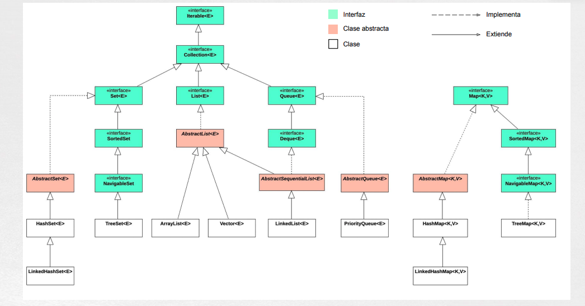

En la diapositiva tenemos el Diagrama de Clases, no esta completo, lo que pasa que añadir más interfaces o implementaciones la verdad es que lo hubiera enmarañado más que aclarado. Tenemos la jerarquía de interfases y clases que podemos encontrar en el paquete `java.util` como parte de las colecciones. Lo que está en *un tono verdoso son interfaces*, lo que está en *un tono salmón son clases abstractas* que no podemos instanciar y las *clases que si podemos utilizar las implementaciones existentes con un fondo blanco*. Las *líneas continuas denotan extensión entre interfaces o entre clases* y *las líneas punteadas denotan la implementación de una determinada interface*, es decir clases que implementan una determida interfaz.

Iremos visitando las diferentes interfaces, clases y clase concretas que tiene este este diagrama, lo iremos viendo poco a poco.

Podemos ver que hay dos grandes tipos están todas las que heredan de *Iterable* y posteriormente de *Collection* y luego tenemos las que heredan de *Map* **se diferencian fundamentalmente en que unas seran colecciones que puedan guardar elementos como tal *todos del mismo tipo* y la otra podrán guardar *pares de una clave asociada a un valor***.

## `Iterable<E>`

https://docs.oracle.com/javase/8/docs/api/java/lang/Iterable.html

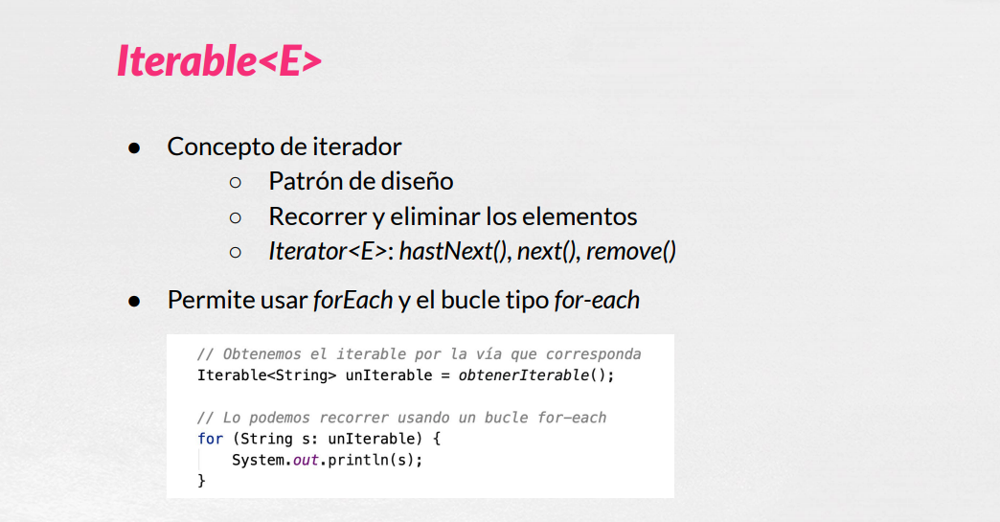

Comencemos por la raíz por **`Iterable<E>`** podemos ver que `Iterable` no remite al concepto de *iterador* *un iterador un patrón de diseño que nos permite recorrer una sucesión o colección de elementos*. 

En las primeras versiones de los iteradores lo que se permitía siempre era recorrer esa colección de elemento a partir de Java 8 se incorpora también la opción de eliminar siempre y cuando la colección subyacente lo permita, veremos que tendremos por ejemplo las colecciones que son no modificables que son inmutables y qué si tratáramos de utilizar este método `remove` tendríamos una excepción.

El hecho de que se pueda heredar de `Iterable` es lo que permite que usemos los métodos *forEach* o el bucle *forEach* que tenemos en la diapositiva, podríamos tener por la vía que fuese un iterable y podríamos iterar o lo podríamos recorrer con este bucle que es bastante usual.

## :computer: Ejemplo de `Iterable<E>`

*`IterableApp`*

```java
package net.openwebinars.colecciones.iterable;

import java.util.Arrays;

/**
 *  Ejemplo de uso de la interfaz Iterable
 *  
 */
public class IterableApp {

   public static void main(String[] args) {

      // Obtenemos el iterable por la vía que corresponda
      Iterable<String> unIterable = obtenerIterable();

      // Lo podemos recorrer usando un bucle for-each
      for (String s: unIterable) {
         System.out.println(s);
      }
      
      System.out.println("");

      // También con el método forEach
      unIterable.forEach(System.out::println);

    }

    private static Iterable<String> obtenerIterable() {
       return Arrays.asList("Madrid", "Barcelona", "Sevilla");
    }
}
```

Aquí podemos ver un ejemplo de `Iterable` en el que un iterable como en el fondo es digamos que una interfaz raíz, la podríamos obtener por cualquier vía o como hemos podido comprobar en el diagrama de clases no se puede instanciar directamente, tendríamos que proporcionar nosotros una clase que lo implementará, lo cual no tendría mucho sentido, pero si es verdad **hay muchos contextos en los cuales en lugar de devolverse una colección concreta se nos devuelve un iterable** porque en el fondo lo único que se necesita es poder recorrer esta colección (Iterable) de la manera que sea conveniente a través del bucle estilo `for each` o incluso del método `forEach(...)`.

#### Ejecutar la Aplicación.

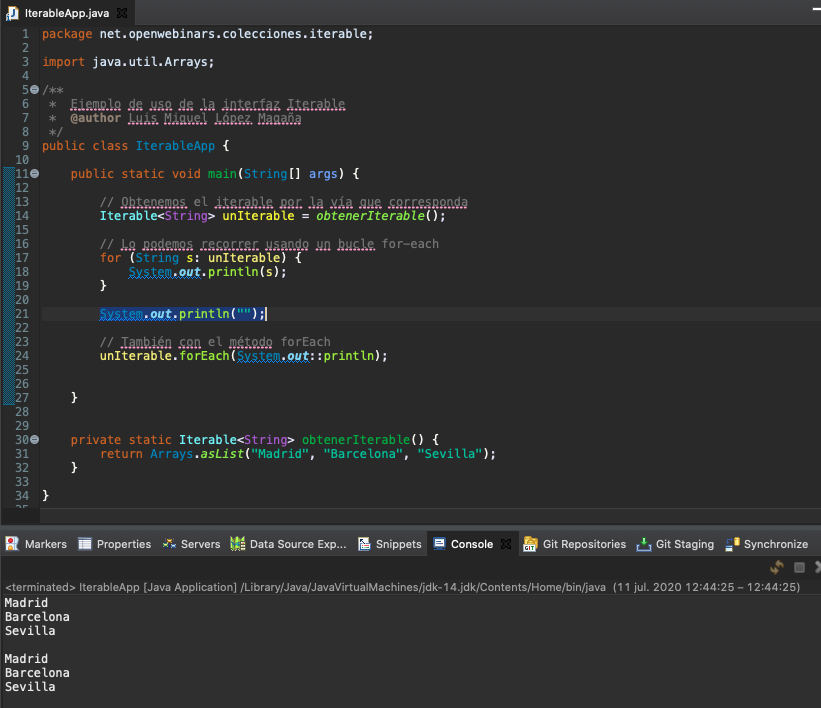

Estamos recorriendo dos veces un iterable con `for each` y con del método `forEach(...)`. El `Iterable` en este caso lo recuperamos con el método `obtenerIterable()` pero en otras aplicaciones se puede recuperar de la forma que sea. 

**Un ejemplo de uso de `Iterable` por ejemplo lo encontrarán aquellos que visiten los cursos de Spring en la parte de Spring Data JPA, por ejemplo los interfaces más sencillos del repositorio de Spring Data JPA por ejemplo trabajan con iterable** y hasta que no llegamos a alguna implementación un poco más concreta no le vemos la aplicación a los `Iterable` tenemos la posibilidad en lugar de trabajar con iterable con otras colecciones. Un `Iterable` es cómodo en el sentido de que podemos recorrer los objetos sobre el.

## `Collection<E>`

https://docs.oracle.com/en/java/javase/11/docs/api/java.base/java/util/Collection.html

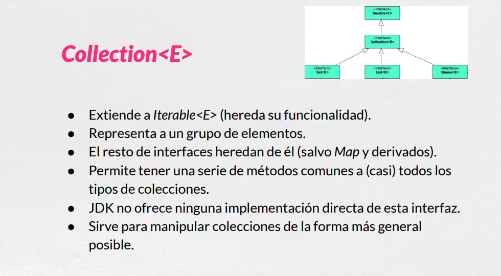

De `Iterable` heredamos la interfaz `Collection` que va a hacer el padre de tres de las colecciones(interfaces) con las cuales vamos a trabajar `Set<E>`, `List<E>` y `Queue<E>`.

`Collection` extiende `Iterable` heredando toda su funcionalidad con lo cual podríamos seguir recorriendo los elementos, también eliminarlos.

El resto de interfaces salvo `Map` heredan de `Collection` con lo cual nos da un conjunto de métodos comunes que son transversales a casi todas las colecciones.

Y si bien es cierto que no tenemos ninguna implementación directa de la interfaz `Collection` la podemos utilizar en ocaciones como el tipo de dato que puede recibir un método a la hlora de hacer determinadas operaciones.

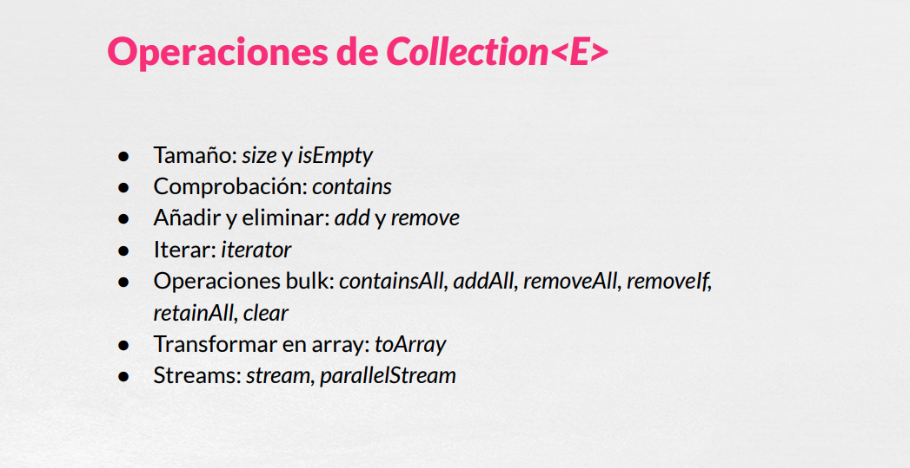

Las  operaciones que nos da de paraguas para el resto de colecciones serían:

* Tamaño: `size` y `isEmpty` Verificar el tamaño, si está vacío.
* Comprobación: `contains` si se contiene un elemento.
* Añadir y eliminar elementos: `add` y `remove`
* Iterar: `iterator` Iterar sobre el.
* Operaciones sobre un conjunto de datos.
   * Ver si se contienen los datos de otra colección: `containsAll`
   * Añadir un conjunto de datos: `addAll`
   * Eliminar un conjunto de datos: `removeAll`
   * Elimininar si se cumple una determinada colección: `removeif`
   * Comprobar si una colección tiene un conjunto de otra: `retainAll`
   * Limpiar por completo la colección: `clean`
* Transformarlo en un array: `toArray`
* Transformación en Streams: `stream`, `parallelStream`

Pueden consultar la documentación de la interfaz `Collection` para ver una descripción más concreta de todos estos métodos.

https://docs.oracle.com/en/java/javase/11/docs/api/java.base/java/util/Collection.html

## `Set<E>`

https://docs.oracle.com/en/java/javase/11/docs/api/java.base/java/util/Set.html

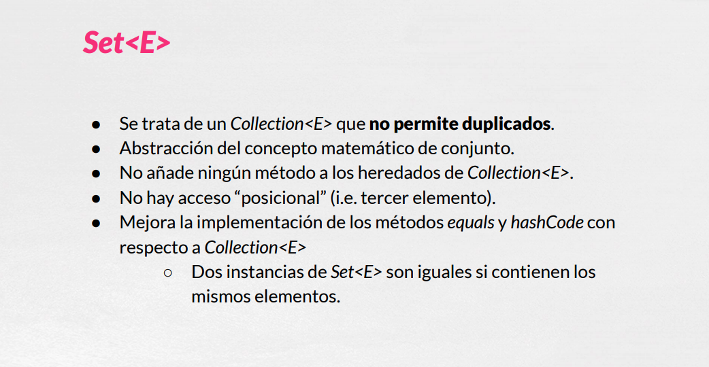

**`Set`** es un un tipo de colección muy concreto que **no permite elementos duplicados** es decir que si nosotros añadimos un elemento por segunda vez no va a suceder nada simplemente que no lo va a añadir, no se permite tener elemento repetidos, ya que es una abstracción del concepto matemático de conjunto, otra segunda cosa que llama la atención es que **no permite el acceso posicionales**, es decir no podemos acceder al tercer elemento de este conjunto, porque de alguna manera **representa una especie de saco** donde estan todos esos elementos, es verdad también hace una mejora con respecto a colecciones y es que mejora la implementación de los métodos `equals` y `hashcode` con respecto a `Collection<E>` y a la hora de comparar dos instancias son iguales si contienen los mismos elementos.

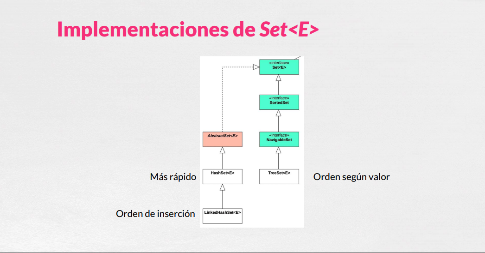

Vamos a ver que tenemos diferentes tipos que podemos utilizar con una serie de subinterfaces en las cuales no nos vamos a meter si no que ya ya nos iríamos a conocer las implementaciones concretas, que en el fondo son tres:

* `HashSet<E>` que de las tres implementaciones es la más rápida, no permite manejar nada con respecto al orden de los elementos.
* `LinkedHashSet<E>` sería una implementación que heredaría de `HashSet<E>`, es un poco más lenta pero tiene la ventaja que nos va a permitir recuperar los elementos de este Set en el orden de inserción.
* `TreeSet<E>` por último tendríamos `TreeSet` de las 3 implementaciones en la más lenta y que sí que nos podría aportar el orden de los elementos según su valor.

### `HashSet<E>`

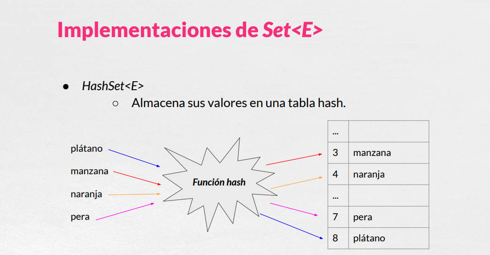

`HashSet` lo que hace es almacenar los valores de esta colección en una **tabla hash** qué es eso de una tabla hash, es una tabla que nos permite guardar elementos a través de una función hash que en teoría es una función que recoge el elemento que nosotros queremos insertar y que nos devuelve un valor aplicandole a a ese elemento a través de esta función hash, nos devuelve un valor que debería ser **univoco único**, es decir que no se podría repetir, esto que tiene sin entrar demasiado en abundar en el concepto de estas función hash del hashing, esto que nos proporciona, bueno pues nos proporciona que la mayoría de las operaciones, sobre todo la operaciones de acceso, son en un tiempo constante, hablaremos a lo largo de este taller un poco de eficiencia algorítmica, incluso haremos uso de algún tipo de notación para representarlos no nos meteremos nada excesivamente complejo, cuando decimos que la eficiencia sería por ejemplo de la búsqueda de un elemento en un tiempo constante, quiere decir que daría igual aproximadamente el tener una una colección de 10 elementos, que una de 10.000, que el tiempo de búsqueda sería aproximadamente el mismo,
es decir que no va a variar el tiempo de búsqueda con el número de elementos que contenga esa colección.

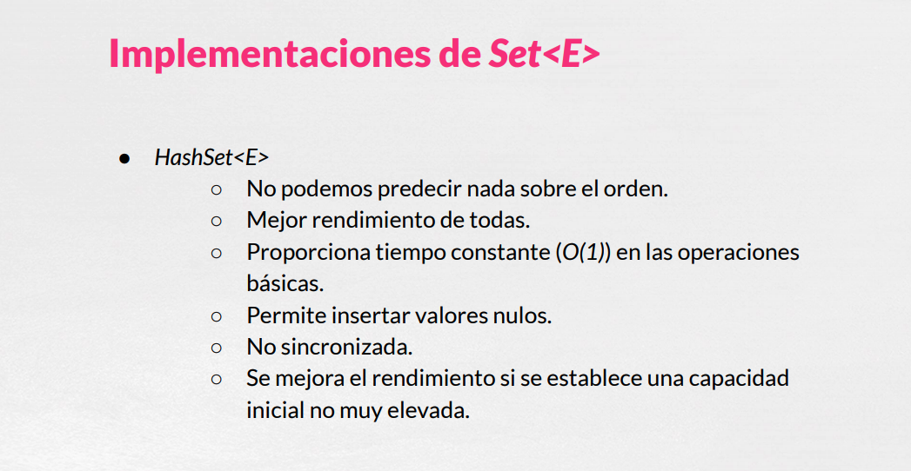

Lo que deciamos antes sobre los `HashSet` no podemos predecir nada sobre el orden de los elementos, es decir puede que los insertemos en un orden y que se nos devuelvan en un orden distinto una vez y otra vez y otra vez cada que lo quisiéramos recuperar, si es verdad que nos da el mejor rendimiento de todas las implementaciones de `Set` proporcionando un tiempo constante en las operaciones básicas, permite insertar valores nulos, como no se permiten valores repetidos lo podríamos insertar una sola vez, no es sincronizada es decir que no sería recomendable si la quisiéramos utilizar para hacer inserciones y consultas en un contexto múltihilo, a la hora de construirla se mejoraría mucho el rendimiento si establecemos una capacidad inicial lo más ajustada posible.

#### :computer: Ejemplo de `HashSet<E>`

*`HashSetApp`*

```java
package net.openwebinars.colecciones.set.a.hashset;

import java.util.*;

/**
 * Ejemplo de uso de la implementación HashSet
 * 
 */
public class HashSetApp {

   public static void main(String[] args) {

      // Crea un HashSet con capacidad inicial para 16 elementos
      // y un factor de carga de 0.75
      // El factor de carga es a partir de que porcentaje de relleno
      // el hashset amplía su tamaño
      Set<String> hashSet = new HashSet<>();

      // En la línea anterior hemos podido apreciar:
      // - El uso de genéricos
      // - El operador diamond <> para tener una sentencia menos "verbose"

      hashSet.add("Madrid");
      hashSet.add("Barcelona");
      // Los valores repetidos simplemente se descartan
      hashSet.add("Barcelona"); // Valor repetido
      hashSet.add("Sevilla");

      for (String s: hashSet) {
         System.out.println(s);
      }
        
      System.out.println("");
        
      // También con el método forEach
      hashSet.forEach(System.out::println);
   }
}
```

Aquí tenemos la implementación más sencilla de un `Set` que es por medio de un `HashSet<E>`, cuando nosotros consultamos en la documentación de `HashSet<E>` vemos que tenemos diferente constructores, el más sencillo de ellos el constructor al cual no le pasamos ninguna argumento `Set<String> hashSet = new HashSet<>();` y que nos crea un `Set` un `hashSet` con 16 elementos y un factor de carga de 0.75, el factor de carga lo que representa es una especie de porcentaje a partir del cual el `Set` va a ir creciendo conforme nosotros le añadamos elementos, el conjugar bien estos dos elementos como deciamos antes, nos va a permitir que la función de hashing que utiliza por dentro sea lo más concreta posible y por tanto que el rendimiento de nuestro `HashSet<E>` séa lo mejor.

En `Set<String> hashSet = new HashSet<>();` podemos apreciar el uso de genéricos es decir que hasta la versión 1.4 de Java lo que teníamos es que todas las colecciones lo que hacían era almacenar `Object` y como cualquier objeto, cualquier clase de Java hereda de `Object` podía almacenar cualquier cosa, sin embargo con el uso de genéricos le podemos decir que tipo de dato vamos a almacenar exactamente en la colección, se lo podemos indicar directamente, de manera que al ser esto un `Set<String>` no podremos guardar por ejemplo un número. Y por último decir también sobre esta sentencia `Set<String> hashSet = new HashSet<>();` que estamos haciendo uso del operador `Diamond` hasta la versión 1.6 de Java teniamos que volver a indicar el tipo `Set<String> hashSet = new HashSet<String>();`  para invocar al constructor concreto, sin embargo el operador Diamond lo que nos permite es que se hiciera el tipo a la hora de hacer la construcción coja el tipo de la referencia y la sentencia nos queda un poco menos **VERBOSA**.


Con el método `add` insertaremos algunos valores `Madrid`, `Barcelona` si insertamos de nuevo `Barcelona`  veremos como directamente se va a descartar insertaría `Sevilla`.

Y como `HashSet` que hereda de `Set` que implementa `Collection` que a la vez implementa `Iterable` podemos recurrir al `for Each` o al método `foreach` para iterar nuestro `hashSet`.

#### Ejecutar la Aplicación.


Podemos ver que aun que hemos insertado Barcelona dos veces no aparece solo una vez ya que `HashSet` directamente descarta los valores repetidos.

#### :computer: Ejemplo de `HashSet<E>` Variante new String

*`HashSetAppObjetosString`*

```java
package net.openwebinars.colecciones.set.a.hashset;

import java.util.*;

/**
 * Ejemplo de uso de la implementación HashSet
 *
 */
public class HashSetAppObjetosString {

    public static void main(String[] args) {

        // Crea un HashSet con capacidad inicial para 16 elementos
        // y un factor de carga de 0.75
        // El factor de carga es a partir de que porcentaje de relleno
        // el hashset amplía su tamaño
        Set<String> hashSet = new HashSet<>();

        // En la línea anterior hemos podido apreciar:
        // - El uso de genéricos
        // - El operador diamond <> para tener una sentencia menos "verbose"

        hashSet.add(new String("Madrid"));
        hashSet.add(new String("Barcelona"));
        // Los valores repetidos simplemente se descartan
        hashSet.add(new String("Barcelona")); // Valor repetido
        hashSet.add(new String("Sevilla"));

        for (String s: hashSet) {
            System.out.println(s);
        }
        
        System.out.println("");
        
        
        // También con el método forEach
        hashSet.forEach(System.out::println);

    }
}
```

#### Ejecutar la Aplicación.

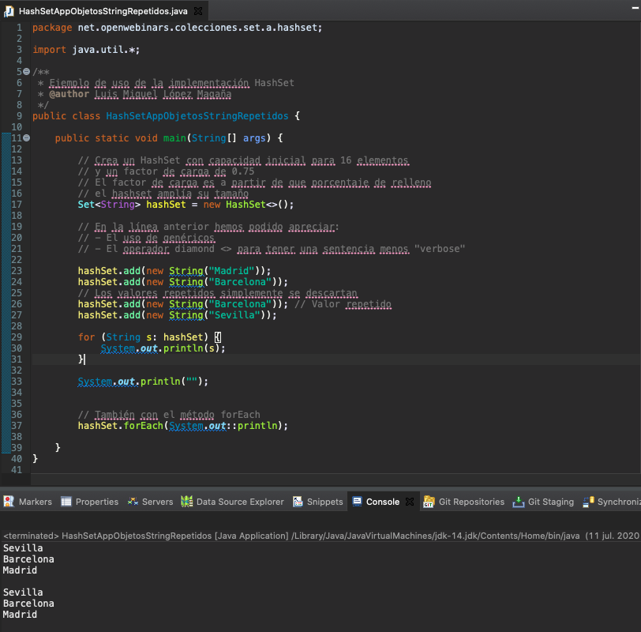

La Aplicación funciona exactamente igual.

#### :computer: Ejemplo de `HashSet<E>` Variante Objeto Ciudad

*`Ciudad`*

```java
package net.openwebinars.colecciones.set.a.hashset;

public class Ciudad {
	
	private String nombre;
	
	
	public Ciudad() {
		super();
	}

	public Ciudad(String nombre) {
		super();
		this.nombre = nombre;
	}


	public String getNombre() {
		return nombre;
	}


	public void setNombre(String nombre) {
		this.nombre = nombre;
	}	

}
```

*`HashSetAppObjetosCiudad`*

```java
package net.openwebinars.colecciones.set.a.hashset;

import java.util.*;

/**
 * Ejemplo de uso de la implementación HashSet
 * 
 */
public class HashSetAppObjetosCiudad {

    public static void main(String[] args) {

        Set<Ciudad> hashSet = new HashSet<>();
        
        Ciudad madrid = new Ciudad("Madrid");
        Ciudad barcelona = new Ciudad("Barcelona");
        Ciudad sevilla = new Ciudad("Sevilla");

        hashSet.add(madrid);
        hashSet.add(barcelona);
        // Los valores repetidos simplemente se descartan
        hashSet.add(barcelona); // Valor repetido
        hashSet.add(sevilla);

        for (Ciudad c: hashSet) {
            System.out.println(c.getNombre());
        }
        
        System.out.println("");
        
        hashSet.forEach(item->System.out.println(item.getNombre()));
    }
}
```

Esta variante consiste en ya no usar Objetos String, hemos creado el JavaBean `Ciudad` y hemos creado objetos de este tipo y después los hemos añadido al `HashSet` usando el método `add`.

#### Ejecutar la Aplicación.

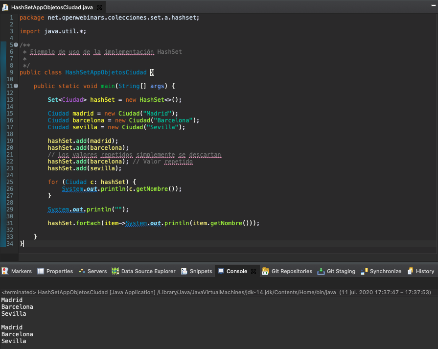

También nos excluye aquellos objetos repetidos, hasta aquí es el comportamiento que se esperaba.

#### :computer: Ejemplo de `HashSet<E>` Variante new Ciudad

*`HashSetAppObjetosCiudadNew`*

```java
package net.openwebinars.colecciones.set.a.hashset;

import java.util.*;

/**
 * Ejemplo de uso de la implementación HashSet con new Ciudad(
 * 
 */
public class HashSetAppObjetosCiudadNew {

    public static void main(String[] args) {

        Set<Ciudad> hashSet = new HashSet<>();
        
        hashSet.add(new Ciudad("Madrid"));
        hashSet.add(new Ciudad("Barcelona"));
        // Los valores repetidos simplemente se descartan
        hashSet.add(new Ciudad("Barcelona")); // Valor repetido
        hashSet.add(new Ciudad("Sevilla"));

        for (Ciudad c: hashSet) {
            System.out.println(c.getNombre());
        }
        
        System.out.println("");
        
        hashSet.forEach(item->System.out.println(item.getNombre()));
    }
}
```

Esta variante consiste en ya no creado objetos de este tipo Ciudad sino que directamente los creamos dentro del método `add`, pensaríamos que lo único que hemos logrado con esto es ahorrarnos las variables.

#### Ejecutar la Aplicación.

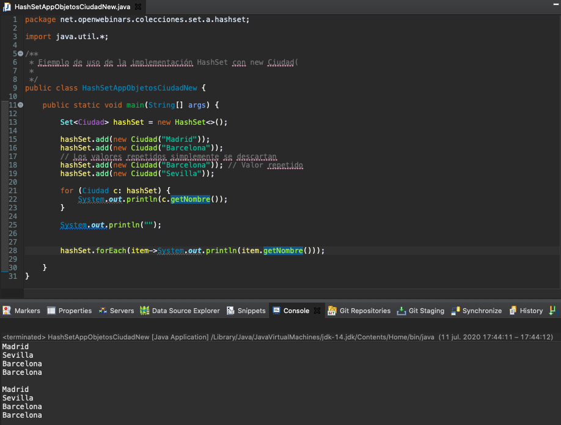

Pero si observamos el resultado vemos que aquí si que nos inserta los dos objetos con nombre de "Barcelona", **¿Qué ha pasado aquí?**.

#### :computer: Ejemplo de Aplicación `HashSet<E>`

Finalmente vamos a ver un ejemplo de Aplicación de `HashSet<E>`. 

Como ejemplo de aplicación podríamos pensar en la eliminación de elementos duplicados por ejemplo de otra colección. `HashSet` tiene un constructor que nos permite construir un `Set` a partir de otra colección, cualquiera que herede de `Collection` y si por ejemplo quisieramos buscar en un parrafo las palabras que sean únicas, es decir ir descartando las repetidas lo podríamos hacer de la siguiente manera.

*`HashSetAppAplicacion`*

```java
package net.openwebinars.colecciones.set.a.hashset;

import java.util.*;

/**
 * Ejemplo de uso de la implementación HashSet
 * @author Luis Miguel López Magaña
 */
public class HashSetAppAplicacion {

    public static void main(String[] args) {

        // EJEMPLO DE APLICACIÓN: eliminación de duplicados en otra colección
        // Crea un HashSet a partir de otra colección
        // eliminando los duplicados que contenga
        Collection<String> palabrasDelQuijote = palabrasQuijote();
        Set<String> quijoteHashSet = new HashSet<>(palabrasDelQuijote);

        // Comparación de número de elementos
        System.out.println("Total de palabras en el 1º párrafo: " + palabrasDelQuijote.size());
        System.out.println("Palabras diferentes en el 1º párrafo: " + quijoteHashSet.size());
        
        System.out.println("");
        
        // Se puede comprobar si contiene algún elemento
        if (quijoteHashSet.contains("hidalgo"))
            System.out.println("Contiene la palabra hidalgo");
        else
            System.out.println("No contiene la palabra hidalgo");
        
        System.out.println("");

        // Imprimir todos los elementos del hashset
        quijoteHashSet.forEach(System.out::println);

        /*
            Aunque todavía no lo hemos trabajado, una de las colecciones que más usarás a
            lo largo de tu vida como programador es ArrayList<E>. HashSet se le parece
            en bastantes funcionalidades, y ofrece mejor rendimiento. Por tanto:

            - Si no queremos manejar repetidos
            - No importa el orden (de valor o inserción)

            Podemos usar HashSet como implementación.

            Un ejemplo lo podemos encontrar al usar JPA/Hibernate en el manejo de
            asociaciones @OneToMany (uno-a-muchos).
            
         */

    }

    public static Collection<String> palabrasQuijote() {
        String quijote = "En un lugar de la Mancha, de cuyo nombre no quiero acordarme, no ha mucho tiempo que vivía un hidalgo de los de lanza en astillero, adarga antigua, rocín flaco y galgo corredor. Una olla de algo más vaca que carnero, salpicón las más noches, duelos y quebrantos los sábados, lantejas los viernes, algún palomino de añadidura los domingos, consumían las tres partes de su hacienda. El resto della concluían sayo de velarte, calzas de velludo para las fiestas, con sus pantuflos de lo mesmo, y los días de entresemana se honraba con su vellorí de lo más fino. Tenía en su casa una ama que pasaba de los cuarenta, y una sobrina que no llegaba a los veinte, y un mozo de campo y plaza, que así ensillaba el rocín como tomaba la podadera. Frisaba la edad de nuestro hidalgo con los cincuenta años; era de complexión recia, seco de carnes, enjuto de rostro, gran madrugador y amigo de la caza. Quieren decir que tenía el sobrenombre de Quijada, o Quesada, que en esto hay alguna diferencia en los autores que deste caso escriben; aunque por conjeturas verosímiles se deja entender que se llamaba Quijana. Pero esto importa poco a nuestro cuento: basta que en la narración dél no se salga un punto de la verdad.";
        quijote = quijote.toLowerCase().replace(".", "").replace(",", "");
        return Arrays.asList(quijote.split(" "));
    }
}
```

Lo primero que hemos hecho es obtener todas las palabras del Quijote, bueno para este ejemplo solo lo haremos del primer parrafo, eso se obiene con el método `palabrasQuijote()`, se define todo el parrafo en una cadena de carácteres, la cual la pasamos a minúscula por simplificar, se remplazan los puntos y las comas por espacios en blanco, después Spliteamos la cadena de caracteres separandolas por los espacios en blanco para obtener una colección de Strings `Collection<String>`. 

:confused: ¿Como `return Arrays.asList(quijote.split(" "));` genera un `Collection<String>` ?

Si construimos un `HashSet` a partir de esta colección lo que vamos a tener es que se van a descartar todos los elementos repetidos esto lo logramos con:

```java
// EJEMPLO DE APLICACIÓN: eliminación de duplicados en otra colección
// Crea un HashSet a partir de otra colección
// eliminando los duplicados que contenga
Collection<String> palabrasDelQuijote = palabrasQuijote();
Set<String> quijoteHashSet = new HashSet<>(palabrasDelQuijote);
```

Es como si construyeramos el `HashSet` vacío, iteramos la colección e insertaramos cada elemento en el `HashSet`, al insertar algún valor repetido se descartaría como vimos en los ejemplos anteriores. Aquí al crear el `HashSet` a partir de una colección existente también se van a descartar las palabras repetidas, cosa que comprobaremos al ejecutar la aplicación.

Vamos a implimir el tamaño de la `Collection` y del `HashSet` para ver la diferencia que existe entre uno y el otro usando el el método `size()` que es el mismo para ambas colecciones.

```java
// Comparación de número de elementos
System.out.println("Total de palabras en el 1º párrafo: " + palabrasDelQuijote.size());
System.out.println("Palabras diferentes en el 1º párrafo: " + quijoteHashSet.size());
```

También vamos a comprobar como al usar el método `contains` de nuestro `Set` contiene o no un elemento. 

```java
// Se puede comprobar si contiene algún elemento
if (quijoteHashSet.contains("hidalgo"))
   System.out.println("Contiene la palabra hidalgo");
else
   System.out.println("No contiene la palabra hidalgo");
```

Y finalmente vamos a ver como podemos iterar sobre todas las palabras y ver como se han descartado todas las palabras repetidas. 

```java
// Imprimir todos los elementos del hashset
quijoteHashSet.forEach(System.out::println);
```

#### Ejecutar la Aplicación.

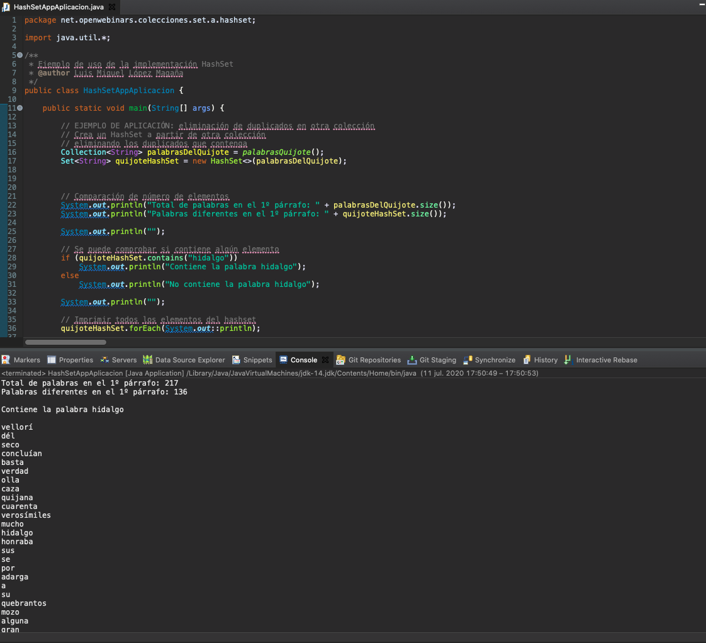

Vemos como el parrafo original tiene 217 palabras y que tenemos 136 palabras diferentes después de haber descartado todas las palabras repetidas, también vemos que en el `HashSet` si que se contiene la palabra `hidalgo` y podemos ver también la lista de todas las palabras dentro del `HashSet`. 

Como podemos comprobar un `HashSet` es bastante adecuado cuando queremos trabajar con colecciones que quieran eliminar de alguna manera los repetidos y de las cuales no nos haga falta nada con respecto al orden de los elementos que no nos importe para nada. 

### `LinkedHashSet<E>`

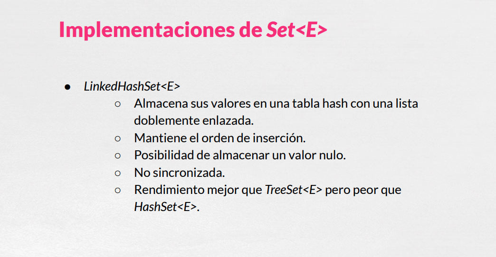

Podemos ver también la siguiente implementación qué es `LinkedHashSet<E>`con respecto al anterior lo que haría sería almacenar los valores en una tabla hash con una lista doblemente enlazada, lo cual nos va a permitir además de tener la opción anterior del hashing, el poder conservar el orden de inserción y podríamos recuperar los elementos en ese orden, por lo cual al menos si necesitáramos un cierto orden y mantener el orden de inserción lo podríamos hacer, el rendimiento es algo peor que `HashSet<E>` pero algo mejor que el de `TreeSet<E>`.

#### :computer: Ejemplo de Aplicación `LinkedHashSet<E>`

Con `LinkedHashSet` lo que tenemos es una especie de `HashSet` pero que nos va a permitir de alguna manera poder obtener los elementos en el orden en el cual los insertamos por si en algún momento nos interesara hacerlo. 

Para este ejemplo vamos a contar con una clase modelo `Persona` y nuestra clase `LinkedHashSetApp`

*`Persona`*

```java
package net.openwebinars.colecciones.set.modelo;


import java.time.LocalDate;
import java.util.Objects;

public class Persona implements Comparable<Persona> {

    private String nombre;
    private String apellidos;
    private LocalDate fechaNacimiento;

    public Persona() { }

    public Persona(String nombre, String apellidos, LocalDate fechaNacimiento) {
        this.nombre = nombre;
        this.apellidos = apellidos;
        this.fechaNacimiento = fechaNacimiento;
    }

    public String getNombre() {
        return nombre;
    }

    public void setNombre(String nombre) {
        this.nombre = nombre;
    }

    public String getApellidos() {
        return apellidos;
    }

    public void setApellidos(String apellidos) {
        this.apellidos = apellidos;
    }

    public LocalDate getFechaNacimiento() {
        return fechaNacimiento;
    }

    public void setFechaNacimiento(LocalDate fechaNacimiento) {
        this.fechaNacimiento = fechaNacimiento;
    }

    @Override
    public boolean equals(Object o) {
        if (this == o) return true;
        if (o == null || getClass() != o.getClass()) return false;
        Persona persona = (Persona) o;
        return Objects.equals(nombre, persona.nombre) &&
                Objects.equals(apellidos, persona.apellidos) &&
                Objects.equals(fechaNacimiento, persona.fechaNacimiento);
    }

    @Override
    public int hashCode() {
        return Objects.hash(nombre, apellidos, fechaNacimiento);
    }


    @Override
    public String toString() {
        return "Persona{" +
                "nombre='" + nombre + '\'' +
                ", apellidos='" + apellidos + '\'' +
                ", fechaNacimiento=" + fechaNacimiento +
                '}';
    }

    // La forma de ordenar será por el orden alfabético de los apellidos
    @Override
    public int compareTo(Persona o) {
        return apellidos.compareTo(o.apellidos);
    }
}
```

Nuestra clase modela `Persona` tiene tres atributos `nombre`, `apellidos` y `fechaNacimiento`, cuenta con el contructor por defecto y otro con los tres atributos, contamos con los métodos getters y setters, y con los métodos `equals`, `hashCode`, `toString` e implementa la interface  `compareTo` para después poder comprobar el uso con `TreeSet`.


*`LinkedHashSetApp`*

```java
package net.openwebinars.colecciones.set.b.linkedhashset;

import net.openwebinars.colecciones.set.modelo.Persona;

import java.time.LocalDate;
import java.util.Arrays;
import java.util.LinkedHashSet;
import java.util.Set;

public class LinkedHashSetApp {

    public static void main(String[] args) {

        // Los constructores de LinkedHashSet se comportan como los de HashSet

        // Instancia un nuevo LinkedHashSet con las mismas características
        // que el constructor de HashSet
        Set<Persona> linkedHashSet = new LinkedHashSet<>();

        // Insertamos diferentes elementos
        linkedHashSet.add(new Persona("José", "García García", LocalDate.of(1990,1,1)));
        linkedHashSet.add(new Persona("Ana", "López Martínez", LocalDate.of(2000, 8, 24)));
        linkedHashSet.add(new Persona("Javier", "Castro Méndez", LocalDate.of(1970, 6,30)));
        linkedHashSet.add(new Persona("María", "Laínez Muñoz", LocalDate.of(1980, 3,3)));

        // Independientemente del orden que tenga implementada una determinada
        // clase, LinkedHashSet mantiene solo el orden de inserción
        System.out.println("Elementos de la colección");
        for (Persona p : linkedHashSet) {
            System.out.println(p);
        }

        // Podemos eliminar un determinado elemento
        Persona p = new Persona("Javier", "Castro Méndez", LocalDate.of(1970, 6,30));
        linkedHashSet.remove(p);
        // Y añadir uno nuevo
        linkedHashSet.add(new Persona("Alicia", "Antúnez Marín", LocalDate.of(2010, 10,10)));
        // Al iterar de nuevo la colección, se sigue manteniendo el orden de inserción
        System.out.println("\n\nElementos de la colección después de unas modificaciones");
        linkedHashSet.forEach(System.out::println);

        // Conversión de un Set en un array
        // Esta funcionalidad es común en el interfaz Set, y la mostramos en esta implementación
        Persona[] personas = new Persona[linkedHashSet.size()];
        linkedHashSet.toArray(personas);
        System.out.println("\n\nLinkedHashSet transformado en un array: " + Arrays.toString(personas));
    }
}
```

En nuestra clase `LinkedHashSetApp` lo primero que hacemos es instanciarlo.

```java
// Instancia un nuevo LinkedHashSet con las mismas características
// que el constructor de HashSet
Set<Persona> linkedHashSet = new LinkedHashSet<>();
```

El constructor sigue las mismas características de `HashSet`, podemos ver cómo podemos insertar una serie de personas usando nuestro modelo `Persona`.

```java
// Insertamos diferentes elementos
linkedHashSet.add(new Persona("José", "García García", LocalDate.of(1990,1,1)));
linkedHashSet.add(new Persona("Ana", "López Martínez", LocalDate.of(2000, 8, 24)));
linkedHashSet.add(new Persona("Javier", "Castro Méndez", LocalDate.of(1970, 6,30)));
linkedHashSet.add(new Persona("María", "Laínez Muñoz", LocalDate.of(1980, 3,3)));
```

Independientemente de que persona tiene un orden natural definido a través de `compareTo` vamos a poder comprobar como los elementos de la colección los podemos tener en el orden de inserción.

```java
// Independientemente del orden que tenga implementada una determinada
// clase, LinkedHashSet mantiene solo el orden de inserción
System.out.println("Elementos de la colección");
for (Persona p : linkedHashSet) {
   System.out.println(p);
}
```

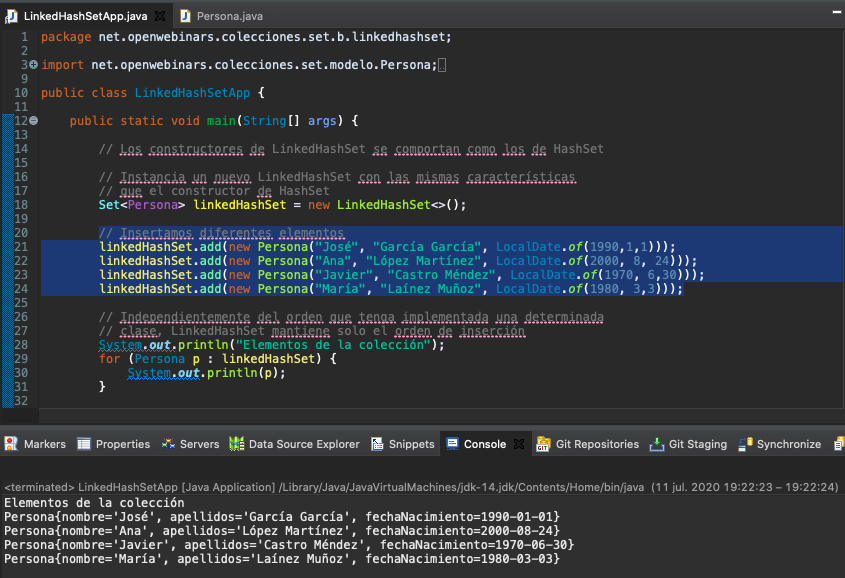

Podemos comprobar como están 'José', 'Ana', 'Javier' y 'María'  en el orden de inserción.

Si eliminamos algún elemento mediante el método `remove`.

```java
// Podemos eliminar un determinado elemento
Persona p = new Persona("Javier", "Castro Méndez", LocalDate.of(1970, 6,30));
linkedHashSet.remove(p);
```

Y añadimos uno nuevo, no se reutiliza ese hueco, sino que se va a seguir manteniendo el orden de inserción.

```java
// Y añadir uno nuevo
linkedHashSet.add(new Persona("Alicia", "Antúnez Marín", LocalDate.of(2010, 10,10)));
```


De hecho hemos eliminado a Javier, hemos añadido Alicia y por tanto Javier que era el tercero desaparece y Alicia se incorpora en el último lugar, va a estar al final de todo porque se sigue manteniendo el orden de inserción.

Otra de las funcionalidades, también la tiene `HashSet`, pero la vemos ahora, vamos la tienen todas las implementaciones de `Set` es la posibilidad de transformar el `Set` en un array, por si alguna vez nos conviene transformarlo directamente en un array mediante el método `toArray` el código lo tenemos aquí:

```java
// Conversión de un Set en un array
// Esta funcionalidad es común en el interfaz Set, y la mostramos en esta implementación
Persona[] personas = new Persona[linkedHashSet.size()];
linkedHashSet.toArray(personas);
System.out.println("\n\nLinkedHashSet transformado en un array: " + Arrays.toString(personas));
```

Tendríamos primero que instanciar el array dándole el tamaño correspondiente a través del tamaño del `linkedHashSet` y lo podríamos transformar directamente en un array de tipo `Persona`.

```sh
LinkedHashSet transformado en un array: [Persona{nombre='José', apellidos='García García', fechaNacimiento=1990-01-01}, Persona{nombre='Ana', apellidos='López Martínez', fechaNacimiento=2000-08-24}, Persona{nombre='María', apellidos='Laínez Muñoz', fechaNacimiento=1980-03-03}, Persona{nombre='Alicia', apellidos='Antúnez Marín', fechaNacimiento=2010-10-10}]
```

#### Ejecutar la Aplicación.

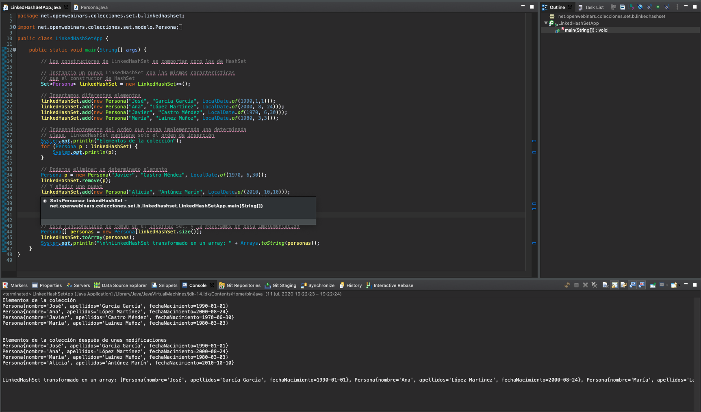

### `TreeSet<E>`

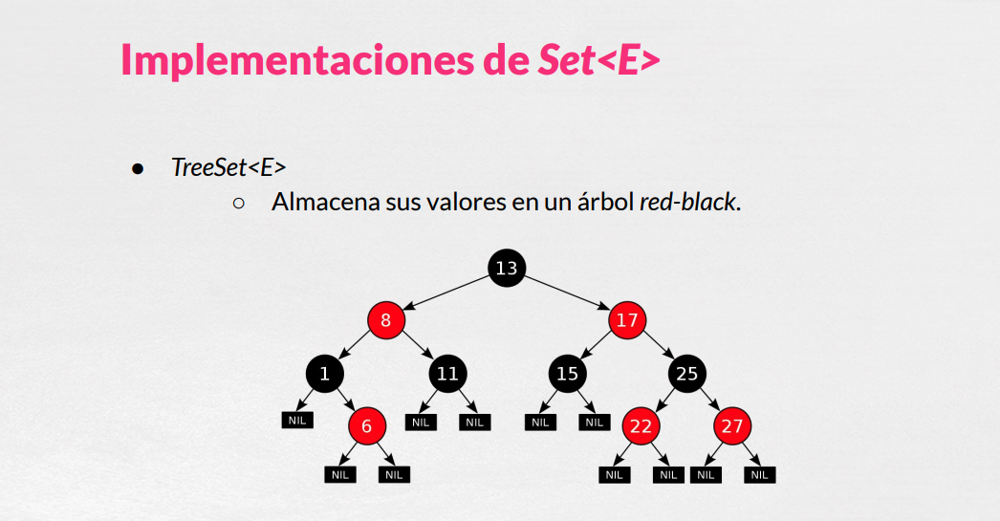

`TreeSet<E>` tiene como implementación interna para almacenar los valorés un árbol *red-black* un árbol rojo-negro, se trata de una estructura de datos especial que surgió en los años 70s, en un árbol binario de búsqueda y qué tiene una serie de características especiales en las cuales no vamos a entrar aquí, en las cuales los nodos se van coloreando de una determinada manera y que nos permite mantener los elementos en orden, con una eficiencia bastante razonable por lo cual si quisiéramos tener elementos no repetido y en el orden según el valor podríamos utilizar este `TreeSet<E>`

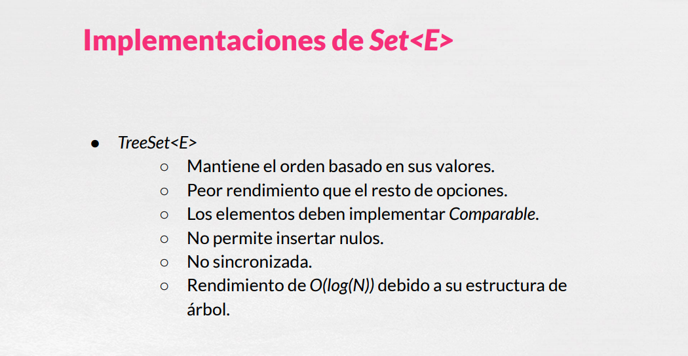

La cuestión sería como es natural que para que los elementos estuvieran ordenados según su orden natural, las clases que insertemos en el tipo de dato tiene que implementar `Comparable` y de esta manera podría mantener el orden, como decía esta notación `O(log(N))` qué se utiliza en algorítmica para medir debido a su estructura de árbol, las operaciones por ejemplo de búsqueda estarían acotada en NO logaritmo de N, es decir que no es directamente proporcional el rendimiento al al número de elementos sino que estaría un poco por debajo al ser este tipo de Logaritmo.

#### :computer: Ejemplo de Aplicación `TreeSet<E>`

Por último la implementación de `TreeSet<E>` la tenemos por aquí:

```java
package net.openwebinars.colecciones.set.c.treeset;

import java.time.LocalDate;
import java.util.Iterator;
import java.util.Set;
import java.util.TreeSet;

import net.openwebinars.colecciones.set.modelo.Persona;

/**
 *  Ejemplo de uso de la implementación TreeSet<E>
 * 
 */
public class TreeSetApp {

    public static void main(String[] args) {

        // Constructor sin parámetros de TreeSet
        // Genera una instancia con un árbol vacío
        // Los elementos a guardar deben implementar Comparable<E>
        Set<Persona> treeSet = new TreeSet<>();

        // Insertamos diferentes elementos
        treeSet.add(new Persona("José", "García García", LocalDate.of(1990,1,1)));
        treeSet.add(new Persona("Ana", "López Martínez", LocalDate.of(2000, 8, 24)));
        treeSet.add(new Persona("María", "Laínez Muñoz", LocalDate.of(1980, 3,3)));
        
        // Instanciamos un elemento para comprobar si está contenido o no
        Persona p = new Persona("José", "García García", LocalDate.of(1990,1,1));

        // Comprobamos si está contenido
        if (treeSet.contains(p))
            System.out.println("El elemento está contenido");
        else
            System.out.println("El elemento NO está contenido");
        
        // Si iteramos sobre los objetos del TreeSet, los obtenemos
        // en orden alfabético
        System.out.println("\nPersonas por orden alfabético");
        for (Persona persona : treeSet) {
            System.out.println(persona);
        }
        
        
        // Aunque son dos instancias diferentes, el elemento está contenido, puesto que
        // se cumple que o1.equals(o2)

        // OTRAS POSIBILIDADES DE RECORRIDO
        // Tenemos la posibilidad de recorrer el TreeSet ascendentemente (como antes)
        // o descendentemente, mediante descendingIterator

        // Algunos de estos métodos no son propios de Set<E>, sino de alguno de sus
        // subinterfaces SortedSet<E> y NavigableSet<E>.
        // Para usarlos, obtenemos una nueva referencia al objeto existente,
        // siendo dicha referencia de tipo TreeSet<E>.
        TreeSet<Persona> treeSetRef = (TreeSet<Persona>) treeSet;
        Iterator<Persona> descendente = treeSetRef.descendingIterator();

        System.out.println("\n\nPersonas por orden alfabético inverso");

        while(descendente.hasNext()) {
            System.out.println(descendente.next());
        }  

        // También tenemos algunos métodos para obtener elementos de los "extremos",
        // para extraerlos, o para obtener partes del TreeSet

        System.out.println("\n\nPrimer elemento: " + treeSetRef.first());
        System.out.println("Último elemento: " + treeSetRef.last());
        System.out.println("Elemento inmediatamente menor a otro: " + treeSetRef.lower(treeSetRef.last()));
        

        // OTRO EJEMPLO
        // Construir un segundo TreeSet, a partir del primero,
        // pero modificando el orden por defecto.
        // Vamos a ordenar por edad (fecha de nacimiento de más antigua a más moderna)
        // Usamos el constructor TreeSet(Comparator<? super E> comparator)
        // Utilizamos una expresión lambda para construir la instancia de Comparator
        TreeSet<Persona> treeSetPorEdad =
                new TreeSet<>((o1, o2) -> o1.getFechaNacimiento().compareTo(o2.getFechaNacimiento()));

        // Podemos añadir todos los elementos de otro Collection
        treeSetPorEdad.addAll(treeSet);

        // Si ahora iteramos, los obtenemos por edad
        System.out.println("\n\nPersonas ordenadas por edad");
        treeSetPorEdad.forEach(System.out::println);
        

        // Ejemplo de eliminación de un elemento
        treeSetPorEdad.remove(p);

        // Recorremos de nuevo, para comprobar
        System.out.println("\n\nEstado del TreeSet tras eliminar un elemento.");
        treeSetPorEdad.forEach(System.out::println); // El orden se mantiene

    }
}
```

`TreeSet<E>` tiene la ventaja de que si permite mantener los elementos en orden según él valor.

Hemos comprobado antes que la clase `Persona` que implementa `implements Comparable<Persona>`, lo que hace es ordenar por orden alfabético de los apellidos utilizando el método `compareTo` de la clase `String`.

```java
// La forma de ordenar será por el orden alfabético de los apellidos
@Override
public int compareTo(Persona o) {
   return apellidos.compareTo(o.apellidos);
}
```

Lo primero que hacemos es instaciár el `TreeSet`.

```java
// Constructor sin parámetros de TreeSet
// Genera una instancia con un árbol vacío
// Los elementos a guardar deben implementar Comparable<E>
Set<Persona> treeSet = new TreeSet<>();
```

Si nosotros añadimos al `TreeSet` una serie de personas con diferentes apellidos.

```java
// Insertamos diferentes elementos
treeSet.add(new Persona("José", "García García", LocalDate.of(1990,1,1)));
treeSet.add(new Persona("Ana", "López Martínez", LocalDate.of(2000, 8, 24)));
treeSet.add(new Persona("María", "Laínez Muñoz", LocalDate.of(1980, 3,3)));
```

Vamos a comprobar si un elemento está contenido o no.

```java
// Instanciamos un elemento para comprobar si está contenido o no
Persona p = new Persona("José", "García García", LocalDate.of(1990,1,1));

// Comprobamos si está contenido
if (treeSet.contains(p))
   System.out.println("El elemento está contenido");
else
   System.out.println("El elemento NO está contenido");
```

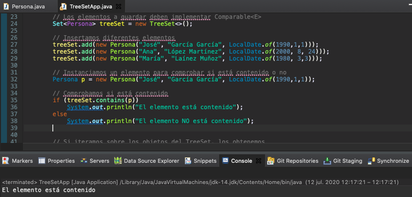

El elemento está contenido

Aquí lo interesante estaría en comprobar que a la hora de obtener estos elementos se han ordenado por apellidos.

```java
// Si iteramos sobre los objetos del TreeSet, los obtenemos
// en orden alfabético
System.out.println("\nPersonas por orden alfabético");
for (Persona persona : treeSet) {
   System.out.println(persona);
}
```

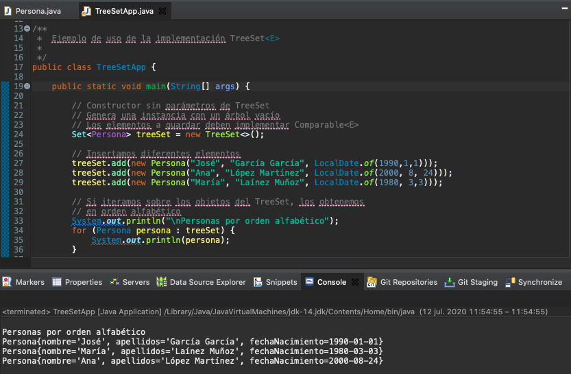

Si ejecutamoslo interesante es que se han ordenado primero García después Laínez y por último López al iterar directamente sobre el `TreeSet` que las devuelve por el orden natural.

Tenemos la posibilidad de recorrer el `TreeSet` de una manera ascendente o descendente mediante un método que nos devuelve un iterador especial que se llama `descendingIterator`  como hemos comprobado antes hemos instanciando el `TreeSet` con una referencia `Set`.

```java
Set<Persona> treeSet = new TreeSet<>();
```

Esto nos permite tener la implementación de `TreeSet` a través de los métodos de `Set` pero para hacer uso de el método `descendingIterator()` como es un método especifico de `TreeSet` debemos tener una referencia de este tipo.


```java
// Algunos de estos métodos no son propios de Set<E>, sino de alguno de sus
// subinterfaces SortedSet<E> y NavigableSet<E>.
// Para usarlos, obtenemos una nueva referencia al objeto existente,
// siendo dicha referencia de tipo TreeSet<E>.
TreeSet<Persona> treeSetRef = (TreeSet<Persona>) treeSet;
Iterator<Persona> descendente = treeSetRef.descendingIterator();
```

Ahora si iteramos por orden alfabetico inverso a través de este Iterador.

```java
System.out.println("\n\nPersonas por orden alfabético inverso");

while(descendente.hasNext()) {
   System.out.println(descendente.next());
}
```

Podemos ver como se nos devuelven los elementos en orden inverso sin tener que haber reordenado, simplemente lo que se ha hecho es recorrer el `TreeSet` a la inversa.

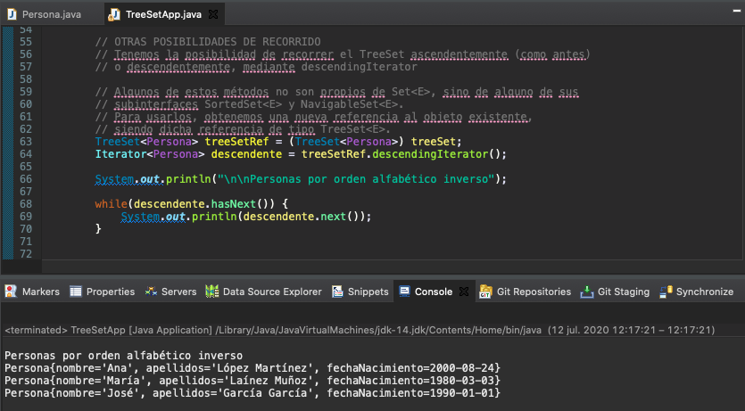

También se nos permite obtener algunos elementos concretos del `TreeSet` en función del orden como pueden ser el el primer elemento, el último elemento o ir jugando un elemento con otro para obtener el inmediatamente menor a otro, en este caso el penultimo elemento. 

```java
// También tenemos algunos métodos para obtener elementos de los "extremos",
// para extraerlos, o para obtener partes del TreeSet

System.out.println("\n\nPrimer elemento: " + treeSetRef.first());
System.out.println("Último elemento: " + treeSetRef.last());
System.out.println("Elemento inmediatamente menor a otro: " + treeSetRef.lower(treeSetRef.last()));       
```

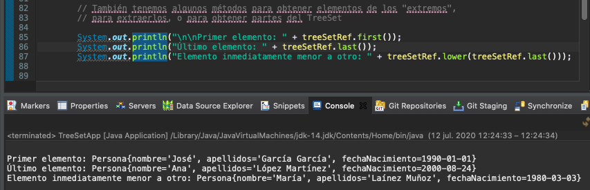

Otro ejemplo que podríamos tener de uso de `TreeSet` sería a través del constructor que tiene en el que se recibe un `comparator` y lo que nos permitiría de alguna manera sería ordenar el `TreeSet` mediante otro orden que no sea el orden natural por apellídos que se definio en la clase `Persona`. Aquí podríamos crear un `TreeSet` por edad proporcionando un `comparator` mediante una expresión lambda donde lo que vamos hacer es comparar para cada objeto `Persona` por su fecha de nacimiento y lo que podríamos hacer mediante el método `addAll` añadiriamos todas las personas del anterior `TreeSet` pero en este caso se ordenarían por fecha de nacimiento. 

```java
// OTRO EJEMPLO
// Construir un segundo TreeSet, a partir del primero,
// pero modificando el orden por defecto.
// Vamos a ordenar por edad (fecha de nacimiento de más antigua a más moderna)
// Usamos el constructor TreeSet(Comparator<? super E> comparator)
// Utilizamos una expresión lambda para construir la instancia de Comparator
TreeSet<Persona> treeSetPorEdad =
                new TreeSet<>((o1, o2) -> o1.getFechaNacimiento().compareTo(o2.getFechaNacimiento()));

// Podemos añadir todos los elementos de otro Collection
treeSetPorEdad.addAll(treeSet);

// Si ahora iteramos, los obtenemos por edad
System.out.println("\n\nPersonas ordenadas por edad");
treeSetPorEdad.forEach(System.out::println);   
```

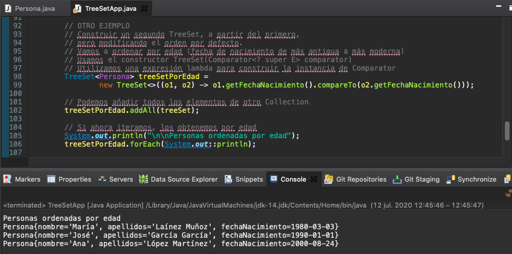

Esta ordenado desde una fecha más antigua a una más reciente, de más edad a menos edad.

Si eliminamos un elemento y recorremos el `TreeSet` lo sigue haciendo de la forma adecuada.

```java
// Ejemplo de eliminación de un elemento
treeSetPorEdad.remove(p);

// Recorremos de nuevo, para comprobar
System.out.println("\n\nEstado del TreeSet tras eliminar un elemento.");
treeSetPorEdad.forEach(System.out::println); // El orden se mantiene
```

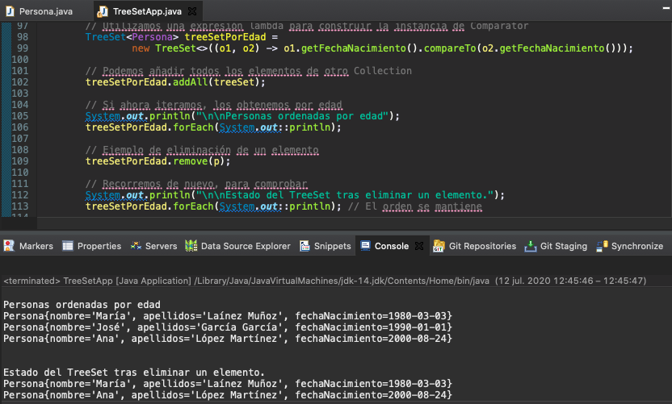

Al eliminar un elemento se sigue manteniendo el orden del árbol.

Con esto hemos visto todas las implementaciones de `Set` al menos las más usuales.

#### Ejecutar la Aplicación.

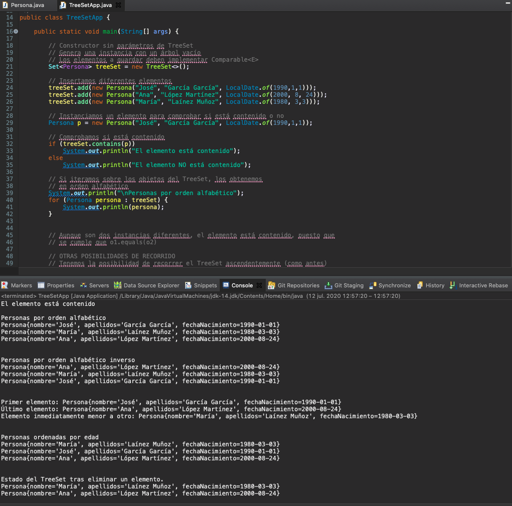

### `List<E>`

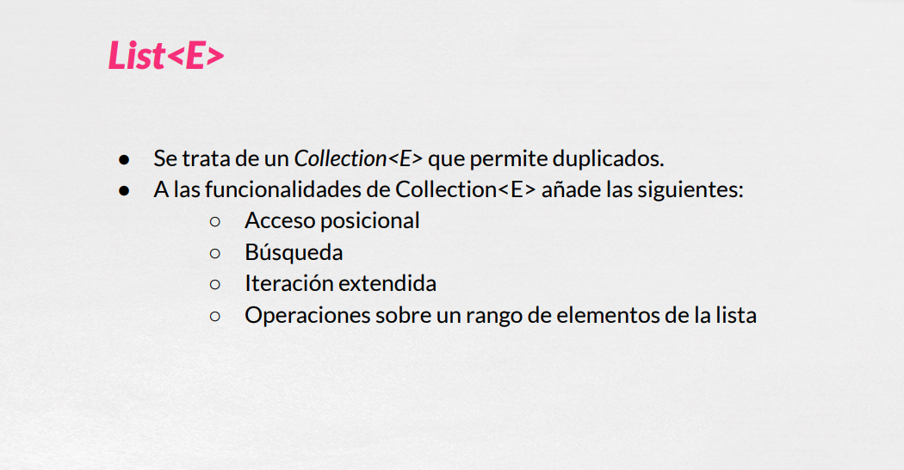

Pasamos a la siguiente interfaz, la interfaz `List<E>` será quizá la interfaz que más utilicéis se trata de un tipo de `Collection<E>` que si permite duplicados y que a las funcionalidades de `Collection<E>` añade el acceso posicional, la posibilidad de búsqueda, una iteración extendida y una operación sobre un rango de los elementos de la lista.

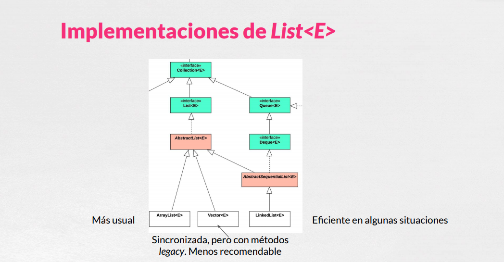

la implementación más usual, la que utilizaras en el 95% de los casos será `ArrayList<E>` después tendremos la implementación `Vector<E>` esta es bastante más antigua desde de la primera versión de Java esta presente, una implementación que si está sincronizada, es decir que sería adecuada en el caso de que quisiéramos utilizarlo en un contexto de concurrencia sin embargo, tiene varios métodos *legacy* y no es demasiado rápida y de hecho no suele ser muy recomendable si queremos tener una implementación sincronizada en una lista veremos que existen otras alternativas y por último tendríamos `LinkedList<E>` que si bien hereda `AbstractList<E>` al igual que `ArrayList<E>` también implementa la interfaz `Queue` y `deque` y va a ser eficiente solamente en algunas situaciones bastante bastante bastante concretas.

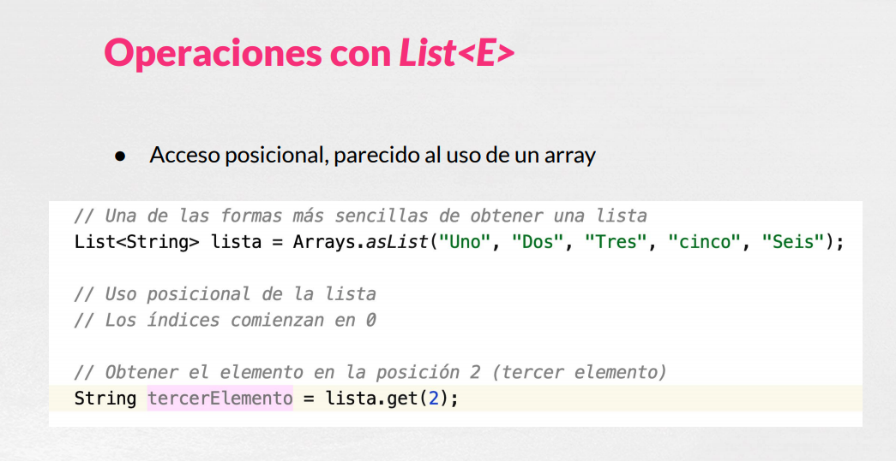

Las operaciones de acceso posicional son las mismas que tendría un array cualquiera, los índices también empiezan en 0 y nos permitiría acceder al tercer elemento por ejemplo de una lista en este caso sería el que está en la posición 2 y que no devolvería el elemento 3.


Si quisiéramos buscar por índice también podríamos y nos devolvería la posición en la que se encuentra un determinado elemento empezando por el principio o por el final, es decir la primera ocurrencia o la última.

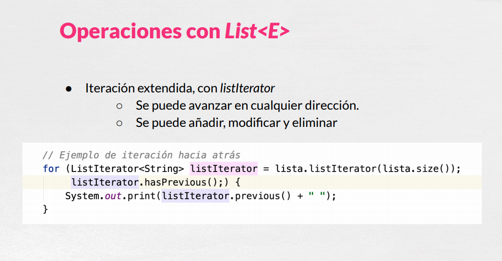

Hemos visto que tenemos una serie de elementos de iteración también extendida de manera que en este iterador además de poder avanzar hacia adelante como en un iterador cualquiera, podríamos avanzar hacia adelante, hacia atrás, podríamos añadir, modificar además de eliminar es bastante potente en ese sentido.

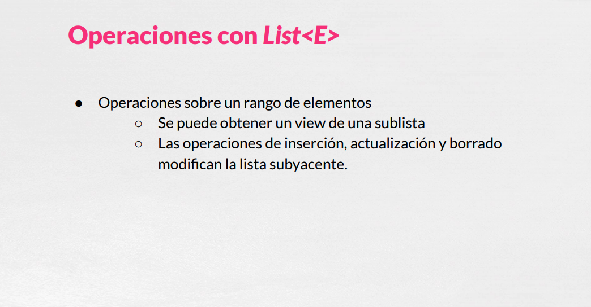

Podemos también obtener un *View* una especie de copia de la lista pero que realmente no es una copia porque se ofrece a través de la lista subyacente y si queremos tener ese subconjunto de la lista podemos trabajar con el con cualquier tipo de operación de inserción actualización y borrado de manera que la lista subyacente la lista general grande se vería modificada por por ese tipo de operación.

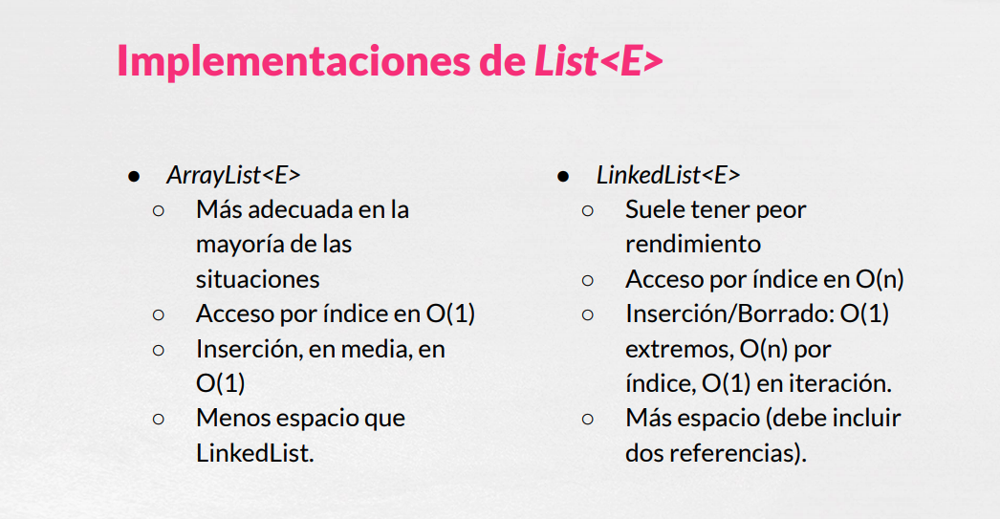

La implementación de `List` la podemos hacer a través de un `ArrayList` o un `LinkedList`. `ArrayList` es la más adecuada en la mayoría de las situaciones, el acceso por índice se hacen en tiempo constante, la inserción en media también sería en un tiempo constante, ocupa menos espacio en memoria que `LinkedList` sin embargo `LinkedList` suele tener un peor rendimiento, las distintas operaciones en el acceso depende mucho del tamaño del `LinkedList` y suele ocupar más espacio por eso su uso suele estar circunscrito a una serie de operaciones muy concretas.

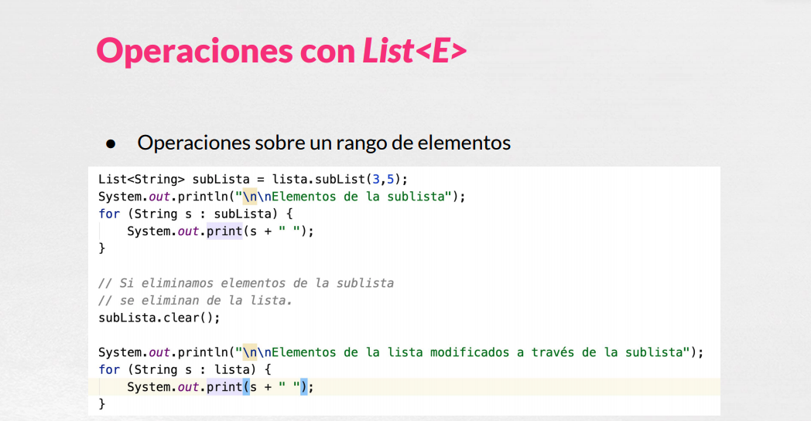

#### :computer: Ejemplo de Aplicación `List<E>`

Vamos a comprobar esto en un ejemplo con `List<E>`.

*`ListApp`*

```java
package net.openwebinars.colecciones.list.a.list;

import java.util.Arrays;
import java.util.List;

/**
 * Ejemplo de uso de los métodos de List<E>
 *
 *
 */
public class ListApp {

    public static void main(String[] args) {

        // Una de las formas más sencillas de obtener una lista
        List<String> lista = Arrays.asList("Uno", "Dos", "Tres", "cinco", "Seis");

        // Uso posicional de la lista
        // Los índices comienzan en 0

        // Obtener el elemento en la posición 2 (tercer elemento)
        String tercerElemento = lista.get(2);

        // Iterar sobre los elementos
        lista.forEach((x) -> System.out.print(x + " "));
    }
}
```

Aquí tenemos lo que hemos visto sería bastante sencillo, tenemos la opción de hacer un acceso posicional y seguimos teniendo la posibilidad de iterar sobre los distintos elementos también con el bucle `for Each` o mediante el método `.forEach` y una expresión lambda.

#### Ejecutar la Aplicación.

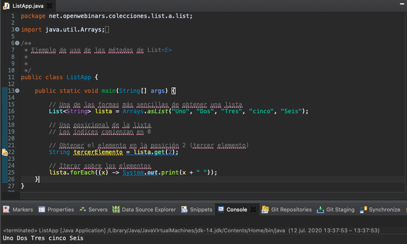

Si queremos ejecutar este ejemplo que es sencillo nos imprimiría `Uno Dos Tres cinco Seis` tal cual se los encuentra, en `tercerElemento` estaría `Tres`.

#### :computer: Ejemplo de Aplicación `ArrayList<E>`

La implementación de `ArrayList<E>` ya digo que no agrega nada a lo que define la interfaz `List<E>` es decir que seguimos teniendo la posibilidad de acceso posicional tanto en modo lectura como en escritura.

*`ArrayListApp`*

```java
package net.openwebinars.colecciones.list.b.arraylist;

import java.util.ArrayList;
import java.util.Arrays;
import java.util.List;
import java.util.ListIterator;

/**
 * Ejemplo de uso de los métodos de ArrayList<E> (con una referencia de tipo List<E>
 *
 * 
 */
public class ArrayListApp {

    public static void main(String[] args) {

        // Podemos construir un ArrayList a partir de otra colección
        List<String> lista = new ArrayList<>(Arrays.asList("Uno", "Dos", "Tres", "cinco", "Seis"));

        // USO POSICIONAL

        // Uso posicional de la lista
        // Los índices comienzan en 0

        // Obtener el elemento en la posición 2 (tercer elemento)
        String tercerElemento = lista.get(2);

        // Añadir un elemento en una posición determinada
        lista.add(3, "Cuatro");

        // Sustituir un elemento de una determinada posición
        lista.set(4, "Cinco");

        // Eliminar un elemento de una determinada posición
        // Devuelve el elemento eliminado
        String eliminado = lista.remove(5);

        // Posibilidad de contener repetidos
        lista.add("Seis");
        lista.add("Seis");

        // Iterar sobre los elementos mediante un forEach
        lista.forEach((x) -> System.out.print(x + " "));

        // FUNCIONES DE BÚSQUEDA

        // Búsqueda de la primera o la última ocurrencia de un elemento
        int posicion1 = lista.indexOf("Dos");
        int posicion2 = lista.lastIndexOf("Seis");

        System.out.println("\n\nLa primera ocurrencia de Dos está en la posición " + posicion1);
        System.out.println("La última ocurrencia de Seis está en la posición " + posicion2);

        // ITERACIÓN EXTENDIDA

        // Se realiza a través del uso de ListIterator
        // Este nos permite iterar en cualquier dirección, así como
        // añadir, modificar y eliminar

        // Ejemplo de iteración hacia atrás
        for (ListIterator<String> listIterator = lista.listIterator(lista.size());
             listIterator.hasPrevious();) {
            System.out.print(listIterator.previous() + " ");
        }

        // OPERACIONES SOBRE UN RANGO DE ELEMENTOS

        // La lista que se obtiene no es una nueva lista
        // sino una "vista" de la ya existente.
        // Las operaciones que modifiquen la sublista,
        // modificarán la lista subyacente.

        List<String> subLista = lista.subList(3,5);
        System.out.println("\n\nElementos de la sublista");
        for (String s : subLista) {
            System.out.print(s + " ");
        }

        // Si eliminamos elementos de la sublista
        // se eliminan de la lista.
        subLista.clear();

        System.out.println("\n\nElementos de la lista modificados a través de la sublista");
        for (String s : lista) {
            System.out.print(s + " ");
        }

    }
}
```

Podemos construir un `ArrayList` a partir de otra colección

```java
// Podemos construir un ArrayList a partir de otra colección
List<String> lista = new ArrayList<>(Arrays.asList("Uno", "Dos", "Tres", "cinco", "Seis"));
```

Como seguimos teniendo la posibilidad de acceso posicional tanto en modo lectura como en escritura podemos recuperar un elemento en determinada posición, siempre teniendo en cuenta que los índices comienzan en 0.

```java
// Obtener el elemento en la posición 2 (tercer elemento)
String tercerElemento = lista.get(2);
```

Podríamos decirle que insertará un elemento en una determinada posición recorriendo los demás elementos a la derecha, actualmente tenemos los elementos `"Uno", "Dos", "Tres", "cinco", "Seis"` con la siguiente sentencia:  

```java
// Añadir un elemento en una posición determinada
lista.add(3, "Cuatro");
```

Lograríamos insertar el elemento `Cuatro` en la posición 3 por lo que `cinco` se recorrería a la posición 4 y así con el resto de los elementos por lo que ahora tendríamos  `"Uno", "Dos", "Tres", "Cuatro", "cinco", "Seis"`.

Mediante el método `set` podemos sustituir un elemento que se encuentre en una posición por otro.

```java
// Sustituir un elemento de una determinada posición
lista.set(4, "Cinco");
```

Con la sentencia anterior estaríamos remplazando `cinco` por `Cinco` para seguir el estilo del resto de elementos. 

También podríamos eliminar un elemento que se encuentra en una determinada posición.

```java
// Eliminar un elemento de una determinada posición
// Devuelve el elemento eliminado
String eliminado = lista.remove(5);
```

Podemos contener elementos repetidos es decir que podríamos añadir dos veces `Seis`.

```java
// Posibilidad de contener repetidos
lista.add("Seis");
lista.add("Seis");
```

Y si iteramos.

```java
// Iterar sobre los elementos mediante un forEach
lista.forEach((x) -> System.out.print(x + " "));
```

Podemos comprobar como tenemos `Uno Dos Tres Cuatro Cinco Seis Seis `, `Cuatro` lo añadimos nosotros, `Cinco` lo sustituimos por su primer letra en mayúscula y `Seis` que lo insertamos dos veces.

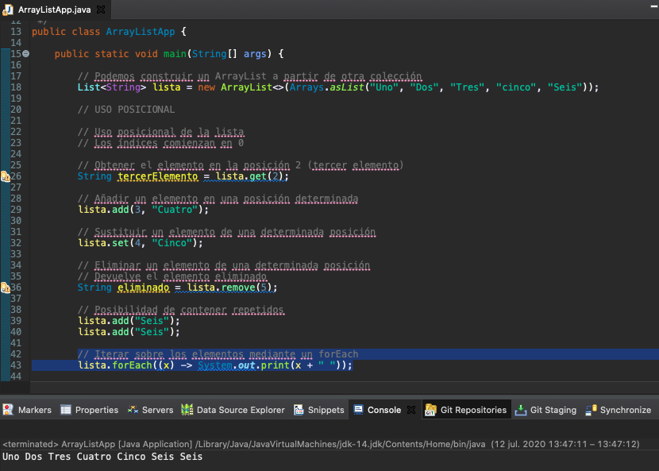

Tenemos determinadas funciones de búsqueda que nos permiten obtener la posición, ya que tenemos acceso a posicionar, la posición de la primera o última ocurrencia de un determinado elemento.

```java
// Búsqueda de la primera o la última ocurrencia de un elemento
int posicion1 = lista.indexOf("Dos");
int posicion2 = lista.lastIndexOf("Seis");

System.out.println("\n\nLa primera ocurrencia de Dos está en la posición " + posicion1);
System.out.println("La última ocurrencia de Seis está en la posición " + posicion2);
```

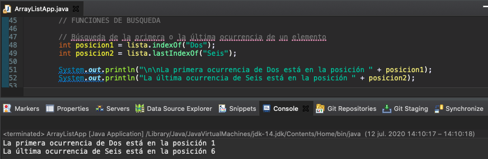

Por ejemplo la primera ocurrencia de `Dos` está en la posición 1, a sabiendas que se empieza a contar en 0, la última ocurrencia de `Seis` que estaba repetido está en la posición 6, es el séptimo elemento de la colección.

Hemos hablado también de que tenemos iteraciones extendida a través de `ListIterator` en el siguiente código:

```java
// ITERACIÓN EXTENDIDA

// Se realiza a través del uso de ListIterator
// Este nos permite iterar en cualquier dirección, así como
// añadir, modificar y eliminar

// Ejemplo de iteración hacia atrás
for (ListIterator<String> listIterator = lista.listIterator(lista.size());
   listIterator.hasPrevious();) {
   System.out.print(listIterator.previous() + " ");
}
```

Hacemos una iteración de atrás hacia adelante sobre este `ArrayList` mediante un `ListIterator`, `listIterator()` es un método que tiene el propio el propio `ArrayList` y qué de esta manera nos permitiría obtener el iterador que comenzaría en la posición que en este caso estamos marcando con `lista.size()` es decir que comenzaría en la posición 7 aquí comenzaría cómo podríamos comprobar a la derecha del último elemento `lista.size()` devolvería 7, lo colocaría en esta posición he iria iterando a través del ArrayList mientras haya un elemento anterior, es decir que cuando llegue al primer elemento, como no habrá un elemento anterior pararía esa iteración, de esta manera iterando hacia atrás podríamos tener los elementos cómo podemos ver aquí `Seis Seis Cinco Cuatro Tres Dos Uno`

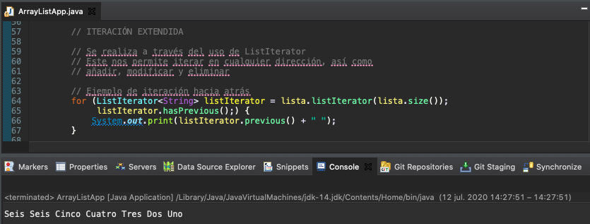


Por último decíamos que teníamos las operaciones sobre un rango de elementos:

```java
// OPERACIONES SOBRE UN RANGO DE ELEMENTOS

// La lista que se obtiene no es una nueva lista
// sino una "vista" de la ya existente.
// Las operaciones que modifiquen la sublista,
// modificarán la lista subyacente.

List<String> subLista = lista.subList(3,5);
System.out.println("\n\nElementos de la sublista");
for (String s : subLista) {
   System.out.print(s + " ");
}
```

Podríamos obtenerlos desde la posición 3 a las 5 de la lista con lo cual nos devolvería los elementos `Cuatro Cinco`.


Y si limpiamos la sublista y volvemos a imprimir la lista subyacente.

```java
// Si eliminamos elementos de la sublista
// se eliminan de la lista.
subLista.clear();

System.out.println("\n\nElementos de la lista modificados a través de la sublista");
for (String s : lista) {
   System.out.print(s + " ");
}
```

Vemos que la lista original se ha visto modificada a través de la sublista puesto que `Cuatro Cinco` ya no aparecerían, solo aparecen `Uno Dos Tres Seis Seis`.

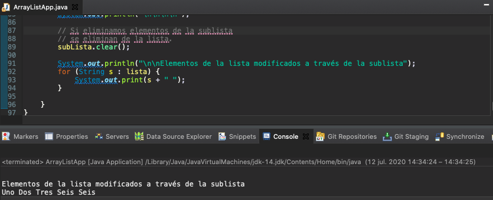

Todo esto como ejemplo de uso de `ArrayList<E>`.

#### Ejecutar la Aplicación.

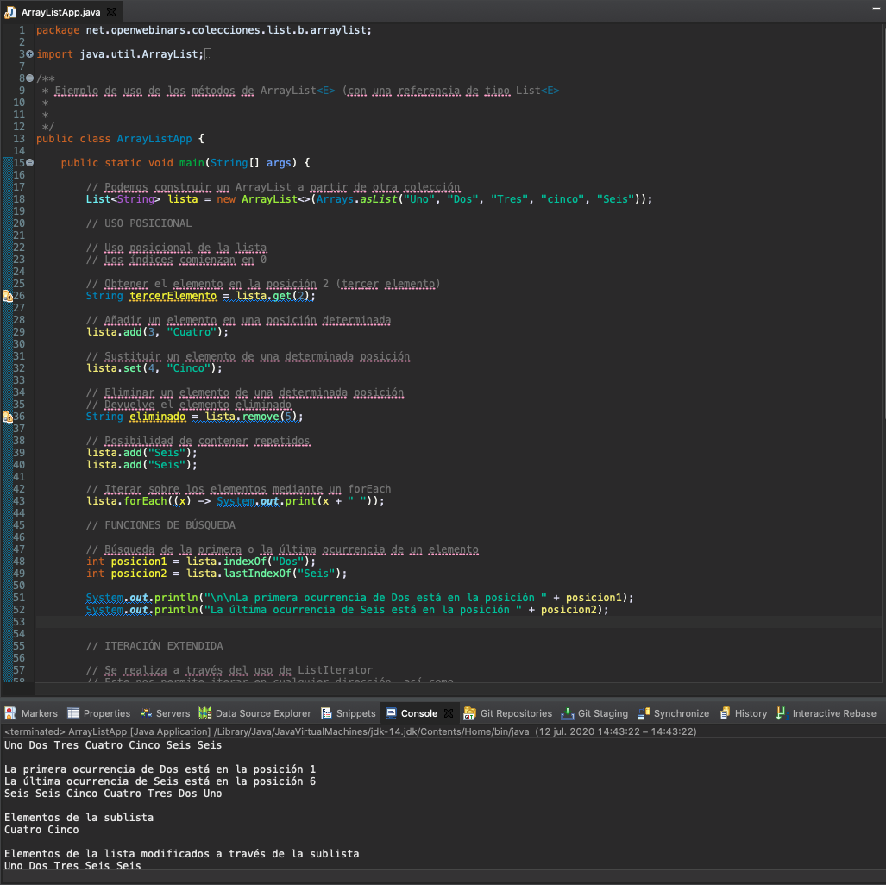

#### Otras interfaces relacionados con `List<E>`

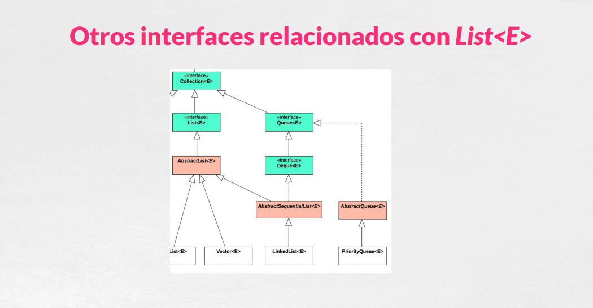

Otros interfaces relacionados con `List<E>` serían `Queue` y `Deque` que nos permiten implementar una cola y una cola doble, que también nos permitirán de esa manera obtener una una lista.

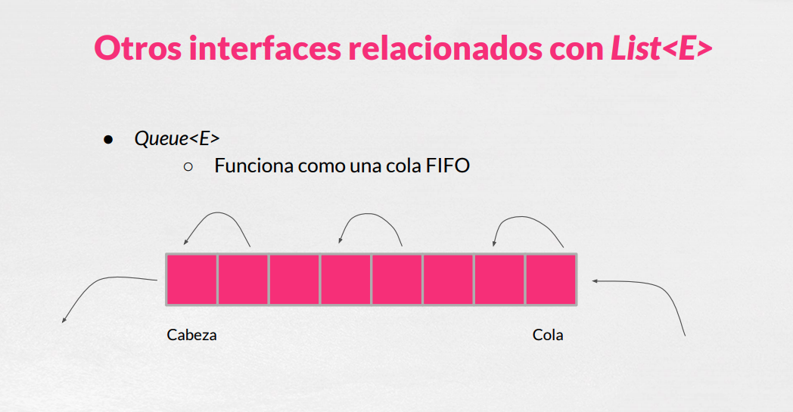

Una cola una `Queue` es una cola de tipo FIFO se suele poner como ejemplo siempre la cola del supermercado, es decir el primero que llega es el primero que sale, nosotros insertariamos los elemento al final de la cola llamada cola y saldrían por la cabeza, conforme vamos insertando elementos se van viendo empujado o mejor dicho conforme los vamos sacando se van desplazando los elementos de la cola hacia la cabeza. 


Tiene una serie de operaciones algunas lanzan una excepción:

* `add(e)` Inserción.
* `remove()` Extraer.
* `element()` Examinar, hace lo mismo que `remove()` pero sin eliminar el elemento de la cabeza de la cola.

Si sucede algún tipo de error lanzan una excepción.

Y tenemos también una implementación que devuelve un valor especial como:

* `offer(e)` Inserción.
* `poll()` Extraer.
* `peek` Examinar.

Que harían las misma operación pero que no lanzarían una una excepción si por ejemplo no se puede insertar un elemento nos devolvería un valor nulo, si no hay ningún elemento nos devolvería un valor nulo en lugar de lanzar una excepción.

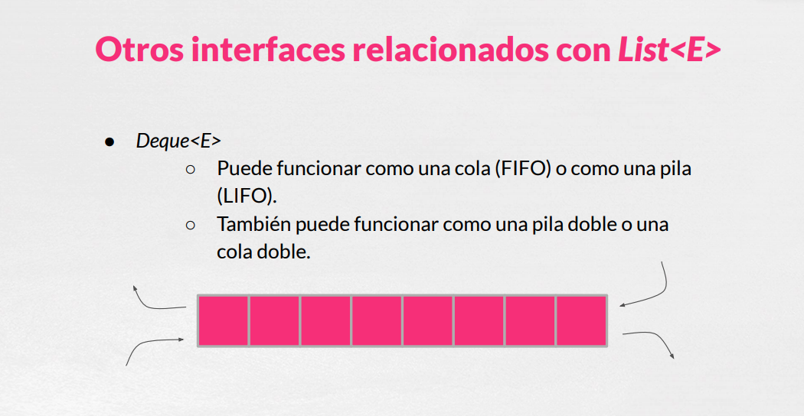

La interfaz `Deque<E>` son las siglas de una cola doblemente enlazada,  Double Ended Que, nos permite tener una cola que funciona como cola en ambos extremos, que puede ser útil en algún tipo de sistema o también podría funcionar como una pila, incluso como una pila doble pero sobre todo como una pila que suele ser para lo que más se utiliza.

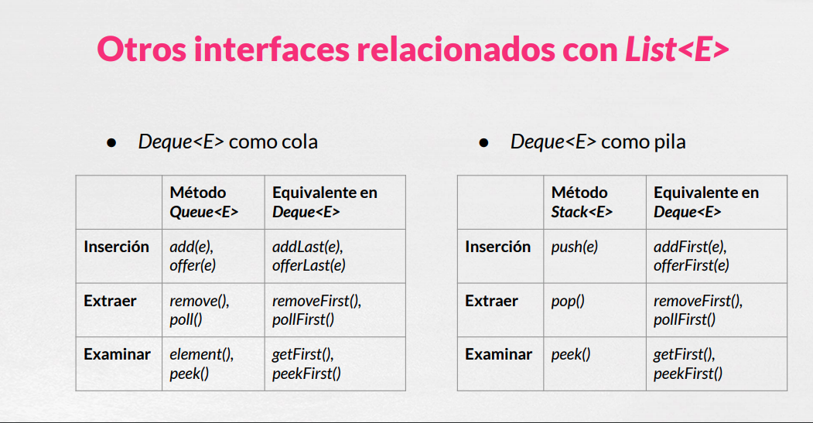

Si la tratamos como una cola tendríamos el siguiente mapeo en los métodos que tendríamos que utilizar.

* `add(e) -> addLast(e)` Inserción.
* `remove() -> removeFirst()` Extraer.
* `element() -> getFirst()` Examinar.

Y para la implementación que devuelve un valor especial:

* `offer(e) -> offerLast(e)` Inserción.
* `poll() -> pollFirst()` Extraer.
* `peek -> peekFirst()` Examinar.

Y si lo queremos trabajar como pila tenemos la clase `Stack<E>` que no vamos a visitar tampoco tiene una serie de métodos:

* `push(e)` Inserción.
* `pop()` Extraer.
* `peek` Examinar.

Y si tratamos `Deque<E>` como pilas tendríamos que hacer siempre la inserción y la obtención desde el principio.

* `addFirst(e)` Inserción.
* `removeFirst()` Extraer.
* `getFirst` Examinar.

Y para la implementación que devuelve un valor especial:

* `offerFirst(e)` Inserción.
* `pollFirst()` Extraer.
* `peekFirst` Examinar.

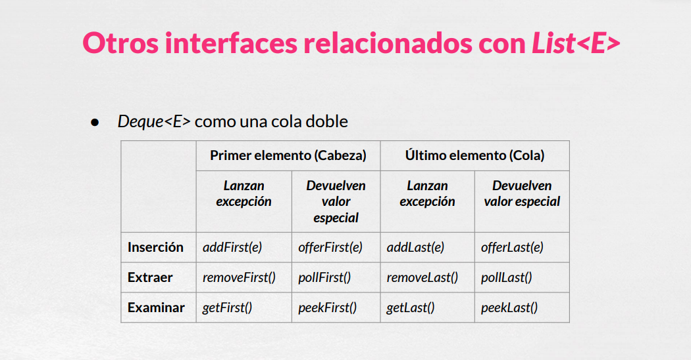

Si lo tratamos como una cola doble tendremos que trabajar con los mismos métodos pero en uno u otro extremo siempre con la coletilla de `First` o `Last`.

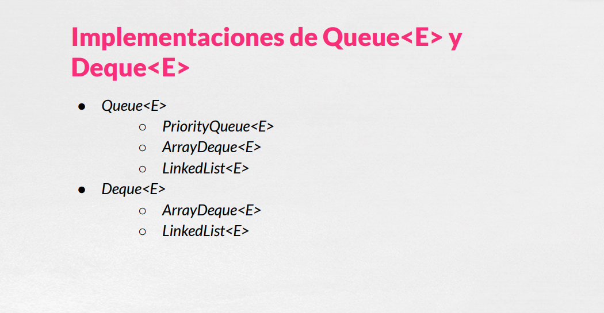

Vamos a ver algún ejemplo de estas implementaciones tenemos la posibilidad con la implementación de `Queue<E>` de trabajar con:

* `PriorityQueue<E>` 
* `ArrayQueue<E>` 
* `LinkedQueue<E>` 

Y con `Deque<E>` trabajar con:

* `ArrayDeque<E>`
* `LinkedDeque<E>`

Hemos visto antes `LinkedList<E>` tampoco sería `LinkedQueue<E>` la más adecuada si queremos trabajar con una cola, sería más adecuada por ejemplo `ArrayQueue<E>`, si queremos trabajar con prioridad por ejemplo `PriorityQueue<E>` y si queremos trabajar con `Deque<E>` pues podríamos trabajar con alguna de estas implementaciones  `ArrayDeque<E>` o `LinkedDeque<E>`. 

de la cena a la hora de hacer una cola con prioridad tendríamos prioritic yo vale

#### :computer: Ejemplo de Aplicación `ArrayQueue<E>`

*`QueueArrayDequeApp`*

```java
package net.openwebinars.colecciones.queue.a.queue;

import java.util.ArrayDeque;
import java.util.Queue;

/**
 * Ejemplo de uso de los métodos de Queue<E>
 *
 * 
 */
public class QueueArrayDequeApp {

    public static void main(String[] args) {

        // Podemos usar una cola si necesitamos obtener los elementos en el orden
        // en el cual los hemos insertado
        Queue<String> meses = new ArrayDeque<>();

        // Insertamos los diferentes meses del año
        meses.add("Enero");
        meses.add("Febrero");
        meses.add("Marzo");
        meses.add("Abril");
        meses.add("Mayo");
        meses.add("Junio");
        meses.add("Julio");
        meses.add("Agosto");
        meses.add("Septiembre");
        meses.add("Octubre");
        meses.add("Noviembre");
        meses.add("Diciembre");

        // ¿Qué mes está ahora mismo en la cabecera de la cola?
        System.out.println(meses.element());

        System.out.println("\n\n");
        // Vaciamos la cola, obteniendo todos los meses
        while (!meses.isEmpty()) {
            System.out.println(meses.remove());
        }

    }
}
```

Aquí tenemosel ejemplo de una Cola `Queue` para gestionar los meses del año estamos usando la implementación con `ArrayDeque` que es la más eficiente.

```java
// Podemos usar una cola si necesitamos obtener los elementos en el orden
// en el cual los hemos insertado
Queue<String> meses = new ArrayDeque<>();
```

Podemos insertar los meses en un determinado orden de inserción.

```java
// Insertamos los diferentes meses del año
meses.add("Enero");
meses.add("Febrero");
meses.add("Marzo");
meses.add("Abril");
meses.add("Mayo");
meses.add("Junio");
meses.add("Julio");
meses.add("Agosto");
meses.add("Septiembre");
meses.add("Octubre");
meses.add("Noviembre");
meses.add("Diciembre");
```

El método `element()` nos permita consultar la cabecera es decir el primer elemento.

```java
// ¿Qué mes está ahora mismo en la cabecera de la cola?
System.out.println(meses.element());
```
El método `remove()` nos permite eliminar un elemento devolviendo el elemento eliminado, por lo que con el siguiente bucle:

```java
// Vaciamos la cola, obteniendo todos los meses
while (!meses.isEmpty()) {
   System.out.println(meses.remove());
}
```

Recorremos la cola mientras no este vacía, hasta que vaciamos la cola, obteniendo todos los meses, es como ver pasar los meses. Nos devolvera los meses en el orden de inserción. 

Si fueran personas en la caja de un supermercado representaría como vamos atendiendo a los clientes.

#### Ejecutar la Aplicación.

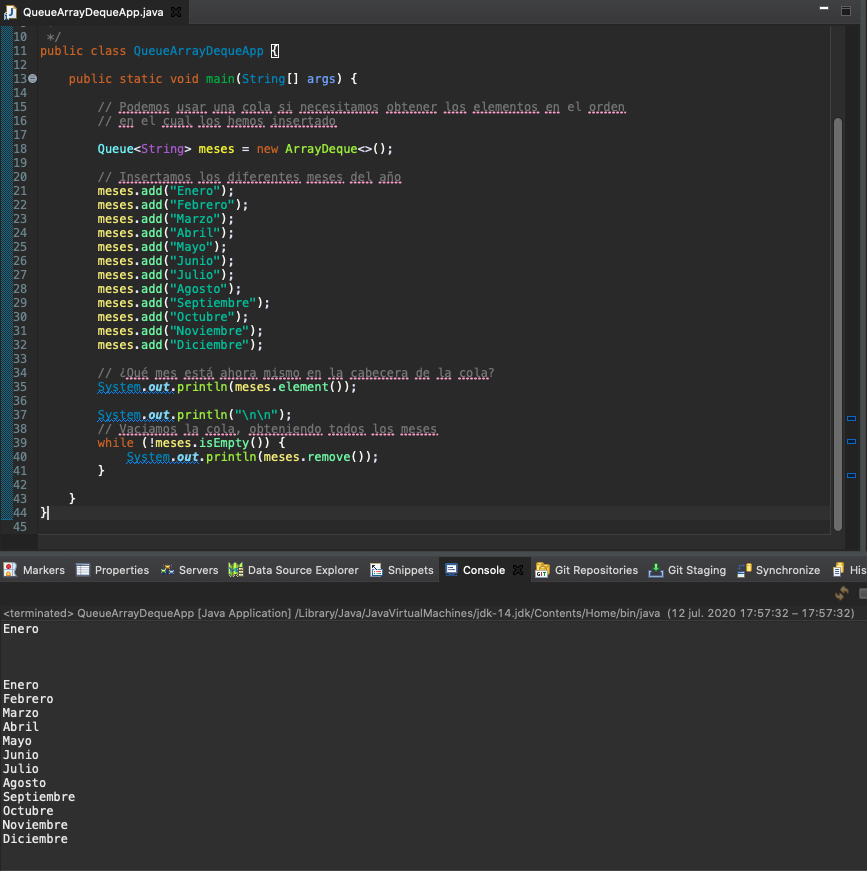

#### :computer: Ejemplo de Aplicación `PriorityQueue<E>`

*`PriorityQueueApp`*

```java
package net.openwebinars.colecciones.queue.a.queue;

import net.openwebinars.colecciones.queue.a.queue.model.FifoEntry;
import net.openwebinars.colecciones.queue.a.queue.model.Pasajero;

import java.util.PriorityQueue;
import java.util.Queue;

/**
 * Ejemplo de uso de una cola con prioridad, PriorityQueue
 *
 * 
 */
public class PriorityQueueApp {

    public static void main(String[] args) {

        // Una cola con prioridad nos permite "ordenar" un poco los
        // elementos dentro de la cola.
        // El tipo de los elementos debe implementar Comparable


        // Creamos una cola para gestionar el orden de embarque de algunos pasajeros
        // a un medio de transporte. Algunos pasajeros tiene mayor prioridad que otros,
        // según lo hayan abonado al comprar su billete.
        Queue<Pasajero> cola = new PriorityQueue<>();


        // Los pasajeros van llegando a la cola
        cola.add(new Pasajero("María", 1));
        cola.add(new Pasajero("Manuel", 2));
        cola.add(new Pasajero("Antonio", 1));
        cola.add(new Pasajero("Rosa", 3));
        cola.add(new Pasajero("Ana", 5));


        // Es hora de embarcar.
        // Los pasajeros van pasando conforme se va vaciando la cola
        while(!cola.isEmpty())
            System.out.println(cola.remove());


        // ¡OJO! No se nos asegura que los elementos de igual
        // prioridad se obtengan en orden de inserción :S
        // Para ello, tendríamos que añadir un segundo elemento
        // que nos permita manejar el orden de inserción

        Queue<FifoEntry<Pasajero>> cola2 = new PriorityQueue<>();


        cola2.add(new FifoEntry<Pasajero>(new Pasajero("María", 1)));
        cola2.add(new FifoEntry<Pasajero>(new Pasajero("Manuel", 2)));
        cola2.add(new FifoEntry<Pasajero>(new Pasajero("Antonio", 1)));
        cola2.add(new FifoEntry<Pasajero>(new Pasajero("Rosa", 3)));
        cola2.add(new FifoEntry<Pasajero>(new Pasajero("Ana", 5)));

        // Gracias a FifoEntry, ahora sí que obtenemos los elementos
        // de igual prioridad en orden de inserción
        System.out.println("\n\n");
        while(!cola2.isEmpty())
            System.out.println(cola2.remove().getEntry());

    }
}
```

La clase `PriorityQueueApp`


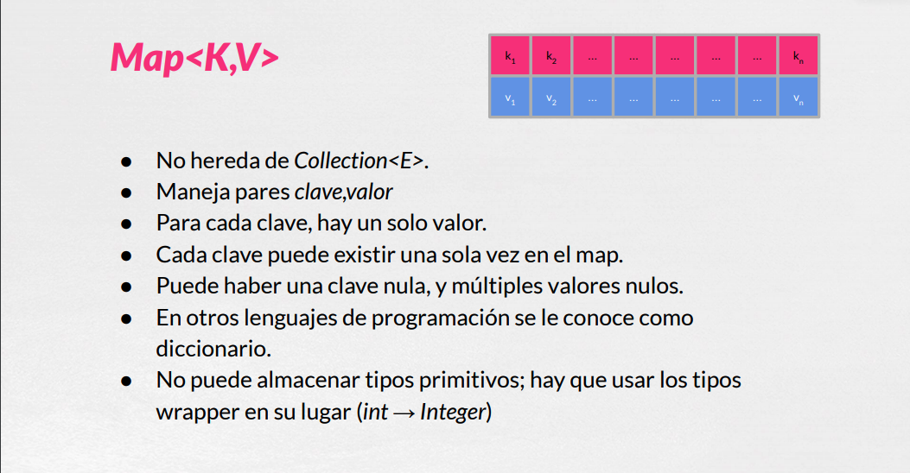
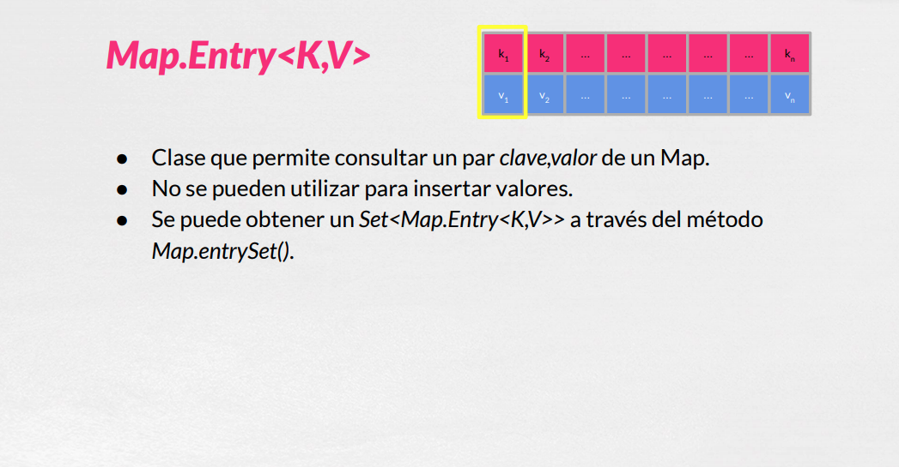

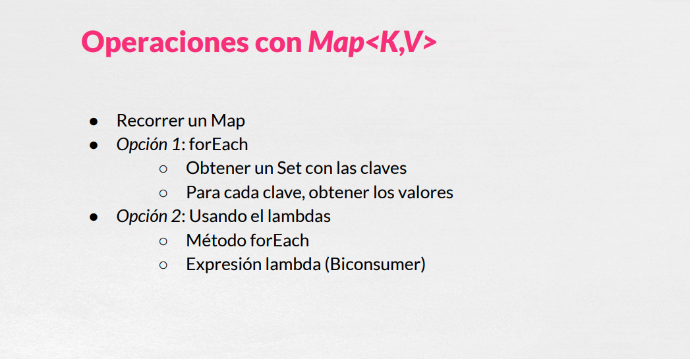
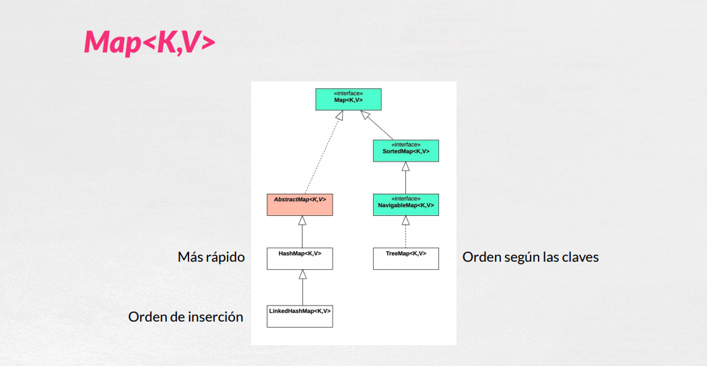
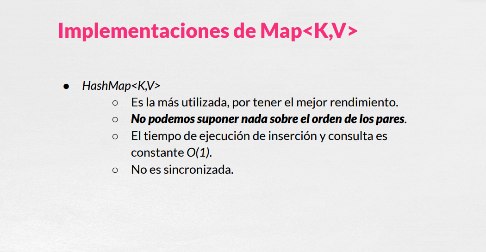
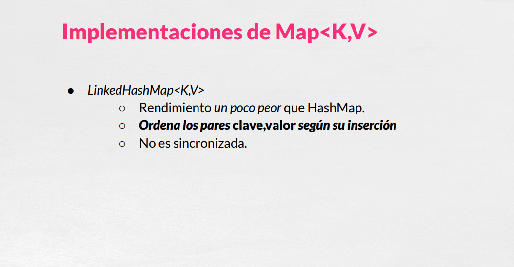
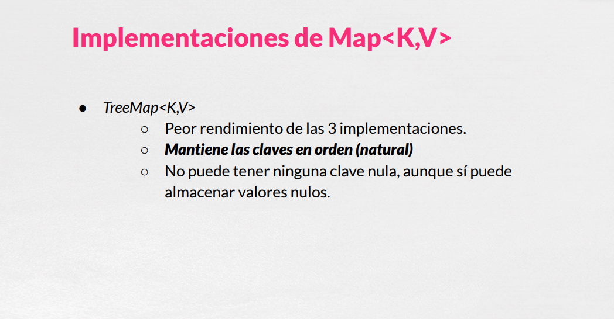


