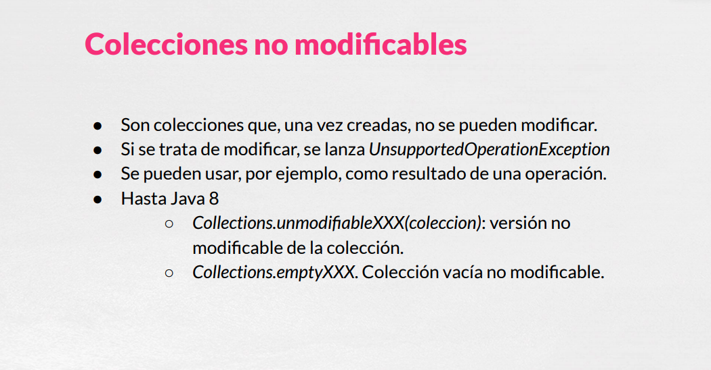
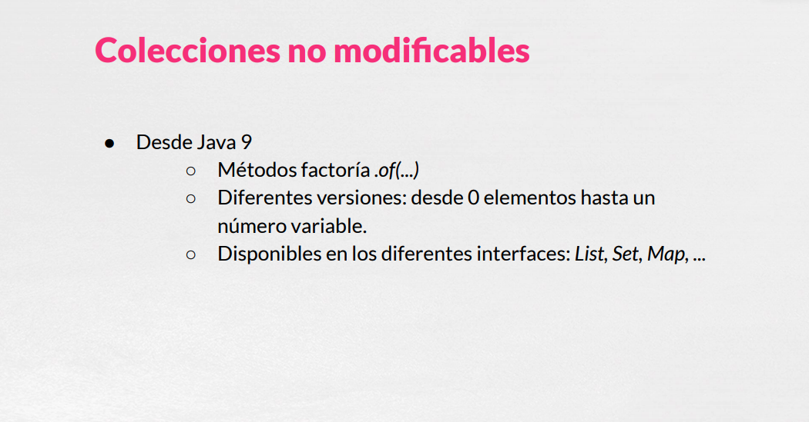
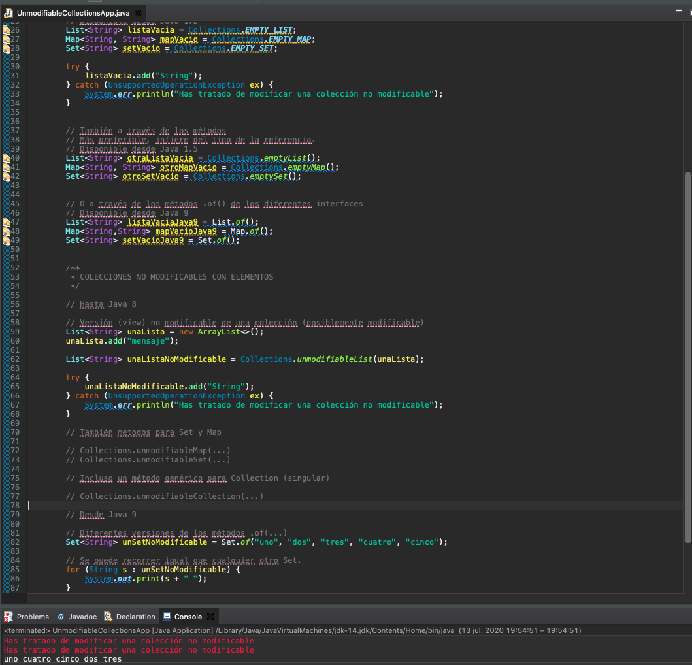
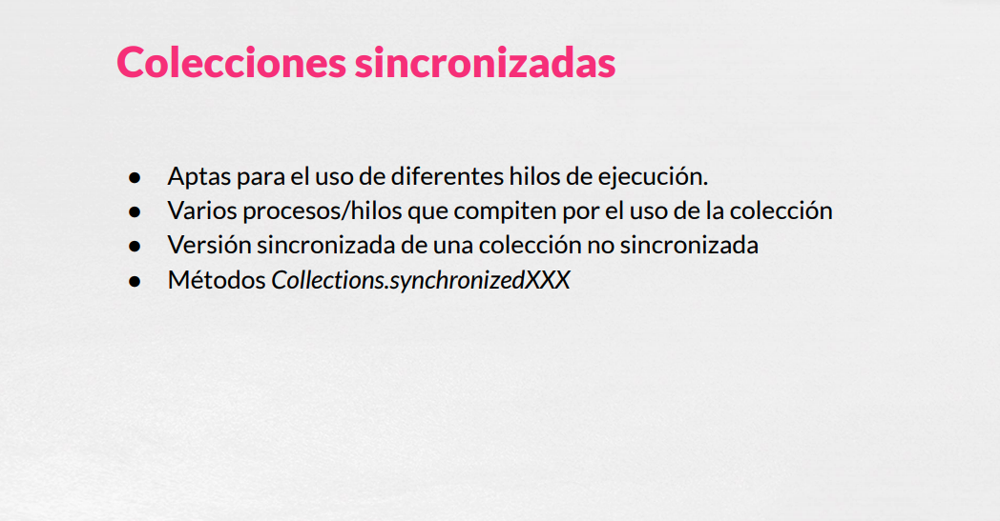
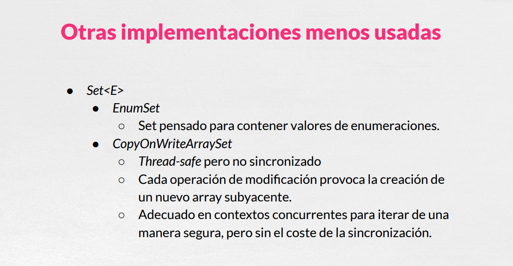
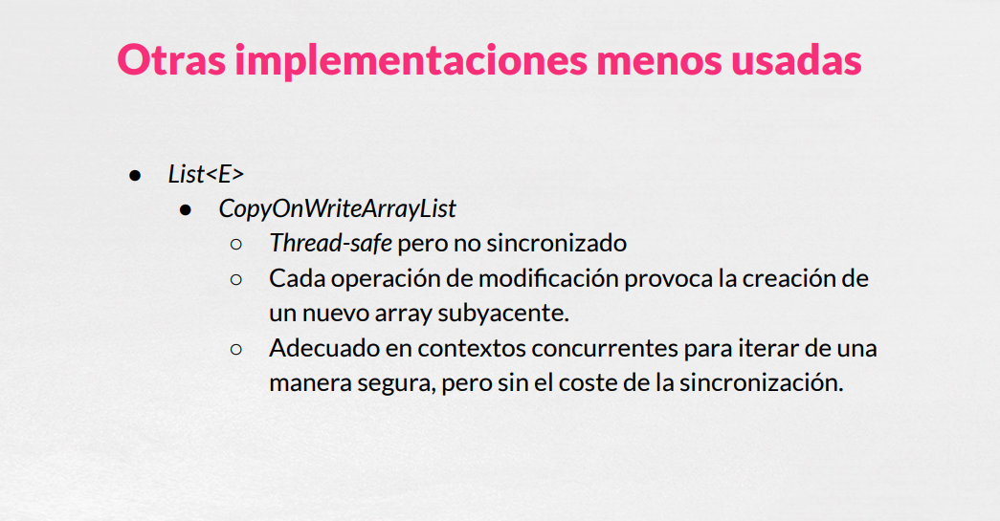
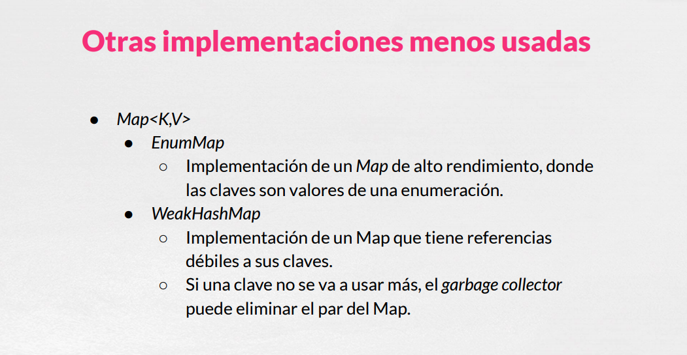
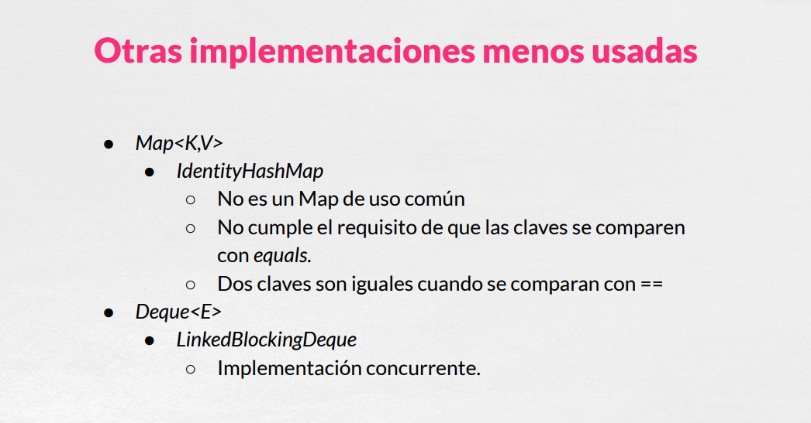
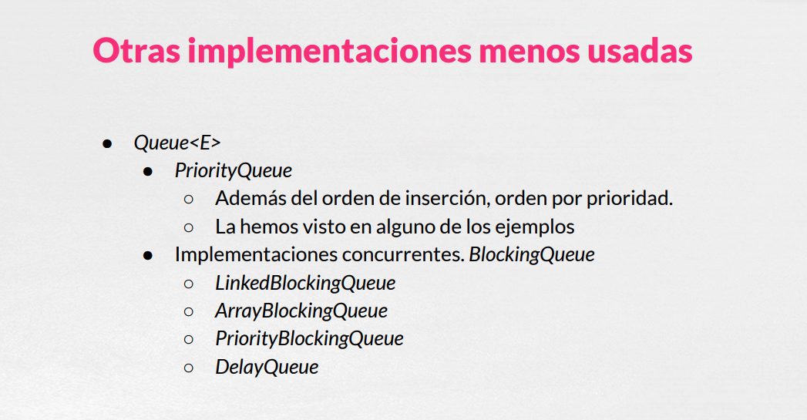

# 03 Colecciones para Situaciones Especiales




Java también nos ofrece colecciones para situaciones especiales, algunas de ellas serían las colecciones no modificables, son colecciones que una vez creada no se podrían modificar, si tratamos de modificarlas se lanzaría una excepción y se pueden utilizar por ejemplo como resultado de algún tipo de método que se devuelva y del cual no queremos que se puedan modificar esas colecciones. Hasta Java 8 teníamos los métodos `unmodificableXXX` basados en una colección que lo que nos haría sería devolver una versión no modificable de una determinada colección y también tendríamos los métodos `emptyXXX` que nos devuelve una colección vacía no modificable y que están disponibles también en la interfaz `List`, `Set`, `Map`, ....



Desde Java 9 tenemos los métodos `factoria.of(...)` con distintas versiones de los mismos, desde cero elemento para una colección vacía hasta un número variable y que están disponibles también en la interfaz `List`, `Set`, `Map`, ...

Podríamos ver algún ejemplo.

### :computer: Ejemplo de Aplicación COLECCIONES NO MODIFICABLES

*`UnmodifiableCollectionsApp`*

```java
package net.openwebinars.colecciones.unmodifiable;

import java.util.ArrayList;
import java.util.Collections;
import java.util.List;
import java.util.Map;
import java.util.Set;

/**
 * Colecciones no modificables
 *
 * 
 */
public class UnmodifiableCollectionsApp {

    public static void main(String[] args) {

        /**
         * COLECCIONES NO MODIFICABLES VACÍAS
         */

        // Hasta Java 8, haciendo uso de las constantes de Collections (plural)

        // Menos preferible, porque no usa genéricos
        // Disponible desde Java 1.2
        List<String> listaVacia = Collections.EMPTY_LIST;
        Map<String, String> mapVacio = Collections.EMPTY_MAP;
        Set<String> setVacio = Collections.EMPTY_SET;

        try {
            listaVacia.add("String");
        } catch (UnsupportedOperationException ex) {
            System.err.println("Has tratado de modificar una colección no modificable");
        }


        // También a través de los métodos
        // Más preferible, infiere del tipo de la referencia.
        // Disponible desde Java 1.5
        List<String> otraListaVacia = Collections.emptyList();
        Map<String, String> otroMapVacio = Collections.emptyMap();
        Set<String> otroSetVacio = Collections.emptySet();


        // O a través de los métodos .of() de los diferentes interfaces
        // Disponible desde Java 9
        List<String> listaVaciaJava9 = List.of();
        Map<String,String> mapVacioJava9 = Map.of();
        Set<String> setVacioJava9 = Set.of();


        /**
         * COLECCIONES NO MODIFICABLES CON ELEMENTOS
         */

        // Hasta Java 8

        // Versión (view) no modificable de una colección (posiblemente modificable)
        List<String> unaLista = new ArrayList<>();
        unaLista.add("mensaje");

        List<String> unaListaNoModificable = Collections.unmodifiableList(unaLista);

        try {
            unaListaNoModificable.add("String");
        } catch (UnsupportedOperationException ex) {
            System.err.println("Has tratado de modificar una colección no modificable");
        }

        // También métodos para Set y Map

        // Collections.unmodifiableMap(...)
        // Collections.unmodifiableSet(...)

        // Incluso un método genérico para Collection (singular)

        // Collections.unmodifiableCollection(...)

        // Desde Java 9

        // Diferentes versiones de los métodos .of(...)
        Set<String> unSetNoModificable = Set.of("uno", "dos", "tres", "cuatro", "cinco");

        // Se puede recorrer igual que cualquier otro Set.
        for (String s : unSetNoModificable) {
            System.out.print(s + " ");
        }
        System.out.println("\n");
    }
}

```

Con Java 8 tendríamos el uso de las constantes de Collections, que no son adecuadas por que no usan Genericos pero siguen funcionando y que lanzan la excepción `UnsupportedOperationException` al tratar de modificar una colección no modificable.

```java
// Hasta Java 8, haciendo uso de las constantes de Collections (plural)

// Menos preferible, porque no usa genéricos
// Disponible desde Java 1.2
List<String> listaVacia = Collections.EMPTY_LIST;
Map<String, String> mapVacio = Collections.EMPTY_MAP;
Set<String> setVacio = Collections.EMPTY_SET;

try {
   listaVacia.add("String");
} catch (UnsupportedOperationException ex) {
   System.err.println("Has tratado de modificar una colección no modificable");
}
```

Usa los métodos `emptyList()`, `emptyMap()` y `emptySet()`

```java
// También a través de los métodos
// Más preferible, infiere del tipo de la referencia.
// Disponible desde Java 1.5
List<String> otraListaVacia = Collections.emptyList();
Map<String, String> otroMapVacio = Collections.emptyMap();
Set<String> otroSetVacio = Collections.emptySet();
```

Desde Java 9 tenemos los métodos `factoria.of` para las distintas interfaces.

```java
// O a través de los métodos .of() de los diferentes interfaces
// Disponible desde Java 9
List<String> listaVaciaJava9 = List.of();
Map<String,String> mapVacioJava9 = Map.of();
Set<String> setVacioJava9 = Set.of();
```

Todo lo anterior con respecto a Collecciones que serían vacias.

O versiones no modificables con una lista de elementos que las podemos construir con los métodos `unmodifiableList`, `unmodifiableMap` o `unmodifiableSet` que se comportarían igual.


```java
/**
* COLECCIONES NO MODIFICABLES CON ELEMENTOS
*/

// Hasta Java 8

// Versión (view) no modificable de una colección (posiblemente modificable)
List<String> unaLista = new ArrayList<>();
unaLista.add("mensaje");

List<String> unaListaNoModificable = Collections.unmodifiableList(unaLista);

try {
   unaListaNoModificable.add("String");
} catch (UnsupportedOperationException ex) {
   System.err.println("Has tratado de modificar una colección no modificable");
}
```

Tendríamos uno más generico que sería `unmodifiableCollection(...)` que funcionaría con una referencia de tipo `Collection` o las versiones con elmentos del los métodos `factoria.of` que nos permiten recorrer estos elementos pero lo que no permiten es modificar una colección. 

```java
// También métodos para Set y Map

// Collections.unmodifiableMap(...)
// Collections.unmodifiableSet(...)

// Incluso un método genérico para Collection (singular)

// Collections.unmodifiableCollection(...)

// Desde Java 9

// Diferentes versiones de los métodos .of(...)
Set<String> unSetNoModificable = Set.of("uno", "dos", "tres", "cuatro", "cinco");

// Se puede recorrer igual que cualquier otro Set.
for (String s : unSetNoModificable) {
   System.out.print(s + " ");
}
System.out.println("\n");
```

### Ejecutar la Aplicación 



No permitiría modificar una colección como ves aquí se está imprimiendo por la consola de error que hemos tratado de modificar una colección que no sería modificable.

Suele ser útil cuando queremos construir una colección que no vayamos a modificar.



otro ejemplo serían las colecciones sincronizadas que serían aptas para el uso en un contexto multihilo y que bueno las colecciones que hemos venido viendo hasta ahora ninguna es 36 y que si quisiéramos tener versiones sincronizada de cada una de las colecciones que hemos hemos ido viendo tendríamos que tendríamos que bueno en volver esta colección a través de los metodos synchronized list map que invito a que visitéis la clase collection en el apio en la documentación de lápiz y la podáis ver también como una especie de pequeño bono otras implementaciones menos usadas de los distintos interfaces que hemos visto antes pero que también existen por ahí vale es que os decía que no aparecen en el diagrama pero que sí que existen eh y que si alguna vez necesitáis pues podéis consultar la documentación y utilizar la tenemos por ejemplo en un SEP y se trata de un set pensado para contener valores de enumeraciones en lugar de objetos de una clase con un rendimiento muy bueno para para el uso con enumeraciones copia un raid array set sería una versión no sincronizada pero 36 de un ser humano y qué significa bueno la aquí el problema está en que una colección cuando cuando se ejecuta en un contexto concurrente varios procesos compiten por posiblemente consultarla o modificarla y podrían dejar dos operaciones que no son atómicas podrían dejar la colección en un estado inconsistente imagino que vamos recorriendo una colección y en un momento determinado pues alguien inserto en valor debería ese recorrido devolver no ese valor no en la ya veremos que también existe esta versión para el ir en las que son composición si se inserta en una posición que todavía no hemos visitado no lo debería de volver fino bueno que está esta colección Pokémon raid array C lo que nos permite que bueno pues la operación es de lectura no son sincronizadas las de escritura tampoco pero lo que hacen es que cada operación de modificación añadir modificar etcétera lo que hace es provocar el que se cree por debajo una nueva versión de la RAE con lo cual vale Pili sentimientos es que no te vuelven a colección vacía no modificar despejada 9 tenemos los métodos factoría poco distinta persona de los mismos te deseo elementos para una colección vacía hasta un número variable y que están disponibles también en la interfaz felices y más vale un día muy feliz como decían la versión nada 8 vale tendremos incluso las cosas de Pili sentimiento y se disponible de pescado 12 pero que no son adecuada porque no lo devuelven una rusa genérico vale aquí vamos a poder comprobar que bueno sí que en funcionando y que se lanza la opción a su corte de operation excepcional tratar de modificar una colección no modifica hable los métodos en Philips encima en piso de dejar las 9 tenemos la persiana de los métodos factoría o vale para la piscina interfaz es que somos respeto colecciones que serían vaciado versiones no modificar le de una lista con elementos que la podríamos construir con con estos métodos al móvil Fable el Isma o oh ser que se comporta harían igual incluso tendríamos una más genérico que sería por Isabel II colegio que funcionaría con con una referencia de decir bo bo colegio Hola pensiones con elemento de los métodos factoría o vale que bueno de los permiten recorrer estoy en evento y que lo que no pero me tenían serían modificar una colección como voy a Quique siempre miedo por la consola de error como te la tarde modificar una colección que no sería modificar vale ya se le ser útil cuando queramos los primo una colección que no que no vayamos a a modificar otro móvil a las colecciones sincronizada que serían hasta para el uso en un contexto múltiplo y que bueno la colección es que hemos venido viendo hasta ahora ninguna e36 y que si quisiéramos tener versiones sincronizada de cada una de las colecciones que no hemos ido viendo tendríamos que tendríamos que bueno envolver está colección a través de los métodos Sintrom a él y se lo ha comido a la que disfrutéis la la clase colección en la habitación de la Pili y la poda y como un espejo de pequeño vosotros







