# 04 Algoritmos para Colecciones


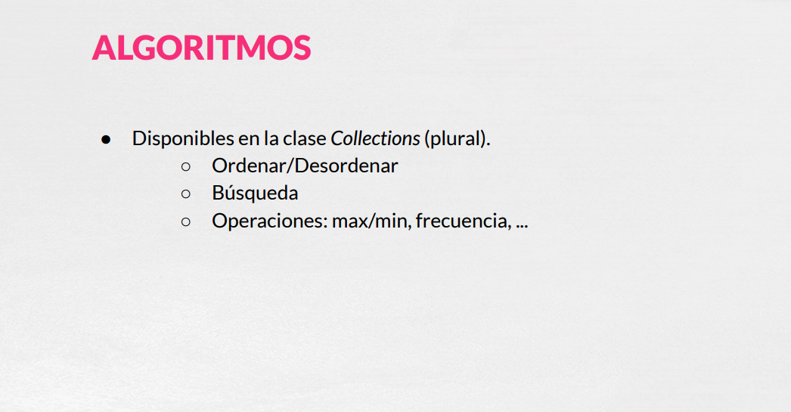

Con respecto a los algoritmos, tenemos algoritmos para bastante operaciones pero las más clásicas suelen ser la de ordenar y desordenar o las operaciones de búsqueda y también algunas como el máximo, mínimo o frecuencia.

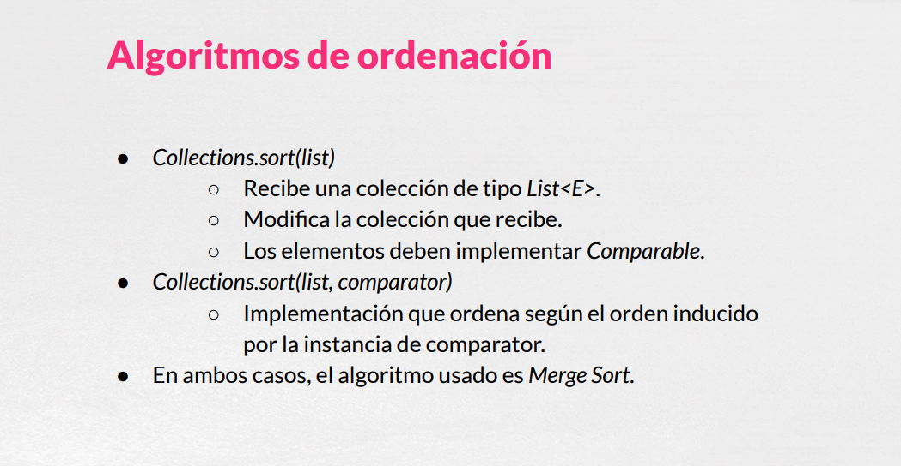

`sort` nos permite tener una versión que tiraría del orden natural de los elementos que almacenemos, todo ellos son métodos de la clase `Collection` tendría una segunda versión donde le proporcionaremos un `comparador` y entonces lo que haría sería ordenar en base a ese `comparador` ambas versiones lo que hacen es utilizar el algoritmo **mergesort** que un algoritmo con un rendimiento bastante bueno de los mejores diría yo a la hora de hacer estas operaciones de ordenación.

### :computer: Ejemplo de Aplicación `AlgoritmosColeccionesApp`

```java
package net.openwebinars.colecciones.algoritmos;

import java.util.*;

/**
 * Uso de algunos algoritmos para colecciones
 *
 * 
 */
public class AlgoritmosColeccionesApp {

    public static void main(String[] args) {

        /**
         * ALGORITMOS DE ORDENACIÓN
         */

        // Definimos una lista de números
        List<Integer> listaNumeros = new ArrayList<>(List.of(7,3,6,4,5,5,9));

        // La ordenamos (orden natural, ascendente)
        Collections.sort(listaNumeros);

        // Resultado
        System.out.println("ORDEN ASCENDENTE");
        listaNumeros.forEach(n -> System.out.print(n + " "));

        // La ordenamos descendentemente
        // reverseOrder devuelve el orden inverso al orden natural
        // implementado por Comparable.
        Collections.sort(listaNumeros, Collections.reverseOrder());

        // También podría haberse implementado así:
        // Collections.sort(listaNumeros, (n1, n2) -> -n1.compareTo(n2));

        // O así
        // Collections.reverse(listaNumeros)

        // Resultado
        System.out.println("\nORDEN DESCENDENTE");
        listaNumeros.forEach(n -> System.out.print(n + " "));

        // DESORDENACIÓN
        Collections.shuffle(listaNumeros);
        // Resultado
        System.out.println("\nELEMENTOS DESORDENADOS");
        listaNumeros.forEach(n -> System.out.print(n + " "));


        /**
         * ALGORITMOS DE BÚSQUEDA
         */

        // Para usar la búsqueda binaria, la lista debe estar ordenada
        Collections.sort(listaNumeros);

        // Buscamos un elemento que sabemos que está contenido en la colección
        int index = Collections.binarySearch(listaNumeros, 7);

        // Si lo encontramos...
        if (index >= 0)
            System.out.println("\n\nPodemos encontrar el elemento 7 en la posición " + index);
        else
            System.out.println("\n\nNo se ha podido encontrar el elemento 7");

        // Ahora buscamos un elemento que sabemos que no está contenido en la colección
        index = Collections.binarySearch(listaNumeros, 25);

        if (index >= 0)
            System.out.println("\nPodemos encontrar el elemento 25 en la posición " + index);
        // Si no lo encontramos...
        else {
            System.out.println("\nNo se ha podido encontrar el elemento 25");
            // Si quisiéramos insertar el elemento en el lugar adecuado, según el orden actual
            listaNumeros.add(-index-1, 25);
        }

        // Resultado
        System.out.println("\nELEMENTOS TRAS INSERTAR UN ELEMENTO EN SU LUGAR ADECUADO");
        listaNumeros.forEach(n -> System.out.print(n + " "));

        // También se puede buscar con un orden determinado, usando la segunda
        // implementación de binarySearch

        // Ordenamos descendentemente
        Collections.sort(listaNumeros, Collections.reverseOrder());

        index = Collections.binarySearch(listaNumeros, 9, Collections.reverseOrder());

        System.out.println("\n\nELEMENTOS ORDENADOS INVERSAMENTE");
        listaNumeros.forEach(n -> System.out.print(n + " "));

        if (index >= 0)
            System.out.println("\nPodemos encontrar el elemento 9 en la posición " + index);
        else
            System.out.println("\n\nNo se ha podido encontrar el elemento 9");


        /**
         * ALGUNAS OPERACIONES
         */

        // MÁXIMO Y MÍNIMO

        // Funciona sobre Collection. Podemos probar con un Set.
        Set<Integer> conjuntoDeNumeros = new HashSet<>(listaNumeros);

        int minimo = Collections.min(conjuntoDeNumeros);

        System.out.println("\n\nEl valor minimo del conjunto de números es " + minimo);

        // FRECUENCIA

        int elemento = 5;
        int frecuencia = Collections.frequency(conjuntoDeNumeros, elemento);

        System.out.println("\nEl número de ocurrencias de " + elemento + " en la colección es " + frecuencia);


        // DISJOINT

        List<Integer> pares = List.of(1,3,5,7,9);
        List<Integer> impares = List.of(0,2,4,6,8);

        if (Collections.disjoint(pares, impares)) {
            System.out.println("\nAmbas colecciones no tienen ningún elemento en común");
        }

    }

}
```

Por ejemplo tenemos una lista de número.

```java
// Definimos una lista de números
List<Integer> listaNumeros = new ArrayList<>(List.of(7,3,6,4,5,5,9));
```

Que vamos a ordenar, `sort(listaNumeros)` lo que hace es ordenar la propia lista, con lo cual la lista tiene que ser modificable, la podríamos ordenar ascendentemente como ya hemos dicho con esta llamada a `sort(listaNumeros)`.

```java
// La ordenamos (orden natural, ascendente)
Collections.sort(listaNumeros);
```

Mostramos la lista.

```java
// Resultado
System.out.println("ORDEN ASCENDENTE");
listaNumeros.forEach(n -> System.out.print(n + " "));
```

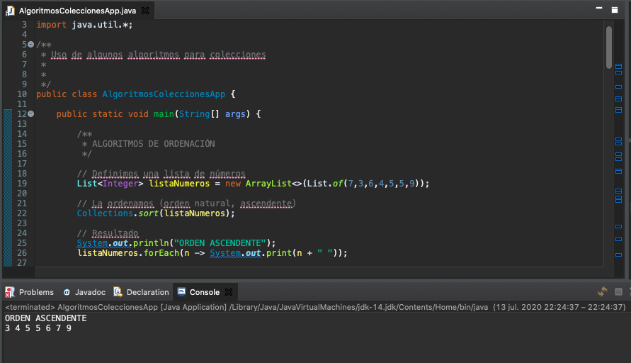

Y podríamos hacer una ordenación descendente mediante el método `reverseOrder()` que es bastante cómodo y que lo que haces estudiar el tipo de esta lista y crear un `comparator` a la inversa del comparable que tenga definido. Auque podríamos hacer nosotros nuestras propias implementaciones proporcionando el `comparator` por ejemplo.  

```java
// La ordenamos descendentemente
// reverseOrder devuelve el orden inverso al orden natural
// implementado por Comparable.
Collections.sort(listaNumeros, Collections.reverseOrder());

// También podría haberse implementado así:
// Collections.sort(listaNumeros, (n1, n2) -> -n1.compareTo(n2));

// O así
// Collections.reverse(listaNumeros)

// Resultado
System.out.println("\nORDEN DESCENDENTE");
listaNumeros.forEach(n -> System.out.print(n + " "));
```

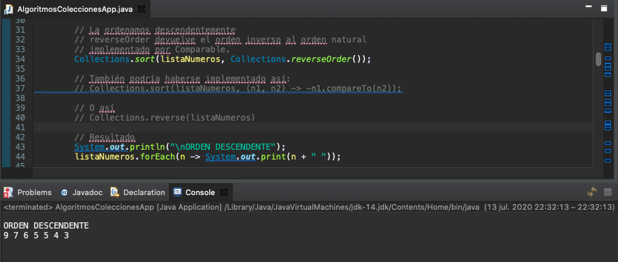

En orden descendente la lista estaría a la inversa, **recordemos que `sort` trabaja con colecciones de tipo `List` siempre**.

También hay una implementación del método `reverse(listaNumeros)` que directamente lo que hace es  darle la vuelta a la colección que tenemos y ordenará a la inversa.

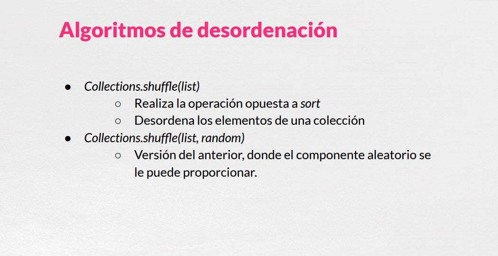

El método `shuffle` nos permitiría desordenar una colección con distinta implementaciones, una que no hay que proporcionarle nada más que la lista y otra que hay que proporcionarle o le podemos proporcionar digamos que la semilla aleatoria y que nos permite desordenar y que nos podría venir bien en algún contexto.

```java
// DESORDENACIÓN
Collections.shuffle(listaNumeros);
// Resultado
System.out.println("\nELEMENTOS DESORDENADOS");
listaNumeros.forEach(n -> System.out.print(n + " "));
```

Aquí podríamos ver que sobre la lista ordenada, desordenamos los elementos se obtienen en un orden arbitrario.

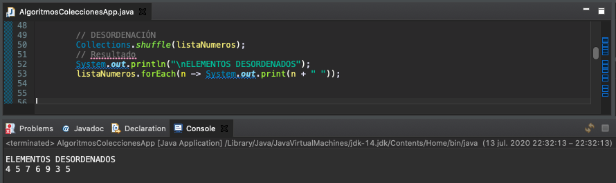

Tenemos algoritmos de búsqueda, la búsqueda binaria que trabajaría siempre con la pre-condición de que la lista esta ordenada ascendentemente o mejor dicho en el orden natural en el cual queremos buscar y en el cual pues mediante este algoritmo `binarySearch` le pasaríamos el valor que queremos buscar y la lista y nos devolvería la posición del elemento en la lista.

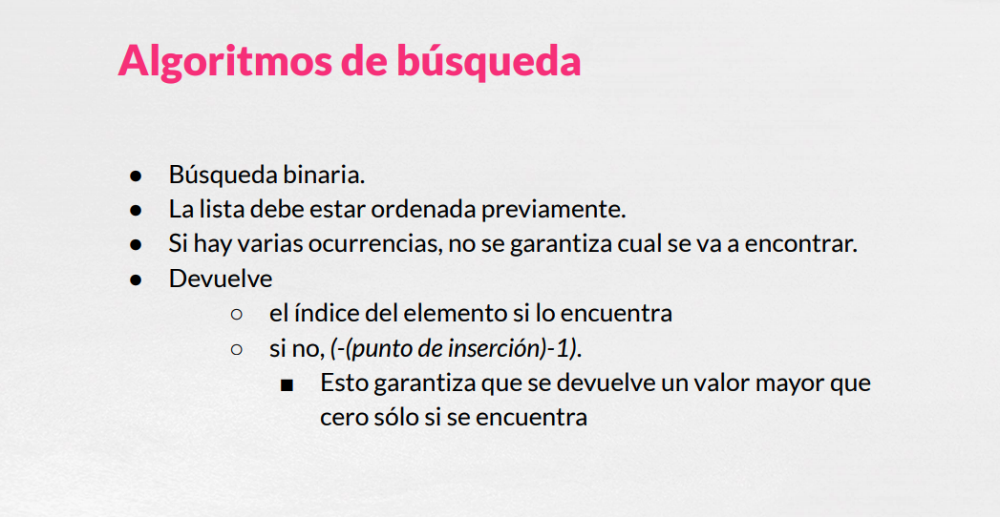

Lo hace de una manera un poco peculiar y es que si encuentra el elemento nos devuelve el índice en el cual se encuentra y sino nos devuelve este valor `(-(punto de inserción)-1)` que es una manera de mezclar un Boolean y un número entero porque, porque no devuelve un valor menor que cero si no lo encuentras, con lo cual tenemos esa facilidad de decir si el índice es mayor o igual que cero el elemento está en la lista y si no pues no está, pero además nos devuelve de alguna manera una forma de obtener el punto de inserción de ese elemento, de donde deberíamos si queremos insertarlo para que se mantenga el orden dónde deberíamos hacerlo.

```java
/**
* ALGORITMOS DE BÚSQUEDA
*/

// Para usar la búsqueda binaria, la lista debe estar ordenada
Collections.sort(listaNumeros);

// Buscamos un elemento que sabemos que está contenido en la colección
int index = Collections.binarySearch(listaNumeros, 7);

// Si lo encontramos...
if (index >= 0)
   System.out.println("\n\nPodemos encontrar el elemento 7 en la posición " + index);
else
   System.out.println("\n\nNo se ha podido encontrar el elemento 7");

// Ahora buscamos un elemento que sabemos que no está contenido en la colección
index = Collections.binarySearch(listaNumeros, 25);

if (index >= 0)
   System.out.println("\nPodemos encontrar el elemento 25 en la posición " + index);
   // Si no lo encontramos...
else {
   System.out.println("\nNo se ha podido encontrar el elemento 25");
   // Si quisiéramos insertar el elemento en el lugar adecuado, según el orden actual
   listaNumeros.add(-index-1, 25);
}

// Resultado
System.out.println("\nELEMENTOS TRAS INSERTAR UN ELEMENTO EN SU LUGAR ADECUADO");
listaNumeros.forEach(n -> System.out.print(n + " "));
```

Podríamos buscar un elemento que si está como el 7, podríamos buscar otro que no está como el 25, como el índice no es mayor que cero no lo puede encontrar y si lo quisiéramos añadir, lo que tendríamos que hacer es utilizar el valor que se nos ha devuelto `index` invertirlo y la posición menos 1, es decir `add(-index-1, 25)`, de esta forma lo que haríamos sería obtener la posición exacta de inserción y podemos comprobar.

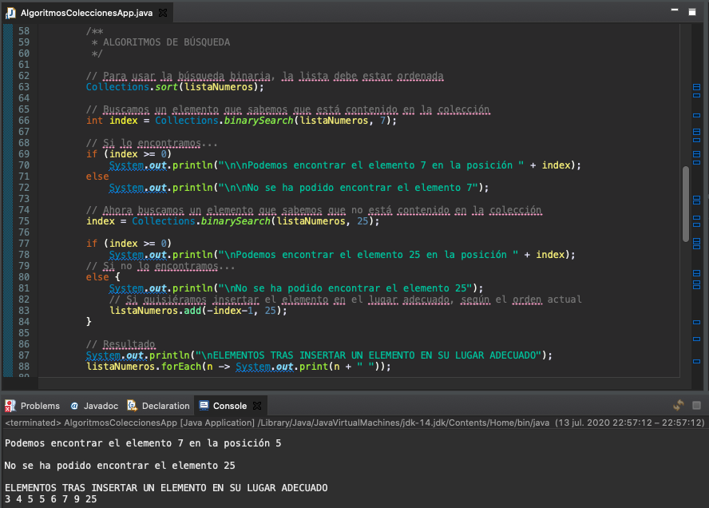

Podemos comprobar como inserta en su posición adecuada a 25 que sería al final de la lista.

Si quisieramos hacer una busqueda con los elementos ordenados descendente también lo podríamos hacer.

```java
// También se puede buscar con un orden determinado, usando la segunda
// implementación de binarySearch

// Ordenamos descendentemente
Collections.sort(listaNumeros, Collections.reverseOrder());

index = Collections.binarySearch(listaNumeros, 9, Collections.reverseOrder());

System.out.println("\n\nELEMENTOS ORDENADOS INVERSAMENTE");
listaNumeros.forEach(n -> System.out.print(n + " "));

if (index >= 0)
   System.out.println("\nPodemos encontrar el elemento 9 en la posición " + index);
else
   System.out.println("\n\nNo se ha podido encontrar el elemento 9");
```

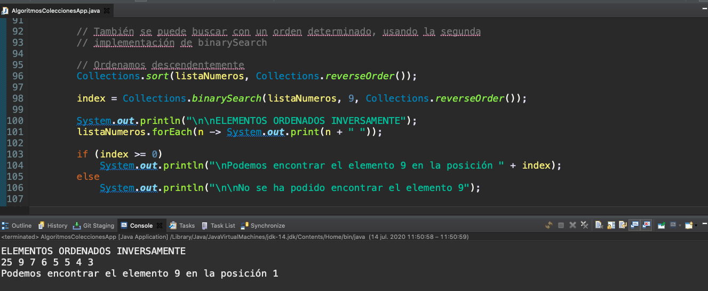

Podemomos ver como obtenemos 9 en la posición 1 por que hemos ordenado descendentemente.

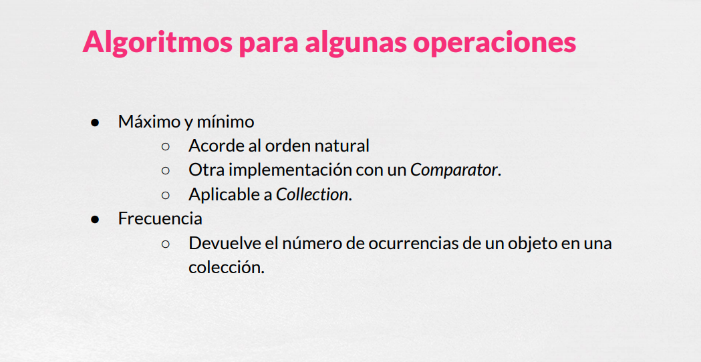

Tenemos otras serie de operaciones como serían el Máximo, el Mínimo de acuerdo al orden natural, con un `Comparator`, se pueden aplicar a `Collection` con lo cual podemos implementaciones de `Set`, `Queue`, etc.

También tenemos para manejar la frecuencia con el método `frequency` que nos devolveria la frecuencia de un objeto.

```java
/**
* ALGUNAS OPERACIONES
*/

// MÁXIMO Y MÍNIMO

// Funciona sobre Collection. Podemos probar con un Set.
Set<Integer> conjuntoDeNumeros = new HashSet<>(listaNumeros);

int minimo = Collections.min(conjuntoDeNumeros);

System.out.println("\n\nEl valor minimo del conjunto de números es " + minimo);

// FRECUENCIA

int elemento = 5;
int frecuencia = Collections.frequency(conjuntoDeNumeros, elemento);

System.out.println("\nEl número de ocurrencias de " + elemento + " en la colección es " + frecuencia);
```

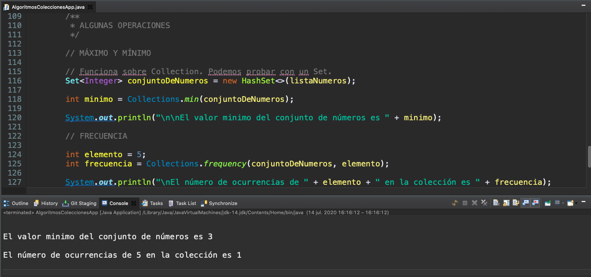

Podemos ver como obtenemos el mínimo y la frecuencia. 

Finalmente tenemos el método `disjoint(...)` que nos permite saber que elementos tienen en común dos colecciones, dos listas. Devuelve `true` si no lo tienen y `false` si tienen elementos en común. 

```java
// DISJOINT

List<Integer> pares = List.of(1,3,5,7,9);
List<Integer> impares = List.of(0,2,4,6,8);

if (Collections.disjoint(pares, impares)) {
   System.out.println("\nAmbas colecciones no tienen ningún elemento en común");
}
```


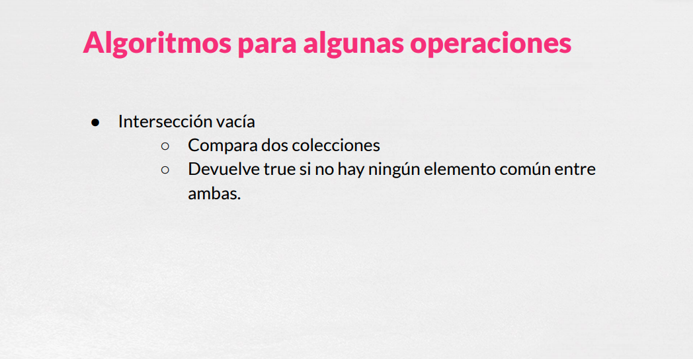
