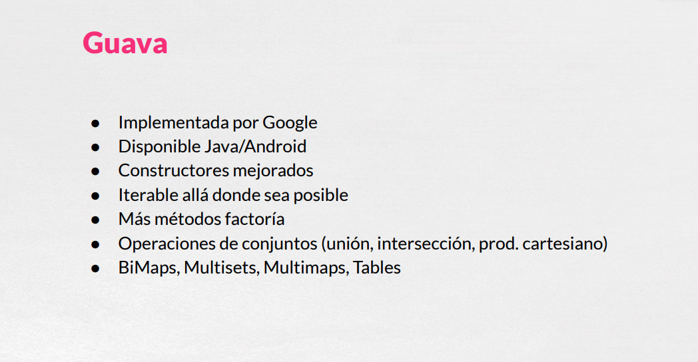
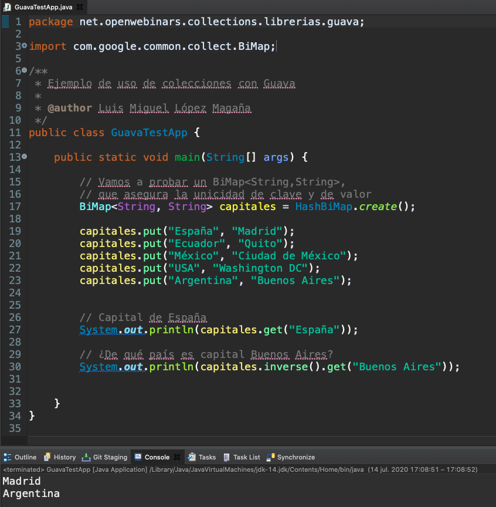
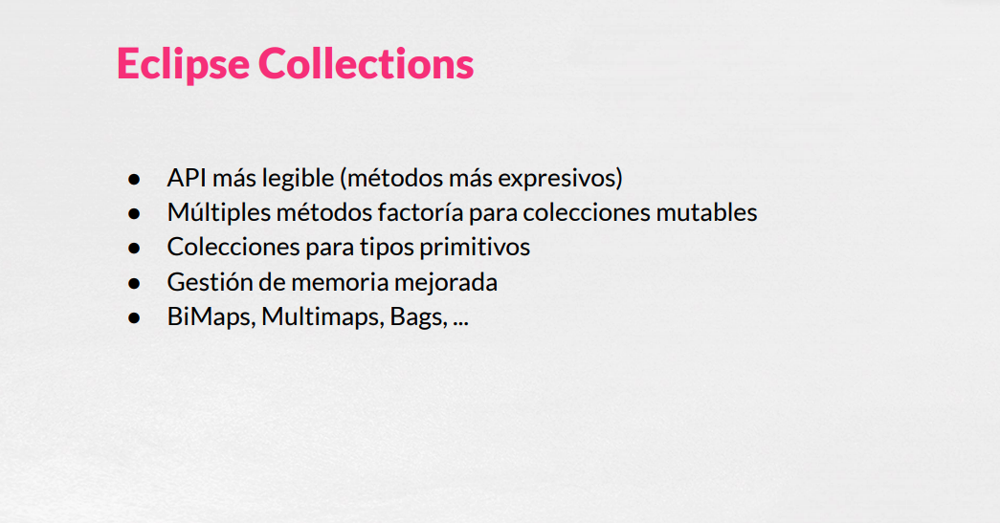
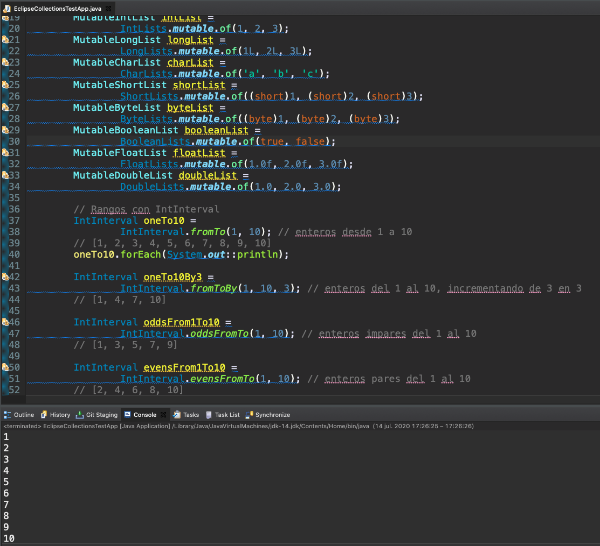
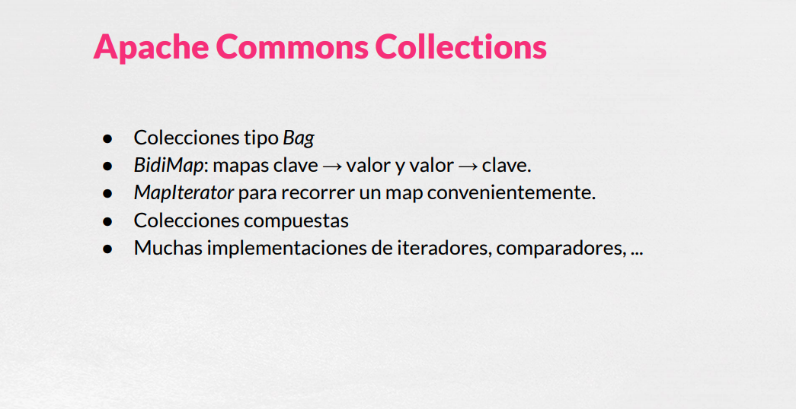
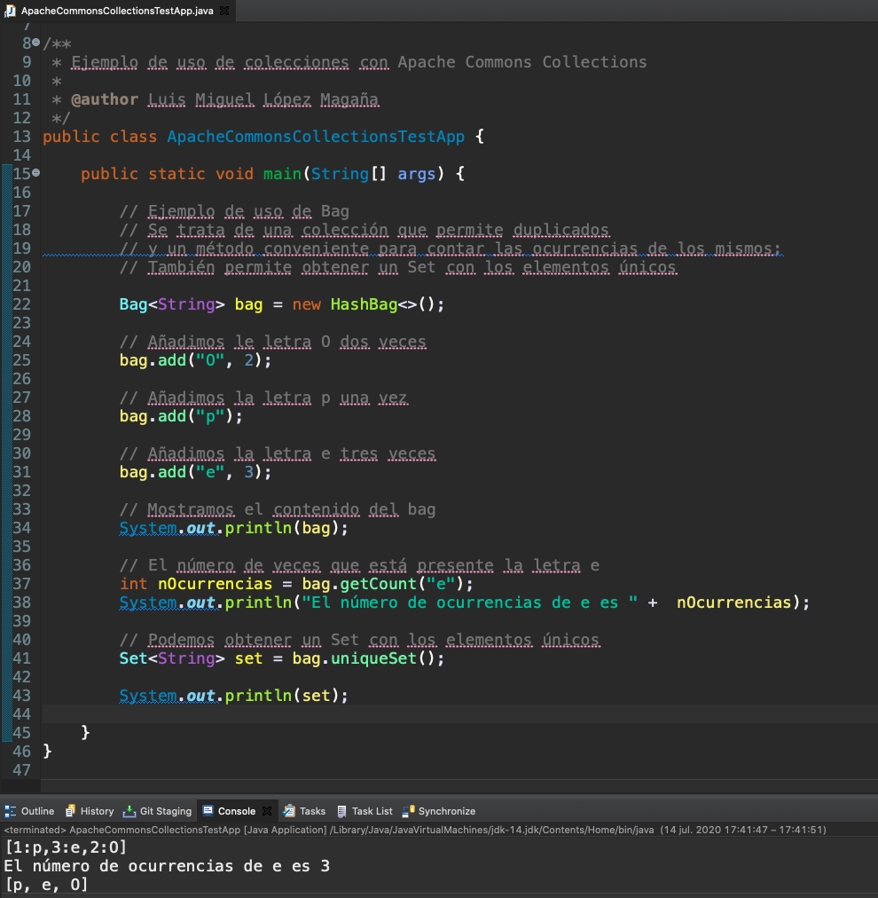

# 06 Librerías de Colecciones de Terceros


Y por último podríamos ver las librerías de colecciones de tercero.


Se trata de librerías de otros proveedores que podemos encontrar algunas como las de Google de **Guava**, **Eclipse Collections** y **Apache Commons Collections** son implementaciones de software que se utiliza mucho en el mercado o que están disponible para que tengamos operaciones que el propio framework de colecciones de Java no ofrece y que podríamos usar.

## Guava

https://guava.dev/



**Guava** esta implementada por Google como decíamos, la podemos utilizar tanto en Java como en Android, nos ofrece un montón de posibilidades, visitar la documentación, nos ofrece una serie de constructores bastante mejorado, se utiliza iterable allá siempre donde sea posible por hacerlo todo por un paraguas lo más común posible, tenemos más metodos factoría de los que nos ofrece Java directamente, operaciones con conjuntos, la unión, la intersección, el producto cartesiano de dos conjuntos y algunas colecciones un poco especiales como los `BiMaps`, `Multisets`, `Multimaps`, `Tables`, qué puede ser bastante útil en algunos contextos.

Tenemos por aquí un ejemplo de los tres, para poder utilizar estas librerías hemos creado un proyecto Maven en el mismo proyecto hemos hemos añadido las tres librerías, tendríamos aquí las dependencias también la documentación, para añadir la librería Guava, Eclipse Collections que necesita dos dependencias y las Apache Commons Collections que necesitaría una dependencia.

### :computer: Ejemplo de Aplicación Guava

```html
<?xml version="1.0" encoding="UTF-8"?>
<project xmlns="http://maven.apache.org/POM/4.0.0"
         xmlns:xsi="http://www.w3.org/2001/XMLSchema-instance"
         xsi:schemaLocation="http://maven.apache.org/POM/4.0.0 http://maven.apache.org/xsd/maven-4.0.0.xsd">
    <modelVersion>4.0.0</modelVersion>

    <groupId>org.example</groupId>
    <artifactId>ColeccionesTerceros</artifactId>
    <version>1.0-SNAPSHOT</version>

    <properties>
        <maven.compiler.source>1.11</maven.compiler.source>
        <maven.compiler.target>1.11</maven.compiler.target>
    </properties>


    <dependencies>
        <!-- Guava -->
        <dependency>
            <groupId>com.google.guava</groupId>
            <artifactId>guava</artifactId>
            <version>28.2-jre</version>
        </dependency>

        <!-- Eclipse Collections -->
        <dependency>
            <groupId>org.eclipse.collections</groupId>
            <artifactId>eclipse-collections-api</artifactId>
            <version>10.2.0</version>
        </dependency>

        <dependency>
            <groupId>org.eclipse.collections</groupId>
            <artifactId>eclipse-collections</artifactId>
            <version>10.2.0</version>
        </dependency>

        <!-- Apache Commons Collections -->
        <dependency>
            <groupId>org.apache.commons</groupId>
            <artifactId>commons-collections4</artifactId>
            <version>4.4</version>
        </dependency>

    </dependencies>

</project>
```

Para Guava por ejemplo.

```java
package net.openwebinars.collections.librerias.guava;

import com.google.common.collect.BiMap;
import com.google.common.collect.HashBiMap;

/**
 * Ejemplo de uso de colecciones con Guava
 *
 * 
 */
public class GuavaTestApp {

    public static void main(String[] args) {

        // Vamos a probar un BiMap<String,String>,
        // que asegura la unicidad de clave y de valor
        BiMap<String, String> capitales = HashBiMap.create();

        capitales.put("España", "Madrid");
        capitales.put("Ecuador", "Quito");
        capitales.put("México", "Ciudad de México");
        capitales.put("USA", "Washington DC");
        capitales.put("Argentina", "Buenos Aires");

        // Capital de España
        System.out.println(capitales.get("España"));

        // ¿De qué país es capital Buenos Aires?
        System.out.println(capitales.inverse().get("Buenos Aires"));
    }
}
```

Tenemos como ejemplo de Guava un `Map` doble que asegura la unicidad de la clave y el valor y que nos permite obtener el valor a partir de la clave o la clave a partir del valor, por ejemplo nos podría servir para guardar las capitales de diferentes países, mirar como tiene metodos convenientes para la creación en lugar de usar el constructor, algún método tipo factoría y podríamos añadir con el clásico `put` los distintos países con sus capitales y podemos comprobar como podríamos consultar el valor de una clave o también podríamos trabajar a la inversa y obtener el país de cual es capital una determinada ciudad, como por ejemplo sería de qué país es capital Buenos Aires, Argentina y la capital de España que es Madrid.



## Eclipse Collections

https://www.eclipse.org/collections/



Eclipse collections nos ofrece distintas alternativas, según su web nos ofrece una API que es más legible con métodos más efectivos, nos ofrece también múltiples métodos factoría para colecciones mutables no solamente inmutables como ofrente Java por defecto, nos ofrece colecciones para tipos primitivos sin tener que usar los tipos de envoltorio, una gestión de memoria mejorada y también algún tipo de colecciones como los `BiMaps`, `Multimaps`, `Bags`,...

### :computer: Ejemplo de Aplicación Eclipse Collections

Vamos a ver como ejemplo de Eclipse Collections uno que nos ofrecen en su web.

```java
package net.openwebinars.collections.librerias.eclipse;


import org.eclipse.collections.api.list.primitive.*;
import org.eclipse.collections.impl.factory.primitive.*;
import org.eclipse.collections.impl.list.primitive.IntInterval;

/**
 * Ejemplo de uso de colecciones con Eclipse Collections
 *
 * @author Luis Miguel López Magaña
 */
public class EclipseCollectionsTestApp {

    public static void main(String[] args) {

        // Colecciones para tipos primitivos
        //Mutable and immutable Lists, Sets, Bags, Stacks and Maps are available for all 8 primitive types
        MutableIntList intList =
                IntLists.mutable.of(1, 2, 3);
        MutableLongList longList =
                LongLists.mutable.of(1L, 2L, 3L);
        MutableCharList charList =
                CharLists.mutable.of('a', 'b', 'c');
        MutableShortList shortList =
                ShortLists.mutable.of((short)1, (short)2, (short)3);
        MutableByteList byteList =
                ByteLists.mutable.of((byte)1, (byte)2, (byte)3);
        MutableBooleanList booleanList =
                BooleanLists.mutable.of(true, false);
        MutableFloatList floatList =
                FloatLists.mutable.of(1.0f, 2.0f, 3.0f);
        MutableDoubleList doubleList =
                DoubleLists.mutable.of(1.0, 2.0, 3.0);

        // Rangos con IntInterval
        IntInterval oneTo10 =
                IntInterval.fromTo(1, 10); // enteros desde 1 a 10
        // [1, 2, 3, 4, 5, 6, 7, 8, 9, 10]
        oneTo10.forEach(System.out::println);

        IntInterval oneTo10By3 =
                IntInterval.fromToBy(1, 10, 3); // enteros del 1 al 10, incrementando de 3 en 3
        // [1, 4, 7, 10]

        IntInterval oddsFrom1To10 =
                IntInterval.oddsFromTo(1, 10); // enteros impares del 1 al 10
        // [1, 3, 5, 7, 9]

        IntInterval evensFrom1To10 =
                IntInterval.evensFromTo(1, 10); // enteros pares del 1 al 10
        // [2, 4, 6, 8, 10]
    }
}
```

En el que se van creando distintas colecciones de tipo primitivo, lo cual es bastante cómodo porque podríamos obtener listas de enteros, de long, de tipo char, de tipo short, de tipo byte, de booleans, de número en coma flot y double o incluso nos permitiría obtener rangos de colecciones rápidamente para números enteros, por ejemplo un intervalo con los 10 primeros números, los números del 1 al 10 pero tomados de 3 en 3, los números pares o impares directamente, con lo cual nos ofrecen unas funcionalidades que son ciertamente comodas, podemos ver como el intervalo del 1 al 10 a obtenido los números y podemos iterar sobre ellos perfectamente.



## Apache Commons Collections

https://commons.apache.org/proper/commons-collections/download_collections.cgi



Por último tenemos aquí la Apache Commons Collection la última librería que vamos a ver nos ofrece también alguna opciones como las colecciones tipo `Bag` será el ejemplo que veamos, los `BidiMap`,  también mapas clave-valor y valor-clave, un iterador para recorrer un map de una manera más conveniente, colecciones compuestas, muchas implementaciones de interadores, de comparadores etc.

### :computer: Ejemplo de Aplicación Apache Commons Collections

```java
package net.openwebinars.collections.librerias.apache;

import org.apache.commons.collections4.Bag;
import org.apache.commons.collections4.bag.HashBag;

import java.util.Set;

/**
 * Ejemplo de uso de colecciones con Apache Commons Collections
 *
 * 
 */
public class ApacheCommonsCollectionsTestApp {

    public static void main(String[] args) {

        // Ejemplo de uso de Bag
        // Se trata de una colección que permite duplicados
        // y un método conveniente para contar las ocurrencias de los mismos;
        // También permite obtener un Set con los elementos únicos

        Bag<String> bag = new HashBag<>();

        // Añadimos le letra O dos veces
        bag.add("O", 2);

        // Añadimos la letra p una vez
        bag.add("p");

        // Añadimos la letra e tres veces
        bag.add("e", 3);

        // Mostramos el contenido del bag
        System.out.println(bag);

        // El número de veces que está presente la letra e
        int nOcurrencias = bag.getCount("e");
        System.out.println("El número de ocurrencias de e es " +  nOcurrencias);

        // Podemos obtener un Set con los elementos únicos
        Set<String> set = bag.uniqueSet();

        System.out.println(set);
    }
}

```

Vamos a ver aquí cómo podríamos utilizar un `Bag` que es una colección que permite duplicados y que nos permite insertar un número repetido n veces un elemento, por ejemplo si podríamos insertar dos veces la letra `O` o una vez la letra `P`, tres veces la letra `E` y si mostramos el contenido del `Bag` podemos ver cómo nos devuelve los elementos con el número de ocurrencias que hay dentro. 

Podemos consultar con `getCount("e")` el número de ocurrencia de un elemento y también podemos obtener por ejemplo `Set<String> set = bag.uniqueSet();` un set con lo elementos únicos de la colección descartando los repetidos.



Sin más concluimos este taller en el que hemos aprendido a manejar las diferentes colecciones que nos ofrece Java tanto a diferenciar cuales son las interfaces que se ofrecen, las diferentes implementaciones, cuál es la más adecuada en cada momento, los diferente algoritmo y también algunas librerías como Guava, Eclipse Collections o también las colecciones de Apache Commons Collections por si alguna vez necesitamos alguna implementación un poco más peculiar para introducir en nuestros proyectos.
