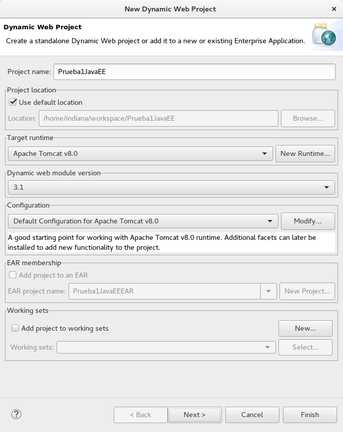
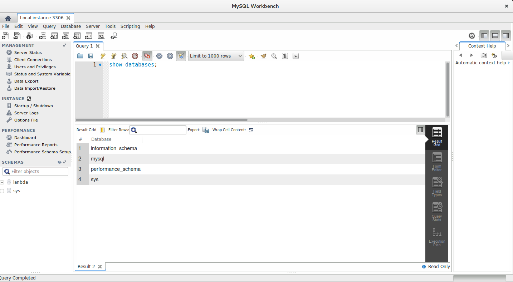

# 1. Instalación y configuración 43m

   * Introducción a Java EE y presentación del curso 5:13 
   * Desarrollo en local Vs desarrollo en Red 1:30 
   * Instalación de JDK 8 Java 8:01 
   * Instalación de Apache Tomcat 8 12:04 
   * Instalación de Eclipse IDE 12:34 
   * Instalación de MySQL Server y y MySQL Workbench (GUI) 3:49 
   * Contenido adicional 6
   
## Introducción a Java EE y presentación del curso 5:13

[Presentación 1](pdfs/1.pdf)

Java Platform, Enterprise Edition o Java EE (anteriormente conocido como Java 2 Platform, Enterprise Edition o J2EE hasta la versión 1.4), es una plataforma de programación para desarrollar y ejecutar aplicaciones para servidores en el lenguaje de programación Java. Permite utilizar arquitecturas de N capas distribuidas y componentes de software modulares ejecutándose sobre un servidor de aplicaciones. Incluye Enterprise JavaBeans (EJB), JavaServer Pages (JSP), Servlets, Java Database Connectivity (JDBC), Java Naming and Directory Interface (JNDI), Java Message Service (JMS), Java Remote Method Invocation (RMI) y especificaciones para interactuar con sistemas de Administración ya implantados en empresas.

Conocimientos previos necesarios:

* Java SE: variables, tipos de datos, estructuras de control, clases y objetos, herencia, JavaBeans.

* HTML y CSS: conocimientos básicos.

* SQL: crear una nueva base de datos, realizar consultas o insertar registros en la BD (select, insert, delete, update).

Resumen general de los contenidos del curso y objetivos a alcanzar:

* Instalar y configurar el entorno de desarrollo en un sistema operativo Linux.

* Utilizar clases tipo JavaBeans como clases de Modelo en una aplicación web.

* Utilizar clases Java Servlets como componentes tipo Controller para controlar el flujo de las peticiones HTTP.

* Utilizar los JSP (Java Server Page) como componentes de Vista en una aplicación web.

* Crear aplicaciones web utilizando el patrón de diseño MVC (Model View Controller)

* Acceder a la capa de persistencia de datos de la aplicación utilizando JDBC (Java Database Connectivity).

* Ilustrar todos los conceptos explicados durante el curso utilizando un ejemplo basado en el desarrollo de una aplicación web real utilizando Eclipse IDE, Apache Tomcat y MySQL Server.

REPOSITORIO DEL CURSO:  https://github.com/OpenWebinarsNet/Curso_java_ee_ejemplos

## Desarrollo en local Vs desarrollo en Red 1:30 

[Presentación 2](pdfs/2.pdf)

**Entorno local**, basado en nuestro propio equipo de trabajo. Es el que utilizaremos durante este curso.

**Entorno basado en red (LAN o WAN)**, tendremos instalado en nuestro equipo el JDK y algunas librerías de Tomcat que son necesarias para compilar los servlets. Para probar el proyecto tendremos que desplegarlo en un servidor de aplicaciones que tendrá instalado Tomcat y MySQL Server. Para las pruebas de desarrollo se recomienda el uso de servidores de preproducción antes de subir a producción.

## Instalación de JDK 8 Java 8:01 

[Presentación 3](pdfs/3.pdf)

Descargar JDK desde la web de Oracle para el sistema operativo (Linux, MAC, Solaris, Windows, ...) y arquitectura (32bits, 64bits, ...) que tengamos:

Nos logueamos como usuario “root”.

Descomprimir el fichero .tar.gz manteniendo los permisos:

```sh
root@Ubuntu:~/Descargas# tar -xvzpf jdk-8u121-linux-x64.tar.gz
jdk1.8.0_121/
jdk1.8.0_121/THIRDPARTYLICENSEREADME-JAVAFX.txt
jdk1.8.0_121/THIRDPARTYLICENSEREADME.txt
jdk1.8.0_121/lib/
jdk1.8.0_121/lib/jexec
jdk1.8.0_121/lib/javafx-mx.jar
jdk1.8.0_121/lib/packager.jar
jdk1.8.0_121/lib/visualvm/
jdk1.8.0_121/lib/visualvm/visualvm/
jdk1.8.0_121/lib/visualvm/visualvm/modules/
jdk1.8.0_121/lib/visualvm/visualvm/modules/com-sun-tools-visualvm-attach.jar
jdk1.8.0_121/lib/visualvm/visualvm/modules/com-sun-tools-visualvm-host-views.jar
jdk1.8.0_121/lib/visualvm/visualvm/modules/locale/
jdk1.8.0_121/lib/visualvm/visualvm/modules/locale/com-sun-tools-visualvm-sampler_zh_CN.jar
.
.
.
jdk1.8.0_121/man/ja_JP.UTF-8/man1/javac.1
jdk1.8.0_121/man/ja_JP.UTF-8/man1/wsimport.1
jdk1.8.0_121/man/ja_JP.UTF-8/man1/tnameserv.1
jdk1.8.0_121/man/ja_JP.UTF-8/man1/pack200.1
jdk1.8.0_121/man/ja_JP.UTF-8/man1/jcmd.1
jdk1.8.0_121/man/ja_JP.UTF-8/man1/javapackager.1
jdk1.8.0_121/man/ja_JP.UTF-8/man1/jstat.1
```

Crear directorio definitivo y mover el contenido de la carpeta a `/usr/lib/jvm/jdk1.8.0`:

```sh
root@Ubuntu:~/Descargas# mkdir -p /usr/lib/jvm/jdk1.8.0

root@Ubuntu:~/Descargas# ls
jdk1.8.0_121  jdk-8u121-linux-x64.tar.gz

root@Ubuntu:~/Descargas# mv jdk1.8.0_121/* /usr/lib/jvm/jdk1.8.0
```

Añadir la instalación de Java como alternativa disponible en el sistema:

```sh
root@Ubuntu:~/Descargas# update-alternatives --install "/usr/bin/java""java""/usr/lib/jvm/jdk1.8.0/bin/java"1
update-alternatives: utilizando /usr/lib/jvm/jdk1.8.0/bin/java para proveer /usr/bin/java (java) en modo automático

root@Ubuntu:~/Descargas# update-alternatives --install "/usr/bin/javac""javac""/usr/lib/jvm/jdk1.8.0/bin/javac"1
update-alternatives: utilizando /usr/lib/jvm/jdk1.8.0/bin/javac para proveer /usr/bin/javac (javac) en modo automático

root@Ubuntu:~/Descargas# update-alternatives --install "/usr/bin/javaws""javaws""/usr/lib/jvm/jdk1.8.0/bin/javaws"1
update-alternatives: utilizando /usr/lib/jvm/jdk1.8.0/bin/javaws para proveer /usr/bin/javaws (javaws) en modo automático
```

Para añadir al environment (variables de entorno del sistema) el PATH de los binarios de java (JAVA_HOME) añadiremos las siguientes líneas a un fichero `java.sh` que ubicaremos en el directorio `/etc/profile.d`:

```sh
root@Ubuntu:~# nano /etc/profile.d/java.sh
export JAVA_HOME="/usr/lib/jvm/jdk1.8.0"
export PATH="$PATH:$JAVA_HOME/bin"

export JAVA_HOME="/usr/lib/jvm/jdk1.8.0/bin"
export PATH="$PATH:$JAVA_HOME"
```

Estableceremos permisos de ejecución y recargaremos el entorno manualmente para evitar reiniciar el equipo:

```sh
root@Ubuntu:~# chmod +x /etc/profile.d/java.sh

root@Ubuntu:~# . /etc/profile.d/java.sh
```

Comprobar la instalación:

```sh
root@Ubuntu:~/Descargas# java -version
java version "1.8.0_121"
Java(TM) SE Runtime Environment (build 1.8.0_121-b13)
Java HotSpot(TM) 64-Bit Server VM (build 25.121-b13, mixed mode)


root@Ubuntu:/home/indiana/Descargas# update-alternatives --config java
Existen 3 opciones para la alternativa java (que provee /usr/bin/java).

  Selección   Ruta                                            Prioridad  Estado
------------------------------------------------------------
  0            /usr/lib/jvm/java-8-openjdk-amd64/jre/bin/java   1081      modo automático
  1            /usr/lib/jvm/java-8-openjdk-amd64/jre/bin/java   1081      modo manual
  2            /usr/lib/jvm/java-8-oracle/jre/bin/java          1081      modo manual
* 3            /usr/lib/jvm/jdk1.8.0/bin/java                   1         modo manual
```

Para configurar variables de entorno en Linux, y que las aplicaciones estén disponibles desde cualquier parte del sistema, debemos configurar el acceso a los binarios (java, tomcat, ...) añadiendo manualmente su ruta a la variable de entorno del sistema PATH.

```sh
root@Ubuntu:~# env | grep PATH
PATH=/usr/local/sbin:/usr/local/bin:/usr/sbin:/usr/bin:/sbin:/bin:/snap/bin
```

El PATH informa al shell dónde se encuentran los programas binarios que se pueden ejecutar en el sistema sin tener que llamarlos por su ruta absoluta.

¿Dónde están los archivos de configuración del PATH?

Los archivos globales del sistema, que se aplican para todos los usuarios, están en:

* `/etc/profile`
* `/etc/profile.d/`
* `/etc/bashrc o etc/bash.bashrc`

Los archivos del espacio de usuario están en:

* `~/.bashrc`
* `~/.bash_profile`

## Instalación de Apache Tomcat 8 12:04 

[Presentación 4](pdfs/4.pdf)

Descargamos la última revisión de la versión 8.0 (8.0.41) desde la zona de descargas de la web de Apache Tomcat http://tomcat.apache.org

Como usuario normal, descomprimimos el fichero (.tar.gz, .zip) y movemos su contenido a su ubicación definitiva, en este caso, será el directorio tomcat ubicado en el HOME de usuario.

```sh
indiana@Ubuntu:~/Descargas$ tar -xvzf apache-tomcat-8.0.41.tar.gz
indiana@Ubuntu:~/Descargas$ mv apache-tomcat-8.0.41 ~/tomcat
```

Como root, establecemos los permisos del directorio tomcat.

```sh
root@Ubuntu:~# chown -hR indiana:indiana/home/indiana/tomcat
root@Ubuntu:~# chmod +x /home/indiana/tomcat/bin/*
```

Y añadimos la variable de entorno CATALINA_HOME de forma análoga a como lo hicimos con Java, utilizando el fichero `/etc/profile.d/tomcat.sh`:

```sh
root@Ubuntu:~# nano /etc/profile.d/tomcat.sh
export CATALINA_HOME=/home/indiana/tomcat
export PATH="$PATH:$CATALINA_HOME"

root@Ubuntu:~# chmod +x /etc/profile.d/tomcat.sh

root@Ubuntu:~# . /etc/profile.d/tomcat.sh
```

Como usuario, arrancamos el servicio:

```sh
indiana@Ubuntu:~# $CATALINA_HOME/bin/startup.sh
Using CATALINA_BASE:   /home/indiana/tomcat
Using CATALINA_HOME:   /home/indiana/tomcat
Using CATALINA_TMPDIR: /home/indiana/tomcat/temp
Using JRE_HOME:        /usr/lib/jvm/jdk1.8.0
Using CLASSPATH:       /home/indiana/tomcat/bin/bootstrap.jar:/home/indiana/tomcat/bin/tomcat-juli.jar
Tomcat started.
```

Accedemos a la interfaz web del servidor de aplicaciones Tomcat8 escribiendo en nuestro navegador `http:localhost:8080` (desarrollo local) o `http:<IP>:8080` (desarrollo en red):

Para añadir un usuario administrador a la interfaz web de Tomcat editaremos el fichero `<RUTA>/conf/tomcat-users.xml` e insertaremos las siguientes líneas al final del fichero pero antes de la etiqueta `</tomcat-users>`:

```sh
root@Ubuntu:~# nano /home/indiana/tomcat/conf/tomcat-users.xml 
<role rolename="manager-gui"/>
<role rolename="admin"/>
<user name="admin" password="admin" roles="manager-gui,admin"/>
</tomcat-users>
```

Y reiniciaremos el servicio:

```sh
root@Ubuntu:~# $CATALINA_HOME/bin/shutdown.sh 
Using CATALINA_BASE:   /home/indiana/tomcat
Using CATALINA_HOME:   /home/indiana/tomcat
Using CATALINA_TMPDIR: /home/indiana/tomcat/temp
Using JRE_HOME:        /usr/lib/jvm/jdk1.8.0
Using CLASSPATH:       /home/indiana/tomcat/bin/bootstrap.jar:/home/indiana/tomcat/bin/tomcat-juli.jar

root@Ubuntu:~# $CATALINA_HOME/bin/startup.sh
Using CATALINA_BASE:   /home/indiana/tomcat
Using CATALINA_HOME:   /home/indiana/tomcat
Using CATALINA_TMPDIR: /home/indiana/tomcat/temp
Using JRE_HOME:        /usr/lib/jvm/jdk1.8.0
Using CLASSPATH:       /home/indiana/tomcat/bin/bootstrap.jar:/home/indiana/tomcat/bin/tomcat-juli.jar
Tomcat started.
```

A partir de ahora ya podemos acceder a la interfaz de administración, con usuario y clave admin/admin, en la URL: `http:localhost:8080/manager/html`

Para comprobar que el servidor de aplicaciones funciona correctamente podemos desplegar una aplicación de ejemplo, descargando el fichero .war adjunto (SimpleServlet.war) y subiéndolo desde el menú “Archivo WAR a desplegar”. Tras subirlo podemos acceder a la aplicación en `http:localhost:8080/SimpleServlet`

### Instalar tomcat como servicio del sistema

Como root, creamos el grupo “tomcat” y el usuario “tomcat” (especificando como HOME el directorio de tomcat).

```sh
root@Ubuntu:~# groupadd tomcat
root@Ubuntu:~# useradd -s /bin/false -g tomcat -d /home/indiana/tomcat tomcat
```

Establecemos los permisos correctos del directorio tomcat.

```sh
root@Ubuntu:~# chown -hR tomcat:tomcat /home/indiana/tomcat
root@Ubuntu:~# chmod +x /home/indiana/tomcat/bin/*
```

Creamos un fichero descriptor del servicio tomcat, para Systemd, utilizando la ruta de instalación de nuestro Tomcat8 (`/home/USERNAME/tomcat`).

```sh
root@Ubuntu:~# nano /etc/systemd/system/tomcat.service

[Unit]
Description=Apache Tomcat Web Application Container
After=syslog.target network.target

[Service]
User=tomcat
Group=tomcat
Type=forking

Environment=CATALINA_PID=/home/indiana/tomcat/tomcat.pid
Environment=CATALINA_HOME=/home/indiana/tomcat
Environment=CATALINA_BASE=/home/indiana/tomcat

ExecStart=/home/indiana/tomcat/bin/startup.sh
ExecStop=/home/indiana/tomcat/bin/shutdown.sh
Restart=on-failure

[Install]
WantedBy=multi-user.target
```

Iniciamos el servicio y los añadimos al arranque del sistema:

```sh
root@Ubuntu:~# systemctl daemon-reload

root@Ubuntu:~# systemctl start tomcat

root@Ubuntu:~# systemctl enable tomcat
Created symlink from /etc/systemd/system/multi-user.target.wants/tomcat.service to /etc/systemd/system/tomcat.service.

root@Ubuntu:~# systemctl status tomcat
```

### Firewall por defecto en Ubuntu

UFW - Uncomplicated Firewall (`https://help.ubuntu.com/community/UFW`)

Si tenemos habilitado el firewall de Ubuntu (UFW), para acceder al servidor Tomcat desde otros equipos de la LAN tendremos que abrir el puerto 8080. Para ello ejecutamos como root:

```sh
root@Ubuntu:~# ufw allow 8080
Regla añadida
Regla añadida (v6)

root@Ubuntu:~# ufw status
Estado: activo
Hasta                      Acción      Desde
-----                      ------      -----
8080                       ALLOW       Anywhere                  
8080 (v6)                  ALLOW       Anywhere (v6)   
```

Otros servidores de aplicaciones

* Glassfish (`https://glassfish.java.net`)

* Red Hat JBoss Enterprise Application Platform (`https://developers.redhat.com/products/eap/overview`)

## Instalación de Eclipse IDE 12:34 

[Presentación 5](pdfs/5.pdf)

Descargamos el instalador (Linux 32-bit or 64-bit) de la sección de [Descargas de la web de Eclipse](https://www.eclipse.org/downloads/).

Descomprimimos el archivador (.tar.gz) y ejecutamos el asistente de instalación (eclipse-inst).

Y seleccionamos Eclipse IDE for Java EE Developers

Tras finalizar la instalación ejecutamos Eclipse IDE y seleccionamos el directorio de trabajo (workspace) donde queremos que se almacenen los proyectos.

Al abrirse la aplicación nos solicitará el tipo de proyecto con el que queremos trabajar, seleccionaremos Java EE Web Project.

Y en la siguiente ventana indicamos:

Project name: “Prueba1JavaEE”, el resto según la captura:



Para integrar nuestro servidor de Apache Tomcat8 en nuestro IDE de desarrollo, pulsamos:

* Target runtime: “New Runtime”

* New Server Runtime Environment:

   * “Apache Tomcat v8.0”
   
   * “Create a new local server”
   
En nuestro caso la ruta correcta es `/home/indiana/tomcat` especificando también el JDK instalado.

Una vez añadido el nuevo server, continuamos con las creación del proyecto y en la ventana final marcamos generar web.xml.

### Lanzador para Unity

Para los usuarios del escritorio por defecto de Ubuntu (Unity) crearemos un lanzador para Eclipse creando el siguiente fichero en el home de nuestro usuario (USERNAME):

`gedit ~/.local/share/applications/eclipse.desktop`

```sh
[Desktop Entry]
Name=Eclipse
Type=Application
Exec=/home/USERNAME/eclipse/jee-neon/eclipse/eclipse
Terminal=false
Icon=/home/USERNAME/eclipse/jee-neon/eclipse/icon.xpm
Comment=Integrated Development Environment
NoDisplay=false
Categories=Development;IDE;
Name[en]=Eclipse
```

## Instalación de MySQL Server y y MySQL Workbench (GUI) 3:49 

[Presentación 6](pdfs/6.pdf)

Para la instalación del servidor de bases de datos y la herramienta gráfica de trabajo utilizaremos el repositorio de Ubuntu.

```sh
root@elrond:~# apt-get install mysql-server mysql-workbench
Leyendo lista de paquetes... Hecho
Creando árbol de dependencias       
Leyendo la información de estado... Hecho
mysql-server ya está en su versión más reciente (5.7.17-0ubuntu0.16.04.1).
Los paquetes indicados a continuación se instalaron de forma automática y ya no son necesarios.
...
```

Seleccionamos “holamundo” como clave de root.

Accedemos al servidor mediante consola: `mysql -u root -p`

```sh
root@elrond:~# mysql -u root -p
Enter password: 
Welcome to the MySQL monitor.  Commands end with ; or \g.
Your MySQL connection id is 6
Server version: 5.7.17-0ubuntu0.16.04.1 (Ubuntu)

Copyright (c) 2000, 2016, Oracle and/or its affiliates. All rights reserved.

Oracle is a registered trademark of Oracle Corporation and/or its
affiliates. Other names may be trademarks of their respective
owners.
Type 'help;' or '\h' for help. Type '\c' to clear the current input statement.
mysql
```

Instalamos MySQL Workbenck y configuramos el acceso como root y ejecutamos una instrucción de ejemplo: show databases;




## Contenido adicional 6   

[Presentación 1](pdfs/1.pdf)

[Presentación 2](pdfs/2.pdf)

[Presentación 3](pdfs/3.pdf)

[Presentación 4](pdfs/4.pdf)

[Presentación 5](pdfs/5.pdf)

[Presentación 6](pdfs/6.pdf)
