# 2. Estructura de una aplicación web Java EE 31m

   * Estructura de directorios de Apache Tomcat 3:31 
   * Estructura de una aplicación web Java EE 9:21 
   * Configurar el Administrador de Aplicaciones de Apache Tomcat 7:31 
   * Crear una aplicación web “Prueba” utilizando Eclipse IDE 11:18 
   * Contenido adicional 4
   
   
## Estructura de directorios de Apache Tomcat 3:31 

[Presentación 7](pdfs/7.pdf)

Repasar estructura de ficheros y directorios utilizando Nautilus.

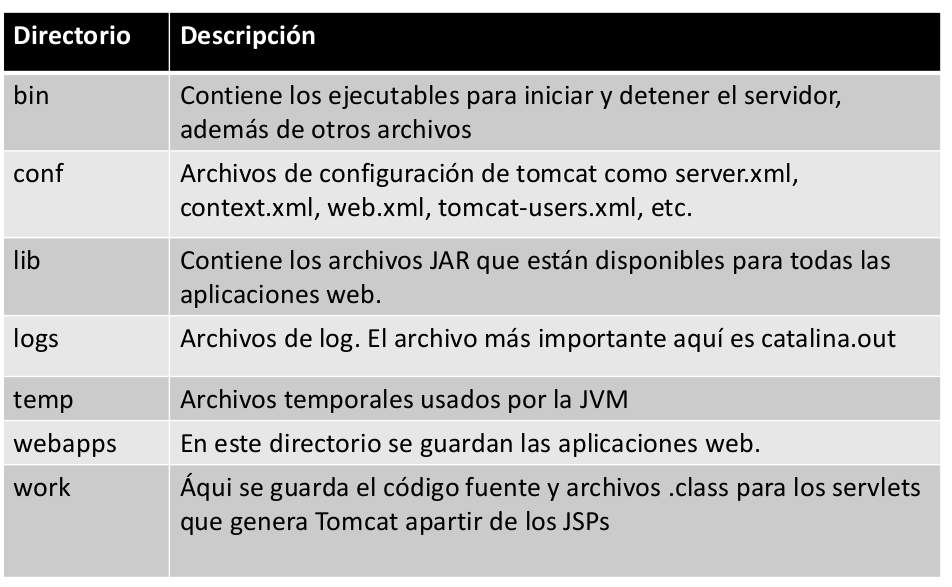

* Lib, archivos para ejecutar Apache Tomcat + librerías globales que podrán utilizar todas las aplicaciones que se ejecuten en Apache Tomcat.
* Logs, “catalina.out” es el log principal de Tomcat.
* Webapps, aplicaciones instaladas en Tomcat. Por defecto trae algunas:
   * docs, documentación.
   * examples, ejemplos de aplicaciones.
   * manager, para administrar la aplicaciones de nuestro servidor.

## Estructura de una aplicación web Java EE 9:21 

[Presentación 8](pdfs/8.pdf)

Repasar estructura de ficheros y directorios utilizando Nautilus.

Creación **manual** (sin IDE) de una aplicación (helloWorld).

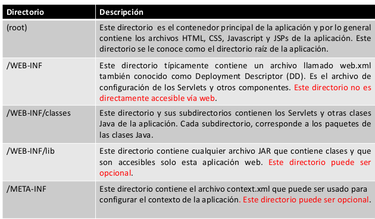

**Fichero web.xml**

Indica el fichero inicial de la aplicación.

```xml
<?xml version="1.0" encoding="UTF-8"?>
<web-app version="3.1" xmlns="http://xmlns.jcp.org/xml/ns/javaee" xmlns:xsi="http://www.w3.org/2001/XMLSchema-instance" xsi:schemaLocation="http://xmlns.jcp.org/xml/ns/javaee http://xmlns.jcp.org/xml/ns/javaee/web-app_3_1.xsd">
	 <description>Aplicación Hola mundo.</description>
    <display-name>Mi primera aplicacion web Java EE</display-name>    
    <welcome-file-list>
        <welcome-file>index.html</welcome-file>
    </welcome-file-list>
</web-app>
```

**Fichero context.xml**

Define la ruta (URL) a añadir a la ruta del servidor de aplicaciones para acceder a nuestra aplicación. Es una ruta relativa al directorio `$CATALINA_HOME/webapps`.

```xml
<?xml version="1.0" encoding="UTF-8"?>
<Context path="/helloWorld"/>
```

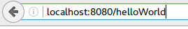

Copiamos la carpeta de la aplicación `helloWorld`, arrancamos Tomcat desde terminal `$CATALINA_HOME/bin/startup.sh` y accedemos desde nuestro navegador a la ruta definida por el Context path”:

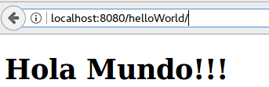

## Configurar el Administrador de Aplicaciones de Apache Tomcat 7:31 

[Presentación 9](pdfs/9.pdf)

* Es una aplicación preinstalada en Apache Tomcat que permite detener, reiniciar , instalar, eliminar aplicaciones web.

* Por defecto, no se permite el acceso a dicha aplicación hasta que no se configura el usuario manager como vimos en el punto de instalación de Apache Tomcat.

Ejercicio ejemplo:

1. Accedemos desde la interfaz web al Manager App sin configurar el usuario “manager-gui”. Vemos el mensaje de error.
2. Configuramos el usuario “manager-gui”.
3. Reiniciamos Tomcat y volvemos a probar.
4. Accedemos y vemos ejemplos de uso de:
   * Nombre de aplicaciones y acceso con “click”
   * Detener aplicación (“Parar”) e intentar acceder
   * Eliminar aplicación (“Replegar”)
   * Sesiones activas y hacer click en una (e.j. manager) para ver detalles (id sesión, usuario logueado, fecha inicio, tiempo logueado, …).
   * Explicar uso de la sección de despliegue mediante fichero .war.

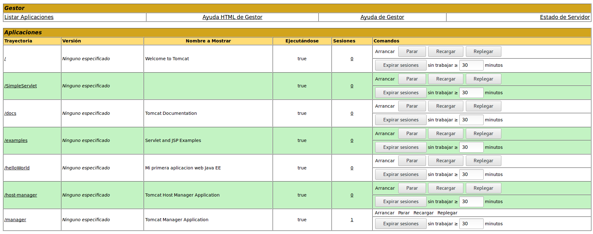

## Crear una aplicación web “Prueba” utilizando Eclipse IDE 11:18 

[Presentación 10](pdfs/10.pdf)

Creación de una aplicación (Prueba1JavaEE) mediante IDE (Entorno de Desarrollo Integrado).

Repasar estructura de ficheros y directorios que crea utilizando el explorar de ficheros de Eclipse IDE.


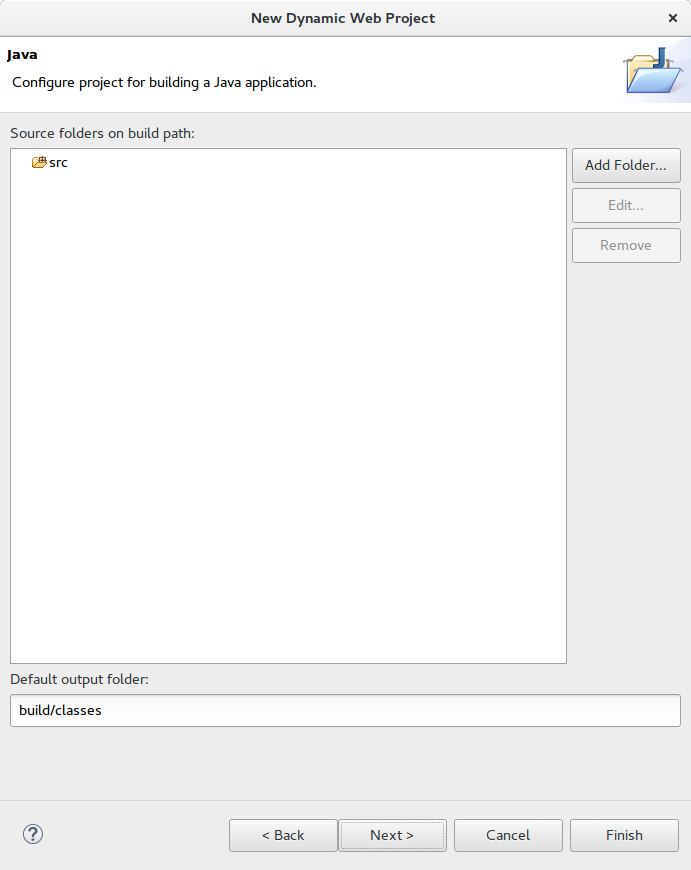

y en la ventana final marcamos generar web.xml.

* Context root, URL para acceder a la aplicación web.

* Content directory, nombre del directorio público (raíz) de nuestra aplicación web.

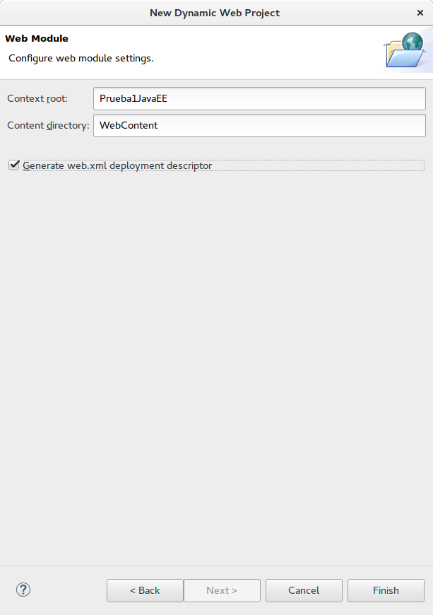

Tras pulsa en finalizar tenemos:

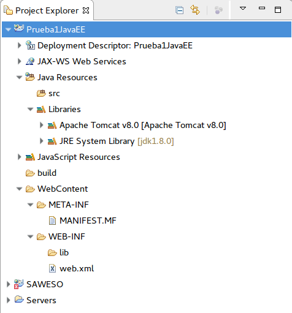

### Estructura

* Java Resources

   * **src**, contiene todas las clases Java y Servlets. Equivalente al directorio WEB-INF/classes de una aplicación web Java EE.
   * **Libraries**, librerías por defecto accesibles por la aplicación (tomcat, JRE, ...). Cuando se agreguen archivos JAR, será equivalente a WEB-INF/lib.

* **build**, contiene las clases compiladas .class, archivos .war, ...

* **WebContent**, directorio raíz de nuestra aplicación web Java EE. Aquí van todos los archivos html, JSPs, imágenes, JS, CSS. Equivalente al directorio root de una web app.

   * **META-INF**, directorio de una aplicación web descrito anteriormente.
   
      * **MANIFEST.MF**, contiene información sobre los ficheros contenidos habitualmente en un .JAR. Ejemplo:
      
      ```sh
      Manifest-Version: 1.0
      		          Created-By: 1.8.0_121 (Oracle Corporation)
      ```
		
   * **WEB-INF**, directorio de una aplicación web descrito anteriormente.

      * **lib**

      * **web.xml**
      
Dentro de la aplicación pulsamos sobre el proyecto y le damos a crear nuevo fichero .html con nombre index.html y usaremos plantilla HTML 5. Se creará dentro de WebContent.

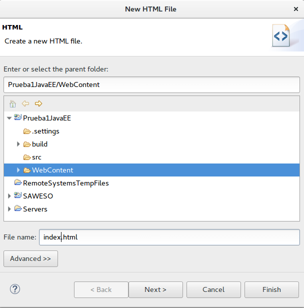

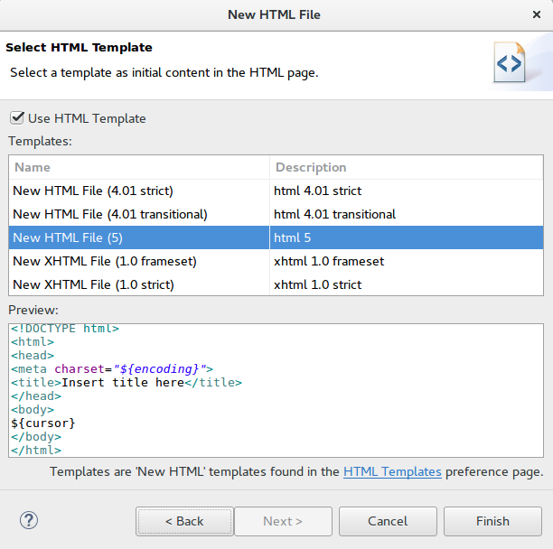

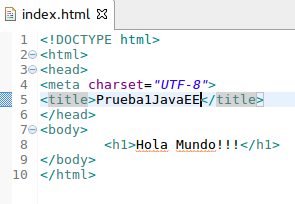

Editamos el fichero descriptor de despliegue (web.xml) para dejar solo el index.html como fichero principal y borrar el resto:

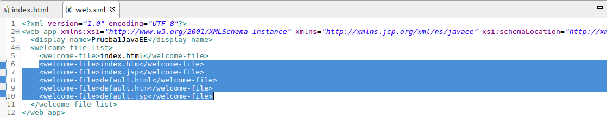

Ahora ejecutamos el proyecto en Tomcat: Rus as →Run On Server

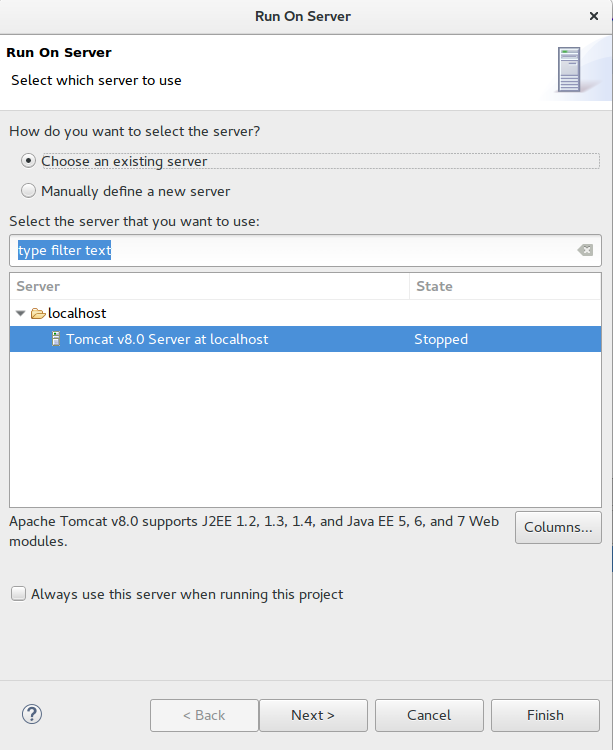

En la consola vemos como se levanta el servidor Apache Tomcat.

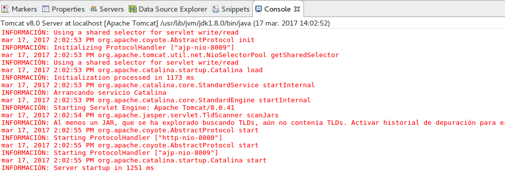

Y finalmente nos muestra la aplicación.

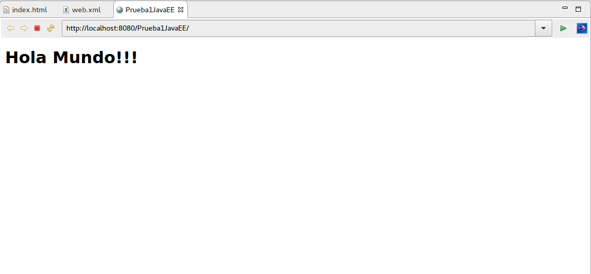

### Exportar .WAR

Wikipedia: “WAR file (or Web application ARchive) is a JAR (Java ARchive) file used to distribute a collection of JavaServer Pages, Java Servlets, Java classes, XML files, tag libraries, static web pages (HTML and related files) and other resources that together constitute a web application.”

Para exportar nuestra aplicación al formato estándar, que vimos en el punto anterior al crear una aplicación web manualmente, seleccionamos el proyecto: Prueba1JavaEE → Botón derecho → Export → WAR File

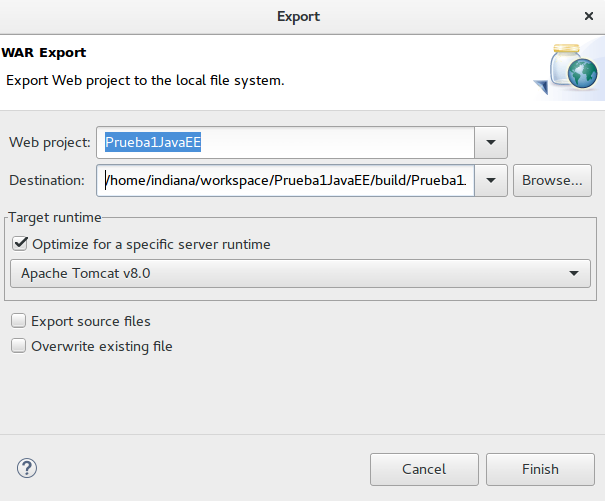

Si vemos su contenidos coincide con el de una aplicación web estándar:

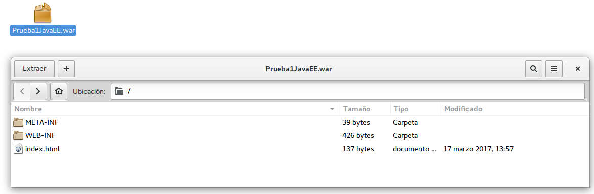

La estructura de cada IDE de desarrollo depende de la herramienta pero al exportarla el formato y estructura de carpetas será el estándar.

## Contenido adicional 4   

[Presentación 7](pdfs/7.pdf)

[Presentación 8](pdfs/8.pdf)

[Presentación 9](pdfs/9.pdf)

[Presentación 10](pdfs/10.pdf)
