# 3. Conceptos esenciales de Java Servlets 60m

   * ¿Cómo funciona una aplicación web? 2:19 
   * ¿Cuáles son las diferencias entre las páginas web estáticas y dinámicas? 1:52 
   * ¿Que es un Java Servlet? 2:18 
   * Creación de un Java Servlet 10:45 
   * Ejecutar un Servlet desde una URL 5:25 
   * Enviar y recibir parámetros en un Java Servlet 10:25 
   * Generar código HTML dinámico en un Servlet 5:27 
   * Ciclo de vida Request-Response en una aplicación web 2:30 
   * Encabezado de respuesta (Content-Type) 5:10 
   * Redireccionar respuesta a otra URL 4:15 
   * Subir archivos al servidor utilizando un Servlet 9:31 
   * Contenido adicional 11
   
   
## ¿Cómo funciona una aplicación web? 2:19 

[Presentación 11](pdfs/11.pdf)

Una aplicación web es un conjunto de páginas web que son generadas en respuesta a peticiones de un usuario.

Las peticiones puedes ser del tipo:

* Acceso a URLs
* Descarga de software
* Formularios web
* ...

Las respuesta pueden ser:

* Documento HTML
* Imagen
* PDF
* Vídeo o Sonido
* Mensaje de error
* Redirección a otro sitio
* ...

Para acceder a las aplicaciones web, a diferencia de las aplicaciones de escritorio, se utiliza un navegador web desde cualquier tipo de dispositivo.

La aplicaciones web responden al modelo cliente/servidor:

1. El cliente (PC) solicita acceso a una aplicación que se encuentra en un servidor.
2. El servidor se encuentre en espera a la llegada de la petición del cliente y responde tras recibirla.

   * Tras recibir la petición el servidor crea un proceso o hilo para atender la solicitud. Este hilo se cierra cuando se termina de atender la petición.
   * El hilo asignado en el servidor responde y regresa al estado de “espera”.


## ¿Cuáles son las diferencias entre las páginas web estáticas y dinámicas? 1:52 

[Presentación 12](pdfs/12.pdf) 

Una página web estática es un documento HTML almacenado en un archivo (.html/.htm) que no cambia de contenido cuando se envían como respuesta a las peticiones de los usuarios. Otros tipo de respuestas también pueden ser: imágenes, vídeos, ...

* Hypertext Markup Language (HTML) es el lenguaje que los navegadores web utilizan para mostrar (render) las páginas web al usuario final.

* Hypertext Transfer Protocol (HTTP) es el protocolo que los navegadores web y los servidores web usan para comunicarse entre ellos.

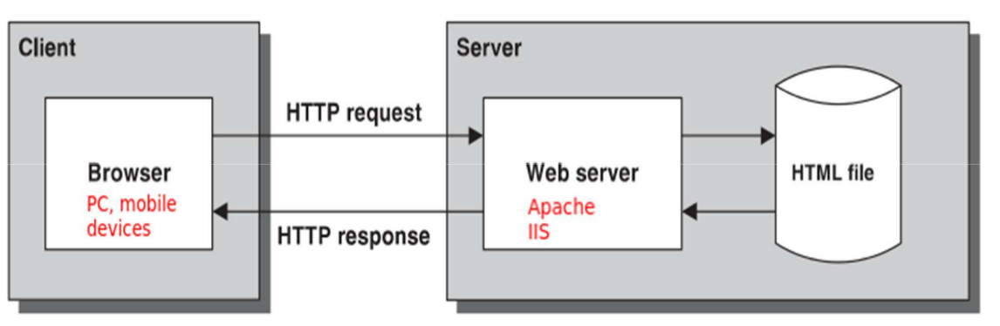

A diferencia de una página web estática, una página web dinámica cambia en base a los parámetros que son enviados por el usuario o por otra página. La páginas web dinámicas son documentos HTML generados por la aplicación web que estará desarrollada por un lenguaje de programación ejecutado en el servidor (Java , PHP, .NET, ...)

Las aplicaciones web dinámicas almacenan y recuperan los datos de un servidor de base de datos. El navegador web del cliente no sabe que lenguaje es utilizado en el servidor, solo necesita que el servidor le envíe documentos HTML válidos.

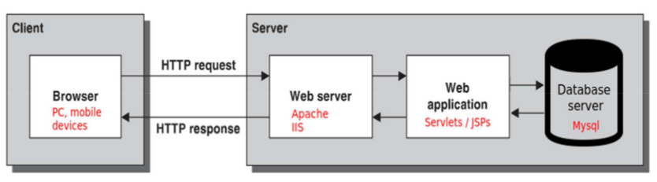

Otros tipo de respuestas dinámicas también pueden ser: ficheros .pdf, .xls, .xml

## ¿Que es un Java Servlet? 2:18 

[Presentación 13](pdfs/13.pdf) 

* Un Servlet es una clase java (.java) que permite procesar peticiones web (HTTP Request) y devolver una respuesta (HTTP Response). Los Servlets son clases que se ejecutan en el servidor. Sirven para generar el contenido dinámico de una aplicación web.

* Son utilizados para recibir parámetros, ya sea vía GET, como por ejemplo parámetros en la URL, o parámetros enviados por un formulario HTML (POST). Otros métodos utilizados en peticiones HTML son PUT Y DELETE.

* La respuesta que envía un Servlet puede ser de tipo HTML, XML, JSON, incluso archivos como PDF, imágenes, video, audio, etc.

* En una aplicación MVC (Model, View, Controller), los Servlets juegan el papel del Controlador.

* Los Servlets son la base de muchos Frameworks como Struts, Spring, JSF (JavaServer Faces), ... ya que los utilizan para gestionar su funcionamiento interno.

## Creación de un Java Servlet 10:45 

[Presentación 14](pdfs/14.pdf) 

1. Crear una clase dentro del proyecto

2. Heredar de la clase HttpServlet

3. Sobrescribir 2 métodos:

   1. doGet, se usará p.e. cuando accedemos a un enlace.
   
   2. doPost, se usará p.e. cuando enviamos un formulario HTML.

```java
import javax.servlet.*;
import javax.servlet.http.*;
import java.io.*;

public class HolaMundo extends HttpServlet {

  public void init(ServletConfig conf)
    throws ServletException {
    super.init(conf);
  }

  @Override
  protected void doGet(HttpServletRequest req, HttpServletResponse res)
    throws ServletException, IOException
  {
    res.setContentType("text/html");
    PrintWriter out = res.getWriter();
    out.println("<html>");
    out.println("<body>");
    out.println("<h1>Hola Mundo (llamada GET)</h1>");
    out.println("</body>");
    out.println("</html>");
  }

  @Override
  protected void doPost(HttpServletRequest req, HttpServletResponse res)
    throws ServletException, IOException
  {
    res.setContentType("text/html");
    PrintWriter out = res.getWriter();
    out.println("<html>");
    out.println("<body>");
    out.println("<h1>Hola Mundo (llamada POST)</h1>");
    out.println("</body>");
    out.println("</html>");
  }
}
```

Creamos un nuevo proyecto en Eclipse:

* Llamado “Servlet1” de tipo “Dynamic Web Proyect”.

* Dentro de “src” un package “servlets”

* Dentro del package una clase java “HolaMundo”

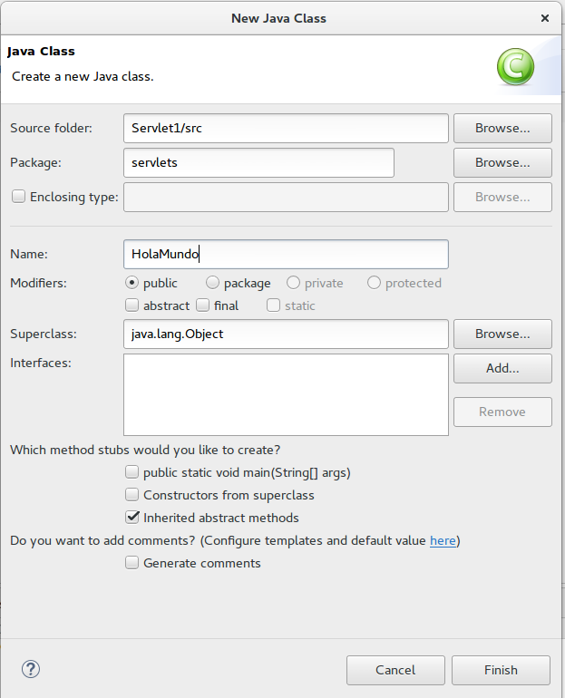

Convertimos la clase en un servlet:

1. extends HttpServlet
2. import javax.servlet.http.HttpServlet;
3. Pulsamos “CTRL + SPACE” para ver los métodos con acceso.
4. Añadimos los métodos doGet y doPost para sobrescribirlos. Borramos el contenido de los métodos (super …).
5. Configuramos los nuevas clases convertidas en Servlets. Un Servlet no puede ejecutarse por si solo (no utilizando un método “main” como en la clases java y “Run”). La forma de ejecutarlo es mediante una URL. A esto se le conoce como «Serlvet Maping». La configuración de un Servlet se realiza en el archivo WEB-INF/web.xml (deployment descriptor).
6. Lo definimos y guardamos los cambios en los ficheros:

```xml
<!-- Definimos el servlet -->
  <servlet>
        <!-- Nombre que tiene que ser único para este servlet pero puede ser diferente al nombre de la "clase"-->
    <servlet-name>HolaMundo</servlet-name>
    	<!--  Definimos a que clase identifica-->
    <servlet-class>servlets.HolaMundo</servlet-class>
  </servlet>
  	<!--  Mapeamos el servlet a una URL -->
  <servlet-mapping>
  		<!-- Mismo nombre del servlet definido antes -->
    <servlet-name>HolaMundo</servlet-name>
    	<!-- URL con la que se accederá al servlet -->
    <url-pattern>/holamundo</url-pattern>
  </servlet-mapping>
```

Para crear un servlet utilizando el asistente de Eclipse seleccionamos el package → New → Servlet:

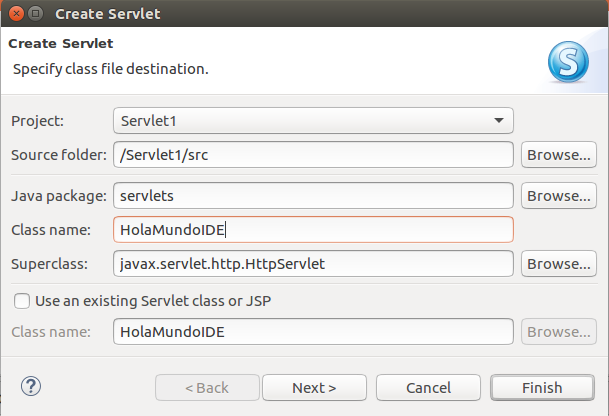

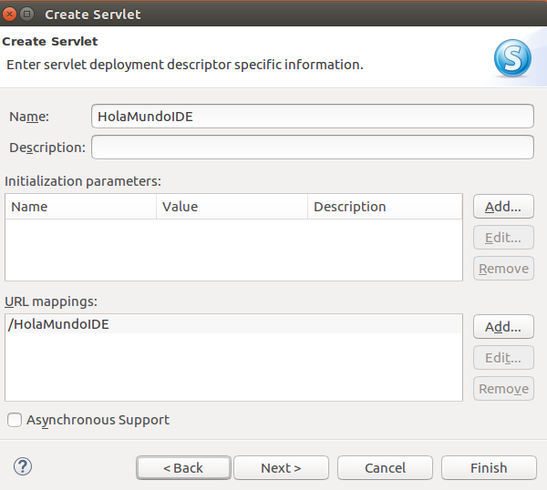

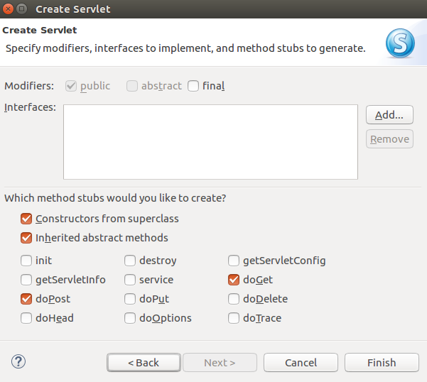

Observamos que la definición del servlet no se introduce automáticamente en el fichero web.xml, en su lugar se inserta una anotación @WebServlet. Esto se debe a que en las nuevas especificaciones “API Servlet 3.x” (Tomcat 7 en adelante) no es necesario declarar el servlet en el fichero descriptor, en su lugar en la propia clase del servlet aparece una anotación para configurar el acceso:

```java
package servlets;

import java.io.IOException;
import javax.servlet.ServletException;
import javax.servlet.annotation.WebServlet;
import javax.servlet.http.HttpServlet;
import javax.servlet.http.HttpServletRequest;
import javax.servlet.http.HttpServletResponse;

/**
 * Servlet implementation class HolaMundoIDE
 */
@WebServlet(name=”HolaMundoIDE”, urlPatterns="/HolaMundoIDE")
public class HolaMundoIDE extends HttpServlet {}
```

La anotación @WebServlet se puede insertar en un Java Servlet justo antes de la declaración de la clase. Esta es otra forma de declarar un Servlet, asi como su mapeo a una URL sin la necesidad de hacer dicha declaración en el archivo WEB-INF/web.xml.

Esta anotación es totalmente equivalente a la configuración “API Servlet 2.5” que si utiliza el fichero descriptor web.xml:

```xml
 <servlet>
    <servlet-name>HolaMundoIDE</servlet-name>
    <servlet-class>servlets.HolaMundoIDE</servlet-class>
  </servlet>
  <servlet-mapping>
    <servlet-name>HolaMundoIDE</servlet-name>
    <url-pattern>/HolaMundoIDE</url-pattern>
  </servlet-mapping>
```

Para cambiar este comportamiento en Eclipse IDE por el comportamiento clásico iremos a las propiedades del proyecto → Project Facets → Dynamic Web Module → y seleccionaremos la versión 2.5 o anteriores:

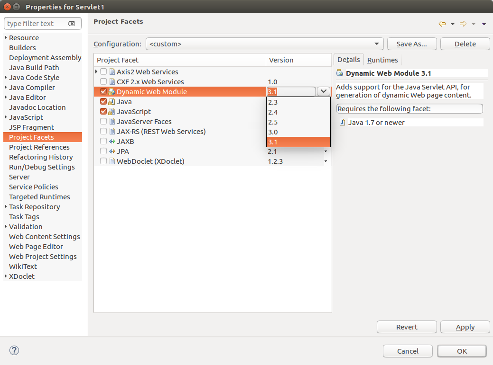

## Ejecutar un Servlet desde una URL 5:25 

[Presentación 15](pdfs/15.pdf) 

Tenemos varias formas de ejecutar un servlet:

1. Un servlet se ejecuta mediante una petición GET a una URL, es decir, a la URL que configuramos anteriormente en el fichero web.xml (url-pattern). Cuando se ejecuta de esta forma el servlet ejecutará el método doGet().

2. Mediante un link (petición GET). Igualmente cuando se ejecuta de esta forma el servlet ejecutará el método doGet(). 

```html 
<a href=”holamundo”>Ejecutar Servlet mediante link</a>
```

3. Mediante una petición POST, utilizando un formulario. Cuando se ejecuta de esta forma el servlet ejecutará el método doPost()

### Ejemplos (App Servlet1)

Añadimos mensajes al servlet para saber cuando se ejecuta ya que enviará estos mensajes a la consola:

```java
package servlets;

import java.io.IOException;

import javax.servlet.ServletException;
import javax.servlet.http.HttpServlet;
import javax.servlet.http.HttpServletRequest;
import javax.servlet.http.HttpServletResponse;

public class HolaMundo extends HttpServlet{

	@Override
	protected void doGet(HttpServletRequest req, HttpServletResponse resp) throws ServletException, IOException {
		System.out.println("Método doGet del Servlet HolaMundo incluido en el package servlets");
	}
	
	@Override
	protected void doPost(HttpServletRequest req, HttpServletResponse resp) throws ServletException, IOException {
		System.out.println("Método doPost del Servlet HolaMundo incluido en el package servlets");		
	}
}
```

* Ejecutamos la aplicación que nos abrirá el index por defecto.

* Ejecutamos el Servlet mediante:
   
   * Petición GET directamente a una URL:

      * En la barra de direcciones ponemos al URL del servlet (`http://localhost:8080/Servlet1/holamundo`)

      * Vemos el mensaje de salida en la consola de Eclipse:
      
      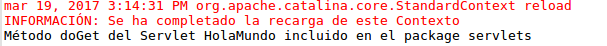
            
   * Petición GET mediante link
   
      * En el index.html añadimos un link al servlet: `<a href=”holamundo”>Ejecutar Servlet mediante link</a>`

      * Accedemos al index de la aplicación con el Navegador y pulsamos el enlace.

      * Vemos el mensaje de salida en la consola de Eclipse:
      
      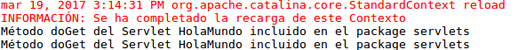
      
   * Petición POST mediante formulario

      * En el index.html introducimos un formulario web

      * Accedemos al index de la aplicación con el Navegador y enviamos el formulario a la url-pattern que mapea al Servlet.

      * Vemos el mensaje en la consola de Eclipse:
      
      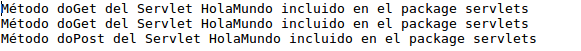
      
Repasamos el flujo repasando el fichero web.xml:

1. Siempre se ejecutará un servlet mediante una llamada GET o POST.

2. (servlet-mapping): URL mapeada a un servlet.

3. (servlet): nombre del servlet declarado con un nombre de clase.

## Enviar y recibir parámetros en un Java Servlet 10:25 

[Presentación 16](pdfs/16.pdf) 

Repasamos como funcionan las páginas web dinámicas (Gráfico del punto 1.4.2 del temario).

Ejecutamos el proyecto Servlet2. Repasamos la consola de Apache para ver que aparece la ejecución del método doGet() (accediendo por URL o por link) y del método doPost() (accediendo por formulario). En ambos casos se ejecuta la petición, el servidor la recibe pero no manda ninguna respuesta al cliente (pantalla en blanco).

Ahora vamos a incorporar al proyecto Servlet2 el envío y recepción de parámetros:

### Mediante URL (GET - doGet)

* Envío de parámetros

   * Los parámetros a enviar comienzan después del signo ?
   
   * El formato de los parámetros es “nombre=valor”
   
   * El separador entre parámetros es el signo &
   
   * Ejemplo: `http://localhost:8080/Servlet2/ParametrosGET?id=10&nombre=usuario`
   
* Recepción de parámetros

* Se reciben en el método `doGet() con request.getParameter("nombre");`

* Ejemplo: `String id=request.getParameter("id");``

* Una vez recibidos los parámetros podemos procesarlos o guardarlos utilizando todos los métodos de nuestro modelo de negocio utilizando lenguaje Java.

```java
@WebServlet(name="ParametrosGET", urlPatterns="/ParametrosGET")
public class ParametrosGET extends HttpServlet {

	/**
	 * @see HttpServlet#doGet(HttpServletRequest request, HttpServletResponse response)
	 */
	protected void doGet(HttpServletRequest request, HttpServletResponse response) throws ServletException, IOException {
		System.out.println("Método doGet");		
		String id=request.getParameter("id");
		String nombre=request.getParameter("nombre");
		System.out.println("Método doGet que recibe parámetros: Id ("+ id +") y nombre ("+ nombre +")");
	}

	/**
	 * @see HttpServlet#doPost(HttpServletRequest request, HttpServletResponse response)
	 */
	protected void doPost(HttpServletRequest request, HttpServletResponse response) throws ServletException, IOException {
		System.out.println("Método doPost");		
	}

}
``` 

* Volvemos a ejecutar la petición y vemos la salida en consola


* Para mostrar una salida en la pantalla del usuario debemos devolver a la petición una respuesta HTML y previamente, si queremos, aplicar nuestra lógica de negocio. Ejemplo:

```java
protected void doGet(HttpServletRequest request, HttpServletResponse response) throws ServletException, IOException {
		//Recibimos parámetros y los asignamos a variables Java
		String id=request.getParameter("id");
		String nombre=request.getParameter("nombre");
		
		//Imprimimos los parámetros recibidos
		System.out.println("Método doGet que recibe parámetros: Id ("+ id +") y nombre ("+ nombre +")");
		
		//Aplicamos la lógica de nuestro modelo de negocio
		//Si el id del usuario es mayor de 5, se devolverá una respuesta HTML"
        if (id.equals("10")) {
            response.setContentType("text/html;charset=UTF-8");
            try (PrintWriter out = response.getWriter()) {
                out.println("<!DOCTYPE html>");
                out.println("<html>");
                out.println("<head>");
                out.println("<title>Login</title>");
                out.println("</head>");
                out.println("<body>");
                out.println("<h3>Identificador de usuario ("+id+" correcto)</h3>");
                out.println("</body>");
                out.println("</html>");
            }
        } else {
        	//Respuesta de error indicando que no estamos autorizados
            response.sendError(HttpServletResponse.SC_UNAUTHORIZED);
        }
	}	
```

* Volvemos a ejecutar la petición y comprobamos que obtenemos respuesta:

   * **Si el usuario tiene id=10:**
   
   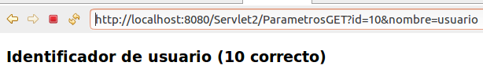
   
   
   * Si el usuario no tiene id=10:
   
   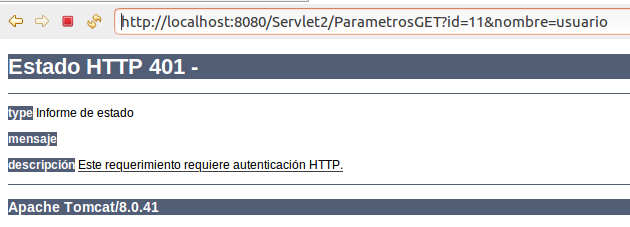
   
### Mediante un formulario (POST - doPost)

El atributo “name” de los “input” del formulario es el que utilizaremos en el servlet para recibir la información, es decir, serán nuestros nombres de parámetros.

```html
<h1>Envío POST!!!</h1>
<div id="body">
<form name="contac_form" method="post" action="ParametrosPOST">
	Nombre: <input type="text" name="nombre" /><br /> 
	Identificador: <input type="text" name="id" /><br /> 
<input type="submit" name"submit" value="Enviar">
</form>
```	

El resto de funcionamiento es igual pero lo recibirá el método doPost

```java

protected void doPost(HttpServletRequest request, HttpServletResponse response) throws ServletException, IOException {
		// Recibimos parámetros y los asignamos a variables Java
		String id = request.getParameter("id");
		String nombre = request.getParameter("nombre");

		// Imprimimos los parámetros recibidos
		System.out.println("Método doPost que recibe parámetros: Id (" + id + ") y nombre (" + nombre + ")");

		// Aplicamos la lógica de nuestro modelo de negocio
		// Si el id del usuario es mayor de 5, se devolverá una respuesta HTML"
		if (id.equals("10")) {
			response.setContentType("text/html;charset=UTF-8");
			try (PrintWriter out = response.getWriter()) {
				out.println("<!DOCTYPE html>");
				out.println("<html>");
				out.println("<head>");
				out.println("<title>Login</title>");
				out.println("</head>");
				out.println("<body>");
				out.println("<h3>Identificador de usuario (" + id + " correcto)</h3>");
				out.println("</body>");
				out.println("</html>");
			}
		} else {
			// Respuesta de error indicando que no estamos autorizados
			response.sendError(HttpServletResponse.SC_UNAUTHORIZED);
		}

	}
```

## Generar código HTML dinámico en un Servlet 5:27 

[Presentación 17](pdfs/17.pdf)  

Para generar código HTML (e.j. getHTML), en respuesta a una petición a un Servlet, podemos utilizar una instancia del objeto PrintWriter a partir del objeto response que acompaña a la petición html.

El código Java lo procesa Apache Tomcat y nunca se envía código Java al navegador cliente que realiza la petición. El Servlet será el encargado de enviar la respuesta HTML al navegador cliente.

```java
protected void doGet(HttpServletRequest request, HttpServletResponse response) throws ServletException, IOException {
		// El método devolverá una página HTML estática
		
		//Especificamos que la respuesta será texto en formato HTML
        response.setContentType("text/html;charset=UTF-8");
        
        //Utilizando el objeto out escribimos el código HTML de respuesta
        PrintWriter out = response.getWriter();
        out.println("<html>");
        out.println("<head>");
        out.println("<title>Catalogo de productos</title>");
        out.println("<meta charset='UTF-8'>");
        out.println("<meta name='viewport' content='width=device-width, initial-scale=1.0'>");
        out.println("</head>");
        out.println("<body>");
        out.println("<h3>Catalogo de productos</h3>");
        out.println("<table border='1' style='width:100%;'>");
        out.println("<tr>");
        out.println("<th>id</th>");
        out.println("<th>Categoria</th>");
        out.println("<th>Nombre</th>");
        out.println("<th>Precio</th>");
        out.println("</tr>");
        out.println("<tr>");
        out.println("<th>1</th>");
        out.println("<th>Sonido</th>");
        out.println("<th>Auriculares</th>");
        out.println("<th>12€</th>");
        out.println("</tr>");
        out.println("</table>");
        out.println("</body>");
        out.println("</html>");

	}
```

Ejecutar el proyecto y mostrar en el navegador el código fuente de la tabla generada, mediante el enlace insertado en el index.html.

Para generar código HTML dinámico (e.j. getDynamicHTML), en respuesta a una petición a un Servlet, procederemos de la misma forma pero obteniendo los datos, a representar en la tabla HTML, desde las clases Java (y acceso a BD) que representarán nuestro modelo de negocio. Este es la potencia del uso de los servlets, la generación del contenido de respuesta a partir de los datos de nuestro modelo de negocio utilizando el lenguaje Java.

```java
protected void doGet(HttpServletRequest request, HttpServletResponse response) throws ServletException, IOException {
		// La respuesta sera una pagina HTML
		response.setContentType("text/html;charset=UTF-8");
		PrintWriter out = response.getWriter();
		out.println("<html>");
		out.println("<head>");
		out.println("<title>Catalogo de productos</title>");
		out.println("<meta charset='UTF-8'>");
		out.println("<meta name='viewport' content='width=device-width, initial-scale=1.0'>");
		out.println("</head>");
		out.println("<body>");
		out.println("<h3>Catalogo de productos</h3>");
		out.println("<table border='1' style='width:100%;'>");
		out.println("<tr>");
		out.println("<th>id</th>");
		out.println("<th>Categoria</th>");
		out.println("<th>Nombre</th>");
		out.println("<th>Precio</th>");
		out.println("</tr>");

		// Generamos contenido HTML dinamico
		ProductoDB db = new ProductoDB();
		List<Producto> lista = db.getAll();
		for (Producto prod : lista) {
			out.println("<tr>");
			out.println("<td>" + prod.getId() + "</td>");
			out.println("<td>" + prod.getCategoria() + "</td>");
			out.println("<td>" + prod.getNombre() + "</td>");
			out.println("<td>" + prod.getPrecio() + " €</td>");
			out.println("</tr>");
		}

		// Termina contenido dinamico
		out.println("</table>");
		out.println("</body>");
		out.println("</html>");
	}
```

## Ciclo de vida Request-Response en una aplicación web 2:30 

[Presentación 18](pdfs/18.pdf) 

## Encabezado de respuesta (Content-Type) 5:10 

[Presentación 19](pdfs/19.pdf) 

* Las cabecera de respuesta Content-Type se utilizan para indicar al navegador Web el tipo de respuesta que será enviada por parte del servidor Web.

* Ejemplo puede ser enviar diferentes tipos de contenido como respuesta (Excel, HTML, XML, imágenes, etc).

* Para indicar el tipo de respuesta se utilizan los tipos MIME (Multipurpose Internet Mail Extensions). Los tipos MIME son un conjunto de especificaciones con el objetivo de intercambiar archivos de diferente tipo a través de Internet como puede ser texto, audio, vídeo, entre otros tipos.

* Para especificar el tipo MIME, se agrega un cabecera: response.setContentType("image/jpeg");


Ejemplos más frecuentes de tipos MIME:

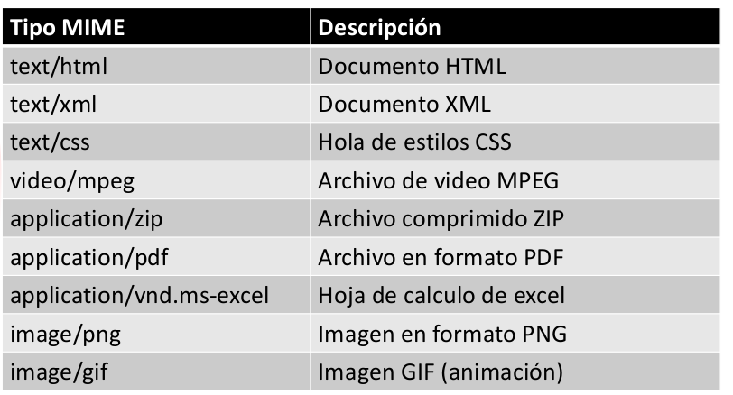

Ejemplo en proyecto (Servlet3) enlazadas desde el index.html (GET) donde especificamos varios tipo MIME en ContentType:

* Respuesta tipo HTML (text/html), visto en puntos anteriores.

* Respuesta tipo XML (text/xml), para generar el “fichero.xml” podemos hacerlo manualmente (como en el código de ejemplo) o utilizando alguna librería Java.

* Respuesta tipo JSON (application/json), para generar el “fichero.json” podemos hacerlo manualmente (como en el código de ejemplo) o utilizando alguna librería Java.

* Respuesta tipo Imagen (image/jpeg), incluimos el código Java para recuperar la imagen desde la ruta del directorio de publicación donde se ha almacenado.

## Redireccionar respuesta a otra URL 4:15 

[Presentación 20](pdfs/20.pdf)  

Un servlet puede redirigir la respuesta a recursos externos (p.e. a otro Servlet o a otro sitio).

Para esto se utiliza el método `sendRedirect` del objeto `response`, enviando como parámetro el destino donde queremos enviar al usuario dependiendo del caso:


```java
protected void doGet(HttpServletRequest request, HttpServletResponse response) throws ServletException, IOException {

// Redirigir la respuesta a un fichero relativo al directorio de publicación de la misma aplicación:
	response.sendRedirect("login.html");

// Redirigir la respuesta relativa a otro Servlet
	response.sendRedirect("/pagar/efectivo");

// Redirigir la respuesta a otra URL/Servidor
	response.sendRedirect("http://www.google.com");
}
```

Ejemplo en proyecto (Servlet3) enlazadas desde el index.html (GET):

* login.html, formulario html para introducir usuario y contraseña. Los datos del formulario se enviarán (doPost) al servlet mapeado Login.

* Login.java, servlet donde se comprueban las credencias del usuario y dependiendo de los datos introducidos enviamos al usuario a otro fichero relativo al directorio de publicación de nuestra aplicación.

* inicio.html, cuando el acceso es correcto

* error.html, cuando el acceso es incorrecto

## Subir archivos al servidor utilizando un Servlet 9:31 

Anteriormente para subir archivos al servidor utilizando Java Servlets (Apache Tomcat 6 y anteriores) era necesario utilizar librerías externas como Apache FileUpload.

A partir de la versión 7 de Apache Tomcat (API Servlets 3.0 y posteriores) se pueden subir archivos sin la necesidad de librerías externas.

Para definir los parámetros utilizaremos la anotación **`@MultipartConfig`**.

Ejemplo:

**index.html**

```html
    <form action="upload" method="post" enctype="multipart/form-data">
      Name:<br>
      <input type="text" name="name" required><br>
      Email:<br>
      <input type="text" name="email" required><br><br>
      Select File to Upload:<br>
      <input type="file" name="photo">
      <br><br>
      <input type="submit" value="Upload">
    </form>
```

* Especificamos como se codificará el formulario cuando se envíe al servidor (`enctype="multipart/form-data"`)

* Envío al servlet Upload (doPost).

**Upload.java (doPost)**

```java
@WebServlet(name = "Upload", urlPatterns = {"/upload"})
@MultipartConfig(location = "/tmp",
	fileSizeThreshold = 1048576, // 1mb
	maxFileSize = 1048576, // 1mb
	maxRequestSize = 5242880) // 5mb
public class Upload extends HttpServlet {
	  /**
	    * Directory where uploaded files will be saved, its relative to the web
	    * application directory.
	    */
	   private static final String UPLOAD_DIR = "uploads";

	   @Override
	   protected void doPost(HttpServletRequest request, HttpServletResponse response)
	      throws ServletException, IOException {
	      // gets absolute path of the web application
	      String applicationPath = request.getServletContext().getRealPath("");
	      // constructs path of the directory to save uploaded file
	      String uploadFilePath = applicationPath + File.separator + UPLOAD_DIR;

	      String name = request.getParameter("name");
	      System.out.println("Name: " + name);
	      String email = request.getParameter("email");
	      System.out.println("email: " + email);

	      Part archivo = request.getPart("photo");

	      System.out.println("part.getContentType : " + archivo.getContentType());
	      System.out.println("part.getSize : " + archivo.getSize());
	      System.out.println("part.getName : " + archivo.getName());
	      System.out.println("part.getSubmittedFileName : " + archivo.getSubmittedFileName());
	      
	      String nombre = archivo.getSubmittedFileName();
	      
	      /*
	      
	      // Podriamos validar el tipo de archivo de la siguiente forma.    
	      if (nombre.endsWith("pdf") || nombre.endsWith("doc") || nombre.endsWith("docx")) {
	         // archivo valido
	      }else{
	         // archivo no permitido
	      }
	      
	      */
	      // Escribimos el archivo al disco duro del servidor
	      archivo.write(uploadFilePath + File.separator + nombre);
	      request.setAttribute("message", "File uploaded successfully!");
	      getServletContext().getRequestDispatcher("/response.jsp").forward(request, response);
	   }
}
```

Cuando el proyecto se ejecuta desde Eclipse IDE los ficheros subidos se guardan en: `workspace/.metadata/.plugins/org.eclipse.wst.server.core/tmp0/wtpwebapps/Servlet4/uploads`

Cuando la aplicación se ejecuta en un servidor Tomcat en explotación, los ficheros subidos se guardan en el directorio especificado (uploads) ubicado en el directorio raíz de la estructura de directorios nuestra aplicación web:

Levantar Tomcat desde consola (`$CATALINA_HOME/bin/startup.sh`) y desplegar en Tomcat `(http://localhost:8080/manager/html`) el fichero Servlet4.war para comprobar que se sube una imagen al directorio correcto (`tomcat/webapps/Servlet4/uploads`). 

## Contenido adicional 10   

[Presentación 11](pdfs/11.pdf) 

[Presentación 12](pdfs/12.pdf) 

[Presentación 13](pdfs/13.pdf) 

[Presentación 14](pdfs/14.pdf) 

[Presentación 15](pdfs/15.pdf) 

[Presentación 16](pdfs/16.pdf) 

[Presentación 17](pdfs/17.pdf) 

[Presentación 18](pdfs/18.pdf) 

[Presentación 19](pdfs/19.pdf) 

[Presentación 20](pdfs/20.pdf) 
