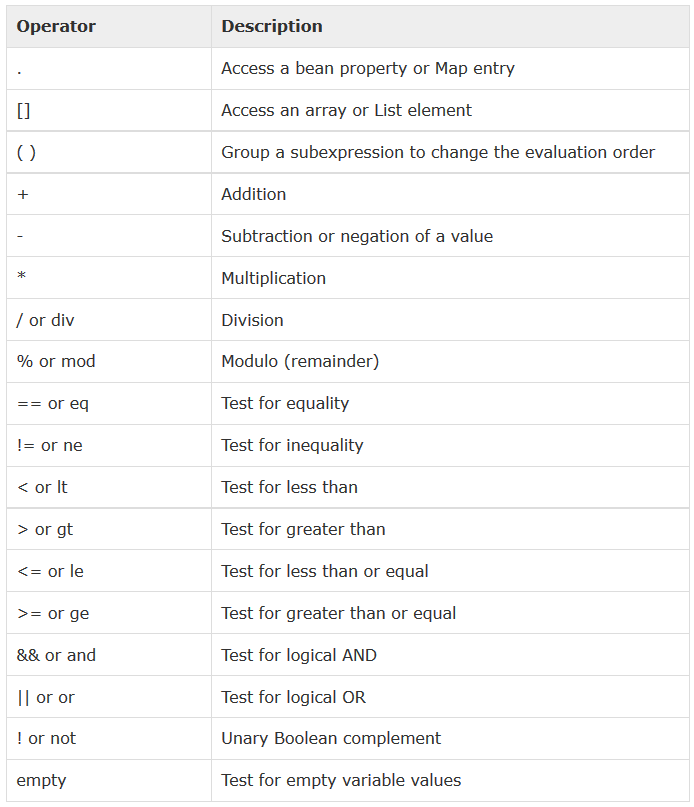
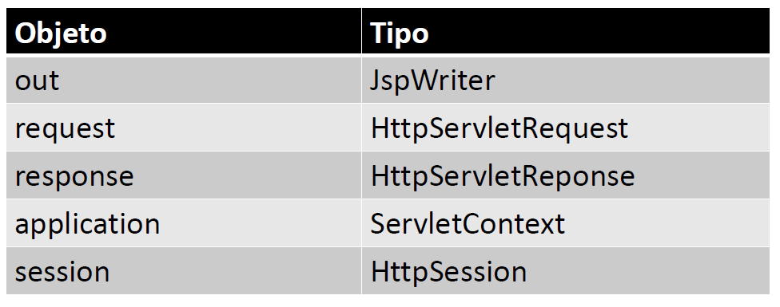
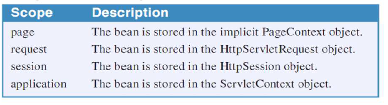
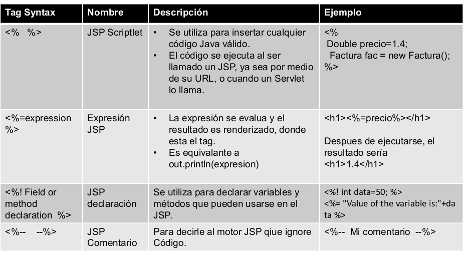
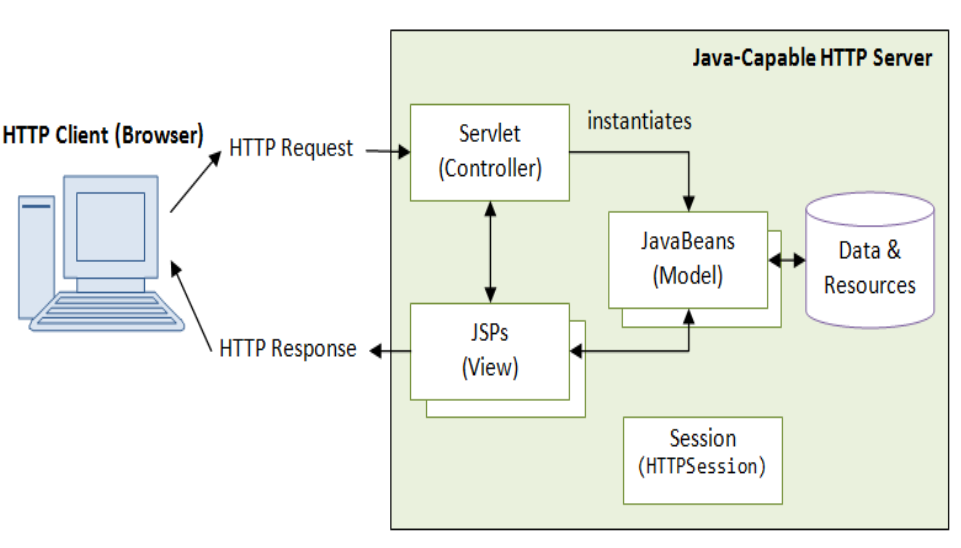

# 4. Conceptos esenciales de JSP 30m

   * ¿Qué son los JSPs? 3:37 
   * Ventajas de los JSPs sobre los Servlets 13:04 
   * Elementos de un JSP (scriptlets) 7:18 
   * Patrón de diseño MVC (Model View Controller) 4:40 
   * ¿Qué son los Javabeans? 2:19 
   * Contenido adicional 5
   
## ¿Qué son los JSPs? 3:37 

[Presentación 21](pdfs/21.pdf)

* Java Server Pages (JSP) son archivos que son ejecutados en el servidor (Tomcat) con la finalidad de manejar código HTML permitiendo insertar código nativo Java por medio de JSP tags mediante los cuales podremos generar la información dinámica de nuestra aplicación.

* En una aplicación MVC (Model, View, Controller), los JSPs juegan el papel del Vista, es decir muestran la información obtenida, o procesada por los Servlets. En una aplicación MVC, los Servlets envían como respuesta un archivo JSP y, además, atributos (JavaBeans, variables de tipo primitivo, Objetos) que posteriormente serán mostrados por el JSP mediante etiquetas especiales (EL - Expression Language).

* A pesar de que se puede incluir código Java en los JSP, no es recomendable, ya que en una aplicación MVC, la Vista solo debe mostrar información sin trabajar con la lógica del negocio. Mantener este modelo (JSPs para las vistas y Servlets como controlador para procesar la información) facilita el soporte y mantenimiento de la aplicación.

* Igualmente, los Servlets no deben generar código HTML ya que, en un aplicación MVC, estaríamos realizando funciones de la vista, independientemente, de asumir las complicaciones intrínsecas de este método que utiliza un objeto PrintWriter y la función println().

* Por tanto, en una aplicación MVC tenemos:

   * JSP, representar información de las clases del modelo. No incluirán nada de código Java relacionado con el negocio, conexiones a BD, generación de archivos, …

   * Servlets, serán los controladores del flujo de la aplicación, por tanto, no generaremos con ellos nada de código HTML.

   * Beans, clases del modelo de negocio que definen los objetos con los que trabajará nuestra aplicación.

## Ventajas de los JSPs sobre los Servlets 13:04 

[Presentación 22](pdfs/22.pdf)

* Extensión de un Servlet: La tecnología JSP es una extensión de los Servlets, es decir, podemos utilizar muchas características de los Servlets en los JSPs. Además podemos usar objetos implícitos (objetos que no necesitamos crear como: request, response, session, ...) y Expression Languaje (EL) para facilitar la representación de la información en la vista JSP.

* Fácil de mantener: Los JSP son fáciles de mantener, debido a que no contienen código perteneciente a la lógica del negocio y solo código de la lógica de presentación.

* Rápido desarrollo: Como los JSP están orientados a trabajar con HTML, si modificamos un JSP, a diferencia de los Servlets, no es necesario volver a compilar o a desplegar el proyecto modificado.

* Ménos código que los Servlets: En los JSPs usaremos tags, EL, objetos implícitos, JSTL (JSP Standard Tag Library), ... reduciendo el código necesario.

### EL (Expression Language) en JSPs

EL (Expression Language) es un lenguaje utilizado en las paginas jsp para interactuar con los datos (JavaBeans) servidos (Servlet) por parte del servidor, sin importar el alcance de los atributos (request, session, application). Combinado con la librería JSTL Core (JavaServer Pages Standard Tag Library) nos permite construir toda la lógica de las jsp de una forma mucho mas eficaz.

* Con EL no es posible modificar los atributos de los Javabeans (métodos setters) únicamente se pueden leer sus atributos (métodos getters).

* Con EL no es posible iterar objetos como Arrays, Lists, etc. Para esto, es necesario combinar EL con JSTL. Para utilizarse no es necesario hacer ninguna declaración especial en los JSP. El único requisito es que sea un archivo JSP válido (e.j. page.jsp).

* EL permite utilizar objetos implícitos (objetos que no necesitan declararse), operadores y palabras reservadas.

* EL fue agregada a partir de la tecnología JSP 2.0.

**Accediendo a variables en Expression Languaje**

Para obtener el valor de cualquier variable, sea del tipo que sea, lo único que tenemos que hacer es escribir su nombre entre ${}, de tal modo, si nuestra variable “miVariable” es un String, Integer, Date(), ... bastará con escribir `<c:out value=”${miVariable}”/>` para acceder a ella.

Del mismo modo, para acceder a un javabean con sus propiedades, getters y setters, EL automáticamente trata de obtener la propiedad utilizando los estándares (getNombre) de un javabean clásico.

Si tenemos una clase de este tipo:

```java
public class Persona()
{
	private String nombre;
	private int edad;

	public void setNombre(String nombre) {
		this.nombre = nombre;
	}

	public String getNombre() {
		return this.nombre;
	}

	public void setEdad(int edad) {
		this.edad = edad;
	}

	public int getEdad() {
		return this.edad;
	}
}
```

Y el nombre del objeto Persona devuelvo en el ModelAndView de nuestro Controller es “persona”, todo lo que necesitamos hacer para acceder a sus propiedades con EL desde el JSP es escribir el nombre del objeto, seguido de punto, y el nombre de la propiedad. `<c:out value=”${persona.nombre}”/>` y `<c:out value=”${persona.edad}”/>`.

**Operadores en Expression Languaje**

Las expresiones EL son evaluadas cuando se ejecuta el archivo JSP en el servidor y, posteriormente, el resultado de dicha expresión es reemplazado en el lugar donde está colocada la expresión. Finalmente este resultado se envía al cliente, junto con el HTML del JSP. Las expresiones nos permiten generar contenido más dinámico al poder operar con los datos extraídos de los JavaBeans.



**Objetos implícitos en JSPs**

* Hay una serie de objetos implícitos, es decir, que no es necesario crearlos con New para poder utilizarlos, en los JSPs los cuales son creados por el contenedor web que están disponibles para todos los JSPs.

* Algunos de estos objetos se pueden manejar por medio de EL.

La siguiente tabla muestra los objetos implícitos más utilizados en los JSPs.



**out**, sirve para escribir datos al buffer (en el caso de los JSPs, la salida es directamente al navegador).

* En los JSPs dicho objeto se llama out:`<% out.print("Today is:"+java.util.Calendar.getInstance().getTime()); %>`

* Para los Servlets se utiliza de la siguiente forma: `PrinterWriter out = response.getWriter();`

**request** (atributos disponibles solo para la petición actual), es creado en cada JSP por el contenedor web (objeto tipo HttpServletRequest). Puede ser usado para obtener información del request (parámetros, cabeceras, dirección IP remota, nombre del servidor, puerto del servidor, el content type, …). También puede ser usado para crear, o eliminar atributos de los JSP con alcance de request.

```java
				<%
				String name=request.getParameter("name");
				out.print("welcome "+name);
				%>
```
     
**response**, es creado por el contenedor web (objeto tipo HttpServletResponse). Puede ser usado para manipular la respuesta, por ejemplo con un redireccionamiento a otro recurso, o enviar un error.

```java
				<%
				response.sendRedirect("http://www.amazon.com");
				%>
```

**application**, objeto de tipo ServletContext. La instancia de este objeto es creada solo una vez por el contenedor web cuando la aplicación o proyecto es deployed en el servidor. Este objeto puede ser usado para obtener parámetros de inicialización para toda la aplicación que son declarados en el deployment descriptor (web.xml).

```java       
                                <%
				String ruta = application.getInitParameter("rutaDescargas");
				out.print("La ruta de descargas es =" + ruta);
				%>
```

**session** (atributos disponibles durante toda la sesión para todos los Servlets y JSPs), objeto de tipo HttpSession. Es usado para obtener, crear, o eliminar variables con información acerca del usuario actual (autenticación en la aplicación). Podemos utilizar el administrador de aplicaciones de Tomcat (interfaz web) para ver información de la sesiones (ver en navegador `http://localhost:8080/manager`).

```java
				<%
				session.setAttribute("user",name);
				String name=(String)session.getAttribute("user"); 
				%>
```        

**Secuencia del alcance para buscar el atributo**

Cuando se usa la sintaxis `“${attributo}”`, EL busca el atributo iniciando con el alcance más pequeño (page scope), hasta llegar al mayor alcance (application scope).



**JSP Standard Tag Library (JSTL)**

Permite agregar funcionalidad a los JSP utilizando tags adicionales

JSTL contempla 4 categorías de tags:

* **core**: contiene tags principalmente para manipular datos, así como iterar, agregar condicionales.

* **xml**: incluye tags para el manejo de datos en formato XML

* **sql**: permite ejecutar consultas a una BD. En una aplicación MVC, no es recomendable utilizarlas ya que se estarían mezclando componentes del modelo en la vista.

* **fmt**: permite dar formato a las cadenas de texto y la utilización de I18N (Internationalization)

Para poder utilizar JSTL en nuestro proyecto debemos incluir la librería “jstl-1.2.jar” en el directorio WEB-INF/lib de nuestra aplicación e incluir esta directiva al principio de los ficheros .jsp donde vayamos a utilizar JSTL.

```java
<%@ taglib uri="http://java.sun.com/jsp/jstl/core" prefix="c"%>
```

En una aplicación MVC, JSTL se utiliza principalmente en los JSPs para iterar objetos como ArrayList, Array, etc, debido a que esto no lo podemos hacer con Expression Language (EL).

JSTL también se utiliza para agregar condicionales IF y FOR, los cuales funcionan de forma muy similar a los del lenguaje Java.

En el código fuente de nuestra aplicación web real se han incluido el uso de algunos de los principales tags de JSTL:

* **`<c:forEach>`**: similar a un ciclo FOR de Java.
* **`<c:if>`** : similar al condicional IF de Java.
* **`<c:choose>`**, **`<c:when>`**, **`<c:otherwise>`**: similar al condicional SWITCH de Java.

## Elementos de un JSP (scriptlets) 7:18 

[Presentación 23](pdfs/23.pdf)

En los JSPs se puede mezclar código HTML con código Java dentro de una misma página y para ello utilizaremos varios tipos de tags:



Ejemplos (proyecto ServletJSP):

1. Abrir fichero index.html directamente con Nautilus y Firefox. Explicar que HTML lo interpreta el navegador web directamente.

2. Abrir fichero index1.jsp directamente con Nautilus y Firefox. Explicar que JSP no lo interpreta el navegador web y que tiene que ser ejecutado por Tomcat.

3. Ejecutar el proyecto y abrir index1.jsp desde el navegador accediendo a través de Tomcat (`http://localhost:8080/ServletJSP/index1.jsp`). Ver código fuente (botón derecho) que nos está generando Tomcat para ver que solo hay HTML y por eso lo está interpretando correctamente nuestro navegador.

4. Ahora vemos el fichero index2.jsp donde se hace uso de los JSP Scriptlets para insertar código Java y generar código HTML dinámico.

```java
<%@page language="java" contentType="text/html; charset=UTF-8" pageEncoding="UTF-8"%>
<%@page import="java.util.List"%>
<%@page import="java.util.ArrayList"%>

<!DOCTYPE html>
<%-- Comentarios --%>
<html>
<head>
<meta http-equiv="Content-Type" content="text/html; charset=UTF-8">
<title>Mi primer JSP</title>
</head>
<body>
	<h1>Ejemplo Scriplets</h1>
	<%-- Código Java: Creamos una lista e insertamos 3 items --%>
	<%
       String titulo = "Lista de productos";
       List<String> catalogo = new ArrayList();
       catalogo.add("Portatil");
       catalogo.add("Impresora");
       catalogo.add("Escaner");
    %>
	<%-- EXPRESION JSP --%>
	<h2><%=titulo%></h2>
	<select name="producto" multiple>
	<%-- Código Java: Utilizamos la lista para iterar por sus elementos y representarlos en HTML --%>
	<%
	  //Utilizamos el objeto implícito "out" (sin necesidad de crear una instancia del objeto response)
      for (String producto : catalogo){ 
      	out.print("<option>"+producto+"</option>");
      }
    %>
	</select>
</body>
</html>

```

## Patrón de diseño MVC (Model View Controller) 4:40 

[Presentación 24](pdfs/24.pdf)

Permite dividir la aplicación en 3 niveles:

* **El modelo** son las clases de negocio (JavaBeans) y la clases de acceso a la base de datos (DAO - Data Access Object).

* **La vista** es la capa de presentación final al usuario que utilizará JSPs y HTML, entre otros.

* **Los Servlets** hacen la función de controlador, es decir, permiten controlar el flujo de las peticiones HTTP. Los Servlets comparten atributos y objetos del modelo con los JSPs que se encargarán de representarlos, por tanto, tienen un rol intermedio entre el modelo y la vista.

### Flujo del patrón de diseño MVC



Ejemplo del procedimiento general del patrón de diseño MVC:

* Mediante el acceso a una URL de login (View), enviamos los datos del formulario (usuario y contraseña) HTML (HTTP Request) a un Servlet.

* El Servlet (controller), recibe la petición en el método “doPost”.

* El Servlet procesa y valida los parámetros. 

```java
	String userParam = request.getParameter("username");
		String passParam = request.getParameter("password");
```

* Realizamos la lógica de negocio, por ejemplo, validar el usuario en una base de datos y devolver un objeto de tipo Usuario si los parámetros de acceso son correctos. 

```java
Usuario user = UsuarioDB.login(userParam , passParam );
```

* Compartimos el objeto (objetos beans, variables, etc) que estará disponible dependiendo del alcance (request, session). Será el Servlet el que compartirá los objetos (JavaBeans), para ser usados por los JSPs, estableciendo su visibilidad para la petición en curso (objeto request) o para todos los JSPs de la aplicación (objeto session).

```java
request.setAttribute(" usuario ", user);
		  session.setAttribute(" usuario ", user);	  
```

* Tras ser compartidos (objetos del modelo) por el Servlet, redireccionamos el objeto request a una vista JSP (HTTP response) que podrá acceder a los datos de los objetos compartidos para poder representarlos.

```java
	RequestDispatcher dispatcher = request.getRequestDispatcher(“bienvenida.jsp”);
		dispatcher.forward( request, response );		
```		

* En la vista (bienvenida.jsp), podemos representar los objetos que fueron compartidos utilizando EL y JSTL. 

```html
<h1>Bienvenido usuario: ${usuario} </h1>
```

Los componentes del ejemplo (formulario de login) son los siguientes. Ver código (proyecto MVC1):

* Modelo
   
   * LoginBean.java: clase de tipo JavaBean, que actúa como componente de modelo para validar (public boolean validate()) el usuario y la contraseña (admin / admin).
   
* Vista

   * index.jsp: la página que se usará como entrada de datos del usuario (formulario html que se envía a Servlet “Login.java”).

   * inicio.jsp y error.jsp

```java
inicio.jsp

	...
<body>
    <!-- Mostramos al usuario, haciendo uso (EL), los objetos compartidos por el Controller. EL llamará de forma interna al método getName() -->
    <h1>Welcome usuario: ${user.name}</h1>
</body>
...
``` 

```java
error..jsp

	...
<body>
	<h1>Error</h1>
	<span style="color:#FF0000"><p>Sorry! username or password error</p></span>
    <%-- Se muestra sobre el index.jsp mediante la directiva include --%>
    <%@ include file="index.jsp" %>
</body>
...
```

* Controlador

   * **Login.java**: Servlet Controlador que atiende la petición, realiza las operaciones necesarias para el login, utilizando la lógica de negocio, y ejecuta una redirección utilizando el objeto “RequestDispatcher” que se recibe en el método doPost y hacemos un reenvío de la solicitud (request), con el objeto (user) integrado, y de la respuesta (response).
   
```java   
protected void doPost(HttpServletRequest request, HttpServletResponse response) throws ServletException, IOException {
		// Se reciben o validan los datos enviados por el usuario
		String name = request.getParameter("name");
		String password = request.getParameter("password");

		LoginBean bean = new LoginBean();
		bean.setName(name);
		bean.setPassword(password);

		// Realizamos la logica de negocio (procesar y validar los datos)
		boolean status = bean.validate();

		// Compartimos el objeto bean (en el alcance de la request) para poder usarlo en la vista (JSP)
		request.setAttribute("user", bean);

		// Dependiendo de nuestra lógica, redireccionamos (enviamos una respuesta)
		if (status) {
			RequestDispatcher rd = request.getRequestDispatcher("inicio.jsp");
			rd.forward(request, response);
		} else {
			RequestDispatcher rd = request.getRequestDispatcher("error.jsp");
			rd.forward(request, response);
		}
	}
```	

* Ficheros de configuración

   * web.xml (opcional): archivo para mapear el servlet si utilizamos notación anterior a 3.0.

## ¿Qué son los Javabeans? 2:19 

[Presentación 25](pdfs/25.pdf)

Una JavaBean o Bean es una clase Java con las siguientes características:

* Tiene un constructor con zero argumentos.

* Proporciona métodos get y set para acceder a todas las variables (por convención en Java deben declararse privadas).

* Implementa la interfaz Serializable (public class Producto implements Serializable). Para EL y JSTL puede ser opcional.

* Para variables de instancia de tipo boolean se utiliza el método isPropiedad (public boolean isActivo()) en vez de getPropiedad.

* Los datos de los JavaBeans son recuperados por los JSPs mediante los métodos get y set utilizando EL y JSTL. Como los JavaBeans son clases Java, son de tipo Plain Old Java Object (POJO),

## Contenido adicional 5   

[Presentación 21](pdfs/21.pdf)

[Presentación 22](pdfs/22.pdf)

[Presentación 23](pdfs/23.pdf)

[Presentación 24](pdfs/24.pdf)

[Presentación 25](pdfs/25.pdf)
