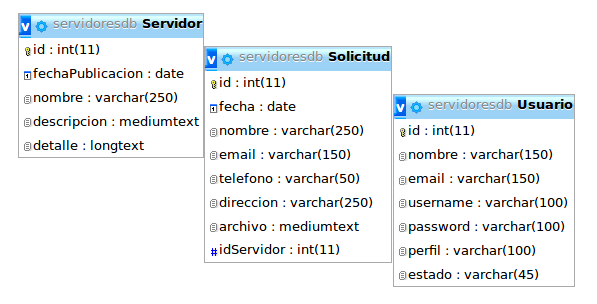
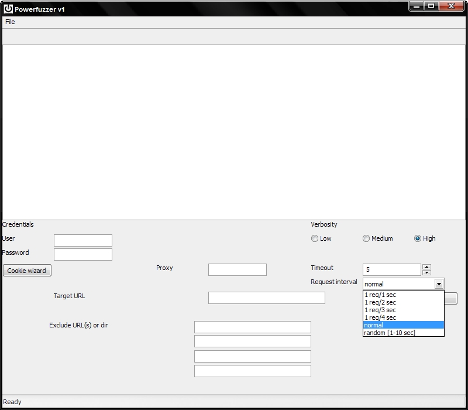
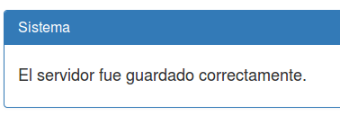
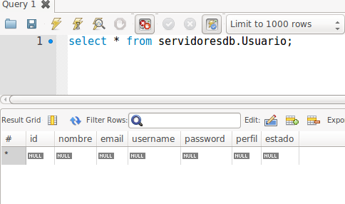
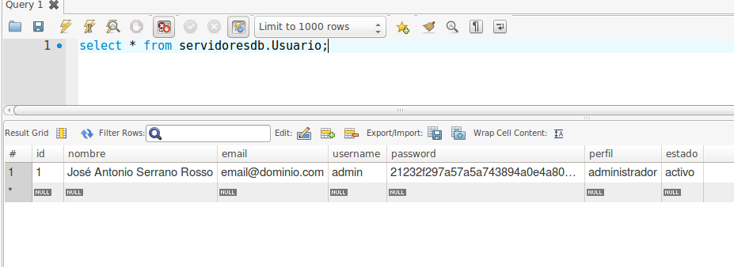
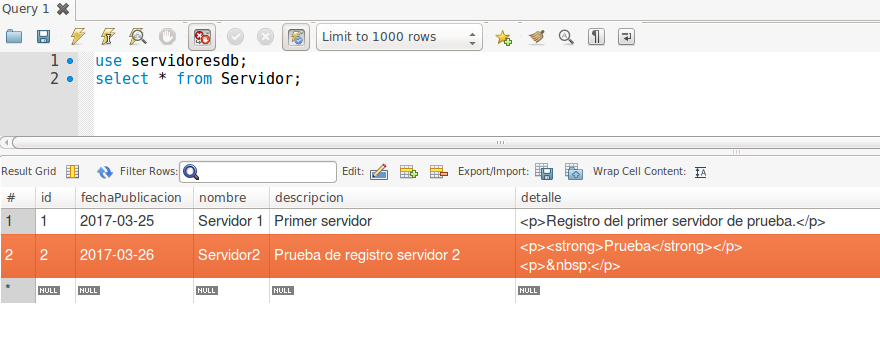
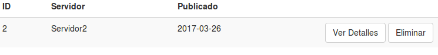
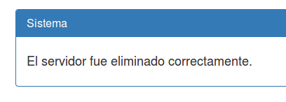
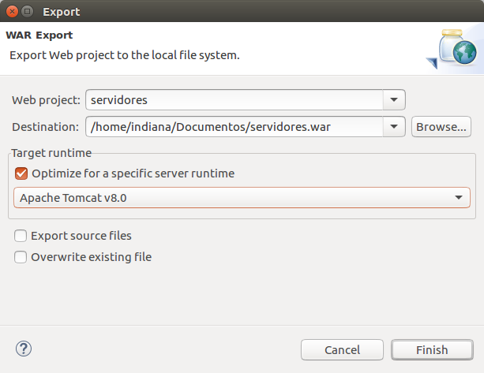

# 5. Desarrollo de una aplicación web real 110m 
   * Funcionalidades y Plantilla HTML 2:12 
   * Creación de la base de datos utilizando MySQL Workbench 6:52 
   * Creación del proyecto en Eclipse IDE 4:10 
   * Creación de las clases del modelo 2:30 
   * Creación de la clase de conexión a la BD 4:36 
   * Clases para crear objetos e insertarlos en la BD 12:28 
   * Clases para recuperar objetos de la BD 13:48 
   * Clases para listar todos los objetos 6:52 
   * Clases para buscar objetos en la BD 7:49 
   * Clases para la gestión de usuarios 12:36 
   * Vistas para crear y mostrar los objetos 10:58 
   * Clases para borrar objetos de la BD 8:07 
   * Pantalla y menú principal de la aplicación 8:33 
   * Aspectos generales de seguridad 2:48 
   * Despliegue de una aplicación web real 5:42 
   * Contenido adicional  14
   
## Funcionalidades y Plantilla HTML 2:12 

[Presentación 26](pdfs/26.pdf)

Vistazo general sobre la aplicación para publicar servidores disponibles para su utilización dentro de nuestra empresa.

Funcionalidades generales:

* Página principal
* Buscar
* Alta de nuevo servidor.
* Editor HTML integrado.
* Ver listado servidores
* Ver detalles de un servidor
* Solicitar un servidor
* Adjuntar ficheros a la solicitud
* Usuario normal y administrador

Para el diseño de la aplicación se ha utilizado una plantilla de bootstrap (front-end web framework basado en HTML y CSS para diseñar aplicaciones responsive). Revisar los componentes de la plantilla dentro del directorio del proyecto.

## Creación de la base de datos utilizando MySQL Workbench 6:52 

[Presentación 27](pdfs/27.pdf)

Captura con estructura visual de la BD:



y explicación general de atributos de las tablas:

* Servidor
   * id (auto increment primary key)
   * fechaPublicacion
   * nombre
   * descripcion, descripción corta
   * detalle, descripción larga

* Usuario
   * id (auto increment primary key)
   * nombre
   * email
   * username
   * password, encriptada en MD5
   * perfil, tipo de usuario
   * estado, activo o inactivo

* Solicitud
   * id (auto increment primary key)
   * fecha
   * nombre
   * email
   * telefono
   * direccion, ubicación dentro de nuestra organización
   * archivo
   * idServidor, identificador del servidor para el que solicita la reserva.

## Creación del proyecto en Eclipse IDE 4:10 

[Presentación 28](pdfs/28.pdf)

Pasos:

1. Creamos el proyecto como “Dynamic web proyect”.

2.Copiamos los ficheros de la plantilla de bootstrap (.html, css, images).

3. Creamos index.jsp copiando el contenido del index.html de la plantilla.

4. Borramos el fichero residual index.html.

5. Ejecutamos el proyecto para previsualizar el estilo en el navegador.

## Creación de las clases del modelo 2:30 

[Presentación 29](pdfs/29.pdf)

En Eclipse IDE vamos creado:

* Package model
   * Clase Servidor.java
      * Atributos private
      * Constructor
         * Recibe el id
         * Inicializa su atributo “fechaPublicacion” con la fecha actual del sistema.
      * Getters y Setters
      * Sobrescribir el método toString para imprimir los valores del objeto.
   * Clase Usuario.java
      * Atributos private
         * Valor por defecto para atributo estado = “activo”
      * Constructor que recibe el id
      * Getters y Setters
      * Sobrescribir el método toString para imprimir los valores del objeto.
* Clase Solicitud.java
   * Atributos private
      * Variable de tipo Servidor para relacionar con el servidor solicitado
   * Constructor que recibe el id
   * Getters y Setters
   * Sobrescribir el método toString para imprimir los valores del objeto.

## Creación de la clase de conexión a la BD 4:36 

[Presentación 30](pdfs/30.pdf)

En Eclipse IDE creamos:

* Package dao
   * Clase DbConnection.java
      * Atributos
         * Static String, para los datos de conexión con BD.
         * Connection, para almacenar la conexión activa con la BD.
      * Método Constructor
         * Driver para conexión con BD (JDBC con MySQL)
         * Variable de conexión “conn” se almacenará una instancia recuperada mediante el método “getConnection” del objeto “DriveManager”. Si se produce algún error imprimiremos el mensaje de error.

```java
	public DbConnection() {
      try {
         //obtenemos el driver para mysql
         Class.forName("com.mysql.jdbc.Driver");
         //obtenemos una conexion con los parametros especificados anteriormente 
         conn = DriverManager.getConnection(url, login, password);
         // Si conn no es nulo, significa que pidimos conectarnos
         if (conn != null) {
            System.out.println("Connecting database [" + conn + "] OK");
         }
      } catch (SQLException e) // Excepcion ocurrida por la conexion 
      {
         System.out.println("Excepcion conexion: " + e.getMessage());         
      } catch (ClassNotFoundException e) // Excepcion ocurrida por no encontrar el driver
      {
         System.out.println("Excepcion driver: " + e.getMessage());         
      }
   }
```

**Driver MySQL**

Descargamos el driver para la conexión con servidor MySQL desde la sección de `https://www.mysql.com/downloads/ → Community → MySQL Connectors → Connector/J → Descomprimir -tar.gz → Copiar fichero mysql-connector-java-5.1.41-bin.jar a directorio WEB-INF/lib`.

Probamos la conexión a la BD mediante una clase de prueba (testDB.java) dentro del package test. Ejecutamos la clase con Run As → Java Application.

## Clases para crear objetos e insertarlos en la BD 12:28 

[Presentación 31](pdfs/31.pdf)

Para completar esta tarea crearemos vistas JSP y Servlets para interaccionar ocn nuestras clases del modelo.

### Formulario de entrada de datos: vista frmservidor.jsp

Ejecutamos la clase frmservidor.jsp en el servidor para ver el formulario:



**Editor HTML WYSIWYG integrado**: Formulario que se enviará al servlet `ServidorController.java` (doPost) mapeado en `web.xml` como /servidor.

* input type text nombre, required
* textarea descripcion de 3 filas, required
* textarea detalle de 10 filas. Aquí se cargará el editor html.
* Boton “Guardar” para enviar el formulario.
 
```html 
<script>

      tinymce.init({
        selector: '#detalle',
        plugins: "textcolor, table",
        /* https://www.tinymce.com/docs/advanced/editor-control-identifiers/#toolbarcontrols */
        toolbar: "styleselect | undo redo | removeformat | bold italic underline | table \n\
                  aligncenter alignjustify  | bullist numlist outdent indent | link | print | \n\
                  fontselect fontsizeselect forecolor backcolor",
      });

    </script>
  </head>

  <body>
      
    <div class="container">
      <!-- The justified navigation menu is meant for single line per list item.
           Multiple lines will require custom code not provided by Bootstrap. -->
      <div class="masthead">
        <h3 class="text-muted">Administración</h3>
        <nav>
          <ul class="nav nav-justified">
            <li><a href="admin?action=crear">Alta de Servidor</a></li>            
            <li><a href="servidor?action=lista">Servidores</a></li> 
            <li><a href="solicitud?action=solicitudes">Solicitudes</a></li>
            <li><a href="admin?action=logout">Salir</a></li>            
          </ul>
        </nav>
      </div>

      <br>    
      <div class="panel panel-default">
        <div class="panel-heading">
          <h3 class="panel-title">Alta de Servidor</h3>
        </div>
        <div class="panel-body">
         <form action="servidor" method="post">
            <div class="form-group">
              <label for="nombre">Nombre</label>
              <input type="text" class="form-control" name="nombre" required id="nombre" value="" placeholder="Escriba el nombre del servidor">
            </div>                   
            <div class="form-group">
              <label for="descripcion">Descripción</label>
              <textarea class="form-control" name="descripcion" id="descripcion" required rows="3" placeholder="Escribe una descripción del servidor"></textarea>
            </div>
            <div class="form-group">
              <label for="detalle">Escriba los detalles</label>
              <textarea id="detalle" name="detalle" rows="10"></textarea>
            </div>
            <button type="submit" class="btn btn-default" >Guardar</button>
          </form>
        </div>
      </div>
```

### Servlet: controller.ServidorController.java

1ª parte

* Creamos un objeto JavaBeans de la clase Servidor (modelo) de nombre “srv”.

* Recibimos los parámetros del formulario “frmservidor.jsp” y los asignamos al objeto srv.

* Imprimimos el objeto en consola (usará el método sobrescrito toString de la clase Servidor)

2ª parte

* Objeto DbConnection “conn”

* Objeto ServidorDao le pasamos “conn”

* Recogemos el boolean devuelto por el método insert

* Mensaje para el usuario dependiendo de lo que devuelva el insert.

* Objeto RequestDispatcher para reenviar la petición.

* Compartimos el mensaje, mediante el objeto implícito request, para que esté disponible en la vista “mensaje_admin.jsp”.

```java
     /**
     * Metodo que sirve para guardar un servidor.
     *
     * @param request
     * @param response
     * @throws ServletException
     * @throws IOException
     */
    @Override
    protected void doPost(HttpServletRequest request, HttpServletResponse response)
            throws ServletException, IOException {
1ª parte
        // Recibimos parametros del formulario
        Servidor srv = new Servidor(0);
        String nombreParam = request.getParameter("nombre");
        srv.setNombre(nombreParam);
        String descripcionParam = request.getParameter("descripcion");
        srv.setDescripcion(descripcionParam);
        String detalleParam = request.getParameter("detalle");
        srv.setDetalle(detalleParam);

        //Imprimimos el objeto en consola (método toString)
        System.out.println(srv);

2ª parte
        // Procesamos los datos a guardar en BD
        DbConnection conn = new DbConnection();
        ServidorDao servidorDao = new ServidorDao(conn);
        boolean status = servidorDao.insert(srv);

        // Preparamos un mensaje para el usuario
        String msg = "";
        if (status) {
            msg = "El servidor fue guardado correctamente.";
        } else {
            msg = "Ocurrio un error. El servidor no fue guardado.";
        }
        conn.disconnect();
        RequestDispatcher rd;
        // Compartimos la variable msg, para poder accederla desde la vista con Expression Language
        request.setAttribute("message", msg);
        // Enviarmos respuesta a la vista mensaje.jsp
        rd = request.getRequestDispatcher("/mensaje_admin.jsp");
        rd.forward(request, response);
    }
```    

### 1ª parte

Ejecutamos el formulario frmservidor.jsp y lo enviamos para ver como se imprime el objeto en consola:

```java
Servidor{id=0, fechaPublicacion=Sat Mar 25 14:58:49 CET 2017, nombre=Servidor 1, descripcion=Primer servidor, detalle=<p>Registro del primer servidor de prueba.</p>}
```

El atributo fechaPublicacion del objeto Servidor no se envía desde el formulario ni se pasa como parámetro al constructor, cuando creamos el objeto, ya que está implícito en el constructor de la clase Servidor:

```java
public Servidor(int id) 
{
        
// La fecha de publicacion es la fecha del servidor
this
.fechaPublicacion = 
new
 Date();
        
this
.id = id;
    }
```    

### 2ª parte

Vemos como llega el mensaje (message) a la vista mensaje_admin.jsp

**Mostrar mensaje: vista mensaje_admin.jsp**



Debajo del menú principal muestra un panel que incluye el texto que mostramos mediante EL (message)

```html
	<div class="panel panel-primary">
        <div class="panel-heading">
          <h3 class="panel-title">Sistema</h3>          
        </div>
        <div class="panel-body">
            <h4>${message}</h4>
        </div>
      </div>
```

### Clase para la interacción con la BD de Servidor: ServidorDao.java

Esta clase contiene todos los métodos para administrar los registros de nuestra base de datos relacionados con la tabla Servidor.

* Variable tipo “DbConnection”

* Constructor que recibirá el objeto “DbConnection” para la conexión con la BD.

* Objeto de tipo “PreparedStatement” que nos permitirá ejecutar una sentencia SQL declarada previamente como String con los campos de la tabla Servidor.

* Vamos escribiendo cada registro a insertar (1, 2, 3, 4, 5) con “PreparedStatement.setXXX” según su tipo en BD (entero, fecha, texto).

* Para ejecutar una consulta SQL de escritura usamos el método “execeteUpdate”. Para consultas SQL de lectura se usa “executeQuery”.

* El método devuelve un boolean.

* La interacción con la base de datos estará dentro de un bloque try-catch para el tratamiento de errores.

```java
public class ServidorDao {

    private DbConnection conn;

    public ServidorDao(DbConnection conn) {
        this.conn = conn;
    }

    /**
     * Metodo para insertar un registro en la tabla Servidor
     *
     * @param servidor
     * @return Regresa el id generado por la base de datos
     * @throws Exception
     */
    public boolean insert(Servidor srv) {

    	//Para dar formato a un String a tipo fecha.
        SimpleDateFormat format = new SimpleDateFormat("yyyy-MM-dd");
        try {
            String sql = "insert into Servidor values (?,?,?,?,?)";
            PreparedStatement preparedStatement = conn.getConnection().prepareStatement(sql);
            preparedStatement.setInt(1, srv.getId());
          //En lugar de setDate usamos un String dándole formato
            preparedStatement.setString(2, format.format(srv.getFechaPublicacion()));
            preparedStatement.setString(3, srv.getNombre());
            preparedStatement.setString(4, srv.getDescripcion());
            preparedStatement.setString(5, srv.getDetalle());
            preparedStatement.executeUpdate();
            return true;

        } catch (SQLException e) {
            System.out.println("Error ServidorDao.insert: " + e.getMessage());
            return false;
        }
    }
```

### Ejemplo final

Prueba de ejecución completa para repasar todo el flujo de creación de un nuevo registro en la tabla Servidor.

* Ejecutamos el formulario de entrada “frmservidor.jsp”

* Rellenamos el formulario y le damos a “Guardar”

* Vemos el mensaje (“message”)

* Vemos todos los registros de la tabla Servidor con MySQL Workbench


## Clases para recuperar objetos de la BD 13:48 

[Presentación 32](pdfs/32.pdf)

Para completar esta tarea crearemos o modificaremos:

### Clase acceso a BD ServidorDao.java

Modificamos la clase para incluir un nuevo método para recuperar una lista con los últimos 3 servidores. Se mostrarán en la página principal de la aplicación.

Método getUltimos:

* Sentencia SQL para recuperar los 3 últimos registros de Servidor ordenados por “id” descendente.

* Objeto PreparedStatement para pasar como parámetro la sentencia SQL.

* Objeto “ResultSet” para almacenar los registros leídos de la BD devueltos por el método executeQuery tras ejecutar la sentencia “select”.

* Creamos una lista tipo “LinkedList”.

* Cargamos la lista con todos los objetos “Servidor” creados a partir de los registros recuperados de la BD y almacenados en el ResultSet (limit 3).
* Devolvemos la lista

```java
/**
     * Metodo que regresa una lista con los 3 ultimos servidores que seran
     * mostrados en la pagina principal
     *
     * @return
     * @throws Exception
     */
    public List&#x3C;Servidor&#x3E; getUltimos() {

        try {
            String sql = &#x22;select * from Servidor order by id desc limit 3&#x22;;
            PreparedStatement preparedStatement = conn.getConnection().prepareStatement(sql);
            ResultSet rs = preparedStatement.executeQuery();
            List&#x3C;Servidor&#x3E; list = new LinkedList&#x3C;&#x3E;();
            Servidor srv;
            while (rs.next()) {
                srv = new Servidor(rs.getInt(&#x22;id&#x22;));
                srv.setFechaPublicacion(rs.getDate(&#x22;fechaPublicacion&#x22;));
                srv.setNombre(rs.getString(&#x22;nombre&#x22;));
                srv.setDescripcion(rs.getString(&#x22;descripcion&#x22;));
                srv.setDetalle(rs.getString(&#x22;detalle&#x22;));
                // Add servidor object to the list
                list.add(srv);
                System.out.println(list);
            }
            return list;

        } catch (SQLException e) {            
            System.out.println(&#x22;Error ServidorDao.getUltimos: &#x22; + e.getMessage());
            return null;
        }
    }
```

Método getById:

* Sentencia SQL para recuperar servidor por su “id” pasado como parámetro al método.

* Objeto PreparedStatement para pasar como parámetro la sentencia SQL. Establecemos el parámetro (?) como entero con el “id” del servidor.

* Objeto “ResultSet” para almacenar los registros leídos de la BD.

* Creamos un objeto “Servidor” con los registros del “ResultSet”.

* Devolvemos el objeto servidor.

```java
     /**
     * Metodo para buscar en la base de datos un registro de Servidor por
     * medio del id
     *
     * @param idServidor
     * @return Objeto de tipo servidor. Si no lo encuentra, regresa null
     * @throws Exception
     */
    public Servidor getById(int idServidor){
        try {
            String sql = "select * from Servidor where id=? limit 1";
            PreparedStatement preparedStatement = conn.getConnection()
              .prepareStatement(sql);
            preparedStatement.setInt(1, idServidor); // Set idServidor
            ResultSet rs = preparedStatement.executeQuery();
            Servidor srv = new Servidor(0);
            while (rs.next()) {
                // Create an object for the movie
            	srv.setId(rs.getInt("id"));
            	srv.setFechaPublicacion(rs.getDate("fechaPublicacion"));
            	srv.setNombre(rs.getString("nombre"));
            	srv.setDescripcion(rs.getString("descripcion"));
            	srv.setDetalle(rs.getString("detalle"));
            }
            return srv;

        } catch (SQLException e) {            
            System.out.println("Error ServidorDao.getById: " + e.getMessage());
            return null;
        }
    }
```

### Nuevo servlet SiteController.java

Mapeado como `/homepage` ya que será la página principal de la aplicación.

* Método doGet.

* Objeto RequestDispatcher para reenviar la solicitud.

* Objeto DbConnection para conexión con BD.

* Objeto ServidorDao

* En una “lista” de objetos “Servidor” recuperamos la lista que devuelve el método getUltimos().

* Nos desconectamos de la BD

* Añadimos a request el atributo “ultimos” con el valor de la lista.

* Reenvío de solicitud y respuesta a “index.jsp” que tendrá disponible dicho atributo “ultimos”.

```java
public class SiteController extends HttpServlet {
    /**
     * Controller que sirve para mostrar la página principal de la aplicacion. Se encarga de mandar al index.jsp
     * un objeto de tipo List con las 3 ultimos servidores
     * @param request
     * @param response
     * @throws ServletException
     * @throws IOException 
     */
    @Override
    protected void doGet(HttpServletRequest request, HttpServletResponse response)
            throws ServletException, IOException {

        RequestDispatcher rd;        
        DbConnection conn = new DbConnection();
        ServidorDao servidorDao = new ServidorDao(conn);
        List<Servidor> lista = servidorDao.getUltimos();
        conn.disconnect();
        request.setAttribute("ultimos", lista);
        rd = request.getRequestDispatcher("/index.jsp");
        rd.forward(request, response);
    }

}
```

### Vista index.jsp

Utilizaremos JSTL para lo que tendremos que:

* Añadir al principio del fichero index.jsp la línea: 

```java
<%@ taglib uri="http://java.sun.com/jsp/jstl/core" prefix="c"%>
```

* Añadir el fichero jstl-1.2.jar al directorio WEB-INF/lib.

* Usamos la sentencia “forEach” de JSTL para recorrer la lista “ultimos” compartida por “SiteController.java”.

* La variable (var) “servidor” representará cada objeto individual de la iteración.

* La variable (varStatus) “status” expone el estado del bucle, aunque no la utilizaremos para nada.

* Imprimimos los atributos de cada objeto individual mediante EL.

Botón “Ver Detalles” para, utilizando el “id” del servidor, mostrar los detalles del servidor en una nueva página. Para ello llamaremos a la URL (doGet) “servidor” (que mapea el servlet ServidorController.java) pasando 2 parámetros (`?action=ver&id=id` con dynamic EL).

```java
	<div class="row">

        <c:forEach items="${ultimos}" var="servidor" varStatus="status">

          <div class="col-lg-4">
            <h3>Servidor: [${servidor.id}]</h3> 
            <p class="text-danger">${servidor.nombre}</p>          
            <p class="text-justify">${servidor.descripcion}</p>
            <p><a class="btn btn-primary" href="servidor?action=ver&id=${servidor.id}" role="button">Ver Detalles&raquo;</a></p>
          </div>

        </c:forEach> 

       
      </div>
```

Probamos su funcionamiento, cuando existe >=4 servidores, accediendo desde la URL homepage (SiteController.java), para que se inicialice la lista “ultimos”, y vemos los registros de la tabla Servidor con MySQL Workbench.

### Servlet ServidorController.java

Definimos método doGet.

Método doGet

* Parámetro “action” enviado en la URL. Si el parámetro es “ver” ejecutamos el método “verDetalle” reenviando request y response recibidos en doGet.

Método verDetalle

* Conversión de tipo de “id” de String (parámetros URL) a Integer.

* Conexión a BD, instancia de ServidorDao.

* Recuperamos de la BD el Servidor mediante el método getById.

* Compartimos el objeto en request.

   * Reenviamos la petición, y respuesta, a la vista “detalle.jsp”.

```java
    protected void doGet(HttpServletRequest request, HttpServletResponse response)
            throws ServletException, IOException {
        // Recibimos el parametro de accion, para ver que solicito el cliente.
        String action = request.getParameter("action");
        if ("ver".equals(action)) {
            this.verDetalle(request, response);
        } else if ("lista".equals(action)) {
            this.verTodas(request, response);
        } else if ("enviar".equals(action)) {
            this.mostrarFormulario(request, response);
        }
    }

…

/**
     * Metodo para ver los detalles completos de un Servidor.
     *
     * @param request
     * @param response
     * @throws ServletException
     * @throws IOException
     */
    protected void verDetalle(HttpServletRequest request, HttpServletResponse response) throws ServletException, IOException {

        // Recibimos id del servidor a consultar
        int idServidor = Integer.parseInt(request.getParameter("id"));
        DbConnection conn = new DbConnection();
        ServidorDao servidorDao = new ServidorDao(conn);
        Servidor srv = servidorDao.getById(idServidor);
        conn.disconnect();

        // Compartimos la variable srv para acceder desde la vista con Expression Language
        request.setAttribute("servidor", srv);
        RequestDispatcher rd;

        // Enviarmos respuesta a la vista detalle.jsp
        rd = request.getRequestDispatcher("/detalle.jsp");
        rd.forward(request, response);
    }
```

### Vista detalle.jsp

Vista para mostrar los detalles de un objeto Servidor compartido en request por Servlet “ServidorController.java”.

Mostramos la información del objeto servidor, accesible en alcance request, mediante EL.

```java
 <title>Detalle del servidor - ${servidor.nombre}</title>
    <!-- Bootstrap core CSS -->
    <link href="css/bootstrap.min.css" rel="stylesheet">
    <!-- Custom styles for this template -->
    <link href="css/justified-nav.css" rel="stylesheet">

  </head>

  <body>

    <div class="container">

      <!-- The justified navigation menu is meant for single line per list item.
           Multiple lines will require custom code not provided by Bootstrap. -->
      <div class="masthead">
        <h3 class="text-muted">Servidores</h3>
        <nav>
          <ul class="nav nav-justified">
            <li><a href="homepage">Inicio</a></li>            
            <li><a href="admin?action=login">Administración</a></li>                        
          </ul>
        </nav>
      </div>
      <form method ="post" action="buscar" class="navbar-form navbar-right">
        <div class="form-group">
          <input type="text" name="query" required placeholder="Buscar s..." class="form-control">
        </div>        
        <button type="submit" class="btn btn-success">Buscar</button>
      </form>
      <br><br><br>

      <div class="panel panel-primary">
        <div class="panel-heading">
          <h3 class="panel-title">ID: ${servidor.id}</h3>
        </div>
        <div class="panel-body">
          <h5><b>Servidor</b>: ${servidor.nombre}</h5>
          <h5><b>Publicado</b>: ${servidor.fechaPublicacion}</h5>                             
          <b>Descripción:</b><br>
          <p class="text-justify">${servidor.descripcion}</p>
          <b>Detalles del servidor</b>:<br>
          ${servidor.detalle}<br>
```

## Clases para listar todos los objetos 6:52 

[Presentación 33](pdfs/33.pdf)

Se utilizará en el botón “Ver todos los Servidores” de la página principal.

Para completar esta tarea crearemos o modificaremos:

### Clase de acceso a BD ServidorDao.java

Nuevo método `getAll()`, igual a `getUltimos()` pero eliminando la cadena `limit 3` en la consulta SQL.

Método getAll

Funcionamiento análogo a `getUltimos()` pero sin limitar los resultados de la consulta select.

```java
/**
     * Metodo que regresa una lista con todos los servidores.
     * @return Lista de todos los objetos servidor
     * @throws Exception
     */
    public List<Servidor> getAll(){

        try {
            String sql = "select * from Servidor order by id desc";
            PreparedStatement preparedStatement = conn.getConnection().prepareStatement(sql);
            ResultSet rs = preparedStatement.executeQuery();
            List<Servidor> list = new LinkedList<>();
            Servidor srv;
            while (rs.next()) {
            	srv = new Servidor(rs.getInt("id"));
                srv.setFechaPublicacion(rs.getDate("fechaPublicacion"));
                srv.setNombre(rs.getString("nombre"));
                srv.setDescripcion(rs.getString("descripcion"));
                srv.setDetalle(rs.getString("detalle"));       
                // Add servidor object to the list
                list.add(srv);
            }
            return list;

        } catch (SQLException e) {            
            System.out.println("Error ServidorDao.getAll: " + e.getMessage());
            return null;
        }
    }
```

### Vista index.jsp

Enlazamos (GET) el botón “Ver todos los Servidores” con el método doGet del servlet servidor (mapea a ServidorController.java) enviándole el parámetro `action=lista`.

```java
<p><a class="btn btn-lg btn-success" href="servidor?action=lista" role="button">Ver todos los Servidores</a></p>             
```

### Controlador ServidorController.java

Añadimos una nueva condición y llamamos al método “verTodas”

### Vista servidores.jsp

Imprimimos

* Usamos la sentencia “forEach” de JSTL para recorrer la lista “ultimos” compartida por “SiteController.java”.

* La variable (var) “servidor” representará cada objeto individual de la iteración.

* La variable (varStatus) “status” expone el estado del bucle, aunque no la utilizaremos para nada.

* Imprimimos los atributos de cada objeto individual mediante EL.

* Mismo botón “Ver Detalles” que se llama desde la página principal.

```java
	<c:forEach items="${servidores}" var="servidor" varStatus="status">
                <tr>
                  <td class="left">${servidor.id}</td>
                  <td>${servidor.nombre}</td>
                  <td>${servidor.fechaPublicacion}</td>
                  <td><a class="btn btn-default" href="servidor?action=ver&id=${servidor.id}" role="button">Ver Detalles</a>                
                  
                  <c:if test="${usuario.id > 0}">
                    <a class="btn btn-default" href="admin?action=eliminar&idServidor=${servidor.id}" role="button">Eliminar</a> 
                  </c:if>
                        
                  </td>  
                </tr>
              </c:forEach>   
```

## Clases para buscar objetos en la BD 7:49 

[Presentación 34](pdfs/34.pdf)

Campo de búsqueda para buscar en los campos nombre o descripción de la tabla “Servidor”.

### Clase acceso a BD ServidorDao.java

Método getByQuery

* Recibe la cadena (“query”) escrita en el campo de texto.

* Consulta SQL sobre la tabla Servidor en los campos nombre o descripción.

* Preparamos ejecución de consulta y completamos parámetros 1 y 2.

* Ejecutamos “select” y almacenamos los registros en ResultSet.

* Vamos iterando en los resultados y añadiendo los objetos Servidor recuperados a una lista “list” que devolveremos como salida del método.

```java
/**
     * Metodo para hacer busqueda de servidores (la busqueda se hace por
     * descripcion y nombreServidor)
     *
     * @param query
     * @return Lista de todos los objetos servidores que fueron encontrados
     * @throws Exception
     */
    public List<Servidor> getByQuery(String query){

        try {
            String sql = "select * from Servidor where (descripcion like ? or nombre like ?) order by id desc";
            PreparedStatement preparedStatement = conn.getConnection().prepareStatement(sql);
            preparedStatement.setString(1, "%" + query + "%");
            preparedStatement.setString(2, "%" + query + "%");
            ResultSet rs = preparedStatement.executeQuery();
            List<Servidor> list = new LinkedList<>();
            Servidor srv;
            while (rs.next()) {
            	srv = new Servidor(rs.getInt("id"));
            	srv.setFechaPublicacion(rs.getDate("fechaPublicacion"));
            	srv.setNombre(rs.getString("nombre"));
            	srv.setDescripcion(rs.getString("descripcion"));
            	srv.setDetalle(rs.getString("detalle"));                
                // Add servidor object to the list
                list.add(srv);
            }
            return list;

        } catch (SQLException e) {            
            System.out.println("Error ServidorDao.getByQuery: " + e.getMessage());
            return null;
        }
    }
```    

### Vista index.jsp

Formulario de búsqueda (POST) “Buscar servidor...“ que envía el input “query” , al método doPost, de la URL “buscar” (mapea a servlet BusquedaController.java).


```java
  <!-- Formulario para la busqueda. El formulario es enviado por POST al BusquedaController -->    
      <form method ="post" action="buscar" class="navbar-form navbar-right">
        <div class="form-group">
          <input type="text" name="query" required placeholder="Buscar servidor..." class="form-control">
        </div>        
        <button type="submit" class="btn btn-success">Buscar</button>
      </form>
```      

### Controlador BusquedaController.java

Mapeado por URL /buscar.

### Ejemplo de uso

Búsqueda, de una cadena existente y no existente en campos nombre y/o descripción, para repasar el flujo completo y contraste de resultados con BD y MySQL Workbench.

## Clases para la gestión de usuarios 12:36 

[Presentación 35](pdfs/35.pdf)

### Clase para acceso a BD UsuarioDao.java

Constructor que recibe objeto DbConnection y método de login par comprobar la credencias de los usuarios.

Constructor

* Recibe objeto DbConnection.

Método login

* Recibe usuario y contraseña.

* Sentencia SQL “select” para buscar en la tabla “Usuario” el primer usuario (limit 1) con estado activo, username y password (encriptado en MD5).

* Asignamos parámetros 1 y 2 de la consulta SQL.

* Ejecutamos la consulta y almacenamos en ResultSet.

* Se crea un objeto Usuario vacío (con ID=0) y, si existe resultado a la consulta, inicializamos los parámetros de dicho usuario con los registros leídos de la BD.

```java
public UsuarioDao(DbConnection conn) {
        this.conn = conn;
    }


    /**
     * Metodo para validar un usuario administrador en la base de datos
     * @param user
     * @param pass
     * @return Objeto de tipo Usuario con id, perfil, estado, etc.
     */
    public Usuario login(String user, String pass) {

        try {
            String sql = "select * from Usuario where username=? and password = md5(?) and estado='activo' limit 1";
            PreparedStatement preparedStatement = conn.getConnection().prepareStatement(sql);
            preparedStatement.setString(1, user);
            preparedStatement.setString(2, pass);
            ResultSet rs = preparedStatement.executeQuery();
            Usuario usuario = new Usuario(0);
            while (rs.next()) {
                // Create an object for the user
                usuario.setId(rs.getInt("id"));
                usuario.setNombre(rs.getString("nombre"));
                usuario.setEmail(rs.getString("email"));
                usuario.setUsername(rs.getString("username"));
                usuario.setPassword(rs.getString("password"));
                usuario.setPerfil(rs.getString("perfil"));
                usuario.setEstado(rs.getString("estado"));
            }
            return usuario;
        } catch (SQLException e) {
            System.out.println("Error UsuarioDao.login: " + e.getMessage());
            return null;
        }
    }
```

### Alta manual de usuario administrador en BD

Utilizando MySQL Workbench damos de alta al usuario administrador de la aplicación.



**SQL**

```sql
insert into servidoresdb.Usuario values(0,'José Antonio Serrano Rosso','email@dominio.com','admin',md5('admin'),'administrador','activo');
```



Ejecutamos una prueba mediante la clase test.testDB.java:

```java
public class testDB {

	public static void main(String[] args) {
		DbConnection conn = new DbConnection();
		UsuarioDao userdao = new UsuarioDao(conn);
		Usuario user = userdao.login("admin","admin");
		System.out.println(user);
	}

}

Salida con clave correcta (admin):
Connecting database [com.mysql.jdbc.JDBC4Connection@45283ce2] OK

Usuario{id=1, nombre=José Antonio Serrano Rosso, email=email@dominio.com, username=admin, password=21232f297a57a5a743894a0e4a801fc3, perfil=administrador, estado=activo}


Salida con clave incorrecta (admin):
Connecting database [com.mysql.jdbc.JDBC4Connection@45283ce2] OK

Usuario{id=0, nombre=null, email=null, username=null, password=null, perfil=null, estado=activo}
```

### Vista con formulario de acceso login.jsp

* Envía (doPost) los input a la URL admin (mapea a Servlet “AdminController.java”)

* Mostramos el mensaje que devuelve el servlet.

```java
<form class="form-signin" method="post" action="admin">
        <h2 class="form-signin-heading">Entrada al sistema</h2>
        <label for="user" class="sr-only">Nombre de usuario</label>
        <input type="text" id="user" name="user" class="form-control" placeholder="Escriba nombre de usuario" required autofocus>
        <label for="pass" class="sr-only">Password</label>
        <input type="password" id="pass" name="pass" class="form-control" placeholder="Escriba su password" required>       
        <p class="text-danger">${message}</p>
        <button class="btn btn-lg btn-primary btn-block" type="submit">Login</button>
      </form>
```

### Controlador AdminController.java

Método doPost

* Recibimos parámetros de tipo String.

* Variable “msg” para almacenar el mensaje a devolver al formulario de login.

* Objeto HttpSession “session” que se obtiene de la sesión activa. Este objeto tendrá alcance de sessión y sus atributos serán accesibles por cualquier .jsp mientras no caduque la sesión.

* Conexión con BD y UsuarioDao

* Verificamos si existe un usuario con las credenciales introducidas y lo recuperamos en “usuario”.

* Objeto RequestDispatcher para reenviar la solicitud.

* Comprobamos que el “id” del usuario es mayor que 0 (valor por defecto que asigna el método login de “UsuarioDao” ya que siempre devuelve un usuario nuevo o existente).

* Si existe un usuario en BD, asignamos el objeto “usuario” con alcance “session” y lo reenviamos a la vista “admin.jsp”.

* En caso contrario, establecemos un mensaje “msg” con alcance “request” y lo reenviamos a la vista “login.jsp”.

```java
protected void doPost(HttpServletRequest request, HttpServletResponse response)
            throws ServletException, IOException {
        // Recibimos parametros del formulario de login
        String userParam = request.getParameter("user");
        String passParam = request.getParameter("pass");
        String msg = "";
        // Recuperamos una instancia del objeto HttpSession
        HttpSession session = request.getSession();

        DbConnection conn = new DbConnection();
        UsuarioDao usuarioDao = new UsuarioDao(conn);
        // Verificamos en la BD, si es un usuario correcto.
        Usuario usuario = usuarioDao.login(userParam, passParam);
        conn.disconnect();

        RequestDispatcher rd;
        if (usuario.getId() > 0) {
            // Creamos una variable de session, con el registro de usuario (Bean)
            // Verificar en el administrador de aplicaciones de tomcat.
            session.setAttribute("usuario", usuario);
            rd = request.getRequestDispatcher("/admin.jsp");
            rd.forward(request, response);

        } else {
            msg = "Usuario y/o password incorrectos";
            request.setAttribute("message", msg);
            rd = request.getRequestDispatcher("/login.jsp");
            rd.forward(request, response);
        }
    }
```

**Observación Apache Tomcat**

Las **variables de sessión** las podemos ver en la **interfaz web de administración** de Apache Tomcat pulsando sobre el id de la sessión. Si abrimos una nueva pestaña privada en nuestro navegador y abrimos otra sesión en la aplicación veremos que se incrementa el numero de sesiones en Apache Tomcat y que cada una tiene su atributo “usuario” independiente.

### Vista admin.jsp

Si el usuario existe en la BD se reenvía a este vista que muestra los datos del usuario mediante EL.

```java
<div class="panel panel-primary">
        <div class="panel-heading">
          <h3 class="panel-title">Bienvenido ${usuario.nombre}</h3>          
        </div>
        <div class="panel-body">
          <h2 class="panel-title"><b>Username</b><br> ${usuario.username}<br><br></h2>
          <h2 class="panel-title"><b>Email</b><br> ${usuario.email}<br><br></h2>
          <h2 class="panel-title"><b>Perfil</b><br> ${usuario.perfil}<br><br></h2>
          <h2 class="panel-title"><b>Estado</b><br>${usuario.estado}<br><br></h2>
        </div>
      </div>
```

## Vistas para crear y mostrar los objetos 10:58 

[Presentación 36](pdfs/36.pdf)

La vista para crear un nuevo Servidor solo está disponible en el menú para usuarios administradores. El botón “Alta de Servidor” lleva al formulario para crear un nuevo Servidor.

Botón “Alta de Servidor”, lleva al formulario de alta.

En la cabecera de las páginas .jsp establecemos un enlace para el botón “Ala de Servidor” que apunte al servlet “admin” (mapea a servlet “AdminController.java”) enviando (doGet) el parámetro “action=crear”.

```html
<li><a href="admin?action=crear">Alta de Servidor</a></li>
```

### Controlador AdminController.java

Método doGet

* Añadimos un nuevo case “crear”.

* Recuperamos al usuario de la “session” y, si es nulo, lo reenviamos a la vista “login.jsp” compartiendo un mensaje de “Acceso Denegado” en “request”.

* Si existe usuario en “session”, lo reenviamos a la vista “frmservidor.jsp” para crear un nuevo Servidor. Podemos revisar las variables de “session” en la interfaz web de Apache Tomcat.

```java
   protected void doGet(HttpServletRequest request, HttpServletResponse response)
            throws ServletException, IOException {
        //Recibimos el parametro action, el cual servira para saber que accion GET se ejecutara
        String action = request.getParameter("action");

        // Recuperamos la session activa que viene junto con el request
        HttpSession session = request.getSession();
        RequestDispatcher rd;
        String msg = "";
        /*
         Comparamos que accion viene en la peticion GET, es decir, que boton/opcion selecciono el usuario. 
         Para cada accion excepto para logout, primero verificamos que existe un usuario en la session, 
         si no existe lo mandamos al formulario de login (de esta forma se maneja la seguridad de la app)
        */
        switch (action) {
            case "login":
                // Aqui no existe todavia una sesion para el usuario, lo mandamos al form de login
                if (session.getAttribute("usuario") == null) {
                    request.setAttribute("message", msg);
                    rd = request.getRequestDispatcher("/login.jsp");
                    rd.forward(request, response);
                } else { // Ya esta logueado, lo mandamos al index.jsp, pero de la administracion
                    rd = request.getRequestDispatcher("/admin.jsp");
                    rd.forward(request, response);
                }
                break;
            case "crear":
                if (session.getAttribute("usuario") == null) {
                    msg = "Acceso Denegado.";
                    request.setAttribute("message", msg);
                    rd = request.getRequestDispatcher("/login.jsp");
                    rd.forward(request, response);
                } else {
                    rd = request.getRequestDispatcher("/frmservidor.jsp");
                    rd.forward(request, response);
                }
                break;
            case "eliminar":
                if (session.getAttribute("usuario") == null) {
                    msg = "Acceso Denegado.";
                    request.setAttribute("message", msg);
                    rd = request.getRequestDispatcher("/login.jsp");
                    rd.forward(request, response);
                } else {
                    this.eliminarServidor(request, response);
                }
                break;
            /* 
            Cuando es logout (GET), cerramos la session. Aqui se puede comprobar en el administrador
            de aplicaciones de tomcat, como la session es destruida.
            */
            case "logout":
                session.invalidate();
                response.sendRedirect(request.getContextPath() + "/homepage");
                break;
        }
```

### Editor HTML integrado en vista frmservidor.jsp

La estructura general del formulario la vimos en el punto “Clases para crear objetos e insertarlos en la BD”. Ahora revisamos el editor HTML TinyMCE Community (`https://www.tinymce.com/download`) que se ha integrado para utilizarlo en el campo “detalles”.

TinyMCE

* Lo integraremos descargando sus componentes a una carpeta de nuestro proyecto (WebContent/tinymce) y enlazándolo al principio de la vista “frmservidor.jsp”.

* Editor HTML WYSIWYG integrado

* Basado en Javascript y HTML (se ejecuta en el lado del cliente)

* Convierte un input de tipo “textarea” (en nuestro caso “detalle”) en un editor HTML completo. Para ello hay que especificar el nombre del textarea en el campo “selector”.

* Para especificar las barras de menús que queremos que nos muestre el editor debemos especificar los plugins y toolbar a utilizar. Ver documentación en: `https://www.tinymce.com/docs/advanced/editor-control-identifiers/#toolbarcontrols`

* textarea “detalle” de 10 filas. Aquí se cargará el editor html.

```html
<!DOCTYPE html>
<html>
  <head>
    <meta charset="utf-8">    
    <meta name="viewport" content="width=device-width, initial-scale=1">    
    <link rel="icon" href="favicon.ico">
    <title>Servidores disponibles</title>
    <!-- Bootstrap core CSS -->
    <link href="css/bootstrap.min.css" rel="stylesheet">
    <!-- Custom styles for this template -->
    <link href="css/justified-nav.css" rel="stylesheet">

 <script src='tinymce/tinymce.min.js'></script>

<script>

      tinymce.init({
        selector: '#detalle',
        plugins: "textcolor, table",
        /* https://www.tinymce.com/docs/advanced/editor-control-identifiers/#toolbarcontrols */
        toolbar: "styleselect | undo redo | removeformat | bold italic underline | table \n\
                  aligncenter alignjustify  | bullist numlist outdent indent | link | print | \n\
                  fontselect fontsizeselect forecolor backcolor",
      });

    </script>
  </head>

  <body>
      
    <div class="container">
      <!-- The justified navigation menu is meant for single line per list item.
           Multiple lines will require custom code not provided by Bootstrap. -->
      <div class="masthead">
        <h3 class="text-muted">Administración</h3>
        <nav>
          <ul class="nav nav-justified">
            <li><a href="admin?action=crear">Alta de Servidor</a></li>            
            <li><a href="servidor?action=lista">Servidores</a></li> 
            <li><a href="solicitud?action=solicitudes">Solicitudes</a></li>
            <li><a href="admin?action=logout">Salir</a></li>            
          </ul>
        </nav>
      </div>

      <br>    
      <div class="panel panel-default">
        <div class="panel-heading">
          <h3 class="panel-title">Alta de Servidor</h3>
        </div>
        <div class="panel-body">
         <form action="servidor" method="post">
            <div class="form-group">
              <label for="nombre">Nombre</label>
              <input type="text" class="form-control" name="nombre" required id="nombre" value="" placeholder="Escriba el nombre del servidor">
            </div>                   
            <div class="form-group">
              <label for="descripcion">Descripción</label>
              <textarea class="form-control" name="descripcion" id="descripcion" required rows="3" placeholder="Escribe una descripción del servidor"></textarea>
            </div>
            <div class="form-group">
              <label for="detalle">Escriba los detalles</label>
              <textarea id="detalle" name="detalle" rows="10"></textarea>
            </div>
            <button type="submit" class="btn btn-default" >Guardar</button>
          </form>
        </div>
      </div>
	    
```
	    
### Ejemplo de uso

Damos de alta un nuevo Servidor y lo guardamos. Utilizando MySQL Workbench revisamos el registro almacenado para ver que el campo “detalles” almacena código HTML.



Accediendo por la aplicación a “Ver detalles” (vista “detalle.jsp”) vemos que nos muestra el texto recuperado con el formato (ver código fuente) que será interpretado por el navegador.

## Clases para borrar objetos de la BD 8:07 

[Presentación 37](pdfs/37.pdf)

Crearemos o modificaremos las siguientes partes de la aplicación:

Botón “Ver todos los Servidores” (index.jsp) o “Servidores” (menu), llevan a un formulario donde se listan todos los servidores con 2 botones por cada fila:

* Ver Detalles, disponible para todos los usuarios. Vista detalle.jsp.

* Eliminar, solo disponible para usuario administradores.



Para ir al formulario, en el “index.jsp” y en el menú de las páginas .jsp (“admin.jsp”, ...) establecemos un enlace al servlet “servidor” (ServidorController.java) enviando (doGet) el parámetro “action=lista” que nos conducirá a la vista “servidores.jsp” con la lista de todos los servidores en request.

```html
   <p><a class="btn btn-lg btn-success" href="servidor?action=lista" role="button">Ver todos los Servidores</a></p>        
```

El funcionamiento para “Ver Detalles” (action=ver) ya se ha descrito en el puntos anteriores.

```html
	   <td><a class="btn btn-default" href="servidor?action=ver&id=${servidor.id}" role="button">Ver Detalles</a>   
```
		   
El comportamiento del botón “Eliminar” (action=eliminar) se debe ajustar en la vista “servidores.jsp” para que solo se muestre a usuarios administradores. Para ello utilizaremos JSTL para comprobar que el usuario está logueado (id>0). El botón eliminar llamará al servlet “admin” (AdminController.java) enviando (doGet) el parámetro “action=eliminar” y el id del servidor “idServidor=EL”.

```html
  <c:if test="${usuario.id > 0}">
       <a class="btn btn-default" href="admin?action=eliminar&idServidor=${servidor.id}" role="button">Eliminar</a> 
  </c:if>
```

### Controlador AdminController.java

Método doGet

* Añadimos un nuevo case “eliminar”.

* Recuperamos al usuario de la “session” y, si es nulo, lo reenviamos a la vista “login.jsp” compartiendo un mensaje de “Acceso Denegado” en “request”.

* Si existe usuario en “session”, ejecutamos el método interno “eliminarServidor” enviando “request” y “response”. Podemos revisar las variables de “session” en la interfaz web de Apache Tomcat.

Método eliminarServidor

* Recibimos el parámetro “idServidor” de “request”.

* Conexión a BD y ServidorDao.

* Almacenamos en int “respuesta” el resultado (nº de registros afectados)

* Evaluamos el resultado de la ejecución y reportamos un mensaje (“msg”), si existe 1 registro afectado es correcto. En caso contrario, enviamos mensaje de error.

* Desconexión de BD.

* Compartimos mensaje en “request”

* Reenviamos a la vista “mensaje_admin.jsp”

```java
   protected void doGet(HttpServletRequest request, HttpServletResponse response)
            throws ServletException, IOException {
        //Recibimos el parametro action, el cual servira para saber que accion GET se ejecutara
        String action = request.getParameter("action");

        // Recuperamos la session activa que viene junto con el request
        HttpSession session = request.getSession();
        RequestDispatcher rd;
        String msg = "";
        /*
         Comparamos que accion viene en la peticion GET, es decir, que boton/opcion selecciono el usuario. 
         Para cada accion excepto para logout, primero verificamos que existe un usuario en la session, 
         si no existe lo mandamos al formulario de login (de esta forma se maneja la seguridad de la app)
        */
        switch (action) {
            case "login":
                // Aqui no existe todavia una sesion para el usuario, lo mandamos al form de login
                if (session.getAttribute("usuario") == null) {
                    request.setAttribute("message", msg);
                    rd = request.getRequestDispatcher("/login.jsp");
                    rd.forward(request, response);
                } else { // Ya esta logueado, lo mandamos al index.jsp, pero de la administracion
                    rd = request.getRequestDispatcher("/admin.jsp");
                    rd.forward(request, response);
                }
                break;
            case "crear":
                if (session.getAttribute("usuario") == null) {
                    msg = "Acceso Denegado.";
                    request.setAttribute("message", msg);
                    rd = request.getRequestDispatcher("/login.jsp");
                    rd.forward(request, response);
                } else {
                    rd = request.getRequestDispatcher("/frmservidor.jsp");
                    rd.forward(request, response);
                }
                break;
            case "eliminar":
                if (session.getAttribute("usuario") == null) {
                    msg = "Acceso Denegado.";
                    request.setAttribute("message", msg);
                    rd = request.getRequestDispatcher("/login.jsp");
                    rd.forward(request, response);
                } else {
                    this.eliminarServidor(request, response);
                }
                break;
            /* 
            Cuando es logout (GET), cerramos la session. Aqui se puede comprobar en el administrador
            de aplicaciones de tomcat, como la session es destruida.
            */
            case "logout":
                session.invalidate();
                response.sendRedirect(request.getContextPath() + "/homepage");
                break;
        }


 /**
     * Metodo para eliminar un servidor.
     * @param request
     * @param response
     * @throws ServletException
     * @throws IOException 
     */
    private void eliminarServidor(HttpServletRequest request, HttpServletResponse response) throws ServletException, IOException {
        // Recibimos el id del servidor que vamos a eliminar
        int idServidorParam = Integer.parseInt(request.getParameter("idServidor"));
        DbConnection conn = new DbConnection();
        ServidorDao servidorDao = new ServidorDao(conn);
        int respuesta = servidorDao.delete(idServidorParam);
        String msg = "";
        if (respuesta == 1) { // Fue afectado un registro, esto significa que si se borro
            msg = "El servidor fue eliminado correctamente.";
        } else {
            msg = "Ocurrio un error. El servidor no fue eliminado.";
        }
        conn.disconnect();
        request.setAttribute("message", msg);
        RequestDispatcher rd;
        rd = request.getRequestDispatcher("/mensaje_admin.jsp");
        rd.forward(request, response);
    }
```

### Clase acceso a BD ServidorDao.java

Añadimos el método “delete” para eliminar el servidor según el id recibido como parámetro.

Método delete

* Sentencia SQL para eliminar registro de la tabla Servidor.

* Preparamos la ejecución de la consulta y establecemos el parámetro 1 (?) con el id del servidor recibido como parámetro en el método.

* Guardamos el resultado (nº de registros afectados) por la ejecución de “executeUpdate”.

* Devolvemos el número de registros afectados (debé ser siempre 1 ya que el id es único) como salida del método.

```java
     /**
     * Metodo para eliminar un servidor.
     * @param idServidor
     * @return No. de filas afectadas
     */
    public int delete(int idServidor) {
        try {
            String sql = "delete from Servidor where id=?";
            PreparedStatement preparedStatement = conn.getConnection().prepareStatement(sql);
            preparedStatement.setInt(1, idServidor);
            int rows = preparedStatement.executeUpdate();
            return rows;

        } catch (SQLException e) {            
            System.out.println("Error ServidorDao.eliminar: " + e.getMessage());
            return 0;
        }
    }
```

### Ejemplo de uso

Realizar el borrado de un servidor fijándonos en el id que se va a eliminar. Comprobar que se ha efectuado el borrado en MySQL Workbench.



## Pantalla y menú principal de la aplicación 8:33 

[Presentación 38](pdfs/38.pdf)

Pantalla principal y botón de “Inicio” de la barra de menú.

* Por defecto, cuando se accede a una aplicación web se ejecuta el fichero index.?

* En nuestro fichero “index.jsp” necesitamos tener inicializado el atributo “ultimos” para mostrar una lista con los 3 últimos servidores.

* El servlet “SiteController.java” es el encargado de inicializar este atributo, compartirlo con alcance request y redireccionar a la vita “index.jsp”.

* Por tanto, establecemos como página de inicio la URL /homepage (mapea a servlet “SiteController.java”) configurando nuestro fichero web.xml:

```xml
	<welcome-file-list>
        	<welcome-file>homepage</welcome-file>
   	</welcome-file-list>
```

* En la cabecera de las páginas .jsp, establecemos el link al que apunta el botón de “Inicio” a homepage:

```html
<li><a href="homepage">Inicio</a></li>  
```

Botón “Administración”, en la cabecera de las páginas .jsp establecemos un enlace para el botón “Administración” que apunte al servlet “admin” (mapea a servlet “AdminController.java”) enviando (doGet) el parámetro “action=login”.

```html
<li><a href="admin?action=login">Administración</a></li>                        
```

### Servlet AdminController.java

Método doGet

* case login

* Recibimos parámetro “action” de request.

* Creamos objetos para compartir en sessión un atributo y ejecutar el reenvío de un mensaje.

* Si no existe variable usuario en la “session” (usuario aún no logueado) , lo mandamos al formulario de “login.jsp”. Podemos comprobarlo en la interfaz web de Apache Tomcat antes y después del login.

* En caso contrario, lo mandamos a la vista “admin.jsp” que tendrá un menú diferente.

Método doGet

* case logout

* Método “invalidate”, destruye la sesión y todos los atributos creados sobre ella. Podemos comprobarlo en la interfaz web de Apache Tomcat antes y después de Salir.

* Reenviamos con “response.sendRedirect” a la URL homepage.

```java
  protected void doGet(HttpServletRequest request, HttpServletResponse response)
            throws ServletException, IOException {
        //Recibimos el parametro action, el cual servira para saber que accion GET se ejecutara
        String action = request.getParameter("action");

        // Recuperamos la session activa que viene junto con el request
        HttpSession session = request.getSession();
        RequestDispatcher rd;
        String msg = "";
        /*
         Comparamos que accion viene en la peticion GET, es decir, que boton/opcion selecciono el usuario. 
         Para cada accion excepto para logout, primero verificamos que existe un usuario en la session, 
         si no existe lo mandamos al formulario de login (de esta forma se maneja la seguridad de la app)
        */
        switch (action) {
            case "login":
                // Aqui no existe todavia una sesion para el usuario, lo mandamos al form de login
                if (session.getAttribute("usuario") == null) {
                    request.setAttribute("message", msg);
                    rd = request.getRequestDispatcher("/login.jsp");
                    rd.forward(request, response);
                } else { // Ya esta logueado, lo mandamos al index.jsp, pero de la administracion
                    rd = request.getRequestDispatcher("/admin.jsp");
                    rd.forward(request, response);
                }
                break;
            case "crear":
                if (session.getAttribute("usuario") == null) {
                    msg = "Acceso Denegado.";
                    request.setAttribute("message", msg);
                    rd = request.getRequestDispatcher("/login.jsp");
                    rd.forward(request, response);
                } else {
                    rd = request.getRequestDispatcher("/frmservidor.jsp");
                    rd.forward(request, response);
                }
                break;
            case "eliminar":
                if (session.getAttribute("usuario") == null) {
                    msg = "Acceso Denegado.";
                    request.setAttribute("message", msg);
                    rd = request.getRequestDispatcher("/login.jsp");
                    rd.forward(request, response);
                } else {
                    this.eliminarServidor(request, response);
                }
                break;
            /* 
            Cuando es logout (GET), cerramos la session. Aqui se puede comprobar en el administrador
            de aplicaciones de tomcat, como la session es destruida.
            */
            case "logout":
                session.invalidate();
                response.sendRedirect(request.getContextPath() + "/homepage");
                break;
        }

    }
```    

Botón de “Salir”, cerrar sesión activa y reenviar al usuario a la página principal.

En la cabecera de las páginas .jsp establecemos un enlace para el botón “Salir” que apunte al servlet “admin” (mapea a servlet “AdminController.java”) enviando (doGet) el parámetro `action=logout”`.

```html
<li><a href="admin?action=logout">Salir</a></li>
```

## Aspectos generales de seguridad 2:48 

[Presentación 39](pdfs/39.pdf)

Apache Tomcat permite agregar seguridad a las aplicaciones web por medio de Container Managed Security (Seguridad basada en contenedores).

* Seguridad basada en usuarios, passwords y asignación de roles.

* Los usuarios son obtenidos de una base de datos (realm) existente que contiene los usuarios, passwords y roles.

* La configuración se realiza en el archivo WEB-INF/web.xml de la aplicación web.

* Un Realm (dominio) es una "base de datos" de usuarios y contraseñas que permiten identificar usuarios con permisos para una aplicación web (o un conjunto de varias aplicaciones web), además de los roles asociados a cada usuario.

* Un usuario en particular puede tener cualquier número de roles asociados a su nombre de usuario. Son similares a los GRUPOS de sistemas operativos Linux.

* Existen 6 diferentes tipos de Realm con soporte para diferentes tipos de autenticación (http://tomcat.apache.org/tomcat-8.0-doc/realm-howto.html#Quick_Start)

   * JDBCRealm - Accesses authentication information stored in a relational database, accessed via a JDBC driver.

   * DataSourceRealm - Accesses authentication information stored in a relational database, accessed via a named JNDI JDBC DataSource.

   * JNDIRealm - Accesses authentication information stored in an LDAP based directory server, accessed via a JNDI provider.

   * UserDatabaseRealm - Accesses authentication information stored in an UserDatabase JNDI resource, which is typically backed by an XML document (conf/tomcat-users.xml).

   * MemoryRealm - Accesses authentication information stored in an in-memory object collection, which is initialized from an XML document (conf/tomcat-users.xml).

   * JAASRealm - Accesses authentication information through the Java Authentication & Authorization Service (JAAS) framework.

## Despliegue de una aplicación web real 5:42 

En Eclipe IDE hacemos click derecho encima de nuestro proyecto y seleccionamos: Export → WAR File.



Una vez generado, revisamos el fichero “servidores.war” con nuestro gestor de archivadores y vemos que contiene la estructura general de una aplicación web Java EE. El directorio “/WEB-INF/classes/” contiene las clases compiladas de nuestro proyecto (sin código fuente).

### Publicar aplicación en Apache Tomcat

Una vez que tenemos el fichero “servidores.war” podemos desplegarlo en Apache Tomcat mediante la opción “WAR file to deploy” de la interfaz de gestión.

Si vamos a trasladar nuestra aplicación a un servidor en explotación, una vez que tenemos la aplicación (.war) instalada en el servidor de aplicaciones Apache Tomcat, solo nos quedaría crear la base de datos que utiliza la aplicación (servidoresdb) ejecutando las siguientes sentencias SQL en el servidor:

```sql
servidoresdb.sql


SET @OLD_UNIQUE_CHECKS=@@UNIQUE_CHECKS, UNIQUE_CHECKS=0;
SET @OLD_FOREIGN_KEY_CHECKS=@@FOREIGN_KEY_CHECKS, FOREIGN_KEY_CHECKS=0;
SET @OLD_SQL_MODE=@@SQL_MODE, SQL_MODE='TRADITIONAL,ALLOW_INVALID_DATES';

CREATE DATABASE IF NOT EXISTS `servidoresdb`;

ALTER SCHEMA `servidoresdb`  DEFAULT CHARACTER SET utf8  DEFAULT COLLATE utf8_general_ci ;

CREATE TABLE IF NOT EXISTS `servidoresdb`.`Servidor` (
  `id` INT(11) NOT NULL AUTO_INCREMENT,
  `fechaPublicacion` DATE NULL DEFAULT NULL,
  `nombre` VARCHAR(250) NULL DEFAULT NULL,
  `descripcion` MEDIUMTEXT NULL DEFAULT NULL,
  `detalle` LONGTEXT NULL DEFAULT NULL,
  PRIMARY KEY (`id`))
ENGINE = InnoDB
DEFAULT CHARACTER SET = utf8;

CREATE TABLE IF NOT EXISTS `servidoresdb`.`Usuario` (
  `id` INT(11) NOT NULL AUTO_INCREMENT,
  `nombre` VARCHAR(150) NULL DEFAULT NULL,
  `email` VARCHAR(150) NULL DEFAULT NULL,
  `username` VARCHAR(100) NULL DEFAULT NULL,
  `password` VARCHAR(100) NULL DEFAULT NULL,
  `perfil` VARCHAR(100) NULL DEFAULT NULL,
  `estado` VARCHAR(45) NULL DEFAULT NULL,
  PRIMARY KEY (`id`))
ENGINE = InnoDB
DEFAULT CHARACTER SET = utf8;

CREATE TABLE IF NOT EXISTS `servidoresdb`.`Solicitud` (
  `id` INT(11) NOT NULL AUTO_INCREMENT,
  `fecha` DATE NULL DEFAULT NULL,
  `nombre` VARCHAR(250) NULL DEFAULT NULL,
  `email` VARCHAR(150) NULL DEFAULT NULL,
  `telefono` VARCHAR(50) NULL DEFAULT NULL,
  `direccion` VARCHAR(250) NULL DEFAULT NULL,
  `archivo` MEDIUMTEXT NULL DEFAULT NULL,
  `idServidor` INT(11) NULL DEFAULT NULL,
  PRIMARY KEY (`id`))
ENGINE = InnoDB
DEFAULT CHARACTER SET = utf8;


SET SQL_MODE=@OLD_SQL_MODE;
SET FOREIGN_KEY_CHECKS=@OLD_FOREIGN_KEY_CHECKS;
SET UNIQUE_CHECKS=@OLD_UNIQUE_CHECKS;
```

## Contenido adicional  14   

[Presentación 26](pdfs/26.pdf)

[Presentación 27](pdfs/27.pdf)

[Presentación 28](pdfs/28.pdf)

[Presentación 29](pdfs/29.pdf)

[Presentación 30](pdfs/30.pdf)

[Presentación 31](pdfs/31.pdf)

[Presentación 32](pdfs/32.pdf)

[Presentación 33](pdfs/33.pdf)

[Presentación 34](pdfs/34.pdf)

[Presentación 35](pdfs/35.pdf)

[Presentación 36](pdfs/36.pdf)

[Presentación 37](pdfs/37.pdf)

[Presentación 38](pdfs/38.pdf)

[Presentación 39](pdfs/39.pdf)
