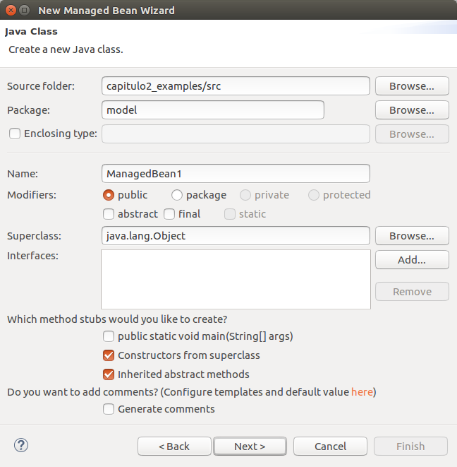
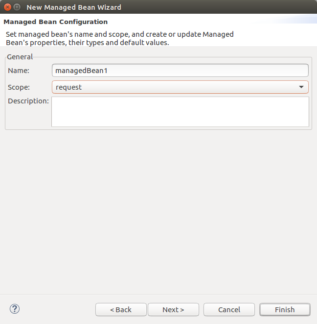
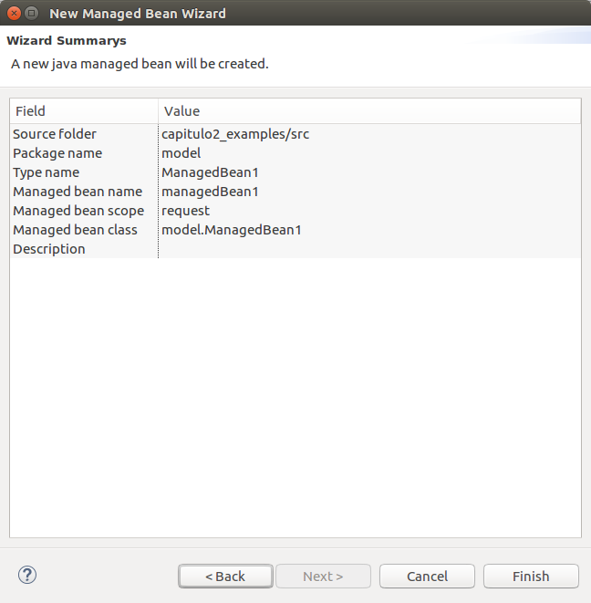
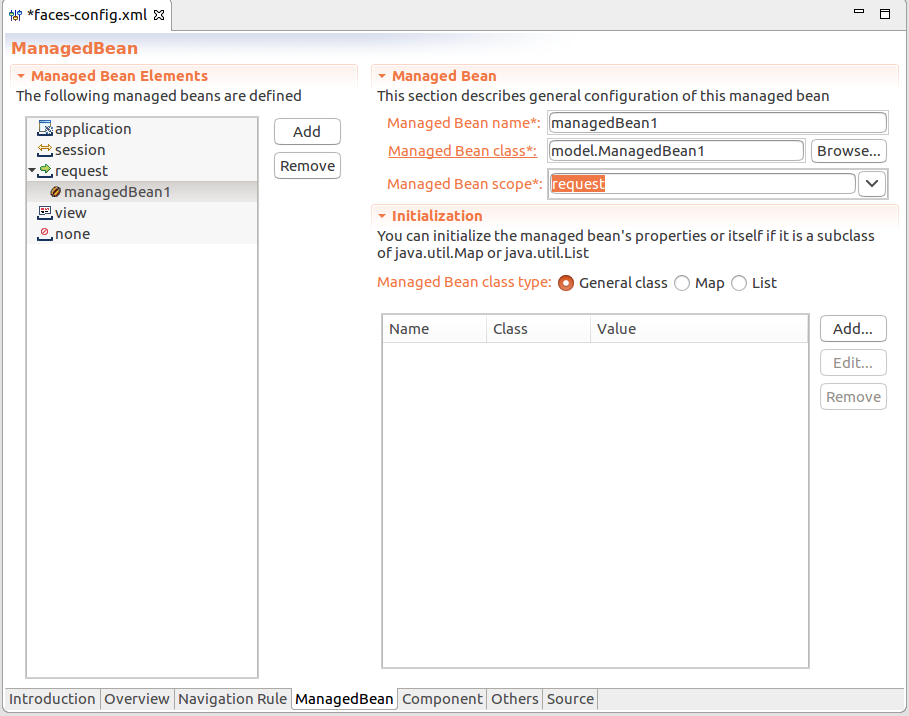
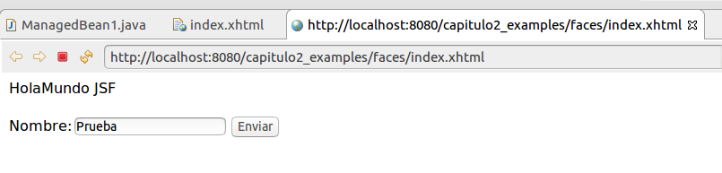

# 2. Managed Beans y Navegación 45m
   * Managed Beans 7:34 
   * Ejemplos Model Managed Bean 10:57 
   * Ejemplo Backing Managed Bean 11:51 
   * Diferencias y similitudes 5:19 
   * Navegación 9:55 
   * Contenido adicional 5


## Managed Beans 7:34 

[Managed Beans](pdfs/8-managed-beans.pdf)

Los Managed Beans son clases java que siguen la nomenclatura y convenciones de los JavaBeans (atributos de clase privados, getters y setters, …). Al igual que estos, los Managed Beans se ejecutan en el lado del servidor y pueden clasificarse en los siguientes tipos:

* Model Managed-Bean: Normally session scope. This type of managed-bean participates in the "Model" concern of the MVC design pattern.

* Backing Managed-Bean: Normally request scope. This type of managed-bean participates in the "View" concern of the MVC design pattern.

* Controller Managed-Bean: Normally request scope. This type of managed-bean participates in the "Controller" concern of the MVC design pattern.

* Support Managed-Bean: Normally session or application scope. This type of bean "supports" one or more views in the "View" concern of the MVC design pattern.

* Utility Managed-Bean

JSF se encarga de administrar el ciclo de vida de los Managed Beans realizando todas las tareas de control, tales como:

* Crear las instancias (las clases deben definirse con un constructor vacío)

* Determinar el ámbito de alcance (request, response, application, session)

* Llamar a los métodos getters y setters. Ejemplo: “#{servidor.estado}” llamará al método getEstado().

Podemos declarar los Managed Beans utilizando:

* Anotaciones en las propias clases (@ManagedBean), antes del nombre de la clase, y a continuación el alcance del contexto (@RequestScoped, @ViewScoped, @SessionScoped, @ApplicationScoped). Es la forma más extendida de declarar Managed Beans.

* Utilizando CDI (Contexts and Dependency Inyection) asociados a un contexto (request, session, application, …), mediante la incorporación de:

   * Anotación @Named, antes del nombre de la clase, y a continuación el alcance del contexto (@RequestScoped, @ConversationScoped, @SessionScoped, @ApplicationScoped).

   * Fichero beans.xml en nuestro directorio WEB-INF.

* En el archivo faces-config.xml (opcional a partir de JSF 2.0) utilizando los tags “<managed-bean> … </managed-bean>”

A parte de los alcances ya conocidos, JSF (a partir de 2.0) añade alguno más. Si listados de forma ordenada, según el tiempo de vida que ofrece cada alcance tenemos:

* request (@RequestScoped), permanece en la petición del usuario.

* view (@ViewScoped), este scope dura desde que se muestra una página JSF al usuario hasta que el usuario navega hacia otra página. Es muy útil para páginas que usan AJAX, ya que ejecutan actualizaciones sobre la misma página.

* session (@SessionScoped), permanece en la sesión del usuario.

* application (@ApplicationScoped), permanece para toda la aplicación.

La definición de los alcances para JSF se encuentra en el package: javax.faces.bean

Los alcances utilizando CDI tienen algunas diferencias con respecto a los existentes en JSF. En este caso el alcance “view” es sustituido por el alcance “Conversation”:

* request (@RequestScoped)

* conversation (@ConversationScoped), este alcance permite guardar elementos entre páginas relacionadas hasta finalizar la tarea.

* session (@SessionScoped)

* application (@ApplicationScoped)

La definición de los alcances para CDI se encuentra en el package: javax.enterprise.context

## Ejemplos Model Managed Bean 10:57 

[Ejemplos Model Managed Bean](pdfs/9-model-managed-bean.pdf)

Ver código fuente del proyecto: “capitulo2_examples”.

* Creamos un nuevo proyecto “Dynamic Web Project”

* Target runtime: Tomcat v8.0

* Dynamic web module version: 3.1

* Añadimos JSF 2.1 desde Project properties → Project Facets.

Creamos un nuevo Managed Bean mediante el asistente gráfico de ManagedBean disponible mediante `faces-config.xml`. Al abrirse el asistente pulsamos en **“Add” → “Create a New Java Class” → “Next”**:







Package: model

* Nombre de la clase: ManagedBean1

* Nombre Managed Bean: managedBean1 (lo convierte a minúsculas ya será el nombre del objeto cuando se cree una instancia de la clase)

* Alcance: request (se creará y se destruirá con cada nueva petición web)

y finalizamos guardando los cambios en el fichero faces-config.xml:



Comprobamos que se crea la siguiente clase:

```java
package model;

public class ManagedBean1 {

	public ManagedBean1() {
		// TODO Auto-generated constructor stub
	}

}
```

Creamos el mismo Managed Bean mediante anotaciones:

* Añadimos los packages para JSF.

* Añadimos las anotaciones.

Importamos los packages para las anotaciones de JSF.

Anotaciones que indican que será una clase Managed Bean administrada por el framework de JSF y que tendrá un alcance de Request.

Constructor vacío, es necesario que cada atributo sea privado y tenga sus métodos get y set públicos.

```java
package model;

import javax.faces.bean.*;

@ManagedBean
@RequestScoped
public class ManagedBean1 {

	public ManagedBean1() {
		// TODO Auto-generated constructor stub
	}

}
```

### Acceso a los atributos del Model Managed-Bean

Creamos 2 clases con el siguiente contenido:

* src / model.ManagedBean1.java
* WebContent / index.xhtml

Atributo privado y métodos get y set.

```java
package model;

import javax.faces.bean.*;

@ManagedBean
@RequestScoped
public class ManagedBean1 {

	private String name = "Prueba";
	
	public ManagedBean1() {
		// TODO Auto-generated constructor stub
	}
	
	public String getName() {
		return name;
	}

	public void setName(String name) {
		this.name = name;
	}
}
```

Contenido base, añade los namespaces para poder importar y utilizar las etiquetas de JSF.

Formulario, que usa las etiquetas de JSF, para mostrar el valor del atributo name del ManagedBean1. Podemos utilizar el editor web o escribir las etiquetas en la vista de código.

```java
	<!DOCTYPE html PUBLIC "-//W3C//DTD XHTML 1.0 Transitional//EN" 
    "http://www.w3.org/TR/xhtml1/DTD/xhtml1-transitional.dtd">

<html xmlns="http://www.w3.org/1999/xhtml"
	xmlns:ui="http://xmlns.jcp.org/jsf/facelets"
	xmlns:f="http://xmlns.jcp.org/jsf/core"
	xmlns:h="http://java.sun.com/jsf/html">


<h:body>HolaMundo JSF<br /><br />
	<h:form>
		<h:outputLabel for="name" value="Nombre:"></h:outputLabel>
		<h:inputText id="name" value="#{managedBean1.name}"></h:inputText>
		<h:message for="name"></h:message>
		<h:commandButton value="Enviar"></h:commandButton>
	</h:form>
</h:body>
</html>
```

Si ejecutamos el index.xhtml podemos comprobar que la página JSF accede correctamente al atributo del Managed Bean utilizando la sintaxis de EL (Expression Language):



## Ejemplo Backing Managed Bean 11:51 

[Ejemplo Backing Managed Bean](pdfs/10-backing-managed-bean.pdf)

Creamos las clases con el siguiente contenido:

* src / model.Usuario.java

* src / backing.Solicitud.java

* WebContent / index2.xhtml

* WebContent / correcto.xhtml (tipo “New Facelet Composition Page”)

* WebContent / incorrecto.xhtml (tipo “New Facelet Composition Page”)

Importamos los packages para las anotaciones de JSF.

Anotaciones que indican que será una clase Managed Bean administrada por el framework de JSF y que tendrá un alcance de Request.

Atributos con valores por defecto para la prueba.

Constructor vacío, es necesario que cada atributo sea privado y tenga sus métodos get y set públicos.

```java
package model;

import javax.faces.bean.ManagedBean;
import javax.faces.bean.RequestScoped;

@ManagedBean
@RequestScoped
public class Usuario {

    private String nombre = "NombrePorDefecto";
    private String email = "emailPorDefecto";
   
    public Usuario() {
		// TODO Auto-generated constructor stub
    }

    public String getNombre() {
        return nombre;
    }

    public void setNombre(String nombre) {
        this.nombre = nombre;
    }

    public String getEmail() {
        return email;
    }

    public void setEmail(String email) {
        this.email = email;
    }
}
```

Dentro de JSF, la anotación @ManagedProperty se utiliza para la inyección de dependencias (DI) de un managed bean dentro de un atributo de otro managed bean.

Para inyectar el valor de nuestro Managed Bean usuario utilizamos EL y la anotación @ManagedProperty seguido del atributo de la clase de objeto a inyectar.

A continuación se definen los métodos get y set para dicho atributo.

Método público para controlar el flujo de nuestra aplicación, dependiendo del nombre de usuario introducido, se devuelve la siguiente página JSF a mostrar:

* correcto.xhtml

* incorrecto.xhtml

En versiones anteriores el flujo de la aplicación debía ser definido en el fichero faces-config.xml

```java
package backing;

import javax.faces.bean.ManagedBean;
import javax.faces.bean.ManagedProperty;
import javax.faces.bean.RequestScoped;

import model.Usuario;

@ManagedBean
@RequestScoped
public class Solicitud {
	
	@ManagedProperty(value="#{usuario}")
	private Usuario usuario;

	public Solicitud() {
		// TODO Auto-generated constructor stub
	}
	
	public Usuario getUsuario() {
		return usuario;
	}

	public void setUsuario(Usuario usuario) {
		this.usuario = usuario;
	}
	
	public String solicitar(){
		if(this.usuario.getNombre().equals("Marina")){
			//Redirigimos el flujo directamente especificando el nombre de la nueva página en la devolución del método
			System.out.println("Correcto para usuario: " + this.usuario.getNombre());
			return "correcto";//=correcto.xhtml
		}else{
			//Redirigimos el flujo directamente especificando el nombre de la nueva página en la devolución del método
			System.out.println("Incorrecto para usuario: " + this.usuario.getNombre());
			return "incorrecto";//=incorrecto.xhtml
		}
	}

}
```

Añadimos al formulario un botón (commandButton) para:

* Llamar al método “solicitar()” de nuestro backing bean “solicitud”.

* Imprimir la cadena que devuelve la llamada a dicho método utilizando EL.

* Redirigir a la página cuyo nombre coincida con la cadena devuelta por le método (correcto o incorrecto).

```java
<!DOCTYPE html PUBLIC "-//W3C//DTD XHTML 1.0 Transitional//EN" 
    "http://www.w3.org/TR/xhtml1/DTD/xhtml1-transitional.dtd">

<html xmlns="http://www.w3.org/1999/xhtml"
	xmlns:ui="http://xmlns.jcp.org/jsf/facelets"
	xmlns:f="http://xmlns.jcp.org/jsf/core"
	xmlns:h="http://java.sun.com/jsf/html">


<h:body>
	<h:form>
		<h:outputLabel for="nombre" value="Nombre:"></h:outputLabel>
		<h:inputText id="nombre" value="#{usuario.nombre}"></h:inputText>
		<h:message for="nombre"></h:message>
		<h:commandButton action="#{solicitud.solicitar}" value="Enviar"></h:commandButton>
	</h:form>
</h:body>
</html>
```

Tipo “New Facelet Composition Page”

Formulario JSF para imprimir un mensaje. El mensaje se mete dentro de un formulario para poder incluir un botón activo (CommandLink). Para usar EL con nuestro Bean, utilizamos el nombre del Bean (clase con minúscula inicial). El framework de JSF crea las instancias automáticamente con esta nomenclatura.

CommandLink JSF para regresar a nuestro index2.

```java
<!DOCTYPE html PUBLIC "-//W3C//DTD XHTML 1.0 Transitional//EN" 
    "http://www.w3.org/TR/xhtml1/DTD/xhtml1-transitional.dtd">

<html xmlns="http://www.w3.org/1999/xhtml"
	xmlns:ui="http://xmlns.jcp.org/jsf/facelets"
	xmlns:h="http://xmlns.jcp.org/jsf/html"
	xmlns:f="http://xmlns.jcp.org/jsf/core">

<h:head>
    <title>Correcto</title>
    </h:head>
    <h:body>
        <h:form>
            El usuario #{usuario.nombre} con email #{usuario.email} ha cursado la solicitud correctamente.
            <br/>
        <h:commandLink action="index2">
			<h:outputText value="Volver"></h:outputText>
		</h:commandLink>            
        </h:form>
    </h:body>
</html>
```

* `li>Tipo` “New Facelet Composition Page”

* Idem “correcto.xhtml”

```java
<!DOCTYPE html PUBLIC "-//W3C//DTD XHTML 1.0 Transitional//EN" 
    "http://www.w3.org/TR/xhtml1/DTD/xhtml1-transitional.dtd">

<html xmlns="http://www.w3.org/1999/xhtml"
	xmlns:ui="http://xmlns.jcp.org/jsf/facelets"
	xmlns:f="http://xmlns.jcp.org/jsf/core"
	xmlns:h="http://java.sun.com/jsf/html">

<h:head>
	<title>Incorrecto</title>
</h:head>
<h:body>
	<h:form>
         No se puede cursar la solicitud para el usuario especificado: #{usuario.nombre}.
         <br />
    <h:commandLink action="index2">
		<h:outputText value="Volver"></h:outputText>
	</h:commandLink>
	</h:form>
</h:body>
</html>
```

Ejemplo de uso:

* Alcance de request, por tanto, el valor “nombre” se recupera desde el objeto “usuario” de la petición en curso.

* Si pulsamos en el link “Volver”, recuperará el valor del nombre por defecto ya que se ejecuta una nueva llamada al “index2”.

### Creación de un Bean

Notación JSF

* Seleccionar alcance.

* Nombre de la clase con Mayúsculas.

```java
@ManagedBean
[@RequestScoped | @ViewScoped | @SessionScoped | @ApplicationScoped]
public class NombreClase{}
```

Notación CDI

* Permite personalizar el nombre de los objetos de esta clase.

* Esta notación facilita la integración con otras tecnologías como EJB y JPA.

```java
@Named(“nombreClasePersonalizado”)
public class NombreClase{}
```

### Uso de un Bean

* Nombre del objeto con minúsculas.

* Uso de EL normalmente.

```java
#{nombreClase.atributo}
```

Notación CDI


```java
   #{nombreClasePersonalizado.atributo}
```

### Inyección de Beans

Con anotaciones dentro del Managed Bean

```java
@ManagedProperty(value="#{usuario}")
```

O en el archivo opcional “WEB-INF/faces-config.xml” (en desuso).

* Alcance por defecto ”request” a no ser que se especifique lo contrario, por ejemplo, “session”.

* Para agregar una dependencia, inyectamos la dependencia, mediante el tag <managed-property>, dentro de la definición de la clase. Internamente se utilizará el método “setUsuario()” declarado en la clase “Solicitud”.

```java
<?xml version="1.0" encoding="UTF-8"?>

<faces-config
    xmlns="http://java.sun.com/xml/ns/javaee"
    xmlns:xsi="http://www.w3.org/2001/XMLSchema-instance"
    xsi:schemaLocation="http://java.sun.com/xml/ns/javaee http://java.sun.com/xml/ns/javaee/web-facesconfig_2_1.xsd"
    version="2.1">

	<managed-bean>
		<managed-bean-name>usuario</managed-bean-name>
		<managed-bean-class>model.Usuario</managed-bean-class>
		<managed-bean-scope>session</managed-bean-scope>
        </managed-bean>
        <managed-bean>
		<managed-bean-name>solicitud</managed-bean-name>
		<managed-bean-class>backing.Solicitud</managed-bean-class>

               <managed-property>"#{usuario}"</managed-property>
      	</managed-bean>
</faces-config>
```

Para utilizar EL y sus operadores aritméticos o lógicos, se actuará igual que utilizando páginas JSPs (ver curso completo de Desarrollo web JavaEE).

Para resolver el alcance (Request, View, Session, Application) y el acceso a los objetos implícitos, se actuará igual que utilizando páginas JSPs (ver curso completo de Desarrollo web JavaEE).

## Diferencias y similitudes 5:19 

[Diferencias y similitudes](pdfs/11-diferencias-similitudes.pdf)

Conoce las diferencias y similitudes en esta lección.

## Navegación 9:55 

[Navegación](pdfs/12-navegacion-jsf.pdf)

Para determinar el flujo de navegación entre las distintas páginas, que utilicen la misma tecnología, podemos diferenciar varios aspectos:

### Tipos de navegación

Tenemos diferentes tipos de navegación:

* Navegación estática, no se implementa ninguna lógica para determinar la página siguiente: <h:commandButton action="solicitar" value="Enviar"></h:commandButton>

   * La página siguiente se puede determinar de 2 formas:

      * Añadiendo la misma extensión de la página solicitante (xhtml, jspx) al outcome (p.e. solicitar.xhtml) y buscando dicha página en el mismo directorio que ejecuto la petición. Esta alternativa es prioritaria sobre el fichero faces-config.xml.

      * Buscando en el fichero faces-config.xml el caso de navegación que determina la siguiente página.

* Navegación dinámica, se implementa una lógica para determinar la página siguiente: <h:commandButton action="#{solicitud.solicitar}" value="Enviar"></h:commandButton>

* Revisar lógica en “capitulo2_examples”: index2.xhtml → Solicitud.solicitar() → correcto.xhtml | incorrecto.xhtml

### Configurar el flujo de navegación

Tenemos varias formas de configurar la navegación:

* Navegación implícita (JSF), busca una página en el directorio actual cuyo nombre coincida con el especificado por la cadena de salida de la página actual y con la misma extensión que dicha página (.xhtml, jspx). Esta alternativa es prioritaria sobre el fichero faces-config.xml.

* Navegación explícita, se define la navegación en el fichero faces-config.xml (Ver proyecto javaquiz).

Caso de navegación genérico para redireccionar cualquier página que no coincida con ninguna cadena de salida a la página de inicio (index.xhtml).

Para añadir las diferentes reglas de navegación se utiliza el tag “<navigation-rule>”.

Tag para especificar la página desde la que proviene la petición.

Tag para especificar los casos de navegación para la página desde la que proviene la petición (<from-view-id>). Podrán existir múltiples opciones con una misma página origen. Por cada caso de navegación para una misma página “origen” debemos añadir un nuevo bloque <navigation-rule>.

Define la cadena de salida (outcome) de la página anterior. En este caso “failure”.

Define la siguiente vista a mostrar (“again.xhtml”) en el caso que la salida de la página actual coincida con el outcome “failure”.

```xml
<?xml version="1.0"?>
<faces-config xmlns="http://java.sun.com/xml/ns/javaee" 
   xmlns:xsi="http://www.w3.org/2001/XMLSchema-instance"
   xsi:schemaLocation="http://java.sun.com/xml/ns/javaee 
      http://java.sun.com/xml/ns/javaee/web-facesconfig_2_0.xsd"
   version="2.0">
   <navigation-rule>
      <navigation-case>
         <from-outcome>startOver</from-outcome>
         <to-view-id>/index.xhtml</to-view-id>
      </navigation-case>
   </navigation-rule>
   <navigation-rule>
      <from-view-id>/again.xhtml</from-view-id>
      <navigation-case>
         <from-outcome>failure</from-outcome>
         <to-view-id>/failure.xhtml</to-view-id>
      </navigation-case>
   </navigation-rule>
   <navigation-rule>
      <navigation-case>
         <from-outcome>failure</from-outcome>
         <to-view-id>/again.xhtml</to-view-id>
      </navigation-case>
   </navigation-rule>

   <application>
      <resource-bundle>
         <base-name>com.corejsf.messages</base-name>
         <var>msgs</var>
      </resource-bundle>
   </application>
</faces-config>
```

## Contenido adicional 5

[Managed Beans](pdfs/8-managed-beans.pdf)

[Ejemplos Model Managed Bean](pdfs/9-model-managed-bean.pdf)

[Ejemplo Backing Managed Bean](pdfs/10-backing-managed-bean.pdf)

[Diferencias y similitudes](pdfs/11-diferencias-similitudes.pdf)

[Navegación](pdfs/12-navegacion-jsf.pdf)
