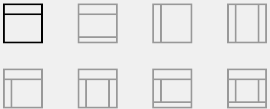
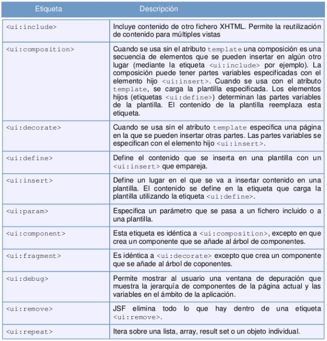

# 4. Facelets de JSF 24m
   * Facelets 2:49 
   * Plantillas 5:52 
   * Ejemplos 15:48 
   * Contenido adicional 3
   
## Facelets 2:49 

[Facelets](pdfs/15-facelets-jsf.pdf)

Facelets es un framework basado en el servidor que permite definir la estructura general de las páginas (su layout) mediante plantillas.

Las principales características de los Facelets:

* Tecnología estándar de despliegue a partir de JSF 2.0

* Los Facelets sustituyen el uso de los JSP’s debido a que aportan diversas ventajas:

   * Utilizar un motor XML mucho más rápido.

   * Tienen un menor coste de compilación.

   * Construyen un Component Tree más ligero.

   * Soporte para Plantillas (Templates).
   
Dentro de una página Facelet no es posible utilizar los tags de JSP (<jsp: …/>) pero si podemos seguir utilizando los tags correspondientes a JSTL (<c: ... />) y las expresiones EL.

La sustitución de JSP por Facelets como lenguaje básico para definir la disposición de las páginas permite separar perfectamente las responsabilidades de cada parte del framework. La estructura de la página se define utilizando las etiquetas Facelets y los componentes específicos que deben presentar los datos de la aplicación utilizando etiquetas JSF.

## Plantillas 5:52 

[Plantillas](pdfs/16-plantillas.pdf)

El objetivo de las plantillas es reutilizar código, implementando partes de código ya escritas en una página conocida como “TEMPLATE” dentro de otras páginas conocidas como “CLIENTES DEL TEMPLATE”.

Un ejemplo son las aplicaciones donde siempre se muestra una cabecera, un menú y un pie de página, lo único que va cambiando es la sección de contenido. Implementando las plantillas de JSF 2.0 en nuestras paginas solo nos preocuparíamos por la parte del contenido de la pagina y nos olvidaríamos de cabeceras, menús laterales y pies de pagina.

Ejemplos de plantillas:



Para implementar plantillas en JSF 2.0 debemos implementar dos elementos:

1. Facelets Template, es la plantilla o diseño donde se especifican las diferentes secciones dentro de una página, aquí se definen cabeceras, menús laterales, pies de página y contenido.

2. Facelets Template Client, es la pagina que va a implementar al TEMPLATE, solo se preocupara por escribir alguna(s) secciones de código, ya que al importar el TEMPLATE se importan sus diferentes regiones. Los usuarios finales accederán siempre a esta plantilla-cliente.

Para comenzar a utilizar plantillas debemos importar el namespace “ui” para poder hacer uso de los tags de templates en nuestra página JSF.

```xml
xmlns:ui="http://java.sun.com/jsf/facelets"
```

Si queremos aplicar una hoja de estilos a nuestra página usamos la etiqueta:

```x
ml

<h:outputStylesheet library="css" name="styles.css"/>
```

La siguiente tabla explica brevemente las etiquetas definidas por Facelets:



## Ejemplos 15:48 

[Ejemplos](pdfs/17-ejemplo.pdf)

Utilizando el mecanismo de plantillas de Facelets podremos encapsular los componentes comunes de una aplicación. De esta forma modificaremos el aspecto de nuestra página aplicando cambios sobre la plantilla, y no individualmente sobre cada página.

Veamos ahora cómo definir la plantilla de una aplicación. Supongamos que queremos definir una plantilla con la siguiente estructura:

* Menú a la izquierda

* Cabecera

* Contenido variable, en función de la opción del menú que se ha seleccionado.

El usuario visualizará la misma página y sólo irá cambiando el contenido del centro de la pantalla. El aspecto de la página que queremos construir es el que aparece en la siguiente figura:

#### templates → masterLayout.xhtml

Dentro del subdirectorio “templates” creamos un “Facelets TEMPLATE” para posteriormente definir un “Facelets TEMPLATE CLIENT”

* Importamos el namespace “ui” para poder hacer uso de los tags de templates en nuestra página JSF.

* Carga de la hoja de estilos. Deberemos ubicar el fichero “styles.css” dentro de una carpeta resources/css en nuestro WebContent.

* Sección para el Título. Para definir las secciones utilizamos el tag <ui:insert ...>

* Sección para el header.

* Sección para la barra lateral izquierda.

* Sección para los contenidos.

```html
<!DOCTYPE html PUBLIC "-//W3C//DTD XHTML 1.0 Transitional//EN"
"http://www.w3.org/TR/xhtml1/DTD/xhtml1-transitional.dtd">

<html xmlns="http://www.w3.org/1999/xhtml"
      xmlns:ui="http://java.sun.com/jsf/facelets"
      xmlns:h="http://java.sun.com/jsf/html">
   
   <h:head>
      <title><ui:insert name="windowTitle"/></title>
      <h:outputStylesheet library="css" name="styles.css"/>
   </h:head>
   
   <h:body>   
      <div id="heading">
         <ui:insert name="heading">
            <ui:include src="/sections/planetarium/header.xhtml"/>
         </ui:insert>
      </div>
      
      
      <div id="sidebarLeft">
         <ui:insert name="sidebarLeft">
            <ui:include src="/sections/planetarium/sidebarLeft.xhtml"/>
         </ui:insert>
      </div>    
      
      <div id="content">
         <ui:insert name="content"/>
      </div>
      <ui:debug/>
   </h:body>
</html>
```

**login.xhtml**

Definir un “Facelets TEMPLATE CLIENT” haciendo uso del “Facelets TEMPLATE” definido antes.

* Importamos el namespace “ui” para poder hacer uso de los tags de templates en nuestra página JSF.

* Cargamos el TEMPLATE principal con el tag <ui:composition ...> y lo cerramos antes de la etiqueta de fin </body>.

* Sección para el Título. Para cargar el contenido a mostrar en cada sección (definida con <ui:insert ...>) utilizamos el tag <ui:define ...> y lo cerramos tras los contenidos a incluir en dicha sección.

* Sección para el header. Sobrescribe el definido por el TEMPLATE para cargar uno propio de la pantalla de login.

* Sección para la barra lateral izquierda. Sobrescribe el definido por el TEMPLATE para cargar uno propio de la pantalla de login.

* Sección para los contenidos.

```html
<!DOCTYPE html PUBLIC "-//W3C//DTD XHTML 1.0 Transitional//EN"
"http://www.w3.org/TR/xhtml1/DTD/xhtml1-transitional.dtd">
<html xmlns="http://www.w3.org/1999/xhtml"
      xmlns:h="http://java.sun.com/jsf/html"
      xmlns:ui="http://java.sun.com/jsf/facelets">
   <head><title>IGNORED</title></head>
   <body>
      <ui:composition template="/templates/masterLayout.xhtml">
         <ui:define name="windowTitle">
            #{msgs.loginTitle}
         </ui:define>

         <ui:define name="heading">
            <ui:include src="/sections/login/header.xhtml"/>
         </ui:define>

         <ui:define name="sidebarLeft">
            <ui:include src="/sections/login/sidebarLeft.xhtml"/>
         </ui:define>

         <ui:define name="content">
            <h:form>
               <h:panelGrid columns="2">
                  #{msgs.namePrompt}
                  <h:inputText id="name" value="#{user.name}"/>
                  #{msgs.passwordPrompt}
                  <h:inputSecret id="password" value="#{user.password}"/>
               </h:panelGrid>
               <p>
                  <h:commandButton value="#{msgs.loginButtonText}"
                                   action="planetarium"/>
               </p>
            </h:form>
         </ui:define>
      </ui:composition>
   </body>
</html>
```

**planetarium.xhtml**

“Facelets TEMPLATE CLIENT”

Importamos el namespace “ui” para poder hacer uso de los tags de templates en nuestra página JSF.

Cargamos el TEMPLATE principal con el tag <ui:composition ...> y lo cerramos antes de la etiqueta de fin </body>.

Sección para el Título. Para cargar el contenido a mostrar en cada sección (definida con <ui:insert ...>) utilizamos el tag <ui:define ...> y lo cerramos tras los contenidos a incluir en dicha sección.

Sección para los contenidos.

```html
<!DOCTYPE html PUBLIC "-//W3C//DTD XHTML 1.0 Transitional//EN"
"http://www.w3.org/TR/xhtml1/DTD/xhtml1-transitional.dtd">
<html xmlns="http://www.w3.org/1999/xhtml"
      xmlns:ui="http://java.sun.com/jsf/facelets">
   <head><title>IGNORED</title></head>
   <body>
      <ui:composition template="/templates/masterLayout.xhtml">     
         <ui:define name="windowTitle">
            #{msgs.planetariumTitle}
         </ui:define> 
         
         <ui:define name="content">
            #{msgs.planetariumWelcome}
         </ui:define>
      </ui:composition>
   </body>
</html>
```

## Contenido adicional 3   

[Facelets](pdfs/15-facelets-jsf.pdf)

[Plantillas](pdfs/16-plantillas.pdf)

[Ejemplos](pdfs/17-ejemplo.pdf)
