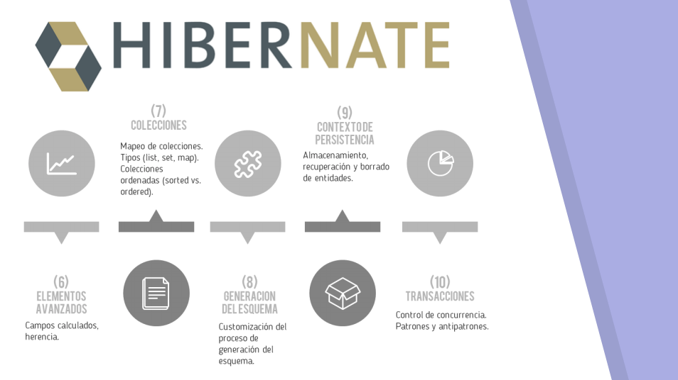
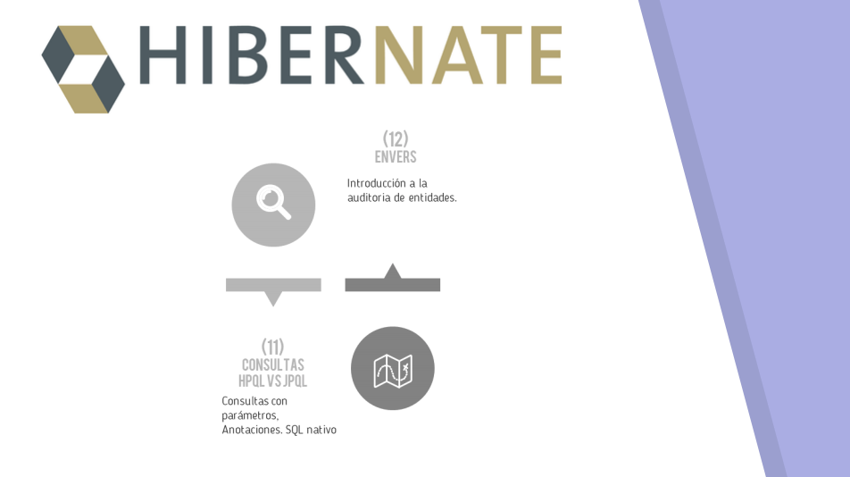

# 1. Introducción 44m

   * 01 Presentación del profesor y del curso 2:49 
   * 02 Introducción 18:52 
   * 03 Hibernate, más que un ORM 22:43 
   * Contenido adicional 2
      
# 01 Presentación del profesor y del curso 2:49 

## Resumen Profesor

Conoce al profesor y lo que veremos durante el curso de Hibernate.

REPOSITORIO DEL CURSO: https://github.com/OpenWebinarsNet/Curso_hibernate_ejemplos

## Transcripción


Curso de Hibernate 5, una tecnología de ORM de las más utilizadas en el mercado sobre todo para Java. Vamos a compartir 12 capítulos en los que nos iremos metiendo de lleno en esta tecnología.


En el primer capítulo veremos una introducción a lo que es el concepto de ORM y los diferentes productos que podemos encontrar en el mercado.

En el segundo iremos conociendo Hibernate y también los diferentes módulos que ofrece, lo compararemos con el estándar JPA.

En el tercer capítulo realizaremos nuestro primer proyecto con Hibernate, nuestro primer proyecto con JPA y también marinaremos estás tecnologías con Spring Boot y Spring MVC.

En el capítulo 4 vamos a saber cómo mapear nuestras entidades en la base de datos haciéndolo a través de anotaciones y a través de fichero de descriptores XML y también conoceremos el ciclo de vida de las entidades.

En el capítulo 5 conoceremos cómo asociar una entidad desconocida y los diferentes tipos de asociaciones que existen.


En el capítulo 6 hablaremos de algunos elementos avanzados como la herencia o los campos calculados.

En el siete veremos como Hibernate nos permite mapear colecciones de diferentes tipos y estas colecciones pueden ser de valores simples de valores algo más complejo y también puede ser ordenada de diferentes maneras.

En el capítulo 8 veremos cómo genera el esquema de nuestra base de datos y así lo deseamos o cómo podemos hacer el proceso inverso para un esquema dado de generación de la entidad.

En el capítulo 9 hablaremos un poco sobre qué es eso de la unidad de persistencia, el contexto de persistencia y cómo se pueden almacenar, recuperar y borrarlo.

En el capítulo 10 hablaremos de transacciones y control de concurrencia y veremos algunos patrones y antipatrones.


En el capítulo 11 veremos cómo podemos realizar consulta en lenguaje nativo de Hibernate y sobretodo utilizaremos el de JPA.

Y por último en el capítulo 12 hablaremos de Hibernate Envers y cómo realizar la auditoría de entidades y cómo realizar la auditoría de entidades y un control de revisiones.

# 02 Introducción 18:52 

[Introducción](pdfs/01_Introducción.pdf)

## Resumen Profesor

### 1.1 Necesidad de almacenamiento de información

Desde que *el mundo es mundo* el ser humano ha tenido necesidad de almacenar información. Con la invención de la escritura, no se estaba haciendo más que conseguir que la palabra escrita pudiera reflejar hechos, ideas, sentimientos… más allá de la mera experiencia oral. La imprenta de caracteres móviles supuso una expansión del conocimiento como nunca antes de había conseguido, y todo gracias a que la información se podía replicar de una manera más rápida y eficiente.

Ya en el siglo XX, con la invención de las computadoras, aparecen diferentes dispositivos de almacenamiento, como son las tarjetas o cintas perforadas, cintas de casete, discos magnéticos, ópticos, sólidos… En menos de 50 años, hemos pasado de una capacidad de almacenamiento de 4MB en un disco que pesaba cientos de kilos, a tarjetas de memoria de pocos gramos con una capacidad de cientos de GB.

#### 1.1.1 Organización de la información

Más allá de la forma *física* de almacenar la información, existe otra perspectiva, que es la forma *lógica* de organizarla, es decir, como utilizamos los dispositivos de almacenamiento para guardar todos los datos que deseemos.

Los primeros sistemas informáticos organizaban los datos en registros. Un registro no es más que un conjunto de datos *coherentes* entre ellos. Por ejemplo, nuestra declaración de la renta (IRPF) es un extenso conjunto de datos, la mayoría de ellos numéricos, que hacen referencia, normalmente, a una sola persona; o también, la información meteorológica para un lugar, por ejemplo Sevilla, en una fecha exacta, por ejemplo el día de hoy, también sería un conjunto de datos coherentes, es decir, un registro.

Con el tiempo, surge la necesidad de separar los programas de aplicación y el almacenamiento de los datos, y con ello, las **bases de datos**.

### 1.2 Bases de datos

Desde los años 50-60 surgieron diferentes modelos de datos, como el jerárquico o el modelo en red, que implicaban que los programas estuvieran muy acoplados a los datos. Para solventar este problema, surge el **modelo relacional**.

#### 1.2.1 Modelo relacional

Fue propuesto por Edgar Codd, y está sustentado en la teoría de conjuntos y la lógica de predicados.

La estructura fundamental de este modelo es la *relación*, aunque usaremos su sinónimo, llamado **tabla**. Se trata de una estructura formada por columnas y filas, que contiene información sobre una misma clase o entidad. Además, esta estructura es independiente de la forma en que se almacenan los datos (es decir, el esquema físico y el lógico son diferentes). Este modelo perseguía diferentes objetivos además de esta independencia, como es la uniformidad, la flexibilidad, y la sencillez.

Con el tiempo, este modelo es el que más se ha extendido, siendo un estandar de *facto* durante muchos años, incluso en la actualidad, si bien han surgido una nueva ola de modelos, llamados NoSQL (Not Only SQL).

### 1.3 Desfase objeto-relacional

En la actualidad, el modelo de programación más extendido es la Orientación a Objetos, mediante la cual todos los componentes que manejamos en una aplicación son objetos. Si pudiéramos representar gráficamente un objeto y una tabla, caeríamos en la cuenta de que no tienen el mismo número de dimensiones: las tablas son *bidimensionales*, frente a los objetos que son *tridimensionales*. Esto nos sugiere que sería ideal tener una base de datos que nos permitiera almacenar objetos. Sin embargo, los productos más extendidos en el mercado, a día de hoy, siguen siendo los SGBD relacionales.

¿Cómo solventar este problema? En principio, un programador tenía que escribir toneladas de código fuente para poder almacenar o recuperar información. Además, ese código suele repetirse en un alto porcentaje, ya que las sentencias de conexión, recuperación o cierre suelen ser muy parecidas.

A continuación, mostraremos un ejemplo de un código Java que, haciendo uso de JDBC, consultaría una base de datos relacional.

```java
public List<Alumno> findAll() throws ClassNotFoundException, SQLException {
        String sql = "SELECT ID_ALUMNO, NOMBRE, APELLIDOS,"
                + " TO_CHAR(FECHA_NACIMIENTO,'DD/MM/YYYY') AS FEC_NAC, "
                + " CORREO_ELECTRONICO, HORAS_FALTAS "
                + " FROM ALUM";

        List<Alumno> result = null;

    //Este método nos devolvería un objeto PreparedStatement
    //listo para ejecutar la sentencia de más arriba
        PreparedStatement ps = DBConnection.getPreparedStatement(sql);

        ResultSet rs = ps.executeQuery();

        while(rs.next()) {
            if (result == null)
                result = new ArrayList<Alumno>();

            result.add(new Alumno(rs.getInt("ID_ALUMNO"),
                    rs.getString("NOMBRE"),
                    rs.getString("APELLIDOS"),
                    rs.getString("FEC_NAC"),
                    rs.getString("CORREO_ELECTRONICO"),
                    rs.getInt("HORAS_FALTAS")));
        }

        rs.close();
        ps.close();

        return result;
    }
```    

Para tratar de aligerar la tarea de los programadores, surgen la técnica del mapeo objeto-relacional.

### 1.4 *Object Relational Mapping* (ORM)

Se conoce comunmente como ORM a un componente software, ubicado entre una aplicación y un SGBDR, que se encargará de salvar el desfase objeto-relacional, ayudándonos a transformar los objetos de nuestra aplicación en filas de tablas de nuestra base de datos relacional.

Un mapeador objeto-relacional nos permite abstraernos del proceso de transformación entre objetos y tablas, y viceversa, acelerando así el desarrollo, pues nos permite centrarnos en programar la lógica de negocio de nuestra aplicación. También permite aumentar la seguridad y fiabilidad.

Una de las grandes desventajas achacadas a los ORMs es que pueden *ralentizar* mucho el acceso a bases de datos. Sin embargo, muchos ORMs nos permiten el uso de cachés, que aceleran el proceso de consulta.

#### 1.4.1 Productos existentes en el mercado

Algunos de los ORMs más conocidos para Java son:

* Hibernate

* EclipseLink

* JDO

* MyBatis

Para otros lenguajes de programación, también podemos encontrar algunos ORMs:

* PHP

   * Propel

   * Doctrine

* C#
 
   * NHibernate

   * ADO.NET Entity Framework
   
* Python

   * Django ORM

   * SQL Alchemy
   
   * Pony
   
## Transcripción  


# 03 Hibernate, más que un ORM 22:43 

[Hibernate, más que un ORM](pdfs/02_Hibernate.pdf)

## Resumen Profesor

### 2.1 Hibernate como ORM

Ya hemos hablado en el capítulo anterior de lo que era un mapeador objeto-relacional y como nos podía ahorrar muchas líneas de código muy repetitivo. Sin embargo, los beneficios de uso de Hibernate no se quedan solamente ahí:

**Ventaja**	| **Descripción**
--------|------------
**Productividad** |	Nos permite centrarnos en el desarrollo de la lógica de negocio, ahorrándonos una gran cantidad de código (más del que cabría esperar).
**Mantenibilidad** | El ORM de Hibernate, al reducir el número de líneas de código que tenemos que escribir, nos permite realizar refactorizaciones de forma más fácil.
**Rendimiento** |	Aunque la persistencia manual podría permitir un rendimiento mayor, Hibernate aporta muchas optimizaciones, como el almacenamiento en caché.
**Independencia** |	Hibernate nos permite aislarnos del RDBMS concreto que estemos usando. Aunque no tengamos pensado cambiar de gestor, nos puede permitir usar un RDBMS ligero (como H2) para la fase de desarrollo, usando otro en producción.

### 2.2 Hibernate, no solo un ORM
Hibernate no solamente es un ORM. Se trata de un proyecto formado por varios módulos, que nos ofrecen grandes funcionalidades.

#### Hibernate ORM

Este módulo ya ha sido, de alguna forma, presentado. Contiene una serie de servicios para la persistencia de objetos en bases de datos relacionales. Funciona en casi cualquier proyecto Java (Java EE, Java Swing, con Servlets, Spring, …).

#### Hibernate EntityManager

Más adelante hablaremos de JPA, pero podemos decir aquí que este módulo es el que nos permite utilizar Hibernate como implementación del estándar JPA. Las características nativas de Hibernate son un superconjunto de las que ofrece JPA en todos los sentidos.

#### Hibernate Validator

Hibernate proporciona una implementación del estándar JSR 303 Bean Validation. Se puede usar independientemente de otros proyectos de Hibernate, y proporciona una validación declarativa para nuestras *clases modelo*.

#### Hibernate Envers

Dedicaremos el último capítulo de este curso a este módulo, que nos permite auditar los cambios en nuestra persistencia, manteniendo múltiples versiones de los datos en nuestra base de datos SQL. Esto nos permitirá implementar facilmente históricos (funciona de forma similar a los sistemas de control de versiones, como Git).

#### Hibernate Search

Este módulo mantiene un índice de todas los datos de nuestro dominio dentro de una base de datos de `Apache Lucene`. En conjunción con Hibernate ORM, podremos realizar búsquedas de texto completo.

#### Hibernate OGM

Se trata del *mapeador objeto-grid*, y está orientado hacia bases de datos NoSQL. Proporciona soporte JPA para este tipo de soluciones, reusando el núcleo de Hibernate pero almacenando las entidades en pares clave-valor, documentos u otro tipo de almacenes de datos no relacionales.

### 2.3 Hibernate frente a otros ORMs del mercado

¿Hibernate? ¿MyBatis? ¿JDBC? ¿Qué tecnología deberíamos escoger?
Esa es una pregunta que no tiene una sola respuesta, ya que dependerá del proyecto concreto que estemos desarrollando. Espero que estas pistas os sirvan.

#### 2.3.1 Hibernate vs JDBC

JDBC no es un ORM, pero es la tecnología de base que nos ofrece Java para poder tener conectividad con bases de datos relacionales.

Tecnología | Ventajas |	Desventajas
-----------|----------|------------
JDBC | Ofrece un rendimiento superior. Además, nos permite utilizar al máximo las funcionalidades concretas de nuestro servidor de base de datos | El desarrollo y mantenimiento de nuestras aplicaciones es mucho más costoso. Además, es muy fácil introducir errores durante el desarrollo.
Hibernate	| Podemos desarrrollar más rápidamente, y haciendo uso de entidades (objetos) en lugar de consultas. Es una gran ayuda en la fase de mantenimiento, y nos permite eliminar al 100% los errores de ejecución debido al acceso a bases de datos | Tiene una curva de aprendizaje mayor, y normalmente no conseguirá el mismo rendimiento que el acceso a base de datos de forma nativa.

#### 2.3.2 Hibernate vs MyBatis

Haciendo honor a la verdad, MyBatis (antes conocido como iBatis) no es un ORM, ya que no genera código SQL. Se trata más bien de un mapeador SQL, que nos permite asociar a un objeto a una tabla de nuestra base de datos mediante un descriptor en formato XML o usando anotaciones.

Algunas características comparadas podrían ser las siguientes.

MyBatis	| Hibernate
--------|----------
Es muy simple. El empaquetado ocupa poco espacio | Genera el SQL por nosotros, lo cual significa que no tenemos que invertir nuestro tiempo en hacerlo.
Es flexible, ofrece un tiempo de desarrollo muy rápido | Es altamente escalable, y ofrece una caché más avanzada.
Utiliza SQL, que si bien es un estándar, puede tener elementos concretos de un RDBMS | Utiliza HQL, que es más independiente del RDBMS utilizado. Es fácil cambiar de base de datos con Hibernate.
Mapea un ResultSet del API JDBC en nuestros objetos POJO, de forma que no debemos preocuparnos por las tablas relacionales. | Hibernate mapea nuestros objetos POJO en tablas de una base d edatos.
Es fácil usar procedimientos almacenados | Es algo dificultoso usar procedimiento almacenados.

### 2.4 Hibernate y JPA

Muchas personas que se han introducido en el mundo de la persistencia se preguntan: ¿no son Hibernate y JPA lo mismo? Realmente, la diferencia es mucha, ya que JPA es una especificación (inicialmente JSR 220; en la versión actual, la 2.1, el JSR 338) que carece de implementación. Hibernate, por contra, es un producto muy real, un framework con una serie de funcionalidades muy concretas.

Entonces, ¿qué relación tienen? Hibernate, a través de uno de sus módulos, proporciona una implementación la especificación JPA, de forma que podemos usar JPA como *interfaz*, sabiendo que por debajo, las operaciones con la base de datos se estarán realizando con Hibernate. De alguna manera, Hibernate es de facto la implementación de referencia de JPA.

La especificación JPA define lo siguiente:

* Una *facilidad* para especificar como nuestros objetos Java se relaciona con el esquema de una base de datos (a través de XML o de anotaciones).

* Una api sencillo para realizar las operaciones CRUD (*create, read, update, delete*), haciendo uso de un `javax.persistence.EntityManager`.

* Un lenguaje y un API para realizar consultas sobre los datos. El lenguaje, llamado JPQL (*Java Persistence Query Language*) se parece mucho a SQL.

* Como el motor de persistencia interacciona con las instancias transaccionales para buscar instancias *sucias*, captura de asociaciones u otras funciones de optimización.

Hibernate incluye, como parte de su código, toda la especificación JPA. Es decir, podemos usar Hibernate como *motor de persistencia* de JPA; sin embargo, incluye más funcionalidades que las que define la especificación.

A lo largo del curso las iremos descubriendo.

### 2.5 Hibernate con Maven

Si queremos trabajar con Hibernate, tenemos que incorporar a nuestro proyecto Java una serie de librerías, que se pueden descargar facilmente desde la web `http://hibernate.org/orm/downloads/`.
Sin embargo, el mantenimiento de estas librerías puede llevarnos al conocido como **infierno de los Jar**, ya que podemos tener algunos problemas:

* Incluir dos versiones diferentes de una misma biblioteca.

* Dos bibliotecas que están relacionadas entre sí, y de las que se incluyen versiones incompatibles.

* …

Por toda estas razones, entre otras, es razonable utilizar algún sistema que nos permita gestionar las dependencias de nuestro proyecto con librerías externas. En nuestro caso, usaremos Maven.

Utilizando Maven, nuestro proyecto tendrá un fichero, llamado `pom.xml` que, entre otros elementos, nos permitirá definir las librerías que necesitamos.

De esa forma, podremos añadir las dependencias de nuestras librerías. Estas pueden ser encontradas en la web del repositorio de Maven (https://mvnrepository.com/).

Alguna de las que usaremos durante el curso es la siguiente:

```xml
<dependency>
    <groupId>org.hibernate</groupId>
    <artifactId>hibernate-core</artifactId>
    <version>5.2.9.Final</version>
</dependency>
```

En cada uno de los proyectos de ejemplo indicaremos las librerías que necesitaremos.

## Preguntas

P= Mi consulta va respecto al último punto sobre Hibernate cuando dice "es algo difuso usar procedimientos almacenados". Qué pasaría si tengo un o varios procedimientos almacenados o funciones para "reportes especiales" a nivel de base de datos, en el cual se hacen varios "joins" con tablas o crea una tabla dinámica fruto de estas consultas. ¿Sería mejor invocar desde Hibernate o JPA al procedimiento almacenado o función? ¿Y si este cojunto de datos que retorna del procedimiento almacenado, corresponde mapearlo en un nuevo objeto? ¿Cómo Hibernate soluciona este escenario?.

R= Con ello me refería a que, a diferencia de otros elementos del estándar SQL, los procedimientos almacenados están fuertemente acoplados al sistema gestor de base de datos concreto que se utilice. No es lo mismo programar en PLSQL (Oracle) o en T-SQL (SQL Server).
Como premisa, cabe indicar que una función es un bloque de código que se puede usar en una sentencia SQL, y que recibe cero o más argumentos, devolviendo una salida. Frente a él, un procedimiento almacenado es un bloque de código que no se puede usar en una sentencia SQL y que recibe cero o más parámetros que pueden ser de entrada, de salida o de entrada-salida.
JPA tiene la interfaz `StoredProcedureQuery` que nos permite invocar procedimientos almacenados. Se pueden utilizar parámetros de salida de tipo `REF_CURSOR`, permitiendo así obtener un listado de resultados como salida de dicho procedimiento. Si al crear el procedimiento, se indica el tipo sobre el que se realiza la consulta (por ejemplo, con el método `entityManager.createdStoredProcedure`) (ver https://docs.oracle.com/javaee/7/api/javax/persistence/EntityManager.html#createStoredProcedureQuery-java.lang.String-java.lang.Class...-), el conjunto de resultados puede ser un `List<Tipo>` siendo `Tipo` el tipo de dato de la entidad que queremos utilizar. En otro caso, lo habitual es que sea un `List<Object[]>`.
  
P= Mi consulta va respecto al último punto sobre Hibernate cuando dice "es algo difuso usar procedimientos almacenados". Qué pasaría si tengo un o varios procedimientos almacenados o funciones para "reportes especiales" a nivel de base de datos, en el cual se hacen varios "joins" con tablas o crea una tabla dinámica fruto de estas consultas. ¿Sería mejor invocar desde Hibernate o JPA al procedimiento almacenado o función? ¿Y si este cojunto de datos que retorna del procedimiento almacenado, corresponde mapearlo en un nuevo objeto? ¿Cómo Hibernate soluciona este escenario?.

## Transcripción


En este primer capítulo del curso de Hibernate 5 hablaremos sobre la necesidad de almacenamiento de información, sobre cómo organizar la información, hablaremos también de base de datos, de lo que se conoce como el desfase objeto-relacional y por último hablaremos de los ORM que podemos encontrar en el mercado algunos de ellos para Java y para otros lenguajes de programación.



Desde que el mundo es mundo el ser humano ha tenido necesidad de almacenar conocimiento, de almacenar información para que esté perdurará en el tiempo. Tras miles de años de transmisión oral surge la escritura, en principio en determinados soportes que eran un poco complicado, hasta la invención del papel que hace que se pueda almacenar mucho más cantidad de información con un menor peso, con un material que quedaba algo más de garantías, con el devenir también del tiempo surge una gran herramienta de almacenamiento y difusión de la información que fue la imprenta de caracteres móviles.



Y a partir de ahí pues van surgiendo otros sistemas hasta que llegamos a ciertos sistemas mecánico, eléctrico, electrónico cómo son las cintas perforadas o el inicio de la computación, lo que conocemos como los discos duros, podemos ver en la imagen el primer disco duro, uno de los primeros discos duros que fabricó IBM en torno a los años 50, el IBM 305 y que tenía la friolera de 4MB y pesaba varias toneladas o los primeros discos duros primygeni de finales de los 70s y que valian cerca de 4000 dolares de la época y no llegaban a los 10 megas.


A día de hoy como sabéis ya cambiado y tenemos tarjetas micro SD de 128GB y bueno con el aumento del espacio surge la necesidad de que la información almacenada esté organizado de determinada manera.


Hablando ya en particular de sistemas de información y haciendo también un repaso de inicio hasta ahora los primeros sistemas de información organizaban a nivel físico la información en el registro de tamaño estático dentro de fichero aleatorio fichero aleatorio son aquellos a los que se puede acceder a cualquier parte no podemos cualquier parte el hecho de que lo tuvieran un tamaño fijo no hacía que su localización pues fuera fácilmente accesibles sin embargola fragmentación interna y lo bien dejamos el hueco y lo rellena vamos después o bien necesita algún tipo de proceso para tratar de evitar esto surgen algunos tipos de ficheros distintos organizados con registro de tamaño dinámico o también los indexados qué se dedicaban a intentar organizar el fichero con una primera parte de índice que nos permitía después buscar fácilmente los registros que teníamos sin embargo la compleja porque si se utilizaba el tipo de función de provocary además la propia gestión de espera también una operación que era bastante compleja además en esta época los índices utilizar pues para para manejar la dirección física de los datos en el disco duro con lo cual un cambio de disco duro un cambio de la controladora del disco duro podría provocar que tuviéramos que reiniciar por completo el fichero al al plantear los sistemas de información podemos pensar lo de dos maneras diferentes orientado a los procesos que como programando 50 60 70 y también en gran parte de los 80 y orientado alta en los sistemas de información orientado al proceso de una organización tenemos que manejar diferentes aplicación para la matriculación en una notael acoplamiento entre los datos y la información producía que si una determinada información pues tenía que ser compartida por otro proceso el impacto del cambio de la aplicación sobre el gato pues podía suponer también cambios en el resto de proceso qué aplicación es totalmente distinto además en caso de que la información la quisiéramos almacenar es en fichero separado pues requería de información redundante por ejemplo si queremos tener la lista de los alumnos que se han matriculado lo tendremos en la aplicación de matrículas pero esa misma lista de alumnos no hace falta también en la aplicación de pasar lista en la aplicación de las cosas pueden tener información redundante no obligaba a tener mecanismos de sincronización que hacía fue bastante tedioso el acceso a la información así como también la seguridad manejo de las la aplicación y tenían que ser que tienen los de salud en los sistemas informáticos orientados a los gatos conseguimos de viajar este gráfico que teníamos antes y sacar los datos de los procesos de manera que los gatos tienen por así decirlo entidad en sí mismo en un sitio y los diferentes procesos pueden ser tres mañana pueden ser 4 aplicaciones 5S almacén con un esquema de base de datos pues es el que desde los años 80 en adelante sobre todo a ha triunfado ha perdurado y es el que nosotros vamos a ir conociendo poco a poco para manejar peso fichero de datos surgen los sistemas gestores de base de datos un sistema gestor de base de datos no es más que una colección de programa específico qué sirve para manejar una base de datos diferentes conceptos base de datos con información y posiblementecrear organizar estructurar acceder consultar toda la información que tenemos en la base de datos en una base de datos normalmente determinado usuario administrador base datos pueden acceder a elladiferencia entre distintos sistemas gestores de base de datos de distinto entrevistano es lo mismo que veamos los ficheros que han almacenado físicamente en un disco duro asociado a una base de datos que queramos ver su esquema interno lo que se conoce como el esquema lógico es decir esos mismos datos esa misma estructura se nos representará de una manera diferente el nivel lógico que es el que tenemos resaltado en la transferencia pues es aquel que va a marcar un poco el tipo de sistema gestor de base de datos con el que vamos a trabajar existen diferentes modelos algunos ya arcaico otros que aunque ya tienen un tiempo pues siguen estando presente y algunos que han surgido en los últimos años particular el primer modelo que podríamos decir que estaba dentro de un sistema gestor de base de datos el primer esquema lógico pues sería el que los datos se organizaban en una estructura de árbol en la que teníamos por distintos nodos que iban teniendo hijos más hijos estructura padre hijo pero una primera jerarquizacion información pero también nos dio muchos problemas porque la asociación entre información no se puede manejar para solventar problemas de tener unen los años 70 en particulares en el años 70 surge el modelo relacional en el que solamente vamos a tener una relación desde aquel modelo primer año que define el arco en un documento y que bueno que la empresa Oracle Larry ellison implementa en su sistema gestor pues han surgido múltiples productos que implementan este esquema lógico y a día de hoy sin ser el más moderno sigue siendo el que más extendido está y hay muchísimo software que está desarrollado bajo bajo modelo relacional el orientado a objetos urge ligado a la programación orientada a objetos que coge fuerza a partir de los años 80 a nivel de programación tuvo una gran acogida y el modelo que prácticamente a día de hoy objetos no ha tenido una gran aceptaciónno es que no es que sea relacional sino que no todo en este mundo es nacional no trabajan en base a distintos por ejemplo documentos vale y algunos de ellos están implementado con nosotros trabajaremos entre a caballo entre el modelo relacionalplano bidimensional cómo son las base de datos relacionales en la que todos son este desfase provoca que nosotros estamos habituados a programar objetos clases y sin embargo cuando utilizar la información que está almacenada en una base de datos relacional no encontramos con qué bueno eso esa información está organizada de una manera distinta la estructura es bastante bastante diferente cómo podemos salvar bueno pues muchísimo programadores han tenido que dedicar horas y horas y horas a realizar trozo de código como el que aquí os presento que utiliza JDBC vale que es el mismo que el lápiz de más bajo nivel que ofrece para conectar a una base de datos relacional y en la que como veis pues tenemos que hacer varias tareas distintas la primera es que tenemos que conocer muy bien la estructura y el esquema de la base de datos relacional que vamos a manejar y somos nosotros los programadores no que tenemos que tener las consultas en SQL para poder traernos los datos además tenemos que manejar los elementos aquí está un poco resumido lo de elemento asociado a la conexión a la base de datos manejando pues múltiple objetos que JDBC no crece como son el objeto connection el objeto statement preparestatement en particular aquí estamos usando un preparestatement para lanzar la consulta porque lo que hace es compilar el código SQL intentar evitar algún tipo de problema como la inyección de código SQL ejecutar el resultado recogemos todos los datos que nos hemos traído de la base de datos en un objeto especial llamado resulta este objeto es como una representación de la tabla de los datos que no hemos traído en una tabla pero ya en el lado Java y un montero que nos va ayudar a recorrerla sin embargo aquí somos nosotros los que tenemos que ir objetos nos hemos traído de la base de datos como podéis imaginar este proceso si queremos añadir un nuevo atributo a nuestro objeto alumno pues tendremos que modificar la consulta SQL modificar el procedimiento faenol y además produce un montón de código que se parece muchísimo porque para traernos diferentes objetos de una base de datos el código es muy parecido aquí podemos ver cómo se hace ese mapeo objeto relacional es decir las clases en el mundo orientado objetos serían algo así como las tablas que tendríamos en la en el modelo relacional y bueno fue en la distancia concreta serían las distintas filas que nos podríamos encontrar como podéis comprobar programar acceso a base de datos sin más herramientas que JDBC pues parece una tarea bastante harta si bien desarrollado y si queremos controlar hasta el último elemento concreto no es que lo explicaremos en el siguiente capítulo en profundidad van a ayudarnos a salvar ese desfase y nos van a facilitar muchísimo las tareas sobre todo en la tarea de transformación de una fila de una base de datos en una instancia de un objeto concreto así como bueno con la operaciones básicas de consulta almacenamiento actualización y borrado de información para Java tenemos varias tecnologías distintas nosotros vamos a aprender en este curso la versión 5 de Internet sin embargo tenemos otras como son EclipseLink MyBatis y una larga serie de podemos encontrar en el mercado nos decantamos por internet porque es el más utilizado hilo RM no solamente existen para también existen para la gran mayoría de lenguajes de programación para PHP podemos encontrar algunos incluso algunos de desarrollo incorporan su propio para puntonet podemos encontrar aparte de ADO.NETa la tecnología o para otros lenguajes como Python Django incorpora su propio RM o tenemos otros conocidos como el que me pone o alguno más en el próximo capítulo nos vamos a entrar en el mundo de hibernate vamos a conocerlo o a conocer los diferentes módulos que ofrece


# Contenido adicional 2   

[Introducción](pdfs/01_Introducción.pdf)

[Hibernate, más que un ORM](pdfs/02_Hibernate.pdf)
