# 1. Introducción 44m

   * 01 Presentación del profesor y del curso 2:49 
   * 02 Introducción 18:52 
   * 03 Hibernate, más que un ORM 22:43 
   * Contenido adicional 2
      
# 01 Presentación del profesor y del curso 2:49 

## Resumen Profesor

Conoce al profesor y lo que veremos durante el curso de Hibernate.

REPOSITORIO DEL CURSO: https://github.com/OpenWebinarsNet/Curso_hibernate_ejemplos

## Transcripción


Curso de Hibernate 5, una tecnología de ORM de las más utilizadas en el mercado sobre todo para Java. Vamos a compartir 12 capítulos en los que nos iremos metiendo de lleno en esta tecnología.

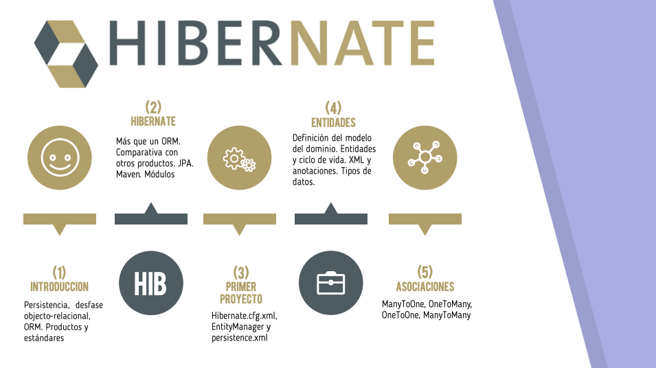

1) En el **primer capítulo** veremos una introducción a lo que es el concepto de ORM y los diferentes productos que podemos encontrar en el mercado.

2) En el **segundo capítulo** iremos conociendo Hibernate y también los diferentes módulos que ofrece, lo compararemos con el estándar JPA.

3) En el **tercer capítulo** realizaremos nuestro primer proyecto con Hibernate, nuestro primer proyecto con JPA y también marinaremos estás tecnologías con Spring Boot y Spring MVC.

4) En el **capítulo 4** vamos a saber cómo mapear nuestras entidades a tablas en la base de datos haciéndolo a través de anotaciones y a través de fichero de descriptores XML y también conoceremos el ciclo de vida de las entidades.

5) En el **capítulo 5** conoceremos cómo asociar unas entidades con otras y los diferentes tipos de asociaciones que existen.

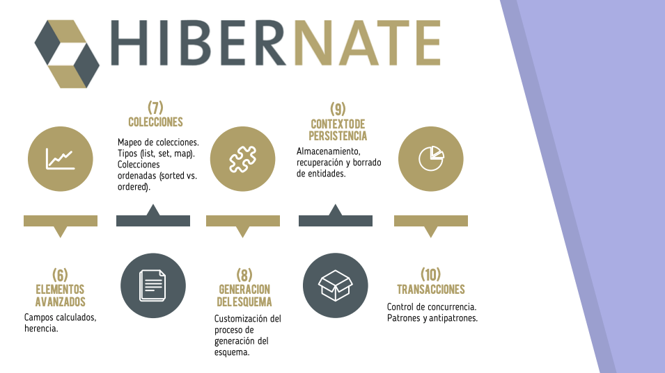

6) En el **capítulo 6** hablaremos de algunos elementos avanzados como la herencia o los campos calculados.

7) En el **capítulo 7** veremos como Hibernate nos permite mapear colecciones de diferentes tipos y estas colecciones pueden ser de valores simples de valores algo más complejo y también puede ser ordenada de diferentes maneras.

8) En el **capítulo 8** veremos cómo Hibernate genera el esquema de nuestra base de datos y así lo deseamos o cómo podemos hacer el proceso inverso para un esquema dado de generación de la entidad.

9) En el **capítulo 9** hablaremos un poco sobre qué es eso de la unidad de persistencia, el contexto de persistencia y cómo se pueden almacenar, recuperar y borrar datos.

10) En el **capítulo 10** hablaremos de transacciones y control de concurrencia y veremos algunos patrones y antipatrones.

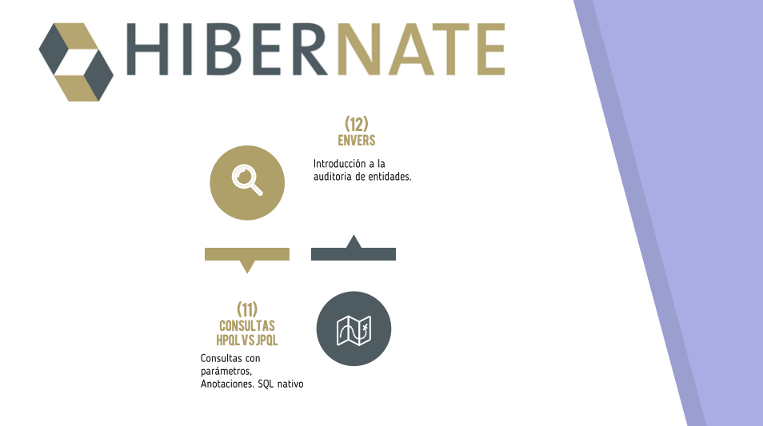

11) En el **capítulo 11** veremos cómo podemos realizar consultas en lenguaje nativo de Hibernate y sobretodo utilizaremos el de JPA.

12) Y por último en el **capítulo 12** hablaremos de ***Hibernate Envers*** y cómo realizar la auditoría de entidades y un control de revisiones.

# 02 Introducción 18:52 

[Introducción](pdfs/01_Introducción.pdf)

## Resumen Profesor

### 1.1 Necesidad de almacenamiento de información

Desde que *el mundo es mundo* el ser humano ha tenido necesidad de almacenar información. Con la invención de la escritura, no se estaba haciendo más que conseguir que la palabra escrita pudiera reflejar hechos, ideas, sentimientos… más allá de la mera experiencia oral. La imprenta de caracteres móviles supuso una expansión del conocimiento como nunca antes de había conseguido, y todo gracias a que la información se podía replicar de una manera más rápida y eficiente.

Ya en el siglo XX, con la invención de las computadoras, aparecen diferentes dispositivos de almacenamiento, como son las tarjetas o cintas perforadas, cintas de casete, discos magnéticos, ópticos, sólidos… En menos de 50 años, hemos pasado de una capacidad de almacenamiento de 4MB en un disco que pesaba cientos de kilos, a tarjetas de memoria de pocos gramos con una capacidad de cientos de GB.

#### 1.1.1 Organización de la información

Más allá de la forma *física* de almacenar la información, existe otra perspectiva, que es la forma *lógica* de organizarla, es decir, como utilizamos los dispositivos de almacenamiento para guardar todos los datos que deseemos.

Los primeros sistemas informáticos organizaban los datos en registros. Un registro no es más que un conjunto de datos *coherentes* entre ellos. Por ejemplo, nuestra declaración de la renta (IRPF) es un extenso conjunto de datos, la mayoría de ellos numéricos, que hacen referencia, normalmente, a una sola persona; o también, la información meteorológica para un lugar, por ejemplo Sevilla, en una fecha exacta, por ejemplo el día de hoy, también sería un conjunto de datos coherentes, es decir, un registro.

Con el tiempo, surge la necesidad de separar los programas de aplicación y el almacenamiento de los datos, y con ello, las **bases de datos**.

### 1.2 Bases de datos

Desde los años 50-60 surgieron diferentes modelos de datos, como el jerárquico o el modelo en red, que implicaban que los programas estuvieran muy acoplados a los datos. Para solventar este problema, surge el **modelo relacional**.

#### 1.2.1 Modelo relacional

Fue propuesto por Edgar Codd, y está sustentado en la teoría de conjuntos y la lógica de predicados.

La estructura fundamental de este modelo es la *relación*, aunque usaremos su sinónimo, llamado **tabla**. Se trata de una estructura formada por columnas y filas, que contiene información sobre una misma clase o entidad. Además, esta estructura es independiente de la forma en que se almacenan los datos (es decir, el esquema físico y el lógico son diferentes). Este modelo perseguía diferentes objetivos además de esta independencia, como es la uniformidad, la flexibilidad, y la sencillez.

Con el tiempo, este modelo es el que más se ha extendido, siendo un estandar de *facto* durante muchos años, incluso en la actualidad, si bien han surgido una nueva ola de modelos, llamados NoSQL (Not Only SQL).

### 1.3 Desfase objeto-relacional

En la actualidad, el modelo de programación más extendido es la Orientación a Objetos, mediante la cual todos los componentes que manejamos en una aplicación son objetos. Si pudiéramos representar gráficamente un objeto y una tabla, caeríamos en la cuenta de que no tienen el mismo número de dimensiones: las tablas son *bidimensionales*, frente a los objetos que son *tridimensionales*. Esto nos sugiere que sería ideal tener una base de datos que nos permitiera almacenar objetos. Sin embargo, los productos más extendidos en el mercado, a día de hoy, siguen siendo los SGBD relacionales.

¿Cómo solventar este problema? En principio, un programador tenía que escribir toneladas de código fuente para poder almacenar o recuperar información. Además, ese código suele repetirse en un alto porcentaje, ya que las sentencias de conexión, recuperación o cierre suelen ser muy parecidas.

A continuación, mostraremos un ejemplo de un código Java que, haciendo uso de JDBC, consultaría una base de datos relacional.

```java
public List<Alumno> findAll() throws ClassNotFoundException, SQLException {
        String sql = "SELECT ID_ALUMNO, NOMBRE, APELLIDOS,"
                + " TO_CHAR(FECHA_NACIMIENTO,'DD/MM/YYYY') AS FEC_NAC, "
                + " CORREO_ELECTRONICO, HORAS_FALTAS "
                + " FROM ALUM";

        List<Alumno> result = null;

    //Este método nos devolvería un objeto PreparedStatement
    //listo para ejecutar la sentencia de más arriba
        PreparedStatement ps = DBConnection.getPreparedStatement(sql);

        ResultSet rs = ps.executeQuery();

        while(rs.next()) {
            if (result == null)
                result = new ArrayList<Alumno>();

            result.add(new Alumno(rs.getInt("ID_ALUMNO"),
                    rs.getString("NOMBRE"),
                    rs.getString("APELLIDOS"),
                    rs.getString("FEC_NAC"),
                    rs.getString("CORREO_ELECTRONICO"),
                    rs.getInt("HORAS_FALTAS")));
        }

        rs.close();
        ps.close();

        return result;
    }
```    

Para tratar de aligerar la tarea de los programadores, surgen la técnica del mapeo objeto-relacional.

### 1.4 *Object Relational Mapping* (ORM)

Se conoce comunmente como ORM a un componente software, ubicado entre una aplicación y un SGBDR, que se encargará de salvar el desfase objeto-relacional, ayudándonos a transformar los objetos de nuestra aplicación en filas de tablas de nuestra base de datos relacional.

Un mapeador objeto-relacional nos permite abstraernos del proceso de transformación entre objetos y tablas, y viceversa, acelerando así el desarrollo, pues nos permite centrarnos en programar la lógica de negocio de nuestra aplicación. También permite aumentar la seguridad y fiabilidad.

Una de las grandes desventajas achacadas a los ORMs es que pueden *ralentizar* mucho el acceso a bases de datos. Sin embargo, muchos ORMs nos permiten el uso de cachés, que aceleran el proceso de consulta.

#### 1.4.1 Productos existentes en el mercado

Algunos de los ORMs más conocidos para Java son:

* Hibernate

* EclipseLink

* JDO

* MyBatis

Para otros lenguajes de programación, también podemos encontrar algunos ORMs:

* PHP

   * Propel

   * Doctrine

* C#
 
   * NHibernate

   * ADO.NET Entity Framework
   
* Python

   * Django ORM

   * SQL Alchemy
   
   * Pony
   
## Transcripción  


En este primer capítulo del curso de Hibernate 5 hablaremos sobre la necesidad de almacenamiento de información, sobre cómo organizar la información, hablaremos también de base de datos, de lo que se conoce como el desfase objeto-relacional y por último hablaremos de los ORM que podemos encontrar en el mercado algunos de ellos para Java y para otros lenguajes de programación.

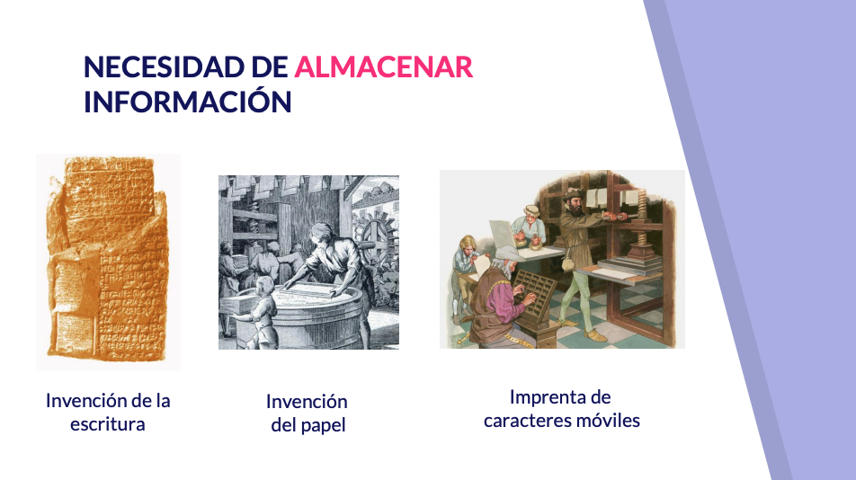

Desde que el mundo es mundo el ser humano ha tenido necesidad de almacenar conocimiento, de almacenar información para que esté perdurará en el tiempo. Tras miles de años de transmisión oral surge la escritura, en principio en determinados soportes que eran un poco complicado, hasta la invención del papel que hace que se pueda almacenar mucho más cantidad de información con un menor peso, con un material que quedaba algo más de garantías, con el devenir también del tiempo surge una gran herramienta de almacenamiento y difusión de la información que fue la imprenta de caracteres móviles.

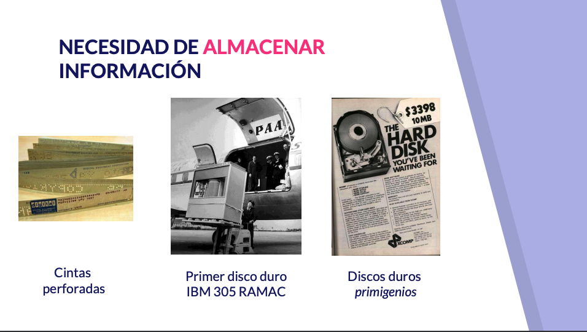

Y a partir de ahí pues van surgiendo otros sistemas hasta que llegamos a ciertos sistemas mecánico, eléctrico, electrónico cómo son las cintas perforadas o el inicio de la computación, lo que conocemos como los discos duros, podemos ver en la imagen el primer disco duro, uno de los primeros discos duros que fabricó IBM en torno a los años 50, el IBM 305 y que tenía la friolera de 4MB y pesaba varias toneladas o los primeros discos duros primygeni de finales de los 70s y que valian cerca de 4000 dolares de la época y no llegaban a los 10 megas.

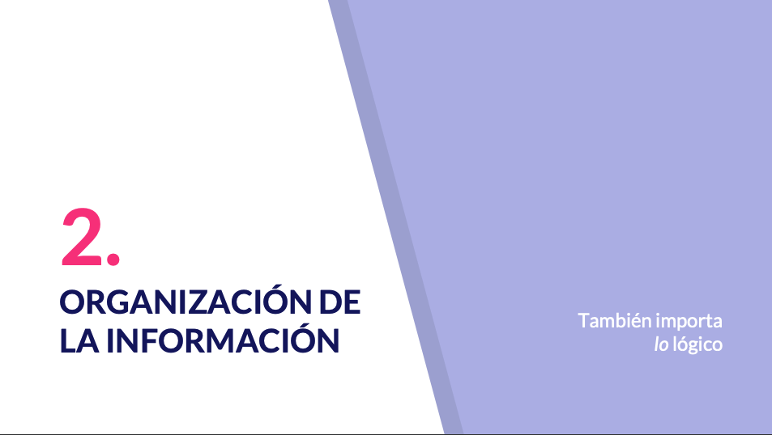

A día de hoy como sabéis ya cambiado y tenemos tarjetas micro SD de 128GB y bueno con el aumento del espacio surge la necesidad de que la información almacenada esté organizado de determinada manera.

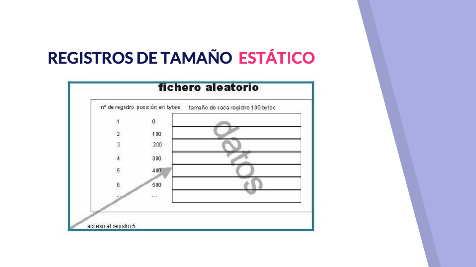

Hablando ya en particular de sistemas de información y haciendo también un repaso desde el inicio hasta ahora, los primeros sistemas de información organizaban a nivel físico la información, en registros de tamaño estático, dentro del fichero aleatorio, los ficheros aleatorios son aquellos a los que se puede acceder a cualquier parte, el hecho de que los registros tuvieran un tamaño fijo, hacía que su localización fuera fácilmente accesibles, sin embargo, nos producían algunos inconvenientes el primero de ellos es que si un determinado dato fuera más grande de lo que habíamos programado en un principio no podría caber y si borraramos algún registro que estuvíera en alguna posición intermedía podríamos experimentar lo que se conoce como la fragmentación interna y bien dejamos el hueco y lo rellenavamos después con otros datos o bien necesitabamos algún tipo de proceso para reorganizar la información.

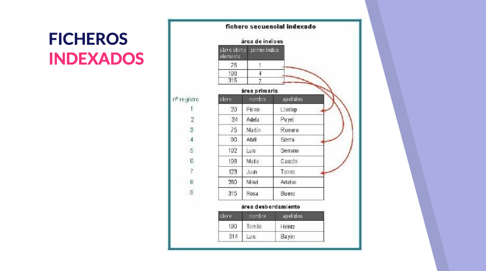

Para tratar de evitar esto surgen algunos tipos de ficheros distintos, organizados con registro de tamaño dinámico o también los indexados qué se dedicaban a intentar organizar el fichero con una primera parte de índice que nos permitía después buscar fácilmente los registros que teníamos sin embargo, la gestión del índice era compleja, porque si se utilizaba algún tipo de función de hashing, esta podía provocar rara vez pero con un volumen de información grande un desbordamiento, por lo cual deberíamos tener en cuenta que al final del fichero deberíamos tener esa parte para los registros que estuvieran desbordados y además la propia gestión del índice era una operación bastante compleja, además en esta época los índices solían utilizarse para manejar la dirección física de los datos en el disco duro con lo cual un cambio de disco duro o un cambio de la controladora del disco duro podría provocar que tuviéramos que reiniciar por completo el fichero.

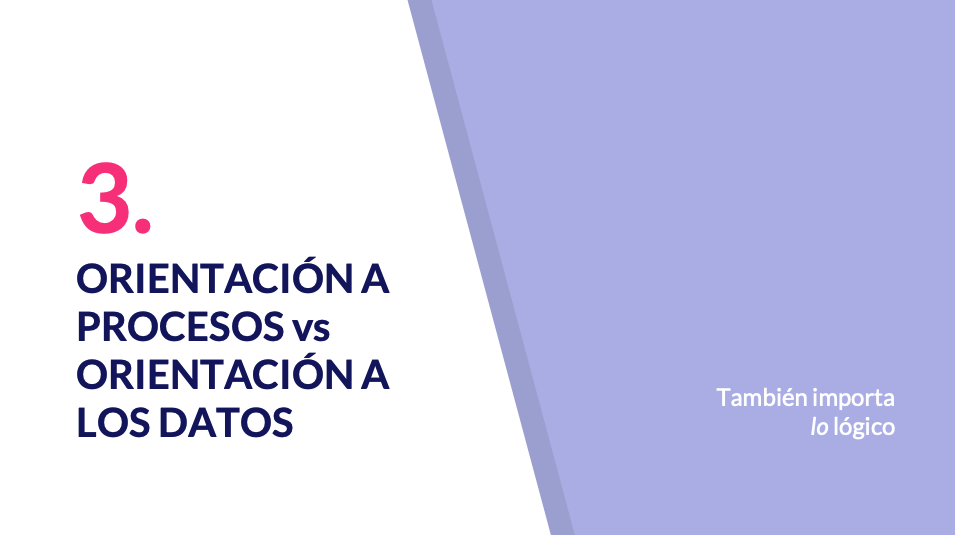

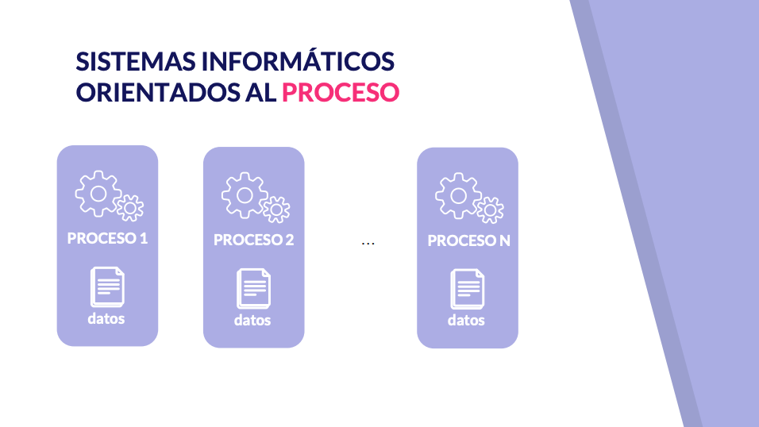

Al plantear los sistemas de información, podemos pensarlo de dos maneras diferentes, orientado a los procesos que es como se estuvo programando en los años 50, 60, 70 y también en gran parte de los 80 y orientado a los datos. 

En los sistemas de información orientado al proceso si bien dentro de una organización, tenemos que manejar varios procesos diferentes, lo normal en aquella epoca era hacer pequeñas aplicaciones de gestión que se dedicarán a gestionar cada una de las partes. Por ejemplo si pensamos en un colegio podemos pensar en  una aplicación que gestionara la falta de asistencia o retrasos de los alumnos, en otra aplicación que gestionara la matriculación, en una tercera que gestionara las notas y los datos bajo este esquema pertenecían a la aplicación. Esto tenía ciertas ventajas de que si existía un acoplamiento perfecto, pero esto a la vez suponia un inconveniente por que el acoplamiento entre los datos y la información producía, que si una determinada información tenía que ser compartida por otro proceso, el impacto del cambio de la aplicación sobre esos datos podía suponer también cambios en el resto de proceso qué ya digo eran aplicaciones totalmente distinto. Además en caso de que la información la quisiéramos almacenar en ficheros separados requería de información redundante por ejemplo, si queremos tener la lista de los alumnos que se han matriculado lo tendremos en la aplicación de matrículas, pero esa misma lista de alumnos nos hace falta también en la aplicación de pasar lista, en la aplicación de las notas, tener esa información redundante, no obligaba a tener mecanismos de sincronización que hacía bastante tedioso el acceso a la información, así como también la seguridad, el manejo de la seguridad de la aplicación tenían que ser algo inerente a la aplicación y los programadores tenian que ser los que lo desarrollaran.

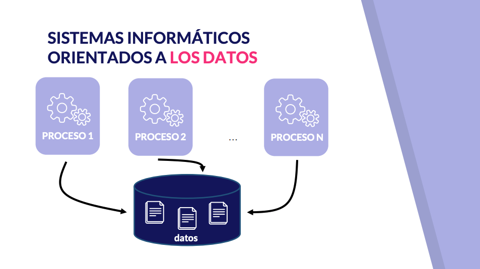

En los sistemas informáticos orientados a los datos, conseguimos desgajar ese gráfico que teníamos antes y sacar los datos de los procesos, de manera que los datos tienen por así decirlo entidad en sí mismo, estan almacenados en un sitio común y los diferentes procesos hoy pueden ser tres, mañana pueden ser 4 aplicaciones o 5, accederían a ese almacén común de datos, este esquema se ha usado a través de base de datos es el que desde los años 80s en adelante sobre todo ha triunfado, ha perdurado y es el que nosotros vamos a ir conociendo poco a poco.


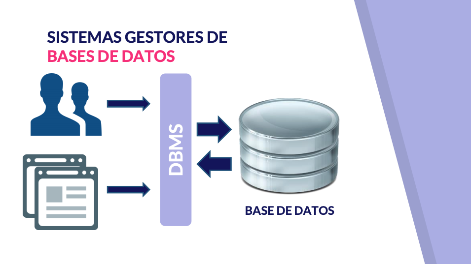

Para manejar esos ficheros de datos surgen los sistemas gestores de base de datos, un sistema gestor de base de datos no es más que una colección de programas específico qué sirve para manejar una o varias bases de datos diferentes. Esta bien que manejemos estos dos conceptos como elementos distintos, base de datos como toda la información y posiblemente también la metainformación que se conoce como catálogos asociados a esa base de datos y esl Sistema Gestor de Base de Datos DBMS como una colección de aplicaciones que nos van a permitir crear, organizar, estructurar, acceder, consultar toda la información que tenemos en la base de datos, en una o varias bases de datos.


Además los sistemas gestores de bases de datos normalmente permiten que determinados usuarios llamados expertos, los administradores de base de datos, pueden acceder a ella o también suelen permitir que otras aplicaciones de gestión que puedan estar desarrolladas en multitud de tecnologías puedan acceder a los datos de la base de datos a través del puente que ofrecen estos sistemas.


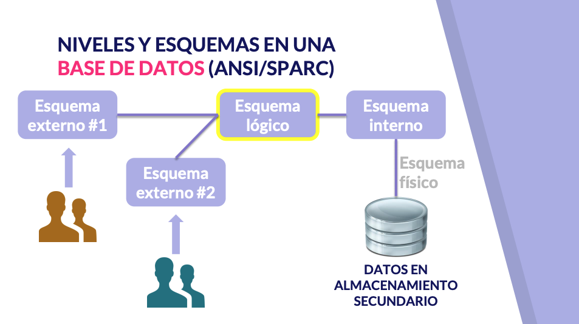

Según el tipo de esquema, podemos diferenciar entre distintos sistemas gestores de base de datos, según la norma ANSI/SPARC podemos encontrar que una misma base de datos la podemos ver dependiendo de quien seamos o en que punto nos encontremos de varias maneras distintas en principio de 3 o 4 maneras distintas, no es lo mismo que veamos los ficheros que estan  almacenados físicamente en un disco duro asociado a una base de datos, que queramos ver su esquema interno, lo que se conoce como el esquema lógico o esquema externo, es decir esos mismos datos, esa misma estructura, se nos representará de una manera diferente, el nivel lógico que es el que tenemos resaltado en la transferencia, pues es aquel que va a marcar un poco el tipo de sistema gestor de base de datos con el que vamos a trabajar, existen diferentes modelos algunos ya arcaico, otros que aunque ya tienen un tiempo pues siguen estando presente y algunos que han surgido en los últimos años.

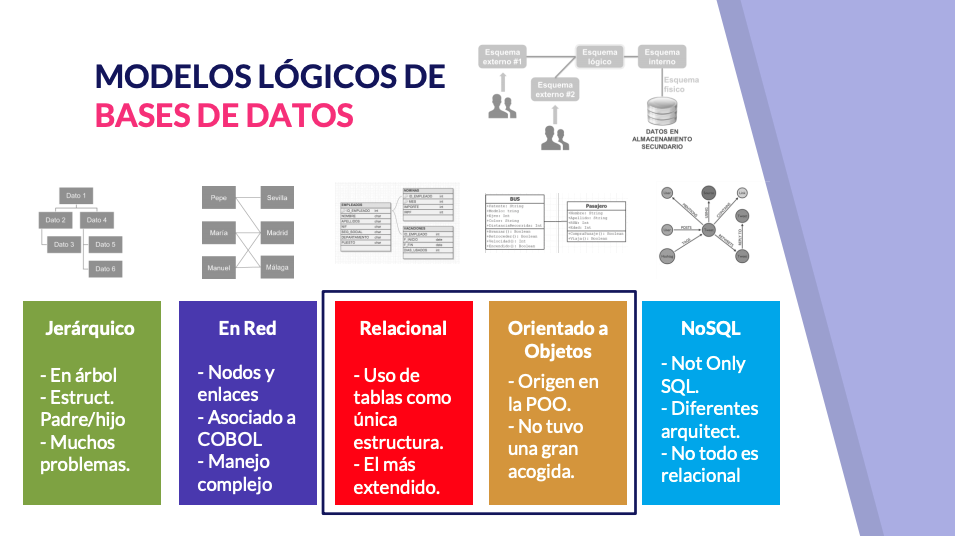

En particular el primer modelo que podríamos decir que estaba dentro de un sistema gestor de base de datos, el primer esquema lógico sería el *Jerárquico* los datos se organizaban en una estructura de árbol, en la que teníamos distintos nodos en la que ibamos teniendo hijos y asu vez más hijos. Esta estructura padre e hijo permitio una primera jerarquizacion de la información, pero también nos dio muchos problemas, porque la asociación entre información no se podían manejar. 

Para solventar esos problemas surge el *Modelo en Red*, pasamos de tener un árbol a tener un grafo que tiene nodos y enlaces, donde los nodos puede estar enlazado a uno o más nodos, no como el Jerarquico que se asociaba solo con el padre. Esta muy asociado al lenguaje de programación Cobol que hasta el día de hoy sigue estando vigente, si bien el manejo de los datos mediante un modelo de Red es bastante complejo.

En los años 70s en particular en el año 70 surge el *Modelo Relacional* en el que en el esquema lógico solamente vamos a tener una sola estructura de datos que se conoce como *relación o tabla*. Desde aquel modelo primogenio que define Edgar Coff en un documento y que la empresa Oracle, Larry Ellison implementa en su sistema gestor, han surgido múltiples productos que implementan este esquema lógico y a día de hoy sin ser el más moderno, sigue siendo el que más extendido está y hay muchísimo software que está desarrollado bajo el modelo relacional.

El *Modelo Orientado a Objetos* surge ligado a la programación orientada a objetos que coge fuerza a partir de los años 80, a nivel de programación tuvo una gran acogida y es el modelo que sigue imperando a día de hoy, a nivel de base de datos no tuvo una gran acogida, quiza por que ya existia mucho software desarrollado con el modelo relacional o los programadores se sentian comodos no tuvo una gran acogida y la verdad es que aun que los SGBD siguen dando algunas cabidas para llevar los objetos a la base de datos no ha tenido una gran aceptación.

Y por último el *Modelo NoSQL* que agrupa una amalgama de arquitecturas diferentes en el esquema lógico en la que maneja elementos que mo es que no sean relacional sino que no todo en este mundo es relacional, trabajan en base a esquemas distintos por ejemplo, documentos y algunos de ellos están implementados con tecnologias como JSON.

Nosotros trabajaremos a caballo entre el *Modelo Relacional* y el *Modelo Orientado a Objetos* aquí es donde los ORMs cobran sentido, como saltar desde un mundo orientado a objetos, que es el que nosotros manejamos con un lenguajes de programación como Java a una base de datos plana, bidimensional, cómo son las base de datos relacionales en la que todo son tablas.

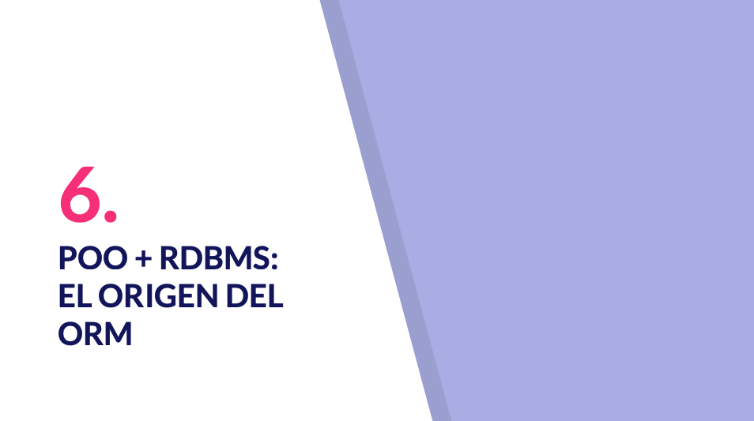

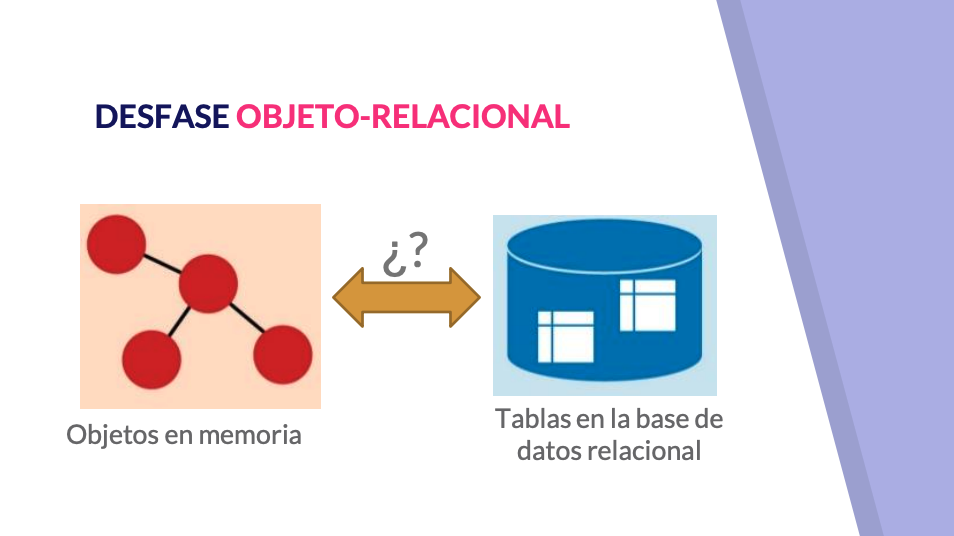

Este desfase provoca que nosotros estamos habituados a programar objetos, clases y sin embargo cuando queremos utilizar la información que está almacenada en una base de datos relacional nos encontramos con qué esa información está organizada de una manera distinta, la estructura es bastante diferente.

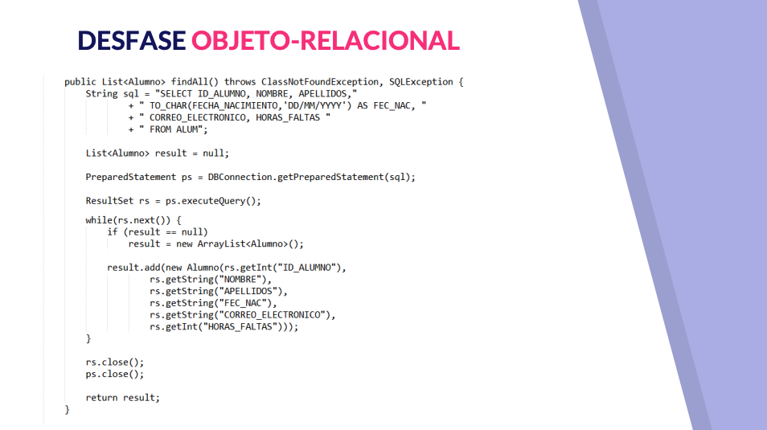

Cómo podemos salvar este desface, muchísimo programadores han tenido que dedicar horas y horas y horas a realizar trozo de código como el que aquí os presento, que utiliza JDBC, que es el API de más bajo nivel que Java ofrece para conectar a una base de datos relacional y en la que como veis, tenemos que hacer varias tareas distintas, la primera es que tenemos que conocer muy bien la estructura y el esquema de la base de datos relacional que vamos a manejar y somos nosotros los programadores los que tenemos que definir las consultas en SQL, para poder traernos los datos. Además tenemos que manejar los elementos aquí está un poco resumido, los elementos asociados a la conexión de la base de datos, manejando múltiple objetos que JDBC no ofrece como son el objeto `connection` el objeto `statement`, `preparestatement`, en particular aquí estamos usando un `preparestatement` para lanzar la consulta, porque lo que hace es compilar el código SQL e intentar evitar algún tipo de problema, como la inyección de código SQL. Tras ejecutar el resultado recogemos todos los datos que nos hemos traído de la base de datos en un objeto especial llamado `resulset`, este objeto es como una representación de la tabla, de los datos que no hemos traído en una tabla, pero ya en el lado Java y un puntero que nos va ayudar a recorrerla sin embargo, aquí somos nosotros los que tenemos que ir construyendo objetos para cada una de las filas que nos hemos traído de la base de datos. Como podéis imaginar si queremos añadir un nuevo atributo a nuestro objeto alumno, tendremos que modificar la consulta SQL, modificar el procedimiento `findAll()` y además produce un montón de código que se parece muchísimo, porque para traernos diferentes objetos de una base de datos el código es muy parecido.

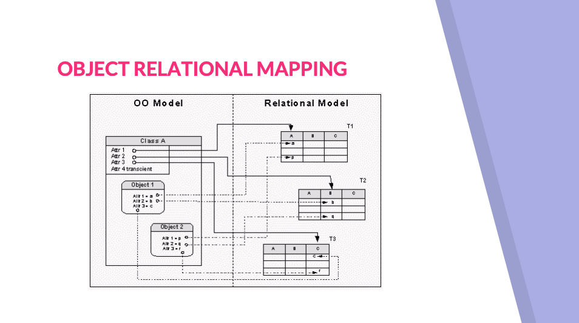

Aquí podemos ver cómo se hace ese mapeo objeto relacional, es decir las clases en el mundo orientado objetos serían algo así como las tablas que tendríamos en el modelo relacional y  las instancias concretas serían las distintas filas que nos podríamos encontrar, como podéis comprobar, programar acceso a base de datos sin más herramientas que JDBC puede parece una tarea bastante ardua, si bien también hay mucho software desarrollado y si queremos controlar hasta el último elemento es un efoque que tampoco es malo.


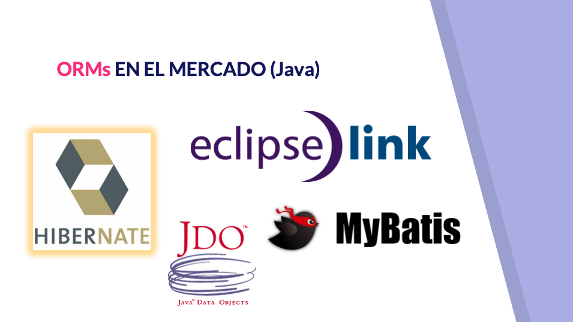

Los ORM que los explicaremos en el siguiente capítulo en profundidad van a ayudarnos a salvar ese desfase y nos van a facilitar muchísimo las tareas sobre todo la tarea de transformación de una fila de una base de datos en una instancia de un objeto concreto, así como las operaciones básicas de consulta, almacenamiento, actualización y borrado de información. 

Para Java tenemos varias tecnologías distintas, nosotros vamos a aprender en este curso la versión 5 de Hibernate sin embargo, tenemos otras como son EclipseLink, MyBatis y una larga serie de ORMs que podemos encontrar en el mercado. Nos decantamos por Hibernate porque es el más utilizado de todos.

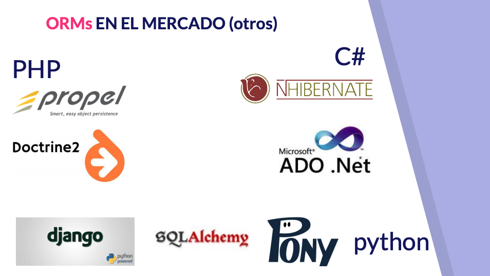

Y los ORMs no solamente existen para Java, también existen para la gran mayoría de lenguajes de programación, para PHP podemos encontrar algunos como Propel, Doctrine2 o incluso algunos framework de desarrollo incorporan su propio ORM.

Para .Net, C# podemos encontrar aparte de ADO.NET que es propio de Microsoft podemos encontrar que existe una implementación de Hibernate. 

Para otros lenguajes como Python, Django incorpora su propio ORM o tenemos otros conocidos como SQL Alchemy, Pony o alguno más.

En el próximo capítulo nos vamos a adentrar en el mundo de Hibernate vamos a conocerlo o a conocer los diferentes módulos que ofrece.

# 03 Hibernate, más que un ORM 22:43 

[Hibernate, más que un ORM](pdfs/02_Hibernate.pdf)

## Resumen Profesor

### 2.1 Hibernate como ORM

Ya hemos hablado en el capítulo anterior de lo que era un mapeador objeto-relacional y como nos podía ahorrar muchas líneas de código muy repetitivo. Sin embargo, los beneficios de uso de Hibernate no se quedan solamente ahí:

**Ventaja**	| **Descripción**
--------|------------
**Productividad** |	Nos permite centrarnos en el desarrollo de la lógica de negocio, ahorrándonos una gran cantidad de código (más del que cabría esperar).
**Mantenibilidad** | El ORM de Hibernate, al reducir el número de líneas de código que tenemos que escribir, nos permite realizar refactorizaciones de forma más fácil.
**Rendimiento** |	Aunque la persistencia manual podría permitir un rendimiento mayor, Hibernate aporta muchas optimizaciones, como el almacenamiento en caché.
**Independencia** |	Hibernate nos permite aislarnos del RDBMS concreto que estemos usando. Aunque no tengamos pensado cambiar de gestor, nos puede permitir usar un RDBMS ligero (como H2) para la fase de desarrollo, usando otro en producción.

### 2.2 Hibernate, no solo un ORM
Hibernate no solamente es un ORM. Se trata de un proyecto formado por varios módulos, que nos ofrecen grandes funcionalidades.

#### Hibernate ORM

Este módulo ya ha sido, de alguna forma, presentado. Contiene una serie de servicios para la persistencia de objetos en bases de datos relacionales. Funciona en casi cualquier proyecto Java (Java EE, Java Swing, con Servlets, Spring, …).

#### Hibernate EntityManager

Más adelante hablaremos de JPA, pero podemos decir aquí que este módulo es el que nos permite utilizar Hibernate como implementación del estándar JPA. Las características nativas de Hibernate son un superconjunto de las que ofrece JPA en todos los sentidos.

#### Hibernate Validator

Hibernate proporciona una implementación del estándar JSR 303 Bean Validation. Se puede usar independientemente de otros proyectos de Hibernate, y proporciona una validación declarativa para nuestras *clases modelo*.

#### Hibernate Envers

Dedicaremos el último capítulo de este curso a este módulo, que nos permite auditar los cambios en nuestra persistencia, manteniendo múltiples versiones de los datos en nuestra base de datos SQL. Esto nos permitirá implementar facilmente históricos (funciona de forma similar a los sistemas de control de versiones, como Git).

#### Hibernate Search

Este módulo mantiene un índice de todas los datos de nuestro dominio dentro de una base de datos de `Apache Lucene`. En conjunción con Hibernate ORM, podremos realizar búsquedas de texto completo.

#### Hibernate OGM

Se trata del *mapeador objeto-grid*, y está orientado hacia bases de datos NoSQL. Proporciona soporte JPA para este tipo de soluciones, reusando el núcleo de Hibernate pero almacenando las entidades en pares clave-valor, documentos u otro tipo de almacenes de datos no relacionales.

### 2.3 Hibernate frente a otros ORMs del mercado

¿Hibernate? ¿MyBatis? ¿JDBC? ¿Qué tecnología deberíamos escoger?
Esa es una pregunta que no tiene una sola respuesta, ya que dependerá del proyecto concreto que estemos desarrollando. Espero que estas pistas os sirvan.

#### 2.3.1 Hibernate vs JDBC

JDBC no es un ORM, pero es la tecnología de base que nos ofrece Java para poder tener conectividad con bases de datos relacionales.

Tecnología | Ventajas |	Desventajas
-----------|----------|------------
JDBC | Ofrece un rendimiento superior. Además, nos permite utilizar al máximo las funcionalidades concretas de nuestro servidor de base de datos | El desarrollo y mantenimiento de nuestras aplicaciones es mucho más costoso. Además, es muy fácil introducir errores durante el desarrollo.
Hibernate	| Podemos desarrrollar más rápidamente, y haciendo uso de entidades (objetos) en lugar de consultas. Es una gran ayuda en la fase de mantenimiento, y nos permite eliminar al 100% los errores de ejecución debido al acceso a bases de datos | Tiene una curva de aprendizaje mayor, y normalmente no conseguirá el mismo rendimiento que el acceso a base de datos de forma nativa.

#### 2.3.2 Hibernate vs MyBatis

Haciendo honor a la verdad, MyBatis (antes conocido como iBatis) no es un ORM, ya que no genera código SQL. Se trata más bien de un mapeador SQL, que nos permite asociar a un objeto a una tabla de nuestra base de datos mediante un descriptor en formato XML o usando anotaciones.

Algunas características comparadas podrían ser las siguientes.

MyBatis	| Hibernate
--------|----------
Es muy simple. El empaquetado ocupa poco espacio | Genera el SQL por nosotros, lo cual significa que no tenemos que invertir nuestro tiempo en hacerlo.
Es flexible, ofrece un tiempo de desarrollo muy rápido | Es altamente escalable, y ofrece una caché más avanzada.
Utiliza SQL, que si bien es un estándar, puede tener elementos concretos de un RDBMS | Utiliza HQL, que es más independiente del RDBMS utilizado. Es fácil cambiar de base de datos con Hibernate.
Mapea un ResultSet del API JDBC en nuestros objetos POJO, de forma que no debemos preocuparnos por las tablas relacionales. | Hibernate mapea nuestros objetos POJO en tablas de una base d edatos.
Es fácil usar procedimientos almacenados | Es algo dificultoso usar procedimiento almacenados.

### 2.4 Hibernate y JPA

Muchas personas que se han introducido en el mundo de la persistencia se preguntan: ¿no son Hibernate y JPA lo mismo? Realmente, la diferencia es mucha, ya que JPA es una especificación (inicialmente JSR 220; en la versión actual, la 2.1, el JSR 338) que carece de implementación. Hibernate, por contra, es un producto muy real, un framework con una serie de funcionalidades muy concretas.

Entonces, ¿qué relación tienen? Hibernate, a través de uno de sus módulos, proporciona una implementación la especificación JPA, de forma que podemos usar JPA como *interfaz*, sabiendo que por debajo, las operaciones con la base de datos se estarán realizando con Hibernate. De alguna manera, Hibernate es de facto la implementación de referencia de JPA.

La especificación JPA define lo siguiente:

* Una *facilidad* para especificar como nuestros objetos Java se relaciona con el esquema de una base de datos (a través de XML o de anotaciones).

* Una api sencillo para realizar las operaciones CRUD (*create, read, update, delete*), haciendo uso de un `javax.persistence.EntityManager`.

* Un lenguaje y un API para realizar consultas sobre los datos. El lenguaje, llamado JPQL (*Java Persistence Query Language*) se parece mucho a SQL.

* Como el motor de persistencia interacciona con las instancias transaccionales para buscar instancias *sucias*, captura de asociaciones u otras funciones de optimización.

Hibernate incluye, como parte de su código, toda la especificación JPA. Es decir, podemos usar Hibernate como *motor de persistencia* de JPA; sin embargo, incluye más funcionalidades que las que define la especificación.

A lo largo del curso las iremos descubriendo.

### 2.5 Hibernate con Maven

Si queremos trabajar con Hibernate, tenemos que incorporar a nuestro proyecto Java una serie de librerías, que se pueden descargar facilmente desde la web `http://hibernate.org/orm/downloads/`.
Sin embargo, el mantenimiento de estas librerías puede llevarnos al conocido como **infierno de los Jar**, ya que podemos tener algunos problemas:

* Incluir dos versiones diferentes de una misma biblioteca.

* Dos bibliotecas que están relacionadas entre sí, y de las que se incluyen versiones incompatibles.

* …

Por toda estas razones, entre otras, es razonable utilizar algún sistema que nos permita gestionar las dependencias de nuestro proyecto con librerías externas. En nuestro caso, usaremos Maven.

Utilizando Maven, nuestro proyecto tendrá un fichero, llamado `pom.xml` que, entre otros elementos, nos permitirá definir las librerías que necesitamos.

De esa forma, podremos añadir las dependencias de nuestras librerías. Estas pueden ser encontradas en la web del repositorio de Maven (https://mvnrepository.com/).

Alguna de las que usaremos durante el curso es la siguiente:

```xml
<dependency>
    <groupId>org.hibernate</groupId>
    <artifactId>hibernate-core</artifactId>
    <version>5.2.9.Final</version>
</dependency>
```

En cada uno de los proyectos de ejemplo indicaremos las librerías que necesitaremos.

## Transcripción

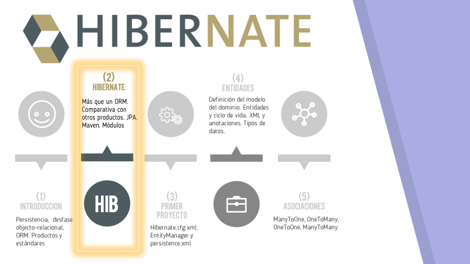

En este segundo capítulo del curso de Hibernate 5, vamos a conocer que es Hibernate, la tecnología más difundida en el mercado Java de ORM y vamos a aprender que es algo más que un ORM, porque existen diferentes módulos que van más allá del mapeo objeto-relacional, hablaremos también de JPA  hablaremos de Maven y nos iremos introduciendo poco a poco en esta tecnología.


Hibernate como ORM nos va a aportar una serie de características que son muy positivas, el primero es la productividad, como hemos podido comprobar en el capítulo anterior escribir código para acceder a una base de datos relacional desde un programa orientado a objeto en particular con **Java** y **JDBC** exige un gran rendimiento por parte del programador, sobre todo por que le va a dedicar mucho tiempo a determinadas tareas que no son primordiales como ese código de conexión a la base de datos, lanzar la consulta y sobre todo de procesar la fila que nos hemos traído en un objeto de nuestro modelo.

Hibernate va a aumentar la productividad ya que nos permitirá centrarnos en el desarrollo de lo que realmente es fundamental, lo que veremos más adelante que se llama ***lógica de negocio***, ahorrandonos una gran cantidad de código. 

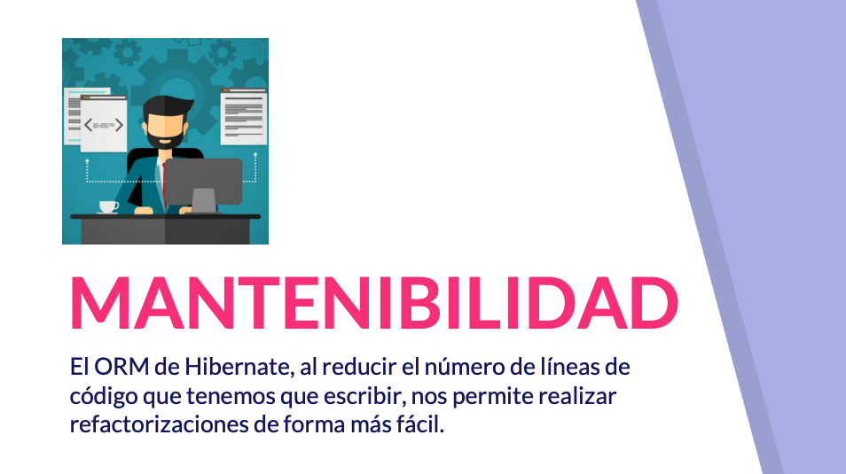

Hibernate también va a permitir aumentar, mejorar la ***mantenibilidad***, qué significa eso, bueno al reducir el número de línea que nosotros vamos a escribir directamente, pues vamos a minimizar el número de errores, eso por un lado y por otro, el número de línea que tenemos que revisar y que mantener, sus posibles mantenimientos correctivos y evolutivos que tengamos que hacer, siempre será menor con lo cual la mantenibilidad será más fácil y cualquier refactorización de código que tengamos que hacer será más sencilla.

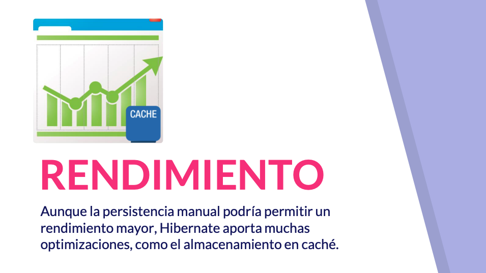

También aumenta el ***rendimiento*** porque si bien el aumentar añadiendo capas de abstracción puede hacer que se realentice un poco el acceso real a la base de datos, por otro lado Hibernate nos aporta una serie de optimizaciones que si programaramos directamente con JDBC o con otra tecnología de acceso a datos, nos costaría mucho trabajo tener como por ejemplo, el ***mecanismo de caché***, mediante este mecanismo si nosotros queremos rescatar un determinado objeto asociado a una fila de una tabla en JDBC seguramente al programarlo, al invocar para rescatarlo, al acceder a la base de datos y si lo necesitamos una segunda vez volveremos a acceder a la base de datos, para rescatar una fila que posiblemente todavía tengamos en memoria, sin embargo Hibernate va a ser capaz de mantener una capa de información cacheada, de manera que si necesitamos por segunda vez una determinada información que está en la base de datos, cuando vayamos a rescatarla está segunda vez, Hibernet nos ofrezca esa información cacheada y por tanto el acceso sea bastante más rápido.

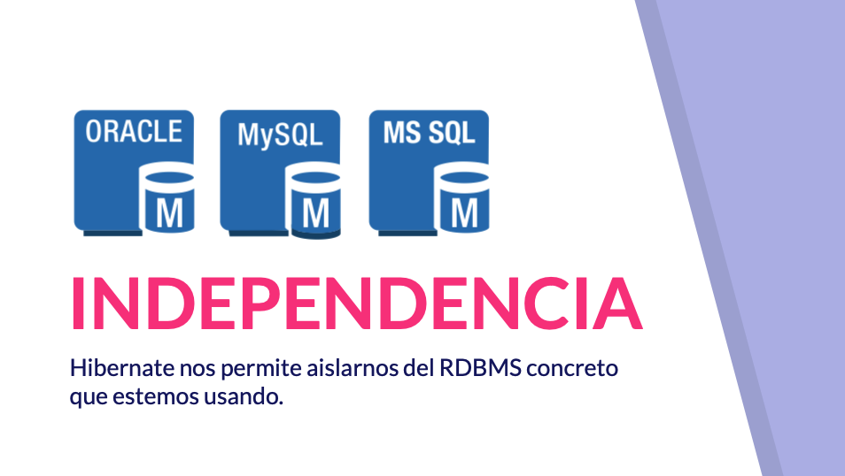

Otra característica muy interesante es la ***independencia***, cuando nosotros programamos cualquier aplicación Java que va a acceder a una base de datos relacional, tenemos que indicar el **Sistema Gestor de Base de Datos** concreto que vamos a utilizar, y eso va a ser casi como un matrimonio por que tenemos que vincularlo a nivel de la biblioteca que nos va a permitir acceder, lo que se conoce como el **conector** y posiblemente comencemos a usar determinados aspectos que son propias del sistema gestor de base de datos, **SQL** es un estandar que por cierto es bastante amplio sin embargo, determinados programadores gustan de utilizar elementos que son concretos de una solución particular, el hecho de hacerlo así nos posibilita el que el rendimiento posiblemente para determinados aspectos sea mayor pero si en algún momento de la vida del mantenimiento de este software decidimos cambiar el sistema gestor por que por ejemplo hicimos una previsión un poco más corta de números de usuarios que íbamos a tener y decidimos usar una solución gratuita o más pequeña y recibimos pasará a un sistema gestor de base de datos que sea más potentes mayor incluso de pago, esa migración obligaría, posiblemente a refactorizar mucho miles de líneas de código. El uso de Hibernate como ORM va a hacer que nos separemos por completo del sistema gestor que estamos utilizando y cambiar de un sistema gestor a otro puede llegar a ser tan sencillo como simplemente cambiar unas pocas líneas de código de un fichero de configuración.


Hibernate es algo más que un ORM, solamente el módulo de ORM ya lleva consigo un montón de clases, por debajo son bastantes fichero jars, pero vamos a comprobar como Hibernet y bueno la organización que está detrás de esta tecnología que es **JBOSS** y a su vez **Red Hat**, vamos a ver qué nos ofrece otra serie de módulos que son muy interesantes.

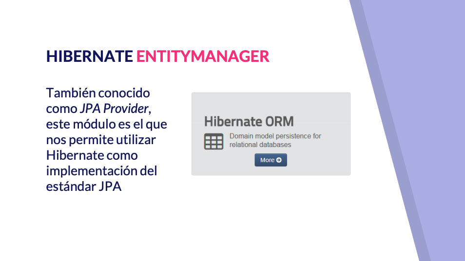

Uno de los módulos, aunque ya dentro de Hibernate 5 queda incluido dentro de los ORMs es el que se conoce como **JPA Provider** qué es la implementación del estándar JPA, de la especificación JPA, pero haciendo uso de la tecnología de Hibernate, este módulo que veremos y que utilizaremos a lo largo del curso nos permitirá utilizar Hibernate como **Vendor**, como implementación de ese estandar y veremos como simplemente añadiendo una dependencía **Maven** tendremos todas nuestras clases a utilizar necesaria, como la configuración va a ser bastante sencilla.

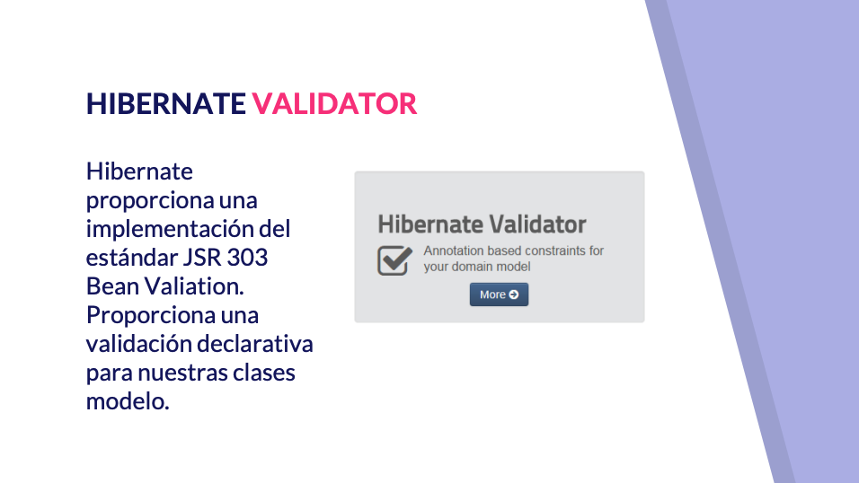

Otro módulo que ya ha quedado de una manera casi práctica integrada dentro del ORM aunque lo podemos utilizar por separado es el **Validator**. Se trata de un módulo que implementa el estándar ***JSR 303*** y que nos va a permitir validar beans de una manera muy sencilla, de hecho con unas solas pocas anotaciones podremos validar nuestro beans, nuestras entidades y todo eso se llegará a propagar a la base de datos sí así lo queremos. 

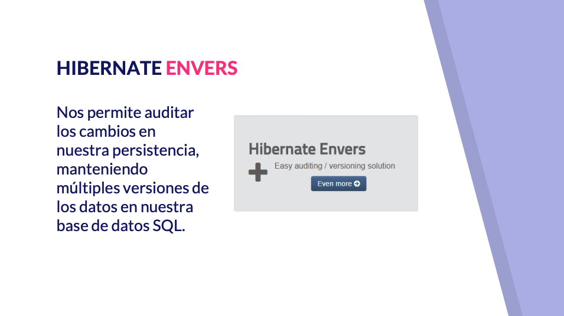

**Hibernate Envers** es una tecnología que Hibernate también incorpora dentro de su módulo Core en las últimas versiones también es una tecnología que ya tiene trayectoria y que nos va a permitir realizar una auditoria de los datos que vamos almacenando, lo podremos ver en el último capítulo como podemos ir almacenando diferentes versiones de los datos de nuestro modelo si es que así nos interesa, persistiendo no solamente la versión actual, sino los diferentes cambios que han ido sucediendo a nivel de nuevas insersiones de modificaciones de una o varias columnas o de eliminación de datos, es una tecnología bastante potente y que puede facilitar está auditoría de cambio de información que puede ser más sensible.

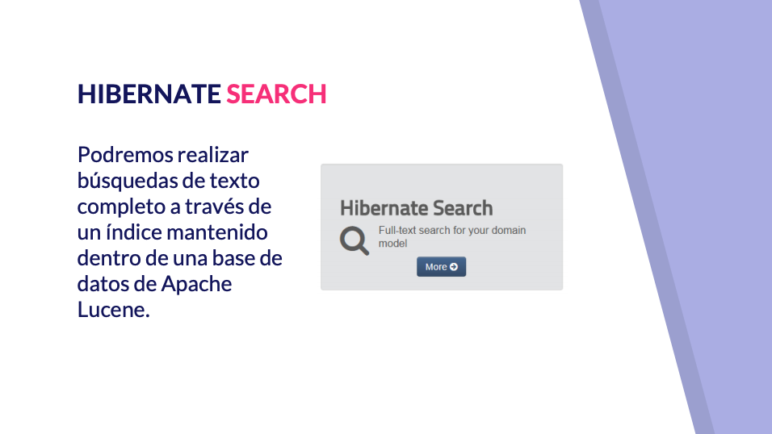

**Hibernate Search** es una implementación de un buscador **FULLTEXT** que nos va a permitir realizar búsquedas de texto completo a través de una base de datos de **Apache Lucene**, y nos permitiría poder realizar búsquedas más allá de las que permite la sentencia SQL o las comparaciones de igual o LIKE.


**Hibernate OGM**, para las bases de datos NoSQL, la base de datos que van más allá del modelo relacional, tenemos el mapeador objeto-grid que nos va a permitir realizar las mismos tareas que realizan el ORM pero con soporte hacia base de datos NoSQL, también incorpora soporte para usarlo con el estándar JPA.

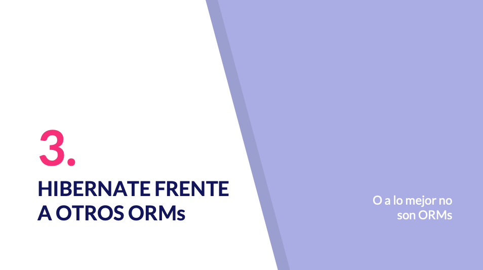

Ahora vamos a comparar Hibernate con otros ORMs o productos que son parecido a un ORM del mercado.

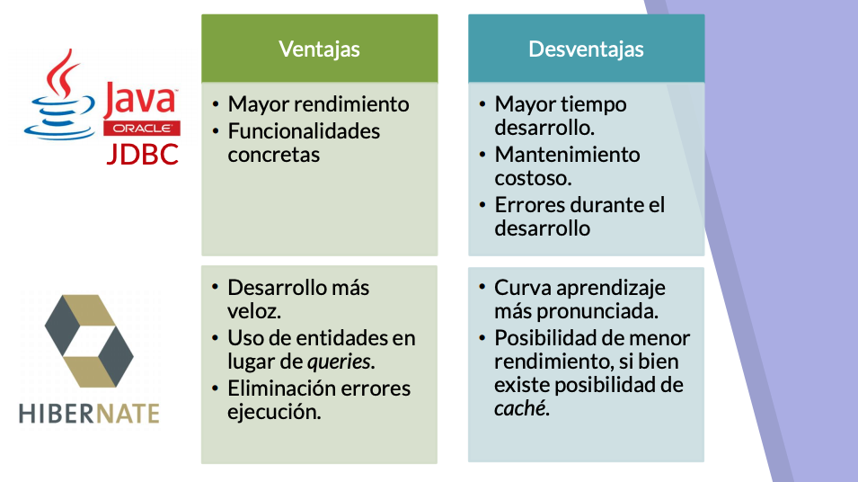

Si comenzamos con la especificación JDBC y como decíamos antes pues es la más básica de Java, la de más bajo nivel, para poder programar acceso a datos nos encontramos con que cada una tiene sus ventajas y sus detectar las ventajas que puede tener JDBC como es natural es un mayor rendimiento, al añadir menos capas de abstracción entre nuestra aplicación y el sistema gestor de base de datos concreto, en particular si ademas encontramos algún tipo de driver JDBC para nuestra base de datos que sea rápido el rendimiento de las consultas, la velocidad de acceso, puede ser bastante bastante mayor. Además JDBC como decíamos antes no puedes permitir utilizar funcionalidades concretas específicas del sistema gestor de base de datos que hemos escogido, sin embargo, ofrece unas desventajas que para mi gusto tienes bastante peso, el primero el mayor tiempo de desarrollo, la implementación de lo que se conocen como las **clases DAO** también conocidas como las **clases CRUD**, se lleva muchísimo tiempo, programar esa parte de los métodos con la parte de conexión a la base de datos, con rescatar, con conocer la sentencia SQL concreta transformar una fila en objeto de una tabla, manejar la asociación, es algo que se lleva muchísimo tiempo, por ende el mantenimiento de este software es mucho más costoso si desarrollamos una aplicación que tiene cientos o miles de líneas de código para acceder a la base de datos cualquier cambio que queramos realizar, cualquier evolución en nuestro software siempre requerirá de más esfuerzo.  Además el mayor número de líneas de código, va a provocar que los errores durante el desarrollo se incrementen. 

Con Hibernate las ventajas que tenemos frente a este desarrollo lento pesado con JDBC, tenemos un desarrollo más veloz, nos vamos a centrar en los aspectos concretos ya se Hibernate encargará del resto, nosotros nos centraremos en definir bien nuestro modelo de negocio, nuestro servicio y Hibernate hará el resto.

Usaremos entidad, es decir **objetos**, algo que en lo que llevamos tiempo programando con orientación objeto, conocemos y manejamos bien frente a tener que usar consultas, tablas, filas, etc. y además ***vamos a eliminar errores de ejecución***. Al iniciarse Hibernate va a ser capaz de comprobar todo ese código de mapeos, si lo hemos definido mediante descriptores XML o las ***anotaciones de mapeo*** y si existe algún error, nos lo dará antes de iniciar la ejecución de la aplicación, esto con JDBC no pasaba y los errores las más veces sucedían en un momento concreto al pulsar un botón, al insertar un valor, donde habíamos tenido algún problema en una sentencia SQL erronea.

**Desventajas**, no todo iba a ser ventaja el uso de Hibernate también va a suponer alguna que otra desventaja. El primero es que ***la curva de aprendizaje es más pronunciada que con JDBC***, en JDBC tenemos si no queremos meternos en mucha profundidad tenemos basicamente 3 interfaces implementadas por cada fabricante, por lo cual la curva es menos pronunciada. Y también ***es posible que tengamos que experimentar si no usamos bien Hibernate un menor rendimiento en nuestra aplicación***, añadir capaz de abstracción, el hecho de que se tengan muchos datos en memoría si no lo sabemos manejar bien va a provocar un menor rendimiento, hemos hablado antes que las caches pueden facilitarnos el hecho de que nuestra aplicación, no tenga que consultar de manera real la base de datos demasiadas ocaciones.

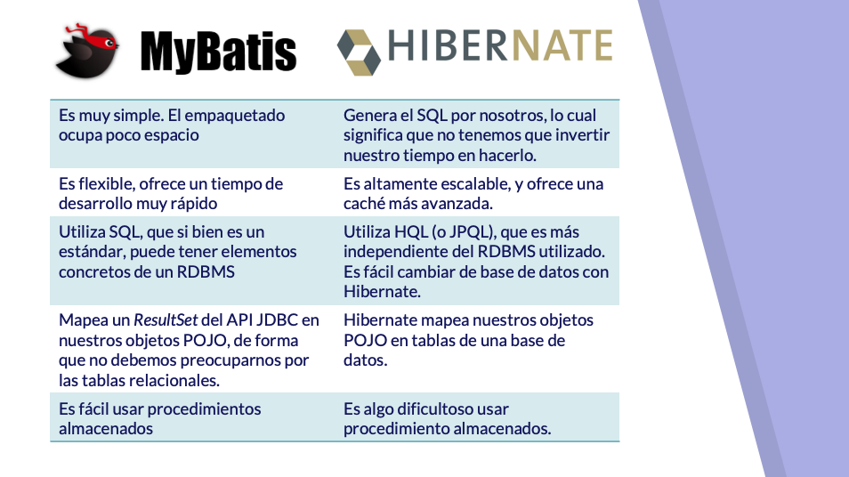

Otra solución que no quiere darse a conocer como un ORM en particular sino que es un transformador a través de consultas de objetos a tablas y filas de una base de datos es **MyBatis**. **MyBatis** conocida antes como **IBatis** es una solución que muchos programadores han optado por ella y también es bastante potente, sin embargo, Hibernate ofrece otra serie de caracteristicas que para mi gusto son más potentes.

Si bien **MyBatis** es muy simple el empaquetado ocupa muy poco sitio, las librerias de Hibernate pueden ser más pesadas pero nos permiten generar el SQL por nosotros, en el caso de **MyBatis** es necesario conocer SQL para poder lanzar las consultas y enlazar los datos. 

**MyBatis** es flexible y ofrece un tiempo de desarrollo muy rápido sin embargo, **Hibernate** además de eso es muy escalable, es decir que nuestro sistema puede ir creciendo con el tiempo, con las versiones e ir escalando poco a poco, manteniendo el nivel de rendimiento, sobre todo por que tiene una cache muy avanzada. 

**MyBatis** utiliza directamente **SQL** sin embargo **Hibernate** utiliza **HQL** o **JPQL** el lenguaje de consulta del estandar JPA que es mucho más independiente del sistema gestor de base de datos utilizado con lo cual es facíl cambiar de un sistema gestor a otro. 

**MyBatis** lo que hace es mapear un **`resultset`** que un objeto que recoge los datos de una consulta a la base de datos mediante JDBC y mapea ese **`resultset`** a un objeto de nuestro modelo sin embargo Hibernate realmente lo que hace es mapear los objetos de nuestro modelo a tablas o filas de nuestra base de datos. 

Y como ***ventaja*** de **MyBatis*** sobre **Hibernete** pues como **MyBatis** nos permite acceder directamente a ese mapeo con SQL es mucho más fácil utilizar Procedimientos Almacenados que esten en el sistema gestor frente a Hibernate donde es más complicado.


Veamos ahora las diferencias y semejanzas de **Hibernate** y **JPA** porque bueno, si investigamos por internet hay veces que la información puede llegar a ser confusa y no sabemos si son lo mismo, si son cosas diferentes o son complementarias etc. 

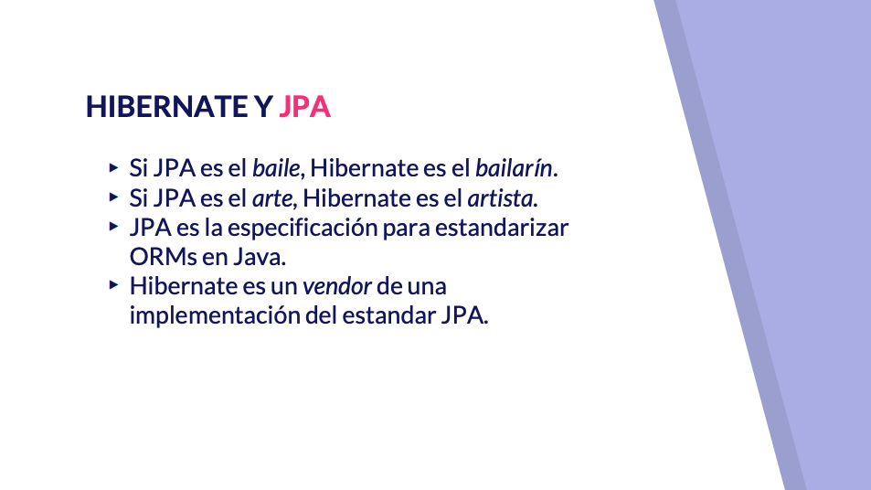

De una forma un poco poética podríamos decir que si **JPA** es el baile, **Hibernate** es el bailarín, o si **JPA** es el arte **Hibernate** es el artista.

**JPA** ***es un estándar***, es decir no es más que un documento, una especificación que surge para dar un poco de orden, a ese surgir de ORMs en Java que hubo bastante años y forma parte del estándar de Java, **Hibernate** ***en cambio es aparte de un ORM, un producto en sí mismo es también lo que se conoce como un Vendor, una implementación de ese estandar*** **JPA**.

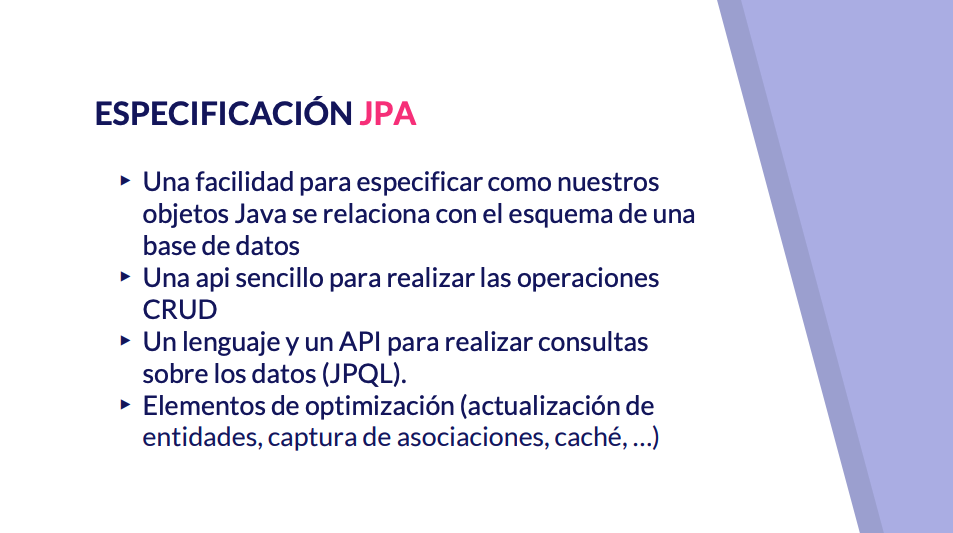

La especificación **JPA** nos da una serie de puntos que **Hibernate** cumple de lleno, como son ***una facilidad para especificar como nuestros objetos Java se transformaran a una base de datos relacional, como se construira ese esquema, también nos da un API muy sencillo para realizar las operaciones CRUD de acceso, inserción, modificación y borrado de datos***.

Nos da ***un enguaje de consulta y también un API programático para poder consultar la información programatica en esas entidades y nos da múltiples elementos de optimización***, todo eso viene definido en el estándar **JPA**.

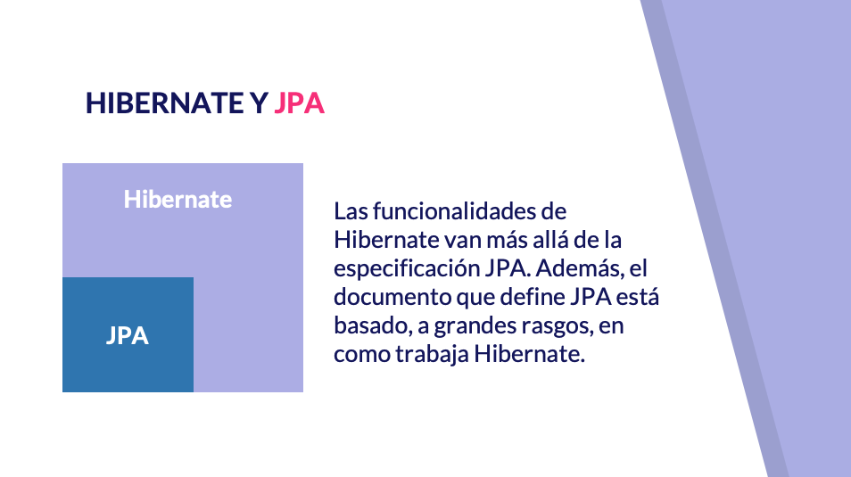

Bien pues **Hibernate** que implementa este estandar ***nos ofrece un conjunto de funcionalidades que van mucho más allá de la especificación***. De echo quiénes desarrollaron o escribieron esa especificación de JPA se basaron en **Hibernate** para que ese espiritu se pudiera mantener ya que de todas las soluciones ORMs era la que más se podía parecer a lo que buscaban como estandar.

Como podemos comprobar en este sencillo gráfico la especificación **JPA** que ya de por si es amplia queda enmarcada dentro de un conjunto mucho más amplio que será **Hibernate** que ofrece una serie de funcionalidades especificas que es mucho más grande.

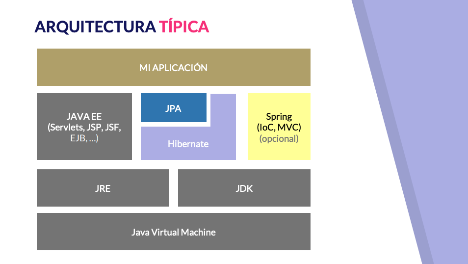

Una ***arquitectura típica*** en una aplicación sería aquella en la que sobre los elementos base de Java ya conocidos como la máquina virtual, el JDK tendríamos o bien por un lado un servidor de aplicaciones JEE en donde podríamos trabajar con tecnologías como los ***Servlets, JSP, JSF EJB***, etc. O bien por otro lado podríamos trabajar con tecnologías con ***Spring, Ioc, MVC***. Al hilo de estas dos posibilidades tendríamos la posibilidad de utilizar **Hibernate** directamente como ORM o tendríamos la posibilidad de utilizar el estandar **JPA** con la implementación de **Hibernate** para acceder a nuestros datos. 


Por último en este capítulo vamos a hablar un poco de **Hibernate** y **Maven**.

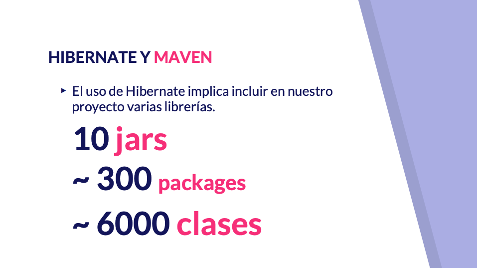

Si entraramos en la página de Hibernate y nos descargamos la totalidad del ORM, que es un fichero zip que nos podemos descargar, podríamos incorporar esos ficheros a nuestro proyecto, nos daremos cuenta que solamente para para incorporar el Core tenemos que manejar 10 jars distintos, además esos Jars si los miramos por dentro, vemos que tienen más de 300 paquetes, más de 6000 clases, con lo cual podríamos llegar a sufrir lo que se conoce como el infierno de los JARs, en el que al añadir uno podría pisarse sobre otro, podríamos encontrarse con que dos definen una misma librería, podría hacer algo terrible.

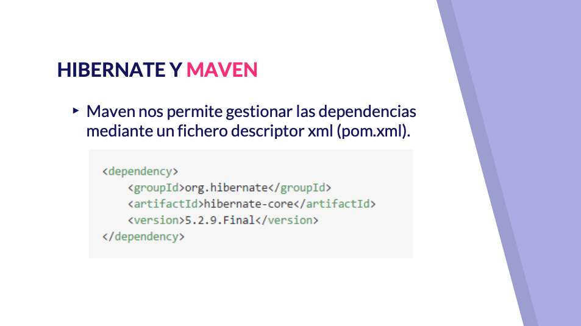

Invitamos a que el manejo de estas librería la hagamos a través de un sistema de gestión de dependencia en particular nosotros optamos como  sistemas por **Maven**, en el que en el fichero descriptor del proyecto en el **`pom.xml`** con tan solo añadir una dependencia como está todos esos ficheros JARs, todas esas librerías que vamos a necesitar, quedarían incorporada.

En particular podemos acceder a a la última dependencia si entramos en la página de [Hibernate](https://hibernate.org/) en el modulo de ORM,  si accedemos al apartado de descargas de download, en la parte de abajo encontraremos siempre las últimas dependencias **Maven** que están publicadas, otra manera de buscarla también es mediante la navegación dentro del [Repositorio de Maven](https://mvnrepository.com/) y si utilizamos su buscador podríamos encontrar las diferentes librerías que están publicadas así como código XML de la dependencia **Maven** o incluso de otros sistemas que tendríamos que incorporar a nuestro proyecto.

# Contenido adicional 2   

[Introducción](pdfs/01_Introducción.pdf)

[Hibernate, más que un ORM](pdfs/02_Hibernate.pdf)
