# 3. Definiciones y entidades 37m
   * 08 Entidades y su ciclo de vida 22:28 
   * 09 Mapeo con ficheros XML 14:45 
   * Contenido adicional 2
   
# 08 Entidades y su ciclo de vida 22:28 

[Entidades y su ciclo de vida](pdfs/06_Entidades_y_su_ciclo_de_vida.pdf)

## Resumen Profesor

### 6.1 Modelo de Dominio

Un modelo de dominio es una descripción de las diferentes *entidades*, atributos y relaciones asociados a un problema específico (**Modelo de dominio**).

Para representar este modelo, se suele utilizar un diagrama de clases UML, una herramienta potente que nos permite describir este tipo de modelos.

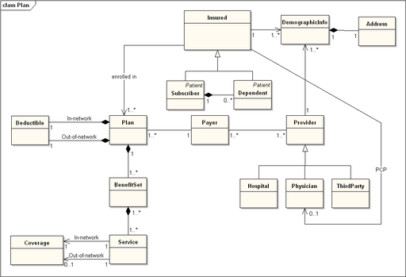

Este tipo de diagramas, a la hora de definir nuestro problema (lo que en Ing. del Software se llama la **fase de análisis**), no representa ningún tipo de clase asociada a la solución del problema. **Básicamente, es la información que necesitamos persistir**. Serán las clases que el ORM debe transformar en filas de tablas de nuestra base de datos relacional, y las representaremos mediante clases POJO (Plain Old Java Object) o **JavaBeans**.

### 6.2 Valores y entidades

En Hibernate, una entidad será la representación de una clase del modelo. En cambio, un valor será la representación de un atributo de una clase.

Por ejemplo, si estuviéramos implementando una lista de contactos, el *Contacto* sería, con toda probabilidad, una entidad; y el *email* sería un valor de la misma.

#### 6.2.1 Valores

A diferencia de las entidades, no tienen un ciclo de vida propio, y existen tres categorías:

* Tipos básicos

* Tipos *embeddable*

* Tipos colección

#### 6.2.2 Entidades

Las entidades si tienen un ciclo de vida; además, por el hecho de tener un identificador único (en el campo de las RDBMS se llama clave primaria), existen independientemente de otros objetos. Esto no sucede con los valores.

##### Identidad e igualdad

*En Java, hay diferencia entre identidad e igualdad. Dos objetos tienen la misma identidad si la comparación con el operador == devuelve true; es decir, son dos referencias apuntando al mismo objeto en memoria.
Por otro lado, la igualdad, también llamada a veces equivalencia, hace referencia al método equals. Dos objetos son iguales si su estado (el valor de sus propiedades) es el mismo.
Las bases de datos relacionales complican este panorama. Dos objetos almacenados en una base de datos relacional son idénticos si están en la misma tabla y tienen la misma clave primaria (a esto se le llama identidad de base de datos).*

### 6.3 Mapeo de entidades con anotaciones

Para convertir una clase Java en una **entidad**, tan solo tenemos que hacer dos cosas:

* Anotarla con `@Entity`.

* Incluir un atributo que esté anotado con `@Id`.

```java
@Entity
public class MyEntity {

    @Id
    private long id;


    public long getId() {
        return id;
    }

}
```

Por defecto, esta entidad se mapea en la base de datos con una tabla llamada **MIENTIDAD**.

Como la anotación **@Id** es sobre un campo, por defecto, Hibernate habilitará por defecto todos los atributos de la clase como propiedades persistentes.

#### 6.3.1 Eligiendo la clave primaria.

Si bien en el mundo de los diseñadores de bases de datos relacionales ha existido siempre una serie de procesos formales para la determinación de dependencias entre atributos y el cálculo de las claves primarias, es una práctica habitual entre los desarrolladores el utilizar un valor numérico (entero y potencialmente grande), como en el ejemplo anterior (`long id`).

Además, para *tranquilidad* del programador, este valor puede ser autogenerado (por ejemplo, puede comenzar en 1, y asignar el siguiente valor a cada *fila* insertada).

Añadiendo la anotación `@GeneratedValue` a continuación de `@Id`, JPA asume que se va a generar un valor y a asignar el mismo antes de almacenar la instancia de la entidad. Existen diferentes estrategias de asignación:

* `GenerationType.AUTO`: Hiberante escoge la mejor estrategia en función del dialecto SQL configurado (es decir, dependiendo del RDBMS).

* `GenerationType.SEQUENCE`: Espera usar una secuencia SQL para generar los valores.

* `GenerationType.IDENTITY`: Hibernate utiliza una columna especial, autonumérica.

* `GenerationType.TABLE`: Hibernate usa una tabla extra en nuestra base de datos. Tiene una fila por cada tipo de entidad diferente, y almacena el siguiente valor a utilizar.

##### Generación de los ID antes o después de la inserción

*Normalmente, un ORM optimizará las inserciones en una base de datos, agrupándolas por lotes. Esto supone que, en la realidad, es posible que no se realice la inserción al llamar al método `entityManager.persist(someEntity)`. Si esperamos a generar el ID a insertar los datos tiene como inconveniente que si llamamos a `someEntity.getId()`, obtendremos nulo. Por tanto, suele ser buena estrategia generar el ID antes de insertar, por ejemplo a través de una secuencia. Las columnas autoincrementales, los valores por defecto o las claves generadas por un trigger solo están disponibles después de la inserción.*

#### 6.3.2 Control de nombres

Por defecto, Hibernate toma una *estrategia de generación de nombres* para transformar el nombre de una clase (que en Java normalmente estará escrita en notación **UpperCamelCase**) al nombre de una tabla (por defecto, suele usar el mismo nombre en MAYÚSCULAS).

Se puede controlar el nombre de la tabla a través de la anotación `@Table(name= "NEWNAME")`.

```java
@Entity
@Table(name= "MY_ENT")
public class MyEntity {

    @Id
    private long id;


    public long getId() {
        return id;
    }

}
```

### 6.4 Mapeo de valores

Cuando mapeamos una entidad, todos sus atributos son considerados persistentes por defecto. Las reglas por defecto son:

* Si la propiedad es un tipo primitivo, un envoltorio de un tipo primitivo (`Integer`, `Double`, …), `String, BigInteger, BigDecimal, java.util.Date, java.util.Calendar, java.sql.Date, java.sql .Time, java.sql.Timestamp, byte[], Byte[], char[],` o `Character[]` se persiste automáticamente con el tipo de dato SQL adecuado.

* Si es `java.io.Serializable`, se almacena con su representación serializada (esto no será lo que habitualmente deseemos).

* Si usamos `@Embeddable` (lo estudiaremos después), también lo persiste.

En otro caso, *lanzará un error en la inicialización*. Hibernate escoge, dependiendo del dialecto configurado, la mejor correspondencia de tipos de dato en el RDBMS para los tipos Java que hayamos usado.

#### 6.4.1 Anotación `@Column`

Esta anotación, sobre una propiedad, nos permitirá indicar algunas propiedades, entre las que se encuentran:

* `nullable`: nos permite indicar si la columna mapeada puede o no almacenar valores nulos. En la práctica, es como marcar el campo como requerido.

* `name`: permite modificar el nombre por defecto que tendrá la columna mapeada.

* `insertable`, `updatable`: podemos modificar si la entidad upede ser insertada, modificada, …

* `length`: nos permite definir el número de caracteres de la columna.

*¿Dónde anotar? ¿En las propiedades o en los getter?
Hibernate nos permite definir las anotaciones (`@Id`, `@Column`, …) tanto sobre las propiedades como sobre los métodos getter (**nunca sobre los setter**). La pauta la marca la anotación `@Id`. Allá donde usemos esta anotación, marcaremos la estrategia a seguir.

#### 6.4.2 Tipos temporales

Los tipos de datos temporales, de fecha y hora, tienen un tratamiento algo especial en Hibernate. Para un campo que contiene este tipo de información, se añade la propiedad `@Temporal`.

Esta anotación la podemos usar con los tipos `java.util.Date`, `java.util.Calendar`, `java.sql.Date`, `java.sql.Time`, `java.util.Timestamp`. Hibernate también soporta los nuevos tipo de `java.time` disponibles en el JDK 8.

Como propiedad, podemos indicar que tipo de dato temporal vamos a querer usar a través del atributo TemporalType, teniendo disponibles `DATE`, `TIME`, `TIMESTAMP`.

```java
@Entity
@Table(name= "MY_ENT")
public class MyEntity {

    @Id
    private long id;

  @Temporal(TemporalType.TIMESTAMP)
  private Date createdOn;

  //...

}
```

*Hibernate utiliza por defecto `TemporalType.TIMESTAMP` si no encuentra una anotación `@Temporal` sobre alguno de los tipos de datos definidos más arriba.*

### 6.5 Tipos embebidos

En ocasiones, nos puede interesar tratar un grupo de atributos como si fueran uno solo. Un ejemplo clásico suele ser la dirección (nombre de la vía, número, código postal, …). Para este tipo de situaciones tenemos la posibilidad de covertir una clases en `Embeddable`. Veamoslo con un ejemplo:

```java
@Embeddable
public class Direccion {

  @Column(nullable=false)
  private String via;

  @Column(nullable=false, length = 5)
  private String codigoPostal;

  @Column(nullable=false)
  private String poblacion;

  @Column(nullable=false)
  private String provincia;

  //...


}
```

```java
@Entity
@Table(name="USERCONEMBEDD")
public class User {

    @Id
    @GeneratedValue(strategy=GenerationType.AUTO)
    private long id;

    private String name;

  @Temporal(TemporalType.DATE)
    private Date birthDate;

  private Direccion address;

    //...
}
```

De esta forma, Hibernate detecta que el campo `Direccion` es una clase `Embeddable`, y mapea las columnas a la tabla `USER`.

#### 6.5.1 Sobrescritura con @Embedded

¿Qué pasaría si quisiéramos añadir dos direcciones a un usuario? Hibernate nos lanzará un error, indicando que no se soportan columnas con nombre repetido.

La solución la podemos aportar sobrescribiendo los atributos de la clase embebida, para que tengan otro nombre (o incluso otras propiedades)

```java
@Entity
@Table(name="USERCONEMBEDD")
public class User {

    @Id
    @GeneratedValue(strategy=GenerationType.AUTO)
    private long id;

  //Otros atributos

    @Embedded
    @AttributeOverrides({
        @AttributeOverride(name = "via", column = @Column(name="VIA_FACTURACION")),
        @AttributeOverride(name = "codigoPostal", column = @Column(name="CODIGOPOSTAL_FACTURACION", length=5)),
        @AttributeOverride(name = "poblacion", column = @Column(name="POBLACION_FACTURACION")),
        @AttributeOverride(name = "provincia", column = @Column(name="PROVINCIA_FACTURACION"))

    })
    private Direccion billingAddress;


  //...
```

La anotación `@Embedded` es util cuando queremos mapear otras clases. El atributo `@AttributeOverrides` selecciona las propiedades que serán sobrescritas. El atributo `@AttributeOverride` indica el cambio que va a haber en un determinado atributo.

### 6.6 Ciclo de vida de una entidades

Si bien profundizaremos sobre este apartado en lecciones posteriores, no está de más que vayamos conociendo los diferentes estados en los que se puede encontrar una entidad JPA.

* `transient` (nueva): la entidad acaba de ser creada (posiblemente con el operador `new`) y aun no está asociada al contexto de persistencia. No tiene representación en la base de datos.

* `managed`, `persistent`: la entidad tiene un identificador y está asociada al contexto de persistencia. Puede estar almacenada en la base de datos, o aun no.

* `detached`: la entidad tiene un identificador, pero no está asociada al contexto de persistencia (normalmente), porque hemos cerrado el contexto de persistencia.

* `removed`: la entidad tiene un identificador y está asociada al contexto de persistencia, pero este tiene programada su eliminación.

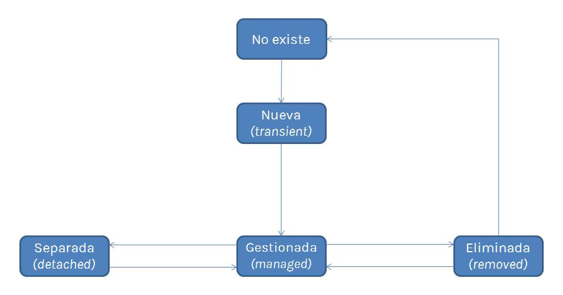

## Transcripción

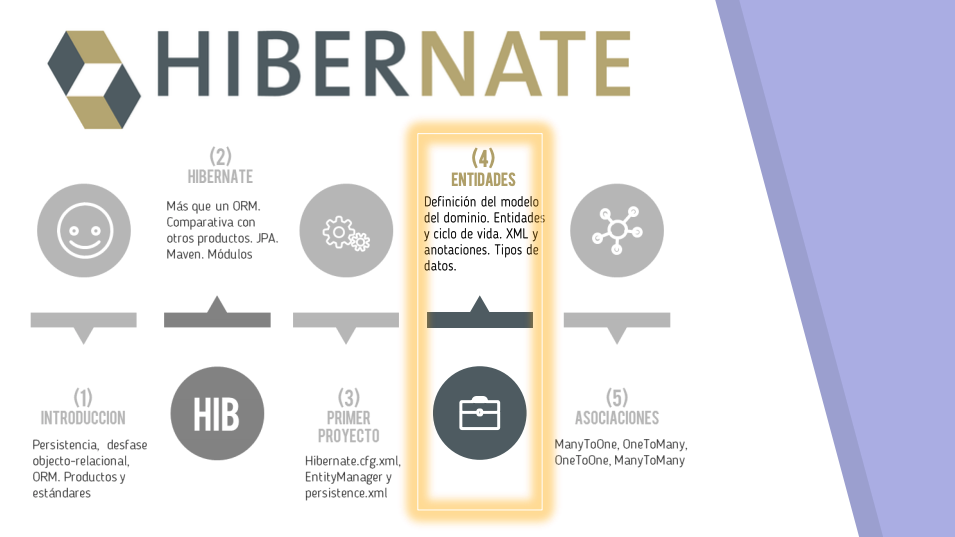

En este capítulo el número cuatro vamos a hablar sobre **Modelo de Dominio**, sobre las **Entidades**, sobre su **Ciclo de Vida** y dejaremos para la siguiente lección de este capítulo como definir las entidades, el mapeo a través XML. Por que en este capítulo lo haremos a través de anotaciones. 


Primero vamos a hablar de modelo de dominio a qué podemos llamar o que se conoce como Modelo de Dominio.

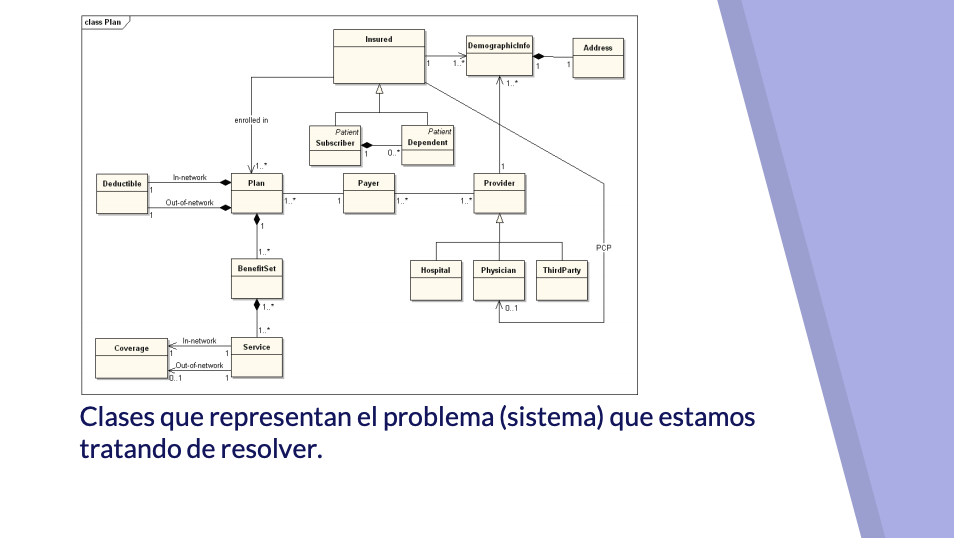

Bien pues el **Modelo de Dominio** en un sistema software representa el problema que estamos tratando de resolver, representa al sistema en si, aquí tenemos un ejemplo sacado de la wikipedia de **Modelo de Dominio** donde tendríamos un sistema de una ***empresa de seguros*** y dónde tendríamos la representación de todas las clases y las asociaciones, por facilidad, por limpiar un poco el diseño, no han incluido los atributos que intervienen en el mundo de los seguros, bien a esa representación normalmente en un diagrama de clase UML de las clases y de las asociaciones existentes entre ellas incluyendo los atributos se le conoce como el **Modelo de Dominio** son dos los objetos con los que nosotros trabajaremos dentro de nuestro sistema.


Normalmente dentro del desarrollo de software existen cuatro grandes fases en el desarrollo, las **Metodología Agiles** vinieron a cambiar un poco este esquema más clásico pero para entender el **Modelo de Dominio** nos viene bien. 

Estas grande fases son:

* Análisis
* Diseño
* Implementación
* Mantenimiento

En la fase de **Análisis** normalmente intentamos buscar que problema es el que vamos a resolver haciendo la aplicación que estamos desarrollando.

En la fase de **Diseño** una vez que hemos entendido bien qué problema estamos resolviendo y a la vez que lo hemos definido y acotado tratamos de buscar la mejor solución, la diseñamos y buscamos la mejor solución para este problema.

En la **Implementación** lo que hacemos es la resolución directa de ese problema a través de un sistema informatico.

Y en la de **Mantenimiento** lo que nos dedicamos es a corregir posibles errores que surgen, a evolucionar el Software esto sucede muy a menudo en software que acompañan elementos legislativos por ejemplo, en gestión de empresas, en educación, sí nuestro software implementa algún determinado proceso marcado en la ley y la ley cambia al respecto tendremos que modificar nuestro sistema, no porque no funcione bien sino porque el cambio legal nos lo exige.

En la fase de **Análisis** que es donde definimos qué problemas vamos a resolver es donde mediante, ya digo normalmente un diagrama de clases UML, tendremos que marcar nuestro modelo de dominio.


Dentro de el vamos a hablar de dos elementos distintos, a la hora de construir nuestras **Entidades** con JPA y Hibernate tenemos que diferenciar entre lo que es un ***valor*** y una ***entidad***, podríamos decir que una ***entidad*** será una cantidad de información que va a tener un ciclo de vida dentro de nuestro modelo de dominio, frente a un ***valor*** que normalmente sera un dato que por sí mismo no tenga ese ciclo de vida.

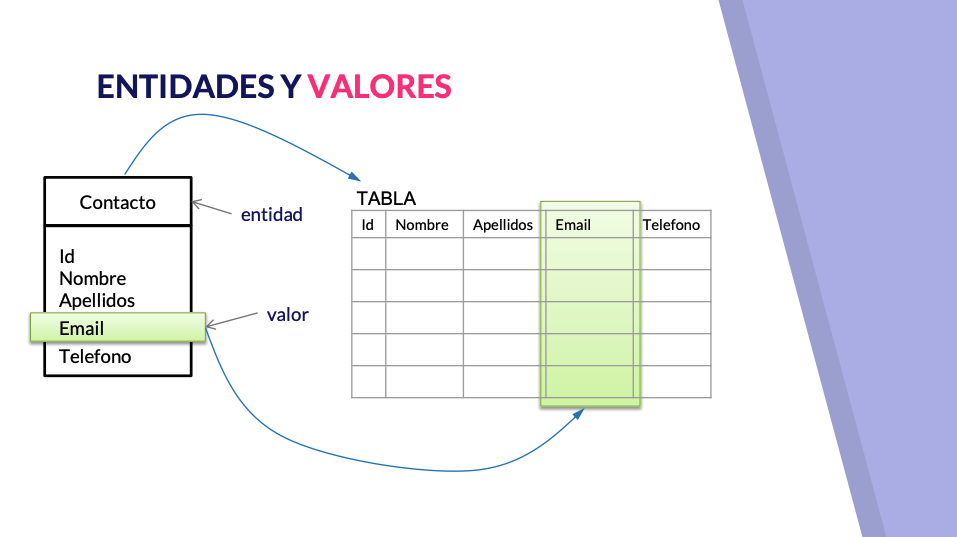

Normalmente lo solemos asociar a que ***las entidades se aparejarán*** de alguna manera, no tiene porqué ser esta asociación uno a uno, se aparejarán ***a las clases*** que incluyamos dentro de nuestro **Modelo de Dominio**, aunque ya digo luego veremos cómo podemos tratar algunas clases de una manera especial. Hibernate y JPA ***mapearan esa entidad, con normalmente una tabla*** dentro de nuestra base de datos relaciona. ***Un valor normalmente será una propiedad de una clase***, aquella que hayamos ***marcado como entidad y que normalmente se transforma como una columna de esa tabla***, para un objeto en particular, ***una instancia de la entidad sería una fila de la tabla y una propiedad de esa instancia sería el cruce de la fila y la columna correspondiente***.


Dentro de los **valores** encontramos ***valores de tipo básico***, que serán los que trabajemos sobre todo en este tema, junto con los de tipo ***embebido embeddable*** y dejaremos para más adelante los de ***tipo colección*** y como decimos con las entidades que vamos a trabajar ahora también qué tienen un ciclo de vida en sí mismo a diferencia de los valores.


Como podemos nosotros ***mapear una entidad para transformar una clase Java en una entidad de JPA*** y que por debajo Hibernate se haga cargo de confrontar esa entidad con la base de datos.

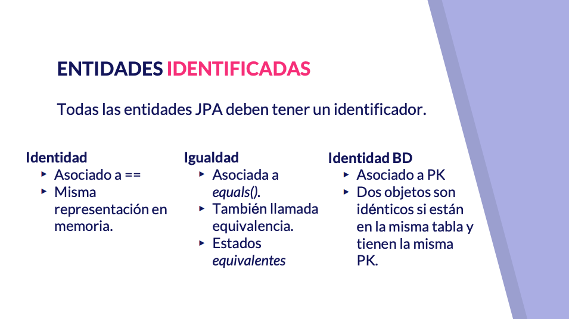

Para empezar, lo primero que es necesario antes de entrar en materia es diferencia entre **Identidad**, **Igualdad** e **Identidad a nivel de Base de Datos** porque va a ser necesario para que lo manejemos, una **Entidad** va a tener que ser identificada por fuerza, esto viene por el modelo que estamos utilizando, el **Modelo Relacional** en el que ***todas las tablas deberían tener una Clave Primaria***, esa *clave primaria no es más que un atributo, o conjunto de atributo que nos permiten diferenciar una fila de la otra y que de alguna manera lo identifica*. 

En **JPA** todas las entidades van a tener un identificador.

No es lo mismo **Identidad** que **Igualdad** incluso la **Identidad a nivel Java** e **Identidad a nivel de Base de Datos**. ***La identidad en Java nos permite decir que dos objetos son el mismo cuando al compararlos con un "==" esa comparación nos devuelve `true`***, es decir son la misma representación en memoria de un objeto sin embargo, **dos objetos que sean iguales no tienen porqué ser idénticos**, ***la igualdad en Java esta asociada a la comparación con `equals()` también se suele llamar equivalencia y quiere decir que una a una todas sus propiedades son equivalentes es decir que tienen el mismo valor, sin embargo pueden ser objetos distintos en memoria***.

*A nivel de Base de Datos dos objetos, es decir serán dos filas, serán idénticas utilizando su **PRIMARY KEY** su clave primaria, porque será idéntica cuando estén en la misma tabla y tengan el mismo valor de clave primaria*.

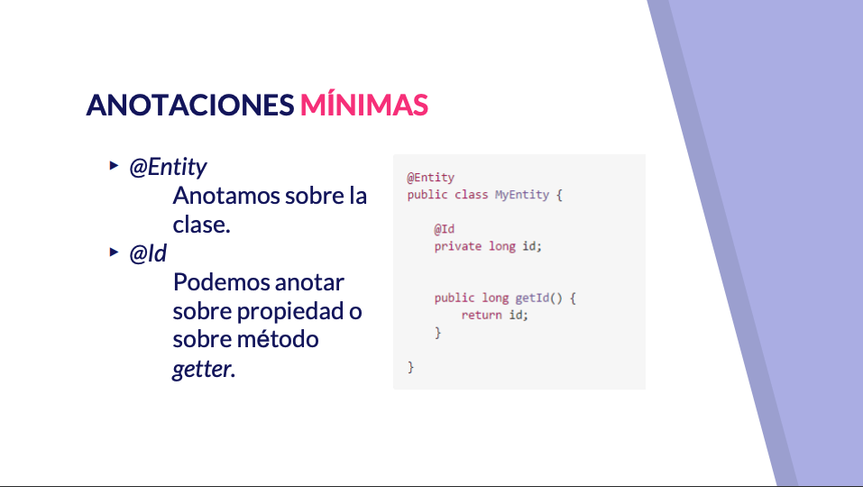

Para definir una **Entidad** como mínimo, ya sabiendo que la tenemos que identificar, si vamos a usar anotaciones, tenemos que ***usar como mínimo dos anotaciones*** la primera es **`@Entity`** ***sobre el nombre de la Clase*** nos permitirá decir que esa clase será gestionada dentro del **Contexto de Persistencia** de nuestra aplicación, al menos uno de ellos, ya veremos que se pueden definir más de uno, pero por lo menos en el que tengamos definido. Al anotar la clase con **`@Entity`** ***nos obliga por fuerza a que tengamos una propiedad anotada con*** **`@Id`**, ***podemos hacer las anotaciones a nivel de propiedad o a nivel de método getter nunca de setter***, allá donde anotemos con la anotación **`@Id`** marcará la tónica que vamos a seguir, ***si anotamos sobre una propiedad, Hibernate se encargará de trabajar con las propiedades y si marcamos `@Id` sobre un método getter trabajara con los métodos getter en lugar de las propiedades***.

Antes de continuar vamos a ver un ejemplo de Mapeo.

Aquí tenemos la **Entidad `User`**.

```java
package com.openwebinars.hibernate.mapeocolumnas;

import java.util.Date;

import javax.persistence.Column;
import javax.persistence.Entity;
import javax.persistence.GeneratedValue;
import javax.persistence.GenerationType;
import javax.persistence.Id;
import javax.persistence.Table;
import javax.persistence.Temporal;
import javax.persistence.TemporalType;

@Entity
@Table(name="ANOTHER_USER")
public class User {

   @Id
   @GeneratedValue(strategy=GenerationType.AUTO)
   private long id;

   @Column(name="USERNAME")
   private String name;
		
   @Temporal(TemporalType.DATE)
   private Date birthDate;

   public long getId() {
      return id;
   }

   public String getName() {
      return name;
   }

   public void setName(String name) {
      this.name = name;
   }

   public Date getBirthDate() {
      return birthDate;
   }

   public void setBirthDate(Date birthDate) {
      this.birthDate = birthDate;
   }

}
```

Clase mapeada que tiene las anotaciones **`@Entity`** y **`@Id`** y tiene también algunas otras anotaciones que vamos a ver en esta misma lección más adelante.

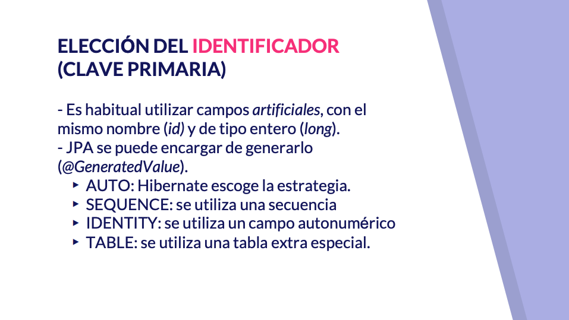

Sobre la elección del **Identificador** existe siempre un debate, porque los diseñadores más clásicos de Base de Datos conocen metodología específica a través de las dependencias funcionales existentes dentro de una relación, de una tabla y son capaces de aplicar métodos formales del cálculo de **clave candidata** y de **clave primaria**, sin embargo entre los desarrolladores es habitual el usar un ***campo artificial*** es decir, uno que no está asociado al modelo que suele tener casi siempre el mismo nombre, se suele llamar **id** que suele ser de tipo entero, un **`long`** y mediante un número que va a ser muy facil diferenciarlo de otro número, es muy fácil identificar.

**JPA** a través de la anotación **`@GeneratedValue`** nos ***permite generar automáticamente***, descargando al programador, como hemos hecho nosotros en los proyectos anteriores que lo hemos asignado estaticamente o lo hemos inventado algún método aleatorio, JPA se puede encargar de generarlo utilizando alguna estrategia. En particular tenemos cuatro:

* AUTO 
* SEQUENCE
* IDENTITY
* TABLE

La estrategia **SEQUENCE** nos permite utilizar una secuencia, un objeto a nivel de base de datos que va devolviendo valores desde un valor inicial y con un incremento que nosotros marquemos.

**IDENTITY** lo que hace es utilizar, para que ellas base de datos que permiten, un campo de tipo autonumerico.

Y la estrategia **TABLE** que se utiliza una tabla extra especial que normalmente tiene una sola columna y una fila por cada tabla o mejor dicho entidad que tengamos definida con generación de valor por tabla y que almacena en ese único valor el siguiente **`Id`** qué va a necesitar.

La estrategia **AUTO** en función del dialecto que tengamos seleccionado escoge cuál es la mejor de ellas para cada uno de los sistemas gestores de base de datos que Hibernate tiene posibilidad de manejar. 

Todo a través de `@GeneratedValue`.

Si vemos en el mismo ejemplo de antes 

```java
@Id
@GeneratedValue(strategy=GenerationType.AUTO)
private long id;

```

tenemos que el valor de **`id`** que es de tipo **`long`** será generado con la mejor estrategia según la marque el dialecto, en particular para **MySQL5InnoDB** suele utilizar la estrategia de **TABLE**.

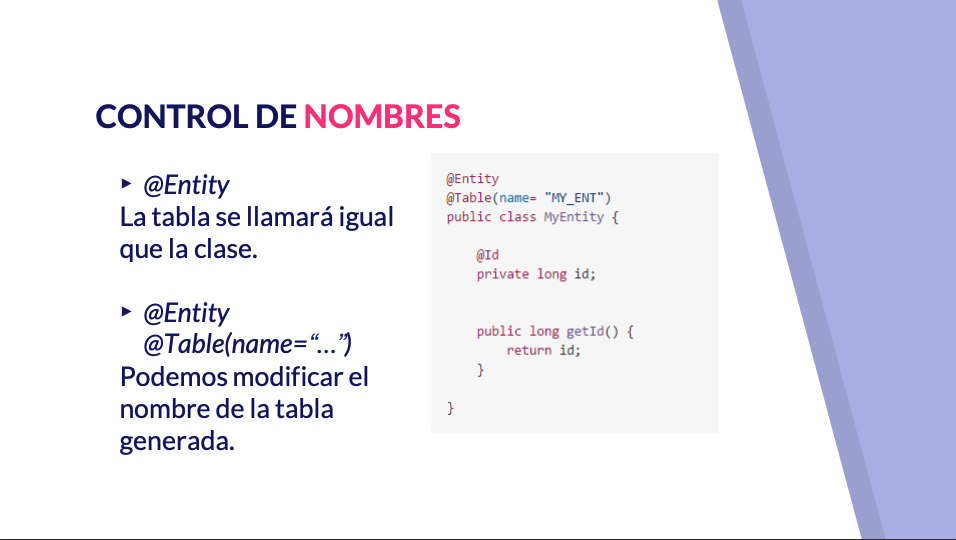

Sobre cómo ***Controlar los Nombres*** podemos cambiar el nombre que por defecto utiliza Hibernate para generar la tabla, si tenemos la propiedad **`h2ddl-auto`** en **`create`** o **`update`** o alguno de los valores asociados Hibernate se encarga de crear la tabla si se llama **`MyEntity`** utilizara el mismo nombre sin embargo, con la anotación **`@Table`** y la propiedad **`name`** podemos cambiar nosotros el nombre de la tabla que se generará o la cual va a buscar en la base de datos a la hora de mapear esta entidad. 

Esa también la tenemos dentro del ejemplo, aunque la clase se llama **`User`** vamos a crear una nueva tabla que se llama **`ANOTHER_USER`**.

```java
@Entity
@Table(name="ANOTHER_USER")
public class User {
   ...
```


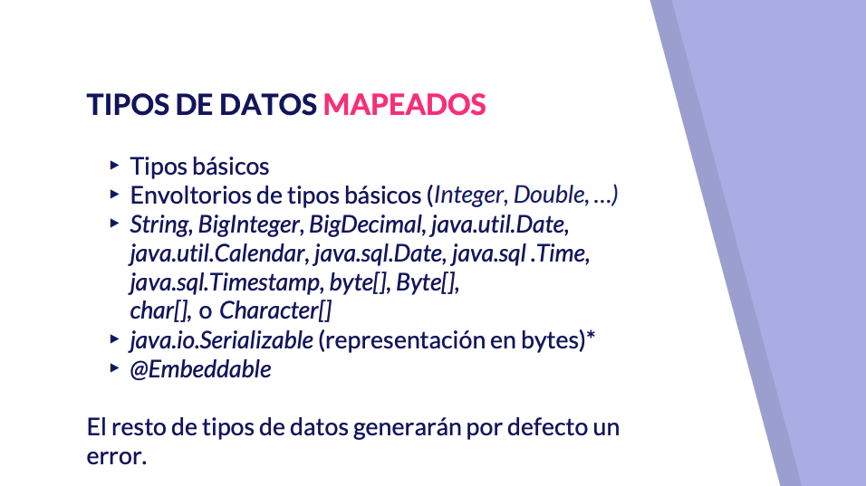

A la hora de mapear valores, hemos visto que no tenemos por qué anotar de ninguna manera los valores, solamente el **`id`**, ya que Hibernate se va a encargar de buscar las distintas propiedades que tengan estos tipos que tenemos en pantalla para anotarlo.

En principio buscara tipos básicos Java **`int`**, **`long`**, **`double`**, **`float`**, los envoltorios de esos tipos básicos con mayúsculas como se suelen conocer y alguna de las clases que tenemos en la diapositiva **`String`**, **`BigInteger`**, **`BigDecimal`**, etcétera.  También aquellas clases que implementen serializable si viene el comportamiento no será el que nosotros esperemos porque lo que almacenará seran las representaciones bytes y los tipos embebidos que hablaremos de ellos más tarde.

Si Hibernate encuentra algún tipo de dato que no es alguno de estos y no tiene la anotación adecuada generará un error a la hora de cargar ese contexto de persistencia, con lo cual si queremos mapear algo como un valor lo tenemos que hacer a través de alguno de estos tipos que tenemos en la diapositiva.

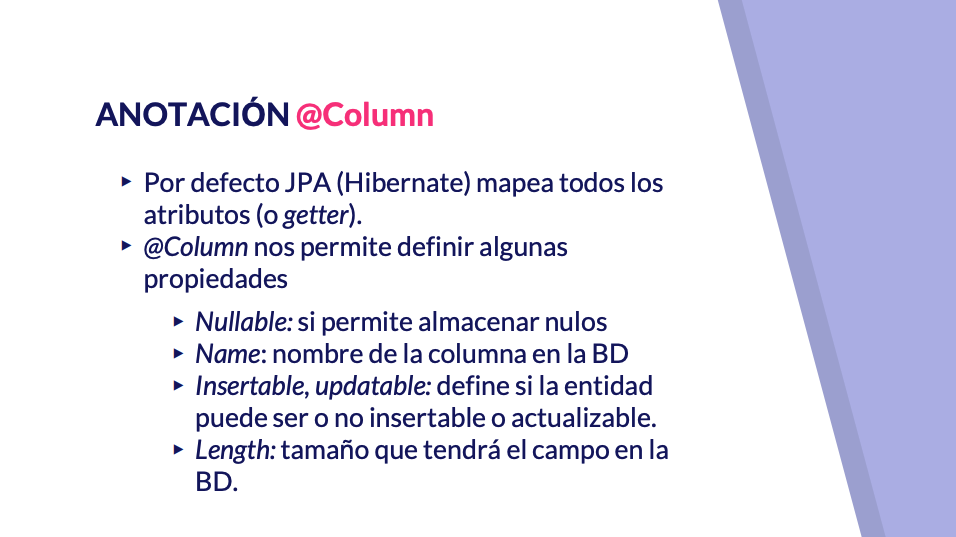

La anotacion **`@Column`** que ya hemos dicho que no es obligatoria, pero si nos permite definir algunas propiedades en particular, la más usual es la propiedad **`name`** ***nos permite cambiar el nombre que tendrá esa propiedad como columna en la base de datos***. Pero también nos permite indicar el tamaño que será el que tenga el campo en la base de datos, viene bien para cadena de caracteres, para números, etcétera. La propiedad **`nullable`** que si es **`true`** permite almacenar nulos dentro de ese valor o las propiedades **`insertable`** y **`updatable`** que define si puede ser insertada o no, o actualizada o no. Esto en determinados contextos ya veremos que resulta bastante útil.

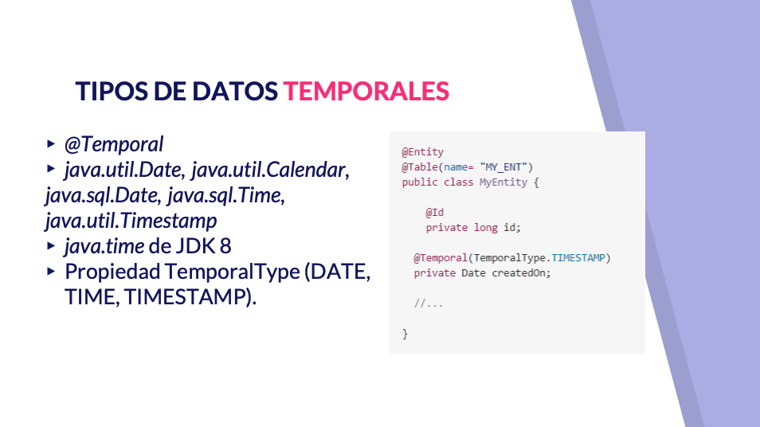

Y con respecto a los tipos de **Datos Temporales**, decir que para las **Fechas** Hibernate nos da un poco de soporte, ya que el tratamiento no es exactamente el mismo que con un atributo normal, con la anotación **`@Temporal`** ***podemos indicar que un determinado atributo será un tipo de dato temporal***, nos permite gestionar los clásicos **`Date`** tanto de **`util`** como de **`sql`**, **`Timestamp`**, **`Time`**, **`Calendar`** ***y también los tipos nuevos que hay dentro de la*** **`java.time`** ***de Java 8***. ***Esta anotación nos permite almacenar en la base de datos los datos de tres maneras distintas como*** **`DATE`**, **`TIME`** y **`TIMESTAMP`**, que es lo que tenemos en el ejemplo.

### :computer: Código Completo - **`130-04-PrimerProyectoHibernateJPAMapeoColumnas`**

Este proyecto es muy similar al proyecto **`130-02-PrimerProyectoHibernateJPA`**, por lo que podemos crearlo desde el inicio siguiendo todos los pasos o simplemente copiar este proyecto y cambiar todo lo necesario.

Vamos a crear el proyecto desde cero, crearemos nuestro un proyecto Hibernate conjuntamente con JPA.

En primer lugar vamos a crear un **proyecto Maven**, vamos añadir las **características de JPA**, vamos a añadir las **clases Modelo o entidades** en nuestro caso será la misma que en el ejemplo anterior, vamos a **configurar la Unidad de Persistencia**, vamos a crear nuestra **Clase de Aplicación** y lo vamos a **ejecutar**.

Creamos un nuevo proyecto de tipo Maven.


Se crea la siguiente estructura:


Vamos a cambiar el build Path de 1.7 a 14 tanto en el **`Java Build Path`** como en el **`Java Compiler`**.


En nuestro archivo **`pom.xml`** vamos a añadir la dependencia **`hibernate-entitymanager`** va a incluir el nucleo y los elementos necesarios para poder trabajar con JPA.

```xml
<!-- https://mvnrepository.com/artifact/org.hibernate/hibernate-entitymanager -->
<dependency>
    <groupId>org.hibernate</groupId>
    <artifactId>hibernate-entitymanager</artifactId>
    <version>5.4.17.Final</version>
</dependency>
```

también añadimos la dependencia de **MySQL** dentro del **`pom.xml`**.

```xml
<!-- https://mvnrepository.com/artifact/mysql/mysql-connector-java -->
<dependency>
    <groupId>mysql</groupId>
    <artifactId>mysql-connector-java</artifactId>
    <version>8.0.20</version>
</dependency>
```

Al incluir estas dos dependencias en el archivo **`pom.xml`** ya tendríamos nuestras dependencias organizadas.


El siguiente paso será **añadir las características de JPA a nuestro proyecto**, eso lo vamos a hacer **pulsamos sobre el proyecto con el botón derecho y pulsamos propiedades y vamos a seleccionar la opción `Project Facets`**.


Lo primero que tenemos que indicar es que este proyecto será usado con **`Project Facets`**. Pulsamos sobre el enlace para que se configure automáticamente.


***Para aquellos que no lo hayáis hecho antes es posible que marque algún tipo de configuración en la que podéis elegir que seréis vosotros mismos los que vais a gestionar la configuración de la librería y los ficheros en lugar de marcar una serie de ficheros Jars que ya esten añadidos***, en nuestro caso como ya es el segundo proyecto creado ya no es necesario hacer esto.

Marcamos JPA y en la pestaña de Runtimes marcamos Java 8 (14).


Al realizar esto se nos crea el archivo **`persistence.xml`**


Con esto nuestro proyecto ya es un **proyecto JPA**, pero no lo parece porque seguimos en una perspectiva que no es la **perspectiva JPA**, para abrir una perspectiva nos vamos arriba en la esquina superior derecha en la que seleccionamos la **perspectiva JPA**.


Con esto nuestro proyecto ya se muestra como un **proyecto JPA**.

Una perspectiva no es más que un conjunto de ventanas, de vistas Eclipse nos ofrece cómo podéis comprobar las que tenemos disponible han cambiado.


Una vez hecho esto vamos a seguir con el siguiente paso, que es crear nuestra clase modelo **`User`** la cual a cambiado un poco con respecto a la del proyecto anterior, tiene un campo **`name`** pero en la base de datos se llamará **`USERNAME`**, le hemos añadido un dato temporal **`birthDate`** que es del tipo **`java.util.date`** pero que hemos anotado como **`@Temporal(TemporalType.DATE)`** y que se almacenará en la base de datos como **`DATE`**.


En la clase **`User`** añadimos los atributos y anotaciones correspondientes.


Sin embargo la clase nos da un error **`Class "com.javaocio.hibernate.mapeocolumnas.User" is managed, but is not listed in the persistence.xml file`**, nos indica que la clase **`User`** es una entidad, es decir que va a ser manejada por JPA, pero no está listada en el fichero de persistencia y es que no lo hemos configurado aún.


Al convertir nuestro proyecto a un proyecto JPA se nos a creado el JPA Context con el fichero **`persistence.xml`**.

Vamos a **Configurar la Unidad de Persistencia**, vamos a ***añadir nuestra entidad como clases gestionada***, vamos a ***crear la conexión*** y vamos a ***añadir las diferente opciones de Hibernate***.


El nombre de aquí, será el nombre del contexto de persistencia **`130-04-PrimerProyectoHibernateJPAMapeoColumnas`** vamos a dejarlo solo en **`PrimerProyectoHibernateJPAMapeoColumnas`**.


Vamos a ver la **pestaña de Conexión** entre los dos tipos de conexión que tenemos la conexión usando **transacciones JTA** o **Transacciones de Recurso Local**,


utilizaremos la de **Transacciones de Recurso Local**, mediante este sistema somos nosotros los encargados de gestionar las transacciones y no un sistema centralizado como ofrece JavaEE o Spring.


Para insertar los datos de la conexión lo podemos hacer a través de una conexión ya generada que podemos construir abajo o través de una serie de datos.

Como describimos en el proyecto **`130-02-PrimerProyectoHibernateJPA`** no nos fue posible crear la conexión por lo que vamos a meter manualmente los datos en **`persistence.xml`**, lo primero que vamos a hacer es añadir las propiedades de la conexión a la BD:


Ademas de los datos meramente de la conexión de la BD vamos a añadir el dialecto de MySQL para Hibernate, el driver y podemos también añadir las propiedades para que se nos muestren las sentencias SQL formateadas **`hibernate.show_sql=true`**, **`hibernate.format_sql=true`** y también la propiedad para crear la BD cada que se arranque el servidor **`hibernate.hbm2ddl.auto=create`**.


Ya tenemos que estas opciones añadidas, solamente nos faltaría especificar que nuestra clase **`User`** es una entidad que será manejada por JPA y lo hacemos a través del asistente o metiendolo manualmene.


Vamos a marcar que excluya aquellas clases que no esten marcadas, clase que no estén listadas.


Con todo lo que hemos hecho, nuestro archivo **`persistence.xml`** queda así:


```xml
<?xml version="1.0" encoding="UTF-8"?>
<persistence version="2.2" xmlns="http://xmlns.jcp.org/xml/ns/persistence" xmlns:xsi="http://www.w3.org/2001/XMLSchema-instance" xsi:schemaLocation="http://xmlns.jcp.org/xml/ns/persistence http://xmlns.jcp.org/xml/ns/persistence/persistence_2_2.xsd">
	<persistence-unit name="PrimerProyectoHibernateJPAMapeoColumnas" transaction-type="RESOURCE_LOCAL">
		<class>com.javaocio.hibernate.mapeocolumnas.User</class>
		<exclude-unlisted-classes>true</exclude-unlisted-classes>
	<properties>
			<property name="javax.persistence.jdbc.url" value="jdbc:mysql://localhost:3306/hibernate"/>
			<property name="javax.persistence.jdbc.user" value="openwebinars"/>
			<property name="javax.persistence.jdbc.password" value="12345678"/>
			<property name="javax.persistence.jdbc.driver" value="com.mysql.jdbc.Driver"/>
			<property name="hibernate.dialect" value="org.hibernate.dialect.MySQL5InnoDBDialect"/>
			<property name="hibernate.connection.driver_class" value="com.mysql.jdbc.Driver"/>
			<property name="hibernate.hbm2ddl.auto" value="create"/>
			<property name="hibernate.show_sql" value="true"/>
			<property name="hibernate.format_sql" value="true"/>
		</properties>
	</persistence-unit>
</persistence>
```

Cómo podemos comprobar el error sobre nuestra clase **`User`** ya ha desaparecido.


Debemos recordar el nombre de nuestro contexto de persistencia **`PrimerProyectoHibernateJPAMapeoColumnas`**


Ya que lo vamos a necesitar para nuestra **Clase de Aplicación** que actualmente luce así:


La inicialización de un proyecto JPA la hacemos a través de un objeto llamado **`EntityManager`** y **`EntityManagerFactory`**.

JPA proporciona un método llamado **`createEntityManagerFactory`** que solamente proporcionandole el nombre nos va a permitir cargar el fichero de configuración

```java
   //Configuramos el EMF a través de la unidad de persistencia
   EntityManagerFactory emf = Persistence.createEntityManagerFactory("PrimerProyectoHibernateJPAMapeoColumnas");
```

A partir de allí vamos a generar el **`EntityManager`** que es facíl de generar tan solo llamando al método de creación del mismo.

```java
   //Generamos un EntityManager
   EntityManager em = emf.createEntityManager();
```

Y al igual que antes vamos a incluir los métodos de cierre.

```java
   //Cerramos el EntityManager y EntityManagerFactory
   em.close();
   emf.close();
```


Después de crear el **`EntityManager`** vamos a Iniciar y Cerrar(**`commit`**) una transicción 

```java
   //Iniciamos una transacción
   em.getTransaction().begin();
   
   
   
   //Commiteamos la transacción
   em.getTransaction().commit();
```

Dentro de la transacción vamos a crear dos usuarios y a través de un **`Calendar`** vamos a obtener las fechas de nacimiento, una vez creados los dos usuarios los vamos a persistir.

```java
   //Iniciamos una transacción
   em.getTransaction().begin();
   
   //Obtenemos el Calendar con el que gestionaremos las fechas
   Calendar calendar = Calendar.getInstance();

   // Construimos un objeto de tipo User
   User user1 = new User();
   user1.setName("Pepe");
		
   calendar.set(1982, 9, 18);
   user1.setBirthDate(calendar.getTime());

   // Construimos otro objeto de tipo User
   User user2 = new User();
   user2.setName("Juan");
   calendar.set(1990, 5, 20);
   user2.setBirthDate(calendar.getTime());
		
   //Persistimos los objetos
   em.persist(user1);
   em.persist(user2);
   
   //Commiteamos la transacción
   em.getTransaction().commit();
```

Con esto ya podemos ejecutar la aplicación para ver su funcionamiento.

AQUIIIIIIIIIIIIIIII


Vamos a ver el ejemplo en funcionamiento.

Tenemos **`persistence.xml`**.

```html
<?xml version="1.0" encoding="UTF-8"?>
<persistence version="2.1" xmlns="http://xmlns.jcp.org/xml/ns/persistence" xmlns:xsi="http://www.w3.org/2001/XMLSchema-instance" xsi:schemaLocation="http://xmlns.jcp.org/xml/ns/persistence http://xmlns.jcp.org/xml/ns/persistence/persistence_2_1.xsd">
	<persistence-unit name="MapeoColumnas" transaction-type="RESOURCE_LOCAL">
		<class>com.openwebinars.hibernate.mapeocolumnas.User</class>
		<exclude-unlisted-classes>true</exclude-unlisted-classes>
		<properties>
			<property name="javax.persistence.jdbc.url" value="jdbc:mysql://localhost:3306/hibernate"/>
			<property name="javax.persistence.jdbc.user" value="openwebinars"/>
			<property name="javax.persistence.jdbc.password" value="12345678"/>
			<property name="javax.persistence.jdbc.driver" value="com.mysql.jdbc.Driver"/>
			<property name="hibernate.dialect" value="org.hibernate.dialect.MySQL5InnoDBDialect"/>
			<property name="hibernate.connection.driver_class" value="com.mysql.jdbc.Driver"/>
			<property name="hibernate.hbm2ddl.auto" value="create"/>
			<property name="hibernate.show_sql" value="true"/>
			<property name="hibernate.format_sql" value="true"/>
		</properties>
	</persistence-unit>
</persistence>
```

Tenemos el `pom.xml`.

```html
<?xml version="1.0" encoding="UTF-8"?>

<project xmlns="http://maven.apache.org/POM/4.0.0"
	xmlns:xsi="http://www.w3.org/2001/XMLSchema-instance"
	xsi:schemaLocation="http://maven.apache.org/POM/4.0.0 http://maven.apache.org/xsd/maven-4.0.0.xsd">
	<modelVersion>4.0.0</modelVersion>

	<groupId>com.openwebinars.hibernate</groupId>
	<artifactId>130-04-PrimerProyectoHibernateJPAMapeoColumnas</artifactId>
	<version>0.0.1-SNAPSHOT</version>

	<name>130-04-PrimerProyectoHibernateJPAMapeoColumnas</name>
	<!-- FIXME change it to the project's website -->
	<url>http://www.example.com</url>

	<properties>
		<project.build.sourceEncoding>UTF-8</project.build.sourceEncoding>
		<maven.compiler.source>1.7</maven.compiler.source>
		<maven.compiler.target>1.7</maven.compiler.target>
	</properties>

	<dependencies>
		<dependency>
			<groupId>junit</groupId>
			<artifactId>junit</artifactId>
			<version>4.11</version>
			<scope>test</scope>
		</dependency>
		<dependency>
			<groupId>org.hibernate</groupId>
			<artifactId>hibernate-entitymanager</artifactId>
			<version>5.4.17.Final</version>
		</dependency>
		<!-- https://mvnrepository.com/artifact/mysql/mysql-connector-java -->
		<dependency>
			<groupId>mysql</groupId>
			<artifactId>mysql-connector-java</artifactId>
			<version>8.0.20</version>
		</dependency>
	</dependencies>

	<build>
		<pluginManagement><!-- lock down plugins versions to avoid using Maven 
				defaults (may be moved to parent pom) -->
			<plugins>
				<!-- clean lifecycle, see https://maven.apache.org/ref/current/maven-core/lifecycles.html#clean_Lifecycle -->
				<plugin>
					<artifactId>maven-clean-plugin</artifactId>
					<version>3.1.0</version>
				</plugin>
				<!-- default lifecycle, jar packaging: see https://maven.apache.org/ref/current/maven-core/default-bindings.html#Plugin_bindings_for_jar_packaging -->
				<plugin>
					<artifactId>maven-resources-plugin</artifactId>
					<version>3.0.2</version>
				</plugin>
				<plugin>
					<artifactId>maven-compiler-plugin</artifactId>
					<version>3.8.0</version>
				</plugin>
				<plugin>
					<artifactId>maven-surefire-plugin</artifactId>
					<version>2.22.1</version>
				</plugin>
				<plugin>
					<artifactId>maven-jar-plugin</artifactId>
					<version>3.0.2</version>
				</plugin>
				<plugin>
					<artifactId>maven-install-plugin</artifactId>
					<version>2.5.2</version>
				</plugin>
				<plugin>
					<artifactId>maven-deploy-plugin</artifactId>
					<version>2.8.2</version>
				</plugin>
				<!-- site lifecycle, see https://maven.apache.org/ref/current/maven-core/lifecycles.html#site_Lifecycle -->
				<plugin>
					<artifactId>maven-site-plugin</artifactId>
					<version>3.7.1</version>
				</plugin>
				<plugin>
					<artifactId>maven-project-info-reports-plugin</artifactId>
					<version>3.0.0</version>
				</plugin>
			</plugins>
		</pluginManagement>
	</build>
</project>
```

Como ya hemos visto tenemos la clase `User`.

*`User`*

```java
package com.openwebinars.hibernate.mapeocolumnas;

import java.util.Date;

import javax.persistence.Column;
import javax.persistence.Entity;
import javax.persistence.GeneratedValue;
import javax.persistence.GenerationType;
import javax.persistence.Id;
import javax.persistence.Table;
import javax.persistence.Temporal;
import javax.persistence.TemporalType;

@Entity
@Table(name="ANOTHER_USER")
public class User {

	@Id
	@GeneratedValue(strategy=GenerationType.AUTO)
	private long id;

	@Column(name="USERNAME")
	private String name;
	
	
	@Temporal(TemporalType.DATE)
	private Date birthDate;

	
	public long getId() {
		return id;
	}


	public String getName() {
		return name;
	}

	public void setName(String name) {
		this.name = name;
	}


	public Date getBirthDate() {
		return birthDate;
	}


	public void setBirthDate(Date birthDate) {
		this.birthDate = birthDate;
	}


}
```

Tiene un campo `name` pero en la base de datos se llamará `USERNAME`, le hemos añadido un dato temporal `birthDate` que es del tipo `java.util.date` pero que hemos anotado como `@Temporal(TemporalType.DATE)` y que se almacenará en la base de datos como `DATE`.

Tenemos nuestra clase de aplicación `App` seguimos la línea que marcamos en el capitulo 3 en los proyectos de JPA.

*`App.java`*

```java
package com.openwebinars.hibernate.mapeocolumnas;

import java.util.Calendar;

import javax.persistence.EntityManager;
import javax.persistence.EntityManagerFactory;
import javax.persistence.Persistence;

/**
 * Entidades y mapeo de atributos
 * www.openwebinars.net
 * @LuisMLopezMag
 */
public class App {
	public static void main(String[] args) {
		
		//Configuramos el EMF a través de la unidad de persistencia
		EntityManagerFactory emf = Persistence.createEntityManagerFactory("MapeoColumnas");

		//Generamos un EntityManager
		EntityManager em = emf.createEntityManager();

		//Iniciamos una transacción
		em.getTransaction().begin();

		//Obtenemos el Calendar con el que gestionaremos las fechas
		Calendar calendar = Calendar.getInstance();

		// Construimos un objeto de tipo User
		User user1 = new User();
		user1.setName("Pepe");
		
		calendar.set(1982, 9, 18);
		user1.setBirthDate(calendar.getTime());

		// Construimos otro objeto de tipo User
		User user2 = new User();
		user2.setName("Juan");
		calendar.set(1990, 5, 20);
		user2.setBirthDate(calendar.getTime());
		
		//Persistimos los objetos
		em.persist(user1);
		em.persist(user2);

		//Commiteamos la transacción
		em.getTransaction().commit();
		
		//Cerramos el EntityManager
		em.close();

	}
}
```

Creamos nuestro `EntityManagerFactory`, a partir de ahí creamos nuestro `EntityManager` iniciamos una transacción y simplemente vamos a crear dos usuarios el primer usuario Pepe y Juan y a través de un calendar vamos a obtener las fechas de nacimiento, observemos que los meses comienzan en 0.

Si ejecutamos vemos que Hibernate ha hecho algún trabajo duro, ha borrado la tabla si existe, también ha borrado una tabla que utiliza como hemos dicho antes para generar los valores, la vuelve a crear, ha vuelto a crear la tabla especial, a utilizado esa tabla para obtener los nuevos valores que tiene que insertar.

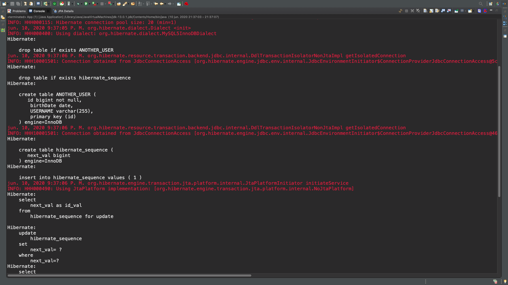

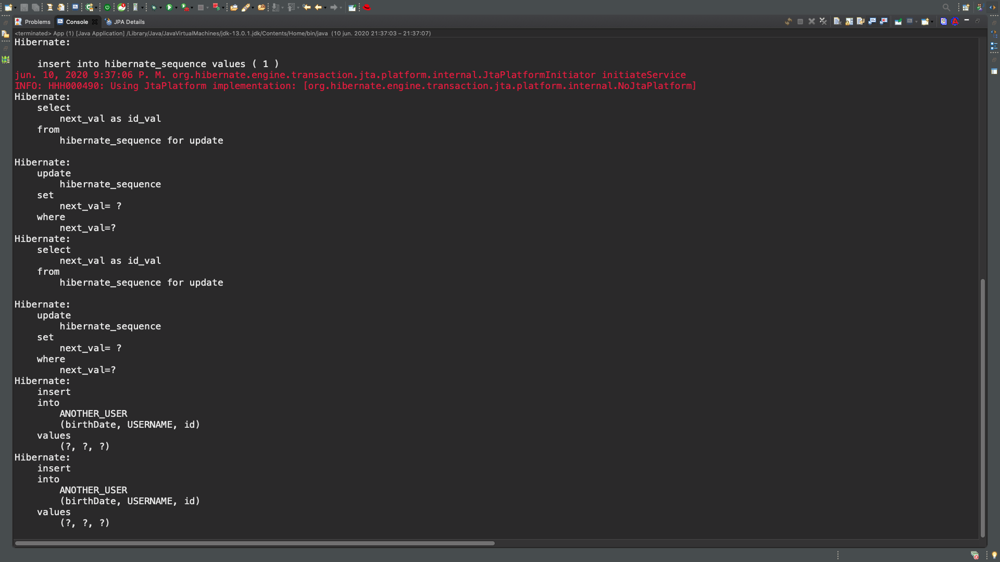

Y si miramos en Workbeanch podemos ver que tenemos las tablas `ANOTHER_USER` con los siguientes datos:

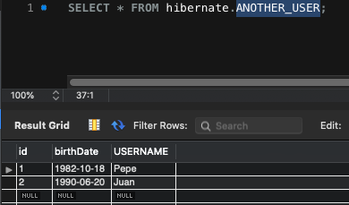

los meses son distintos porque Calendar funciona de una manera diferente empezar a contar de cero. Podemos comprobar como se han almacenado Pepe y Juan con sus respectivas fechas usando el formato de fecha de MySQL y como se ha podido almacenar esta transacción almacenando los datos indicados en `App`.

También se creo la tabla `hibernate_sequence`.

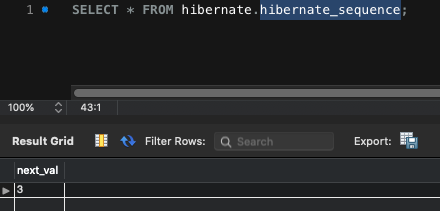

Y seguimos conservando la tabla `User` de las aplicaciones anteriores.

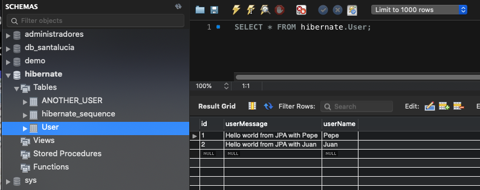


Ahora vamos a ver los tipos embebidos y los ciclos de vida de las entidades.

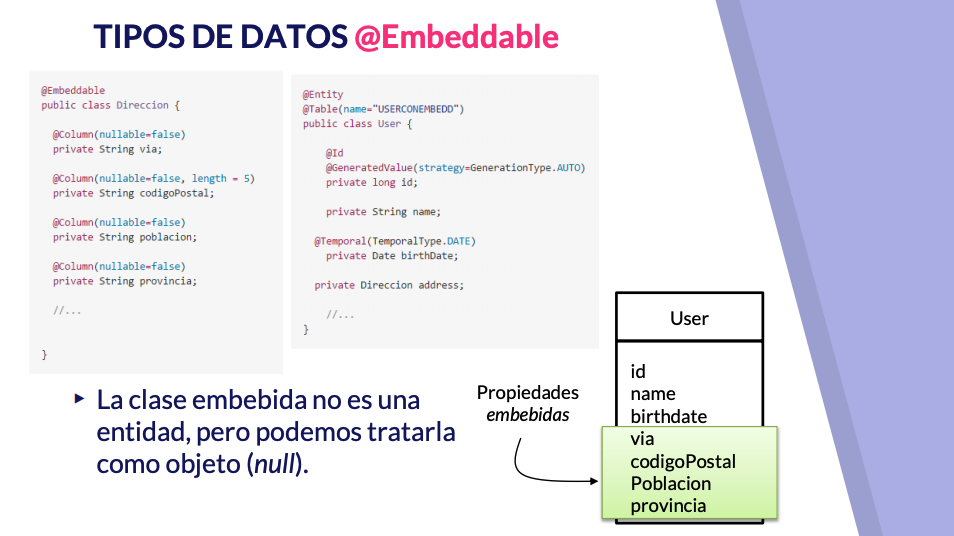

Los tipos embebidos nos permiten insertar una clase dentro de otra, si bien el translado va a ser a una sola tabla, los tipos que queramos marcar cómo embebidos tendrán que llevar la anotación `@Embeddable` y bien solamente tendremos que hacer referencia a este objeto dentro de la clase donde la queremos embeber.

La clase embebida no es una entidad, pero si es verdad que la podremos trabajar como un objeto, que ventaja tiene esto por que alguin dira, oye si esto lo vamos a transladar como columnas de la misma tabla, bien si se van a transladar como columnas de la misma tabla, nosotros en Java lo vamos a tratar como un objeto de verdad, lo podemos tratar como null, podemos hacer colecciones, lo que nosotros necesitemos, pero  no tendremos que preocuparnos de mapearlo como otra entidad con su respectiva asociaciones.

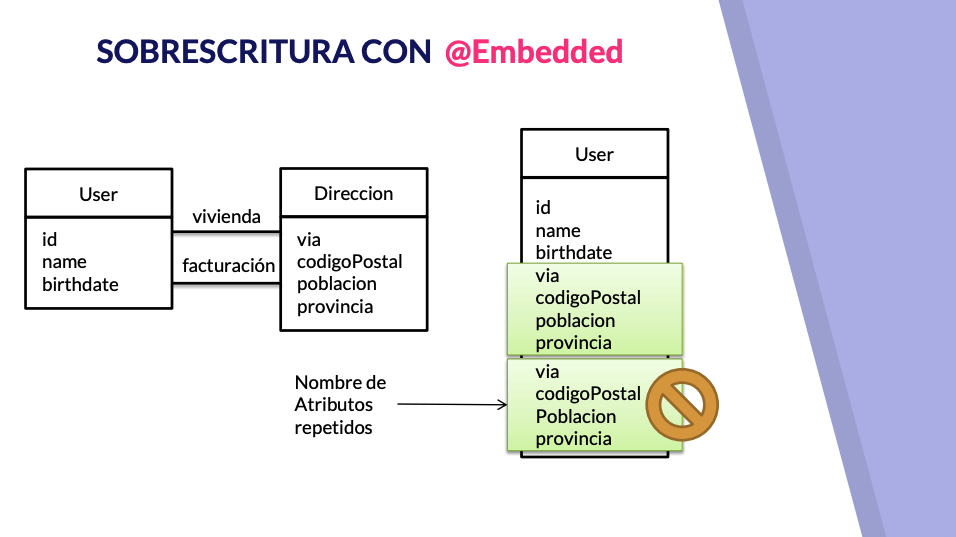

La dificultad estriba en si queremos añadir más de uno, por ejemplo la dirección de vivienda y la dirección de facturación que suele ser algo tipico en los sistemas de compra online, no podríamos añadir dos veces como una entidad embebida, por que tendríamos el nombre de atributos repetidos. Aunque Hibernate es capaz de proporcionar algún tipo de mecanismo para que nos podamos saltar ese problema y lo podemos solventar.

### :computer: Código Completo - 130-05-PrimerProyectoHibernateJPAEmbebido

Como podemos comprar tenemos usuarios con direcciones, la dirección esta embebida y en los usuarios aunque hemos embebido a través de la anotación `@AttributeOverrides(`
podemos marcar que sobreescriba el nombre de una clase que estamos embebiendo por otra, de manera que al crearse en la base de datos tendrá nombre diferente y nosotros saltaremos ese problema y podremos tener dos direcciones, la dirección normal y la dirección de facturación dentro de si.

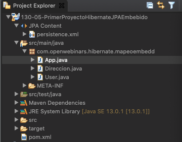

*`pom.xml`*

```html
<?xml version="1.0" encoding="UTF-8"?>

<project xmlns="http://maven.apache.org/POM/4.0.0"
	xmlns:xsi="http://www.w3.org/2001/XMLSchema-instance"
	xsi:schemaLocation="http://maven.apache.org/POM/4.0.0 http://maven.apache.org/xsd/maven-4.0.0.xsd">
	<modelVersion>4.0.0</modelVersion>

	<groupId>com.openwebinars.hibernate</groupId>
	<artifactId>130-05-PrimerProyectoHibernateJPAEmbebido</artifactId>
	<version>0.0.1-SNAPSHOT</version>

	<name>130-05-PrimerProyectoHibernateJPAEmbebido</name>
	<!-- FIXME change it to the project's website -->
	<url>http://www.example.com</url>

	<properties>
		<project.build.sourceEncoding>UTF-8</project.build.sourceEncoding>
		<maven.compiler.source>1.7</maven.compiler.source>
		<maven.compiler.target>1.7</maven.compiler.target>
	</properties>

	<dependencies>
		<dependency>
			<groupId>junit</groupId>
			<artifactId>junit</artifactId>
			<version>4.11</version>
			<scope>test</scope>
		</dependency>
		<dependency>
			<groupId>org.hibernate</groupId>
			<artifactId>hibernate-entitymanager</artifactId>
			<version>5.4.17.Final</version>
		</dependency>
		<!-- https://mvnrepository.com/artifact/mysql/mysql-connector-java -->
		<dependency>
			<groupId>mysql</groupId>
			<artifactId>mysql-connector-java</artifactId>
			<version>8.0.20</version>
		</dependency>
	</dependencies>

	<build>
		<pluginManagement><!-- lock down plugins versions to avoid using Maven 
				defaults (may be moved to parent pom) -->
			<plugins>
				<!-- clean lifecycle, see https://maven.apache.org/ref/current/maven-core/lifecycles.html#clean_Lifecycle -->
				<plugin>
					<artifactId>maven-clean-plugin</artifactId>
					<version>3.1.0</version>
				</plugin>
				<!-- default lifecycle, jar packaging: see https://maven.apache.org/ref/current/maven-core/default-bindings.html#Plugin_bindings_for_jar_packaging -->
				<plugin>
					<artifactId>maven-resources-plugin</artifactId>
					<version>3.0.2</version>
				</plugin>
				<plugin>
					<artifactId>maven-compiler-plugin</artifactId>
					<version>3.8.0</version>
				</plugin>
				<plugin>
					<artifactId>maven-surefire-plugin</artifactId>
					<version>2.22.1</version>
				</plugin>
				<plugin>
					<artifactId>maven-jar-plugin</artifactId>
					<version>3.0.2</version>
				</plugin>
				<plugin>
					<artifactId>maven-install-plugin</artifactId>
					<version>2.5.2</version>
				</plugin>
				<plugin>
					<artifactId>maven-deploy-plugin</artifactId>
					<version>2.8.2</version>
				</plugin>
				<!-- site lifecycle, see https://maven.apache.org/ref/current/maven-core/lifecycles.html#site_Lifecycle -->
				<plugin>
					<artifactId>maven-site-plugin</artifactId>
					<version>3.7.1</version>
				</plugin>
				<plugin>
					<artifactId>maven-project-info-reports-plugin</artifactId>
					<version>3.0.0</version>
				</plugin>
			</plugins>
		</pluginManagement>
	</build>
</project>
```

*`persistence.xml`*

```html
<?xml version="1.0" encoding="UTF-8"?>
<persistence version="2.1" xmlns="http://xmlns.jcp.org/xml/ns/persistence" xmlns:xsi="http://www.w3.org/2001/XMLSchema-instance" xsi:schemaLocation="http://xmlns.jcp.org/xml/ns/persistence http://xmlns.jcp.org/xml/ns/persistence/persistence_2_1.xsd">
	<persistence-unit name="MapeoEmbedd" transaction-type="RESOURCE_LOCAL">
		<class>com.openwebinars.hibernate.mapeoembedd.User</class>
		<class>com.openwebinars.hibernate.mapeoembedd.Direccion</class>
		<exclude-unlisted-classes>true</exclude-unlisted-classes>
		<properties>
			<property name="javax.persistence.jdbc.url" value="jdbc:mysql://localhost:3306/hibernate"/>
			<property name="javax.persistence.jdbc.user" value="openwebinars"/>
			<property name="javax.persistence.jdbc.password" value="12345678"/>
			<property name="javax.persistence.jdbc.driver" value="com.mysql.jdbc.Driver"/>
			<property name="hibernate.dialect" value="org.hibernate.dialect.MySQL5InnoDBDialect"/>
			<property name="hibernate.connection.driver_class" value="com.mysql.jdbc.Driver"/>
			<property name="hibernate.hbm2ddl.auto" value="create"/>
			<property name="hibernate.show_sql" value="true"/>
			<property name="hibernate.format_sql" value="true"/>
		</properties>
	</persistence-unit>
</persistence>
```

*`User.java`*

```java
package com.openwebinars.hibernate.mapeoembedd;

import java.util.Date;

import javax.persistence.AttributeOverride;
import javax.persistence.AttributeOverrides;
import javax.persistence.Column;
import javax.persistence.Embedded;
import javax.persistence.Entity;
import javax.persistence.GeneratedValue;
import javax.persistence.GenerationType;
import javax.persistence.Id;
import javax.persistence.Table;
import javax.persistence.Temporal;
import javax.persistence.TemporalType;

@Entity
@Table(name="USERCONEMBEDD")
public class User {

	@Id
	@GeneratedValue(strategy=GenerationType.AUTO)
	private long id;

	private String name;	
	
	@Temporal(TemporalType.DATE)
	private Date birthDate;
	
	private Direccion address;

	@Embedded
	@AttributeOverrides({
		@AttributeOverride(name = "via", column = @Column(name="VIA_FACTURACION")),
		@AttributeOverride(name = "codigoPostal", column = @Column(name="CODIGOPOSTAL_FACTURACION", length=5)),
		@AttributeOverride(name = "poblacion", column = @Column(name="POBLACION_FACTURACION")),
		@AttributeOverride(name = "provincia", column = @Column(name="PROVINCIA_FACTURACION"))
		
	})
	private Direccion billingAddress;
	
	public long getId() {
		return id;
	}


	public String getName() {
		return name;
	}

	public void setName(String name) {
		this.name = name;
	}


	public Date getBirthDate() {
		return birthDate;
	}


	public void setBirthDate(Date birthDate) {
		this.birthDate = birthDate;
	}


	public Direccion getAddress() {
		return address;
	}


	public void setAddress(Direccion address) {
		this.address = address;
	}


	public Direccion getBillingAddress() {
		return billingAddress;
	}


	public void setBillingAddress(Direccion billingAddress) {
		this.billingAddress = billingAddress;
	}


}
```

*`Direccion.java`*

```java
package com.openwebinars.hibernate.mapeoembedd;

import javax.persistence.Column;
import javax.persistence.Embeddable;

@Embeddable
public class Direccion {

	@Column(nullable = false)
	private String via;

	@Column(nullable = false, length = 5)
	private String codigoPostal;

	@Column(nullable = false)
	private String poblacion;

	@Column(nullable = false)
	private String provincia;
	
	public Direccion() { }
	

	public Direccion(String via, String codigoPostal, String poblacion, String provincia) {
		this.via = via;
		this.codigoPostal = codigoPostal;
		this.poblacion = poblacion;
		this.provincia = provincia;
	}


	public String getVia() {
		return via;
	}

	public void setVia(String via) {
		this.via = via;
	}

	public String getCodigoPostal() {
		return codigoPostal;
	}

	public void setCodigoPostal(String codigoPostal) {
		this.codigoPostal = codigoPostal;
	}

	public String getPoblacion() {
		return poblacion;
	}

	public void setPoblacion(String poblacion) {
		this.poblacion = poblacion;
	}

	public String getProvincia() {
		return provincia;
	}

	public void setProvincia(String provincia) {
		this.provincia = provincia;
	}

}
```

*`App.java`*

```java
package com.openwebinars.hibernate.mapeoembedd;

import java.util.Calendar;

import javax.persistence.EntityManager;
import javax.persistence.EntityManagerFactory;
import javax.persistence.Persistence;

/**
 * Mapeo de entidades Embedd
 *
 */
public class App {
	public static void main(String[] args) {
		
		//Configuramos el EMF a través de la unidad de persistencia
		EntityManagerFactory emf = Persistence.createEntityManagerFactory("MapeoEmbedd");

		//Generamos un EntityManager
		EntityManager em = emf.createEntityManager();

		//Iniciamos una transacción
		em.getTransaction().begin();

		//Obtenemos el Calendar con el que gestionaremos las fechas
		Calendar calendar = Calendar.getInstance();

		// Construimos un objeto de tipo User
		User user1 = new User();
		user1.setName("Pepe");
		
		calendar.set(1982, 9, 18);
		user1.setBirthDate(calendar.getTime());
		
		user1.setAddress(new Direccion("Calle Rue del Percebe 13", "28000", "Madrid", "Madrid"));
		user1.setBillingAddress(new Direccion("Calle Betis 1", "41010", "Sevilla", "Sevilla"));

		// Construimos otro objeto de tipo User
		User user2 = new User();
		user2.setName("Pepe");
		calendar.set(1990, 5, 20);
		user2.setBirthDate(calendar.getTime());
		user2.setAddress(new Direccion("Calle Betis 1", "41010", "Sevilla", "Sevilla"));
		user2.setBillingAddress(new Direccion("Calle Rue del Percebe 13", "28000", "Madrid", "Madrid"));

		
		//Persistimos los objetos
		em.persist(user1);
		em.persist(user2);

		//Commiteamos la transacción
		em.getTransaction().commit();
		
		//Cerramos el EntityManager
		em.close();

	}
}
```

Si ejecutamos la aplicación tenemos:

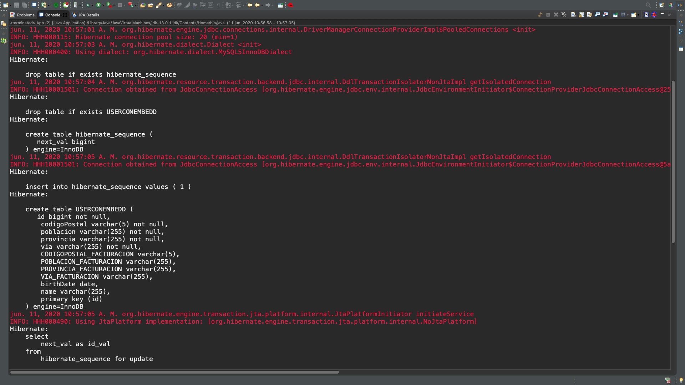

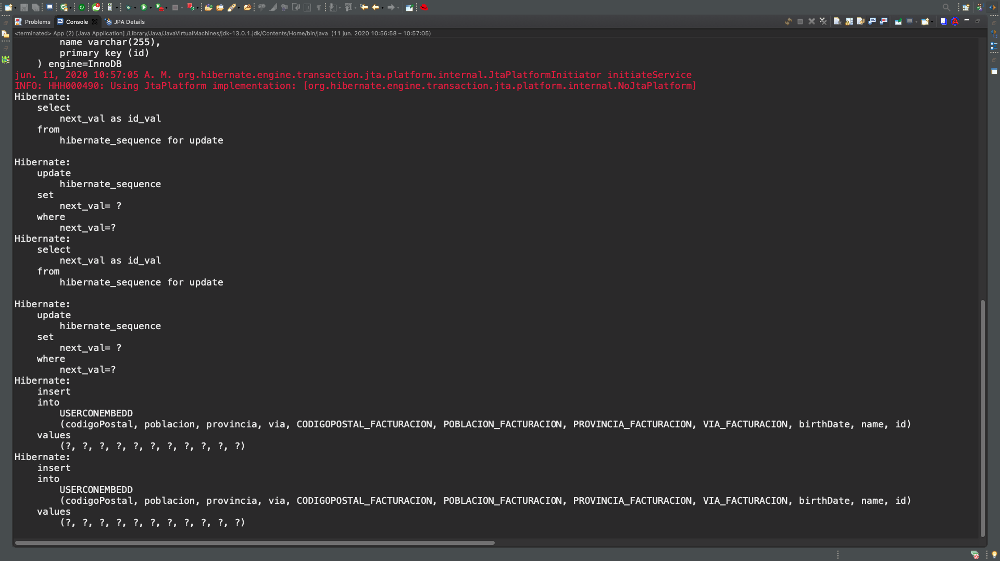

El usuario tiene todos estos campos:

`(codigoPostal, poblacion, provincia, via, CODIGOPOSTAL_FACTURACION, POBLACION_FACTURACION, PROVINCIA_FACTURACION, VIA_FACTURACION, birthDate, name, id)` 

Nosotros solo tenemos las entidades `User` y `Direccion` y esta guardado las dos direcciones con nombres de campos distintos.


Aunque en los próximos capítulos hablaremos más sobre contexto de persistencia unidad de persistencia si destacar ahora el ciclo de vida de la entidad para que no nos perdamos en las próximas lecciones.

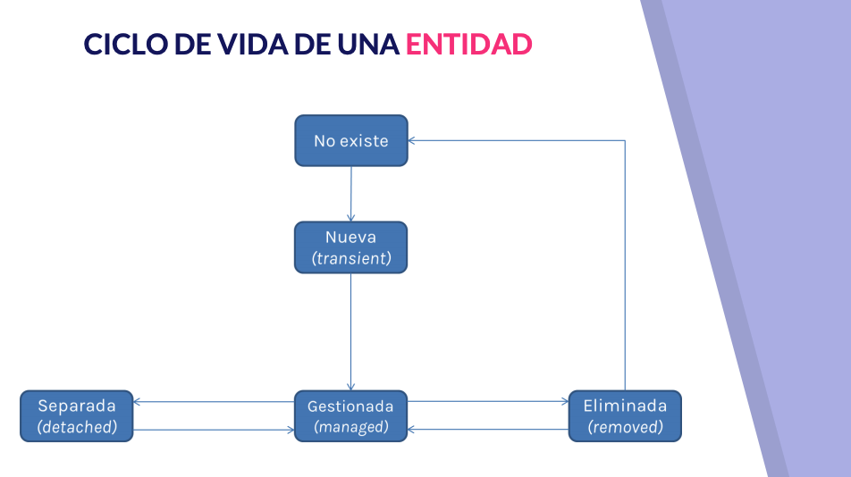

Una entidad puede pasar por estos distintos estados y los distintos métodos de la clase EntityManager nos sirven para cambiar una entidad de un estado a otro. La entidad puede pasar del estado no existe, al cual podemos llegar porque no hemos creado la entidad o la hayamos eliminado a como nueva, esta entidad aun no forma parte del contexto de persistencia por que todavia no esta gestionada para ello la tenemos que persistir, una vez que esta persistida ya sería gestionada por el contexto de persistencia, desde ese punto la podemos separar, ya veremos que existen diferentes causas por ejemplo limpiar la cache o explicitamente la podemos Separar si queremos hacer algún tipo de operación con ella o de Gestionada también podemos pasar a Eliminada si bien desde ambos Separada y Gestionada podemos rescatar esas entidades para que vuelvan a hacer Gestionadas.

En las próximas lecciones lo que hablaremos será de las asociaciones entre entidades para ir poco a poco creando aplicaciones más complejas.

# 09 Mapeo con ficheros XML 14:45 

[Mapeo con ficheros XML](pdfs/07_Mapeo_con_ficheros_XML.pdf)

## Resumen Profesor

En el origen de los ORMs, no existía la posibilidad, como hemos visto en las lecciones anteriores, de mapear las clases de nuestro modelo mediante anotaciones. Esta tarea se realizaba mediante descriptores de ficheros XML. Estos deben incluir toda la información sobre cómo se llamará la tabla, los atributos que incluye, el atributo identificador. Hibernate tiene, de forma nativa, su tipología de ficheros XML, y JPA tiene otro. Veamos una introducción a ambos.

### 7.2 Mapeo con ficheros XML Hibernate (hbm.xml)

Cuando utilizamos XML para mapear nuestras clases debemos crear (normalmente) un fichero XML por cada clase que queramos mapear. Este fichero estará en el mismo paquete de la clase a persistir, o bien junto al fichero hibernate.cfg.xml.

Las Hibernate (JBoss) Tools que instalamos en lecciones anteriores nos facilitarán el trabajo. Tomaremos como punto de partida una copia del proyecto de ejemplo del **Primer proyecto**. La clase a persistir sería la siguiente:

```java
public class User {

    private int id;

    private String userName;

    private String userMessage;

    public int getId() {
        return id;
    }

    public void setId(int id) {
        this.id = id;
    }

    public String getUserName() {
        return userName;
    }

    public void setUserName(String userName) {
        this.userName = userName;
    }

    public String getUserMessage() {
        return userMessage;
    }

    public void setUserMessage(String userMessage) {
        this.userMessage = userMessage;
    }

}
```

Si ahora pulsamos con el botón derecho sobre el proyecto > *New > Others > Hibernate > Hibernate XML Mapping file
(hbm.xml).*

Agregamos la clase `User`.


Y si queremos podemos pulsar sobre finalizar.

Por defecto, eclipse genera el fichero junto con el `.java`. Nosotros lo moveremos junto con el fichero `hibernate.cfg.xml`.

Si consultamos el fichero, Hiberante se ha encargado (por nosotros) de generar el esqueleto del fichero XML.

```xml
<hibernate-mapping>
    <class name="com.openwebinars.hibernate.hibernatexml.User" table="USER">
        <id name="id" type="int">
            <column name="ID" />
            <generator class="assigned" />
        </id>
        <property name="userName" type="java.lang.String">
            <column name="USERNAME" />
        </property>
        <property name="userMessage" type="java.lang.String">
            <column name="USERMESSAGE" />
        </property>
    </class>
</hibernate-mapping>
```

En el fichero de configuración de hibernate, añadimos un elemento `<mapping resource="..." />`, donde el valor del atributo será la ruta hacia el fichero.

### 7.3 Mapeo con ficheros XML JPA (orm.xml)

JPA especifica un mecanismo ligeramente diferente para realizar el mapeo de las entidades mediante XML.

Nos basaremos en el proyecto de ejemplo Primer proyecto JPA. En este caso, podemos añadir el fichero `orm.xml` a través del asistente de eclipse. Pulsamos sobre el proyecto con el botón derecho > *New* > *JPA ORM Mapping file*, y lo situamos junto al fichero de la unidad de persistencia (carpeta META-INF).

Antes de continuar, nos vamos a la unidad de persistencia, y añadimos el fichero `orm.xml`

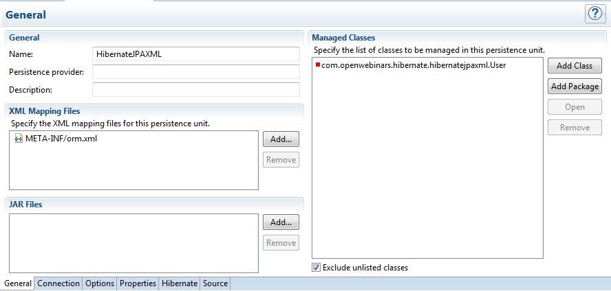

*Añadir a la unidad de persistencia el fichero orm.xml*

Si pasamos a editar el fichero de mapeo, tenemos dos posibilidades:

* Conocer las etiquetas XML necesarias, con sus atributos y su estructura.

* Aprovecharnos de un pequeño ayudante que nos propone eclipse a través del facet JPA.

Al editar el fichero `orm.xml` nos debería aparecer a la derecha una pequeña ventana llamada **JPA Structure** (si no aparece, la podeos visualizar a través de *Window > Show view*).

A través de él, podemos ir añadiendo las etiquetas necesarias para mapear la entidad y sus atributos.

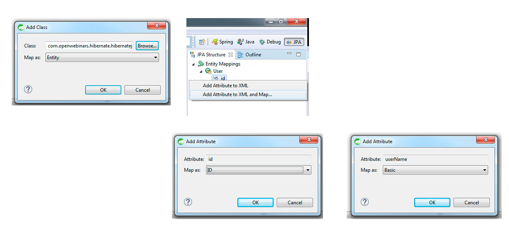

*Asistente de JPA*

La versión (equivalente al ejemplo de hibernate) del fichero sería la siguiente:

```xml
<?xml version="1.0" encoding="UTF-8"?>
<entity-mappings version="2.1"
    xmlns="http://xmlns.jcp.org/xml/ns/persistence/orm" xmlns:xsi="http://www.w3.org/2001/XMLSchema-instance"
    xsi:schemaLocation="http://xmlns.jcp.org/xml/ns/persistence/orm http://xmlns.jcp.org/xml/ns/persistence/orm_2_1.xsd">
    <entity class="com.openwebinars.hibernate.hibernatejpaxml.User">
        <table name="USERHBNXML" />
        <attributes>
            <id name="id">
            </id>
            <basic name="userName">
            </basic>
            <basic name="userMessage">
            </basic>
        </attributes>
    </entity>

</entity-mappings>
```
## Preguntas

P= Al configurar el mapeo en el XML me saltaba un error a la hora de parsear el XML. He sustituido los elementos class por elementos type quedando así :

```html
<hibernate-mapping>
    <class name="com.openwebinars.hibernate.hibernatexml.User" table="User">
        <id name="id" type="int">
            <column name="ID" />
            <generator class="assigned" />
        </id>
        <property name="userName" type="java.lang.String">
            <column name="USERNAME" />
        </property>
        <property name="userMessage" type ="java.lang.String">
            <column name="USERMESSAGE" />
        </property>
    </class>
</hibernate-mapping>
```

¿A qué se puede deber?

R= ¿Te indica algún error en concreto?

P=Esto esta super desactualizado, ahora ya no se mapea con ficheros XML porque se puede hacer de forma muy sencilla con las java anotattions.
Por favor actualizar los cursos!!

R= Efectivamente, no creo que nadie utilice en proyectos nuevos este tipo de mapeo. Por ello, no es el que se usa principalmente a lo largo del curso.

Este tipo de mapeo se explica, en primer lugar, para saber que existe; y en segundo lugar, por si alguna vez trabajáis en algún proyecto con código heredado, algo que es más habitual de lo que parece.

R=Eso lo entiendo, y esta bien una explicación de la configuración de los xml para saber como funciona. Pero vais a subir un curso tanto de spring como hibernate actualizados? tener en cuenta que son los frameworks mas utilizados en desarrollo java y hay empresas en las que no tenemos ya ni un solo proyecto con xml...
Muchas gracias!

R= De Spring hay publicados algunos cursos que utilizan la versión 5.X:

Curso de Spring Boot y Spring Web MVC
Curso de Desarrollo de una API REST con Spring Boot
Curso de Elementos avanzados en tu API REST con Spring Boot
Curso de Seguridad en tu API REST con Spring Boot.
Por ser también adyacentes, también tienes los cursos de Introducción a Thymeleaf y Thymeleaf intermedio.

Un saludo.

## Transcripción

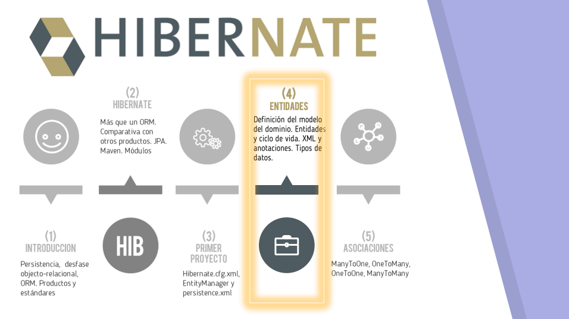

Vamos a continuar con en capítulo 4 en el que estamos aprendiendo a manejar nuestras entidades en este caso en lugar de usar el esquema de definición de entidades a través de anotaciones vamos a definirla a través de XML y vamos a aprender la diferencia entre hacerlo con Hibernate nativo y hacerlo a través de JPA.


En el caso de configuración nativa de Hibernate tenemos que definir algunos ficheros XML en particular podemos hacer incluso uno por cada entidad que queramos definir o podríamos reunir más de una entidad en un fichero XML en definitiva podríamos seguir el esquema que tenemos en pantalla para cada clase Java que queramos considerar como una Entidad lo que hariamos sería fabricar un fichero XML y a través de una serie de descriptores iriamos haciendo el mapeo entre la clase y la tabla correspondiente y cada una de las propiedades y de los atributos que va a tener esa tabla en la base de datos.

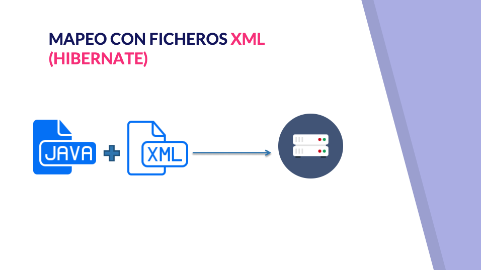

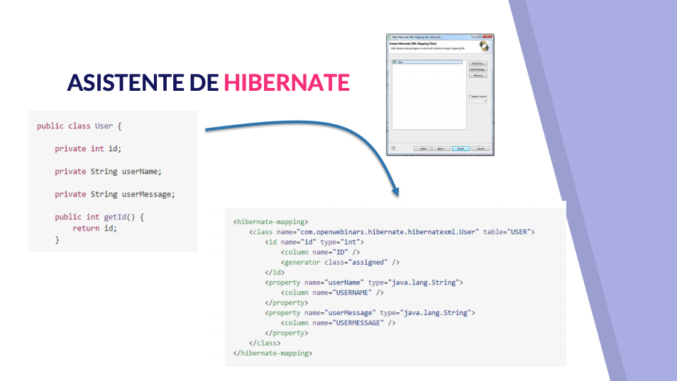

Las Hibernate Tools que instalamos en capítulos anteriores a través de las JBOSS Tools nos permiten utilizar un asistente que va a scanear nuestro código fuente y va a generar ese fichero de mapeo, vamos a ver un ejemplo.

Vamos a partir del proyecto ejemplo de Hibernate que hicimos en lecciones anteriores *Proyecto 130-01-PrimerProyectoHbn* pero sin las anotaciones, cómo podéis comprobar es una clase pojo Java normal y corriente.

```java
package com.openwebinars.hibernate.hibernatexml;

public class User {

	private int id;
	
	private String userName;
	
	private String userMessage;

	public int getId() {
		return id;
	}

	public void setId(int id) {
		this.id = id;
	}

	public String getUserName() {
		return userName;
	}

	public void setUserName(String userName) {
		this.userName = userName;
	}

	public String getUserMessage() {
		return userMessage;
	}

	public void setUserMessage(String userMessage) {
		this.userMessage = userMessage;
	}	
}
```

Como podríamos crear el fichero de mapeo sin tener que hacerlo de forma manual, como decíamos podríamos añadir 

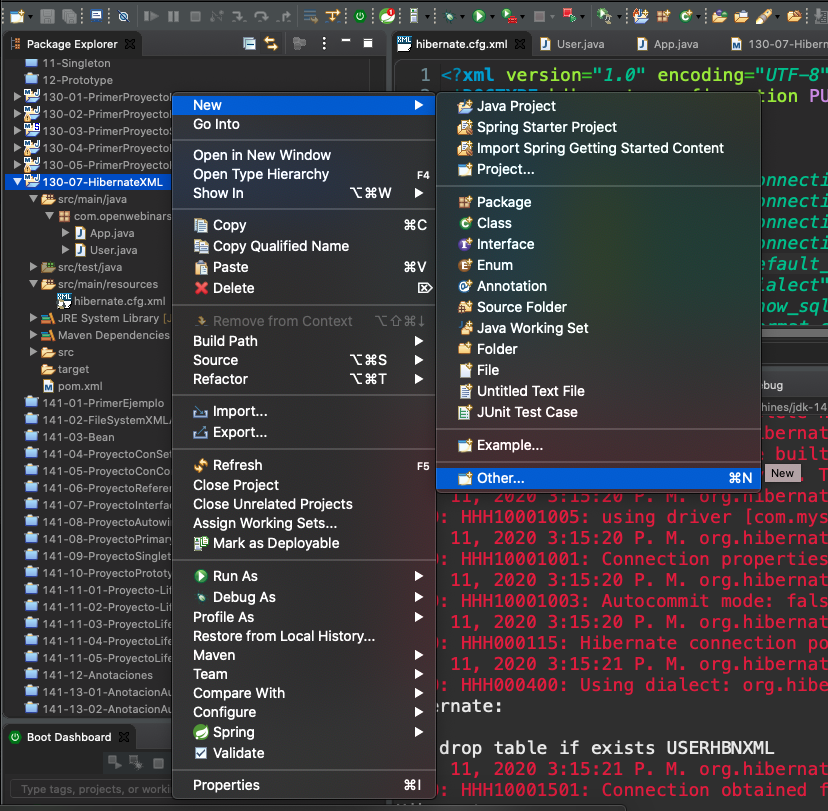

y buscar la generación de un fichero `Hibernate XML Mapping File (hbm.xml)` 

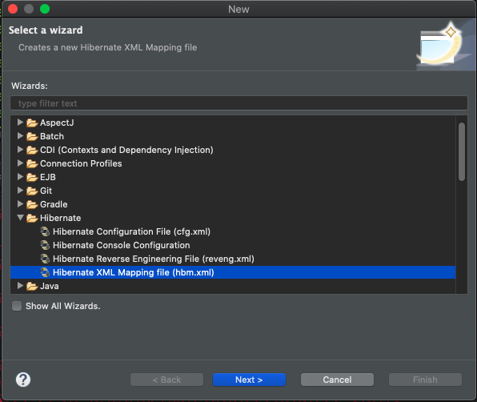

si vamos siguiendo este asistente podremos realizar el proceso.


Presionamos en `Add class` y buscamos la clase User de nuestro proyecto.

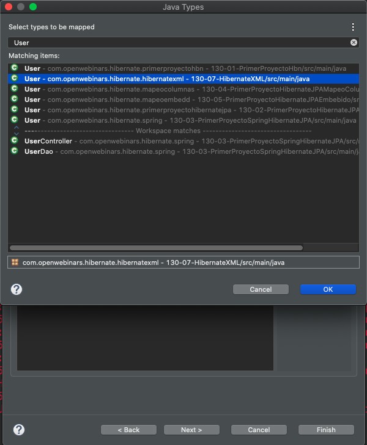

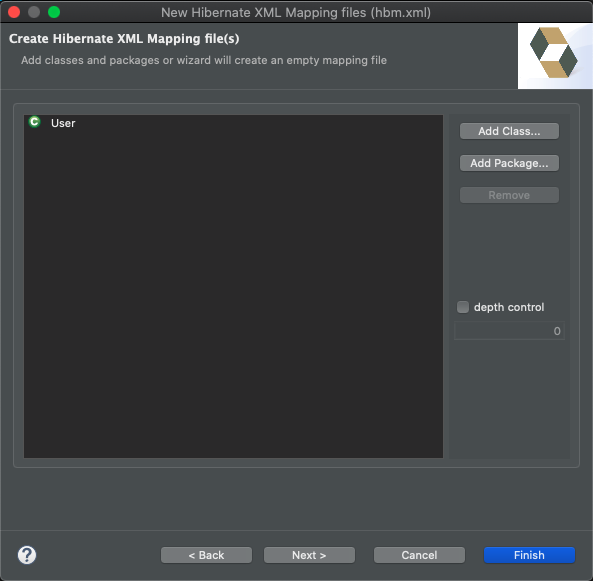

Este paso nos indica los ficheros que va a generar.

Y como podemos apreciar lo crea en la misma ruta donde este el código fuente de Java.

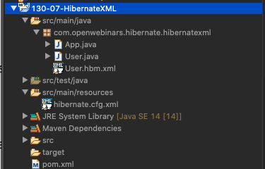

Estos fichero XML necesitan estar dentro del ClassPath para que Hibernate los pueda localizar y pueda efectuar el mapeo con ellos sin embargo nosotros lo vamos a cambiar de carpeta por comodidad por si en alguna ocasión queremos gestionarlos aparte lo vamos a meter dentro de la carpeta de recursos junto con el fichero de configuracion de Hibernate, tan solo tenemos que pinsar, arrastrar y soltar.

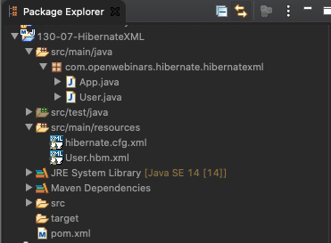

Si examinamos el contenido del fichero.

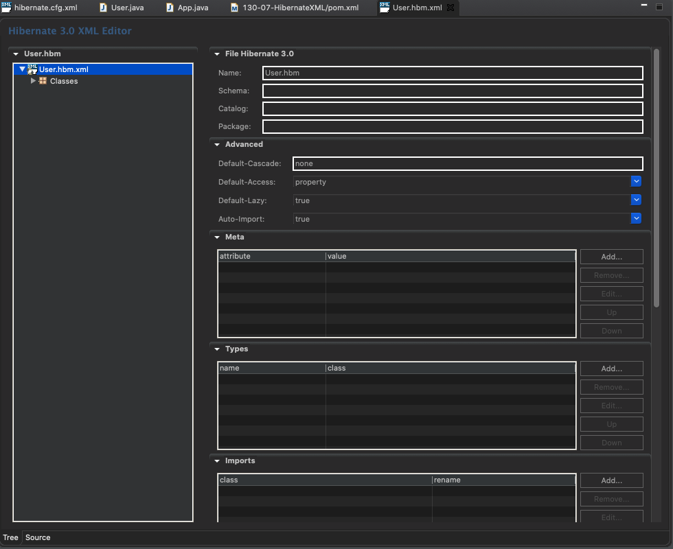

*`User.hbm.xml`*

```html
<?xml version="1.0"?>
<!DOCTYPE hibernate-mapping PUBLIC "-//Hibernate/Hibernate Mapping DTD 3.0//EN"
"http://hibernate.sourceforge.net/hibernate-mapping-3.0.dtd">
<!-- Generated 11 jun. 2020 16:00:17 by Hibernate Tools 3.5.0.Final -->
<hibernate-mapping>
    <class name="com.openwebinars.hibernate.hibernatexml.User" table="USER">
        <id name="id" type="int">
            <column name="ID" />
            <generator class="assigned" />
        </id>
        <property name="userName" type="java.lang.String">
            <column name="USERNAME" />
        </property>
        <property name="userMessage" type="java.lang.String">
            <column name="USERMESSAGE" />
        </property>
    </class>
</hibernate-mapping>
```

Hibernate además nos proponen un asistente, una pantalla específica para poder examinarlo dónde tenemos la lista de clase que están descritas dentro del fichero XML y alguna serie de propiedades sobre ellas, si bien también podemos examinar el código fuente.

Como podéis ver ha generado un fichero de XML que tiene distintas entidades `<hibernate-mapping>` recoje las clases que hay dentro del fichero, con el nombre cualifido de la clase, el nombre que va a tener la tabla, el atributo que va a ser `Id`, el nombre de la correspondiente columna, el tipo de generador que va a utilizar que ha sido asignada por defecto y las propiedades que incluye. 

Aquí podríamos añadir las que correspondieran si es que queremos hacer algún tipo de customización en el proceso de generación de este fichero.

¿Qué nos quedaría? En el fichero de configuración de Hibernate no hace referencia de modo alguno todavía a esa clase que acabamos de mapear a través del fichero XML.

*`hibernate.cfg.xml`*

```java
<?xml version="1.0" encoding="UTF-8"?>
<!DOCTYPE hibernate-configuration PUBLIC "-//Hibernate/Hibernate Configuration DTD 3.0//EN"
                                         "http://www.hibernate.org/dtd/hibernate-configuration-3.0.dtd">
<hibernate-configuration>
 <session-factory>
  <property name="hibernate.connection.driver_class">com.mysql.jdbc.Driver</property>
  <property name="hibernate.connection.password">12345678</property>
  <property name="hibernate.connection.url">jdbc:mysql://localhost/hibernate</property>
  <property name="hibernate.connection.username">openwebinars</property>
  <property name="hibernate.default_schema">hibernate</property>
  <property name="hibernate.dialect">org.hibernate.dialect.MySQL5InnoDBDialect</property>
  <property name="hibernate.show_sql">true</property>
  <property name="hibernate.format_sql">true</property>
  <property name="hibernate.hbm2ddl.auto">create</property>
  <mapping class="com.openwebinars.hibernate.hibernatexml.User"/>
  <mapping resource="User.hbm.xml"/>
 </session-factory>
</hibernate-configuration>
```

Si nos venimos al fichero de configuración de Hibernate lo podemos hacer a través del asistente.

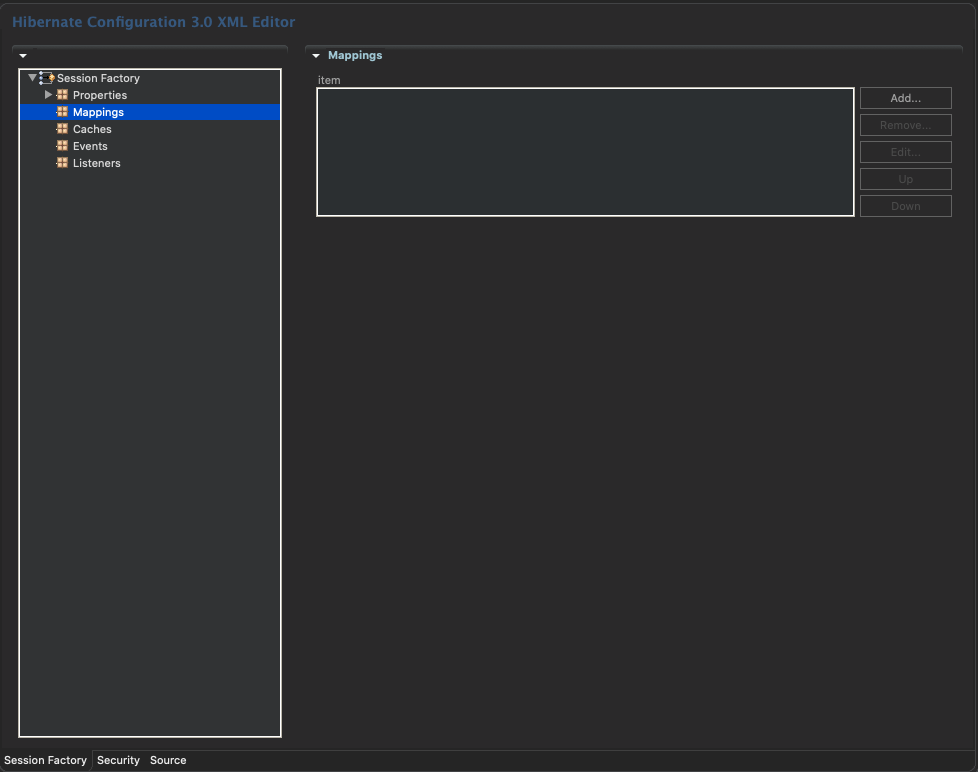

Vamos a presionar Add 

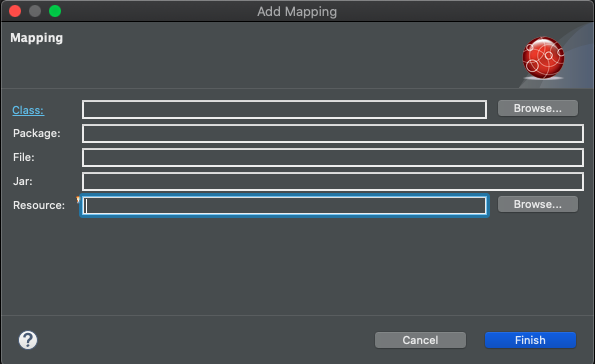

y ahora lo vamos a añadir a través de un recurso.

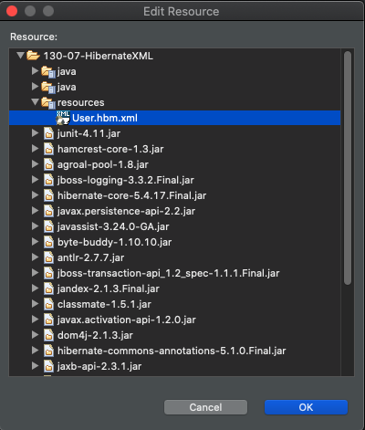

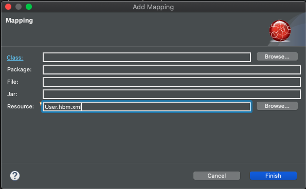

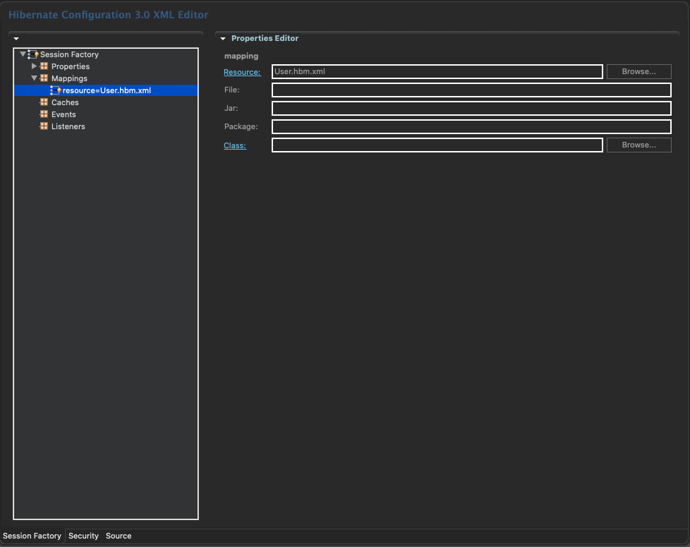

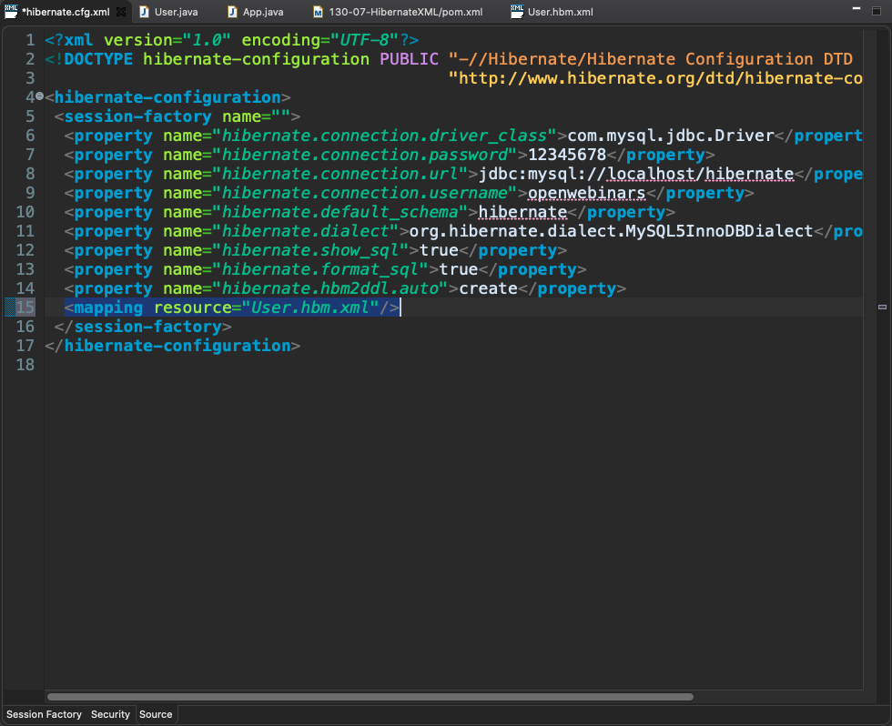

De esta manera lo que estamos mapeando sería el recurso XML que no es lo mismo que mapear la clase, porque en este recurso ya se nos marca la clase con la que se está haciendo el mapeo directamente con lo cual cerrariamos la cadena que nos va a hacer que podamos identificar como entidad una clase Java.

El código de la aplicación es el mismo que cuando lo hicimos de ejemplo, vamos ejecutarlo como aplicación Java.

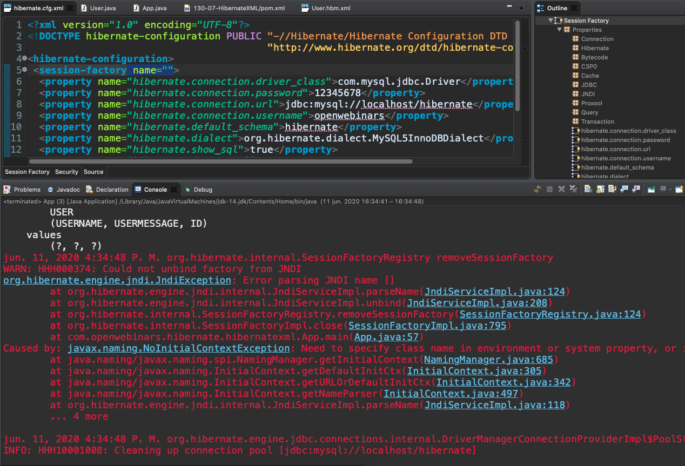

Se nos presenta un error que ya sabemos como resolver. Volvemos a ejecutar.

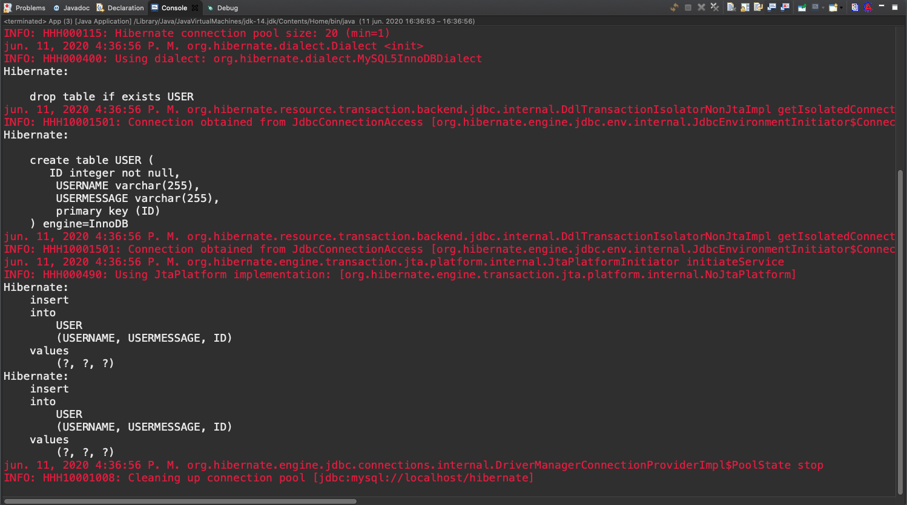

Ha creado la tabla correctamente a insertado los datos, podemos comprobarlo en Workbeanch.

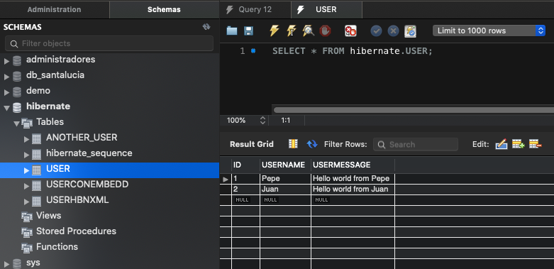

En lugar de haber usado anotaciones hemos usado un descriptor XML que ha generado nuestro asistente.

### :computer: Código Completo - Proyecto 130-07-HibernateXML

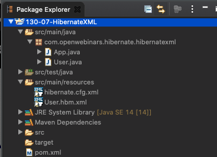

*`pom.xml`*

```html
<?xml version="1.0" encoding="UTF-8"?>

<project xmlns="http://maven.apache.org/POM/4.0.0"
	xmlns:xsi="http://www.w3.org/2001/XMLSchema-instance"
	xsi:schemaLocation="http://maven.apache.org/POM/4.0.0 http://maven.apache.org/xsd/maven-4.0.0.xsd">
	<modelVersion>4.0.0</modelVersion>

	<groupId>com.openwebinars.hibernate</groupId>
	<artifactId>130-01-PrimerProyectoHbn</artifactId>
	<version>0.0.1-SNAPSHOT</version>

	<name>130-01-PrimerProyectoHbn</name>
	<!-- FIXME change it to the project's website -->
	<url>http://www.example.com</url>

	<properties>
		<project.build.sourceEncoding>UTF-8</project.build.sourceEncoding>
		<maven.compiler.source>1.7</maven.compiler.source>
		<maven.compiler.target>1.7</maven.compiler.target>
	</properties>

	<dependencies>
		<dependency>
			<groupId>junit</groupId>
			<artifactId>junit</artifactId>
			<version>4.11</version>
			<scope>test</scope>
		</dependency>
		<dependency>
			<groupId>org.hibernate</groupId>
			<artifactId>hibernate-agroal</artifactId>
			<version>5.4.17.Final</version>
			<type>pom</type>
		</dependency>
		<!-- https://mvnrepository.com/artifact/mysql/mysql-connector-java -->
		<dependency>
			<groupId>mysql</groupId>
			<artifactId>mysql-connector-java</artifactId>
			<version>8.0.20</version>
		</dependency>
	</dependencies>

	<build>
		<pluginManagement><!-- lock down plugins versions to avoid using Maven 
				defaults (may be moved to parent pom) -->
			<plugins>
				<!-- clean lifecycle, see https://maven.apache.org/ref/current/maven-core/lifecycles.html#clean_Lifecycle -->
				<plugin>
					<artifactId>maven-clean-plugin</artifactId>
					<version>3.1.0</version>
				</plugin>
				<!-- default lifecycle, jar packaging: see https://maven.apache.org/ref/current/maven-core/default-bindings.html#Plugin_bindings_for_jar_packaging -->
				<plugin>
					<artifactId>maven-resources-plugin</artifactId>
					<version>3.0.2</version>
				</plugin>
				<plugin>
					<artifactId>maven-compiler-plugin</artifactId>
					<version>3.8.0</version>
				</plugin>
				<plugin>
					<artifactId>maven-surefire-plugin</artifactId>
					<version>2.22.1</version>
				</plugin>
				<plugin>
					<artifactId>maven-jar-plugin</artifactId>
					<version>3.0.2</version>
				</plugin>
				<plugin>
					<artifactId>maven-install-plugin</artifactId>
					<version>2.5.2</version>
				</plugin>
				<plugin>
					<artifactId>maven-deploy-plugin</artifactId>
					<version>2.8.2</version>
				</plugin>
				<!-- site lifecycle, see https://maven.apache.org/ref/current/maven-core/lifecycles.html#site_Lifecycle -->
				<plugin>
					<artifactId>maven-site-plugin</artifactId>
					<version>3.7.1</version>
				</plugin>
				<plugin>
					<artifactId>maven-project-info-reports-plugin</artifactId>
					<version>3.0.0</version>
				</plugin>
			</plugins>
		</pluginManagement>
	</build>
</project>
```

*`hibernate.cfg.xml`*

```java
<?xml version="1.0" encoding="UTF-8"?>
<!DOCTYPE hibernate-configuration PUBLIC "-//Hibernate/Hibernate Configuration DTD 3.0//EN"
                                         "http://www.hibernate.org/dtd/hibernate-configuration-3.0.dtd">
<hibernate-configuration>
 <session-factory>
  <property name="hibernate.connection.driver_class">com.mysql.jdbc.Driver</property>
  <property name="hibernate.connection.password">12345678</property>
  <property name="hibernate.connection.url">jdbc:mysql://localhost/hibernate</property>
  <property name="hibernate.connection.username">openwebinars</property>
  <property name="hibernate.default_schema">hibernate</property>
  <property name="hibernate.dialect">org.hibernate.dialect.MySQL5InnoDBDialect</property>
  <property name="hibernate.show_sql">true</property>
  <property name="hibernate.format_sql">true</property>
  <property name="hibernate.hbm2ddl.auto">create</property>
  <mapping resource="User.hbm.xml"/>
 </session-factory>
</hibernate-configuration>
```

*`User.hbm.xml`*

```java
<?xml version="1.0"?>
<!DOCTYPE hibernate-mapping PUBLIC "-//Hibernate/Hibernate Mapping DTD 3.0//EN"
"http://hibernate.sourceforge.net/hibernate-mapping-3.0.dtd">
<!-- Generated 11 jun. 2020 16:00:17 by Hibernate Tools 3.5.0.Final -->
<hibernate-mapping>
    <class name="com.openwebinars.hibernate.hibernatexml.User" table="USER">
        <id name="id" type="int">
            <column name="ID" />
            <generator class="assigned" />
        </id>
        <property name="userName" type="java.lang.String">
            <column name="USERNAME" />
        </property>
        <property name="userMessage" type="java.lang.String">
            <column name="USERMESSAGE" />
        </property>
    </class>
</hibernate-mapping>
```

*`User.java`*

```java
package com.openwebinars.hibernate.hibernatexml;

public class User {

	private int id;
	
	private String userName;
	
	private String userMessage;

	public int getId() {
		return id;
	}

	public void setId(int id) {
		this.id = id;
	}

	public String getUserName() {
		return userName;
	}

	public void setUserName(String userName) {
		this.userName = userName;
	}

	public String getUserMessage() {
		return userMessage;
	}

	public void setUserMessage(String userMessage) {
		this.userMessage = userMessage;
	}
	
}
```

*`App.java`*

```java
package com.openwebinars.hibernate.hibernatexml;

import org.hibernate.Session;
import org.hibernate.SessionFactory;
import org.hibernate.boot.MetadataSources;
import org.hibernate.boot.registry.StandardServiceRegistry;
import org.hibernate.boot.registry.StandardServiceRegistryBuilder;

/**
 * Mapeo de entidades con ficheros XML (Hibernate nativo)
 * www.openwebinars.net
 * @LuisMLopezMag
 *
 */
public class App {
	public static void main(String[] args) {
		
		
		// Inicializamos un objeto SessionFactory con la configuración
		// del fichero hibernate.cfg.xml
		StandardServiceRegistry sr = new StandardServiceRegistryBuilder()
				.configure()
				.build();
		SessionFactory sf = new MetadataSources(sr).buildMetadata().buildSessionFactory();
		
		
		//Legacy
		//SessionFactory sf = new Configuration().configure().buildSessionFactory();

		// Iniciamos una sesión
		Session session = sf.openSession();

		// Construimos un objeto de tipo User
		User user1 = new User();
		user1.setId(1);
		user1.setUserName("Pepe");
		user1.setUserMessage("Hello world from Pepe");

		// Construimos otro objeto de tipo User
		User user2 = new User();
		user2.setId(2);
		user2.setUserName("Juan");
		user2.setUserMessage("Hello world from Juan");

		// Iniciamos una transacción dentro de la sesión
		session.beginTransaction();

		// Almacenamos los objetos
		session.save(user1);
		session.save(user2);

		// Commiteamos la transacción
		session.getTransaction().commit();

		// Cerramos todos los objetos
		session.close();
		sf.close();
	}
}
```


Esto con hibernate nativo pero que hay del uso de XML con JPA.

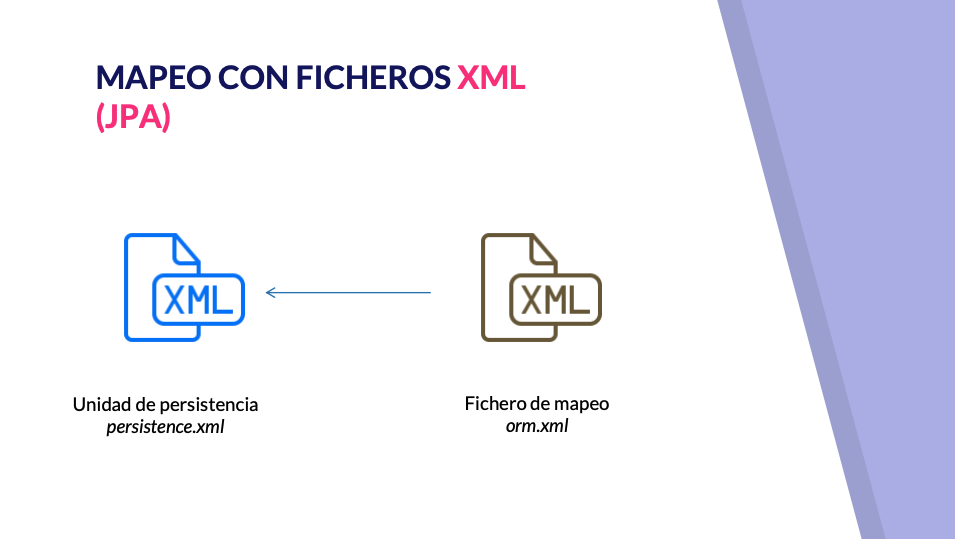

En este caso a nuestra unidad de persistencia le tenemos que asociar un fichero de mapeo dónde vamos a realizar ese  mapeo que se suele llamar `orm.xml` y acompañando a la unidad de persistencia este fichero de mapeo hará las mismas tareas, la dificultad que tenemos es que no encontramos para trabajar con Hibernate, Eclipse o Spring Tool Suite ese asistente tan magnífico que teníamos como Hibernate con lo cual vamos a tener que hacer nosotros parte de esa tarea.

Vamos a partir del ejemplo del que ya hicimos cómo primer proyecto de JPA *130-02-PrimerProyectoHibernateJPA* en el ya teníamos definido nuestra unidad de persistencia con las propiedades del ejemplo anterior:

*`persistence.xml`*

```html
<?xml version="1.0" encoding="UTF-8"?>
<persistence version="2.1" xmlns="http://xmlns.jcp.org/xml/ns/persistence" xmlns:xsi="http://www.w3.org/2001/XMLSchema-instance" xsi:schemaLocation="http://xmlns.jcp.org/xml/ns/persistence http://xmlns.jcp.org/xml/ns/persistence/persistence_2_1.xsd">
	<persistence-unit name="PrimerEjemploHibernateJPA" transaction-type="RESOURCE_LOCAL">
		<class>com.openwebinars.hibernate.primerproyectohibernatejpa.User</class>
		<exclude-unlisted-classes>true</exclude-unlisted-classes>
		<properties>
			<property name="javax.persistence.jdbc.url" value="jdbc:mysql://localhost:3306/hibernate"/>
			<property name="javax.persistence.jdbc.user" value="openwebinars"/>
			<property name="javax.persistence.jdbc.password" value="12345678"/>
			<property name="javax.persistence.jdbc.driver" value="com.mysql.jdbc.Driver"/>
			<property name="hibernate.dialect" value="org.hibernate.dialect.MySQL5InnoDBDialect"/>
			<property name="hibernate.connection.driver_class" value="com.mysql.jdbc.Driver"/>
			<property name="hibernate.hbm2ddl.auto" value="create"/>
			<property name="hibernate.show_sql" value="true"/>
			<property name="hibernate.format_sql" value="true"/>
		</properties>
	</persistence-unit>
</persistence>
```

En este caso tenemos aquí la clase `User` a la cual le hemos quitado las notaciones y al que vamos a crear como un proyecto JPA pero donde el manualmente.

```java
package com.openwebinars.hibernate.hibernatejpaxml;

public class User {

	private int id;

	private String userName;

	private String userMessage;

	public int getId() {
		return id;
	}

	public void setId(int id) {
		this.id = id;
	}

	public String getUserName() {
		return userName;
	}

	public void setUserName(String userName) {
		this.userName = userName;
	}

	public String getUserMessage() {
		return userMessage;
	}

	public void setUserMessage(String userMessage) {
		this.userMessage = userMessage;
	}

}
```

Para ello si tenemos activa la vista de JPA y le damos a crear nuevo nos permite usar la opción de JPA ORM Mapping File.

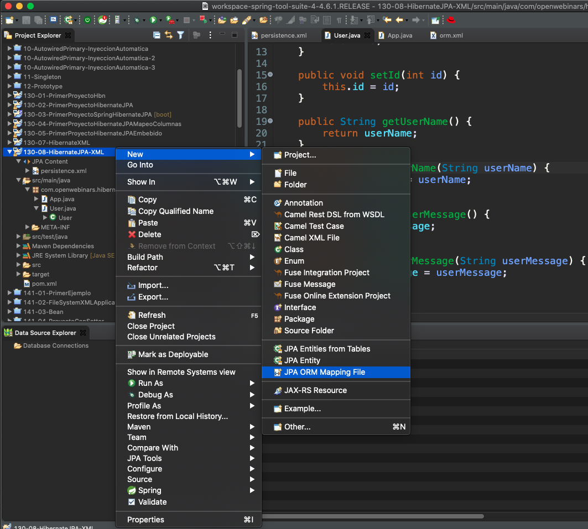

que nos va a permitir crear ese fichero

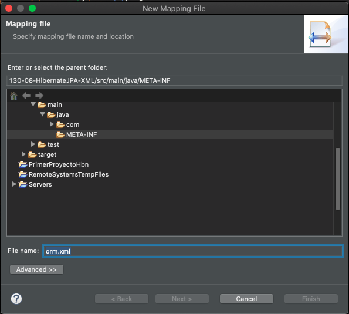

lo guardamos en la caepeta META-INF que es donde esta realmente guardado el fichero de la definición de la unidad de persistencia.

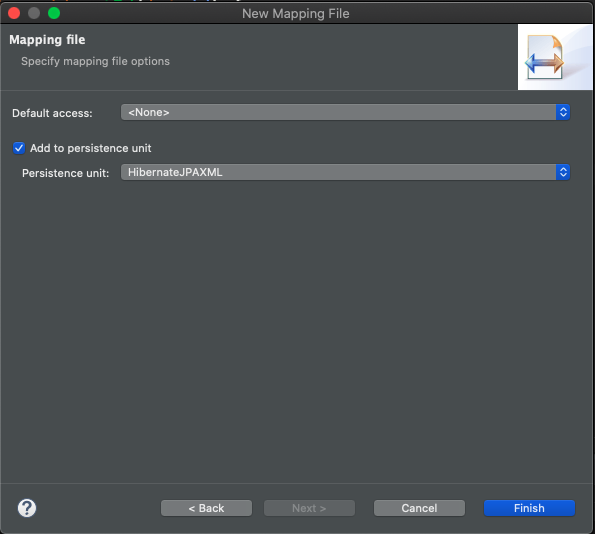

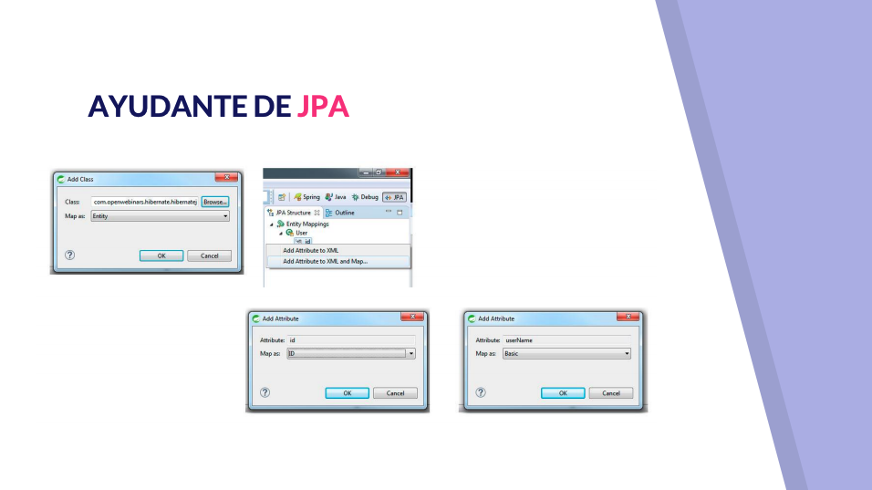

Le asociamos la unida de persistencia del proyecto y vamos hacia adelante.


Por defecto Eclipse nos ábre `orm.xml` con la pantalla que tiene para ir creando fichero XML genéricos, quisa a algunos les pueda resultar útil pero lo es poco, tenemos dos opciones o lo vamos haciendo vía el código fuente del fichero con lo cual estamos obligados a conocer las etiquetas o lo vamos haciedo de la vista JPA Structure que tenemos a la derecha:

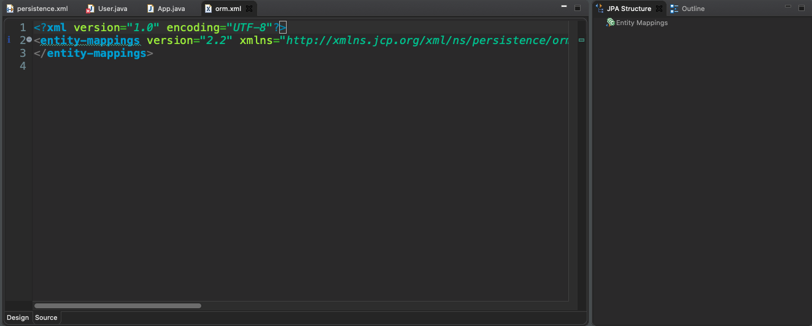

Si no apareciera esa vista podemos resetear la pespectiva o vien la podemos mostrar a través de Windows - Show - View - Other y la podríamos buscar. Esta pequeña vista nos va a servir para ir mapeando Entidades. Sobre el elemento raíz podemos pulsar con el botón derecho para añadir una clase:


y la podríamos buscar 

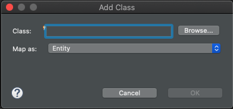

nuestra clase era `User`

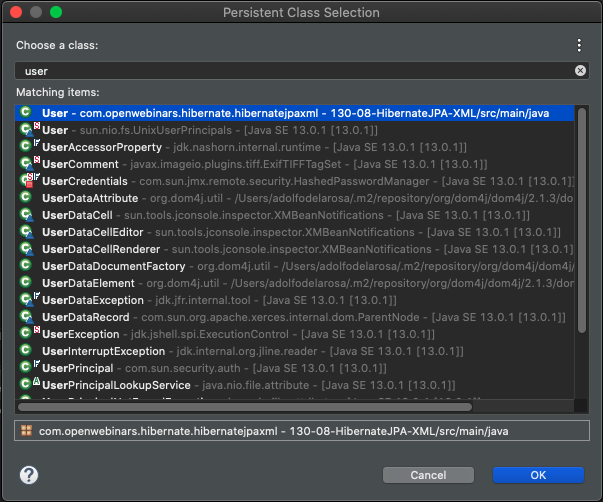

la podemos mapear como entidad

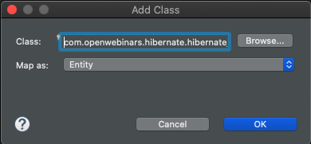

```html
<?xml version="1.0" encoding="UTF-8"?>
<entity-mappings version="2.2" xmlns="http://xmlns.jcp.org/xml/ns/persistence/orm" xmlns:xsi="http://www.w3.org/2001/XMLSchema-instance" xsi:schemaLocation="http://xmlns.jcp.org/xml/ns/persistence/orm http://xmlns.jcp.org/xml/ns/persistence/orm_2_2.xsd">
	<entity class="com.openwebinars.hibernate.hibernatejpaxml.User">
	</entity>
</entity-mappings>
```

una vez mapeada la clase podemos ir mapeando los distintos atributos.

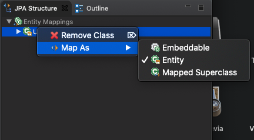

como podemos comprobar si los desplegamos los tenemos aquí

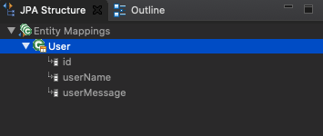

y ahora para mapearlos le damos a la segunda opción.

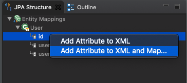

Tenemos varias opciones de mapeo.

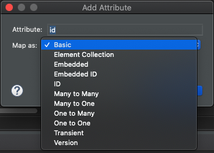

Basic tiene una anotación que no vimos por que es una anotación que se añade por defecto, eso indica que es un valor básico. En este caso tiene que ser ID.

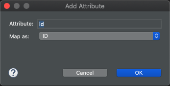

```html
<?xml version="1.0" encoding="UTF-8"?>
<entity-mappings version="2.2" xmlns="http://xmlns.jcp.org/xml/ns/persistence/orm" xmlns:xsi="http://www.w3.org/2001/XMLSchema-instance" xsi:schemaLocation="http://xmlns.jcp.org/xml/ns/persistence/orm http://xmlns.jcp.org/xml/ns/persistence/orm_2_2.xsd">
	<entity class="com.openwebinars.hibernate.hibernatejpaxml.User">
		<attributes>
			<id name="id">
			</id>
		</attributes>
	</entity>
	
</entity-mappings>
```

Como ven ya lo añade a los atributos como `id`, lo podríamos eliminar o cambiar el tipo de mapeo.

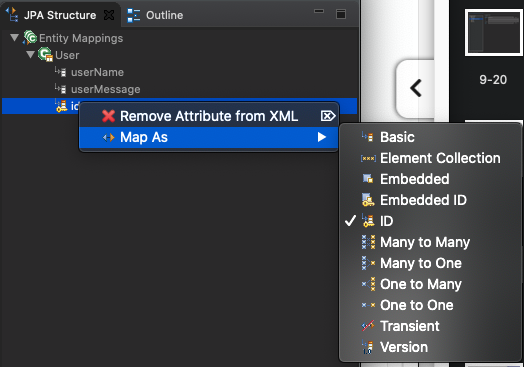

Vamos añadir `userName` y `userMessage` como atributos básicos.

```html
<?xml version="1.0" encoding="UTF-8"?>
<entity-mappings version="2.2" xmlns="http://xmlns.jcp.org/xml/ns/persistence/orm" xmlns:xsi="http://www.w3.org/2001/XMLSchema-instance" xsi:schemaLocation="http://xmlns.jcp.org/xml/ns/persistence/orm http://xmlns.jcp.org/xml/ns/persistence/orm_2_2.xsd">
	<entity class="com.openwebinars.hibernate.hibernatejpaxml.User">
		<attributes>
			<id name="id">
			</id>
			<basic name="userName">
			</basic>
			<basic name="userMessage">
			</basic>
		</attributes>
	</entity>
	
</entity-mappings>
```

Ya tendriamos definido nuestro fichero, aunque tengamos el asistente hay algunas opciones que no las podemos manejar desde el mismo, cómo es añadir un elemento table por ejemplo, en el que podríamos decir el que está entidad sea mapeada a otra tabla o nombre de tabla distinto sin embargo, si nos venimos al código e intentamos utilizar el auto completar  cómo Eclipse esta escaneando la definición del documento que hemos marcado en el elemento de cabecera de XML, nos propone algunos y podríamos buscar

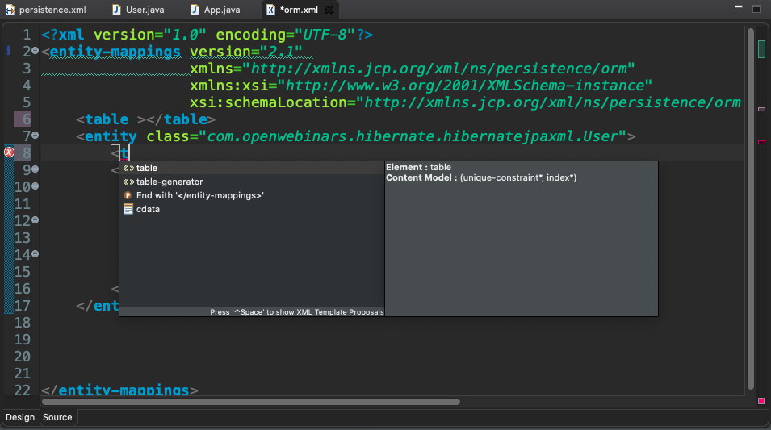

y dentro del elemento table podrías buscar su propiedad `name` vamos a cambiar el nombre a `USERHBNXML` ya tenemos hecho nuestro fichero de Mapeo de entidades. 

```html
<?xml version="1.0" encoding="UTF-8"?>
<entity-mappings version="2.1" 
                 xmlns="http://xmlns.jcp.org/xml/ns/persistence/orm" 
                 xmlns:xsi="http://www.w3.org/2001/XMLSchema-instance"
	             xsi:schemaLocation="http://xmlns.jcp.org/xml/ns/persistence/orm http://xmlns.jcp.org/xml/ns/persistence/orm_2_1.xsd">
	
	<entity class="com.openwebinars.hibernate.hibernatejpaxml.User">
		<table name="USERHBNXML" />
		<attributes>
			<id name="id">
			</id>
			<basic name="userName">
			</basic>
			<basic name="userMessage">
			</basic>
		</attributes>
	</entity>


</entity-mappings>
```

¿Qué nos quedaría?

Nos queda comprobar si este fichero se ha mapeado en el XML de la unidad de persistence.xml.

```html
<?xml version="1.0" encoding="UTF-8"?>
<persistence version="2.1" xmlns="http://xmlns.jcp.org/xml/ns/persistence" xmlns:xsi="http://www.w3.org/2001/XMLSchema-instance" xsi:schemaLocation="http://xmlns.jcp.org/xml/ns/persistence http://xmlns.jcp.org/xml/ns/persistence/persistence_2_1.xsd">
	<persistence-unit name="HibernateJPAXML" transaction-type="RESOURCE_LOCAL">
		<mapping-file>META-INF/orm.xml</mapping-file>
		<class>com.openwebinars.hibernate.hibernatejpaxml.User</class>
		<exclude-unlisted-classes>true</exclude-unlisted-classes>
		<properties>
			<property name="javax.persistence.jdbc.url" value="jdbc:mysql://localhost:3306/hibernate"/>
			<property name="javax.persistence.jdbc.user" value="openwebinars"/>
			<property name="javax.persistence.jdbc.password" value="12345678"/>
			<property name="javax.persistence.jdbc.driver" value="com.mysql.jdbc.Driver"/>
			<property name="hibernate.dialect" value="org.hibernate.dialect.MySQL5InnoDBDialect"/>
			<property name="hibernate.connection.driver_class" value="com.mysql.jdbc.Driver"/>
			<property name="hibernate.hbm2ddl.auto" value="create"/>
			<property name="hibernate.show_sql" value="true"/>
			<property name="hibernate.format_sql" value="true"/>
		</properties>
	</persistence-unit>
</persistence>
```

Podemos que si se ha incluido al generarlo a través de Eclipse y no hacerlo manualmente a quedado añadido.

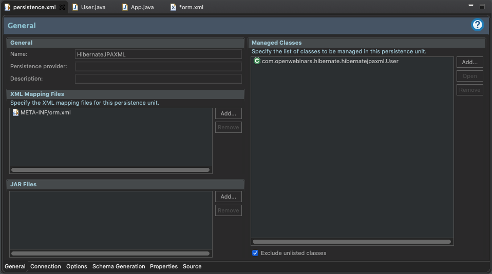

Aquí también lo podemos visualizar.

Vamos a comprobar que nuestra aplicación que creaba va a generar una nueva tabla que se va a llamar `USERHBNXML`.

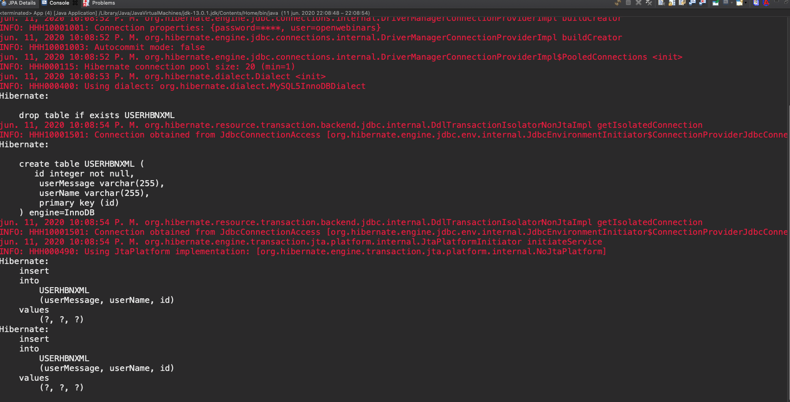

Se ha creado la tabla, se ha creado una columna `id`, `userName` y `userMessage` con la clave primaria correspondiente y se han insertado los registros, lo comprobamos en Workbeanch.

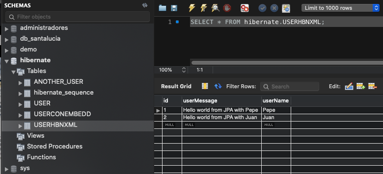

En esta lección hemos podido comprobar como el mapeo a traves de descriptores XML funciona igual que las anotaciones escoger uno u otro dependera en función de lo comodo que nos sintamos trabajando con XML o con anotaciones.

### :computer: Código Completo - 130-08-HibernateJPA-XML

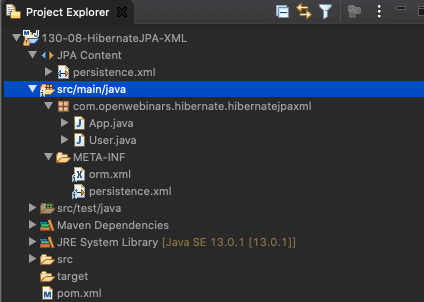

*`pom.xml`*

```html
<?xml version="1.0" encoding="UTF-8"?>

<project xmlns="http://maven.apache.org/POM/4.0.0"
	xmlns:xsi="http://www.w3.org/2001/XMLSchema-instance"
	xsi:schemaLocation="http://maven.apache.org/POM/4.0.0 http://maven.apache.org/xsd/maven-4.0.0.xsd">
	<modelVersion>4.0.0</modelVersion>

	<groupId>com.openwebinars.hibernate</groupId>
	<artifactId>PrimerProyectoHibernateJPA</artifactId>
	<version>0.0.1-SNAPSHOT</version>

	<name>PrimerProyectoHibernateJPA</name>
	<!-- FIXME change it to the project's website -->
	<url>http://www.example.com</url>

	<properties>
		<project.build.sourceEncoding>UTF-8</project.build.sourceEncoding>
		<maven.compiler.source>1.7</maven.compiler.source>
		<maven.compiler.target>1.7</maven.compiler.target>
	</properties>

	<dependencies>
		<dependency>
			<groupId>junit</groupId>
			<artifactId>junit</artifactId>
			<version>4.11</version>
			<scope>test</scope>
		</dependency>
		<dependency>
			<groupId>org.hibernate</groupId>
			<artifactId>hibernate-entitymanager</artifactId>
			<version>5.4.17.Final</version>
		</dependency>
		<!-- https://mvnrepository.com/artifact/mysql/mysql-connector-java -->
		<dependency>
			<groupId>mysql</groupId>
			<artifactId>mysql-connector-java</artifactId>
			<version>8.0.20</version>
		</dependency>
	</dependencies>

	<build>
		<pluginManagement><!-- lock down plugins versions to avoid using Maven 
				defaults (may be moved to parent pom) -->
			<plugins>
				<!-- clean lifecycle, see https://maven.apache.org/ref/current/maven-core/lifecycles.html#clean_Lifecycle -->
				<plugin>
					<artifactId>maven-clean-plugin</artifactId>
					<version>3.1.0</version>
				</plugin>
				<!-- default lifecycle, jar packaging: see https://maven.apache.org/ref/current/maven-core/default-bindings.html#Plugin_bindings_for_jar_packaging -->
				<plugin>
					<artifactId>maven-resources-plugin</artifactId>
					<version>3.0.2</version>
				</plugin>
				<plugin>
					<artifactId>maven-compiler-plugin</artifactId>
					<version>3.8.0</version>
				</plugin>
				<plugin>
					<artifactId>maven-surefire-plugin</artifactId>
					<version>2.22.1</version>
				</plugin>
				<plugin>
					<artifactId>maven-jar-plugin</artifactId>
					<version>3.0.2</version>
				</plugin>
				<plugin>
					<artifactId>maven-install-plugin</artifactId>
					<version>2.5.2</version>
				</plugin>
				<plugin>
					<artifactId>maven-deploy-plugin</artifactId>
					<version>2.8.2</version>
				</plugin>
				<!-- site lifecycle, see https://maven.apache.org/ref/current/maven-core/lifecycles.html#site_Lifecycle -->
				<plugin>
					<artifactId>maven-site-plugin</artifactId>
					<version>3.7.1</version>
				</plugin>
				<plugin>
					<artifactId>maven-project-info-reports-plugin</artifactId>
					<version>3.0.0</version>
				</plugin>
			</plugins>
		</pluginManagement>
	</build>
</project>
```

*`orx.xml`*

```html
<?xml version="1.0" encoding="UTF-8"?>
<entity-mappings version="2.1" 
                 xmlns="http://xmlns.jcp.org/xml/ns/persistence/orm" 
                 xmlns:xsi="http://www.w3.org/2001/XMLSchema-instance"
	             xsi:schemaLocation="http://xmlns.jcp.org/xml/ns/persistence/orm http://xmlns.jcp.org/xml/ns/persistence/orm_2_1.xsd">
	
	<entity class="com.openwebinars.hibernate.hibernatejpaxml.User">
		<table name="USERHBNXML" />
		<attributes>
			<id name="id">
			</id>
			<basic name="userName">
			</basic>
			<basic name="userMessage">
			</basic>
		</attributes>
	</entity>


</entity-mappings>
```

*`persistence.xml`*

```html
<?xml version="1.0" encoding="UTF-8"?>
<persistence version="2.1" xmlns="http://xmlns.jcp.org/xml/ns/persistence" xmlns:xsi="http://www.w3.org/2001/XMLSchema-instance" xsi:schemaLocation="http://xmlns.jcp.org/xml/ns/persistence http://xmlns.jcp.org/xml/ns/persistence/persistence_2_1.xsd">
	<persistence-unit name="HibernateJPAXML" transaction-type="RESOURCE_LOCAL">
		<mapping-file>META-INF/orm.xml</mapping-file>
		<class>com.openwebinars.hibernate.hibernatejpaxml.User</class>
		<exclude-unlisted-classes>true</exclude-unlisted-classes>
		<properties>
			<property name="javax.persistence.jdbc.url" value="jdbc:mysql://localhost:3306/hibernate"/>
			<property name="javax.persistence.jdbc.user" value="openwebinars"/>
			<property name="javax.persistence.jdbc.password" value="12345678"/>
			<property name="javax.persistence.jdbc.driver" value="com.mysql.jdbc.Driver"/>
			<property name="hibernate.dialect" value="org.hibernate.dialect.MySQL5InnoDBDialect"/>
			<property name="hibernate.connection.driver_class" value="com.mysql.jdbc.Driver"/>
			<property name="hibernate.hbm2ddl.auto" value="create"/>
			<property name="hibernate.show_sql" value="true"/>
			<property name="hibernate.format_sql" value="true"/>
		</properties>
	</persistence-unit>
</persistence>
```

*`User.java`*

```java
package com.openwebinars.hibernate.hibernatejpaxml;

public class User {

	private int id;

	private String userName;

	private String userMessage;

	public int getId() {
		return id;
	}

	public void setId(int id) {
		this.id = id;
	}

	public String getUserName() {
		return userName;
	}

	public void setUserName(String userName) {
		this.userName = userName;
	}

	public String getUserMessage() {
		return userMessage;
	}

	public void setUserMessage(String userMessage) {
		this.userMessage = userMessage;
	}

}
```

*`App.java`*

```java
package com.openwebinars.hibernate.hibernatejpaxml;

import javax.persistence.EntityManager;
import javax.persistence.EntityManagerFactory;
import javax.persistence.Persistence;

/**
 * Primer proyecto JPA con Hibernate 
 * www.openwebinars.net
 *
 */
public class App {
	public static void main(String[] args) {
		
		//Configuramos el EMF a través de la unidad de persistencia
		EntityManagerFactory emf = Persistence.createEntityManagerFactory("HibernateJPAXML");

		//Generamos un EntityManager
		EntityManager em = emf.createEntityManager();

		//Iniciamos una transacción
		em.getTransaction().begin();

		// Construimos un objeto de tipo User
		User user1 = new User();
		user1.setId(1);
		user1.setUserName("Pepe");
		user1.setUserMessage("Hello world from JPA with Pepe");

		// Construimos otro objeto de tipo User
		User user2 = new User();
		user2.setId(2);
		user2.setUserName("Juan");
		user2.setUserMessage("Hello world from JPA with Juan");
		
		//Persistimos los objetos
		em.persist(user1);
		em.persist(user2);

		//Commiteamos la transacción
		em.getTransaction().commit();
		
		//Cerramos el EntityManager
		em.close();

	}
}
```

# Contenido adicional 2  

[Entidades y su ciclo de vida](pdfs/06_Entidades_y_su_ciclo_de_vida.pdf)

[Mapeo con ficheros XML](pdfs/07_Mapeo_con_ficheros_XML.pdf)
