# 4. Asociaciones 48m
   * 10 ManyToOne 10:34 
   * 11 OneToMany: Unidireccional y bidireccional 12:54 
   * 12 OneToOne: Unidireccional y bidireccional 7:18 
   * 13 ManyToMany: 18:06 
   * Contenido adicional 4
   
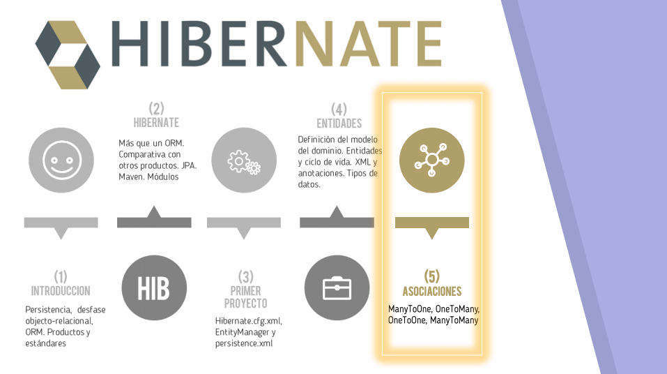   
   
# 10 ManyToOne 10:34 

[ManyToOne](pdfs/08_Asociaciones_ManyToOne.pdf)

## Resumen Profesor

### 8.1 Asociaciones entre entidades

Normalmente, en todos los sistemas de información, las entidades del modelo de dominio suelen estar asociadas entre ellas, de forma que suele ser tan importante (o más) registrar la información asociada a la asociación como a la entidad.

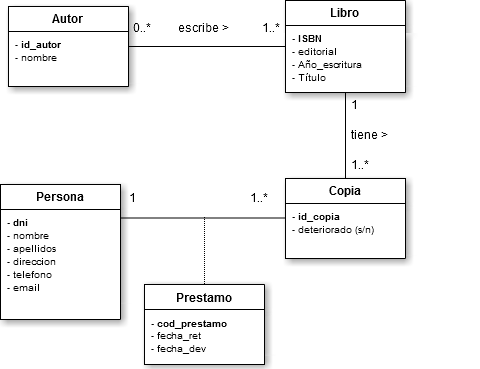

*Diagrama de clases completo*

A nivel de base de datos, estas asociaciones suelen implementarse mediante claves externas. Una *foreign key* no es más que la presencia de la clave primaria de una tabla en otra tabla (puede ser reflexiva, y estar en la misma tabla), a la cual *apunta*.

JPA nos permite modelar estas asociaciones, tanto de forma *unidireccional* como de forma *bidireccional*. Veamos poco a poco todas ellas.

### 8.2. Asociaciones Many-To-One (Muchos a uno)

Se trata de la asociación más sencilla y común de todas. Este tipo de asociaciones a conocida en algunos contextos como una relación padre/hijo, donde el lado muchos es el *hijo* y el lado uno es el *padre*.
La versión más sencilla de esta asociación es la **unidireccional**, en la que solo representamos la asociación en el lado muchos.

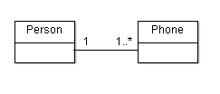

*Diagrama de clases*

El código fuente sería el siguiente:

```java
@Entity
public class Person {

    @Id
    @GeneratedValue
    private long id;

    private String name;

    public Person() { }

    public Person(String name) {
        this.name = name;
    }

    public long getId() {
        return id;
    }

    //resto de métodos...

}


@Entity
public class Phone {

    @Id
    @GeneratedValue
    private long id;

    private String number;

    @ManyToOne
    @JoinColumn(name = "person_id",
                    foreignKey = @ForeignKey(name="PERSON_ID_FK"))
    private Person person;


    public Phone() { }

    public Phone(String number) {
        this.number = number;
    }

    public String getNumber() {
        return number;
    }

    public void setNumber(String number) {
        this.number = number;
    }

    public Person getPerson() {
        return person;
    }

    public void setPerson(Person person) {
        this.person = person;
    }

    public long getId() {
        return id;
    }


}
```

La anotación `@ManyToOne` nos permite indicar que una columna representa una asociación muchos-a-uno con otra entidad. El tipo de dato será el de la clase del lado uno. Complementariamente, podemos añadir las anotaciones `@JoinColumn`, que nos permite indicar el nombre de la columna que hará las funciones de clave externa, así como `@ForeignKey`, con la que podemos indicar el nombre de la restricción que se creará a nivel de base de datos (muy útil para depurar errores).

```java
@ManyToOne
@JoinColumn(name = "person_id",
        foreignKey = @ForeignKey(name="PERSON_ID_FK"))
private Person person;
```

Cada entidad tiene su ciclo de vida propio. Una vez que añadimos la asociación `@ManyToOne`, Hibernate establece el valor de la clave externa.

```java
Person person = new Person("Pepe");
em.persist( person );

Phone phone = new Phone("954000000");
phone.setPerson(person);
em.persist(phone);

em.flush();
phone.setPerson(null);
```

## Preguntas

P= Me gustaría saber si con esta anotacion se puede insertar y actualizar 2 tablas por ejemplo entidad1 seria la padre y entidad2 seria la hija, y tengo diferentes campos en cada entidad en la entidad1 tengo un JoinColumn donde referencio a la entidad2 a la cual quiero ingresarle unos registros desde mi managed beans.

Si esto es posible como debe ser el metodo para realizarlo?

R= No sé si he conseguido entender bien tu pregunta. ¿Tu pregunta está orientada a una asociación de herencia entre dos clases?

La anotación @ManyToOne nos va a permitir definir una asociación entre dos entidades (básicamente, es la forma de plasmar, a nivel de objetos, el concepto de clave externa o foránea, existente a nivel de tablas).

Si lo que necesitas es tener una asociación de herencia, mediante la cual tengas definidas dos clases (una padre y otra hija), y que al insertar o actualizar, se actualicen todos los datos, entonces tendrías que ver los apartados dedicados a herencia (con sus diferentes posibilidades).

P= Porqué al definir la foreign key del objeto 'Phone' respecto a 'Person' el atributo 'name' no es igual que el nombre definido para el id del objeto Person? Es decir, en vez de *person_id *debería ser id.

R= Los nombres del ejemplo son ilustrativos. Con todo, he utilizado la nomenclatura que suele ser habitual, tanto a nivel de clases como a nivel de bases de datos.

Además, ten en cuenta que la clase Phone tiene ya un atributo llamado id; la anotación @JoinColumn (acompañando a la anotación @ManyToOne) nos dice que, a nivel de base de datos, se espera que la tabla PHONE tendrá una columna que haga las veces de clave externa. Si su nombre fuera id, la tabla PHONE tendría dos atributos que se llamarían igual. Por último, decirte que suele ser habitual llamar a las columnas que hacen las veces de clave externa NOMBRETABLAREFERENCIADA_ID, en este caso, PERSON_ID.

P= ¿No hace falta poner @Column para el atributo number?¿O como es la única sin nombrar se pone por defecto?

R= No es obligatorio añadirlo. Sí debes hacerlo si quieres cambiar el valor por defecto de alguna propiedad, como el nombre, la longitud,...

## Transcripción


Vamos a comenzar un capítulo que va a ser algo más largo, va a estar formado por algunas lecciones por que vamos a hablar de las asociaciones entre entidades con Hibernate y JPA y existen diferentes tipos con lo cual tenemos que ir viéndolas cada uno paso a paso.

Las asociación en entidades no es algo que Hibernate ni JPA hayan inventado, si revisamos lo que sabemos de análisis y diseño de software podremos comprobar que cuando estamos haciendo el proceso de análisis y estamos viendo el problema que queremos resolver y estamos identificando las entidades de información que queremos manejar, estas entidades nunca van a ser unidades aisladas o rara vez lo van a llegar ser. Sin embargo vemos como las entidades normalmente colaboran entre si participan las unas de la otra. 

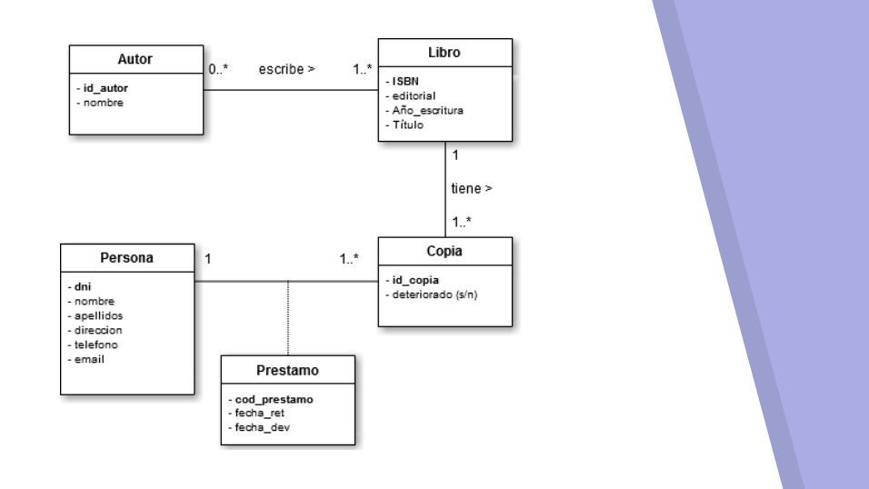

Podemos ver en la lamina como tenemos un diagrama de clase UML lo que sería una biblioteca muy sencilla y podemos ver como tenemos distintas clases que serían entidades de nuestro proyecto, Autor, Libro, Copia de un libro, Persona  alguna entidad especial que sería Prestamo y podiamos ver como entre ellas estan asociadas, es decir no tendría sentido que tuviéramos libros por algún lado y autores por otro y que entre ellos no hubiera ningún tipo de asociación por que sabemos bien que los autores escriben libros, los libros estan escritos por autores y por ejemplo entre Libro y Copia, normalmente en las bibliotecas de los libros que más se suelen utilizar se tiene más de una copia, de otras tal vez solo se tenga una.

Otro elemento que podemos identificar en las asociaciones es la *Multíciplidad* o *Cardinalidad* qué es bueno, ya hemos establecido que hay una asociación entre dos clases pero cuánto elemento cuánta instancias de la entidad por ejemplo autor se pueden asociar con una sola instancia de la entidad Libro, en el gráfico lo tenemos descrito y UML nos permite visualizarlo de forma clara, un libro puede estar escrito por 0 o más autores, podemos tener algún libro que sea que sea anónimo con lo cual no tenemos identificado el autor o sin embargo puede estar escrito por muchos autores, los clásicos libros escritos para los colegios o libros de referencía de alguna tecnología hay veces que se escriben 15 capítulos y cada uno por diferente autor. Y un autor por su lado podría escribir más de un libro y ser muy prolifico, las diferentes multiplicidades entre asociaciones que podemos encontrar son las asociaciones siguientes:

* Muchos a Uno por ejemplo la que hay entre Libros y Copia
* Uno a Muchos Otra perspectiva de la asociación anterior
* Uno a Uno en el diagrama no tenemos ninguna, en las que solamente una instacia de una clase se asocia con otra.
* Muchos a Muchos por ejeplo la asociación entre Autor y Libro donde más de una instancia de la clase de un lado se asocia con instancia de la otra.


Vamos a comenzar con la asociaciones más sencilla que son las asociaciones *Muchos a Uno*.

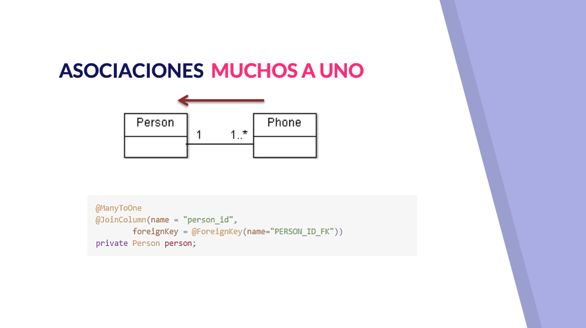

Supongamos el diagrama de entidades de clase que tenemos de ejemplo en el que tendríamos una entidad Persona y tendríamos otra que sería Teléfono, esto a nivel de base de datos se resuelve de una manera sencilla, si quisieramos almacenar esto en tablas, tendríamos por un lado la Tabla Persona, tendríamos por otro lado la Tabla Telefonos y como un teléfono esta asociado a una sola persona bastaría con que tuvieramos una clave externa desde la tabla Telefono hacia la tabla Persona.

Todo esto como lo podemos identificar en Hibernate, nos bastaría que dentro de la entidad Telefono tuvieramos definida una referencia hacia la Entidad, hacia la clase con la cual estamos asociados. La anotaríamos como mínimo con `@ManyToOne` la anotación `@JoinColumn` es optativa y nos permite customizar un poquito algunas propiedades como el nombre de la columna que se va a generar en la tabla Phone así como el nombre de la restricción de clave externa que se va a generar para que no sea un nombre aleatorio o uno de lo que de los que genere el sistema gestor de base de datos y le demos un nombre claro para evitar violar alguna restricción que con el nombre de la restricción lo podamos identificar de una manera rápida.

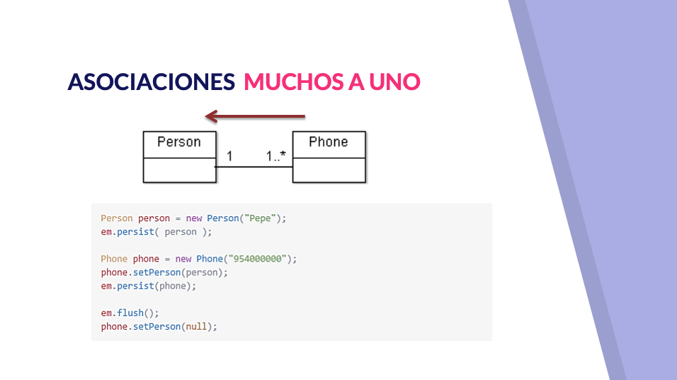

El manejo de las asociaciones a nivel ya de trabajo con la entidades sería sencillo, dariamos de alta una persona que quedaría persistida y si queremos asociarle un teléfono a esa persona pues creariamos el teléfono le asignaríamos a través de por ejemplo el setter correspondiente o un constructor la persona y persistiriamos el teléfono de esa manera  la asociación quedaría plasmada, si la queremos borrar pues tal y como nos abajo en el código, tan solo tendríamos que asignarle el código null al campo `Person` del teléfono y con eso la asociación quedaría eliminada.

Vamos a ver este ejemplo en funcionamiento.

Tenemos la clase `Person`

*`Person.jva`*

```java
package com.openwebinars.hibernate.hibernatejpamanytoone;

import javax.persistence.Entity;
import javax.persistence.GeneratedValue;
import javax.persistence.Id;

@Entity
public class Person {
	
	
	@Id
	@GeneratedValue
	private long id;
	
	private String name;
	
	public Person() { }
	
	public Person(String name) {
		this.name = name;
	}

	public long getId() {
		return id;
	}

	public void setId(long id) {
		this.id = id;
	}

	public String getName() {
		return name;
	}

	public void setName(String name) {
		this.name = name;
	}

}
```

Es muy sencilla es una Entidad con un campo de `id` que será generado por la estrategia por defecto, la estrategía automatica para MySQL5 y tenemos la entidad `Phone`.

*`Phone.java`*

```java
package com.openwebinars.hibernate.hibernatejpamanytoone;

import javax.persistence.Entity;
import javax.persistence.ForeignKey;
import javax.persistence.GeneratedValue;
import javax.persistence.Id;
import javax.persistence.JoinColumn;
import javax.persistence.ManyToOne;

@Entity
public class Phone {
	
	@Id
	@GeneratedValue
	private long id;
	
	private String number;
	
	@ManyToOne
	@JoinColumn(name = "person_id", 
					foreignKey = @ForeignKey(name="PERSON_ID_FK"))
	private Person person;
	
	
	public Phone() { }
	
	public Phone(String number) {
		this.number = number;
	}

	public String getNumber() {
		return number;
	}

	public void setNumber(String number) {
		this.number = number;
	}

	public Person getPerson() {
		return person;
	}

	public void setPerson(Person person) {
		this.person = person;
	}

	public long getId() {
		return id;
	}
	
	

}
```

que tiene también su `id`, el `number` y como podemos comprobar tiene una referencia a la entidad `Person` y además de tener la anotación `@ManyToOne` qué es la que hace de manera efectiva qué plasmemos está asociación entre ambas clases, vamos a delimitar que la columna que va a unir ambas tablas a traves de una clave externa `@JoinColumn(name = "person_id", foreignKey = @ForeignKey(name="PERSON_ID_FK"))` la que se llamara `person_id` un nombre muy típico, el nombre del atributo `person` o de la entidad a la que hacemos referencia y el nombre la restricción de clave externa a través de la anotación `@ForeignKey`.

El código en nuestra aplicación es:

*`App`*

```java
import javax.persistence.EntityManager;
import javax.persistence.EntityManagerFactory;
import javax.persistence.Persistence;

/**
 * Asociaciones ManyToOne
 * 
 *
 */
public class App {
	public static void main(String[] args) {
		
		
		
		//Configuramos el EMF a través de la unidad de persistencia
		EntityManagerFactory emf = Persistence.createEntityManagerFactory("ManyToOne");

		//Generamos un EntityManager
		EntityManager em = emf.createEntityManager();

		//Iniciamos una transacción
		em.getTransaction().begin();
		
		Person person = new Person("Pepe");
		em.persist( person );

		Phone phone = new Phone("954000000");
		phone.setPerson(person);
		em.persist(phone);

		em.flush();
		//phone.setPerson(null);
		
		


		//Commiteamos la transacción
		em.getTransaction().commit();
		
		//Cerramos el EntityManager
		em.close();
		
	}
}
```

Es el clásico inicializamos el EntityManagerFactory desde el creamos un EntityManager y en el marco de una transacción vamos a añadir una Persona, le vamos a asociar el teléfono.

Vamos a realizar una primera ejecución.


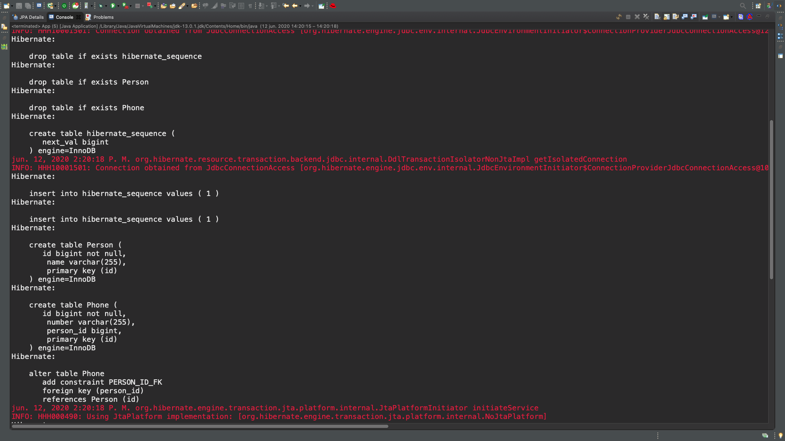


Como podemos ver se crea la tabla `Person`, la tabla `Phone`, todo este ir y venir de `Select` y `Update` es el mecanismo que utiliza Hibernate para ir gestionando las claves primarias automáticas y cómo podemos comprobar al final se ha insertado una Persona y se ha insertado un teléfono.

Si comprobamos en la base de datos podemos ver como tenemos las tablas `Person` y `Phone` si vemos su contenido en `Person` tenemos la persona que hemos dado de alta y en `Phone` tenemos el id y número de teléfono y la columna `person_id` de clave externa que esta apuntando hacía el registro de Persona que hemos dado de alta.


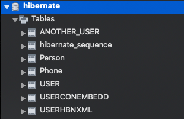

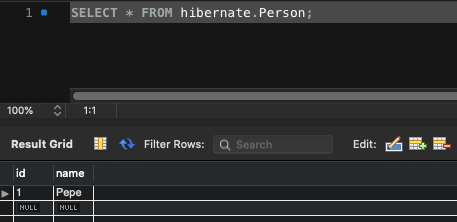

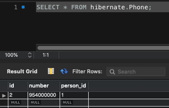

Si volvemos a ejecutar pero descomentando `phone.setPerson(null);` tenemos lo siguiente:

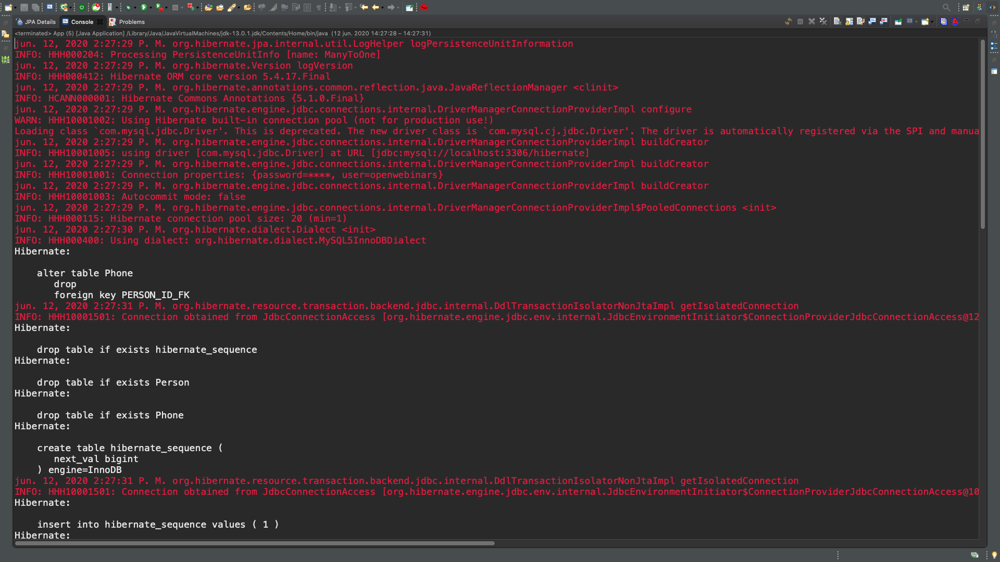

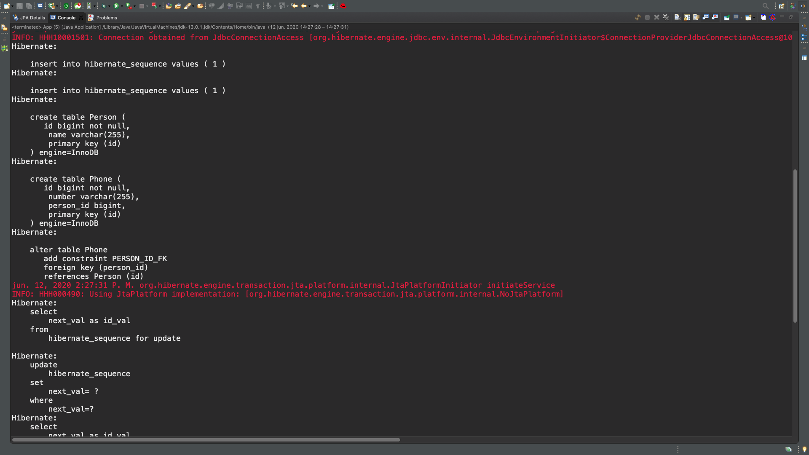

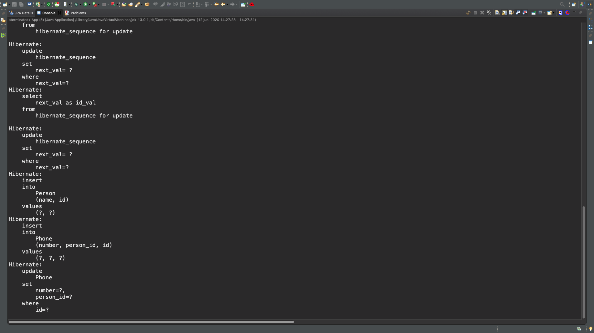

Ademas de las sentencias de antes se ha ejecutado un Update 

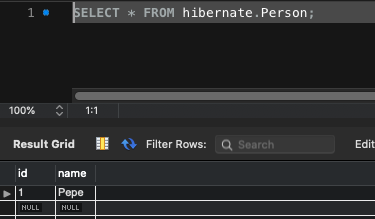

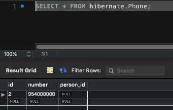

Al ejecutar ese update lo que hemos es desasociado esas dos entidades, de manera que estarían existiendo por que tienen su propio ciclo de vida pero ya habíamos eliminado esa asiciación `@ManyToOne` entre ellas. 

### :computer: Código Completo - 130-04-PrimerProyectoHibernateJPAMapeoColumnas

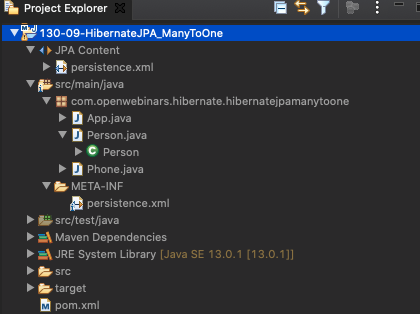

*`pom.xml`*

```html
<?xml version="1.0" encoding="UTF-8"?>

<project xmlns="http://maven.apache.org/POM/4.0.0"
	xmlns:xsi="http://www.w3.org/2001/XMLSchema-instance"
	xsi:schemaLocation="http://maven.apache.org/POM/4.0.0 http://maven.apache.org/xsd/maven-4.0.0.xsd">
	<modelVersion>4.0.0</modelVersion>

	<groupId>com.openwebinars.hibernate</groupId>
	<artifactId>130-09-HibernateJPA_ManyToOne</artifactId>
	<version>0.0.1-SNAPSHOT</version>

	<name>130-09-HibernateJPA_ManyToOne</name>
	<!-- FIXME change it to the project's website -->
	<url>http://www.example.com</url>

	<properties>
		<project.build.sourceEncoding>UTF-8</project.build.sourceEncoding>
		<maven.compiler.source>1.7</maven.compiler.source>
		<maven.compiler.target>1.7</maven.compiler.target>
	</properties>

	<dependencies>
		<dependency>
			<groupId>junit</groupId>
			<artifactId>junit</artifactId>
			<version>4.11</version>
			<scope>test</scope>
		</dependency>
		<dependency>
			<groupId>org.hibernate</groupId>
			<artifactId>hibernate-entitymanager</artifactId>
			<version>5.4.17.Final</version>
		</dependency>
		<!-- https://mvnrepository.com/artifact/mysql/mysql-connector-java -->
		<dependency>
			<groupId>mysql</groupId>
			<artifactId>mysql-connector-java</artifactId>
			<version>8.0.20</version>
		</dependency>
	</dependencies>

	<build>
		<pluginManagement><!-- lock down plugins versions to avoid using Maven 
				defaults (may be moved to parent pom) -->
			<plugins>
				<!-- clean lifecycle, see https://maven.apache.org/ref/current/maven-core/lifecycles.html#clean_Lifecycle -->
				<plugin>
					<artifactId>maven-clean-plugin</artifactId>
					<version>3.1.0</version>
				</plugin>
				<!-- default lifecycle, jar packaging: see https://maven.apache.org/ref/current/maven-core/default-bindings.html#Plugin_bindings_for_jar_packaging -->
				<plugin>
					<artifactId>maven-resources-plugin</artifactId>
					<version>3.0.2</version>
				</plugin>
				<plugin>
					<artifactId>maven-compiler-plugin</artifactId>
					<version>3.8.0</version>
				</plugin>
				<plugin>
					<artifactId>maven-surefire-plugin</artifactId>
					<version>2.22.1</version>
				</plugin>
				<plugin>
					<artifactId>maven-jar-plugin</artifactId>
					<version>3.0.2</version>
				</plugin>
				<plugin>
					<artifactId>maven-install-plugin</artifactId>
					<version>2.5.2</version>
				</plugin>
				<plugin>
					<artifactId>maven-deploy-plugin</artifactId>
					<version>2.8.2</version>
				</plugin>
				<!-- site lifecycle, see https://maven.apache.org/ref/current/maven-core/lifecycles.html#site_Lifecycle -->
				<plugin>
					<artifactId>maven-site-plugin</artifactId>
					<version>3.7.1</version>
				</plugin>
				<plugin>
					<artifactId>maven-project-info-reports-plugin</artifactId>
					<version>3.0.0</version>
				</plugin>
			</plugins>
		</pluginManagement>
	</build>
</project>
```

*`persistence.xml`*

```html
<?xml version="1.0" encoding="UTF-8"?>
<persistence version="2.1" xmlns="http://xmlns.jcp.org/xml/ns/persistence" xmlns:xsi="http://www.w3.org/2001/XMLSchema-instance" xsi:schemaLocation="http://xmlns.jcp.org/xml/ns/persistence http://xmlns.jcp.org/xml/ns/persistence/persistence_2_1.xsd">
	<persistence-unit name="ManyToOne" transaction-type="RESOURCE_LOCAL">
		<class>com.openwebinars.hibernate.hibernatejpamanytoone.Person</class>
		<class>com.openwebinars.hibernate.hibernatejpamanytoone.Phone</class>
		<exclude-unlisted-classes>true</exclude-unlisted-classes>
		<properties>
			<property name="javax.persistence.jdbc.url" value="jdbc:mysql://localhost:3306/hibernate"/>
			<property name="javax.persistence.jdbc.user" value="openwebinars"/>
			<property name="javax.persistence.jdbc.password" value="12345678"/>
			<property name="javax.persistence.jdbc.driver" value="com.mysql.jdbc.Driver"/>
			<property name="hibernate.dialect" value="org.hibernate.dialect.MySQL5InnoDBDialect"/>
			<property name="hibernate.connection.driver_class" value="com.mysql.jdbc.Driver"/>
			<property name="hibernate.hbm2ddl.auto" value="create"/>
			<property name="hibernate.show_sql" value="true"/>
			<property name="hibernate.format_sql" value="true"/>
		</properties>
	</persistence-unit>
</persistence>
```

*`Person.java`*

```java
package com.openwebinars.hibernate.hibernatejpamanytoone;

import javax.persistence.Entity;
import javax.persistence.GeneratedValue;
import javax.persistence.Id;

@Entity
public class Person {
	
	
	@Id
	@GeneratedValue
	private long id;
	
	private String name;
	
	public Person() { }
	
	public Person(String name) {
		this.name = name;
	}

	public long getId() {
		return id;
	}

	public void setId(long id) {
		this.id = id;
	}

	public String getName() {
		return name;
	}

	public void setName(String name) {
		this.name = name;
	}

}
```

*`Phone.java`*

```java
package com.openwebinars.hibernate.hibernatejpamanytoone;

import javax.persistence.Entity;
import javax.persistence.ForeignKey;
import javax.persistence.GeneratedValue;
import javax.persistence.Id;
import javax.persistence.JoinColumn;
import javax.persistence.ManyToOne;

@Entity
public class Phone {
	
	@Id
	@GeneratedValue
	private long id;
	
	private String number;
	
	@ManyToOne
	@JoinColumn(name = "person_id", 
					foreignKey = @ForeignKey(name="PERSON_ID_FK"))
	private Person person;
	
	
	public Phone() { }
	
	public Phone(String number) {
		this.number = number;
	}

	public String getNumber() {
		return number;
	}

	public void setNumber(String number) {
		this.number = number;
	}

	public Person getPerson() {
		return person;
	}

	public void setPerson(Person person) {
		this.person = person;
	}

	public long getId() {
		return id;
	}
	
	

}
```

*`App.java`*

```java
package com.openwebinars.hibernate.hibernatejpamanytoone;

import javax.persistence.EntityManager;
import javax.persistence.EntityManagerFactory;
import javax.persistence.Persistence;

/**
 * Asociaciones ManyToOne
 *
 */
public class App {
	public static void main(String[] args) {
		
		
		
		//Configuramos el EMF a través de la unidad de persistencia
		EntityManagerFactory emf = Persistence.createEntityManagerFactory("ManyToOne");

		//Generamos un EntityManager
		EntityManager em = emf.createEntityManager();

		//Iniciamos una transacción
		em.getTransaction().begin();
		
		Person person = new Person("Pepe");
		em.persist( person );

		Phone phone = new Phone("954000000");
		phone.setPerson(person);
		em.persist(phone);

		em.flush();
		//phone.setPerson(null);
		
		
		//Commiteamos la transacción
		em.getTransaction().commit();
		
		//Cerramos el EntityManager
		em.close();
		
	}
}
```

En el próximo capítulo vamos a aprender de las asociaciones Uno a Muchos, cómo hacer el otro lado, el lado onetomany y lo veremos de manera unidireccional o bidireccional.

# 11 OneToMany: Unidireccional y bidireccional 12:54 

[OneToMany: Unidireccional y bidireccional](pdfs/09_Asociaciones_OneToMany.pdf)

## Resumen Profesor

La asociación Uno-a-muchos nos permite enlazar, en una asociación padre/hijo, el lado *padre* con todos sus hijos. Para ello, en la clase debemos colocar una colección de elementos hijos.

Si la asociación `@OneToMany` no tiene la correspondiente asociación `@ManyToOne`, decimos que es unidireccional. En caso de que sí exista, decimos que es **bidireccional**.

#### 9.1.1 One-To-Many unidireccional

Para representar esta asociación, añadimos en la clase padre un listado de elementos del tipo hijo.

```java
@Entity
public class Person {


    @Id
    @GeneratedValue
    private long id;

    @OneToMany(cascade = CascadeType.ALL, orphanRemoval = true)
  private List<Phone> phones = new ArrayList<>();

    private String name;

    public Person() { }

    public Person(String name) {
        this.name = name;
    }

    //Resto de métodos


    public List<Phone> getPhones() {
        return phones;
    }


}


@Entity
public class Phone {

    @Id
    @GeneratedValue
    private long id;

    private String number;

    public Phone() { }

    //Resto de métodos


}
```

Hibernate creará una tabla para cada entidad, y otra tabla para asociar ambas, añadiendo una restricción de unicidad al identificador del lado muchos. La anotación que define la asociación es `@OneToMany`. Vamos a repasar algunos elementos del código:

```java
@OneToMany(cascade = CascadeType.ALL, orphanRemoval = true)
private List<Phone> phones = new ArrayList<>();
```

* La lista es inicializada al instanciar el objeto, para poder almacenar los elementos hijos.

* La opción `cascade = CascadeType.ALL` indica que las operaciones (formalmente llamadas *transiciones entre estados*) sobre el elemento padre se actualizarán hacia los hijos.

* La opción `orphanRemoval = true` indica que una entidad `Phone` será borrada cuando se elimine su asociación con la instancia de `Person`.

Para gestionar esta asociación *unidireccional*, debemos trabajar siempre con la lista de elementos que posea la entidad padre.

```java
        Person person = new Person("Pepe");
        Phone phone1 = new Phone("954000000");
        Phone phone2 = new Phone("600000000");

        person.getPhones().add(phone1);
        person.getPhones().add(phone2);
        em.persist(person);
        em.flush();

        person.getPhones().remove(phone1);
```        

#### 9.1.2 One-To-Many bidireccional

La asociación `@OneToMany` bidireccional necesita de una asociación `@ManyToOne` en el lado hijo. Aunque en los modelos estas asociaciones se representan bidireccionalmente, esta está representada solamente por una clave externa.

Toda asociación bidireccional debe tener un lado **propietario** (lado hijo). El otro lado vendrá referenciado mediante el atributo `mappedBy`.

```java
@Entity
public class Phone {

    @Id
    @GeneratedValue
    private long id;

    private String number;

    @ManyToOne
    private Person person;

    public Phone() { }

    //Resto de métodos

    @Override
    public int hashCode() {
        return Objects.hash(number);
    }

    @Override
    public boolean equals(Object o) {
        if ( this == o ) {
            return true;
        }
        if ( o == null || getClass() != o.getClass() ) {
            return false;
        }
        Phone phone = (Phone) o;
        return Objects.equals( number, phone.number );
    }


}


@Entity
public class Person {

    @Id
    @GeneratedValue
    private long id;

    @OneToMany(mappedBy = "person", cascade = CascadeType.ALL, orphanRemoval = true)
    private List<Phone> phones = new ArrayList<>();

    private String name;

    public Person() {
    }

    public Person(String name) {
        this.name = name;
    }

    public long getId() {
        return id;
    }

    public String getName() {
        return name;
    }

    public void setName(String name) {
        this.name = name;
    }

    public List<Phone> getPhones() {
        return phones;
    }

    public void addPhone(Phone phone) {
        phones.add(phone);
        phone.setPerson(this);
    }

    public void removePhone(Phone phone) {
        phones.remove(phone);
        phone.setPerson(null);
    }

}
```

*`@NaturalId` es una anotación propia de Hibernate. Representa un identificador único que, si bien no es el mejor candidato para clave primaria, es conveniente indicárselo a Hibernate, ya que lo puede usar para hacer más eficiente.*

Como la clase `Phone` hace uso de una columna `@NaturalId` (haciendo el número de teléfono único), los métodos `equals()` y `hashCode()` pueden hacer uso de esta propiedad, y reducir la lógica de `removePhone()` a llamar al método `remove` de Java Collection.


Podemos destacar aquí la lógica de estos métodos:

```java
public void addPhone(Phone phone) {
    phones.add(phone);
    phone.setPerson(this);
}

public void removePhone(Phone phone) {
    phones.remove(phone);
    phone.setPerson(null);
}
```

El primero, realiza la asociación de un teléfono una persona: se añade el teléfono a la lista de teléfonos de la persona, y se asigna la persona como propietaria del teléfono.

El segundo, realiza la operación inversa, sacando el teléfono de la lista de teléfonos de la persona, y asignando como nulo la persona que es *dueña* del teléfono.

```java
        Person person = new Person("Pepe");
        Phone phone1 = new Phone("954000000");
        Phone phone2 = new Phone("600000000");

        person.addPhone(phone1);
        person.addPhone(phone2);
        em.persist(person);
        em.flush();

        person.removePhone(phone1);
```        

La asociación bidireccional es más eficiente gestionando el estado de persistencia de la asociación. La eliminación de un elemento solo requiere de una sentencia UPDATE (poniendo a `NULL` la clave externa); además, si el ciclo de vida de la clase *hija* está enmarcado dentro del de su clase padre (es decir, que no puede existir sin ella) podemos anotar la asociación con el atributo `orphanRemoval`, de forma que al desasociar un hijo, automáticamente se eliminará la fila asociada.

## Preguntas

P= ¿ como hariamos un OneToMany o ManyToOne si alguna de los 2 extremos la clave no es una clave compuesta por mas de un atributo?

R= Si tu pregunta es como hacer alguna de esas dos asociaciones con una clave primaria NO compuesta por más de un atributo, es lo que aparece en esta lección. Puedes revisar rápidamente si quieres el código de la parte de resumen, con las clases Persony Phone.

Si te referías a hacer alguna de las asociaciones con una clave primaria que SÍ que sea compuesta, podrías usar alguno de los esquemas que existen (IdClass o EmbeddId) para declarar la clave primaria, y usarla en las asociaciones. Si te parece bien, en los próximos días te anexo un pequeño ejemplo donde se pueda ilustrar.

P= ¿Podrías explicar en qué casos sería más beneficioso tener una relación bidireciconal y cuándo una unidireccional?
En las ManyToOne me refiero.
¿Sería más práctico guardar solo el identificador del objeto hijo en lugar de toda la entidad? ¿Y si la entidad hija tiene demasiados atributos?

R= A mi modo de ver, la asociación bidireccional tiene sentido si vamos a realizar un uso frecuente de ella. Si además, el uso es muy frecuente, y el volumen de datos no es muy grande, incluso nos podemos plantear la utilización de un FETCH de tipo EAGER.

Si el volumen de datos (número de filas en bases de datos, o de instancias de objetos) es muy grande, o los objetos tienen muchas relaciones con otros objetos, el FETCH de tipo EAGER no es nada recomendable, y entrarían en juego las consultas, que rellenarían de datos esas asociaciones bidireccionales en el momento justo en que vayamos a necesitarlos. Esto te permite hacer algo como lo que indicas que guardar solo el identificador en lugar de toda la entidad, y rescatar los datos en el momento preciso.

Si no vamos a utilizar nunca la asociación en ambas direcciones, y solo la vamos a usar en una (habitualmente, en el lado @ManyToOne), no merece la pena establecer la asociación en la dirección contraria.

P= Tal vez por usar muy poco los ORM hasta el momento, no veo muy bien cuál es la utilidad de usar una relación bidireccional. Me parece que este enfoque hace que el desarrollador tenga más cuidado llevando el control de las actualizaciones. De ser el caso que este enfoque es recomendado ¿En que casos debo elegirlo?

R= Los expertos suelen recomendarlo &quot;siempre&quot;. Te indico algunas recomendaciones de mi cosecha de cuando creo que te las puedes ahorrar.

* Trata de no utilizar @OneToMany unidireccional nunca. Siempre es más eficiente el uso de @ManyToOne y mapear la asociación @OneToMany a ella.
* Si hacer una asociación bidireccional va a conllevar que uno de los dos lados de la asociación sea muy pesado, entonces es mejor dejarla bidireccional, y utilizar consultas. Por ejemplo, piensa en las entidades Categoria y Producto. Podríamos tener una asociación ManyToOne + @OneToMany. Pero si el catálogo de producto que manejamos es el de Amazon, donde cada categoría es inmensa, posiblemente no nos resulte recomendable.
* Si en una asociación ManyToOne + @OneToMany o ManyToMany, solo atacas la asociación desde un único lado, es posible que te puedas ahorrar el otro lado de la misma.

En el fondo, habría que estudiar cada modelo de datos a implementar con lupa para trata de realizar el mapeo más eficiente posible.
Espero que estas recomendaciones te puedan dar algo de luz.

P= En el caso que el mapeo de las entidades sea por ambos lados (bidireccional). ¿Qué sucede cuando trato de hacer lo mismo pero viendolo desde de la relación muchos (en este caso Phone)? Así por ejemplo

```java
//Asocio por el lado del telefono
Person person=new Person("Pepe");
Phone telf1=new Phone("984560022");
telf1.setPerson(person); 
em.persist(telf1);// supongo que implicitamente hace ambos inserts y también establece la relación
```

Suponia que bastaría con persistir, bien sea o la entidad"Phone" o la entidad "Person" para que la asociación se establezca. Es decir, bastaba que persista solo uno de ellos para que Hibernate implícitamente realice los inserts y la asociación. Pero me muestra error en la compilación.
Solamente acepta si se persiste ambas entidades.

```java
em.persist(person);
em.persist(telf);
```

En este caso sí crea ambas entidades y también realiza la asociación.
¿Me puedes explicar por favor? ¿Es en todas las relaciones bidireccionales (OneToMany, OneToOne, ManyToMany) que se da esto?

R= Por poder acotar la explicación, ¿el error lo da en la compilación o durante la ejecución de alguna de esas sentencias?

P= No me termino de enterar de esto:

`orphanRemoval=true`

Eso de que indica que el ciclo de vida esta cirscunscrito a una clase, no lo termino de ver claro.

R= Te cito lo que indica la documentación de JPA:

Cuando una entidad en una relación uno a uno o uno a muchos se elimina de la relación, a menudo es deseable en cascada la operación de eliminación de dicha entidad. Estas entidades se consideran "huérfanas", y el atributo orphanRemoval se puede usar para especificar que las entidades huérfanas deben eliminarse. Por ejemplo, si un pedido tiene muchas líneas de pedido y una de ellas se elimina del pedido, la línea de pedido eliminada se considera huérfana. Si orphanRemoval se establece en verdadero , la entidad de la línea de pedido se eliminará cuando la línea de pedido se elimine del pedido.
El atributo orphanRemoval en @OneToMany y @OneToOne toma un valor booleano y, por defecto, es falso.
Esta situación suele darse en la asociaciones de composición, donde el componente es la parte débil de una asociación con un compuesto; dicho componente no puede existir sin el compuesto. Si la asociación se borra, el componente se debe borrar.

## Transcripción

Vamos a continuar con el capítulo 5 hablando de asociaciones entre entidades en este caso vamos a hablar de las asociaciones *Uno a Muchos*.


Y vamos a comenzar haciéndolo hablando de las *Asociaciones Uno a Muchos Unidireccional*.

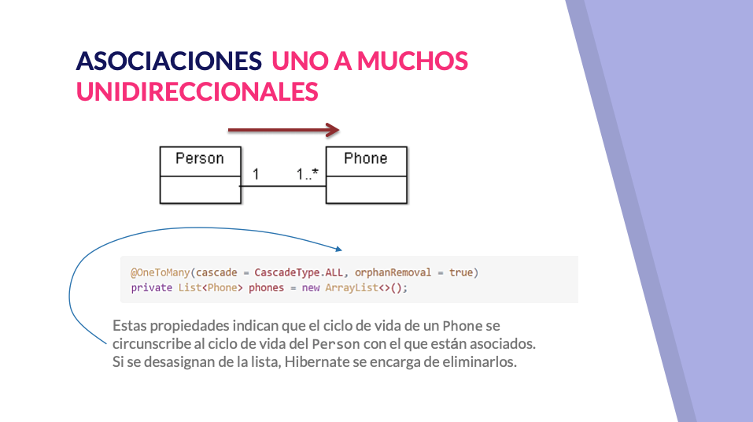

Este tipo de asociaciones casi que respetan el mismo diagrama de clases que hemos visto en la lección anterior Muchos a Uno, pero es como si vieramos la misma asociación desde la perspectiva de enfrente desde lo que sería el lado Uno.

Si en la asociación muchos a uno asociavamos un teléfono a cada persona que era su propietario o la entidad con la que está asociado, en el lado uno, para poder tener esta asociación plasmada tendríamos que tener una colección de elementos de entidades del lado muchos, en el ejemplo podemos ver cómo lo podemos modelar a través de una lista de elementos de tipo Phone, podríamos usar algún tipo básico como ArrayList o ya hablaremos sobre colecciones de entidades en alguna lección posterior.

Como podemos comprobar la anotación que tenemos que usar analoga a la anterior lección es `@OneToMany`, lo que pasa es que en este caso podemos, deberíamos añadir algunas propiedades a esta anotación por los siguientes, si vamos a tener teléfonos vamos a tener personas y la asociación va a venir marcada así las propiedades de cambio en cascada y orphanRemoval nos van a indicar que el ciclo de vida de los teléfonos se va a circunscribir al ciclo de vida de la persona con la cual están asociados así que si alguna manera desasignamos ese teléfono de la lista Hibernate los eliminaría, sobre la cascada, los cambios de estado en cascada, también hablaremos en lecciones posteriores 

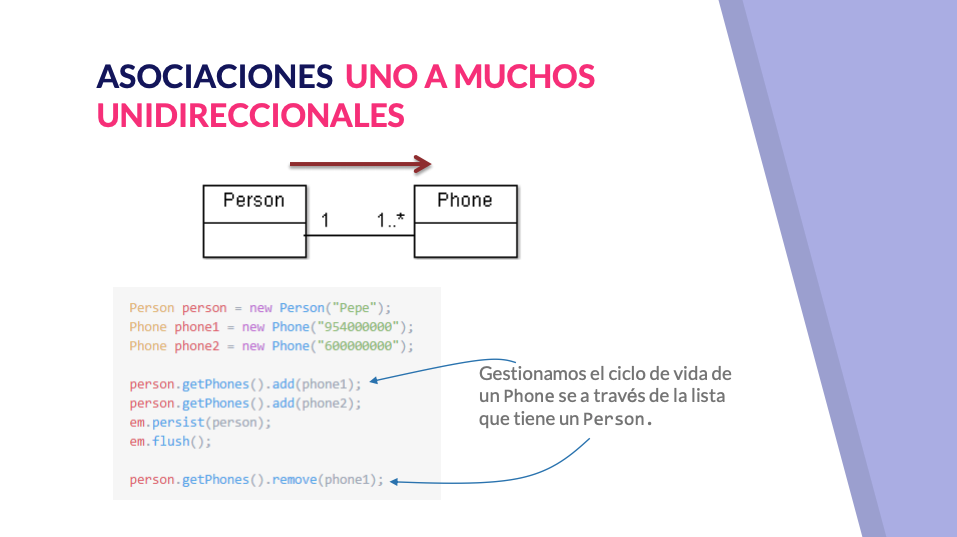

La gestión que haríamos de personas y teléfonos en este caso sería distinta, tendríamos las personas por un lado, los teléfonos por otro, como podemos ver en pantalla y para almacenar, lo que haríamos sería para una persona obtendríamos la lista de teléfonos e  iremos añadiendo esos distintos teléfonos, al almacenar la persona como hemos marcado que las transiciones de estado se almacenen en cascada, tendríamos que al persistir una persona se almacenaría los teléfonos con los que esta asociado.

Vamos a ver un proyecto de ejemplo se parece mucho al anterior de hecho las entidades son casi iguales, pero lo único que tendríamos en este caso sería que en la entidad Phone no tendríamos la asociación ManyToOne y en la entidad Person tendríamos la asociación OnetoMany tal como acabamos de definir. Las propiedades son las mismas que antes y podríamos comprobar al ejecutar el código de ejemplo en el marco de una transacción.


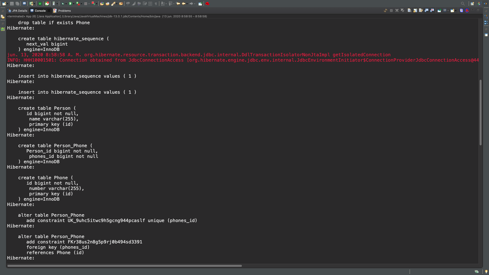

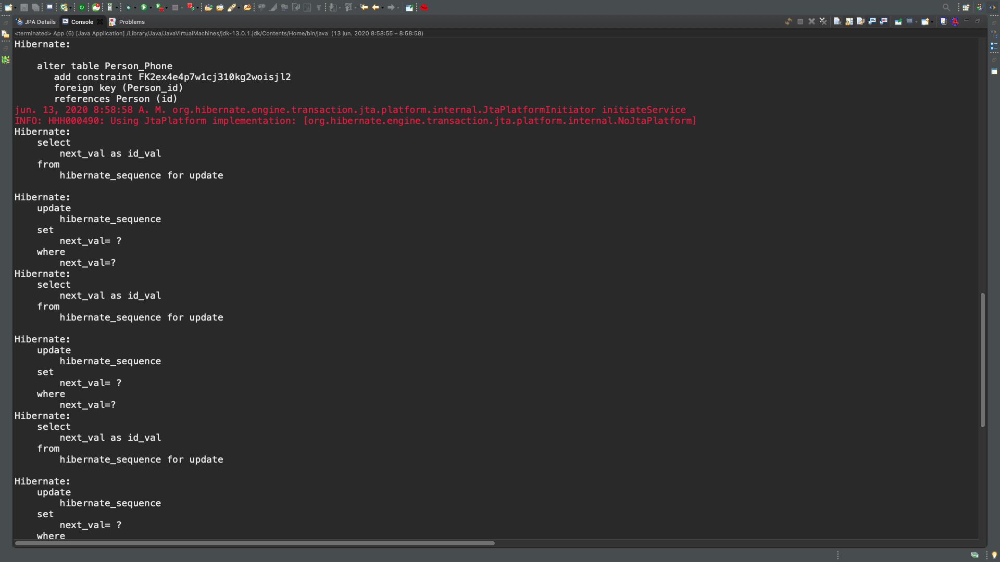

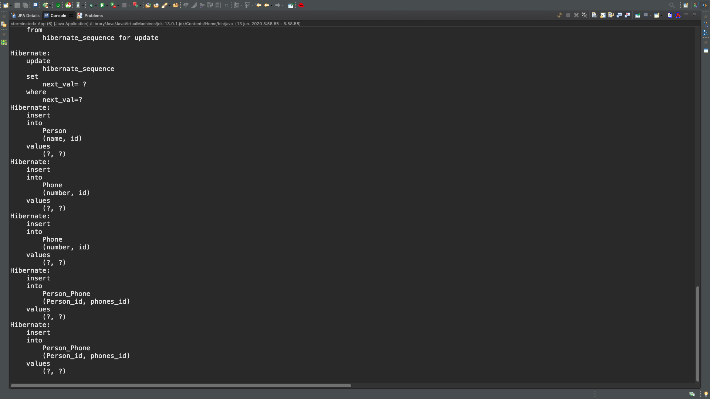

como podemos comprobar Hibernate a creado una tabla `Person`, una tabla `Phone` y para manejar la asociación ha creado la tabla auxiliar que se llama `Person_Phone` en lugar de crear una clave externa como sucedia con la asociación `ManytoOne`, además ha añadido una serie de restricciones como sería la restricción de unicidad para el identificador del teléfono en la tabla `Person_Phone` con lo cual no podríamos repetir el valor del teléfono dentro de la tabla y también ha añadido algunas referencias de clave externa antes de ponerse a insertar los distintos valores.

Si nos vamos a la base de datos podemos comprobar que se han creado estas tablas:

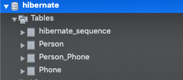

Como vemos también creo la tabla especial `hibernate_sequence` que utiliza Hibernate para ir creando los ids.

Tenemos las personas.

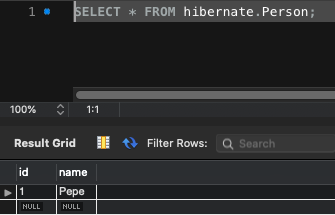

Tenemos los telefonos.

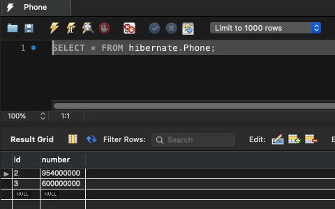

Ademas tenemos la tabla `person_phone` donde Hibernate va mapeando las asociaciones que existen entre ambos.

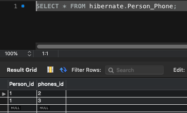

Si volvemos a ejecutar descomentando la línea `person.getPhones().remove(phone1);` que representa la posibilidad de la eliminación de este teléfono, tenemos:

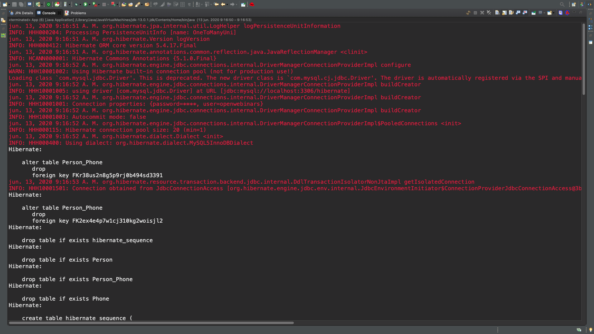

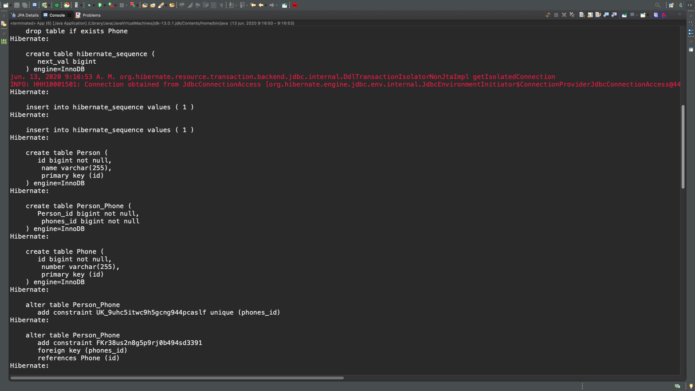

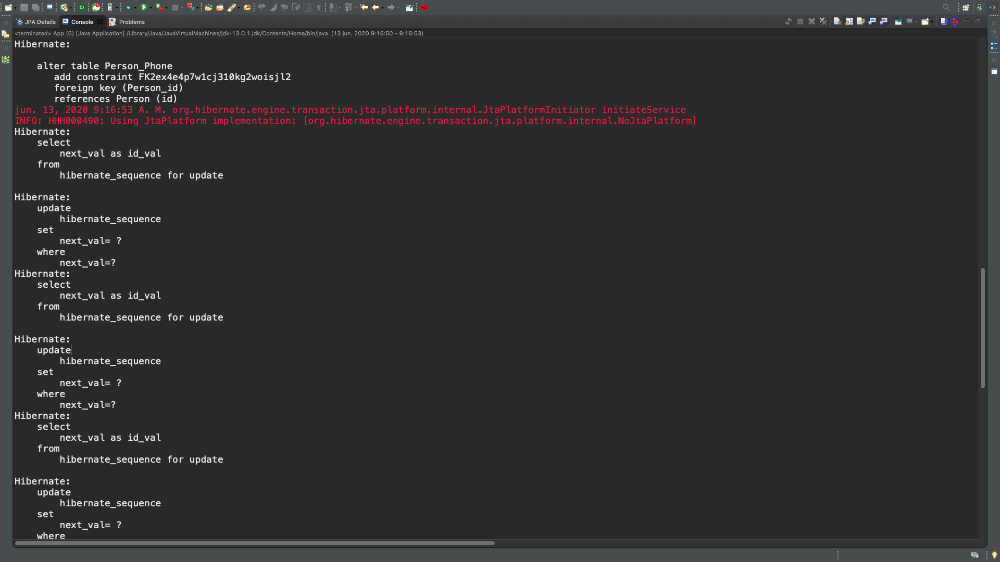

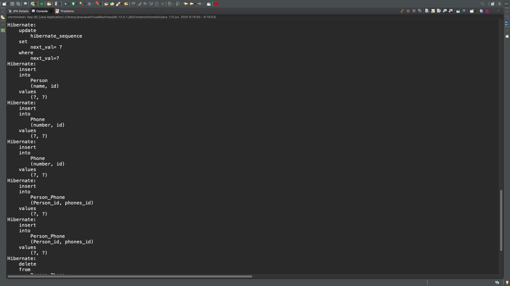

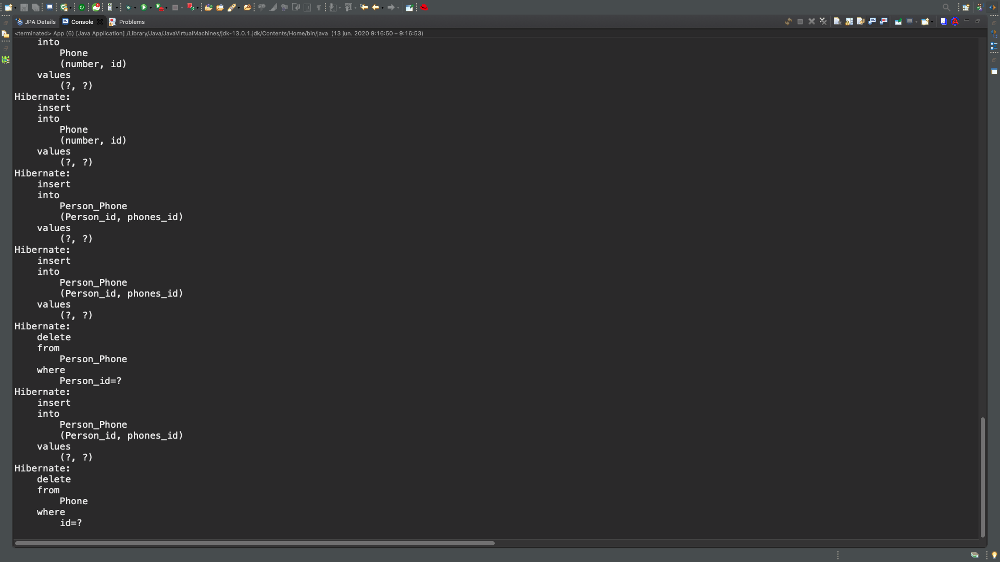

Hemos visto que no solamente se va a eliminar la asociación sino que además de borrar esta asociación que tenemos por aquí 


también se ha eliminado el número de teléfono 9540000000 en la tabla Phone

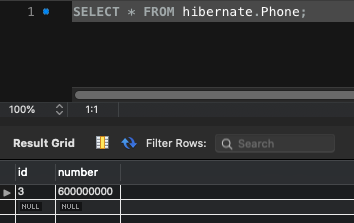

Así sería el tratamiento de las asociaciones OneToMany unidirectional.

### :computer: Código Completo - 130-10-HibernateJPA_OneToMany

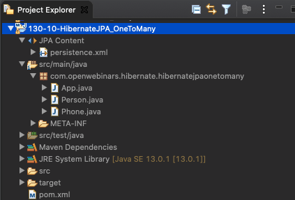

*`pom.xml`*

```html
<?xml version="1.0" encoding="UTF-8"?>

<project xmlns="http://maven.apache.org/POM/4.0.0"
	xmlns:xsi="http://www.w3.org/2001/XMLSchema-instance"
	xsi:schemaLocation="http://maven.apache.org/POM/4.0.0 http://maven.apache.org/xsd/maven-4.0.0.xsd">
	<modelVersion>4.0.0</modelVersion>

	<groupId>com.openwebinars.hibernate</groupId>
	<artifactId>130-10-HibernateJPA_OneToMany</artifactId>
	<version>0.0.1-SNAPSHOT</version>

	<name>130-10-HibernateJPA_OneToMany</name>
	<!-- FIXME change it to the project's website -->
	<url>http://www.example.com</url>

	<properties>
		<project.build.sourceEncoding>UTF-8</project.build.sourceEncoding>
		<maven.compiler.source>1.7</maven.compiler.source>
		<maven.compiler.target>1.7</maven.compiler.target>
	</properties>

	<dependencies>
		<dependency>
			<groupId>junit</groupId>
			<artifactId>junit</artifactId>
			<version>4.11</version>
			<scope>test</scope>
		</dependency>
		<dependency>
			<groupId>org.hibernate</groupId>
			<artifactId>hibernate-entitymanager</artifactId>
			<version>5.4.17.Final</version>
		</dependency>
		<!-- https://mvnrepository.com/artifact/mysql/mysql-connector-java -->
		<dependency>
			<groupId>mysql</groupId>
			<artifactId>mysql-connector-java</artifactId>
			<version>8.0.20</version>
		</dependency>
	</dependencies>

	<build>
		<pluginManagement><!-- lock down plugins versions to avoid using Maven 
				defaults (may be moved to parent pom) -->
			<plugins>
				<!-- clean lifecycle, see https://maven.apache.org/ref/current/maven-core/lifecycles.html#clean_Lifecycle -->
				<plugin>
					<artifactId>maven-clean-plugin</artifactId>
					<version>3.1.0</version>
				</plugin>
				<!-- default lifecycle, jar packaging: see https://maven.apache.org/ref/current/maven-core/default-bindings.html#Plugin_bindings_for_jar_packaging -->
				<plugin>
					<artifactId>maven-resources-plugin</artifactId>
					<version>3.0.2</version>
				</plugin>
				<plugin>
					<artifactId>maven-compiler-plugin</artifactId>
					<version>3.8.0</version>
				</plugin>
				<plugin>
					<artifactId>maven-surefire-plugin</artifactId>
					<version>2.22.1</version>
				</plugin>
				<plugin>
					<artifactId>maven-jar-plugin</artifactId>
					<version>3.0.2</version>
				</plugin>
				<plugin>
					<artifactId>maven-install-plugin</artifactId>
					<version>2.5.2</version>
				</plugin>
				<plugin>
					<artifactId>maven-deploy-plugin</artifactId>
					<version>2.8.2</version>
				</plugin>
				<!-- site lifecycle, see https://maven.apache.org/ref/current/maven-core/lifecycles.html#site_Lifecycle -->
				<plugin>
					<artifactId>maven-site-plugin</artifactId>
					<version>3.7.1</version>
				</plugin>
				<plugin>
					<artifactId>maven-project-info-reports-plugin</artifactId>
					<version>3.0.0</version>
				</plugin>
			</plugins>
		</pluginManagement>
	</build>
</project>
```

*`persistence.xml`*

```html
<?xml version="1.0" encoding="UTF-8"?>
<persistence version="2.1" xmlns="http://xmlns.jcp.org/xml/ns/persistence" xmlns:xsi="http://www.w3.org/2001/XMLSchema-instance" xsi:schemaLocation="http://xmlns.jcp.org/xml/ns/persistence http://xmlns.jcp.org/xml/ns/persistence/persistence_2_1.xsd">
	<persistence-unit name="OneToManyUni" transaction-type="RESOURCE_LOCAL">
		<class>com.openwebinars.hibernate.hibernatejpaonetomany.Person</class>
		<class>com.openwebinars.hibernate.hibernatejpaonetomany.Phone</class>
		<exclude-unlisted-classes>true</exclude-unlisted-classes>
		<properties>
			<property name="javax.persistence.jdbc.url" value="jdbc:mysql://localhost:3306/hibernate"/>
			<property name="javax.persistence.jdbc.user" value="openwebinars"/>
			<property name="javax.persistence.jdbc.password" value="12345678"/>
			<property name="javax.persistence.jdbc.driver" value="com.mysql.jdbc.Driver"/>
			<property name="hibernate.dialect" value="org.hibernate.dialect.MySQL5InnoDBDialect"/>
			<property name="hibernate.connection.driver_class" value="com.mysql.jdbc.Driver"/>
			<property name="hibernate.hbm2ddl.auto" value="create"/>
			<property name="hibernate.show_sql" value="true"/>
			<property name="hibernate.format_sql" value="true"/>
		</properties>
	</persistence-unit>
</persistence>
```

*`Person`*

```java
package com.openwebinars.hibernate.hibernatejpaonetomany;

import java.util.ArrayList;
import java.util.List;

import javax.persistence.CascadeType;
import javax.persistence.Entity;
import javax.persistence.GeneratedValue;
import javax.persistence.Id;
import javax.persistence.OneToMany;

@Entity
public class Person {

	@Id
	@GeneratedValue
	private long id;

	@OneToMany(cascade = CascadeType.ALL, orphanRemoval = true)
	private List<Phone> phones = new ArrayList<>();

	private String name;

	public Person() {
	}

	public Person(String name) {
		this.name = name;
	}

	public long getId() {
		return id;
	}

	public String getName() {
		return name;
	}

	public void setName(String name) {
		this.name = name;
	}

	public List<Phone> getPhones() {
		return phones;
	}
}
```

*`Phone`*

```java
package com.openwebinars.hibernate.hibernatejpaonetomany;

import javax.persistence.Entity;
import javax.persistence.GeneratedValue;
import javax.persistence.Id;

@Entity
public class Phone {
	
	@Id
	@GeneratedValue
	private long id;
	
	private String number;	
	
	public Phone() { }
	
	public Phone(String number) {
		this.number = number;
	}

	public String getNumber() {
		return number;
	}

	public void setNumber(String number) {
		this.number = number;
	}


	public long getId() {
		return id;
	}
	

}
```

*`App`*

```java
package com.openwebinars.hibernate.hibernatejpaonetomany;

import javax.persistence.EntityManager;
import javax.persistence.EntityManagerFactory;
import javax.persistence.Persistence;

/**
 * Asociaciones OneToMany unidireccionales
 * 
 * 
 */
public class App {
	public static void main(String[] args) {
		
		
		
		//Configuramos el EMF a través de la unidad de persistencia
		EntityManagerFactory emf = Persistence.createEntityManagerFactory("OneToManyUni");

		//Generamos un EntityManager
		EntityManager em = emf.createEntityManager();

		//Iniciamos una transacción
		em.getTransaction().begin();
		
		Person person = new Person("Pepe");
		Phone phone1 = new Phone("954000000");
		Phone phone2 = new Phone("600000000");

		person.getPhones().add(phone1);
		person.getPhones().add(phone2);
		em.persist(person);
		em.flush();

		person.getPhones().remove(phone1);
		

		//Commiteamos la transacción
		em.getTransaction().commit();
		
		//Cerramos el EntityManager
		em.close();
		
	}
}
```


Qué sucede si le queremos dar un tratamiento un poco más compacto en el que ya que tenemos una asociación podamos atacarla tanto por el lado uno como por el lado muchos, para ello tendremos la posibilidad de usar las asociaciones *Uno a Mucho Bidireccional*

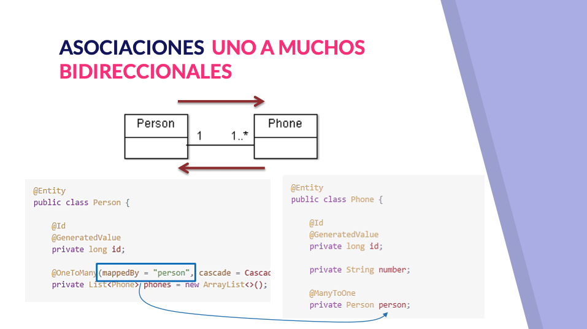

En este caso partimos de nuevo del lado muchos donde definiríamos la asociación a través de la anotación ManyToOne que vimos en la lección anterior y lo que haríamos sería referir en la asociación OneToMany en el lado uno, que toda esta asociación va a venir mapeada, va a venir definida, mediante esa clave externa. Con lo cual lo que estamos haciendo es asociar la asociación OneToMany con ManyToOne de forma que quedaría establecida esta asociación Uno a Muchos de forma bidireccional.

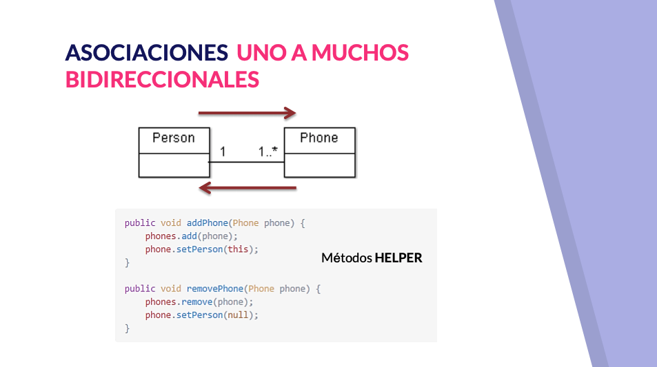

Para manejar la asociación bidireccional ya que, tenemos que establecer la asociación en el teléfono y la asociación en la persona, se suele proveer de unos métodos HELPER en el lado que nosotros decidamos de la asociación en la entidad en la que decidamos, parece que tiene sentido, que en este caso la importante sea la Persona que es la que posee los teléfono y en la que podemos añadir el método `addPhone` para añadir un teléfono y `removePhone` para eliminar un teléfono.

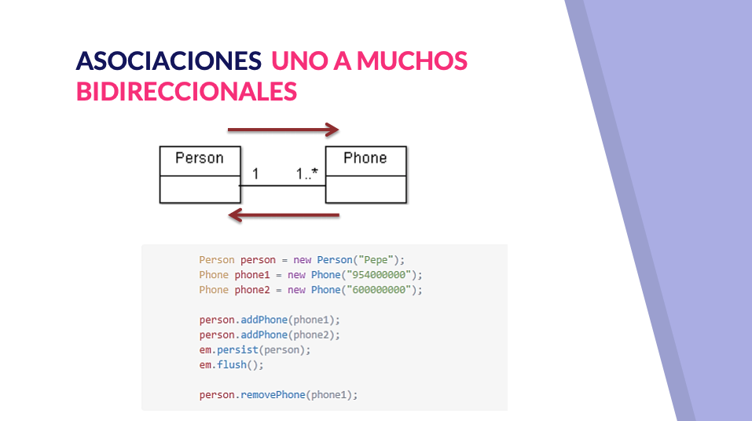

Bien si nos damos cuentas en `addPhone` lo que haríamos sería proporcionarle un teléfono y de una manera sencilla añadimos a la lista de teléfonos, el teléfono que acabamos de proporcionar y de otra manera en el lado opuesto en el teléfono en particular le asignamos como persona `this`, es decir la persona actual, para eliminar el teléfono haríamos la tarea correspondiente, el manejo de estas clase en una aplicación vendría a través de estos métodos HELPER que nos permitirían ir manejando la asociación.

Vamos a verlo en un ejemplo como el anterior, en el ejemplo de asociaciones OneToMany Bidireccional podemos comprobar como tenemos la columna `@ManyToOne` en `Phone` y en `Person` tenemos la `@OneToMany` como hemos visto en el ejemplo anterior. 

En Phone hemos añadido a la columna `number` un elemento nativo de Hibernate `@NaturalId` si no lo añadimos tampoco pasa nada. `@NaturalId` es una anotación que nos va a permitir decir que una columna en particular no tiene que ser clave primaria pero si podria ser lo que se conoce en base de datos como una clave candidata. Una columna que de forma natural perteneciendo de forma no postiza, como el id númerico que hemos creado sino de forma naturtal podría ser una clave candidata. 

```java
@NaturalId
@Column(unique=true)
private String number;	
```

Eso suele servir en el caso de hacer comparaciones, métodos como `hashCode`, `equals` y que para manejar elementos que estan dentro de colecciones van a ser bastante interesantes como son los métodos `hashCode`, `equals`, `equals` nos permite decir si dos Entidades son no identicas pero si equivalentes es decir si tenian los mismos valores. Aquí estamos usando la estrategia a partir de Java 7 para abreviar un poco los métodos `hashCode`, `equals`.

```java
@Override
public int hashCode() {
   return Objects.hash(number);
}

@Override
public boolean equals(Object o) {
   if ( this == o ) {
      return true;
   }
   if ( o == null || getClass() != o.getClass() ) {
      return false;
   }
   Phone phone = (Phone) o;
   return Objects.equals( number, phone.number );
}
```

En `Person` como deciamos antes tenemos la anotación `@OneToMany` con `mappedBy` el nombre `person` es el que le hemos dado en la entidad `Phone`.

```java
@OneToMany(mappedBy = "person", cascade = CascadeType.ALL, orphanRemoval = true)
private List<Phone> phones = new ArrayList<>();
```

Vamos a ejecutar el proyecto

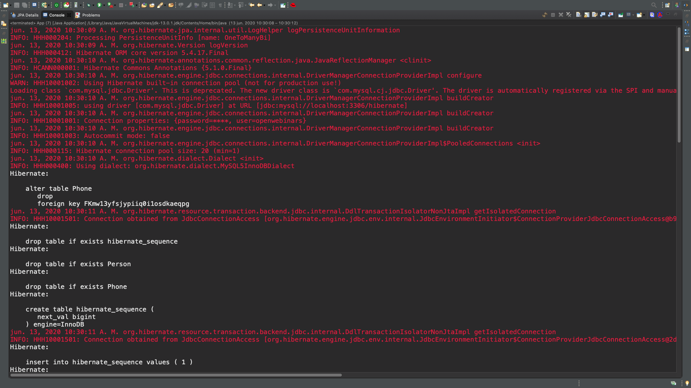

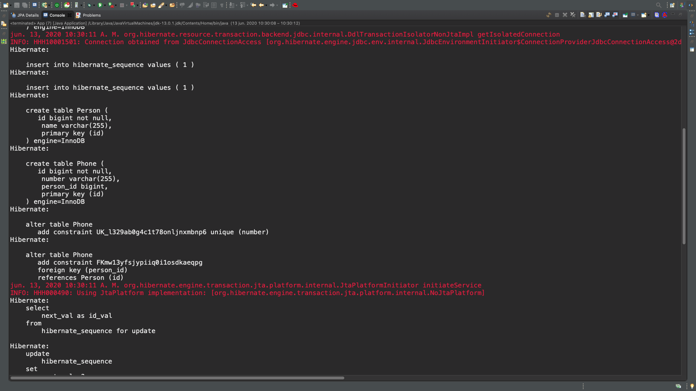

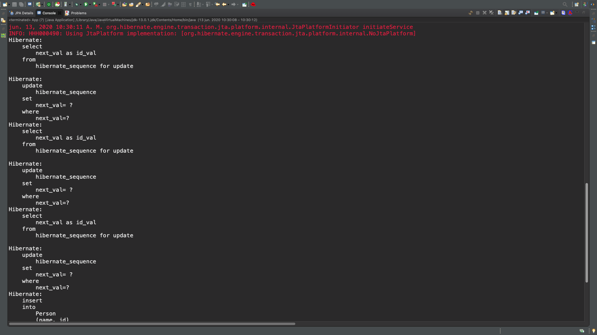

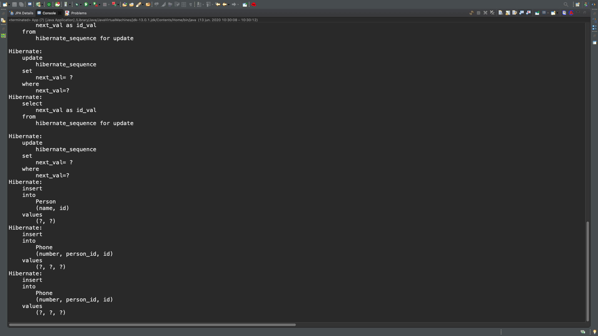

Podemos comprobar en la base de datos.

Para empezar no tenemos esa tercera tabla de asociación.

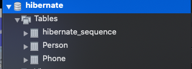

La asociación la marca la clave externa que se ha generado en la tabla `phone` al igual que cuando teniamos una asociación `ManyToOne` (de hecho ahora la tenemos).

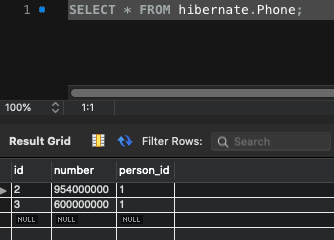

Y en la tabla `person` tenemos  la persona.

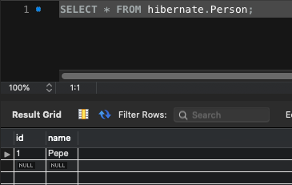

Sin embargo a traves de la asociación `person_id` de la tabla `phone` podemos marcar y podemos encontrar que una persona puede tener a su disposición una lista de teléfonos. Tanto es así que si quisieramos mostrarlos podríamos recorrer la lista con un bucle normal.

Si ejecutamos nuevamente la aplicacción descomentando la línea `person.removePhone(phone1);` haciendo uso del método `addPhone` hemos añadido los telefonos y con el método HELPER `person.removePhone(phone1);` podríamos eliminarlo .

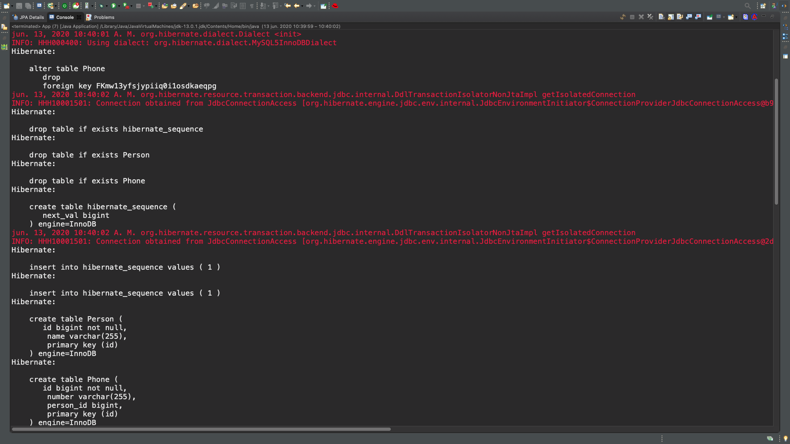

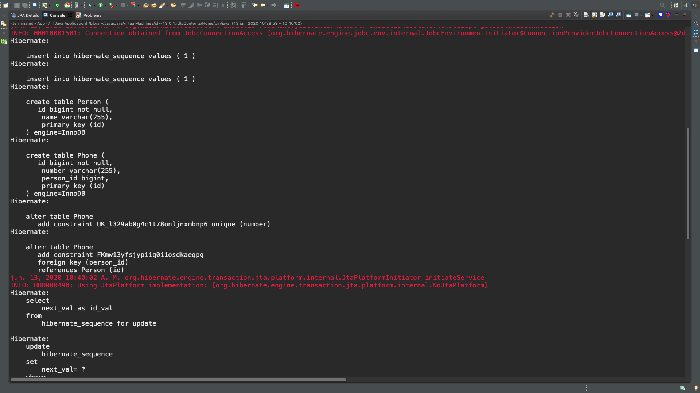

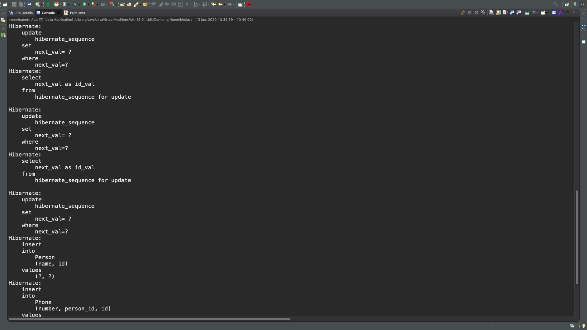


Como vemos se ha ejecutado la secuencia de borrado.

En la tabla `phone` a desaparecido el teléfono 954000000 por lo que la persona que hemos creado tendría un teléfono menos.

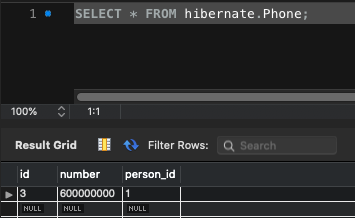

### :computer: Código Completo - 130-11-HibernateJPA_OneToManyBidireccional

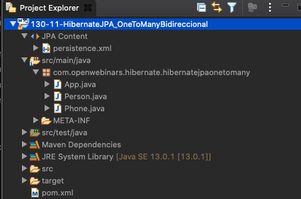

*`pom.xml`*

```html
<?xml version="1.0" encoding="UTF-8"?>

<project xmlns="http://maven.apache.org/POM/4.0.0"
	xmlns:xsi="http://www.w3.org/2001/XMLSchema-instance"
	xsi:schemaLocation="http://maven.apache.org/POM/4.0.0 http://maven.apache.org/xsd/maven-4.0.0.xsd">
	<modelVersion>4.0.0</modelVersion>

	<groupId>com.openwebinars.hibernate</groupId>
	<artifactId>130-11-HibernateJPA_OneToManyBidireccional</artifactId>
	<version>0.0.1-SNAPSHOT</version>

	<name>130-11-HibernateJPA_OneToManyBidireccional</name>
	<!-- FIXME change it to the project's website -->
	<url>http://www.example.com</url>

	<properties>
		<project.build.sourceEncoding>UTF-8</project.build.sourceEncoding>
		<maven.compiler.source>1.7</maven.compiler.source>
		<maven.compiler.target>1.7</maven.compiler.target>
	</properties>

	<dependencies>
		<dependency>
			<groupId>junit</groupId>
			<artifactId>junit</artifactId>
			<version>4.11</version>
			<scope>test</scope>
		</dependency>
		<dependency>
			<groupId>org.hibernate</groupId>
			<artifactId>hibernate-entitymanager</artifactId>
			<version>5.4.17.Final</version>
		</dependency>
		<!-- https://mvnrepository.com/artifact/mysql/mysql-connector-java -->
		<dependency>
			<groupId>mysql</groupId>
			<artifactId>mysql-connector-java</artifactId>
			<version>8.0.20</version>
		</dependency>
	</dependencies>

	<build>
		<pluginManagement><!-- lock down plugins versions to avoid using Maven 
				defaults (may be moved to parent pom) -->
			<plugins>
				<!-- clean lifecycle, see https://maven.apache.org/ref/current/maven-core/lifecycles.html#clean_Lifecycle -->
				<plugin>
					<artifactId>maven-clean-plugin</artifactId>
					<version>3.1.0</version>
				</plugin>
				<!-- default lifecycle, jar packaging: see https://maven.apache.org/ref/current/maven-core/default-bindings.html#Plugin_bindings_for_jar_packaging -->
				<plugin>
					<artifactId>maven-resources-plugin</artifactId>
					<version>3.0.2</version>
				</plugin>
				<plugin>
					<artifactId>maven-compiler-plugin</artifactId>
					<version>3.8.0</version>
				</plugin>
				<plugin>
					<artifactId>maven-surefire-plugin</artifactId>
					<version>2.22.1</version>
				</plugin>
				<plugin>
					<artifactId>maven-jar-plugin</artifactId>
					<version>3.0.2</version>
				</plugin>
				<plugin>
					<artifactId>maven-install-plugin</artifactId>
					<version>2.5.2</version>
				</plugin>
				<plugin>
					<artifactId>maven-deploy-plugin</artifactId>
					<version>2.8.2</version>
				</plugin>
				<!-- site lifecycle, see https://maven.apache.org/ref/current/maven-core/lifecycles.html#site_Lifecycle -->
				<plugin>
					<artifactId>maven-site-plugin</artifactId>
					<version>3.7.1</version>
				</plugin>
				<plugin>
					<artifactId>maven-project-info-reports-plugin</artifactId>
					<version>3.0.0</version>
				</plugin>
			</plugins>
		</pluginManagement>
	</build>
</project>
```

*`persistence.xml`*

```html
<?xml version="1.0" encoding="UTF-8"?>
<persistence version="2.1" xmlns="http://xmlns.jcp.org/xml/ns/persistence" xmlns:xsi="http://www.w3.org/2001/XMLSchema-instance" xsi:schemaLocation="http://xmlns.jcp.org/xml/ns/persistence http://xmlns.jcp.org/xml/ns/persistence/persistence_2_1.xsd">
	<persistence-unit name="OneToManyBi" transaction-type="RESOURCE_LOCAL">
		<class>com.openwebinars.hibernate.hibernatejpaonetomany.Person</class>
		<class>com.openwebinars.hibernate.hibernatejpaonetomany.Phone</class>
		<exclude-unlisted-classes>true</exclude-unlisted-classes>
		<properties>
			<property name="javax.persistence.jdbc.url" value="jdbc:mysql://localhost:3306/hibernate"/>
			<property name="javax.persistence.jdbc.user" value="openwebinars"/>
			<property name="javax.persistence.jdbc.password" value="12345678"/>
			<property name="javax.persistence.jdbc.driver" value="com.mysql.jdbc.Driver"/>
			<property name="hibernate.dialect" value="org.hibernate.dialect.MySQL5InnoDBDialect"/>
			<property name="hibernate.connection.driver_class" value="com.mysql.jdbc.Driver"/>
			<property name="hibernate.hbm2ddl.auto" value="create"/>
			<property name="hibernate.show_sql" value="true"/>
			<property name="hibernate.format_sql" value="true"/>
		</properties>
	</persistence-unit>
</persistence>
```

*`Person.java`*

```java
package com.openwebinars.hibernate.hibernatejpaonetomany;

import java.util.ArrayList;
import java.util.List;

import javax.persistence.CascadeType;
import javax.persistence.Entity;
import javax.persistence.GeneratedValue;
import javax.persistence.Id;
import javax.persistence.OneToMany;

@Entity
public class Person {
	
	
	@Id
	@GeneratedValue
	private long id;
	
	@OneToMany(mappedBy = "person", cascade = CascadeType.ALL, orphanRemoval = true)
    private List<Phone> phones = new ArrayList<>();
	
	private String name;
	
	public Person() { }
	
	public Person(String name) {
		this.name = name;
	}

	public long getId() {
		return id;
	}

	public String getName() {
		return name;
	}

	public void setName(String name) {
		this.name = name;
	}
	
	
	public List<Phone> getPhones() {
        return phones;
    }	
	
	public void addPhone(Phone phone) {
		phones.add(phone);
		phone.setPerson(this);
	}

	public void removePhone(Phone phone) {
		phones.remove(phone);
		phone.setPerson(null);
	}
	

}
```

*`Phone.java`*

```java
package com.openwebinars.hibernate.hibernatejpaonetomany;

import java.util.Objects;

import javax.persistence.Column;
import javax.persistence.Entity;
import javax.persistence.GeneratedValue;
import javax.persistence.Id;
import javax.persistence.ManyToOne;

import org.hibernate.annotations.NaturalId;

@Entity
public class Phone {
	
	@Id
	@GeneratedValue
	private long id;
	
	@NaturalId
	@Column(unique=true)
	private String number;	
	
	@ManyToOne
	private Person person;
	
	public Phone() { }
	
	public Phone(String number) {
		this.number = number;
	}

	public String getNumber() {
		return number;
	}

	public void setNumber(String number) {
		this.number = number;
	}


	public long getId() {
		return id;
	}

	public Person getPerson() {
		return person;
	}

	public void setPerson(Person person) {
		this.person = person;
	}

	@Override
	public int hashCode() {
		return Objects.hash(number);
	}

	@Override
	public boolean equals(Object o) {
		if ( this == o ) {
            return true;
        }
        if ( o == null || getClass() != o.getClass() ) {
            return false;
        }
        Phone phone = (Phone) o;
        return Objects.equals( number, phone.number );
	}	
}
```

*`App.java`*

```java
package com.openwebinars.hibernate.hibernatejpaonetomany;

import javax.persistence.EntityManager;
import javax.persistence.EntityManagerFactory;
import javax.persistence.Persistence;

/**
 * Asociaciones OneToMany bidireccionales
 * www.openwebinars.net
 * @LuisMLopezMag
 */
public class App {
	public static void main(String[] args) {
		
		
		
		//Configuramos el EMF a través de la unidad de persistencia
		EntityManagerFactory emf = Persistence.createEntityManagerFactory("OneToManyBi");

		//Generamos un EntityManager
		EntityManager em = emf.createEntityManager();

		//Iniciamos una transacción
		em.getTransaction().begin();
		
		Person person = new Person("Pepe");
		Phone phone1 = new Phone("954000000");
		Phone phone2 = new Phone("600000000");

		person.addPhone(phone1);
		person.addPhone(phone2);
		em.persist(person);
		em.flush();

		person.removePhone(phone1);
		

		//Commiteamos la transacción
		em.getTransaction().commit();
		
		//Cerramos el EntityManager
		em.close();
		
	}
}
```

# 12 OneToOne: Unidireccional y bidireccional 7:18 

[OneToOne: Unidireccional y bidireccional](pdfs/10_Asociaciones_OneToOne.pdf)

## Resumen Profesor

Las asociaciones Uno-a-Uno también pueden ser unidireccionales o bidireccionales.

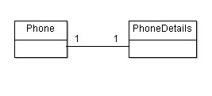

*Asociación uno-a-uno*

### 10.1.1 `@OneToOne` unidireccional

En una asociación uno-a-uno, solamente una instancia de una clase se asocia con una instancia de otra. Al usar el esquema *unidireccional*, tenemos que decidir un lado como **propietario**.

```java
@Entity
public class Phone {

    @Id
    @GeneratedValue
    private long id;

    private String number;

    @OneToOne
    @JoinColumn(name = "details_id")
    private PhoneDetails details;

    public Phone() {
    }

    //Resto de métodos

    public PhoneDetails getDetails() {
        return details;
    }

    public void setDetails(PhoneDetails details) {
        this.details = details;
    }

    public long getId() {
        return id;
    }

}

@Entity
public class PhoneDetails {

    @Id
    @GeneratedValue
    private Long id;

    private String provider;

    private String technology;

    public PhoneDetails() {
    }

    public PhoneDetails(String provider, String technology) {
        this.provider = provider;
        this.technology = technology;
    }

    public String getProvider() {
        return provider;
    }

    public String getTechnology() {
        return technology;
    }

    public void setTechnology(String technology) {
        this.technology = technology;
    }

}
```

En apariencia, el tratamiento de esta asociación es como una `@ManyToOne` (desde el punto de vista relacional, estamos usando una clave externa). Sin embargo, no tendría sentido que entender la entidad `PhoneDetails` como padre, y `Phone` como hija (no podemos tener unos detalles de teléfono sin un teléfono). Para solucionar esto, podemos usar una asociación bidireccional.

#### 10.1.2 @OneToOne bidireccional

Para añadir el tratamiento bidireccional, añadimos un reflejo de la asociación en la clase `PhoneDetails`.

```java
@Entity
public class Phone {

    @Id
    @GeneratedValue
    private Long id;

    @Column(name = "`number`")
    private String number;

    @OneToOne(mappedBy = "phone", cascade = CascadeType.ALL, orphanRemoval = true, fetch = FetchType.LAZY)
    private PhoneDetails details;

    public Phone() {
    }

    //Resto de métodos

    public PhoneDetails getDetails() {
        return details;
    }

    public void addDetails(PhoneDetails details) {
        details.setPhone(this);
        this.details = details;
    }

    public void removeDetails() {
        if (details != null) {
            details.setPhone(null);
            this.details = null;
        }
    }
}


@Entity
public class PhoneDetails {

        @Id
        @GeneratedValue
        private Long id;

        private String provider;

        private String technology;

        @OneToOne(fetch = FetchType.LAZY)
        @JoinColumn(name = "phone_id")
        private Phone phone;

        public PhoneDetails() {
        }

            //Resto de métodos
}
```

En este caso, los métodos:

```java
public void addDetails(PhoneDetails details) {
    details.setPhone(this);
    this.details = details;
}

public void removeDetails() {
    if (details != null) {
        details.setPhone(null);
        this.details = null;
    }
}
```

gestionan la lógica de la asociación. De esa forma, el ciclo de vida de uso sería como siguie:

```java
Phone phone = new Phone("954000000");
PhoneDetails details = new PhoneDetails("Movistar", "Fijo");
phone.addDetails(details);
em.persist(phone);
```

## Preguntas

P= Me parece interesante comentarlo, ya que yo con Hibernate con ficheros de mapeo sí he trabajado, pero con JPA no y por eso me parece interesante mencionar esto, dado que es una diferencia entre Hibernate y JPA importante. En este video (oneToOne) sobre el minuto 5 dices que vamos añadir el modo de recuperación LAZY, y que hasta ahora hemos estado usando el EAGER, pero en realidad no hemos puesto nada y en caso de no poner nada Hibernate `*usa *lazy **por defecto para todas las asociaciones, sin embargo, como bien apuntas JPA usa EAGER en este caso,**` pero en otras relaciones, por defecto usa LAZY, aquí las pongo para que lo tengamos presente:

OneToMany: LAZY
ManyToOne: EAGER
ManyToMany: LAZY
OneToOne: EAGER

Si me he equivocado en algo, te agradecería que me corrigieses. O si tienes alguna otra cosa que explicar sobre los modos de recuperación que creas interesante, te agradezco que la aportes (o cualquiera que siga el curso y tenga algo más que aportar al respecto).

R= Buceando un poco en la documentación oficial de JPA e Hibernate, puedo inferir lo siguiente:

1) Por defecto, JPA establece como FetchType el tipo LAZY para los que acaban en ...Many, y EAGER para los que acaban en ...One, es decir:

OneToOne: EAGER
ManyToOne: EAGER
OneToMany: LAZY
ManyToMany: LAZY

2) Si utilizamos JPA con Hibernate como implementación, Hibernate aplica lo establecido por el estándar (pongamos, JPA 2.1). Es decir, sigue la especificación de la tabla anterior.

3) Otra cosa diferente es usar Hibernate de forma nativa, sin aplicar por encima la capa de abstracción de JPA. Tras buscar en la documentación de Hibernate, solo he encontrado esta referencia en el apartado 11.3 Applying fetch strategies:

* The Hibernate recommendation is to statically mark all associations lazy and to use dynamic fetching strategies for eagerness. This is unfortunately at odds with the JPA specification which defines that all one-to-one and many-to-one associations should be eagerly fetched by default. Hibernate, as a JPA provider, honors that default.

P= Porque haces una desasociación en el removeDetails() de la clase Phone:

En vez de hacer un remove propiamente dicho, tiene que ver algo con la asociación entre las clases??? ( en este caso ONETOONE)

```java
public void removeDetails() {
   if (details != null) {
      details.setPhone(null);
      this.details = null;
   }
}
```    
## Transcripción

En este caso vamos a hablar de las asociaciones oNEtoONE es decir la asociación es también le podemos dar un tratamiento unidireccional o bidireccional las asociaciones 1-1 pues son aquellas asociaciones en las que solamente una entidad del lado que podríamos llamar izquierdo se asocian con solamente una entidad de la del lado que podríamos llamar del lado derecho no en tratamiento que le podemos dar a una asociación 11 unidireccionales muy parecido alel significado semántico que tiene la asociación sería un poco distinto veamos un ejemplo de asociación uno a uno unidireccional en este caso en lugar de tener la entidad verso y la vamos a tener la entidad y fondue tails y si bien existe algún tipo de dependencia de existencia en telefónico de forma que teléfono si es verdad que mejor colocar la asociación dentro del lado a esa asociación para hacerme ejemplo pues nada más que tendremos que crear teléfono que hablo vale añadir los detalle al teléfono y persistir lo de forma que quedaría quedaría la asociación ya refresca vamos a comprobarlo los resultados como podemos comprobar el teléfono se los detalles y se han actualizado para establecer la asociación miramos en phone podemos comprobar como tenemos la clave externa que la tenemos aquí al ser una sucesión cuánto van solamente se asociaría una fila con una sola fila de este sería el tratamiento unidireccional de las asociaciones uno le queremos dar un tratamiento bidireccionalporque porque ahora lo que haría sería cambiar la notación oNEtoONE que teníamos antes en la clase la pasaríamos a homelidays y lo pasaríamos porque como decíamos en el lado opuesto en el lado fo añadiremos también la asociación y lo queremos no hace falta para otro ejemplo de opciónel modo no perezoso el modo y el otro modo que podemos usar y que hemos para manejar esta asociación bidireccional necesitaríamos también desde unos métodos helper admiten si me tenéis que nos pondremos pues en la clase en la clase vamos a ver este ejemplo en funciones clave externa la pondríamos en la clase fortnite y la cuánto cuánto cuesta que va mapeada la pondríamos en la entidad y aquí añadiríamos que van a permitir establecer las realizar una asignación de la asociación en ambos antes teníamos la clave externa ahora no la tenemos el teléfono dónde podemos encontraren la próxima lección que será la última y un poco más extensa sobre asociaciones vamos a aprender a tratar la asociaciones muchos a muchos unidireccionales y bidireccionales y un tipo especial que puede llevar atributos


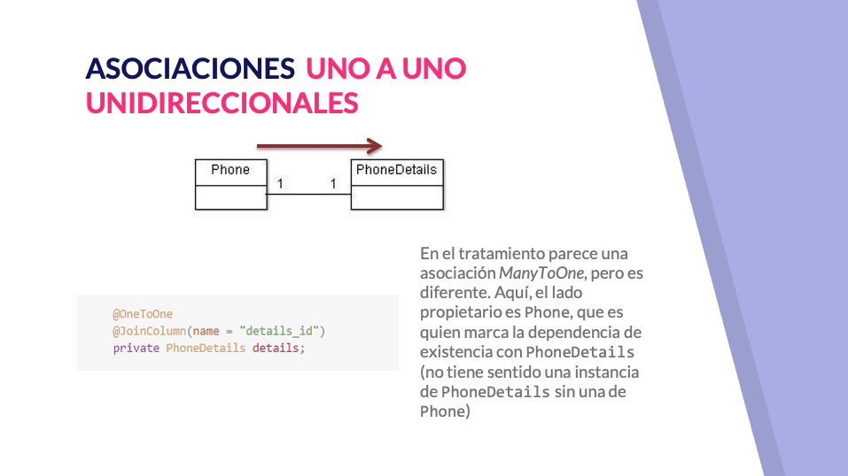


# 13 ManyToMany: 18:06 

[ManyToMany](pdfs/11_Asociaciones_ManyToMany.pdf)

## Resumen Profesor

Todas las asociaciones muchos a muchos necesitan una tabla que realice de enlace entre ambas entidades asociadas. Veamos el tratamiento unidireccional y bidireccional.

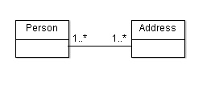

*Asociación muchos a muchos*

### 11.2 `@ManyToMany` unidireccional

Tendremos que definir qué lado es el propietario de la asociación. En esa clase, incluimos una lista de elementos de la clase opuesta.

```java
@Entity
public class Person {


    @Id
    @GeneratedValue
    private Long id;
    @ManyToMany(cascade = {CascadeType.PERSIST, CascadeType.MERGE})
    private List<Address> addresses = new ArrayList<>();

    public Person() {
    }

    public List<Address> getAddresses() {
        return addresses;
    }

}

@Entity
public class Address {

    @Id
    @GeneratedValue
    private Long id;

    private String street;

    private String number;

    public Address() {
    }

    public Address(String street, String number) {
        this.street = street;
        this.number = number;
    }

    public Long getId() {
        return id;
    }

    public String getStreet() {
        return street;
    }

    public String getNumber() {
        return number;
    }

}
```

Cuando una entidad se elimina de la colección `@ManyToMany`, Hibernate simplemente elimina la fila correspondiente de la tabla de enlace. Desafortunadamente, esta operación requiere eliminar todas las entradas asociadas para el padre seleccionado, y recrear aquellas que actualmente están en el contexto de persistencia.

Con un esquema unidireccional, un posible manejo de estas entidades sería el siguiente:

```java
Person person1 = new Person();
Person person2 = new Person();

Address address1 = new Address( "Rue del Percebe", "13" );
Address address2 = new Address( "Av. de la Constitución", "1" );

person1.getAddresses().add(address1);
person1.getAddresses().add(address2);

person2.getAddresses().add(address1);

em.persist(person1);
em.persist(person2);

em.flush();
```

### 11.3 `@ManyToMany` bidireccional

Una asociación bidireccional `@ManyToMany` tiene un lado *propietario* y un lado `mappedBy`. Para preservar la sincronización entre ambos, es buena práctica añadir métodos *helper* para manejar las asociaciones (como en ocasiones anteriores).

```java
@Entity
public class Person {


    @Id
    @GeneratedValue
    private Long id;

    @NaturalId
    private String registrationNumber;
    @ManyToMany(cascade = {CascadeType.PERSIST, CascadeType.MERGE})
    private List<Address> addresses = new ArrayList<>();

    public Person() {
    }

    public Person(String registrationNumber) {
        this.registrationNumber = registrationNumber;
    }

    public List<Address> getAddresses() {
        return addresses;
    }

    public void addAddress(Address address) {
        addresses.add( address );
        address.getOwners().add( this );
    }

    public void removeAddress(Address address) {
        addresses.remove( address );
        address.getOwners().remove( this );
    }

    @Override
    public boolean equals(Object o) {
        if ( this == o ) {
            return true;
        }
        if ( o == null || getClass() != o.getClass() ) {
            return false;
        }
        Person person = (Person) o;
        return Objects.equals( registrationNumber, person.registrationNumber );
    }

    @Override
    public int hashCode() {
        return Objects.hash( registrationNumber );
    }

}

@Entity
public class Address {

    @Id
    @GeneratedValue
    private Long id;

    private String street;

    private String number;

    private String postalCode;

    @ManyToMany(mappedBy = "addresses")
    private List<Person> owners = new ArrayList<>();

    public Address() {
    }

    public Address(String street, String number, String postalCode) {
        this.street = street;
        this.number = number;
        this.postalCode = postalCode;
    }

    public Long getId() {
        return id;
    }

    //Resto de métodos

    @Override
    public boolean equals(Object o) {
        if ( this == o ) {
            return true;
        }
        if ( o == null || getClass() != o.getClass() ) {
            return false;
        }
        Address address = (Address) o;
        return Objects.equals( street, address.street ) &&
                Objects.equals( number, address.number ) &&
                Objects.equals( postalCode, address.postalCode );
    }

    @Override
    public int hashCode() {
        return Objects.hash( street, number, postalCode );
    }

}
```

Cabe destacar la lógica de los métodos helper, que nos permiten establecer las referencias (o eliminarlas) entre ambas clases.

```java
public void addAddress(Address address) {
        addresses.add( address );
        address.getOwners().add( this );
}

public void removeAddress(Address address) {
        addresses.remove( address );
        address.getOwners().remove( this );
}
```

### 11.4 `@ManyToMany` con atributos extra

Un caso que suele presentarse en muchas ocasiones con las asociaciones muchos a muchos es que necesitamos añadir un atributo que no es de ninguna de las dos entidades, sino de la asociación en sí.

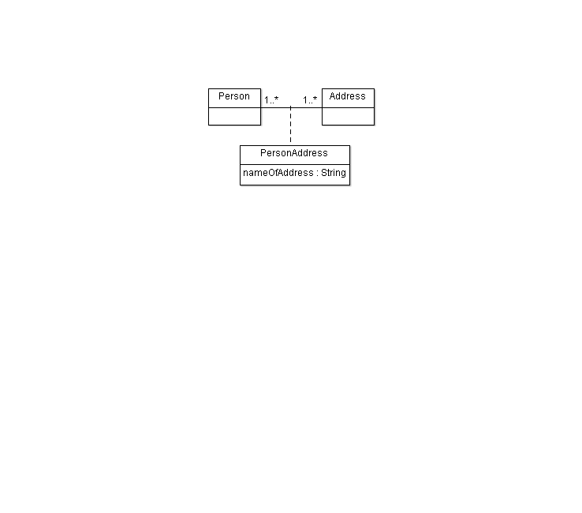

*Asociación muchos a muchos con clase de asociación*

Algunos autores llaman a este tipo de asociación con atributos **clase de asociación**.

Como este nuevo atributo no es ni de la dirección, ni de la persona, no lo podemos colocar en ninguna de las dos entidades, por lo que tenemos que seguir los siguientes pasos:

1. Generar una nueva entidad `PersonAddress`

2. Romper la asociación `@ManyToMany` en ambos extremos en dos asociaciones que den el mismo resultado: `@ManyToOne` + `@OneToMany`.

3. Manejar de forma conveniente la clave primaria de esta nueva entidad. Al ser una clave primaria compuesta, necesitaremos de una clase extra, `PersonAddressId`, y de la anotación `@IdClass`, para poder manejarla.

```java
@Entity
public class Address {

    @Id
    @GeneratedValue
    private Long id;

    private String street;

    private String number;

    private String postalCode;

    @OneToMany(mappedBy = "address", cascade = CascadeType.ALL, orphanRemoval = true)
    private List<PersonAddress> owners = new ArrayList<>();

    //Resto de métodos


    public List<PersonAddress> getOwners() {
        return owners;
    }

    //Resto de métodos
}

@Entity
public class Person {


    @Id
    @GeneratedValue
    private Long id;

    @NaturalId
    private String registrationNumber;

    @OneToMany(mappedBy = "person", cascade = CascadeType.ALL, orphanRemoval = true)
    private List<PersonAddress> addresses = new ArrayList<>();

    //Resto de métodos

    public List<PersonAddress> getAddresses() {
        return addresses;
    }

    //Resto de métodos
}
```

Como podemos ver, las entidades `Person` y `Address` tienen ahora una asociación `@OneToMany` en lugar de una `@ManyToMany`. ¿Dónde está el resto de esa asociación? Veamos la entidad `PersonsAddress`.

```java
@Entity
@IdClass(PersonAddressId.class)
public class PersonAddress {


    @Id
    @ManyToOne
    @JoinColumn(
            name="person_id",
            insertable = false, updatable = false
    )
    private Person person;

    @Id
    @ManyToOne
    @JoinColumn(
            name="address_id",
            insertable = false, updatable = false
    )
    private Address address;

    private String nameOfAddress;


    public PersonAddress() { }


    public PersonAddress(Person person, Address address) {
        this.person = person;
        this.address = address;

    }

    public PersonAddress(Person person, Address address, String name) {
        this(person, address);
        this.nameOfAddress = name;
    }

    //Resto de métodos

}


public class PersonAddressId implements Serializable {

    private Long person;
    private Long address;

    public PersonAddressId() {

    }

    //Getters, setters, equals y hashCode

}
```

La anotación `@Id` solo está permitida, en primera instancia, para claves primarias simples, por lo que una entidad, por norma, no puede tener dos atributos anotados con `@Id`. Para poder manejar una clave primaria **compuesta**, JPA nos obliga a utilizar alguna estrategia diferente, como `@IdClass` o `@EmbeddId`. Nosotros optamos por la primera. Para ello, creamos una clase que tendrá los campos que conforman la clave primaria y que cumplirá con las siguientes características:

* Debe ser una clase pública

* Debe tener un constructor sin argumentos

* Debe implementar `Serializable`

* No debe tener ***clave primaria propia***

* Debe implementar los métodos `equals` y `hashCode`.

Para poder manejar ahora el ciclo de vida de esta nueva entidad, podemos modificar los métodos *helper* que estábamos usando:

```java
    public void addAddress(Address address, String name) {
        PersonAddress personAddress = new PersonAddress( this, address, name );
        addresses.add( personAddress );
        address.getOwners().add(personAddress);
    }

    public void removeAddress(Address address) {
        PersonAddress personAddress = new PersonAddress( this, address);
        address.getOwners().remove( personAddress );
        addresses.remove( personAddress );
    }
```

## Preguntas

P= Ya sé que estamos usando JPA con anotaciones, pero tengo una curiosidad. ¿Como se haría la asociación muchos a muchos con atributos extra en ficheros hbm?

R= Si no me equivoco, te trataría de usar el elemento `<composite-id>` en la clase que hace de join, para poder indicar que se trata de un id compuesto por más de un campo; posteriormente, se podrían añadir el resto de campos extra.

Este código que pego aquí lo he escrito al vuelo, pero sería la forma aproximada de poder realizarlo:

```html
    <class name="...PersonAddress" table="PERSONADDRESS">

        <composite-id name="id" class="ProductAddressId">
            <key-many-to-one name="person" entity-name="Person" column="person_id" />
            <key-many-to-one name="address" entity-name="Address" column="address_id" />
        </composite-id>

        <property name="nameOfAddress" type="String">
            <column name="NAMEOFADDRESS" />
        </property>
    </class>
```

Con todo, mi recomendación es usar solamente los ficheros XML en proyectos legacy o sí o solo sí el equipo de desarrollo es tan experto en este tipo de mapeos, que el uso de anotaciones pueda retrasar el desarrollo. En cualquier otro caso, recomiendo el uso de anotaciones, mucho más en consonancia con las tendencias actuales, y a mi modo de ver, más fácil de codificar y mantener.

P= 1.- En la documentación veo que se usa en las realaciones de los atributos respecto a otras entidades SET y en los videos/documentación se hace con LIST. ¿Que debemos de usar realmente?.

2.- Respecto a las asociaciones compuestas cuando definimos la clase PersonAddress que tira de la clase PersonAddressId.class, comentas que para el atributo person consulta el atributo definido de la siguiente forma private Long person, pero el JoinColumn no esta definido ese atributo tal cual sino que esta person_id. ¿Esto puede ser porque solo busca el nombre desechando el _id?

3.- ¿En la clase PersonAddres, en los @JoinColumn defines insertable, updatable a false, cual es la finalidad?

R= 1) Puedes utilizar alguno de los dos. Es verdad que viendo algo más de literatura sobre JPA/Hibernate, aparece el uso de la coleccion Set. Posiblemente sea más eficaz, ya que para el caso de List se hace uso de una implementación llamada Bag.

2) A nivel de tabla, el atributo se llamará person_id. Puedes comprobarlo en el log, donde se muestran las sentencias del DDL al generar el esquema:

```sql
create table PersonAddress (
       address_id bigint not null,
        person_id bigint not null,
        nameOfAddress varchar(255),
        primary key (address_id, person_id)
    );
```    

La correspondencia entre la clase PersonAddress y PersonAddressId se hace a través del nombre del atributo (y gracias a que indicamos las anotaciones de @IdClass y @Id).

Indicando que estos dos atributos no se pueden modificar desde esta entidad, estamos dando a entender que solo vamos a poder modificar estos valores desde un solo sitio (a saber, las correspondientes entidades Person y Address). Suele ser habitual incluir estas dos anotaciones acompañando a las @JoinColumn, sobre todo en el caso de claves primarias compuestas.

P= Hola, en el ejemplo de ManyToMAny unidireccional, tenemos este fragmento:

```java
// ...
person1.getAddresses().add(address1);
person1.getAddresses().add(address2);

person2.getAddresses().add(address1);

em.persist(person1);
em.persist(person2);

em.flush();

person1.getAddresses().remove( address1 ); // <== Eliminar relación person1 - address1

//Commiteamos la transacción
em.getTransaction().commit();
// ..
```

Si después de la línea que he marcado, en la que se elimina la relación, no se hace ningún em.remove(), ni siquiera em.flush() o em.merge(), ¿por qué se hace el delete en BDD? ¿Es algo que se explique más tarde en el curso?

R= La sentencia commit provoca que se finalice la transacción y se confirmen los cambios en la base de datos. Podemos decir que es un concepto del mundo de las bases de datos. Más adelante, en el bloque Avanzado, se habla sobre transacciones en una de las lecciones.

## Transcripción


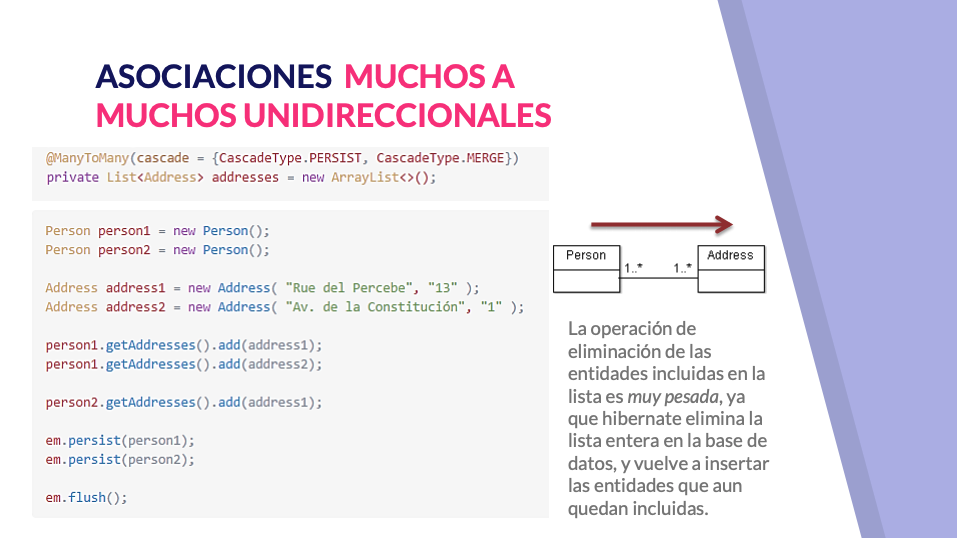


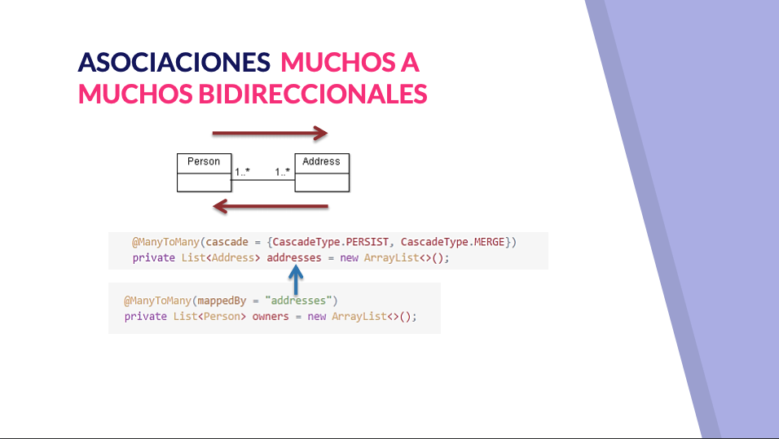

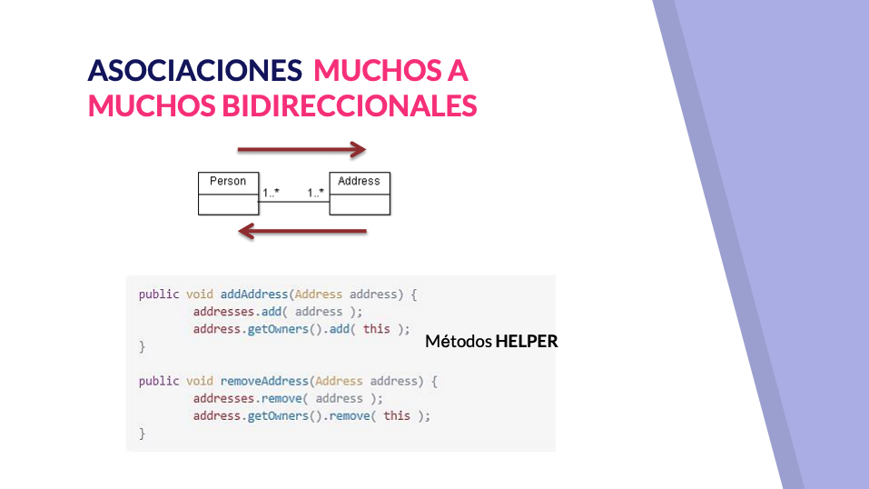


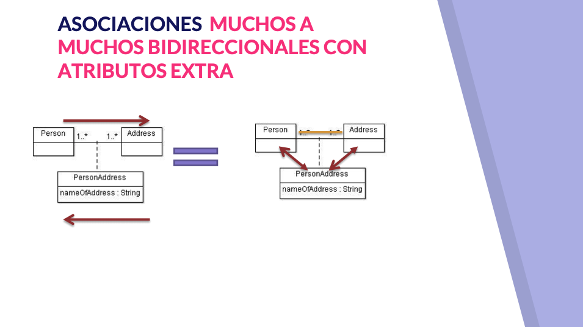

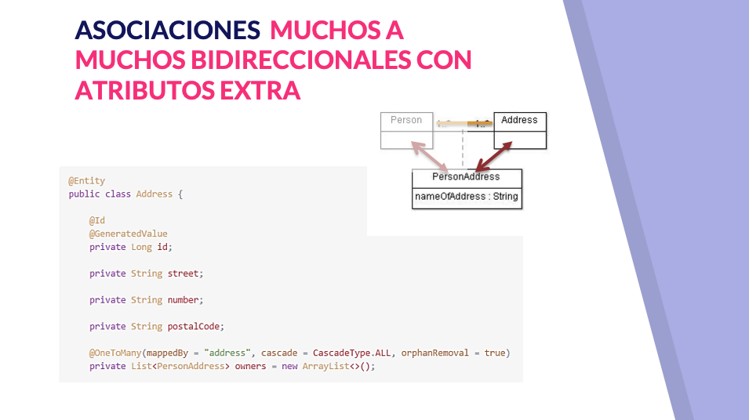

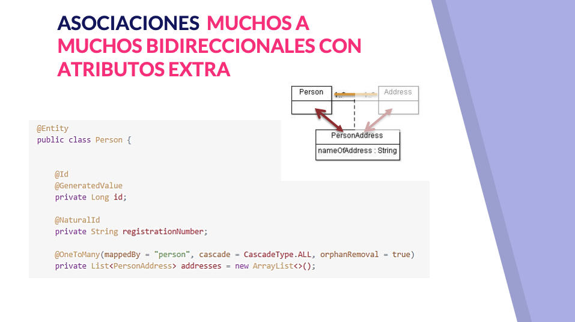

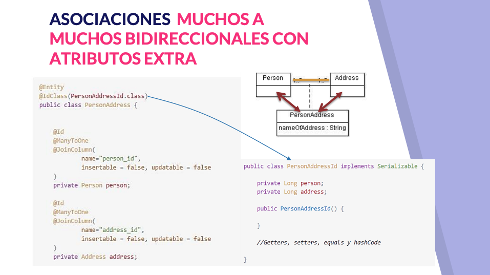

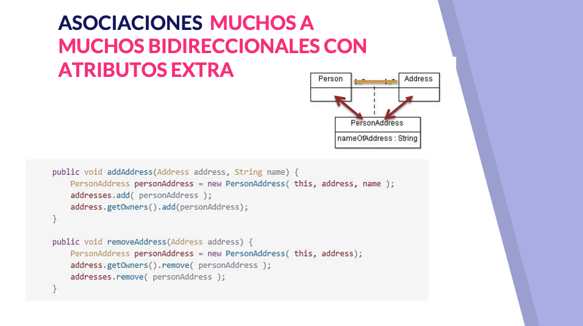

## Contenido adicional 4  

[ManyToOne](pdfs/08_Asociaciones_ManyToOne.pdf)

[OneToMany: Unidireccional y bidireccional](pdfs/09_Asociaciones_OneToMany.pdf)

[OneToOne: Unidireccional y bidireccional](pdfs/10_Asociaciones_OneToOne.pdf)

[ManyToMany](pdfs/11_Asociaciones_ManyToMany.pdf)
