# 5. Avanzado 109m
   * 14 Herencia y valores generados (parte I) 14:07 
   * 15 Herencia y valores generados (parte II) 7:43 
   * 16 Mapeo de colecciones 16:58 
   * 17 Generación del esquema 15:36 
   * 18 Ciclo de vida de la persistencia 20:21 
   * 19 Transacciones, patrones y antipatrones 19:13 
   * 20 Control de concurrencias 15:55 
   * Contenido adicional 5
   
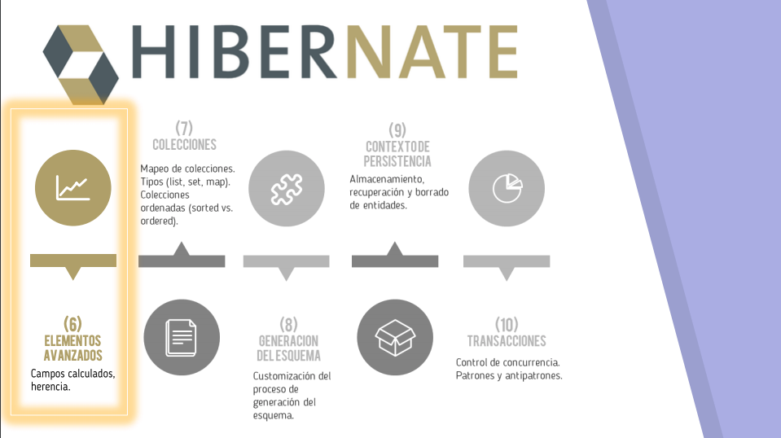

# 14 Herencia y valores generados (parte I) 14:07 

[Herencia y valores generados (parte I)](pdfs/12_Elementos_avanzados.pdf)

## Resumen Profesor

### 12.1 Herencia

La herencia es un mecanismo definido por la programación orientada a objetos, mediante el cual podemos definir una relación jerárquica entre varias clases.


*Diagrama de clases con herencia*

JPA+Hibernate nos ofrecen diferentes mecanismos para trasladar esta relación jerárquica a nuestra base de datos, en función de las necesidades que tengamos.

### 12.1.1 `@MappedSuperclass`

En este primer esquema, la clase base **no será trasladada a la base de datos**. Es decir, la tendremos disponible en nuestra aplicación para trabajar con ella, pero no generará una nueva tabla.

Si bien no hemos trabajado aun con **consultas**, cabe decir aquí que no podremos hacer uso de las consultas **polimórficas**, y por tanto tendríamos que consultar ambas entidades por separado.

```java
@MappedSuperclass
public class Cuenta implements Serializable {


    @Id
    @GeneratedValue
    private long id;
    private String titular;
    private double balance;
    private double tipoInteres;
    private static final long serialVersionUID = 1L;

    public Cuenta() {
        super();
    }   
    public long getId() {
        return this.id;
    }


    public String getTitular() {
        return this.titular;
    }

    public void setTitular(String titular) {
        this.titular = titular;
    }   
    public double getBalance() {
        return this.balance;
    }

    public void setBalance(double balance) {
        this.balance = balance;
    }   
    public double getTipoInteres() {
        return this.tipoInteres;
    }

    public void setTipoInteres(double tipoInteres) {
        this.tipoInteres = tipoInteres;
    }

}


@Entity
public class CuentaCredito extends Cuenta implements Serializable {


    private double limiteCredito;
    private static final long serialVersionUID = 1L;

    public CuentaCredito() {
        super();
    }   
    public double getLimiteCredito() {
        return this.limiteCredito;
    }

    public void setLimiteCredito(double limiteCredito) {
        this.limiteCredito = limiteCredito;
    }

}


@Entity
public class CuentaDebito extends Cuenta implements Serializable {


    private double cargoPorDescubierto;
    private static final long serialVersionUID = 1L;

    public CuentaDebito() {
        super();
    }   
    public double getCargoPorDescubierto() {
        return this.cargoPorDescubierto;
    }

    public void setCargoPorDescubierto(double cargoPorDescubierto) {
        this.cargoPorDescubierto = cargoPorDescubierto;
    }

}
```

La clase `Cuenta` trabaja como si fuera una entidad, tenemos que definirla dentro de nuestra unidad de persistencia, pero no se traslada a la base de datos.

El DDL generado por Hibernate sería el siguiente:

```sql
create table CuentaCredito (
       id bigint not null,
        balance double precision not null,
        tipoInteres double precision not null,
        titular varchar(255),
        limiteCredito double precision not null,
        primary key (id)
    ) engine=InnoDB

    create table CuentaDebito (
           id bigint not null,
            balance double precision not null,
            tipoInteres double precision not null,
            titular varchar(255),
            cargoPorDescubierto double precision not null,
            primary key (id)
        ) engine=InnoDB
```

Cada una de las entidades extendidas reciben todos los atributos de la entidad base.

#### 12.1.2 Single Table

Con la anotación `@SingleTable`, le indicamos a Hibernate que para todas las entidades que participen en la jerarquía de herencia, solamente tiene que crear una tabla en la base de datos.

*Esta estrategia es adecuada si el número de atributos que añaden las clases extendidas no es muy grande. Hay que tener en cuenta que si tenemos dos entidades, B y C, que extienden a A, la tabla generada tendrán los atributos de A, B y C. Si el número de atributos de B es muy grande, al insertar una entidad de tipo C, todos los atributos que correspondan a B serán nulos.*

```java
@Entity
@Inheritance(strategy = InheritanceType.SINGLE_TABLE)
public class Cuenta implements Serializable {


    @Id
    @GeneratedValue
    private long id;
    private String titular;
    private double balance;
    private double tipoInteres;
    private static final long serialVersionUID = 1L;

    public Cuenta() {
        super();
    }   
    public long getId() {
        return this.id;
    }


    public String getTitular() {
        return this.titular;
    }

    public void setTitular(String titular) {
        this.titular = titular;
    }   
    public double getBalance() {
        return this.balance;
    }

    public void setBalance(double balance) {
        this.balance = balance;
    }   
    public double getTipoInteres() {
        return this.tipoInteres;
    }

    public void setTipoInteres(double tipoInteres) {
        this.tipoInteres = tipoInteres;
    }

}


@Entity
public class CuentaCredito extends Cuenta implements Serializable {

  //Igual que el ejemplo anterior

}


@Entity
public class CuentaDebito extends Cuenta implements Serializable {

  //Igual que el ejemplo anterior

}
```

Si observamos el DDL que ha generado Hibernate, nos encontramos con lo siguiente:

```sql
create table Cuenta (
       DTYPE varchar(31) not null,
        id bigint not null,
        balance double precision not null,
        tipoInteres double precision not null,
        titular varchar(255),
        cargoPorDescubierto double precision,
        limiteCredito double precision,
        primary key (id)
    ) engine=InnoDB
```

Ha añadido una columna, llamada DTYPE, que actúa de **discriminante**. Si observamos los valores insertados por el ejemplo:

```java
CuentaCredito cuentaCredito = new CuentaCredito();
cuentaCredito.setTitular("Luismi");
cuentaCredito.setBalance(500.0);
cuentaCredito.setTipoInteres(0.20);
cuentaCredito.setLimiteCredito(600.0);


CuentaDebito cuentaDebito = new CuentaDebito();
cuentaDebito.setTitular("Luismi");
cuentaDebito.setBalance(200.0);
cuentaCredito.setTipoInteres(0.10);
cuentaDebito.setCargoPorDescubierto(6.5);

em.persist(cuentaCredito);
em.persist(cuentaDebito);
```

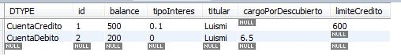

En cada fila ha añadido como DTYPE el nombre de la clase entidad. Este valor de discriminante se puede modificar mediante la anotación `@DiscriminatorValue`.

```java
@Entity
@DiscriminatorValue("CC")
public class CuentaCredito extends Cuenta implements Serializable {

  //Igual que el ejemplo anterior

}


@Entity
@DiscriminatorValue("CD")
public class CuentaDebito extends Cuenta implements Serializable {

  //Igual que el ejemplo anterior

}
```

#### 12.1.2 `Joined Table`

Este esquema de trabajo, también conocido como *table per subclass*, genera las siguientes tablas:

* Una tabla para la entidad *base* de la jerarquía. Tendrá todos los atributos de la clase base.

* Una tabla para cada entidad *extendida* de la jerarquía. Tendrá una referencia a la entidad base, y los *atributos propios*.

```java
@Entity
@Inheritance(strategy = InheritanceType.JOINED)
public class Cuenta implements Serializable {

  //Igual que el ejemplo anterior

}


@Entity
public class CuentaCredito extends Cuenta implements Serializable {

  //Igual que el ejemplo anterior

}


@Entity
public class CuentaDebito extends Cuenta implements Serializable {

  //Igual que el ejemplo anterior

}
```

Esto genera un DDL en el que se generan 3 tablas, y 2 claves externas.

```sql
    create table Cuenta (
       id bigint not null,
        balance double precision not null,
        tipoInteres double precision not null,
        titular varchar(255),
        primary key (id)
    ) engine=InnoDB


    create table CuentaCredito (
       limiteCredito double precision not null,
        id bigint not null,
        primary key (id)
    ) engine=InnoDB

    create table CuentaDebito (
       cargoPorDescubierto double precision not null,
        id bigint not null,
        primary key (id)
    ) engine=InnoDB

    alter table CuentaCredito
       add constraint FK6641o76fphgs98cbv18sd7htc
       foreign key (id)
       references Cuenta (id)

    alter table CuentaDebito
       add constraint FK2gigt3h95mq590key3xvkhqk0
       foreign key (id)
       references Cuenta (id)
```       

A diferencia del esquema `@MappedSuperclass`, con este esquema si podríamos usar **consultas polimórficas**, pero debemos tener en cuenta que esto puede utilizar muchos JOIN, lo cual puede penalizar el rendimiento de la base de datos.

Si queremos dar un nombre diferente a las claves externas, podemos usar la anotación `@PrimaryKeyJoinColumn(name = " ...")`.

```java
@Entity
@Inheritance(strategy = InheritanceType.JOINED)
public class Cuenta implements Serializable {

  //Igual que el ejemplo anterior

}


@Entity
@PrimaryKeyJoinColumn(name = "account_id")
public class CuentaCredito extends Cuenta implements Serializable {

  //Igual que el ejemplo anterior

}


@Entity
@PrimaryKeyJoinColumn(name = "account_id")
public class CuentaDebito extends Cuenta implements Serializable {

  //Igual que el ejemplo anterior

}
```

#### 12.1.2 Table per class

La última opción es la de una tabla por clase. Cada entidad *extendida* tendrá los atributos de la clase base y los suyos propios (como en `@MappedSuperclass`), pero también existirá una tabla para la clase *base*.

En caso de que queramos realizar consultas polimórficas, se realizaría un UNION entre los resultados de las consultas a las tablas.

```java
@Entity
@Inheritance(strategy=InheritanceType.TABLE_PER_CLASS)
public class Cuenta implements Serializable {

  //Igual que el ejemplo anterior

}


@Entity
public class CuentaCredito extends Cuenta implements Serializable {

  //Igual que el ejemplo anterior

}


@Entity
public class CuentaDebito extends Cuenta implements Serializable {

  //Igual que el ejemplo anterior

}
```

Esto generaría como DDL el siguente código:

```xml
create table Cuenta (
  id bigint not null,
  balance double precision not null,
  tipoInteres double precision not null,
  titular varchar(255),
  primary key (id)
) engine=InnoDB

create table CuentaCredito (
  id bigint not null,
  balance double precision not null,
  tipoInteres double precision not null,
  titular varchar(255),
  limiteCredito double precision not null,
  primary key (id)
) engine=InnoDB


create table CuentaDebito (
  id bigint not null,
  balance double precision not null,
  tipoInteres double precision not null,
  titular varchar(255),
  cargoPorDescubierto double precision not null,
  primary key (id)
) engine=InnoDB
```

Como podemos apreciar, en este caso no tenemos ninguna clave externa.

### 12.2 Campos calculados o derivados

#### 12.2.1 `@Generated`

Un campo derivado o calculado es un campo que no se gestiona igual que los demás: su valor viene a raíz de un cálculo a partir de, normalmente, el resto de campos de la entidad, u otro valor especial. Estos valores son generados por la base de datos (y no por Java). Cuando Hibernate detecta una inserción o actualización, realiza una (re)generación del valor del campo calculado.

Para poder anotar un campo como generado, usamos la anotación `@Generated`. Esta nos permite indicar cuando el campo será generado, a saber:

* INSERT: Será generado en la inserción, pero no en las sentencias UPDATE posteriores.

* ALWAYS: En cualquier modificación (INSERT, UPDATE).

Para indicar este valor, usamos `GenerationTime` como en el ejemplo siguiente:

```java
@Entity
@Table(name="ADVANCEDUSER")
public class User {

    @Id
    @GeneratedValue
    private long id;

    private String email;

    private String city;

    @Generated(value=GenerationTime.ALWAYS)
    @Column(columnDefinition=
        " varchar(512) AS (CONCAT(email,' (', city,')')) "
    )
    private String generated;

    public long getId() {
        return id;
    }

    public String getEmail() {
        return email;
    }

    public void setEmail(String email) {
        this.email = email;
    }

    public String getCity() {
        return city;
    }

    public void setCity(String city) {
        this.city = city;
    }

    public String getGenerated() {
        return this.generated;
    }
}
```

Como de la generación de este campo se encarga la base de datos, tenemos que indicar la forma en que lo hará al estilo SQL. Mediante `@Column(columnDefinition="...")` le estamos indicando el tipo de dato y como hacer el cálculo.

El DDL generado sería algo parecido a esto:

```sql
create table ADVANCEDUSER (
    id bigint not null,
  city varchar(255),
  email varchar(255),
  presentation varchar(512) AS (CONCAT(email,' (', city,')')),
  primary key (id)
) engine=InnoDB
```

Al indicar `@Generated(value=GenerationTime.ALWAYS)` este campo será actualizado por cada sentencia INSERT o UPDATE.

#### 12.2.2 `@CreationTimestamp`

La anotación `@CreationTimestamp` nos permite indicar a Hibernate que en el atributo anotado con esta anotación debe almacenarse la actual fecha y hora de la JVM cuando la entidad sea almacenada.

```java
@Entity
@Table(name="ADVANCEDUSER")
public class User {

    @Id
    @GeneratedValue
    private long id;

    //Resto de atributos


    @CreationTimestamp
    private Date createdDate;


    //Resto de métodos

    public Date getCreatedDate() {
        return createdDate;
    }

}
```

#### 12.2.3 @ColumnTransformer

Hibernate nos permite personalizar el código SQL que utiliza para leer o almacenar los valores de algunas columnas. Por ejemplo, si nuestro RDBMS tiene alguna función de encriptación o codificación, la podemos invocar para almacenar una columna (por ejemplo, una contraseña).

```java
@Entity
@Table(name="ADVANCEDUSER")
public class User {


    //Resto de atributos

    @Column(name="pswd")
    @ColumnTransformer(
            write= " MD5(?) "
    )
    private String password;

    //Resto de métodos

    public String getPassword() {
        return password;
    }

    public void setPassword(String password) {
        this.password = password;
    }
}
```

En este caso, cuando almacenemos la contraseña del usuario, lo haremos en forma de cadena MD5; si alguien consulta la base de datos por otra vía, no podrá saber cuál es nuestra contraseña (el algoritmo MD5 no tiene función inversa conocida).

## Transcripción


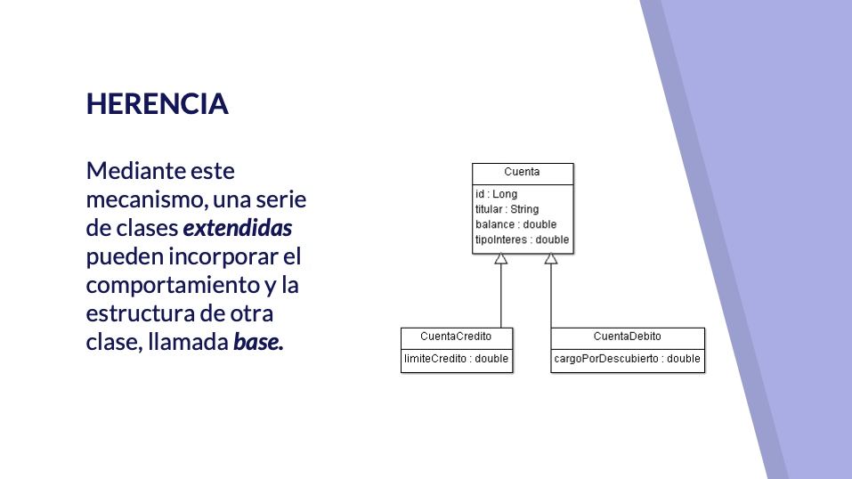

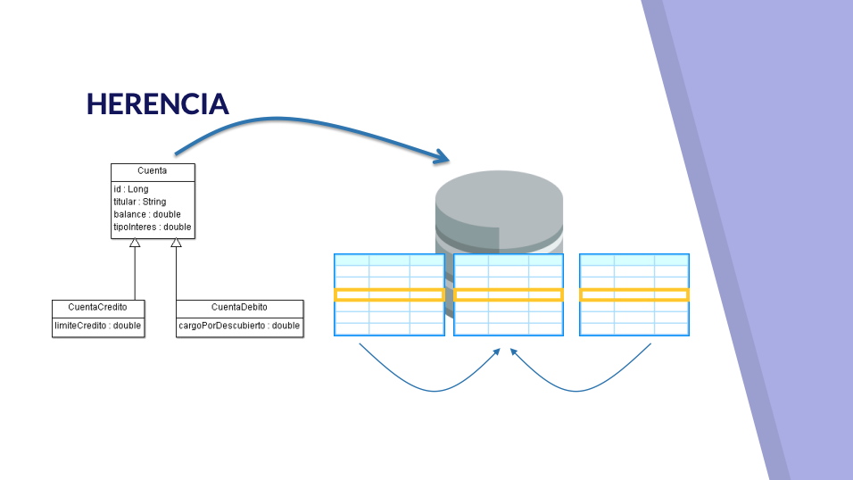


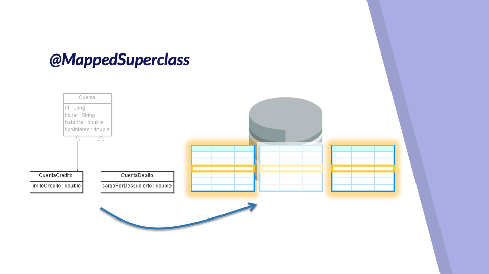

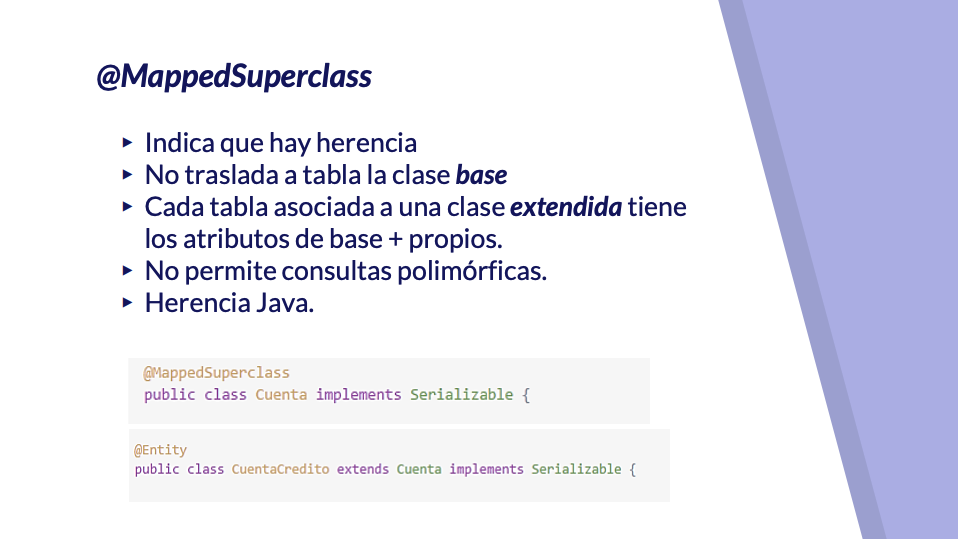

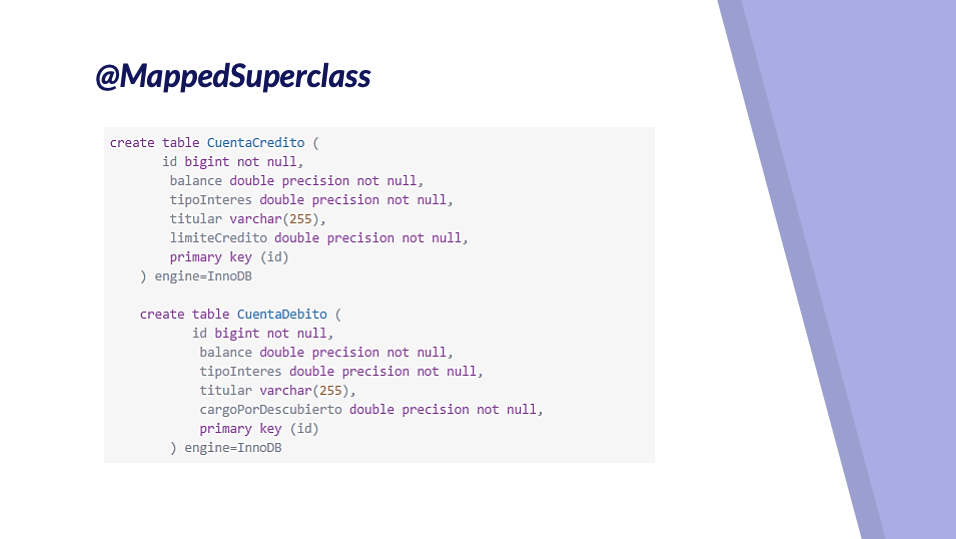


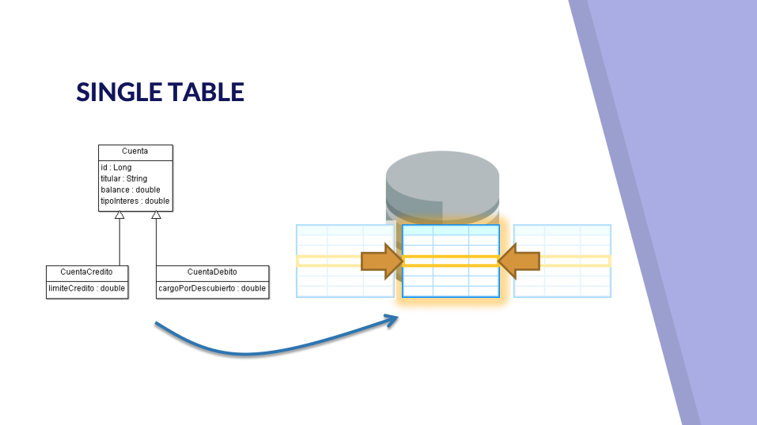


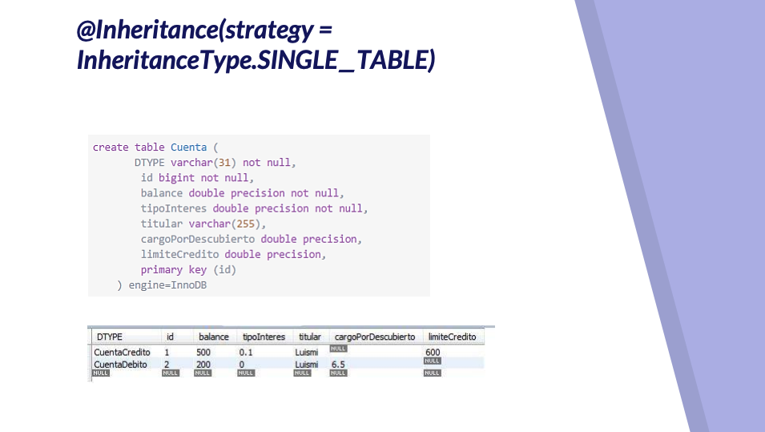


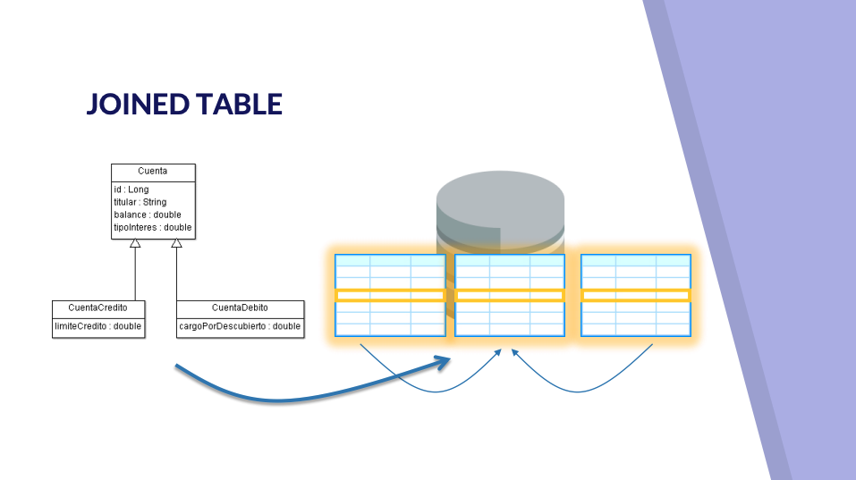

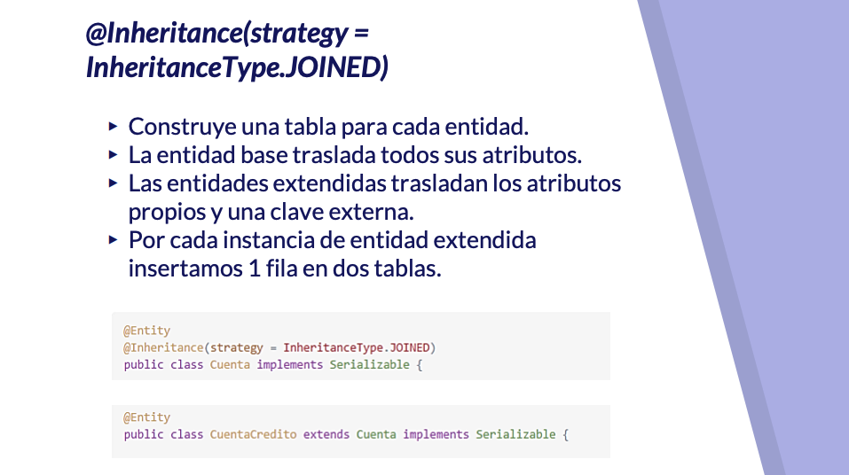

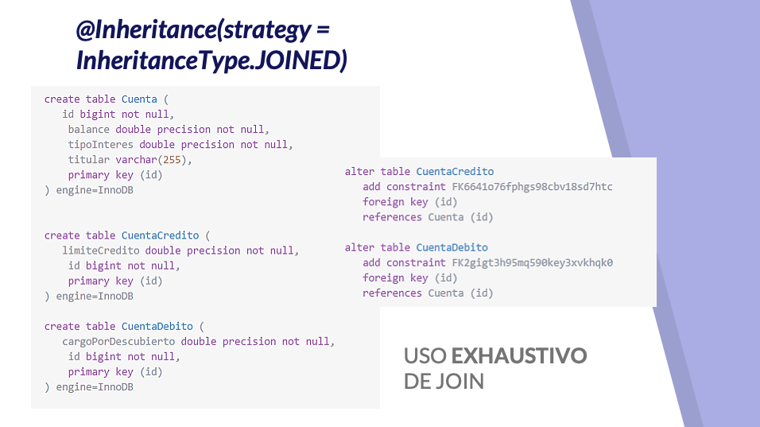


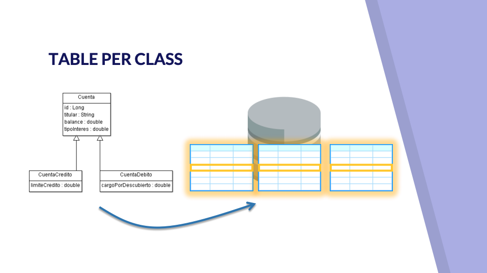

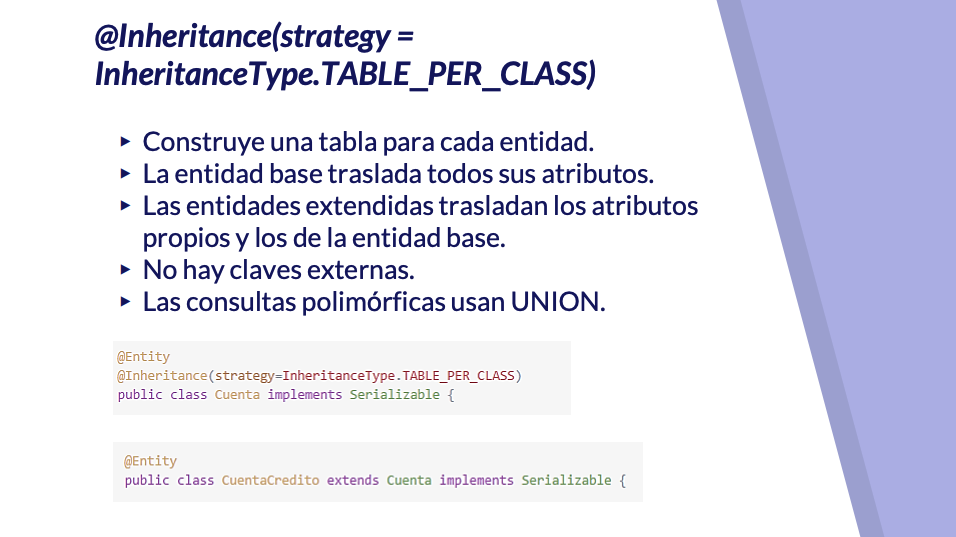

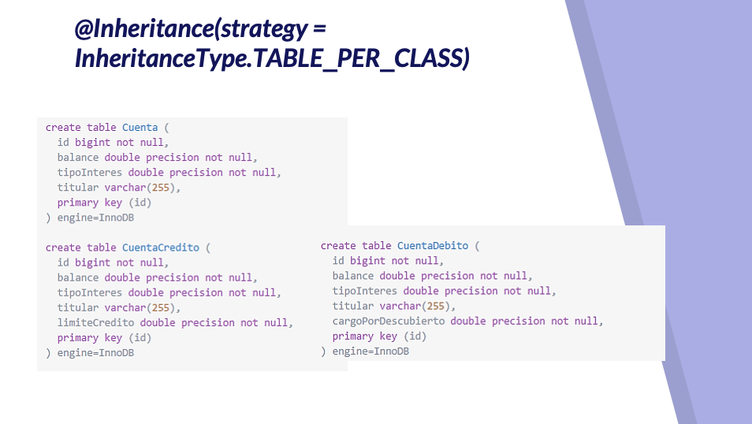


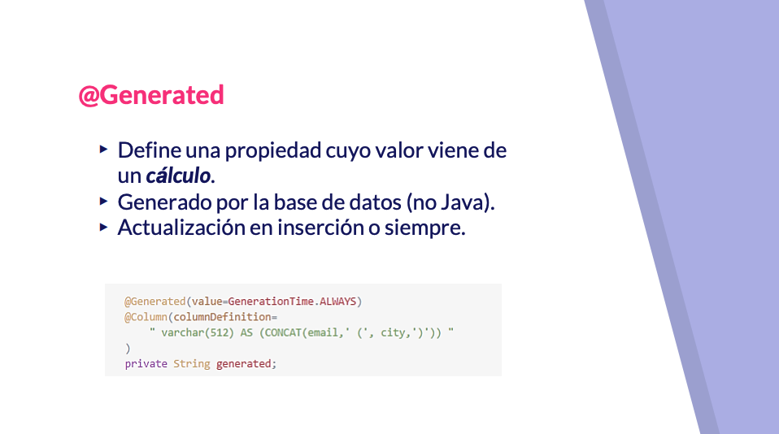

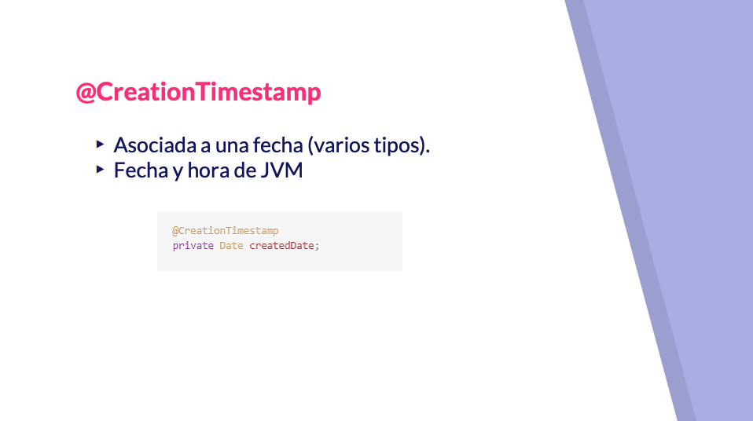

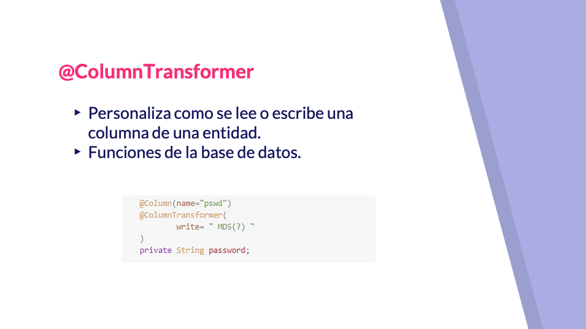

# 15 Herencia y valores generados (parte II) 7:43 

Continuación de la lección sobre herencia y valores generados.

# 16 Mapeo de colecciones 16:58 

[Mapeo de colecciones](pdfs/13_Colecciones.pdf)

### 13.1 Colecciones

Si bien ya hemos manejado colecciones de componentes a través de las asociaciones (sobre todo las One-To-Many y las Many-To-Many), Hibernate nos permite manejar colecciones, tanto de valores básicos, tipos embebidos así como de otras entidades.

#### 13.1.1 Valores básicos

Un elemento *potente* y a la vez fácil de implementar con JPA+Hibernate es la gestión de colecciones de valores básicos. La anotación a través de la cual indicaremos que se trata de una colección es `@ElementCollection`. Veamos los diferentes tipos de colecciones que soportan, ya que sus características marcarán el tipo de colección a utilizar

Colección	| Características
----------|----------------
java.util.Set | Se inicializa con un java.util.HashSet. No se almacena el orden de los elementos, y no se permiten duplicados. Cualquier proveedor de JPA soporta este tipo.
java.util.SortedSet	| Se inicializa con un java.util.TreeSet. Esta colección soporta el orden de elementos (esto ocurre en memoria), después de que Hibernate cargue los elementos. Se trata de una colección provista solo por Hibernate. Cualquier otro proveedor descartará los aspectos “sorted”.
java.util.List |	Se inicializa con un java.util.ArrayList. Hibernate puede preservar la posición de cada elemento con un elemento índice adicional in la tabla de la base de datos. Cualquier proveedor de JPA soporta este tipo.
java.util.Collection | Se inicializa con un java.util.ArrayList. Esta colección tiene la semántica de un bag: son posibles los duplicados y no se almacena nada con respecto al orden. Cualquier proveedor de JPA soporta este tipo.
java.util.Map | Se inicializa con un java.util.Hashmap. En la base de datos se almacenan tanto la clave como el valor. Cualquier proveedor de JPA soporta este tipo.
java.util.SortedMap | Se inicializa con un java.util.TreeMap. Soporte la ordenación de elementos, si bien esta ocurre en memoria. Se trata de una colección provista solo por Hibernate. Cualquier otro proveedor descartará los aspectos “sorted”.

##### 13.1.1.1 *Bags*

Como hemos visto, se trata de la colección más simple. Soporta duplicados y descarta cualquier opción de orden:

```java
import java.util.ArrayList;
import java.util.Collection;

//Resto de import

@Entity
@Table(name="PersonBag")
public class Person {


    @Id
    @GeneratedValue
    private long id;

    private String name;

    @ElementCollection
    @CollectionTable(name="PhonesBags", joinColumns=@JoinColumn(name="person_id"))
    //@OrderColumn es ignorada en la práctica
    private Collection<String> phones = new ArrayList<String>();

    public Person() { }

  //Resto de métodos

    public Collection<String> getPhones() {
        return phones;
    }


}
```

Complementariamente a `@ElementCollection` podemos usar la anotación `@CollectionTable`, que nos va a permitir indicar el nombre de la tabla que se genera para manejar la colección, así como el nombre de la columna que hará las veces de clave externa.

El ciclo de vida de sería algo parecido a esto:

```java
Person person = new Person("Pepe");
em.persist( person );

person.getPhones().add("954123456");
person.getPhones().add("600123456");
person.getPhones().add("954123456");
person.getPhones().add("600123456");
person.getPhones().add("954123456");
person.getPhones().add("600123456");
person.getPhones().add("954123456");
person.getPhones().add("600123456");
person.getPhones().add("954123456");
person.getPhones().add("600123456");
person.getPhones().add("954123456");
person.getPhones().add("600123456");
```

Según la documentación de Hibernate, esta colección es muy ineficiente en el borrado, ya que para eliminar un elemento, los elimina todos y luego los vuelve a insertar :S

##### 13.1.1.2 Listas
Suele ser un tipo de colección muy utilizada. A diferencia de los *bags*, nos permite añadir orden a los elementos, a través de la anotación `@OrderColumn`.

```java
import java.util.ArrayList;
import java.util.List;

//Resto de import

@Entity
@Table(name="PersonList")
public class Person {


    @Id
    @GeneratedValue
    private long id;

    private String name;

    @ElementCollection
    @CollectionTable(name="PhonesList", joinColumns=@JoinColumn(name="person_id"))
    @OrderColumn(name="order_id")
    private List<String> phones = new ArrayList<String>();

    public Person() { }

  //Resto de métodos

    public List<String> getPhones() {
        return phones;
    }

}
```

Si revisamos el DDL que genera, podemos apreciar que tenemos la columna para manejar el orden.

```xml
create table PhonesList (
  person_id bigint not null,
  phones varchar(255),
  order_id integer not null,
  primary key (person_id, order_id)
) engine=InnoDB
```

##### 13.1.1.3 Conjuntos (Sets)

Como hemos apreciado en la introducción, se trata de una colección que no soporta elementos duplicados.

```java
import java.util.HashSet;
import java.util.Set;

//Resto de import

@Entity
@Table(name="PersonSet")
public class Person {


    @Id
    @GeneratedValue
    private long id;

    private String name;

    @ElementCollection
    @CollectionTable(name="PhonesSet", joinColumns=@JoinColumn(name="person_id"))
    private Set<String> phones = new HashSet<String>();

    public Person() { }

  //Resto de métodos

    public Set<String> getPhones() {
        return phones;
    }


}
```

Si intentamos introducir un número duplicado, Hibernate lo descartará de forma silenciosa, y no lo almacenará en la base de datos.

```java
Person person = new Person("Pepe");
em.persist( person );

person.getPhones().add("954123456");
person.getPhones().add("600123456");
person.getPhones().add("954123456"); //No se almacenará, puesto que está repetido
```

##### 13.1.1.4 Colecciones *key,value* (*Maps*)

Las colecciones clave,valor son un tipo de colección especial, conocidas en ocasiones como *diccionarios*, y permiten asociar a un valor, llamado clave, otro elemento. La búsqueda en base a la clave tiene una gran eficiencia. Supongamos que queremos añadir a nuestra lista de teléfonos, a que lugar corresponde el número (casa, trabajo, …)

```java
import java.util.HashMap;
import java.util.Map;

//Resto de import

@Entity
@Table(name="PersonMap")
public class Person {


    @Id
    @GeneratedValue
    private long id;

    private String name;

    @ElementCollection
    @CollectionTable(name="PhonesMap", joinColumns=@JoinColumn(name="person_id"))
    private Map<String, String> phones = new HashMap<String, String>();

    public Person() { }

    //Resto de métodos

    public Map<String, String> getPhones() {
        return phones;
    }


}
```

El ciclo de vida de inserción poría ser como sigue:

```java
Person person = new Person("Pepe");
em.persist( person );

person.getPhones().put("954123456", "Trabajo");
person.getPhones().put("600123456", "Movil");
person.getPhones().put("913456789", "Casa");
```

##### 13.1.1.4 Conjuntos ordenados (*SortedSets*)

Como decíamos más arriba, se trata de un tipo de colección que no es estándar, sino que es propia de Hibernate.

```java
import java.util.SortedSet;
import java.util.TreeSet;

//Resto de import

import org.hibernate.annotations.SortNatural;

@Entity(name="PersonSortedSet")
@Table(name="PersonSortedSet")
public class Person {


    @Id
    @GeneratedValue
    private long id;

    private String name;

    @ElementCollection
    @CollectionTable(name="PhonesSortedSet", joinColumns=@JoinColumn(name="person_id"))
    @SortNatural
    private SortedSet<String> phones = new TreeSet<String>();

    public Person() { }

    //Resto de métodos

    public SortedSet<String> getPhones() {
        return phones;
    }


}
```

La anotación `@SortNatural`, que es propia de Hibernate, nos permite indicar el tipo de orden que se aplicará. Esta ordenación se realiza **en memoria**, y no afecta a como están almacenados los datos.

```java
//Iniciamos una transacción
em.getTransaction().begin();

Person person = new Person("Pepe");
em.persist( person );

person.getPhones().add("954123456");
person.getPhones().add("600123456");
person.getPhones().add("954123456"); //No se almacenará, puesto que está repetido        


//Commiteamos la transacción
em.getTransaction().commit();

System.out.println("Name: " + person.getName());
for (String phone : person.getPhones()) {
    System.out.println("Phone: " + phone);
}
```

Al imprimir por consola, podemos apreciar que aparecen los teléfono ordenados.

```java
Name: Pepe
Phone: 600123456
Phone: 954123456
```

#### 13.1.2 Tipos embebidos

Las colecciones con tipos embebidos se manejan de la misma forma que con los tipos básicos. Veamos un ejemplo de manejo de una lista.

```java
@Entity
public class Person {


    @Id
    @GeneratedValue
    private long id;

    private String name;

    @ElementCollection
    private List<Phone> phones = new ArrayList<Phone>();

    public Person() { }

    public Person(String name) {
        this.name = name;
    }

    public long getId() {
        return id;
    }

    public void setId(long id) {
        this.id = id;
    }

    public String getName() {
        return name;
    }

    public void setName(String name) {
        this.name = name;
    }

    public List<Phone> getPhones() {
        return phones;
    }


}


@Embeddable
public class Phone {


    private String type;

    private String number;


    public Phone() { }

    public Phone(String type, String number) {
        this.type = type;
        this.number = number;
    }

    public String getNumber() {
        return number;
    }

    public String getType() {
        return type;
    }


}
```

La lógica para gestionar el ciclo de vida es la misma, partiendo siempre de la entidad `Person`:

```java
Person person = new Person("Pepe");
em.persist( person );

person.getPhones().add(new Phone("Fijo", "954123456"));
person.getPhones().add(new Phone("Móvil", "612345678"));
```

#### 13.1.3 Colecciones de entidades

En realidad, ya hemos usado colecciones de entidades, al trabajar con las asociaciones `@OneToMany` y `@ManyToMany`. En la práctica, podemos usar cualquiera de las colecciones que hemos tratado en los apartados anteriores. Para aportar en este apartado, trabajaremos con una lista ordenada, que nos permita ver la funcionalidad de las anotaciones `@OrderBy` y `@OrderColumn`.

```java
@Entity
public class Person {


    @Id
    @GeneratedValue
    private long id;

    private String name;

    @OneToMany(cascade = CascadeType.ALL)
    @OrderBy("number")
    private List<Phone> phones = new ArrayList<Phone>();

    public Person() { }

    //Resto de métodos

    public List<Phone> getPhones() {
        return phones;
    }


}

@Entity
public class Phone {

    @Id
    @GeneratedValue
    private long id;

    private String type;

    private String number;


    public Phone() { }

    //Resto de métodos


}
```

La lógica de gestión es similar a las anteriores ocasiones. En este caso, tras insertar, forzamos el refresco de los datos, para que fuerce la consulta a la base de datos:

```java
Person person = new Person("Pepe");
em.persist( person );

person.getPhones().add(new Phone("Fijo", "954123456"));
person.getPhones().add(new Phone("Móvil", "612345678"));

em.flush();

//Forzamos el volver a leer de la base de datos
em.refresh(person);


System.out.println("Name: " + person.getName());
for (Phone phone : person.getPhones()) {
    System.out.println("Phone: " + phone.getNumber() + " (" + phone.getType()+ ")");
}
```

Si revisamos la salida del log, podremos ver la consulta que lanza Hibernate para rescatar la lista, y comprobar que implementa la ordenación que hemos indicado.

```java
select
        person0_.id as id1_0_1_,
        person0_.name as name2_0_1_,
        phones1_.Person_id as Person_i1_1_3_,
        phone2_.id as phones_i2_1_3_,
        phone2_.id as id1_2_0_,
        phone2_.number as number2_2_0_,
        phone2_.type as type3_2_0_
    from
        Person person0_
    left outer join
        Person_Phone phones1_
            on person0_.id=phones1_.Person_id
    left outer join
        Phone phone2_
            on phones1_.phones_id=phone2_.id
    where
        person0_.id=?
    order by
        phone2_.number
```

*La anotación `@OrderBy` soporta más de una propiedad para la ordenación. Por ejemplo `@OrderBy("name ASC, type DESC")`.
Si no se especifica ningún orden, se ordena en base a la clave primaria de la entidad hija.*

Otra opción que tenemos es `@OrderColumn`.

```java
@OneToMany(cascade = CascadeType.ALL)
@OrderColumn(name = "order_id")
private List<Phone> phones = new ArrayList<>();
```

En este caso, la tabla de enlace toma el campo order_id, y lo utiliza para implementar el orden.

```sql
CREATE TABLE Person_Phone (
    Person_id BIGINT NOT NULL ,
    phones_id BIGINT NOT NULL ,
    order_id INTEGER NOT NULL ,
    PRIMARY KEY ( Person_id, order_id )
)
```

# 17 Generación del esquema 15:36 

[Generación del esquema](pdfs/14_Generación_del_esquema.pdf)

[Esquema](pdfs/schema.sql)

### 14.1 Generación automática del esquema

Como hemos podido comprobar en las lecciones anteriores, Hibernate permite autogenerar el esquema de nuestra base de datos a partir del mapeo que hayamos realizado (ya sea a través de XML o a través de anotaciones).

*Aunque la generación automática del esquema es muy util para el testeo o el prototipado, en un entorno de producción es menos usual, siendo más flexible manejar el esquema a través de scripts sql incrementales.*

A nivel de configuración, tenemos una propiedad JPA, llamada `hibernate.hbm2ddl.auto`, que nos permite generar el DDL para un buen número de opciones:

Opción | Propósito
-------|----------
none | Valor por defecto. No realiza ninguna acción
create-only | Solamente realiza el proceso de creación de la base de datos.
drop | Realiza solamente el borrado de la base de datos.
create | Realiza un borrado de la base de datos, y posteriormente su creación.
create-drop | Elimina el esquema y lo vuelve a crear al crear el contexto de persistencia o el SessionFactory. Adicionalmente, también lo elimina cuando uno u otro se cierran.
validate | Valida el esquema de la base de datos
update | Actualiza la base de datos, con los cambios necesarios.

#### 14.1.1 Customización mediante la importación de los scripts de sql

Para personalizar el proceso de creación, podemos aportar otros scripts sql, a través de la propiedad de configuración `hibernate.hbm2ddl.import_files`. Un buen nombre para este fichero sería `schema-generation.sql`.

Por ejemplo, el contenido del fichero podría ser:

```sql
create sequence book_sequence start with 1 increment by 1
```

O incluso la inserción de múltiples datos iniciales.

### 14.2 Proceso inverso: generación de las entidades a partir de una base de datos.

Eclipse, o Spring Tool Suite, nos ofrece otra funcionalidad que nos puede ahorrar algo de trabajo: para una base de datos dada, es capaz de escanear la misma, y generar las entidades suficientes para manejarla.

Este esquema de trabajo puede ser útil en un contexto en el que ya tengamos una base de datos creada y queramos comenzar un proyecto JPA-Hibernate para gestionarla, o simplemente porque nuestra experiencia tecnológica con SQL sea dilatada, y por ende seamos capaces de aprovechar al máximo las funcionalidades del RDBMS concreto que vayamos a usar.

Supongamos que tenemos una base de datos que gestiona autores y libros, y que se crearía a partir del siguiente script sql:

```sql
CREATE TABLE AUTOR
(
    id                bigint(15),
    nombre            varchar(200),
    anio_nac          smallint,
    nacionalidad      varchar(100),
    constraint PK_AUTOR primary key (id)
);

CREATE TABLE LIBRO
(
    id                bigint(20),
    titulo            varchar(255),
    isbn              varchar(20),
    categoria         varchar(100),
    anio_public       smallint,
    constraint PK_LIBRO primary key (id)
);

CREATE TABLE AUTOR_LIBRO
(
    id_autor        bigint(15),
    id_libro        bigint(20),
    constraint PK_AUTOR_LIBRO primary key (id_autor, id_libro),
    constraint FK_AL_AUTOR foreign key (id_autor) references AUTOR (id),
    constraint FK_AL_LIBRO foreign key (id_libro) references LIBRO (id)
);
```

Puedes descargar el fichero [aquí]().

Para manejar esta base de datos, deberíamos tener dos entidades, `Autor` y `Libro` y una asociación *ManyToMany* bidireccional entre ellas.

Para generar las entidades, pulsamos sobre el proyecto con el botón derecho, *New > JPA Entities from Tables*. Para poder continuar con el proceso, tenemos que tener habilitada la conexión con la base de datos.

*Si aun no la tenías, puedes hacerlo en la vista Data Source Explorer. Debe aparecer seleccionando la perspectiva de Eclipse JPA. Si no aparece, puedes visualizarla a través de Window > Show views > Data Source Explorer.*

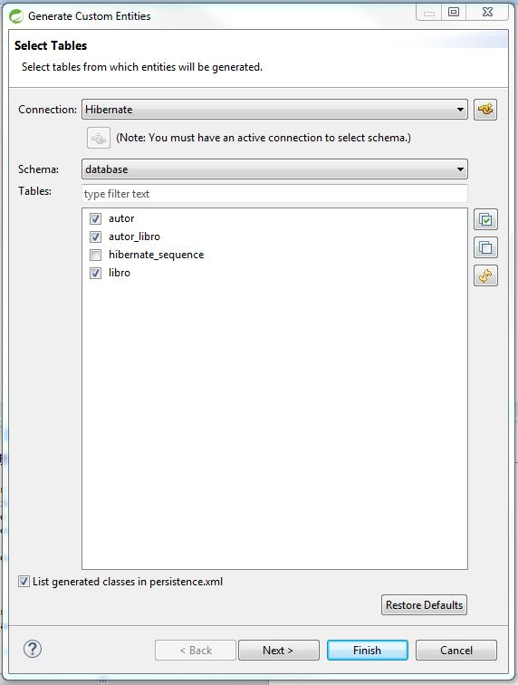

*Primer paso*

Seleccionamos los tablas que cuyas entidades vamos a generar y pulsamos sobre el botón siguiente.

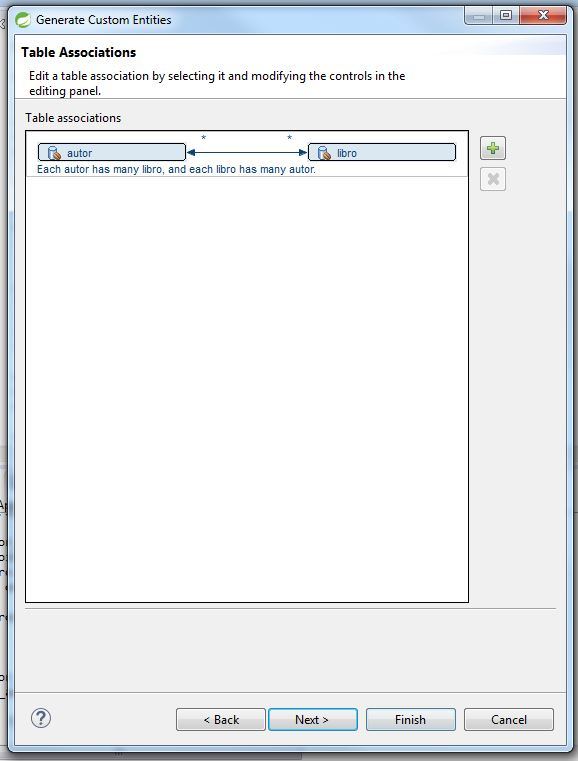

*Segundo paso*

El asistente nos muestra en este paso un diagrama con las tablas y las asociaciones y su cardinalidad. En nuestro caso, aparecen *autor, libro* y una asociación muchos-a-muchos entre ellos. Si necesitáramos añadir alguna asociación auxiliar, lo podemos hacer en este punto del asistente.

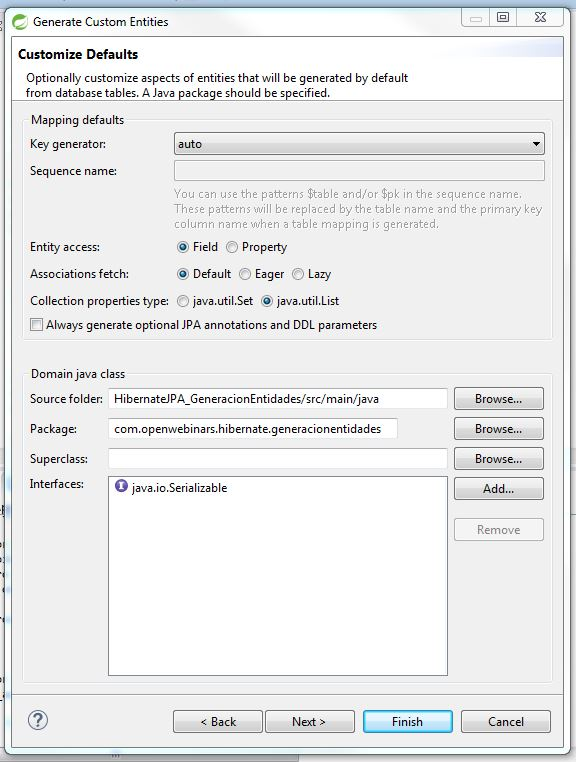

*Tercer paso*

En el siguiente paso, seleccionamos algunos elementos importantes:

* El generador de identificadores.

* El tipo de acceso (a través de los atributos (*field*) o de los *getters* (*property*)).

* El tipo de *fetching* de las asociaciones (por defecto, ágil (*eager*) o perezoso (*lazy*)).

Debajo, tenemos las opciones del paquete en el que vamos a ubicar las clases, si tienen algún tipo de clase base o deben implementar alguna interfaz (por defecto, `Serializable`).

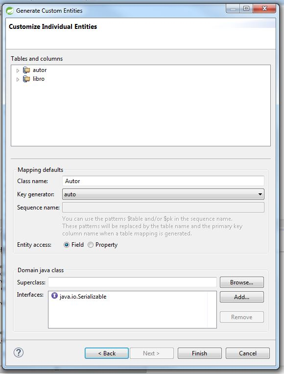

*Cuarto paso*

En el siguiente paso, podemos *customizar* cada una de las entidades que se van a generar.

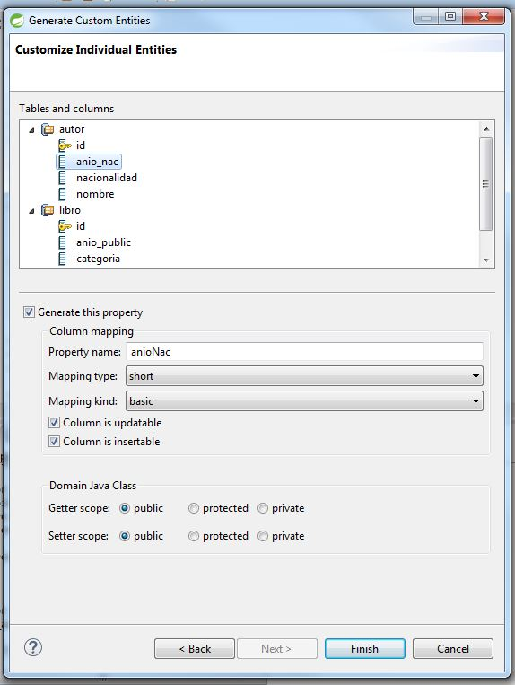

*Cuarto paso 2*

Eclipse ha tomado la decisión con respecto a los tipos de datos Java, pero puede interesarnos usar otro.

Al finalizar el asistente, tendremos nuestras nuevas entidades disponibles.

```java
@Entity
@NamedQuery(name="Autor.findAll", query="SELECT a FROM Autor a")
public class Autor implements Serializable {
    private static final long serialVersionUID = 1L;

    @Id
    @GeneratedValue(strategy=GenerationType.AUTO)
    private long id;

    @Column(name="anio_nac")
    private short anioNac;

    private String nacionalidad;

    private String nombre;

    //bi-directional many-to-many association to Libro
    @ManyToMany
    @JoinTable(
        name="autor_libro"
        , joinColumns={
            @JoinColumn(name="id_autor")
            }
        , inverseJoinColumns={
            @JoinColumn(name="id_libro")
            }
        )
    private List<Libro> libros;

    public Autor() {
    }

    public long getId() {
        return this.id;
    }

    public void setId(long id) {
        this.id = id;
    }

    public short getAnioNac() {
        return this.anioNac;
    }

    public void setAnioNac(short anioNac) {
        this.anioNac = anioNac;
    }

    public String getNacionalidad() {
        return this.nacionalidad;
    }

    public void setNacionalidad(String nacionalidad) {
        this.nacionalidad = nacionalidad;
    }

    public String getNombre() {
        return this.nombre;
    }

    public void setNombre(String nombre) {
        this.nombre = nombre;
    }

    public List<Libro> getLibros() {
        return this.libros;
    }

    public void setLibros(List<Libro> libros) {
        this.libros = libros;
    }

}


@Entity
@NamedQuery(name="Libro.findAll", query="SELECT l FROM Libro l")
public class Libro implements Serializable {
    private static final long serialVersionUID = 1L;

    @Id
    @GeneratedValue(strategy=GenerationType.AUTO)
    private long id;

    @Column(name="anio_public")
    private short anioPublic;

    private String categoria;

    private String isbn;

    private String titulo;

    //bi-directional many-to-many association to Autor
    @ManyToMany(mappedBy="libros")
    private List<Autor> autors;

    public Libro() {
    }

    public long getId() {
        return this.id;
    }

    public void setId(long id) {
        this.id = id;
    }

    public short getAnioPublic() {
        return this.anioPublic;
    }

    public void setAnioPublic(short anioPublic) {
        this.anioPublic = anioPublic;
    }

    public String getCategoria() {
        return this.categoria;
    }

    public void setCategoria(String categoria) {
        this.categoria = categoria;
    }

    public String getIsbn() {
        return this.isbn;
    }

    public void setIsbn(String isbn) {
        this.isbn = isbn;
    }

    public String getTitulo() {
        return this.titulo;
    }

    public void setTitulo(String titulo) {
        this.titulo = titulo;
    }

    public List<Autor> getAutors() {
        return this.autors;
    }

    public void setAutors(List<Autor> autors) {
        this.autors = autors;
    }

}
```

Además, estas han sido añadidas al nuestra unidad de persistencia. Añadimos las demás propiedades.

```xml
<persistence version="2.1" xmlns="http://xmlns.jcp.org/xml/ns/persistence" xmlns:xsi="http://www.w3.org/2001/XMLSchema-instance" xsi:schemaLocation="http://xmlns.jcp.org/xml/ns/persistence http://xmlns.jcp.org/xml/ns/persistence/persistence_2_1.xsd">
    <persistence-unit name="GeneracionEntidades" transaction-type="RESOURCE_LOCAL">
        <class>com.openwebinars.hibernate.generacionentidades.Autor</class>
        <class>com.openwebinars.hibernate.generacionentidades.Libro</class>
        <properties>
            <property name="javax.persistence.jdbc.url" value="jdbc:mysql://localhost:3306/hibernate"/>
            <property name="javax.persistence.jdbc.user" value="openwebinars"/>
            <property name="javax.persistence.jdbc.driver" value="com.mysql.jdbc.Driver"/>
            <property name="javax.persistence.jdbc.password" value="12345678"/>
            <property name="hibernate.dialect" value="org.hibernate.dialect.MySQL5InnoDBDialect"/>
            <property name="hibernate.connection.driver_class" value="com.mysql.jdbc.Driver"/>
            <property name="hibernate.show_sql" value="true"/>
            <property name="hibernate.format_sql" value="true"/>
        </properties>
    </persistence-unit>
</persistence>
```

# 18 Ciclo de vida de la persistencia 20:21 

### 15.1 Introducción

Hasta ahora hemos útilizado algunos conceptos sobre persistencia sin llegar a entrar en profundidad en conocerlos. Vamos a profundizar ahora un poco en ellos.

### 15.2 Unidad de persistencia y contexto de persistencia

Una **unidad de persistencia** representa un conjunto de entidades que pueden ser mapeadas en una base de datos, así como la información necesaria para que la aplicación se pueda conectar a la misma. Toda esta información viene definida en un fichero llamado *persistence.xml*.

Dentro de este fichero podemos definir una o más unidades de persistencia, incluyendo siempre un nombre único y una fuente de datos (*datasource*).

Un **contexto de persistencia** representa un conjunto de entidades que se encuentran gestionadas *en un momento dado*. Podríamos decir que es algo así como *una **instancia*** de una unidad de persistencia.

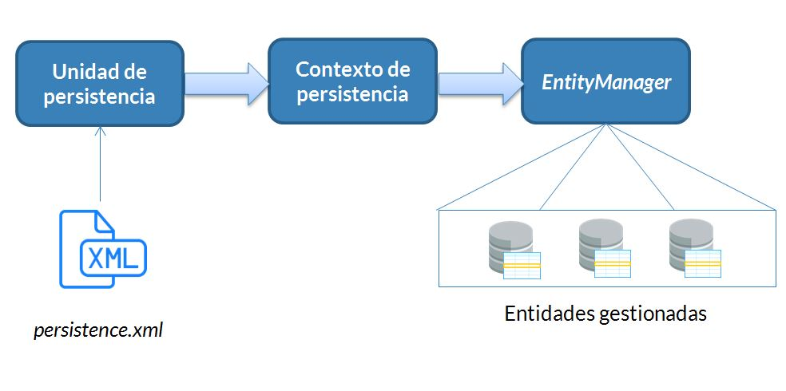

*Unidad y contexto de persistencia*

Tal y como vimos en apartados anteriores, una entidad gestionada por un contexto de persistencia puede estar en alguno de los siguientes estados:

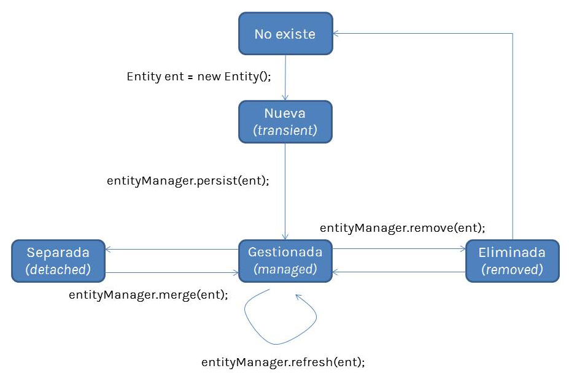

*Estados de una entidad*

La mayoría de los métodos del gestor de entidades van dirigidos a mover las entidades entre esos diferentes estados.

### 15.3 API de JPA y API de Hibernate

Hasta ahora hemos venido maridando el uso de JPA con Hibernate. Cada uno de ellos tiene su propio *API*, ofreciendo de una forma diferente las mismas funcionalidades.

En el siguiente diagrama de clases podemos apreciarlo:

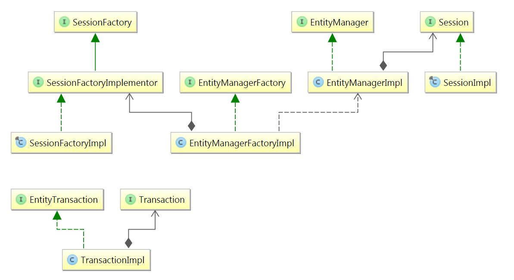

*Diagrama de clases de Hibernate*

Los diferentes esquemas de trabajo de JPA (a través de un *EntityManagerFactory* y un *EntityManager*) y de Hibernate nativo (a través de un *SessionFactory* y un *Session*) tienen en el fondo una misma implementación.

JPA define un mecanismo sencillo y útil para poder acceder al API subyacente de Hibernate:

```java
Session session = entityManager.unwrap( Session.class );
SessionImplementor sessionImplementor = entityManager.unwrap(SessionImplementor.class );
SessionFactory sessionFactory = entityManager.getEntityManagerFactory().unwrap(SessionFactory.class );
```

### 15.4 Gestión de entidades

#### 15.4.1 Persistencia de una entidad

Al crear una nueva entidad a través del operador `new`, esta estaría en estado *nuevo*. Para hacerla persistente, tenemos que asociarla a un *EntityManager*.

```java
Person person = new Person();
person.setId( 1L );
person.setName("John Doe");

entityManager.persist( person );
```

Si la entidad tuviera asociado un mecanismo para la generación del Id, no tendríamos que asignárselo manualmente, y se generaría automáticamente al persistir el objeto.

#### 15.4.2 Eliminación de una entidad

Las entidades también pueden ser *eliminadas*. Para ello, tan solo tenemos que

```java
entityManager.remove( person );
```

#### 15.4.3 Obtención de una referencia a una entidad sin inicializar sus datos

En ocasiones puede interesarnos hacer referencia a una entidad manejada por el contexto de persistencia, pero sin tener que cargar todos sus datos (por ejemplo, porque sean muchos o muy pesados). El caso más común es para establecer una asociación con otra entidad.

JPA nos permite hacerlo a través del método `getReference`:

```java
Book book = new Book();
book.setAuthor( entityManager.getReference( Person.class, personId ) );
```

Este código asume que se está usando la carga *lazy*.

#### 15.4.4 Obtención de una referencia a una entidad inicializando sus datos

Las llamadas a este método son muy comunes, por ejemplo para mostrar todos los datos de una entidad en la interfaz de usuario.

```java
Person person = entityManager.find( Person.class, personId );
```

En caso de que la entidad exista en el contexto de persistencia, nos devolvería una instancia de ella; si no existe, nos devuelve `null`.

#### 15.4.5 Modificación de una entidad que ya está manejada/persistida

Los cambios sobre las entidades manejadas por JPA serán detectados automáticamente, y persistidos cuando el contexto de persistencia sea *flushed*.

```java
Person person = entityManager.find( Person.class, personId );
person.setName("John Doe");
entityManager.flush();
```

#### 15.4.6 Refresco del estado de una entidad

Podemos recargar una entidad desde el contexto de persistencia en cualquier momento.

```java
Person person = entityManager.find( Person.class, personId );

entityManager.createQuery( "update Person set name = UPPER(name)" ).executeUpdate();

entityManager.refresh( person );
assertEquals("JOHN DOE", person.getName() );
```

Esta operación es útil en algunos casos, como por ejemplo si sabemos que el estado en la base de datos ha cambiado desde que leímos la entidad, o si alguno de los valores ha sido generado a nivel de base de datos con un disparador o *trigger*.

#### 15.4.7 Trabajo con entidades detached (separadas)

Una entidad puede pasar a estado detached por varias razones:

* Porque el contexto de persistencia se haya cerrado.

* Porque el contexto de persistencia se haya refrescado (`clear`).

* Llamando a los métodos adecuados, como `detach` (o con Hibernate nativo `evict`).

Las entidades en este estado no van a funcionar de la misma manera: sus cambios no se almacenarán en la base de datos, no podemos refrescarlas, etc…

Para volver a incluir una entidad dentro del contexto de persistencia, podemos realizar una operación `merge`. Esta operación toma los datos de la entidad (*detached*) que recibe como argumento, obteniendo como resultado una nueva entidad, copia de la anterior, y que si estará manejada por el contexto de persistencia:

```java
Person person = entityManager.find( Person.class, personId );
//Al limpiar el entityManager la entidad se convierte en detached
entityManager.clear();
person.setName( "Mr. John Doe" );

person = entityManager.merge( person );
```

### 15.5 Transiciones en cascada

Las transiciones en cascada son una herramienta potente, que nos permiten propagar un cambio de estado desde una entidad *padre* a otras entidades *hijas* relacionadas con la primera. Dentro del interfaz `javax.persistence.CascadeType` tenemos definidos varios tipos:

* `ALL`: se propagan todos los cambios de estados.

* `PERSIST`: se propagan las operaciones de persistencia.
* `MERGE`: se propagan las operaciones `merge`.
* `REMOVE`: se propagan las eliminaciones.
* `REFRESH`: se propagan las actualizaciones.
* `DETACH`: se propagan las separaciones.

Podemos ilustrar las operaciones en cascada con el siguiente código:

```java
@Entity
public class Person {

    @Id
    private Long id;

    private String name;

    @OneToMany(mappedBy = "owner", cascade = CascadeType.ALL)
    private List<Phone> phones = new ArrayList<>();

    //getters y setters

    public void addPhone(Phone phone) {
        this.phones.add( phone );
        phone.setOwner( this );
    }
}


@Entity
public class Phone {

    @Id
    private Long id;

    @Column(name = "`number`")
    private String number;

    @ManyToOne(fetch = FetchType.LAZY)
    private Person owner;

    //getters y setters
}
```

Veamos algunas de las operaciones más comunes.

#### 15.5.1. `PERSIST`

Nos permite almacenar una entidad *hija* a través de su *padre*.

```java
Person person = new Person();
person.setId(1L);
person.setName("Pepe Pérez");

Phone phone = new Phone();
phone.setId(1L);
phone.setNumber("954000000");

person.addPhone(phone);

entityManager.persist( person );
```

#### 15.5.2. MERGE

Nos permite volver a incluir dentro del contexto de persistencia una entidad *hija* a través de su *padre*.

```java
Phone phone = entityManager.find( Phone.class, 1L );
Person person = phone.getOwner();

person.setName("Pepe Pérez");
phone.setNumber("954000000");

entityManager.clear();

entityManager.merge(person);
```

#### 15.5.3. REMOVE

Nos permite eliminar una entidad *hija* a través de su *padre*.

```java
Person person = entityManager.find( Person.class, 1L );

entityManager.remove( person );
```

### 15.6 *Fetch plans* (planes de carga de datos)

Como hemos visto, JPA+Hibernate, a través del contexto de persistencia, ponen a nuestra disposición los datos almacenados en una base de datos. Pero, ¿es necesario que tengamos siempre todos los datos de las entidades que manejamos? Podemos intervernir en este proceso, indicando el tipo de *fetching* que queremos realizar.

Tenemos a nuestar disposición dos esquema de trabajo:

* EAGER: Hibernate cargará todos los datos de las entidades que sean necesarias (incluidas las de las entidades hijas si hay asociaciones).

* LAZY: Con el modo perezoso solo se cargarán los datos cuando estos sean realmente necesarios (es decir, cuando se vayan a útilizar).

# 19 Transacciones, patrones y antipatrones 19:13 

[Transacciones, patrones y antipatrones](pdfs/16_Transacciones.pdf)

### 16.1 Introducción

Cualquier RDBMS define una serie de operaciones para manejar los datos mediante DML (*Data Manipulation Language*). Normalmente, estas operaciones son *INSERT, UPDATE y DELETE*, y trabajan a nivel de fila. Sin embargo, a la hora de programar una aplicación, nos encontramos con que determinadas operaciones de la lógica de negocio deberían ser tratadas como atómicas (indivixsibles), de forma que **o se hacen completas, o no deben hacerse**. Los RDBMS suelen permitir realizar estos conjuntos de operaciones atómicas a través de transacciones.

Supongamos que un cliente de un banco quiere realizar un traspaso de dinero a otro cliente de ese mismo banco. Esta operación (muy simplificada) consiste en actualizar el saldo de emisor, decrementándolo; y actualizar el saldo de receptor, aumentándolo.

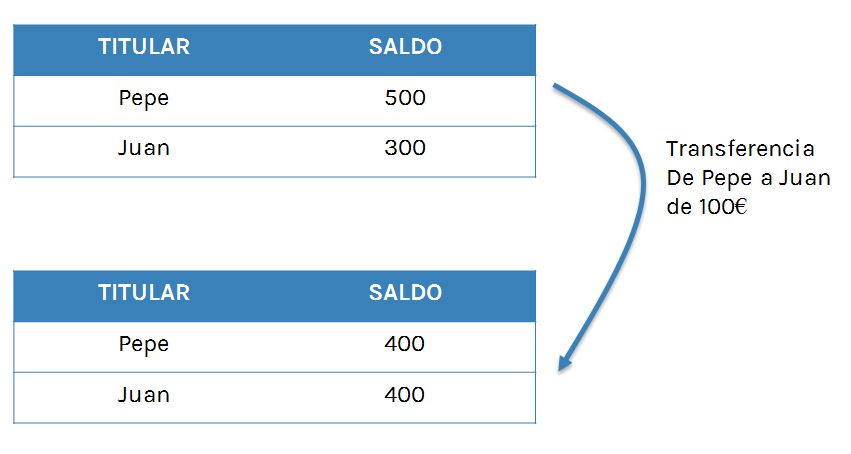

*Operación de traspaso*

A nivel de base de datos, esta operación debería realizarse con dos sentencias UPDATE; sin embargo, debería tratarse de forma **atómica**. O se ejecutan las dos sentencias, o no se ejecuta ninguna (imaginad la cara de Pepe si le restaran saldo en su cuenta, y la cara de Juan al no recibir su transferencia).

Para confirmar una transacción, lo hacemos mediante la instrucción SQL `COMMIT`.

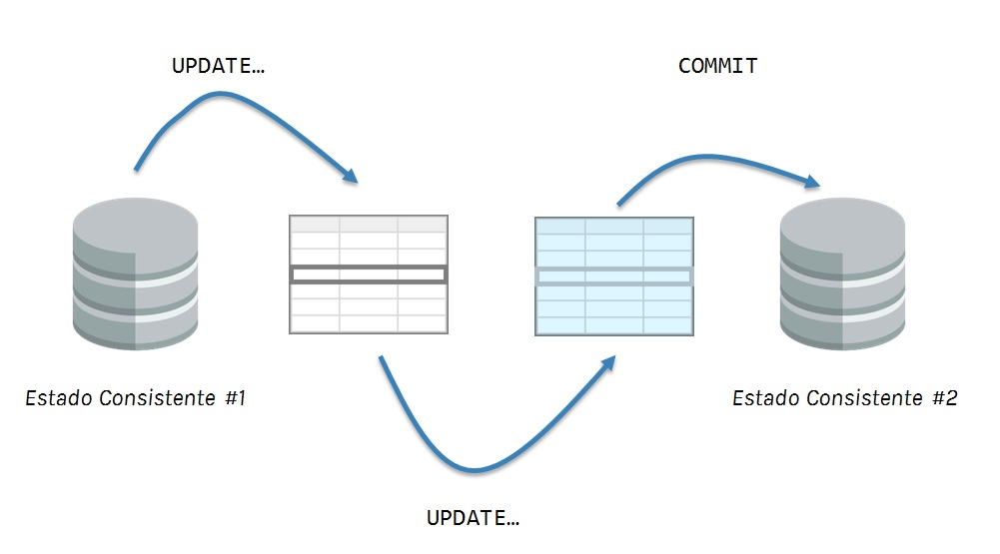

*Transacción*

Si durante el transcurso de alguna de estas dos operaciones hubiera algún problema, deberíamos deshacer los cambios realizados. A esta operación se le conoce como `ROLLBACK`.

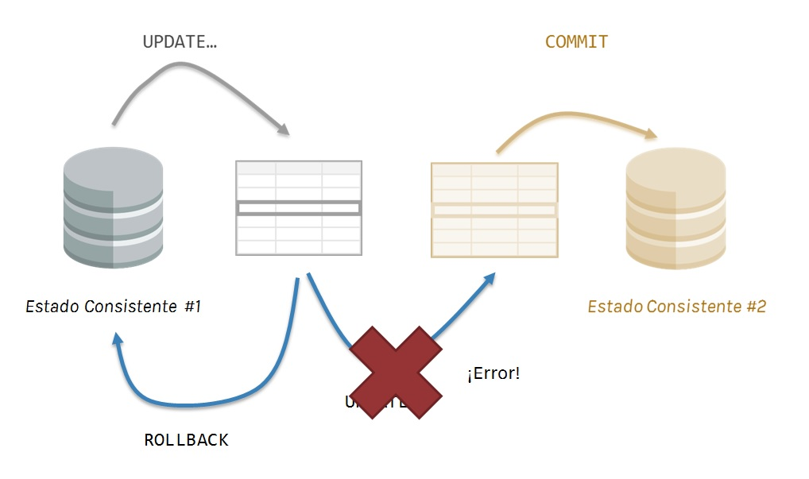

*Transacción*

Hibernate y JPA nos permiten, como no podía ser de otra manera, el manejo de transacciones, para poder gestionar todo esto desde nuestra aplicación.

### 16.2 Transacciones Resource Local o JTA

*Resource Local* es un tipo de transaccionalidad mediante la cual delegamos la responsabilidad de realizar las transacciones en el programador. Las transacciones se obtienen a partir del *EntityManager*, y son de tipo `javax.persistence.EntityTransaction`. Podemos manejar las transacciones a través de los métodos `begin()`, `commit()` y `rollback()`. Su uso está orientado sobre todo a aplicaciones de escritorio o que no se ejecutan en un servidor de aplicaciones.

*JTA*, en cambio, es parte de la especificación *Java EE*. Se trata de un estándar (que debe ser implementado por el servidor de aplicaciones que utilicemos), que centraliza la gestión de las transacciones. Utiliza el tipo `javax.transaction.UserTransaction` que también tiene los métodos `begin()`, `commit()` y `rollback()`. Su uso está orientado a las aplicaciones que se ejecutan en un servidor de aplicaciones, como las aplicaciones Web MVC. La configuración de JPA, Hibernate y JTA es muy cómoda cuando trabajamos con otros frameworks, como puede ser Spring Web MVC y Spring Boot, quien realiza la configuración por nosotros.

A continuación podemos ver un ejemplo de control de una transacción con *Resource Local*:

```java
@Entity
public class UserAccount {

    @Id
    private int id;

    @Column
    private String name;

    @Column
    private double balance;


    public UserAccount() {

    }

  //Getters y Setters

}

public class App {

    static EntityManagerFactory emf;

    static EntityManager em;

    public static void main(String[] args) {

        // Configuramos el EMF a través de la unidad de persistencia
        emf = Persistence.createEntityManagerFactory("Transacciones");

        // Generamos un EntityManager
        em = emf.createEntityManager();

        // Construimos un objeto de tipo User
        UserAccount user1 = new UserAccount();
        user1.setId(1);
        user1.setName("Pepe");
        user1.setBalance(500);

        insertUserAccount(user1);

        // Construimos otro objeto de tipo User
        UserAccount user2 = new UserAccount();
        user2.setId(2);
        user2.setName("Juan");
        user2.setBalance(300);

        insertUserAccount(user2);

        makeTransfer(user1, user2, 100.0);


        // Cerramos el EntityManager
        em.close();
        emf.close();

    }

    public static void insertUserAccount(UserAccount userAccount) {
        try {
            //Iniciamos una transacción
            em.getTransaction().begin();
            //Persistimos los datos
            em.persist(userAccount);
            //Commiteamos la transacción
            em.getTransaction().commit();
            System.out.println("El objeto ha sido dado de alta correctamente. Muchas gracias.");
        } catch(Exception e) {
            System.out.println("El objeto no ha sido dado de alta correctamente. Disculpe las molestias");
            System.err.println(e.getMessage());
            if (em.getTransaction().isActive()) {
                em.getTransaction().rollback();
            }
        }

    }


    public static void makeTransfer(UserAccount origen, UserAccount destino, double cantidad) {
        try {
            //Iniciamos una transacción
            em.getTransaction().begin();

            origen.setBalance(origen.getBalance() - cantidad);
            destino.setBalance(destino.getBalance() + cantidad);

            em.persist(origen);
            em.persist(destino);

            //Commiteamos la transacción
            em.getTransaction().commit();

            System.out.println("El traspaso ha sido realizado correctamente. Muchas gracias.");
        } catch(Exception e) {
            System.out.println("El traspaso no ha sido realizado correctamente. Disculpe las molestias");
            System.err.println(e.getMessage());
            if (em.getTransaction().isActive()) {
                em.getTransaction().rollback();
            }
        }
    }

}
```

### 16.3 Patrones y antipatrones

#### 16.3.1 Sesión-por-operación (***antipatrón***)

Abrir una sesión (*Session* en Hibernate nativo, un *EntityManager* en JPA) para cada llamada a la base de datos en un solo hilo es un antipatrón. Se deben agrupar las llamadas a la base de datos en secuencias organizadas de sentencias. En ese sentido, tampoco es positivo activar el autocommit. Las transacciones no deben ser optativas; toda comunicación con el RDBMS debe estar enmarcada dentro de una transacción.

#### 16.3.2 Sesión-por-petición (***patrón***)

Se trata del patrón más habitual. El término *petición* hace referencia aquí a un sistema que reacciona a una serie de peticiones desde el cliente o usuario. Un gran ejemplo son las aplicaciones web, pero no son las únicas. En este modelo, cuando se recibe una petición en el servidor, se abre una sesión, se realizan todas las operaciones y, una vez que se han finalizado todas, se cierra la sesión y se envía la respuesta al cliente. De esta forma, hemos utilizado una sola transacción. Este patrón es la medida perfecta para muchas aplicaciones. Comprobaremos su utilización en lecciones posteriores en el ejemplo de JPA y Spring.

#### 16.3.3 Conversaciones *largas* (***patrón***)

El patrón sesión-por-petición no es la única forma de diseñar unidades de trabajo. Muchos procesos empresariales requieren de una serie completa de interacciones con el usuario intercaladas con accesos a la base de datos. En aplicaciones empresariales o web no es aceptable que una transacción de la base de datos abarque la interacción de un usuario. Considere el siguiente ejemplo:

Se abre la primera pantalla de un diálogo. Los datos que ve el usuario han sido cargados en una *Session* (*EntityManager*) en particular y en una transacción de la base de datos. El usuario es libre de modificar los objetos. El usuario hace click en “Guardar” después de 5 minutos y espera que sus modificaciones se hagan persistentes. También espera que él sea la única persona editando esta información y que no ocurra ningún conflicto en la modificación. Desde el punto de vista del usuario, llamamos a esta unidad de trabajo, una larga conversación o transacción de aplicación. Hay muchas formas de implementar esto en su aplicación.

Hibernate proporciona algunos mecanismos para implementar este patrón:

Mecanismo | Descripción
----------|------------
Versionado automático	| Hibernate puede realizar un control automático optimista de la concurrencia por nosotros. Puede detectar automáticamente (al final de la conversación) si ha ocurrido una modificación durante el tiempo marcado.
Objetos separados	| Si decide usar el patrón sesión-por-petición, todas las instancias cargadas estarán en estado separado durante el tiempo para pensar del usuario. Hibernate le permite volver a unir los objetos y hacer persistentes las modificaciones. El patrón se llama sesión-por-petición-con-objetos-separados. Se usa el versionado automático para aislar las modificaciones simultáneas.
Sesión extendida | La Session de Hibernate puede ser desconectada de la conexión JDBC subyacente después de que haya guardado la transacción de la base de datos y haya reconectado cuando ocurra una nueva petición del cliente. Este patrón se conoce como sesión-por-conversación y hace la re-unión innecesaria. Para aislar las modificaciones simultáneas se usa el versionado automático y usualmente no se permite que se limpie la Session automáticamente sino explícitamente.

Todos estos mecanismos tienen ventajas y desventajas, algunas de las cuales pueden ser evidenciadas en el siguiente apartado.

#### 16.3.4 Sesión-por-aplicación (***antipatrón***)

La sesión-por-aplicación se considera un antipatrón. Los objetos *Session* o *EntityManager* no son *thread-safe*, por lo que si tenemos que utilizarlos en varios hilos de ejecución diferentes, posiblemente observemos comportamientos extraños. Además, Hibernate suele cerrar la sesión cuando sucede una excepción, por lo que un problema para un usuario puntual puede provocar la caída completa del sistema.

### 16.4 Control de concurrencia

Las transacciones pueden conseguir que los usuarios tengan la sensación de la que bases de datos es *exclusivamente* suya, ya que aislan a unos de otros. Esto se consigue mediante diferentes mecanismos, como bloqueos de lectura y escritura, o mecanismos más avanzados, como el MVCC (*Multiversion concurrency control*).

Algunos problemas que se pueden presentar debidos a la concurrencia son:

* Actualización perdida (*lost update*).

* Lectura sucia (*dirty read*)

* Lectura no repetible (*non repeteable read*)

* Lectura fantasma (*phantom read*)

Problema y descripción | Imagen
-----------------------|-------
**Actualización perdida (*lost update*)** Dos trx sin bloqueo actualizan los mismos datos. La trxB hace rollback y se pierden los datos de trxA	| 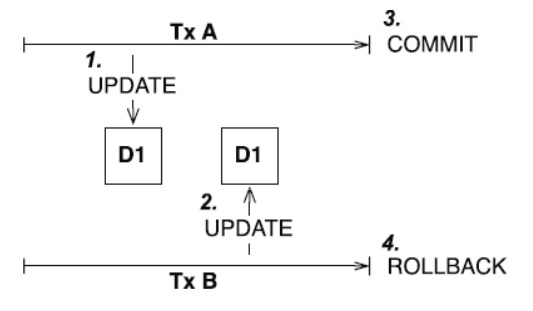
**Lectura sucia (*dirty read*)** TrxA lee datos que luego desaparecen por rollback | 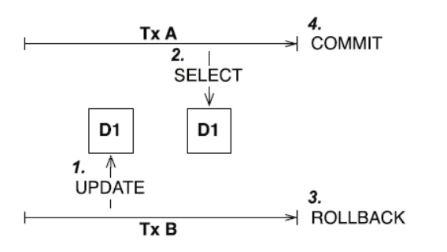
**Lectura no repetible (*non repeteable read*)** Durante txA txB es más rápida y modifica datos que vuelve a necesitar txA | 	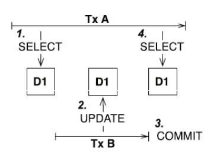
**Lectura fantasma (*phantom read*)** Durante txA txB inserta (o modifica) nuevos datos que txA va a detectar más tarde repitiendo la consulta (u otra que depende de ellos) | 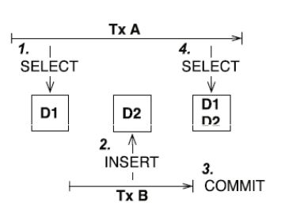

#### 16.4.1 Mecanismos de control de concurrencia en JPA

Existen dos grandes grupos: los optimistas y los pesimistas.

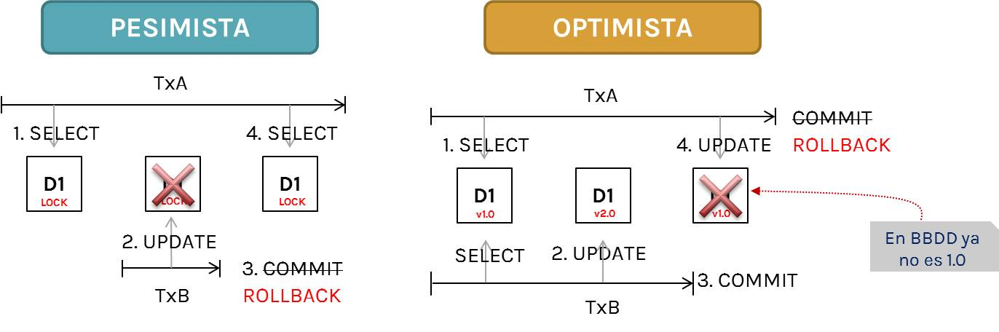

##### 16.4.1.1 Bloqueo optimista (*optimistic locking*)

JPA soporta optimistic locking mediante un campo versionado de bloqueo, definido por la anotación `@Version`. Dicho campo se actualiza automáticamente por la implementación JPA en cada actualización y debe ser conservado tal cual por la aplicación. En el momento de la realización del merge(), si se detecta un bloqueo o cambio, se lanza una excepción OptimisticLockException.

La anotación se puede asociar a una varible numérica (*long*) o a una fecha:

```java
@Version
private long version;
``` 

```java
@Version
private Date version;
```

*Los campos anotados con `@Version` no llevan ni getters ni setters*

##### 16.4.1.2 Bloqueo pesimista (*pessimistic locking*)

Normalmente, Hibernate utiliza el mecanismo de aislamiento de JDBC, y este a su vez el de la base de datos, dejando que sea esta la que realice el trabajo. Sin embargo, hay ocasiones en que usuarios avanzados desean poder obtener bloqueos exclusivos pesimistas.

A continuación listamos los que están disponibles, a través de la enumeración `LockModelType`:

* `READ`, `OPTIMISTIC`: La versión de la entidad se comprueba al final de la transacción en curso.

* `WRITE`, `OPTIMISTIC_FORCE_INCREMENT`: La versión de la entidad es incrementada automáticamente aunque la entidad no haya cambiado.

* `PESSIMISTIC_FORCE_INCREMENT`: La entidad es bloqueada de forma pesimista y su versión es incrementada automáticamente aunque no cambie.

* `PESSIMISTIC_READ`: La entidad es bloqueada de forma pesismista usando un bloqueo compartido (si el RDBMS lo permite).

* `PESSIMISTIC_WRITE`: La entidad es bloqueada usando un bloqueo explícito.
Todos estos bloqueos se pueden usar en búsquedas mediante el método `find` o a través de queries.

# 20 Control de concurrencias 15:55 

Seguimos hablando de control de concurrencias

## Contenido adicional 5   

[Herencia y valores generados (parte I)](pdfs/12_Elementos_avanzados.pdf)

[Mapeo de colecciones](pdfs/13_Colecciones.pdf)

[Generación del esquema](pdfs/14_Generación_del_esquema.pdf)

[Esquema](pdfs/schema.sql)

[Transacciones, patrones y antipatrones](pdfs/16_Transacciones.pdf)
