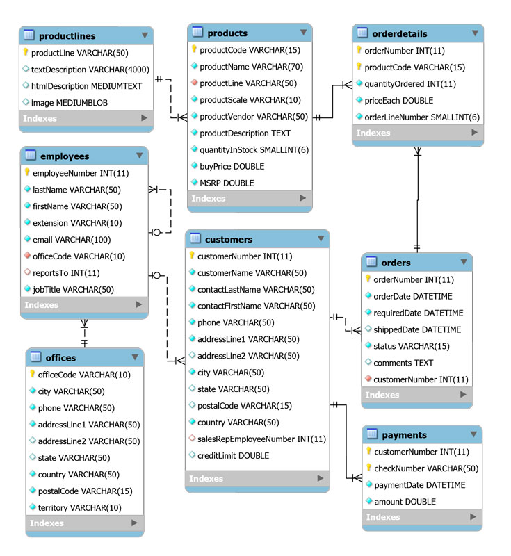

# 6. Consultas 61m
   * 21 Consultas (Parte I) 18:25 
   * 22 Consultas (Parte II) 15:13 
   * 23 Consultas (Parte III) 16:09 
   * 24 Consultas (Parte IV) 11:43 
   * Contenido adicional 2
   
# 21 Consultas (Parte I) 18:25 

[Consultas (Parte I)](pdfs/17_Consultas.pdf)

[mysqlsampledatabase](pdfs/mysqlsampledatabase.zip)

### 17.1 Introducción

De poco servirían nuestras aplicaciones si no pudiéramos consultar los datos que tenemos almacenados en nuestras bases de datos. JPA e Hibernate nos proveen de un lenguaje de consulta a nivel de entidades (JPA propone JPQL, e Hibernate HQL).

#### 17.1.1 Base de datos de ejemplo

A lo largo de este capítulo utilizaremos una base de datos de ejemplo, con la siguiente estructura:



*Esquema de la base de datos*

El esquema de la base de datos se puede descargar desde este enlace

**Script de creación de la base de datos**

Para trabajar con ella, vamos a crear un proyecto y generar las entidades a partir de las tablas, como en la lección *Generación del Esquema*.

### 17.2 JPQL básico

Por lo que hemos trabajado anteriormente, solo hemos podido obtener, a través del *EntityManager*, entidades a partir de su identificador, y solamente una entidad por consulta. Para aquellos que ya conozcan SQL esto resultará un enfoque muy pobre. JPQL nos va a permitir realizar consultas en base a muchos criterios, así como obtener más de un valor por consulta.

La consulta JPQL más básica tiene la siguiente estructura:

```sql
  SELECT c FROM Customer c
```  

Esta sentencia obtiene todas las instancias de `Customer` que existan en la base de datos. La expresión puede parecer un poco extraña la primera vez que se ve, pero es muy sencilla de entender. Las palabras SELECT y FROM tienen un significado similar a las sentencias homónimas del lenguaje SQL, indicando que se quiere seleccionar (SELECT) cierta información desde (FROM) cierto lugar. La segunda c es un alias para la clase Customer, y ese alias es usado por la primera c (llamada expresion) para acceder a la clase (tabla) a la que hace referencia el alias, o a sus propiedades (columnas). El siguiente ejemplo nos ayudará a comprender esto mejor:

```sql
  SELECT c.customerName FROM Customer c
```

El alias c nos permite utilizar la expresión c.CustomerName para obtener los nombres de todos los clientes almacenados en la base de datos. La expresiones JPQL utilizan la notación de puntos, pudiendo acceder a objetos anidados:

```sql
  SELECT e.propiedad.anidada.masanidada FROM Entidad e
```

Al igual que en SQL, JPQL nos permite obtener más de una propiedad:

```sql
  SELECT c.customerName, c.city, c.country FROM Customer c
```

#### 17.2.1 Consultas con parámetros

JPQL nos permite la inclusión de parámetros en base a un índice y en base a un nombre:

```sql
  SELECT e FROM Employee e WHERE e.jobTitle = :jobTitle
```

```sql
  SELECT o FROM Order o WHERE o.orderDate BETWEEN ?1 AND ?2 AND status = ?3
```

#### 17.2.2 Consultas con salida ordenada

También nos permite la ordenación de los resultados, al estilo SQL. Este orden puede ser ascendente (ASC) o descendente (DESC).

```sql
  SELECT o FROM Order o ORDER BY o.orderDate DESC
```

### 17.3 JPA `Query`

JPA nos provee de dos interfaces, `javax.persistence.Query` y `javax.persistence.TypedQuery`, que se obtienen directamente desde el *EntityManager*. Para ello, podemos usar el método *EntityManager#createQuery*. Para consultas con nombre (las veremos más adelante), podemos usar el método *EntityManager#createNamedQuery*.

```sql
Query query = em.createQuery(
    "select c from Customer c"
);

List<Customer> listCustomer = (List<Customer>) query.getResultList();
```

Para aquellas consultas que devuelven más de un resultado, tenemos a nuestra disposición el método `getResultList()`; si la consulta devuelve un solo resultado, tendremos entonces que llamar a `getSingleResult()`.

Para asignar los parámetros dinámicos a las consultas, tenemos a nuestra disposición diferentes versiones del método `setParameter`, que acepta tanto un índice como un nombre de parámetro, y un objeto para utilizar en la consulta.

```sql
Query query = em.createQuery(
  "SELECT e FROM Employee e WHERE e.jobTitle = :jobTitle"
);

query.setParameter("jobTitle", "Sales Rep");
```

```sql
Query query = em.createQuery(
"SELECT o FROM Order o WHERE o.orderDate BETWEEN ?1 AND ?2 AND status = ?3 ORDER BY o.orderDate DESC"
);

Calendar calendar = Calendar.getInstance();
calendar.set(2003, 0, 1);      
query.setParameter(1, calendar.getTime());

calendar.set(2003, 5, 30);
query.setParameter(2, calendar.getTime());

query.setParameter(3, "Shipped");
```

### 17.4 Joins con JPQL

La operación JOIN es una operación básica en SQL, y sirve para realizar una reunión conveniente entre dos tablas a partir de una clave externa.

#### 17.4.1 Joins explícitos

Como no podía ser de otra manera, JPQL permite realizar los mismos JOIN que en SQL (JOIN, INNER JOIN, LEFT | RIGHT JOIN), si bien uno de los más interesantes el *JOIN FETCH*. Este join sobrescribe la forma en que se recuperan determinadas asociaciones, evitando las N+1 consultas y sustituyéndolas por un JOIN.

```sql
Query query = em.createQuery(
    "select c "
  + "from Customer c "
  + "left join fetch c.employee "
);
```

*Para que un JOIN FETCH sea válido, la asociación debe estar en alguna de las clases que estén descritas en la cláusula SELECT*

#### 17.4.2 Joins implícitos

Un JOIN implícito se realiza siempre a través de alguna de las asociaciones de una entidad, navegando a través de sus propiedades.

```sql
TypedQuery<Customer> query = em.createQuery(
    "select c "
  + "from Customer c "
  + "where c.employee = :employee", Customer.class);

query.setParameter("employee", em.find(Employee.class, 1370));
```

*El uso de TypedQuery en el ejemplo anterior es meramente ilustrativo. Se puede realizar un JOIN implícito con Query*

### 17.5 Consultas de actualización

JPQL también nos permite lanzar consultas de actualización de datos. La estructura sintáctica de las consultas es muy similar a la de SQL nativo:

```sql
UPDATE Entity e
SET e.prop1 = newValue1, e.prop2 = newValue2, ...
WHERE ...
```

```sql
DELETE FROM Entity e
WHERE ...
```

Para invocarlas, tenemos que utilizar el método `executeUpdate` de la interfaz `Query`.

```sql
em.getTransaction().begin();

//UPDATE

//Incremento del 10% en el límite de crédito a todos los clientes
int numUpdateResults = em.createQuery(
    "update Customer c "
    + "set c.creditLimit = c.creditLimit * 1.1")
    .executeUpdate();
System.out.println("Número de registros afectados: " + numUpdateResults);

//DELETE

Date date = null;
try {
date = new SimpleDateFormat("dd/MM/yyyy").parse("06/06/2003");

  int numDeleteResults = em.createQuery(
      "delete from Payment p "
      + "where p.paymentDate = :fecha")
      .setParameter("fecha", date)
      .executeUpdate();

  System.out.println("Número de registros afectados: " + numDeleteResults);


} catch (ParseException e) {
System.err.println("Error en el parseo de la fecha");
}

em.getTransaction().commit();
```

JPQL no permite la ejecución de sentencias *INSERT*. Sin embargo, HQL si que lo permite:

```sql
int insertedEntities = session.createQuery(
    "insert into Partner (id, name) " +
    "select p.id, p.name " +
    "from Person p ")
.executeUpdate();
```

### 17.6 NamedQueries

Las consultas con nombre son un tipo de consultas especiales ya que, una vez que son definidas, no pueden ser modificadas. Son leídas y transformadas en SQL durante la inicialización del contexto de persistencia. Por ello, son más eficientes y ofrecen un rendimiento mayor. Se suelen definir mediante anotaciones en las clases entidad, si bien también pueden declararse en XML.

El asistente de Eclipse que nos ha generado las entidades desde las tablas nos ha incluido una sentencia por defecto en cada una de ellas:

```sql
@Entity
@Table(name="customers")
@NamedQuery(name="Customer.findAll", query="SELECT c FROM Customer c")
public class Customer implements Serializable {
    //Resto del código
}
```

Como podemos comprobar, la anotación `@NamedQuery` requiere de dos argumentos: el nombre que le vamos a dar a la consulta, y la definición de la consulta en sí.

Para ejecutar esta consulta, tenemos que utilizar el método `createNamedQuery` de *EntityManager*.

```sql
Query query = em.createNamedQuery("Customer.findAll");
```

Se pueden añadir más de una consulta con nombre, a través de la anotación `@NamedQueries`. Las consultas también pueden recibir parámetros.

```sql
@Entity
@Table(name="customers")
@NamedQueries({
        @NamedQuery(name="Customer.findAll", query="SELECT c FROM Customer c"),
        @NamedQuery(name="Customer.findByName", query="SELECT c FROM Customer c WHERE c.customerName LIKE :name"),
        @NamedQuery(name="Customer.findByEmployee", query="SELECT c FROM Customer c WHERE c.employee = :employee"),
})
public class Customer implements Serializable {

}
```

### 17.7 Consultas con SQL nativo

JPA e Hibernate también permiten la ejecución de SQL nativo (en particular, el dialecto del RDBMS que estemos usando). Esto es muy útil cuando nuestro sistema tiene funcionalidades específicas, o si nuestra experiencia en SQL nos permite implementar sentencias que sean realmente eficientes.

#### 17.7.1 Consultas escalares

La consulta más básica es aquella en la que obtenemos una lista de valores en un Object[].

```sql
List<Object[]> customers = entityManager.createNativeQuery(
    "SELECT * FROM customers" )
.getResultList();
```

```sql
List<Object[]> employees = entityManager.createNativeQuery(
    "SELECT employeeNumber, firstName, lastName FROM employees" )
.getResultList();

for(Object[] employee : employees) {
    Number employeeNumber = (Number) employee[0];
    String firstName = (String) employee[1];
    String lastName = (String) employee[2];
}
```

#### 17.7.2 Consultas de entidades

También podemos obtener entidades desde consultas nativas:

```sql
List<Customer> customers = entityManager.createNativeQuery(
    "SELECT * FROM customers", Customer.class )
.getResultList();
```

*Dado que la entidad Customer tiene asociaciones y algunas de ellas están mapeadas con fetch EAGER, al ejecutar este ejemplo, JPA+Hibernate rescatan el resto de datos necesarios a través de consultas JPQL.*

#### 17.7.3 Manejo de asociaciones

JPA e Hiberante también nos permite manejar asociaciones con SQL nativo.

Por ejemplo, si nuestra entidad tiene una asociación *Many-To-One* con otra, al usar SQL nativo tenemos que devolver la clave externa para que no se produzca un error:

```sql
List<Employee> employeesList = em.createNativeQuery(
                "SELECT employeeNumber, lastName, firstName, extension, email, officeCode, reportsTo, jobTitle FROM employees",
                Employee.class).getResultList();
```

#### 17.7.4 Consultas SQL con nombre

Por último, decir que también podemos definir consultas con nombre, como ocurría con JPQL. Estas se definen a través de la anotación `@NamedNativeQuery`.

```sql
@Entity
@Table(name="employees")
@NamedQuery(name="Employee.findAll", query="SELECT e FROM Employee e")
@NamedNativeQuery(name="Employee.nativeFindAll", query="SELECT * FROM employees", resultClass=Employee.class)
public class Employee implements Serializable {
  //Resto de código
}
```

Su uso también es muy sencillo

```sql
List<Employee> employeesList = em.createNamedQuery("Employee.nativeFindAll").getResultList();
```

### 17.8 Consultas con herencia

En el caso de la herencia, las consultas pueden tener un comportamiento un poco peculiar. Las consultas reales que se ejecutarán dependerán de las estrategias de herencia que escojamos.

Si rescatamos el ejemplo que revisamos en el capítulo referente a la herencia:

```sql
@Entity
@Inheritance(strategy = InheritanceType.TIPO_DE_HERENCIA)
public class Cuenta implements Serializable {

  //Igual que el ejemplo anterior

}


@Entity
public class CuentaCredito extends Cuenta implements Serializable {

  //Igual que el ejemplo anterior

}

@Entity
public class CuentaDebito extends Cuenta implements Serializable {

  //Igual que el ejemplo anterior

}
```

En función del *TIPO_DE_HERENCIA* que escojamos, las consultas funcionarán de una manera o de otra.

#### 17.8.1 Consultas con herencia SINGLE_TABLE

En este caso, una consulta como la siguiente:

```sql
  select c from Cuenta c
```

Nos devolverá todas las instancias del tipo base `Cuenta` y de los extendidos `CuentaCredito` y `CuentaDebito`.

Si queremos obtener de un subtipo en particular, podemos hacer uso de la función `TYPE(?)`, comparando con uno de los valores que hayamos usado como `@DiscriminatorValue`:

```sql
select c from Cuenta c Where TYPE(c) = 'CC'
```

#### 17.8.2 Consultas con herencia JOINED

Al igual que el caso anterior, una consulta como la siguiente:

```sql
  select c from Cuenta c
```

Nos devolverá todas las instancias del tipo base `Cuenta` y de los extendidos `CuentaCredito` y `CuentaDebito`.

Si queremos hacer una consulta que nos devuelva un subtipo, tan solo tenemos que pedirlo explícitamente en el FROM:

```sql
  select cc from CuentaCredito cc
```

Si lo que queremos, es consultar la entidad base, pero filtrando por tipo, la función TYPE(?) también funciona aquí, usando como valor de comparación el nombre de la entidad.

```sql
select c from Cuenta c Where TYPE(c) = Cuenta
```

Esta consulta nos devolvería solamente la instancias de la entidad base.

Si comprobamos la ejecución de estas consultas, encontraremos que Hibernate tiene que ejecutar varios JOINS para poder realizarlas.

#### 17.8.3 Consultas con herencia `TABLE_PER_CLASS`

La estrategia de consultas que podemos realizar es la misma que en el caso *JOINED*, pero si revisamos el código SQL que ejecuta Hibernate, podremos comprobar que utiliza varias sentencias SQL unidas por cláusulas UNION.

# 22 Consultas (Parte II) 15:13 

Conoce las dos interfaces disponibles para realizar las consultas.

# 23 Consultas (Parte III) 16:09 

En esta lección vemos consultas  DML

# 23 Consultas (Parte IV) 11:43 

En la ultima lección de consultas trabajaremos las consultas con herencia.

# Contenido adicional 2  

[Consultas (Parte I)](pdfs/17_Consultas.pdf)

[mysqlsampledatabase](pdfs/mysqlsampledatabase.zip)
