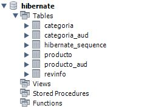
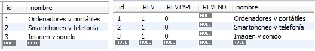
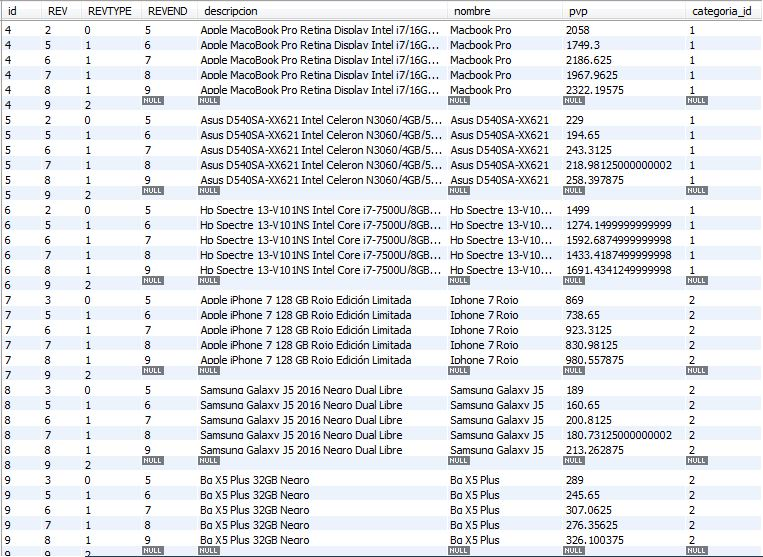

# 7. Módulos 14m
   * 25 Hibernate Envers 14:21 
   * Contenido adicional 1

# 25 Hibernate Envers 14:21 

[Hibernate Envers](pdfs/18_Envers.pdf)

## Resumen Profesor

### 18.1 Introducción

Envers es un módulo del núcleo de hibernate que puede trabajar tanto con JPA como con Hibernate nativo. Nos permite implementar fácilmente el versionado/auditoría para clases, es decir, la posibilidad de tener un histórico de cambios que han sucedido fila a fila.

### 18.2 Configuración

Para poder usar Envers, tenemos que añadir una nueva dependencia en el `pom.xml`:

```xml
<dependency>
  <groupId>org.hibernate</groupId>
    <artifactId>hibernate-envers</artifactId>
    <version>5.2.9.Final</version>
</dependency>
```

Para cada entidad que queramos auditar, tenemos que incluir la anotación `@Audited`. Al incluirlo en nuestro proyecto, podemos observar que para cada entidad auditada se ha creado una nueva tabla en la base de datos, llamada `entity_table_AUD`.

*Envers crea automáticamente las tablas de auditoría si usamos la propiedad hiberante.hbm2ddl.auto con valores create, create-drop o update. En otro caso, tenemos que generar nosotros el esquema, aunque este puede ser generado mediante una tarea Ant.*

Podemos usar la anotación `@Audited` a nivel de tabla y también a nivel de propiedad (si solo queremos auditar una serie de propiedades, y no la entidad completa).

#### 18.2.1 Propiedades de configuración

Podemos utilizar algunas propiedades para configurar determinados aspectos de Envers, como los prefijos y sufijos de tablas, nombres de propiedades, etc… A continuación podemos ver algunos de los más utilizados:

Propiedad | Valor por defecto | Descripción
----------|-------------------|------------
org.hibernate.envers.audit_table_prefix | | Prefijo que se añadirá al nombre de las tablas de auditoría
org.hibernate.envers.audit_table_suffix | _AUD | Sufijo que se añadirá al nombre de las tablas de auditoría
org.hibernate.envers.revision_field_name | REV | Nombre del campo en la entidad auditada que almacenará el número de revisión.
org.hibernate.envers.revision_type_field_name | REVTYPE | Nombre del campo en la entidad auditada que almacenará el tipo de cambio realizado (`add`, `mod`, `del`).
org.hibernate.envers.audit_strategy | org.hibernate.envers.strategy.DefaultAuditStrategy | Estrategia de auditoria a utilizar. La estrategia por defecto almacena solo la revisión. Otra alternativa es `org.hibernate.envers.strategy.ValidityAuditStrategy`, que almacena más información. Es mas lenta para los cambios, pero más rápida para la lectura.
org.hibernate.envers.audit_strategy_validity_store_revend_timestamp | false | Indica si la fecha de la revisión se puede almacenar mientras que los datos son válidos. Esto es útil para particionar o rotar la base de datos. Esta propiedad es solo utili si usamos `ValidityAuditStrategy`.

### 18.3 Utilización de Hiberante Envers

Como hemos dicho antes, para activar envers, tan solo tenemos que añadir la dependencia en el proyecto, y marcar aquellas entidades (o propiedades de entidades) que queremos auditar. A partir de ahí, envers empieza a hacer su trabajo.

Supongamos dos entidades a auditar:

```java
@Entity
@Audited
public class Categoria implements Serializable {

    @Id
    @GeneratedValue(strategy=GenerationType.AUTO)
    private long id;
    private String nombre;

  //Resto de atributos o métodos

}

@Entity
@Audited
public class Producto implements Serializable {

    @Id
    @GeneratedValue(strategy=GenerationType.AUTO)
    private long id;
    private String nombre;
    private String descripcion;
    private double pvp;

    @ManyToOne
    private Categoria categoria;

  //Resto de atributos o métodos
}
```

Al crear el esquema, Hibernate genera más tablas de lo habitual:



*Tablas generadas*

Si por ejemplo, insertamos una serie de elementos `Categoria`

```java
Categoria[] categorias = {
  new Categoria("Ordenadores y portátiles"),
  new Categoria("Smartphones y telefonía"),
  new Categoria("Imagen y sonido")
};

addCategorias(Arrays.asList(categorias));


public static void addCategorias(List<Categoria> list) {
        em.getTransaction().begin();
        for (Categoria c : list)
            em.persist(c);
        em.getTransaction().commit();
}
```

Se insertan, en la tabla `categoria`, las 3 categorías (como era de esperar). Pero además, se insertar los respectivos registro de revisión en la tabla `categoria_aud`.



*Valores generados*

Esto sucede también con `Producto` y las tablas `producto` y `producto_aud`. Si insertamos una serie de productos, realizamos algunos cambios sobre ellos, y posteriormente los borramos, se generan múltiples valores en la tabla de auditoria:



*Valores generados*

### 18.4 Consulta sobre valores auditados

Hibernate Envers nos permite realizar consultas sobre los valores auditados. Para ello, necesitamos generar un `AuditReader`:

```java
AuditReader reader = AuditReaderFactory.get(entityManager);
```

Con este objeto, podemos generar un `AuditQueryCreatorque` pone a nuestra disposición varios métodos de consulta. Uno de los más útiles es `forRevisionsOfEntity`. Este nos permite consultar las diferentes revisiones de objetos de un tipo, así como los datos asociados a la revisión. Si no se indica lo contrario, devuelve una lista de objetos con 3 valores:

* La instancia con los valores de la entidad audiatada

* Si no se utiliza un tipo específico para la revisión, un objeto de tipo `DefaultRevisionEntity`, que nos permite consultar en id de la revisión o la fecha.

* Un objeto de tipo `RevisionType`, que nos permite saber si la información se almacenó por una inserción (ADD), modificación (MOD) o un borrado (DEL).

```java
AuditQuery query = reader.createQuery().forRevisionsOfEntity(Producto.class, false, true);

        List<Object[]> results = query.getResultList();

        for (Object[] obj : results) {
            Producto p = (Producto) obj[0];
            DefaultRevisionEntity dre = (DefaultRevisionEntity) obj[1];
            RevisionType revType = (RevisionType) obj[2];
            System.out.println(String.format("(Id: %d) - Producto: %s (%.2f €) (%s el %s)", dre.getId(), p.getNombre(), p.getPvp(),
                    revType.toString(), dre.getRevisionDate()));

        }
```

## Transcripción

## Contenido adicional 1

[Hibernate Envers](pdfs/18_Envers.pdf)
