# 1. Introducción a Spring 89m
   * Introducción a Spring 5:16 
   * Configuración Spring 7:24 
   * Inversión de control 3:31 
   * Inyección de dependencias. Tipos de inyección. 4:13 
   * Beans (simples, referencias, anidaciones, colecciones) 37:04 
   * Inyección automática 6:30 
   * Ámbitos de un Bean 4:49 
   * Ciclo de vida de los Beans 8:22 
   * Anotaciones Required, Autowired y Qualifier 9:13 
   * Estereotipos 2:48 
   * Contenido adicional 10
   
   
## Introducción a Spring 5:16 

[Introducción a Spring](pdfs/01_Introducción%20a%20Spring.pdf)

### 1.1 ¿Qué es Spring?

Spring es un *framework* de código abierto para el desarrollo de aplicaciones (empresariales) Java. Su origen está en el trabajo de **Rod Johnson**, que trabajaba como consultor externo, y que plasmó en el libro **Expert One-to-One J2EE Design and Development**  (Octubre, 2002). Según Johnson, el modelo de los ***Enterprise Java Beans*** era excesivamente tedioso y pesado para muchas aplicaciones desarrolladas hasta el momento. Por ello, condensó su experiencia y sus buenas prácticas en un conjunto de clases que fueron el origen del framework.

Algunas de las críticas de Johnson al uso de EJBs son (ver ***J2EE development without EJB (2004)***):

* Complejidad (descriptores, implementaciones de interfaces, …) y baja productividad del programador.

* Modelo remoto solamente basado en RMI.

* Muchas aplicaciones no necesitan componentes remotos.

* Difíciles de depurar (volver a hacer *deployment* y volver a arrancar).

* Mapeo O/R basado en *entity beans* limitado (por ejemplo, no existe la herencia)

* …

Spring popularizó desde su inicio ideas como la inyección de dependencias (que aprenderemos más adelante), el uso de *POJOs* (*Plain old Java Object*) como objetos de negocio, etc… que suponían un cambio radical con respecto al estándar; de esta forma, las aplicaciones podían ser más ligeras, y posibilitó que un framework que estaba inicialmente ideado para la capa de negocio se convirtiera en un *stack* de tecnologías para todas las capas de la aplicación.

Spring está basado en los siguientes principios:

* El buen diseño es más importante que la tecnología subyacente.

* Los Java Beans ligados de una manera más libre entre interfaces es un buen modelo.

* El código debe ser fácil de probar.

Desde hace tiempo, estas ideas tan innovadoras popularizadas por Spring se han ido incorporando poco a poco al estándar, de forma que Spring y JavaEE han convergido mucho. Aun así, Spring ha conseguido crear una comunidad de desarrolladores en torno a sus diferentes tecnologías, siendo una alternativa necesaria de conocer, y muy utilizada en el entorno empresarial. En la actualidad, las aportaciones más novedosas de Spring se centran en campos de BigData, NoSQL, HTML5, Mobile, aplicaciones *sociales*, seguridad…

A día de hoy, una de las principales diferencias que podemos encontrar entre JavaEE y Spring es la posibilidad de usar un servidor web más convencional (estilo Tomcat) para desplegar la aplicación (con Spring Boot aprenderemos que nos podemos olvidar incluso de esta parte). JavaEE requiere el uso de un servidor de aplicaciones que, normalmente, requerirá de mayor conocimiento para su configuración y despliegue, y necesitará de unos recursos más potentes para *correr* cualquier aplicación.

### 1.2 Módulos de Spring

En la siguiente imagen, podemos ver las diferentes tecnologías (en terminología Spring, proyectos) que conforman a día de hoy Spring:


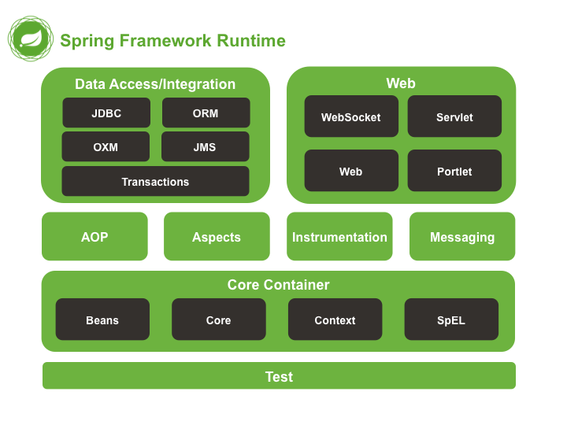

*Algunos de los módulos más importantes de Spring*

* **Core**: La parte fundamental de este *framework* es el módulo *Core*, y los *adyacentes Bean* y *Context*. Proveen toda la funcionalidad para la inyección de dependencias, permitiéndole administrar la funcionalidad del contenedor de Beans (trabajaremos sobre estos conceptos de forma más amplia en las próximas lecciones). Además, también proveen de los servicios Enteprise como JDNI, EJB, …

* **AOP**: Se trata de un módulo que nos permitirá utilizar el paradigma de Programación Orientada a Aspectos (*Aspect Oriented Programming*). Este paradigma permite mejorar la modularización y separar las responsabilidades. De esta forma, podemos separar las funcionalidades comunes, que se utilizan transversalmente a lo largo de toda la aplicación, de aquellas que son propias de cada módulo.

* **Data**: Se trata de un gran módulo, formado por múltiples submódulos, y que nos permite simplificar el acceso y persistencia de datos. *Spring Data* nos proporciona soporte para usar base de datos relacionales (*JDBC*), ORMs (como por ejemplo *JPA, Hibernate*, …) e incluso modelos de persistencia NoSQL (como por ejemplo, MongoDB).

* **Web**: Este módulo nos permitirá implementar el patrón Modelo-Vista-Controlador (MVC) de una manera sencilla y limpia, haciendo uso de forma transparente también de otros patrones de diseño, como *FrontController*. De esta forma, podemos separar limpiamente la lógica de negocio de la presentación de los datos y el acceso a los mismos. Además de aplicaciones que implican el uso de vistas y formularios, también podremos crear servicios web (por ejemplo, al estilo REST) de una forma sencilla y rápida.

La modularidad de Spring nos permitirá la posibilidad de usar solo algunas de las partes del framework, y poder combinar esta con otros frameworks diferentes:

* Un proyecto que implemente MVC mediante el uso de Struts podría incorporar el contenedor de IoC mediante el uso de Spring (sin necesidad de utilizar Spring Web MVC).

* Una aplicación web desarrollada con Spring Web MVC podría implementar su capa de datos mediante el uso de Hibernate (sin hacer uso de Spring Data).

### 1.3 Versiones de Spring

La primera versión de Spring se publicó en marzo de 2004. Actualmente, la versión más estable en la actualidad de Spring es la 4.3.2, si bien ya podemos encontrar en fases preliminares la versión 5.0 (que nos permitirá trabajar con JDK 9).

Versión | Descripción
--------|------------
1.0 | Primera versión de Spring
2.0 | Espacios de nombres XML, soporte para AspectJ
2.5 | Configuración a través de anotaciones
3.0 | Actualización a Java5+, Configuración a través de Java (`@Configuration`)

A continuación, podemos ver algunos de los elementos que se han incorporado en las diferentes versiones 4.X

Versión | Cambios introducidos
--------|---------------------
4.0 |	Mejora de la documentación.
&nbsp; | * Eliminación de código deprecado.
&nbsp; | * Adaptación al uso de Java 8
&nbsp; | * Basado en Java EE 6 (JPA 2.0, Servlet 3.0), con soporte para Java EE 7 (JPA 2.1, JTA 1.2, …)
&nbsp; | * Mejoras en el contenedor de inversión de control
&nbsp; | * Mejoras en el módulo web para la creación de servicios REST (`@RestController`, `AsyncRestTemplate`)
4.1	| Mejoras en las prestaciones de *Java Message Services*.
&nbsp; | Soporte para anotaciones JCache (JSR-107)
&nbsp; | Mejoras varias en el módulo web
&nbsp; | Mejoras en el módulo de WebSocket.
4.2	| Varias mejoras en el módulo core (sobre todo a nivel de configuración a través de Java).
&nbsp; | Mejoras en el módulo de acceso a datos (como por ejemplo, soporte para Hibernate 5.0).
&nbsp; | Mejoras en JMS
&nbsp; | Mejoras en el módulo web (integración de OkHTTP, soporte para CORS, anotaciones propias el mapeo, con `@RequestMapping` como metaanotación, …)
4.3 | Mejoras en el módulo *core*: métodos *default* de Java 8, mayor información en las excepciones, soporte de inyección por constructor para `@Configuration`…
&nbsp; | Mejoras en el módulo web: anotaciones compuestas para `@RequestMapping`: `@GetMapping`, `@PostMapping`, `@PutMapping`, `@DeleteMapping`, y `@PatchMapping`; nuevas anotaciones compuestas para los ámbitos web: `@RequestScope`, `@SessionScope`, `@ApplicationScope`; otra serie de nuevas anotaciones…
&nbsp; | Mejoras en los módulos de WebSocket y Testing

## Configuración Spring 7:24 

[Configuración Spring](pdfs/02_Configuración%20de%20Spring.pdf)

### 2.1 Spring Tool Suite: nuestro entorno de trabajo

STS (Spring Tool Suite), es un entorno de desarrollo basado en Eclipse que está preparado para el desarrollo de aplicaciones Spring. Proporciona un entorno *ready-to-use* para implementar, depurar, ejecutar y desplegar aplicaciones Spring, incluyendo integraciones con Git, Maven, AspectJ, así como todas las funcionalidades de las últimas versiones de eclipse.

La última versión disponible la podemos encontrar en la propia web de spring (https://spring.io/tools/sts). Si pinchamos sobre el enlace, podemos acceder a la descarga del entorno, que viene empaquetado como un fichero zip. Dentro del mismo, podemos encontrar una carpeta con todo el software, y el ejecutable, llamado `STS.exe`.

Sin embargo, en los primeros compases del curso, trabajaremos con Spring al estilo Maven, lo que nos proporcionará algunas ventajas:

* Podremos trabajar con proyectos *legacy* (heredados), que estén configurados como proyectos Maven.

* Nos permitirá implementar proyectos sin el uso de la herramienta específica STS, y así poder utilizar cualquier otro IDE de uso general (el propio Eclipse, Netbeans, JDeveloper…).

### 2.2 Una palabra más sobre *Maven*

A día de hoy encontramos a muchos desarrolladores de Spring que utilizan Eclipse, y que comienzan los desarrollos de Spring como proyectos Maven. Maven nos permite gestionar las dependencias a través de un fichero de configuración, `pom.xml`. A continuación podemos encontrar las dependencias Maven más usuales (y para la versión actual) para el trabajo con Spring.

Dependencia | ¿Para qué sirve?
------------|-----------------
`<dependency><groupId>org.springframework</groupId><artifactId>spring-core</artifactId><version>4.3.2.RELEASE</version></dependency>` |	Esta es una de las dependencias más básicas. Si queremos construir un proyecto básico con Spring, que nos permita usar el *IoC container* y definir nuestros propios beans, esta es la dependencia que debemos usar.
`<dependency><groupId>org.springframework</groupId><artifactId>spring-webmvc</artifactId><version>4.3.2.RELEASE</version></dependency>`	| Esta dependencia nos permitirá trabajar con todos los componentes para implementar aplicaciones web siguiendo el patrón Modelo-Vista-Controlador
`<dependency><groupId>org.springframework</groupId><artifactId>spring-aop</artifactId><version>4.3.2.RELEASE</version></dependency>` | Esta dependencia sirve para poder utilizar la programación orientada a aspectos (AOP).
`<dependency><groupId>org.springframework.data</groupId><artifactId>spring-data-jpa</artifactId></dependency>` | Esta dependencia, algo más específica, nos permitirá trabajar con el submódulo de Spring Data para JPA

A lo largo del curso trabajaremos con algunas dependencias más, que no son propias de Spring, pero sí de otros elementos que necesitaremos, como la interfaz de usuario, el proveedor de ORM (*Object Relational Mapping*), la base de datos…:

Dependencia | ¿Para qué sirve?
------------|-----------------
`<dependency><groupId>com.h2database</groupId><artifactId>h2</artifactId></dependency>` | Base de datos relacional *embebible* en un proyecto, implementada íntegramente en Java. Es muy útil para la fase de desarrollo o para sistemas que no necesitan un sistema gestor de base de datos profesional de alto rendimiento.
`<dependency><groupId>org.hibernate</groupId><artifactId>hibernate-entitymanager</artifactId></dependency>`	| Hibernate es uno de los motores de persistencia más utilizado a día de hoy en proyectos sofware.
`<dependency><groupId>log4j</groupId><artifactId>log4j</artifactId><version>1.2.14</version></dependency>` | Log 4 Java es uno de los múltiples sistemas de *logging* disponibles para Spring, que nos permitirá configurar rápidamente este aspecto de nuestros proyectos.

Durante todas las lecciones, se proporcionarán las dependencias necesarias o el fichero `pom.xml` completo necesarios para poder realizar los ejemplos.

## Inversión de control 3:31 

[Inversión de control](pdfs/03_Inversión%20del%20control.pdf)

### 3.1 ¿Qué es eso de la inversión del control?

Aunque la plataforma Java provee de una gran cantidad de clases y funcionalidades para el desarrollo de aplicaciones, carece de los medios para organizar los bloques básicos en un todo coherente, dejando esta tarea para los arquitectos y desarrolladores. Si bien se pueden utilizar algunos patrones de diseño como *Factory*, *Abstract Factory*, *Builder*, *Decorator*, and *Service Locator* para componer las diferentes clases y objetos de la aplicación, estos patrones son simplemente eso: *buenas prácticas*.

Una forma sencilla de explicar el concepto de *IoC* (*Inversion of control*) es el **Principio de Hollywood**:

*No nos llames; nosotros te llamaremos*

La inversión de control es una forma de programar en la que el flujo de ejecución de un programa se invierte respecto a los métodos de programación tradicionales, en los que la interacción se expresa de forma imperativa realizando llamadas a procedimientos o funciones. De esta forma, para poder implementar la *IoC*, necesitamos un agente externo, normalmente llamado *contenedor*, que se encargará de realizar las conexiones necesarias entre las clases dependientes. Este agente externo será el encargado de controlar el flujo de la aplicación. De esa forma, podremos realiza la implementación de un código que esté débilmente acoplada.

Para entender este cambio, vamos a utilizar un ejemplo con pseudocódigo (para no enmarañar el concepto con mucho código fuente innecesario). Imaginemos que estamos escribiendo un programa que tomar alguna información del usuario y que estamos usando la línea de comandos. Deberíamos hacer algo así:

```js
escribir "¿Cuál es tu nombre?"
nombre <- Introducir nombre por teclado
procesar_nombre(nombre)
escribir "¿Cuál es tu pregunta?"
pregunta <- Introducir pregunta por teclado
procesa_pregunta(pregunta)
```

A lo largo de la interacción existente en el programa, el código es el que decide el flujo: decide cuando preguntar, cuando leer las respuestas así como cuando procesarlas.

Supongamos ahora que queremos adaptar nuestro programa a un sistema gráfico de ventanas. Podríamos tener un código parecido al siguiente (se trata de otra simplificación en pseudocódigo, ya que este código implementado en Java necesitaría de bastantes líneas más):

```js
importar ventanas, botones, campos_texto

ventana_principal <- crear nueva Ventana.
etiqueta_nombre <- crear nueva etiqueta "¿Cuál es tu nombre?"
añadir a ventana_principal << etiqueta_nombre
nombre <- crear nuevo campo_texto
añadir a ventana_principal << nombre
en_caso_de_evento('dejar foco') sobre nombre, procesar_nombre(nombre)
etiqueta_pregunta <- crear nueva etiqueta "¿Cuál es tu pregunta?"
añadir a ventana_principal << etiqueta_pregunta
pregunta <- crear nuevo campo_texto
añadir a ventana_principal << pregunta
en_caso_de_evento('dejar foco') sobre pregunta, procesar_pregunta(pregunta)
Ventanas.buclePrincipal
```

Hay una gran diferencia entre el flujo del primer programa y de este segundo, en concreto, en las llamadas a las funciones para procesar el nombre y la pregunta. En este segundo código, no se tiene control sobre cuando se llamarán a dichas funciones, sino que se le ha entregado al control al sistema de ventanas. El decidirá cuándo llamar a estas funciones, basándose en la vinculación que hemos hecho (`en_caso_de_evento(...)`). El control se ha invertido (en lugar de invocar yo a una clase, es el framework el que me invoca a mí). Este ejemplo es de **Martin Fowler**, una de las personas que acuñaron el concepto de Inversión de Control.

La inversión de control es un término genérico que puede implementarse de diferentes maneras, si bien la implementación realizada por Spring es la de **inyección de dependencias**, que trabajaremos en la siguiente lección.

## Inyección de dependencias. Tipos de inyección. 4:13 

[Inyección de dependencias. Tipos de inyección](pdfs/04_Inyección%20de%20dependencias.pdf)

## 4.1 Inversión de control mediante la *inyección de dependencias*.

La dependencia de un objeto respecto a otro ocurre cuando el primero necesita del segundo para completar alguna de sus tareas.

Un caso típico es el de un coche, que depende del motor para, por ejemplo, poder avanzar.

```java
public class Motor
{
    //...

    public void acelerar() {
        //...
    }

    public int getRevoluciones() {
        return currentRPM;
    }

    //...
}
```

```java
public class Vehiculo
{
    private Motor m;

    public Vehiculo() {
        m = new Motor();
    }

    public int getRevolucionesMotor() {
        return m.getRevoluciones();
    }
}
```

Como podemos comprobar, la dependencia entre las clases `Vehiculo` y `Motor` queda patente dado que una instancia de la primera alberga dentro una instancia de la segunda.

Sin embargo, podemos comprobar que el acoplamiento existente en el código es alto. El motor está fuertemente ligado al vehículo, de forma que esta relación es poco flexible. Si quisiéramos realizar cualquier tipo de modificación en la clase `Motor`, esto supondría un alto impacto en la clase `Vehiculo` (por ejemplo, si quisiéramos hacer una concreción en `MotorDiesel` o `MotorGasolina`).

Como primer paso para desacoplar el motor del vehículo, podríamos hacer que la clase `Vehiculo` deje de encargarse de instanciar el objeto `Motor`, pasándoselo como parámetro al constructor. De esta forma, la clase `Vehiculo` quedaría de la siguiente manera:

```java
public class Vehiculo
{
    private Motor m;

    public Vehiculo(Motor motorVehiculo) {
        m = motorVehiculo;
    }

    public int getRevolucionesMotor() {
        return m.getRevoluciones();
    }
}
```

El **constructor de vehículo se encarga de inyectar la dependencia** dentro del objeto, eliminando esta responsabilidad de la propia clase. De esa forma, hemos dado un paso para desacoplar ambos objetos.

El siguiente paso que podríamos dar en aras de continuar con el desacoplamiento de ambos objetos es el uso de interfaces.

```java
public interface IMotor
{
    public void acelerar();

    public int getRevoluciones();
}
```

```java
public class MotorGasolina {

    public void acelerar() {
        realizarAdmision();
        realizarCompresion();
        realizarExplosion();        //Propio de los motores de gasolina
        realizarEscape();
    }

    public int getRevoluciones() {
        return currentRPM;
    }

    //...

}
```

```java
public class MotorDiesel {

    public void acelerar() {
        realizarAdmision();
        realizarCompresion();
        realizarCombustion();        //Propio de los motores diesel
        realizarEscape();
    }

    public int getRevoluciones() {
        return currentRPM;
    }

    //...

}
```

```java
public class Vehiculo
{
    private IMotor m;

    public Vehiculo(IMotor motorVehiculo) {
        m = motorVehiculo;
    }

    public int getRevolucionesMotor() {
        return m.getRevoluciones();
    }
}
```

Como podemos observar, la clase `Vehiculo` ya no está acoplada a la clase `Motor`, sino que bastará con un objeto que implemente la interfaz `IMotor`, como lo son `MotorDiesel` o `MotorGasolina`.

Por último, nos faltaría ver como se realizaría la inyección de dependencias propiamente dicha. Veamos la siguiente clase, `Main`:

```java
// todos los import necesarios

public class Main {
    public static void main(String[] args) {


        /*Al proporcionar un objeto que implementa la interfaz IMotor 
        como parámetro del constructor de Vehiculo, estamos inyectando 
        la dependencia.*/
        Vehiculo cocheDiesel = new Vehiculo(new MotorDiesel());
        /*En este caso, realizamos otra inyección de una dependencia, 
        pero con una instancia de MotorGasolina.*/
        Vehiculo cocheGasolina = new Vehiculo(new MotorGasolina());

        //...
    }
}
```

### 4.2 Diferentes formas de inyección de dependencias

Como hemos visto en el ejemplo anterior, una de las formas de realizar la inyección de dependencias es mediante el uso de un constructor, pero no es la única. De hecho, a nivel formal podemos decir que existen algunas más:

* Inyección por constructor

* Inyección por método

* Inyección por propiedad (esta la encontramos en otros lenguajes de programación, con C#).

En el ejemplo anterior hemos podido apreciar que, para la **inyección por constructor**, la clase que tiene la dependencia sobre otra debe tener, al menor, un constructor, donde reciba un parámetro de ese tipo.

```java
public class Vehiculo
{
    private IMotor m;

    public Vehiculo(IMotor motorVehiculo) {
        m = motorVehiculo;
    }

    //...
}
```

En el caso de que quisiéramos implementar esta inyección de dependencia sin el uso de constructores con parámetros, podríamos hacer uso de la **inyección por método** (normalmente, uno de los métodos apodados como *setter*). Veamos el siguiente código, modificado para realizar la inyección de dependencia de esta forma:

```java
public class Vehiculo
{
    private IMotor m;

    public Vehiculo() {}

    public void setMotor(IMotor motor) {
        this.m = motor;
    }

    //...
}
```

```java
// todos los import necesarios

public class Main {
    public static void main(String[] args) {

        /* En este caso, inyectamos la dependencia 
        a través de un método*/
        Vehiculo cocheDiesel = new Vehiculo();
        cocheDiesel.setMotor(new MotorDiesel());

        Vehiculo cocheGasolina = new Vehiculo();
        cocheGasolina.setMotor(new MotorGasolina());

        //...
    }
}
```

### 4.3 Inyección de dependencias con Spring

Hasta ahora, hemos visto la conocida como *inyección de dependencias para pobres*, en la que solamente hemos utilizado elementos de Java SE para realizar dicha inyección.

Antes de continuar, hagámonos la siguiente pregunta con respecto al ejemplo: *¿qué otras dependencias tiene un vehículo?*


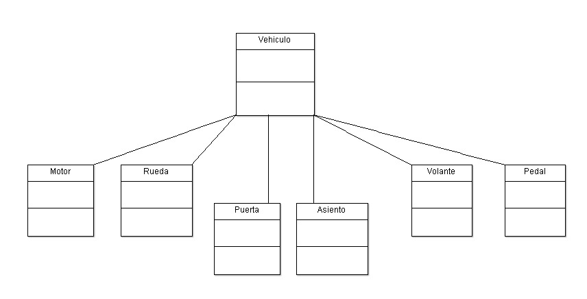

*Diagrama de clases simplificado para un Vehículo*

Como podemos observar en el anterior diagrama de clases UML, la clase `Vehiculo` tiene una gran cantidad de dependencias. *¿Quién se hará cargo de todas ellas?* La respuesta es **Spring IoC Container**, en el cual trabajaremos en la siguiente sección.

## Beans (simples, referencias, anidaciones, colecciones) 37:04 

[Beans](pdfs/05_Beans.pdf)

### 5.1 El contenedor de *IoC* de Spring

Los paquetes `org.springframework.beans` y `org.springframework.context` son la base para el contenedor de IoC de Spring. El interface `BeanFactory` nos proporciona un mecanismo avanzado de configuración para gestionar cualquier tipo de objeto. `ApplicationContext` es un subinterface de `BeanFactory`, que añade una integración con Spring AOP, manejo de recursos, internacionalización, publicación de eventos y otros elementos específicos para su uso con aplicaciones web.

#### 5.1.1 Pero, ¿qué es eso de *Bean*?

En Spring, los objetos que forman el nucleo de nuestra aplicación y que son gestionados por el contenedor de IoC se llaman *beans*. Un bean es un objeto que será instanciado, ensamblado y en definitiva gestionado por el *IoC container*. Dicho de otro modo, un *bean* no será más que uno de los muchos objetos que conformen nuestra aplicación. Los Beans, y las dependencias entre ellos, son reflejados en el fichero de configuración de metadatos usado por el contenedor.

#### 5.1.2 Elementos del contenedor de *IoC*

La interface `org.springframework.context.ApplicationContext` representa el contenedor de IoC y es responsable de instanciar, configurar y ensamblar los ya mencionados beans. El contenedor toma toda esta información leyendo los metadatos de configuración. Estos se pueden representar en XML, mediante anotaciones Java o incluso mediante código Java. Estos metadatos nos permitirán expresar los objetos que componen nuestra aplicación así como las interdependencias existentes entre ellos.

En la siguiente imagen, podemos ver, a alto nivel, como trabaja Spring. Nuestras clases son combinadas con los metadatos de configuración; por lo que después de crear e inicializar nuestro `ApplicationContext`, tendremos un sistema totalmente configurado y listo para ser ejecutado.


*El contenedor de inversión de control de Spring.*

#### 5.1.3 Metadatos de configuración

Como hemos visto en la figura anterior, el contenedor de IoC necesita unos metadatos de configuración. Estos metadatos representan la forma en que serán instanciados, configurados y ensamblados los objetos de nuestra aplicación.

Tradicionalmente, esta configuración se ha proporcionado mediante XML, si bien podríamos usar otras alternativas:

* La configuración mediante anotaciones: fue introducida a partir de la versión 2.5 de Spring (la usaremos de forma combinada con XML).

* La configuración mediante código Java: comenzó con la versión 3.0 de Java.

A continuación podemos ver cual sería la estructura básica de un fichero XML de configuración:

```xml
<?xml version="1.0" encoding="UTF-8"?>
<beans xmlns="http://www.springframework.org/schema/beans"
    xmlns:xsi="http://www.w3.org/2001/XMLSchema-instance"
    xsi:schemaLocation="http://www.springframework.org/schema/beans
        http://www.springframework.org/schema/beans/spring-beans.xsd">

    <bean id="..." class="...">
        <!-- collaborators and configuration for this bean go here -->
    </bean>

    <bean id="..." class="...">
        <!-- collaborators and configuration for this bean go here -->
    </bean>

    <!-- more bean definitions go here -->

</beans>
```

### 5.2 HolaMundo con Spring (con configuración XML)

Hasta ahora hemos introducido alguno de los conceptos nucleares sobre el *Spring IoC container*. Sin embargo, cualquier tecnología o lenguaje de programación que se precie debe tener su **HolaMundo**. Vamos a crear el nuestro paso a paso.

#### Paso 1: Crear un proyecto Maven.

Ejecutamos nuestro entorno de desarrollo, *Spring Tool Suite*, y procedemos a la creación de un nuevo proyecto de tipo Maven. En este punto, seleccionamos el arquetipo `maven-archetype-quickstart`. Como metadatos del proyecto, escribimos un Group Id, que en nuestro caso será `com.openwebinars`; y por último como *Artifact Id* escribimos el nombre del proyecto, que será `HelloWorldSpring`.

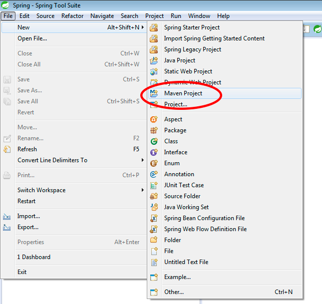

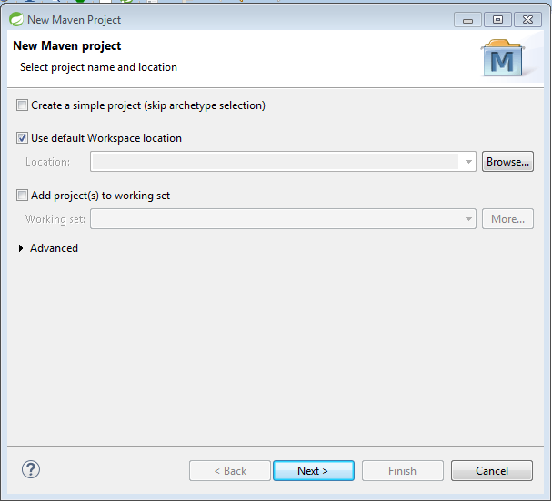

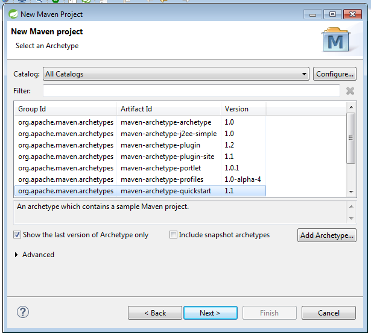

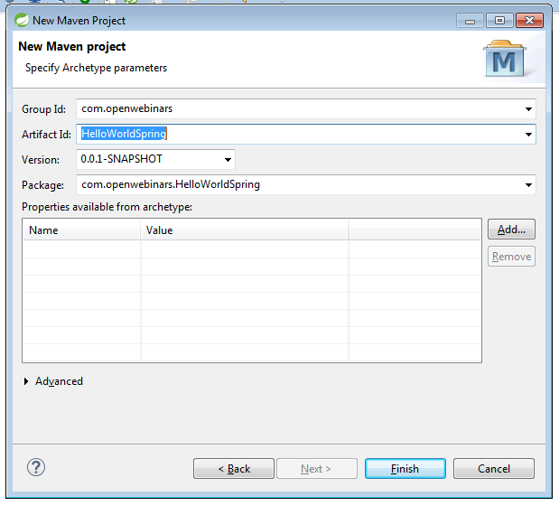

*Creación de un proyecto de tipo Maven, selección de arquetipo e introducción de los metadatos básicos del proyecto.*

Si seguimos estos pasos, obtendremos un proyecto que tendrá el siguiente aspecto en el explorador del IDE:

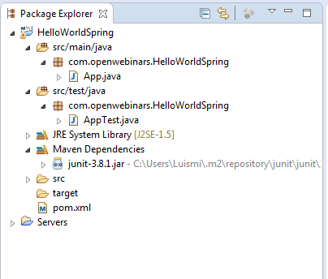

*Estructura del proyecto recién creado.*

Procedemos, por último, a eliminar los ficheros `App.java` y `AppTest.java`, ya que crearemos nuestras propias clases a través de los asistentes.

#### Paso 2: Añadir las dependencias necesarias.

Abrimos el fichero `pom.xml`, al cual podemos acceder a través de nuestro proyecto, y seleccionamos la pestaña inferior *pom.xml;* necesitamos añadir las dependencias necesarias para usar Spring. La siguiente, nos añadirá todos los ficheros necesarios para usar el módulo *Core*.

```xml
<!-- https://mvnrepository.com/artifact/org.springframework/spring-context -->
<dependency>
    <groupId>org.springframework</groupId>
    <artifactId>spring-context</artifactId>
    <version>4.3.1.RELEASE</version>
</dependency>
```

De esta forma, el fichero `pom.xml` debería tener el siguiente contenido:

```xml
<project xmlns="http://maven.apache.org/POM/4.0.0" xmlns:xsi="http://www.w3.org/2001/XMLSchema-instance"
    xsi:schemaLocation="http://maven.apache.org/POM/4.0.0 http://maven.apache.org/xsd/maven-4.0.0.xsd">
    <modelVersion>4.0.0</modelVersion>

    <groupId>com.openwebinars</groupId>
    <artifactId>HelloWorldSpring</artifactId>
    <version>0.0.1-SNAPSHOT</version>
    <packaging>jar</packaging>

    <name>HelloWorldSpring</name>
    <url>http://maven.apache.org</url>

    <properties>
        <project.build.sourceEncoding>UTF-8</project.build.sourceEncoding>
    </properties>

    <dependencies>
        <!-- https://mvnrepository.com/artifact/org.springframework/spring-context -->
        <dependency>
            <groupId>org.springframework</groupId>
            <artifactId>spring-context</artifactId>
            <version>4.3.1.RELEASE</version>
        </dependency>
    </dependencies>
</project>
```

Almacenamos el contenido del fichero, y procedemos a actualizar el proyecto Maven.


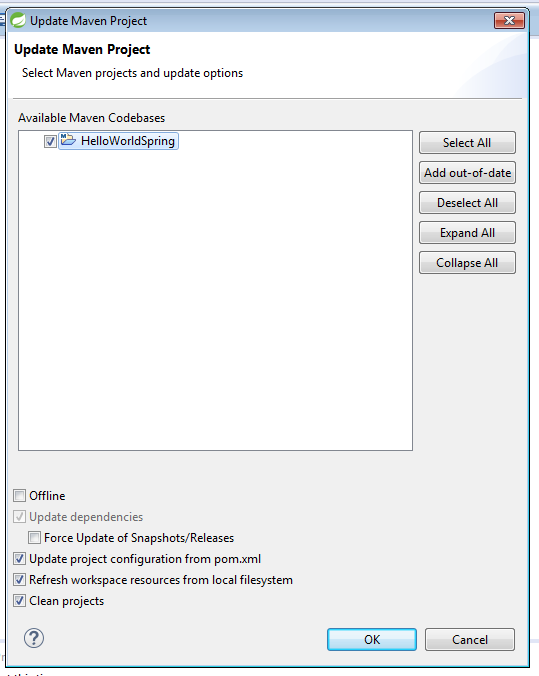

*Actualización del repositorio local de Maven, para descargar todas las dependencias.*

#### Paso 3: Añadir el código Java.

Una vez configurado nuestro proyecto, vamos a dar paso a crear nuestro *Hola Mundo*.

En primer lugar, creamos un nuevo paquete, llamado `com.openwebinars.beans`, donde ubicaremos los *beans* de nuestro proyecto.

Posteriormente, creamos dentro de este nuevo paquete una nueva clase, llamada `Mundo`, y que tendrá un código muy sencillo (tan solo una propiedad, y sus correspondientes *getter/setter*):

```java
package com.openwebinars.beans;

public class Mundo {

    private String saludo;

    public String getSaludo() {
        return saludo;
    }

    public void setSaludo(String saludo) {
        this.saludo = saludo;
    }

}
```

Ahora necesitamos definir este objeto, `Mundo`, en un *contenedor*, para que Spring lo pueda manejar. Esta operación la realizamos en el siguiente paso.

#### Paso 4: Definir el fichero de configuración XML.

En primer lugar, vamos a crear la ubicación en la cual almacenaremos nuestro fichero de configuración de *beans*. Es una carpeta que llamaremos `resources` y que estará físicamente a la misma altura del árbol de directorios que la carpeta llamada `java`, que contiene el código fuente.

Mediante el botón derecho del ratón sobre el proyecto, o la combinación de teclas `Alt+Enter`, accedemos a las propiedades del proyecto, y de entre ellas accedemos a *Java Build Path*. Seleccionamos la pestaña *Source*, y pulsamos sobre el botón Add Folder. En el diálogo que nos aparece, seleccionamos la carpeta `src` y pulsamos el botón *Create New Folder*. La ruta de la carpeta será `main/resources`.

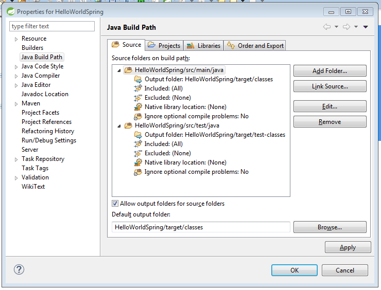

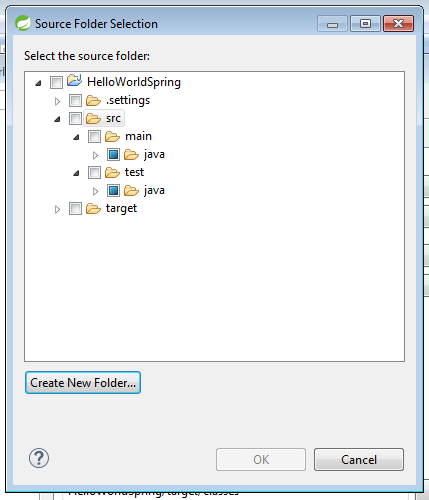


Creación de la nueva carpeta `src/main/resources` donde ubicaremos el fichero de configuración de *beans*.

Dentro, creamos un nuevo paquete llamado `com.openwebinars.xml`. Dentro de este paquete, vamos a ubicar el fichero de configuración. Para crearlo, seleccionamos sobre dicho paquete *Botón derecho > New > Spring Bean Configuration File* (si no aparece directamente, tendriamos que seleccionar *New > Other* y buscarlo dentro de los asistentes de Spring).


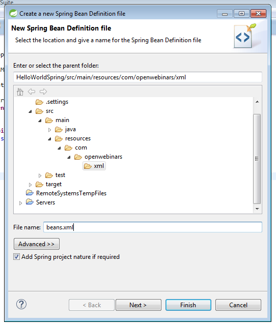

Creación del fichero de configuración `beans.xml`

Ahora es cuando añadiremos la *magia* de Spring. A través de la etiqueta `bean`, registraremos dentro del contenedor el objeto `Mundo`, para poder usarlo posteriormente dentro de nuestra aplicación. Veamos el código a añadir para poder comentarlo

```java
...
<bean id="mundo" class="com.openwebinars.beans.Mundo">
    <property name="saludo" value="Hola Mundo!"></property>
</bean>
```

Cada objeto deberá tener un identificador, un alias, que nos permitirá diferenciarlo de los demás a la hora de invocarlo. Dicho identificador lo establecemos a través del atributo `id`. En segundo lugar, el *bean* debe ir asociado a una clase (*POJO*) de nuestro proyecto. Dicha clase se establece mediante el atributo `class`; hay que indicar la ruta completa de la clase (es decir, `nombre_paquete.nombre_clase`).

Si queremos inicializar alguna de las propiedades del bean, no tenemos más que añadir un elemento `property` dentro del propio elemento `bean`, indicando el nombre de la propiedad, en nuestro caso `saludo`, y el valor que queremos establecerle inicialmente, que será `Hola Mundo!`.

#### Paso 5: Clase Main y ejecución.

Por último, nuestra aplicación necesita un *Main* para poder ejecutarse. Creamos una nueva clase, llamada `App`, dentro del paquete principal, `com.openwebinars.HelloWorldSpring`.

El primer paso que debemos seguir es crear un `ApplicationContext`; en particular, seleccionamos `ClassPathXmlApplicationContext`. Si el fichero XML estuviera en la misma ubicación que la clase, no necesitaríamos añadir ningún parámetro opcional; al no ser así, tenemos que indicar la ruta del paquete, de forma que la instanciación del objeto quedaría como sigue:

```java
ApplicationContext appContext = new ClassPathXmlApplicationContext("com/openwebinars/xml/beans.xml");
```

Ahora, vamos instanciar el *bean* `Mundo`, a través del *contexto*. Para ello, usaremos el método `getBean(...)` de `ApplicationContext`, y utilizaremos alguna de las siguientes líneas de código:

* Usando el ***id*** 

```java
Mundo m = (Mundo) appContext.getBean("mundo");
```

* Usando el `.class``

```java
Mundo m = (Mundo) appContext.getBean(Mundo.class);
```

En nuestro caso, preferimos la primera opción.

Para completar la primera versión de nuestro *Main*, añadimos una impresión por consola del saludo, quedando el código como sigue:

```java
package com.openwebinars.HelloWorldSpring;

import org.springframework.context.ApplicationContext;
import org.springframework.context.support.ClassPathXmlApplicationContext;

import com.openwebinars.beans.Mundo;

public class App {

    public static void main(String[] args) {  
        ApplicationContext appContext = new ClassPathXmlApplicationContext("com/openwebinars/xml/beans.xml");
        Mundo m = (Mundo) appContext.getBean("mundo");

        System.out.println(m.getSaludo());
    }
}
```

Si ahora ejecutamos este proyecto (como una aplicación java), podemos comprobar que la salida que obtenemos por la consola es la siguiente:

```
...
Hola Mundo!
```

Como podemos comprobar, hemos obtenido por consola *Hola Mundo!*, el mensaje que esperábamos.

Si revisamos el código, podemos comprobar que la variable `appContext` parece tener un warning: *Resource leak: ‘appContext’ is never closed*. Algunos programadores prefieren liberar el recurso asociado al contenedor de IoC una vez que no se va a utilizar más. Para ello, tendríamos que añadir la siguiente línea de código al final, quedando el código de la siguiente manera:

```java
package com.openwebinars.HelloWorldSpring;

import org.springframework.context.ApplicationContext;
import org.springframework.context.ConfigurableApplicationContext;
import org.springframework.context.support.ClassPathXmlApplicationContext;

import com.openwebinars.beans.Mundo;

public class App {

    public static void main(String[] args) {

        ApplicationContext appContext = new ClassPathXmlApplicationContext("com/openwebinars/xml/beans.xml");
        Mundo m = (Mundo) appContext.getBean("mundo");

        System.out.println(m.getSaludo());

        ((ConfigurableApplicationContext) appContext).close();
    }
}
```

### 5.3 Otras formas de inyección de dependencia

#### 5.3.1 Inyección por constructor

Si revisamos el código del ejemplo `HelloWorldSpring`, y en particular, el de la clase `Mundo`, podemos darnos cuenta de que *¡Oh! No tiene constructor*.

```java
package com.openwebinars.beans;

public class Mundo {

    private String saludo;

    public String getSaludo() {
        return saludo;
    }

    public void setSaludo(String saludo) {
        this.saludo = saludo;
    }

}
```

¿Esto significa algo? En principio, no debería significar nada; Java, para aquellas clases que no definen un constructor de forma explícita, se encarga de definir un constructor (sin parámetros, obviamente) de forma implícita. Sin embargo, el hecho de no tener un constructor, nos dice que el tipo de inyección de dependencia que hemos hecho ha sido por método. ¿Y si quisiéramos realizarla por constructor? Los cambios a realizar serían francamente sencillos.

En primer lugar, definiríamos un constructor con parámetros para la clase `Mundo`, quedando la misma de la siguiente manera:

```java
package com.openwebinars.beans;

public class Mundo {

    private String saludo;

    public Mundo(String saludo) {
        this.saludo = saludo;
    }

    public String getSaludo() {
        return saludo;
    }

    public void setSaludo(String saludo) {
        this.saludo = saludo;
    }
}
```

Teniendo ya un constructor *explícito* que recibe un parámetro con la dependencia que queremos inyectar, tendríamos que modificar el fichero de configuración, `beans.xml`. En este caso, en lugar de usar la etiqueta `property`, usaríamos `constructor-arg` para inicializar los valores, quedando el código de la siguiente manera:

```xml
<?xml version="1.0" encoding="UTF-8"?>
<beans xmlns="http://www.springframework.org/schema/beans"
    xmlns:xsi="http://www.w3.org/2001/XMLSchema-instance"
    xsi:schemaLocation="http://www.springframework.org/schema/beans http://www.springframework.org/schema/beans/spring-beans.xsd">

    <bean id="mundo" class="com.openwebinars.beans.Mundo">
        <!-- <property name="saludo" value="Hola Mundo!"></property>-->
        <constructor-arg value="Hola Mundo!"></constructor-arg>
    </bean>

</beans>
```

Si ejecutamos la aplicación, observaremos que el resultado es el mismo.

##### 5.3.1.1 Definición de los argumentos de un constructor si son más de uno

Supongamos el escenario en el que la clase `Mundo` tuviera más de una propiedad:

```java
package com.openwebinars.beans;

public class Mundo {

    private String saludo;
    private int radio;

    public Mundo(String saludo) {
        this.saludo = saludo;
    }

    public Mundo(int radio) {
        this.radio = radio;
    }

    public Mundo(String saludo, int radio) {
        this.saludo = saludo;
        this.radio = radio;
    }

    public int getRadio() {
        return radio;
    }

    public void setRadio(int radio) {
        this.radio = radio;
    }

    public String getSaludo() {
        return saludo;
    }

    public void setSaludo(String saludo) {
        this.saludo = saludo;
    }

}
```

Si el fichero de configuración lo modificamos para que tenga el siguiente aspecto:

```xml
<?xml version="1.0" encoding="UTF-8"?>
<beans xmlns="http://www.springframework.org/schema/beans"
    xmlns:xsi="http://www.w3.org/2001/XMLSchema-instance"
    xsi:schemaLocation="http://www.springframework.org/schema/beans http://www.springframework.org/schema/beans/spring-beans.xsd">

    <bean id="mundo" class="com.openwebinars.beans.Mundo">
        <!-- <property name="saludo" value="Hola Mundo!"></property>-->
        <constructor-arg value="Hola Mundo!"></constructor-arg>
        <constructor-arg value="6371"></constructor-arg>
    </bean>

</beans>
```

Y el fichero `App.java` lo modificamos para poder imprimir por pantalla el valor correspondiente al radio:

```java
package com.openwebinars.HelloWorldSpring;

import org.springframework.context.ApplicationContext;
import org.springframework.context.ConfigurableApplicationContext;
import org.springframework.context.support.ClassPathXmlApplicationContext;

import com.openwebinars.beans.Mundo;

public class App {

    public static void main(String[] args) {

        ApplicationContext appContext = new ClassPathXmlApplicationContext("com/openwebinars/xml/beans.xml");
        Mundo m = (Mundo) appContext.getBean("mundo");

        System.out.println(m.getSaludo() + "(" + m.getRadio() + " km.)");

        ((ConfigurableApplicationContext) appContext).close();

    }

}
```

Deberíamos obtener el siguiente resultado:

```java
...
Hola Mundo!(6371 km.)
...
```

Como podemos comprobar, ha realizado la construcción del objeto de forma correcta. Pero, ¿y si queremos inicializar solamente un parámetro? O ¿y si cambiamos el orden de los argumentos?

Spring nos permite algunas introducir algunos atributos más a las etiquetas `constructor-arg` para *esclarecer* la inyección de dependencias:

* Establecimiento de los **tipos de datos**: de esta forma, la asignación de los argumentos se realiza en base al tipo de dato usado.

```java
    ...
    <bean id="mundo" class="com.openwebinars.beans.Mundo">
        <constructor-arg type="int" value="6371"></constructor-arg>
        <constructor-arg type="java.lang.String" value="Hola Mundo!"></constructor-arg>     
    </bean>
    ...
```    
    
* Establecimiento en base al ***índice del parámetro*** en el constructor: de esta forma, se realiza la inyección en base al orden de los parámetros definidos en el constructor.

```java
    ...
    <bean id="mundo" class="com.openwebinars.beans.Mundo">
        <constructor-arg index="1" value="6371"></constructor-arg>
        <constructor-arg index="0" value="Hola Mundo!"></constructor-arg>       
    </bean>
    ...
```

* Establecimiento en base al ***nombre del parámetro*** en el constructor: de esta forma, la inyección se materializa usando el nombre de los parámetros del constructor.

```java
    ...
    <bean id="mundo" class="com.openwebinars.beans.Mundo">
        <constructor-arg name="radio" value="6371"></constructor-arg>
        <constructor-arg name="saludo" value="Hola Mundo!"></constructor-arg>  
    </bean>
    ...
```    
    
#### 5.3.2 Inyección por constructor vs. inyección por método

Ámbos mecanismos son posibles, y podemos mezclar su utilización como queramos. Sin embargo, algunos autores recomiendan utilizar la inyección por constructor para las dependencias *obligatorias*, y por método aquellas que sean opcionales

### 5.4 Referencias entre beans

Como podremos suponer, muy pocas apliaciones tendrán que manejar un solo bean. Normalmente, nuestro modelo y nuestra lógica de negocio tendrán que manejar múltiples beans. Hasta ahora, hemos visto como inyectar dependencias con tipos básicos java, pero ¿qué sucedería si necesitáramos inyectar como dependencia otro bean?

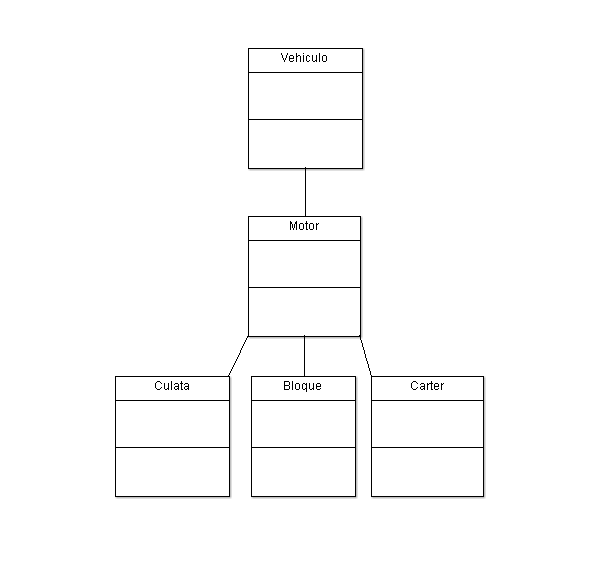

*Detalle del diagrama de clases de `Vehiculo`*

El atributo `ref` nos permite referenciar otro bean del contenedor. De esta forma, el fichero *beans.xml* quedaría como sigue:

```xml
<?xml version="1.0" encoding="UTF-8"?>
<beans xmlns="http://www.springframework.org/schema/beans"
    xmlns:xsi="http://www.w3.org/2001/XMLSchema-instance"
    xsi:schemaLocation="http://www.springframework.org/schema/beans http://www.springframework.org/schema/beans/spring-beans.xsd">

    <bean id="vehiculo" class="com.openwebinars.Beans.Vehiculo">
        <property name="marca" value="Mercedes Benz"></property>
        <property name="modelo" value="Clase C"></property>
        <property name="motor" ref="motor"></property>
    </bean>

    <bean id="motor" class="com.openwebinars.Beans.Motor">
        <property name="culata" ref="culata"></property>
        <property name="bloque" ref="bloque"></property>
        <property name="carter" ref="carter"></property>
        <property name="cilindrada" value="1.8"></property>
    </bean>

    <bean id="culata" class="com.openwebinars.Beans.Culata">
        <property name="cantidadBujias" value="4"></property>
    </bean>

    <bean id="bloque" class="com.openwebinars.Beans.Bloque">
        <property name="cantidadCilindros" value="4"></property>
    </bean>

    <bean id="carter" class="com.openwebinars.Beans.Carter">
        <property name="volumenAceite" value="6.5"></property>
    </bean>

</beans>
```

#### 5.4.1 ¿Y si en lugar de `property` quiero usar `constructor-arg`?

Siguiendo la flexible línea que nos ofrece Spring, podemos referenciar beans haciendo uso de la etiqueta `<constructor-arg>` en lugar de `<property>`, para hacer una inyección basada en constructor, en lugar de basada en los métodos *setter*. Tan solo tendríamos que cambiar el fichero de configuración para que quedara como sigue:

```xml
<?xml version="1.0" encoding="UTF-8"?>
<beans xmlns="http://www.springframework.org/schema/beans"
    xmlns:xsi="http://www.w3.org/2001/XMLSchema-instance"
    xsi:schemaLocation="http://www.springframework.org/schema/beans http://www.springframework.org/schema/beans/spring-beans.xsd">

    <bean id="vehiculo" class="com.openwebinars.Beans.Vehiculo">
        <constructor-arg name="marca" value="Mercedes Benz"></constructor-arg>
        <constructor-arg name="modelo" value="Clase C"></constructor-arg>
        <constructor-arg name="motor" ref="motor"></constructor-arg>
    </bean>

    <bean id="motor" class="com.openwebinars.Beans.Motor">
        <constructor-arg name="culata" ref="culata"></constructor-arg>
        <constructor-arg name="bloque" ref="bloque"></constructor-arg>
        <constructor-arg name="carter" ref="carter"></constructor-arg>
        <constructor-arg name="cilindrada" value="1.8"></constructor-arg>
    </bean>

    <bean id="culata" class="com.openwebinars.Beans.Culata">
        <constructor-arg name="cantidadBujias" value="4"></constructor-arg>
    </bean>

    <bean id="bloque" class="com.openwebinars.Beans.Bloque">
        <constructor-arg name="cantidadCilindros" value="4"></constructor-arg>
    </bean>

    <bean id="carter" class="com.openwebinars.Beans.Carter">
        <constructor-arg name="volumenAceite" value="6.5"></constructor-arg>
    </bean>


</beans>
```

### 5.5 Beans anidados

Una de las maneras que tenemos para inyectar un bean dentro de otro es mediante el atributo `ref`, tanto si hacemos una inyección por setter como si la hacemos por constructor.

Sin embargo, existe otro método para poder inyectar un bean dentro de otro bean, y se conoce como inner beans o beans anidados.

```java
<bean id="outer" class="...">
    <!-- en lugar de utilizar una referencia a un bean, simplemente definimos dicho bean en línea -->
    <property name="target">
        <bean class="com.example.Class"> 
            <property name="prop1" value="Asdfg"/>
            <property name="prop2" value="12"/>
        </bean>
    </property>
</bean>
```

El ejemplo del apartado 5.4 quedaría de la siguiente forma:

```java
<?xml version="1.0" encoding="UTF-8"?>
<beans xmlns="http://www.springframework.org/schema/beans"
    xmlns:xsi="http://www.w3.org/2001/XMLSchema-instance"
    xsi:schemaLocation="http://www.springframework.org/schema/beans http://www.springframework.org/schema/beans/spring-beans.xsd">

    <bean id="vehiculo" class="com.openwebinars.Beans.Vehiculo">
        <property name="marca" value="Mercedes Benz"></property>
        <property name="modelo" value="Clase C"></property>
        <property name="motor">
            <bean class="com.openwebinars.Beans.Motor">
                <property name="culata">
                    <bean class="com.openwebinars.Beans.Culata">
                        <property name="cantidadBujias" value="4"></property>
                    </bean>
                </property>
                <property name="bloque">
                    <bean class="com.openwebinars.Beans.Bloque">
                        <property name="cantidadCilindros" value="4"></property>
                    </bean>
                </property>
                <property name="carter">
                    <bean class="com.openwebinars.Beans.Carter">
                        <property name="volumenAceite" value="6.5"></property>
                    </bean>
                </property>
                <property name="cilindrada" value="1.8"></property>
            </bean>
        </property>
    </bean>

</beans>
```

#### 5.5.1 Anidación por constructor

Análogamente, también puede realizarse la anidación por constructor:

```java
<bean id="outterBean" class="outerClass">
    <constructor-arg>
        <bean class="innerClass">
            ...
        </bean>
    </constructor-arg>
</bean>
```

La versión del fichero `beans.xml` con la inyección por constructor sería la siguiente:

```java
<?xml version="1.0" encoding="UTF-8"?>
<beans xmlns="http://www.springframework.org/schema/beans"
    xmlns:xsi="http://www.w3.org/2001/XMLSchema-instance"
    xsi:schemaLocation="http://www.springframework.org/schema/beans http://www.springframework.org/schema/beans/spring-beans.xsd">

    <bean id="vehiculo" class="com.openwebinars.Beans.Vehiculo">
        <constructor-arg name="marca" value="Mercedes Benz"></constructor-arg>
        <constructor-arg name="modelo" value="Clase C"></constructor-arg>
        <constructor-arg name="motor">
            <bean class="com.openwebinars.Beans.Motor">
                <constructor-arg name="culata">
                    <bean class="com.openwebinars.Beans.Culata">
                        <constructor-arg name="cantidadBujias" value="4"></constructor-arg>
                    </bean>
                </constructor-arg>
                <constructor-arg name="bloque">
                    <bean class="com.openwebinars.Beans.Bloque">
                        <constructor-arg name="cantidadCilindros" value="4"></constructor-arg>
                    </bean>
                </constructor-arg>
                <constructor-arg name="carter">
                    <bean class="com.openwebinars.Beans.Carter">
                        <constructor-arg name="volumenAceite" value="6.5"></constructor-arg>
                    </bean>
                </constructor-arg>
                <constructor-arg name="cilindrada" value="1.8"></constructor-arg>
            </bean>
        </constructor-arg>
    </bean>

</beans>
```

#### 5.5.2 Anidación vs. Referencia

¿Cuál de las dos opciones es mejor? La respuesta es que *depende*

Beans Referenciados | Beans anidados
--------------------|---------------
Evitamos tener grandes bloques de código, que son difíciles de leer	| El código estará más cohesionado (los beans están definidos donde se van inyectar).
Podemos obtener instancias de cualquiera de los beans que tengan propiedad `id`. | Todos los *inner beans* son anónimos. Si un bean se utiliza solamente como *parte* de otro, y no debe ser invocado como un objeto fuera de este, la mejor opción es anidarlo.
Permiten la separación de la definición de beans en más de un fichero | Se puede combinar la referencia de beans con la anidación de otros.

### 5.6 Colecciones

Hasta ahora, todas las referencias entre beans que hemos manejado podríamos llamarlas simples, es decir, siempre hacía referencia a un objeto, nunca a una colección de ellos. De sobra sabemos que las colecciones son elementos de la Programación Orientada a Objetos que se usan constantemente. Veamos como nos permitirá manejar esto Spring.

#### 5.6.1. Tipos de colecciones manejadas por Spring

Spring nos va a permitir trabajar con los siguientes tipos de colecciones. Podemos ver en la siguiente tabla la etiqueta que necesitaremos en el fichero de configuración, y el tipo de colección (dentro del API de Java) a la que corresponden:

Etiqueta | Tipo de colección
---------|------------------
`<list/>` | `java.util.List`
`<set/>` | `java.util.Set`
`<map/>` | `java.util.Map`
`<props/>` | `java.util.Properties`

#### 5.6.2 Uso de una colección `<list>`
  
El esqueleto de la definición de un bean que utilizara una colección de tipo *list* sería el siguiente:

```java
    <bean id="beanId" class="com.openwebinars.colecciones.ClassName">
        <property name="name" value="value"></property>
        <property name="collection">
            <list>
            ...        
            </list>
        </property>
    </bean>
```    

Dentro del elemento `<list>` podemos definir:

* Una referencia (`<ref ...>`) a otro bean

* Un bean en linea

Al igual que en anteriores situaciónes, también podemos inyectar la dependencia de una lista usando un constructor.

#### 5.6.3 Uso de una colección `<set>`
  
El esqueleto de la definición de un bean que utilizara una colección de tipo set sería el siguiente:

```java
    <bean id="beanId" class="com.openwebinars.colecciones.ClassName">
        <property name="name" value="value"></property>
        <property name="collection">
            <set>
            ...        
            </set>
        </property>
    </bean>
```

#### 5.6.4 Uso de una colección `<map>`
  
El esqueleto de la definición de un bean que utilizara una colección de tipo *map* sería el siguiente:

```java
    <bean id="beanId" class="com.openwebinars.colecciones.ClassName">
        <property name="name" value="value"></property>
        <property name="collection">
            <map>
                <entry key="thekey">
                    ...
                </entry>
                ...        
            </map>
        </property>
    </bean>
```

Como podemos observar, esta sintaxis difiere de las anteriores debido a la naturaleza *clave -> valor* de las colecciones de tipo *map*. Por ello, cada bean de la colección, tendrá que definirse en un elemento `<entry ...>`, asignándole a cada uno una clave (*key*).

#### 5.6.5 Uso de una colección `<props>`

El esqueleto de la definición de un bean que utilizara una colección de tipo `props` sería el siguiente:

```java
    <bean id="beanId" class="com.openwebinars.colecciones.ClassName">
        <property name="name" value="value"></property>
        <property name="collection">
            <props>
                <prop key="thekey">value</prop>
                ...        
            </props>
        </property>
    </bean>
```

Las colecciones *props*, que es la abreviatura de *properties*, nos sirven como los maps, pero para definir una serie de pares *clave -> valor* donde el valor será un literal: un número, una cadena de caracteres, un booleano.

### 5.7 Carga tardía

Por defecto, `ApplicationContext` crea y configura todos los beans (de ámbito *singleton*) como parte del proceso de inicialización. Cuando esta opción no es deseable, podemos evitar esta preinstanciación marcándolo como `lazy-init=true`. De esta forma, le estamos indicando al contenedor que realice la instanciación la primera vez que el bean sea solicitado, en lugar de en la inicialización del contexto.

```java
<bean id="lazy" class="com.foo.ExpensiveToCreateBean" lazy-init="true"/>
<bean name="not.lazy" class="com.foo.AnotherBean"/>
```

Se puede gestionar todo este proceso de manera global para el fichero de configuración, mediante el atributo `default-lazy-init` del elemento `<beans>`.

```java
<beans default-lazy-init="true">
    <!-- no se preinstanciará ningún bean -->
</beans>
```

#### 5.7.1 Uso de log4j para el ejemplo de *carga tardía*

Para hacer nuestro ejemplo de carga tardía, vamos a añadir una nueva dependencia en el fichero `pom.xml`, que nos permitirá gestionar mejor el *logging* (registro o bitácora) de Spring.

Añadimos esta nueva dependencia:

```xml
<dependency>
    <groupId>log4j</groupId>
    <artifactId>log4j</artifactId>
    <version>1.2.14</version>
</dependency>
```

Con esta, indicamos que el sistema de logging que usaremos será **Log4j**, que está ampliamente extendido entre los desarrolladores de Java y Spring.

Hay que añadir información adicional de configuración. Para ello, creamos un nuevo fichero (usando el asistente de creación de ficheros), llamado `log4j.properties` dentro del director `src/main/resources`, y añadimos el siguiente contenido:

```java
log4j.rootCategory=INFO, stdout

log4j.appender.stdout=org.apache.log4j.ConsoleAppender
log4j.appender.stdout.layout=org.apache.log4j.PatternLayout
log4j.appender.stdout.layout.ConversionPattern=%d{ABSOLUTE} %5p %t %c{2}:%L - %m%n

log4j.category.org.springframework.beans.factory=DEBUG
```

## Inyección automática 6:30 

[Inyección automática](pdfs/06_Inyección%20automática.pdf)

### 6.1 Introducción

El contenedor de Spring puedes gestionar de forma automática las dependencias entre *beans* que colaboran. Se puede permitir a Spring resolver automáticamente inspeccionando dentro del contenido del `ApplicationContext`. A este proceso se le llama *autowiring*.

### 6.2 Modos de *autowiring*

Al usar la configuración del contenedor basada en XML, podemos establecer la inyección automática usando el atributo `autowire` del elemento `<bean>`. Esta funcionalidad tiene cuatro modos de trabajo. Hay que especificar, como valor del atributo, cual de ellos queremos usar:

Modo | Explicación
-----|------------
no | Es el modo por defecto (es decir, `autowire=no` es equivalente a no escribir nada con respecto a *autowiring*). Las referencias entre beans serán establecidas de alguna de las diferentes formas que hemos aprendido en las lecciones anteriores.
byName | La inyección automática se realiza en base al nombre de la propiedad. Spring busca un bean que tenga el mismo nombre que la propiedad que tiene la dependencia.
byType | Permite satisfacer la dependencia si Spring encuentra un bean que tenga el mismo tipo.
constructor | Análogo a *byType*, pero aplicando a argumentos de constructores.

### 6.3 Limitaciones y desventajas del *autowiring*

El *autowiring* funciona bien cuando su uso es consistente a lo largo de todo un proyecto; si no es así, podemos encontrarnos en alguna situación de confusión.

Algunas de las limitaciones son:

* Las dependencias explícitas en `<property>`y `<constructor-arg>` sobrescriben el comportamiento automático. No se pueden inyectar automáticamente propiedades de tipos de datos básicos.

* La inyección automática es menos exacta que la inyección explícita; con todo, Spring pone mucho cuidado en evitar la ambigüedad.

* La inyección automática no permite generar documentación para el contenedor de Spring.

* Una definición de varios beans de un mismo tipo que el que necesitamos para inyectar una dependencia pueden producir un problema. Si se trata de una colección, no pasa nada; pero en el caso de ser una dependencia que espera un valor, podemos obtener por respuesta una excepción.

### 6.4 Ejemplo de uso de `autowire`

Vamos a intentar trabajar, de una forma sencilla, con un ejemplo que tenga tres clases: `Cliente`, `Persona`, `Ciudad`.

```java
package com.openwebinars.autowire;

public class Ciudad {

    private String nombre;

    public Ciudad() { }

    public Ciudad(String nombre) {
        this.nombre = nombre;
    }

    public String getNombre() {
        return nombre;
    }

    public void setNombre(String nombre) {
        this.nombre = nombre;
    }

    @Override
    public String toString() {
        return "Ciudad [nombre=" + nombre + "]";
    }

}
```

```java
package com.openwebinars.autowire;

public class Persona {

    private String nombre;
    private Ciudad ciudad;

    public Persona() { }

    public Persona(String nombre, Ciudad ciudad) {
        this.nombre = nombre;
        this.ciudad = ciudad;
    }

    public String getNombre() {
        return nombre;
    }

    public void setNombre(String nombre) {
        this.nombre = nombre;
    }

    public Ciudad getCiudad() {
        return ciudad;
    }

    public void setCiudad(Ciudad ciudad) {
        this.ciudad = ciudad;
    }

    @Override
    public String toString() {
        return "Persona [nombre=" + nombre + ", ciudad=" + ciudad + "]";
    }

}
```

```java
package com.openwebinars.autowire;

public class Cliente {

    private long id;
    private Persona persona;


    public Cliente() { } 

    public Cliente(long id, Persona persona) {
        this.id = id;
        this.persona = persona;
    }

    public long getId() {
        return id;
    }

    public void setId(long id) {
        this.id = id;
    }

    public Persona getPersona() {
        return persona;
    }

    public void setPersona(Persona persona) {
        this.persona = persona;
    }

    @Override
    public String toString() {
        return "Cliente [id=" + id + ", persona=" + persona + "]";
    }  

}
```

Como hemos visto en los apartados superiores, para realizar el *autowiring*, necesitamos usar el atributo `autowire` de la etiqueta `<bean>`.

```xml
<?xml version="1.0" encoding="UTF-8"?>
<beans xmlns="http://www.springframework.org/schema/beans"
    xmlns:xsi="http://www.w3.org/2001/XMLSchema-instance"
    xsi:schemaLocation="http://www.springframework.org/schema/beans http://www.springframework.org/schema/beans/spring-beans.xsd">

    <bean id="cliente" class="com.openwebinars.autowire.Cliente" autowire="byName">
        <property name="id" value="1"></property>
        <!-- <property name="persona" ref="persona"></property> -->
    </bean>

    <bean id="persona" class="com.openwebinars.autowire.Persona" autowire="byName">
        <property name="nombre" value="Luismi"></property>
        <!-- <property name="ciudad" ref="ciudad"></property>-->
    </bean>

    <bean id="ciudad" class="com.openwebinars.autowire.Ciudad">
        <property name="nombre" value="Sevilla"></property>
    </bean>

</beans>
```

También podríamos haber hecho la inyección automática de la dependencia por `constructor`, con el siguiente código de configuración:

```xml
<?xml version="1.0" encoding="UTF-8"?>
<beans xmlns="http://www.springframework.org/schema/beans"
    xmlns:xsi="http://www.w3.org/2001/XMLSchema-instance"
    xsi:schemaLocation="http://www.springframework.org/schema/beans http://www.springframework.org/schema/beans/spring-beans.xsd">

    <bean id="cliente" class="com.openwebinars.autowire.Cliente"
        autowire="constructor">
        <constructor-arg name="id" value="1"></constructor-arg>
    </bean>

    <bean id="persona" class="com.openwebinars.autowire.Persona"
        autowire="constructor">
        <constructor-arg name="nombre" value="Luismi">
        </constructor-arg>
    </bean>

    <bean id="ciudad" class="com.openwebinars.autowire.Ciudad">
        <constructor-arg name="nombre" value="Sevilla"></constructor-arg>
    </bean>

</beans>
```

## Ámbitos de un Bean 4:49 

[Ámbitos de un Bean](pdfs/07_Ámbitos%20de%20un%20bean.pdf)

### 7.1 Introducción

En Spring, no solo podemos controlar la inyección de varias dependencias en un solo objeto registrado como un bean, sino que además podemos controlar el *ámbito* o alcance (en inglés, *scope*) de los objetos creados. Este enfoque es potente y flexible, y permite controlar el *ámbito* a nivel de configuración, y así tener que evitar hacerlo directamente en Java.

En este apartado, conoceremos dos ámbitos: *singleton* y *prototype* (cuando trabajemos con Spring MVC veremos que existen algunos más: *request, session, globalSession, application* y *WebSocket*).

### 7.2 El ámbito *singleton*

Cuando definimos un bean como *singleton*, estamos indicando que solamente vamos a tener una instancia de dicho bean, que será compartida para todas las referencias que existan del mismo.

Dicho de otro modo, al definir un bean como *singleton*, estamos indicando al contenedor de Spring que debe crear *exactamente* una instanacia del objeto. Dicha instancia será almacenada en caché, y todas las siguientes llamadas o peticiones a dicho bean, tendrán como resultado la instancia cacheada.

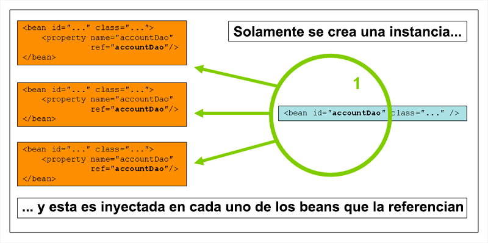

*Explicación de un bean de ámbito singleton*

En Spring, podemos hablar de *singleton* describiéndolo como *una instancia por contenedor*. Esto significa que si definimos un bean de una clase particular en un solo contenedor, entonces, el contenedor crea una y solo una instancia de la clase definida por ese bean.

***El ámbito singleton es el ámbito por defecto en Spring***. Para definir un bean como singleton en XML, deberíamos escribir lo siguiente:

```java
<bean id="accountService" class="com.foo.DefaultAccountService"/>

<!-- el siguiente modo es equivalente y redundante, ya que el ámbito singleton es el ámbito por defecto. -->
<bean id="accountService" class="com.foo.DefaultAccountService" scope="singleton"/>
```

### 7.3 El ámbito *prototype*

De manera opuesta, tenemos el ámbito *prototype*, en el cual, para cada petición de un bean, tendremos como resultado una nueva instancia.

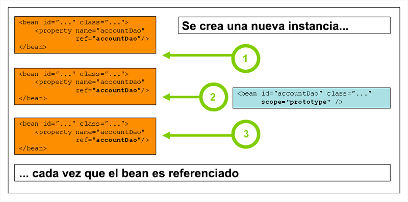

*Explicación de un bean de ámbito prototype*

En el siguiente ejemplo, definiremos un bean como *prototype*:

```java
<bean id="accountService" class="com.foo.DefaultAccountService" scope="prototype"/>
```

A diferencia de otros ámbitos, Spring no gestiona el ciclo de vida completo de un bean definido como *prototype*: el contenedor instancia, configura y devuelve el objeto al cliente, sin realizar ninguna operación más. Tanto es así, que no toma ningún tipo de responsabilidad en la destrucción del objeto: es el cliente el encargado de liberar los recursos, en caso de que estos fueran costosos de mantener.

## Ciclo de vida de los Beans 8:22 

[Ciclo de vida de los Beans](pdfs/08_Ciclo%20de%20vida%20de%20los%20beans.pdf)

### 8.1 Introducción

Spring nos permite interactuar con el contenedor, para realizar determinadas operaciones durante el ciclo de vida del mismo. Podemos ejecutar algún metodo justo después de instanciar un bean, y también justamente antes de destruirlo. Esto podemos hacerlo de 3 formas diferentes:

1. Implementando las interfaces `InitializingBean` y `DisposableBean`

2. Mediante el uso de las propiedades `init-method` y `destroy-method` en la configuración XML.

3. Usando las anotaciones `@PostConstruct` y `@PreDestroy` para decorar algún metodo del bean.

### 8.2 Uso de las interfaces `InitializingBean` y `DisposableBean`

Spring provee de dos interfaces en el paquete `org.springframework.beans.factory`, llamadas `InitializingBean` y `DisposableBean`, siendo su nombre muy *autodescriptivo*.

* `InitializingBean` nos obliga a darle cuerpo al método `afterPropertiesSet`, y nos permitirá realizar algún tipo de lógica tras la inicialización del bean.

* `DisposableBean` nos obliga a implementar el método `destroy`, que nos permitirá ejecutar alguna funcionalidad antes de que el bean sea destruido.

Podemos ver ambas interfaces en funcionamiento en el siguiente ejemplo. A continuación, podemos ver el único bean que vamos a crear por ahora, llamado `ClientesServicio`:

```java
package com.openwebinars.lifecycle;

import org.springframework.beans.factory.DisposableBean;
import org.springframework.beans.factory.InitializingBean;

public class ClientesServicio implements InitializingBean, DisposableBean {


    String mensaje;

    public ClientesServicio() { }

    public ClientesServicio(String mensaje) {
        this.mensaje = mensaje;
    }

    public String getMensaje() {
        return mensaje;
    }

    public void setMensaje(String mensaje) {
        this.mensaje = mensaje;
    }


    public void afterPropertiesSet() throws Exception {
        System.out.println("DESPUÉS DE INICIO");
    }

    public void destroy() throws Exception {
        System.out.println("ANTES DEL FIN");

    }

}
```

Como podemos apreciar, este bean implementa las ya citadas interfaces, `InitializingBean` y `DisposableBean`, lo cual nos obliga a darle cuerpo a los métodos `afterPropertiesSet` y `destroy`. En nuestro caso, al funcionalidad será didática, y tan solo imprimiremos por consola dos mensajes: uno que nos indica el final del inicio, y otro el principio del fin.

Si revisamos la ejecución, Spring ha ejecutado los métodos en el orden que cabía esperar:

1. En primer lugar, podemos ver la ejecución del método `afterPropertiesSet`, cuyo resultado es la línea **DESPUÉS DEL INICIO**.

2. Posteriormente, encontramos la impresión del propio mensaje.

3. Por último, como parte del mecanismo del cierre del contexto, se ha invocado el método `destroy`, dando como resultado el mensaje **ANTES DEL FIN**.

Ambos interfaces no tienen porque implementarse de forma conjunta; si necesitamos añadir algún tipo de funcionalidad solámente al inicio o al fin, podemos implmentar el interface necesario.

De las tres formas de implementar el manejo del ciclo de vida, esta es la **menos adecuada**, ya que acopla nuestro código a Spring. Cualquiera de las dos siguientes es más recomendable.

### 8.3 Uso de de las propiedades `init-method` y `destroy-method`

También podemos conseguir esta mismo funcionalidad sin necesidad de implementar ninguna interfaz adicional, y haciendo uso de la configuración XML.

Ambas propiedades esperan como valor el nombre de un método del bean (normalmente, definido como `void`). Dicho método será el que se ejecute, correspondientemente, tras la inicialización o antes de la destrucción del objeto.

Con tan solo unas pequeñas modificaciones, podemos comprobar el uso de estas propiedades con el código anterior:

* Modificamos la clase `ClientesServicio`, y eliminamos la implementación de los interfaces, así como los correspondientes métodos, de forma que nos quede el siguiente código:

```java
package com.openwebinars.lifecycle;

public class ClientesServicio {

    String mensaje;

    public ClientesServicio() { }

    public ClientesServicio(String mensaje) {
        this.mensaje = mensaje;
    }

    public String getMensaje() {
        return mensaje;
    }

    public void setMensaje(String mensaje) {
        this.mensaje = mensaje;
    }

}
```

Añadimos al mismo los métodos que queremos que se ejecuten durante el ciclo de vida. Podemos llamarlos `initBean` y `destroyBean` (el nombre puede ser arbitrario). En cada uno de ellos, tan solo escribiremos un mensaje por consola:

```java
package com.openwebinars.lifecycle;

public class ClientesServicio {

    String mensaje;

    public ClientesServicio() { }

    public ClientesServicio(String mensaje) {
        this.mensaje = mensaje;
    }

    public String getMensaje() {
        return mensaje;
    }

    public void setMensaje(String mensaje) {
        this.mensaje = mensaje;
    }

    public void initBean()  {
        System.out.println("DESPUÉS DE INICIO");
    }

    public void destroyBean() {
        System.out.println("ANTES DEL FIN");

    }

}
```

Modificamos el fichero XML para añadir los atributos `init-method` y `destroy-method`, asignándole los valores correspondientes:

```xml
<?xml version="1.0" encoding="UTF-8"?>
<beans xmlns="http://www.springframework.org/schema/beans"
    xmlns:xsi="http://www.w3.org/2001/XMLSchema-instance"
    xsi:schemaLocation="http://www.springframework.org/schema/beans http://www.springframework.org/schema/beans/spring-beans.xsd">

    <bean id="clientesServicio" class="com.openwebinars.lifecycle.ClientesServicio"
        init-method="initBean" destroy-method="destroyBean">
        <property name="mensaje" value="Un mensaje"></property>
    </bean>
</beans>
```

Ejecutamos, y comprobamos que el resultado es el mismo.

### 8.4 Uso de de las anotaciones `@PostConstruct` y `@PreDestroy`

En este caso, el uso de las anotaciones y el código XML es fácilmente intercambiable, ya que tan solo tenemos que sustituir la propiedad XML por la anotación correspondiente sobre el método adecuado. Como podemos imaginar:

* `@PostConstruct` se ejecutará tras la inicialización y

* `@PreDestroy` se ejecutará antes de finalizar.

Estas anotaciones no son propias de Spring, sino que pertenecen al estándar JSR-250 de Java.

En segundo lugar, añadimos las anotaciones sobre el código Java:

```java
package com.openwebinars.lifecycle;

import javax.annotation.PostConstruct;
import javax.annotation.PreDestroy;

public class ClientesServicio {


    String mensaje;

    public ClientesServicio() { }

    public ClientesServicio(String mensaje) {
        this.mensaje = mensaje;
    }

    public String getMensaje() {
        return mensaje;
    }

    public void setMensaje(String mensaje) {
        this.mensaje = mensaje;
    }


    @PostConstruct
    public void initBean()  {
        System.out.println("DESPUÉS DE INICIO");
    }

    @PreDestroy
    public void destroyBean() {
        System.out.println("ANTES DEL FIN");

    }

}
```

Si al tratar de importar las depedencias de `javax.annotation.PostConstruct` y `javax.annotation.PreDestroy` comprobamos que STS no las localiza, es posible que tengamos que revisar con que versión de Java está configurado el proyecto. A partir de Java 6 lo tenemos disponible. Para cambiar la versión del JDK asociada a nuestro proyecto, podemos seguir los siguientes pasos:

* Botón derecho sobre el proyecto > *Properties*

* En la lista de la izquierda, seleccionamos *Java Build Path*, y de entre las pestañas de la derecha, seleccionamos *Libraries*.

* Hacemos clic una vez sobre *JRE System Library* y pulsamos el botón Edit.

* Seleccionamos, en *Execution environment*, alguna versión de Java superior o igual a la 6.

*Java 8 es muy recomendable, puesto que ha incorporado novedades muy chulas, como el uso de funciones lambda, métodos default en las interfaces, mejoras en el tratamiento de fechas, nuevas excepciones…*

Si ejecutamos ahora nos daremos cuenta de que… OUCH! ¿Y mis mensajes? Pues ha sucedido lo siguiente: para que Spring se encargue de escanear los beans en búsqueda de las anotaciones `@PostConstruct` y `@PreDestroy`, tenemos que decírslo *explícitamente*. Esto lo hacemos declarando un nuevo bean en nuestro fichero XML.

```xml
    <bean class="org.springframework.context.annotation.CommonAnnotationBeanPostProcessor"></bean>
```

Se trata de un bean especial (hay que indicar que no le establecemos la propiedad `id`) definido por Spring y que se encargará de escanear nuestros demás beans en la búsqueda de anotaciones definidas por la JSR-250, entre ellas, `@PostConstruct` y `@PreDestroy`.

### 8.5 Uso de `BeanPostProcessor`

El interfaz `BeanPostProcessor` define métodos *callback* que pueden ser implementados para añadir nuestra propia lógica de instanciación, de resolución de dependencias, etc. Si necesitas implementar alguna lógica después de que *Spring container* finalice la instanciación, configuración e inicialización del bean, se pueden conectar una o más implementaciones de `BeanPostProcessor`.

* `Object postProcessAfterInitialization(Object bean, String beanName)`: se ejecutará este código después de la inicialización de cualquier bean del contenedor.

* `Object postProcessBeforeInitialization(Object bean, String beanName)`: se ejecutará este código antes de la inicialización de cualquier bean del contenedor.

Para usarlo, tenemos que crear una clase propia, que implemente la interfaz `org.springframework.beans.factory.config.BeanPostProcessor`:

```java
package com.openwebinars.beanpostprocessorsample;

import org.springframework.beans.BeansException;
import org.springframework.beans.factory.config.BeanPostProcessor;

public class CustomBeanPostProcessor implements BeanPostProcessor {

    public Object postProcessAfterInitialization(Object bean, String beanName) throws BeansException {
        System.out.println(String.format("Bean %s inicializado satisfactoriamente".toUpperCase(), beanName));
        return bean;
    }

    public Object postProcessBeforeInitialization(Object bean, String beanName) throws BeansException {
        System.out.println(String.format("Inicializando bean %s".toUpperCase(),beanName));
        return bean;
    }

}
```

Además, lo tenemos que registrar en el fichero de configuración del contenedor, para que Spring lo pueda gestionar:

```java
    ...
    <bean class="com.openwebinars.beanpostprocessorsample.CustomBeanPostProcessor"></bean>
    ...
```    

Se pueden añadir **tantos BeanPostProcessor como estimemos necesarios**, para realizar diferentes tareas: *loggin*, validaciones, etc..

## Anotaciones Required, Autowired y Qualifier 9:13 

[Anotaciones Required, Autowired y Qualifier](pdfs/09_Uso%20de%20anotaciones.pdf)

### 9.1 JavaConfig

Ya que esta va a ser la forma de configurar que **menos** vamos a usar por ahora, la aprenderemos primero.

Spring soporta el uso de la configuración mediante anotaciones sin tener que modificar (si no se desea) el código fuente. Para ello, hace uso, básicamente, de dos anotaciones: `@Configuration` y `@Bean`.

La anotación `@Bean` se usa para indicar a un metodo que va a instanciar, configurar e inicializar un nuevo objeto gestionado por *Spring IoC container*. Podemos decir, sin ningún lugar a dudas, que la anotación `@Bean` realiza la misma tarea que el elemento `<bean>` en la configuración por XML.

Si anotamos una clase con `@Configuration`, estamos diciendo que su principal propósito será la definición de una serie de beans.

Un ejemplo de fichero de configuración simple sería el siguiente:

```java
@Configuration
public class AppConfig {

    @Bean
    public MyService myService() {
        return new MyServiceImpl();
    }

}
```

La clase `AppConfig` realiza las mismas tareas que el siguiente XML:

```java
<beans>
    <bean id="myService" class="com.acme.services.MyServiceImpl"/>
</beans>
```

### 9.2 Anotaciones

También vamos a poder *maridar* el uso de anotaciones de forma conjunta con la configuración XML (y así evitar la creación de un fichero *JavaConfig*).

**Configuración de los beans de escaneo de anotaciones**

*Para no tener que añadir a nuestro fichero de configuración referencias complejas a beans que define Spring, y que sirven, independientemente, para usar las diferentes anotaciones, podemos uasr un elemento que es capaz de resumir todas ellas en una línea de código, de forma que no tendremos que recordar si tenemos que registrar este u otro bean. El código es el siguiente:* 

`<context:annotation-config />`

*Si lo añadimos en nuestro fichero, podremos comprobar que STS nos lanza un error, ya que no tenemos definido el namespace con prefijo `context`. Para ello, vamos a pulsar sobre la pestaña Namespaces del fichero `bean.xml` y seleccionaremos context tal y como podemos ver en la siguiente figura:*


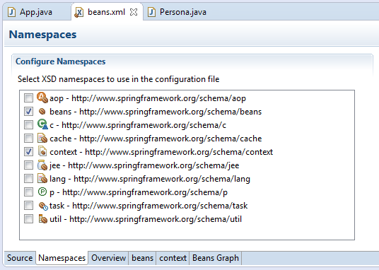

*Selección del namespace context*


*Además, para que Spring escanee automáticamente un determinado paquete en busca de clases que estén anotadas como beans necesitamos otra anotación más:*

`<context:component-scan base-package=""></context:component-scan>`

*El valor de la propiedad base-package lo marcará la ruta del paquete donde tengamos ubicados los beans.*

`@Component` es la anotación más básica, e indica que una clase será tratada como un bean. Estudiaremos más en profundidad esta anotación en la lección sobre estereotipos. Si la acompañamos de la anotación `@Value`, podemos inyectar algunos valores iniciales en nuestro bean.

```java
@Component
public class Mundo {

    @Value("Hola Mundo!")
    private String saludo;

    public Mundo() { } 

    //...

}
```

A continuación, trabajaremos con las siguientes anotaciones

* `@Required`: indicará que tenemos que satisfacer la dependencia en la configuración.

* `@Autowired`: realiza la misma función que la propiedad autowire del elemento <bean>.

* `@Qualifier`: que usada junto a @Autowired nos permite afinar más en la inyección automática.

#### 9.2.1 Anotación `@Required`

La anotación `@Required` va a indicar que una determinada propiedad debe ser establecida en tiempo de configuración, a través de alguno de los mecanismos que ya conocemos:

* Un elemento `<property>`

* Un elemento `<constructor-arg>`

* *Autowiring*

El contenedor lanzará una excepción si la propiedad afectada del bean no ha sido *seteada*. Esto nos permitirá evitar, desde una etapa muy temprana, excepciones del tipo `NullPointerException`.

```java
    @Required
    private Provincia provincia;
```    

#### 9.2.2 Anotaciones `@Autowire` y `@Qualifier`

Estas anotaciones nos van a permitir realizar la inyección automática de beans, al igual que aprendimos a realizarlo en las lecciones anteriores a través de XML.

##### 9.2.2.1 `@Autowired`

*Podemos sustituir la anotación `@Autowired`, que es propia de Spring, con la anotación `@Inject`, que es propia del JSR330. Estas anotaciones son escaneadas de la misma forma que las anotaciones Spring. Tan solo hay que añadir los jar necesarios a nuestro classpath, mediante la siguiente dependencia:*

```
<dependency>
    <groupId>javax.inject</groupId>
    <artifactId>javax.inject</artifactId>
    <version>1</version>
</dependency>
```

Podemos usar la anotación `@Autowired` tanto para constructores, como para métodos setter:

```java
public class MovieRecommender {

    private final CustomerPreferenceDao customerPreferenceDao;

    @Autowired
    public MovieRecommender(CustomerPreferenceDao customerPreferenceDao) {
        this.customerPreferenceDao = customerPreferenceDao;
    }

    // ...
}
```

```java
public class SimpleMovieLister {

    private MovieFinder movieFinder;

    @Autowired
    public void setMovieFinder(MovieFinder movieFinder) {
        this.movieFinder = movieFinder;
    }
    // ...

}
```

Por defecto, el *autowiring* convierte las propiedades a las que afecta en `@Required`. Si queremos cambiar dicho comportamiento por defecto, lo podemos hacer mediante la siguiente propiedad de la anotación:

```java
public class SimpleMovieLister {

    private MovieFinder movieFinder;

    @Autowired(required=false)
    public void setMovieFinder(MovieFinder movieFinder) {
        this.movieFinder = movieFinder;
    }

    // ...

}
```

##### 9.2.2.2 `@Qualifier`

Esta anotación nos permitirá *afinar el trabajo* a la hora de realizar la inyección de dependencias automática.

Supongamos que modificamos el fichero de configuración, `beans.xml`, de forma que registramos dos poblaciones diferentes:

```java
<?xml version="1.0" encoding="UTF-8"?>
<beans xmlns="http://www.springframework.org/schema/beans"
    xmlns:xsi="http://www.w3.org/2001/XMLSchema-instance" xmlns:context="http://www.springframework.org/schema/context"
    xsi:schemaLocation="http://www.springframework.org/schema/beans http://www.springframework.org/schema/beans/spring-beans.xsd
        http://www.springframework.org/schema/context http://www.springframework.org/schema/context/spring-context-4.3.xsd">


    <context:annotation-config />

    <context:component-scan base-package="com.openwebinars.anotaciones.beans"></context:component-scan>

    <bean id="Sevilla" class="com.openwebinars.anotaciones.autowire.Provincia">
        <property name="nombre" value="Sevilla"></property>
    </bean>

    <bean id="SevillaCapital" class="com.openwebinars.anotaciones.autowire.Poblacion">
        <property name="nombre" value="Sevilla"></property>
    </bean>

    <bean id="MairenaAljarafe" class="com.openwebinars.anotaciones.autowire.Poblacion">
        <property name="nombre" value="Mairena del Aljarafe"></property>
    </bean>

    <bean id="cliente" class="com.openwebinars.anotaciones.autowire.Cliente">
        <property name="id" value="1"></property>
    </bean>

    <bean id="persona" class="com.openwebinars.anotaciones.autowire.Persona">
        <property name="nombre" value="Luismi"></property>
    </bean>


</beans>
```

Para indicarle, explícitamente, a Spring, cual es el bean que debe inyectar como dependencia, podemos usar la anotación `@Qualifier` sobre el código Java:

```java
package com.openwebinars.anotaciones.autowire;

import org.springframework.beans.factory.annotation.Autowired;
import org.springframework.beans.factory.annotation.Qualifier;

public class Persona {

    private String nombre;

    @Autowired
    @Qualifier("MairenaAljarafe")
    private Poblacion poblacion;

    public Persona() {
    }

    public Persona(String nombre, Poblacion poblacion) {
        this.nombre = nombre;
        this.poblacion = poblacion;
    }

    //...
}
```

De esta forma, la inyección del bean `MairenaAljarafe` se realiza correctamente en el bean `Persona`.

### 9.3 ¿Qué configuración es mejor? Anotaciones vs. XML

La introducción del enfoque de configuración basado en anotaciones planteó la pregunta de si dicho enfoque es *mejor* que XML. La respuesta inmedianta es que *depende*. Si profundiamos algo más en la respuesta, podemos decir que cada uno tiene sus ventajas, y por lo general será el desarrollador el responsable de elegir cual le conviene. Por como están definidas, las anotaciones proporcionan una gran cantidad de información *in situ*, de forma que la configuración es más concisa y breve. Sin embargo, XML es la mejor opción para *conectar* componentes sin tocar su código fuente y recompilarlos. Unos desarrolladores prefieren tener la información sobre la configuración cerca del código al que afecta, y otros argumentan que de esa forma está descentralizada y es más complicada de controlar.


No importa la elección, puesto que Spring soporta todas sus opciones con ambas; incluso utilizar ambas a la vez. Vale la pena destacar que el uso de anotaciones junto con la configuración de los beans a través de código java (*JavaConfig*) permite usar las anotaciones de forma no invasiva, sin necesidad de tocar el código fuente de las clases afectadas.
Spring Tool Suite soporta el uso de todos los métodos.


## Estereotipos 2:48 

[Estereotipos](pdfs/10_Uso%20de%20estereotipos.pdf)

### 10.1 `@Component` y otras anotaciones de estereotipos

Spring nos provee de varias anotaciones de estereotipos: `@Component`, `@Service`, `@Controller` y `@Repository` (de esta última hablaremos en el bloque de Spring Data). `@Component` es un estereotipo genérico para cualquier componente manejado por Spring. `@Repository`, `@Service` y `@Controller` son especializaciones de `@Component` para casos de uso más específicos, de forma que las clases anotadas con las mismas se adaptarán mejor a esos casos (por ejemplo, `@Service` para la capa de servicios o lógica de negocio, o `@Repository` para la capa DAO o de acceso a datos).

### 10.2 Detección automática de clases y registro de las definiciones de los beans

Spring puede detectar automáticamente clases *estereotipadas* y registrar sus correspondientes `BeanDefinition` en nuestro contenedor. Sea el siguiente ejemplo:

```java
package org.example;

@Service
public class SimpleMovieLister {

    private MovieFinder movieFinder;

    @Autowired
    public SimpleMovieLister(MovieFinder movieFinder) {
        this.movieFinder = movieFinder;
    }

}
```

```java
package org.example;

@Repository
public class JpaMovieFinder implements MovieFinder {
    // omitimos la implementación para poner el acento en la definición de la clase.
}
```

Para autodetectar estas clases y registrarlas en los correspondientes beans, podríamos usar el siguiente código de configuración XML:

```java
<?xml version="1.0" encoding="UTF-8"?>
<beans xmlns="http://www.springframework.org/schema/beans"
    xmlns:xsi="http://www.w3.org/2001/XMLSchema-instance"
    xmlns:context="http://www.springframework.org/schema/context"
    xsi:schemaLocation="http://www.springframework.org/schema/beans
        http://www.springframework.org/schema/beans/spring-beans.xsd
        http://www.springframework.org/schema/context
        http://www.springframework.org/schema/context/spring-context.xsd">

    <context:component-scan base-package="org.example"/>

</beans>
```

Esto provocará que Spring escanee todas las clases definidas en el paquete `org.example` en busca de beans definidos con `@Component` o alguna de sus especializaciones, para registrarlos como *beans*.

*En la lección anterior, descubrimos que existía un nuevo elemento, perteneciente al namespace `context`, que era `<context:annotation-config />`; este servía para escanear las diferentes anotaciones que podíamos haber añadido a los beans que estuvieran definidos en nuestro XML. El uso de la anotación `<context:component-scan ... />` incluye implícitamente a <context:annotation-config />, con lo que solamente tendríamos que utilizar `<context:component-scan ... />`*.

#### 10.2.1 Filtrado y personalización del escaneo de beans

Por defecto, las clases anotadas con `@Component`, `@Repository`, `@Service`, `@Controller` son las candidatas a ser detectadas. Aun así, se puede modificar esta configuración añadiendo algunos filtros. Estos pueden ser de inclusión o de exclusión mediante los elementos `<context:include-filter>` y `<context:exclude-filter>`.

Tipo de filtro | Expresión de ejemplo | Descripción
Anotación (por defecto) | `org.example.SomeAnnotation` | Una anotación que debe estar presente en los componentes
Asignable | `org.example.SomeClass` | Una clase (o interfaz) que los componentes deben extender/implementar
Expresión regular | `org\.example\.Default.*`	| Una expresión regular que debe ser cumplida por los nombres de los componentes.
Customizado | `org.example.MyFilter` | Una implementación propia del interfaz `org.springframework.core.type.TypeFilter`.

A continuación podemos ver un ejemplo de escaneo con filtrado, en el que se incluirán todas las clases de dos paquetes que cumplan una expresión regular, y excluiremos todas aquellas clases anotadas con `@Repository`:

```java
<beans>
    <context:component-scan base-package="org.example">
        <context:include-filter type="regex" 
                expression="org.example.dao.*DAO.*" />
        <context:include-filter type="regex" 
                expression="org.example.services.*Service.*" />
        <context:exclude-filter type="annotation"
                expression="org.springframework.stereotype.Repository"/>
    </context:component-scan>
</beans>
```

Como podemos observar:

* Se incluyen todas las clases del paquete `org.example.dao` que contengan `DAO` como parte de su nombre.

* Se incluyen todas las clases del paquete `org.example.service` que contengan `Service` como parte de su nombre.

* Se excluyen todas las clases anotadas con `@Repository`.

### 10.3 Ámbitos mediante anotaciones

Al igual que con los objetos gestionados por Spring en general, el ámbito por defecto y más usado es *Singleton*. De todas formas, habrá ocasiones (en el bloque de Spring MVC lo trabajaremos en profundidad) que necesitemos modificar esta configuración con la anotación `@Scope`. Veamos un ejemplo

```java
@Scope("prototype")
@Repository
public class MovieFinderImpl implements MovieFinder {
    // ...
}
```

### 10.4 Uso de la anotación `@Qualifier` con estereotipos

La anotación `@Qualifier`, que trabajamos en la lección anterior, nos permitía afinar a la hora de inyectar una dependencia con *autowiring*. En este ejemplo podemos ver como realizar toda la configuración con anotaciones, y no usando XML para la definición, como en la lección pasada.

```java
@Service
public class SimpleMovieLister {

    private MovieFinder movieFinder;

    @Autowired
    @Qualifier("hibernate")
    public SimpleMovieLister(MovieFinder movieFinder) {
        this.movieFinder = movieFinder;
    }

}
```

```java
@Repository
@Qualifier("hibernate")
public class JpaMovieFinder implements MovieFinder {
    // ...
}
```

## Contenido adicional 10   

[Introducción a Spring](pdfs/01_Introducción%20a%20Spring.pdf)

[Configuración Spring](pdfs/02_Configuración%20de%20Spring.pdf)

[Inversión de control](pdfs/03_Inversión%20del%20control.pdf)

[Inyección de dependencias. Tipos de inyección](pdfs/04_Inyección%20de%20dependencias.pdf)

[Beans](pdfs/05_Beans.pdf)

[Inyección automática](pdfs/06_Inyección%20automática.pdf)

[Ámbitos de un Bean](pdfs/07_Ámbitos%20de%20un%20bean.pdf)

[Ciclo de vida de los Beans](pdfs/08_Ciclo%20de%20vida%20de%20los%20beans.pdf)

[Anotaciones Required, Autowired y Qualifier](pdfs/09_Uso%20de%20anotaciones.pdf)

[Estereotipos](pdfs/10_Uso%20de%20estereotipos.pdf)

