# 2. Desarrollo de Aplicaciones con Spring MVC y acceso a datos con Spring Data 133m
   * Una palabra sobre patrones de diseño: MVC, Front Controller, DAO... 7:49 
   * Otra palabra sobre HTTP 6:49 
   * Configuración del entorno 28:40 
   * Controladores y Vistas 10:37 
   * Mapeo de URLs 6:03 
   * Lectura de parámetros HTTP 6:03 
   * Elección de la vista: ViewResolver 6:07 
   * Formularios 7:42 
   * Validación 8:00 
   * Introducción a Spring Data. Súbmodulos. 5:06 
   * Spring Data JPA. Configuración y dependencias. 6:45 
   * Repositorios y entidades 7:40 
   * Consultas básicas 10:48 
   * Persistiendo entidades 6:16 
   * Consultas avanzadas 9:01 
   * Contenido adicional 13
   
## Una palabra sobre patrones de diseño: MVC, Front Controller, DAO... 7:49 

[Una palabra sobre patrones de diseño](pdfs/11_patrones%20de%20diseo.pdf)

### 11.1 Introducción

El desarrollo de software es una tarea complicada, la cual depende en gran medida de la experiencia de las personas involucradas, en particular de los desarrolladores.

*El 80% de los aportes vienen del 20% del personal.*

La comprensión del software es uno de los problemas más complicados en la tarea de mantenimiento y evolución.

*El 80% del esfuerzo esta en el 20% del código desarrollado.*

Uno de los pilares básicos de la Orientación a Objetos en el desarrollo de software es la búsqueda de la *reutilización*, que tendría las siguientes ventajas:

1. Reducción de tiempos.

2. Disminución del esfuerzo de mantenimiento.

3. Eficiencia.

4. Consistencia.

5. Fiabilidad.

6. Protección de la inversión en desarrollos.

Entre los diferentes mecanismos de reutilización están:

* **Componentes**: elemento de software suficientemente pequeño para crearse y
mantenerse pero suficientemente grande para poder utilizarse.

* **Frameworks**: bibliotecas de clases preparadas para la reutilización que pueden utilizar a su vez componentes.

* **Objetos distribuidos**: paradigma que distribuye los objetos de cooperación a través de una red heterogénea y permite que los objetos interoperen como un todo unificado.

* **Patrones de diseño**: sobre este último abundaremos un poco más.

Los patrones son una forma literaria para resolver problemas de
ingeniería del software, que tienen sus raíces en los patrones de la arquitectura. Los diseñadores y analistas de software más experimentados aplican de forma intuitiva algunos criterios que solucionan los problemas de manera elegante y efectiva. La ingeniería del software se enfrenta a problemas variados que hay que identificar para poder utilizar la misma solución (aunque matizada) con problemas similares.

Según Christopher Alexander, *“Cada patrón describe un problema que ocurre una y otra vez en nuestro entorno, para describir después el núcleo de la solución a ese problema, de tal manera que esa solución pueda ser usada más de un millón de veces, sin hacerlo ni siquiera dos veces de la misma forma”*.

Sobre patrones de diseño existe una gran cantidad de literatura, si bien uno de los documentos más básico es el libro *“Design Patterns: Elements of Reusable Object-Oriented Software” (Gang of Four, [GoF])*.

### 11.2 Patrón MVC (Modelo-Vista-Controlador)

El patrón de arquitectura MVC (Modelo Vista Controlador) es un patrón que define la organización independiente del *Modelo* (Objetos de Negocio), la *Vista* (interfaz con el usuario u otro sistema) y el *Controlador* (controlador del flujo o workflow de la aplicación).

De esta forma, dividimos el sistema en tres capas donde, como explicaremos más adelante, tenemos la encapsulación de los datos, la interfaz o vista por otro y por último la lógica interna o controlador.

El patrón de arquitectura “modelo vista controlador”, es una filosofía de diseño de aplicaciones, compuesta por:

* Modelo

   * Contiene el núcleo de la funcionalidad (dominio) de la aplicación.

   * Encapsula el estado de la aplicación.

   * No sabe nada / independiente del Controlador y la Vista.

* Vista

   * Es la presentación del Modelo.

   * Puede acceder al Modelo pero nunca cambiar su estado.

   * Puede ser notificada cuando hay un cambio de estado en el Modelo.

* Controlador

   * Reacciona a la petición del Cliente, ejecutando la acción adecuada y creando el modelo pertinente.

Para entender cómo funciona nuestro patrón Modelo vista controlador, se debe entender la división a través del conjunto de estos tres elementos y como estos componentes se comunican unos con los otros y con otras vistas y controladores externos a el modelo principal. Para ello, es importante saber que el controlador interpreta las entradas del usuario (tanto teclado como el ratón), enviado el mensaje de acción al modelo y a la vista para que se proceda con los cambios que se consideren adecuados

A continuación, podemos ver el patrón expresado en una imagen:

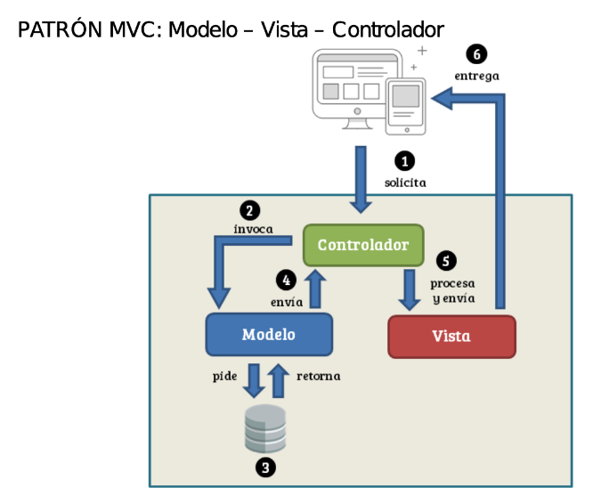

1. El usuario solicita, usando algún dispositivo, algún recurso. Lo puede hacer escribiendo una URL en el navegador, pulsando un botón o desencadenando otro tipo de evento. Esta solicitud es recibida por el controlador.

2. El controlador, una vez recibida la solicitud, pasa a procesarla. Es posible que haya una parte del código que sirva para decidir quien será el método concreto que haga este procesamiento, y si para ello, hay que extraer algún dato recibido a través de la petición. A partir de ahí, invoca al modelo, para realizar la operación solicitada.

3. El modelo, que es la representación de los objetos de nuestro dominio, posiblemente necesite interaccionar con el repositorio donde tengamos almacenados los datos (ficheros, base de datos relacional, NoSQL, API REST, …), pidiendo unos datos y recibiendo los mismos.

4. Los datos obtenidos en el paso (3) son enviados al controlador, para que estos puedan ser, en última instancia, mostrados al usuario.

5. Antes de ser enviados, los datos pueden ser procesados. Cuando lo hayan sido, si fuera necesario, son *inyectados* en la vista.

6. La vista, con los datos necesarios a mostrar, se entrega al usuario.

#### 11.2.1 Ventajas y desventajas del uso de MVC

* Ventajas:

   * *Soporte para múltiples vistas*. Dado que la vista se haya separada del modelo, y no hay dependencia directa entre el modelo y la vista.

   * *Adaptación al cambio*. Los requisitos de la IU tienden a cambiar más rápidamente que las reglas de negocio.

* Inconvenientes:

   * *Complejidad*. El patrón introduce nuevos niveles de indirección y por lo tanto aumenta ligeramente la complejidad de la solución (Spring MVC nos permitirá mitigar esto). Complejidad también en la depuración.

   * *Costo de actualizaciones frecuentes*. Desacoplar el modelo y la vista no significa que los desarrolladores del modelo puedan ignorar la naturaleza de las vistas.

### 11.3 *Front Controller* (Controlador frontal o de fachada)

El patrón *Front Controller* es usado en aplicaciones web para tener un mecanismo centralizado de recepción de peticiones, que será gestionadas por un solo objeto manejador. De esta forma, este manejador puede incorporar autenticación, autorización, *logging*, … antes de pasar la petición a su correspondiente manejador concreto.

En este patrón intervienen las siguientes entidades:

* Controlador Frontal (*Front Controller*): Manejador *único* que gestionará todas las peticiones.

* Despachador (*Dispatcher*): El controlador frontal deberá usar un despachador, que enviará cada petición a su correspondiente manejador.

* Vista (*View*): el objeto esperado tras la petición.

A continuación, podemos ver el patrón expresado en una imagen:

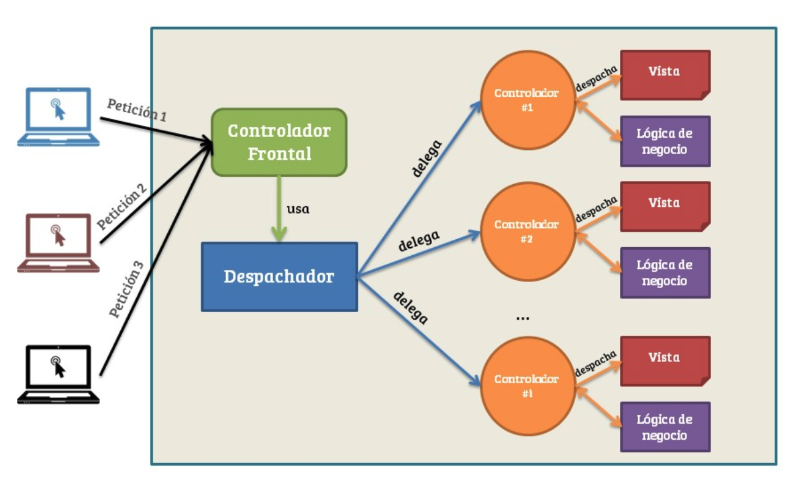

Spring MVC implementa este patrón de una forma transparente para nosotros, a través del objeto `org.springframework.web.servlet.DispatcherServlet`, como veremos en las próximas lecciones.

#### 11.3.1 Ventajas y desventajas del uso de MVC

* Ventajas:

   * Tenemos centralizado en un único punto la gestión de las peticiones.

   * Aumentamos la reusabilidad de código.

   * Mejoramos la gestión de la seguridad.

* Desventajas:

   * La velocidad de respuesta disminuye al tener que ser procesadas las peticiones primero por el controlador.

### 11.4 Patrón DAO (Data Access Object)

El acceso a los datos varía dependiendo de la fuente de los datos. El acceso al almacenamiento persistente, como una base de datos, varía en gran medida dependiendo del tipo de almacenamiento (bases de datos relacionales, bases de datos NoSQL, ficheros planos, etc.) y de la implementación del vendedor.

Toda aplicación web en el mundo real necesitan utilizar datos persistentes en algún momento. Para muchas de ellas, este almacenamiento persistente se implementa utilizando diferentes mecanismos. Por ejemplo, los datos podrían residir en sitemas heredados, repositorios LDAP, etc. Otro ejemplo es donde los datos los proporcionan servicios a través de sistemas externos como los sistemas de integración negocio-a-negocio (B2B), servicios de tarjetas de crédito, APIs REST, etc.

La solución a este problema nos la proporciona el patrón DAO: **utilizar un Data Access Object (DAO) para abstraer y encapsular todos los accesos a la fuente de datos. El DAO maneja la conexión con la fuente de datos para obtener y almacenar datos**.

El DAO implementa el mecanismo de acceso requerido para trabajar con la fuente de datos. Los componentes de negocio que tratan con el DAO utilizan un interface simple expuesto por el DAO para sus clientes. El DAO oculta completamente los detalles de implementación de la fuente de datos a sus clientes. Como el interface expuesto por el DAO no cambia cuando cambia la implementación de la fuente de datos subyacente, este patrón permite al DAO adaptarse a diferentes esquemas de almacenamiento sin que esto afecte a sus clientes o componentes de negocio. Esencialmente, el DAO actúa como un adaptador entre el componente y la fuente de datos.

A continuación, podemos ver el patrón expresado en un diagrama de clases:

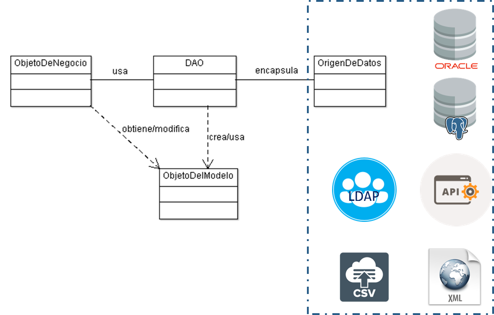

* *ObjetoDeNegocio* representa los datos del cliente. Es el objeto que requiere el acceso a la fuente de datos para obtener y almacenar datos.

* *DAO* es el objeto principal de este patrón. Abstrae la implementación del acceso a datos subyacente, y permite un acceso transparente a la fuente de datos.

* *OrigenDeDatos* representa la implementación de la fuente de datos, que podría ser un SGBDR, un ORM, un repositorio XML, un API REST, …

* *ObjetoDelModelo* representa el objeto (o colección) que queríamos obtener o modificar.

Spring nos proporciona un amplio soporte para el uso de este patrón dentro de Spring Data.

## Otra palabra sobre HTTP 6:49 

[Otra palabra sobre HTTP](pdfs/12_Una%20palabra%20sobre%20HTTP.pdf)

### 12.1 Introducción

El desarrollo de aplicaciones web implica tener un conocimiento, al menos elemental, del funcionamiento del protocolo subyacente, HTTP. El *Hypertext Transfer Protocol* es un protocolo orientado a transacciones y que sigue un esquema de petición-respuesta entre un cliente y un servidor. Normalmente, un cliente (por ejemplo, un navegador web) realiza la petición de un recurso, localizable mediante su URL, frente a un servidor; este, al recibir dicha petición, devolverá una respuesta.

El protocolo no tiene estado. Esto significa que durante una conexión, no tenemos información sobre que ha sucedido en conexiones anteriores. Si un cliente realiza dos veces la misma petición a un servidor, atenderá la segunda petición exactamente igual que la primera. El hecho de no almacenar estados supone ventajas e inconvenientes frente al hecho de sí hacerlo, aunque algunos autores apuntan a que ha sido parte de su éxito. A día de hoy existen mecanismos auxiliares que nos permiten almacenar información entre peticiones (como por ejemplo las *cookies*).

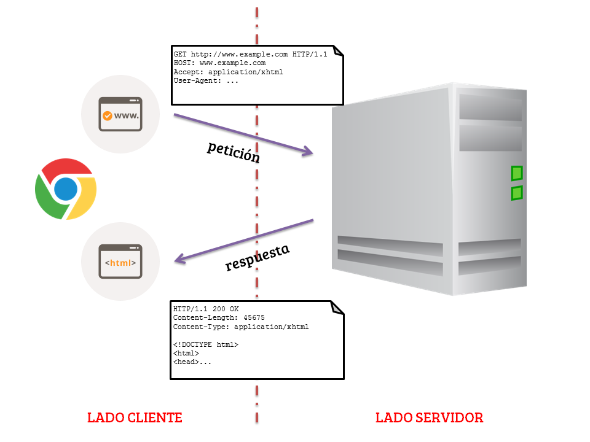

*Esquema de petición - respuesta de HTTP*

### 12.2 URLs (*Unified Resource Locator*)

Una URL es una forma de localizar a un recurso en internet. El formato genérico es el siguiente:

`protocolo://maquina:puerto/camino/al/recurso`

Usualmente, el protocolo es HTTP o HTTPS, aunque se pueden utilizar otros (como por ejemplo FTP). La máquina es el nombre de la misma o su IP. Habitualmente se utiliza un nombre (por ejemplo, `openwebinars.net`), que es traducido a una IP por el servicio DNS. A continuación, se indica el puerto al cual nos queremos conectar; por defecto, HTTP tiene asignado el 80, y HTTPS el 443. Por último, camino/al/recurso es la ruta en el sistema de ficheros de la máquina remota; dicha ruta será relativa al directorio marcado como raiz de la web.

### 12.3 Peticiones y respuetas HTTP

Una petición HTTP no es más que un mensaje que un cliente enviará a un servidor HTTP, con un formato muy específico. Este mensaje tiene siempre una estructura dividida en dos partes: la cabecera (HEADER) y el cuerpo (BODY).

Dentro de la cabecera de una petición HTTP se envía siempre una serie de datos que son necesarios para que el servidor pueda responder, a saber:

* Tipo de petición: GET, POST, … (los estudiaremos más adelante).

* URL del recurso solicitado

* Versión del protocolo

* Quién realiza la petición (User-Agent)

* ….

Además, podemos añadir a la cabecera algunos datos específicos para una petición determinada, y que el servidor puede procesar para realizar alguna tarea auxiliar (por ejemplo, los datos de autenticación si solicitamos un recurso protegido).

Por otro lado, el cuerpo de la petición puede que esté vacío (o no) dependiendo del tipo de la misma. Un ejemplo de contenido del cuerpo de una petición sería los campos rellenados en un formulario, un fichero adjunto, etc…

#### 12.3.1 Métodos de peticiones HTTP

El estándar del protocolo HTTP define una serie de métodos (también conocidos como verbos), que nos ayudarán a indicar qué estamos pidiendo exactamente al servidor con respecto a un recurso:

* **GET**: solicita al servidor que envie el recurso identificado por la URL

* **HEAD**: pide al servidor que envíe una respuesta idéntica a la que enviaría con **GET**, pero sin el cuerpo de la respuesta.

* **POST**: envía datos al servidor para que sean procesados por el recurso identificado por la URL. Los datos se deben incluir en el cuerpo de la petición.

* **PUT**: envía un recurso determinado (un archivo) al servidor. A diferencia que POST, este método crea una nueva conexión (socket) y la emplea para enviar el recurso, lo cual resulta más eficiente que enviarlo dentro del cuerpo del mensaje.

* **DELETE**: solicita la eliminación el recurso especificado.

* **TRACE**: solicita al servidor que envíe un mensaje de respuesta. Se utiliza para diagnosticar problemas de conexión.

* **OPTIONS**: pide al servidor que le indique los métodos HTTP que soporta para una determinada URL.

* **PATCH**: se emplea para modificar parcialmente un recurso ya existente en el servidor.

Existen varios tipos de petición más (CONNECT, SEARCH, MOVE, MERGE) definidos en sus respectivos RFC, y que quedan fuera del alcance de este curso.

Las peticiones más usuales suelen ser GET y POST, aunque el auge de los servicios web de tipo RESTful, íntimamente ligados al protocolo HTTP, han retomado el uso de otras, como DELETE, PUT o PATCH.

#### 12.3.2 Respuestas HTTP

Una respuesta del servidor tiene una estructura parecida a la de una petición, también con una cabecera y un cuerpo. Como parte de la cabecera, normalmente recibiremos:

* La versión de HTTP con la que trabaja el servidor

* El código de estado o de respuesta, con su correspondiente *frase de explicación*.

* Algunas cabeceras adicionales, como el tipo de contenido que recibidos, su longitud en bytes, etc…

Como cuerpo de la respuesta, como era de esperar, recibidos el recurso localizado.

El código de estado HTTP de la respuesta se utiliza para explicar que ha sucedido a la hora de realizar la petición. Están formados por tres dígitos, y pueden ser alguno de los siguientes:

* Códigos 1XX: Mensajes
   
   * 100-111 Conexión rechazada

* **Códigos 2XX: Operación realizada con éxito**

   * 200 OK

   * 201-203 Información no oficial

   * 204 Sin contenido

   * 205 Contenido para recargar

   * 206 Contenido parcial

* Códigos 3XX: Redirección

   * 301 Mudado permanentemente

   * 302 Encontrado

   * 303 Vea otros

   * 304 No modificado

   * 305 Utilice un proxy

   * 307 Redirección temporal

* **Códigos 4XX: Error por parte del cliente**

   * **400 Solicitud incorrecta**

   * 402 Pago requerido

   * 403 Prohibido

   * **404 No encontrado**

   * 409 Conflicto

   * 410 Ya no disponible

   * 412 Falló precondición

* **Códigos 5xx: Error del servidor**

   * **500 Error interno**

   * 501 No implementado

   * 502 Pasarela incorrecta

   * 503 Servicio no disponible

   * 504 Tiempo de espera de la pasarela agotado

   * 505 Versión de HTTP no soportada
   
Hemos resaltado los códigos de respuesta más usuales que podemos encontrar en el día a día con HTTP.

### 12.4 Lenguajes, tecnologías y estándares de la WWW

Como indicábamos más arriba, HTTP es un protocolo de transferencia de hipertexto. Pero, ¿qué es eso del hipertexto? No es más que documentos de texto que pueden hacer referencia a otros documentos de texto. A día de hoy los conocemos como *páginas web*. La estructura de estos documentos viene definida en el ya archiconocido lenguaje HTML, si bien no es el único utilizado a día de hoy para crear contenido en la web.

* **HTML**: Lenguaje de marcado de hipertexto. Sirve para la definición de la estructura y el contenido de documentos de hipertexto. Al ser un lenguaje de marcado, se puede escribir en texto plano y no necesita transformarse en código objeto ni nada por el estilo. Actualmente está vigente la versión 5.

* **CSS**: lenguaje de estilos que permite, en interacción con HTML, modificar la forma en la que se presenta el contenido definido dentro de un documento **web**. La versión actual es la 3.0 y permite funcionalidades increibles, como gradientes, animaciones, transformaciones…

* **Javascript**: es un lenguaje de *scripting* diseñado para usarse dentro de las páginas web. Inicialmente, nos permitía interaccionar con el Modelo de Objetos del Documento (DOM), si bien se ha convertido en una tecnología de mayor importancia y envergadura de lo que sus creadores soñaron inicialmente.

* **XML**: se trata de un metalenguaje (un lenguaje para definir lenguajes) que nos permite estructurar información mediante un lenguaje de marcado, lo cual la hace interoperable entre sistemas heterogéneos.

* **AJAX**: La unión de XML y las peticiones asíncronas con Javascript (AJAX) han revolucionado la web hasta transformarla en la conocida como Web 2.0, permitiendo crear servicios como Google Maps, Facebook, …

Todos estos lenguajes y tecnologías que hemos descrito anteriormente son de los que, normalmente, se utilizan en el conocido como lado cliente. Al otro lado, en el servidor, también existen una serie de tecnologías muy utilizadas en la actualidad y que también deben *sonarnos*.

* **Java**: esta tecnología es omnipresente, y el campo de la web no podía ser menos. Java comenzó a mitad de los 90s con la incursión de los applets, pequeños programas embebibles dentro de una página web, y que permitieron crear las primeras aplicaciones web. Posteriormente, surgieron los *Servlets* y la tecnología *JSP*, que permitió la creación de aplicaciones web empresariales orientadas a la web.

* **PHP**: Se trata de un popular lenguaje de programación que surgió para la creación de webs de contenido dinámico. Se trata de uno de los lenguajes más flexibles y potentes conocidos a día de hoy. Algunos de los servicios más utilizados del mundo, como Facebook, están implementados con él.

* **Python**: Es otro popular lenguaje de programación multiparadigma y de código abierto. Tiene una gran cantidad de librerías que lo hacen un gran candidato para casi cualquier proyecto. En el caso de la web, el framework más utilizado es Django.

* **ASP.NET**: Microsoft también tiene su tecnología del lado del servidor, llamada ASP.NET. Se trata de un framework para el desarrollo de aplicaciones web. Uno de los más extendidos es el que implementa aplicaciones a través del patrón MVC.

* **Ruby**: se trata de un lenguaje de programación multiparadigma que se creó para que fuera altamente sencillo de programar, siguiendo el “principio de la menor sorpresa”. El framework más utilizado para el desarrollo web con este lengauje es Ruby on Rails.

## Configuración del entorno 28:40 

### 13.1 Software a utilizar

* Java SDK 1.7 o superior (preferiblemente 1.8)

* Spring Tool Suite 3.8 (la última versión liberada hasta ahora 3.8.1)

* Maven 2

### 13.2 Implementación del proyecto

#### 13.2.1 Paso 1: Aplicación base y configuración del entorno

Para la creación de nuestro proyectos utilizaremos Maven, si bien antes de nada tendremos que matizar un poco esto.

*Lo ideal sería que pudiéramos utilizar Maven como en el primer bloque del curso, es decir, utilizando un arquetipo para comenzar nuestra aplicación web. De hecho, en su catálogo oficial, Maven ofrece uno, llamado `maven-archetype-webapp`, que nos permitiría comenzar a trabajar. Sin embargo, este arquetipo incluye la limitación de que la versión de servlets que soporta por defecto es la 2.3 (bastante antigua). Si tratamos de cambiar esto para poder usar una versión posterior (al menos la 2.5, o idealmente la 3.0 o 3.1), podemos comprobar como entramos en un callejón sin salida. Por ello, afrontaremos los pasos iniciales mediante una alternativa, que nos permitirá usar Maven y la versión de servlets que queramos.*

##### 13.2.1.1. Paso 1.1: Creación del proyecto

Para comenzar, vamos a crear un nuevo *Dynamic Web Project*. Se trata de un tipo de proyecto, proporcionado por STS (Eclipse), y orientado a la creación de una aplicación web dinámica con JavaEE.

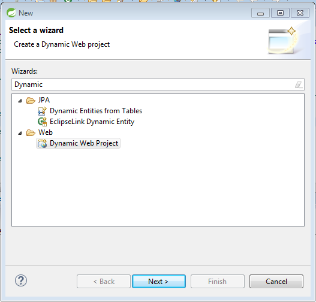

*Creación de un Dynamic Web Project*

Tras seleccionarlo, pulsamos Next, y en la siguiente ventana del asistente, tan escribimos el nombre del proyecto (`HelloWorldSpringMVC` o el nombre que deseemos). Seleccionamos también el servidor donde se ejecutará la aplicación (por defecto, la versión 3.8 de STS incluye una instancia del servidor *Pivotal tc* Server, que no es más que un Tomcat *tuneado*). Para la versión del módulo dinámico web (*Dynamic Web module version*) elegimos 3.1 (esto nos permitirá usar la versión 3.1 de los servlets).

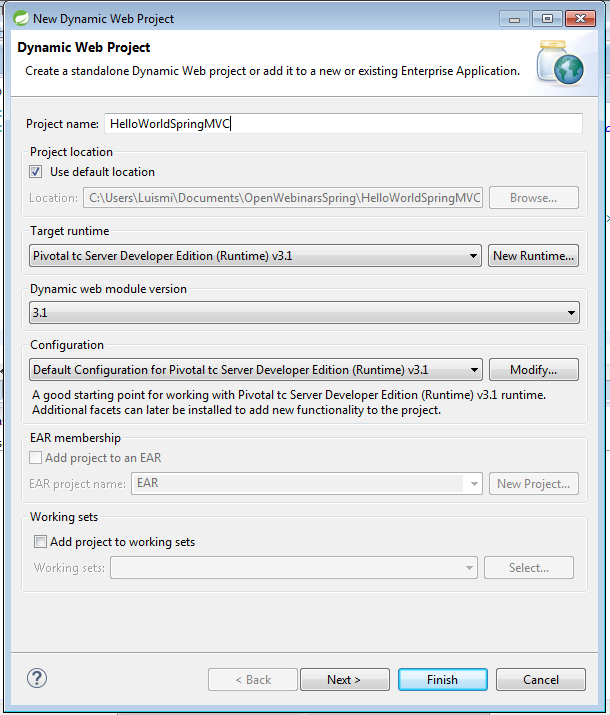

*Datos iniciales del proyecto*

En el siguiente paso, no tenemos que hacer nada, y tan solo pulsamos *Next*.

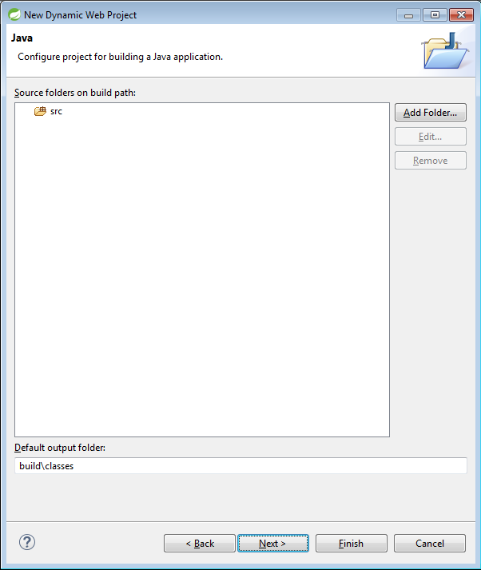

*Configuración de las carpetas que se incluirán en el Build Path.*

Por último, en la ventana final del asistente, marcamos la opción de generación del descriptor del proyecto (*Generate web.xml deployment descriptor*) y pulsamos *Finish*.

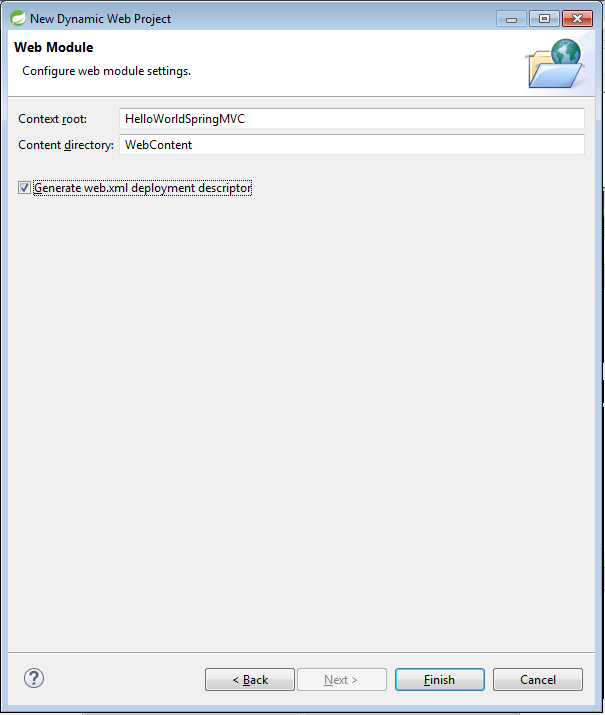

Generación del proyecto incluyendo el descriptor de despliegue.

Al tratarse de un proyecto Java EE, nos invitará a cambiar la perspectiva de Eclipse (la forma en que se organizan las ventanas, cuantas se visualizan inicialmente…), pero podemos declinar dicha invitación y continuar con la perspectiva Spring.

##### 13.2.1.2 Paso 1.2: Conversión del *Dynamic Web Project* a un proyecto *Maven*

Por defecto, un proyecto de tipo *Dynamic Web Project* no está preparado para poder usar Maven. Sin embargo, el entorno de desarrolo nos permite transformar un proyecto de cualquier tipo en un proyecto Maven, de forma que modifica su estructura en todos los elementos necesarios, y prepara un fichero `pom.xml` para poder añadir las dependencias necesarias.

Para realizar la transformación, pulsamos con el botón derecho sobre el proyecto, y seleccionamos *Configure > Convert to Maven project*.

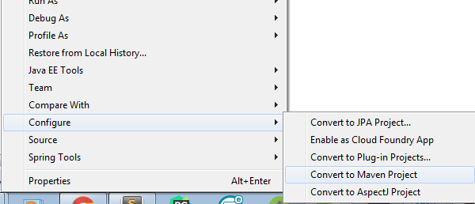

*Conversión a un proyecto Maven*.

En la siguiente ventana, no tenemos que modificar ningún dato, y tan solo pulsamos *Finish*.

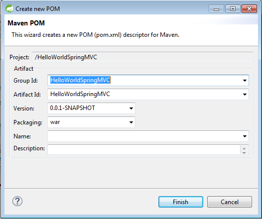

*Finalización de la conversión del proyecto Maven*.

Tras finalizar la conversión, tenemos la siguiente estructura de proyecto:

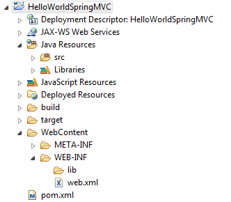

*Estructura del proyecto*

##### 13.2.1.3 Paso 1.3: Añadimos las dependencias

Como ya hiciéramos en el bloque pasado, vamos a trabajar con una serie de dependencias para incorporar las librerías necesarias. Maven es muy generoso, y podemos hacerlo todo a través de una sola dependencia, que es la siguiente:

```js
<dependency>
    <groupId>org.springframework</groupId>
    <artifactId>spring-webmvc</artifactId>
    <version>${org.springframework.version}</version>
</dependency>
```

Si echamos un vistazo en el apartado `<version>`, podemos observar que, en lugar de un valor concreto, estamos usando una variable. Esto nos servirá en el caso de que utilicemos más de una dependencia Spring, para que siempre utilicemos la misma versión; y también, para que en caso de querer modificar la versión, podamos hacerlo en un lugar *centralizado*, y dicho cambio se propague a todas las dependencias. La definición de la propiedad se realiza fuera del elemento `<dependencies>`, de la siguiente forma:

```js
<properties>
    <org.springframework.version>4.3.2.RELEASE</org.springframework.version>
</properties>
```

También vamos a usar los servlets; de hecho, en el paso anterior, elegimos la versión 3.1. Esa es la versión que tendremos que añadir como dependencia:

```js
<dependency>
    <groupId>javax.servlet</groupId>
    <artifactId>javax.servlet-api</artifactId>
    <version>3.1.0</version>
</dependency>
```

Si además queremos usar la *Java Standard Tag Library*, es decir, el conjunto oficial de etiquetas para JSP, tenemos que añadir su dependencia:

```js
<dependency>
    <groupId>javax.servlet</groupId>
    <artifactId>jstl</artifactId>
    <version>1.2</version>
</dependency>
```

Por último, si queremos utilizar *Log4j* como sistema de logging, añadimos la dependencia correspondiente:

```js
<dependency>
    <groupId>log4j</groupId>
    <artifactId>log4j</artifactId>
    <version>1.2.17</version>
</dependency>
```

#### 13.2.2 Paso 2: Configuración de Spring MVC

Si bien profundizaremos en la estructura de Spring MVC en las lecciones posteriores, si podemos decir que un proyecto de Spring MVC no es más que un proyecto Java EE.

##### 13.2.2.1 Paso 2.1: Configuración del descriptor de despliegue

Como proyecto Java EE que es, necesita una configuración de los servlets que vamos a utilizar (en nuestro caso, solamente uno, que se encargará de despachar todas las peticiones de la aplicación, a modo de *Front Controller*). Todo ello lo haremos en el fichero `Webcontent/WEB-INF/web.xml`:

```java
<?xml version="1.0" encoding="UTF-8"?>
<web-app xmlns:xsi="http://www.w3.org/2001/XMLSchema-instance" xmlns="http://xmlns.jcp.org/xml/ns/javaee" xsi:schemaLocation="http://xmlns.jcp.org/xml/ns/javaee http://xmlns.jcp.org/xml/ns/javaee/web-app_3_1.xsd" id="WebApp_ID" version="3.1">
  <display-name>HelloWorldSpringMVC</display-name>
  <servlet>
        <servlet-name>dispatcher</servlet-name>
        <servlet-class>org.springframework.web.servlet.DispatcherServlet</servlet-class>
        <load-on-startup>1</load-on-startup>
    </servlet>
    <servlet-mapping>
        <servlet-name>dispatcher</servlet-name>
        <url-pattern>/</url-pattern>
    </servlet-mapping>
</web-app>
```

De esta forma, como decíamos anteriormente, indicamos que todas las peticiones sean atendidas por el controlador frontal.

##### 13.2.2.2 Paso 2.2: Configuración del contexto

Spring MVC necesita una definición de su contexto, y por defecto, debe estar un fichero que se llame `<nombredelservlet>-servlet.xml`. Es decir, si el nombre de nuestro servlet es `dispatcher`, el fichero de configuración, que ubicaremos en el mismo directorio, debe llamarse `dispatcher-servlet.xml`.

```java
<?xml version="1.0" encoding="UTF-8"?>
<beans xmlns="http://www.springframework.org/schema/beans"
    xmlns:xsi="http://www.w3.org/2001/XMLSchema-instance" xmlns:context="http://www.springframework.org/schema/context"
    xmlns:mvc="http://www.springframework.org/schema/mvc"
    xsi:schemaLocation="http://www.springframework.org/schema/beans http://www.springframework.org/schema/beans/spring-beans-4.3.xsd
        http://www.springframework.org/schema/context http://www.springframework.org/schema/context/spring-context-4.3.xsd
        http://www.springframework.org/schema/mvc http://www.springframework.org/schema/mvc/spring-mvc-4.3.xsd">

    <context:component-scan base-package="com.openwebinars.helloworld" />

    <mvc:annotation-driven />

    <bean id="viewResolver"
        class="org.springframework.web.servlet.view.InternalResourceViewResolver">
        <property name="viewClass"
            value="org.springframework.web.servlet.view.JstlView" />
        <property name="prefix" value="/WEB-INF/jsp/" />
        <property name="suffix" value=".jsp" />
    </bean>

</beans>
```

##### 13.2.2.3 Paso 2.3: Configuración de Log4j

Como en otras ocasiones, vamos a configurar Log4j para utilizarlo como sistema de logging. Para ubicar el fichero de properties, tenemos que crear una nueva carpeta, llamada `resources`, dentro de *Java Resources*. Para ello, tenemos que hacerlo desde la configuración del *Build Path* (botón derecho sobre el proyecto > Propiedades > Java Build Path).

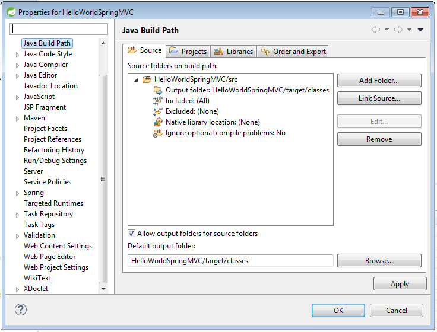

*Figura XX. Configuración del Build Path*.

Pulsamos sobre el botón *Add Folder*, y en diálogo que nos aparece, pulsamos sobre el botón *Create New Folder*. Damos como nombre a la carpeta `resources`.
Pulsamos *Finish, Ok, …*

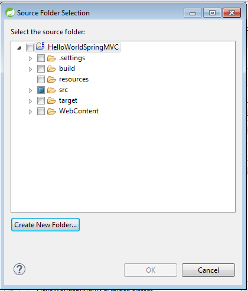

*Creación de la carpeta (1)*


*Creación de la carpeta (2)*

Ahora, dentro de esta carpeta, es donde podemos ubicar el fichero de propiedades de log4j, llamado `log4j.properties`, y cuyo contenido puede ser el siguiente:

```java
log4j.rootCategory=INFO, stdout

log4j.appender.stdout=org.apache.log4j.ConsoleAppender
log4j.appender.stdout.layout=org.apache.log4j.PatternLayout
log4j.appender.stdout.layout.ConversionPattern=%d{ABSOLUTE} %5p %t %c{2}:%L - %m%n

log4j.category.org.springframework.beans.factory=DEBUG
```

A partir de ahora, vamos a definir nuestro primer controlador y una vista a mostrar.

#### 13.2.3 Paso 3: La vista y el controlador

##### 13.2.3.1 Paso 3.1: El controlador, una clase muy simple

Spring nos facilita mucho la creación de controladores, que podrán realizar toda la lógica de negocio de nuestra aplicación antes de enviar los datos a la vista. De hecho, como podremos comprobar, se tratará de una clase POJO (*Plain Old Java Object*), que no debe heredar de ninguna clase especial. Creamos una nueva clase, llamada `HelloController`, dentro del paquete `com.openwebinars.helloworld`. Veamos el código y desgranémoslo:

```java
package com.openwebinars.helloworld;

import org.springframework.stereotype.Controller;
import org.springframework.ui.Model;
import org.springframework.web.bind.annotation.RequestMapping;

@Controller
public class HelloController {

    @RequestMapping("/hello")
    public String sayHello(Model model) {        
        model.addAttribute("saludo", "Hola Mundo!!!");
        model.addAttribute("mensaje","Me llena de orgullo y satisfacción saludaros en este primer ejemplo de Spring MVC");
        model.addAttribute("url", "http://www.openwebinars.net");
        return "hello";
    }    
}
```

Lo primero que llama la atención es la simplicidad de la clase: es java en estado puro. Se trata una simple clase java, anotada con `@Controller`. Eso, unido a la configuración declarada en el fichero `dispatcher-servlet.xml`, harán que Spring se encargue del resto.

La clase tiene un solo método, cuya *firma* es `public String sayHello(Model model)`:

* Como decíamos más arriba, el tipo de retorno es `String`, ya que devolverá el nombre de una vista.

* Como argumento, recibe un elemento de tipo `Model`. Sera el contenedor que nos permita añadir datos que serán transportados a la vista.

* Además, está anotado con `RequestMapping("/hello")`. De esta forma indicamos que cualquier petición hacia la url `http://máquina:puerto/HelloWorldSpringMVC/hello` será procesada por este método.

Ahora, nos toca crear la vista.

##### 13.2.3.2 Paso 3.2: Creación de la vista

Para crear la vista, vamos a crear previamente una carpeta que las almacene todas, dentro de `WEB-INF`, y que se llamará `jsp`. (También podemos eliminar la carpeta `WEB-INF/lib`, ya que al usar Maven, no sirve para nada).

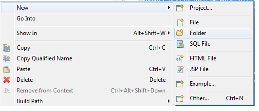


*Creación de la carpeta WEB-INF/jsp, que almacenará todas las vistas*.

Ahora, ya podemos proceder a la creación de nuestro fichero de vista, que se llamará hello.jsp.

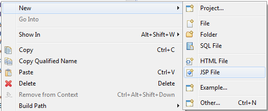

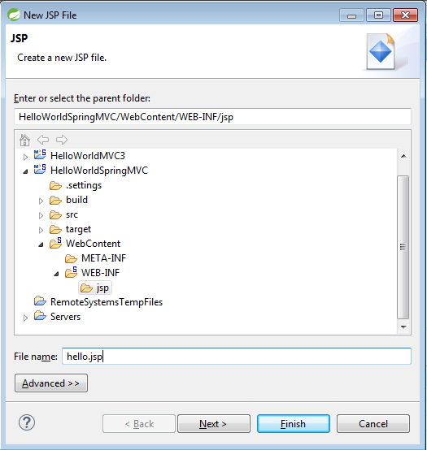

*Creación del fichero JSP*

Inicialmente, la plantilla que tiene definida STS para una página JSP está pensada para usar HTML4. Vamos a realizar algunos cambios:

1. Cambiaremos la codificación de ISO-8859-1 a UTF-8.

2. Vamos a usar HTML5 en lugar de HTML4.

3. Además, usaremos como base bootstrap, lo cual nos permitirá tener una web de apariencia profesional y *responsiva* con muy poco esfuerzo por nuestra parte.

Abrimos el navegador, y entramos en http://getbootstrap.com. Accedemos a *Getting started* y encontramos la plantilla base. Modificamos los enlaces de bootstrap, para no tener que descargar los ficheros y que los tome directamente el respositorio oficial:

```html
<!DOCTYPE html>
<html>
  <head>
    <meta charset="utf-8">
    <meta http-equiv="X-UA-Compatible" content="IE=edge">
    <meta name="viewport" content="width=device-width, initial-scale=1">
    <!-- The above 3 meta tags *must* come first in the head; any other head content must come *after* these tags -->
    <title>Bootstrap 101 Template</title>

    <!-- Bootstrap -->
    <link href="https://maxcdn.bootstrapcdn.com/bootstrap/3.3.7/css/bootstrap.min.css" rel="stylesheet">

    <!-- HTML5 shim and Respond.js for IE8 support of HTML5 elements and media queries -->
    <!-- WARNING: Respond.js doesn't work if you view the page via file:// -->
    <!--[if lt IE 9]>
      <script src="https://oss.maxcdn.com/html5shiv/3.7.3/html5shiv.min.js"></script>
      <script src="https://oss.maxcdn.com/respond/1.4.2/respond.min.js"></script>
    <![endif]-->
  </head>
  <body>


    <!-- jQuery (necessary for Bootstrap's JavaScript plugins) -->
    <script src="https://ajax.googleapis.com/ajax/libs/jquery/1.12.4/jquery.min.js"></script>
    <!-- Include all compiled plugins (below), or include individual files as needed -->
    <script src="https://maxcdn.bootstrapcdn.com/bootstrap/3.3.7/js/bootstrap.min.js"></script>
  </body>
</html>
```

Ahora, vamos a definir la información que queremos visualizar. Si revisamos el código del controlador, hemos añadido al modelo:

* Un saludo, que mostraremos en grande.

* Un mensaje, que mostraremos debajo.

* Un enlace, que usaremos para que los usuarios puedan visitar otra web.

Podemos utilizar una de las plantillas base de bootstrap para copiar el código, que es bastante fácil:

```html
    <div class="jumbotron">
      <div class="container">
        <h1>${saludo}</h1>
        <p>${mensaje}</p>
        <p><a class="btn btn-primary btn-lg" target="_blank" href="${url}" role="button">Learn more &raquo;</a></p>
      </div>
    </div>
```

Además, encontramos que hemos usado *Expression Language*, una característica que JSP que nos permite utilizar un lenguaje sencillo para usar un *JavaBean* dentro de una página JSP. `${saludo}` buscará dentro del contexto una variable llamada `saludo`, y mostrará su valor. Lo mismo sucede con `${mensaje}`. Como vemos, `${url}` nos sirve para definir el elemento `href` del enlace.

#### 13.2.4 Paso 4: Ejecución

Una vez que tenemos definido nuestro proyecto, lo hemos configurado, y hemos añadido una vista y un controlador, vamos a pasar a ejecutarlo. Para ello, tan solo tenemos que pulsar sobre el proyecto con el botón derecho *> Run As > Run on Server*. Ello hará que nos aparezca el siguiente diálogo:

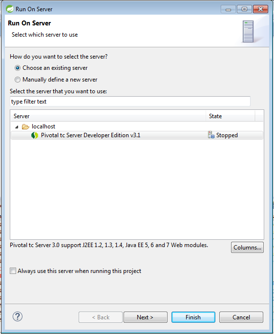

*Diálogo de ejecución del proyecto*

Tan solo pulsamos sobre *Finish*, y el servidor comenzará a ejecutarse, desplegandose nuestra aplicación y lanzando el navegador que esté configurado. Y ¡sorpresa! Nos encontramos con el error 404. Esto se debe a que no hemos definido una página de bienvenida. Sin embargo, si recordamos, nuestro controlador iba a *escuchar* la url `http://maquina:puerto/nombredelproyecto/hello`. Si la escribimos en el navegador, veremos que aparece nuestra esperada vista.


Hola Mundo ejecutandose

## Controladores y Vistas 10:37 

[Controladores y Vistas](pdfs/14_Controladores%20y%20vistas.pdf)

### 14.1 Introducción

Los controladores proveen de acceso a la aplicación que está por debajo, normalmente, a través de servicios. En principio, podemos hacer uso de las anotaciones `@Controller` y `@RequestMapping` para poder definir un controlador y como se va a acceder a él.

Por otro lado, una de las áreas donde sobresale Spring es en la separación de la vista (y su implementación) del resto del framework MVC. Por ejemplo, podemos utilizar Thymeleaf o Freemarker en lugar de un código JSP inicial. Nosotros trabajaremos con JSP, que es una tecnología sencilla y eficaz, y parte del estándar de Java EE, si bien, en esta lección, vamos a presentar otras posibidades existentes.

### 14.2 Definición (básica) de un controlador con `@Controller`

La anotación `@Controller` indica que una clase particular tiene el rol de un *controlador*. Spring no obliga a que extendamos ninguna clase base o que hagamos referencia al API de los Servlets. `@Controller` actua como un estereotipo de la clase anotada. El *dispatcher* escanea las clases anotadas y detecta las anotaciones `@RequestMapping` (que veremos más adelante). Para habilitar la autodetección, tenemos que definir el escaneo automático en la configuración de nuestro contenedor:

```java
<?xml version="1.0" encoding="UTF-8"?>
<beans xmlns="http://www.springframework.org/schema/beans"
    xmlns:xsi="http://www.w3.org/2001/XMLSchema-instance" xmlns:context="http://www.springframework.org/schema/context"
    xmlns:mvc="http://www.springframework.org/schema/mvc"
    xsi:schemaLocation="http://www.springframework.org/schema/beans http://www.springframework.org/schema/beans/spring-beans-4.3.xsd
        http://www.springframework.org/schema/context http://www.springframework.org/schema/context/spring-context-4.3.xsd
        http://www.springframework.org/schema/mvc http://www.springframework.org/schema/mvc/spring-mvc-4.3.xsd">

    <context:component-scan base-package="com.openwebinars.springmvc" />

    <mvc:annotation-driven />

    <bean id="viewResolver"
        class="org.springframework.web.servlet.view.InternalResourceViewResolver">
        <property name="viewClass"
            value="org.springframework.web.servlet.view.JstlView" />
        <property name="prefix" value="/WEB-INF/jsp/" />
        <property name="suffix" value=".jsp" />
    </bean>

</beans>
```

### 14.2.1 Mapeo de peticiones con `@RequestMapping`

Podemos usar la anotación `@RequestMapping` para mapear URLs, como `/appointments`, sobre una clase, o un método en particular. Normalmente, la anotación a nivel de clase sirve para mapear a un controlador de formulario; y las anotaciones a nivel de método adicionales para concretar elementos específicos de cada anotación (parámetros adicionales, *verbo* de la petición: GET, POST, …), etcétera.

Sea el siguiente fragmento de código de una aplicación de ejemplo:

```java
@Controller
@RequestMapping("/profesor")
public class ProfesorController {

    @Autowired
    private ProfesorService profesorService;

    @RequestMapping(value="/list", method = RequestMethod.GET)
    public String listado(Model model) {

        model.addAttribute("profesores", profesorService.getProfesores());
        return "list";
    }

    @RequestMapping(value="/detail/{idProf}", method = RequestMethod.GET)
    public String detalle(@PathVariable("idProf") int id, Model model) {

        model.addAttribute("profesor", profesorService.getById(id));

        return "detail";
    }

    public void setProfesorService(ProfesorService profesorService) {
        this.profesorService = profesorService;
    }
}
```

En este ejemplo, `@RequestMapping` se usa en varios lugares. El primer uso es a nivel de clase que indica que todos los métodos de la misma trabajarán sobre la ruta relativa `/profesor`. El método `listado(...)` tiene una concreción de `@RequestMapping`: solamente acepta peticiones de tipo `GET` que se realicen a la url `/list`. El método `detalle(...)` tiene una concreción similar y también nos muestra otro elemento a usar con `@RequestMapping`: las *URI templates* (que aprenderemos más adelante).

La anotación `@RequestMapping` a nivel de clase no es obligatoria; de no haberla, todas las rutas en las anotaciones de los métodos serán absolutas y no relativas, como podemos ver en el siguiente ejemplo:

```java
@Controller
public class ClinicController {

    private final Clinic clinic;

    @Autowired
    public ClinicController(Clinic clinic) {
        this.clinic = clinic;
    }

    @RequestMapping("/")
    public void welcomeHandler() {
    }

    @RequestMapping("/vets")
    public ModelMap vetsHandler() {
        return new ModelMap(this.clinic.getVets());
    }
}
```

#### 14.2.2 Variantes compuestas de `@RequestMapping`

La versión 4.3 de Spring Framework introduce una serie de variantes *compuestas* de la anotación `@RequestMapping` para ayudar a simplificar los méotodos HTTP más comunes expresar mejor la semántica del método anotado. Tenemos a nuestra disposición las siguientes:

* `@GetMapping`

* `@PostMapping`

* `@PutMapping`

* `@DeleteMapping`

* `@PatchMapping`

A continuación, podemos ver una modificación del ejemplo `AppointmentsController` usando las anotaciones compuestas:

```java
@Controller
@RequestMapping("/profesor")
public class ProfesorController {

    @Autowired
    private ProfesorService profesorService;

    @GetMapping(value="/list", method = RequestMethod.GET)
    public String listado(Model model) {

        model.addAttribute("profesores", profesorService.getProfesores());
        return "list";
    }

    @GetMapping(value="/detail/{idProf}", method = RequestMethod.GET)
    public String detalle(@PathVariable("idProf") int id, Model model) {

        model.addAttribute("profesor", profesorService.getById(id));

        return "detail";
    }

    //...
}
```

#### 14.2.3 ¿Qué firma debe tener un método anotado con `@RequestMapping`?

Los métodos manejadores, anotados con `@RequestMapping`, pueden tener *firmas* de lo más variado. La mayoría de los argumentos que pueden recibir pueden ser usados en un orden arbitario, a excepción de los de tipo `BindingResult`. A lo largo de las siguiente lecciones iremos usando las más usuales. Veamos las posibilidades existentes.

##### 14.2.3.1 Tipos de argumentos soportados

Spring MVC soporta los siguientes tipos de datos como argumentos de un método anotado como `@RequestMapping` (destacamos en negrita los más utilizados):

* **Objetos *request* y *response*, del API Servlet (por ejemplo, `ServletRequest` o `HttpServletRequest`).

* Objetos de sesión, del tipo `HttpSession`.

* `org.springframework.web.context.request.WebRequest` o `org.springframework.web.context.request.NativeWebRequest`. Nos dan acceso a los objetos de tipo petición, sin necesidad del uso del API Servlet.

* `java.util.Locale`, que nos da la información de la zona geográfica (idioma, moneda, …)

* `java.util.TimeZone` (Java 6+) / `java.time.ZoneId` (en Java 8), para saber la zona horaria asociada a la petición.

* `java.io.InputStream` / `java.io.Reader` para acceder al contenido de la petición en formato *raw* (Servlet API).

* `java.io.OutputStream` / `java.io.Writer` para generar el contenido de la respuesta, también en formato *raw* (Serlvet API).

* `org.springframework.http.HttpMethod`, para determinar el método (verbo) HTTP de la petición (es una enumeración).

* `java.security.Principal`, conteniendo el usuario actualmente autenticado.

* Argumentos anotados con `@PathVariable` para acceder a variables dentro de la URI (profundizaremos en capítulos posteriores).

* Argumentos anotados con `@MatrixVariable` (también profundizaremos en lecciones posteriores).

* **Argumentos anotados `@RequestParam`, para acceder a los parámetros de la petición (Servlet API). Los estudiaremos con detenimiento más adelante**.

* Argumentos anotados con `@RequestHeader` para acceder a las cabeceras de la petición HTTP (Servlet API).

* Argumentos anotados con `@RequestBody`, para acceder al cuerpo de la petición. Estos parámetros se convierten en el tipo declarado para el argumento usando objetos de tipo `HttpMessageConverters`.

* Argumentos anotados con `@RequestPart`, para acceder al contenido de una petición de tipo “multipart/form-data” (lo aprenderemos junto con la *subida* de ficheros).

Argumentos anotados con `@SessionAttribute` para acceder a atributos almacenados permanentemente en la sesión, como por ejemplo el objeto *usuario*, en oposición al almacenamiento de objetos del modelo almacenados temporalmente en la sesión usando `@SessionAttributes`.

* Argumentos anotados con `@RequestAttribute` para acceder a los atributos de la petición.

* Parámetros de tipo `HttpEntity<?>`, para acceder a la petición HTTP (Servlet API), tanto las cabeceras como el contenido.

* **`java.util.Map` / `org.springframework.ui.Model` / `org.springframework.ui.ModelMap` para dar contenido al modelo implícito expuesto en la vista**.

* `org.springframework.web.servlet.mvc.support.RedirectAttributes` para especificar el conjunto específico de atributos a utilizar en caso de redirección.

* **Objetos de tipo comando o formulario, para enlazar directamente con propiedades de los *beans*. Se puede usar la anotación `@ModelAttribute` para customizar el nombre**.

* **`org.springframework.validation.Errors` / `org.springframework.validation.BindingResult` resultados de la validación del objeto que le precede en la firma**.

* `org.springframework.web.bind.support.SessionStatus` gestión del estado para marcar el procesamiento de un formulario como completo, lo cual disparará el mecanismo limpieza de los atributos de sesión marcados por `@SessionAttributes`.

* `org.springframework.web.util.UriComponentsBuilder` un *builder* para acceder a `UriComponents` (acceso seguro a las diferentes partes de la URL: host, puerto, contexto, query, … ).

##### 14.2.3.2 Tipos de datos de retorno soportados

Destacamos en negrita los más utilizados:

* **Un objeto de tipo `ModelAndView`, con el modelo *enriquecido* con los objetos necesarios para la vista**.

* Un objeto de tipo `Model`, con el nombre determinado implicitamente a través de un objeto de tipo `RequestToViewNameTranslator`.

* Un objeto de tipo `Map` con los valores del modelo, con el nombre determinado implicitamente a través de un objeto de tipo `RequestToViewNameTranslator`.

* Un objeto de tipo `View`, con todos los valores necesarios añadidos. El método manejador debe también recibir un objeto de tipo `Model` y añadir a él la información a enviar a la vista.

* **Una cadena de caracteres (`String`)**, que es interpretada como el nombre lógico de la vista. El método manejador debe también recibir un objeto de tipo `Model` y añadir a él la información a enviar a la vista.

* `void` si el método maneja la respuesta el mismo (escribiendo el contenido de la respuesta él solo, declearando un argumento de tiop `ServletResponse`/`HttpServletResponse`) o si el nombre de la vista se puede determinar a través de `RequestToViewNameTranslator`.

* Si el método está anotado con `@ResponseBody`, el valor de retorno será convertido por el correspondiente `HttpMessageConverters`.

* Un objeto de tipo `HttpEntity<?>` o `ResponseEntity<?>` provee de acceso al objeto respuesta (via Servlet API), tanto a sus cabeceras como su contenido. Este objeto será convertido por su correspondiente `HttpMessageConverters`.

* Un objeto de tipo `HttpHeaders` para devolver una respuesta sin cuerpo.

* Un objeto de tipo `Callable<?>`, si se quiere devolver la respuesta de forma asíncrona.

* Un objeto de tipo `DeferredResult<?>` para devolver el objeto de forma asíncrona, gestionando nosotros mismos los hilos de ejecución.

* Un objeto de tipo `ListenableFuture<?>`, similar al anterior.

* Un objeto de tipo `ResponseBodyEmitter` para escribir varios objetos en la respuesta de forma asíncrona.

* Un objeto de tipo `SseEmitter`

* Un objeto de tipo `StreamingResponseBody`

* Otro tipo de retorno será considerado como un objeto solo expuesto hacia la vista.

### 14.3 Posibles tecnologías a usar para la vista

#### 14.3.1 Thymeleaf

Thymeleaf es un buen ejemplo de tecnología que encaja perfectamente con el framework MVC. El soporte para esta integración no lo ofrece Spring, sino el propio equipo de desarrollo de Thymeleaf.

Se trata de un motor de plantillas, que nos permite trabajar de forma que nuestro código es visualizable desde un navegador si necesidad de un servidor (no ocurre lo mismo con JSP). De esta forma, es muy fácil integrar el trabajo de maquetadores y diseñadores junto con el de los desarrolladores. Para poder trabajar de esta manera, su sintaxis se basa solamente en atributos. A continuación, podemos ver un ejemplo de una tabla que obtiene sus valores de un `List<Producto>` llamado *listaProductos*:

```html
<table>
  <thead>
    <tr>
      <th th:text="#{msgs.cabeceras.nombre}">Nombre</th>
      <th th:text="#{msgs.cabeceras.precio}">Precio</th>
    </tr>
  </thead>
  <tbody>
    <tr th:each="prod : ${listaProductos}">
      <td th:text="${prod.nombre}">Naranjas</td>
      <td th:text="${#numbers.formatDecimal(prod.precio,1,2)}">0.99</td>
    </tr>
  </tbody>
</table>
```

#### 14.3.2 Groovy Markup Templates

Si estás familiarizado con Groovy, esta puede ser otra alternativa. Groovy es un lenguaje dinámico, orientado a objetos, muy íntimamente ligado a Java. EL 99% del código Java existente puede ser compilado mediante Groovy, y el 100% del código Groovy es convertido en bytecode Java, y ejecutado en tu JVM de manera natural. Groovy simplifica la sintaxis de Java hasta lo realmente necesario para expresar lo que queremos hacer, y ademas añade una serie de métodos tremendamente útiles al JDK, convirtiendo multitud de tareas en un placer.

La sintaxis de Groovy es una especie de código Java minimalista, eliminando la mayor parte del código “innecesario” (por innecesario nos referimos al código que no es estrictamente necesario para ejecutar la acción que deseamos). Esto, que a priori podría parecernos una dificultad, haciéndonos pensar que tenemos que aprender un nuevo lenguaje, no lo es, pues como se hemos mencionado, casi todo el código Java puede ser compilado con Groovy.

*Groovy Markup Template* es un motor de plantillas que, en primera instancia, está pensado para generar cualquier XML. Como es de esperar, requiere que incluyamos Groovy (2.3.1+) dentro del classpath (a través de la correspondiente dependencia Maven).

A diferencia de otros generadores de plantillas, *Groovy Markup Template* usa un lenguaje específico (llamado DSL: *Domain Specific Language*) para construir la plantilla. A continuación podemos ver un sencillo ejemplo:

```html
yieldUnescaped '<!DOCTYPE html>'
html(lang:'en') {
    head {
        meta('http-equiv':'"Content-Type" content="text/html; charset=utf-8"')
        title('My page')
    }
    body {
        p('This is an example of HTML contents')
    }
}
```

#### 14.3.3 Velocity y Freemarker

Se trata de dos lenguajes de plantillas que funcionan de una forma parecida, y por eso los conoceremos de forma conjunta. Aun así, el soporte para Velocity (por parte de Apache) se abandonó hace tiempo, así que para nuevos proyectos, es más recomendable el uso de Freemarker.


*Apache Freemarker*

Como podemos apreciar en la figura anterior, este tipo de lenguaje de plantillas trabaja *metiendo en la coctelera* dos elementos, por un lado, objetos Java, y por otro, plantillas, de forma que es capaz de ser rederizado creando una salida con los valores de los objetos inyectados dentro de las plantillas.

Cómo podemos ver en el siguiente código, tiene una sintaxis sencilla y muy similar a otras ya conocidas, como JSP+EL:

```html
<!DOCTYPE html>

<html lang="en">

<body>
    Date: ${time?date}
    <br>
    Time: ${time?time}
    <br>
    Message: ${message}
</body>

</html>
```

#### 14.3.4 JSP y JSTL

Spring nos provee de una integración eficaz y lista para usar para JSP y JSTL (sin necesidad de configuración adicional, como en las opciones anteriores). Tan solo tenemos que preocuparnos de generar nuestro código JSP y Spring será capaz de renderizar la vista.

En las próximas lecciones hablaremos de la creación de formularios para Spring con JSP-JSTL y de como configurar la resolución de la vista.

## Mapeo de URLs 6:03 

[Mapeo de URLs](pdfs/15_Mapeo%20de%20URLs.pdf)

### 15.1 Introducción

En versiones anteriores de Spring, los programadores estaban obligados a definir uno más beans mapeadores de URLs (`HandlerMapping`) las peticiones entrantes a los manejadores o controladores apropiados.

La introducción del uso de las anotaciones `@RequestMapping` nos evita realizar esta tediosa tarea. Sin embargo, puede existir algún contexto en el que aun no interese definir nuestro propio mapeador de URLs, como por ejemplo si queremos implementar un interceptor propio.

El siguiente ejemplo nos muestra como definir un interceptor:

```java
<beans>
    <bean class="org.springframework.web.servlet.mvc.method.annotation.RequestMappingHandlerMapping">
        <property name="interceptors">
            <bean class="example.MyInterceptor"/>
        </property>
    </bean>
<beans>
```

### 15.2 Intercepción de peticiones con un `HandlerInterceptor`

El manejador de mapeo de Spring incluye un manejador de interceptores, que es muy útil cuando queremos asociar una funcionalidad a determinadas peticiones.

Los interceptores, ubicados en el manejador de mapeo, deben implementar `HandlerInterceptor` del paquete `org.springframework.web.servlet`. Este interfaz define algunos métodos:

* `preHandle(...)`, que se llama antes de que se ejecute el manejador.

* `postHandle(...)`, que se llama después de que se ejecute el manejador.

* `afterCompletion(...)` que se llama después de que se haya finalizado la petición por completo.

El método `preHandle(...)` devuelve un booleano, que podemos utilizar para continuar o no con la petición.

Los interceptores se pueden configurar usando la propiedad `interceptors` presente en todos los `HandlerMapping`.

El siguiente ejemplo, que podemos utilizar en el proyecto de la lección anterior, nos permite restringir el horario en el cual se aceptarán peticiones.

```java
<beans>
    <bean id="handlerMapping"
            class="org.springframework.web.servlet.mvc.method.annotation.RequestMappingHandlerMapping">
        <property name="interceptors">
            <list>
                <ref bean="officeHoursInterceptor"/>
            </list>
        </property>
    </bean>

    <bean id="officeHoursInterceptor"
            class="samples.TimeBasedAccessInterceptor">
        <property name="openingTime" value="9"/>
        <property name="closingTime" value="18"/>
    </bean>
</beans>
```

En el caso de queramos usar la anotación `<mvc:annotation-driven` tendremos una dificultad, ya que esta pisa la definición del interceptor. Para poder *maridar* el uso de esta anotación con la definición de un interceptor, Spring MVC nos ofrece la siguiente alternativa:

```java
<beans>
    ...
    <mvc:interceptors>
        <bean
            class="com.openwebinars.springmvc.interceptors.TimeBasedAccessInterceptor">
            <property name="openingTime" value="9" />
            <property name="closingTime" value="18" />
        </bean>
    </mvc:interceptors>
    ...
</beans>
```

El código Java del interceptor sería el siguiente:

```java
public class TimeBasedAccessInterceptor extends HandlerInterceptorAdapter {

    private int openingTime;
    private int closingTime;

    public void setOpeningTime(int openingTime) {
        this.openingTime = openingTime;
    }

    public void setClosingTime(int closingTime) {
        this.closingTime = closingTime;
    }

    public boolean preHandle(HttpServletRequest request, HttpServletResponse response,
            Object handler) throws Exception {
        Calendar cal = Calendar.getInstance();
        int hour = cal.get(HOUR_OF_DAY);
        if (openingTime <= hour && hour < closingTime) {
            return true;
        }
        response.sendRedirect("http://host.com/outsideOfficeHours.html");
        return false;
    }
}
```

## Lectura de parámetros HTTP 6:03 

### 16.1 Patrones de URI templates

Las *URI templates* puede ser usadas para acceder convenientemente a determinadas partes de las URLs en un método anotado con `@RequestMapping`.

Una *URI template* no es más que una cadena de caracteres que expresa una URI, pero con uno o más nombres de variables. Cuando se sustituyen esas variables por valores concretos, obtenemos una URI. En Spring MVC podemos usar la anotación `@PathVariable` en un argumento de un método para enlazar dicho valor con una variable de la *URI template*:

```java
@RequestMapping(value="/detail/{idProf}", method = RequestMethod.GET)
    public String detalle(@PathVariable("idProf") int id, Model model) {       
        model.addAttribute("profesor", profesorService.getById(id));
        return "detail";
    }
```    

La plantilla `/detail/{idProf}` especifica el nombre de variable `idProf`. Cuando el controlador maneja esta petición, el valor de la misma es seteado con el valor encontrado en la parte adecuada de la URI. Por ejemplo, si nos llega una petición con `detail/3`, el valor de `idProf` es `3` .

Si anotamos con `@PathVariable` a un argumento de tipo `Map<String, String>`, este será seteado con todas las variables de la *URI template*.

Se pueden combinar *URI templates* en anotaciones a nivel de clase y de método, o en varias partes del método. Por ejemplo:

```java
@Controller
@RequestMapping("/profesor")
public class ProfesorController {

    //...    

    @RequestMapping(value="/detail/{idProf}/asig/{posAsig}") 
    public String asignatura(@PathVariable("idProf") int idProf, @PathVariable("posAsig") int posAsig, Model model) {   

        model.addAttribute("asignatura", profesorService.getById(idProf).   
                                        getListadoAsignaturas().get(posAsig));

        return "asig";


    }
```

Un argumento anotado con `@PathVariable` puede ser de tipo simple: `int`, `long`, `Date`, etc. Spring automáticamente lo convierte al tipo de dato adecuado, o lanza una excepción de tipo `TypeMismatchException` si falla al hacerlo. También se puede registra el soporte para parsear tipos de datos adicionales.

Si anotamos con `@PathVariable` a un argumento de tipo `Map<String, String>`, este será seteado con todas las variables de la *URI template*.

```java
@Controller
@RequestMapping("/profesor")
public class ProfesorController {

    //...

    @RequestMapping(value="/detail/{idProf}/asigMap/{posAsig}") 
    public String asignaturamap(@PathVariable Map<String, String> params, Model model) {    

        int idProf = Integer.parseInt(params.get("idProf"));
        int posAsig = Integer.parseInt(params.get("posAsig"));

        model.addAttribute("asignatura", profesorService.getById(idProf).getListadoAsignaturas().get(posAsig));

        return "asig";


    }
```

### 16.2 Parámetros de peticiones y valores de cabeceras

Podemos concretar las anotaciones para el mapeo de URLs con parámetros incluidos dentro de las cabeceras, con condiciones “`header`“, “`!header`“ o “`'header=valor`“. Las dos primeras nos hablan de la presencia o ausencia del parámetro, y la tercera de que tenga un valor concreto.

```java
@Controller
@RequestMapping("/owners/{ownerId}")
public class RelativePathUriTemplateController {
    @GetMapping(path = "/pets", headers = "myHeader=myValue")
    public void findPet(@PathVariable String ownerId, @PathVariable String petId, Model model) {

            //implementación omitida
    }
}
```

## Elección de la vista: ViewResolver 6:07 

[Elección de la vista: ViewResolver](pdfs/17_Elección%20de%20vista.%20ViewResolver.pdf)

### 17.1 Resolviendo la vista

Cualquiera de los métodos controladores que hemos visto debe resolver en una vista, ya sea explícitamente (devolviendo un valor: `String`, `View`, `ModelAndView`) o implícitamente (siguiendo una convención).

Spring proporciona la interaz `ViewResolver`, y algunos subtipos de la misma. La tabla completa la podemos encontrar en la **documentación de Spring**.

Por ejemplo, si usamos JSP, podríamos utilizar `UrlBasedViewResolver` o `InternalResourceViewResolver`. Este *view resolver* transforma el nombre de una vista en una URL que, tras ser despachada, es capaz de renderizar.

```java
<bean id="viewResolver"
        class="org.springframework.web.servlet.view.UrlBasedViewResolver">
    <property name="viewClass" value="org.springframework.web.servlet.view.JstlView"/>
    <property name="prefix" value="/WEB-INF/jsp/"/>
    <property name="suffix" value=".jsp"/>
</bean>
```

```java
@Controller
@RequestMapping("/baseurl")
public class MyController {

    @GetMapping("/method")
    public String mymethod() {

        //resto del código        

        return "test";
    }

}
```

Si un método devuelve la cadena de caracteres `test`, el despachador nos enviará finalmente a la url `/WEB-INF/jsp/test.jsp`.

### 17.2 El prefijo `redirect`:

Como se ha dicho antes, cuando un método del controlador devuelve una valor, este se transforma en URL y entonces somos *despachados* hacia la misma.

Para aquellos que provengan de programar con `Servlets`, les sonará la clase `RequestDispatcher`, que es la encargada de poder enviarnos desde un controlador (en el mundo Java, un servlet) hacia una vista.

Hablando de una forma amplia, si nosotros escribimos en nuestro navegador la url `http://www.myserver.com/baseurl/method`, estaremos invocando al controlador; y este, a través del valor que devuelva y el `ViewResolver` configurado, nos llevará a la vista. Sin embargo, en nuestro navegador, la url no habrá cambiado, y seguirá siendo `http://www.myserver.com/baseurl/method`.

En cambio, si en el método controlador, usamos el prefijo `redirect:`, esto supondrá un cambio de la url. Como norma amplia, deberíamos usar este prefijo cada vez que terminemos una gestión. Por ejemplo, si decidimos dar de alta un nuevo registro (pongamos de tipo profesor), el controlador nos debería llevar primero al formulario (GET) y de ahí al método que lo almacene en la base de datos (POST). Si todo va bien, cuando este método termine, nos debería redirigir a otra página (por ejemplo, al listado), ya que hemos terminado la gestión de alta de un profesor.

```java
@Controller
@RequestMapping("/baseurl")
public class MyController {

    @GetMapping("/other")
    public String mymethod() {

        //resto del código        

        return "redirect:/list";
    }

}
```

## Formularios 7:42 

[Formularios](pdfs/18_Formularios.pdf)

### 18.1 Introducción

Desde la versión 2.0, Spring nos provee de una serie de tags para el manejo de formularios cuando usamos JSP junto con Spring Web MVC.

#### 18.1.1 Configuración

La librería está incluida a través de la dependencia de Spring Web MVC. Para usarla, tan solo tenemos que añadir la siguiente directiva en el inicio de nuestro documento JSP:

```html
<%@ taglib prefix="form" uri="http//www.springframework.org/tags/form" %>
```  

Cualquier elemento que queramos usar de la librería, tendrá que ir precedido de prefijo `form:`.

La documentación con las etiquetas que se pueden usar la podemos encontrar en la web de Spring: **`spring-form JSP Tag`** Library

**¿Qué tal si aprendemos con un ejemplo?** Vamos a añadir el código necesario a nuestro proyecto de ejemplo, para incluir un formulario y una página de visualización del mismo.

### 18.2 Ejemplo de aplicación con formulario

Vamos a trabajar con nuestro proyecto de base, para añadirle un nuevo formulario y una página de visualización de datos.

#### 18.2.1 Configuración

En primer lugar, nos dirigimos hacia el fichero `web.xml`, en el cual vamos a añadir un filtro (también conocido como interceptor), que nos va a permitir trabajar con todos los datos en UTF-8

```html
    ...
    <filter>
        <filter-name>encoding-filter</filter-name>
        <filter-class>
            org.springframework.web.filter.CharacterEncodingFilter
        </filter-class>
        <init-param>
            <param-name>encoding</param-name>
            <param-value>UTF-8</param-value>
        </init-param>
        <init-param>
        <param-name>forceEncoding</param-name>
        <param-value>true</param-value>
        </init-param>
    </filter>

    <filter-mapping>
        <filter-name>encoding-filter</filter-name>
        <url-pattern>/*</url-pattern>
    </filter-mapping>
    ...
```

#### 18.2.2 Modelo de datos

Nuestro formulario nos permitirá dar de alta instancias de una clase de nuestro modelo. En particular, vamos a implementar una sencilla clase `Empleado`, que tendrá solamente tres datos.

```java
package com.openwebinars.springmvc.model;

public class Empleado {

    private String nombre;
    private long id;
    private String email;

    public Empleado() {

    }

    public Empleado(String nombre, long id, String email) {
        this.nombre = nombre;
        this.id = id;
        this.email = email;
    }


    public String getNombre() {
        return nombre;
    }
    public void setNombre(String nombre) {
        this.nombre = nombre;
    }
    public long getId() {
        return id;
    }
    public void setId(long id) {
        this.id = id;
    }
    public String getEmail() {
        return email;
    }
    public void setEmail(String email) {
        this.email = email;
    }

}

}
```

#### 18.2.3 Interfaz de usuario (visualización)

Para no enmarañar la vista con elementos propios de bootstrap, vamos a hacer este ejemplo solo con código HTML.

Vamos a crear dos vistas: una incluirá el formulario (a la que llamaremos `form.jsp`), y la otra la pantalla de visualización de datos (a la que llamaremos `view.jsp`).

El código fuente de ambos documentos JSP es el siguiente:

`view.jsp`

```java
<%@ page language="java" contentType="text/html; charset=utf-8"
    pageEncoding="utf-8"%>
<html>
    <head>
    </head>
<body>
    <h2>Información de empleado enviada</h2>
    <table>
        <tr>
            <td>Nombre :</td>
            <td>${empleado.nombre}</td>
        </tr>
        <tr>
            <td>ID :</td>
            <td>${empleado.id}</td>
        </tr>
        <tr>
            <td>Email :</td>
            <td>${empleado.email}</td>
        </tr>
    </table>
</body>
</html>
```

#### 18.2.4 Interfaz de usuario (formulario)

Pasemos ahora al formulario, que es el quid de esta lección.

**form.jsp**

```java
<%@ taglib prefix="form" uri="http://www.springframework.org/tags/form"%>
<html>
    <head>
    </head>
    <body>
        <h3>Bienvenido, introduzca los detalles del empleado</h3>
        <form:form method="POST" action="addEmpleado" modelAttribute="empleadoForm">
             <table>
                <tr>
                    <td><form:label path="nombre">Nombre</form:label></td>
                    <td><form:input path="nombre"/></td>
                </tr>
                <tr>
                    <td><form:label path="id">Id</form:label></td>
                    <td><form:input path="id"/></td>
                </tr>
                <tr>
                    <td><form:label path="Email">Email</form:label></td>
                    <td><form:input path="Email"/></td>
                </tr>
                <tr>
                    <td><input type="submit" value="Submit"/></td>
                </tr>
            </table>
        </form:form>
    </body>
</html>
```

Como podemos observar, hemos añadido la nueva directiva, que nos permitirá trabajar con etiquetas de tipo `<form:xyz></form:xyz>` para construir nuestro formulario.

Si recordamos algo de nuestros conocimientos de HTML, cualquier formulario debería estar contenido en una etiqueta `<form>`. Spring tiene su etiqueta análoga, con la siguiente sintaxis:

`<form:form modelAttribute="..." class="..." method="..." action="...">`

Los atributos `class`, `method`, `action` son los habituales en HTML. Spring incorpora el atributo `modelAttribute`, que nos va a permitir indicar el nombre del objeto (de nuestro modelo) en el cual se almacenará la información del formulario. Debe coincidir con el nombre de un objeto que será añadido al modelo dentro del controlador (lo referiremos en el apartado correposdiente). En nuestro ejemplo:

```java
<form:form method="POST" action="addEmpleado" modelAttribute="empleadoForm">
```

Usaremos un objeto que se llama `empleadoForm`.

Dentro de un formulario, podemos encontrar distintos tipos de controles. El más usual es del de tipo *input*. Spring también nos lo ofrece con la siguiente sintaxis:

```java
<form:input 
    path="..." 
    id="..." 
    name="..."
    type="..."
    placeholder="..."
    class="..." />
```    
    
Los atributos `id`, `name`, `type`, `placeholder`, `class`, … son los usuales en HTML. Spring incorpora el atributo `path`, que indica la ruta (dentro del objeto establecido en `modelAttribute`, al estilo del *Expression Language* de JSP) con la cual se va a mapear este campo de formulario.

#### 18.2.4 Controlador

El controlador también incorpora algunos elementos nuevos:

```java
package com.openwebinars.springmvc.controller;

import org.springframework.stereotype.Controller;
import org.springframework.ui.Model;
import org.springframework.web.bind.annotation.ModelAttribute;
import org.springframework.web.bind.annotation.RequestMapping;
import org.springframework.web.bind.annotation.RequestMethod;

import com.openwebinars.springmvc.model.Empleado;

@Controller
public class EmpleadoControlador {

    @RequestMapping(value = "/empleado", method = RequestMethod.GET)
    public String showForm(Model model) {       
        Empleado empleado = new Empleado();
        model.addAttribute("empleadoForm", empleado);

        return "form";

    }

    @RequestMapping(value = "/addEmpleado", method = RequestMethod.POST)
    public String submit(@ModelAttribute("empleadoForm") Empleado empleado,  Model model) {
        model.addAttribute("empleado", empleado);

        return "view";
    }

}
```

Para comprenderlo, vamos a ver el siguiente gráfico:

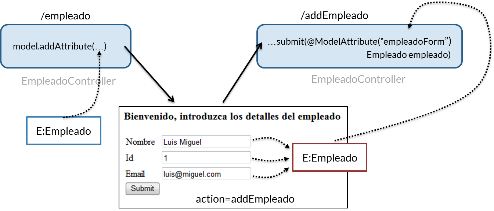

Como podemos comprobar, creamos una instancia de nuestro modelo, y se la pasamos al formulario, para que Spring pueda almacenar en ella los valores que se escriban en el formulario. Cuando se termina, dicha instancia, ya rellena de datos, se envía de nuevo al controlador, para que le podamos dar el tratamiento necesario.

## Validación 8:00 

[Validación](pdfs/19_Validación.pdf)

### 19.1 Introducción

Spring en general, y MVC en particular, incorporan el uso del estándar JRS-303 para validación de *beans*. Esta validación no solo se puede usar en el contexto de la utilización de formularios, sino que podría hacerse en cualquier parte de una aplicación, incluida la capa de acceso a datos.

### 19.2 Dependencias Maven necesarias

Para poder usar la validación, necesitamos enlazar tanto la librería del estandar como el motor de validación (usaremos el de Hibernate).

Las dependencias son las siguientes:

```java
        <!-- Validación -->
        <!-- https://mvnrepository.com/artifact/javax.validation/validation-api -->
        <dependency>
            <groupId>javax.validation</groupId>
            <artifactId>validation-api</artifactId>
            <version>1.1.0.Final</version>
        </dependency>
        <!-- https://mvnrepository.com/artifact/org.hibernate/hibernate-validator -->
        <dependency>
            <groupId>org.hibernate</groupId>
            <artifactId>hibernate-validator</artifactId>
            <version>5.3.1.Final</version>
        </dependency>
```        

### 19.3 Anotaciones disponibles para usar

La sintaxis completa de las anotaciones que podemos utilizar se puede consultar en la **especificación del estándar**. En particular, encontramos algunas bastante interesantes:

* @NotNull - Comprueba que el valor anotado no sea nulo. Por desgracia no comprueba cadenas vacías.

* @Pattern - Comprueba si una determinada cadena encaja con una expresión regular.

* @Past - El elemento anotado debe ser una fecha anterior a la actual

* @Min - El elemento anotado debe ser un número mayor o igual que el número especificado.

* @Max - El elemento anotado debe ser un número menor o igual que el número especificado.

* @NotBlank - Comprueba que la cadena anotada es no nula, y que la longitud de la misma (quitando los espacios en blanco al inicio y al final) es mayor que cero.

* @Email - Comprueba que la cadena introducida sea una dirección de email válida.

### 19.4 Uso de *properties* para los mensajes de error

Cuando el usuario no introduzca convenientemente un valor en el formulario, debe recibir un mensaje de error.

En JSP, podemos especificar esto a través del tag `form:errors`:

```java
    <form:errors path="atributo" cssClass="clase"></form:errors>
```

Podríamos hacer uso de componentes gráficos potentes, como los diálogos flotantes de bootstrap, para visualizar estos mensajes.

El texto que se visualice en el mismo puede ser definido en un fichero de properties. Esto aporta varias ventajas:

* Para modificar un mensaje de error, no tenemos que modificar el código, solo un fichero de texto.

* Todos los mensajes de error están ubicados en un solo fichero.

* Nos permite hacer una internacionalización de estos mensajes, para modificar el idioma de los mismos.

* …

Para hacer uso de un fichero de properties, tenemos que añadir un bean especial en nuestro fichero `dispatcher-servlet.xml`:

```java
<!-- Este bean nos permitirá usar properties -->
    <bean id="messageSource"
        class="org.springframework.context.support.ReloadableResourceBundleMessageSource">

        <property name="basename" value="/WEB-INF/messages" />

    </bean>
```

La sintaxis en el fichero de properties debe ser la siguiente

```java
ValidationAnnotation.objeto.atributo=Mensaje
```

Un ejemplo sería

```java
NotEmpty.empleadoForm.nombre=Por favor introduzca el nombre del empleado
Size.empleadoForm.nombre=El nombre de un empleado debe tener entre 3 y 30 caracteres
```

### 19.5 Cambios en el controlador

Para poder implementar la validación, tenemos que añadir algunos cambios en el controlador. Veamos el siguiente trozo de código:

```java
@RequestMapping(value = "/addEmpleado", method = RequestMethod.POST)
    public String submit(@Valid @ModelAttribute("empleadoForm") Empleado empleado,  
            BindingResult result, Model model) {

        if (result.hasErrors()) {
            return "form";
        } else {        
            model.addAttribute("empleado", empleado);
            return "view";
        }
    }
```

* El objeto que ya estaba anotado con `@ModelAttribute(...)` lo tenemos que anotar también con `@Valid`, para indicar que deseamos recibir un objeto válido.

* El siguiente parámetro en la firma del méotodo, obligatoriamente, debe ser un objeto de tipo `BindingResult`, que nos permitirá verificar si ha habido errores.

* En caso de haberlos, el mecanismo más sencillo es devolver al usuario al formulario, donde los errores de visualización serán mostrados.

## Introducción a Spring Data. Súbmodulos. 5:06 

[Introducción a Spring Data](pdfs/20_Introducción%20a%20JPA%20-%20Submódulos.pdf)

## Spring Data JPA. Configuración y dependencias. 6:45 

[Spring Data JPA. Configuración y dependencias](pdfs/21_Spring%20Data%20JPA.pdf)

### 21.1 Introducción

El framework Spring soporta la integración con varios ORMs: Hiberante, JPA (Java Persistence API), JDO (Java Data Objects) para la gestión de recursos, el acceso a los datos y las estrategias de transacciones.

Spring añade muchas características a la capa ORM subyacente que se utilice. Entre los beneficios de usar Spring están:

* Fácil testeo, a través del módulo de testeo de Spring.

* Excepciones comunes: cada ORM puede implementar su juego de excepciones en particular. Spring Data unifica el mismo.

* Gestión de recursos general: uso integrado de objetos `SessionFactory`, `EntityManagerFactory`, `DataSource`, …

* Gestión de transacciones integrada: se pueden gestionar las transacciones a través de anotaciones o de XML.

### 21.2 JPA, ¿qué es exactamente?

El Java Persistence API es un estándar de Java EE para la persistencia de datos. La versión 2.1 se encuentra definida en el estándar JSR338. Frente al maremagnum de ORM que han ido surgiendo en el mercado, JPA proporciona un estándar robusto para realiza el mapeo objeto-relacional y acceder a diferentes almacenes de datos.

### 21.3 Dependencias

Para el uso de Spring Data JPA tenemos que añadir las siguientes dependencias Maven:

```java
    <dependency>
      <groupId>javax.transaction</groupId>
      <artifactId>jta</artifactId>
      <version>1.1</version>
    </dependency>
    <dependency>
      <groupId>org.springframework.data</groupId>
      <artifactId>spring-data-jpa</artifactId>
      <version>1.10.5.RELEASE</version>
    </dependency>
```    

La primera, nos permitirá hacer uso de las transacciones, lo cual es necesario en JPA. La segunda, nos permitirá, de forma propiamente dicha, usar JPA.

En los diferentes ejemplos, utilizaremos como implementación subyacente de JPA el motor de ORM Hibernate. Y como base de datos, usaremos H2 (una base de datos que se puede embeber dentro de un proyecto, y que nos facilitará el uso de una base de datos relacional). Las dependencias a añadir son las siguientes:

```java
    <dependency>
      <groupId>org.hibernate</groupId>
      <artifactId>hibernate-core</artifactId>
      <version>5.1.0.Final</version>
    </dependency>
    <dependency>
        <groupId>org.hibernate</groupId>
        <artifactId>hibernate-entitymanager</artifactId>
        <version>5.1.0.Final</version>
    </dependency>
    <dependency>
      <groupId>com.h2database</groupId>
      <artifactId>h2</artifactId>
      <version>1.4.193</version>
    </dependency>
```    

Spring JPA, disponible en el paquete `org.springframework.orm.jpa` ofrece una manera fácil para el uso de JPA, y soporta varias formas de configuración. Vamos a proponer una que sea lo más sencilla posible.

### 21.4 Configuración

El fichero `dispatcher-servlet.xml`, que hasta ahora tenía unas pocas líneas de código, se va a ver engrosado con la definición de varios beans que necesitamos para usar Spring Data JPA.

* En primer lugar, tenemos que definir el origen de datos con el que vamos a trabajar; en nuestro caso, será una base de datos H2. El código para definir el bean es el siguiente:

```java
    <bean id="dataSource"
        class="org.springframework.jdbc.datasource.DriverManagerDataSource">
        <property name="driverClassName" value="org.h2.Driver" />
        <property name="url" value="jdbc:h2:./ejemplo" />
        <property name="username" value="sa" />
        <property name="password" value="" />
    </bean>
```

* En segundo lugar, tenemos que definir el adaptador de JPA a una implementación concreta. En nuestro caso, la implementación de JPA que usaremos será la de Hibernate. El código de configuración del bean es el siguiente:

```java
    <bean id="jpaVendorAdapter"
        class="org.springframework.orm.jpa.vendor.HibernateJpaVendorAdapter">
        <property name="showSql" value="true" />
        <property name="generateDdl" value="true" />
        <property name="database" value="H2" />
    </bean>
```    
    
* En tercer lugar, tenemos que configurar el `Entity Manager`. Este se construye sobre los dos beans anteriores; también tenemos que proporcionarle la ruta del paquete donde se definen las clases que serán almacenadas en la base de datos (las entidades, de las que hablaremos en la próxima lección)

```java
    <bean id="entityManagerFactory"
        class="org.springframework.orm.jpa.LocalContainerEntityManagerFactoryBean">
        <property name="dataSource" ref="dataSource" />
        <property name="jpaVendorAdapter" ref="jpaVendorAdapter" />
        <!-- spring based scanning for entity classes -->
        <property name="packagesToScan" value="com.openwebinars.springmvc.model" />
    </bean>
```

* Todo el ir y venir de información desde o hacia la base de datos se hace de forma transaccional. Para ello, tenemos que definir el gestor de transacciones, y además, indicar que estas transacciones podrán ser definidas mediante anotaciones. El código de configuración es el siguiente:

```java
    <!-- Configure the transaction manager bean -->
    <bean id="transactionManager" class="org.springframework.orm.jpa.JpaTransactionManager">
        <property name="entityManagerFactory" ref="entityManagerFactory" />
    </bean>

    <!-- Enable annotation driven transaction management -->
    <tx:annotation-driven />
```

* Por último, hay que indicar las clases que serán repositorios de datos. Sobre ellas abundaremos en las lecciones siguientes. El código de configuración es:

```java
    <jpa:repositories base-package="com.openwebinars.springmvc.repo"></jpa:repositories>
```

## Repositorios y entidades 7:40 

[Repositorios y entidades](pdfs/22_Repositorios%20y%20entidades.pdf)

### 22.1 Introducción

En el contexto de JPA en general, y de Spring Data Jpa, una entidad no es más que una clase java que será susceptible de ser gestionada por un *Entity Manager*, y por ende, de ser transformada de objeto a fila de una tabla de una base de datos relacional. A esta operación se le conoce como mapeo objeto-relacional.

Un repositorio es un bean especial que nos permitirá realizar una serie de operaciones con una entidad, como guardar una nueva, editar o eliminar una existente, o buscar de entre el almacén de esa entidad entre las que cumplan una determinada condición.

### 22.2 Entidades

Como decíamos antes una entidad no será otra cosa que la representación de una tabla de una base de datos en una clase; por ende, los objetos de esa clase, representarían las filas de esa tabla de una base de datos relacional.

Para que una clase Java sea tratada como entidad, tenemos que usar algunas anotaciones. Veamos un ejemplo:

```java
package com.openwebinars.springmvc.model;

import javax.persistence.Column;
import javax.persistence.Entity;
import javax.persistence.GeneratedValue;
import javax.persistence.GenerationType;
import javax.persistence.Id;
import javax.persistence.Table;

@Entity
@Table(name="STUDENT")
public class Student {


    @Id
    @GeneratedValue(strategy=GenerationType.AUTO)
    @Column(name="studentId")
    private long id;
    @Column
    private String first_name;
    @Column
    private String last_name;

    //Getters, setters, ...

}
```

Las anotaciones está definidas por JPA en el paquete `javax.persistence`. Las más usuales son:

* `@Entity`: nos permite indicar que esta clase debe ser tratada como una entidad

* `@Table(name=...)`: indica que esta entidad se mapea con una tabla en la base de datos subyacente. El nombre se indica como propiedad de la anotación.

* `@Id` y `@GeneratedValue`: indica que un determinado atributo de la clase es la clave primaria de la tabla subyacente, es decir, el atributo que identifica a cualquier objeto de esa clase.

 * `@GeneratedValue` nos dice que ese valor será autogenerado por la base de datos.

* `@Column`: nos permite indicar que un atributo de la clase será tratado como una columna de la base de datos.

### 22.3 Repositorios

Cómo decíamos en la introducción, un repositorio será un bean que nos permitirá realizar diversas operaciones con las entidades.

En Spring Data existe una gran jerarquía de repositorios:


Solo vamos a entrar en detalle en el último, ya que incluye las funcionalidades de los anteriores.

Para usar este repositorio, tan solo tenemos que extenderlo, creando una interfaz para gestionar una determinada entidad:

```java
package com.openwebinars.springmvc.repo;

import org.springframework.data.jpa.repository.JpaRepository;
import org.springframework.stereotype.Repository;

import com.openwebinars.springmvc.model.Student;

@Repository
public interface StudentRepository extends JpaRepository<Student, Long>{

}
```

Como podemos comprobar, el código anterior es muy simple. Tan solo destaca:

* El interfaz queda anotado con `@Repository`. Es un estereotipo de Spring y sirve para que, posteriormente, el bean pueda ser escaneado como repositorio, y usado en cualquier otra clase (por ejemplo, un controlador).

* A la hora de extender la interfaz, hay que incluir dos clases:

   * `Student`, el tipo de entidad que va a ser gestionada

   * El tipo de dato del atributo que esté marcado como `@Id` en dicha clase.
   
### 22.4 Uso de repositorios y entidades

Para usar un repositorio, tan solo tenemos que inyectarlo e invocar alguno de sus métodos. Veamos un ejemplo en un controlador:

```java
@Controller
public class StudentController {

    @Autowired
    private StudentRepository studentRepository;

    //resto del código
}
```

Para realizar alguna operación concreta, como listar o salvar, tan solo tenemos que invocar el método adecuado:

```java
    //...

    @RequestMapping(value = "/list", method = RequestMethod.GET) 
    public String listStudents(Model model){

        model.addAttribute("listaEstudiantes", studentRepository.findAll());

        return "list";
    }

    //....

    @RequestMapping(value = "/addStudent", method = RequestMethod.POST)
    public String submit(@ModelAttribute("studentForm") Student student,  Model model) {

        studentRepository.save(student);
        return "redirect:/list";
    }

    //...
```    

En las próximas lecciones veremos que operaciones podemos con un repositorio y como podemos extenderlo fácilmente.


## Consultas básicas 10:48 

[Consultas básicas](pdfs/23_Consultas%20básicas.pdf)

### 23.1 Introducción

Muchos ORM, si bien facilitan el trabajo de acceso a una base de datos relacional, necesitan de múcho código muy similar para la generación de diferentes consultas a la base de datos, que vayan más allá de obtener todos los registros de un mismo tipo, o uno en particular. Vamos a comprobar como Spring Data JPA es muy potente, y tan solo con ser cuidadosos en la definición de la *firma* de los métodos de búsqueda, será capaz de implementar el código por sí mismo.

### 23.2 Creación de consultas

Por defecto, cualquier repositorio que creemos, y que herede de `JpaRepository<T, ID>`, tendrá por defecto algunos métodos de búsqueda; pero ¿y si queremos implementar alguno más específico? Tendremos que añadir algunos métodos más a nuestro repositorio.

El mecanismo de construcción de consultas de Spring Data procesará el nombre de los métodos que añadamos a nuestro repositorio, para construir consultas. En particular, eliminará los prefijos `find...By`, `read...By`, `query...By`, y `get...By` del nombre del método, y procesará el resto.

Veamos un ejemplo a continuación:

```java
@Repository
public interface StudentRepository extends JpaRepository<Student, Long>{

    /* Realizar la búsqueda en base al nombre */
    public List<Student> findByFirstName(String firstName);

    //resto del código

}
```

Spring se encarga de escanear, y procesar el nombre del método, de manera que:

* Elimina el prefijo `findBy`

* Procesa el resto, comprendiendo que queremos buscar entidades `Student` que tengan un determinado `FirstName` (que es una propiedad del bean `Student`).

El nombre del método actuará a modo de cláusula `WHERE` en una sentencia `SELECT` de SQL.

Se pueden combinar varias restricciones añadiendo al nombre del método `And` y `Or`. También se puede añadir una ordenación diferente a la por defecto, añadiendo al final del nombre del método `...OrderByXXXXXXXAsc` o `...OrderByXXXXXXXDesc` y el nombre del atributo sobre el que vamos a ordenar.

```java
@Repository
public interface StudentRepository extends JpaRepository<Student, Long>{

    /* Realizar la búsqueda en base al nombre */
    public List<Student> findByFirstName(String firstName);

    /* Realizar la búsqueda en base al apellido */
    public List<Student> findByLastName(String lastName);

    /* Realizar la búsqueda en base al nombre y el apellido */
    public List<Student> findByFirstNameAndLastName(String firstName, String lastName);

    /* Realizar la búsqueda en base al nombre y el apellido, y ordenar los resultados descendentemente por apellido  */
    public List<Student> findByFirstNameAndLastNameOrderByLastNameDesc(String firstName, String lastName);

}
```

La pregunta es: **¿no tenemos que darle cuerpo a esos métodos de búsqueda?** La respuesta es que NO. Spring Data se encarga de construirlos, descargándonos de mucho trabajo.


## Persistiendo entidades 6:16 

[Persistiendo entidades](pdfs/24_Persistiendo%20entidades.pdf)

### 24.1 Introducción

La persistencia de entidades con Spring Data es muy sencilla. Los diferentes repositorios, en particular `JpaRepository`, implementan los métodos necesarios para crear o editar entidades, y también para eliminarlas.

### 24.2 Almacenar una nueva instancia de una entidad

El proceso de almacenamiento de una nueva entidad es el más sencillo de todos. Si tenemos definido un repositorio como el del ejemplo:

```java
@Repository
public interface StudentRepository extends JpaRepository<Student, Long>{

    //Resto del código

}
```

Tan solo tendremos que invocar al método `save(...)` del mismo para que Spring JPA se encargue de almacenar la instancia de la clase Student en la base de datos, como por ejemplo en este controlador:

```java
@Controller
public class StudentController {

    //resto del código

    @RequestMapping(value = "/addStudent", method = RequestMethod.POST)
    public String submit(@ModelAttribute("studentForm") Student student,  Model model) {

        studentRepository.save(student);
        return "redirect:/list";
    }

    //resto del código
}
```

### 24.3 Editar una instancia de una entidad

Para editar una entidad, lo primero que debemos hacer es añadir los métodos `equals` y `hashCode` a nuestra clase entidad. Spring Tool Suite puede autogenerarlos si lo deseamos, a traves del menú *Source > Generate hashCode() and equals()*

Para poder editar una entidad, primero tenemos que localizarla (por ejemplo, con el método `findOne(...)`), cambiar alguno de sus valores, y almacenarla. Podemos ver el código a continuación:

```java
    @RequestMapping(value = "/edit/{id}", method = RequestMethod.GET)
    public String showFormEdit(@PathVariable("id") Long id, Model model) {

        Student student = studentRepository.findOne(id);
        model.addAttribute("studentForm", student);
        model.addAttribute("op", "edit");

        return "form";
    }
```

Este método controlador recoge el Id de la entidad que queremos modificar desde la URL. Suele ser una de las opciones más comunes. A través de este Id, podemos encontrar facilmente la entidad, ya que es su clave primaria.

Para editarla, lo más comun en las aplicaciones Spring MVC es hacerlo a través de un formulario. En el mismo, tenemos que incluir, entre los campos a modificar el Id (a diferencia de cuando creamos uno nuevo). Para que el usuario no modifique manualmente este Id, lo cargaremos como un campo oculto (*hidden*):

```java
<form:form method="POST" action="${not empty op ? '../edit' : 'addStudent'}" modelAttribute="studentForm">
    <form:hidden path="id"/>
    <!-- Resto del formulario -->
</form:form>
```

De esta forma, el dato pasa del controlador al formulario, y volverá al controlador cuando pulsemos el botón de enviar.

Por último, el código de modificación sería el siguiente:

```java
    @RequestMapping(value = "/edit", method = RequestMethod.POST)
    public String submitEdit(@ModelAttribute("studentForm") Student student,  Model model) {

        studentRepository.save(student);
        return "redirect:/list";
    }
```

Pero, ¡si es el mismo método que para guardar! Efectivamente, Spring Data JPA utiliza el mismo, ya que es capaz de diferenciar de si la entidad no existe, y tiene que crearla; o si existe, y lo que debe hacer es editarla.

### 24.4 Eliminar una instancia de entidad

Elimnar una entidad es un proceso fácil, ya que el interfaz `JpaRepository` nos provee de algunos métodos, en particular `delete(...)`, con varias firmas. A continuación podemos ver un ejemplo:

```java
    @RequestMapping(value = "/delete/{id}", method = RequestMethod.GET)
    public String delete(@PathVariable("id") Long id, Model model) {

        studentRepository.delete(id);

        return "redirect:/list";
    }
```    

En este caso, usamos la implementación que nos permite eliminar una instancia de entidad a partir de su Id (clave primaria).

## Consultas avanzadas 9:01 

[Consultas avanzadas](pdfs/Consultas_avanzadas.pdf)

### 25.1 Introducción

La capacidad de creación de consultas que tiene Spring Data JPA es muy amplio. En lecciones anteriores hemos visto como usar una pequeña parte. En esta lecciones profundizaremos en la creación de consultas de diferentes formas, incluidas las consultas nativas.

### 25.2 Creación de consultas en base al nombre

Este método, que ya estudiamos en la lección 23, permitía crear una consulta con tan solo ser cuidadoso en la definición del nombre del método:

Por ejemplo:

```java
public interface UserRepository extends Repository<User, Long> {

  List<User> findByEmailAddressAndLastname(String emailAddress, String lastname);
}
```

Esta consulta nos permitiría localizar usuarios en base a su correo electrónico y sus apellidos.

La lista de palabras que podemos utilizar es muy amplia:

Palabra | Ejemplo | JPQL
--------|---------|-----
And | findByLastnameAndFirstname | … where x.lastname = ?1 and x.firstname = ?2
Or | findByLastnameOrFirstname | … where x.lastname = ?1 or x.firstname = ?2
Is,Equals | findByFirstname,findByFirstnameIs,findByFirstnameEquals	| … where x.firstname = ?1
Between | findByStartDateBetween | … where x.startDate between ?1 and ?2
LessThan | findByAgeLessThan | … where x.age < ?1
LessThanEqual | findByAgeLessThanEqual | … where x.age <= ?1
GreaterThan | findByAgeGreaterThan | … where x.age > ?1
GreaterThanEqual | findByAgeGreaterThanEqual | … where x.age >= ?1
After | findByStartDateAfter | … where x.startDate > ?1

El resto de la tabla la podemos encontrar en la documentación oficial de **Spring Data**

### 25.3 JPQL

JPQL es un lenguaje de consulta, de estructura similar a SQL, pero orientado a objetos, y que nos permite definir consultas sobre un *Entity Manager*. De facto, es el lenguaje de consulta que podemos utilizar desde nuestra aplicación. para consultar las entidades almacenadas en nuestra base de datos realacional

#### 25.3.1 *Named Queries*

En ocasiones, tendremos la necesidad de definir una o varias consultas que usaremos en más de un lugar a lo largo de nuestra aplicación. Si bien, una manera de hacer esto sería al estilo del apartado 25.2, es posible que no podamos usar el mismo porque:

* Venimos del mundo SQL y nos sentimos más cómodos escribiendo una consulta

* La consulta es muy específica y no podemos construirla con el procesamiento automático de Spring Data

* Queremos usar SQL nativo

* …

Una consulta con nombre (*named query*) será una consulta JPQL que definiremos junto con la entidad, y que podremos utilizar posteriormente.

La forma de definir esta consulta es la siguiente:

```java
@Entity
@NamedQuery(name = "Student.findById", query = "select s from Student s where s.id = ?1")
@Table(name="STUDENT")
public class Student {

    //resto del código de la clase    

}
```

Para invocar la consulta, tan solo tenemos que añadir un nuevo método en nuestro repositorio:

```java
@Repository
public interface StudentRepository extends JpaRepository<Student, Long>{

    //resto del código    

    /*
     * CONSULTAS AVANZADAS
     */

    /* Realizar la búsqueda en base al id */
    public Student findById(Long id);

}
```

Spring Data resolverá, en base al nombre de este método, que debe usar la consulta con nombre para ejecutarlo.

#### 25.3.2 Uso de `@Query`

El uso de consultas con nombre es una buena aproximación cuando trabajamos con un pequeño número de consultas. Si este número crece, una mejor aproxiamción es el uso de la anotación `@Query`. Esta nos va a permitir definir la consulta JPQL dentro del repositorio, y asociada al método que lo va a ejecutar.

Por ejemplo, el método anterior, pero definido con JPQL sería así:

```java
@Repository
public interface StudentRepository extends JpaRepository<Student, Long>{

    //resto del código    

    /*
     * CONSULTAS AVANZADAS
     */

    /* Realizar la búsqueda en base al id */
    @Query("select s from Student s where s.id = ?1")
    public Student findById(Long id);

}
```

##### 25.3.2.1 Uso de LIKE con `@Query`

Este tipo de consultas nos permite en el uso del operador `LIKE`, para verificar si una columna coincide con un patrón. Por ejemplo, si quisiéramos comprobar si un valor comienza con la cadena de caracteres que le proporcionamos, podríamos hacer uso de `LIKE` y el operador `%`:

```java
@Repository
public interface StudentRepository extends JpaRepository<Student, Long>{

    //resto del código    

    /*
     * CONSULTAS AVANZADAS
     */

    //resto del código 

    /* Realizar la búsqueda si el apellido comienza con una cadena */
    @Query("select s from Student s where s.lastName = ?1%")
    public List<Student> findByLastNameStartsWith(String lastName);

}
```

##### 25.3.2.2 Consultas nativas

La anotación `@Query` nos permite también el uso de consultas nativas SQL, incluyendo la propiedad `nativeQuery=true`.

Un ejemplo de consulta nativa sería el siguiente:

```java
@Repository
public interface StudentRepository extends JpaRepository<Student, Long>{

    //resto del código    

    /*
     * CONSULTAS AVANZADAS
     */

    //resto del código 

    /* Realizar la búsqueda si coincide el nombre */
    @Query("SELECT * FROM STUDENTS WHERE FIRST_NAME = ?1", nativeQuery = true)
    public List<Student> findByFirstName(String firstName);

}
```

#### 25.3.3 Uso de parámetros con nombre

En todos los ejemplos anteriores, los parámetros a incluir dentro de las consultas han sido definidos con un índice (por ejemplo `?1`). Sin embargo, hay ocasiones donde es más clarificador usar un nombre para los mismos:

```java
@Repository
public interface StudentRepository extends JpaRepository<Student, Long>{

    //resto del código    

    /*
     * CONSULTAS AVANZADAS
     */

    //resto del código 

    /* Realizar la búsqueda si coincide el nombre y el apellido */
    @Query("select s from Student s where s.firstName = :firstname or u.lastname = :lastname")
    public List<Student> findByFirstNameOrLastName(
            @Param("firstname") String firstName, 
            @Param("firstname") String lastName);

}
```

Como podemos comprobar, hemos sustituido los parámetros con índice por una cadena de caracteres, que lleva como prefijo dos puntos (`:firstname`). Esto hace que JPQL intreprete que debe ser sustituido por un parámetro. Para hacer uso de este parámetro dentro del método, usamos la anotación `@Param`, mediante la cual asignamos el parámetro a uno de los valores que se proporcionan al método.

#### 25.3.3 Uso de consultas de modificación

Todas las secciones anteriores nos mostraban como realizar consultas que solamente recuperan datos. Para crear una consulta que nos permita modificarlos, tenemos que añadir la anotación `@Modifiying`. Esto nos permitirá elaborar una consulta JPQL con la que poder añadir, modificar o eliminar datos. Un ejemplo de consulta de modificación sería la siguiente:

```java
@Repository
public interface StudentRepository extends JpaRepository<Student, Long>{

    //resto del código    

    /*
     * CONSULTAS AVANZADAS
     */

    //resto del código 

    /* Actualizar el nombre y el apellido */
    @Modifying
    @Query("update Student s set s.firstName = ?1, s.lastName = ?2 where s.id = ?3")
    int setFirstNameAndLastNameFor(String firstname, String lastname, Long id);

}
```

Para que esta consulta se ejecute en un context transaccional (es decir, para no tener que ocuparnos nosotros del manejo de las transacciones), tenemos que anotar con `@Transactional` el método controlador que invoque a esta consulta:

```java
    @RequestMapping(value = "/edit", method = RequestMethod.POST)
    @Transactional
    public String submitEdit(@ModelAttribute("studentForm") Student student,  Model model) {

        studentRepository.setFirstNameAndLastNameFor(student.getFirstName(), student.getLastName(), student.getId());
        return "redirect:/list";
    }
```

## Contenido adicional 13   

[Una palabra sobre patrones de diseño](pdfs/11_patrones%20de%20diseo.pdf)

[Otra palabra sobre HTTP](pdfs/12_Una%20palabra%20sobre%20HTTP.pdf)

[Controladores y Vistas](pdfs/14_Controladores%20y%20vistas.pdf)

[Mapeo de URLs](pdfs/15_Mapeo%20de%20URLs.pdf)

[Elección de la vista: ViewResolver](pdfs/17_Elección%20de%20vista.%20ViewResolver.pdf)

[Formularios](pdfs/18_Formularios.pdf)

[Validación](pdfs/19_Validación.pdf)

[Introducción a Spring Data](pdfs/20_Introducción%20a%20JPA%20-%20Submódulos.pdf)

[Spring Data JPA. Configuración y dependencias](pdfs/21_Spring%20Data%20JPA.pdf)

[Repositorios y entidades](pdfs/22_Repositorios%20y%20entidades.pdf)

[Consultas básicas](pdfs/23_Consultas%20básicas.pdf)

[Persistiendo entidades](pdfs/24_Persistiendo%20entidades.pdf)

[Consultas avanzadas](pdfs/Consultas_avanzadas.pdf)
