# 3. Spring Boot: haz mi vida más fácil 69m
   * Tareas a la hora de desarrollar un proyecto Spring 5:22 
   * Introducción a Spring Boot 7:04 
   * Convención sobre Configuración 3:40 
   * Nuestro primer proyecto con Spring Initializr 5:45 
   * Anotaciones 2:19 
   * Uso del asistente de STS (Spring Tool Suite) 5:21 
   * Ejecutando nuestra aplicación 3:43 
   * Empaquetando nuestra aplicación en un jar independiente 5:13 
   * Starters POMs y el Asistente de STS 4:04 
   * Customización de propiedades 8:00 
   * Configuración de una aplicación MVC 7:22 
   * Spring Boot CLI (command line interface) 11:10 
   * Contenido adicional 4
   
## Tareas a la hora de desarrollar un proyecto Spring 5:22 
 
[Tareas a la hora de desarrollar un proyecto Spring](pdfs/26_Tareas%20proyecto%20Spring.pdf)

### 26.1 Introducción

Más de veinte lecciones después de comenzar el curso, estamos en disposición de decir que estamos *duchos* en este framework. Si miramos hacia atrás, veremos que somos capaces de construir un proyecto para el desarrollo de una aplicación web que consulta una base de datos relacional embebida dentro de nuestro proyecto. Pero, ¿qué tareas de *soporte* hemos venido desarrollando manualmente hasta ahora?

### 26.2 Tareas necesarias a la hora de desarrollar un proyecto Spring

Si bien en ocasiones hemos utilizado como plantilla un proyecto anterior, la creación de un proyecto Spring nos ha conllevado algunas o todas las siguientes tareas:

* Definir un proyecto en Spring Tool Suite: Dependiendo del tipo de aplicación que quisiéramos realizar, un proyecto Java o Web.

* Convertir el proyecto en un proyecto Maven: que nos permitiera el uso del gestor de dependencias, entre otros elementos.

* Conocer las dependencias de los módulos que íbamos a utilizar, así como la mejor versión de los mismos.

* Configurar algunas carpetas, como la de recursos; los ficheros de propiedades del log, etc…

* Definir algunos elementos en el fichero de configuración de beans, como el uso de etiquetas para MVC.

* Definir algunos beans complejos, como la configuración para el uso de Spring Data

* ….

Como podemos observar, la cantidad de tareas es grande. Y si nos cronometráramos para medir el tiempo de todas estas tareas, veríamos que estamos invirtiendo mucho en algunas cosas que seguramente podrían estar automatizádas, dejándonos tiempo a nosotros para poder implementar nuestra aplicación.

Spring Boot viene a nuestro rescate, permitiéndonos realizar las tareas que indicamos en el listado anterior y muchas más, de una forma fácil e intuitiva para el programador.
 
## Introducción a Spring Boot 7:04 

### 27.1 ¿Qué es Spring Boot?

Como hemos podido comprobar, Spring tiene una amplia cantidad de módulos que implican multitud de configuraciones. Estas configuraciones pueden tomar mucha tiempo, pueden ser desconocidas para principiantes y, sobre todo, suelen ser repetitivas. La solución a todos estos inconvenientes es *Spring Boot*, que aplica el concepto de *Convention over Configuration* (CoC).

***Convención sobre configuración***
*Convención sobre Configuración, también conocido como CoC es un paradigma de programación de software que busca minimizar el número de decisiones que un desarrollador necesita hacer, ganando así en simplicidad pero no perdiendo flexibilidad por ello.
Fuente: **Wikipedia***

La Convención sobre Configuración es un paradigma que minimiza las decisiones que tienen que tomar los desarrolladores, simplificando así las tareas a realizar. Con todo, no se pierde la flexibilidad, ya que aunque existen unos valores por defecto, siempre podemos configurar de forma *extendida*. De esta manera, podemos evitar muchas de las tareas repetitivas de un proyecto.

### 27.2 ¿Cómo comenzar a utilizar Spring Boot?

Para comenzar a usar Spring Boot necesitamos un proyecto Maven, al que le indicaremos que herede de una de las plantillas de Spring Boot.

```java
<parent>
    <groupId>org.springframework.boot</groupId>
    <artifactId>spring-boot-starter-parent</artifactId>
    <version>1.4.2.RELEASE</version>
</parent>
<dependencies>
    <dependency>
        <groupId>org.springframework.boot</groupId>
        <artifactId>spring-boot-starter-web</artifactId>
    </dependency>
</dependencies>
```

*Podemos copiar este fragmento de código, actualizado a la última versión, desde la web de **Spring Boot***

Con las etiquetas `<parent></parent>` indicamos que nuestro fichero POM hereda del de Spring Boot. La dependencia `spring-boot-starter-web` es necesaria para poder empezar con un proyecto web; a medida que crezca el proyecto serán necesarias algunas más.

Si queremos modificar la configuración por defecto, normalmente podremos añadir el fichero `application.properties` en la carpeta src/main/resources del proyecto.

Para la configuración avanzada, tenemos que añadir componentes que sustituirán a los de autoconfiguración.

### 27.3 Primer ejemplo

Para terminar con un primer ejemplo, y comprobar la potencia de Spring Boot y lo que tenemos por delante para aprender, podemos ver el siguiente código:

```java
package com.openwebinars.springboot;


import org.springframework.boot.*;
import org.springframework.boot.autoconfigure.*;
import org.springframework.stereotype.*;
import org.springframework.web.bind.annotation.*;

@Controller
@EnableAutoConfiguration
public class SampleController {

    @RequestMapping("/")
    @ResponseBody
    String home() {
        return "Hello World!";
    }

    public static void main(String[] args) throws Exception {
        SpringApplication.run(SampleController.class, args);
    }
}
```

Si lo ejecutamos, podremos comprobar como hemos creado una aplicación Spring MVC en muchísimo menos tiempo.
 
## Convención sobre Configuración 3:40 
 
[Convención sobre Configuración](pdfs/28_Convención%20sobre%20configuración.pdf)

### 28.1 Introducción

La **convención sobre configuración** es un paradigma muy sencillo que se usa principalmente en programación. Significa que el entorno en el que trabajamos (sistemas, librerías, idioma, …) asume muchas situaciones lógicas por defecto; y si nosotros las tomamos como tal en lugar de tener que explicitarlas cada vez, la programación se vuelve una tarea más sencilla y productiva, pudiendo poner el foco en lo importante.

La meta es decrementar el número de decisiones que el programador debe tomar y eliminar la complejidad de tener que configurar todas y cada una de las áreas en el desarrollo de una aplicación. El resultado inmediato es que se pueden crear más cosas en menos tiempo.

Algunos entornos de programación altamente productivos, como Ruby on Rails, Groovy on Grails o similar utilizan este concepto. Si sigues las convenciones establecidas, se puede desarrollar una aplicación Ruby o Groovy en mucho menos tiempo y con tan solo unas pocas líneas de código.

Por otro lado, si queremos ignorar las convenciones, podemos escribir el código de configuración nosotros mismos. Aun así, las convenciones no son arbitrarias y han sido desarrolladas por una comunidad de programadores de alto nivel, por lo que rara vez tendremos la sensación de necesitar invertir nuestro tiempo en modificarlas.

De hecho, el concepto de *convención sobre configuración* es, de alguna manera, una forma básica de entender cualquier trabajo estructurado, y que incluso utilizan algunas metodologías de productividad en el trabajo como GTD (Getting Things Done).

### 28.2 Convención sobre configuración en Spring

Spring Boot nos va a permitir tener definidas una serie de configuraciones por defecto que serán muy útiles. Aunque las vamos a ir aprendiendo en los siguientes apartados, podemos echar un vistazo a dos de los tres pilares de un proyecto Spring MVC: controladores y modelos.

Por ejemplo, el uso de uno de los componentes de Spring Boot nos permitirá no tener que definir el mapeo de URLs con un controlador específico, obteniendo estas de la url, de forma que:

* `WelcomeController` se mapearía con cualquier petición a `/welcome*`

* `HomeController` se mapearía con cualquier petición a `/home*`

* `RegisterController` se mapearía con cualquier petición a `/register*`

Si se sigue la convención de nombre el controlador como `XXXXXController`, la clase correspondiente nos evita la tediosa tarea de definir y mantener una lista potencialmente larga de URLs mapeadas.

En el caso del modelo, podemos añadir objetos o colecciones de los mismos a un modelo sin necesidad de darle un nombre, ya que Spring generará automáticamente un nombre (una clave) para los mismos. La estrategia para la generación de este nombre es la convención sobre configuración. Si queremos evitar este nombre por defecto, podemos proporcionarle nosotros uno explícitamente:

```java
@Controller
public class TheController {

    @GetMapping("/")
    public String controllerMethod(Model model) {

        model.addAttribute(new MyObject1());
        model.addAttribute("name", new MyObject2());

        return "view";
    }
}
```

## Nuestro primer proyecto con Spring Initializr 5:45 

### 29.1 Introducción

**Spring Initializr** es un servicio ofrecido por Spring mediante el cual podemos generar rápidamente, y desde una web, un proyecto Spring con todos los elementos necesarios. Es altamente configurable y muy efectivo, y como resultado obtenemos un fichero zip que podemos descargar y, cuyo contenido, es un proyecto listo para comenzar.

### 29.2 Generación de un proyecto Spring Boot con Spring Initializr

Para generar un nuevo proyecto tan solo tenemos que entrar en http://start.spring.io/ e introducir los datos necesarios.

En nuestro caso, para generar un proyecto sencillo, tan solo tendríamos que introducir:

* Tipo de proyecto: Maven Project

* Versión de Spring Boot: la actual (1.4.2)

* Group: com.openwebinars.springboot

* Artifact: el nombre del proyecto (por ejemplo, InitializrDemo)

* Dependencies: escribimos aquellas que necesitemos. Para un proyecto web sencillo, podemos escribir `Web`.

Con estos elementos, ya podemos generar el proyecto, pulsando sobre el botón correspondiente.

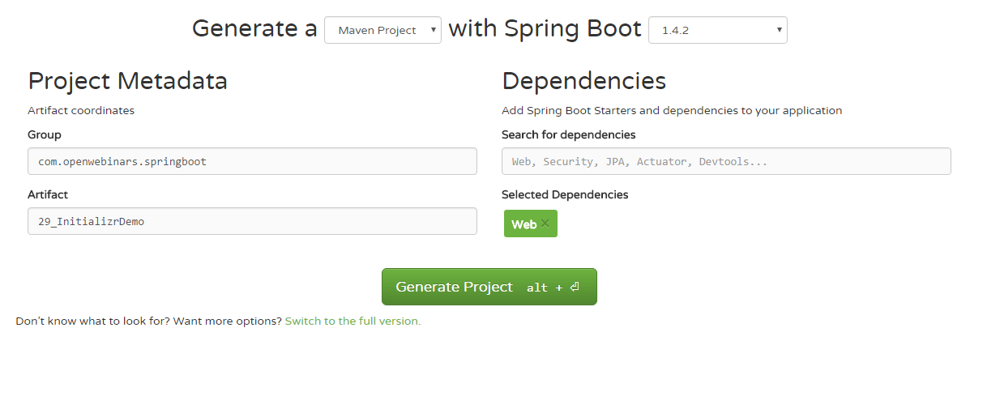

### 29.3 Importación del proyecto en STS

Esta carcasa de proyecto que nos hemos descargado puede ser importada desde Spring Tool Suite. En este caso, tenemos que indicarle que el tipo de proyecto que estamos importando es un proyecto Maven.

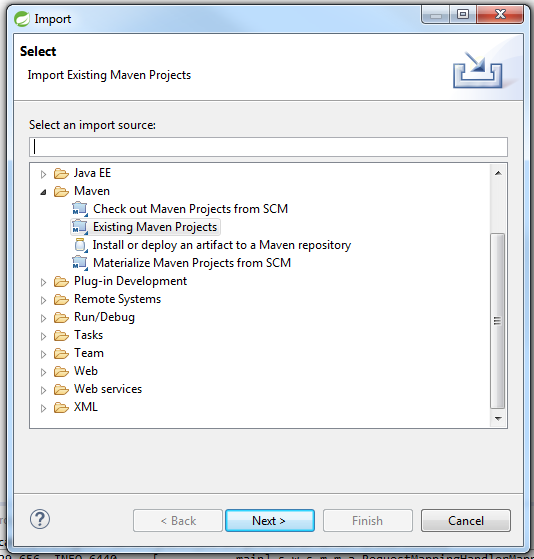
 
## Anotaciones 2:19 
 
[Anotaciones](pdfs/30_Anotaciones.pdf)

### 30.1 Introducción

Spring Boot incorpora una serie de nuevas anotaciones que nos ayudarán sobre todo a simplificar el trabajo de configuración. Veamos todo lo que podemos hacer.

### 30.2 Anotación `@SpringBootApplication`

La anotación `@SpringBootApplication` habilita a Spring para escanear componentes y para configurar los mismos. De hecho, la anotación `@SpringBootApplication` combina otras tres anotaciones:

* `@Configuration` (anotación de Spring): designa una clase como clase de configuración, para realizar este proceso basado en Java (en lugar de hacerlo con XML). Aunque no hay una opción mejor, los usuarios de Spring Boot suelen realizar la configuración basándose en Java en lugar de XML.

* `@ComponentScan` (anotación de Spring): habilita el escaneo de componentes, de forma que los controladores u otras clases serán automáticamente descubiertas y registradas como beans en el contenedor de dependencias.

* `@EnableAutoConfiguration` (anotación de Spring Boot): esta pequeña anotación podría llamarse `@Magia`, ya que es la línea de configuración que hace que Spring Boot se autoconfigure. Esta anotación nos evita de realizar múltiples operaciones de configuración por nuestra cuenta.

### 30.3 Configuración para poder usar JSP en la vista

Por defecto, los proyectos que nos descarguemos desde Spring Initializr no vienen preparados para trabajar con JSP tal cual hemos estado trabajando hasta ahora, si bien la configuración que hay que hacer es muy poca. Los pasos a seguir son:

* Añadir algunas dependencias que hacen falta:

```java
<dependency>
  <groupId>org.apache.tomcat.embed</groupId>
  <artifactId>tomcat-embed-jasper</artifactId>
</dependency>
<dependency>
  <groupId>javax.servlet</groupId>
  <artifactId>jstl</artifactId>
</dependency>
```

* Configurar, en el fichero de properties, el prefijo y sufijo para la vista. Esta operación ya la realizábamos antes en el fichero de configuración de beans.

**application.properties**

```java
spring.mvc.view.prefix=/WEB-INF/jsp/
spring.mvc.view.suffix=.jsp
```

* Crear la carpeta donde van a alojarse los ficheros JSP. Esta debe estar, por fuerza (por la definición del estándar de JSP) dentro de WEB-INF, así que la podemos crear en la ruta `src/main/webapp/WEB-INF/jsp`

De esta forma, nuestro proyecto de Spring Boot está listo para usar JSP tal y como lo hemos venido usando.
 
## Uso del asistente de STS (Spring Tool Suite) 5:21 

### 31.1 *Spring Starter Project*

El entorno de desarrollo *Spring Tool Suite* incorpora un asistente para la creación de proyectos, de forma que si es nuestro IDE, no tenemos la obligación de utilizar el servicio *Spring Initializr*.

La opción de menú para crear un nuevo proyecto se encuentre en *File > New > Spring Starter Project*. Si pulsamos sobre él, entraremos en un asistente donde podemos definir los elementos del proyecto, así como los diferentes módulos de Spring que vamos a usar.

Como ejemplo, podemos crear un proyecto y copiar el código desarrollado en algunas de las lecciones de JPA (por ejemplo, la número 22)

## Ejecutando nuestra aplicación 3:43 

### 32.1 Introducción

En Spring Boot tenemos varias formas de ejecutar nuestra aplicación. Es viene motivado por algunas razones:

* Aunque ya lo hemos podido comprobar anteriormente, los proyectos de Spring Boot no de despligan en Tomcat, sino que le dan la vuelta a esta situación y son ellos los que llevan un servidor embebido. Esto nos da muchas facilidades a la hora de ejecutar una aplicación.

* El fichero que se genera a partir de un proyecto Spring Boot, por defecto, no es un fichero .WAR (Web Application Archive) sino un .JAR (Java Application Archive). Esto nos permitirá incluso lanzar nuestra aplicación desde la línea de comandos con solo unos pocos parámetros, frente a los .WAR que suelen llevar un mecanismo de *deploy* algo más complejo.


### 32.2 Ejecución a través del IDE

Es la forma más sencilla que tenemos de ejecutar nuestro proyecto. Tan solo tenemos que hacer click derecho con el ratón sobre el proyecto, y escoger, o bien la opción *Java Application* o la opción *Spring Boot App*. Esta segunda es algo más recomendable.

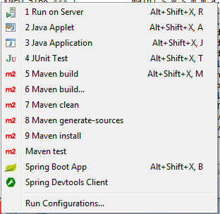

Esto provocará que se lance la aplicación, como podemos ver en la consola:

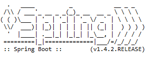

### 32.3 Ejecución a través de Maven

Maven también nos permitirá lanzar nuestra aplicación, a través del *goal* `spring-boot:run` definido por el asistente de Spring Tool Suite.

Como muchos usuarios no tendrán la interfaz mediante línea de comandos de maven, se puede lanzar también desde el IDE. Para ello, tenemos que crear una nueva Configuración de Ejecución en el menú *Run As > Run Configurations*:

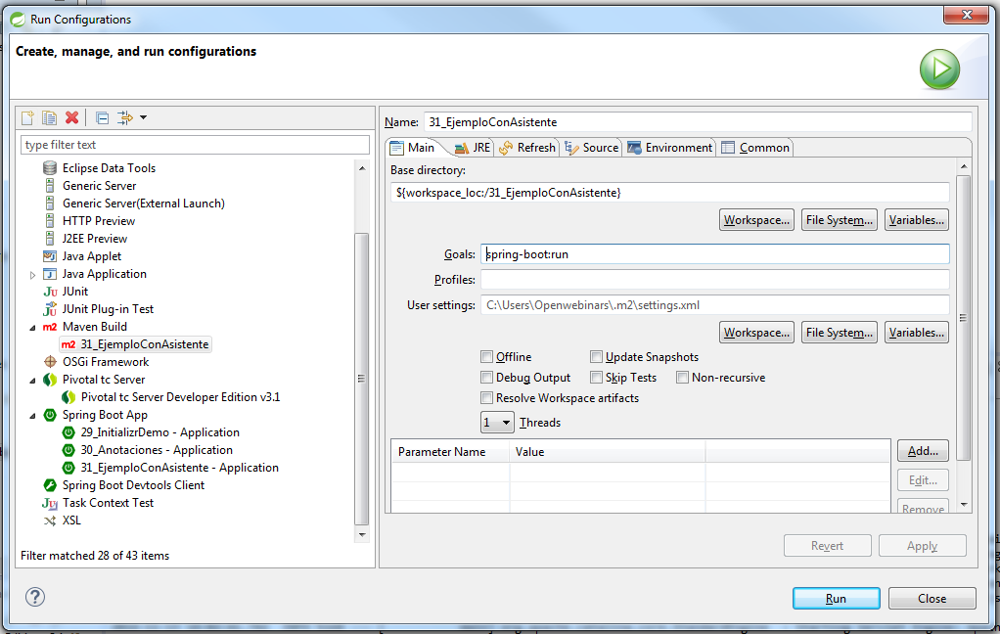

Esta ejecución tardará algo más en lanzarse, ya que probablemente se descargue explícitamente todas las dependencias que el proyecto necesita:

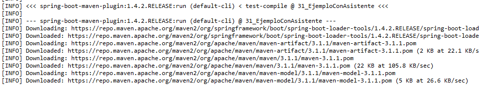

Una vez finalizado el proceso, también se ejecutará la app con normalidad.

## Empaquetando nuestra aplicación en un jar independiente 5:13 

### 33.1 Empaquetando un JAR

Un archivo JAR es un archivo que permite contener y ejecutar aplicaciones Java. Las siglas están escogidas para que coincida con la palabra inglesa “jar” (tarro). Estos ficheros están comprimidos con formato ZIP.

Normalmente, un fichero JAR ejecutable debe contener todo el *bytecode* de la aplicación, las librerías, recursos, etc… que vaya a utilizar. Para que sea ejecutable, debe incluir un manifiesto, con una entrada que indique qué clase es el punto de entrada.

Para ejecutarlo, lo más común es hacerlo desde la línea de comandos

```java
java -jar foo.jar
```

Existen muchas formas de construir un fichero Jar, en particular, usando algunos IDEs como Eclipse.

Nosotros vamos a jugar con la ventaja de que trabajamos con Maven, ya que él se encargará de realizar el trabajo por nosotros.

### 33.2 Ejemplo

En este caso, vamos a construir un JAR a partir de una de las aplicaciones de ejemplo de Spring. Para ello, tendremos que pulsar en *File > New > Import Spring Getting Started Content*.

En particular, vamos a trabajar con el proyecto, Rest Service, con los parámetros que indica la siguiente imagen:


Al pulsar sobre el botón Finish, STS se descarga el contenido del proyecto y lo pone a nuestra disposición.

La guía de este proyecto la podemos encontrar en esta `url`. Básicamente, el proyecto genera un servicio web REST capaz de producir contenido en JSON (ya hablaremos más adelante de servicios web; ahora, más que como hace las cosas el proyecto, vamos a ejecutarlo y convertirlo en un jar). El contenido tiene la siguiente estructura:

```java
{"id":1,"content":"Hello, World!"}
```

### 33.3 Obtención del fichero JAR

Como hemos dicho anteriormente, Maven hará el trabajo por nosotros, ya que una de las metas, `install`, se encargará de generarlo y guardarlo en la carpeta `target`. Para ejecutar esta meta, pulsamos con el botón derecho del ratón sobre el proyecto, *Run As > Maven install*.

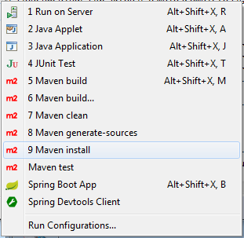

En la consola, empezarán a aparecer muchas líneas, hasta que finalmente obtengamos algo así:

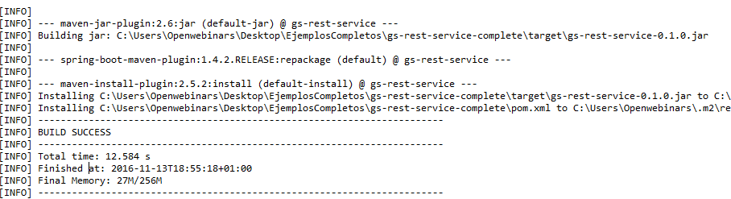

Si abrimos cualquier terminal (por ejemplo, el interno de Spring Tool Suite), podemos ejecutar la aplicación mediante el comando:

```java
java -jar C:\Users\Openwebinars\Desktop\EjemplosCompletos\gs-rest-service-complete\target\gs-rest-service-0.1.0.jar
```

Cuando en la consola indique que el proyecto está cargado, podemos acceder con el navegador a la dirección `http://localhost:8080/greeting`, y podremos ver el contenido.

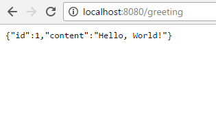

## Starters POMs y el Asistente de STS 4:04 

### 34.1 Introducción

Los *starters* son una serie de descriptores de dependencias que podemos incluir en nuestras aplicaciones. De *un plumazo*, podemos obtener todos los módulos de Spring que necesitemos, sin tener que pararnos a buscar código de ejemplo o copiar y pegar decenas de dependencias.

Por ejemplo, si quiero comenzar un proyecto usando Spring y JPA para acceder a la base de datos, tan solo tengo que incluir la dependencia `spring-boot-starter-data-jpa` en mi proyecto, y todo estará listo.

### 34.2 El nombre de un *starter*

Todos los *starters* **oficiales**<sup>1</sup> siguen un patrón similar en su nombre: `spring-boot-starter-*`, donde el asterisco representa el tipo de aplicación. El nombre intenta ser lo más autodescriptivo posible y ayudar a localizar el starter más adecuado.

El listado completo de starters pom lo podemos encontrar en http://docs.spring.io/spring-boot/docs/current-SNAPSHOT/reference/htmlsingle/#using-boot-starter.

Como es natural, podemos añadir más de una dependencia a un starter pom para construir, por ejemplo, un proyecto web y con acceso a datos JPA.

<sup>1</sup>: Existen en internet decenas de starters no oficiales y ofrecidos por la comunidad de desarrolladores, de los cuales Spring no se hace responsable.

## Customización de propiedades 8:00 

### 35.1 Customizando propiedades

Spring Boot permite customizar una gran cantidad de propiedades a partir de su archivo `application.properties`.

La lista completa de propiedades la podemos encontrar en la siguiente url http://docs.spring.io/spring-boot/docs/current/reference/html/common-application-properties.html.

## Configuración de una aplicación MVC 7:22 

### 36.1 Introducción

Hemos visto varias maneras diferentes de configurar una aplicación Spring MVC con Spring Boot, y sería bueno repasarlas de nuevo para diferenciar la una de la otra.

### 36.2 Spring Initializr

**Spring Initializr** es un servicio ofrecido por Spring mediante el cual podemos generar rápidamente, y desde una web, un proyecto Spring con todos los elementos necesarios.

Si necesitamos una aplicación web que utilice base de datos, lo normal es que necesitemos una configuración como esta:

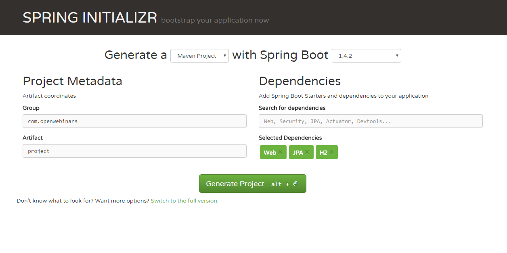

El fichero obtenido lo podemos descomprimir e importar como un proyecto Maven.

Recordemos que si queremos usar JSP, tenemos que añadir algunas dependencias más:

```java
    <dependency>
        <groupId>org.apache.tomcat.embed</groupId>
        <artifactId>tomcat-embed-jasper</artifactId>
    </dependency>
    <dependency>
        <groupId>javax.servlet</groupId>
        <artifactId>jstl</artifactId>
    </dependency>
```    
    
### 36.3 Asistente de Spring Tool Suite

La herramienta Spring Tool Suite nos provee de un asistente, muy similar a la interfaz de Spring Initializr, que nos permite crear, in situ, un proyecto de Spring Boot, incluyendo las depedencias de los módulos que seleccionemos:

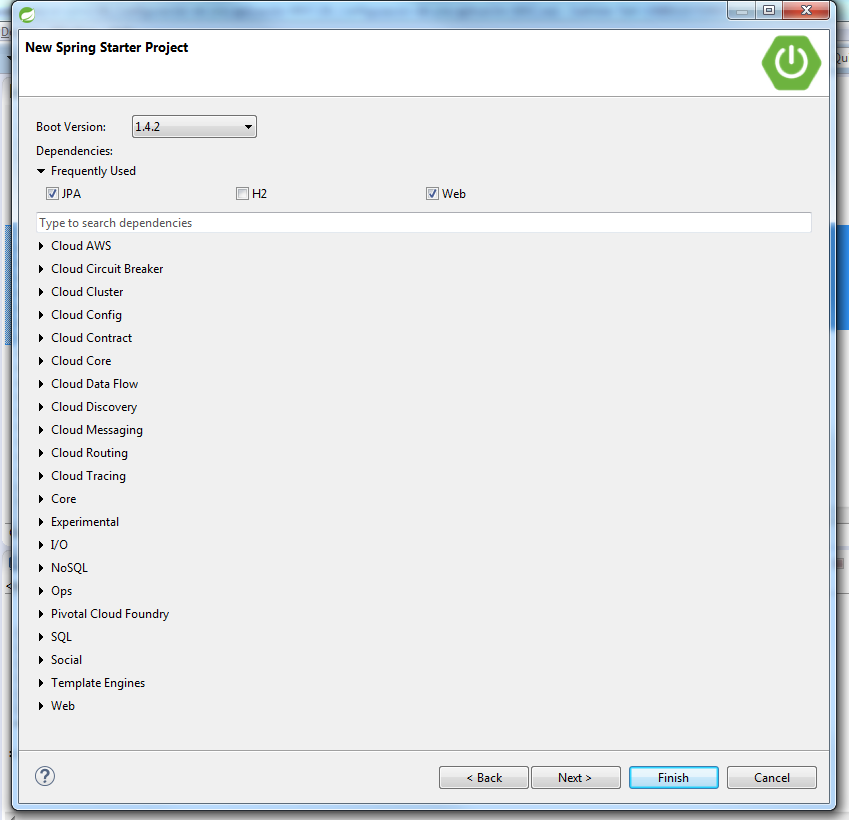

### 36.4 Starter POMs

Esta tercera vía nos permite crear un proyecto Maven o uno a partir del asistente de STS, pero agrupar las dependencias que vamos a necesitar a partir de un starter POM. Spring define una serie de starters oficiales, cuyo nombre siempre es `spring-boot-starter-*`, donde podemos sustuir el asterisco por web, jpa, mobile, …

En nuestro caso, tendríamos que añadir las dependencias a `spring-boot-starter-web`y `spring-boot-starter-data-jpa`

### 36.5 Configuración por defecto

En cualquiera de los casos anteriores, Spring Boot ofrece una configuración por defecto, que no está mal conocer, aunque sea a vista de pájaro:

* Inclusion de los beans `ContentNegotiatingViewResolver` y `BeanNameViewResolver`.

* Soporte para servir contenido estático, incluidos *web jars*

* Registro automático de beans `Converter`, `GenericConverter` y `Formatter`.

* Soporte para `HttpMessageConverters`.

* Soporte para `index.html` estático

* Soporte para customizar el `Favicon`

* ….

## Spring Boot CLI (command line interface) 11:10 
 
[Spring Boot CLI (command line interface)](pdfs/37_Spring%20Boot%20CLI.pdf)

### 37.1 Introducción

Spring Boot puede usarse como una herramienta clásica de comandos en línea.

### 37.2 Instalación

#### 37.2.1 Instalación de Maven

En primer lugar, tenemos que descargarnos maven. Lo podemos hacer desde el siguiente enlace http://maven.apache.org/download.cgi. La versión actual la encontramos (en binario comprimido en ZIP) en la siguiente url http://apache.rediris.es/maven/maven-3/3.3.9/binaries/apache-maven-3.3.9-bin.zip.

Lo más fácil, en un entorno Windows, es descomprimir el fichero y guardar la carpeta en el directorio raiz. Como tarea de *soporte*, sería bueno añadir la carpeta \bin dentro de la variable `Path`, para poder invocar la herramienta `mvn` desde cualquier punto del sistema de ficheros.

En un entorno Mac o Linux se puede obtener Maven a través de los gestores de paquetes:

* Los usuarios de OSX, si usan Homebrew, pueden ejecutar `brew install maven`.

* Los usuarios de Ubuntu pueden ejecutar `sudo apt-get install maven`.

#### 37.2.2. Instalación de Spring Boot

Se puede descargar Spring CLI del repositorio de Spring. En la url http://repo.spring.io/release/org/springframework/boot/spring-boot-cli/ podremos encontrar siempre la última versión. Actualmente, podemos descargarla en el siguiente enlace http://repo.spring.io/release/org/springframework/boot/spring-boot-cli/1.4.2.RELEASE/spring-boot-cli-1.4.2.RELEASE-bin.zip.

Lo podemos descargar en cualquier ubicación. Para mostrar otro ejemplo, diferente al del apartado anterior, lo vamos *instalar* en la carpeta de usuario (en mi caso `c:\Users\OpenWebinars`). También deberíamos añadir la ruta a la carpeta `bin` como parte de la variable de entorno PATH.

### 37.3 Utilización de Spring Boot CLI

Si bien el sistema CLI es utilizado, sobre todo, por los programadores Groovy, los programadores Java también se pueden valer de él, sobre todo aquellos que son amantes de la línea de comandos, o los que quieren automatizar algún tipo de proceso.

#### 37.3.1 Creación de un nuevo proyecto

Para crear un nuevo proyecto con Spring Boot CLI tan solo tenemos que crear un nuevo directorio en la ubicación que queramos. Una vez creado, ejecutamos la siguiente línea:

```
c:\...>spring init -d=web project-dir
```

Este comando creará una carpeta, llamada `project-dir` en la ubicación correspondiente, e iniciará el proyecto como un proyecto web. La lista de *plantillas* disponibles se puede obtener mediante el siguiente comando:

```
c:\...>spring init --list
```

Si lo que queremos es obtener un proyecto web y jpa, la sintaxis sería:

```
c:\...>spring init -d=web,jpa project-dir
```

La sintaxis es muy variable, y tiene muchas opciones. Por ello, siempre que queramos podemos consultar la ayuda con el siguiente comando:

```
c:\...>spring help [<nombre-del-comando>]
```

Cualquier proyecto generado de esta forma puede ser importado después en Spring Tool Suite, como un proyecto Maven.

En el fondo, este tipo de instalación no es más que un atajo a Spring Initializr, que nos evita entrar en la web y tener que escribir sobre el formulario las opciones, y que incluso nos da el fichero descomprimido.

#### 37.3.2 Ejecución de un proyecto

La herramienta CLI también nos permite ejecutar proyectos. Como ejemplo, hemos añadido en el directorio correspondiente la siguiente clase, que hemos editado *a mano*:

```java
package com.example;

import org.springframework.stereotype.Controller;
import org.springframework.web.bind.annotation.RequestMapping;
import org.springframework.web.bind.annotation.ResponseBody;

@Controller
class ThisWillActuallyRun {

    @RequestMapping("/")
    @ResponseBody
    public String home() {
        return "Hello World!";
    }

}
```

Para ejecutar el proyecto, tan solo tenemos que ponernos un nivel por encima del directorio `project-dir`, y ejecutar el siguiente comando:

```
c:\...>spring run <project-dir>
```

Esto provocará que Spring escanee el proyecto, localice el *punto de entrada* y lance la aplicación.

#### 37.3.3 Otras opciones de Spring Boot CLI

El comando `spring` tiene algunas opciones más:

* `spring test`: lanza los test de un determinado proyecto

* `spring jar`: crea un jar ejecutable del proyecto

* `spring war`: crea un war ejecutable del proyecto

* `spring install`: instala dependencias dentro del proyecto

* `spring uninstall`: desinstala dependencias del proyecto

* `spring shell`: inicial una consola propia dentro de la consola, lo que nos permite invocar los comandos sin llamar a `spring`
 
## Contenido adicional 4  

[Tareas a la hora de desarrollar un proyecto Spring](pdfs/26_Tareas%20proyecto%20Spring.pdf)

[Convención sobre Configuración](pdfs/28_Convención%20sobre%20configuración.pdf)

[Anotaciones](pdfs/30_Anotaciones.pdf)

[Spring Boot CLI (command line interface)](pdfs/37_Spring%20Boot%20CLI.pdf)
