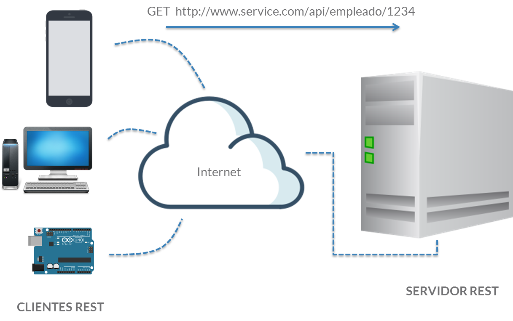
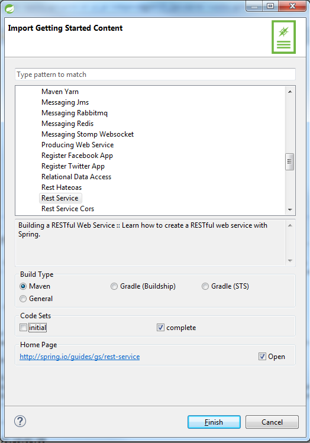
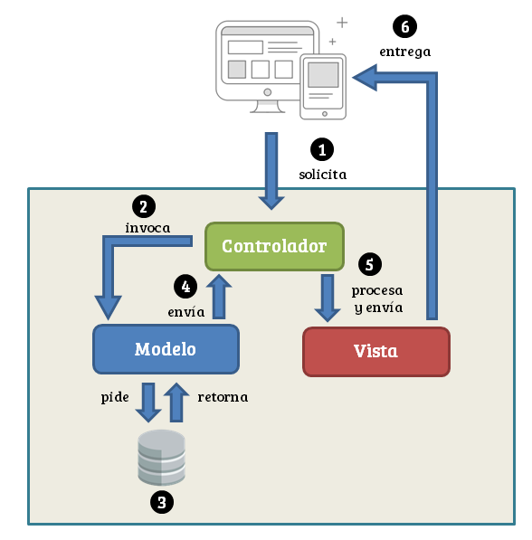

# 4. Servicios REST con Spring: Restify my life 155m
   * Introducción 3:33 
   * Principios básicos REST 4:04 
   * Cliente/Servidor 2:27 
   * Primer EndPoint 8:12 
   * REST y el patrón MVC 4:49 
   * Mapeo de peticiones 7:58 
   * Representación de los datos 3:06 
   * Formato de respuesta 8:12 
   * Gestión de errores 10:28 
   * Operaciones CRUD en servicios REST (manualmente) 8:45 
   * Creación de recursos 15:48 
   * Actualización de recursos 8:21 
   * Borrado de recursos 2:52 
   * Mapeo de operaciones crud a métodos HTTP 12:07 
   * Diferencias entre JAX-RS y Spring REST MVC 11:03 
   * Seguridad 3:52 
   * Autenticación: HTTP, Token 8:30 
   * Autorización: Mapeo de URLs, Anotaciones de recursos. 8:43 
   * Construcción de un cliente REST 13:19 
   * Manejo de la seguridad. 8:52 
   * Contenido adicional 17
    
## Introducción 3:33 

[Introducción](pdfs/38_Introducción.pdf)

## Principios básicos REST 4:04 

[Principios básicos REST](pdfs/39_Principios_básicos_REST.pdf)

### 39.1 Introducción

REST (*Representational State Transfer*, Transferencia de estado representacional) es una arquitectura de software, orientada a la creación de servicios web escalables. El término fue acuñado por Roy Fielding, y ha revolucionado la forma de realizar servicios web.

### 39.2 Interfaz uniforme

REST es una interfaz que se apoya totalmente sobre el protocolo HTTP (del que ya hablamos anteriormente). Nos permite crear servicios y aplicaciones que pueden ser usadas por cualquier dispositivo que entienda HTTP (a día de hoy, múltiples dispositivos lo hacen), por lo que es más simple y convencional que esquemas de servicios web más clásicos, como `SOAP` o `XML-RPC`.

El lenguaje REST habla de recursos (en inglés *resources*), y estos son identificados mediante URIs (*Uniform Resource Identifiers*). Conceptualmente, los recursos se separan de su representación (es decir, del formato en el que se proveen a los clientes). De hecho, REST no exige ningún formato de salida específico, si bien lo más natural es encontrar XML (cada vez menos) y JSON (que casi podríamos decir que es un estándar de *facto*).

El interfaz uniforme de acceso a cualquier servicio REST viene definido por un conjunto de operaciones y un conjunto de tipos de contenido.

### 39.3 Métodos y verbos

Aunque más delante profundizaremos, REST realiza un uso de los métodos de HTTP para la gestión de recursos:

Método | Función | Operación
-------|---------|----------
GET |	Solicitar un recurso | Read
POST | Crear un nuevo recurso | Create
PUT | Actualizar o modificar un recurso | Update
DELETE | Borrar un recurso | Delete

### 39.4 ¿Cómo crear una interfaz basada en REST?

Como decíamos antes, REST pone énfasis en el recurso, y no en métodos (por hacer una comparación con el lenguaje, REST hablaría *sustantivos*, y otros estándares de servicios web, como SOAP, hablaría *verbos*). De esta forma, REST utiliza URIs para obtener recursos.

Si por ejemplo estuviéramos trabajando con ún recurso de tipo `Empleado`, y realizados un buen proceso de abstracción, podríamos decir que tendríamos dos tipos de recursos:

* Empleado (Una URI por empleado completo)

* TodosEmpleados (Listado de todos los empleados)

Según la tabla anterior, si combinarmos los recursos y los métodos, obtendríamos lo siguiente:

Recurso | Método | Representación
--------|--------|---------------
Empleado | GET | Representación de un empleado
Empleado | PUT | Representación de un empleado
Empleado | DELETE | -
TodosEmpleados | GET | Representación de la lista de empleados
TodosEmpleados | POST | Representación de un empleado

Si esto lo llevamos a un plano real, y transformamos las URIs en URLs, podríamos crear una interfaz REST completa.

URL | Método | Representación
----|--------|---------------
http://www.service.com/api/empleado/{id} | GET | Representación de un empleado
http://www.service.com/api/empleado/{id} | PUT | Representación de un empleado
http://www.service.com/api/empleado/{id} | DELETE | -
http://www.service.com/api/empleado | GET | Representación de la lista de empleados
http://www.service.com/api/empleado | POST | Representación de un empleado

Como podemos comprobar, la URL para obtener un empleado sería:

```
http://www.service.com/api/empleado/123
```

y no sería del estilo:

```
http://www.service.com/api/getEmpleado?id=123
```

En REST, los recursos se expresan como nombres, y no como verbos.

### 39.5 Servicios autodescriptivos

Idealmente, un cliente de un servicio REST necesitaría conocer a priori solo una URL, la de entrada al servicio. El resto de operaciones serían guiadas por las representaciones por las que se van navegando:

* Hiperenlaces a otros recursos

* Plantillas de consulta/actualización que permitan operar sobre otros recursos (algo parecido a un formulario de búsqueda)

Además, las representación debería devolverse en un formato conocido a priori por el máximo número de clientes. De esta forma, desacoplamos lo máximo posible el cliente y el servidor, siendo lo más funcionales posibles.

## Cliente/Servidor 2:27 

[Cliente/Servidor](pdfs/40_ClienteServidor.pdf)

### 40.1 Introducción

El modelo cliente/servidor que propone REST permite la separación entre las preocupaciones del cliente (como por ejemplo, la interacción con el usuario) y las del servidor (como por ejemplo, el almacenamiento de datos). Este desacoplamiento garantiza que siempre que se establezca una interfaz REST entre ambos, el desarrollo de los dos sistemas se puede realizar casi de forma independiente.

### 40.2 Arquitectura cliente/servidor

REST, al descansar sobre el protocolo HTTP, se implementa bajo la arquitectura cliente/servidor. Esta es un modelo de aplicación distribuida (es decir, varias máquinas tienen que colaborar entre sí), en el que las tareas se reparten entre los elementos que proveen recursos o servicios (llamados servidores) y los demandantes, llamados clientes.


Los servidores, de forma genérica, pueden ser de dos tipos: con estado o sin estado. Un servidor con estado, como su nombre indica, puede recordar que un cliente ya realizó una petición específica de forma que, si realiza una misma petición dos veces, el resultado de ejecutar la petición por segunda vez sea diferente al de la primera vez. Un servidor sin estado no es capaz de guardar información entre las peticiones. Todos los servidores HTTP son servidores sin estado, y por ende, cualquier servidor REST que implementemos también.

### 40.3 Cliente REST y Servidor REST

Como ya hemos dicho anteriormente, REST nos servirá para ofrecer recursos a través de un servicio web. Es decir, REST va a permitir a dos sistemas (potencialmente) heterogéneos (es decir, con plataformas diferentes) colaborar para consumir o producir datos. Veamos los siguientes gráficos:




De los anteriores gráficos podemos inferir varias cosas:

* Un cliente REST puede ser cualquier *cosa*: efectivamente, cualquier dispositivo con un cliente HTTP (a día de hoy, hay miles de ellos) podría serlo (un smartphone, un pc, una placa de arduino…).

* Los clientes realizan peticiones y los servidores producen respuestas: este será el esquema básico de trabajo con REST. Cualquier cliente que necesite un recurso lanzará una petición, y el servidor le enviará una representación de ese recurso como respuesta.

* Se utiliza un formato de representación inteligible para todos: como decíamos en alguna lección anterior, JSON es casi un estándar de facto en el mundo REST. Los clientes son libres de buscar la mejor manera de interpretarlo (JacksonMapper, GSON, …)

**En las próximas lecciones podremos aprender como Spring nos ofrece facilidades tanto para la elaboración de servidores REST, que expongan recursos; como la creación de clientes REST, que fácilmente podrán consumirlos.**

## Primer EndPoint 8:12 

### 41.1 Introducción

¡Pongámonos manos a la obra! Para ello, vamos a realizar nuestro primer *endpoint*. En el mundo REST, un *endpoint* no es más que la exposición de un recurso a través de un servicio web, del cual puede consumir un cliente.

### 41.2 ¿Qué vamos a construir?

Vamos a construir un servicio que aceptará una petición HTTP GET a la url:

```
http://localhost:8080/greeting
```

y responderá con una representación JSON de un greeting:

```
{"id": 1, "content": "Hello, World!"}
```

Se podrá *customizar* el saludo con un parámetro, `name`, que será opcional en la URL.

```
http://localhost:8080/greeting?name=User
```

y entonces, el servicio responderá:

```
{"id":1,"content":"Hello, User!"}
```

### 41.3 Importación del proyecto

Al igual que hicimos en la lección 33, vamos a importar un proyecto desde el repositorio de ejemplos de Spring. En particular, vamos a trabajar con el proyecto, Rest Service, con los parámetros que indica la siguiente imagen:



### 41.4 Nuestro *modelo*

El proyecto tiene una única clase modelo, `Greeting`:

```java
public class Greeting {

    private final long id;
    private final String content;

    public Greeting(long id, String content) {
        this.id = id;
        this.content = content;
    }

    public long getId() {
        return id;
    }

    public String getContent() {
        return content;
    }
}
```

Cómo podemos ver, no tiene ningún tipo de anotación. Spring (gracias a Spring Boot) se encargará de realizar la transformación mediante JacksonMapper.

### 41.5 El controlador

En este caso, el controlador hace uso de alguna anotación especial. En particular, utiliza `@RestController`. Esta anotación indicará, nueva en Spring 4.X, indica que se trata de un controlador especial, donde todo lo que sea devuelto será un objeto de nuestro dominio, y no una vista. Es un atajo del uso conjunto de `@Controller` y `@ResponseBody`.

```java
@RestController
public class GreetingController {

    private static final String template = "Hello, %s!";
    private final AtomicLong counter = new AtomicLong();

    @RequestMapping("/greeting")
    public Greeting greeting(@RequestParam(value="name", defaultValue="World") String name) {
        return new Greeting(counter.incrementAndGet(),
                            String.format(template, name));
    }
}
```

### 41.6 Algunas modificaciones

Para probar que este servicio puede *escalar* de una forma sencilla, y devolver un objeto más complejo, podemos añadir algunas propiedades más a nuestra clase modelo, si modificar ninguna línea de código más. Siempre y cuando Jackson Mapper sea capaz de transformar el objeto, obtendremos una respuesta JSON correcta.

## REST y el patrón MVC 4:49 

[REST y el patrón MVC](pdfs/42_REST%20y%20el%20patrón%20MVC.pdf)

### 42.1 REST y el patrón Modelo-Vista-Controlador

Si rescatamos lo que estudiamos en la lección 11 sobre el patrón MVC, recordaremos que se trata de un patrón arquitectónico (es decir, en la forma de organizar el código), de manera que el código queda definido en *Modelo* (Objetos de Negocio), la *Vista* (interfaz con el usuario u otro sistema) y el *Controlador* (controlador del flujo o workflow de la aplicación).



Si trasladamos esto a lo que hemos introducido en las lecciones anteriores sobre servicios REST, podemos inferir lo siguiente:

* Dentro de una aplicación MVC, nuestro *modelo* serán los *recursos* de los que habla REST.

* Ya que el modelo RESTful utiliza HTTP y sus *verbos* para la gestión de recursos, el controlador tendrá una gran importancia para recibir y tratar las diferentes peticiones.

* La vista, de la cual habla el patrón MVC, no va a ser prácticamente nunca HTML o algún sistema de *templates*, que tan bien soporta Spring, sino un lenguaje que permita el intercambio de datos entre sistemas heterogéneos (como JSON o XML).


### 42.2 MVC en el cliente y la potencia de REST

Por un lado, de sobra es sabido que cada vez más diferentes tipos de dispositivos son capaces de acceder a contenidos en internet. De la mano, están surgiendo cada vez más tecnologías, como por ejemplo Angular, que nos permiten implementar MVC de una forma diferente a la clásica. Y lo mismo podríamos decir de Android, iOS, etc…

De esta forma, de alguna manera podríamos decir que el patrón MVC se ha multiplicado, para quedar implementado en el lado cliente, de forma que el lado servidor queda solo para surtir de datos en JSON.

Gracias a todas estas tecnologías, la arquitectura REST se está convirtiendo en un referente a la hora de desarrollar software.

## Mapeo de peticiones 7:58 

### 43.1 Introducción

Como hablábamos en lecciones anteriores, un servicio web REST que se precie ofrecerá, para un recurso concreto, la posibilidad de hacer todos los métodos CRUD, a través de los correspondientes verbos HTTP. Por ejemplo para un recurso Empleado (empleadoId, nombre, apellidos, fechaNacimiento) debería exponer, entre otras URLs:

URL | verbo HTTP | Respuesta
----|------------|----------
http://www.server.com/api/empleado | GET | Obtener los datos de todos los empleados
http://www.server.com/api/empleado/{id} | GET | Obtener los datos del empleado {id}

### 43.2 Desarrollo de los servicios

Partiendo de un proyecto base orientado a web, que podremos construir con el asistente de STS, comenzamos desarrollando nuestra clase modelo:

```java
public class Empleado {

    private long id;
    private String nombre;
    private String apellidos;
    private Date fechaNacimiento;

    public Empleado() {}


    public Empleado(long id, String nombre, String apellidos, Date fechaNacimiento) {
        this.id = id;
        this.nombre = nombre;
        this.apellidos = apellidos;
        this.fechaNacimiento = fechaNacimiento;
    }

    public long getId() {
        return id;
    }

    public void setId(long id) {
        this.id = id;
    }

    public String getNombre() {
        return nombre;
    }

    public void setNombre(String nombre) {
        this.nombre = nombre;
    }

    public String getApellidos() {
        return apellidos;
    }

    public void setApellidos(String apellidos) {
        this.apellidos = apellidos;
    }

    public Date getFechaNacimiento() {
        return fechaNacimiento;
    }

    public void setFechaNacimiento(Date fechaNacimiento) {
        this.fechaNacimiento = fechaNacimiento;
    }

}
```

Un controlador capaz de exponer los servicios que hemos indicado más arriba sería como este:

```java
@RestController
@RequestMapping("/api")
public class EmpleadoController {

    List<Empleado> repo;

    @GetMapping("/empleado")
    public List<Empleado> list() {
        return repo;
    }

    @GetMapping("/empleado/{id}") 
    public Empleado getEmpleado(@PathVariable Long id) {
        if (id > 0 && id <= repo.size()) {
            return repo.get((int) (id-1));
        }

        return null;
    }


    @PostConstruct
    private void init() {

        repo = new ArrayList<Empleado>();
        repo.add(new Empleado(1L, "Pepe", "Gotera", new Date()));
        repo.get(0).getCitas().add(new Cita(1L, "Reunión de trabajo", new Date()));
        repo.get(0).getCitas().add(new Cita(2L, "Visita a un cliente", new Date()));

        repo.add(new Empleado(2L, "Otilio", "García", new Date()));
        repo.get(1).getCitas().add(new Cita(3L, "Visita a un proveedor", new Date()));

        repo.add(new Empleado(3L, "Mortadelo", "Gómez", new Date()));
        repo.add(new Empleado(4L, "Filemón", "Guzmán", new Date()));
        repo.add(new Empleado(5L, "Super", "López", new Date()));
    }


}
```

Como almacén de datos, hemos creado un repositorio estático dentro de una lista.

De esta forma, la invocación de los servicios produciría como resultado, directamente, un JSON. Por ejemplo, si invocamos mediante una petición GET a:

```
http://localhost:8080/api/empleado
```

tendremos como resultado:

```js
[{"id":1,"nombre":"Pepe","apellidos":"Gotera","fechaNacimiento":1479152095985,"citas":[{"id":1,"texto":"Reunión de trabajo","fecha":1479152095985},{"id":2,"texto":"Visita a un cliente","fecha":1479152095985}]},{"id":2,"nombre":"Otilio","apellidos":"García","fechaNacimiento":1479152095985,"citas":[{"id":3,"texto":"Visita a un proveedor","fecha":1479152095985}]},{"id":3,"nombre":"Mortadelo","apellidos":"Gómez","fechaNacimiento":1479152095985,"citas":[]},{"id":4,"nombre":"Filemón","apellidos":"Guzmán","fechaNacimiento":1479152095985,"citas":[]},{"id":5,"nombre":"Super","apellidos":"López","fechaNacimiento":1479152095985,"citas":[]}]
```

### 43.3 Servicios *anidados*

En muchas ocasiones nos encontraremos en la situación de que dos clases modelo tienen una asociación de composición entre ellas, de forma que la primera tendrá dentro una colección de instancias de la segunda.

Utilizando el esquema REST, es buena práctica definir los servicios de la siguiente forma:

```
/api/outer/{id}/nested
```

De esta forma, indicamos que queremos todas las instancias del recurso `nested` asociadas a la instancia `{id}` del recurso `outer`.

En el contexto de nuestro ejemplo, vamos a crear una segunda clase, para manejar las citas de un empleado:

```java
public class Cita {

    private Long id;
    private String texto;
    private Date fecha;

    public Cita() { }

    public Cita(Long id, String texto, Date fecha) {
        this.id = id;
        this.texto = texto;
        this.fecha = fecha;
    }

    public Long getId() {
        return id;
    }

    public void setId(Long id) {
        this.id = id;
    }

    public String getTexto() {
        return texto;
    }

    public void setTexto(String texto) {
        this.texto = texto;
    }

    public Date getFecha() {
        return fecha;
    }

    public void setFecha(Date fecha) {
        this.fecha = fecha;
    }

}
```

Y vamos a añadir a la clase empleado todo lo necesario para almacenar y gestionar estas citas:

```java
public class Empleado {
    //resto de atributos
    private List<Cita> citas;

    //resto de código

    public Empleado(long id, String nombre, String apellidos, Date fechaNacimiento) {
        this.id = id;
        this.nombre = nombre;
        this.apellidos = apellidos;
        this.fechaNacimiento = fechaNacimiento;
        this.citas = new ArrayList<Cita>();
    }


    public List<Cita> getCitas() {
        return citas;
    }


    public void setCitas(List<Cita> citas) {
        this.citas = citas;
    }

    //resto del código

}
```

Para exponer las citas, tendríamos que añadir dos nuevos métodos en el controlador, que devuelvan una instancia de `Cita` y una colección `List<Cita>`.

```java
@RestController
@RequestMapping("/api")
public class EmpleadoController {

    //resto del código

    @GetMapping("/empleado/{id}/cita")
    public List<Cita> getCitasEmpleado(@PathVariable Long id) {
        if (id > 0 && id <= repo.size()) {
            return repo.get((int) (id-1)).getCitas();
        }

        return null;
    }

    @GetMapping("/empleado/{idE}/cita/{idC}")
    public Cita getCitaEmpleado(@PathVariable Long idE, @PathVariable Long idC) {
        Cita result = null;

        if (idE > 0 && idE <= repo.size()) {
            List<Cita> citas = repo.get((int) (idE-1)).getCitas();
            if (citas != null) {
                for (Cita c : citas) 
                    if (c.getId() == idC)
                        result = c;
            }
        }

        return result;
    }

    //resto del código


}
```

## Representación de los datos 3:06 

[Representación de los datos](pdfs/44_Representación%20de%20los%20datos.pdf)

### 44.1 Recursos y representación de los datos

Cuando pensamos en un API, es muy normal pensar en sus *endpoints*, es decir, en sus URLs. Con REST, si tienes una URL, entonces tienes un recurso. Por ello, en el ejemplo de la lección anterior, `/api/empleado/1` nos proporcinaba un empleado, y `/api/empleado` nos proporcionaba una lista de ellos (una colección también se puede considerar como un recurso).

### 44.1.1 Representación

Ahora que hemos entendido los recursos, hablemos de representación de los mismos. Supongamos que un cliente realiza una petición GET al ejemplo de la lección anterior, `/api/empleado/1`, donde la respuesta JSON será:

```js
{"id":1,"nombre":"Pepe","apellidos":"Gotera","fechaNacimiento":1479152095985,"citas":[{"id":1,"texto":"Reunión de trabajo","fecha":1479152095985},{"id":2,"texto":"Visita a un cliente","fecha":1479152095985}]}
```

Este es el recurso *empleado*, ¿verdad? **¡ERROR!** Esto es justo una **representación** del recurso. En este caso, el servidor la devuelve en un formato (JSON), pero la podría haber devuelto en otros, com XML, HTML, … Esto funcionaría también con otras peticiones, como POST, en la que es el cliente el que envía datos al servidor.

Este es exactamente el motivo por el que la web funciona, y funciona como lo hace. Una página HTML no es un recurso, sino solamente una representación del mismo. Cuando nosotros enviamos información en un formulario, estamos enviando una representación diferente hacia el servidor.

Un recurso puede tener diferentes representaciones. Por ejemplo, podríamos *volvernos locos* y querer implementar un API que solicitara las representaciones en HTML, XML o JSON de cualquier recurso.

Una representación no es más que una forma de *explicar* el estado actual de un recurso, en un formato legible para una máquina. Y sí, hemos usado la palabra *estado*, ya que cuando el cliente hace la anterior petición GET, obtiene un JSON con la representación actual, es decir, los datos *actuales*.

En lenguaje REST, un cliente y un servidor intercambian representaciones de un recurso, que reflejan el estado actual o *deseado* de un recurso. REST es una manera de que dos máquinas transfieran el estado de un recurso a traves de sus representaciones.

## Formato de respuesta 8:12 

### 45.1 Formato de la respuesta por defecto

Como hemos visto en la lección anterior, es nuestro servidor el que se encarga de devolver una representación del recurso al que queremos acceder. Por defecto, esta representación es en JSON.

### 45.2 Obtener la respuesta en XML

Cambiar la representación, es decir, el formato, de la respuesta de petición de un recurso con Spring es tremendamente fácil. Spring Boot ha configurado nuestro proyecto para añadir todos los `HttpMessageConverters` necesarios. Tan solo tenemos que hacer dos pequeñas tareas:

#### 45.2.1 Añadir dependencias

Tenemos que añadir una nueva dependencia al `pom.xml`, con la librería que se encargará de realizar la transformación.

```js
        <dependency>
            <groupId>com.fasterxml.jackson.dataformat</groupId>
            <artifactId>jackson-dataformat-xml</artifactId>
        </dependency>
```        
        
#### 45.2.2 Añadir las anotaciones de JAXB

Esta librería utiliza las etiquetas de JAXB (*Java Architecture for XML Binding*) para realizar la serialización y deserialización de instancias de java en cadenas XML y viceversa.

Nuestra clases (sin perjuicio para la transformación en JSON) quedarían ahora de la siguiente forma:

```java
package com.openwebinars.springrest.model;

import java.util.ArrayList;
import java.util.Date;
import java.util.List;

import javax.xml.bind.annotation.XmlElement;
import javax.xml.bind.annotation.XmlRootElement;

@XmlRootElement(name="empleado")
public class Empleado {

    //resto del código   

    @XmlElement
    public List<Cita> getCitas() {
        return citas;
    }


    @XmlElement
    public long getId() {
        return id;
    }

    @XmlElement
    public String getNombre() {
        return nombre;
    }

    @XmlElement
    public String getApellidos() {
        return apellidos;
    }


    @XmlElement
    public Date getFechaNacimiento() {
        return fechaNacimiento;
    }

    //resto del código   


}
```

```java
package com.openwebinars.springrest.model;

import java.util.Date;

import javax.xml.bind.annotation.XmlElement;
import javax.xml.bind.annotation.XmlRootElement;

@XmlRootElement
public class Cita {

    //resto del código

    @XmlElement
    public Long getId() {
        return id;
    }

    @XmlElement
    public String getTexto() {
        return texto;
    }

    @XmlElement
    public Date getFecha() {
        return fecha;
    }

    //resto del código

}
```

Por último, para obtener la salida en XML, tenemos que indicárselo explícitamente en la petición. La forma más transparente de hacerlo es incluyendo en la misma una cabecera: `Accept : application/xml`.

### 45.3 Cambios en la configuración de salida del JSON

Nuestro proyecto, creado con Spring Boot bajo el paradigma CoC (Convención sobre configuración), tiene una configuración por defecto para la salida en JSON que puede ser modificada si lo deseamos.

Para ello, tenemos que crear una clase que extienda a `WebMvcConfigurerAdapter`, y anotarla con `@Configuration` y `@EnableWebMVC`.

```java
@Configuration
@EnableWebMvc
public class JsonConfiguration extends WebMvcConfigurerAdapter {
    @Override
    public void configureMessageConverters(List<HttpMessageConverter<?>> converters) {
        converters.add(new MappingJackson2HttpMessageConverter(
                new Jackson2ObjectMapperBuilder().propertyNamingStrategy(PropertyNamingStrategy.LOWER_CASE)
                        .serializationInclusion(Include.NON_NULL).build()));

        converters.add(new MappingJackson2XmlHttpMessageConverter());
    }
}
```

De esta forma, en lugar de utilizar la estrategia *camel* case para generar los nombres de las propiedades, obtendríamos como salida todos ellos en minúscula.

## Gestión de errores 10:28 

[Gestión de errores](pdfs/46_Gestión%20de%20errores.pdf)

### 46.1 Introducción

Hasta ahora todo ha ido sobre ruedas pero, ¿qué sucede si solicitamos un recurso que no existe? ¿o si realizamos una petición que no sea correcta? REST, al descansar sobre HTTP, utiliza los códigos de respuesta de este protocolo para gestionar las posibles contingencias.

### 46.2 Códigos de respuesta

El protocolo HTTP va mucho más allá de lo que estamos acostumbrados a usarlo. De hecho, toda respuesta a una petición, debe llevar siempre aparejado un código de respuesta. Si todo va OK, este código será 200. La respuesta de error más conocida es la 404, que está asociada a un recurso no encontrado. Rescatemos los códigos de respuesta más usuales de la lección sobre HTTP:

* Códigos 1XX: Mensajes

   * 100-111 Conexión rechazada

* **Códigos 2XX: Operación realizada con éxito**

   * **200 OK**

   * 201-203 Información no oficial

   * 204 Sin contenido

   * 205 Contenido para recargar

   * 206 Contenido parcial

* Códigos 3XX: Redirección

   * 301 Mudado permanentemente

   * 302 Encontrado

   * 303 Vea otros

   * 304 No modificado

   * 305 Utilice un proxy

   * 307 Redirección temporal

* **Códigos 4XX: Error por parte del cliente**

   * **400 Solicitud incorrecta**

   * 402 Pago requerido

   * 403 Prohibido

   * **404 No encontrado**

   * 409 Conflicto

   * 410 Ya no disponible

   * 412 Falló precondición

* **Códigos 5xx: Error del servidor**

   * **500 Error interno**

   * 501 No implementado

   * 502 Pasarela incorrecta

   * 503 Servicio no disponible

   * 504 Tiempo de espera de la pasarela agotado

   * 505 Versión de HTTP no soportada

Como podemos comprobar, ya en su día marcábamos los más interesantes, que serán los que más utilicen los diferentes servicios REST.

### 46.3 Formas de implementar la gestión de errores

Por ser el más frecuente, nos vamos a centrar en el error 404 (recurso no encontrado)

#### 46.3.1 A través del objeto `HttpServletResponse`

Como ya dijimos en las lecciones de Spring MVC, la firma de los métodos dentro de un controlador es muy variable, ya que pueden (o no) recibir muchas cosas. Entre ellas está un objeto de tipo `HttpServletResponse`. Este objeto representa la respuesta que va a ser enviada al cliente. Si modificamos directamente el código de la respuesta, enviaremos una respuesta con código 404 al cliente, si bien la respuesta estará vacía.

```java
    @GetMapping("/empleado/{id}") 
    public Empleado getEmpleado(@PathVariable Long id, HttpServletResponse response) {
        if (id > 0 && id <= repo.size()) {
            return repo.get((int) (id-1));
        } else {
            response.setStatus(404);
            return null;
        }
    }
```

Si comprobamos con una petición al servicio con el ID de un empleado que no exista (por ejemplo, 78), obtenedremos un error 404.

#### 46.3.2. A través del manejo de excepciones

Spring incluye un gran número de excepciones para el manejo de errores asociados a los códigos de respuesta. En la **documentación oficial** los podemos consultar. Uno de ellos, `NoHandlerFoundException`, es invocado cuando intentamos realizar una petición a un controlador que no existe. Si en el método, lanzamos la excepción cuando no encontremos una cita (por ejemplo, por invocar a la url `/api/empleado/2/cita/123`), obtendremos un error 404, aparejado de un mensaje, en JSON, con una descripción genérica del error.

```java
    @GetMapping("/empleado/{idE}/cita/{idC}")
    public Cita getCitaEmpleado(@PathVariable Long idE, @PathVariable Long idC,  HttpServletRequest request) throws NoHandlerFoundException {
        Cita result = null;

        if (idE > 0 && idE <= repo.size()) {
            List<Cita> citas = repo.get((int) (idE-1)).getCitas();
            if (citas != null) {
                for (Cita c : citas) 
                    if (c.getId() == idC)
                        result = c;
            }
        } 
        if (result != null)
            return result;
        else 
            throw new NoHandlerFoundException("GET", request.getRequestURL().toString(), null);
    }
```    

##### 46.3.2.1 Modificación del mensaje de error

Ya que la descripción del mensaje de error que hemos obtenido es genérica, es razonable pensar en cambiarlo. La forma más fácil es a través de las anotaciones `@ExceptionHandler` y `@ResponseStatus`. De esta forma, para este controlador puenteamos la gestión de una excepción en particular, devolviendo un determinado código de respuesta, y modificando el mensaje a nuestro antojo. Estas dos anotaciones se las podemos añadir a un método privado del controlador, que en sí, no tiene por qué hacer nada.

```java
    @ResponseStatus(value=HttpStatus.NOT_FOUND, reason="La cita no existe")
    @ExceptionHandler(NoHandlerFoundException.class)
    public void citaInexsistente() {
        //vacío
    }
```    

##### 46.3.2.2 Creación de nuestras propias clases de excepción

En último lugar, pero no por ello menos importante, ya que es uno de los modelos más recomendables, podemos pensar en crear nuestras propias clases que hereden de `RuntimeException`, y anotadas con `@ResponseStatus`. De esta forma, en lugar de lanzar una excepción genérica, lanzaríamos una definida por nosotros.

```java
    @ResponseStatus(value=HttpStatus.NOT_FOUND, reason="El empleado no existe")
    private class EmpleadoNotFoundException extends RuntimeException {

        private static final long serialVersionUID = -5798132769496018860L;

    }
```    

Si queremos modificar el mensaje para que pueda recibir parámetros, podemos añadir un constructor que utilice uno de los de la clase base:

```java
    @ResponseStatus(value=HttpStatus.NOT_FOUND)
    private class EmpleadoNotFoundException extends RuntimeException {

        private static final long serialVersionUID = -5798132769496018860L;

        public EmpleadoNotFoundException(Long id) {
            super(String.format("El empleado %d no existe",id));            
        }

    }
```

## Operaciones CRUD en servicios REST (manualmente) 8:45 

[Operaciones CRUD en servicios REST](pdfs/47_Operaciones%20CRUD%20en%20servicios%20REST.pdf)

### 47.1 Operaciones CRUD en servicios REST

A continuación, vamos a presentar cual debería ser la arquitectura completa de un servicio para un determinado recurso, para que pueda realizar todas las operaciones CRUD (crear, obtener, actualizar y borrar).

URL | Método HTTP | Descripción | Código de respuesta correcta
----|-------------|-------------|-----------------------------
`/api/empleados` | GET | Obtener la lista de todos los empleados | 200 OK
`/api/empleado/{id}` | GET | Obtener los datos del empleado {id} | 200 OK
`/api/empleado` | POST | Crear un nuevo empleado | 201 Created
`/api/empleado/{id}` | PUT | Modificar un empleado existente | 200 OK
`/api/empleado/{id}` | DELETE | Eliminar un empleado existente | 200 OK

### 47.2 Datos para el proyecto

Vamos a crear un nuevo proyecto Spring Boot con el asistente de STS. Marcamos las opciones Web, Jpa y H2.

En el fichero `application.properties` añadimos las siguientes propiedades

```java
spring.datasource.url=jdbc:h2:./ejemplo-spring-boot
spring.datasource.username=sa
spring.datasource.password=
spring.datasource.driver-class-name=org.h2.Driver
```

Esto nos permitirá crear una base de datos que funcionará en memoria.

### 47.3 Clases del proyecto

El código usado en el proyecto se va a parecer, en primera instancia, a cualquier proyecto Web/JPA que pudiéramos crear:

**Empleado.java**

```java
@Entity
public class Empleado {

    @Id
    @GeneratedValue(strategy=GenerationType.AUTO)
    private long id;
    @Column
    private String nombre;
    @Column
    private String apellidos;
    @Column
    private Date fechaNacimiento;


    public Empleado() {}


    public Empleado(long id, String nombre, String apellidos, Date fechaNacimiento) {
        this.id = id;
        this.nombre = nombre;
        this.apellidos = apellidos;
        this.fechaNacimiento = fechaNacimiento;
    }

    public Empleado(String nombre, String apellidos, Date fechaNacimiento) {
        this.nombre = nombre;
        this.apellidos = apellidos;
        this.fechaNacimiento = fechaNacimiento;
    }

    //getters y setters


    //hashCode y equals también han sido autogenerados

    @Override
    public int hashCode() {
        final int prime = 31;
        int result = 1;
        result = prime * result + ((apellidos == null) ? 0 : apellidos.hashCode());
        result = prime * result + ((fechaNacimiento == null) ? 0 : fechaNacimiento.hashCode());
        result = prime * result + (int) (id ^ (id >>> 32));
        result = prime * result + ((nombre == null) ? 0 : nombre.hashCode());
        return result;
    }


    @Override
    public boolean equals(Object obj) {
        if (this == obj)
            return true;
        if (obj == null)
            return false;
        if (getClass() != obj.getClass())
            return false;
        Empleado other = (Empleado) obj;
        if (apellidos == null) {
            if (other.apellidos != null)
                return false;
        } else if (!apellidos.equals(other.apellidos))
            return false;
        if (fechaNacimiento == null) {
            if (other.fechaNacimiento != null)
                return false;
        } else if (!fechaNacimiento.equals(other.fechaNacimiento))
            return false;
        if (id != other.id)
            return false;
        if (nombre == null) {
            if (other.nombre != null)
                return false;
        } else if (!nombre.equals(other.nombre))
            return false;
        return true;
    }

}
```

**EmpleadoRepository.java**

```java
@Repository
public interface EmpleadoRepository extends JpaRepository<Empleado, Long>{

}
```

El controlador es el que va a verse algo modificado para que nos sirva a modo de controlador de Servicio REST:

**EmpleadoController.java**

```java
@RestController
@RequestMapping("/api")
public class EmpleadoController {

    @Autowired
    EmpleadoRepository empleadoRepository;


    @GetMapping("/empleados")
    public List<Empleado> list() {
        List<Empleado> result = empleadoRepository.findAll();
        if (result != null)
            return result;
        else
            throw new EmpleadoNotFoundException();
    }

    @GetMapping("/empleado/{id}") 
    public Empleado getEmpleado(@PathVariable Long id) {
        Empleado result = empleadoRepository.findOne(id);
        if (result != null)
            return result;
        else
            throw new EmpleadoNotFoundException(id);
    }

    @PostMapping("/empleado")
    public Empleado createEmpleado(/* ... */) {
        return null;
    }

    @PutMapping("/empleado/{id}")
    public Empleado updateEmpleado(/* ... */) {
        return null;
    }


    @DeleteMapping("/empleado/{id}")
    public Empleado deleteEmpleado(/* .... */) {
        return null;
    }


    @ResponseStatus(value=HttpStatus.NOT_FOUND)
    private class EmpleadoNotFoundException extends RuntimeException {

        private static final long serialVersionUID = 7295910574475009536L;


        public EmpleadoNotFoundException() {
            super("No existe ningún empleado");
        }

        public EmpleadoNotFoundException(Long id) {
            super(String.format("No existe ningún empleado con el ID = %d", id));
        }

    }

}
```

Como elementos a destacar:

* El uso de la anotación `@RestController`. Nos permite indicar que este controlador es especial, y que se usa como controlador de servicio REST.

* Los métodos `createEmpleado`, `updateEmpleado` y `deleteEmpleado`, cuya explicación en profundidad dejamos para las siguientes lecciones.

* La definición, como clase privada (esto lo hemos hecho por simplicidad, ya que dicha excepción no se va a utilizar en otra clase diferente), de la excepción `EmpleadoNotFoundException`, mediante la cual vamos a *sobreescribir* el comportamiento por defecto del error 404, enviando al usuario un mensaje de error propio.

En la clase `Application.java` hemos añadido un código que solo sirve para que, al iniciar la aplicación, la base de datos se rellene con algunos datos iniciales de empleados. Se ha hecho uso de las anotación `@Bean`, que nos permitía definir un bean dentro de un método (véase la lección de JavaConfig); dentro hace uso de Java 8 y sus expresiones lambda, si bien este contenido queda fuera del alcance de este curso. El bean es de tipo `CommandLineRunner`, propio de Spring Boot, y nos permite ejecutar un bloque de código al iniciarse una aplicación mediante `SpringApplication.run(...)`.

**Aplication.java**

```java
@SpringBootApplication
public class Application {

    public static void main(String[] args) {
        SpringApplication.run(Application.class, args);
    }

    @Bean
    CommandLineRunner init(EmpleadoRepository empleadoRepository) {

        String[][] data = {
                {"José", "García Martínez", "01/01/1975"},
                {"Manuel", "Pérez Díaz", "10/10/1978"},
                {"Luis Miguel", "López Magaña", "18/09/1982"},
                {"Alberto", "Jiménez Sarmiento", "03/03/1973"},
                {"Carlos", "Ruiz Santos", "02/12/1978"},
                {"Martín", "López Alfaro", "04/05/1976"},
                {"María", "Martínez Sánchez", "14/07/1983"},
                {"Luisa", "Milán Llanes", "28/08/1978"}
        };

        final DateFormat df = new SimpleDateFormat("dd/MM/yyyy");

        return (evt) -> Arrays.asList(data)
                .forEach(a -> {

                    try {
                        empleadoRepository.save(new Empleado(a[0], a[1], df.parse(a[2])));
                    } catch (Exception e) {                     
                        e.printStackTrace();
                    }
                });
    }
}
```

## Creación de recursos 15:48 

[Creación de recursos](pdfs/48_CreacionRecursos.pdf)

### 48.1 Introducción a `RequestBody` y `ResponseBody`

En las lecciones anteriores hemos podido aprender que la anotación `@RestController`, era, de algún modo, una anotación compuesta, que nos evitaba tener que usar `@Controller` y `@ResponseBody`.

La anotación `@ResponseBody`, usada en un método particular (podemos ver la lección en la que creamos nuestro primer servicio REST) nos permitía indicarle a Spring que el tipo de retorno del método debía ser la respuesta que enviara al cliente, de forma que tenía que buscar entre sus *Http Converters* el mejor candidato para realizar esta operación.

Conozcamos un poco mejor las anotaciones `ResponseBody` y `RequestBody` y como podemos utilizarlas para en los servicios REST en general, y en la creación de recursos en particular.

#### 48.1.1 Peticiones y respuestas: `RequestEntity` y `ResponseEntity`

Como ya pudimos trabajar en la lección sobre HTTP, este protocolo trabaja con un esquema de petición y respuesta. Ambas tienen la misma estructura, con dos partes bien diferenciadas: la cabecera y el cuerpo. En una respuesta, la cabecera nos indicará diferentes parámetros (código de respuesta, fecha, tipo de dato, datos del servidor), y el cuerpo contendrá el recurso que esperamos. Una petición, por ejemplo, de tipo POST, tendrá una cabecera, con sus correspondientes parámetros (URL hacia la cual lanzamos la petición, fecha, cliente, …) y un cuerpo (el recurso que enviamos al servidor para que sea dado de alta). Una de tipo GET, por ejemplo, tendrá por norma el cuerpo vacío.

La clase `RequestEntity<>` que nos provee Spring representa una petición, dándonos acceso a su cabecera y a su cuerpo; análogamente, `ResponseEntity<>` nos da acceso a su estructura. Estas clases son paramétrizadas, es decir, esperan otro tipo de clase dentro de los *ángulos*. Por ejemplo, `RequestEntity<Empleado>` sería un tipo de dato petición, que llevará dentro una instancia de Empleado.

### 48.2 ¿Cuándo escoger usar las anotaciones y cuando las clases?

Veamos, asociado al alta de un nuevo recurso, como sería la implementación del servicio. Recordemos primero su estructura:

URL | Método HTTP | Código de respuesta correcta | Códigos de respuesta errónea
----|-------------|------------------------------|-----------------------------
`/api/empleado` | POST | 201 Created | 400 Bad Request / 409 Conflict

#### 48.2.1 Implementación con anotaciones

La forma más fácil de implementación de este servicio sería a través del uso de @RequestBody. Veamos el código:

```java
@RestController
@RequestMapping("/api")
public class EmpleadoController {

    @Autowired
    EmpleadoRepository empleadoRepository;

    //resto del código

    @PostMapping("/empleado")
    public Empleado createEmpleado(@RequestBody Empleado empleado, HttpServletResponse response) {
        Empleado nuevo = new Empleado(empleado.getNombre(), 
            empleado.getApellidos(), 
            empleado.getFechaNacimiento());
        response.setStatus(201);
        return empleadoRepository.save(nuevo);
    }

    //resto del código


}
```

De esta forma, evitamos errores de duplicidad obviando el ID del empleado (ya que este se autogenera en la base de datos). Para enviar el código de respuesta, usamos el esquema más básico, a través de `HttpServletResponse`. Pero, ¿cómo realizaríamos la gestión de errores? Tendríamos que revisitar la lección 45, aunque podemos ver otra forma de implementación.

#### 48.2.2 Implementación con `RequestEntity<>` y `ResponseEntity<>`

Una posible implementación, haciendo uso de estas clases, sería la siguiente:

```java
@RestController
@RequestMapping("/api")
public class EmpleadoController {

    @Autowired
    EmpleadoRepository empleadoRepository;

    //resto del código

    @PostMapping("/empleado")
    public ResponseEntity<?> createEmpleado(RequestEntity<Empleado> reqEmpleado) {
        Empleado empleado = reqEmpleado.getBody();

        if (empleadoRepository.findOne(empleado.getId()) != null) {
            return new ResponseEntity<String>("El empleado con ID " + empleado.getId() + " ya existe",
                    HttpStatus.CONFLICT);
        } else {
            return new ResponseEntity<Empleado>(empleadoRepository.save(empleado), HttpStatus.CREATED);
        }
    }

    //resto del código
}
```

En este caso, podríamos enviar un mensaje de error (que no iría en JSON, ya que sería solamente un `String`) en caso de que el empleado ya existiera. En lugar de usar la anotación `@RequestBody` usaríamos una instancia de la clase `RequestEntity<Empleado>`; y devolveríamos una instancia de `ResponseEntity<?>`. Como podemos observar, el constructor de esta última que hemos utilizado acepta el código de respuesta a devolver, haciendo fácil la gestión de situaciones de error.

Una mejora de esta implementación, para gestionar peticiones erróneas, sería esta última:

```java
@RestController
@RequestMapping("/api")
public class EmpleadoController {

    @Autowired
    EmpleadoRepository empleadoRepository;

    //resto del código

    @PostMapping("/empleado")
    public ResponseEntity<?> createEmpleado(RequestEntity<Empleado> reqEmpleado) {

        if (reqEmpleado.getBody() == null) {
            return new ResponseEntity<ErrorRest>(new ErrorRest("Formato de petición incorrecto. Debe enviar los datos del empleado a dar de alta"),
                    HttpStatus.BAD_REQUEST);
        }

        Empleado empleado = reqEmpleado.getBody();

        if (empleadoRepository.findOne(empleado.getId()) != null) {
            return new ResponseEntity<ErrorRest>(new ErrorRest("El empleado con ID " + empleado.getId() + " ya existe"),
                    HttpStatus.CONFLICT);
        } else {
            return new ResponseEntity<Empleado>(empleadoRepository.save(empleado), HttpStatus.CREATED);
        }
    }

    //resto del código
}
```

¿Qué elementos han cambiado?

* Comprobamos si el cuerpo de la petición tiene datos; en caso de no tenerlos, sería una petición errónea (400 *Bad Request*).

* Tanto para el error 400, como para el 409 (*Conflict*), devolvemos una instancia de una clase. Es muy simple, pero nos permite que la representación que reciba el usuario sea en JSON, dando un tratamiento sistemático a la devolución de respuestas.

**ErrorRest.java**

```java
public class ErrorRest {

    private String mensaje;

    public ErrorRest() { }

    public ErrorRest(String mensaje) {
        this.mensaje = mensaje;
    }

    public String getMensaje() {
        return mensaje;
    }

    public void setMensaje(String mensaje) {
        this.mensaje = mensaje;
    }

    @Override
    public int hashCode() {
        final int prime = 31;
        int result = 1;
        result = prime * result + ((mensaje == null) ? 0 : mensaje.hashCode());
        return result;
    }

    @Override
    public boolean equals(Object obj) {
        if (this == obj)
            return true;
        if (obj == null)
            return false;
        if (getClass() != obj.getClass())
            return false;
        ErrorRest other = (ErrorRest) obj;
        if (mensaje == null) {
            if (other.mensaje != null)
                return false;
        } else if (!mensaje.equals(other.mensaje))
            return false;
        return true;
    }
}
```

## Actualización de recursos 8:21 

[Actualización de recursos](pdfs/49_Actualización%20de%20recursos.pdf)

### 49.1 Actualización de recursos

Veamos, asociado a la actualización de un recurso, como sería la implementación del servicio. Recordemos primero su estructura:

URL | Método HTTP | Código de respuesta correcta | Códigos de respuesta errónea
----|-------------|------------------------------|-----------------------------
`/api/empleado/{id}` | PUT | 200 OK | 400 Bad Request / 404 Not Found

Sin entrar en disquisiciones más teóricas sobre HTTP y lo que definen los documentos RFC sobre los diferentes tipos de peticiones, nosotros vamos a tomar como determinación devolver la instancia de Empleado ya modificado.

En este caso, el código fuente necesario en el controlador sería:

```java
@RestController
@RequestMapping("/api")
public class EmpleadoController {

    @Autowired
    EmpleadoRepository empleadoRepository;

    //resto del código

    @PutMapping("/empleado/{id}")
    public ResponseEntity<?> updateEmpleado(@PathVariable Long id, RequestEntity<Empleado> reqEmpleado) {

        if (reqEmpleado.getBody() == null) {
            return new ResponseEntity<ErrorRest>(new ErrorRest("Formato de petición incorrecto. Debe enviar los datos del empleado a modificar"),
                    HttpStatus.BAD_REQUEST);
        }

        if (empleadoRepository.findOne(id) != null) {
            Empleado empleado = reqEmpleado.getBody();
            Empleado aActualizar = new Empleado(id, empleado.getNombre(), empleado.getApellidos(), empleado.getFechaNacimiento());
            return new ResponseEntity<Empleado>(empleadoRepository.save(aActualizar), HttpStatus.OK);
        } else {
            return new ResponseEntity<ErrorRest>(new ErrorRest("El empleado a modificar no existe"),
                    HttpStatus.NOT_FOUND);
        }

    }

    //resto del código
}
```

Podemos observar que:

* Por norma, desde Spring nos recomiendan que una petición PUT reciba el ID de la instancia que va a ser modificada como parte de la URL; y que dentro de la petición (en su cuerpo), reciba los datos a modificar. Por ello la firma del método es `updateEmpleado(@PathVariable Long id, RequestEntity<Empleado> reqEmpleado)`.

* Al igual que en la anterior lección, si el cuerpo de la petición viene vacío, lanzaremos un error *400 Bad Request*.

* Si la instancia que vamos a modificar existe en el repositorio, la modificamos, y enviamos como respuesta un código *200 OK*.

* En caso contrario, enviamos un mensaje de error con el código *404 Not Found*.

### 49.2 ¿Actualización o inserción?

No queda demasiado claro, escarbando entre el RFC correspondiente, y viendo lo que la comunidad de desarrolladores implementa, si un servicio PUT debería ser capaz de crear o no una nueva instancia. Como algunos autores comentan que si, a continuación podemos ver cual sería la implementación de los métodos correspondientes:

```java
@RestController
@RequestMapping("/api")
public class EmpleadoController {

    @Autowired
    EmpleadoRepository empleadoRepository;

    //resto del código

    @PutMapping("/empleado")
    public ResponseEntity<?> updateEmpleado(RequestEntity<Empleado> reqEmpleado) {

        if (reqEmpleado.getBody() == null) {
            return new ResponseEntity<ErrorRest>(new ErrorRest("Formato de petición incorrecto. Debe enviar los datos del empleado a modificar"),
                    HttpStatus.BAD_REQUEST);
        }
        Empleado empleado = reqEmpleado.getBody();
        if (empleadoRepository.findOne(empleado.getId()) != null) {         
            Empleado aActualizar = new Empleado(empleado.getId(), empleado.getNombre(), empleado.getApellidos(), empleado.getFechaNacimiento());
            return new ResponseEntity<Empleado>(empleadoRepository.save(aActualizar), HttpStatus.OK);
        } else {
            Empleado nuevoEmpleado = new Empleado(empleado.getNombre(), empleado.getApellidos(), empleado.getFechaNacimiento());
            return new ResponseEntity<Empleado>(empleadoRepository.save(nuevoEmpleado), HttpStatus.CREATED);
        }

    }

    @PutMapping("/empleado/{id}")
    public ResponseEntity<?> updateEmpleado(@PathVariable Long id, RequestEntity<Empleado> reqEmpleado) {

        if (reqEmpleado.getBody() == null) {
            return new ResponseEntity<ErrorRest>(new ErrorRest("Formato de petición incorrecto. Debe enviar los datos del empleado a modificar"),
                    HttpStatus.BAD_REQUEST);
        }

        Empleado empleado = reqEmpleado.getBody();
        if (empleadoRepository.findOne(id) != null) {
            Empleado aActualizar = new Empleado(id, empleado.getNombre(), empleado.getApellidos(), empleado.getFechaNacimiento());
            return new ResponseEntity<Empleado>(empleadoRepository.save(aActualizar), HttpStatus.OK);
        } else {
            Empleado nuevoEmpleado = new Empleado(empleado.getNombre(), empleado.getApellidos(), empleado.getFechaNacimiento());
            return new ResponseEntity<Empleado>(empleadoRepository.save(nuevoEmpleado), HttpStatus.CREATED);
        }

    }

    //resto del código
}
```

## Borrado de recursos 2:52 

[Borrado de recursos](pdfs/50_Borrado%20de%20recursos.pdf)

### 50.1 Borrado de recursos

Veamos, asociado a la actualización de un recurso, como sería la implementación del servicio. Recordemos primero su estructura:

URL | Método HTTP | Código de respuesta correcta | Códigos de respuesta errónea
----|-------------|------------------------------|-----------------------------
`/api/empleado/{id}` | DELETE | 200 OK | 404 Not Found

Al igual que en la lección anterior, sin entrar en disquisiciones más teóricas sobre HTTP y lo que definen los documentos RFC sobre los diferentes tipos de peticiones, nosotros vamos a tomar como determinación devolver la instancia de Empleado ya eliminado.

En este caso, el código fuente necesario en el controlador sería:

```java
@RestController
@RequestMapping("/api")
public class EmpleadoController {

    @Autowired
    EmpleadoRepository empleadoRepository;

    //resto del código

    @DeleteMapping("/empleado/{id}")
    public ResponseEntity<?> deleteEmpleado(@PathVariable Long id) {

        Empleado aBorrar = empleadoRepository.findOne(id);
        if (aBorrar != null) {
            empleadoRepository.delete(aBorrar);
            return new ResponseEntity<Empleado>(aBorrar, HttpStatus.OK);
        } else {
            return new ResponseEntity<ErrorRest>(new ErrorRest("El empleado a borrar no existe"),
                    HttpStatus.NOT_FOUND);
        }

    }

    //resto del código
}
```

### 50.2 Servicio completo

De esta forma, ya tendríamos nuestro servicio totalmente completo:

URL | Método HTTP | Descripción | Código de respuesta correcta
----|-------------|-------------|-----------------------------
`/api/empleados` | GET | Obtener la lista de todos los empleados | 200 OK
`/api/empleado/{id}` | GET | Obtener los datos del empleado {id} | 200 OK
`/api/empleado` | POST | Crear un nuevo empleado | 201 Created
`/api/empleado/{id}` | PUT | Modificar un empleado existente | 200 OK
`/api/empleado/{id}` | DELETE | Eliminar un empleado existente | 200 OK
 
## Mapeo de operaciones crud a métodos HTTP 12:07 

[Mapeo de operaciones crud a métodos HTTP](pdfs/51_Spring%20Data%20Rest.pdf)

### 51.1 Spring Data Rest

Imagina que todo lo que hemos hecho en las últimas lecciones se pudiera generar automáticamente. ¿No sería maravilloso? ¡Spring nos lo va a permitir a través de Spring Data Rest!

Spring Data Rest es en sí una aplicación Spring MVC diseñada para exponer nuestros repositorios como servicios web REST con un mínimo esfuerzo, siguiendo el principio **HATEOAS** (*Hypermedia As The Engine Of Application State*). Resumido en pocas palabras, un cliente que quisiera acceder a nuestro servicio, no necesita ningún conocimiento previo del mismo, y podrá navegar a través de hipermedia. Podríamos decir que es una forma genérica de exponer recursos a través de servicios web.

### 51.2 Dependencias

Para el uso de Spring Data Rest tenemos que añadir una dependencia a nuestro `pom.xml`

```js
<dependencies>
  ...
  <dependency>
    <groupId>org.springframework.boot</groupId>
    <artifactId>spring-boot-starter-data-rest</artifactId>
  </dependency>
  ...
</dependencies>
```

La magia de Spring Data Rest es que si usamos Spring Boot, ya no tenemos que configurar nada más para que se autogenere el servicio web; tan solo con incluir esta dependencia será suficiente. ¿No es maravilloso?

### 51.3 Ejemplo

A modo de ejemplo, vamos a utilizar el proyecto de una *Getting Started Guide* de Spring (https://github.com/spring-guides/gs-accessing-data-rest.git). También se puede importar desde *Spring Tool Suite*, como hemos hecho en otras ocasiones.

Si comprobamos el código fuente del mismo, no puede ser más simple:

```java
@Entity
public class Person {

    @Id
    @GeneratedValue(strategy = GenerationType.AUTO)
    private long id;

    private String firstName;
    private String lastName;

    public String getFirstName() {
        return firstName;
    }

    public void setFirstName(String firstName) {
        this.firstName = firstName;
    }

    public String getLastName() {
        return lastName;
    }

    public void setLastName(String lastName) {
        this.lastName = lastName;
    }
}
```

```java
@RepositoryRestResource(collectionResourceRel = "people", path = "people")
public interface PersonRepository extends PagingAndSortingRepository<Person, Long> {

    List<Person> findByLastName(@Param("name") String name);

}
```

La anotación `@RepositoryRestResource` no sería necesaria con la configuración por defecto; se añade para sobreescribir el comportamiento por defecto del componente que transforma de singular en plural, para cambiar la palabra *persons* por *people*.

Al tener añadida la dependencia de *Spring Data Rest*, **no necesitamos implementar un controlador para tener nuestro servicio REST**.

Añadimos algunos datos de ejemplo a la base de datos, de forma que el fichero `Application.java` queda de la siguiente forma:

```java
@SpringBootApplication
public class Application {

    public static void main(String[] args) {
        SpringApplication.run(Application.class, args);
    }

    @Bean
    CommandLineRunner init(PersonRepository personRepository) {

        String[][] data = {
                {"José", "García Martínez"}, {"Manuel", "Pérez Díaz"},
                {"Luis Miguel", "López Magaña"}, {"Alberto", "Jiménez Sarmiento"},
                {"Carlos", "Ruiz Santos"}, {"Martín", "López Alfaro"},
                {"María", "Martínez Sánchez"}, {"Luisa", "Milán Llanes"}};

        return (evt) -> Arrays.asList(data)
                .forEach(a -> {            
                        Person p = new Person();
                        p.setFirstName(a[0]);
                        p.setLastName(a[1]);
                        personRepository.save(p);                    
                });     
    }  
}
```

Si ejecutamos la aplicación, y nos conectamos a la URL `http://localhost:8080` obtendremos la *bienvenida* al servicio web, en formato JSON

```java
{
  "_links": {
    "people": {
      "href": "http://localhost:8080/people{?page,size,sort}",
      "templated": true
    },
    "profile": {
      "href": "http://localhost:8080/profile"
    }
  }
}
```

Dentro de `_links` vemos que está expueso el servicio web de personas. Nos indica además que cuando lo consultemos, podemos usar los parámetros de paginación, cantidad de resultados y ordenación.

Si accedemos a la URL `http://localhost:8080/people`, obtendremos como resultado:

```java
{
  "_embedded": {
    "people": [
      {
        "firstName": "José",
        "lastName": "García Martínez",
        "_links": {
          "self": {
            "href": "http://localhost:8080/people/1"
          },
          "person": {
            "href": "http://localhost:8080/people/1"
          }
        }
      },
      ...
    ]
  },
  "_links": {
    "self": {
      "href": "http://localhost:8080/people"
    },
    "profile": {
      "href": "http://localhost:8080/profile/people"
    },
    "search": {
      "href": "http://localhost:8080/people/search"
    }
  },
  "page": {
    "size": 20,
    "totalElements": 8,
    "totalPages": 1,
    "number": 0
  }
}
```

Algunos resultados se han obviado para no alargar el documento.

Si accedemos al la URL `search`:

```java
{
  "_links": {
    "findByLastName": {
      "href": "http://localhost:8080/people/search/findByLastName{?name}",
      "templated": true
    },
    "self": {
      "href": "http://localhost:8080/people/search"
    }
  }
}
```

Dentro del repositorio, hay definido un método de búsqueda. También tiene su exposición como servicio web (de forma automática).

Si realizamos algún tipo de búsqueda, por ejemplo: `http://localhost:8080/people/search/findByLastName?name=García Martínez`, el resultado sería:

```java
{
  "_embedded": {
    "people": [
      {
        "firstName": "José",
        "lastName": "García Martínez",
        "_links": {
          "self": {
            "href": "http://localhost:8080/people/1"
          },
          "person": {
            "href": "http://localhost:8080/people/1"
          }
        }
      }
    ]
  },
  "_links": {
    "self": {
      "href": "http://localhost:8080/people/search/findByLastName?name=Garc%C3%ADa%20Mart%C3%ADnez"
    }
  }
}
```

También podemos crear nuevos recursos.

Si realizamos una petición POST, que incluya como cabecera `Content-Type:application/json` y como cuerpo:

```
{  "firstName" : "Frodo",  "lastName" : "Bolsón" }
```

La respuesta sería la siguiente:

```
{
  "firstName": "Frodo",
  "lastName": "Bolsón",
  "_links": {
    "self": {
      "href": "http://localhost:8080/people/9"
    },
    "person": {
      "href": "http://localhost:8080/people/9"
    }
  }
}
```

Además, como cabecera de la respuesta, también se incluye la URI del nuevo recurso.

Por último, decir que también soporta peticiones de tipo PUT (actualización total), PATCH (actualización parcial) y DELETE (borrado).

## Diferencias entre JAX-RS y Spring REST MVC 11:03 

[Diferencias entre JAX-RS y Spring REST MVC](pdfs/52_Diferencias%20entre%20JAX-RS%20y%20Spring%20Rest-MVC.pdf)

### 52.1 Introducción

Si alguno de vosotros viene del mundo Java EE, o ya ha hecho sus pinitos en la programación de aplicaciones empresariales Java, se habrá preguntado: ¿es que Spring no utiliza JAX-RS? Vayamos por partes.

### 52.2 JAX-RS (*Java Api for RESTful Web Services*)

JAX-RS es un api del lenguaje Java para la creación de servicios web RESTful, y está incluido de forma oficial en Java EE desde la versión 6. Actualmente está publicada la versión 2.0, que cumple con el documento JSR339. Funciona a base de anotaciones para transformar una clase Java en un recurso.

Al tratarse de un estándar, y no una implementación, existen diferentes implementaciones de terceros, entre las que destacan:

* **Apache CFX**, implementación de Apache

* **RestEasy**, implementación de JBoss

* **Jersey**, siendo la implementación de referencia de Oracle y una de las más utilizadas por la comunidad de desarrolladores.

### 52.3 ¿Son comparables JAX-RS y Spring MVC?

Esta pregunta es clave, ya que la respuesta quizá no es la esperada. Spring MVC (incluyendo el soporte para servicios REST) no es más que un framework para el desarrollo rápido de aplicaciones web (o APIs REST), mientras que JAX-RS es todo un estándar, con diferentes implementaciones concretas. De hecho, existen gran cantidad de proyectos que utilizan Spring, incluyendo MVC, y que desarrollan los servicios web a través de JAX-RS, conjugando ambas tecnologías.

Algunos análisis comparados de una implementación con ambas tecnologías (en los que no vamos a entrar, ya que son excesivamente teóricos), arrojan que prácticamente cualquier aspecto que queramos implementar con uno de ellos, lo podremos implementar con el otro.

#### 52.4 Entonces, ¿cuál de los dos debo usar?

No existe una respuesta clara a esta pregunta, ya que va a depender de muchos factores:

* La madurez tecnológica de los desarrolladores: si nuestro equipo es joven en el uso de Spring, pero tiene madurez tecnológica en el uso de JAX-RS (por ejemplo, con Jersey), sería buena idea invertir esa madurez en un ahorro de tiempo.

* Si nuestro proyecto se está desarrollando totalmente con Spring, en todos los niveles (Web, Acceso a Datos, Orientación a Aspectos, Mensajería, …), sería positivo plantearse el uso de Spring MVC para los servicios Rest.

* Si queremos tener flexibilidad a la hora de cambiar la implementación concreta del motor de nuestro servicio web, entonces deberíamos plantearnos usar JAX-RS. Como hemos visto anteriormente, existen diferentes implementaciones que pueden variar en velocidad, documentación, funciones auxiliares, …

* A favor de Spring, también podemos decir que tiene detrás una comunidad de desarrolladores gigantesca, una gran documentación y mucha *literatura*: libros, blogs, foros, etc… que podrían declinar la balanza en su favor.

## Seguridad 3:52 

[Seguridad](pdfs/53_Seguridad.pdf)

## Autenticación: HTTP, Token 8:30 

[Autenticación: HTTP, Token](pdfs/54_Autenticación.pdf)

### 54.1 Autenticación básica HTTP

Este esquema es el más simple de todos en la especificación HTTP. Se basa en pasar una combinación *username:password* en la cabecera `Authorization`. Cuando un cliente envía una petición a un servicio REST que requiere autenticación sin esta cabecera, responderá con un código **401 Not authorized**.

La combinación *username:password* suele codificarse en **Base64**. Por ejemplo, para la cadena *luismi:lopez*, la cabecera a incluir debería ser

```
Authorization: Basic bHVpc21pOmxvcGV6
```

*Para realizar pruebas, se puede usar esta **web**, que permite realizar las transformaciones String -> Base64*

Este sistema es muy básico, y poco seguro. El usuario y contraseña no se encriptan, solo se codifican, y es fácilmente decodificable. Este esquema es solo recomendable cuando se trabaja bajo HTTPS (HTTP seguro).

#### 54.1.1 Uso de la autenticación básica en Spring

En primer lugar, tendremos que indicar en el pom.xml que vamos a usar Spring Security:

```js
        <dependency>
            <groupId>org.springframework.boot</groupId>
            <artifactId>spring-boot-starter-security</artifactId>
        </dependency>
```

A continuación, debemos configurar la seguridad. Lo podemos hacer extendiendo la clase `WebSecurityConfigurerAdapter`:

```java
@EnableWebSecurity
public class SecurityConfiguration extends WebSecurityConfigurerAdapter {

    @Override
    protected void configure(AuthenticationManagerBuilder auth) throws Exception {
        auth.inMemoryAuthentication().withUser("luismi").password("lopez").roles("USER");        
    }

    @Override
    protected void configure(HttpSecurity http) throws Exception {

        http.authorizeRequests()
            .anyRequest().authenticated()
            .and().httpBasic();

    }

}
```

Esta configuración (excesivamente sencilla y no propicia para producción) nos ilustra el uso de Spring Security. Definimos un usuario/contraseña en memoria (luismi/lopez). Además, le indicamos a Spring que todas las peticiones de esta aplicación MVC deben ser autenticadas usando el esquema HTTP Básico.

### 54.2 Autenticación basada en Token

Otro esquema más utilizado a día de hoy es la autenticación basada en token. Esta no forma parte del estándar HTTP pero es un método común de autenticación.

En este esquema descansa en que el servidor necesitará, para responder convenientemente a las peticiones un token (una cadena de caracteres larga). Este token lo obtendrán los clientes autenticándose en el servicio correspondiente mediante un usuario y contraseña. El token puede tener caducidad, para que no pueda ser reutilizado eternamente si algún usuario malicioso lo consiguiera; además, puede ser encriptado con algún algoritmo de seguridad.

A día de hoy, las clases ofrecidas por Spring (Security) son muy abstractas, y necesitan de mucho código por nuestra parte para implementarlo. Spring Security queda fuera del alcance de este curso. Si alguno de vosotros quiere profundizar, os recomendamos dos de las implementaciones más modernas de autenticación usando Token:

* OAuth2: Es un estándar *open source* de autorización que permite el acceso de aplicaciones de terceros a recursos. Es muy popular entre las aplicaciones sociales (Facebook, Twitter, …). Para más información, podemos buscar en el módulo de [Spring Security OAuth](https://projects.spring.io/spring-security-oauth/docs/oauth2.html).

* JWT: *Json Web Token* es otro mecanismo simple usado para comprobar si la ifnormación enviada en las peticiones puede ser verificada y es de confianza usando una firma digital. Si queremos más información podemos acceder a https://jwt.io.

## Autorización: Mapeo de URLs, Anotaciones de recursos. 8:43 

[Autorización: Mapeo de URLs, Anotaciones de recursos](pdfs/55_Autorización.pdf)

### 55.1 Autorización

La autorización es casi una consecuencia lógica de la autenticación. Estos dos conceptos son ofrecidos ocasionalmente de forma conjunta, pero realmente apuntan a dos requisitos diferentes de la seguridad en servicios web. La autenticación valida la identidad de los usuarios; la autorización maneja que operaciones tienen derecho a realizar los mismos. La autorización, a veces, se maneja a través de usuarios y **roles**, como vamos a realizar nosotros.

### 55.2 Autorización en Spring

Hay dos aproximaciones diferentes para implementar la autorización en Spring:

* El mapeo de URLs

* La anotación de recursos

Vamos a trabajar sobre ambas dos:

#### 55.2.1 Mapeo de URLs

Basándonos en el ejemplo de la lección anterior, podemos modificar la clase `Securityconfig` para declarar un mapeo de URLs explícito:

```java
@EnableWebSecurity
public class SecurityConfiguration extends WebSecurityConfigurerAdapter {

    private final String REALMNAME = "MY_REALMNAME";

    @Override
    protected void configure(AuthenticationManagerBuilder auth) throws Exception {
        auth.inMemoryAuthentication().withUser("luismi").password("lopez").roles("USER")
            .and().withUser("admin").password("admin").roles("ADMIN");
    }

    @Override
    protected void configure(HttpSecurity http) throws Exception {

        http.csrf().disable()
            .authorizeRequests()
            .antMatchers(HttpMethod.GET,"/api/hello").hasRole("USER")
            .antMatchers(HttpMethod.GET,"/api/admin/hello").hasRole("ADMIN")
            .antMatchers(HttpMethod.POST,"/api/admin/hello").hasRole("ADMIN")
            .and().httpBasic();

    }

}
```

Con esta nueva versión, solamente los usuarios con rol ADMIN pueden acceder al recurso situado en `/api/admin/hello`.

Para tener usuarios con rol ADMIN, hemos añadido uno nuevo, con las credenciales “admin/admin”.

#### 55.2.2 Anotaciones de recursos

#### 55.2.2 Anotaciones de recursos
Por contra de una configuración centralidad, como la del apartado anterior, podemos usar anotaciones para controlar el acceso a los diferentes recursos directamente sobre las clases. Para ello, hacemos uso de la anotación `org.springframework.security.access.prepost.PreAuthorize`.

Veamos un ejemplo:

```java
@RestController
@RequestMapping("api")
public class SampleController {

    @PreAuthorize("hasAnyRole('ADMIN','USER')")
    @GetMapping("/hello")
    public String sayHello() {
        return "Hello World!";
    }

    @PreAuthorize("hasRole('ADMIN')")
    @GetMapping("/admin/hello")
    public String sayHelloForAdmins() {
        return "Hello World, Mr. Admin";
    }

    @PreAuthorize("hasRole('ADMIN')")
    @PostMapping("/admin/hello")
    public String submitGreet(@RequestBody String greet) {
        return "The recieved greet is " + greet;
    }

}
```

De esta forma, podemos dar una configuración particular a cada recurso. Para poder usar la anotación `@PreAuthorize(...)` tenemos que incluir alguna modificación en nuestro fichero de configuración:

```java
@EnableWebSecurity
@EnableGlobalMethodSecurity(prePostEnabled = true)
public class SecurityConfiguration extends WebSecurityConfigurerAdapter {


    @Override
    protected void configure(AuthenticationManagerBuilder auth) throws Exception {
        auth.inMemoryAuthentication().withUser("luismi").password("lopez").roles("USER")
            .and().withUser("admin").password("admin").roles("ADMIN");
    }

    @Override
    protected void configure(HttpSecurity http) throws Exception {


        http.csrf().disable()
            .authorizeRequests()
            .anyRequest().authenticated()
            .and()
            .httpBasic();


    }

}
```

Destaca, sobre todo, el uso de la anotación `@EnableGlobalMethodSecurity(prePostEnabled = true)`, que nos permitirá gestionar la autorización a través de anotaciones.

## Construcción de un cliente REST 13:19 

[Construcción de un cliente REST](pdfs/56_Construcción%20de%20un%20cliente%20REST.pdf)

### 56.1 Introducción

Hasta ahora hemos venido desarrollando la parte *servidora* de los servicios web. Spring nos ofrece también los elementos necesarios para construir un cliente rest, a través de la clase RestTemplate.

### 56.2 RestTemplate

Esta clase, que en principio puede resultar hasta *mágica*, nos va a permitir, en la mayoría de las ocasiones en una sola línea de código:

* Conectar con una URL

* Enviarle una petición con un determinado método HTTP

* Además, si fuera necesario, incluir determinadas cabeceras en dicha petición

* Recoger la respuesta que ofrezca el servicio Web

* Procesar la misma para obtener, si fuera necesario, un objeto de nuestro modelo.

Método HTTP | Método RestTemplate
------------|--------------------
DELETE | `delete(java.lang.String, java.lang.Object...)`
GET | `getForObject(java.lang.String, java.lang.Class<T>, java.lang.Object...)
getForEntity(java.lang.String, java.lang.Class<T>, java.lang.Object...)`
HEAD | `headForHeaders(java.lang.String, java.lang.Object...)`
OPTIONS | `optionsForAllow(java.lang.String, java.lang.Object...)`
POST | `postForLocation(java.lang.String, java.lang.Object, java.lang.Object...)
postForObject(java.lang.String, java.lang.Object, java.lang.Class<T>, java.lang.Object...)`
PUT | `put(java.lang.String, java.lang.Object, java.lang.Object...)`
cualquiera | `exchange(java.lang.String, org.springframework.http.HttpMethod, org.springframework.http.HttpEntity<?>, java.lang.Class<T>, java.lang.Object...) - execute(java.lang.String, org.springframework.http.HttpMethod, org.springframework.web.client.RequestCallback, org.springframework.web.client.ResponseExtractor<T>, java.lang.Object...)`

Para mejor consulta de los métodos disponibles, podemos profundizar viendo su [JavaDoc](https://docs.spring.io/spring-framework/docs/current/javadoc-api/org/springframework/web/client/RestTemplate.html)

### 56.3 Ejemplo de uso de RestTemplate

Para ejemplificar su uso, vamos a implementar una aplicación capaz de consultar el servicio web https://restcountries.eu/rest/v1/all, que nos devolverá un listado con todos los paises del mundo y una gran cantidad de información más sobre ellos (entre otros, su codificación oficial ISO-3166).

Si vemos la estructura de un solo pais en JSON:

```java
 {
        "name": "Spain",
        "topLevelDomain": [
            ".es"
        ],
        "alpha2Code": "ES",
        "alpha3Code": "ESP",
        "callingCodes": [
            "34"
        ],
        "capital": "Madrid",
        "altSpellings": [
            "ES",
            "Kingdom of Spain",
            "Reino de España"
        ],
        "relevance": "2",
        "region": "Europe",
        "subregion": "Southern Europe",
        "translations": {
            "de": "Spanien",
            "es": "España",
            "fr": "Espagne",
            "ja": "スペイン",
            "it": "Spagna"
        },
        "population": 46439864,
        "latlng": [
            40,
            -4
        ],
        "demonym": "Spanish",
        "area": 505992,
        "gini": 34.7,
        "timezones": [
            "UTC",
            "UTC+01:00"
        ],
        "borders": [
            "AND",
            "FRA",
            "GIB",
            "PRT",
            "MAR"
        ],
        "nativeName": "España",
        "numericCode": "724",
        "currencies": [
            "EUR"
        ],
        "languages": [
            "es"
        ]
    }
```    

OMG! ¿Cómo trasladar todo esto a clases POJO Java? La respuesta es fácil: podemos usar el servicio http://www.jsonschema2pojo.org/, que recibe un fragmento de JSON, y nos devuelve las clases Java necesarias para modelarlo.

Si queremos realizar la petición de estos datos, y visualizarlos en una tabla, necesitaríamos un controlador como el siguiente:

```java
import javax.net.ssl.HttpsURLConnection;
import javax.net.ssl.SSLContext;
import javax.net.ssl.TrustManager;
import javax.net.ssl.X509TrustManager;

import org.springframework.stereotype.Controller;
import org.springframework.ui.Model;
import org.springframework.web.bind.annotation.GetMapping;
import org.springframework.web.client.RestTemplate;

@Controller
public class MyRestClientController {

    final String urlList = "https://restcountries.eu/rest/v1/all";

    @GetMapping("/list")
    public String listCountries(Model model) {

        enableSSL();

        RestTemplate restTemplate = new RestTemplate();

        Country[] lista = restTemplate.getForObject(urlList, Country[].class);

        model.addAttribute("lista", lista);

        return "list";
    }


    private void enableSSL() {
        TrustManager[] trustAllCerts = new TrustManager[]{
            new X509TrustManager() {
                public java.security.cert.X509Certificate[] getAcceptedIssuers() {
                    return null;
                }

                public void checkClientTrusted(
                        java.security.cert.X509Certificate[] certs, String authType) {
                }

                public void checkServerTrusted(
                        java.security.cert.X509Certificate[] certs, String authType) {
                }
            }
        };

        try {
            SSLContext sc = SSLContext.getInstance("SSL");
            sc.init(null, trustAllCerts, new java.security.SecureRandom());
            HttpsURLConnection.setDefaultSSLSocketFactory(sc.getSocketFactory());
        } catch (Exception e) {
        }
    }

}
```

El método `enableSSL` es un método auxiliar, que hemos desarrollado para poder conectarnos a un servicio https sin tener que instalar su certificado. De todo el código, la linea interesante es:

```java
    Country[] lista = restTemplate.getForObject(urlList, Country[].class);
```    

Usando `RestTemplate`, obtenemos de una url un objeto de tipo `Country[]`, es decir, un array con todos los países. Pasamos este array con el modelo a la vista, que sería como sigue:

```java
<%@ page language="java" contentType="text/html; charset=utf-8"
    pageEncoding="utf-8"%>
<%@ taglib prefix="c" uri="http://java.sun.com/jsp/jstl/core"%>
<%@ taglib uri="http://java.sun.com/jsp/jstl/functions" prefix="fn" %>

    <!-- Resto del código -->

    <div class="container">
        <div class="row">
            <table
                class="table table-bordered table-striped table-hover table-condensed table-responsive">
                <thead>
                    <tr>
                        <th>Código Alfa 2</th>
                        <th>Código Alfa 3</th>
                        <th>Nombre</th>
                        <th>Capital</th>
                        <th>Bandera</th>
                    </tr>
                </thead>
                <tbody>
                    <c:forEach items="${lista}" var="pais">
                        <tr>
                            <td>${pais.alpha2Code}</td>
                            <td>${pais.alpha3Code}</td>
                            <td>${pais.name}</td>
                            <td>${pais.capital}</td>
                            <td></td>
                        </tr>
                    </c:forEach>
                </tbody>
            </table>

        </div>
    </div>

    <!-- Resto del código -->
```    

Aprovechando que otro usuario de github, *adamoliver*, pone a nuestra disposición las bandera de cada pais con su código Alfa 3, podemos pintarlas también en nuestra tabla.

## Manejo de la seguridad. 8:52 

[Manejo de la seguridad](pdfs/Materiales.%20Rest%20y%20MVC.pdf)

### 57.1 Introducción

En las lecciones 53, 54 y 55 hablamos sobre seguridad en servicios web con Spring. Vamos ahora a tratar de implementar una de las soluciones propuestas, para acceder desde un cliente a un servicio web *securizado* con Http Basic.

### 57.2 Accediendo con seguridad

La clae `RestTemplate` que hemos usado en la lección anterior, nos permite implementar la seguridad Http Basic de una forma sencilla: añadiendo la cabecera de autorización con la cadena `username:password` codificada en base 64.

Si queremos enviar una petición http con unas cabeceras en particular, podemos hacer uso del método `RestTemplate.exchange()`, que entre otros parámetros, recibe un `org.springframework.http.HttpHeaders`. Dentro de este último, podemos añadir la cadena de autenticación. Si vemos el siguiente código:

```java
    @SuppressWarnings("serial")
    private HttpHeaders createHeaders(String username, String password) {
        return new HttpHeaders() {
            {
                String auth = username + ":" + password;
                byte[] encodedAuth = Base64.encodeBase64(auth.getBytes(Charset.forName("UTF-8")));
                String authHeader = "Basic " + new String(encodedAuth);
                set("Authorization", authHeader);
            }
        };
    }
```

Como vemos, nos sirve de método auxiliar, para generar el objeto HttpHeaders con un usuario y contraseña que le proporcionemos. Codificamos en Base64 mediante la clase `org.apache.tomcat.util.codec.binary.Base64`.

Para realizar la petición, el código sería:

```java
    @GetMapping("/admin")
    public String adminHello(Model model) {

        RestTemplate restTemplate = new RestTemplate();

        ResponseEntity<?> response = restTemplate.exchange(urlAdminHello, HttpMethod.GET,
                new HttpEntity<String>(createHeaders("admin", "admin")), String.class);

        model.addAttribute("saludo", response.getBody());

        return "adminhello";
    }
```    

De esta manera, enviarmos una petición GET, enviando las cabeceras de autorización correctas, para recibir así la respuesta (en este caso, una cadena de caracteres).

## Contenido adicional 17  

[Introducción](pdfs/38_Introducción.pdf)

[Principios básicos REST](pdfs/39_Principios_básicos_REST.pdf)

[Cliente/Servidor](pdfs/40_ClienteServidor.pdf)

[REST y el patrón MVC](pdfs/42_REST%20y%20el%20patrón%20MVC.pdf)

[Representación de los datos](pdfs/44_Representación%20de%20los%20datos.pdf)

[Gestión de errores](pdfs/46_Gestión%20de%20errores.pdf)

[Operaciones CRUD en servicios REST](pdfs/47_Operaciones%20CRUD%20en%20servicios%20REST.pdf)

[Creación de recursos](pdfs/48_CreacionRecursos.pdf)

[Actualización de recursos](pdfs/49_Actualización%20de%20recursos.pdf)

[Borrado de recursos](pdfs/50_Borrado%20de%20recursos.pdf)

[Mapeo de operaciones crud a métodos HTTP](pdfs/51_Spring%20Data%20Rest.pdf)

[Diferencias entre JAX-RS y Spring REST MVC](pdfs/52_Diferencias%20entre%20JAX-RS%20y%20Spring%20Rest-MVC.pdf)

[Seguridad](pdfs/53_Seguridad.pdf)

[Autenticación: HTTP, Token](pdfs/54_Autenticación.pdf)

[Autorización: Mapeo de URLs, Anotaciones de recursos](pdfs/55_Autorización.pdf)

[Construcción de un cliente REST](pdfs/56_Construcción%20de%20un%20cliente%20REST.pdf)

[Manejo de la seguridad](pdfs/Materiales.%20Rest%20y%20MVC.pdf)

