# 2. Contenedor de inversión de control 42m

* Contenedor de IoC 13:01 
* Mi primer Bean 6:49 
* Inyeccion de dependencias: vía setter vs. vía constructor 12:58 
* Inyeccion automática 9:22 
* Contenido adicional  4

# 06 Contenedor de IoC 13:01 

[PDF 2-1_Contenedor_de_IoC.pdf](pdfs/2-1_Contenedor_de_IoC.pdf)

## Resumen Profesor

### Posibles formas de configuración de metadatos

Spring nos permite configurar los metadatos a través de varias formas:

* XML
* Anotaciones
* Código Java (conocido como Java-Config).

A lo largo del curso cubriremos las 3 formas, si bien comenzaremos con XML.

### Dependencia Maven

Cabe recordar que la dependencia *maven* que necesitamos para comenzar a usar el *Spring Ioc container* es:

```html
<dependency>
  <groupId>org.springframework</groupId>
    <artifactId>spring-context</artifactId>
    <version>5.0.8.RELEASE</version>
</dependency>
```

### ClassPathXMLApplicationContext vs. FileSystemXMLApplicationContext

En esta lección hemos visto el uso de ambas clases. Durante el resto de lecciones utilizaremos la primera de ellas.

## Transcripción


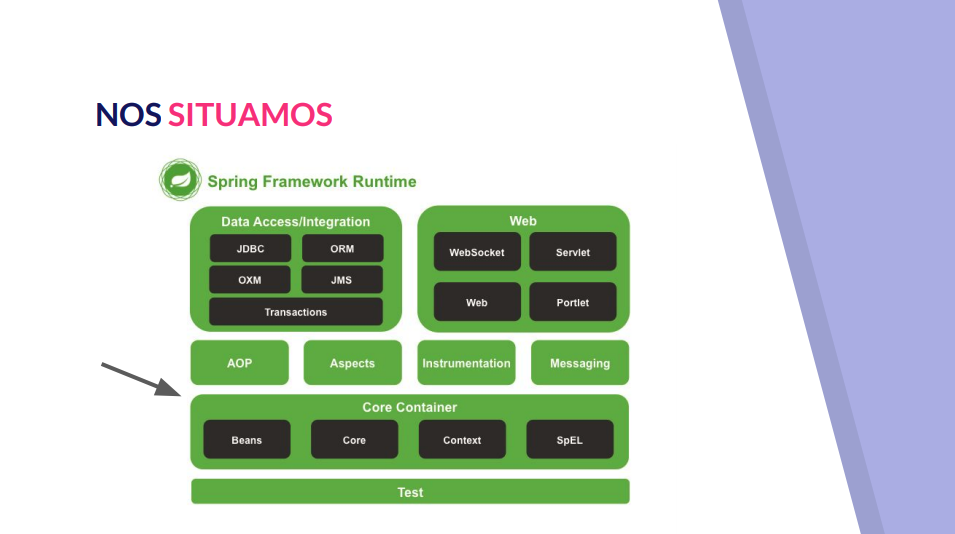

Tenemos el modulo del *Core Container* el curso esta basado en este modulo sobre todo en la parte de `Context`.

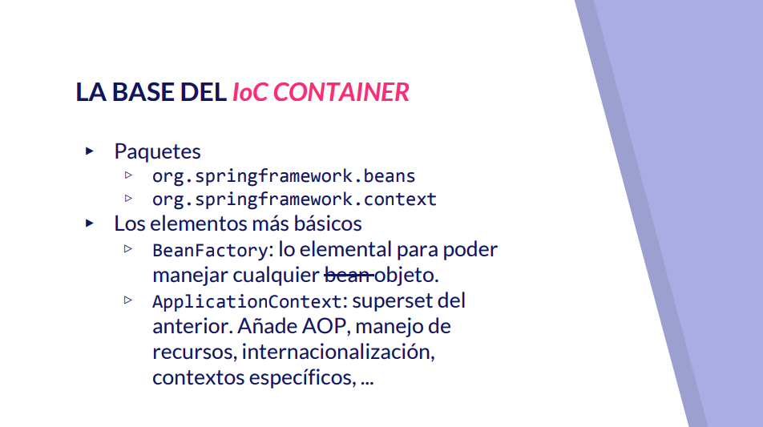

El Contenedor de Inversión de Control de Spring se basa en el uso de dos paquetes:

* `org.springframework.beans`
* `org.springframework.context`

Los elementos más básicos que utilizaremos seran:

* `BeanFactory` lo más elemental para poder manejar cualquier bean - objeto.
* `ApplicationContext` (la que usaremos) es una interfaz superset de `BeanFactory` que añade más funcionalidades.

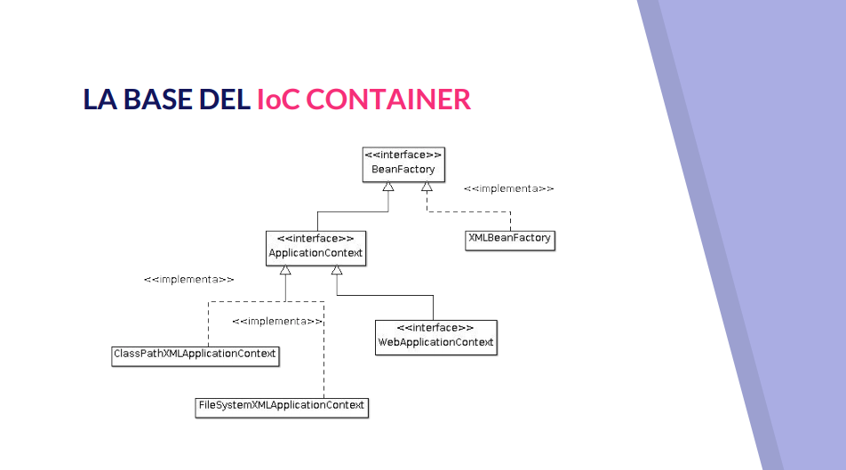

Diagrama de clases que vamos poder tener a nuestra disposición.

* `BeanFactory` Partimos de la raíz el más sencillo de todos.
* `ApplicationContext`: Trabajaremos con esta Interfaz y tiene dos clases principales que la implementan, aun que existen otras.
* `ClassPathXMLApplicatioContext`: Se encargara de cargar el contexto desde un archivo XML que esta ubicado dentro del classpath
* `FileSystemXMLApplicationContext`: Busca la configuración en el sistema de ficheros.
* `WebApplicationContext`: Interfaz para aplicaciones Web.
* `XMLBeanFactory` Esta no la usaremos

Es todo un ecosistema de clases que nos van a permitir construir ese __*Contenedor de Inversión de Control*__.

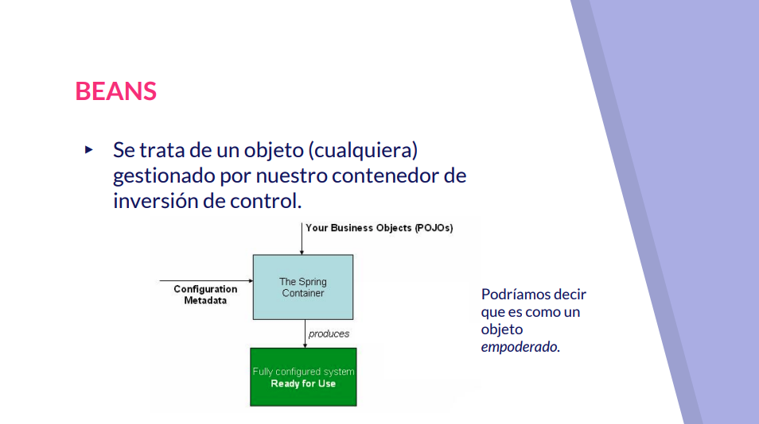

El contenedor lo que va a gestionar son *Beans*, un *Bean* no es más que un *objeto* gestionado por el contenedor de Inversión de Control, y que defineremos a partir de una serie de Metadatos, es decir es un como un objeto empoderado.

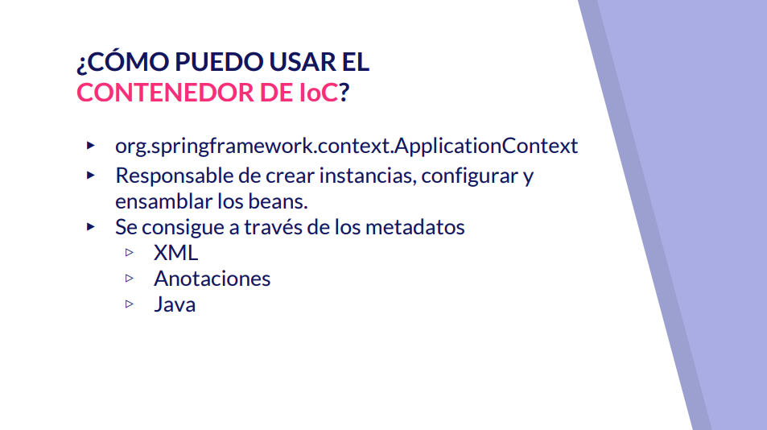

Comenzaremos con XML.

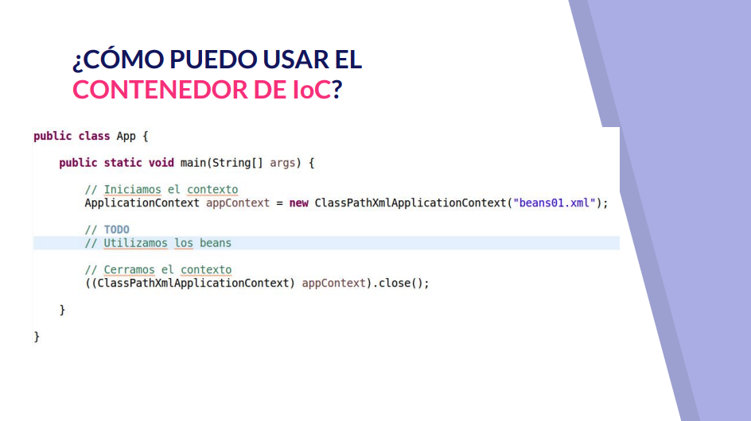

### :computer: Ejemplo Proyecto con `ClassPathXmlApplicationContext`

En nuestro primer ejemplo nuestro Contenedor de IoC tendra una estructura parecida a esta:

* Inicializaremos el contexto.
* Utilizaremos los beans.
* Cerraremos el contexto.

### Pasos para crear primer ejemplo

* Crear un nuevo proyecto Maven.
   
   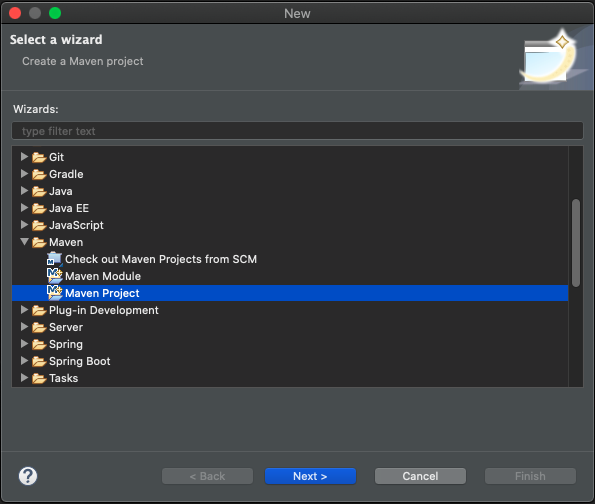
   
* No seleccionamos ningún arquetipo. Un arquetipo es un esqueleto de proyecto ya definido. 

   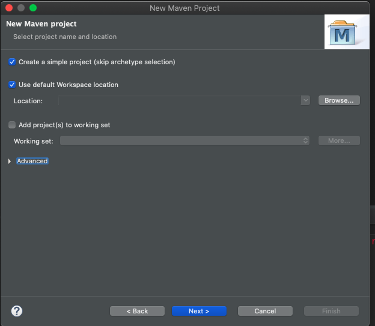

* Maven se basa en la creación de artefactos y los artefactos se basan en un Group Id y un Artifact Id.

   

* Se crea la estructura de nuestro proyecto Maven

   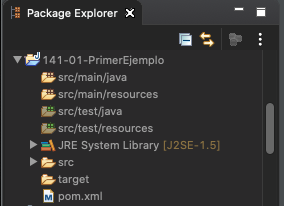

   Maven arrastra de cierta manera el uso de Java 5.

* Cambiamos a Java 8 pulsando en el proyecto con el botón derecho.

   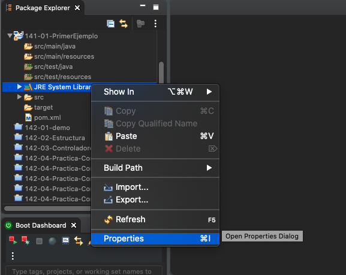

   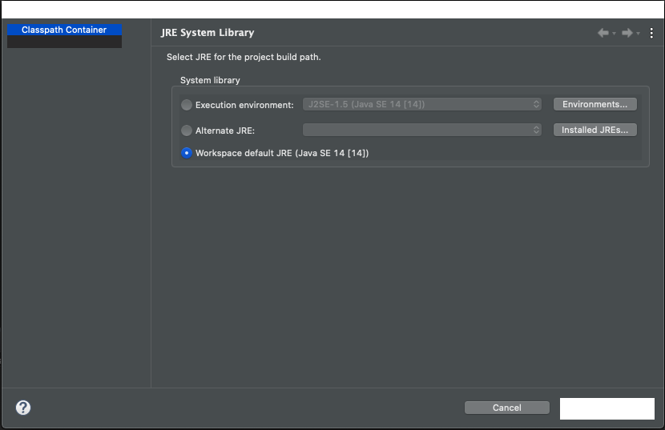
   
   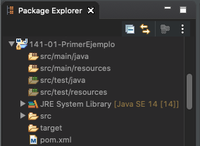
   
* Como proyecto Maven se nos genero el archivo `pom.xml` con el siguiente contenido: 

```html
<project xmlns="http://maven.apache.org/POM/4.0.0" xmlns:xsi="http://www.w3.org/2001/XMLSchema-instance" xsi:schemaLocation="http://maven.apache.org/POM/4.0.0 https://maven.apache.org/xsd/maven-4.0.0.xsd">
  <modelVersion>4.0.0</modelVersion>
  <groupId>com.openwebinars</groupId>
  <artifactId>141-01-PrimerEjemplo</artifactId>
  <version>0.0.1-SNAPSHOT</version>
  <name>141-01-PrimerEjemplo</name>
  <description>Primer ejemplo de uso de Spring</description>
</project>    
```

* Debemos añadir la dependencias de `Spring Context` la podemos obtener de [mvnrepository](https://mvnrepository.com/)

   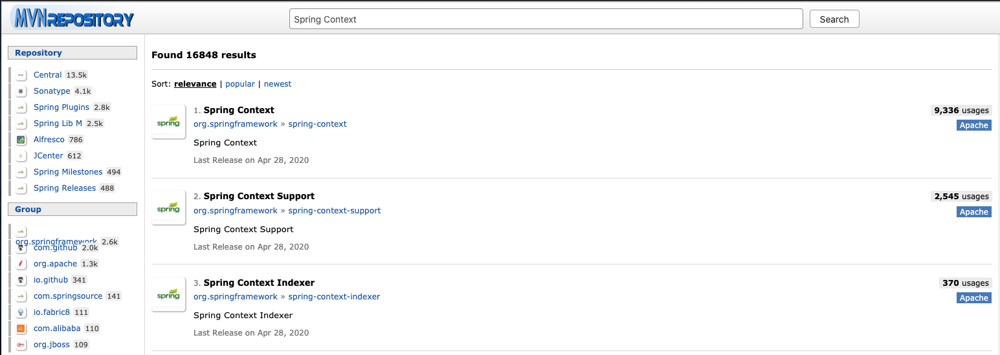
   
   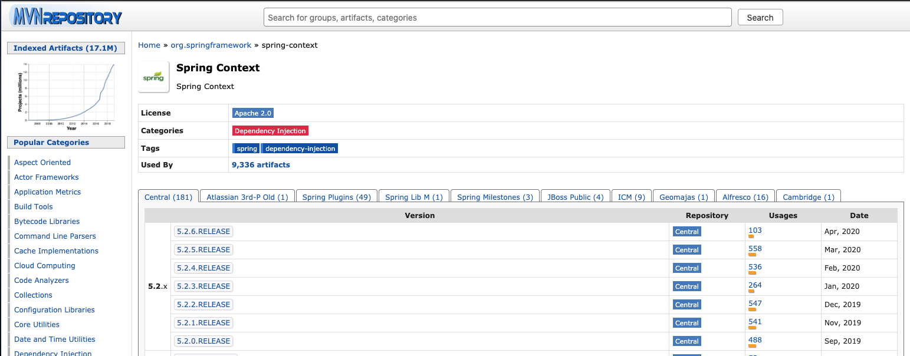
   
   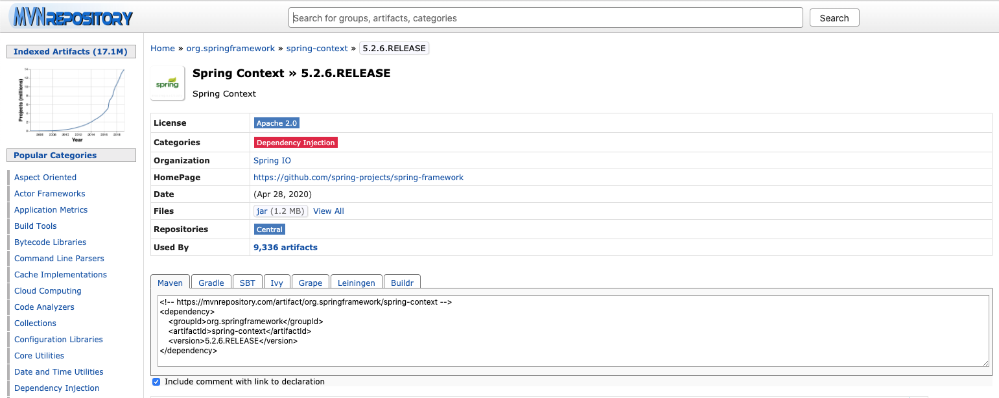

   Tenemos que incluir:
   
   ```js
   <!-- https://mvnrepository.com/artifact/org.springframework/spring-context -->
   <dependency>
      <groupId>org.springframework</groupId>
      <artifactId>spring-context</artifactId>
      <version>5.2.6.RELEASE</version>
   </dependency>
   ```
   
* Por lo que el archivo `pom.xml` quedara así:

```js
<project xmlns="http://maven.apache.org/POM/4.0.0"
	xmlns:xsi="http://www.w3.org/2001/XMLSchema-instance"
	xsi:schemaLocation="http://maven.apache.org/POM/4.0.0 https://maven.apache.org/xsd/maven-4.0.0.xsd">
	<modelVersion>4.0.0</modelVersion>
	<groupId>com.openwebinars</groupId>
	<artifactId>141-01-PrimerEjemplo</artifactId>
	<version>0.0.1-SNAPSHOT</version>
	<name>141-01-PrimerEjemplo</name>
	<description>Primer ejemplo de uso de Spring</description>
	<dependencies>
		<!-- https://mvnrepository.com/artifact/org.springframework/spring-context -->
		<dependency>
			<groupId>org.springframework</groupId>
			<artifactId>spring-context</artifactId>
			<version>5.2.6.RELEASE</version>
		</dependency>

	</dependencies>
</project>
```

   Es importante saber que inmediatamente cuando se inserta una nueva dependencia en `pom.xml` y se salva el archivo se descargan automaticamente todos los `jars` necesarios dentro de la carpeta `Maven Dependencies` y reconstruye el proyecto.
   
   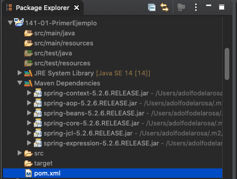

* Otra parte importante de la estructura creada es que existe una carpeta `src/main/java` donde colocaremos los archivos java y la carpeta `src/main/resources` donde colocaremos nuestross recursos como archivos `html`, `css`, `js`, `properties`, etc.

* Dentro de `src/main/java` creamos un nuevo paquete llamado `com.openwebinars.spring`

   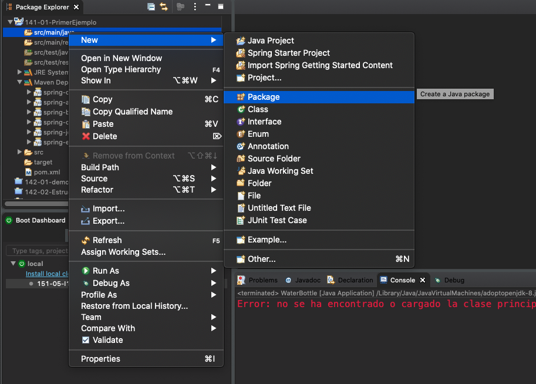
   
   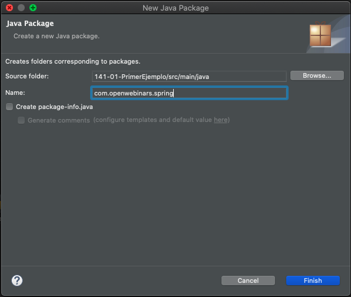

* Dentro del nuevo paquete creamos la clase llamada `App` con un `main`.

   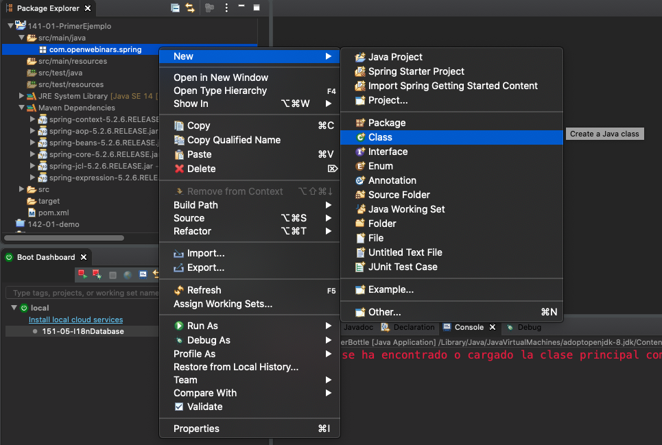
   
   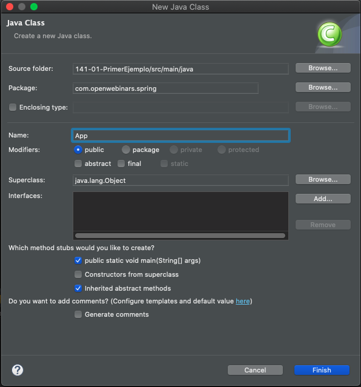
   
* Una vez que tenemos creada nuestra clase de aplicación, como hemos visto antes el algoritmp básico es 

   * Levantar el contexto (*Usaremos la clase `ClassPathXmlApplicationContext`*
   * Utilizar los beans
   * Cerrar el contexto (La interfaz `ApplicationContext` no tiene método `close` pero si las clases que lo implementan )
   * Definir dentro del Classpath un fichero descriptor XML donde definamos nuestros beans (`src/main/resources`).
   
   Nuestro código queda asi:
   
   ```java
   package com.openwebinars.spring;

   import org.springframework.context.ApplicationContext;
   import org.springframework.context.support.ClassPathXmlApplicationContext;

   public class App {

	public static void main(String[] args) {
		
		//Abrir contexto
		ApplicationContext appContext = new ClassPathXmlApplicationContext("beans.xml");
		
		
		//Cerrar contexto
		((ClassPathXmlApplicationContext) appContext).close();

	}

   }
   ```
   
   Para crear el archivo XML damos:
   
   
   
   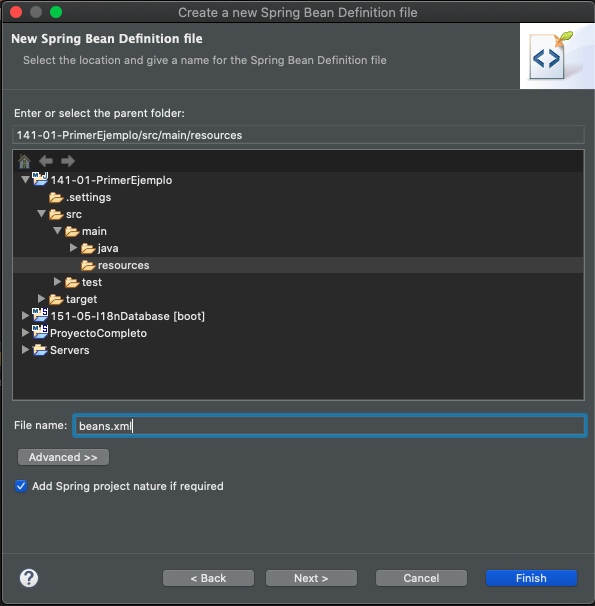
   
   
   
   No seleccionamos ninguno de ellos por que no usaremos en este ejemplo ningún bean
   
   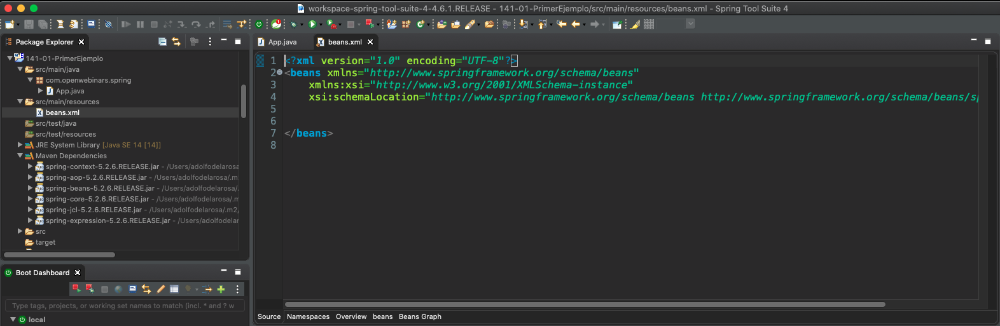
   
   Ya tenemos nuestro fichero XML.
   
   **NOTA:** La importación rápida se hace con Ctrl+Mayus+O

* Ejecutamos la aplicación, aunque no pasara gran cosa:

   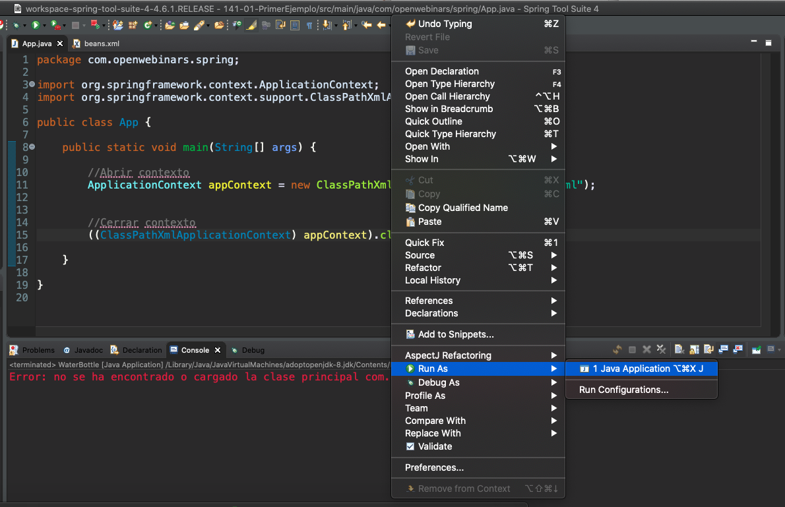
   
   Simplemente se levanta el contenedor y se cierra.
   
   
   **ESTE SERA EL ESQUEMA QUE UTILIZAREMOS EN LOS PRÓXIMOS EJEMPLOS**

### :computer: Ejemplo Proyecto con `FileSystemXmlApplicationContext`

Nuestro segundo ejemplo lo crearemos de la misma forma como creamos el primero. La estructurta generada es la siguiente:

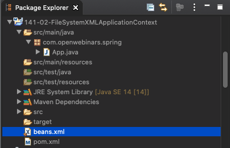

Hemos trabajado sobre tres archivos:

* `pom.xml`
* `beans.xml`
* `App.java`

*`pom.xml`*

```html
<project xmlns="http://maven.apache.org/POM/4.0.0"
	xmlns:xsi="http://www.w3.org/2001/XMLSchema-instance"
	xsi:schemaLocation="http://maven.apache.org/POM/4.0.0 https://maven.apache.org/xsd/maven-4.0.0.xsd">
	<modelVersion>4.0.0</modelVersion>
	<groupId>com.openwebinars</groupId>
	<artifactId>141-02-FileSystemXMLApplicationContext</artifactId>
	<version>0.0.1-SNAPSHOT</version>
	<name>141-02-FileSystemXMLApplicationContext</name>
	<description>Ejemplo usando FileSystemXMLApplicationContext</description>
	<dependencies>
		<!-- https://mvnrepository.com/artifact/org.springframework/spring-context -->
		<dependency>
			<groupId>org.springframework</groupId>
			<artifactId>spring-context</artifactId>
			<version>5.2.6.RELEASE</version>
		</dependency>
	</dependencies>
</project>
```

*`beans.xml`*

```html
<?xml version="1.0" encoding="UTF-8"?>
<beans xmlns="http://www.springframework.org/schema/beans"
	xmlns:xsi="http://www.w3.org/2001/XMLSchema-instance"
	xsi:schemaLocation="http://www.springframework.org/schema/beans http://www.springframework.org/schema/beans/spring-beans.xsd">


</beans>
```

*`App.java`*

```java
package com.openwebinars.spring;

import org.springframework.context.ApplicationContext;
import org.springframework.context.support.FileSystemXmlApplicationContext;

public class App {

	public static void main(String[] args) {
		//Abrir contexto
		ApplicationContext appContext = new FileSystemXmlApplicationContext("beans.xml");
		
		//Cerrar contexto
		((FileSystemXmlApplicationContext) appContext).close();
	}

}
```

En este ejemplo en lugar de utilizar la clase `ClassPathXmlApplicationContext` usamos `FileSystemXmlApplicationContext` esto lo unico que nos permite es que el fichero XML no tenga por que estar dentro del `Classpath` sino que pueda estar en una ubicación del sistema de ficheros, en este caso lo hemos puesto en la raíz del proyecto. 

Si ejecutamos la aplicación abre y cierra el contexto anagolamente como en el ejemplo anterior pero usando `FileSystemXmlApplicationContext`.

# 07 Mi primer Bean 6:49 

[PDF 2-2_Mi_primer_bean.pdf](pdfs/2-2_Mi_primer_bean.pdf)

## Resumen Profesor

### Cómo nombrar un bean

Un bean, normalmente, tiene un solo nombre; y este debe ser único en el contenedor donde esté registrado. Si necesitamos que tenga más de un nombre, deberíamos declarar un alias.

En XML, para indicar el nombre de un bean, podemos usar su propiedad `id`. Los nombres suelen seguir la notación *Camel Case*: `myBean`, `emailService`, ... Si queremos declararle algún alias, podemos usar la propiedad `name`, indicando los nombre separados por comas, punto y comas o espacios.

### Definición de un bean

Durante este ejemplo solo utilizaremos algunas de las propiedades necesarias de un bean, como el `id`, `name` o `class`. A continuación tenemos una lista más completa:

* `class`
* `name`
* `scope`
* `lazy-init`
* `depends-on`
* `init-method`
* `destroy-method`

## Transcripción

En esta lección aprenderemos a crear un *bean* para poderlo utilizar.


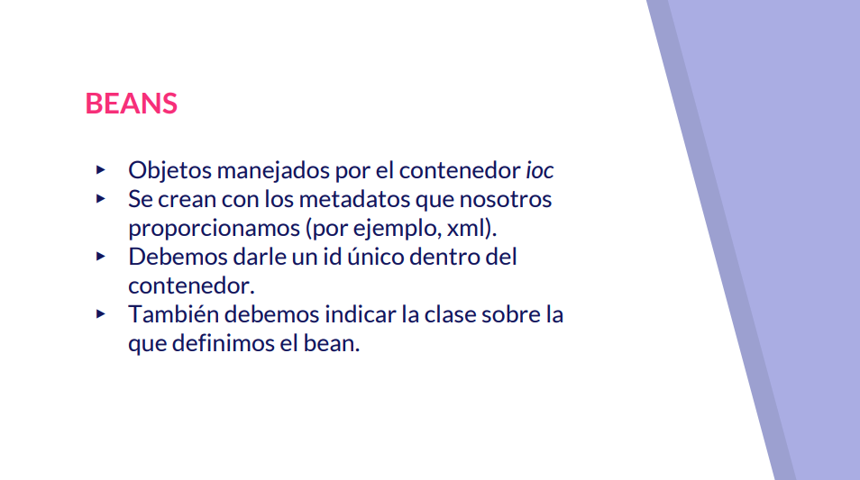

Un bean no deja de ser un simple objeto, una clase *pojo* manejada por el Contenedor de IoC, ademas de la clase *pojo* necesitamos proporcionar unos *metadatos* para que este objeto pueda ser un *bean*, en estos primeros ejemplos lo haremos con XML. Podemos proporcionarle un id único dentro del contenedor, tambien debemos indicar la *clase* sobre la cual se define ese *bean*.

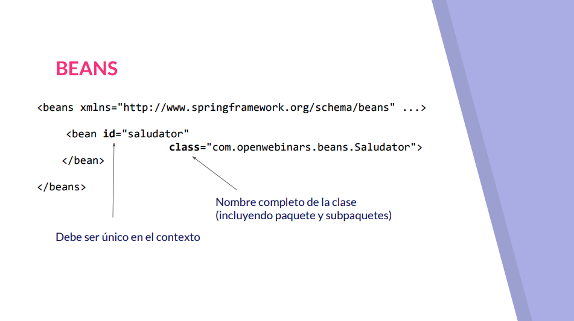

En XML aquí tenemos un ejemplo muy básico de una clase llamada `Saludator` la cual será un servicio encargada de saludar. Se utiliza la etiqueta `<bean>` con el atributo `id` identificamos al bean y con el atributo `class` proporcinamos la ruta completa de la clase 

### :computer: Ejemplo Proyecto Beans 

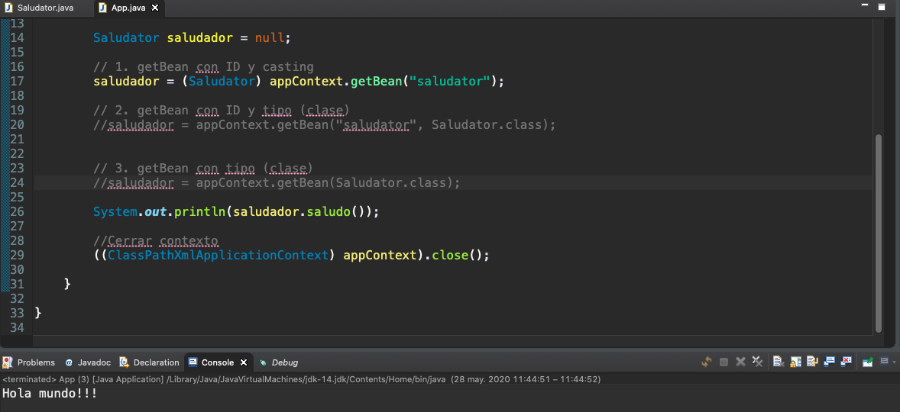

En nuestro archivo `beans.xml` declaramos nuestro bean como se explico anteriormente:

*`beans.xml`*

```html
<?xml version="1.0" encoding="UTF-8"?>
<beans xmlns="http://www.springframework.org/schema/beans"
	xmlns:xsi="http://www.w3.org/2001/XMLSchema-instance"
	xsi:schemaLocation="http://www.springframework.org/schema/beans http://www.springframework.org/schema/beans/spring-beans.xsd">

	<bean id="saludator" class="com.openwebinars.beans.Saludator"></bean>

</beans>
```

Nuestra clase *Pojo* es una clase francamente sencilla, solo tiene un método `saludo()` que retorna un `String` para saludar.

*`Saludator.java`*

```java
package com.openwebinars.beans;

public class Saludator {
	
   public String saludo() {
      return "Hola mundo!!!";
   }

}
```

Con esto ya tenemos creado nuestro primer *Bean* pero ¿cómo podemos utilizarlo?

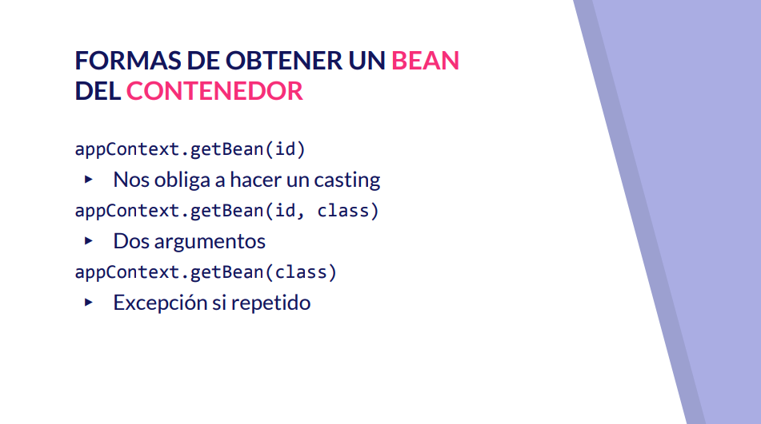

La interfaz `appContext` nos proporciona un método que esta sobre-escrito que es `getBean()` que nos permite obtener un bean de diferentes maneras:

* `appContext.getBean(id)`: Busca unicamente por el `id`, devuelve un `object` por lo que NOS OBLIGA A realizar un *casting*
* `appContext.getBean(id, class)` Busca por el `id` y por `class`, devuelve directamente la clase (no necesita casting)
* `appContext.getBean(class)` Busca  unicamente por `class`, devuelve directamente la clase, es la más atractiva de las 3 opciones. Tiene como desventaja que si un tipo de bean de una clase en particular se encuentra repetido, cosa que puede pasar, se produciría una excepción.

En nuestro archivo `App.java` vamos a meter el código para los tres casos e iremos probando uno a uno:

*`App.java`*

```java
package com.openwebinars.beans;

import org.springframework.context.ApplicationContext;
import org.springframework.context.support.ClassPathXmlApplicationContext;

public class App {

   public static void main(String[] args) {
		
      //Abrir contexto
      ApplicationContext appContext = new ClassPathXmlApplicationContext("beans.xml");
			
      Saludator saludator = null;
		
      // 1. getBean con ID y casting
      //saludador = (Saludator) appContext.getBean("saludator");
		
      // 2. getBean con ID y tipo (clase)
      //saludador = appContext.getBean("saludator", Saludator.class);
			
      // 3. getBean con tipo (clase)
      //saludador = appContext.getBean(Saludator.class);

      System.out.println(saludador.saludo());
      
      //Cerrar contexto
      ((ClassPathXmlApplicationContext) appContext).close();

   }
}
```

Lo que queremos es que se imprima el saludo y comprobar que se puede hacer de estas 3 maneras.

Probando el caso 1 tenemos:


Probando el caso 2 tenemos:

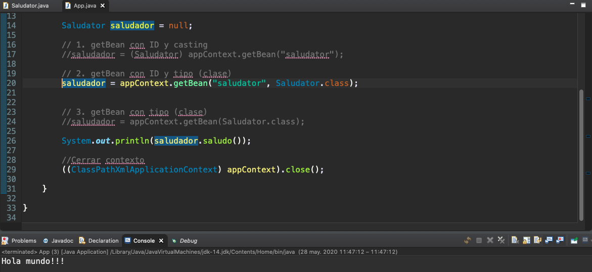

Probando el caso 3 tenemos:

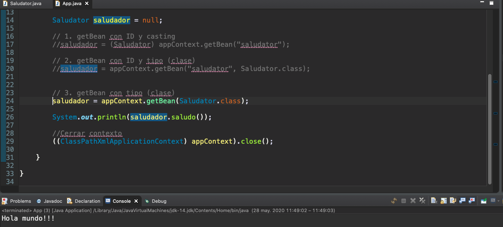

En este ultimo caso estamos haciendolo a sabiendas de que no existe otro bean con la misma clase, podríamos comprobar que pasa si creamos otro bean que apunte también a `Saludator`

```html
<?xml version="1.0" encoding="UTF-8"?>
<beans xmlns="http://www.springframework.org/schema/beans"
	xmlns:xsi="http://www.w3.org/2001/XMLSchema-instance"
	xsi:schemaLocation="http://www.springframework.org/schema/beans http://www.springframework.org/schema/beans/spring-beans.xsd">

	<bean id="saludator" class="com.openwebinars.beans.Saludator"></bean>
	<bean id="otro" class="com.openwebinars.beans.Saludator" />

</beans>
```

Probando nuevamente el caso 3 tenemos:

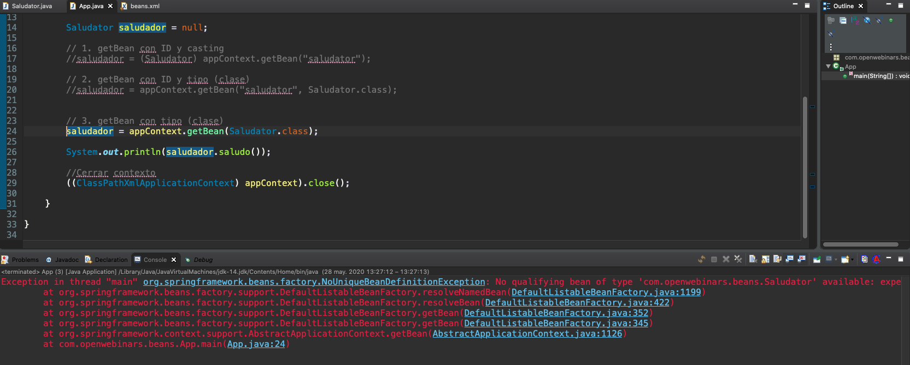

Nos genera una excepción `No qualifying bean of type 'com.openwebinars.beans.Saludator' available: expected single matching bean but found 2: saludator,otro` ya que no es capaz de identificar cual de los dos beans queremos ejecutar, no le basta unicamente con la clase (Hay algunas estrategias para solventar este problema).

Sin embargo si ejecutamos la versión 2 no existe problema por que el bean se identifica tanto con el `id` como con el `class`.

Probando nuevamente el caso 2 tenemos:

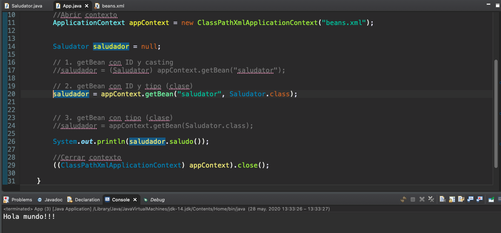

Inclusive la versión 1 tampoco tendría problemas. 

### Resumen

En esta lección hemos aprendido:

* Como levantar nuestro Contenedor de Inversión de Control
* Como registrar la metainformación de uno o varios beans
* Como recuperar los beans dentro de nuestro código Java para utilizarlos
* Como cerrar el Contenedor de Inversión de Control

# 08 Inyeccion de dependencias: vía setter vs. vía constructor 12:58 

[PDF 2-3_Inyeccion_de_dependencias.pdf](pdfs/2-3_Inyeccion_de_dependencias.pdf)

## Resumen Profesor

### *Inner beans* (beans anidados)

En ocasiones, podemos crear beans anidados (o internos) a otros beans, en lugar de referenciarlos. **¿Cuál sería la ventaja de un *inner bean* frente a otro referenciado?**. La respuesta no es difícil: el bean anidados no será accesible desde fuera el bean externo, mientras que el referenciado puede ser accedido por otros beans.

```html
<bean id="outer" class="...">
    <!-- instead of using a reference to a target bean, simply define the target bean inline -->
    <property name="target">
        <bean class="com.example.Person"> <!-- this is the inner bean -->
            <property name="name" value="Fiona Apple"/>
            <property name="age" value="25"/>
        </bean>
    </property>
</bean>
```

En este ejemplo, el bean de tipo `Person` solo podría ser accedido por el bean `outer`.

### Colecciones

Spring nos ofrece la posibilidad de inyectar valores dentro de una colección. Los tipos soportados son `<list>` (`java.util.List`), `<set>` (`java.util.Set`), `<map>` (`java.util.Map`), `<props>` (`java.util.Properties`).

```html
<bean id="moreComplexObject" class="example.ComplexObject">
    <!-- results in a setAdminEmails(java.util.Properties) call -->
    <property name="adminEmails">
        <props>
            <prop key="administrator">administrator@example.org</prop>
            <prop key="support">support@example.org</prop>
            <prop key="development">development@example.org</prop>
        </props>
    </property>
    <!-- results in a setSomeList(java.util.List) call -->
    <property name="someList">
        <list>
            <value>a list element followed by a reference</value>
            <ref bean="myDataSource" />
        </list>
    </property>
    <!-- results in a setSomeMap(java.util.Map) call -->
    <property name="someMap">
        <map>
            <entry key="an entry" value="just some string"/>
            <entry key ="a ref" value-ref="myDataSource"/>
        </map>
    </property>
    <!-- results in a setSomeSet(java.util.Set) call -->
    <property name="someSet">
        <set>
            <value>just some string</value>
            <ref bean="myDataSource" />
        </set>
    </property>
</bean>
```

## Transcripción


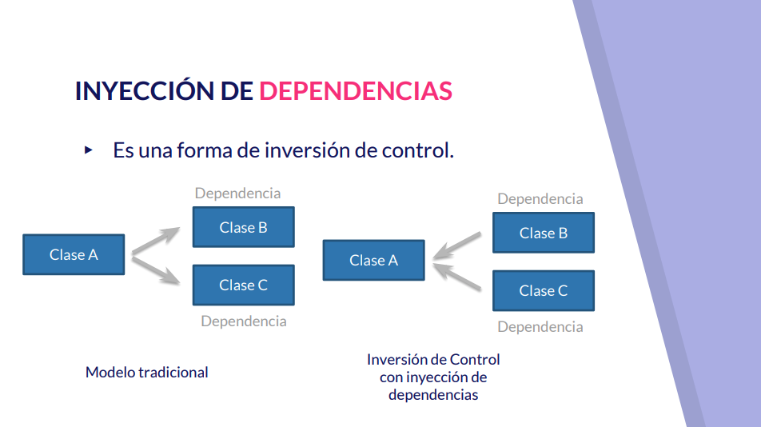

Si recordamos cuando hablamos sobre la Inyección de dependencias haciamos referencia a que si un objeto necesita de otros dos 
objetos no va a tener que instanciarlos, sino que va a tener que tiene dos dependencias y espera que alguien se las proporcione.

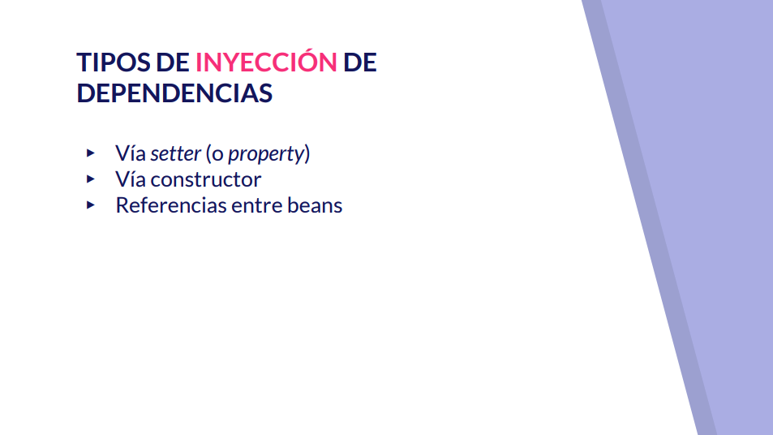

Con Spring podemos crear esas dependencias de varias maneras:

* Vía Setters
* Vía Constructor
* Referencias entre beans

### Inyección vía Setter

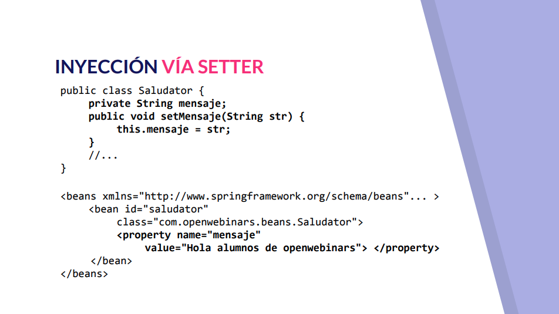

La Inyección vía Setter es muy sencilla, pensemos que en nuesta clase `Saludator` tenemos un mensaje que reciba un valor y será con el que saludaremos a nuestro publico.

Como se observa en el código estamos declarando la dependencia(el mensaje) como `private String mensaje;` y para hacer la *Inyección vía Setter* declaramos un método setter para esa propiedad `setMensaje(String str){`, donde recibimos el valor en la referencia `str` y se la asignamos a nuestro mensaje. 

*¿Cómo declaramos esa Inyección de Dependencia en XML?*

Lo hacemos anidando dentro del elemento `bean` el elemento `property` que hace referencia mediante su atributo `name` al nombre de la propiedad y mediante `value` el valor que va a ser inyectado. De esta forma cuando se carge el Contenedor de IoC podremos comprobar como `mensaje` a través de el setter `setMensaje(String str)` Spring asigna el valor y ya podemos hacer con el lo que corresponda.

### :computer: Ejemplo Proyecto Setter

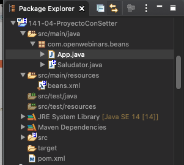

En este proyecto tenemos nuestro archivo `beans.xml`:

```js
<?xml version="1.0" encoding="UTF-8"?>
<beans xmlns="http://www.springframework.org/schema/beans"
	xmlns:xsi="http://www.w3.org/2001/XMLSchema-instance"
	xsi:schemaLocation="http://www.springframework.org/schema/beans http://www.springframework.org/schema/beans/spring-beans.xsd">

	<bean id="saludator" class="com.openwebinars.beans.Saludator">
	   <property name="mensaje" value="Hola alumnos de openwebinars"></property>
	</bean>
	
</beans>
```

Hemos añadido el elemento `property` al bean para asignar un valor a la propiedad `mensaje` de la clase `Saludator`.


Por lo tanto la clase `Saludator` cuenta con la propiedad `mensaje` y el método `setMensaje(String str)` para asignarle un valor.

*`Saludator`*

```java
package com.openwebinars.beans;

public class Saludator {
	
   private String mensaje;
	
   public void setMensaje(String str) {
      this.mensaje = str;
   }
	
   public String saludo() {
      return (mensaje == null) ? "Hola mundo!!!" : mensaje;
   }

}
```

En el método `saludo()` preveemos posibles errores en caso de que no se inyecte un mensaje mandamos uno por default y en caso de que si se reciba lo enviamos.

La clase de Aplicación no tiene ningún cambio (solo se usa el get para la clase)

*`App.java`*

```java
package com.openwebinars.beans;

import org.springframework.context.ApplicationContext;
import org.springframework.context.support.ClassPathXmlApplicationContext;

public class App {

   public static void main(String[] args) {
		
      //Abrir contexto
      ApplicationContext appContext = new ClassPathXmlApplicationContext("beans.xml");
			
      Saludator saludador = null;
		
      saludador = appContext.getBean(Saludator.class);
		
      System.out.println(saludador.saludo());
		
      //Cerrar contexto
      ((ClassPathXmlApplicationContext) appContext).close();

   }
}
```

Si ejecutamos la aplicación tenemos:

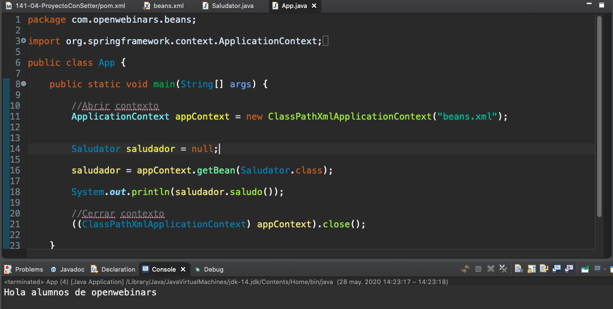

***La salida que obtenemos es el valor que se ha inyectado vía setter.***

Esto nos permite añadir algo de lógica en el método setter, aun que no es lo más usual. Por ejemplo podríamos tener:

```java
public void setMensaje(String str) {
   this.mensaje = str.toUpperCase();
}
```

Al ejecutar la aplicación tenemos:

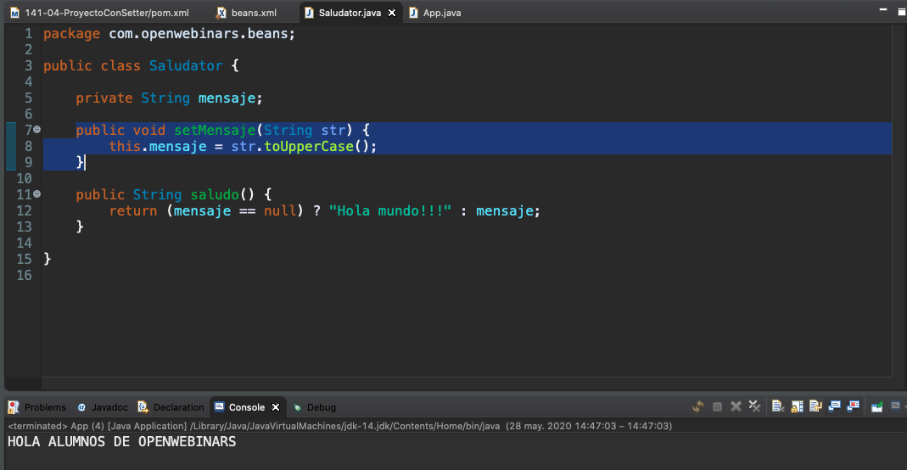

Aunque como decimos no es lo más usual, por lo que revertimos ese cambio.

En resumen esta es la Inyección vía Setter donde se hace teniendo:

* Una propiedad
* Un método setter
* El elemento `property` dentro de `bean`

### Inyección vía Constructor

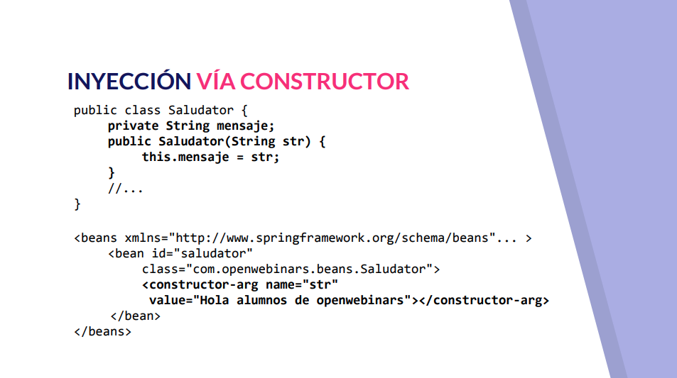

Ahora hablemos de la Inyección vía Constructor la cual es también muy sencilla.

En esta inyección vía Constructor, en lugar de proporcionar la dependencia a través de un Setter lo haremos a través de un Constructor en nuestra clase `Saludator`, el cual es un constructor común y corriente.

El secreto se encuentra dentro de la declaración de nuestro `bean` donde hemos cambiado el elemento `property` por el elemento `constructor-arg`, con el atributo `name` indicamos el argumento que recibe el constructor y con el atributo `value` le asignamos un valor. 

Los elementos del constructor también se pueden indicar a través de su índice, si los tipos de datos del constructor son diferentes, incluso podemos añadir los elementos en orden sin especificar más datos, pero es mejor siempre hacer referencia por índice o por `name`.

### :computer: Ejemplo Proyecto Inyección Vía Constructor

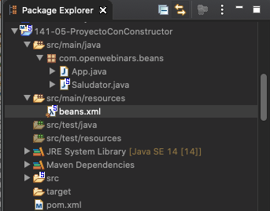

En nuestro `beans.xml` hemos cambiado el elemento `property` por `constructor-arg`:

*`beans.xml`*

```html
<?xml version="1.0" encoding="UTF-8"?>
<beans xmlns="http://www.springframework.org/schema/beans"
	xmlns:xsi="http://www.w3.org/2001/XMLSchema-instance"
	xsi:schemaLocation="http://www.springframework.org/schema/beans http://www.springframework.org/schema/beans/spring-beans.xsd">

	<bean id="saludator" class="com.openwebinars.beans.Saludator">
	   <constructor-arg name="str" value="Hola alumnos de openwebinars"></constructor-arg>
	</bean>
	
</beans>
```
En este caso podríamos eliminar `name="str"` y funcionaria igual. Pero si lo ponemos el nombre debe coincidir con el nombre del argumento en el constructor de la clase ` Saludator`.

Así mismo en nuestra clase `Saludator` hemos sustituido el método setter por un constructor:

*`Saludator.java`*

```java
package com.openwebinars.beans;

public class Saludator {
	
   private String mensaje;
	
   public Saludator(String str) {
      this.mensaje = str;
   }
	
   public String saludo() {
      return (mensaje == null) ? "Hola mundo!!!" : mensaje;
   }

}
```

Nuestra clase de la aplicación no ha sufrido ningún cambio.

*`App.java`*

```java
package com.openwebinars.beans;

import org.springframework.context.ApplicationContext;
import org.springframework.context.support.ClassPathXmlApplicationContext;

public class App {

   public static void main(String[] args) {
		
      //Abrir contexto
      ApplicationContext appContext = new ClassPathXmlApplicationContext("beans.xml");
		
      Saludator saludador = null;
		
      saludador = appContext.getBean(Saludator.class);
		
      System.out.println(saludador.saludo());
		
      //Cerrar contexto
      ((ClassPathXmlApplicationContext) appContext).close();

   }
}
```

Al ejecutar la aplicación tenemos:

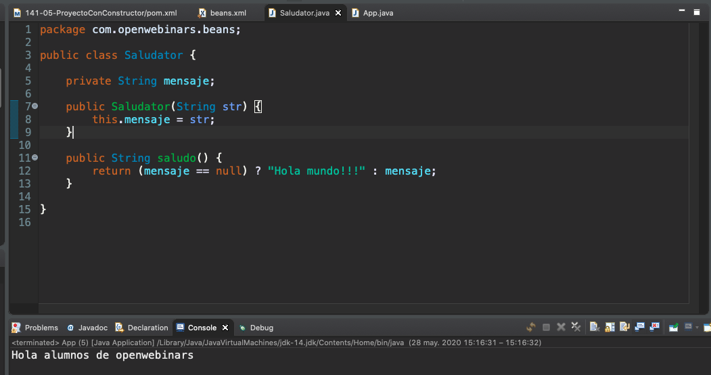

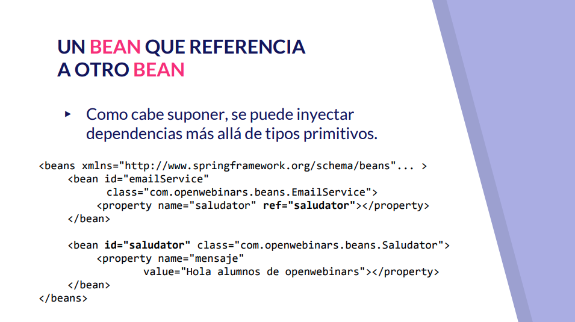

Otro caso que podemos tener es cuando un *bean* hace referencia a otro bean, es decir a otra clase que hayamos definido.

Supongamos que a la hora de saludar deseamos también a la vez enviar un email de saludo para el cual contariamos con la clase `EmailService`. Esta clase `EmailService` tiene una dependencia con `Saludator` para poder enviar el mensaje de saludo a nuestros clientes.

¿Cómo podemos referenciar un bean dentro de otro?

La manera más sencilla que tenemos la podemos ver en el código de la lamina, en este ejemplo lo hacemos vía setter. 

La clase o bean `EmailService` tiene una propiedad llamada `saludator` de tipo `Saludator` y *a través del atributo **ref** le decimos que busque otro bean que estará dentro del contenedor que se llama **saludator**, el que abajo esta identificado con `id=saludator`*.

De esta forma tenemos la posibilidad de inyectar un bean dentro de otro.

### :computer: Ejemplo Proyecto Referencias con Clases

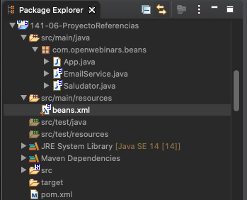

En nuestro archivo `beans.xml` vemos la definición de los dos beans.

*`beans.xml`*

```html
<?xml version="1.0" encoding="UTF-8"?>
<beans xmlns="http://www.springframework.org/schema/beans"
	xmlns:xsi="http://www.w3.org/2001/XMLSchema-instance"
	xsi:schemaLocation="http://www.springframework.org/schema/beans http://www.springframework.org/schema/beans/spring-beans.xsd">

	<bean id="emailService" class="com.openwebinars.beans.EmailService">
	   <property name="saludator" ref="saludator"></property>
	</bean>
	
	<bean id="saludator" class="com.openwebinars.beans.Saludator">
	   <property name="mensaje" value="Hola alumnos de openwebinars"></property>
	</bean>
	
</beans>
```

Ahora mostramos ambas clases que definen a cada uno de los beans.

*`EmailService.java`*

```java
package com.openwebinars.beans;

public class EmailService {
	
   private Saludator saludator;
	
   public void setSaludator(Saludator saludator) {
      this.saludator = saludator;
   }
	
   public void enviarEmailSaludo(String destinatario) {
      System.out.println("Enviando email a " + destinatario);
      System.out.println("Mensaje: " + saludator.saludo());
   }

}
```

Esta clase `EmailService` tiene una propiedad `saludator` que como hemos visto hace referencia al bean `Saludator` y como vimos en la definición de los beans estamos usando el elemento `property` aquí necesitamos definir el método `setSaludator(Saludator saludator)`.

Y contamos con el método `enviarEmailSaludo(...)` que es el que realmente realiza la acción en esta clase.

*`Saludator.java`*

```java
package com.openwebinars.beans;

public class Saludator {
	
   private String mensaje;
	
   public void setMensaje(String str) {
      this.mensaje = str; 
   }
	
   public String saludo() {
      return (mensaje == null) ? "Hola mundo!!!" : mensaje;
   }

}
```

Y finalmente en nuestra clase principal tenemos:

*`App.java`*

```java
package com.openwebinars.beans;

import org.springframework.context.ApplicationContext;
import org.springframework.context.support.ClassPathXmlApplicationContext;

public class App {

   public static void main(String[] args) {
		
      //Abrir contexto
      ApplicationContext appContext = new ClassPathXmlApplicationContext("beans.xml");
		
      Saludator saludador = null;
		
      saludador = appContext.getBean(Saludator.class);		
      System.out.println(saludador.saludo() + "\n\n");
		
      EmailService emailService = null;
		
      emailService = appContext.getBean(EmailService.class);
      emailService.enviarEmailSaludo("adolfo@gmail.com");
		
      //Cerrar contexto
      ((ClassPathXmlApplicationContext) appContext).close();

   }

}
```

Aquí podemos seguir usando nuestro bean `Saludator` y también podemos usar el bean `EmailService` que poder debajo utiliza la dependencia del bean `Saludator`.

Al ejecutar la aplicación tenemos:

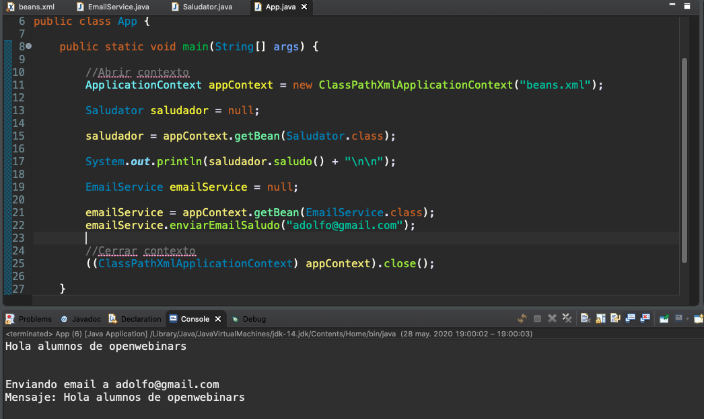

Vemos claramente la salida que realiza cada uno de los beans. En el caso de `EmailService`, vemos claramente como referencía a su vez a `Saludator` para mostrar el mensaje. De esta forma estamos referenciado a un bean desde otro.

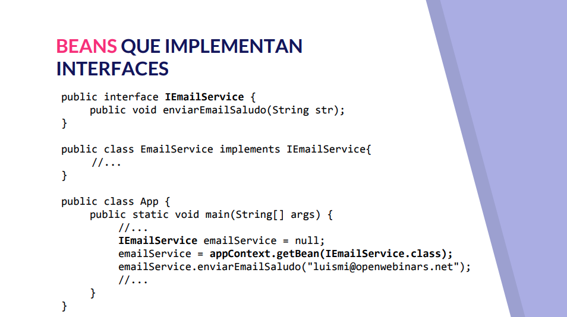

En el ejemplo anterior realizamos la referencia con clases, pero también lo podemos realizar con Interfaces. 

Podemos tener beans que implementan Interfaces, de manera que podemos declarar posteriormente referencias a esos beans del tipo de la interface. Esto va a hacer muy potente, lo usaremos en lecciones posteriores para casos en que quermos definir un *contrato* a través de una interfaz, por ejemplo los DAO de acceso a datos y que posteriormente nos van a permitir tener varios DAOs que implementen esa interfaz y los podamos utilizar en una versión inicial para acceder datos en un fichero, en la versión de desarrollo con una BD embebida, en la versión en producción que acceda a un servidor remoto, pero siempre haciendo refererencía a esa interfaz. 

Todo esto lo tenemos en el siguiente ejemplo.

### :computer: Ejemplo Proyecto Referencias con Interfaces

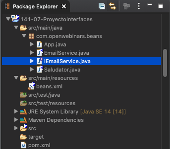

La declaración de beans es identica que el ejemplo anterior.

*`beans.xml`*

```html
<?xml version="1.0" encoding="UTF-8"?>
<beans xmlns="http://www.springframework.org/schema/beans"
	xmlns:xsi="http://www.w3.org/2001/XMLSchema-instance"
	xsi:schemaLocation="http://www.springframework.org/schema/beans http://www.springframework.org/schema/beans/spring-beans.xsd">

	<bean id="emailService" class="com.openwebinars.beans.EmailService">
	   <property name="saludator" ref="saludator"></property>
	</bean>
	
	<bean id="saludator" class="com.openwebinars.beans.Saludator">
	   <property name="mensaje" value="Hola alumnos de openwebinars"></property>
	</bean>
	
</beans>
```

Hemos añadido la interfaz `IEmailService` en la cual solo hemos definido un método. 

*`IEmailService`*

```java
package com.openwebinars.beans;

public interface IEmailService {
	
   public void enviarEmailSaludo(String str);

}
```

Nuestra clase `EmailService` implementa la interfaz `IEmailService`

*`EmailService`*

```java

public class EmailService implements IEmailService{
	
   private Saludator saludator;
	
   public void setSaludator(Saludator saludator) {
      this.saludator = saludator;
   }
	
   public void enviarEmailSaludo(String destinatario) {
      System.out.println("Enviando email a " + destinatario);
      System.out.println("Mensaje: " + saludator.saludo());
   }

}
```


*`App.java`*

```java
package com.openwebinars.beans;

import org.springframework.context.ApplicationContext;
import org.springframework.context.support.ClassPathXmlApplicationContext;

public class App {

   public static void main(String[] args) {
		
      //Abrir contexto
      ApplicationContext appContext = new ClassPathXmlApplicationContext("beans.xml");
		
      Saludator saludador = null;
		
      saludador = appContext.getBean(Saludator.class);
		
      System.out.println(saludador.saludo() + "\n\n");
		
      IEmailService emailService = null;
		
      emailService = appContext.getBean(IEmailService.class);
      emailService.enviarEmailSaludo("adolfo@gmail.com");
		
      //Cerrar contexto
      ((ClassPathXmlApplicationContext) appContext).close();

   }

}
```

En esta clase es donde se notan más los cambios de usar la Interfaz que la clase. Al momento de rescatar el bean `emailService` lo estamos rescatando de la Interface no de la Clase. Spring se encargara de buscar dentro de nuestro contenedor clases que implementen la interfaz `IEmailService` para poder devolvernos una. 

Tanto es así que si tuvieramos dos clases diferentes que implementen esta interfaz tendríamos un potencial error por duplicación.

Pero aun así el uso de Interfaces de esta manera va a hacer muy potente por que nos va a permitir desacoplar a un más nuestras clases a travez del uso de interfaces.

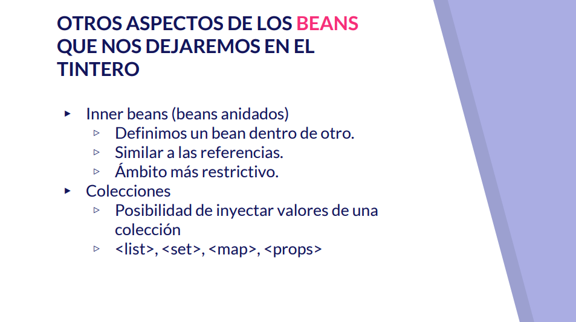

# 09 Inyeccion automática 9:22 

[PDF 2-4_Inyeccion_automatica.pdf](pdfs/2-4_Inyeccion_automatica.pdf)

## Resumen Profesor

### Exclusión de la inyección automática

Podemos excluir un bean de ser *candidato* a inyectarse automáticamente mediante el atributo `autowired-candidate=false`. De esa forma, solo podrá inyectarse de forma explícita.

También podemos limitar los candidatos a ser autoinyectados utilizando un patrón sobre los nombres de los beans y el atributo `default-autowired-candidates` (***este es solo aplicable al elemento raiz `<beans>`***). Por ejemplo, para que todos ellos incluyeran el nombre repository, podríamos usar el patrón `*Repository`.

## Transcripción


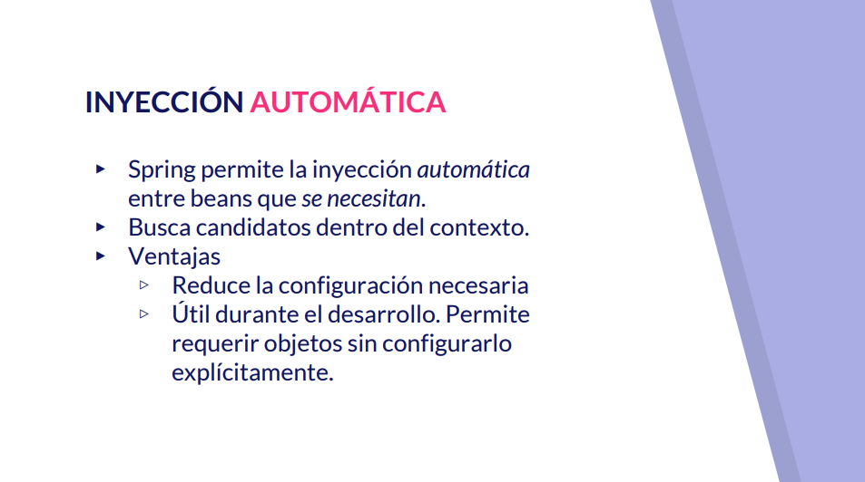


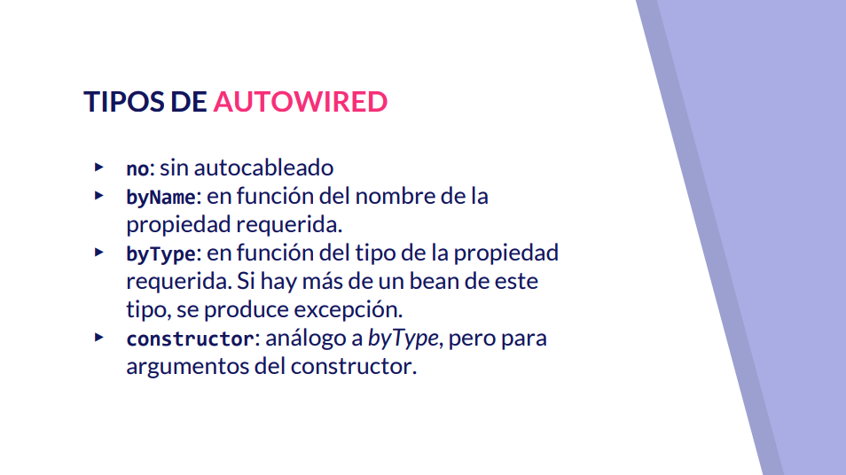

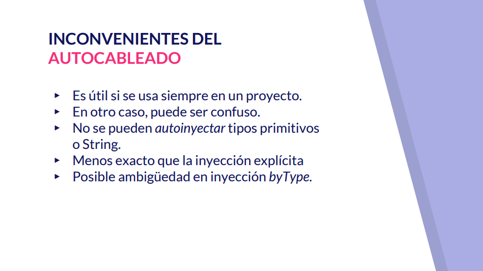

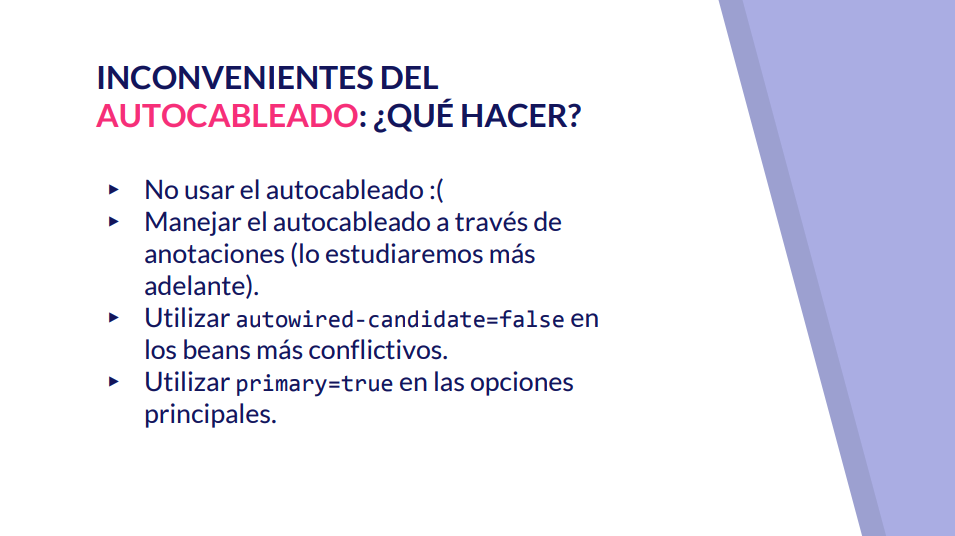

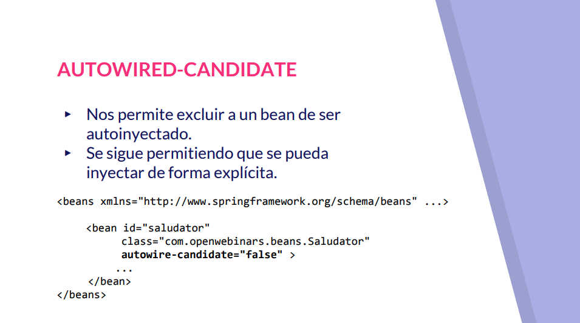

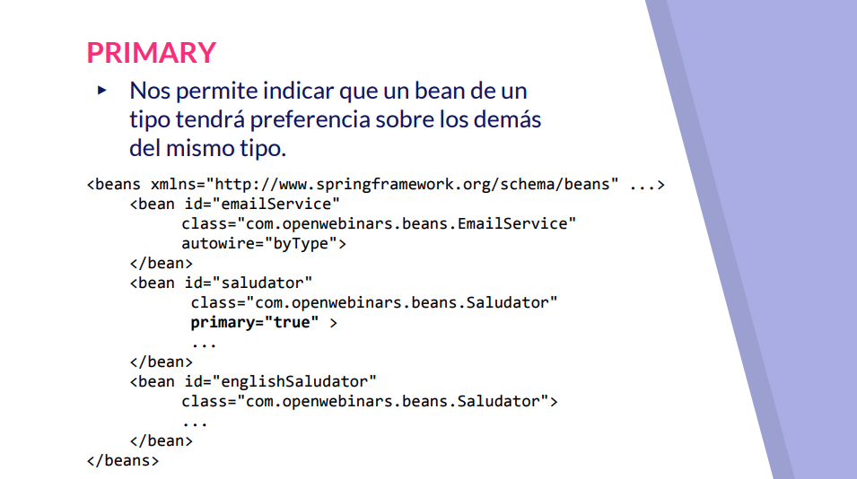

# Contenido adicional  4

* [PDF 2-1_Contenedor_de_IoC.pdf](pdfs/2-1_Contenedor_de_IoC.pdf)
* [PDF 2-2_Mi_primer_bean.pdf](pdfs/2-2_Mi_primer_bean.pdf)
* [PDF 2-3_Inyeccion_de_dependencias.pdf](pdfs/2-3_Inyeccion_de_dependencias.pdf)
* [PDF 2-4_Inyeccion_automatica.pdf](pdfs/2-4_Inyeccion_automatica.pdf)
