# 3. Ámbito y ciclo de vida de un bean 19m

* 10 Singleton y Prototype 6:01 
* 11 Otros ámbitos 4:25 
* 12 Manejo del ciclo de vida de un bean 9:16 
* Contenido adicional 3

# 10 Singleton y Prototype 6:01 

[PDF 3-1_Singleton_y_Prototype.pdf](pdfs/3-1_Singleton_y_Prototype.pdf)

## Transcripción

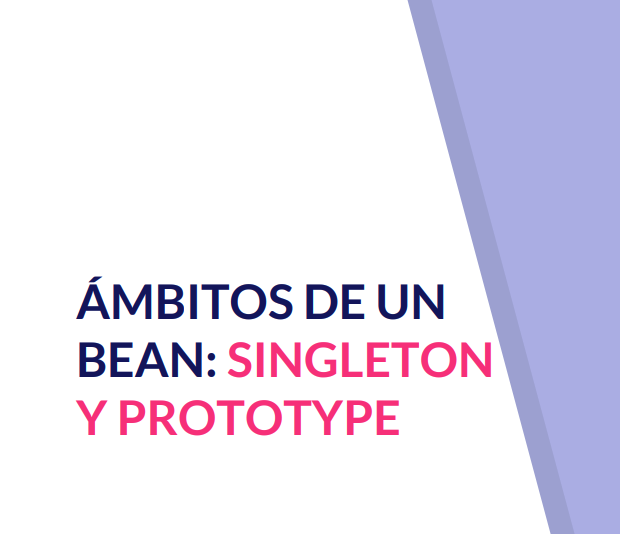

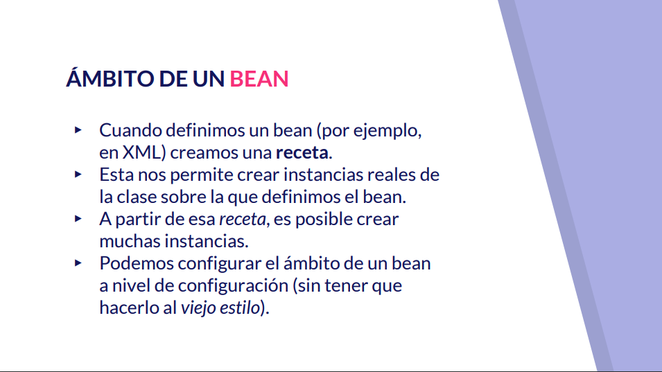

Cuando definimos un bean (en XML hasta ahora) estamos definiendo una "receta", esta receta es la que nos permite crear sobre una clase *instancias*. Sobre esa clase hemos definido nuestro bean y esa receta nos va a permitir crear objetos. 

¿Cuántas instancias se crean de un bean? Somos nosotros quien tenemos que marcar este punto en la configuración.

Con Spring podemos configurar el ambito de un bean a nivel de configuración (sin tener que hacerlo al viejo estilo), es decir sin tener que preocuparnos nosotros de cada uno de los objetos que vamos creando, instanciando, etc. 

Por ambito podemos entender cuantos objetos vamosa tener, la duración de vida, etc.

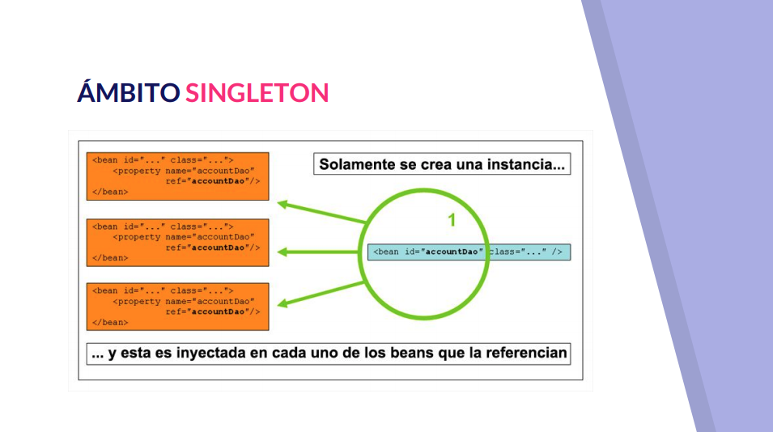

Singleton es un ambito en el cual spring se va a encargar de crear una sola instancia y que cada vez que necesitemos esa instancia nos inyectara la referencia de la misma. En memoria solo abra un objeto y cada vez que lo requiramos será ese mismo objeto el que nos sea devuelto.

En este ejemplo tenemos tres beans que hacen referencia al bean `accountDao`, esos tres beans recibiran la misma y además única instancia para todos. Este es el comportamiento más usual tanto es así que es el comportamiento por defecto.

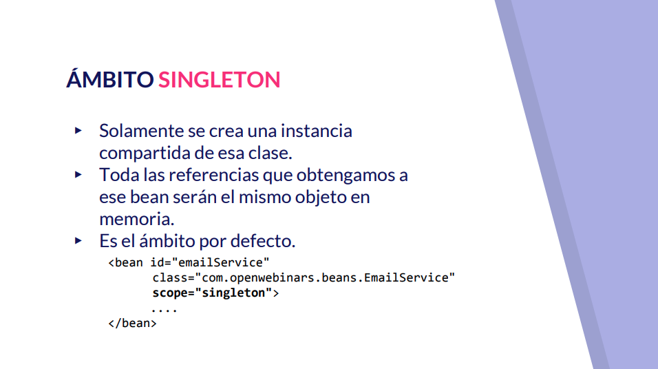

Para poder indicarlo explícitamente, a un que como ya dijimos para el caso de singleton es el comportamiento por defecto, se hace con el atributo `scope=singleton` de manera que reforzamos la idea de que de este bean solo va existir una instancia compartida para todos.

### :computer: Ejemplo Proyecto Singleton `141-10-01-Singleton`

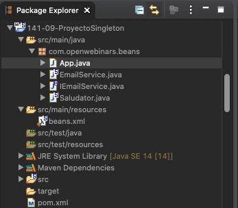

*`beans.xml`*

```html
<?xml version="1.0" encoding="UTF-8"?>
<beans xmlns="http://www.springframework.org/schema/beans"
	xmlns:xsi="http://www.w3.org/2001/XMLSchema-instance"
	xsi:schemaLocation="http://www.springframework.org/schema/beans http://www.springframework.org/schema/beans/spring-beans.xsd">

	<bean id="emailService" class="com.openwebinars.beans.EmailService" scope="singleton">
	   <property name="saludator" ref="saludator"></property>
	</bean>
	
	<bean id="saludator" class="com.openwebinars.beans.Saludator">
	   <property name="mensaje" value="Hola alumnos de openwebinars"></property>
	</bean>
	
</beans>
```

Aquí reforzamos que el ámbito sea singleton, pero es el comportamiento por default por lo que podríamos eliminar `scope="singleton"` y el resultado sería el mismo.

*`Saludator.java`*

```java
package com.openwebinars.beans;

public class Saludator {
	
	private String mensaje;
	
	public void setMensaje(String str) {
		this.mensaje = str; 
	}
	
	public String saludo() {
		return (mensaje == null) ? "Hola mundo!!!" : mensaje;
	}

}
```

*`IEmailService.java`*

```java
package com.openwebinars.beans;

public interface IEmailService {
	
	public void enviarEmailSaludo(String str);

}
```

*`EmailService.java`*

```java
package com.openwebinars.beans;

public class EmailService implements IEmailService{
	
	private Saludator saludator;
	
	public void setSaludator(Saludator saludator) {
		this.saludator = saludator;
	}
	
	public void enviarEmailSaludo(String destinatario) {
		System.out.println("Enviando email a " + destinatario);
		System.out.println("Mensaje: " + saludator.saludo());
	}

}
```

*`App.java`*

```java
package com.openwebinars.beans;

import org.springframework.context.ApplicationContext;
import org.springframework.context.support.ClassPathXmlApplicationContext;

public class App {

	public static void main(String[] args) {
		
		//Abrir contexto
		ApplicationContext appContext = new ClassPathXmlApplicationContext("beans.xml");
		
		
		IEmailService emailService1 = appContext.getBean(IEmailService.class);
		IEmailService emailService2 = appContext.getBean(IEmailService.class);
		
		System.out.println(emailService1);
		System.out.println(emailService2);
		
		//Cerrar contexto
		((ClassPathXmlApplicationContext) appContext).close();

	}

}
```

Al requerir un objeto siempre será el mismo.

Al ejecutar la aplicación tenemos.

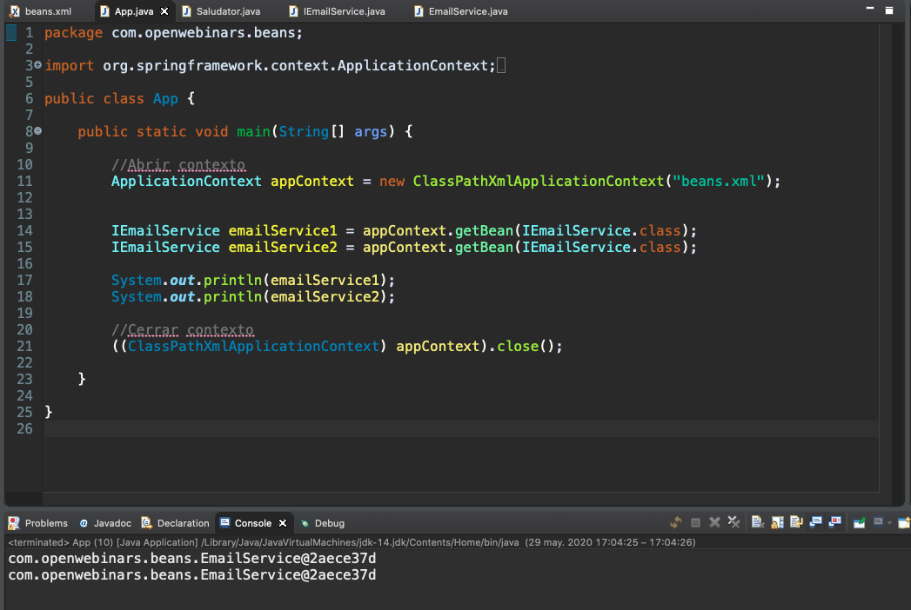

Hemos creado dos referencias de tipo `IEmailService` mediante el método `getBean(IEmailService.class)` hemos pedido que se inyecte la dependencia, podemos comprobar como ambos objetos son exactamente el mismo, aun que sean dos referencias diferentes.

Este es el comportamiento que podemos encontrar.


Frente al ambito Singleton tenemos el ambito **Prototype**, en este caso cada vez que hagamos referencia al bean, cada vez que lo requiramos se creara una nueva instancia. 

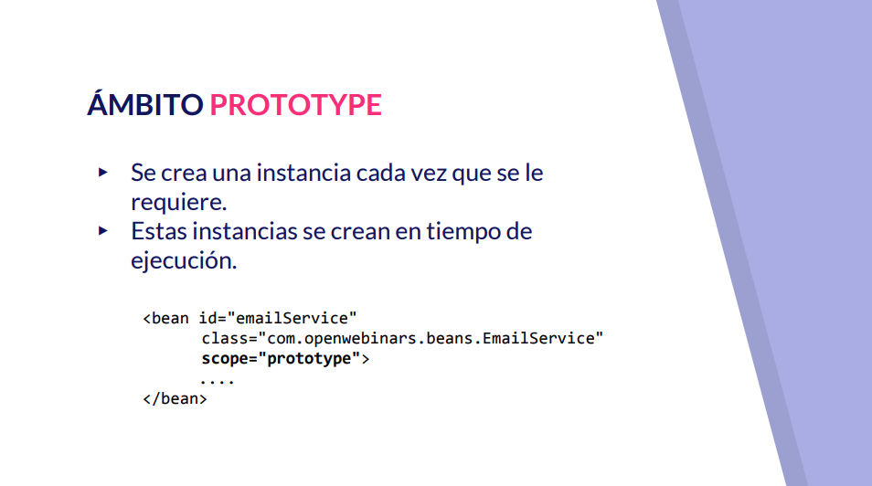

Esta instancia además se va a crear en tiempo de ejecución y lo hariamos con `scope="prototype"`. Este uso es muy  poco usual.

### :computer: Ejemplo Proyecto Prototype

*`beans.xml`*

```html
<?xml version="1.0" encoding="UTF-8"?>
<beans xmlns="http://www.springframework.org/schema/beans"
	xmlns:xsi="http://www.w3.org/2001/XMLSchema-instance"
	xsi:schemaLocation="http://www.springframework.org/schema/beans http://www.springframework.org/schema/beans/spring-beans.xsd">

	
	<bean id="emailService" class="com.openwebinars.beans.EmailService" scope="prototype">
	   <property name="saludator" ref="saludator"></property>
	</bean>
	
	<bean id="saludator" class="com.openwebinars.beans.Saludator">
	   <property name="mensaje" value="Hola alumnos de openwebinars"></property>
	</bean>
	
</beans>
```

Usamos `scope="prototype"`.

*`Saludator.java`*  Este archivo sigue sindo igual.

```java
package com.openwebinars.beans;

public class Saludator {
	
   private String mensaje;
	
   public void setMensaje(String str) {
      this.mensaje = str; 
   }
	
   public String saludo() {
      return (mensaje == null) ? "Hola mundo!!!" : mensaje;
   }

}
```

*`IEmailService.java`*

```java
package com.openwebinars.beans;

public interface IEmailService {
	
   public void enviarEmailSaludo();
   public void enviarEmailSaludo(String str);
   public void setDestinatarioPorDefecto(String destinatario);
	
}
```

La interfaz declara tres métodos.

*`EmailService.java`*

```java
package com.openwebinars.beans;

public class EmailService implements IEmailService{
	
   private Saludator saludator;
   private String destinatarioPorDefecto;
 	
   public void setSaludator(Saludator saludator) {
      this.saludator = saludator;
   }
	
   public void setDestinatarioPorDefecto(String destinatario) {
      this.destinatarioPorDefecto = destinatario;
   }
	
   public void enviarEmailSaludo() {
		
      if( destinatarioPorDefecto != null)
         enviarEmailSaludo(destinatarioPorDefecto);
      else
	 System.out.println("Configure un destinatario por defecto para poder enviar los mensajes");
   }
	
   public void enviarEmailSaludo(String destinatario) {
      System.out.println("Enviando email a " + destinatario);
      System.out.println("Mensaje: " + saludator.saludo());
   }

}
```

Se implementan los tres métodos declarados en la interfaz.

*`App.java`*

```java
package com.openwebinars.beans;

import org.springframework.context.ApplicationContext;
import org.springframework.context.support.ClassPathXmlApplicationContext;

public class App {

   public static void main(String[] args) {
		
      //Abrir contexto
      ApplicationContext appContext = new ClassPathXmlApplicationContext("beans.xml");
			
      IEmailService emailService1 = appContext.getBean(IEmailService.class);
      emailService1.setDestinatarioPorDefecto("adolfo@gmail.com");
      emailService1.enviarEmailSaludo();
		
      System.out.println("");
      IEmailService emailService2 = appContext.getBean(IEmailService.class);
      emailService2.enviarEmailSaludo();
		
      //Cerrar contexto
      ((ClassPathXmlApplicationContext) appContext).close();
      
   }

}
```

Aquí creamos dos `emailService`, en uno de ellos en la implementación podemos marcar un destinatario por defecto a la hora de enviar los emails. 

Estamos definiendo el destinatario por defecto en la referencia 1 pero no en la 2, por lo que en este último no tendremos destinatario por defecto.

Al ejecutar la aplicación tenemos:

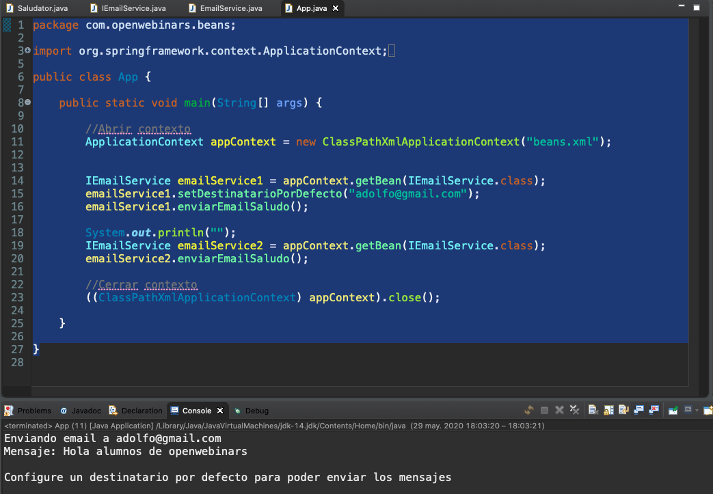

En el primer caso se ha enviado el email pero en el segundo caso como no hemos establecido un destinatario, ni hay un destinatario por defecto no se ha podido enviar.

Si el alcance lo tuvieramos como `scope="singleton"` si los mensajes si se enviarían dos veces, por que realmente estamos utilizando el mismo bean por detras.

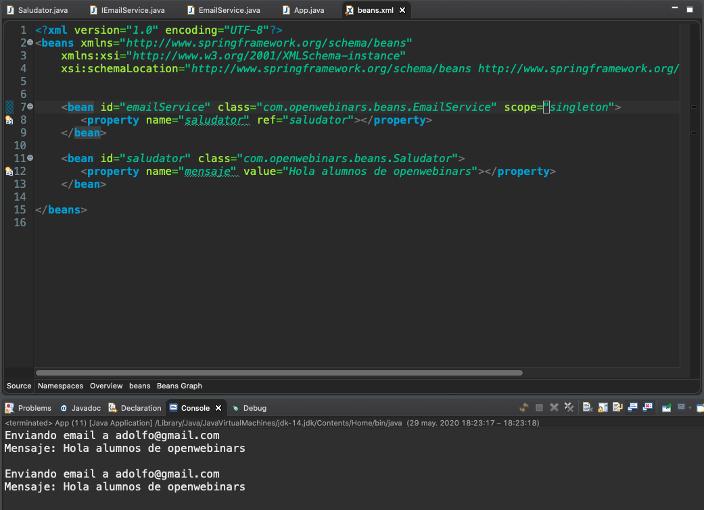

Aquí la idea es ilustrar `scope="prototype"` para comprobar que cada que requiramos un bean se crea una nueva instancia, caso contrario con `scope="singleton"` donde se usa la misma instancia.

# 11 Otros ámbitos 4:25 

[PDF 3-2_Otros_ambitos.pdf](pdfs/3-2_Otros_ambitos.pdf)

## Transcripción


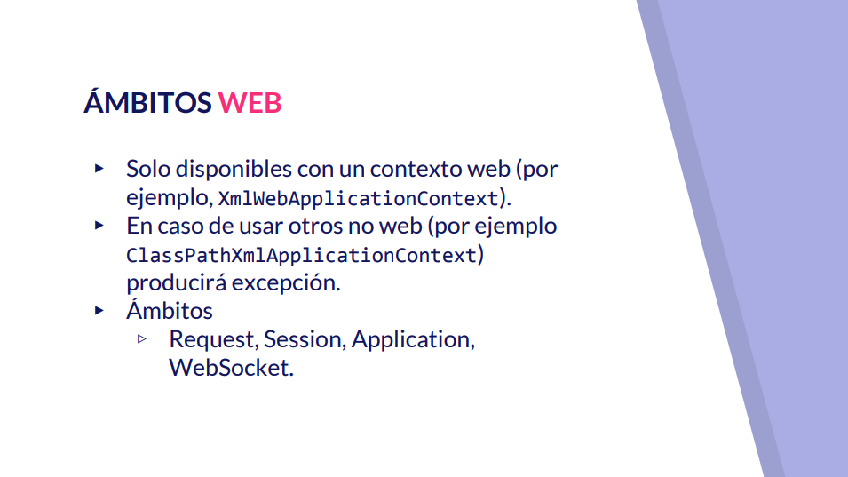

Aquí hablaremos de otros ambitos que existen en este caso sobre la Web. Estos ámbitos diferentes a `singleton` y `prototype` los encontraremos cuando trabajemos en un contexto Web, el cual se inicia con `XmlWebApplicationContext`.

Los ámbitos para contextos web son:

* `Request`
* `Session`
* `Application`
* `WebSocket`

Si los usaramos dentro del contexto `ClassPathXmlApplicationContext` se producirá una excepción.

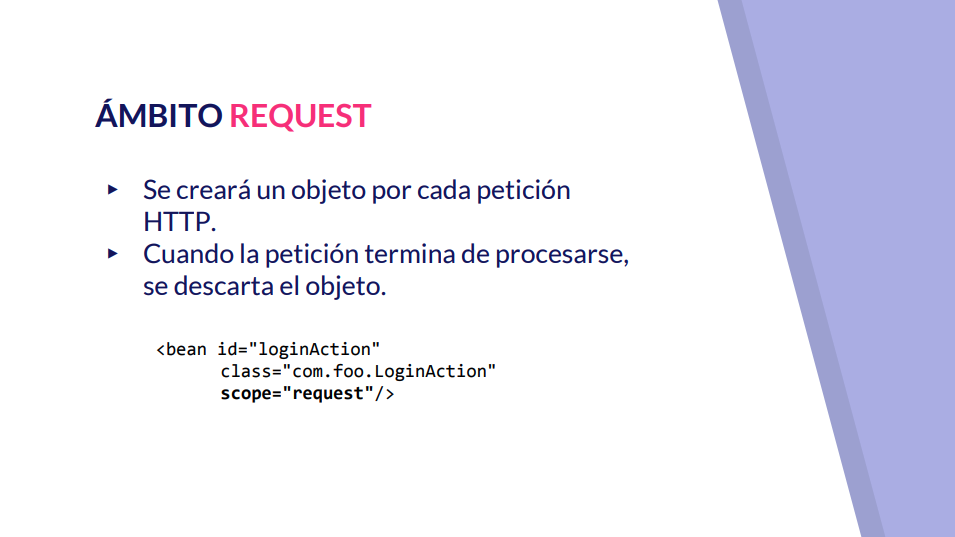

El ámbito Request permite decir que un objeto va a tener como ciclo o ámbito de vida va a ser cada petición. Por cada nueva petición que nosotros hagamnos se creara una nueva petición y cuando esa petición finalice se descartara el objeto.

Por ejemplo cada vez que hagamos un Login se lanza la petición con un ambito request mediante `scope="request"`.

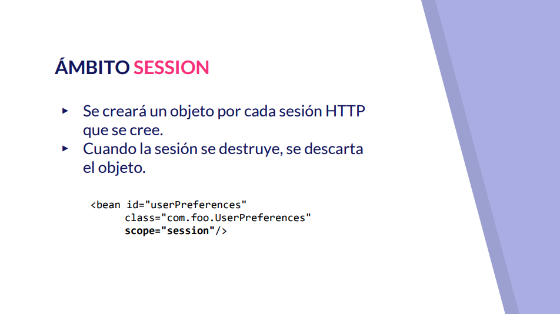

Si lo que necesitamos es tener un bean que tenga una vida mayor a la de una petición y que dure a lo largo de toda una sesión de un usuario tenemos el `scope="session"`. Por ejemplo para mantener las preferencias de un usuario a traves de usar una aplicación determinada. Marcando el bean con `scope="session"`, el bean se instanciara cuando la sesión comience y tendra vida a lo largo de diferentes peticiones, no se destruye al finalizar una request, sino que tendrá vida hasta que la sesión se destruya, en ese momento se descarta el objeto.

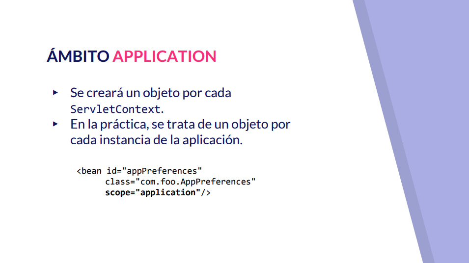

Finalmente el que vamos a ver es el de ámbito `application`, usamos `scope="application"`, en este caso se creara un solo objeto por cada `ServletContext` que nosotros creemos, en la práctica se trata de un objeto por cada ejecución de la aplicación que nosotros hagamos. Por ejemplo para una serie de preferencias globales de la aplicación, por ejemplo textos que salgan en los encabezados o pies de página de toda la aplicación.  

# 12 Manejo del ciclo de vida de un bean 9:16 

[PDF 3-3_Manejo_del_ciclo_de_vida.pdf](pdfs/3-3_Manejo_del_ciclo_de_vida.pdf)

## Transcripción


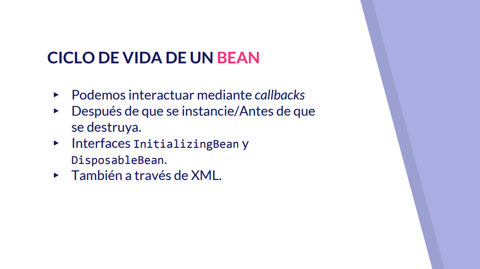

Vamos a hablar ahora del ciclo de vida de un bean y como podemos manejarlo. 

Nosotros podemos interactuar con el ciclo de vida de un bean que tiene un ciclo de vida sencillo en el cual los métodos se instancian, son gestionados por el controlador y en un momento determinado pueden desaparecer y podemos interactuar en ese ciclo de vida mediante *callbacks* justo después de que se instancie y justo antes de que se destruya. 

Lo podemos hacer mediante varias maneras que vamos a aprender aquí. Puede ser a través de Interfaces, de XML o incluso a través de anotaciones. 

Aquí, como realmente no realizamos la construcción de los objetos tal cual, aun que podemos tener inyección a través de constructores, pero como podemos tener otra serie de dependencias que se encargan el contenedor de satisfacer, puede ser interesante que justo antes de hacer todas esas operaciones de instanciar, inyectar dependencias, etc. podamos tener algún método normalmente de *inicialización* y justo antes que se destruya un objeto si tiene asociados recursos, ficheros abiertos, conexiones a BD podemos tratarlos justo antes de que se destruya el objeto para liberar recursos.

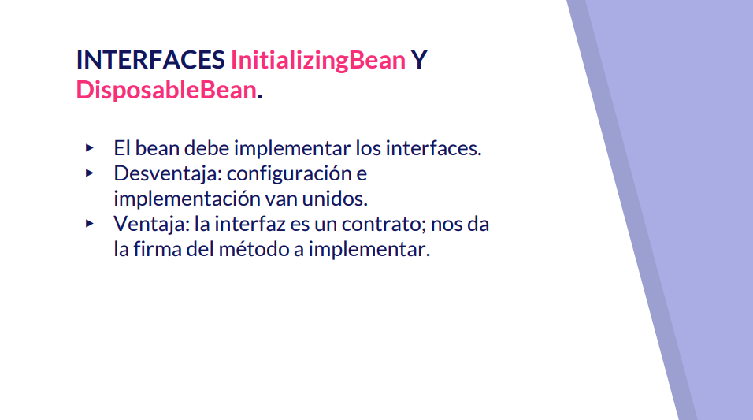

Si queremos trabajarlo a través de la Interface Spring pone a nuestra disposición las interfaces:

* `InitializingBean`
* `DisponsableBean`

Son dos interfaces que nuestros beans deben implementar y por el mero hecho de implementar una u otra con el método que nos obliga a implementar esa interfaz, ese método sse ejecutaria en el momento adecuado del ciclo de vida del bean. En el caso de 
`InitializingBean` justo después de haberse creado el bean y en el caso de `DisponsableBean` justo antes de que se destruya ese bean.

La ventaja es que la interfaz nos ofrece un contrato, nos da la firma del método que tenemos que implementar, pero la desventaja es que algún elemento de configuración como el decir que método o que se va a realizar durante la inicialización o la destrucción del bean y la implementació *irian unidos*. Esto aumenta el acoplamionto.

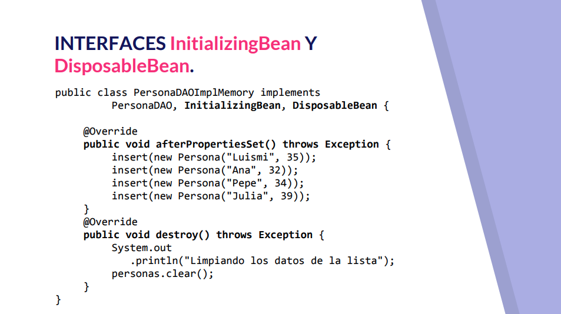

### :computer: Ejemplo Proyecto usando `InitializingBean` `141-12-01-LifeCycle-InitializingBean`

La estructura de este ejemplo cambia en relación a todos los que veniamos haciendo.

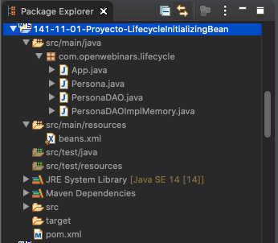

*`beans.xml`*

```html
<?xml version="1.0" encoding="UTF-8"?>
<beans xmlns="http://www.springframework.org/schema/beans"
	xmlns:xsi="http://www.w3.org/2001/XMLSchema-instance"
	xsi:schemaLocation="http://www.springframework.org/schema/beans http://www.springframework.org/schema/beans/spring-beans.xsd">
	
	<bean id="personaDao" class="com.openwebinars.lifecycle.PersonaDAOImplMemory" />
	
</beans>
```

Tenemos la clase modelo `Persona`.

*`Persona.java`*

```java
package com.openwebinars.lifecycle;

public class Persona {
	
   private String nombre;
   private int edad;
	
   public Persona() {
   }

   public Persona(String nombre, int edad) {
      this.nombre = nombre;
      this.edad = edad;
   }

   public String getNombre() {
      return nombre;
   }

   public void setNombre(String nombre) {
      this.nombre = nombre;
   }

   public int getEdad() {
      return edad;
   }

   public void setEdad(int edad) {
      this.edad = edad;
   }

   @Override
   public String toString() {
      return "Persona [nombre=" + nombre + ", edad=" + edad + "]";
   }

   @Override
   public int hashCode() {
      final int prime = 31;
      int result = 1;
      result = prime * result + edad;
      result = prime * result + ((nombre == null) ? 0 : nombre.hashCode());
      return result;
   }

   @Override
   public boolean equals(Object obj) {
      if (this == obj)
         return true;
      if (obj == null)
         return false;
      if (getClass() != obj.getClass())
         return false;
      Persona other = (Persona) obj;
      if (edad != other.edad)
         return false;
      if (nombre == null) {
         if (other.nombre != null)
	    return false;
      } else if (!nombre.equals(other.nombre))
         return false;
      return true;
   }
}
```

Tenemos una Interfaz `PersonaDAO` que nos va a permitir interactuar con el repositorio de datos.

*`PersonaDAO.java`*

```java
package com.openwebinars.lifecycle;

import java.util.List;

public interface PersonaDAO {
	
   public Persona findByIndex(int index);
   public List<Persona> findAll();
   public void insert(Persona persona);
   public void edit(int index, Persona persona);
   public void delete(int index);
   public void delete(Persona persona);

}
```

La clase `PersonaDAOImplMemory` que implementa la Interfaz `PersonaDAO` y que representa a nuestro bean, construye el repositorio de datos en memoria que se almacena en un `ArrayList`.

El bean `PersonaDAOImplMemory` es sobre el cual queremos manejar su ciclo de vida por lo que implementamos la interfaz `InitializingBean`, y que nos obliga a darle cuerpo al método `afterPropertiesSet()` *que se ejecuta justo después de que se crea el bean* y en este caso inserta una serie de datos en la lista.

*`PersonaDAOImplMemory.java`*

```java
package com.openwebinars.lifecycle;

import java.util.ArrayList;
import java.util.List;

import org.springframework.beans.factory.InitializingBean;

public class PersonaDAOImplMemory implements PersonaDAO, InitializingBean {
	
   List<Persona> personas = new ArrayList<Persona>();

   public Persona findByIndex(int index) {
      return personas.get(index);
   }

   public List<Persona> findAll() {
      return personas;
   }

   public void insert(Persona persona) {
      personas.add(persona);
   }

   public void edit(int index, Persona persona) {
      personas.remove(index);
      personas.add(index, persona);
   }

   public void delete(int index) {
      personas.remove(index);
   }

   public void delete(Persona persona) {
      personas.remove(persona);
   }
	
   @Override
   public void afterPropertiesSet() throws Exception {
      insert(new Persona("Luismi", 35));
      insert(new Persona("Ana", 32));
      insert(new Persona("Pepe", 34));
      insert(new Persona("Julia", 39));		
   }
   
}
```

Nuestra clase principal `App` requiere la interfaz `PersonaDAO`, por lo que Spring busca una clase que implemente esta Interfaz en este caso `PersonaDAOImplMemory` la cual inicializa la lista gracias a que maneja el ciclo de vida de este bean.
Una vez creado el bean despliega los valores dentro de la lista.

*`App.java`*

```java
package com.openwebinars.lifecycle;

import org.springframework.context.ApplicationContext;
import org.springframework.context.support.ClassPathXmlApplicationContext;

public class App {

   public static void main(String[] args) {
		
      //Abrir contexto
      ApplicationContext appContext = new ClassPathXmlApplicationContext("beans.xml");
			
      PersonaDAO personaDAO = appContext.getBean(PersonaDAO.class);
		
      personaDAO.findAll().forEach(System.out::println);
		
      //Cerrar contexto
      ((ClassPathXmlApplicationContext) appContext).close();

   }

}
```

Al ejecutar la aplicación tenemos los elementos cargados porque se han cargado manejando el ciclo de vida del bean.

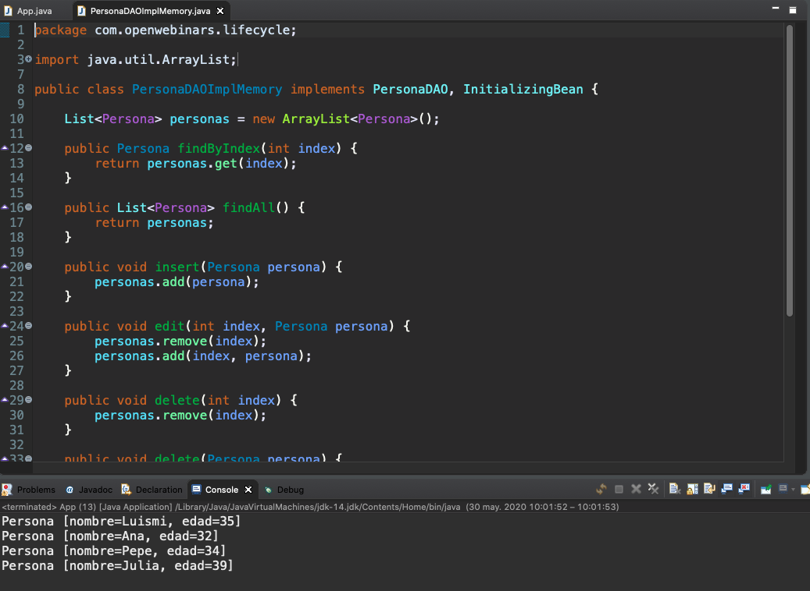


Analogamente tenemos tenemos la interfgaz `DisposableBean` que nos permite a traves del método `destroy()` realizar alguna tarea justo antes de que se destuya el bean.

### :computer: Ejemplo Proyecto usando `DisposableBean` `141-12-02-LifeCycle-DisposableBean`


El proyecto es muy similar al anterior solo se implementa la interfaz `DisposableBean` que nos obliga a definir el método `destroy()` que lo usaremos para limpiar la lista. 

*`PersonaDAOImplMemory.java`*

```java
package com.openwebinars.lifecycle;

import java.util.ArrayList;
import java.util.List;

import org.springframework.beans.factory.InitializingBean;

public class PersonaDAOImplMemory implements PersonaDAO, InitializingBean, DisposableBean {
	
   List<Persona> personas = new ArrayList<Persona>();

   public Persona findByIndex(int index) {
      return personas.get(index);
   }

   public List<Persona> findAll() {
      return personas;
   }

   public void insert(Persona persona) {
      personas.add(persona);
   }

   public void edit(int index, Persona persona) {
      personas.remove(index);
      personas.add(index, persona);
   }

   public void delete(int index) {
      personas.remove(index);
   }

   public void delete(Persona persona) {
      personas.remove(persona);
   }
	
   @Override
   public void afterPropertiesSet() throws Exception {
      insert(new Persona("Luismi", 35));
      insert(new Persona("Ana", 32));
      insert(new Persona("Pepe", 34));
      insert(new Persona("Julia", 39));		
   }
   
   @Override
   public void destroy() throws Exception {
      System.out.println("");
      System.out.println("Limpiando los datos de la lista");
      personas.clear();
   }
   
}
```

Al ejecutal la aplicación podemos comprobar como realiza las mismas operaciones pero que también se han limpiado los datos de la lista.

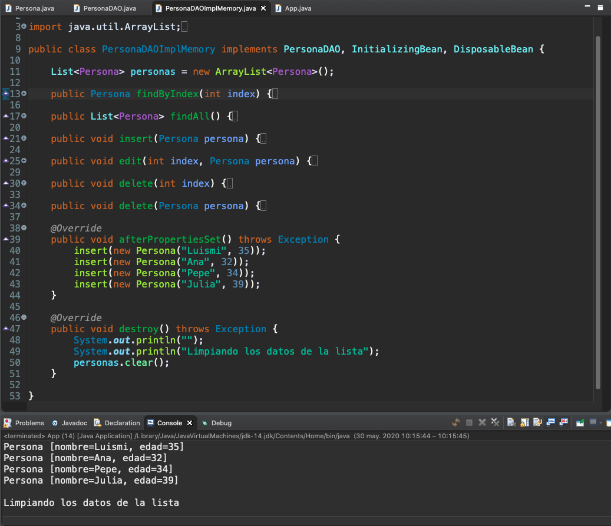

Esto con respecto a manejar el ciclo de vida mediante los interfaces.

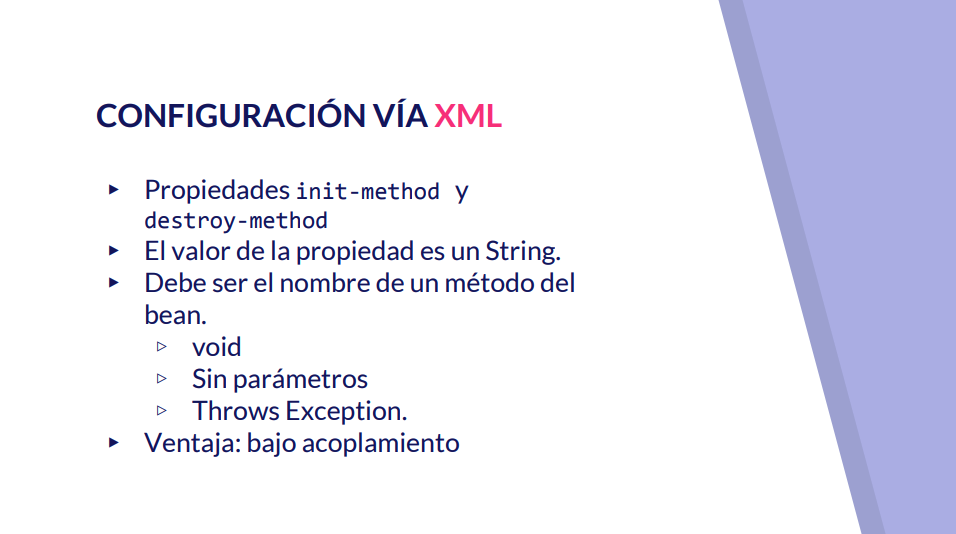

También tenemos la posibilidad de configurar el ciclo de vida vía XML usando las propiedades `init-method` y `destroy-method` aplicables al elemento bean, las cuales aceptan un String con el nombre del método que queremos utilizar como *calback* del ciclo de vida de un bean.

El método tiene que ser `void`, sin parámetros, puede lanzar una excepción, esto ayuda a rebajar el acoplamiento ya que si definimos el método pero en el xml no hacemos referencia a que un método es de inicialización simplemente es un método más en nuestra clase bean pero que no se invocaría en ese momento. Sin embargo si lo configuramos con XML si que se ejecutaría.

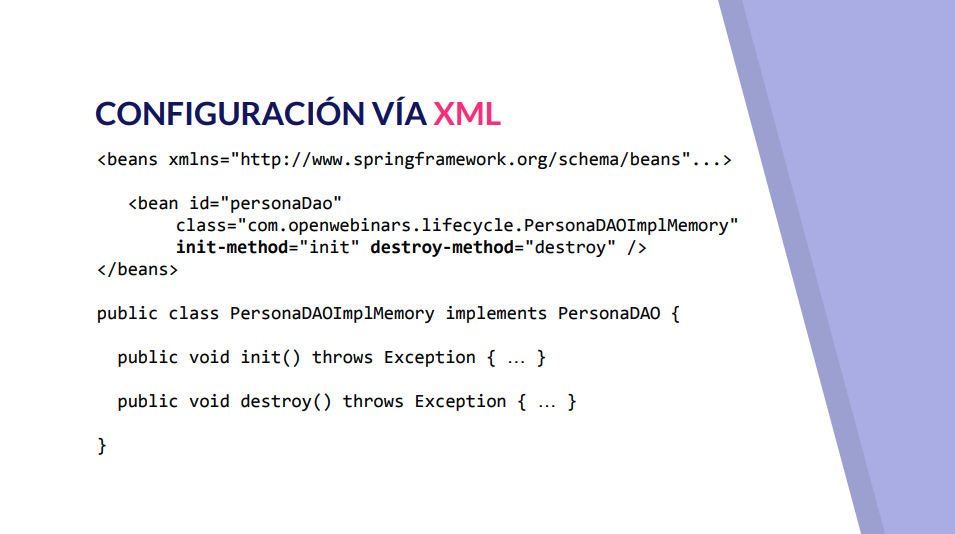

### :computer: Ejemplo Proyecto Init `141-12-03-LifeCycle-Init`

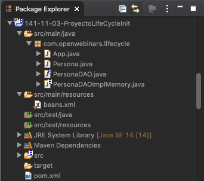

A comparación de los ejemplos anteriores solo vamos a poner los archivos que han cambiado.

En nuestro archivo `beans.xml` hemos colocado el atributo `init-method="init"` dentro de nuestro bean para indicar que el método inicial de este bean se llama `init`.

*`beans.xml`*

```html
<?xml version="1.0" encoding="UTF-8"?>
<beans xmlns="http://www.springframework.org/schema/beans"
	xmlns:xsi="http://www.w3.org/2001/XMLSchema-instance"
	xsi:schemaLocation="http://www.springframework.org/schema/beans http://www.springframework.org/schema/beans/spring-beans.xsd">

	<bean id="personaDao" class="com.openwebinars.lifecycle.PersonaDAOImplMemory" init-method="init" />
	
</beans>
```

En la implementación de nuestro bean tenemos una clase que *ya no implementa ninguna interfaz*, pero implementa el método `init()` según las reglas antes indicadas y la tarea que hace es inicializar la lista, no esta anotado con nada. 

*`PersonaDAOImplMemory.java`*

```java
package com.openwebinars.lifecycle;

import java.util.ArrayList;
import java.util.List;

import org.springframework.beans.factory.InitializingBean;

public class PersonaDAOImplMemory implements PersonaDAO {
	
   List<Persona> personas = new ArrayList<Persona>();

   public Persona findByIndex(int index) {
      return personas.get(index);
   }

   public List<Persona> findAll() {
      return personas;
   }

   public void insert(Persona persona) {
      personas.add(persona);
   }

   public void edit(int index, Persona persona) {
      personas.remove(index);
      personas.add(index, persona);
   }

   public void delete(int index) {
      personas.remove(index);
   }

   public void delete(Persona persona) {
      personas.remove(persona);
   }
	   
   public void init() throws Exception {
      insert(new Persona("Luismi", 35));
      insert(new Persona("Ana", 32));
      insert(new Persona("Pepe", 34));
      insert(new Persona("Julia", 39));
   }
   
}
```

Al ejecutar la aplicación Spring se encarga mediante a la metainformación ejecutar el método `init()` en el momento adecuado.

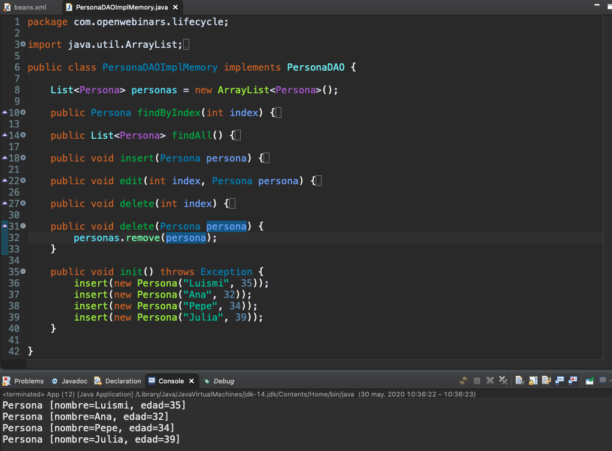

En el caso de `destroy` es muy similar a `init` pero se ejecutará justo antes de destruir el bean.

### :computer: Ejemplo Proyecto Destroy `141-12-04-LifeCycle-Destroy`

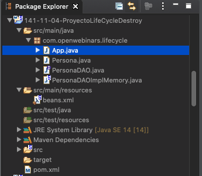

El método de destrucción en este caso se llama `destroy`.

*`beans.xml`*

```html
<?xml version="1.0" encoding="UTF-8"?>
<beans xmlns="http://www.springframework.org/schema/beans"
	xmlns:xsi="http://www.w3.org/2001/XMLSchema-instance"
	xsi:schemaLocation="http://www.springframework.org/schema/beans http://www.springframework.org/schema/beans/spring-beans.xsd">

	<bean id="personaDao" class="com.openwebinars.lifecycle.PersonaDAOImplMemory" 
			init-method="init" destroy-method="destroy" />
		
</beans>
```

*`PersonaDAOImplMemory.java`*

```java
package com.openwebinars.lifecycle;

import java.util.ArrayList;
import java.util.List;

import org.springframework.beans.factory.InitializingBean;

public class PersonaDAOImplMemory implements PersonaDAO {
	
   List<Persona> personas = new ArrayList<Persona>();

   public Persona findByIndex(int index) {
      return personas.get(index);
   }

   public List<Persona> findAll() {
      return personas;
   }

   public void insert(Persona persona) {
      personas.add(persona);
   }

   public void edit(int index, Persona persona) {
      personas.remove(index);
      personas.add(index, persona);
   }

   public void delete(int index) {
      personas.remove(index);
   }

   public void delete(Persona persona) {
      personas.remove(persona);
   }
	   
   public void init() throws Exception {
      insert(new Persona("Luismi", 35));
      insert(new Persona("Ana", 32));
      insert(new Persona("Pepe", 34));
      insert(new Persona("Julia", 39));
   }
   
   public void destroy() throws Exception {
      System.out.println("");
      System.out.println("Limpiando los datos de la lista");
      personas.clear();
   }
   
}
```

Al ejecutar el proyecto se tiene la misma lógica que antes:

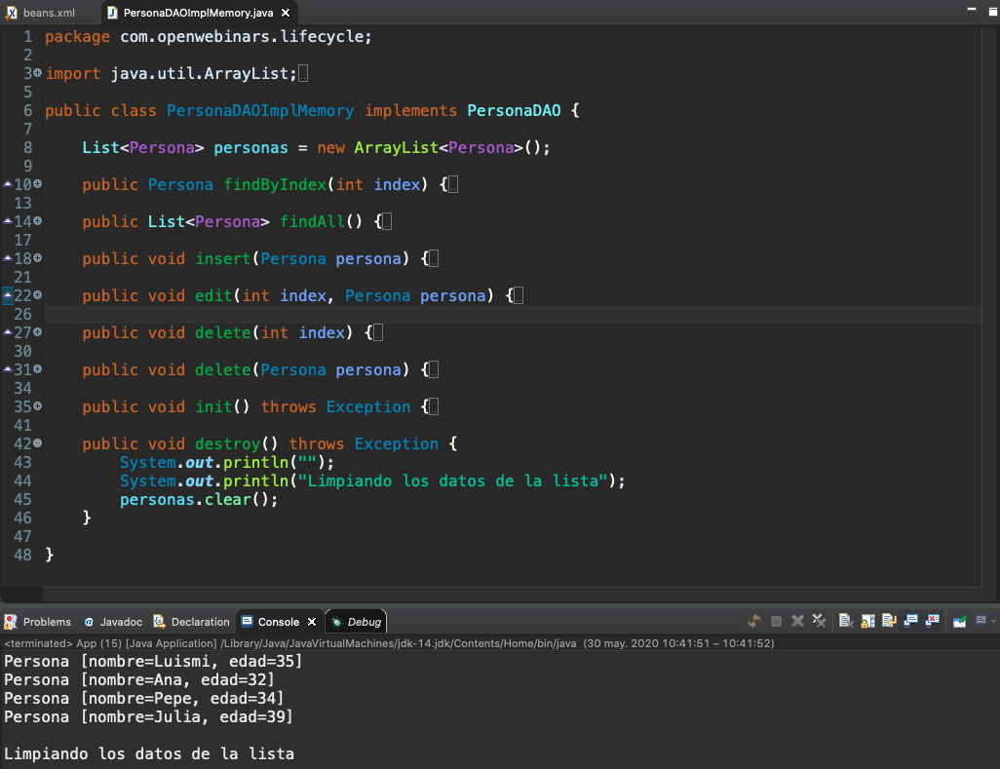

Podemos ver como funciona pero en este caso la configuración la hemos hecho vía XML.

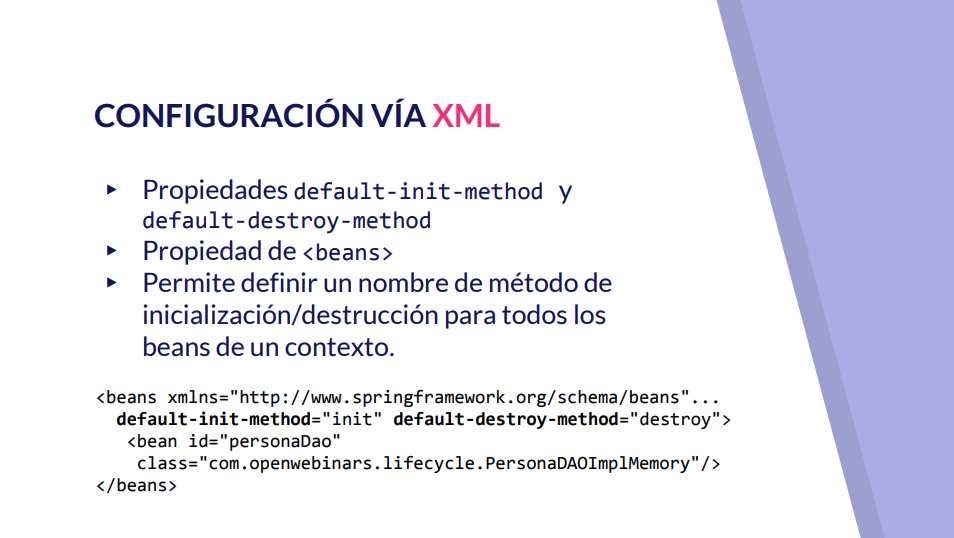

Si vamos a tener más de un bean que va a requerir de manejar su ciclo de vida podemos usar las opciones de `default-init-method` y `default-destroy-method` que pertenece a la etiqueta `<beans>` de la raíz, que nos permite definir un nombre de método de inicialización por defecto para todos nuestros beans y también un nombre de destrucción. Esto nos permite no estar declarando estos métodos en cada uno de los beans como lo hemos hecho hasta ahora, por lo que se podría usar en más de una clase que represente al bean.

### :computer: Ejemplo Proyecto Default Init-Destroy `141-12-05-LifeCycle-Default`

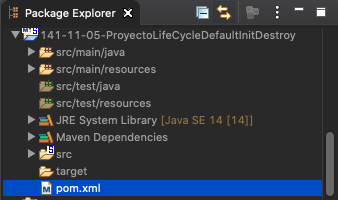

Declaramos de forma "global" los nombres de los metodos de inicalización y destrucción para todos los beans que tengamos declarados (en este caso solo tenemos uno). Los hemos llamado `init` y `destroy` como antes.

*`beans.xml`*

```html
<?xml version="1.0" encoding="UTF-8"?>
<beans xmlns="http://www.springframework.org/schema/beans"
	xmlns:xsi="http://www.w3.org/2001/XMLSchema-instance"
	xsi:schemaLocation="http://www.springframework.org/schema/beans http://www.springframework.org/schema/beans/spring-beans.xsd"
	default-init-method="init" default-destroy-method="destroy"	>

	<bean id="personaDao" class="com.openwebinars.lifecycle.PersonaDAOImplMemory" />
	
</beans>
```

En todos los beans que se creen en este caso tenemos el mismo de antes se ejecutarían esos métodos.

*`PersonaDAOImplMemory`*

```java
package com.openwebinars.lifecycle;

import java.util.ArrayList;
import java.util.List;

import org.springframework.beans.factory.DisposableBean;
import org.springframework.beans.factory.InitializingBean;

public class PersonaDAOImplMemory implements PersonaDAO {

	List<Persona> personas = new ArrayList<Persona>();

	public Persona findByIndex(int index) {
		return personas.get(index);
	}

	public List<Persona> findAll() {
		return personas;
	}

	public void insert(Persona persona) {
		personas.add(persona);
	}

	public void edit(int index, Persona persona) {
		personas.remove(index);
		personas.add(index, persona);
	}

	public void delete(int index) {
		personas.remove(index);
	}

	public void delete(Persona persona) {
		personas.remove(persona);
	}

	public void init() throws Exception {
		insert(new Persona("Luismi", 35));
		insert(new Persona("Ana", 32));
		insert(new Persona("Pepe", 34));
		insert(new Persona("Julia", 39));
	}

	public void destroy() throws Exception {
		System.out.println("");
		System.out.println("Limpiando los datos de la lista");
		personas.clear();
	}

}
```

Si tuvieramos más de un bean declarado en nuestro XML buscaría siempre los métodos `init` y `destroy` para poderlos llamar en el ciclo de vida adecuado. 

Al ejecutar la aplicación tenemos:

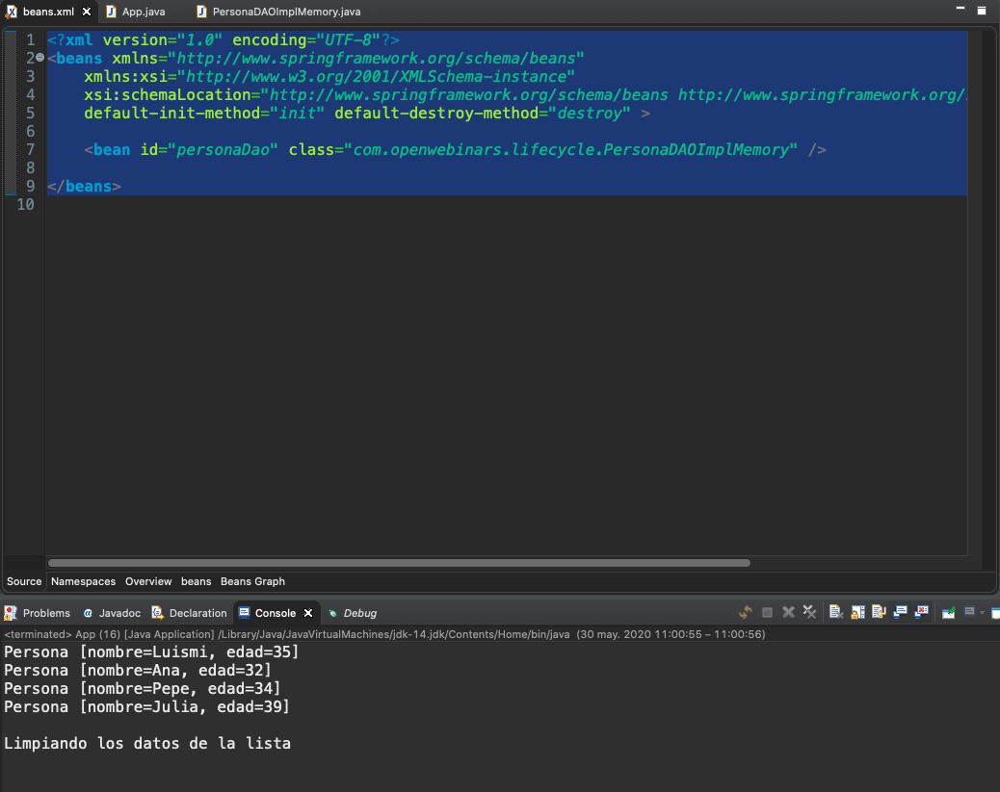

Y de esta manera vamos dando un comportamiento compacto con un hilo conductor en esta matería del manejo del ciclo de vida de un bean.

# Contenido adicional 3

* [PDF 3-1_Singleton_y_Prototype.pdf](pdfs/3-1_Singleton_y_Prototype.pdf)
* [PDF 3-2_Otros_ambitos.pdf](pdfs/3-2_Otros_ambitos.pdf)
* [PDF 3-3_Manejo_del_ciclo_de_vida.pdf](pdfs/3-3_Manejo_del_ciclo_de_vida.pdf)
