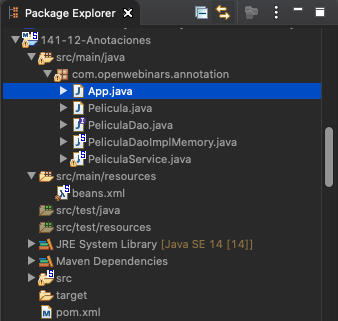
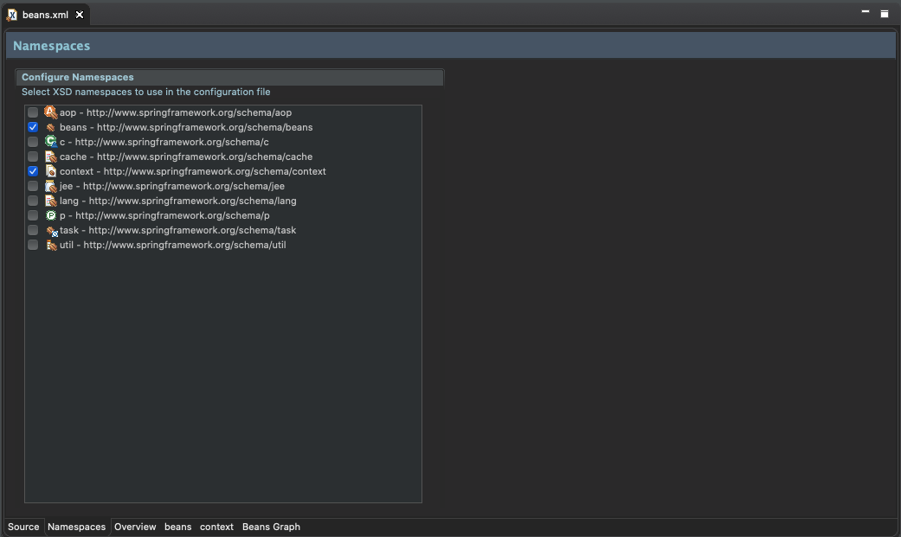
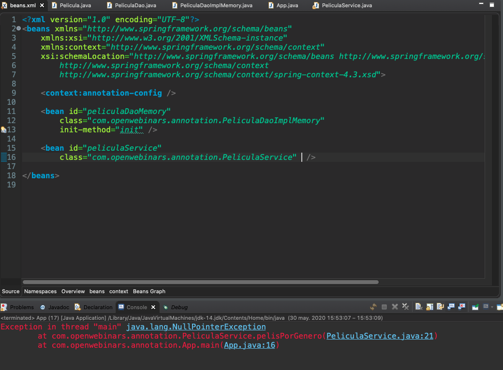
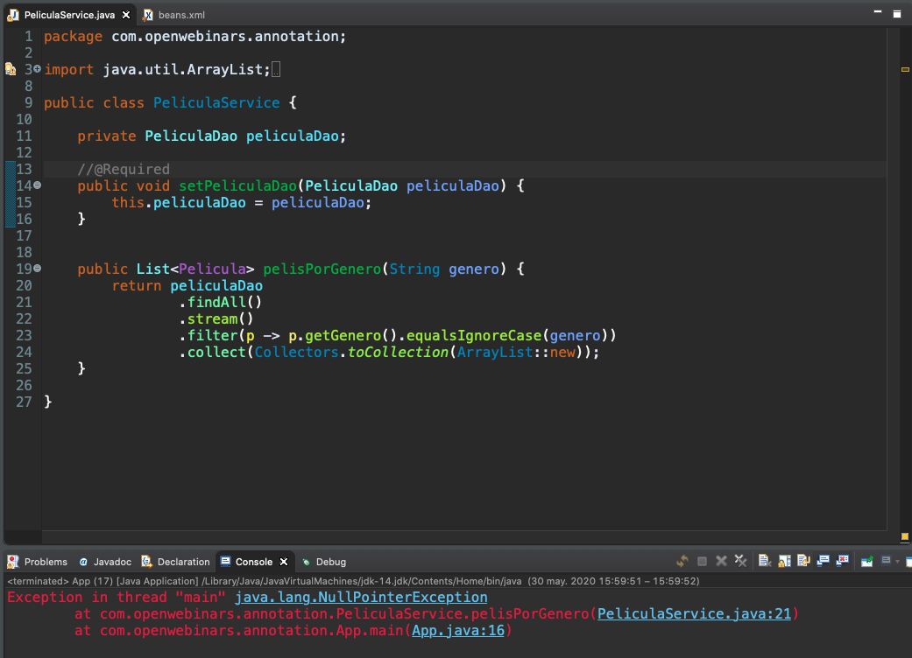
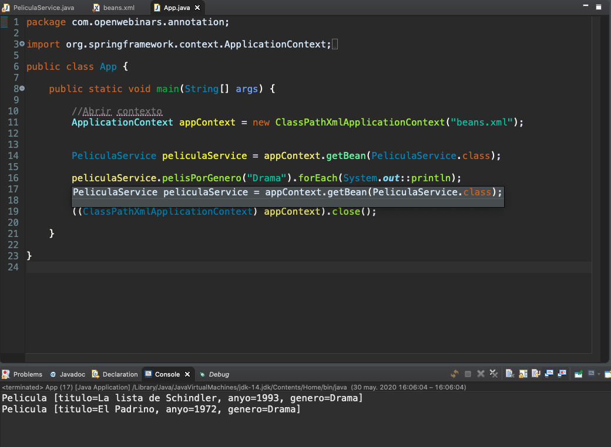
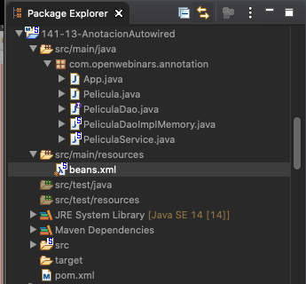
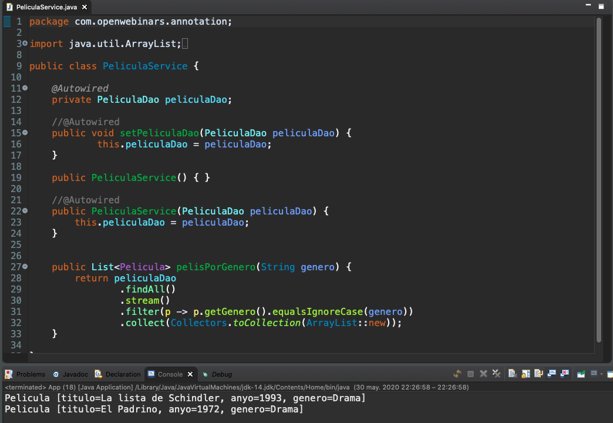
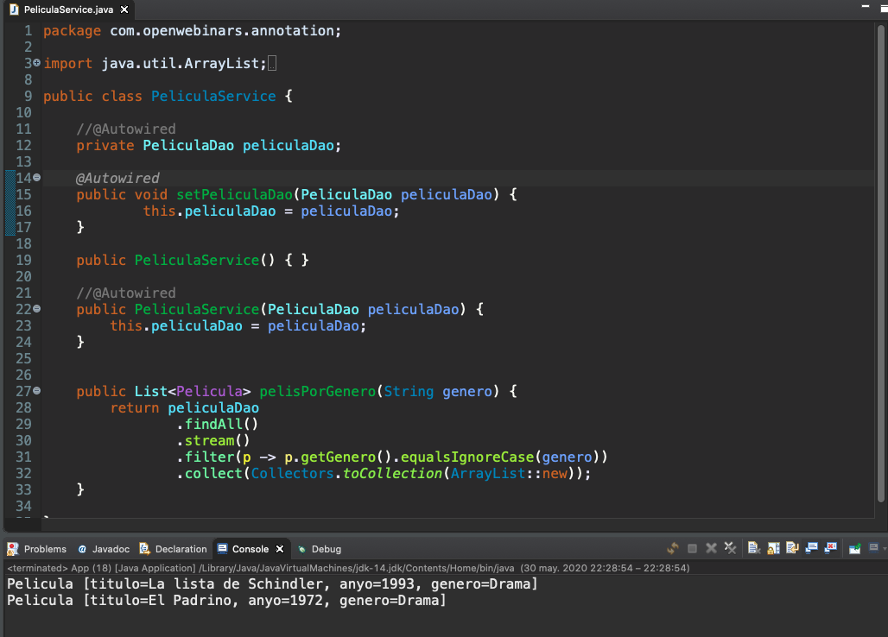
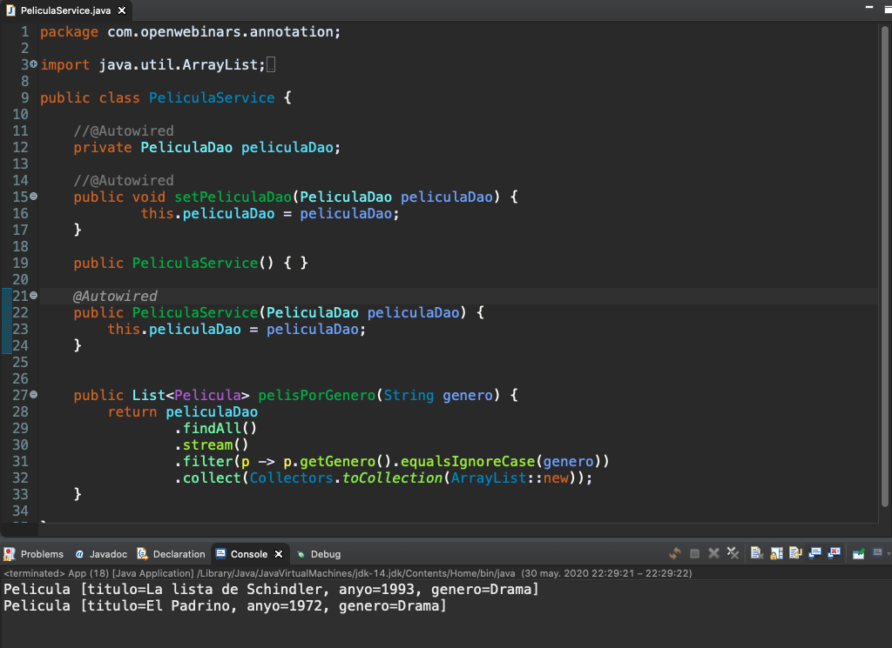
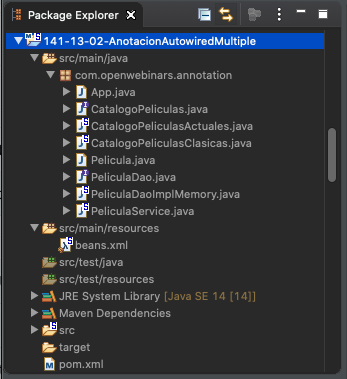

# 4. Configuración basada en anotaciones 38m

* Uso de @Required 8:58 
* Uso de @Autowired 10:58 
* Uso de Primary y @Qualifier 7:04 
* Uso de @PostConstruct y @PreDestroy 3:28 
* Uso de estereotipos 7:51 
* Contenido adicional  5

# 13 Uso de @Required 8:58 

[PDF 4-1_Configuracion_a_traves_de_anotaciones_Required.pdf](pdfs/4-1_Configuracion_a_traves_de_anotaciones_Required.pdf)

## Resumen Profesor

### Configuración vía XML vs vía anotaciones

#### ¿Las anotaciones son mejores que XML para configurar Spring??

La introducción de la configuración basada en anotaciones planteó la pregunta de si este enfoque es “mejor” que XML. La respuesta corta es que **depende**. La respuesta larga es que cada enfoque tiene sus pros y sus contras, y generalmente le corresponde al desarrollador decidir qué estrategia le conviene más. Debido a la forma en que se definen, las anotaciones proporcionan *mucha información* en su declaración, lo que lleva a una configuración más breve y concisa. Sin embargo, XML se destaca en el *cableado* de componentes sin tocar su código fuente o recompilarlos. Algunos desarrolladores prefieren tener el *cableado* cerca del código fuente, mientras que otros argumentan que las clases anotadas ya no son **POJO (Plain Old Java Object)** y, además, que la configuración se vuelve descentralizada y más difícil de controlar.

No importa la elección, Spring puede acomodar ambos estilos e incluso mezclarlos. Vale la pena señalar que a través de su opción JavaConfig, Spring permite que las anotaciones se utilicen de forma no invasiva, sin tocar el código fuente de los componentes objetivo.

*La inyección por anotación se realiza antes de la inyección de XML, por lo tanto, la última configuración anulará la anterior para las propiedades inyectadas a través de ambos enfoques.*

## Transcripción


Hemos comprobado al principio de curso como la configuración de esa metainformación que nosotros teníamos que proporcionar la podíamos hacer mediante varias vías, hasta ahora hemos venido utilizando la configuración única y exclusiva a través de un descritor XML, sin embargo vamos a aprender como tenemos a nuestra disposición una serie de anotaciones que pueden significar alguna ventaja de configuración.

En este caso poco a poco iremos viendo como no configuramos completamente los beans con XML, de hecho puede llegar a que no configuremos nada dentro de XML, la configuración estaría más cerca del código, es decir que podemos aplicar un principio de localidad, es decir tener más cerca de la configuración de donde la vayamos a utilizar, eso en ocasiones puede ser una ventaja, por que también más cerca significan más acoplada, en decir que para poder cambiar la configuración de alguna clase tenemos que tocar su código fuente y no un fichero externo.  

La configuración vía anotaciones la tenemos disponible desde la version 2.5 Spring y como decía veremos a partir de esta lección y en las sucesivas como algo de configuración mínima XML vamos a necesitar, cada vez necesitaremos menos pero algo de configuración mínima necesitaremos a través de XML o de JavaConfig.


Vamos a hablar antes de lo que es el concepto de `BeanPostProcessor` por que vamos a utilizarlo por lo que estaría bien que lo conozcamos. Esta utilización se hará a través de una notación, lo que será transparente a nosotros.

Spring nos permite extender el manejo del contenedor de inversión de control y lo hace a través de la interfaz `BeanPostProcessor` que nos va a permitir definir a nosotros cómo se gestiona la instanciación de beans, la configuración, la  inyección de dependencias, todos esos apartados y de hecho nosotros podemos decidir cuántos procesadores necesitamos.


Spring define algunos `BeanPostProcessor` útiles para poder usar las anotaciones:

* `AutowiredAnnotationBeanPostProcessor`: Permite utilizar la inyección automática a traves de las anotaciones `@autowired` o `@inyect` (de Java), la inyección de valores con `@value`.
* `RequiredAnnotationBeanPostProcessor`: Permite utilizar la anotación `@required` 
* `CommonAnnotationBeanPostProcessor`: Permite utilizar la anotaciones definidas en el estándar SR250 como por ejemplo `@predestroy` o `@postcontract` para manejar el ciclo de vida.
* `PersistenceAnnotationBeanPostProcessor`: Permite utilizar la anotaciones de JPA como `@persistenceunit`, `@persistencecontext` 
* ...

Spring cuenta con muchos mas processors pero estos son algunos de ellos.


Para que nosotros podamos utilizar la configuración a través de anotaciones tendríamos que declarar, referenciar a esos beans  en nuestra configuración. Acordarse de esos nombres tan largos de clase, buscar el paquete en el que se encuentra, puede ser algo tedioso, sin embargo nosotros lo podemos hacer añadiendo una anotación especial a nuestro fichero XML, esa anotación requiere de que utilicemos o añadamos un nuevo espacio de nombres a nuestro `beans.xml`. Para eso podemos irnos a la pestaña *Namespaces* y en ella marcamos *context* para poder utilizarla.  


Esta anotacion es `<context:annotation-config>` y declarando esto nada más, Spring se va a encargar de registrar los `BeanPostProcessor` necesarios para que nosotros podamos trabajar con las anotaciones. Como podemos comprobar esto es francamente comodo, mucho más que si nosotros tuviéramos que que registrar todos los `BeanPostProcessor` necesarios para poder trabajar con las anotaciones.

### :computer: Ejemplo Proyecto Anotaciones

**ESTE EJEMPLO ES EL PRIMERO QUE USA UN SERVICE**

Aplicación CRUD muy sencilla sobre películas.



Como indicamos anteriormente marcamos en la pestaña *NameSpaces* la opción de *Context*



Lo cual añade en nuestro elemento `beans` lo siguiente:

```html
     http://www.springframework.org/schema/context 
	 http://www.springframework.org/schema/context/spring-context-4.3.xsd"
```

Nuestro archivo completo es:

*`beans.xml`*

```html
<beans xmlns="http://www.springframework.org/schema/beans"
	xmlns:xsi="http://www.w3.org/2001/XMLSchema-instance"
	xmlns:context="http://www.springframework.org/schema/context"
	xsi:schemaLocation="http://www.springframework.org/schema/beans http://www.springframework.org/schema/beans/spring-beans.xsd
		http://www.springframework.org/schema/context 
		http://www.springframework.org/schema/context/spring-context-4.3.xsd">
	
	<context:annotation-config />

	<bean id="peliculaDaoMemory"
		class="com.openwebinars.annotation.PeliculaDaoImplMemory"
		init-method="init" />
		
	<bean id="peliculaService"
		class="com.openwebinars.annotation.PeliculaService" autowire="byType" />
	
</beans>
```

Al añadir `<context:annotation-config />` no tendríamos que hacer mucho más cosas, estamos listos para usar las anotaciones. Los beans que vamos a usar en la aplicación si es necesario declararlos en el XML, en este caso tenemos dos `peliculaDaoMemory` y  `peliculaService`.

Tenemos la entidad `Pelicula`.

*Pelicula.java*

```java
package com.openwebinars.annotation;

public class Pelicula {
	
	private String titulo;
	private String anyo;
	private String genero;
	
	public Pelicula() {	}
	
	public Pelicula(String titulo, String anyo, String genero) {
		this.titulo = titulo;
		this.anyo = anyo;
		this.genero = genero;
	}

	public String getTitulo() {
		return titulo;
	}
	public void setTitulo(String titulo) {
		this.titulo = titulo;
	}
	
	public String getAnyo() {
		return anyo;
	}

	public void setAnyo(String anyo) {
		this.anyo = anyo;
	}

	public String getGenero() {
		return genero;
	}
	public void setGenero(String genero) {
		this.genero = genero;
	}

	@Override
	public int hashCode() {
		final int prime = 31;
		int result = 1;
		result = prime * result + ((anyo == null) ? 0 : anyo.hashCode());
		result = prime * result + ((genero == null) ? 0 : genero.hashCode());
		result = prime * result + ((titulo == null) ? 0 : titulo.hashCode());
		return result;
	}

	@Override
	public boolean equals(Object obj) {
		if (this == obj)
			return true;
		if (obj == null)
			return false;
		if (getClass() != obj.getClass())
			return false;
		Pelicula other = (Pelicula) obj;
		if (anyo == null) {
			if (other.anyo != null)
				return false;
		} else if (!anyo.equals(other.anyo))
			return false;
		if (genero == null) {
			if (other.genero != null)
				return false;
		} else if (!genero.equals(other.genero))
			return false;
		if (titulo == null) {
			if (other.titulo != null)
				return false;
		} else if (!titulo.equals(other.titulo))
			return false;
		return true;
	}

	@Override
	public String toString() {
		return "Pelicula [titulo=" + titulo + ", anyo=" + anyo + ", genero=" + genero + "]";
	}

}
```

Manejada por una interfaz `DAO`

*PeliculaDao.java*

```java
package com.openwebinars.annotation;

import java.util.Collection;


public interface PeliculaDao {
	
	public Pelicula findById(int id);
	public Collection<Pelicula> findAll();
	public void insert(Pelicula pelicula);
	public void edit(Pelicula antigua, Pelicula nueva);
	public void delete(Pelicula pelicula);
}
```

Con una implementación en memoría muy sencilla.

*PeliculaDaoImplMemory.java*

```java
package com.openwebinars.annotation;

import java.util.ArrayList;
import java.util.Collection;
import java.util.List;

public class PeliculaDaoImplMemory implements PeliculaDao {

private List<Pelicula> peliculas = new ArrayList<>();
	
	public Pelicula findById(int id) {
		return peliculas.get(id);
	}

	public Collection<Pelicula> findAll() {
		return peliculas;
	}

	public void insert(Pelicula pelicula) {
		peliculas.add(pelicula);
	}

	public void edit(Pelicula antigua, Pelicula nueva) {		
		peliculas.remove(antigua);
		peliculas.add(nueva);		
	}

	public void delete(Pelicula pelicula) {
		peliculas.remove(pelicula);
	}
	
	public void init() {
		insert(new Pelicula("La guerra de las galaxias", "1977","Ciencia ficción"));
		insert(new Pelicula("La lista de Schindler","1993","Drama"));
		insert(new Pelicula("El Padrino", "1972", "Drama"));
		insert(new Pelicula("Apocalypse Now", "1979", "Bélico"));
		insert(new Pelicula("Gladiator", "2000", "Acción"));
		insert(new Pelicula("El Gran Dictador","1940","Comedia"));	
	}
    
}
```

Esto ya nos permitiría que comenzamos a trabajar con anotaciones la primera que vamos a aprender a usar es `@Required`.


La anotación `@Required` tiene una utilización muy básica y es que nos permite indicar que una inyección se tiene que realizar, es decir que no podemos dejar esa dependencia no satisfecha, no implica que nosotros hagamos esa inyección por varias vías, en este caso lo vamos a hacer vía `autowire`, con configuración XML. 

¿Qué sucede si no se satisface esta dependencia?

Se va a producir una excepción, esto nos permite evitar errores de tipo `NullPointerException` porque esta sesión se va a producir a lo largo de la carga del contenedor y no de la ejecución del programa. Esto nos permite prevenir posibles errores que vayamos a tener con objetos que sean críticos y que necesiten dependencias que estén totalmente satisfechas en ese momento.

La utilización sería muy sencilla en el bean `PeliculaService` que es el que permite interactuar con `PeliculaDao`, es capaz de devolvernos las películas por genero. Este bean tiene como dependencia en bean `PeliculaDao` la anotación `@Request` se asocia al método `setPeliculaDao` pero inclusive se podría asociar a la propiedad `peliculaDao`, *de manera que si no hacemos esa referencia entre los beans nos dara un error*. 

*`PeliculaService.java`*

```java
package com.openwebinars.annotation;

import java.util.ArrayList;
import java.util.List;
import java.util.stream.Collectors;

import org.springframework.beans.factory.annotation.Required;

public class PeliculaService {
	
   private PeliculaDao peliculaDao;
	
   @Required
   public void setPeliculaDao(PeliculaDao peliculaDao) {
      this.peliculaDao = peliculaDao;
   }
	
   public List<Pelicula> pelisPorGenero(String genero) {
      return peliculaDao
		.findAll()
		.stream()
		.filter(p -> p.getGenero().equalsIgnoreCase(genero))
		.collect(Collectors.toCollection(ArrayList::new));
   }
   
}
```

Podemos comprobando quitando `autowire="byType"` de nuestro archivo `beans.xml` y al ejecutar la aplicación tendríamos un error.



(El error adecuado debería indicar que el bean `PeliculaDao` es requerido)

Si comentamos el `@Require` en `PeliculaService` al ejecutarlo tendríamos:



El error que se muestra es `NullPointerException`.

Pero si lo dejamos todo como lo programamos inicialmente, tenemos que nuestro archivo de Aplicación recupera las películas cuyo genero sea Drama.

*App.java*

```java
package com.openwebinars.annotation;

import org.springframework.context.ApplicationContext;
import org.springframework.context.support.ClassPathXmlApplicationContext;

public class App {

   public static void main(String[] args) {
		
      //Abrir contexto
      ApplicationContext appContext = new ClassPathXmlApplicationContext("beans.xml");
		
      PeliculaService peliculaService = appContext.getBean(PeliculaService.class);
      
      peliculaService.pelisPorGenero("Drama").forEach(System.out::println);
		
      //Cerrar contexto
      ((ClassPathXmlApplicationContext) appContext).close();

   }

}
```

Al ejecutar la aplicación tenemos:



Nos muestra las dos películas con el genero Drama.

Se esta manera la anotación `@Require` ha obligada a que está dependencia este satisfecha.

# 14 Uso de @Autowired 10:58 

[PDF 4-2_Uso_de_Autowired.pdf](pdfs/4-2_Uso_de_Autowired.pdf)

## Resumen Profesor

### Autowired

La especificación JSR 330 de Java define un conjunto de anotaciones *estándar* para la inyección de dependencias. **En nuestro caso, estamos usando las anotaciones propias de Spring, pero podríamos usar perfectamente las estándar con el mismo comportamiento.**

Para usar las dependencias estándar, necesitamos añadir la siguiente dependencia Maven:

```html
<dependency>
    <groupId>javax.inject</groupId>
    <artifactId>javax.inject</artifactId>
    <version>1</version>
</dependency>
```

En lugar de usar `@Autowired`, podríamos usar la anotación `@Inject`:

```java
import javax.inject.Inject;

public class SimpleMovieLister {

    private MovieFinder movieFinder;

    @Inject
    public void setMovieFinder(MovieFinder movieFinder) {
        this.movieFinder = movieFinder;
    }

    public void listMovies() {
        this.movieFinder.findMovies(...);
        ...
    }
}
```

## Transcripción


Vamos a seguir trabajando con las anotaciones en este caso con `@autowired`.


Esta anotación tiene el mismo efecto que la configuración del auto cableado, del `autowire="..."` vía XML. Busca un bean adecuado y lo inyectan en la dependencia, el tipo de inyección que se realiza con la anotación `@autowired` es `byType` en base al tipo de referencia de la clase o interfaz que hayamos definido.


La anotación `@autowired` la podemos usar en un método setter, lo podemos usar en la propia definición de la propiedad de la declaración de la misma o también lo podemos usar a nivel de constructor.

Incluso podemos mezclar los tres tipos de `autowired`, en la propiedad es realmente cómodo, cómo podemos comprobar en la imágen, si tenemos una clase que tiene dos o tres dependencia, en la declaración de referencia, poner directamente el `autowired` es francamente comodo.

El método setter nos va a permitir que si tiene algún tipo de lógica especial, algún tipo de adaptación, inicializacion cualquier cosa, lo podríamos incluir ahí y para atributos de tipo final alguno de ellos que no queremos que sean modificables después, pues la inyección se lo podríamos plantear vía constructor, para que esa referencia no se podrá modificar.

Ahora veremos un ejemplo lo vamos a ver primero y después os comento alguna cosa más

### :computer: Ejemplo Proyecto Autowired



Es muy similar al ejemplo anterior con pequeños cambios que se describen a continuación.

*`beans.xml`*

```html
<?xml version="1.0" encoding="UTF-8"?>
<beans xmlns="http://www.springframework.org/schema/beans"
	xmlns:xsi="http://www.w3.org/2001/XMLSchema-instance"
	xmlns:context="http://www.springframework.org/schema/context"
	xsi:schemaLocation="http://www.springframework.org/schema/beans 
		            http://www.springframework.org/schema/beans/spring-beans.xsd
			    http://www.springframework.org/schema/context 
			    http://www.springframework.org/schema/context/spring-context-4.3.xsd">

	<context:annotation-config />

	<bean id="peliculaDaoMemory"
		class="com.openwebinars.annotation.PeliculaDaoImplMemory"
		init-method="init" />
		
	<bean id="peliculaService"	
	      class="com.openwebinars.annotation.PeliculaService" />

</beans>
```

Hemos eliminado `autowire="byType"` del bean `peliculaService`, esto implica que ya no se hara la auto-inyección vía XML.

La Inyección se hara vía anotacion en `PeliculaService`, la cual como podemos ver la podemos poner en la propiedad, en el setter o en el constructor.

*PeliculaService.java*

```java
package com.openwebinars.annotation;

import java.util.ArrayList;
import java.util.List;
import java.util.stream.Collectors;

import org.springframework.beans.factory.annotation.Autowired;

public class PeliculaService {
	
   @Autowired
   private PeliculaDao peliculaDao;
		
   //@Autowired
   public void setPeliculaDao(PeliculaDao peliculaDao) {
      this.peliculaDao = peliculaDao;
   }
		
   public PeliculaService() { }
		
   //@Autowired
   public PeliculaService(PeliculaDao peliculaDao) {
      this.peliculaDao = peliculaDao;
   }

   public List<Pelicula> pelisPorGenero(String genero) {
      return peliculaDao
		.findAll()
		.stream()
		.filter(p -> p.getGenero().equalsIgnoreCase(genero))
		.collect(Collectors.toCollection(ArrayList::new));
   }
	
}
```

Ejecución vía Propiedad:



Ejecución vía Setter:



Ejecución vía constructor:



En los tres casos no arroja el mismo resultado como era de esperarse pero la inyección se ha echo de 3 tres formas diferentes.


Podemos usar `autowired` sobre métodos con un número de argumentos que sea mayor que 1, es decir que no tiene que ser ni un setter o sobre un constructor o un método que reciba más de un argumento, supongamos el del ejemplo donde vamos a tener dos dependencias `MovieCatalog` y `CustomerPreferenceDao` y queremos autoinyector las dos dependencias a través del método `prepare`, podríamos anotar este método con `@Autowired` y se nos inyectarían las dos dependencias.


También podemos utilizar `autowired` para varios objetos de un mismo tipo, también va a ser muy cómodo, porque si tenemos declarado varios beans de un tipo, hemos visto en lecciones anteriores que si queremos inyectar una dependencia en base al tipo produciría una excepción, porque tenemos varios candidatos, solamente si tuviéramos `primary` elegiría a uno sobre los demás.

¿Y si lo que queremos es rescatarnos todos? bueno pues lo podemos rescatar directamente, autoinyectar todos en un array o en una colección de tipo `List`, `Set` o `Map`.

Imaginemos que tenemos varios catálogos de películas, por ejemplo un catálogo de películas clásicas y un catálogo de película actual y nosotros queremos en nuestro DAO fundirlos todos, todo aquellos catálogos que estén definidos, si solamente hay uno, pues ese y si hay más de uno pues todos ellos. 

Podríamos anotar con `@Autowired` por ejemplo el `Set` catálogo de películas, y con `@Autowired` se nos inyectarían los  beans `catalogoclasicas` y `catalogoActuales` dentro del `Set`, esto es francamente muy comodo a la hora de poder trabajar en escenarios como este.


Por último decir que si `Autowired` no encuentra ningun bean candidato se puede producir una excepción aun que podemos modificar este comportamiento mediante la propiedad `required=false` de `@Autowired`. Anotando también con `@Nullable` (Spring 5) y si usamos Java 8 podemos usar `Optional<?>` donde el contenedor `Optional` tenga algun valor o no lo tenga. De esa manera si la dependencia no es satisfecha lo podemos comprobar con `isEmpty`.

El `@Autowired(required=false)` en este caso sería más recomendable que usar el conjunto de las anotaciones `@Autowired` y `@Required` ya que `@Autowired(required=false)` puede hablar de la obligación con respecto al auto cableado pero no con respecto a la necesidad de ser inyectado.

Vamos a ver algún ejemplo de anotación `@Autowired`.

### :computer: Ejemplo Proyecto Autowired Multiple 



En este ejemplo vamos a contar con varios catalogos diferentes de películas para traernos una colección.

*`beans.xml`*

```html
<?xml version="1.0" encoding="UTF-8"?>
<beans xmlns="http://www.springframework.org/schema/beans"
	xmlns:xsi="http://www.w3.org/2001/XMLSchema-instance"
	xmlns:context="http://www.springframework.org/schema/context"
	xsi:schemaLocation="http://www.springframework.org/schema/beans 
					    http://www.springframework.org/schema/beans/spring-beans.xsd
						http://www.springframework.org/schema/context 
						http://www.springframework.org/schema/context/spring-context-4.3.xsd"
	default-init-method="init">

	<context:annotation-config />

	<bean id="peliculaDaoMemory"
		class="com.openwebinars.annotation.PeliculaDaoImplMemory" />
		
	<bean id="peliculaService"  class="com.openwebinars.annotation.PeliculaService" />
	
	<bean id="catalogoClasicas" class="com.openwebinars.annotation.CatalogoPeliculasClasicas" />

	<bean id="catalogoActuales" class="com.openwebinars.annotation.CatalogoPeliculasActuales" />

</beans>
```

* Tenemos un bean para un catalogo de películas clasicas `catalogoClasicas`.
* Tenemos un bean para un catalogo de películas actuales `catalogoActuales`.
* Tenemos el bean `peliculaDaoMemory`
* Tenemos el bean `peliculaService`
* Hemos definido globalmente el método inicial para todos los métodos con `default-init-method="init"`
* Y hemos puesto la el elemento `<context:annotation-config />` para poder usar las anotaciones.

Tenemos nuestra entidad `Pelicula`

*Pelicula.java*

```java
package com.openwebinars.annotation;

public class Pelicula {
	
	private String titulo;
	private String anyo;
	private String genero;
	
	public Pelicula() {	}
	
	public Pelicula(String titulo, String anyo, String genero) {
		this.titulo = titulo;
		this.anyo = anyo;
		this.genero = genero;
	}

	public String getTitulo() {
		return titulo;
	}
	public void setTitulo(String titulo) {
		this.titulo = titulo;
	}
	
	public String getAnyo() {
		return anyo;
	}

	public void setAnyo(String anyo) {
		this.anyo = anyo;
	}

	public String getGenero() {
		return genero;
	}
	public void setGenero(String genero) {
		this.genero = genero;
	}

	@Override
	public int hashCode() {
		final int prime = 31;
		int result = 1;
		result = prime * result + ((anyo == null) ? 0 : anyo.hashCode());
		result = prime * result + ((genero == null) ? 0 : genero.hashCode());
		result = prime * result + ((titulo == null) ? 0 : titulo.hashCode());
		return result;
	}

	@Override
	public boolean equals(Object obj) {
		if (this == obj)
			return true;
		if (obj == null)
			return false;
		if (getClass() != obj.getClass())
			return false;
		Pelicula other = (Pelicula) obj;
		if (anyo == null) {
			if (other.anyo != null)
				return false;
		} else if (!anyo.equals(other.anyo))
			return false;
		if (genero == null) {
			if (other.genero != null)
				return false;
		} else if (!genero.equals(other.genero))
			return false;
		if (titulo == null) {
			if (other.titulo != null)
				return false;
		} else if (!titulo.equals(other.titulo))
			return false;
		return true;
	}

	@Override
	public String toString() {
		return "Pelicula [titulo=" + titulo + ", anyo=" + anyo + ", genero=" + genero + "]";
	}
}
```

Tenemos la interfaz `CatalogoPeliculas` la cual declara el método `getPeliculas()` 

*CatalogoPeliculas.java*

```java
package com.openwebinars.annotation;

import java.util.Collection;

public interface CatalogoPeliculas {
	
   public Collection<Pelicula> getPeliculas();

}
```

Tenemos el catalogo de películas `CatalogoPeliculasActuales` que implementa la interfaz `CatalogoPeliculas` y por otro lado inicializa su catalogo.

*CatalogoPeliculasActuales.java*

```java
package com.openwebinars.annotation;

import java.util.ArrayList;
import java.util.Collection;
import java.util.List;

public class CatalogoPeliculasActuales implements CatalogoPeliculas {

   public List<Pelicula> peliculas = new ArrayList<>();
	
   public Collection<Pelicula> getPeliculas() {
      return peliculas;
   }
	
   public void init() {
      peliculas.add(new Pelicula("Vengadores: Infinity War", "2018","Ciencia ficción"));
      peliculas.add(new Pelicula("Black Panther","2018","Ciencia ficción"));
      peliculas.add(new Pelicula("Han Solo", "2018", "Acción"));
      peliculas.add(new Pelicula("Ocean's 8", "2018", "Acción"));
      peliculas.add(new Pelicula("Tom Raider", "2018", "Aventuras"));
      peliculas.add(new Pelicula("Campeones","2018","Comedia"));
   }

}
```

También enemos el catalogo de películas `CatalogoPeliculasClasicas` que implementa la interfaz `CatalogoPeliculas` y por otro lado inicializa su catalogo.

*CatalogoPeliculasClasicas.java*

```java
package com.openwebinars.annotation;

import java.util.ArrayList;
import java.util.Collection;
import java.util.List;

public class CatalogoPeliculasClasicas implements CatalogoPeliculas {

   public List<Pelicula> peliculas = new ArrayList<>();
	
   public Collection<Pelicula> getPeliculas() {
      return peliculas;
   }
	
   public void init() {
      peliculas.add(new Pelicula("La guerra de las galaxias", "1977","Ciencia ficción"));
      peliculas.add(new Pelicula("La lista de Schindler","1993","Drama"));
      peliculas.add(new Pelicula("El Padrino", "1972", "Drama"));
      peliculas.add(new Pelicula("Apocalypse Now", "1979", "Bélico"));
      peliculas.add(new Pelicula("Gladiator", "2000", "Acción"));
      peliculas.add(new Pelicula("El Gran Dictador","1940","Comedia"));
   }
}
```

Por otro lado tenemos la interfaz `PeliculaDao` que declaran todas las acciones que se pueden realizar sobre las peliculas.

*PeliculaDao.java*

```java
package com.openwebinars.annotation;

import java.util.Collection;


public interface PeliculaDao {
	
   public Pelicula findById(int id);
   public Collection<Pelicula> findAll();
   public void insert(Pelicula pelicula);
   public void edit(Pelicula antigua, Pelicula nueva);
   public void delete(Pelicula pelicula);
   
}
```

Tenemos `PeliculaDaoImplMemory` que es la implementación de la interfaz `PeliculaDao`. Podemos observar que tiene la dependencia del `Set<CatalogoPeliculas>` la cual se autoinyecta con `@Autowired` y sirve para inicializar los valores de las películas mediante el método `init()`.

*PeliculaDaoImplMemory.java*

```java
package com.openwebinars.annotation;

import java.util.ArrayList;
import java.util.Collection;
import java.util.List;
import java.util.Set;

import org.springframework.beans.factory.annotation.Autowired;

public class PeliculaDaoImplMemory implements PeliculaDao {

   private List<Pelicula> peliculas = new ArrayList<>();
	
   @Autowired
   private Set<CatalogoPeliculas> catalogosPeliculas;
	
   public void init() {
      for (CatalogoPeliculas c : catalogosPeliculas) {
	 peliculas.addAll(c.getPeliculas());
      }
   }

   public Pelicula findById(int id) {
      return peliculas.get(id);
   }

   public Collection<Pelicula> findAll() {
      return peliculas;
   }

   public void insert(Pelicula pelicula) {
      peliculas.add(pelicula);
   }

   public void edit(Pelicula antigua, Pelicula nueva) {		
      peliculas.remove(antigua);
      peliculas.add(nueva);		
   }

   public void delete(Pelicula pelicula) {
      peliculas.remove(pelicula);
   }

}
```

Tenemos `PeliculaService` que tiene la dependencia de `PeliculaDao` la cual autoinyecta con `@Autowired`. Tiene el método `pelisPorGenero(String genero)` que recupera una lista de películas de `peliculaDao` por genero.

*`PeliculaService`*

```java
package com.openwebinars.annotation;

import java.util.ArrayList;
import java.util.List;
import java.util.stream.Collectors;

import org.springframework.beans.factory.annotation.Autowired;

public class PeliculaService {
	
   @Autowired
   private PeliculaDao peliculaDao;
	
   public void setPeliculaDao(PeliculaDao peliculaDao) {
      this.peliculaDao = peliculaDao;
   }
		
   public List<Pelicula> pelisPorGenero(String genero) {
      return peliculaDao
	 .findAll()
	 .stream()
 	 .filter(p -> p.getGenero().equalsIgnoreCase(genero))
	 .collect(Collectors.toCollection(ArrayList::new));
   }
	
}
```

Finalmente en nuestra clase de aplicación `App`.

*App.java*

```java
package com.openwebinars.annotation;

import org.springframework.context.ApplicationContext;
import org.springframework.context.support.ClassPathXmlApplicationContext;

public class App {

   public static void main(String[] args) {
		
      //Abrir contexto
      ApplicationContext appContext = new ClassPathXmlApplicationContext("beans.xml");
		
      PeliculaService peliculaService = appContext.getBean(PeliculaService.class);
		
      peliculaService.pelisPorGenero("Ciencia ficción").forEach(System.out::println);
		
      //Cerrar contexto
      ((ClassPathXmlApplicationContext) appContext).close();

   }

}
```

Esta clase recupera el bean `PeliculaService` que como ya vimos inyecta la dependencia 

-----------------------
*`beans.xml`*

```html
```

*.java*

```java
```


# 15 Uso de Primary y @Qualifier 7:04 

[PDF 4-3_Uso_de_Primary_y_Qualifier.pdf](pdfs/4-3_Uso_de_Primary_y_Qualifier.pdf)

## Resumen Profesor

### Anotaciones estándar

Al igual que en la lección anterior, podemos utilizar las anotaciones estándar para *calificar* o *nombrar* un bean. Tenemos disponibles las anotaciones estándar

* `@Qualifier`: sirve para asignar un nombre a un bean
* `@Named`: sería la equivalente al uso de la anotación de Spring @Qualifier.

### Extendiendo la anotación `@Qualifier`

Para extender la anotación @Qualifier debemos crear un interfaz como este:

```java
@Target({ElementType.FIELD, ElementType.PARAMETER})
@Retention(RetentionPolicy.RUNTIME)
@Qualifier
public @interface Epoca {

    String value();

}
```

De esta forma, allá donde se pueda usar `@Qualifier`, podremos usar nuestra anotación (en el ejemplo, `@Epoca`).

Aunque la creación de anotaciones propias (en general) queda fuera del ámbito de este curso, puedes consultar la siguiente documentación oficial de Oracle: https://docs.oracle.com/javase/tutorial/java/annotations/declaring.html

## Transcripción


# 16 Uso de @PostConstruct y @PreDestroy 3:28 

[PDF 4-4_PostConstruct_y_PreDestroy.pdf](pdfs/4-4_PostConstruct_y_PreDestroy.pdf)

## Resumen Profesor

No existe.

## Transcripción


# 17 Uso de estereotipos 7:51 

[PDF 4-5_Uso_de_estereotipos.pdf](pdfs/4-5_Uso_de_estereotipos.pdf)

## Resumen Profesor

### Filtrado en el escaneo automático de componentes

Por defecto, cuando utilizamos el escaneo automático de componentes, Spring buscará dentro del paquete base (y sus subpaquetes), todas las clases anotadas con algún tipo de estereotipo y las incluirá. En el caso de que solo queramos seleccionar algunas, podemos utilizar el filtrado. Este filtrado puede ser inclusivo o exclusivo, y lo usual es que indiquemos algún tipo de anotación sobre la que filtrar, o una expresión regular sobre el nombre de las clases:

A continuación tenemos un ejemplo:

```html
<beans>
    <context:component-scan base-package="org.example">
        <context:include-filter type="regex"
                expression=".*Service.*Repository"/>
        <context:exclude-filter type="annotation"
                expression="org.springframework.stereotype.Controller"/>
    </context:component-scan>
</beans>
```

## Transcripción


# Contenido adicional  5

* [PDF 4-1_Configuracion_a_traves_de_anotaciones_Required.pdf](pdfs/4-1_Configuracion_a_traves_de_anotaciones_Required.pdf)
* [PDF 4-2_Uso_de_Autowired.pdf](pdfs/4-2_Uso_de_Autowired.pdf)
* [PDF 4-3_Uso_de_Primary_y_Qualifier.pdf](pdfs/4-3_Uso_de_Primary_y_Qualifier.pdf)
* [PDF 4-4_PostConstruct_y_PreDestroy.pdf](pdfs/4-4_PostConstruct_y_PreDestroy.pdf)
* [PDF 4-5_Uso_de_estereotipos.pdf](pdfs/4-5_Uso_de_estereotipos.pdf)
