# 5. Configuración a través de Java 14m

* 18 Uso de `@Configuration` 4:48 
* 19 Uso de `@Bean` 9:49 
* Contenido adicional 2

# 18 Uso de `@Configuration` 4:48 

[PDF 5-1_Configuracion_a_traves_de_Java.pdf](pdfs/5-1_Configuracion_a_traves_de_Java.pdf)

## Transcripción


Vamos a continuar con una nueva sección en la que vamos a aprender a configurar nuestras aplicaciones Spring a través de Java.

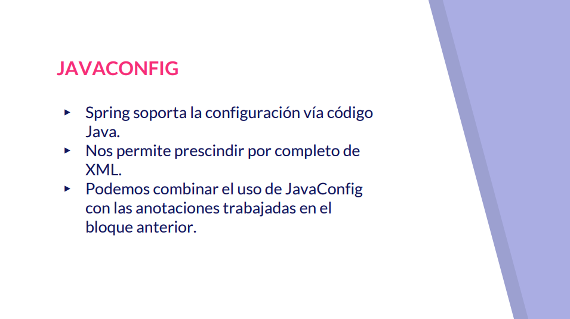

Spring soporta desde la versión 3 la configuración de código Java, lo cual nos permite prescindir por completo del uso de XML, de hecho podemos utilizar la configuración Java de manera exclusiva o incluso combinarla con otro tipo de configuración cómo sería por ejemplo el uso de anotaciones que sería bastante usual.

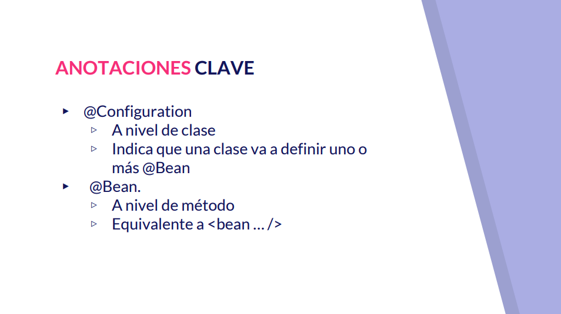

Para poder usar la configuración con Java Config tenemos que utilizar dos anotaciones concretamente que son:

* `@Configuration`: se utiliza a nivel de clase, indica que una clase va a tener aspectos de configuración, en particular que va a reunir más de un método anotado con `@Bean`.
* `@Bean`: se utiliza nivel de método y qué es equivalente a la declaración de un bien en el XML.

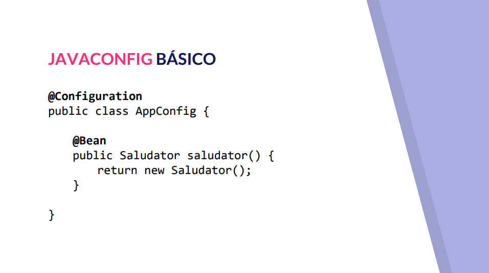

Aquí tenemos un ejemplo de Java Config bastante básico, en el que tendríamos una clase anotada con `@Configuration` con un método anotado con `@Bean`, lo que haría en este caso sería, crear un nuevo bean, el tipo sería el tipo de retorno del método `Saludator` y el objeto creado sería `new Saludator()`, este objeto que nosotros devolvemos pasaría a ser gestionado por nuestro contenedor de inversión de control.

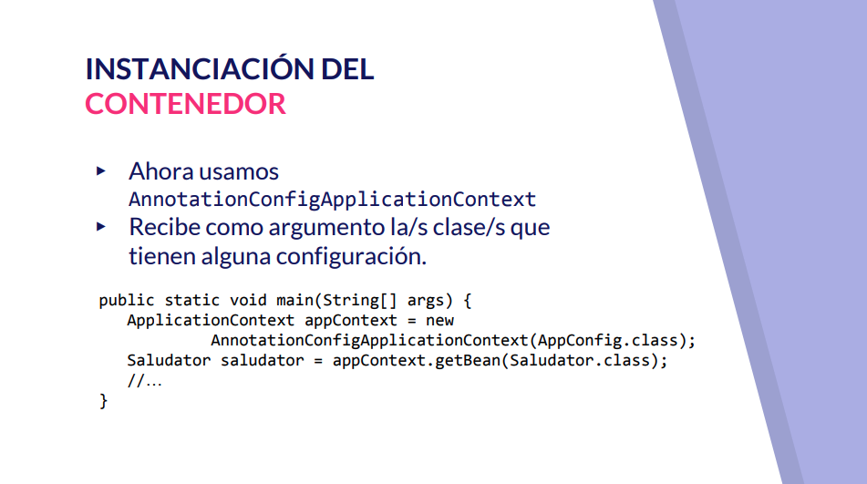

Más cambios en nuestra clase principal, en lugar de usar `ClassPathXmlApplicationContext(beans.xml)` como venismos utilizando hasta ahora, como ya no tenemos archivo XML, tendríamos que usar la clase `AnnotationConfigApplicationContext` de manera que le podemos indicar cual es la clase anotada con `@Configuration`, la clase o las clases porque le podremos indicar más de una y de esa manera podremos seguir trabajando y obtener los beans como hemos venido utilizando hasta ahora.

Lo podemos comprobar en el siguiente ejemplo.

### :computer: Ejemplo Proyecto JavaConfig `141-18-01-JavaConfig`

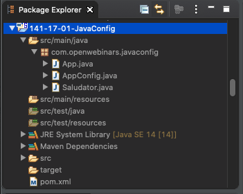

Volvemos al ejemplo del principio (*Ej. 141-03-Bean*), en el que tenemos un bean, una clase pojo sin ningún tipo de anotación.

*`Saludator.java`*

```java
package com.openwebinars.javaconfig;

public class Saludator {
	
   public String saludo() {
      return "Hola mundo!!!";
   }

}
```

Y mediante la clase `AppConfig` decimos que queremos crear nuevo bean de tipo `Saludator` invocando el constructor, el nombre del bean será el nombre del método en este caso `saludator()`.

*`AppConfig.java`*

```java
package com.openwebinars.javaconfig;

import org.springframework.context.annotation.Bean;
import org.springframework.context.annotation.Configuration;

@Configuration
public class AppConfig {
	
   @Bean
   public Saludator saludator() {
      return new Saludator();
   }

}
```

De esta manera levantamos el contexto haciendo referencia a la clase de configuración `AnnotationConfigApplicationContext` y obtenemos el bean.

*`App.java`*

```java
package com.openwebinars.javaconfig;

import org.springframework.context.ApplicationContext;
import org.springframework.context.annotation.AnnotationConfigApplicationContext;

public class App {

   public static void main(String[] args) {
		
      ApplicationContext appContext = new AnnotationConfigApplicationContext(AppConfig.class);
		
	  Saludator saludator = appContext.getBean(Saludator.class);
		
	  System.out.println(saludator.saludo());
		
	  ((AnnotationConfigApplicationContext) appContext).close();

   }

}
```

OBSERVECE QUE YA NO TENEMOS EL FAMOSO ARCHIVO XML (beans.xml).

Esto funcionará pues tal cual.

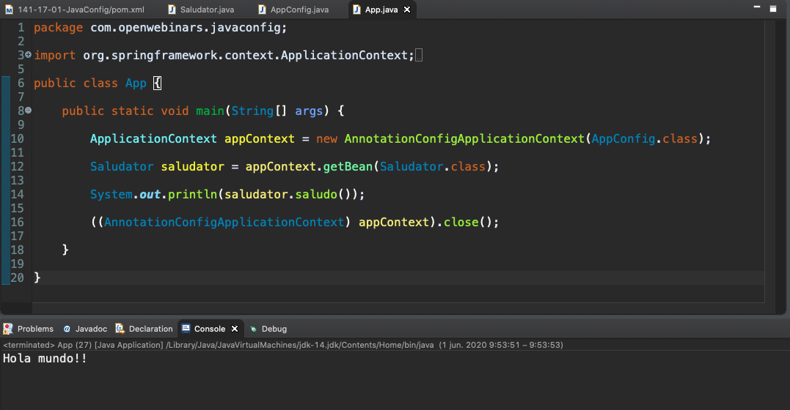

Y nos damos cuenta de que no hemos utilizado nuestro fichero XML absolutamente para nada.

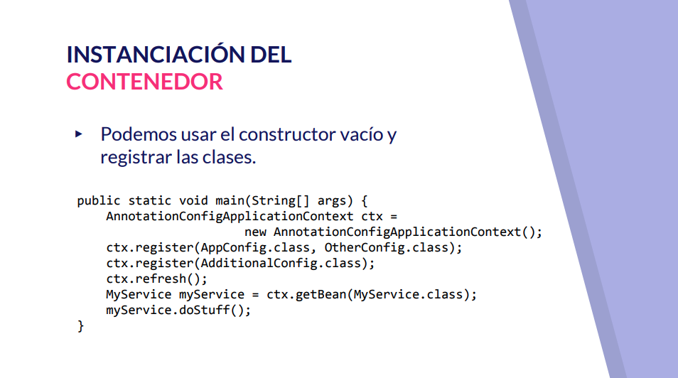

Decir también que si queremos podemos utilizar el constructor vacío y mediante el método `register` y registrando las clases de configuración y refrescando el contexto. Resulta algo más cómodo utilizar el constructor dónde se le pasan los argumentos.

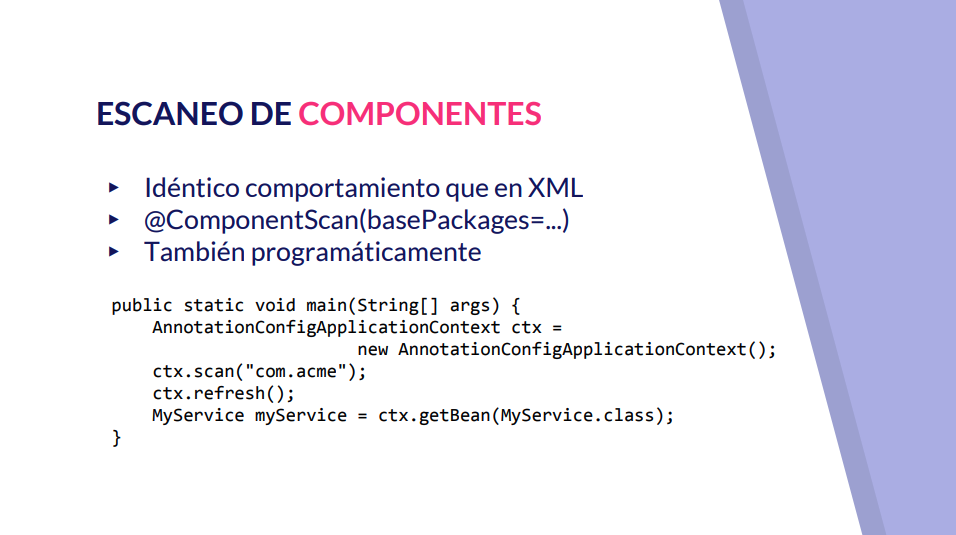

Podemos activar también el escaneo de componentes con la anotación `@ComponentScan` que tendría el comportamiento idéntico al XML.

También lo podemos hacer programaticamente aunque te digo a mí me gusta algo más a través de la anotación.

Lo tendremos en el siguiente ejemplo.

### :computer: Ejemplo Proyecto JavaConfigScan `141-18-02-JavaConfig-Scan`

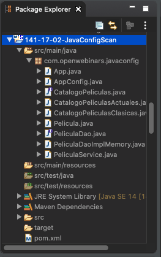

La configuración de `AppConfig` escanearía el paquete `com.openwebinars.javaconfig` y encontraría todas las clases anotadas.

*`AppConfig.java`*

```java
package com.openwebinars.javaconfig;

import org.springframework.context.annotation.ComponentScan;
import org.springframework.context.annotation.Configuration;

@Configuration
@ComponentScan(basePackages="com.openwebinars.javaconfig")
public class AppConfig {

}
```

Las clases anotadas son las siguientes que ya habámos anotado en el ejemplo anterior:

*`CatalogoPeliculasActuales.java`*

```java
package com.openwebinars.javaconfig;

import java.util.ArrayList;
import java.util.Collection;
import java.util.List;

import javax.annotation.PostConstruct;

import org.springframework.stereotype.Repository;

@Repository("actuales")
public class CatalogoPeliculasActuales implements CatalogoPeliculas {

   public List<Pelicula> peliculas = new ArrayList<>();
	
   public Collection<Pelicula> getPeliculas() {
      return peliculas;
   }
	
   @PostConstruct
   public void init() {
      peliculas.add(new Pelicula("Vengadores: Infinity War", "2018","Ciencia ficción"));
      peliculas.add(new Pelicula("Black Panther","2018","Ciencia ficción"));
      peliculas.add(new Pelicula("Han Solo", "2018", "Acción"));
      peliculas.add(new Pelicula("Ocean's 8", "2018", "Acción"));
      peliculas.add(new Pelicula("Tom Raider", "2018", "Aventuras"));
      peliculas.add(new Pelicula("Campeones","2018","Comedia"));
   }

}
```

*`CatalogoPeliculasClasicas.java`*

```java
package com.openwebinars.javaconfig;

import java.util.ArrayList;
import java.util.Collection;
import java.util.List;

import javax.annotation.PostConstruct;

import org.springframework.stereotype.Repository;

@Repository("clasicas")
public class CatalogoPeliculasClasicas implements CatalogoPeliculas {

   public List<Pelicula> peliculas = new ArrayList<>();
	
   public Collection<Pelicula> getPeliculas() {
      return peliculas;
   }
	
   @PostConstruct
   public void init() {
      peliculas.add(new Pelicula("La guerra de las galaxias", "1977","Ciencia ficción"));
      peliculas.add(new Pelicula("La lista de Schindler","1993","Drama"));
      peliculas.add(new Pelicula("El Padrino", "1972", "Drama"));
      peliculas.add(new Pelicula("Apocalypse Now", "1979", "Bélico"));
      peliculas.add(new Pelicula("Gladiator", "2000", "Acción"));
      peliculas.add(new Pelicula("El Gran Dictador","1940","Comedia"));
   }

}
```

*`PeliculaDaoImplMemory.java`*

```java
package com.openwebinars.javaconfig;

import java.util.ArrayList;
import java.util.Collection;
import java.util.List;
import java.util.Set;
import java.util.stream.Collectors;

import javax.annotation.PostConstruct;
import javax.annotation.PreDestroy;

import org.springframework.beans.factory.annotation.Autowired;
import org.springframework.stereotype.Repository;

@Repository
public class PeliculaDaoImplMemory implements PeliculaDao {

   private List<Pelicula> peliculas = new ArrayList<>();
	
   @Autowired
   private Set<CatalogoPeliculas> catalogosPeliculas;
	
   @PostConstruct
   public void init() {
      peliculas = catalogosPeliculas
			.stream()
			.map(catalogo -> catalogo.getPeliculas())
			.flatMap(lista -> lista.stream())
			.collect(Collectors.toCollection(ArrayList::new));		
   }
	
   @PreDestroy
   public void destroy() {
      System.out.println("");
      System.out.println("Limpiando el almacén de películas");
      peliculas.clear();
   }
	
   public Pelicula findById(int id) {
      return peliculas.get(id);
   }

   public Collection<Pelicula> findAll() {
      return peliculas;
   }

   public void insert(Pelicula pelicula) {
      peliculas.add(pelicula);
   }

   public void edit(Pelicula antigua, Pelicula nueva) {		
      peliculas.remove(antigua);
      peliculas.add(nueva);		
   }

   public void delete(Pelicula pelicula) {
      peliculas.remove(pelicula);
   }

}
```

*`PeliculaService.java`*

```java
package com.openwebinars.javaconfig;

import java.util.ArrayList;
import java.util.List;
import java.util.stream.Collectors;

import org.springframework.beans.factory.annotation.Autowired;
import org.springframework.stereotype.Service;

@Service
public class PeliculaService {
	
   @Autowired
   private PeliculaDao peliculaDao;
	
   public void setPeliculaDao(PeliculaDao peliculaDao) {
      this.peliculaDao = peliculaDao;
   }
		
   public List<Pelicula> pelisPorGenero(String genero) {
      return peliculaDao
		.findAll()
		.stream()
		.filter(p -> p.getGenero().equalsIgnoreCase(genero))
		.collect(Collectors.toCollection(ArrayList::new));
   }
	
}
```

De manera que con Java Config también podemos usar la configuración de Estereotipo que habiamos usado con las anotaciones.

*`App.java`*

```java
package com.openwebinars.javaconfig;

import org.springframework.context.ApplicationContext;
import org.springframework.context.annotation.AnnotationConfigApplicationContext;

public class App {

   public static void main(String[] args) {
		
      ApplicationContext appContext = new AnnotationConfigApplicationContext(AppConfig.class);
		
      PeliculaService peliculaService = appContext.getBean(PeliculaService.class);
		
      peliculaService.pelisPorGenero("Ciencia ficción").forEach(System.out::println);
				
      ((AnnotationConfigApplicationContext) appContext).close();

   }

}
```

Al ejecutar la aplicación tenemos:

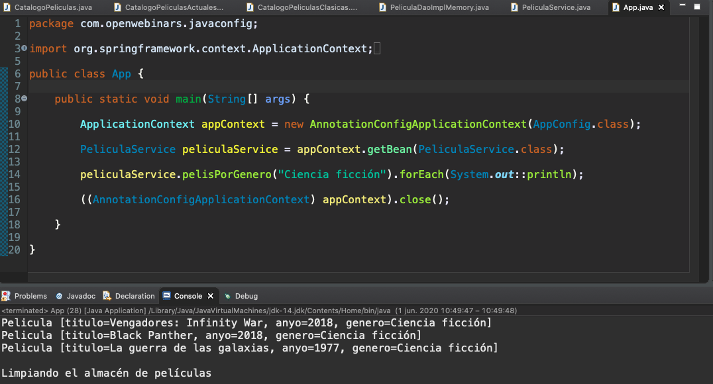

De esta forma podríamos tener un comportamiento muy parecido al del ejemplo 16-02 pero sin la necesidad de manejar XML.

# 19 Uso de @Bean 9:49 

[PDF 5-2_Uso_de_Bean.pdf](pdfs/5-2_Uso_de_Bean.pdf)

## Resumen Profesor

### ¿Es mejor definir un `@Bean` a través de una interfaz o del tipo concreto de una clase?

Hemos podido ver en el vídeo que el tipo de retorno de un método anotado con `@Bean` puede ser una clase o bien una interfaz (o supertipo).

```java
@Configuration
public class AppConfig {

    @Bean
    public TransferService transferService() {
        return new TransferServiceImpl();
    }
}
```

El uso de una interfaz, en lugar del tipo concreto, limita la visibilidad del bean (en el uso de *autocableado*) al tipo de interfaz especificado (`TransferService`). Si constantemente hace referencia a sus tipos mediante una interfaz de servicio declarada, sus tipos de retorno de los métodos `@Bean` pueden seguir de forma segura esa decisión de diseño. Sin embargo, para los componentes que implementan varias interfaces o para componentes potencialmente referidos por su tipo de implementación, es más seguro declarar el tipo de retorno más específico posible (al menos tan específico como sea requerido por los puntos de inyección referidos a su bean).

### Un ejemplo más completo del uso de `@Bean`

Es posible que con el ejemplo del vídeo no le veamos toda la utilidad a la configuración JavaConfig con `@Bean`. Eso se debe a que estamos trabajando con una serie de clases para las cuales tenemos acceso al código fuente. Es más, las hemos codificado todas, y podemos añadirle los estereotipos. Pero, ¿y si no fuera el caso? ¿Y si quisieramos crear una serie de beans a partir de clases implementadas por terceros, a cuyo código fuente no tenemos acceso y que no están estereotipadas? Ahí, el uso de JavaConfig y `@Bean` cobran más sentido.

A continuación os dejo el código fuente de un ejemplo completo de nuestro curso de Hibernate:

```java
package com.openwebinars.hibernate.hbnpost.config;

import java.util.Properties;
import javax.sql.DataSource;
import org.springframework.beans.factory.annotation.Autowired;
import org.springframework.context.annotation.Bean;
import org.springframework.context.annotation.Configuration;
import org.springframework.core.env.Environment;
import org.springframework.dao.annotation.PersistenceExceptionTranslationPostProcessor;
import org.springframework.jdbc.datasource.DriverManagerDataSource;
import org.springframework.orm.jpa.JpaTransactionManager;
import org.springframework.orm.jpa.LocalContainerEntityManagerFactoryBean;
import org.springframework.orm.jpa.vendor.HibernateJpaVendorAdapter;
import org.springframework.transaction.annotation.EnableTransactionManagement;

@Configuration
@EnableTransactionManagement
public class DatabaseConfig {

    /**
     * Definición del DataSource para la conexión a nuestra base de datos.
     * Las propiedades son establecidas desde el fichero de properties, y
     * asignadas usando el objeto env.
     *
     */
    @Bean
    public DataSource dataSource() {
        DriverManagerDataSource dataSource = new DriverManagerDataSource();
        dataSource.setDriverClassName(env.getProperty("db.driver"));
        dataSource.setUrl(env.getProperty("db.url"));
        dataSource.setUsername(env.getProperty("db.username"));
        dataSource.setPassword(env.getProperty("db.password"));
        return dataSource;
    }

    /**
     *
     * Declaración del EntityManagerFactory de JPA
     */
    @Bean
    public LocalContainerEntityManagerFactoryBean entityManagerFactory() {
        LocalContainerEntityManagerFactoryBean entityManagerFactory = new LocalContainerEntityManagerFactoryBean();

        //Le asignamos el dataSource que acabamos de definir.
        entityManagerFactory.setDataSource(dataSource);

        // Le indicamos la ruta donde tiene que buscar las clases anotadas
        entityManagerFactory.setPackagesToScan(env.getProperty("entitymanager.packagesToScan"));

        // Implementación de JPA a usar: Hibernate
        HibernateJpaVendorAdapter vendorAdapter = new HibernateJpaVendorAdapter();
        entityManagerFactory.setJpaVendorAdapter(vendorAdapter);

        // Propiedades de Hiberante
        Properties additionalProperties = new Properties();
        additionalProperties.put("hibernate.dialect", env.getProperty("hibernate.dialect"));
        additionalProperties.put("hibernate.show_sql", env.getProperty("hibernate.show_sql"));
        additionalProperties.put("hibernate.hbm2ddl.auto", env.getProperty("hibernate.hbm2ddl.auto"));
        entityManagerFactory.setJpaProperties(additionalProperties);

        return entityManagerFactory;
    }

    /**
     * Inicializa y declara el gestor de transacciones
     */
    @Bean
    public JpaTransactionManager transactionManager() {
        JpaTransactionManager transactionManager = new JpaTransactionManager();
        transactionManager.setEntityManagerFactory(entityManagerFactory.getObject());
        return transactionManager;
    }

    /**
     *  
     * Este bean es un postprocessor que ayuda a relanzar las excepciones específicas
     * de cada plataforma en aquellas clases anotadas con @Repository
     *
     */
    @Bean
    public PersistenceExceptionTranslationPostProcessor exceptionTranslation() {
        return new PersistenceExceptionTranslationPostProcessor();
    }

    @Autowired
    private Environment env;

    @Autowired
    private DataSource dataSource;

    @Autowired
    private LocalContainerEntityManagerFactoryBean entityManagerFactory;

}
```

## Transcripción


Ya nos hemos metido de lleno en la configuración a través de Java Config. Vamos a ver cómo podemos usar la anotación `@Bean`  y algunas cositas asociada a ella.

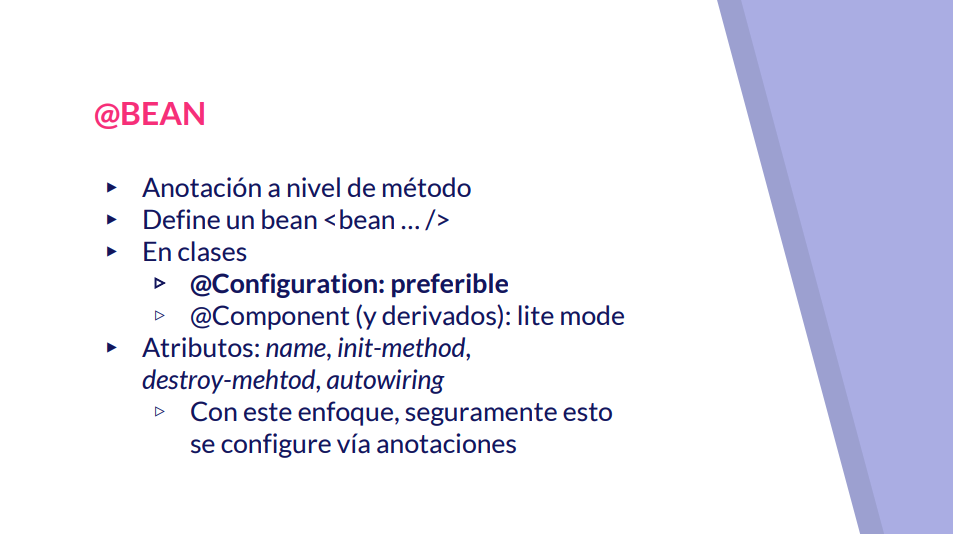

`@Bean` es una anotación a nivel de método que nos va a permitir definir un bean tal cual lo haciamos con el elemento correspondiente en XML. Lo podemos usar tanto en clases con `@Configuration` totalmente preferible, aun que también se puede usar en las clases estereotipadas con `@Component` y sus derivados lo que se conoce como el `lite mode` que se recomienda menos solo por que es más organizado declarar los beans dentro de la configuración.

La anotación `@Bean` tiene como atributos los mismos atributos que tenía el elemento `bean` en XML como son:

* `name`
* `init-method`
* `destroy-method`
* `autowiring`

Aunque con este enfoque es posible que nos interese hacer una combinación entre Java Config  y las anotaciones para poder configurar estos aspectos. Si quisieramos hacer una configuración Java totalmente pura también lo podriamos hacer de esta manera.

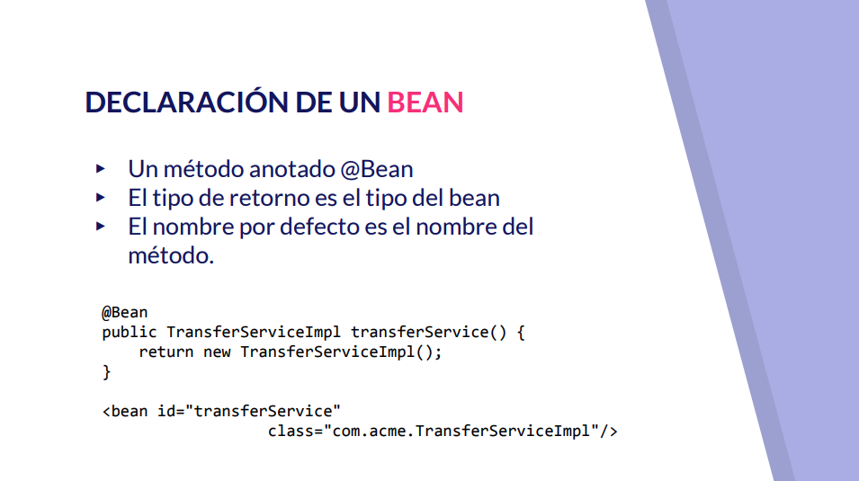

Para declarar un bean lo que tenemos que hacer es crear un método, anotado con `@Bean` donde el tipo de retorno será el tipo del Bean y el nombre del Bean será el nombre del método.

Aquí tenemos una comparativa de lo que sería hacerlo con XML que lo tenemos abajo y con `@Bean` que lo tendríamos arriba. Creariamos un bean con nombre `transferService` dónde instanciariamos una clase de tipo `TransferServiceImpl` el bean sería de ese tipo y se llamaría `transferService`.

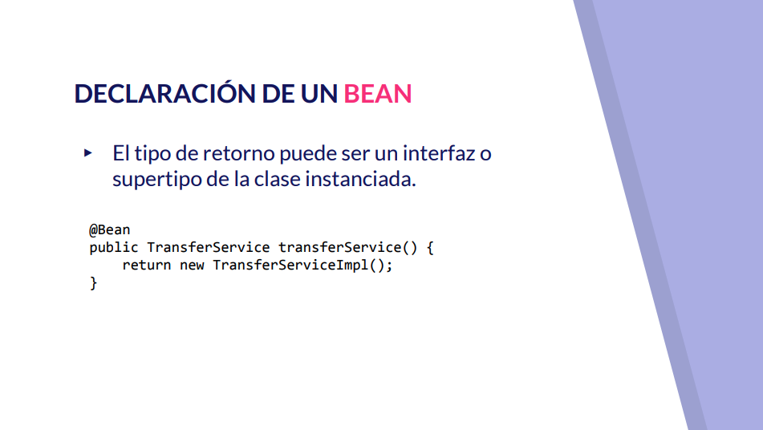

El tipo de retorno no tiene porqué ser la clase concreta, sino que puede ser alguna interfaz, algún supertipo. De manera que  aquí estamos devolviendo un bean de tipo `TransferService` si bien la clase es una clase más concreta `TransferServiceImpl`. Al estilo de cómo lo hemos utilizado antes que requerimos un bean de de una interfaz y se nos devolvía la instancia de una clase. 

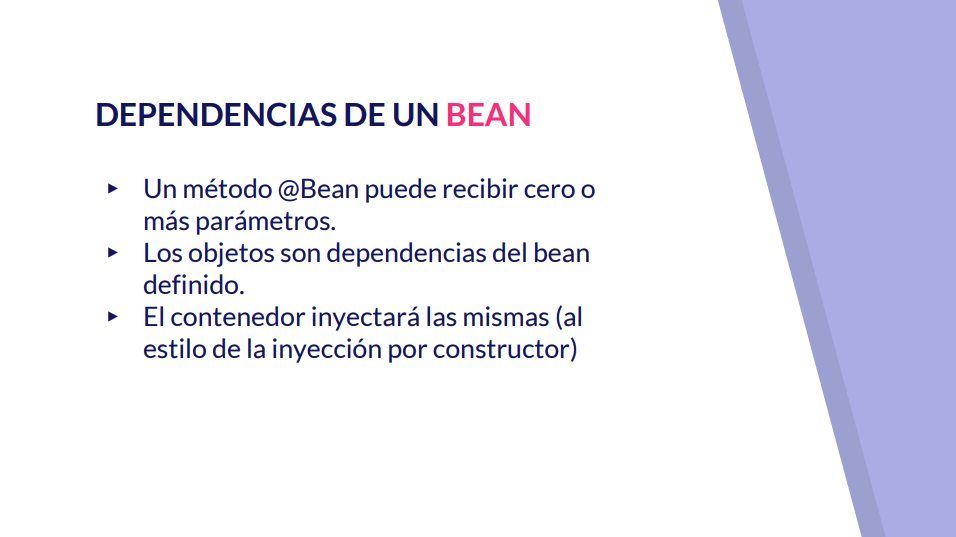

Un método anotado con `@Bean` puede recibir 0 o más parámetros, aunque lo usual es que puede tener más de uno y esos parámetros que se reciben son dependencias del bean, de manera que el contenedor se encargará de inyectarlos.

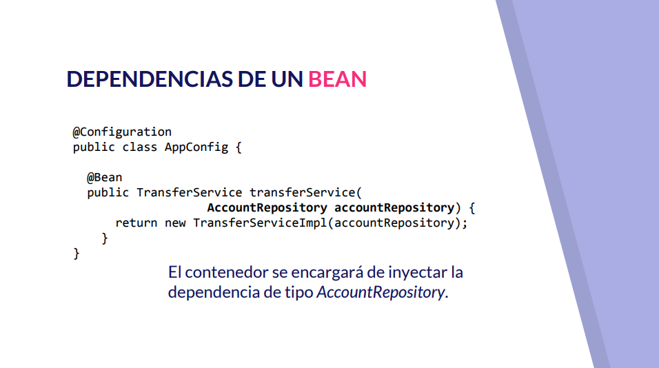

Veámoslo con un el ejemplo, el método `transferService` necesita hacer uso de la clase `AccountRepository` a través de una referencia, pues al indicar aquí un argumento en este método un parámetro, lo que estamos declarando realmente es una dependencia, de manera que es el contenedor el que se encarga de inyectar dentro de este parámetro, la dependencia correspondiente para que podamos utilizar este tipo de objeto. 


Podemos utilizar también los ámbitos a través de las anotaciones con `Scope, singleton, prototype` y las derivadas `Request, Session, Application`.

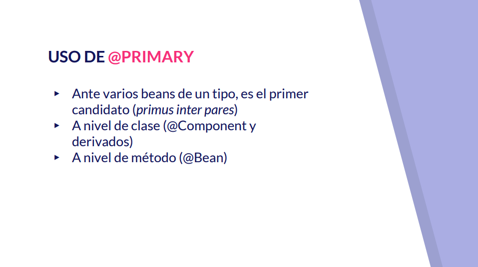

También podemos usar la anotación `@Primary` la cual sirve igual que el atributo `primary` en XML para definir un candidato *primus inter pares*, es decir el primario sobre otros iguales.

Ejemplo de `@Primary` con `@Component`

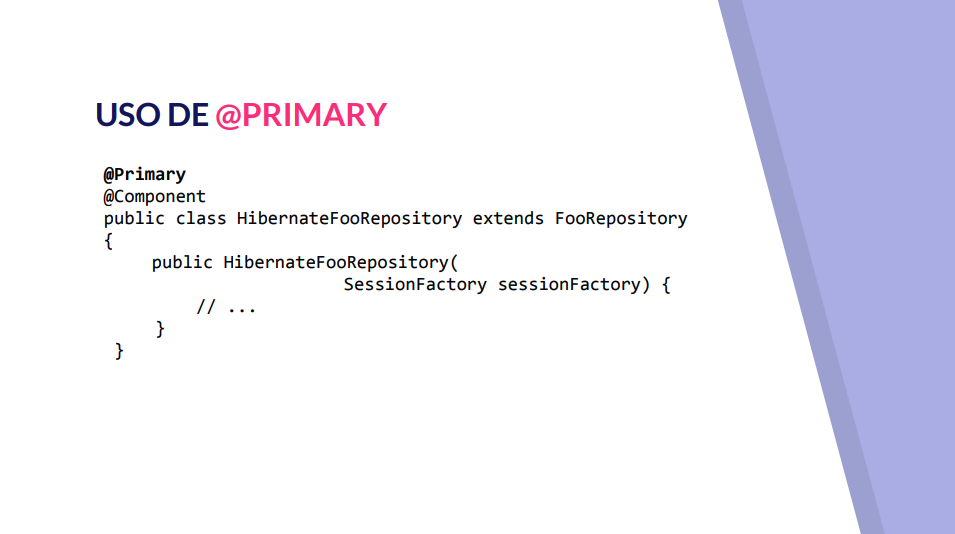

Ejemplo de `@Primary` con `@Bean`

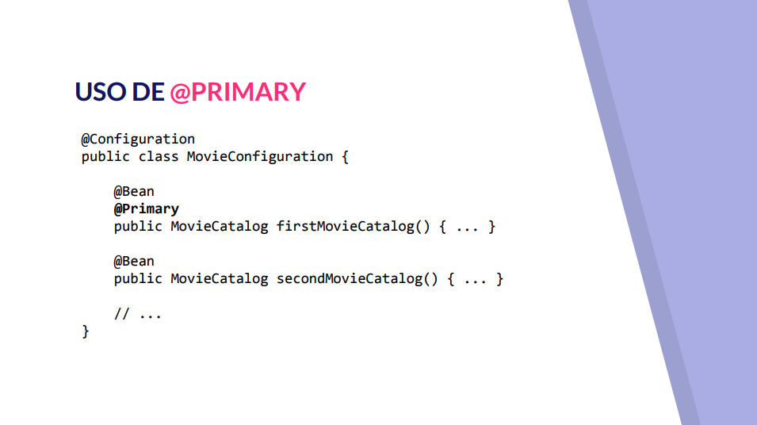

Vamos a ir viendo algunos de los ejemplos que hemos creado para ilustrarlo.

### :computer: Ejemplo Proyecto JavaConfig Bean

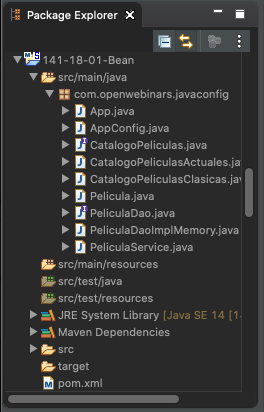

En este primer ejemplo hemos cambiado radicalmente hemos pasado de de usar el escaneo de componentes a crear todos nuestros beans, de manera que se creen dentro de esta clase de configuración.

*`AppConfig.java`*

```java
package com.openwebinars.javaconfig;

import org.springframework.context.annotation.Bean;
import org.springframework.context.annotation.Configuration;
import org.springframework.context.annotation.Primary;

@Configuration
public class AppConfig {
	
   @Bean
   @Primary
   public CatalogoPeliculas catalogoActuales() {
      return new CatalogoPeliculasActuales();
   }
	
   @Bean
   public CatalogoPeliculas catalogoClasicas() {
      return new CatalogoPeliculasClasicas();
   }
	
   @Bean
   public PeliculaDao peliculaDaoImplMemory() {
      return new PeliculaDaoImplMemory();
   }
	
   @Bean
   public PeliculaService peliculaService() {
      return new PeliculaService();
   }

}
```

Y no tengamos ninguna anotación de tipo de estereotipo sobre ninguna clase.

Las clases que estaban anotadas con esteotipos y ya no lo estan son las siguientes:

*`CatalogoPeliculasActuales.java`*

```java
package com.openwebinars.javaconfig;

import java.util.ArrayList;
import java.util.Collection;
import java.util.List;

import javax.annotation.PostConstruct;

public class CatalogoPeliculasActuales implements CatalogoPeliculas {

   public List<Pelicula> peliculas = new ArrayList<>();
	
   public Collection<Pelicula> getPeliculas() {
      return peliculas;
   }
	
   @PostConstruct
   public void init() {
      peliculas.add(new Pelicula("Vengadores: Infinity War", "2018","Ciencia ficción"));
      peliculas.add(new Pelicula("Black Panther","2018","Ciencia ficción"));
      peliculas.add(new Pelicula("Han Solo", "2018", "Acción"));
      peliculas.add(new Pelicula("Ocean's 8", "2018", "Acción"));
      peliculas.add(new Pelicula("Tom Raider", "2018", "Aventuras"));
      peliculas.add(new Pelicula("Campeones","2018","Comedia"));
   }

}
```

*`CatalogoPeliculasClasicas.java`*

```java
package com.openwebinars.javaconfig;

import java.util.ArrayList;
import java.util.Collection;
import java.util.List;

import javax.annotation.PostConstruct;

public class CatalogoPeliculasClasicas implements CatalogoPeliculas {

   public List<Pelicula> peliculas = new ArrayList<>();
	
   public Collection<Pelicula> getPeliculas() {
      return peliculas;
   }
	
   @PostConstruct
   public void init() {
      peliculas.add(new Pelicula("La guerra de las galaxias", "1977","Ciencia ficción"));
      peliculas.add(new Pelicula("La lista de Schindler","1993","Drama"));
      peliculas.add(new Pelicula("El Padrino", "1972", "Drama"));
      peliculas.add(new Pelicula("Apocalypse Now", "1979", "Bélico"));
      peliculas.add(new Pelicula("Gladiator", "2000", "Acción"));
      peliculas.add(new Pelicula("El Gran Dictador","1940","Comedia"));
   }

}
```

*`PeliculaDaoImplMemory.java`*

```java
package com.openwebinars.javaconfig;

import java.util.ArrayList;
import java.util.Collection;
import java.util.List;
import java.util.Set;
import java.util.stream.Collectors;

import javax.annotation.PostConstruct;
import javax.annotation.PreDestroy;

import org.springframework.beans.factory.annotation.Autowired;

public class PeliculaDaoImplMemory implements PeliculaDao {

   private List<Pelicula> peliculas = new ArrayList<>();
	
   @Autowired
   private Set<CatalogoPeliculas> catalogosPeliculas;
	
   @PostConstruct
   public void init() {
      peliculas = catalogosPeliculas
			.stream()
			.map(catalogo -> catalogo.getPeliculas())
			.flatMap(lista -> lista.stream())
			.collect(Collectors.toCollection(ArrayList::new));		
   }
	
   @PreDestroy
   public void destroy() {
      System.out.println("");
      System.out.println("Limpiando el almacén de películas");
      peliculas.clear();
   }
	
   public Pelicula findById(int id) {
      return peliculas.get(id);
   }

   public Collection<Pelicula> findAll() {
      return peliculas;
   }

   public void insert(Pelicula pelicula) {
      peliculas.add(pelicula);
   }

   public void edit(Pelicula antigua, Pelicula nueva) {		
      peliculas.remove(antigua);
      peliculas.add(nueva);		
   }

   public void delete(Pelicula pelicula) {
      peliculas.remove(pelicula);
   }

}
```

*`PeliculaService.java`*

```java
package com.openwebinars.javaconfig;

import java.util.ArrayList;
import java.util.List;
import java.util.stream.Collectors;

import org.springframework.beans.factory.annotation.Autowired;

public class PeliculaService {
	
   @Autowired
   private PeliculaDao peliculaDao;
	
   public void setPeliculaDao(PeliculaDao peliculaDao) {
      this.peliculaDao = peliculaDao;
   }
		
   public List<Pelicula> pelisPorGenero(String genero) {
      return peliculaDao
		.findAll()
		.stream()
		.filter(p -> p.getGenero().equalsIgnoreCase(genero))
		.collect(Collectors.toCollection(ArrayList::new));
   }
	
}
```

De manera que con Java Config también podemos usar la configuración de Estereotipo que habiamos usado con las anotaciones.

*`App.java`*

```java
package com.openwebinars.javaconfig;

import org.springframework.context.ApplicationContext;
import org.springframework.context.annotation.AnnotationConfigApplicationContext;

public class App {

   public static void main(String[] args) {
		
      ApplicationContext appContext = new AnnotationConfigApplicationContext(AppConfig.class);
		
      PeliculaService peliculaService = appContext.getBean(PeliculaService.class);
		
      peliculaService.pelisPorGenero("Ciencia ficción").forEach(System.out::println);
				
      ((AnnotationConfigApplicationContext) appContext).close();

   }

}
```

Al ejecutar la aplicación tenemos:

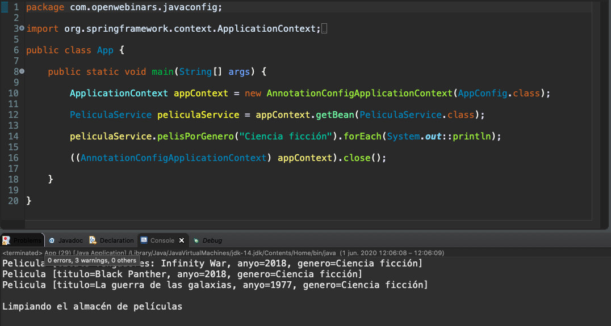

Intentando sin tampoco acomplejar demasiado, hacer una una configuración con Java más pura.

Si quisieramos hacer con Java una configuración totalmente ortogonal, es decir que en nuestro código de las clases no tuviera ninguna anotación como `@Autowired`, `@PostConstruct`, `@PreDestroy` los métodos como `init()` los tendríamos que declarar en el catalogo de películas actuales:


```java
@Bean(initMethod=init)
@Primary
public CatalogoPeliculas catalogoActuales() {
   return new CatalogoPeliculasActuales();
}
```

Asi también con todos los demas métodos para que no tuvieramos ningun tipo de dependencia. `Autowired` la tendríamos que declarar a través de constructores y que fuese Java Config el encargado de inyectar las dependencias.

Aun que lo más usual es usar una combinación de Java Config con anotaciones.

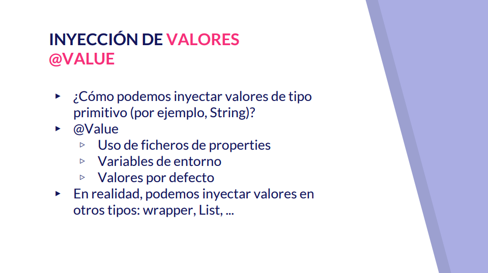

Hasta ahora con anotaciones hemos inyectado siempre objetos pero que pasa con valores de tipo primitivo como por ejemplo `String`. Para ello tenemos otra anotación que es `@Value` y es muy útil ya que nos permite inyectar un valor literal o valores del entorno, valores por defecto, fichero de properties, etc.

De hecho es una anotación potente ya que nos permite inyectar no solamente Strings sino clases wrappers, lista, etc.

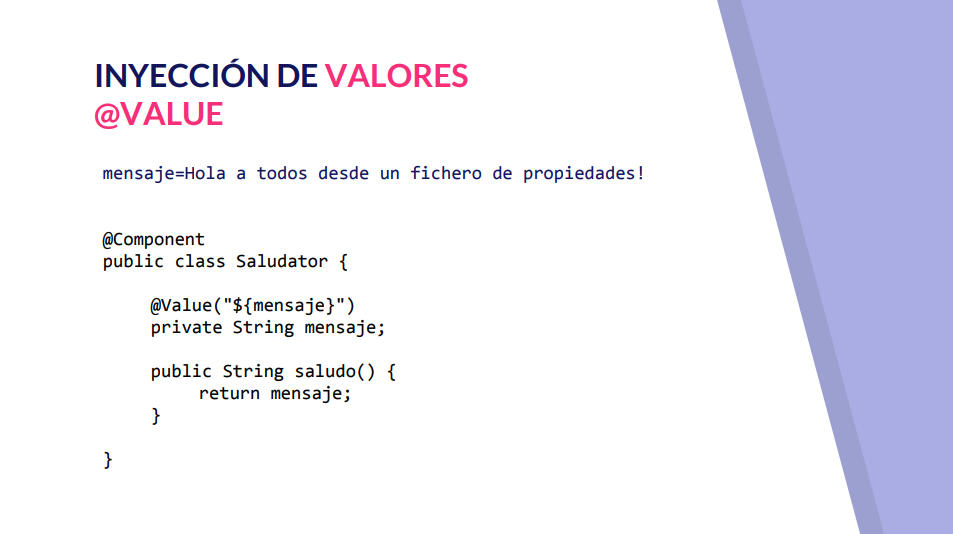

Nosotros vamos a ver un ejemplo de como crear la inyección de una propiedad que va a estar definida en un fichero de properties externo para utilizarlo dentro de un componente. Cómo podemos comprobarlo hacemos mediante la anotacion `@Value`  y la sintaxis qué se utiliza en bastante útil, similar a Spring expression language, decimos que busque dentro del entorno una propiedad llamada `mensaje` y aquí lo que indicaría sería el valor de mensaje mediante `@Value("${mensaje}")`

Vamos a ver el ejemplo.

### :computer: Ejemplo Proyecto Value

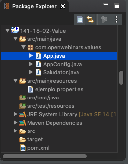

Dentro de la carpeta `resources` hemos creado el fichero de properties llamado `ejemplo.properties`.

*`ejemplo.properties`*

```txt
mensaje=Hola a todos desde un fichero de propiedades!
```

Dónde tenemos una propiedad, los ficheros de properties son ficheros muy sencillos que nos permiten crear un listado de pares clave-valor, dentro de un fichero textual dónde se pone primero la clave = y el valor, incluso no es necesario que pongamos comillas a las a las cadenas de caracteres.

Para configurar el uso de las properties usamos la anotación `@PropertySource("classpath:/ejemplo.properties")` donde indicamos como parámetro el fichero de properties, usamos la palabra `classpath` para que busque el archivo dentro del class path de la aplicación. 

*`AppConfig.java`*

```java
package com.openwebinars.values;

import org.springframework.context.annotation.ComponentScan;
import org.springframework.context.annotation.Configuration;
import org.springframework.context.annotation.PropertySource;

@Configuration
@ComponentScan(basePackages="com.openwebinars.values")
@PropertySource("classpath:/ejemplo.properties")
public class AppConfig {

}
```

Con esto carga el fichero de properties y ya podemos usarlo.

En la clase `Saludator` que es un componente, es donde vamos a inyectar el valor del mensaje:

*`Saludator.java`*

```java
package com.openwebinars.values;

import org.springframework.beans.factory.annotation.Value;
import org.springframework.stereotype.Component;

@Component
public class Saludator {
	
   //@Value("Hola mundo")
   @Value("${mensaje}")
   private String mensaje;
	
   public String saludo() {
      return mensaje;
   }

}
```

Podemos ver comentado como le inyectaríamos un valor literal y abajo vemos como le inyectamos el valor tomado del archivo properties.

Nuestra clase de aplicación contiene lo siguiente:

*`App.java`*

```java
package com.openwebinars.values;

import org.springframework.context.ApplicationContext;
import org.springframework.context.annotation.AnnotationConfigApplicationContext;

public class App {

   public static void main(String[] args) {
		
      ApplicationContext appContext = new AnnotationConfigApplicationContext(AppConfig.class);
		
      Saludator s = appContext.getBean(Saludator.class);
		
      System.out.println(s.saludo());
				
      ((AnnotationConfigApplicationContext) appContext).close();

   }

}
```

Recupera el bean `Saludator` y manda el saludo, la salida que tenemos es: 

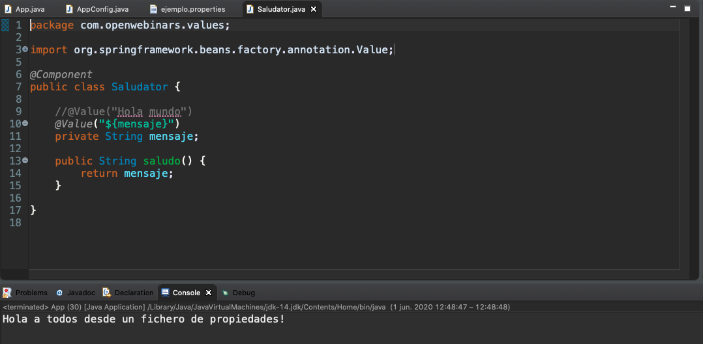

Podemos comprobar como el mensaje se está cargando desde el fichero de propiedades y de esta manera este es el mensaje que se muestra.

# Contenido adicional 2

* [PDF 5-1_Configuracion_a_traves_de_Java.pdf](pdfs/5-1_Configuracion_a_traves_de_Java.pdf)
* [PDF 5-2_Uso_de_Bean.pdf](pdfs/5-2_Uso_de_Bean.pdf)
