# 6. Ejemplo práctico - MovieAdvisor 71m

* 20 Introducción a MovieAdvisor 7:46 
* 21 Creación del proyecto y modelo de datos 5:49 
* 22 Repositorio y acceso a datos (Parte I) 12:55 
* 23 Repositorio y acceso a datos (Parte II) 9:30 
* 24 Servicios 13:28 
* 25 Ejecución de la app 22:28 
* Contenido adicional 1

# 20 Introducción a MovieAdvisor 7:46 

[PDF 6-1_Proyecto_de_ejemplo.pdf](pdfs/6-1_Proyecto_de_ejemplo.pdf)

## Transcripción


Vamos a finalizar nuestro curso de Spring Core con una sucesión de lecciones en la que iremos construyendo poco a poco una aplicación sencilla, pero que integre la mayoría de los conceptos con los que hemos trabajado a lo largo del curso. A este proyecto lo vamos a llamar **MovieAdvisor** y va a ser un sencillo recomendador de películas.

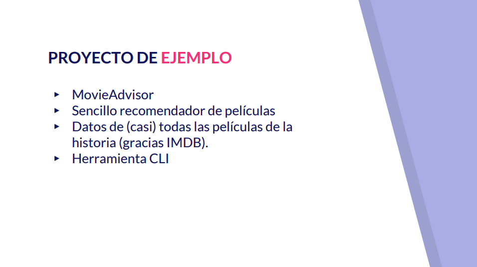

Vamos a trabajar con un fichero que es fácilmente descargable, yo lo he tuneado un poco, con datos de casi todas las películas de la historia. Gracias [IMDB](https://www.imdb.com/) por ofrecer estos datos. 

Lo que vamos a desarrollar es una herramienta de línea de comandos, veremos después que sintaxis queremos tener a la hora de invocarla, aunque nosotros fuera por no emborronar un poco lo mismo invocaremos directamente desde Eclipse.

Los datos los tendremos en un fichero CSV que hemos procesado y que lo tendréis disponible en el código fuente y que para cada película tiene asignado un `id` identificador, `title` en idioma original, `year` año y `genres` una sucesión separada por comas de los géneros en los cuales podemos enmarcar esa película, cómo vemos el separador de datos de columnas sería (`;`) y como separador de géneros tendríamos la coma (`,`) para hacer de separador dentro de esa columna.


```txt
id;title;year;genres
9;Miss Jerry;1894;Romance
147;The Corbett-Fitzsimmons Fight;1897;Documentary,News,Sport
229676;Reproduction of the Corbett and Fitzsimmons Fight;1897;Documentary,News,Sport
138342;O Campo Grande;1898;Documentary
138349;O Carnaval em Lisboa;1898;Documentary
138759;A Rua Augusta em Dia de Festa;1898;Documentary
138774;Saída dos Operários do Arsenal da Marinha;1898;Documentary
221032;Branding Cattle;1898;Documentary,Sci-Fi
221040;Buck Dance, Ute Indians;1898;Documentary
235357;Dressing Paper Dolls;1898;Documentary
236940;69th Regiment Passing in Review;1898;Documentary
237775;The Startled Lover;1898;Romance
138382;O Cortejo da Procissão da Senhora da Saúde;1899;Documentary
...
```

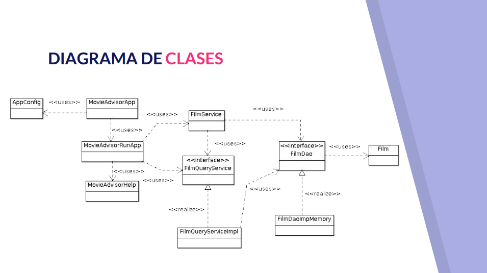

El diagrama de clases completo de nuestra aplicación va a ser este, si quisiéramos solamente plasmar en el diagrama el modelo de nuestra aplicación sería muy sencillo, porque sería tan solo una clase la clase `Film`. La clase película que va a guardar los datos de una película cómo lo hemos visto antes, el id, el título, el año de estreno y una lista con los géneros que incluye.

Sin embargo hemos querido poner un diagrama de clases del diseño donde se ven todas las demas clases e interfaces que van a intervenir para ver quien usa quien y por ende ver quien tiene una dependencia con quien, entonces el diagrama cobra un poco más de sentido y aunque no es extremadamente complejo, pero si es verdad que tenemos que ver cómo lo podemos interpretar.

Como punto de entrada quién tendrá el método main, será la clase `MovieAdvisorApp` si bien esta clase será algo de "cascarilla" ya que simplemente lo que hará será cargar el contexto y lanzar el método `run` quien tendrá la clase `movieAdvisorRunApp` quien será el que tenga el algoritmo de la aplicación, el que es capaz de procesar los argumentos, verificar si la sintaxis es correcta e invocar a los distintos servicios.

Como decíamos la clase `MovieAdvisorApp` que es la que tiene el método `main`, lo que hace es cargar el contexto para ello,  vamos a utilizar la configuración mixta de Java Config con anotaciones, entonces tendrá que usar la clase `AppConfig` para cargar ese contexto.

Además la clase `MovieAdvisorRunApp` en el caso de que queramos visualizar la ayuda, por crear otro componente más tenemos la clase `MovieAdvisorHelp` que será la encargada de cargar desde un fichero de texto, la sintaxis de la ayuda, para que la podamos imprimir por consola. 

A partir de `MovieAdvisorRunApp` esta clase, esté bean que tiene el algoritmo nuclear de la aplicación, va a jugar con dos servicios, uno de ellos, para que veas que podemos crear tranquilamente sobre una clase se llama `FilmService` digamos que un servicio de alto nivel, con operaciones bastante de alto nivel, con alto nivel nos referimos de abstracción, es decir que directamente nos da la posibilidad de obtener las películas que tengamos en nuestro almacén de datos, por una serie de criterios.

Y por otro lado tenemos la interfaz `FilmQueryService` implementada por la clase `FilmQueryServiceImpl` que nos va a permitir definir consultas algo más compleja sobre nuestro almacén de datos. 

Ambos servicios `FilmService` y `FilmQueryService` utilizan la interfaz `FilmDao` que es de alguna manera el contrato sobre nuestro repositorio, que en este caso lo vamos a implementar en memoria con `FilmDaoImpMemory` y que será la que almacenará todos estos datos, veremos como esto lo cargamos desde el fichero a través de un método estático, que será la encargada de leer este fichero modelo.

Y como es natural la interfaz `FilmDao` utiliza nuestro modelo `Film`.

Vamos a ponernos manos a la obra, vamos a ver qué sintaxis vamos a utilizar para poder luego implementarla de manera correcta. 

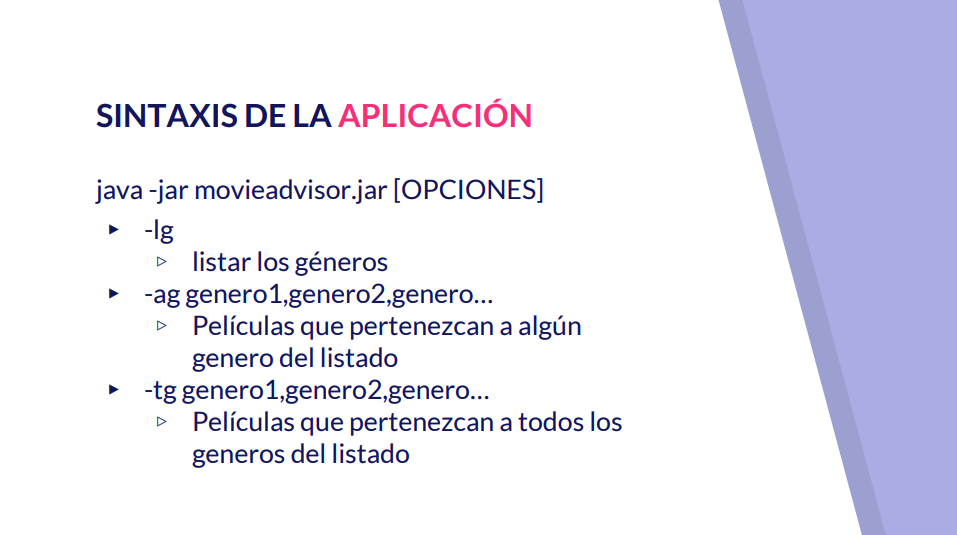

La idea que nosotros pudiéramos empaquetar esta aplicación en un `JAR` y pudiéramos proporcionarle una serie de opciones, la primera opción más sencilla sería listar los géneros diferentes (`-lg`) de todas las películas que tenemos, por si queremos saberlo y utilizarlo como criterio de búsqueda más adelante. 

A partir de aquí podemos utilizar cuatro opciones distintas que serían `-ag` es decir que la película incluya o pertenezca a alguno de los géneros que se listen, podríamos poner más de uno separado por comas, siempre y cuando no tenga un espacio.

`-tg` que en lugar de indicar que la película pertenece a algún género, la película tiene que pertenecer a todos los géneros que incluyamos.


Otro parámetro que se podría añadir serían `-y año` para ver películas estrenadas en dicho año.

O bien `-b desde,hasta` para ver las películas estrenadas en un intervalo, con un año de inicio y de fin.

Y la opción de de un título `-t titulo`, el decir que el título de la película contenga la cadena de caracteres que nosotros proponemos aquí, siempre sin espacio.

Por último la opción `-h` que mostrara el mensaje de ayuda.

Ya digo una aplicación que es sencilla, aunque si es nuestro primer proyecto Spring completo tendrá una complejidad media y además haremos un buen uso del API Strem de Java 8, para poder hacer los filtrados, las búsquedas, los mapeo, etcétera etcétera. 

# 21 Creación del Proyecto y Modelo de Datos 5:49 

## Transcripción

### :computer: `141-31-MovieAdvisor`
#### Un gran recomendador de péliculas

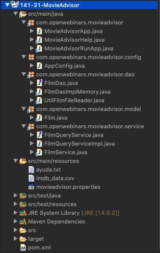

Vamos a continuar creando todo el esqueleto de nuestro proyecto de ejemplo para que podamos empezar a codificarlo, para ello al igual que en otras ocasiones vamos a crear un nuevo proyecto Maven.

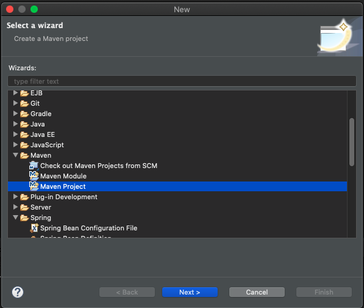

Podemos evitar el uso de cualquier arquetipo porque no lo vamos a necesitar.

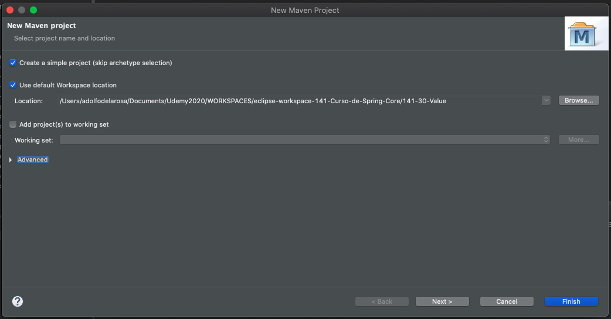

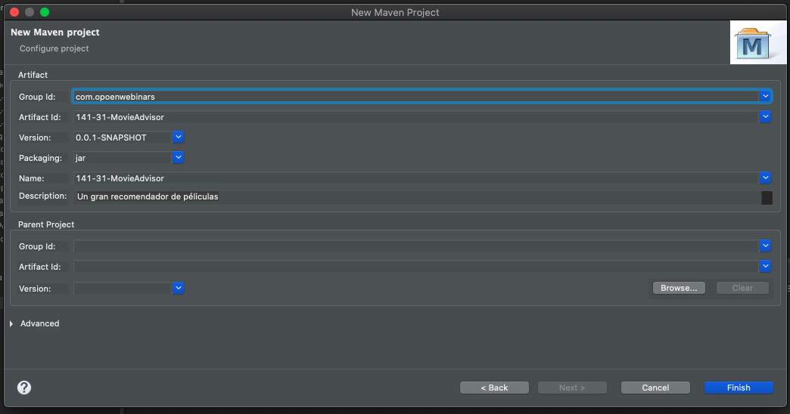

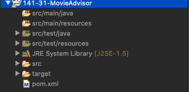

Recordemos que Eclipse a la hora de crear los proyectos con Java 5, tenemos que cambiar para qué en lugar de Java 5 podamos usar Java 8.

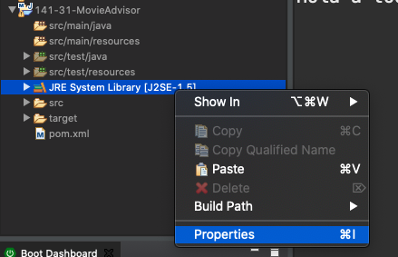

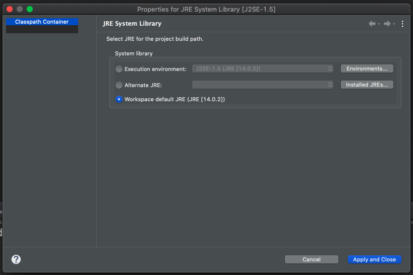

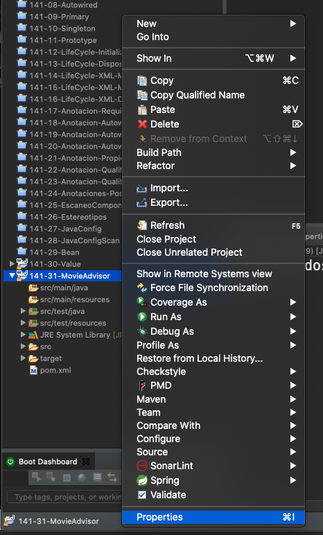

También debemos cambiarlo en Java Compiler.

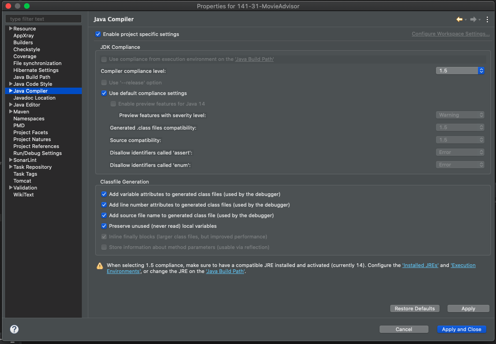

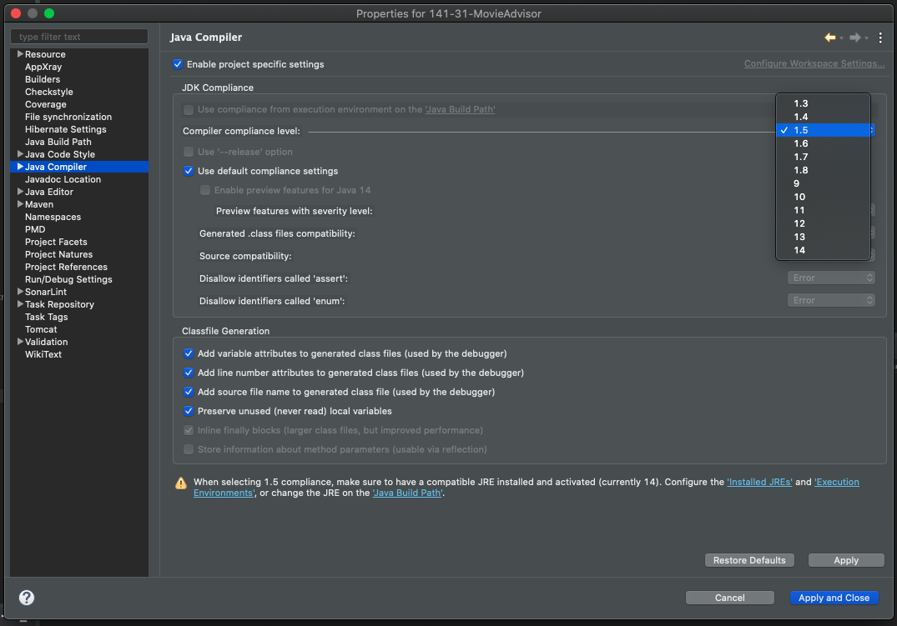

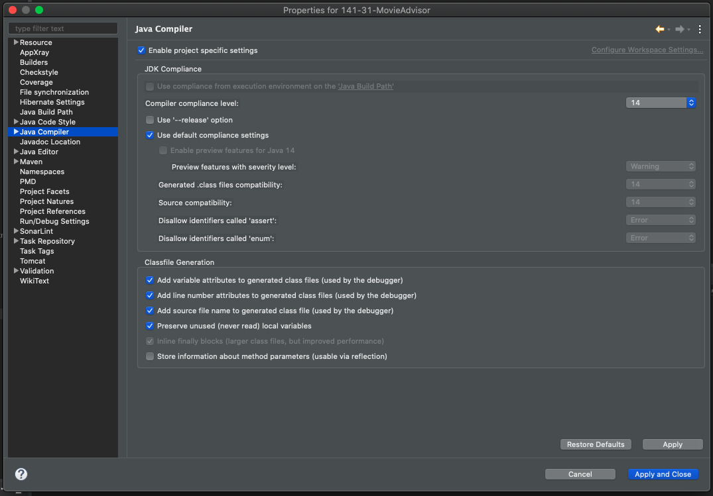

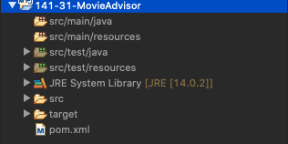

A partir de aquí vamos a comenzar a códificar nuestra aplicación.

Vamos a incluir en el `pom.xml` la dependencia que necesitamos.

*`pom.xml`*

```html
<project xmlns="http://maven.apache.org/POM/4.0.0" xmlns:xsi="http://www.w3.org/2001/XMLSchema-instance" xsi:schemaLocation="http://maven.apache.org/POM/4.0.0 https://maven.apache.org/xsd/maven-4.0.0.xsd">
  <modelVersion>4.0.0</modelVersion>
  <groupId>com.openwebinars</groupId>
  <artifactId>MovieAdvisor</artifactId>
  <version>0.0.1-SNAPSHOT</version>
  <name>MovieAdvisor</name>
  <description>Un gran recomendador de películas</description>
  
   <dependencies>
      <!-- https://mvnrepository.com/artifact/org.springframework/spring-context -->
      <dependency>
         <groupId>org.springframework</groupId>
         <artifactId>spring-context</artifactId>
         <version>5.2.6.RELEASE</version>
      </dependency>
      <!-- Necesaria por usar Java 14 -->
      <dependency>
         <groupId>javax.annotation</groupId>
         <artifactId>javax.annotation-api</artifactId>
         <version>1.3.2</version>
      </dependency>
   </dependencies>
</project>
```

Recordar que podemos buscar la dependencia en [Maven Repository](https://mvnrepository.com/) y buscar `spring context`.

Estupendo ya la tenemos, lo siguiente que podríamos hacer de una manera sencilla sería incluir dentro de nuestra carpeta `resources` el fichero con todos los datos de las películas que hemos visto antes, el archivo se llama `imdb_data.csv` y pesa 16MB porque son muchísimos los registros que tiene millones de películas, al incluir aquí directamente ya lo tendríamos disponible en nuestro proyecto. Incluso si lo queremos abrir desde aquí lo podríamos abrir con el con el editor de texto.

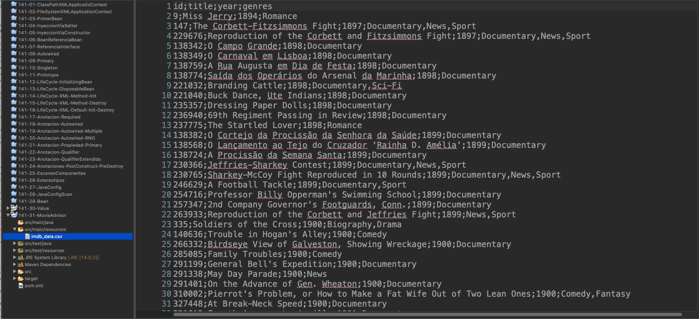

Lo que es interesante es que conozcamos su estructura y hemos visto que tiene un *Id*, un *título*, el *año de estreno* y que también tiene un *listado con los diferentes géneros* que conforman o los géneros a los que pertenece la película.

Vamos a crear nuestra clase que represente esa entidad, hasta ahora no nos hemos preocupado mucho en los proyectos anteriores de la estructuración en paquetes, porque realmente tampoco hemos tenido ninguna aplicación compleja, aunque aquí vamos a hacer más grande la parte práctica, sí lo vamos a estructura.

Vamos a crear un nuevo paquete llamado `com.openwebinars.movieadvisor.model`

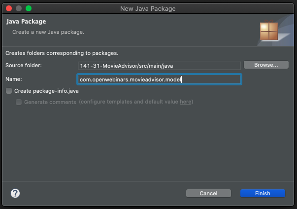

Dentro de este package vamos a crear nuestra nueva clase `Film`.

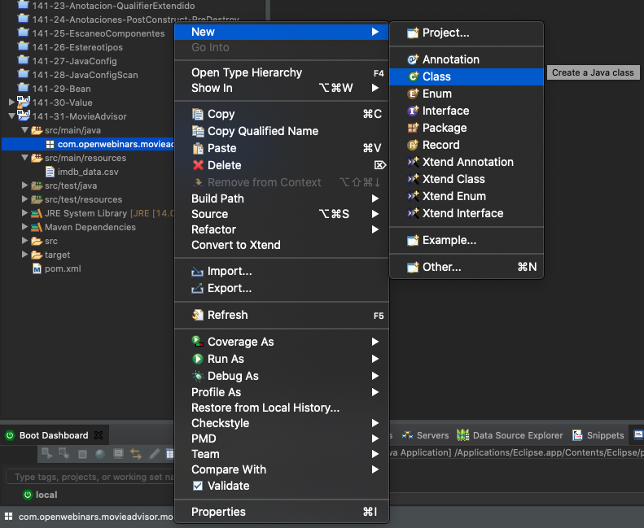

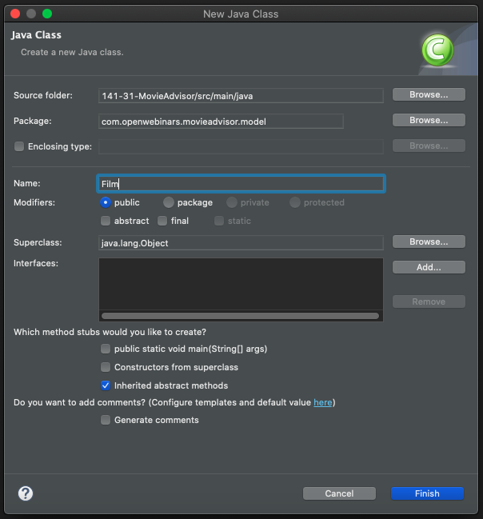

Nuestra clase `Film` va a tener un `id` de tipo `long`, `title` de tipo `String`, `year` de tipo `String` por no complicarnos el manejo de fechas si usamos el manejo de fecha anterior a Java 8 o el manejo de fechas en Java 8, otra librería como [Joda Time](https://www.joda.org/joda-time/) por eso lo guardaremos dentro de una cadena de caracteres y si después tenemos que hacer algún tipo de transformación la podemos hacer y por último tendríamos el listado de los generos de tipo `List<String>`.

Como se trata de una clase de las de manual, vamos a crear su constructor vacío y otro constructor con los parámetros, generar getter y setter, hashcode, equals, toString, lo típico que podríamos necesitar de de una clase modelo.

Aunque tambén podríamos utilizar alguna otra variante o usar [Lombok](https://projectlombok.org/) por ejemplo, que nos permiten no incluir todo lo anterior. Aquí hemos optado por autogenerarlo con Eclipse que para el caso es lo mismo. Nuestra clase `Film` queda así:

*`Film.java`*

```java
package com.openwebinars.movieadvisor.model;

import java.util.List;

/**
 * 
 * La clase modelo que articula el programa. Permite
 * manejar la información mínima sobre una película.
 * Si hubíeramos utilizado Spring Data y una base de datos, 
 * seguramente estaría anotada con @Entity 
 * 
 */
public class Film {
	
   private long id;
   private String title;
   private List<String> genres;
   private String year;
	
   public Film() { }

   public Film(long id, String title, String year, List<String> genres) {
      this.id = id;
      this.title = title;
      this.genres = genres;
      this.year = year;
   }

   public long getId() {
      return id;
   }

   public void setId(long id) {
      this.id = id;
   }

   public String getTitle() {
      return title;
   }

   public void setTitle(String title) {
      this.title = title;
   }

   public List<String> getGenres() {
      return genres;
   }

   public void setGenres(List<String> genres) {
      this.genres = genres;
   }

   public String getYear() {
      return year;
   }

   public void setYear(String year) {
      this.year = year;
   }

   @Override
   public int hashCode() {
      final int prime = 31;
      int result = 1;
      result = prime * result + ((genres == null) ? 0 : genres.hashCode());
      result = prime * result + (int) (id ^ (id >>> 32));
      result = prime * result + ((title == null) ? 0 : title.hashCode());
      result = prime * result + ((year == null) ? 0 : year.hashCode());
      return result;
   }

   @Override
   public boolean equals(Object obj) {
      if (this == obj)
         return true;
      if (obj == null)
         return false;
      if (getClass() != obj.getClass())
         return false;
      Film other = (Film) obj;
      if (genres == null) {
         if (other.genres != null)
            return false;
      } else if (!genres.equals(other.genres))
         return false;
      if (id != other.id)
         return false;
      if (title == null) {
         if (other.title != null)
            return false;
      } else if (!title.equals(other.title))
         return false;
      if (year == null) {
         if (other.year != null)
            return false;
      } else if (!year.equals(other.year))
         return false;
      return true;
   }

   @Override
   public String toString() {
      return "Film [id=" + id + ", title=" + title + ", genres=" + genres + ", year=" + year + "]";
   }
}
```

Teniendo este modelo ya tenemos ya tenemos todo lo necesario para poder empezar desde abajo hacia arriba, es decir vamos a empezar a codificar primero la parte de los DAO, para poder rescatar los datos, a partir de ahí iremos subiendo hacia los servicios, etcétera etcétera y lo vamos a ir haciendo poco a poco en las siguiente lecciones.

# 22 Repositorio y Acceso a Datos (Parte I) 12:55 

## Transcripción

Vamos a continuar con nuestro proyecto MovieAdvisor, vamos a crear un nuevo paquete que va a contener la configuración de la clase o clases de configuración, en nuestro caso será solamente una, pero podríamos tener más de una clase. Para ello creamos el paquete `com.openwebinars.movieadvisor.config` 


Aquí creamos una nueva clase que llamaremos `AppConfig`

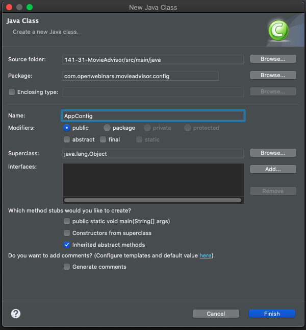

Debemos indicar que es una clase de configuración con la anotación `@Configuration` ya que estamos usando Java Config, también vamos a indicar que vamos a escanear los componentes indicando el paquete base con `@ComponentScan(basePackages="com.openwebinars.movieadvisor")` escaneará todos los beans que se encuentren en este paquete o por debajo, esto nos va a permitir un sistema de configuración mixto de Java Config con Anotaciones. Por ahora esto es todo lo que necesitamos.

*`AppConfig.java`*

```java
package com.openwebinars.movieadvisor.config;

import org.springframework.context.annotation.ComponentScan;
import org.springframework.context.annotation.Configuration;

@Configuration
@ComponentScan(basePackages="com.openwebinars.movieadvisor")
public class AppConfig {

}
```

Ahora vamos a crear la interfaz DAO para poder trabajar con un repositorio de Film, vamos a crear un nuevo paquete `com.openwebinars.movieadvisor.dao`

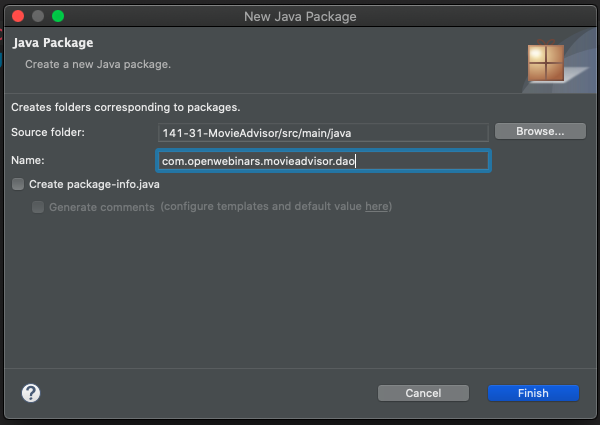

y dentro de este paquete vamos a crear una nueva interfaz llamada `FilmDao`

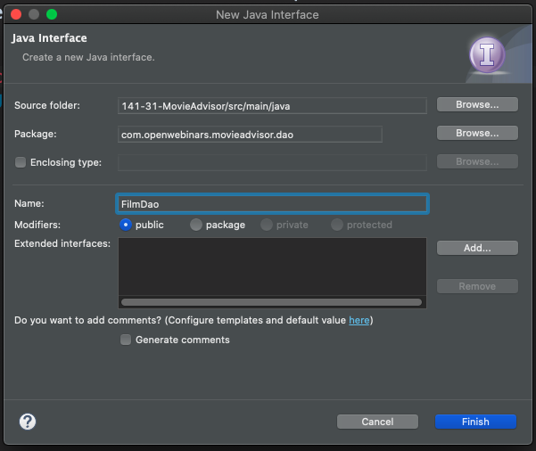

Esta interfaz va a tener los métodos que debería implementar cualquier clase que quiera ser un DAO de películas.

Van a ser métodos sencillos, clásicos, como poder buscar una película por su Id, devolver todas las películas en una colección de esta manera no nos casamos tanto con las listas. Podríamos incluso plantearnos un iterable si la estructura que tuvieramos en memoría fuera diferente, de todos modos usar una lista tampoco supondría ningún problema. Y aun que no lo haremos desde aquí por que esta aplicación no se va a dedicar a gestionar películas por si acaso necesitamos más adelante incluiremos las opciones de insertar, editar y borrar. Esta sería nuestra interfaz.

*`FilmDao`*

```java
package com.openwebinars.movieadvisor.dao;

import java.util.Collection;

import com.openwebinars.movieadvisor.model.Film;

/**
 * Interfaz que nos indica las posibles acciones que podemos
 * realizar con un repositorio de Film.
 */
public interface FilmDao {
	
   public Film findById(long id);
   public Collection<Film> findAll();
   public void insert(Film film);
   public void edit(Film film);
   public void delete(long id);

}
```

Ahora vamos a crear una clase que implemente en memoria, que sea capaz de cargar el fichero en memoria y que nos permita tener todas las películas.

Vamos a crear una nueva clase llamada `FilmDaoImplMemory` 


Si pulsamos en `Add` podemos indicar la interfaz que queremos implementar

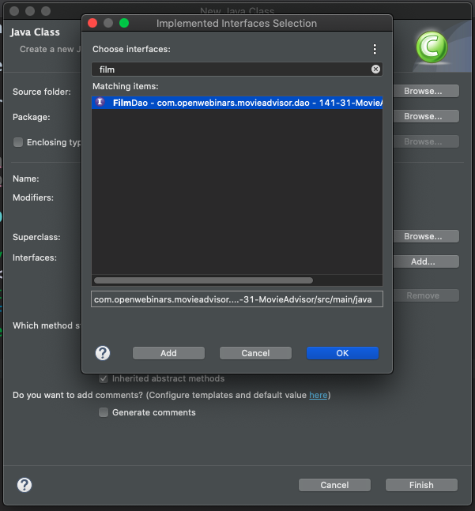

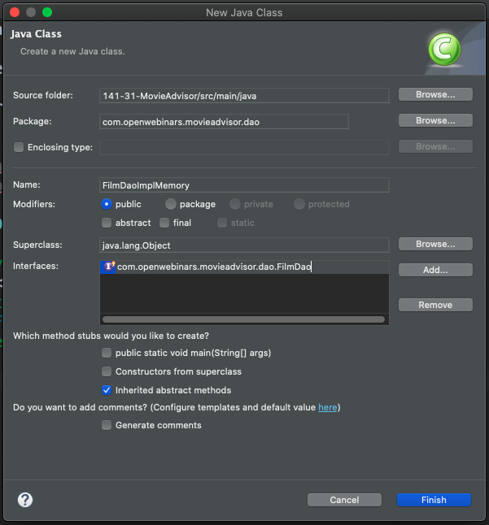

Esto nos inserta la estructura de los métodos que debemos implementar por la implementación de `FilmDao`

*`FilmDaoImplMemory`*

```java
package com.openwebinars.movieadvisor.dao;

import java.util.Collection;

import com.openwebinars.movieadvisor.model.Film;

public class FilmDaoImplMemory implements FilmDao {

   @Override
   public Film findById(long id) {
      // TODO Auto-generated method stub
      return null;
   }

   @Override
   public Collection<Film> findAll() {
      // TODO Auto-generated method stub
      return null;
   }

   @Override
   public void insert(Film film) {
      // TODO Auto-generated method stub

   }

   @Override
   public void edit(Film film) {
      // TODO Auto-generated method stub

   }

   @Override
   public void delete(long id) {
      // TODO Auto-generated method stub

   }

}
```

Ademas de lo que pone vamos a necesitar una lista de películas usando el operador diamont de Java 7. 


```java
public List<Film> peliculas = new ArrayList<>();
```

Tambien indicaremos que este es un bean anotandolo con la anotación `@Repository`

Como esto es un bean, podemos usar el ciclo de beans para poder cargar todas las películas desde algún sitio. Lo haremos en un método `init()`.
 
```java
public void init() {
   // peliculas = ....
}
 ```
 
Para ello vamos a crear una nueva clase, en este caso no lo voy a crear como un bean, sino que lo voy a dejar para que lo podáis hacer vosotros, que sería la encargada de cargar o de procesar el fichero, la clase se llamará `UtilFilmFileReader` dentro del paquete `com.openwebinars.movieadvisor.dao`, va a ser una clase con un método estático.  


Si alguien quiere, se podría transformar esto en un bean que pudiera ser capaz de leer el fichero. Está separación es porque esta implementación del DAO es en memoria, es decír sabe que lo va a tener, pero no sabe de dónde surgen los datos. Si lo hiciera con otro bean los datos podrían surgir de otro sitio que no fuese un fichero `csv` eso también lo dejo para que ustedes puedan tener cancha.

En este caso vamos a crear un método estatico `readFile` que va a devolver una lista de películas, podriamos ponerla también como colección, va a recibir tres argumentos `path`, `separator` y `listSeparator`. Ahora veremos que los podemos colocar en el fichero de properties que vamos a crear.

`public static List<Film> readFile(final String path, final String separator, final String listSeparator) {`

Dentro de nuestro método `readFile` vamos a usar un esquema clásico para que no nos de problemas.

```java
List<Film> result = new ArrayList<>();

return result;
```

En medio de esto podemos códificar todo lo necesario, vamos a añadir el `// @formatter:off` y `// @formatter:on` porque vamos a incluir el uso de API Stream y expresiones lamdas para que no la reformatea a Java. Si nos perdemos en esta parte repasar el curso de Java 8 donde se explica con abundancia en cómo trabajar con fichero y el cómo usar el API Streams y expresiones lambdas. 

Nosotros queremos a través de la clase `Files` usar el método `lines` que nos devuelve un Stream de Strings, es decir va ir leyendo línea a línea el fichero y lo va a devolver dentro de un Stream. El `Path` lo tenemos que proporcionar nosotros que es uno de los argumentos que recibimos, pero para poder cargar convenientemente el fichero en lugar de acceder vía el sistema de ficheros lo vamos a hacer a través de la clase `ResourceUtils.getFile(path)` que va a cargar de una más conveniente este fichero, esto lo devuelve como un tipo que no podemos utilizar por eso lo transformamos a una URI con `.toURI()` que nos será más útil para poderlo usar. Todo lo explicado aquí equivale a la línea:

`result = Files.lines(Paths.get(ResourceUtils.getFile(path).toURI()))`

A partir de aquí si hemos visto el fichero nos vamos a querer saltar la primera línea, es la que tiene el encabezado para lo cual usamos 

`.skip(1)`

y bueno vamos a querer procesar este CSV para ir transformandolo todo en un listado de películas, para ello usamos el método `map()` vamos a querer que en cada línea se haga una transformación, como es algo compleja la vamos a dejarla vacía por ahora:

```java
.map(line -> {

})
```

y por último lo vamos a querer recoger todo en un listado que almacenaremos en `result`:

```java
// @formatter:off
result = Files.lines(Paths.get(ResourceUtils.getFile(path).toURI()))
     .skip(1)
     .map(line -> {
		
     }).collect(Collectors.toList());
// @formatter:on
```

y ahora ya nos podemos centrar en el mapeo, que queda asi:

```java
.map(line -> {
     String[] values = line.split(separator);
     return new Film(Long.parseLong(values[0]), values[1], values[2], Arrays.asList(values[3].split(listSeparator)));
})
```

Cada línea del fichero incluye todos los datos de una película, lo que tenemos que hacer es "splitiarlos" es decir trocearlos, por el separador que utilizamos, que en primera instancia es el punto y coma (;), esto nos devolverá un array de Strings el cual almacenamos en `values`. Por lo que en `value[0]` tendríamos el `id` (como String) pero nosotros lo declaramos como `long` por lo que tendíamos que hacer un cast `Long.parseLong(values[0])`, en `value[1]` tendríamos el título de la película, en `value[2]` tendríamos el año de la película (como String) y en el último `value[3]` tendríamos el listado con los generos, por lo que si queremos obtener cada uno de ellos tendriamos que "splitiarlos" por la coma que es el separador de los generos, `Arrays.asList(values[3].split(listSeparator))` y lo que hacemos es construir con `Arrays.asList` una lista de Strings con cada uno de los generos. Todo esto se lo pasamos al constructor con parámetros `Film(...)` y es lo que devolvemos, por cada línea devolvemos un objeto `Film`.

```java
// @formatter:off
result = Files.lines(Paths.get(ResourceUtils.getFile(path).toURI()))
   .skip(1)
   .map(line -> {
	String[] values = line.split(separator);
	return new Film(Long.parseLong(values[0]), values[1], values[2], Arrays.asList(values[3].split(listSeparator)));
   }).collect(Collectors.toList());
// @formatter:on
```

Este bloque leerá línea a línea el fichero y procesara todas las películas almacenandolas en el listado.

Pero se nos obliga a que pongamos un bloque `try catch` sobre el bloque, porque tenemos posibilidad de tener algún problemilla a la hora de leer el fichero o a la hora de cualquier cosa, podríamos indicar un mensaje de error y con `System.exit(-1)` podemos indicar que hemos salido de manera erronea de la aplicación.

El código completo de nuestra clase `UtilFilmFileReader` es el siguiente:

*`UtilFilmFileReader`*

```java
package com.openwebinars.movieadvisor.dao;

import java.io.IOException;
import java.nio.file.Files;
import java.nio.file.Paths;
import java.util.ArrayList;
import java.util.Arrays;
import java.util.List;
import java.util.stream.Collectors;

import org.springframework.util.ResourceUtils;

import com.openwebinars.movieadvisor.model.Film;

/**
 * Clase de utilidad, que incluye un método estático para la lectura
 * y procesamiento del fichero CSV que incluye todos los datos.
 * 
 * PROPUESTA: ¿Serías capaz de cambiar el código necesario para
 * que fuera un bean?
 *
 */
public class UtilFilmFileReader {

   public static List<Film> readFile(final String path, final String separator, final String listSeparator) {
      List<Film> result = new ArrayList<>();

      try {
         // @formatter:off
         result = Files
                     .lines(Paths.get(ResourceUtils.getFile(path).toURI()))
                     .skip(1)
                     .map(line -> {
                        String[] values = line.split(separator);
                        return new Film(Long.parseLong(values[0]), values[1], values[2], 
                                          Arrays.asList(values[3].split(listSeparator)));
                     }).collect(Collectors.toList());
         // @formatter:on


      } catch (IOException e) {
         System.err.println("Error de lectura del fichero de datos: imdb_data");
         System.exit(-1);
      }

      return result;

   }

}
```

Teniendo completa nuestra clase `UtilFilmFileReader` ya podríamos devolver el listado y lo podemos rescatar en el método `init()` de nuestro bean `FilmDaoImplMemory` que dejamos a medio construir:

```java
public void init() {
   // peliculas = ....
}
```

Esto lo cambiamos por :

```java
public void init() {
   peliculas = UtilFilmFileReader.readFile(path, separator, listSeparator);
}
```

Pero nos falta saber de donde vamos a recuperar el valor para cada uno de los parámetros. Lo veremos en la próxima lección

# 23 Repositorio y acceso a datos (Parte II) 9:30 

## Transcripción

Vamos a continuar con nuestro ejemplo por dónde lo hemos dejado, recordemos que necesitamos estos tres valores 

```java
public void init() {
   peliculas = UtilFilmFileReader.readFile(path, separator, listSeparator);
}
```

y habíamos pensado que la mejor manera es proporcionarlo a través de un fichero de properties, para ellos nos vamos a venir a la carpeta recursos y no existe un asistente para crear un fichero de properties, con lo cual podemos usar directamente un fichero de texto.

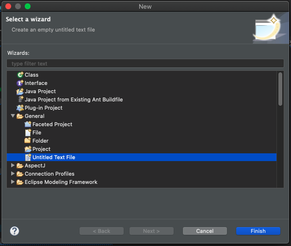

En este fichero de texto vamos añadir tres propiedades:

```txt
file.path=classpath:imdb_data.csv
file.csv.separator=;
file.csv.list_separator=,
```

Lo salvamos con el nombre `movieadvisor.properties` en la carpeta resource.

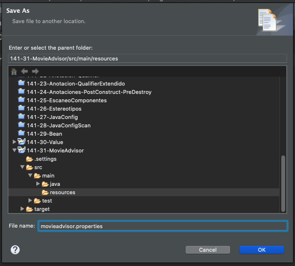

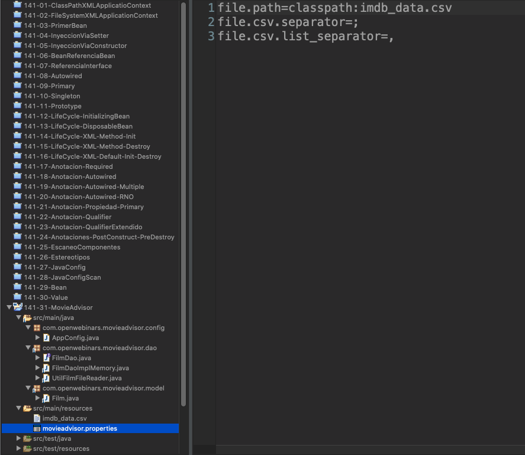

Ahora lo que tenemos que hacerlo es cargarlo desde nuestra clase de configuración `AppConfig` usando la anotación `@PropertySource()` al cual le debemos pasar la ruta y nombre del archivo properties. 

`@PropertySource("classpath:/movieadvisor.properties")`

Y lo que vamos a hacer es lo siguiente, en lugar de que recojamos el valor directamente en los beans donde los vayamos a utilizar,  vamos a dejar que la clase `AppCpnfig` funcione algo así como una especie de componente de configuración, es decir los valores los recojeremos aquí y esta clase tendrá unos métodos getters y allá donde lo necesitemos, lo que haremos será en lugar de inyectar los valores sueltos inyectaremos la clase `AppConfig`.

Para ello creamos tres campos y con la ayuda de la anotación `@Value` y la sintaxis que tenemos para poder usar las properties les inyectamos el valor.

```java
@Value("${file.path}")
private String file;
	
@Value("${file.csv.separator}")
private String separator;

@Value("${file.csv.list_separator}")
private String listSeparator;
```

Y ahora lo que hacemos es crear los métodos getters para estas 3 propiedades.

```java
public String getFile() {
   return file;
}
	
public String getSeparator() {
   return separator;
}
	
public String getListSeparator() {
   return listSeparator;
}
```

Nuestra clase `AppConfig` completa es:

```java
package com.openwebinars.movieadvisor.config;

import org.springframework.beans.factory.annotation.Value;
import org.springframework.context.annotation.ComponentScan;
import org.springframework.context.annotation.Configuration;
import org.springframework.context.annotation.PropertySource;

@Configuration
@ComponentScan(basePackages="com.openwebinars.movieadvisor")
@PropertySource("classpath:/movieadvisor.properties")
public class AppConfig {
	
   @Value("${file.path}")
   private String file;
	
   @Value("${file.csv.separator}")
   private String separator;
	
   @Value("${file.csv.list_separator}")
   private String listSeparator;
	
   public String getFile() {
      return file;
   }
	
   public String getSeparator() {
      return separator;
   }
	
   public String getListSeparator() {
      return listSeparator;
   }
	
}
```

De esta manera cuando queramos utilizar los valores de configuración simplemente inyectamos la clase `AppConfig` y ya podemos usar los valores de las propiedades. Volvemos a nuestra clase `FilmDaoImplMemory` para completar el método `init()`.


```java
@Autowired
private AppConfig appConfig;

@PostConstruct
public void init() {
   peliculas = UtilFilmFileReader.readFile(appConfig.getFile(), appConfig.getSeparator(), appConfig.getListSeparator());
}
```

De esta manera desde las properties hemos ido pasando a través de la clase `AppConfig` hasta el método `readFile(final String path, final String separator, final String listSeparator)` que hemos programado en la clase `UtilFilmFileReader` para que reciba los valores necesarios para recuperar los datos y recuperar una lista de películas.

Nos quedaría implementar nuestra clase DAO `FilmDaoImplMemory` que ahora mismo esta vacía por completo.

Usando el API Stream y usando la lista de películas que ya recuperamos en `peliculas` en el método `init()`, vamos a empezar por códificar el método `findById(long id)`.

¿Cómo vamos a lograr que nos devuelva una película por Id de la lista de películas?

* Lo que hacemos es transformar el listado `peliculas` en un Stream con `.stream()`
* Filtramos y nos quedamos con el `id` que le indiquemos usando `.filter(f -> f.getId() == id)`, sabemos que no existen ids repetidos.
* Pedimos que nos devuelva la primera con `.findFirst()` que nos devuelve un `Optional`

Como queremos evitar un `Optional` para no hacer más compleja nuestra aplicación, lo que hacemos es que si ha encontrado el primero en `result` tendremos el valor y sino retornamos `null`.

```java
public Film findById(long id) {
		
   // @formatter:off
   Optional<Film> result = peliculas
				.stream()
				.filter(f -> f.getId() == id)
				.findFirst();
   // @formatter:on
		
   return result.orElse(null);
		
}
```

Sigamos con el resto de métodos, algunos son muy sencillos en `findAll()` lo único que tenemos que hacer es devolver todas las películas, el listado completo.

```java
public Collection<Film> findAll() {		
   return peliculas;
}
```

El método `insert(Film film)` también es muy sencillo.

```java
public void insert(Film film) {
   peliculas.add(film);
}
```

Para editar y borrar vamos a crear un nuevo método privado que sea capaz de regresarnos el índice de una película dentro del listado en base a su `id`, sería un algoritmo de búsqueda muy sencillo, nada eficiente pero que nos puede ilustrar como hacerlo.


```java
private int getIndexOf(long id) {
   boolean encontrado = false;
   int index = 0;
		
   while (!encontrado && index < peliculas.size()) {
      if (peliculas.get(index).getId() == id)
         encontrado = true;
      else
	 index++;
   }
		
   return (encontrado) ? index : -1;
}
```

Busca el índice de un id de película que reciba como argumento, recorre el listado de películas mientras no lo encuentre y el tamaño del listado sea mayor al indice. Si el id de la película con índice actual es igual al id que se paso como argumento, significa que la película ha sido encontrada y pone `encontrado = true;` y sino incrementa el índice y continua buscando. Si encuentra el id se devuelve el índice y si no se devuelve -1.

Este método lo vamos a usar dentro de nuestro método `edit()`

```java
public void edit(Film film) {
   int index = getIndexOf(film.getId());
   if (index != -1)
      peliculas.set(index, film);
}
```

Busca el índice en base al id del Film que recibe como argumento, y si el índice es distinto de -1 que significa que encontro la posición de la película, lo que hacemos con `set(` es cambiar lo que este en esa posición por el film que recibe de argumento.

En el caso del método `delete()` vamos a recibir como argumento el id, buscamos el índice en base al id y si existe removemos la película en esa posición.

```java
public void delete(long id) {
   int index = getIndexOf(id);
   if (index != -1)
      peliculas.remove(index);

}
```

La clase `FilmDaoImplMemory` completa es:

```java
package com.openwebinars.movieadvisor.dao;

import java.util.ArrayList;
import java.util.Collection;
import java.util.List;
import java.util.Optional;

import javax.annotation.PostConstruct;

import org.springframework.beans.factory.annotation.Autowired;
import org.springframework.stereotype.Repository;

import com.openwebinars.movieadvisor.config.AppConfig;
import com.openwebinars.movieadvisor.model.Film;

/**
 * Implementación en memoria de la interfaz FilmDao.
 * Además, incluye la lectura de los datos, a través de un método estático,
 * desde un fichero CSV.
 *
 */
@Repository
public class FilmDaoImplMemory implements FilmDao {
	
   public List<Film> peliculas = new ArrayList<>();
	
   @Autowired
   private AppConfig appConfig;
	
   @PostConstruct
   public void init() {
      peliculas = UtilFilmFileReader.readFile(appConfig.getFile(), appConfig.getSeparator(), appConfig.getListSeparator());
   }

   public Film findById(long id) {
	
      // @formatter:off	
      Optional<Film> result = peliculas
	 			.stream()
				.filter(f -> f.getId() == id)
				.findFirst();
      // @formatter:on
      return result.orElse(null);	
	
   }

   public Collection<Film> findAll() {		
      return peliculas;
   }

   public void insert(Film film) {
      peliculas.add(film);
   }

   public void edit(Film film) {
      int index = getIndexOf(film.getId());
      if (index != -1)
	 peliculas.set(index, film);
   }

   public void delete(long id) {
      int index = getIndexOf(id);
      if (index != -1)
	 peliculas.remove(index);
   }
	
   private int getIndexOf(long id) {
      boolean encontrado = false;
      int index = 0;
		
      while (!encontrado && index < peliculas.size()) {
	 if (peliculas.get(index).getId() == id)
	    encontrado = true;
	 else
	    index++;
      }
		
      return (encontrado) ? index : -1;
   }

}
```

Con esto tenemos nuestra clase DAO implementada, tenemos toda nuestra capa de Repository repositorio implementada. En la siguiente sección vamos a crear los diferentes servicios que lo van a utilizar.

# 24 Servicios 13:28 

## Transcripción

Vamos a continuar desarrollando nuestra aplicación, ya que tenemos montado y bien montado la parte del DAO, del repositorio. Vamos a crear los servicios necesarios, si recordamos el diagrama de clase ibamos a crear dos servicios, uno de consultas de alto nivel y otro que nos va a permitir generar la consulta que nosotros queramos.

Vamos a empezar por el segundo, el que nos va a permitir generar cualquier consulta, para ello vamos a crear el paquete `com.openwebinars.movieadvisor.service`


Dentro de este paquete vamos a crear una nueva Interfaz llamada `FilmQueryService`

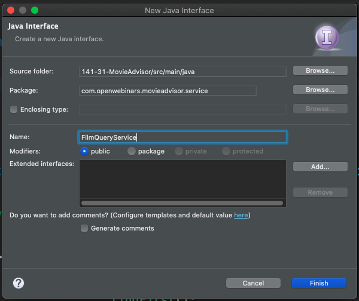

y a la hora de diseñarla vamos a aplicar algo parecido al ***patrón builder***, en el caso del patrón builder, cuando para generar un objeto, para construirlo, se requieren de mucho mucho mucho parámetros, la llamada tan enorme a un constructor no suele ser operativa y elegante, entonces se suele construir en alguna ocasión una clase estática interna, que nos ayuda a construir el objeto, en definitiva lo que va haciendo, es que los métodos de esa clase, van devolviendo una referencia a la propia clase, para que podamos encadenar diferentes llamadas al método. Este esquema es el que vamos a seguir en este servicio, de manera que podamos encadenar llamadas, a más de un método, para ir conjugando la consulta tal y cual si fuera una consulta SQL, donde pusiéramos diferentes condiciones y pusiéramos el operador AND en medio.

Los métodos que vamos a tener en la interface son los siguientes:

```java
package com.openwebinars.movieadvisor.service;

import java.util.Collection;

import com.openwebinars.movieadvisor.model.Film;

/**
 * Intefaz del servicio de consulta sobre el repositorio de películas.
 * Está definido de forma que permita encadenar llamadas a métodos
 * haciendo un AND de las diferentes condiciones. Para ejecutar
 * la consulta, se invoca en último lugar el método exec.
 * 
 * ¿Serías capaz de añadir la lógica necesaria para que se pudieran
 * utilizar AND y OR?
 * 
 */
public interface FilmQueryService {
	
   public Collection<Film> exec();
	
   public FilmQueryService anyGenre(String... genres);

   public FilmQueryService allGenres(String... genres);

   public FilmQueryService year(String year);

   public FilmQueryService betweenYears(String from, String to);

   public FilmQueryService titleContains(String title);

}
```

* `anyGenre(String... genres)`: para buscar algún género, los generos los pasaremos con un `var arg`
* `allGenres(String... genres)`: para buscar todos los géneros en la película, que pertenezcan a todos los géneros que se proporcionen
* `year(String year)`: las películas de un año en particular 
* `betweenYears(String from, String to)`: película en un intervalo de años
* `titleContains(String title)`: que el título contenga esta cadena de caracteres

Lo que haríamos sería ir llamando a uno o varios de estos métodos encadenado, de estos 5 que tengo y finalmente para que se ejecutará la consulta llamaríamos al método `exec()` que nos devolvería la colección de películas que cumplen con las condiciones que nosotros hemos expuesto.

Vamos a crear el servicio, lo vamos a llamar `FilmQueryServiceImpl` y va a implementar a `FilmQueryService`.


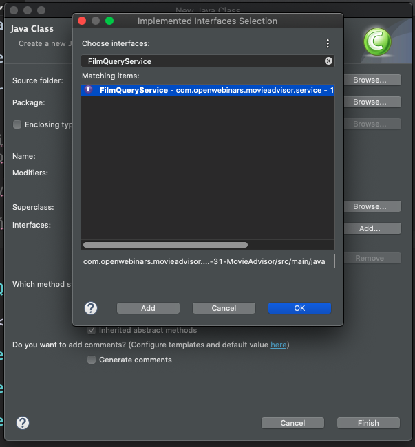

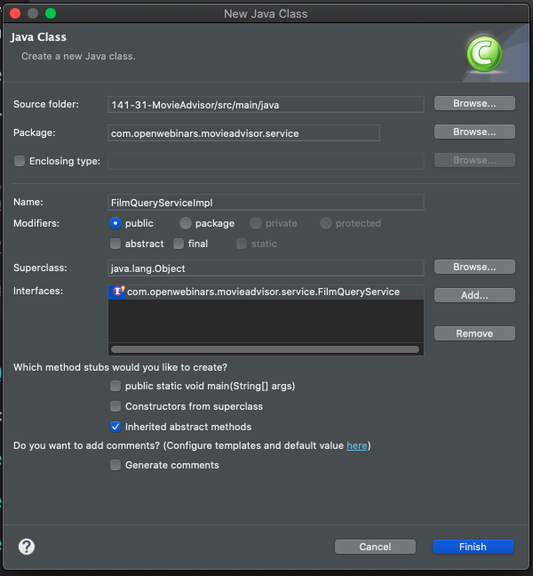

Lo que nos genera es lo siguiente:

```java
package com.openwebinars.movieadvisor.service;

import java.util.Collection;

import com.openwebinars.movieadvisor.model.Film;

@Service
public class FilmQueryServiceImpl implements FilmQueryService {

   @Override
   public Collection<Film> exec() {
      // TODO Auto-generated method stub
      return null;
   }

   @Override
   public FilmQueryService anyGenre(String... genres) {
      // TODO Auto-generated method stub
      return null;
   }

   @Override
   public FilmQueryService allGenres(String... genres) {
      // TODO Auto-generated method stub
      return null;
   }

   @Override
   public FilmQueryService year(String year) {
      // TODO Auto-generated method stub
      return null;
   }

   @Override
   public FilmQueryService betweenYears(String from, String to) {
      // TODO Auto-generated method stub
      return null;
   }

   @Override
   public FilmQueryService titleContains(String title) {
      // TODO Auto-generated method stub
      return null;
   }

}
```

Es necesario añadirle el estereotipo correcto en este caso `@Service` y parece normal que necesitemos autoinyectar nuestro DAO para poderlo usar.

```java
@Autowired
private FilmDao dao;	
```

Como vamos a hacer para implementarlo, vamos a tirar de lo que sabemos de Java 8 y de la interfaz `Predicate`, vamos a crear un predicado de `Film` del `java.util.function.Predicate;`.

```java
private Predicate<Film> predicate;
```

Y la vamos a inicializar mediante el método `init()` con la anotación correspondiente a null

```java
@PostConstruct
public void init() {
   predicate = null;
}
```

Y ahora lo que vamos a hacer, es en los diferentes métodos que devuelven, en una parte de la consulta, vamos a ir añadiendo sobre el predicado, la consulta que quiere realizar el usuario.

Por ejemplo si queremos que las películas tengan algún género método `anyGenre`, lo que podríamos crear aquí es otro predicado, en el que lo que diríamos es, oye pues sí, para hacerlo vamos a tirar un poco más de ingenio, oye si la película que le pasamos como argumento, alguno de su género está contenido, dentro del array de géneros que nosotros proporcionamos con `genres`, es decir construimos otro Stream con los géneros que nos proporciona el usuario y vemos si alguno coincide con los géneros que tenemos dentro de la película, esta haciendo algo así como una especie de intersección.

En el caso de que alguno, el predicado se daría por bueno y se evaluaría como verdad. Y en caso contrario si la intersecciones es vacia, sería falso, lo que hacemos aquí es comprobar si el predicado es nulo porque sea la primera vez que lo hayamos invocado, entonces lo asignamos directamente y si no, lo que hacemos es, sobre el predicado que tenemos definido como argumento de la clase de servicio, le añadimos este que acabamos de definir con un `and`, por lo cual se evaluará como el `and` de ambas y por último lo que deciamos devolvemos el puntero `this`, para que podamos encadenarlo con la llamada a otro método de este servicio. 

El método `anyGenre` completo queda así:

```java
public FilmQueryServiceImpl anyGenre(String... genres) {
   Predicate<Film> pAnyGenre = (film -> Arrays.stream(genres).anyMatch(film.getGenres()::contains));
   predicate = (predicate == null) ? pAnyGenre : predicate.and(pAnyGenre);
   return this;
}
```

El método `allGenres` es muy parceido pero en lugar de usar `anyMatch` usa `allMatch` pero el esquema es exactamente el mismo.

```java
public FilmQueryServiceImpl allGenres(String... genres) {
   Predicate<Film> pAllGenres = (film -> Arrays.stream(genres).allMatch(film.getGenres()::contains));
   predicate = (predicate == null) ? pAllGenres : predicate.and(pAllGenres);
   return this;
}
```

Aquí solamente devolverá verdad si existe un solapamiento completo entre el Stream que acabamos de crear y los generos de la película, si son exactamente los mismos, si estan contenidos todos. Con lo cual se devuelven de esta manera.

Para buscar las películas por el año la búsqueda quizá sea más sencilla vamos a tener el método `year(String year)` como el año lo declaramos como un `String` podemos usar la comparación de Strings.

```java
public FilmQueryServiceImpl year(String year) {
   Predicate<Film> pYear = (film -> film.getYear().equalsIgnoreCase(year));
   predicate = (predicate == null) ? pYear : predicate.and(pYear);
   return this;
}
```

Si son exactamente iguales el año será el mismo y en ese caso seguiremos montando el predicado si es nulo inicialmente el predicado es el año y si no hacemos un `AND`.

Para el caso del between, método `betweenYears(String from, String to)` el predicado va a ser un poco más complejo, porque para hacer una comparación buena y válida vamos a tirar de fechas de Java 8, por eso eso quiza este sea el predicado más complejo.

```java
public FilmQueryServiceImpl betweenYears(String from, String to) {
   Predicate<Film> pBetweenYears = (film -> {
      LocalDate fromYear = LocalDate.of(Integer.parseInt(from), 1, 1);
      LocalDate toYear = LocalDate.of(Integer.parseInt(to), 1, 3);
      LocalDate filmYear = LocalDate.of(Integer.parseInt(film.getYear()), 1, 2);

      return filmYear.isAfter(fromYear) && filmYear.isBefore(toYear);
   });
		
   predicate = (predicate == null) ? pBetweenYears : predicate.and(pBetweenYears);

   return this;
}
```

Lo que hacemos es crear una fecha a partir del año `from` y otra del año `to`, para evitar que tengamos problemas por un día, el año desde el cual vamos a contar `fromYear` lo creamos desde el 1 de enero, supongamos que el año 1990, sería desde el 1 de enero de 1990 y el año de comparación final `toYear` lo pondríamos en el 3 de enero, por ejemplo del 2000. Y el año de cada película que vamos a comparar `filmYear` lo creamos en una fecha que sería el 2 de enero. Lo que podemos hacer después comparar es si el año de la película es la fecha de la película después que el intervalo izquierdo, la parte izquierda y antes de la parte derecha del intervalo, con lo cual si está en medio es que está incluido y se evaluaría como verdad al igual que antes fue lo añadimos al predicado con un `AND`  o lo establecemos si es la opción por defecto.

Y el de contener el título, método `titleContains(String title)` sería un predicado francamente sencillo en el cual lo que hacemos es comparar, si es verdad que pasamos la cadena a minúsculas todo, para para evitar los problemas de Casing y de esa manera podríamos comparar si el título en minúsculas contiene la cadena de caracteres en minúsculas que nosotros estamos proporciondo. 

```java
public FilmQueryServiceImpl titleContains(String title) {
   Predicate<Film> pTitleContains  = (film -> film.getTitle().toLowerCase().contains(title.toLowerCase()));
   predicate = (predicate == null) ? pTitleContains : predicate.and(pTitleContains);
		
   return this;
}
```

La última parte que nos quedaría de este servicio sería el método `exec()` que es el que realmente el que se encarga de ejecutar la consulta, no sería nada complejo ya que digamos que la lógica complicada es la que hemos definido antes.

Aquí tendríamos que devolver sobre el `dao.findAll()` que nos devuelva un `stream()` y que una vez que lo convierta filtre el predicado que será simple o complejo y a partir de allí tendríamos nuestra colección filtrada por el predicado sencillo o complejo que hemos definido. 

```java
public Collection<Film> exec() {
		
   // @formatter:off
   return dao.findAll()
      		.stream()
		.filter(predicate)
		.collect(Collectors.toList()); 
   // @formatter:on

}
```

La clase completa la tenemos aquí:

*`FilmQueryServiceImpl.java`*

```java
package com.openwebinars.movieadvisor.service;

import java.time.LocalDate;
import java.util.Arrays;
import java.util.Collection;
import java.util.function.Predicate;
import java.util.stream.Collectors;

import javax.annotation.PostConstruct;

import org.springframework.beans.factory.annotation.Autowired;
import org.springframework.stereotype.Service;

import com.openwebinars.movieadvisor.dao.FilmDao;
import com.openwebinars.movieadvisor.model.Film;

/**
 * Implementación del servicio de consulta sobre el repositorio.
 * Esta implementación es algo lenta, ya que se basa en el uso
 * del API Stream de Java 8 sobre una lista bastante grande.
 * 
 * Una posible mejora sería utilizar como repositorio una base
 * de datos, y tener una implementación de este servicio que hiciera
 * uso de Criteria API o QueryDSL. 
 * 
 */
@Service
public class FilmQueryServiceImpl implements FilmQueryService{
	
   @Autowired
   FilmDao dao;

   private Predicate<Film> predicate;
 	
   @PostConstruct
   public void init() {
      predicate = null;
   }

   public Collection<Film> exec() {
		
      // @formatter:off
      return dao.findAll()
		.stream()
		.filter(predicate)
		.collect(Collectors.toList()); 
      // @formatter:on

   }

   public FilmQueryServiceImpl anyGenre(String... genres) {
      Predicate<Film> pAnyGenre = (film -> Arrays.stream(genres).anyMatch(film.getGenres()::contains));
      predicate = (predicate == null) ? pAnyGenre : predicate.and(pAnyGenre);
      return this;
   }

   public FilmQueryServiceImpl allGenres(String... genres) {
      Predicate<Film> pAllGenres = (film -> Arrays.stream(genres).allMatch(film.getGenres()::contains));
      predicate = (predicate == null) ? pAllGenres : predicate.and(pAllGenres);
      return this;
   }

   public FilmQueryServiceImpl year(String year) {
      Predicate<Film> pYear = (film -> film.getYear().equalsIgnoreCase(year));
      predicate = (predicate == null) ? pYear : predicate.and(pYear);
      return this;
   }

   public FilmQueryServiceImpl betweenYears(String from, String to) {
      Predicate<Film> pBetweenYears = (film -> {
         LocalDate fromYear = LocalDate.of(Integer.parseInt(from), 1, 1);
         LocalDate toYear = LocalDate.of(Integer.parseInt(to), 1, 3);
         LocalDate filmYear = LocalDate.of(Integer.parseInt(film.getYear()), 1, 2);

         return filmYear.isAfter(fromYear) && filmYear.isBefore(toYear);
      });
		
      predicate = (predicate == null) ? pBetweenYears : predicate.and(pBetweenYears);

      return this;
   }

   public FilmQueryServiceImpl titleContains(String title) {
      Predicate<Film> pTitleContains  = (film -> film.getTitle().toLowerCase().contains(title.toLowerCase()));
      predicate = (predicate == null) ? pTitleContains : predicate.and(pTitleContains);
		
      return this;
   }

}
```

Como deciamos vamos a crear también otro servicio llamado `FilmService`,  este `FilmService` tendrá alguno elemento de más alto nivel, vamos a crear la clase.


Cómo anécdota decir que este servicio va a utilizar el anterior también para algunos de sus métodos, el código es el siguiente:

*`FilmService.java`*

```java
package com.openwebinars.movieadvisor.service;

import java.util.Collection;
import java.util.List;
import java.util.stream.Collectors;

import org.springframework.beans.factory.annotation.Autowired;
import org.springframework.stereotype.Service;

import com.openwebinars.movieadvisor.dao.FilmDao;
import com.openwebinars.movieadvisor.model.Film;

/**
 * Servicio con algunas operaciones "de alto nivel" sobre el repositorio de
 * películas.
 * 
 * "Por debajo", está utilizando el servicio de consulta para realizar estas
 * operaciones "de alto" nivel. Muchas se han implementado pero realmente no se
 * están utilizando en esta aplicación.
 * 
 * ¿Por qué no hemos definido una interfaz y su implementación? Para dejartelo a
 * ti como tarea ;)
 * 
 */
@Service
public class FilmService {

   @Autowired
   FilmDao filmDao;

   @Autowired
   FilmQueryService queryService;

   public Collection<String> findAllGenres() {
      List<String> result = null;

      // @formatter:off
      result = filmDao.findAll()
            	      .stream()
            	      .map(f -> f.getGenres())
            	      .flatMap(lista -> lista.stream())
            	      .distinct()
            	      .sorted()
            	      .collect(Collectors.toList());

      // @formatter:on

      return result;
   }

   public Collection<Film> findByAnyGenre(String... genres) {
      return queryService.anyGenre(genres).exec();
   }

   public Collection<Film> findByAllGenres(String... genres) {
      return queryService.allGenres(genres).exec();
   }

   public Collection<Film> findByYear(String year) {
      return queryService.year(year).exec();
   }

   public Collection<Film> findBetweenYears(String from, String to) {
      return queryService.betweenYears(from, to).exec();
   }

   public Collection<Film> findByTitleContains(String title) {
      return queryService.titleContains(title).exec();
   }

   public Collection<Film> findAll() {
      return filmDao.findAll();
   }
}
```

Como es un servicio lo anotamos con `@Service`, necesitamos tanto el DAO `FilmDao` para hacer las operaciones sencillas como `FilmQueryService` como el servicio de consultas. Primero de todo vimos en la sintaxis que había  una opción de listar todos los géneros, `findAllGenres()`, la podemos hacer sobre el propio DAO, tiramos también de lo que sabemos de Lamda y de Stream.

```java
public Collection<String> findAllGenres() {
   List<String> result = null;

   // @formatter:off
   result = filmDao.findAll()
		.stream()
		.map(f -> f.getGenres())
		.flatMap(lista -> lista.stream())
		.distinct()
		.sorted()
		.collect(Collectors.toList());

   // @formatter:on

   return result;
}
```

Lo que hacemos es listar todas las películas, nos quedamos con los géneros `.map(f -> f.getGenres())`, a través de `.flatMap(lista -> lista.stream())` los unimos todos los géneros, aplicamos `.distinct()` y para que aparezcan en orden alfabético los ordenamos con `.sorted()` y lo devolvemos como lista para que puedan ser pintados.

Por otro lado ofrecemos la operaciones de alto nivel, que no serían acumuladas, no necesitaríamos el servicio, encontrar solamente por algún género:

```java
public Collection<Film> findByAnyGenre(String... genres) {
   return queryService.anyGenre(genres).exec();
}
```

Por todos los generos

```java
public Collection<Film> findByAllGenres(String... genres) {
   return queryService.allGenres(genres).exec();
}
```

Por año

```java
public Collection<Film> findByYear(String year) {
   return queryService.year(year).exec();
}
```

Entre años

```java
public Collection<Film> findBetweenYears(String from, String to) {
   return queryService.betweenYears(from, to).exec();
}
```

Y que contenga un título

```java
public Collection<Film> findByTitleContains(String title) {
   return queryService.titleContains(title).exec();
}
```

Todos estos métodos utilizan nuestro servicio de consulta, llama a uno de los métodos y directamente ejecuta dicha consulta.

Este servicio lo tendríamos aquí preparado por si además de hacer una aplicación de escritorio, quisiéramos utilizar nuestros servicios para crear un servicio web o una aplicación web, no tendríamos que ir montando las consultas sino que ya las tendríamos de esta manera, expuestas de una forma más sencilla.

Con esto terminamos el apartado de los servicios y nos lanzamos de lleno a terminar de crear la última lógica de la aplicación recogida de argumento y la invocación de los servicios.

# 25 Ejecución de la app 22:28 

## Transcripción

Vamos a seguir desarrollando nuestra aplicación y vamos a crear ahora las clases que van a utilizar los lo servicios. 

Lo primero que vamos a hacer es crear un fichero de texto `ayuda.txt`, dentro de los recursos que va a tener todo el texto de la sintaxis de la ayuda, se imprimirá cuando haya algún problema.

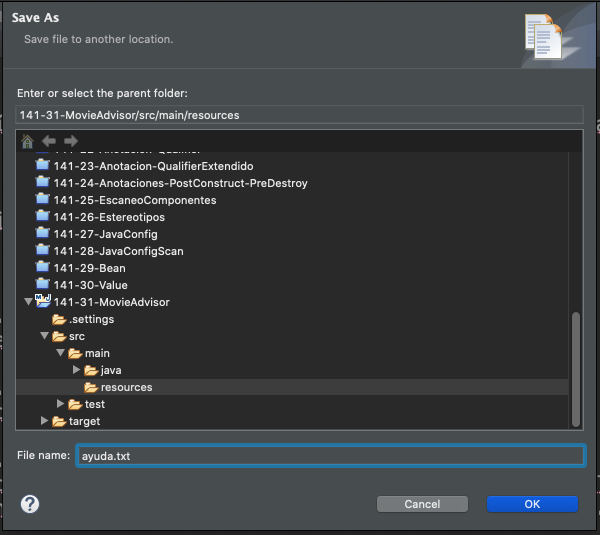

*`ayuda.txt`*

```text
Sintaxis: java -jar movieadvisor.jar [OPCIONES]

	-lg
	Lista los diferentes géneros de películas de la colección.
	No se pueden utilizar más parámetros.
	
	-ag genero1,genero2,genero...
	Lista aquellas películas que pertenecen a al menos uno de los géneros 
	que se indican.	El listado de géneros no puede incluir espacios.
	
	-tg genero1,genero2,genero...
	Lista aquellas películas que pertenecen a todos y cada uno de los 
	géneros que se 	indican. El listado de géneros no puede incluir espacios. 
	
	-y año
	Lista aquellas películas que se estrenaron en el año indicado.
	El año debe expresarse con 4 cifras.
	
	-b desde,hasta
	Lista aquellas películas que se estrenaron entre los años DESDE y HASTA.
	Los años indicados están incluidos. Deben expresarse con 4 cifras.
	
	-t titulo
	Lista aquellas películas cuyo título contiene la cadena proporcionada.
	Se ignorará el uso de mayúsculas/minúsculas en la comparación.
	
	-h
	Muestra este mensaje de ayuda.
	
EJEMPLOS DE USO

java -jar movieadvisor.jar -y 2018 -ag Action,Comedy
Muestra las películas estrenadas de 2018 de acción y/o de comedia.

java -jar movieadvisor.jar -t heart
Muestra las películas cuyo título contiene la palabra heart.

java -jar movieadvisor.jar -td Action,Sci-Fi -b 1990,2010 -t star
Muestra las películas cuyo título contiene la palabra star, pertenecen al 
género de acción y ciencia ficción y fueron estrenadas entre 1990 y 2010.   

java -jar movieadvisor.jar -lg
Muestra un listado con todos los géneros.


LICENCIAS

Los datos utilizados sobre películas utilizados en este ejemplo son
reales y están sacados del sitio web www.imdb.com. Ten en cuenta
que solo puede ser usada con fines personales y no comerciales.
```

Vamos a crear una nueva clase directamente en el paquete raíz llamada `MovieAdvisorApp` y que está si va a tener un método `main`.

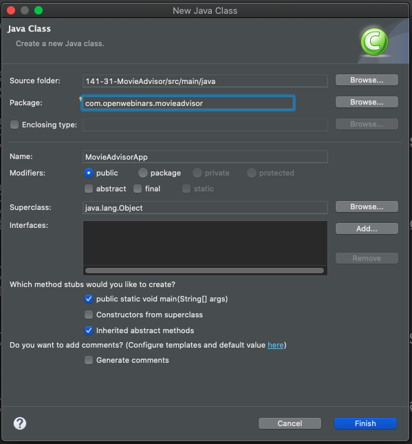

Lo que vamos a hacer aquí es sencillo, porque la lógica la vamos a desplazar hacia otra clase, hacia otro bean, aquí lo único que vamos a hacer es cargar el contexto, no nos olvidamos de cerrarlo. En medio lo que haremos es rescatar el bean que vamos a utilizar como ejecutor de la aplicación y lo ejecutariamos.

*`MovieAdvisorApp`*

```java
public class MovieAdvisorApp {

   public static void main(String[] args) {

      //Abrir contexto
      ApplicationContext appContext = new AnnotationConfigApplicationContext(AppConfig.class);
		
		
      //Cerrar contexto		
      ((AnnotationConfigApplicationContext) appContext).close();

   }
}
```

Para ello vamos a crear primero la clase que la llamamos `MovieAdvisorRunApp`.


Esta clase va a ser un bean en particular, como no estamos trabajando con aplicaciones web, no lo he querido llamar con el estereotipo de controlador, lo pondremos como `@Component` pero sería algo parecido a un controlador, tendrá un método `run(String[] args)`, va a recibir los argumentos que le podamos proporcionar


*`MovieAdvisorRunApp`*

```java
package com.openwebinars.movieadvisor;

import org.springframework.stereotype.Component;

@Component
public class MovieAdvisorRunApp {

   public void run(String[] args) {
		
   }
}
```

Con lo cual ya podemos completar el código de `MovieAdvisorApp`

*`MovieAdvisorApp`*

```java
package com.openwebinars.movieadvisor;

import org.springframework.context.ApplicationContext;
import org.springframework.context.annotation.AnnotationConfigApplicationContext;

import com.openwebinars.movieadvisor.config.AppConfig;

/**
 * 
 * Clase principal del programa.
 * 
 * Tan solo carga el contexto a partir de la clase de configuración. 
 * Tras esto, lanza el componente que ejecuta realmente el ciclo 
 * del programa.
 * 
 *
 */
public class MovieAdvisorApp {

   public static void main(String[] args) {
		
      ApplicationContext appContext = new AnnotationConfigApplicationContext(AppConfig.class);
		
      MovieAdvisorRunApp runApp = appContext.getBean(MovieAdvisorRunApp.class);
		
      runApp.run(args);		
		
      ((AnnotationConfigApplicationContext) appContext).close();

   }
}
```

Ya tendríamos listo nuestro nuestro main porque la lógica la vamos a incluir directamente en `MovieAdvisorRunApp`.

Parece normal según el diagrama de clases que vimos que en el bean `MovieAdvisorRunApp` necesitamos auto inyectar los dos servicios.

```java
@Autowired
private FilmService filmService;
	
@Autowired
private FilmQueryService filmQueryService;
```

Vamos a ver la estructura que tendría esto para poder manejar la sintaxis, parece claro que sí se invoca nuestra aplicación y el número de argumentos es menor que uno, quiere decir que la sintaxis es erróneo, es decir, lo que podemos hacer es simplemente indicarme que hay un error de sintaxis y mostrarle el mensaje de ayuda, cómo le vamos a mostrar el mensaje de error, bueno pues creariamos otro bean que vamos a llamar `MovieAdvisorHelp`


y que será el encargado de cargar en una cadena de caracteres, todo el mensaje de ayuda, de forma que nosotros después a través del método `getHelp()` lo vamos a poder utilizar, ¿Cómo lo podemos hacer?.

*`MovieAdvisorHelp`*

```java
package com.openwebinars.movieadvisor;

import java.io.IOException;
import java.nio.file.Files;
import java.nio.file.Paths;
import java.util.stream.Collectors;

import javax.annotation.PostConstruct;

import org.springframework.stereotype.Component;
import org.springframework.util.ResourceUtils;

/**
 * Este componente especial se encarga de cargar el mensaje de ayuda
 * que está almacenado en un fichero de texto.
 * 
 * Es un ejemplo de un componente (gestionado por el contenedor de IoC)
 * con gestiónd el ciclo de vida (@PostConstruct).
 * 
 */
@Component
public class MovieAdvisorHelp {

   private String help;

   @PostConstruct
   public void init() {
      try {
         // @formatter:off
         help = Files
                  .lines(Paths.get(ResourceUtils.getFile("classpath:ayuda.txt").toURI()))
                  .collect(Collectors.joining("\n")); 
	 // @formatter:on

      } catch (IOException e) {
         System.err.println("Error cargando el texto de ayuda");
         System.exit(-1);
      }
   }

   public String getHelp() {
      return help;
   }

}
```

Añadiríamos el método `init()` anotado con `@PostConstruct` y cargaríamos las líneas del fichero, lo podriamos hacer con ReadOnLines aun que esta manera me suele gustar más al igual que la otra ocación le indicamos cuál es el fichero de ayuda, directamente lo hemos hardcodeado la ruta del fichero y en caso de que haya algún error, directamente también saldríamos de la aplicación. No nos queremos parar en esta parte de la aplicación.

Cargaríamos el contenido de `help` en una cadena de caracteres y ya lo podríamos obtener.

De forma que en el método `run(String[] args)` de `MovieAdvisorRunApp` si queremos imprimir la ayuda, primero tenemos que  auto inyectar la ayuda y ya la prodríamos mostrar:

```java
@Autowired
private FilmService filmService;
	
@Autowired
private FilmQueryService filmQueryService;

@Autowired
MovieAdvisorHelp help;

public void run(String[] args) {

   if (args.length < 1) {
      System.out.println("Error de sintaxis");
      System.out.println(help.getHelp());
   }
}
```

Qué sucede si tenemos más de un argumento, bueno pues tendremos que ver cuántos tenemos, si tenemos solamente uno, es posible que la búsqueda la estemos haciendo por alguno de los argumentos que queremos sueltos es el caso `} else if (args.length == 1) {`, cuál tenemos que procesar exactamente, para ello nos quedamos con el argumento cero, lo pasamos a minúscula y lo podemos comparar con lo que tenemos aquí:

```java
@Autowired
MovieAdvisorHelp help;

public void run(String[] args) {

   if (args.length < 1) {
      System.out.println("Error de sintaxis");
      System.out.println(help.getHelp());
   } else if (args.length == 1) {
      switch (args[0].toLowerCase()) {
         case "-lg":
	    filmService.findAllGenres().forEach(System.out::println);
	    break;
	 case "-h":
	    System.out.println(help.getHelp());
	    break;
	 default:
	    System.out.println("Error de sintaxis");
	    System.out.println(help.getHelp());
	 }
      }
   }
}
```

De manera que si tenemos un solo argumento o bien es que queremos listar los géneros `-lg`, o bien es que queremos listar la ayuda `-h`, o bien es que hay un error de sintaxis.

Si queremos listar los géneros quiere decir que el argumento es `-lg`, con lo cual a través del servicio de películas `filmService`, obtenemos todos los generos `.findAllGenres()` y los pintamos directamente por consola con `.forEach(System.out::println)`. La instrucción completa es:

`filmService.findAllGenres().forEach(System.out::println);`

Si lo que queremos es mostrar la ayuda, directamente con el servicio de ayuda `help.getHelp()` la podríamos mostrar.

Y en otro caso quiere decir que hay un error de sintaxis y tendríamos que mostrar de nuevo la ayuda también.

Qué sucede en el caso de que tengamos más de un argumento, vamos a diferenciar el caso de que el número de argumentos sea impar y de ser así, pues tampoco tendríamos una sintaxis correcta, porque si no utilizamos el `-lg` o `-h`, quiere decir que los demás argumentos tienen que venir por parejas, si queremos buscar con título tenemos que poner `-t` y el título, si queremos buscar un año tenemos que poner `-y` y el año, tienen que venir por parejas, con lo cual aquí tendríamos también un problema:

```java
} else if (args.length % 2 != 0) {
   System.out.println("Error de sintaxis");
   System.out.println(help.getHelp());
}
```

al igual que si pasamos más de 4 parejas de búsqueda, que va a ser el tope que pongamos, porque bueno no tendría sentido que buscáramos por un año en particular y también por un intervalo, aunque eso realmente no lo vamos a controlar, pero si vamos a controlar que sean cuatro parejas, con lo cual si el número de argumentos es mayor que 8:

```java
} else if (args.length > 8) {
   System.out.println("Error de sintaxis");
   System.out.println(help.getHelp());
} 
```

En otro caso quiere decir que nos están pasando los diferentes argumentos que nosotros estamos necesitando, cómo vamos a hacer este procesamiento, puesto que esto no es de Spring, esto es básicamente de Java, vamos a tratar de cogerlos por parejas, de una manera sencilla.

Lo vamos a guardar en una lista de array de cadenas de caracteres, llamada `argumentos` 

`List<String[]> argumentos = new ArrayList<>();`

El bucle para hacerlo, lo dejamos aquí planteado:

```java
for (int i = 0; i < args.length; i += 2) {
   argumentos.add(new String[] { args[i], args[i + 1] });
}
```

vamos a ir recorriendo nuestro array, pero dando saltos de dos en dos, de manera que en cada salto cogemos esa posición y la siguiente y así tendremos `-t` y el título, `-ag` y los géneros que queremos listar, `-y` y el año, y lo tendremos directamente en este listado, que para procesar va a ser más sencillo y ahora lo que tenemos que hacer, es procesar el listado `argumentos`, extrayendo los distintos argumentos y haciendo todo lo que corresponda, esta lógica es la siguiente:

```java
boolean error = false;

for (String[] argumento : argumentos) {
   switch (argumento[0].toLowerCase()) {
      case "-ag":
	 filmQueryService.anyGenre(argumento[1].split(","));
	 break;
      case "-tg":
	 filmQueryService.allGenres(argumento[1].split(","));
	 break;
      case "-y":
         filmQueryService.year(argumento[1]);
	 break;
      case "-b":
         String[] years = argumento[1].split(",");
	 filmQueryService.betweenYears(years[0], years[1]);
	 break;
      case "-t":
         filmQueryService.titleContains(argumento[1]);
	 break;
      default: error = true;
	 System.out.println("Error de sintaxis");
	 System.out.println(help.getHelp());
   }

}
```

Estos son los distintos argumentos que podemos pasar, `-ag` algún género, `-td` todos los géneros, `-y` año, `-b` entre dos años y `-t` el título. 

Para ello como decía vamos sacando de `argumentos` cada pareja, donde `argumentos[0]` es el `-ag`, `-td`, `-y`, `-b` o `-t`,  y `argumentos[1]` sería el argumento en si.

Si es `-ag` quiere decir que nos han pasado otro argumento, que será o un género o una lista de generos separada por comas de genero, si es una lista la spliteamos y lo que hacemos es directamente utilizar el método `anyGenre` directamente del servicio `filmQueryService` para poder buscar `filmQueryService.anyGenre(argumento[1].split(","));`.

En el caso de que sean todos los géneros, lo haríamos llamando al método correspondiente `filmQueryService.allGenres(argumento[1].split(","));`.

En el caso del año no tenemos nada que splitear `filmQueryService.year(argumento[1]);`.

Si son intervalos si que tendríamos que Splitear los años para tener el desde y él hasta:

```java
String[] years = argumento[1].split(",");
filmQueryService.betweenYears(years[0], years[1]);
```

Y en el caso del título, directamente compraríamos con el título `filmQueryService.titleContains(argumento[1]);`.

Si nos damos cuenta lo que va haciendo aquí es ir llamando a `filmQueryService`, lo hemos inyectado previamente, y de esta forma lo que iria haciendo sería ir acumulando, si hemos pasado dos parejas de argumentos, acumularía los predicados correspondientes.

En `default` añadimos esta posibilidad por si hay algún tipo de fallo, es decir si alguien ha pasado un `--z` por ejemplo como argumento, directamente le tenemos que decir que hay un error de sintaxis, la variable `error` inicia a `false`, sería verdadera si hubiera algún problema y lo que hacemos entonces es, en caso de que haya algún error, no imprimir los resultados de la busqueda, no ejecutaremos los resultados.

```java
default: error = true;
   System.out.println("Error de sintaxis");
   System.out.println(help.getHelp());
}
```

Imprimir los los resultados lo hacemos aquí:

```java
if (!error) {
   Collection<Film> result = filmQueryService.exec();
   System.out.printf("%s\t%-50s\t%s\t%s\n","ID","Título", "Año", "Géneros");
   if (result != null) {
      result.forEach(f -> System.out.printf("%s\t%-50s\t%s\t%s\n", 
			f.getId(), f.getTitle(), f.getYear(), 
			f.getGenres().stream().collect(Collectors.joining(", "))));
   } else {
      System.out.println("No hay películas que cumplan esos criterios. Lo sentimos");
   }
}
```

Sino hay error lo que vamos a hacer es ejecutar la consulta, lo guardamos en la colección, y lo único que hacemos es pintarlo de una forma conveniente, no esta demaciado currado. Pintamos en una primería línea todos los encabezados:

`System.out.printf("%s\t%-50s\t%s\t%s\n","ID","Título", "Año", "Géneros");`

La primera parte `"%s\t%-50s\t%s\t%s\n"` es un especificador de formato que le da 50 carácteres al título, nos va a dar una vaga sensación de ver columnas y ese mismo especificador lo usamos a la hora de pintar los datos correspondientes, en el caso de la lista de los generos aprovechamos el API stream, los sacamos todo del listado, lo juntamos separado por (,)  a la hora de imprimirlos, para que aparezcan así de una manera más conveniente.

La clase `MovieAdvisorRunApp` completa la tenemos aquí:

*`MovieAdvisorRunApp`*

```java
package com.openwebinars.movieadvisor;

import java.util.ArrayList;
import java.util.Collection;
import java.util.List;
import java.util.stream.Collectors;

import org.springframework.beans.factory.annotation.Autowired;
import org.springframework.stereotype.Component;

import com.openwebinars.movieadvisor.model.Film;
import com.openwebinars.movieadvisor.service.FilmQueryService;
import com.openwebinars.movieadvisor.service.FilmService;

/**
 * Este componente tiene el ciclo de ejecución del programa,
 * el cuerpo principal. En una aplicación web, seguramente
 * hubiera sido anotada con @Controller.
 * 
 * El método run recibe los argumentos que se han pasado
 * por la línea de comandos, y en función de cuantos y cuáles
 * son, verifica si la sintaxis es correcta o no, y ejecuta
 * la consulta correspondiente.
 * 
 */
@Component
public class MovieAdvisorRunApp {

	@Autowired
	FilmService filmService;
	
	@Autowired
	FilmQueryService filmQueryService;

	@Autowired
	MovieAdvisorHelp help;

	public void run(String[] args) {

		if (args.length < 1) {
			System.out.println("Error de sintaxis");
			System.out.println(help.getHelp());
		} else if (args.length == 1) {
			switch (args[0].toLowerCase()) {
			case "-lg":
				filmService.findAllGenres().forEach(System.out::println);
				break;
			case "-h":
				System.out.println(help.getHelp());
				break;
			default:
				System.out.println("Error de sintaxis");
				System.out.println(help.getHelp());

			}
		} else if (args.length % 2 != 0) {
			System.out.println("Error de sintaxis");
			System.out.println(help.getHelp());
		} else if (args.length > 8) {
			System.out.println("Error de sintaxis");
			System.out.println(help.getHelp());
		} else {

			// De esta forma hemos asegurado que el número de argumentos
			// es par (opción valoropción) y que no hay más de cuatro
			// parejas (ver fichero de ayuda).
			List<String[]> argumentos = new ArrayList<>();

			for (int i = 0; i < args.length; i += 2) {
				argumentos.add(new String[] { args[i], args[i + 1] });
			}
			
			boolean error = false;

			for (String[] argumento : argumentos) {
				switch (argumento[0].toLowerCase()) {
				case "-ag":
					filmQueryService.anyGenre(argumento[1].split(","));
					break;
				case "-tg":
					filmQueryService.allGenres(argumento[1].split(","));
					break;
				case "-y":
					filmQueryService.year(argumento[1]);
					break;
				case "-b":
					String[] years = argumento[1].split(",");
					filmQueryService.betweenYears(years[0], years[1]);
					break;
				case "-t":
					filmQueryService.titleContains(argumento[1]);
					break;
				default: error = true;
						 System.out.println("Error de sintaxis");
						 System.out.println(help.getHelp());
				}

			}
			
			if (!error) {
				Collection<Film> result = filmQueryService.exec();
				System.out.printf("%s\t%-50s\t%s\t%s\n","ID","Título", "Año", "Géneros");
				if (result != null) {
					result.forEach(f -> System.out.printf("%s\t%-50s\t%s\t%s\n", 
							f.getId(), f.getTitle(), f.getYear(), 
							f.getGenres().stream().collect(Collectors.joining(", "))));
				} else {
					System.out.println("No hay películas que cumplan esos criterios. Lo sentimos");
				}
			}
		}

	}

}
```

Puede ocurrir que el resultado esté vacío porque las películas no cumpla con ninguno de los criterios que nosotros estamos siguiendo, vamos a ejecutar nuestra aplicación.

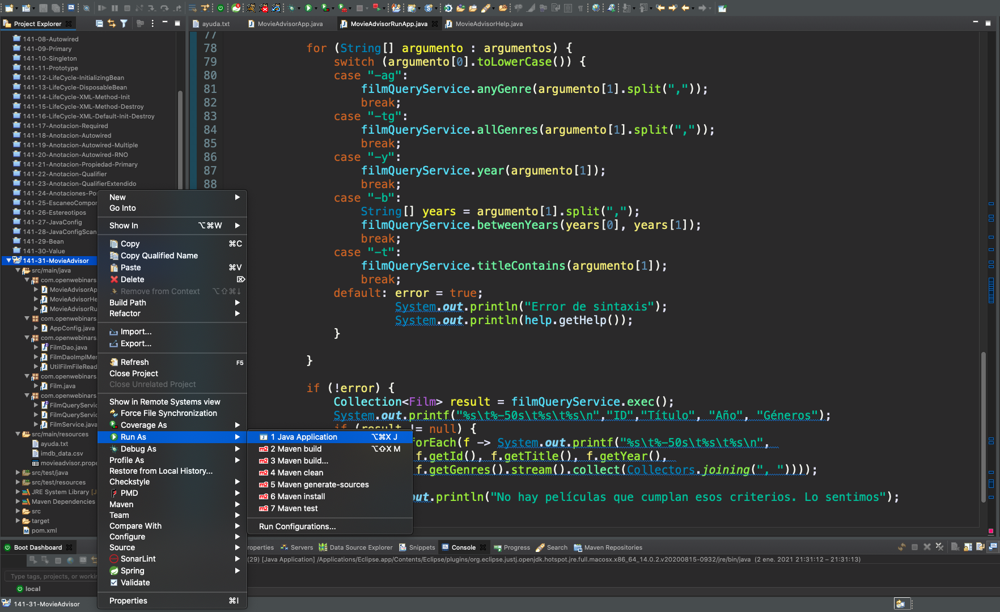

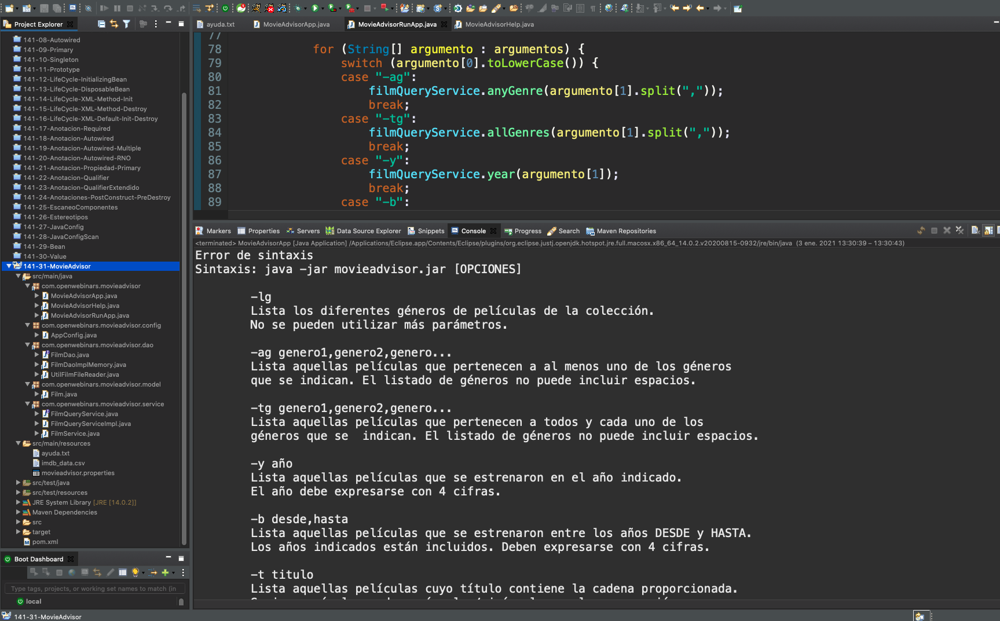

Como no hemos puesto ningún argumento, no mostraría el mensaje de ayuda, tenemos un error de sintaxis, y bueno ya nos quería probar con la sintaxis correcta.

Si queremos listar todos los géneros, lo vamos a ser directamente desde Eclipse, podemos crear una configuración de ejecución.

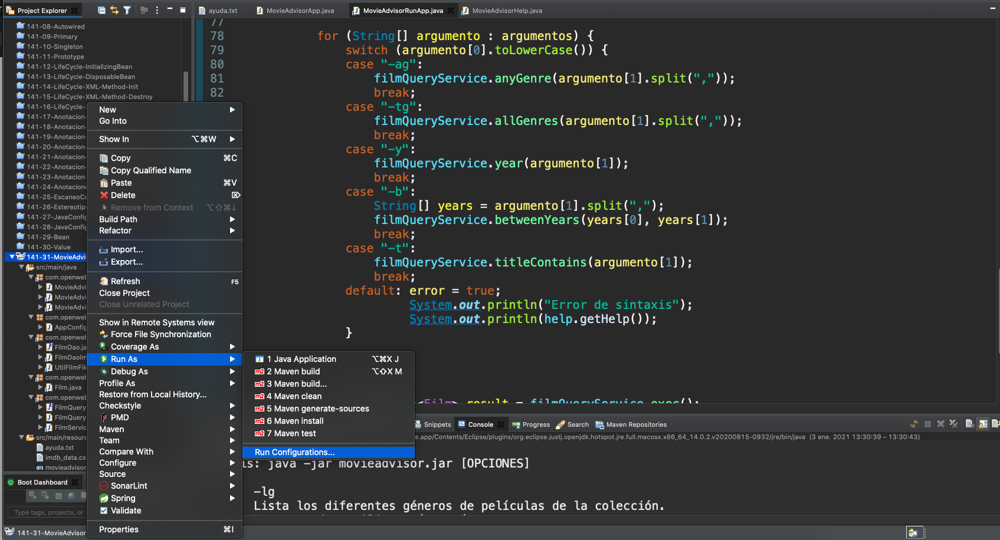

En la pestaña `Arguments` pasaremos argumentos, si queremos lista todos los generos, tendremos que poner `-lg`.


Aquí procesar los datos, son muchas películas, con lo cual es posible que tarde un ratito en procesar todos los resultados.

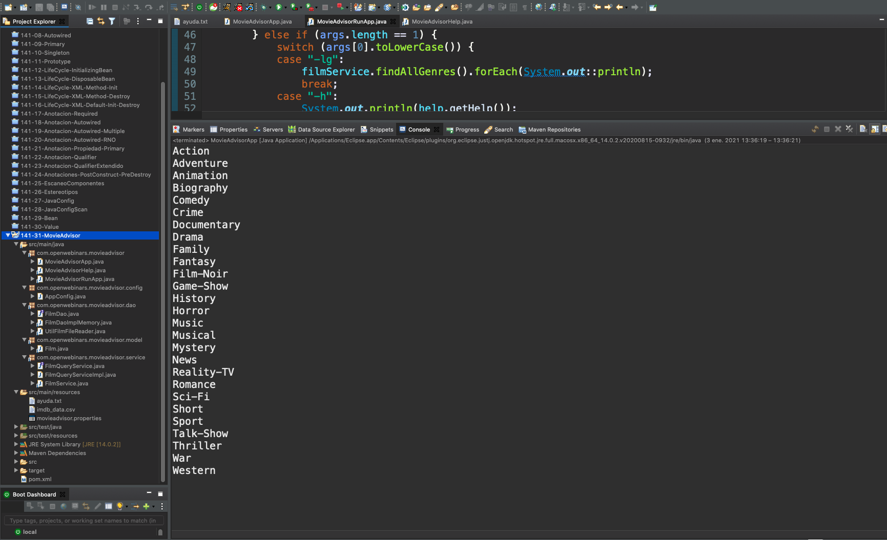

Nos muestra un listado con todos los géneros.

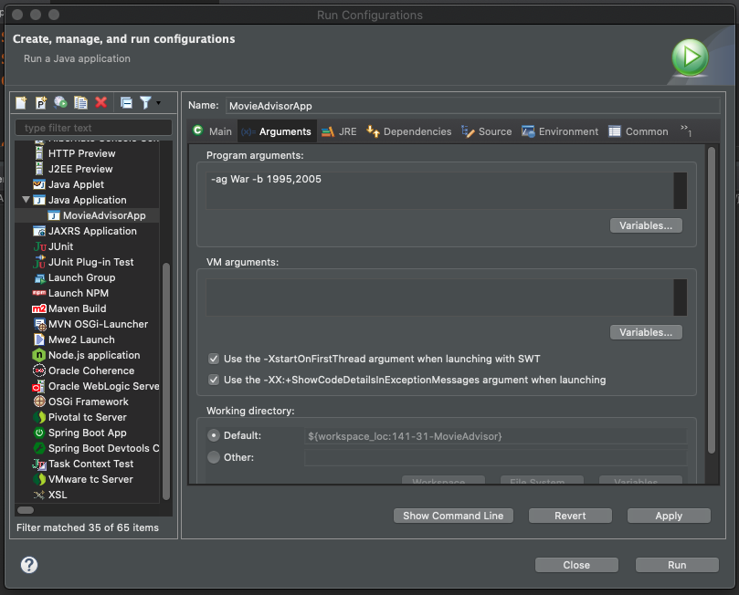

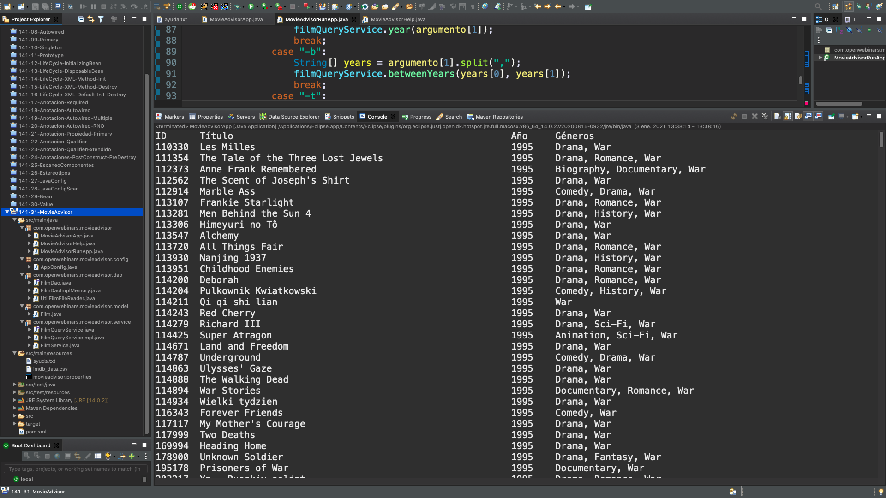

Nota: si ponemos `war` no las encuentra, podría mejorarse.

Si queremos hacer alguna otra búsqueda tenemos que volver a crear el la configuración de ejecución, buscar película de guerra y documentales que estén entre los años 1995 y 2005


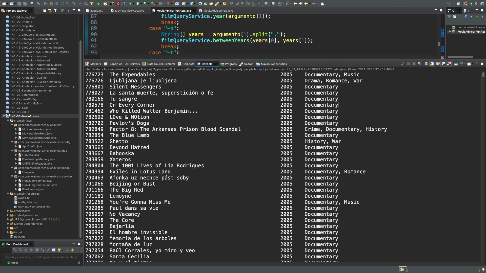

Por último si queremos podemos ver el mensaje de ayuda.

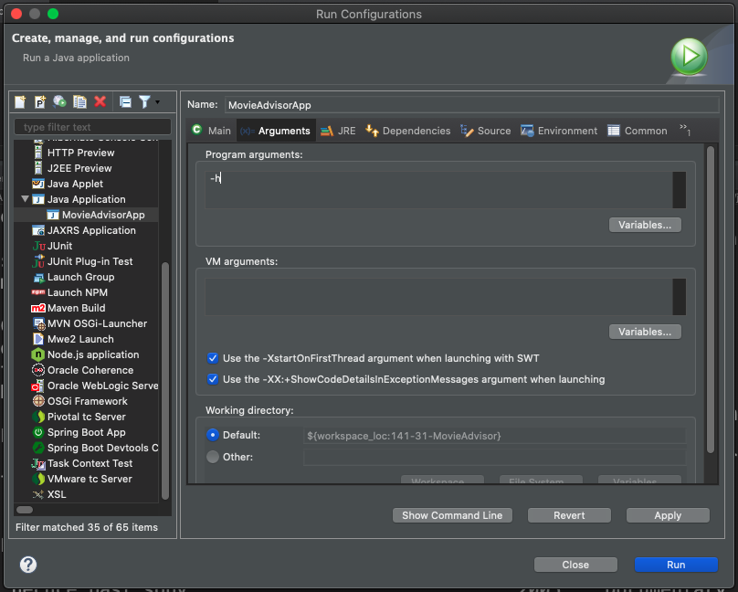

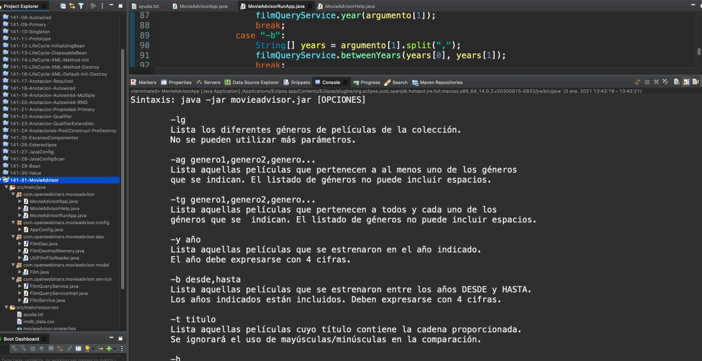

Podríamos utilizar la sintaxis de nuestra aplicación para poder consultar y poco a poco poder acotar y obtener una recomendación de las películas que queríamos ver, con esto concluimos el curso de Spring Core.

# Contenido adicional 1

[PDF 6-1_Proyecto_de_ejemplo.pdf](pdfs/6-1_Proyecto_de_ejemplo.pdf)
