# 6. Ejemplo práctico - MovieAdvisor 71m

* 20 Introducción a MovieAdvisor 7:46 
* 21 Creación del proyecto y modelo de datos 5:49 
* 22 Repositorio y acceso a datos (Parte I) 12:55 
* 23 Repositorio y acceso a datos (Parte II) 9:30 
* 24 Servicios 13:28 
* 25 Ejecución de la app 22:28 
* Contenido adicional 1

# 20 Introducción a MovieAdvisor 7:46 

[PDF 6-1_Proyecto_de_ejemplo.pdf](pdfs/6-1_Proyecto_de_ejemplo.pdf)

## Resumen Profesor

No existe.

## Transcripción


Vamos a finalizar nuestro curso de Spring Core con una sucesión de lecciones en la que iremos construyendo poco a poco una aplicación sencilla, pero que integre la mayoría de los conceptos con los que hemos trabajado a lo largo del curso. A este proyecto lo vamos a llamar MovieAdvisor y va a ser un sencillo recomendador de películas.


Vamos a trabajar con un fichero que es fácilmente descargable, yo lo he tuneado un poco, con datos de casi todas las películas de la historia. Gracias [IMDB](https://www.imdb.com/) por ofrecer estos datos. 

Lo que vamos a desarrollar es una herramienta de línea de comandos, veremos después que sintaxis queremos tener a la hora de invocarla, aunque nosotros fuera por no emborronar un poco lo mismo invocaremos directamente desde Eclipse.

Los datos los tendremos en un fichero CSV que hemos procesado y que lo tendréis disponible en el código fuente y que para cada película tiene asignado un `id` identificador, `title` en idioma original, `year` año y `genres` una sucesión separada por comas de los géneros en los cuales podemos enmarcar esa película, cómo vemos el separador de datos de columnas sería (`;`) como separador de géneros tendríamos la coma (`,`) para hacer de separador dentro de esa columna.


```txt
id;title;year;genres
9;Miss Jerry;1894;Romance
147;The Corbett-Fitzsimmons Fight;1897;Documentary,News,Sport
229676;Reproduction of the Corbett and Fitzsimmons Fight;1897;Documentary,News,Sport
138342;O Campo Grande;1898;Documentary
138349;O Carnaval em Lisboa;1898;Documentary
138759;A Rua Augusta em Dia de Festa;1898;Documentary
138774;Saída dos Operários do Arsenal da Marinha;1898;Documentary
221032;Branding Cattle;1898;Documentary,Sci-Fi
221040;Buck Dance, Ute Indians;1898;Documentary
235357;Dressing Paper Dolls;1898;Documentary
236940;69th Regiment Passing in Review;1898;Documentary
237775;The Startled Lover;1898;Romance
138382;O Cortejo da Procissão da Senhora da Saúde;1899;Documentary
...
```


El diagrama de clases completo de nuestra aplicación va a ser este, si quisiéramos solamente plasmar en el diagrama el modelo de nuestra aplicación sería muy sencillo, porque sería tan solo una clase la clase `Film`. La clase película que va a guardar los datos de una película cómo lo hemos visto antes, el id, el título, el año de estreno y una lista con los géneros que incluye.

Sin embargo hemos querido poner un diagrama de clases del diseño donde se ven todas las demas clases e interfaces que van a intervenir para ver quien usa quien y por ende ver quien tiene una dependencia con quien, entonces el diagrama cobra un poco más de sentido y aunque no es extremadamente complejo, pero si es verdad que tenemos que ver cómo lo podemos interpretar.

Como punto de entrada quién tendrá el método main, será la clase `MovieAdvisorApp` si bien esta clase será algo de "cascarilla" ya que simplemente lo que hará será cargar el contexto y lanzar el método `run` quien tendrá la clase `movieAdvisorRunApp` quien será el que tenga el algoritmo de la aplicación, el que es capaz de procesar los argumentos, verificar si la sintaxis es correcta e invocar a los distintos servicios.

Como decíamos la clase `MovieAdvisorApp` que es la que tiene el método `main`, lo que hace es cargar el contexto para ello,  vamos a utilizar la configuración mixta de Java Config con anotaciones, entonces tendrá que usar la clase `AppConfig` para cargar ese contexto.

Además la clase `MovieAdvisorRunApp` en el caso de que queramos visualizar la ayuda, por crear otro componente más tenemos la clase `MovieAdvisorHelp` que será la encargada de cargar desde un fichero de texto, la sintaxis de la ayuda, para que la podamos imprimir por consola. 

A partir de `MovieAdvisorRunApp` esta clase, esté bean que tiene el algoritmo nuclear de la aplicación, va a jugar con dos servicios, uno de ellos, para que veas que podemos crear tranquilamente sobre una clase se llama `FilmService` digamos que un servicio de alto nivel, con operaciones bastante de alto nivel, con alto nivel nos referimos de abstracción, es decir que directamente nos da la posibilidad de obtener las películas que tengamos en nuestro almacén de datos, por una serie de criterios.

Y por otro lado tenemos la interfaz `FilmQueryService` implementada por la clase `FilmQueryServiceImpl` que nos va a permitir definir consultas algo más compleja sobre nuestro almacén de datos. 

Ambos servicios `FilmService` y `FilmQueryService` utilizan la interfaz `FilmDao` que es de alguna manera el contrato sobre nuestro repositorio, que en este caso lo vamos a implementar en memoria con `FilmDaoImpMemory` y que será la que almacenará todos estos datos, veremos como esto lo cargamos desde el fichero a través de un método estático, que será la encargada de leer este fichero modelo.

Y como es natural la interfaz `FilmDao` utiliza nuestro modelo `Film`.

Vamos a ponernos manos a la obra, vamos a ver qué sintaxis vamos a utilizar para poder luego implementarla de manera correcta. 


La idea que nosotros pudiéramos empaquetar esta aplicación en un `JAR` y pudiéramos proporcionarle una serie de opciones, la primera opción más sencilla sería listar los géneros diferentes (`-lg`) de todas las películas que tenemos, por si queremos saberlo y utilizarlo como criterio de búsqueda más adelante. 

A partir de aquí podemos utilizar cuatro opciones distintas que serían `-ag` es decir que la película incluya o pertenezca a alguno de los géneros que se listen, podríamos poner más de uno separado por comas, siempre y cuando no tenga un espacio.

`-tg` que en lugar de indicar que la película pertenece a algún género, la película tiene que pertenecer a todos los géneros que incluyamos.


Otro parámetro que se podría añadir serían `-y año` para ver películas estrenadas en dicho año.

O bien `-b desde,hasta` para ver las películas estrenadas en un intervalo, con un año de inicio y de fin.

Y la opción de de un título `-t titulo`, el decir que el título de la película contenga la cadena de caracteres que nosotros proponemos aquí, siempre sin espacio.

Por último la opción `-h` que mostrara el mensaje de ayuda.

Ya digo una aplicación que es sencilla, aunque si es nuestro primer proyecto Spring completo tendrá una complejidad media y además haremos un buen uso del API Strem de Java 8, para poder hacer los filtrados, las búsquedas, los mapeo, etcétera etcétera. 

# 21 Creación del proyecto y modelo de datos 5:49 

## Resumen Profesor

No existe.

## Transcripción

Vamos a continuar creando todo el esqueleto de nuestro proyecto de ejemplo para que podamos empezar a codificarlo, para ello al igual que en otras ocasiones vamos a crear un nuevo proyecto Maven.


Podemos evitar el uso de cualquier arquetipo porque no lo vamos a necesitar.

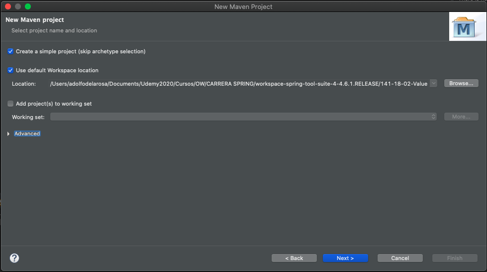

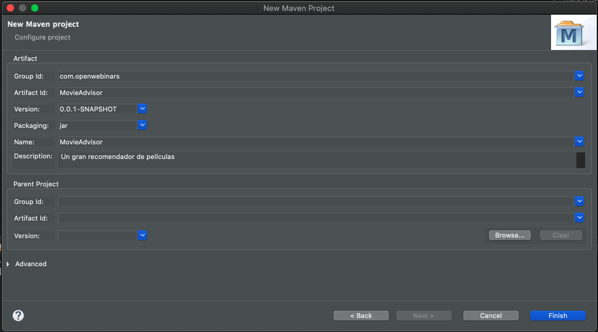

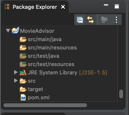

Recordemos que Eclipse a la hora de crear los proyectos con Java 5, tenemos que cambiar para qué en lugar de Java 5 podamos usar Java 8.

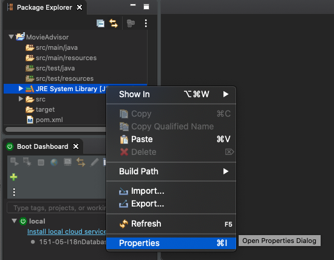

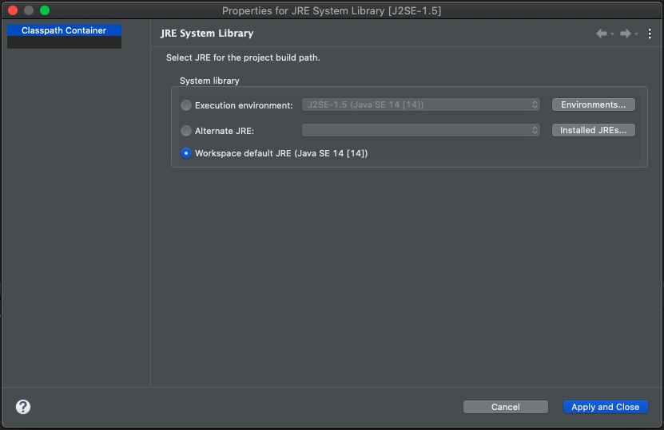

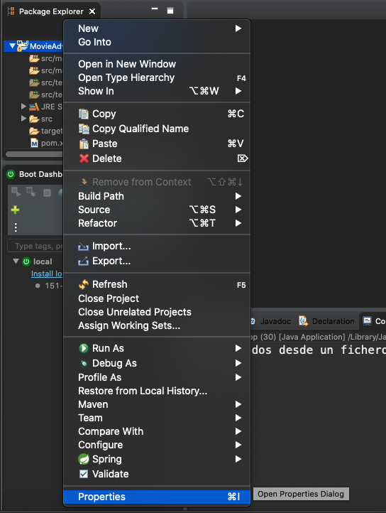

También debemos cambiarlo en Java Compiler.

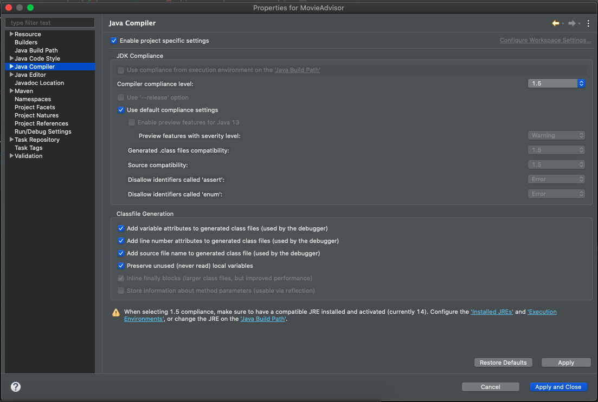

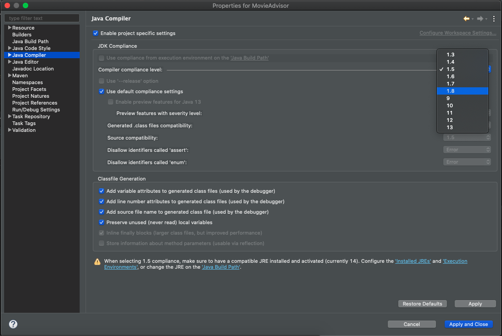

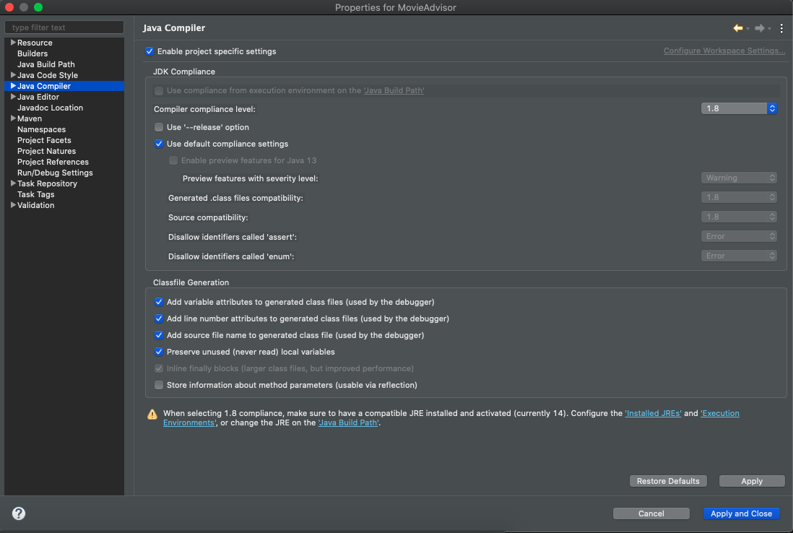

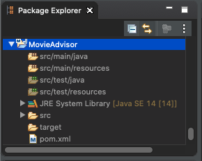

A partir de aquí vamos a comenzar a códificar nuestra aplicación.

Vamos a incluir en el `pom.xml` la dependencia que necesitamos.

*`pom.xml`*

```html
<project xmlns="http://maven.apache.org/POM/4.0.0" xmlns:xsi="http://www.w3.org/2001/XMLSchema-instance" xsi:schemaLocation="http://maven.apache.org/POM/4.0.0 https://maven.apache.org/xsd/maven-4.0.0.xsd">
  <modelVersion>4.0.0</modelVersion>
  <groupId>com.openwebinars</groupId>
  <artifactId>MovieAdvisor</artifactId>
  <version>0.0.1-SNAPSHOT</version>
  <name>MovieAdvisor</name>
  <description>Un gran recomendador de películas</description>
  
  <dependencies>
		<!-- https://mvnrepository.com/artifact/org.springframework/spring-context -->
		<dependency>
			<groupId>org.springframework</groupId>
			<artifactId>spring-context</artifactId>
			<version>5.2.6.RELEASE</version>
		</dependency>
		<!-- Necesaria por usar Java 14 -->
		<dependency>
			<groupId>javax.annotation</groupId>
			<artifactId>javax.annotation-api</artifactId>
			<version>1.3.2</version>
		</dependency>
	</dependencies>
</project>
```

Recordar que podemos buscar la dependencia en [Maven Repository](https://mvnrepository.com/) y buscar `spring context`.

Estupendo ya la tenemos, lo siguiente que podríamos hacer de una manera sencilla sería incluir dentro de nuestra carpeta `resources` el fichero con todos los datos de las películas que hemos visto antes, el archivo se llama `imdb_data.csv` y pesa 16MB porque son muchísimos los registros que tiene millones de películas, al incluir aquí directamente ya lo tendríamos disponible en nuestro proyecto. Incluso si lo queremos abrir desde aquí lo podríamos abrir con el con el editor de texto.

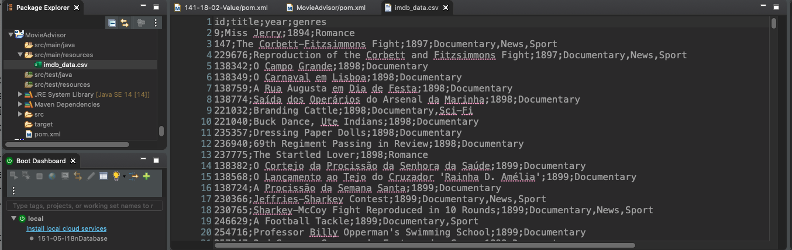

Lo que es interesante que conozcamos su estructura y hemos visto que tiene un Id, un título, el año de estreno y que también tiene un listado con los diferentes géneros que conforman o los géneros a los que pertenece la película.

Vamos a crear nuestra clase que represente esa entidad, hasta ahora no nos hemos preocupado mucho en los proyectos anteriores de la estructuración en paquetes, porque realmente tampoco hemos tenido ninguna aplicación compleja, aunque aquí vamos a hacer más grande la parte práctica, sí lo vamos a estructura.

Vamos a crear un nuevo paquete llamado `com.openwebinars.movieadvisor.model`

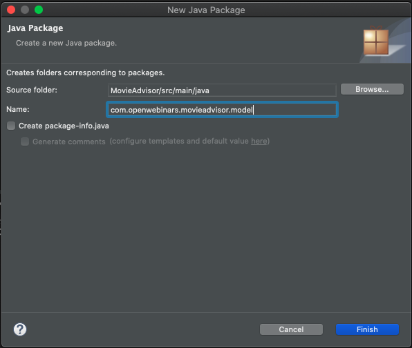

Dentro de este package vamos a crear nuestra nueva clase `Film`.

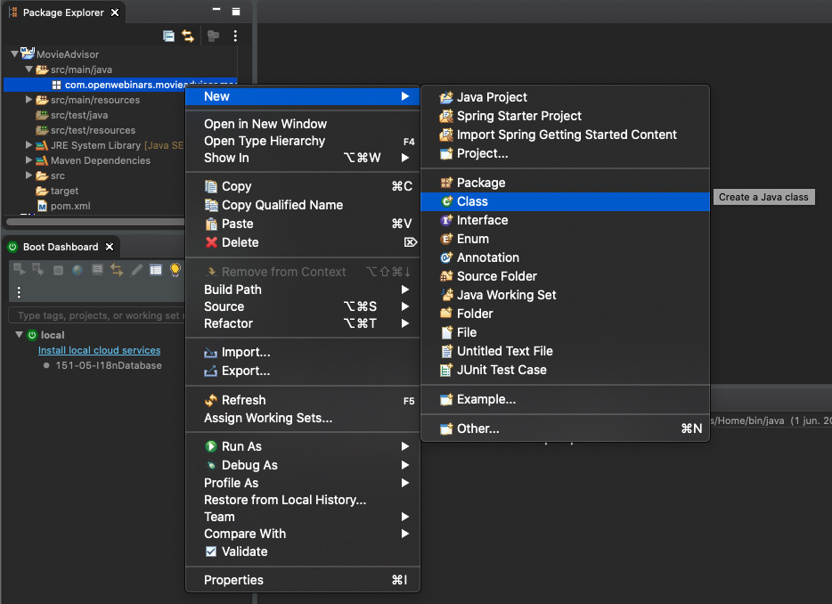

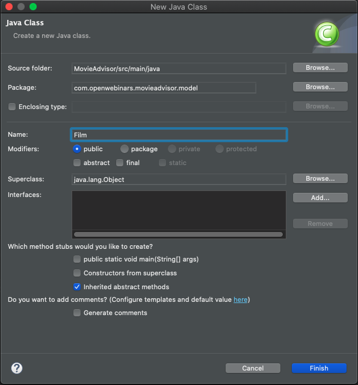


va a tener un nivel que lo vamos a guardar en un long el título por no complicarnos tampoco con el manejo de fechas y usamos en manejo de fecha anterior a Java 8 el manejo de fechas en Java 8 otra librería como yo la time lo guardaremos dentro de una cadena de caracteres y si después tenemos que hacer algún tipo de transformación la podemos hacer invitado necesario bueno se trata de una clase de las de manual vamos a crear constructor con los parámetros generar getter y setter igual vale lo típico que podríamos necesitar de de una clase podríamos utilizar alguna otra variante usar por ejemplo permiten incluirpara poder empezar desde abajo hacia arriba es decir vamos a empezar a codificar primero la parte de los dados para poder rescatar los datos a partir de ahí iremos subiendo hacia los servicios etcétera etcétera y lo vamos a ir haciendo poco a poco en lo siguiente

# 22 Repositorio y acceso a datos (Parte I) 12:55 

## Resumen Profesor

No existe.

## Transcripción

Paquete que va a contener la configuración a la clase de configuración será solamente una pero podríamos tener para ello creamos aquí una nueva clase y también vamos a indicar que vamos a escanear los componentes un esquema mixto y y el uso de anotaciones webinars todos los pins que se encuentren en esos paquetes o por debajo por ahora no vamos a necesitar nada más ya volveremos vamos a crear entonces la interfaz dado para poder trabajar con almacén con un repositorio de decir cómo crear un nuevo paquete y dentro de este paquete vamos a crear una nueva interfaz llamada interfaz va a tener los métodos que debería implementar cualquier clase que quiera hacer un lado de películas vale sencillo que nos devuelva todas las películas en una colección que películas pues por si acaso necesitamos más adelante insertar editar esto sería como decía nosotros vamos a crear una clase que implemente memoria bueno pues que sea capaz de cargar el fichero memoria y que nos permita tener todas las películas dado su implementación en memoria vamos a necesitar como decía si vamos es que el proyecto quizá todavía aunque le hemos indicado que tiene Java 8 pero es posible que no lo tenga cargado el nivel en el compilador directamente que coja que no nos de castigo vale pues vamos a ver cómo podemos cargar nosotros ahora todas las películas no podemos hacer manejando el ciclo de vida de este link que por cierto es repositorio al ser un vamos a poder manejar su ciclo de vida no podríamos hacer a través de métodos químicos en el quad vamos a intentar cargar las películas desde algún sitio para ello vamos a crear una nueva clase en este caso no lo voy a crear como un bin sino que lo voy a dejar para que lo podáis hacer vosotros que sería la encargada de cargar de procesar el fichero film protectorsi alguien quiere que pudiera ser capaces de leer el fichero está separación es porque este implementación del dado es memoria decírselo a tener pero no sabe de dónde surgen los datos vale y bueno si lo hiciera y otro pues podrían surgir de otro sitio que no fue suficiente para que vosotros podáis que va a devolver películas y qué vas a recibir tres alumnos el path del fichero que ahora veremos que lo podemos colocar en el fichero de properties que vamos a crear separador de CSV que vamos a utilizar para las listas que haya dentro de una columna como sucede con los gemelos lo tendríamos por aquí tendríamos que poco a poco problemas aquí sería hacerlo de esta manera problema podemos con todo lo necesario en medio vamos añadir el formatter porque vamos a incluir aquí el uso de API streaming y expresiones lambda y nos va a dar un poco de estructuras y formateamos el código sagrado nosotros vamos a utilizar estos si os perdéis un poco en esta parte os recomiendo que visitéis nuestro curso de Java 8 donde se explica con abundancia en cómo trabajar con fichero y el cómo usar el API spring nosotros queremos a través de la clase files usar el método online esto no te vuelve un string de string en decir que va a ir leyendo línea a línea en fichero y no lo va a devolver dentro de este lo tenemos que proporcionar nosotros y bueno se lo pasará aquí lo que sucede es que para poder cargar convenientemente el fichero en lugar de acceder vía la sistema de ficheros lo vamos a hacer a través de la clase vale y su método getfield de una manera más conveniente este fichero es lo que sucede que lo devuelve como un tipo que no podemos utilizar y si lo podemos transformar a una URI p la primera línea es la que tiene el encabezado y bueno vamos a querer procesar este CSV para irte de películas vamos a querer que cada línea se hace una transformación como compleja la vamos a hacer y por último lo vamos a querer correr perdón recoger todo listado de almacén haremos y ahora ya nos podemos centrar en el mapa pero este se parece por aumentar un poquito la velocidad de codificación os lo dejo por aquí y os lo explico y ahora veremos qué hace falta cada línea del fichero incluye todos los datos de una película lo que tenemos que hacer es explicarles decir trocearla por el separador que utilizamos en primera instancia en primera instancia del público ellos no devolverá un array de string cada uno de los valores el primer valor qué es un long tenemos que pasar para obtenerlo serie nivel el siguiente es el título de la película el siguiente sería el año y por último tendríamos que tener en estado con los géneros para ello el procesamiento que hacemos también ejercicios por la coma qué es el separador de estado toda la columna te y lo que hacemos es construir con arrays aslist construimos una lista de string con cada uno de los géneros todo ello se lo pasamos al constructor con parámetros y lo devolvemos de forma y manera que este este bloque leerá línea líneas fichero y profesora todas las películas almacenando en el estado todo ello nos obliga a que pongamos un bloque try catch vale porque tenemos posibilidad de tener algún problemilla a la hora de leer el fichero o a la hora de cualquiera cualquier cosa podríamos indicar aquí los errores de lectura y vamos en tal caso incluso podremos terminar directamente la aplicación si no queremos mostrar la traza de la pila podríamos mostrar un mensaje de error como este de aquí no error leyendo el fichero de datos y directamente podríamos podríamos ir incluso nos podemos quedar solamente con el lío excepción que incluye el delfín not found eso ya lo vamos a hacer en el próximo

# 23 Repositorio y acceso a datos (Parte II) 9:30 

## Resumen Profesor

No existe.

## Transcripción

hola a todos vamos a continuar con nuestro ejemplo por dónde lo hemos dejado recordemos que necesitamos aquí estos tres valores y habíamos pensado que la mejor manera es proporcionar lo a través de un fichero de properties para ellos línea y no sé vosotros pero cuando veo una línea errónea me da un poco de pánico para ellos nos vamos a venir a la carpeta recursos y no existe un asistente para crear fichero de properties con lo cual podemos usar directamente un fichero de texto vale en este fichero de texto vamos añadir tres propiedades por la dejo copiadas por aquí que es el path del fichero vale que en principio va a estar en la raíz del Clash vale el separador de CSV que vamos a utilizar qué es el punto y coma y el separador de listas que sería la coja salvamos esto lo hacemos en nuestro proyecto muy bien by so many reasons y lo llamamos móvil Advisor. Properties ya lo tendremos nuestro fichero de properties ahora lo que tenemos que hacer es cargarlo desde nuestra clase de configuración para ello bueno pues podemos utilizar directamente la anotación property souls vale pasamos la ruta sure properties lo que vamos a hacer es lo siguiente en lugar de que recojamos el valor directamente en los vinos de los vayamos a utilizar vamos a dejar que la clase app como funciona también algo así como una especie de componente de configuración los colores los recogeremos aquí y esta clase tendrá un método que te y allá donde lo necesitemos lo que haremos será en lugar de inyectar lo suelto y estaremos la clase app lo que vamos a hacer que tenemos para poder usar las property no podríamos crear así esto sería dólar PSV tractor list separator y ahora lo que haríamos sería crear bueno pues los metodos getter para estos tres balones pueden ser privados vamos a crear los getters vale y ya lo tendríamos por aquí de esta manera cuando queramos utilizar los valores de configuración pues simplemente nos tendríamos que venir a esta clase inyectarhemos ido pasando a través de la clase app-config hasta este método que hemos programado bueno pues tanto la ruta como los valores las expresiones regulares que va utilizar split a la hora de separar el fichero nos quedaría implementar nuestra clase dado que ahora mismo está vacía por completo y si parece p**** alargar más lo voy poco a poco copiando el código y explicando cómo funciona haría y me detengo allá donde bueno pues sea algo más usando el app y stream y a través de la lista de película los métodos de búsqueda pues eran parecidos a este también podemos utilizar si queréis expresiones estupendo cómo vamos a conseguir que nos devuelva una película por dentro de esta lista bueno pues vamos sin tramo y nos quedamos con aquella no vamos a tener ningún y de repetir pues algo así con una clave primaria con lo cual nos quedaríamos solamente con una aún así pues le pedimos que nos devuelva la primera y este método de Friends no te vuelven no cenar queremos evitar el uso de opcional tampoco por no hacer más complejas nuestra aplicación bueno pues devolvemos si he encontrado el primero tendrá el valor y si no pues devolvemos el resto de métodos algunos son muy sencillos aquí lo único que tenemos que hacer devolver todas las películas el listado completo a la hora de insertar pues también podemos hacerlo sencillos y bueno para editar y borrar vamos a crear un nuevo método esta vez sí me voy a parar un poco a crear el código para que lo podáis ver cómo crear un método privado que sea capaz de devolvernos el índice de una ver una película dentro del listado en base a sweet algoritmo de búsqueda muy sencillo nada eficiente pero bueno que nos puede ilustrar de conocerlo y el index menor que bueno si la película el índice en una búsqueda lineal de las de toda la vida ese live quiero decir que lo hemos encontrado y en otro caso para devolver bueno pues devolvemos si encontrado = true devolvemos el índice y en otro caso de volvemos menos 1 vale de esta manera podríamos trabajar ahora con el método edit vale que nos permita este es tan sencillo que lo vamos a copiar buscar el índice en base al Lidl que no debería cambiar un crédito en la película y si el índice es distinto de menos 1 o lo que hacemos cambiar el elemento que hay en ese índice por la nueva película y en el caso de ritmo pues no prácticamente igual pero en lugar de si ese índice realmente aquí si quisiéramos podríamos utilizar directamente el índice de esta manera vamos a comprar un poco si existe o no existe no bueno pues con esto tenemos nuestra clase lado implementada tenemos toda nuestra capa de repositorio implementada en el siguiente vídeo vamos a crear los diferentes servicios que lo van a utilizar

# 24 Servicios 13:28 

## Resumen Profesor

No existe.

## Transcripción

vamos a continuar desarrollando nuestra aplicación ya que tenemos montado y desmontado en la parte del lado del repositorio vamos a crear los servicios necesarios y recordar y el diagrama de clase y vamos a crear los servicios 1 más de 80 de alto nivel y otro que nos va a permitir generar la consulta que nosotros vamos a empezar service para el servicio creamos una nueva interfaz que se va a llamar film query service y a la hora de diseñar la vamos a aplicar algo parecido al patrón builder en el caso del patrón builder cuando cuando para generar un objeto para construirlo se requieren de mucho mucho mucho parámetros constructor no suele ser operativa y elegante entonces se suele construir en alguna ocasión una clase estática interna que no ayuda a construirlo en definitiva lo que va haciendo es que los métodos de esa clase van devolviendo una referencia a la propia clase para que podamos encadenar diferentes llamada esto es lo que vamos a seguir este esquema el que vamos a seguir en este en este servicio de manera que podamos encadenar llamada a más de un método para ir con jugando la consulta tal y cual si fuera una consulta SQL donde pusiéramos diferentes condiciones y pusiéramos el operador en medio vale si os dais cuenta os he pegado a kilómetros que vamos a tener la opción es que veíamos en la sintaxis para buscar algún género todos los géneros en la película pertenezcan a todos los géneros que se proporcionen las películas de un año en particular película en un intervalo de años o que el título contenga esta cadena de caracteres lo que haríamos sería y llamando a uno varios métodos cadenado de estos tengo que tengo aquí y finalmente para que se ejecutará la consulta llamamos al método ese que nos devolvería la colección de películas que cumple con las condiciones que nosotros hemos expuesto vamos a crear el servicio query service y que va a implementar ya tenemos por aquí y bueno parece normal que necesitemos nuestro lado auto inyectado para que lo podemos lo podamos bueno como vamos a hacer para implementar pues vamos a tirar de lo que sabemos de Java 8 y de la interfaz predicar vamos a crear aquí un predicado de sin inicializar mediante el método INE la vamos a inicializar anotación correspondiente y ahora lo que vamos a hacer es en los diferentes métodos que devuelven parte de la consulta vamos a ir añadiendo sobre el predicado vale pues la consulta que quiere realizar el sueño por ejemplo si queremos que la película tenga algo género lo que podríamos crear aquí es otro predicado en el que lo que diríamos es oye pues sí para hacerlo como a tirar un poco más de ingenio me voy a permitir que os con el código directamente prédica oye si la película que la pasamos como argumento alguno de su género está contenido vale dentro del velarray de géneros que nosotros proporcionamos aquí estuvimos con los géneros que nos proporciona el usuario y vemos si alguno coincide con los géneros que tenemos dentro de la película haciendo algo así una especie de intersección en el caso de que alguno pues vale el predicado se daría por bueno y se varía como como verdad y en caso contrario pues si me intersecciones vaciar sería falso lo que hacemos aquí es bueno siempre picado porque sea la primera vez que lo hayamos invocada entonces directamente y si no lo que hacemos es sobre el predicado que tenemos definido como argumento de la clase de servicio le añadimos este que acabamos de definir con una por lo cual se evaluará como decía devolvemos el puntero this para que podamos encadenarlo con la llamada a otro método BT servicio os voy copiando parte del código para que veáis este es muy parecido en lugar de utilizar anymatch de string a que utilizamos ALLMAX pero el esquema exactamente el mismo aquí solamente devolverá verdad sí bueno pues existe un solapamiento completo entre el que acabamos de crear con los géneros que hemos proporcionado y los géneros de la película decir si son exactamente los los mismos están contenidos todos con lo cual lo devolveremos de mañana para buscar el año paren las películas por el año fue la búsqueda quizá sea más sencilla y es hemos hecho con un string podemos utilizar la comparación de si son exactamente iguales vale pues el año será el mismo y en ese caso bueno pues también seguiremos contando y predicado si es nulo inicialmente el predicado es el año y si no hacemos un para el caso del between el predicado va a ser un poco más complejo porque bueno vamos a para hacer una comparación buena y válida siempre de aquí vamos a tirar de fechas dejaba por eso es el predicado más contigo lo que hacemos es crear una fecha a partir del año from y otra del año tú vale para evitar que tengamos problemas por un día el año desde el cual vamos a contar lo creamos desde el 1 de enero vale supongamos que el año 1990 sería desde el 1 de enero de 1990 y el año de comparación finalen una fecha que sería el 2 de enero lo que podemos hacer después compras y el año de la película es la fecha de la película después que el intervalo intervalo y antes de la parte derecha del intervalo con lo cual si está en medio es que está incluido y se va María como verdad al igual que antes fue lo añadimos al predicado con una o dos establecemos si es la opción por defecto y el de contener el título sería un predicado francamente Santi que no en el cual bueno pues lo que hacemos es comparar si es verdad que pasamos la cadena a minúsculas todo para para evitar los problemas de Racing y de esa manera podríamos comparar si el título en minúsculas contiene la cadena de caracteres minúsculas nosotros nos proporciona la última parte que nos quedaría de este servicio sería el método ese que es realmente el que se encarga de ejecutar la consulta no sería nada complejo ya que digamos que la lógica complicada es la que hemos definido para que respeten nuestro formateo bueno y aquí tendríamos que devolver sobre el dado mainol que lo convierta en un mes y que una vez que lo pongo abierta siempre por el predicado qué será sencillo o complejo pues ya tendríamos directamente nuestra colección filtrada por el predicado ya sea sencillo o complejo que como decimos como a crear también otro servicio en este caso se llama filservis Mané y este fin service tendrá alguno elemento bueno pues de más alto nivel una clase en este caso si voy a para copiar el código porque sería más sencillo y explicar cómo anécdota decir que este servicio para utilizar el anterior también para algunos de sus métodos y bueno nos quedaría a poder utilizar al implementar un método que seríaesta clase va a ser Santillán necesitamos tanto el dado para hacer esta operación es sencilla como el servicio de consulta porque de esta manera podemos primero de todo vimos en la cinta así que había unos 100 de listar todos los géneros la podemos hacer sobre el propiedad tiramos también de lo que sabemos de Landa y de Steam estamos todas las películas nos quedamos con los géneros a través de un flashmob los unimos todos los géneros aplicamos distintos y para que aparezcan en orden alfabético con los ordenamos y lo devolvemos como lista para que puedan ser pintados vale sería así y bueno ofrecemos la operaciones de alto nivel que no serían acumulada no necesitaríamos el servicio encontrar solamente por algún género por todos los géneros por año en un intervalo de años y que contenga cómo podéis comprobar esto es sencillo porque solamente utiliza nuestro servicio de consulta llama uno de los métodos y directamente ejecuta dicha consulta este servicio lo tendríamos aquí preparado por si además de hacer una aplicación de escritorio quisiéramos utilizar nuestros servicios para crear un servicio web o una aplicación web no tendríamos que ir montando las consultas sino que ya las tendríamos que esa manera es puerta de una forma más sencilla con esto terminamos el apartado de los servicios y nos lanzamos de lleno a terminar de crear la última lógica de la aplicación recogida de argumento y la invocación de los pies


# 25 Ejecución de la app 22:28 

## Resumen Profesor

No existe.

## Transcripción

# Contenido adicional 1

[PDF 6-1_Proyecto_de_ejemplo.pdf](pdfs/6-1_Proyecto_de_ejemplo.pdf)
