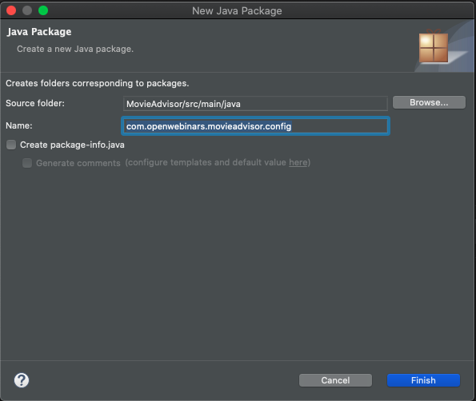
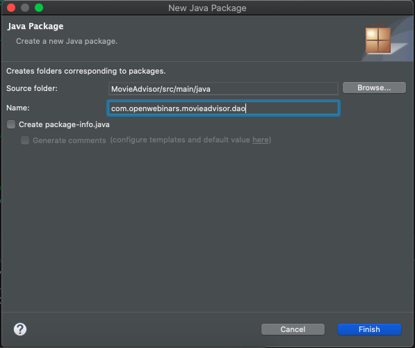
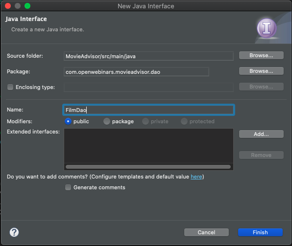
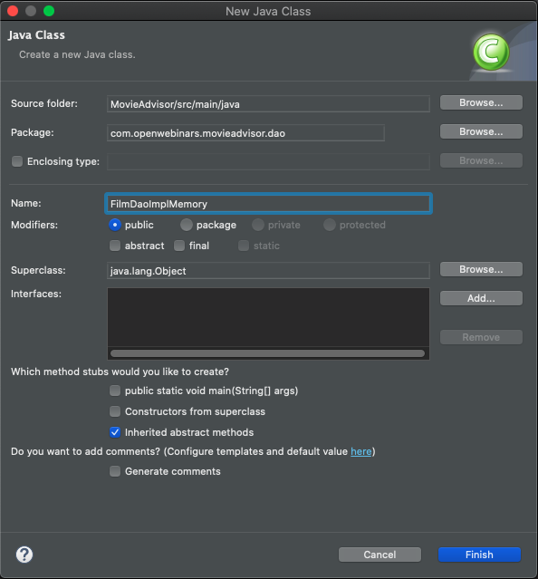
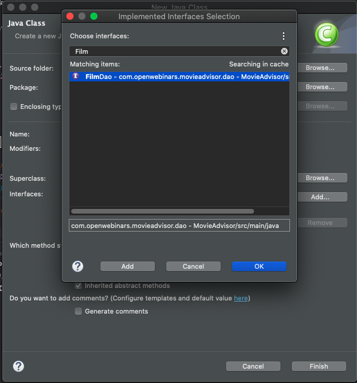
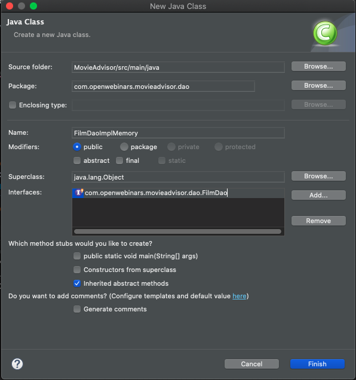
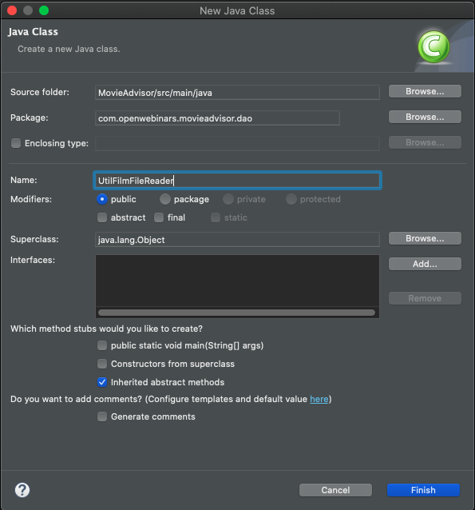
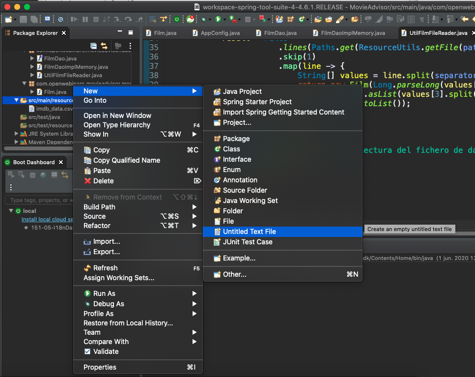
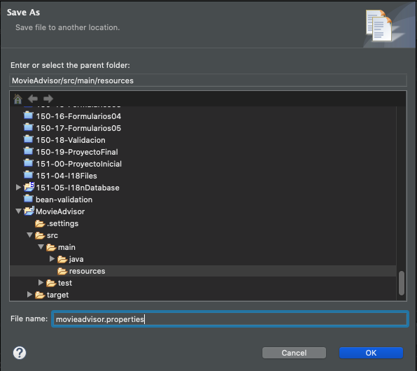
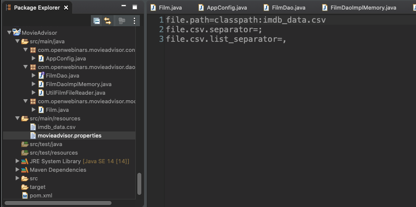

# 6. Ejemplo práctico - MovieAdvisor 71m

* 20 Introducción a MovieAdvisor 7:46 
* 21 Creación del proyecto y modelo de datos 5:49 
* 22 Repositorio y acceso a datos (Parte I) 12:55 
* 23 Repositorio y acceso a datos (Parte II) 9:30 
* 24 Servicios 13:28 
* 25 Ejecución de la app 22:28 
* Contenido adicional 1

# 20 Introducción a MovieAdvisor 7:46 

[PDF 6-1_Proyecto_de_ejemplo.pdf](pdfs/6-1_Proyecto_de_ejemplo.pdf)

## Resumen Profesor

No existe.

## Transcripción


Vamos a finalizar nuestro curso de Spring Core con una sucesión de lecciones en la que iremos construyendo poco a poco una aplicación sencilla, pero que integre la mayoría de los conceptos con los que hemos trabajado a lo largo del curso. A este proyecto lo vamos a llamar MovieAdvisor y va a ser un sencillo recomendador de películas.


Vamos a trabajar con un fichero que es fácilmente descargable, yo lo he tuneado un poco, con datos de casi todas las películas de la historia. Gracias [IMDB](https://www.imdb.com/) por ofrecer estos datos. 

Lo que vamos a desarrollar es una herramienta de línea de comandos, veremos después que sintaxis queremos tener a la hora de invocarla, aunque nosotros fuera por no emborronar un poco lo mismo invocaremos directamente desde Eclipse.

Los datos los tendremos en un fichero CSV que hemos procesado y que lo tendréis disponible en el código fuente y que para cada película tiene asignado un `id` identificador, `title` en idioma original, `year` año y `genres` una sucesión separada por comas de los géneros en los cuales podemos enmarcar esa película, cómo vemos el separador de datos de columnas sería (`;`) como separador de géneros tendríamos la coma (`,`) para hacer de separador dentro de esa columna.


```txt
id;title;year;genres
9;Miss Jerry;1894;Romance
147;The Corbett-Fitzsimmons Fight;1897;Documentary,News,Sport
229676;Reproduction of the Corbett and Fitzsimmons Fight;1897;Documentary,News,Sport
138342;O Campo Grande;1898;Documentary
138349;O Carnaval em Lisboa;1898;Documentary
138759;A Rua Augusta em Dia de Festa;1898;Documentary
138774;Saída dos Operários do Arsenal da Marinha;1898;Documentary
221032;Branding Cattle;1898;Documentary,Sci-Fi
221040;Buck Dance, Ute Indians;1898;Documentary
235357;Dressing Paper Dolls;1898;Documentary
236940;69th Regiment Passing in Review;1898;Documentary
237775;The Startled Lover;1898;Romance
138382;O Cortejo da Procissão da Senhora da Saúde;1899;Documentary
...
```


El diagrama de clases completo de nuestra aplicación va a ser este, si quisiéramos solamente plasmar en el diagrama el modelo de nuestra aplicación sería muy sencillo, porque sería tan solo una clase la clase `Film`. La clase película que va a guardar los datos de una película cómo lo hemos visto antes, el id, el título, el año de estreno y una lista con los géneros que incluye.

Sin embargo hemos querido poner un diagrama de clases del diseño donde se ven todas las demas clases e interfaces que van a intervenir para ver quien usa quien y por ende ver quien tiene una dependencia con quien, entonces el diagrama cobra un poco más de sentido y aunque no es extremadamente complejo, pero si es verdad que tenemos que ver cómo lo podemos interpretar.

Como punto de entrada quién tendrá el método main, será la clase `MovieAdvisorApp` si bien esta clase será algo de "cascarilla" ya que simplemente lo que hará será cargar el contexto y lanzar el método `run` quien tendrá la clase `movieAdvisorRunApp` quien será el que tenga el algoritmo de la aplicación, el que es capaz de procesar los argumentos, verificar si la sintaxis es correcta e invocar a los distintos servicios.

Como decíamos la clase `MovieAdvisorApp` que es la que tiene el método `main`, lo que hace es cargar el contexto para ello,  vamos a utilizar la configuración mixta de Java Config con anotaciones, entonces tendrá que usar la clase `AppConfig` para cargar ese contexto.

Además la clase `MovieAdvisorRunApp` en el caso de que queramos visualizar la ayuda, por crear otro componente más tenemos la clase `MovieAdvisorHelp` que será la encargada de cargar desde un fichero de texto, la sintaxis de la ayuda, para que la podamos imprimir por consola. 

A partir de `MovieAdvisorRunApp` esta clase, esté bean que tiene el algoritmo nuclear de la aplicación, va a jugar con dos servicios, uno de ellos, para que veas que podemos crear tranquilamente sobre una clase se llama `FilmService` digamos que un servicio de alto nivel, con operaciones bastante de alto nivel, con alto nivel nos referimos de abstracción, es decir que directamente nos da la posibilidad de obtener las películas que tengamos en nuestro almacén de datos, por una serie de criterios.

Y por otro lado tenemos la interfaz `FilmQueryService` implementada por la clase `FilmQueryServiceImpl` que nos va a permitir definir consultas algo más compleja sobre nuestro almacén de datos. 

Ambos servicios `FilmService` y `FilmQueryService` utilizan la interfaz `FilmDao` que es de alguna manera el contrato sobre nuestro repositorio, que en este caso lo vamos a implementar en memoria con `FilmDaoImpMemory` y que será la que almacenará todos estos datos, veremos como esto lo cargamos desde el fichero a través de un método estático, que será la encargada de leer este fichero modelo.

Y como es natural la interfaz `FilmDao` utiliza nuestro modelo `Film`.

Vamos a ponernos manos a la obra, vamos a ver qué sintaxis vamos a utilizar para poder luego implementarla de manera correcta. 


La idea que nosotros pudiéramos empaquetar esta aplicación en un `JAR` y pudiéramos proporcionarle una serie de opciones, la primera opción más sencilla sería listar los géneros diferentes (`-lg`) de todas las películas que tenemos, por si queremos saberlo y utilizarlo como criterio de búsqueda más adelante. 

A partir de aquí podemos utilizar cuatro opciones distintas que serían `-ag` es decir que la película incluya o pertenezca a alguno de los géneros que se listen, podríamos poner más de uno separado por comas, siempre y cuando no tenga un espacio.

`-tg` que en lugar de indicar que la película pertenece a algún género, la película tiene que pertenecer a todos los géneros que incluyamos.


Otro parámetro que se podría añadir serían `-y año` para ver películas estrenadas en dicho año.

O bien `-b desde,hasta` para ver las películas estrenadas en un intervalo, con un año de inicio y de fin.

Y la opción de de un título `-t titulo`, el decir que el título de la película contenga la cadena de caracteres que nosotros proponemos aquí, siempre sin espacio.

Por último la opción `-h` que mostrara el mensaje de ayuda.

Ya digo una aplicación que es sencilla, aunque si es nuestro primer proyecto Spring completo tendrá una complejidad media y además haremos un buen uso del API Strem de Java 8, para poder hacer los filtrados, las búsquedas, los mapeo, etcétera etcétera. 

# 21 Creación del proyecto y modelo de datos 5:49 

## Resumen Profesor

No existe.

## Transcripción

Vamos a continuar creando todo el esqueleto de nuestro proyecto de ejemplo para que podamos empezar a codificarlo, para ello al igual que en otras ocasiones vamos a crear un nuevo proyecto Maven.


Podemos evitar el uso de cualquier arquetipo porque no lo vamos a necesitar.


Recordemos que Eclipse a la hora de crear los proyectos con Java 5, tenemos que cambiar para qué en lugar de Java 5 podamos usar Java 8.


También debemos cambiarlo en Java Compiler.


A partir de aquí vamos a comenzar a códificar nuestra aplicación.

Vamos a incluir en el `pom.xml` la dependencia que necesitamos.

*`pom.xml`*

```html
<project xmlns="http://maven.apache.org/POM/4.0.0" xmlns:xsi="http://www.w3.org/2001/XMLSchema-instance" xsi:schemaLocation="http://maven.apache.org/POM/4.0.0 https://maven.apache.org/xsd/maven-4.0.0.xsd">
  <modelVersion>4.0.0</modelVersion>
  <groupId>com.openwebinars</groupId>
  <artifactId>MovieAdvisor</artifactId>
  <version>0.0.1-SNAPSHOT</version>
  <name>MovieAdvisor</name>
  <description>Un gran recomendador de películas</description>
  
  <dependencies>
		<!-- https://mvnrepository.com/artifact/org.springframework/spring-context -->
		<dependency>
			<groupId>org.springframework</groupId>
			<artifactId>spring-context</artifactId>
			<version>5.2.6.RELEASE</version>
		</dependency>
		<!-- Necesaria por usar Java 14 -->
		<dependency>
			<groupId>javax.annotation</groupId>
			<artifactId>javax.annotation-api</artifactId>
			<version>1.3.2</version>
		</dependency>
	</dependencies>
</project>
```

Recordar que podemos buscar la dependencia en [Maven Repository](https://mvnrepository.com/) y buscar `spring context`.

Estupendo ya la tenemos, lo siguiente que podríamos hacer de una manera sencilla sería incluir dentro de nuestra carpeta `resources` el fichero con todos los datos de las películas que hemos visto antes, el archivo se llama `imdb_data.csv` y pesa 16MB porque son muchísimos los registros que tiene millones de películas, al incluir aquí directamente ya lo tendríamos disponible en nuestro proyecto. Incluso si lo queremos abrir desde aquí lo podríamos abrir con el con el editor de texto.


Lo que es interesante que conozcamos su estructura y hemos visto que tiene un Id, un título, el año de estreno y que también tiene un listado con los diferentes géneros que conforman o los géneros a los que pertenece la película.

Vamos a crear nuestra clase que represente esa entidad, hasta ahora no nos hemos preocupado mucho en los proyectos anteriores de la estructuración en paquetes, porque realmente tampoco hemos tenido ninguna aplicación compleja, aunque aquí vamos a hacer más grande la parte práctica, sí lo vamos a estructura.

Vamos a crear un nuevo paquete llamado `com.openwebinars.movieadvisor.model`


Dentro de este package vamos a crear nuestra nueva clase `Film`.


Nuestra clase `Film` va a tener un `id` de tipo `long`, `title` de tipo `String`, `year` de tipo `String` por no complicarnos el manejo de fechas si usamos el manejo de fecha anterior a Java 8 o el manejo de fechas en Java 8, otra librería como [Joda Time](https://www.joda.org/joda-time/) por eso lo guardaremos dentro de una cadena de caracteres y si después tenemos que hacer algún tipo de transformación la podemos hacer y por último tendríamos el listado de los generos de tipo `List<String>`.

Como se trata de una clase de las de manual, vamos a crear su constructor vacío y otro constructor con los parámetros, generar getter y setter, hashcode, equals, toString, lo típico que podríamos necesitar de de una clase modelo.

Aunque tambén podríamos utilizar alguna otra variante o usar [Lombok](https://projectlombok.org/) por ejemplo, que nos permiten no incluir todo lo anterior. Aquí hemos optado por autogenerarlo con Eclipse que para el caso es lo mismo. Nuestra clase `Film` queda así:

*`Film.java`*

```java
import java.util.List;

/**
 * 
 * La clase modelo que articula el programa. Permite
 * manejar la información mínima sobre una película.
 * Si hubíeramos utilizado Spring Data y una base de datos, 
 * seguramente estaría anotada con @Entity 
 * 
 * 
 * @author OpenWebinars
 *
 */
public class Film {
	
	private long id;
	private String title;
	private List<String> genres;
	private String year;
	
	public Film() { }

	public Film(long id, String title, String year, List<String> genres) {
		this.id = id;
		this.title = title;
		this.genres = genres;
		this.year = year;
	}

	public long getId() {
		return id;
	}

	public void setId(long id) {
		this.id = id;
	}

	public String getTitle() {
		return title;
	}

	public void setTitle(String title) {
		this.title = title;
	}

	public List<String> getGenres() {
		return genres;
	}

	public void setGenres(List<String> genres) {
		this.genres = genres;
	}

	public String getYear() {
		return year;
	}

	public void setYear(String year) {
		this.year = year;
	}

	@Override
	public int hashCode() {
		final int prime = 31;
		int result = 1;
		result = prime * result + ((genres == null) ? 0 : genres.hashCode());
		result = prime * result + (int) (id ^ (id >>> 32));
		result = prime * result + ((title == null) ? 0 : title.hashCode());
		result = prime * result + ((year == null) ? 0 : year.hashCode());
		return result;
	}

	@Override
	public boolean equals(Object obj) {
		if (this == obj)
			return true;
		if (obj == null)
			return false;
		if (getClass() != obj.getClass())
			return false;
		Film other = (Film) obj;
		if (genres == null) {
			if (other.genres != null)
				return false;
		} else if (!genres.equals(other.genres))
			return false;
		if (id != other.id)
			return false;
		if (title == null) {
			if (other.title != null)
				return false;
		} else if (!title.equals(other.title))
			return false;
		if (year == null) {
			if (other.year != null)
				return false;
		} else if (!year.equals(other.year))
			return false;
		return true;
	}

	@Override
	public String toString() {
		return "Film [id=" + id + ", title=" + title + ", genres=" + genres + ", year=" + year + "]";
	}
}
```

Teniendo este modelo ya tenemos ya tenemos todo lo necesario para poder empezar desde abajo hacia arriba, es decir vamos a empezar a codificar primero la parte de los DAO, para poder rescatar los datos, a partir de ahí iremos subiendo hacia los servicios, etcétera etcétera y lo vamos a ir haciendo poco a poco en las siguiente lecciones.

# 22 Repositorio y acceso a datos (Parte I) 12:55 

## Resumen Profesor

No existe.

## Transcripción

Vamos a continuar con nuestro proyecto MovieAdvisor, vamos a crear un nuevo paquete que va a contener la configuración de la clase o clases de configuración, en nuestro caso será solamente una, pero podríamos tener más de una clase. Para ello creamos el paquete `com.openwebinars.movieadvisor.config` 



Aquí creamos una nueva clase que llamaremos `Appconfig`


Debemos indicar que es una clase de configuración con la anotación `@Configuration` ya que estamos usando Java Config, también vamos a indicar que vamos a escanear los componentes indicando el paquete base con `@PropertySource("classpath:/movieadvisor.properties")` escaneará todos los beans que se encuentren en este paquete o por debajo, esto nos va a permitir un sistema de configuración mixto de Java Config con Anotaciones. Por ahora esto es todo lo que necesitamos.

*`AppConfig.java`*

```java
package com.openwebinars.movieadvisor.config;

import org.springframework.context.annotation.ComponentScan;
import org.springframework.context.annotation.Configuration;

@Configuration
@ComponentScan(basePackages="com.openwebinars.movieadvisor")
@PropertySource("classpath:/movieadvisor.properties")
public class AppConfig {

}
```

Ahora vamos a crear la interfaz DAO para poder trabajar con un repositorio de Film, vamos a crear un nuevo paquete `com.openwebinars.movieadvisor.dao`



y dentro de este paquete vamos a crear una nueva interfaz llamada `FilmDao`



Esta interfaz va a tener los métodos que debería implementar cualquier clase que quiera ser un DAO de películas.

Van a ser métodos sencillos, clásicos, como poder buscar una película por su Id, devolver todas las películas en una colección de esta manera no nos casamos tanto con las listas. Podríamos incluso plantearnos un iterable si la estructura que tuvieramos en memoría fuera diferente, de todos modos usar una lista tampoco supondría ningún problema. Y aun que no lo haremos desde aquí por que esta aplicación no se va a dedicar a gestionar películas por si acaso necesitamos más adelante incluiremos las opciones de insertar, editar y borrar. Esta sería nuestra interfaz.

*`FilmDao`*

```java
package com.openwebinars.movieadvisor.dao;

import java.util.Collection;

import com.openwebinars.movieadvisor.model.Film;

/**
 * Interfaz que nos indica las posibles acciones que podemos
 * realizar con un repositorio de Film.
 */
public interface FilmDao {
	
	public Film findById(long id);
	public Collection<Film> findAll();
	public void insert(Film film);
	public void edit(Film film);
	public void delete(long id);

}
```

Ahora vamos a crear una clase que implemente en memoria, que sea capaz de cargar el fichero en memoria y que nos permita tener todas las películas.

Vamos a crear una nueva clase llamada `FilmDaoImplMemory` 



Si pulsamos en `Add` podemos indicar la interfaz que queremos implementar





Esto nos inserta la estructura de los métodos que debemos implementar por la implementación de `FilmDao`

*`FilmDaoImplMemory`*

```java
package com.openwebinars.movieadvisor.dao;

import java.util.Collection;

import com.openwebinars.movieadvisor.model.Film;

public class FilmDaoImplMemory implements FilmDao {

	@Override
	public Film findById(long id) {
		// TODO Auto-generated method stub
		return null;
	}

	@Override
	public Collection<Film> findAll() {
		// TODO Auto-generated method stub
		return null;
	}

	@Override
	public void insert(Film film) {
		// TODO Auto-generated method stub

	}

	@Override
	public void edit(Film film) {
		// TODO Auto-generated method stub

	}

	@Override
	public void delete(long id) {
		// TODO Auto-generated method stub

	}

}
```

Ademas de lo que pone vamos a necesitar una lista de películas usando el operador diamont de Java 7. 


```java
public List<Film> pelicula = new ArrayList<>();
```

Tambien indicaremos que este es un bean anotandolo con la anotación `@Repository`

Como esto es un bean, podemos usar el ciclo de beans para poder cargar todas las películas desde algún sitio. Lo haremos en un método `init()`.
 
```java
public void init() {
   // peliculas = ....
}
 ```
 
Para ello vamos a crear una nueva clase, en este caso no lo voy a crear como un bean, sino que lo voy a dejar para que lo podáis hacer vosotros, que sería la encargada de cargar o de procesar el fichero, la clase se llamará `UtilFilmFileReader` dentro del paquete `com.openwebinars.movieadvisor.dao`, va a ser una clase con un método estático.  



Si alguien quiere, se podría transformar esto en un bean que pudiera ser capaz de leer el fichero. Está separación es porque este implementación del DAO es en memoria, es decír sabe que lo va a tener, pero no sabe de dónde surgen los datos. Si lo hiciera con otro bean los datos podrían surgir de otro sitio que no fuese un fichero `csv` eso también lo dejo para que ustedes puedan tener cancha.

En este caso vamos a crear un método estatico `readFile` que va a devolver una lista de películas, podriamos ponerla también como colección, va a recibir tres argumentos `path`, `separator` y `listSeparator`. Ahora veremos que los podemos colocar en el fichero de properties que vamos a crear.

`public static List<Film> readFile(final String path, final String separator, final String listSeparator) {`

Dentro de nuestro método `readFile` vamos a usar un esquema clásico para que no nos de problemas.

```java
List<Film> result = new ArrayList<>();

return result;
```

En medio de esto podemos códificar todo lo necesario, vamos a añadir el `// @formatter:off` y `// @formatter:on` porque vamos a incluir el uso de API Stream y expresiones lamdas para que no la reformatea a Java. Si nos perdemos en esta parte repasar el curso de Java 8 donde se explica con abundancia en cómo trabajar con fichero y el cómo usar el API Streams y expresiones lambdas. 

Nosotros queremos a través de la clase `Files` usar el método `lines` que nos devuelve un Stream de Strings, es decir va ir leyendo línea a línea el fichero y lo va a devolver dentro de un Stream. El `Path` lo tenemos que proporcionar nosotros que es uno de los argumentos que recibimos, pero para poder cargar convenientemente el fichero en lugar de acceder vía el sistema de ficheros lo vamos a hacer a través de la clase `ResourceUtils.getFile(path)` que va a cargar de una más conveniente este fichero, esto lo devuelve como un tipo que no podemos utilizar por eso lo transformamos a una URI con `.toURI()` que nos será más útil para poderlo usar. Todo lo explicado aquí equivale a la línea:

`result = Files.lines(Paths.get(ResourceUtils.getFile(path).toURI()))`

A partir de aquí si hemos visto el fichero nos vamos a querer saltar la primera línea, es la que tiene el encabezado para lo cual usamos 

`.skip(1)`

y bueno vamos a querer procesar este CSV para ir transformandolo todo en un listado de películas, para ello usamos el método `map()` vamos a querer que en cada línea se haga una transformación, como es algo compleja la vamos a dejarla vacía por ahora:

```java
.map(line -> {

})
```

y por último lo vamos a querer recoger todo en un listado que almacenaremos en `result`:

```java
// @formatter:off
result = Files.lines(Paths.get(ResourceUtils.getFile(path).toURI()))
     .skip(1)
     .map(line -> {
		
     }).collect(Collectors.toList());
// @formatter:on
```

y ahora ya nos podemos centrar en el mapeo, que queda asi:

```java
.map(line -> {
     String[] values = line.split(separator);
     return new Film(Long.parseLong(values[0]), values[1], values[2], Arrays.asList(values[3].split(listSeparator)));
})
```

Cada línea del fichero incluye todos los datos de una película, lo que tenemos que hacer es "splitiarlos" es decir trocearlos, por el separador que utilizamos, que en primera instancia es el punto y coma (;), esto nos devolverá un array de Strings el cual ammacenamos en `values`. Por lo que en `value[0]` tendríamos el `id` (como String) pero nosotros lo declaramos como `long` por lo que tendíamos que hacer un cast `Long.parseLong(values[0])`, en `value[1]` tendríamos el título de la película, en `value[2]` tendríamos el año de la película (como String) y en el último `value[3]` tendríamos el listado con los generos, por lo que si queremos obtener cada uno de ellos tendriamos que "splitiarlos" por la coma que es el separador de los generos, `Arrays.asList(values[3].split(listSeparator))` y lo que hacemos es construir con `Arrays.asList` una lista de Strings con cada uno de los generos. Todo esto se lo pasamos al constructor con parámetros `Film(...)` y es lo que devolvemos, por cada línea devolvemos un objeto `Film`.


```java
// @formatter:off
result = Files.lines(Paths.get(ResourceUtils.getFile(path).toURI()))
   .skip(1)
   .map(line -> {
	String[] values = line.split(separator);
	return new Film(Long.parseLong(values[0]), values[1], values[2], Arrays.asList(values[3].split(listSeparator)));
   }).collect(Collectors.toList());
// @formatter:on
```

Este bloque leerá línea a línea el fichero y procesara todas las películas almacenandolas en el listado.

Pero se nos obliga a que pongamos un bloque try catch sobre el bloque, porque tenemos posibilidad de tener algún problemilla a la hora de leer el fichero o a la hora de cualquier cosa, podríamos indicar un mensaje de error y con `System.exit(-1)` podemos indicar que hemos salido de manera erronea de la aplicación.

El código completo de nuestra clase `UtilFilmFileReader` es el siguiente:

*`UtilFilmFileReader`*

```java
package com.openwebinars.movieadvisor.dao;

import java.nio.file.Files;
import java.nio.file.Paths;
import java.util.ArrayList;
import java.util.Arrays;
import java.util.List;
import java.util.stream.Collectors;

import org.springframework.util.ResourceUtils;

import com.openwebinars.movieadvisor.model.Film;

/**
 * Clase de utilidad, que incluye un método estático para la lectura
 * y procesamiento del fichero CSV que incluye todos los datos.
 * 
 * PROPUESTA: ¿Serías capaz de cambiar el código necesario para
 * que fuera un bean?
 *
 */
public class UtilFilmFileReader {

	public static List<Film> readFile(final String path, final String separator, final String listSeparator) {
		List<Film> result = new ArrayList<>();


		try {
			// @formatter:off
			result = Files
						.lines(Paths.get(ResourceUtils.getFile(path).toURI()))
						.skip(1)
						.map(line -> {
							String[] values = line.split(separator);
							return new Film(Long.parseLong(values[0]), values[1], values[2], 
									Arrays.asList(values[3].split(listSeparator)));
					}).collect(Collectors.toList());
 			// @formatter:on


		} catch (Exception e) {
			System.err.println("Error de lectura del fichero de datos: imdb_data");
			System.exit(-1);
		}

		return result;

	}

}
```

Teniendo completa nuestra clase `UtilFilmFileReader` ya podríamos devolver el listado y lo podemos rescatar en el método `init()` de nuestro bean `FilmDaoImplMemory` que dejamos a medio construir:

```java
public void init() {
   // peliculas = ....
}
```

Esto lo cambiamos por :

```java
public void init() {
   peliculas = UtilFilmFileReader.readFile(path, separator, listSeparator);
}
```

Pero nos falta saber de donde vamos a recuperar el valor para cada uno de los parámetros. Lo veremos en la próxima lección

# 23 Repositorio y acceso a datos (Parte II) 9:30 

## Resumen Profesor

No existe.

## Transcripción

Vamos a continuar con nuestro ejemplo por dónde lo hemos dejado, recordemos que necesitamos estos tres valores 

```java
public void init() {
   peliculas = UtilFilmFileReader.readFile(path, separator, listSeparator);
}
```

y habíamos pensado que la mejor manera es proporcionarlo a través de un fichero de properties, para ellos nos vamos a venir a la carpeta recursos y no existe un asistente para crear un fichero de properties, con lo cual podemos usar directamente un fichero de texto.



En este fichero de texto vamos añadir tres propiedades:

```txt
file.path=classpath:imdb_data.csv
file.csv.separator=;
file.csv.list_separator=,
```

Lo salvamos con el nombre `movieadvisor.properties` en la carpeta resource.





Ahora lo que tenemos que hacerlo es cargarlo desde nuestra clase de configuración `Appconfig` usando la anotación `@PropertySource()` al cual le debemos pasar la ruta y nombre del archivo properties. 

`@PropertySource("classpath:/movieadvisor.properties")`

Y lo que vamos a hacer es lo siguiente, en lugar de que recojamos el valor directamente en los beans donde los vayamos a utilizar,  vamos a dejar que la clase `AppCpnfig` funcione algo así como una especie de componente de configuración, es decir los valores los recojeremos aquí y esta clase tendrá unos métodos getters y allá donde lo necesitemos, lo que haremos será en lugar de inyectar los valores sueltos inyectaremos la clase `AppConfig`.

Para ello creamos tres campos y con la ayuda de la anotación `@Value` y la sintaxis que tenemos para poder usar las properties les inyectamos el valor.

```java
@Value("${file.path}")
private String file;
	
@Value("${file.csv.separator}")
private String separator;

@Value("${file.csv.list_separator}")
private String listSeparator;
```

Y ahora lo que hacemos es crear los métodos getters para estas 3 propiedades.

```java
public String getFile() {
   return file;
}
	
public String getSeparator() {
   return separator;
}
	
public String getListSeparator() {
   return listSeparator;
}
```

Nuestra clase `AppConfig` completa es:

```java
package com.openwebinars.movieadvisor.config;

import org.springframework.beans.factory.annotation.Value;
import org.springframework.context.annotation.ComponentScan;
import org.springframework.context.annotation.Configuration;
import org.springframework.context.annotation.PropertySource;

@Configuration
@ComponentScan(basePackages="com.openwebinars.movieadvisor")
@PropertySource("classpath:/movieadvisor.properties")
public class AppConfig {
	
   @Value("${file.path}")
   private String file;
	
   @Value("${file.csv.separator}")
   private String separator;
	
   @Value("${file.csv.list_separator}")
   private String listSeparator;
	
   public String getFile() {
      return file;
   }
	
   public String getSeparator() {
      return separator;
   }
	
   public String getListSeparator() {
      return listSeparator;
   }
	
}
```

De esta manera cuando queramos utilizar los valores de configuración simplemente inyectamos la clase `AppConfig` y ya podemos usar los valores de las propiedades. Volvemos a nuestra clase `FilmDaoImplMemory` para completar el método `init()`.


```java
@Autowired
private AppConfig appConfig;
	
public void init() {
   peliculas = UtilFilmFileReader.readFile(appConfig.getFile(), appConfig.getSeparator(), appConfig.getListSeparator());
}
```

De esta manera desde las properties hemos ido pasando a través de la clase `AppConfig` hasta el método `readFile(final String path, final String separator, final String listSeparator)` que hemos programado en la clase `UtilFilmFileReader` para que reciba los valores necesarios para recuperar los datos y recuperar una lista de películas.

Nos quedaría implementar nuestra clase DAO `FilmDaoImplMemory` que ahora mismo esta vacía por completo.

Usando el API Stream y usando la lista de películas que ya recuperamos en `peliculas` en el método `init()`, vamos a empezar por códificar el método `findById(long id)`.

¿Cómo vamos a lograr que nos devuelva una película por Id de la lista de películas?

* Lo que hacemos es transformar el listado `peliculas` en un Stream con `.stream()`
* Filtramos y nos quedamos con el `id` que le indiquemos usando `.filter(f -> f.getId() == id)`, sabemos que no existen ids repetidos.
* Pedimos que nos devuelva la primera con `.findFirst()` que nos devuelve un `Optional`

Como queremos evitar un `Optional` para no hacer más compleja nuestra aplicación, lo que hacemos es que si ha encontrado el primero en `result` tendremos el valor y sino retornamos `null`.

```java
public Film findById(long id) {
		
   // @formatter:off
   Optional<Film> result = peliculas
				.stream()
				.filter(f -> f.getId() == id)
				.findFirst();
   // @formatter:on
		
   return result.orElse(null);
		
}
```

hasta este método que hemos programado bueno pues tanto la ruta como los valores las expresiones regulares que va utilizar split a la hora de separar el fichero nos quedaría implementar nuestra clase dado que ahora mismo está vacía por completo y si parece p**** alargar más lo voy poco a poco copiando el código y explicando cómo funciona haría y me detengo allá donde bueno pues sea algo más usando el app y stream y a través de la lista de película los métodos de búsqueda pues eran parecidos a este también podemos utilizar si queréis expresiones estupendo cómo vamos a conseguir que nos devuelva una película por dentro de esta lista bueno pues vamos sin tramo y nos quedamos con aquella no vamos a tener ningún y de repetir pues algo así con una clave primaria con lo cual nos quedaríamos solamente con una aún así pues le pedimos que nos devuelva la primera y este método de Friends no te vuelven no cenar queremos evitar el uso de opcional tampoco por no hacer más complejas nuestra aplicación bueno pues devolvemos si he encontrado el primero tendrá el valor y si no pues devolvemos el resto de métodos algunos son muy sencillos aquí lo único que tenemos que hacer devolver todas las películas el listado completo a la hora de insertar pues también podemos hacerlo sencillos y bueno para editar y borrar vamos a crear un nuevo método esta vez sí me voy a parar un poco a crear el código para que lo podáis ver cómo crear un método privado que sea capaz de devolvernos el índice de una ver una película dentro del listado en base a sweet algoritmo de búsqueda muy sencillo nada eficiente pero bueno que nos puede ilustrar de conocerlo y el index menor que bueno si la película el índice en una búsqueda lineal de las de toda la vida ese live quiero decir que lo hemos encontrado y en otro caso para devolver bueno pues devolvemos si encontrado = true devolvemos el índice y en otro caso de volvemos menos 1 vale de esta manera podríamos trabajar ahora con el método edit vale que nos permita este es tan sencillo que lo vamos a copiar buscar el índice en base al Lidl que no debería cambiar un crédito en la película y si el índice es distinto de menos 1 o lo que hacemos cambiar el elemento que hay en ese índice por la nueva película y en el caso de ritmo pues no prácticamente igual pero en lugar de si ese índice realmente aquí si quisiéramos podríamos utilizar directamente el índice de esta manera vamos a comprar un poco si existe o no existe no bueno pues con esto tenemos nuestra clase lado implementada tenemos toda nuestra capa de repositorio implementada en el siguiente vídeo vamos a crear los diferentes servicios que lo van a utilizar

```java
```


# 24 Servicios 13:28 

## Resumen Profesor

No existe.

## Transcripción

vamos a continuar desarrollando nuestra aplicación ya que tenemos montado y desmontado en la parte del lado del repositorio vamos a crear los servicios necesarios y recordar y el diagrama de clase y vamos a crear los servicios 1 más de 80 de alto nivel y otro que nos va a permitir generar la consulta que nosotros vamos a empezar service para el servicio creamos una nueva interfaz que se va a llamar film query service y a la hora de diseñar la vamos a aplicar algo parecido al patrón builder en el caso del patrón builder cuando cuando para generar un objeto para construirlo se requieren de mucho mucho mucho parámetros constructor no suele ser operativa y elegante entonces se suele construir en alguna ocasión una clase estática interna que no ayuda a construirlo en definitiva lo que va haciendo es que los métodos de esa clase van devolviendo una referencia a la propia clase para que podamos encadenar diferentes llamada esto es lo que vamos a seguir este esquema el que vamos a seguir en este en este servicio de manera que podamos encadenar llamada a más de un método para ir con jugando la consulta tal y cual si fuera una consulta SQL donde pusiéramos diferentes condiciones y pusiéramos el operador en medio vale si os dais cuenta os he pegado a kilómetros que vamos a tener la opción es que veíamos en la sintaxis para buscar algún género todos los géneros en la película pertenezcan a todos los géneros que se proporcionen las películas de un año en particular película en un intervalo de años o que el título contenga esta cadena de caracteres lo que haríamos sería y llamando a uno varios métodos cadenado de estos tengo que tengo aquí y finalmente para que se ejecutará la consulta llamamos al método ese que nos devolvería la colección de películas que cumple con las condiciones que nosotros hemos expuesto vamos a crear el servicio query service y que va a implementar ya tenemos por aquí y bueno parece normal que necesitemos nuestro lado auto inyectado para que lo podemos lo podamos bueno como vamos a hacer para implementar pues vamos a tirar de lo que sabemos de Java 8 y de la interfaz predicar vamos a crear aquí un predicado de sin inicializar mediante el método INE la vamos a inicializar anotación correspondiente y ahora lo que vamos a hacer es en los diferentes métodos que devuelven parte de la consulta vamos a ir añadiendo sobre el predicado vale pues la consulta que quiere realizar el sueño por ejemplo si queremos que la película tenga algo género lo que podríamos crear aquí es otro predicado en el que lo que diríamos es oye pues sí para hacerlo como a tirar un poco más de ingenio me voy a permitir que os con el código directamente prédica oye si la película que la pasamos como argumento alguno de su género está contenido vale dentro del velarray de géneros que nosotros proporcionamos aquí estuvimos con los géneros que nos proporciona el usuario y vemos si alguno coincide con los géneros que tenemos dentro de la película haciendo algo así una especie de intersección en el caso de que alguno pues vale el predicado se daría por bueno y se varía como como verdad y en caso contrario pues si me intersecciones vaciar sería falso lo que hacemos aquí es bueno siempre picado porque sea la primera vez que lo hayamos invocada entonces directamente y si no lo que hacemos es sobre el predicado que tenemos definido como argumento de la clase de servicio le añadimos este que acabamos de definir con una por lo cual se evaluará como decía devolvemos el puntero this para que podamos encadenarlo con la llamada a otro método BT servicio os voy copiando parte del código para que veáis este es muy parecido en lugar de utilizar anymatch de string a que utilizamos ALLMAX pero el esquema exactamente el mismo aquí solamente devolverá verdad sí bueno pues existe un solapamiento completo entre el que acabamos de crear con los géneros que hemos proporcionado y los géneros de la película decir si son exactamente los los mismos están contenidos todos con lo cual lo devolveremos de mañana para buscar el año paren las películas por el año fue la búsqueda quizá sea más sencilla y es hemos hecho con un string podemos utilizar la comparación de si son exactamente iguales vale pues el año será el mismo y en ese caso bueno pues también seguiremos contando y predicado si es nulo inicialmente el predicado es el año y si no hacemos un para el caso del between el predicado va a ser un poco más complejo porque bueno vamos a para hacer una comparación buena y válida siempre de aquí vamos a tirar de fechas dejaba por eso es el predicado más contigo lo que hacemos es crear una fecha a partir del año from y otra del año tú vale para evitar que tengamos problemas por un día el año desde el cual vamos a contar lo creamos desde el 1 de enero vale supongamos que el año 1990 sería desde el 1 de enero de 1990 y el año de comparación finalen una fecha que sería el 2 de enero lo que podemos hacer después compras y el año de la película es la fecha de la película después que el intervalo intervalo y antes de la parte derecha del intervalo con lo cual si está en medio es que está incluido y se va María como verdad al igual que antes fue lo añadimos al predicado con una o dos establecemos si es la opción por defecto y el de contener el título sería un predicado francamente Santi que no en el cual bueno pues lo que hacemos es comparar si es verdad que pasamos la cadena a minúsculas todo para para evitar los problemas de Racing y de esa manera podríamos comparar si el título en minúsculas contiene la cadena de caracteres minúsculas nosotros nos proporciona la última parte que nos quedaría de este servicio sería el método ese que es realmente el que se encarga de ejecutar la consulta no sería nada complejo ya que digamos que la lógica complicada es la que hemos definido para que respeten nuestro formateo bueno y aquí tendríamos que devolver sobre el dado mainol que lo convierta en un mes y que una vez que lo pongo abierta siempre por el predicado qué será sencillo o complejo pues ya tendríamos directamente nuestra colección filtrada por el predicado ya sea sencillo o complejo que como decimos como a crear también otro servicio en este caso se llama filservis Mané y este fin service tendrá alguno elemento bueno pues de más alto nivel una clase en este caso si voy a para copiar el código porque sería más sencillo y explicar cómo anécdota decir que este servicio para utilizar el anterior también para algunos de sus métodos y bueno nos quedaría a poder utilizar al implementar un método que seríaesta clase va a ser Santillán necesitamos tanto el dado para hacer esta operación es sencilla como el servicio de consulta porque de esta manera podemos primero de todo vimos en la cinta así que había unos 100 de listar todos los géneros la podemos hacer sobre el propiedad tiramos también de lo que sabemos de Landa y de Steam estamos todas las películas nos quedamos con los géneros a través de un flashmob los unimos todos los géneros aplicamos distintos y para que aparezcan en orden alfabético con los ordenamos y lo devolvemos como lista para que puedan ser pintados vale sería así y bueno ofrecemos la operaciones de alto nivel que no serían acumulada no necesitaríamos el servicio encontrar solamente por algún género por todos los géneros por año en un intervalo de años y que contenga cómo podéis comprobar esto es sencillo porque solamente utiliza nuestro servicio de consulta llama uno de los métodos y directamente ejecuta dicha consulta este servicio lo tendríamos aquí preparado por si además de hacer una aplicación de escritorio quisiéramos utilizar nuestros servicios para crear un servicio web o una aplicación web no tendríamos que ir montando las consultas sino que ya las tendríamos que esa manera es puerta de una forma más sencilla con esto terminamos el apartado de los servicios y nos lanzamos de lleno a terminar de crear la última lógica de la aplicación recogida de argumento y la invocación de los pies


# 25 Ejecución de la app 22:28 

## Resumen Profesor

No existe.

## Transcripción

# Contenido adicional 1

[PDF 6-1_Proyecto_de_ejemplo.pdf](pdfs/6-1_Proyecto_de_ejemplo.pdf)
