# 3. Spring Web MVC - 04:26

* 09 ¿Cómo funciona una aplicación web? 13:07 
* 10 Algunos patrones de diseño 10:55 
* 11 Estructura de un proyecto web 16:28 
* 12 Conceptos de Java EE 12:25 
* 13 Controladores 21:04 
* 14 Vistas 14:10 
* 15 @RequestParam 12:42 
* 16 @PathVariable 4:30 
* 17 Recursos estáticos 10:33 
* 18 WebJars 11:33 
* 19 Creación de formularios 20:54 
* 20 Formularios de edición 15:31 
* 21 Validación de datos 21:04 
* 22 Subida de ficheros 8:12 
* 23 Servicio de almacenamiento de ficheros 6:16 
* 24 Implementación de la subida de ficheros en nuestro proyecto 22:13 
* 25 Aplicación web segura con Spring Security 13:31 
* 26 Implementación del login con Spring Security 13:25 
* 27 Manejo de sesiones con Spring Session 6:43 
* 28 Integración de Spring Session en nuestro proyecto 11:10 
* Contenido adicional 17

# 09 ¿Cómo funciona una aplicación web? 13:07 

[PDF Cómo_funciona_una_aplicación_web.pdf](pdfs/08._Cómo_funciona_una_aplicación_web.pdf)

## Resumen Profesor

### Códigos de estado HTTP

El listado completo de los códigos de respuesta vienen definidos en una serie de RFCs (*request for comments*, publicaciones del IETF), si bien lo podemos consultas completamente en castellano en la wikipedia en https://es.wikipedia.org/wiki/Anexo:C%C3%B3digos_de_estado_HTTP

### Métodos de petición

Los métodos de petición también están definidos en diferentes RFCs, pero podemos consultar la descripción en castellano de alguno de ellos en wikipedia: https://es.wikipedia.org/wiki/Protocolo_de_transferencia_de_hipertexto#M%C3%A9todos_de_petici%C3%B3n

## Transcripción

Hola a todos vamos a comenzar con el bloque de Spring web en bici y en estas primeras lecciones nos vamos a acercar al desarrollo de una aplicación web si venís de hacer el curso de Spring core habréis comprobado como allí todas las aplicaciones que habíamos desarrollado eran de escritorio de escritorio de consola nada de usar algún algún entorno como swing o algo parecido no la mayoría de vosotros también si tenéis algún tipo de estudios sobre Java y son solamente iniciales para abrir programadores o alguna aplicación algunos programitas que sean de consola no puede que sean de cierta entidad pero quiero pararme en esta serie de lesiones en el cambio que supone el hecho de programar una aplicación de consola que tiene una estructura tanto en la clase principal como como la estructura del proyecto y que maneja una serie de conceptos que es distinto bueno pues cuando vamos a trabajar con una aplicación web una aplicación web la podríamos definir como una herramienta que será que se pide a través de una red normalmente internet porque ya la intranet algunas están en desuso y que se accede a ella mediante una verdad un navegador web cuando digo que la entran están en desuso es que la gran mayoría de los servicios pues suelen estar publicado en alguna nube y no se preocupan de que la red sea físicamente o virtualmente privada no sino que todo funciona a través de usuario y contraseña o de certificado o algún algún otro elemento de autorización las ventajas de que la herramienta se acesible a través de una red bajo un esquema como el que tenemos aquí pues son bastante primero no requiere de instalación ni de actualización por el usuario nosotros como usuarios solamente necesitamos un navegador y que será el que tenemos que mantener actualizado pero no requiere nadie se tiene que instalar una aplicación web en su ordenador como tal vale sino que lo que hace es acceder a ella a través de su navegador vale de fácil acceso vale porque el Internet es totalmente democrático a día de hoy vale no estudies ponerte tanto en Europa como como en América y en países incluso emergentes que bueno pues si internet va haciendo cada vez más sensible a más personas no hay que la brecha digital cada vez es más pequeña además de ello bueno pues multiplataforma y multidispositivo y con esto de que sea de fácil acceso se unen ambos elementos no la repe Internet la aplicaciones web ya sean accesibles no solamente de un ordenador sino desde múltiples dispositivo desde ordenadores desde Mobile tablet were able vehículo vale ya tenemos cada vez más dispositivos conectados a Internet que pueden hacer uso de aplicaciones web una aplicación web normalmente ahorrará tiempo le ahorra tiempo tanto al cliente como al programador vale porque en el desarrollo ya digo que no tendremos que meter tarea de despliegue de la aplicación de instalación de mantenimiento directamente los equipos con lo cual ahorraremos tiempo también ahorraremos espacio ya que el cliente solamente tiene que tener el navegador instalado no grande aplicación instalada y también que normalmente las aplicaciones que dan pie a que se pueda colaborar a que se pueda compartir informaciones entre usuario mucho más que cuando hemos usado la aplicaciones de escritorio ventaja es que no encontramos en qué bueno normalmente se tiene menos velocidad y capacidad de procesamiento aunque cada vez esta brecha está también más cerrada no la velocidad de uso de una aplicación web que está bien programada puede que sea casi casi idéntica no tanto es así que las modas también la moda e incluso el hecho de utilizar tecnologías web en local para programar aplicaciones de escritorio no como por ejemplo con electrón


Se suele decir que tienen menos funcionalidades que aplicaciones que sean nativa por el hecho de estar menos relacionadas de manera íntima con el hardware del dispositivo solo podemos encontrar de una manera quizá más evidente en aplicaciones web que se utilizan desde móviles no hay cuál es la diferencia entre una aplicación nativa y la integración con el hardware con una aplicación web y la disponibilidad una aplicación que nosotros tengamos a día de hoy instalada en nuestro dispositivo siempre la podremos utilizar sin embargo una aplicación web si no tuviéramos internet no podríamos si bien a día de hoy la gran mayoría de aplicaciones que utilizáis por detrás se conecta Internet para algún tipo de tarea con lo cual también vería limitada su funcionalidad si no tuviera conectividad ventajas y desventajas yo creo que las ventajas superan en este caso a las desventajas y que bueno la aplicaciones web no es que sean digamos que una cosa que surge ahora sino que se llevan utilizando desde hace muchos años tantos casi como tiene el propio protocolo en el que se basa la web vale qué es el protocolo de transferencia de hipertexto el conocido como HTTP actualmente convivimos a caballo entre dos pensiones la 11 y la versión 2.0 la Virgen 2.0 cada vez se usa más pero todavía no está totalmente totalmente presente bueno pues en todos los servidores o en todas las aplicaciones pero ya digo que cada día está mal instalada no y que bueno tenemos que conocer frente a los que vengáis de hacer aplicaciones de escritorio que hTTP es un protocolo sin estados por decirlo en Roman Paladino entre una petición y la siguiente bueno el servidor como tal por si solo a través del protocolo no es capaz de recordar que es lo que hizo no y es como si tuviera un botón de reset en cada petición que recibe eso va a hacer una limitación en algunos casos pero el protocolo se diseño de esa forma para que fuera mucho más liviano y más sencillo desde otros protocolos que se manejaban estados pero que eran más COPE funciona bajo un esquema de petición y respuesta de la siguiente manera un navegador que tendremos nosotros instalado en nuestro dispositivo ordenador o un móvil hace una petición vale el esquema de la petición lo tendríamos por aquí este es digamos que la cabecera es decir el mensaje de inicio de la petición y y esa peticiones recibidas por nuestro servidor está petición de la cual podemos a ver aquí el álbum o encabezado se envía a través de nuestro navegador normalmente cuando escribimos una dirección URL en de la cual podemos a ver aquí el álbum o encabezado se envía a través de nuestro navegador normalmente cuando escribimos una dirección URL en la ya hablaremos de ellas mejor el servidor lo que va a hacer es procesarla y devolvernos una respuesta que tendrá un esquema muy similar con otra serie de información versión del protocolo código de respuesta otra serie de encabezado y el cuerpo que en definitiva lo que renderiza el navegador y nos cuenta como podéis ver esquema de petición y respuesta así es como funciona el protocolo HTTP el acceso a una aplicación web la hacemos desde un navegador y a través de su RL que no es más que un localizador una manera de ubicarla como por ejemplo tenemos aquí abajo openwebinars.net Google.com Wikipedia.org serían URL de aplicaciones web que nosotros podríamos utilizar como hemos visto y hablaremos de ello ampliamente cuando estemos desarrollando nuestros controladores como hemos visto en el esquema de petición y respuesta apareció por allí un verbo en inglés qué bueno son los métodos de petición que tiene HTTP tiene muchos lo que pasa que se suele utilizar un subconjunto pequeño de ellos sobre todo qué es y post get una petición de tipo que le va indicar al servidor que está solicitando un determinado recurso qué bien identificado por una URL y que espera que se lo devuelva porque horario vos lo que está haciendo es enviar datos al servidor para que sean procesados por el recurso al cual estamos apuntando en la URL y esos datos se suelen incluir dentro de la petición


Otro tipo de petición que suelo usar bastante en la petición que que es como una petición que espero que no nos devuelve el cuerpo sino solamente los encabezados en la respuesta y que nos serviría por ejemplo para saber si vamos a solicitar un fichero y queremos saber el tamaño vale antes de descargarlo podríamos hacer una petición que que perdón nos diría en la respuesta y el tamaño del contenido ya lo tendríamos y en la descarga por ejemplo podríamos hacer un progreso repeticiones como son put qué sirve para enviar un recurso determinado normalmente un archivo al servidor aunque veremos que se pueden intercambiar post y put o podemos enviar ficheros compost la petición del e.t. para solicitar la eliminación de un determinado recurso la petición 3 para solicitar al mensaje perdón para solicitar al servidor que conteste con un mensaje de diagnóstico la petición options que se le pide al servidor que para un determinado recurso no indique qué cosas podemos hacer con el que verbo están permitidos que cuáles son los que soporta o la petición para que de un tiempo acá se utiliza para modificar parcialmente un recurso muchos de estos verbos se utilizan en el en el contexto de las APIs rest también hemos visto que a la hora de hacer una petición HTTP recibimos una respuesta y tiene un código ese código suele venir asociado a bueno pues y la petición ha sido correcta o no o qué ha sucedido con ella se suelen agrupar en lote de 100 no llega a ver quién código en cada uno pero bueno se tiene separado los que empiezan por 1 son respuestas informativas los que empiezan por 2 son respuestas correctas por 3 respuestas de redirección los 4 errores de causados por el cliente y 5 errores de servidor los más usuales son los códigos 200 en 200 201 vale que nos indican bueno que hemos recibido algo que y que sea crear un recurso y también los 400 como por ejemplo una petición errónea código 400 hoy conocido como error 404 también nos encontraremos con los códigos 500 lo habéis visto alguna vez cuando habéis tratado de hacerle alguna aplicación y no nos permitía porque había algún error de servidor no y lo habrá dado algún error 500 501 502 también son comunes que lo encontremos cómo decir que no solamente vamos a trabajar con Spring a lo largo de las siguientes lecciones me refería spring boot y spring web en bici también veremos cómo trabajar con Spring data JP para acceder a los datos y por debajo trabajaremos con Hibernate vale porque subyace dentro del uso de Spring data JP a nivel de la visualización de las plantillas trabajaremos con tiny vale que es el motor de plantillas qué día de hoy se utiliza por excelencia con Spring si bien todavía quedan alguna usuario que se resisten y siguen usando JFT cómo cómo parten vale las plantillas web aunque estén hechas en timeline vale estarán diseñadas para HTML5 CSS3 usaremos elementos de JavaScript y jQuery y como base de datos utilizaremos también hace dos si bien bueno pues con muy poca configuración podríamos utilizar otro motor de base de datos como MySQL postgres SQL o alguno de vuestros gestores favoritos hasta aquí esta introducción a lo que sería una aplicación web en la siguiente lección vamos a hablar un poco sobre patrones de Disney

# 10 Algunos patrones de diseño 10:55 

[PDF Algunos_patrones_de_diseño.pdf](pdfs/09._Algunos_patrones_de_diseño.pdf)

## Resumen Profesor

Si quieres consultar algo más de información sobre patrones de diseño, puedes revisar el contenido publicado del libro *Core J2EE Patterns*. Best Practices and Design Strategies, de Deepak Alur, John Crupi y Dan Malks en http://www.corej2eepatterns.com.

## Transcripción

Hola todo vamos a continuar centrándonos o mejor dicho acercándonos a la creación de aplicaciones web con Spring y vamos a hablar ahora sobre patrones de diseño para ello lo vamos a hacer a través de bueno pues del concepto que presentaba Christopher Alexander que era un arquitecto que en el año erais un arquitecto porque todavía está vivo y que en el año setenta y nueve nos decía cada patrón de escribe un problema que ocurre infinidad de veces en nuestro entorno así como la solución de tal modo que podemos utilizar vale esta solución un millón de veces más adelante sin tener que volver a pensar la otra vez está citas de su libro the timeless way of building vale que lo publicaba en el año setenta y nueve y en la cual se planteaba el que para la arquitectura la de vicios bueno pues había determinadas maneras de trabajar determinados problemas que se podían presentar imaginados por ejemplo en la construcción de un determinado edificio que lleve número de pisos o en la construcción de un puente sobre un río a la hora de trazar los pilares y decía bueno que había problemas que eran comunes y al presentarse problemas cuyo mano variaban bien poco entre entre una edición y otra del problema podríamos tener una solución probada y contrastada utilizada que pudiéramos aplicar hasta un millón de veces más pues bien ha hecho lo vamos a llevar un patrón de diseño que no es más que una posible solución correcta a un problema de diseño dentro de un determinado contexto y que se presenta normalmente con frecuencia con el auge de este libro sino también el auge del desarrollo orientado a objetos vale la programación orientada a objetos los años 90 1 autores los conocidos como la panda de los cuatro vale Erika más Richard gel Johnson y John Bridge Malet un poco complicado publicaron un libro conocido como patrones de diseño aplicado al software de la programación orientada a objetos se dieron cuenta que determinados problemas que se presentaban de forma recurrente a la hora de desarrollar un software eran solucionados de formas muy dispares por los programadores en función de su estilo de programación de experiencia vale y la solución quedaba en ocasiones no era del todo la más correcta bien pues tomando este concepto de la arquitectura nos presentaban una serie de patrones cuáles son veintitantos los patrones de dicen vamos a ver nosotros algunos que bueno no todos los patrones de diseño de software fueron presentados por ellos pero si mucho vamos a ver algunos que en su mayoría no fueron presentados por ellos porque bueno también nos van a servir para hacer nuestras aplicaciones no alguno otro sí que lo usaremos de manera indirecta o incluso transparente no y no lo sabremos el primer patrón que usaremos el patrón del modelo vista controlador es un patrón de arquitectura y separa los datos por un lado la lógica de negocio de una aplicación vale por otro y por último una manera de presentar los gato a los de 100 modelo por un lado que son nuestros datos nuestra lógica de negocio por otro lado la forma de presentarlo y por otro lado la manera de atender peticiones y respuestas y además este patrón no invita a fuertemente a poder hacer una reutilización de código gracias está separación de conceptos no tenemos aquí un gráfico que nos ilustra nosotros a través del navegador emitimos una petición

Bien está petición es atendida por el controlador que es de alguna manera el que recoge peticione y el que va a ayudar después admitir las respuestas no el controlador normalmente invocara el modelo a partir de un servicio servicio puede que accedan a una base de datos oa otro tipo de almacén de datos que haga algún tipo de procesamiento y nos retorne una representación vale en Java pues serán clase clase normal estaba clase de las conocidas como pollo qué pasarán directamente a la vista dónde se renderizar ah vale a través de una plantilla con esos datos que hemos pasado y será lo que devolvamos al usuario con lo cual tenemos la ventaja de que podemos modificar una parte sí que sin que incide fuertemente con las demás si quisiéramos cambiar nuestra vista a las plantillas de bootstrap 3 a 4 no podríamos hacer tú con total tranquilidad porque no se vería afectado porque nosotros en las plantillas lo que estamos representando son objetos muy sencillo y no tiene nada de lógica de cómo se accede a la base de datos o cómo podemos rescatar los datos de digo este uno de los patrones que más se utilizan de hecho el paquete que nosotros vamos a utilizar se llama spring web en bici vale porque está basado en este patrón las ventajas como vemos en la adaptación al cambio y el soporte para múltiples tipos de vista nosotros trabajaremos con timely pero podríamos trabajar igualmente con JSP con las luces template con Apache tiles freemaker handlebars vale cualquier motor de plantillas que nosotros necesita como desventaja pues que aumenta la complejidad a la hora de tener que separar en este tipo de componente y el coste de hacer actualizaciones frecuentes pues también va a hacer va a ser importante otro patrón que usaremos será el patrón del controlador frontal o de fachada es un patrón de diseño en el que se busca concentrar todas las peticiones en un punto inicial para que el sea después quién las reparta en los controladores vale secundario solo utiliza spring vale de una manera directa y luego podremos comprobar a la primera si alguien ya ha programado algo con servlet pues recordara que ha tenido prácticamente un servlet por cada petición por cada URL distinta que quería manejar sin embargo aquí no aquí las concentramos todas en una sola y a través del controlador frontal y es quien la recibe y que utiliza un despachador ese despachador las va repartiendo al controlador adecuado que accede a la lógica de negocio como hemos visto vale aquí tenemos la integración con el patrón anterior lo recogen despacha la vista y esa sería la vista que recibiría el usuario este controlador de fachada ya digo que lo usará spring gracias primos no lo tendremos que configurar pero lo usará screen para concentrar en un solo punto la recepción de peticiones y después repartirnos a los distintos controladores que nosotros podamos definir dime también ventaja porque centralizar facilita el trabajo no aumenta la reusabilidad mejoramos la seguridad se suele decir que casa con dos puertas mala es de guardar si tenemos un único punto de acceso allí podemos concentrar la seguridad pero como es natural concentrar todo en un único. No ofrece las desventajas de la disminución de velocidad de respuesta por hacer un efecto de bottleneck de embudo vale de cuello de botella a la hora de atender las peticiones ya veremos que esto pasaría en peticiones perdón en en sistemas que requieren pues una carga elevada con las que vamos a hacer nosotros en principio casi que no lo vamos a notar


Otro patrón que vamos a conocer es el patrón DAO y este patrón el de un objeto de acceso a datos nos permite a traernos del almacén concreto de datos que vamos a utilizar para poder manejar una serie de componentes vale tenemos aquí abajo el diagrama de clase una serie de componentes nosotros tendremos por ejemplo un servicio vale que vaya a trabajar con entidades imaginados que estos son productos de un catálogo de productos que nos permita obtener todos los productos de una base de datos bueno si mañana quisiéramos cambiar de base de datos tendríamos que reprogramar este servicio si nos separamos en estos componentes podríamos tener un servicio que utiliza bueno puedo fundado podríamos llamarlo un repositorio por debajo y este dado si es verdad que sí conocería un poco más la base de datos con la que con la que va a trabajar ya veremos que incluso se añade una capa más a este elemento y cuando nosotros utilizamos los repositorios con con Spring data JP ah pues por el mero hecho de usar spring data JP aquí por debajo usa JP ahí Verne puedes aplicar 1RM y tampoco conoce directamente la base de datos vale ver localizando la base de datos vale no uniéndola íntimamente lo primero de todo es que ganamos en velocidades desarrollo porque vamos a desarrollar de una manera más rápida sin tener que poner el código repetitivo de estos dos y vamos a poder acceder a cualquier base de datos decir el cambio de base de datos no es que vaya a ser trivial pero va a ser mucho más fácil que si nosotros tuviéramos que programar los servicios que accederán directamente poniendo un objeto dado que tenga la operaciones Cruz normales ya digo que será todo más cómodo como ventaja la adaptación al cambio en este caso de base datos pues sería mucho más sencilla y además un objeto de negocio un servicio no tiene por qué saber si los datos se guardan en un fichero en una base de datos SQL en una base de datos NoSQL externa como desventajas tenemos que es más complejo el esquema se vuelve más complejo que necesitamos de configuración adicional sobre todo del origen de datos y el rendimiento de aplicaciones críticas con esta serie de middleware de capas intermedias que vamos añadiendo es verdad que se puede ver si no dejamos configurado todo muy bien y no programamos todo muy bien se puede ver repercutido negativamente bueno pues aquí los patrones de diseño que os quería comentar en la próxima elección vamos a ver cómo podemos hacer la estructura de un proyecto web


# 11 Estructura de un proyecto web 16:28 

[PDF Estructura_de_un_proyecto_web_.pdf](pdfs/10._Estructura_de_un_proyecto_web_.pdf)

## Resumen Profesor

No existe.

## Transcripción

### :computer: `142-01-Estructura`
#### Ejemplo de estructura de un proyecto web con Spring


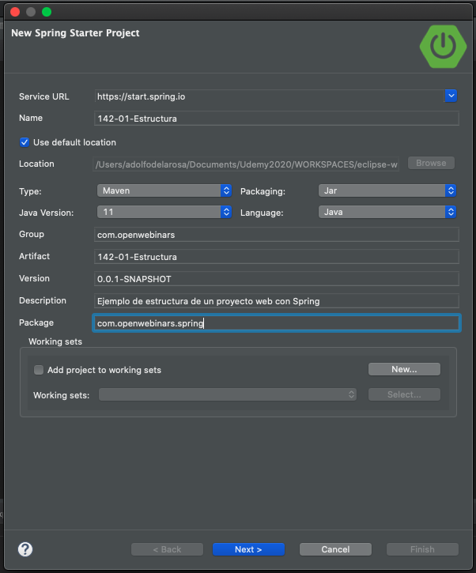
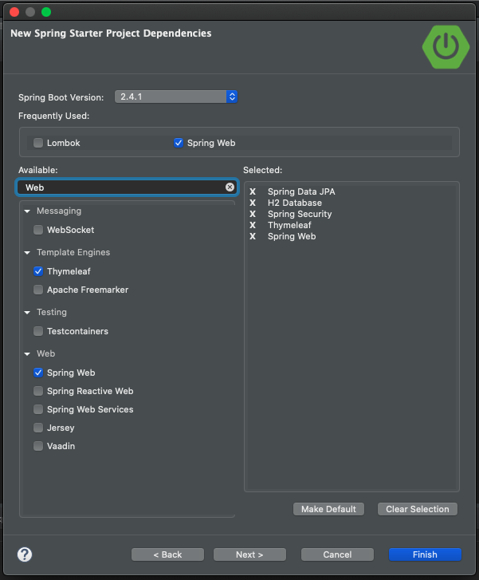
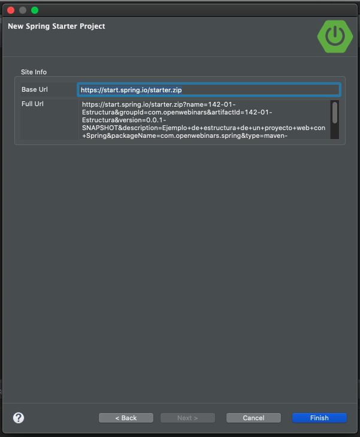
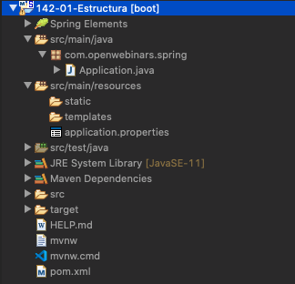

`pom.xml`

```html
<?xml version="1.0" encoding="UTF-8"?>
<project xmlns="http://maven.apache.org/POM/4.0.0" xmlns:xsi="http://www.w3.org/2001/XMLSchema-instance"
	xsi:schemaLocation="http://maven.apache.org/POM/4.0.0 https://maven.apache.org/xsd/maven-4.0.0.xsd">
	<modelVersion>4.0.0</modelVersion>
	<parent>
		<groupId>org.springframework.boot</groupId>
		<artifactId>spring-boot-starter-parent</artifactId>
		<version>2.4.1</version>
		<relativePath/> <!-- lookup parent from repository -->
	</parent>
	<groupId>com.openwebinars</groupId>
	<artifactId>142-01-Estructura</artifactId>
	<version>0.0.1-SNAPSHOT</version>
	<name>142-01-Estructura</name>
	<description>Ejemplo de estructura de un proyecto web con Spring</description>

	<properties>
		<java.version>11</java.version>
	</properties>

	<dependencies>
		<dependency>
			<groupId>org.springframework.boot</groupId>
			<artifactId>spring-boot-starter-data-jpa</artifactId>
		</dependency>
		<dependency>
			<groupId>org.springframework.boot</groupId>
			<artifactId>spring-boot-starter-security</artifactId>
		</dependency>
		<dependency>
			<groupId>org.springframework.boot</groupId>
			<artifactId>spring-boot-starter-thymeleaf</artifactId>
		</dependency>
		<dependency>
			<groupId>org.springframework.boot</groupId>
			<artifactId>spring-boot-starter-web</artifactId>
		</dependency>
		<dependency>
			<groupId>org.thymeleaf.extras</groupId>
			<artifactId>thymeleaf-extras-springsecurity5</artifactId>
		</dependency>

		<dependency>
			<groupId>com.h2database</groupId>
			<artifactId>h2</artifactId>
			<scope>runtime</scope>
		</dependency>
		<dependency>
			<groupId>org.springframework.boot</groupId>
			<artifactId>spring-boot-starter-test</artifactId>
			<scope>test</scope>
		</dependency>
		<dependency>
			<groupId>org.springframework.security</groupId>
			<artifactId>spring-security-test</artifactId>
			<scope>test</scope>
		</dependency>
	</dependencies>

	<build>
		<plugins>
			<plugin>
				<groupId>org.springframework.boot</groupId>
				<artifactId>spring-boot-maven-plugin</artifactId>
			</plugin>
		</plugins>
	</build>

</project>
```

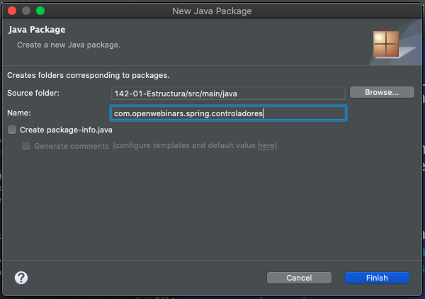


La debemos anotar con `@Controller`

```java
package com.openwebinars.spring.controladores;

import org.springframework.stereotype.Controller;

@Controller
public class UnControlador {

}
```

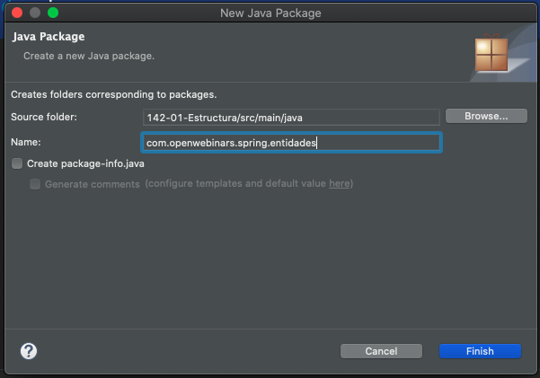
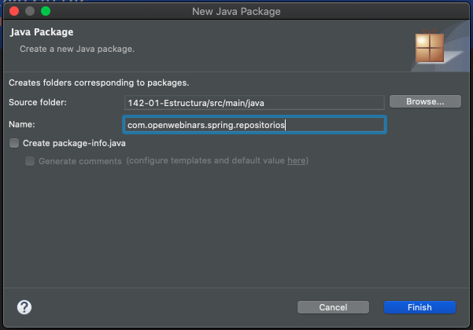


La debemos anotar con `@Controller`

```java
package com.openwebinars.spring.entidades;

import javax.persistence.Entity;

@Entity
public class UnaEntidad {

}
```

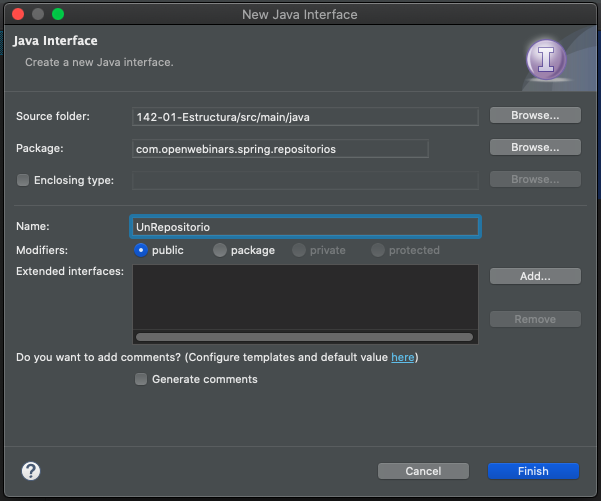

```java
package com.openwebinars.spring.repositorios;

import org.springframework.data.repository.CrudRepository;

import com.openwebinars.spring.entidades.UnaEntidad;

public interface UnRepositorio extends CrudRepository<UnaEntidad, Long>{

}
```


La debemos anotar con `@Service`

```java
package com.openwebinars.spring.servicios;

import org.springframework.stereotype.Service;

@Service
public class UnServicio {

}
```

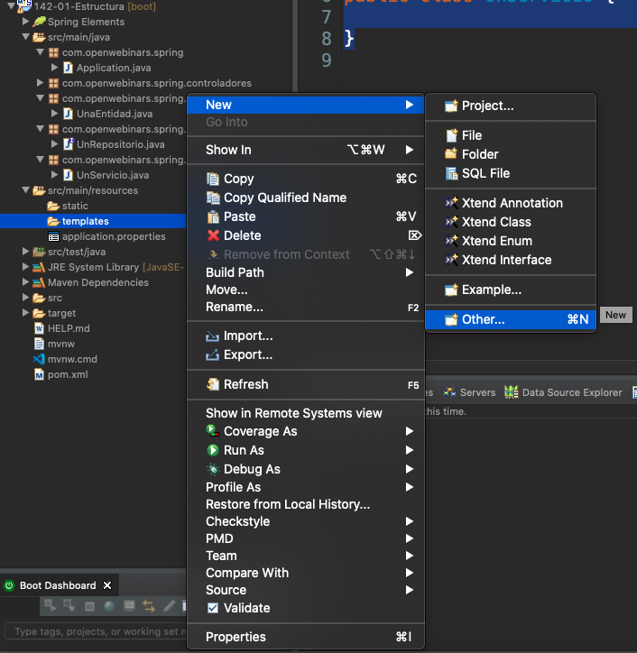
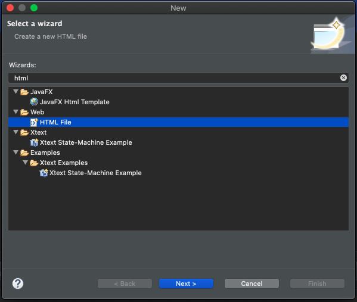


```html
<!DOCTYPE html>
<html>
<head>
<meta charset="UTF-8">
<title>Insert title here</title>
</head>
<body>

</body>
</html>
```

Para que sea una plantilla Thymeleaf hay que añadir `xlmns:th="http://www.thymeleaf.org"`

```html
<!DOCTYPE html>
<html xlmns:th="http://www.thymeleaf.org">
<head>
<meta charset="UTF-8">
<title>Insert title here</title>
</head>
<body>

</body>
</html>
```

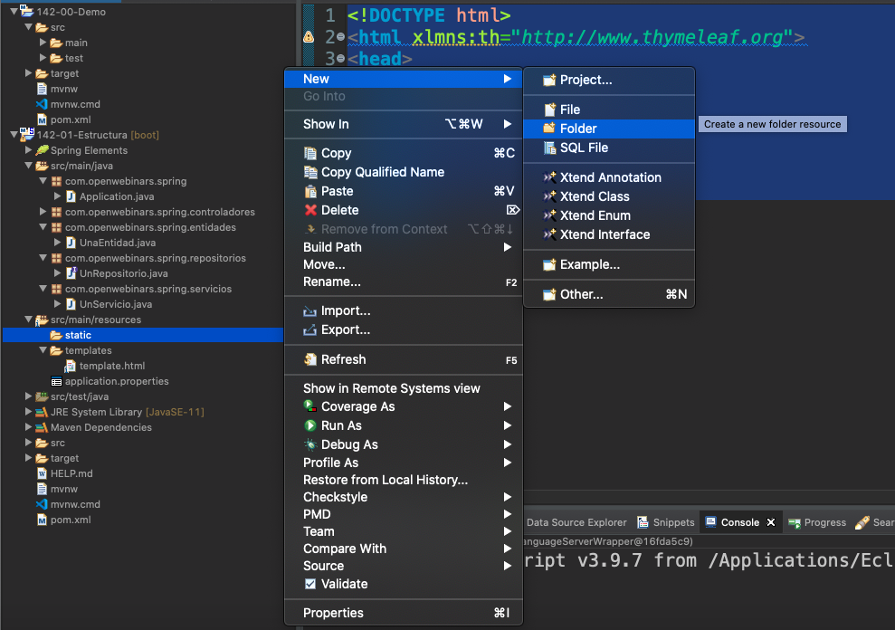
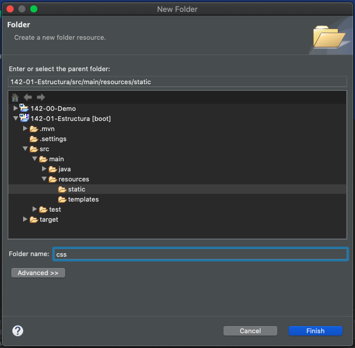

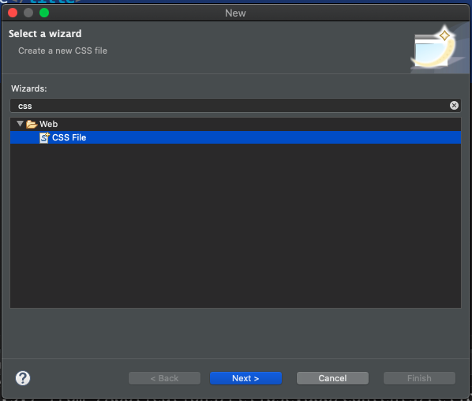

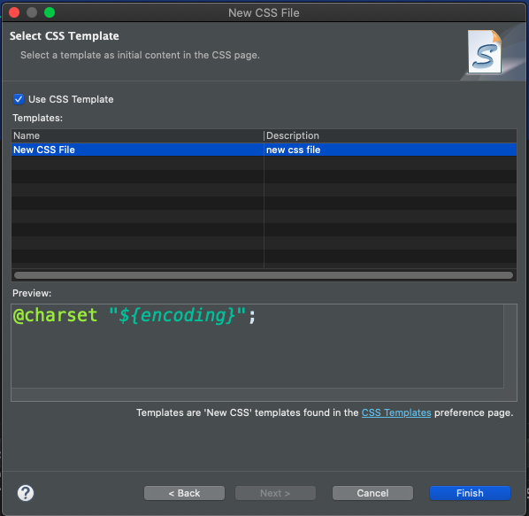

```html
@charset "UTF-8";
```

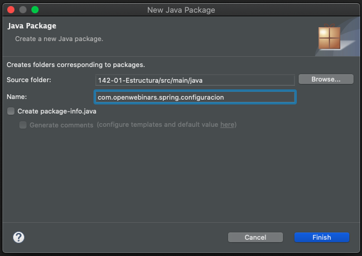
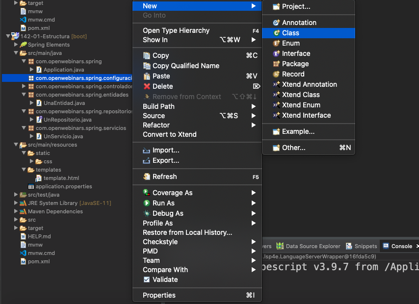


La debemos anotar con `@Configuration`

```java
package com.openwebinars.spring.configuracion;

import org.springframework.context.annotation.Configuration;

@Configuration
public class MyConfig {

}
```


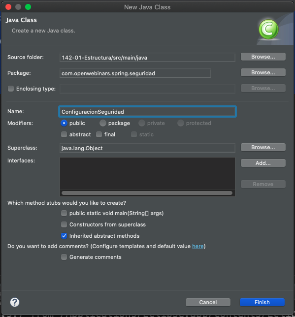

La debemos anotar con `@Configuration` y `@EnableWebSecurity` y debe extender `WebSecurityConfigurerAdapter` 

```java
package com.openwebinars.spring.seguridad;

import org.springframework.context.annotation.Configuration;
import org.springframework.security.config.annotation.web.configuration.EnableWebSecurity;
import org.springframework.security.config.annotation.web.configuration.WebSecurityConfigurerAdapter;

@Configuration
@EnableWebSecurity
public class ConfiguracionSeguridad extends WebSecurityConfigurerAdapter{

}
```


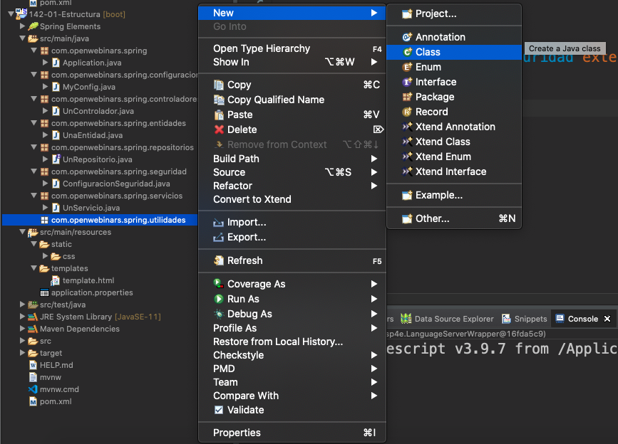


```java
package com.openwebinars.spring.utilidades;

public class Utils {

}
```

# 12 Conceptos de Java EE 12:25 

[PDF Estructura_de_un_proyecto_web_.pdf](pdfs/11._Conceptos_de_Java_EE_necesarios.pdf)

## Resumen Profesor

No existe.

## Transcripción

Hola a todos vamos a conocer esos conceptos de Java EE que quedan en la órbita de la aplicación spring y que sería bueno que bueno Carmelo supiésemos que son en qué consisten y para qué sirven para qué es bueno cuando los utilice nuestra aplicación o lo tengamos que programarnos otro explícitamente lo sepamos hace podríamos decir que una aplicación web con Spring en bici no deja de ser una aplicación Web Java por tanto es necesario que conozcamos algunos conceptos de este modelo de programación de Java para el desarrollo de nuestra aplicaciones con este el primer concepto es el concepto de servlet conserved es una clase que nos permite gestionar peticiones y respuestas de una aplicación servidora se puede utilizar en más contento el contexto web que el contexto de un servidor HTTP pero usualmente se suele asociar a HTTP vale un ejemplo de servidor que es capaz de contener servlet vale que la digamos que la notación la manera buena de decirlo sería Tomcat vale que no solamente es un servidor web y no qué es un servidor web especial que es capaz de procesar código Java en este caso bueno pues serle que son unas clases que tienen una estructura especial y que normalmente suelen tener los métodos Alejo duque tubos vale que atienden a la piscinita a los distintos verbos Servef por norma vale por norma general solamente atenderá a una sola URL y si bien tenemos desde la última versión en la anotación@webservlet lo usual es que tengamos o daños lo teníamos que configurar dentro de un descriptor llamado web.xml y que lo veremos más adelante vale tenemos que indicar oye que aquí tenemos un servlet en la ruta de esta clase que lo queremos matear esta ruta del concepto de nuestra aplicación y eso era bastante tediosa de hecho aquí tenemos por si le queremos echar un vistazo el ácido de HTTP servlet lo que sería un servlet de HTTP que vemos que tiene bueno por la extracción de los métodos que estuvo tu celeste y algunos métodos más que serían los métodos que nos permitirían y os dais cuenta aquí recibir otro objeto el servlet request en definitiva la petición que se nos ha realizado que no llega a este servlet y el método o sea y el objeto HTTP servlet response que sería el que nosotros emite iríamos como respuesta a la petición que hemos recibido como veis te digo todo parece directamente precario a la hora de programar no porque si volvemos al código que tenemos de ejemplo veríamos además que aquí no estamos redirigiendo en modo alguno una plantilla sino que además lo que tenemos disponible en el servlet es entre otras cosas un flujo de salida donde nosotros escribiríamos directamente y ahí tendríamos que meter nuestro código html digo que ciertamente precario y es verdad que se puede programar de otra manera con los Hércules no pero inicialmente su idea a la hora de surgir era la de programar la de esta manera otro elemento que vamos a tener son los descriptores de despliegue el descriptor de despliegue conocido como web.xml que un fichero que nos indica cómo desplegar en el servidor los distintos componentes de la aplicación entre otros los serbios bueno un formato XML con lo cual será sumamente vergonzoso y se suele ubicar en una ruta específica llamada weavings vale y ahí se suele meter en el fichero web.xml es aquí


De un ejemplo de un Web XML dónde podemos ver que ya solo la etiqueta de encabezado enorme dependiendo pues diferentes localizaciones de esquemas versiones espacio de nombres etc y como para definir un ser le teníamos que añadir bueno pues el nombre del servlet con la clase y después asociar al nombre del servlet el patrón de URL con lo cual ya teníamos asociada y se patrón de URL con la clase que hemos programado antes ya digo que todo un poco tedioso sobre todo de configurar servlet web.xml nos queda un concepto que es el de los filtros filtro permite transformar una petición vale sobre todo también podríamos trabajar sobre sobre otro elemento pero transformar una petición de alguna manera una petición HTTP nos permiten por tanto además de transformarlo alterar el circuito normal de lo que sería la petición desde que sale desde nuestro navegador hasta que llega el servidor modificando bueno pues el comportamiento que va a tener por el camino por ejemplo podríamos añadir un filtro que procesará todos los caracteres que se encuentre y le aplicará la codificación UTF-8 para tener una codificación unificada y que no tuviéramos problema en ese sentido o problema por ejemplo podríamos añadir un filtro que solo la única y exclusivamente si la petición trae una cabecera específica pues permitirá acceder a un recurso o un conjunto de recurso está protegido vale de esa manera si esa petición no trae el encabezado bueno pues ser de dirigiría hacia otra respuesta distinta más adecuada no por ejemplo también se suelen utilizar cuando queremos delimitar el acceso a una aplicación a una determinada hora imaginaros que queréis poner que de las 11 a las 12 de la noche te quiere parar una aplicación para que se puedan aplicar los cambios se pueden subir los cambios a servidor vale aplicar parche seguridad mantenimiento es definitiva bueno pues lo podríamos hacer directamente a través de un servlet vale podríamos ver dónde un filtro dónde tuviéramos que si la hora de la petición no está en el rango de cuadros pues no pudiéramos dejar le pasa serán algunos ejemplos de filtro aquí tenemos el código de lo que sería un filtro que ya digo que recoge una petición también tiene la respuesta por si tiene que reenviar nos a otro sitio este no sería un filtro de autenticación y además los filtro decir porque se veía en este gráfico se pueden encadenar y es que después de un filtro puede venir otro y puede venir otro y otro más de hecho lo comprobaremos en nuestras aplicaciones de Spring o no solamente por defecto por crear una aplicación web con Spring boot ya hay 34 incluso 5 filtros por ahí funcionando todo esto cómo lo usa spring boot bueno los servlets veremos qué qué se utiliza a través del DispatcherServlet qué es la manera que tiene fin de implementar el patrón from controller del cual hablábamos en lecciones anteriores ese DispatcherServlet será el que despache todas las peticiones aunque lo haga delegando en otras clases distintas por ello necesita ser mapeado bien a través de un descriptor de despliegue o a través de configuración Java config si bien si usamos print but no es necesario ya que él se encarga de la configuración


Tuviéramos que hacer nosotros manualmente tendríamos que hacerlo de la manera que nos indica por aquí la documentación de Spring no esta sería la forma de hacerlo con Java confit donde nosotros registre haríamos de forma dinámica este DispatcherServlet medio cancerul en especial o si creáramos un web.xml un descriptor de despliegue vale porque nos guste más el estilo XML lo haríamos de esta manera y esto sería este servlet especial vale que se va a encargar de despachar de atender todas las peticiones cómo vemos algo que bueno spring boot va a hacer por nosotros y que francamente va a hacer como en el tema de los contextos una aplicación spring ya sabemos del curso de 5 horas que necesita un contexto donde bueno poder ejecutarse porque es donde va a recibir el contenedor de inversión de control para la aplicaciones normales teníamos applicationcontext para la aplicación en tenemos una interfaz que lo entiende que es web application context bueno pues esto normalmente se suele configura a través de los diferentes elementos de configuración y podríamos separar el hecho de tener a un web API qué es un Web Application context raíz y tener otro que pudieran contener otros objetos de manera que tendríamos dos contenedores distintos donde tendríamos conjuntos de Pink diferente nosotros trabajaremos en lugar de como indica el esquema del gráfico trabajaremos solamente con un solo WebApplicationContext que será el rey el root y que contendrá todos los centros pero si quisiéramos y amigos lo podríamos separar vale y tradicionalmente algunas personas han trabajado de esta manera creando dos dos tipos de configuración diferentes por otro lado también tenemos que algunos pins especiales que van a colaborar con el DispatcherServlet vale y que necesitaríamos configurar si no es por el facebook no como Scarlett mapping y el Hamlet adapter que van a hacer los que se encarguen de hacer el mapeo de las peticiones a los métodos del controlador o también tenemos otros muy importante como el mío resolver qué es el que va a ser capaz de decir a partir de un nombre de una vista la vista en si el recurso de la vista vale asociado con la que después renderizar la respuesta ya digo que spring va a necesitar estos elementos y spring boot nos va a aportar una serie de configuraciones por defecto que nos van a funcionar muy bien por ejemplo sin spring boot tendríamos que hacer este código manualmente no para poder configurar nuestro DispatcherServlet lo tendríamos que indicar y ya no hemos visto vale tendríamos que añadir también está extensión para definir los contextos de esta manera estamos diciendo que bueno que solamente vamos a tener un contexto donde los vamos a almacenar todo no y tendríamos que indicarlo también y por último además tendríamos que bueno pues añadir los inicializadores de los filtros que vamos a utilizar todo esto lo teníamos que hacer nosotros manualmente y sin embargo usando spring boot vamos a darnos cuenta como bueno pues la configuración de el contexto en la creación y configuración del DispatcherServlet la generación de filtros todo va a ser francamente Salzillo conecto conocemos los elementos dejaba eh aunque sea a vista de pájaro que vamos a necesitar a partir del tema de viene desde la lección siguiente perdón nos lanzamos de lleno al código y vamos a empezar trabajando con los primeros controladores


# 13 Controladores 21:04 

[PDF Controladores.pdf](pdfs/12._Controladores.pdf)

## Resumen Profesor

### Patrones en la URI

Las peticiones que se mapean a métodos pueden utilizar una expresión `glob`) que incluya caracteres comodín:

* `?` equivale a un carácter cualquiera
* `*` equivale a cero o más caracteres dentro de un segmento del path
* `**` equivale a cero o más segmentos del path

Se entiende por un segmento del path a lo que se contiene entre dos `/`.

### Mapeo de más de una URI a un controlador

La anotación `@RequestMapping` y sus derivadas (`@GetMapping`, `@PostMapping`, ...) pueden recibir más de una ruta como argumento. Lo hacen recibiendo varias entre `{ }`.

```java
@GetMapping({"/", "/index", "/list"})
```

De esta forma, tanto si invocamos a `/`, como a `/index` o `/list`, todas las llamadas se harán al mismo método.

### Uso de `@RequestMapping`

Esta es la anotación *original* para mapear cualquier tipo de verbo HTTP con un método.

De hecho, podríamos sustituir este código:

```java
@GetMapping("/")
public String welcome(@RequestParam(name="name", required=false, defaultValue="Mundo") String name, Model model)
```

por este otro

```java
@RequestMapping(value="/", method=RequestMethod.GET)
public String welcome(@RequestParam(name="name", required=false, defaultValue="Mundo") String name, Model model)
```

Podemos utilizar también la anotación `@RequestMapping` para definir un segmento de ruta a nivel de controlador, de forma que:

```java
@Controller
@RequestMapping("/app")
public class MainController {
    @GetMapping("/")
    public String welcome(@RequestParam(name="name", required=false, defaultValue="Mundo") String name, Model model) {
        model.addAttribute("nombre", name);
        return "index";
    }
}
```

La ruta para invocar el controlador `welcome` sería `http://localhost:8080/app/`. Si añadimos más métodos de controlador a esta clase controladora, la ruta `app` afectaría a todos los métodos.

### Argumentos de un método del controlador

Tipo de dato | Descripción
-------------|-------------
`WebRequest`, `NativeWebRequest`|	Acceso genérico a los parámetros de la petición o los atributos de sesión, sin usar el API Servlet
`javax.servlet.ServletRequest`, `javax.servlet.ServletResponse` |	Acceso directo a la petición o respuesta. Se pueden utilizar los subtipos `ServletRequest`, `HttpServletRequest`, `MultipartRequest`, `MultipartHttpServletRequest`.
`javax.servlet.http.HttpSession` | Fuerza la presencia de una sesión, con lo que nunca será nulo. ¡Cuidado! ya que el acceso no es *thread-safe*.
`javax.servlet.http.PushBuilder` | Push Builder (Servlet 4.0) para realizar el push de recursos para el protocolo HTTP/2.
`java.security.Principal` | Usuario actualmente autenticado.
`HttpMethod` | Método (verbo) HTTP de la petición.
`java.util.Locale` | Locale actual de la petición.
`java.util.TimeZone` + `java.time.ZoneId` | Zona horaria asociada a la petición.
`java.io.InputStream`, `java.io.Reader` | Permite acceder a la petición en crudo.
`java.io.OutputStream`, `java.io.Writer` | Permite producir la respuesta en crudo.
`@PathVariable` | Permite acceder a variables presentes en la URI.
`@MatrixVariable` | Acceso a los pares nombre-valor presentes en la URI.
`@RequestParam` | Acceso a los parámetros de la petición, incluidos ficheros multipartes.
`@RequestHeader` | Acceso a los encabezados de la petición.
`@CookieValue` | Acceso a las cookies.
`@RequestBody` | Acceso al cuerpo de la petición HTTP. El cuerpo es convertido según la implementación del `HttpMessageConverter` configurado.
`@HttpEntity<B>` | Acceso a los encabezados y cuerpo de la petición.
`@RequestPart` | Acceso a una parte de una petición `multipart/form-data`.
`java.util.Map`, `org.springframework.ui.Model`, `org.springframework.ui.ModelMap` | Acceso al modelo que es expuesto a las plantillas para el renderizado de vistas.
`RedirectAttributes` | Especifica atributos en caso de redirección.
`@ModelAttribute` | Para acceder a algún atributo existente en el modelo, con conexión de datos y validación aplicada.
`Error`, `BindingResult`| Para acceder a los errores de validación y la conexión de datos de un *command object*, o los errores de validación de un objeto `@RequestBody`.
`SessionStatus` + `@SessionAttributes` | Marca el procesamiento de un formulario completo, que activa la limpieza de atributos de sesión declarados a través de `@SessionAttributes`.
`@RequestAttribute` | Acceso a los atributos de la petición.

Aquellas anotacines que permitan el uso de atributo `required`, podrán ser utilizadas junto con `java.util.Optional` de Java 8.

Fuente: https://docs.spring.io/spring/docs/current/spring-framework-reference/web.html#mvc-ann-arguments

### Tipos de retorno

Tipo de dato | Descripción
-------------|------------
`@ResponseBody` | El valor se convierte según el `HttpMessageConverter` configurado.
`HttpEntity<B>`, `ResponseEntity<B>` | Se devuelve la respuesta completa, incluyendo encabezados y cuerpo.
`HttpHeaders` |	Para devolver una respuesta con encabezados y cuerpo vacío.
`String` | Es el más usual en las últimas versiones de Spring. Se trata del nombre de la plantilla, que será resuelto por el `ViewResolver` configurado.
`View` | Una instancia de `View` que se usará para renderizar junto con el modelo.
`java.util.Map`, `org.springframework.ui.Model`	| Atributos para ser añadidos al modelo.
`@ModelAttribute` | Atributo para ser añadido al modelo.
`ModelAndView`| Vista y modelo de forma conjunta.
`void` | Si devuelve `void`, se entiende que se ha manejado la respuesta a través de `ServletResponse`, `OutputStream` o una anotación `@ResponseStatus`.

Puede revisar la lista completa en la fuente.

Fuente: https://docs.spring.io/spring/docs/current/spring-framework-reference/web.html#mvc-ann-return-types

## Transcripción

Hola a todos mano a la obra que vamos a empezar con la primera aplicación web de verdad porque comenzamos viendo los controladores si recordáis el controlador en la clase que se va a encargar de atender peticiones vale va a delegar en el procesamiento de ella en bueno en el modelo normalmente dónde se puede aplicar alguna serie de servicio y a partir de ahí rescatar algunos datos que enviaremos la vista no pero digamos que el controlador es el primero que recibe el balón vale pues vamos a ver cómo se crea un controlador la ventaja tremenda con respecto a otros primos y es que el controlador puede ser una clase Pojo Java es decir una clase de las de toda la vida pollo significa o son las siglas de Playmobil javadocs es decir de una de un objeto Java vale totalmente plano es decir que no tiene que heredar de nadie ni tiene que entender a nadie frente a otro modelo de trabajo donde si se nos obliga a que clase sobre privados métodos no aquí no vamos a tener las manos atadas y esto puede ser una clase cualquiera que va a tener solamente la cosa de estar anotada con arroba controles a partir de ahí los métodos veremos que tienen que estar anotado para que podamos hacer el mapeo de bueno una ruta determinada con un método determinado para saber que cuando escribamos en el navegador algo vamos a procesar este algo la petición que se haga la vamos a procesar en ese método hasta la versión 43 y lo digo de memoria si no mal recuerdo teníamos disponible siempre la anotación request mapping genérica que recibía la URL y el método HTTP con el cual al cual había que estar atento no igual se estaba la palabra suele ser escucha desde la versión 43 tenemos disponible una anotaciones derivadas que no evitan tener que poner el método ya que lo ponemos en la propia anotación no que es más peticiones que os más peticiones post y así sucesivamente vamos a crear nuestro primer controlador vale lo vamos a hacer a través de un nuevo proyecto vamos a crear un nuevo proyecto


### :computer: `142-02-Controladores`
#### Ejemplo de creación de controladores

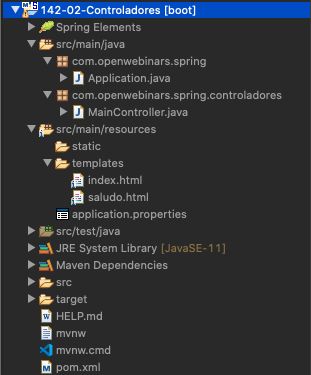

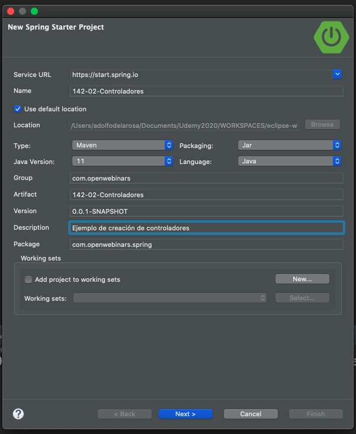
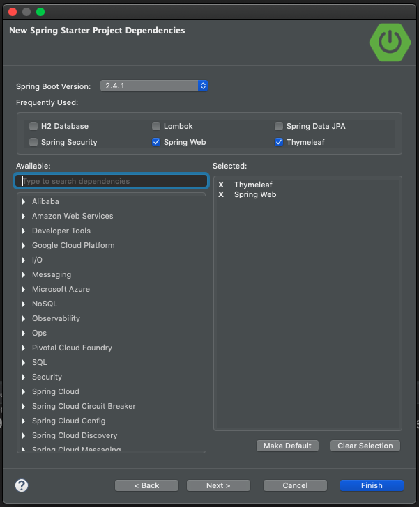
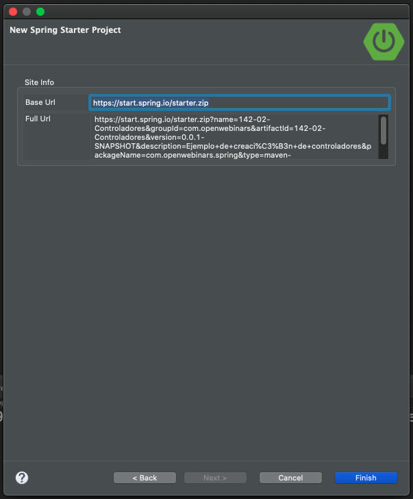

#### Cambiar el Puerto

```txt
server.port=9000
```

#### Crear `MainController` 

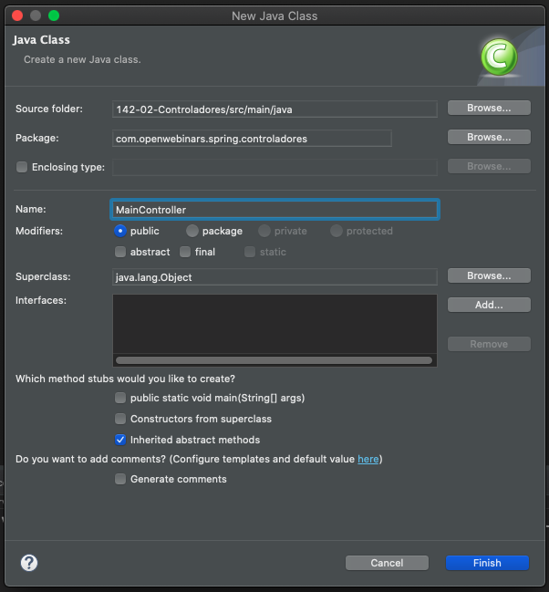

Lo anotamos con `@Controller`

Añadimos método `welcome()`

```java
@Controller
public class MainController {
	
   @GetMapping("/")
   public String welcome() {
      return "index";
   }

}
```

#### Crear Plantilla

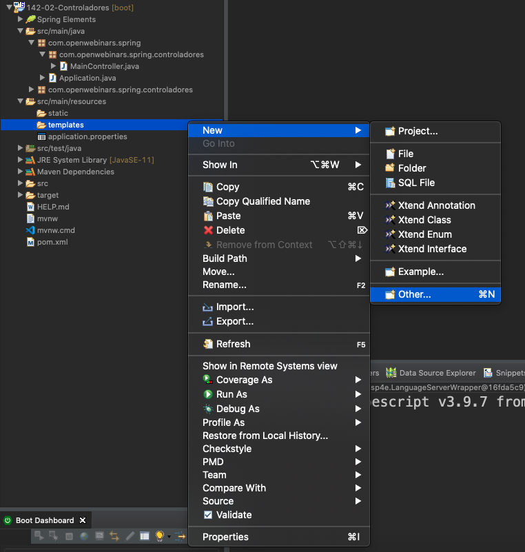
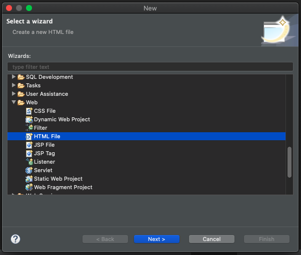
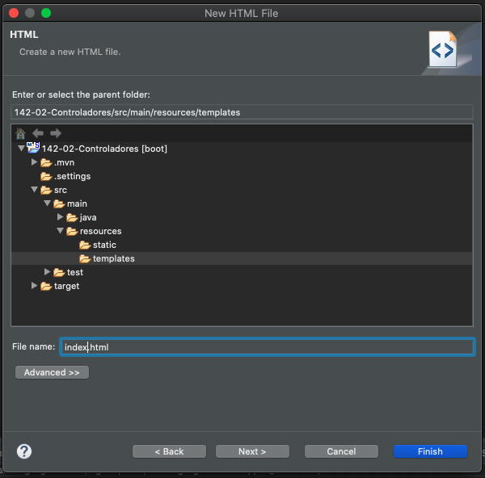

Para que sea una plantilla Thymeleaf hay que añadir `xlmns:th="http://www.thymeleaf.org"`

```html
<!DOCTYPE html>
<html xlmns:th="http://www.thymeleaf.org">
<head>
<meta charset="UTF-8">
<title>Insert title here</title>
</head>
<body>
   <h1>Hola Mundo!!!</h1>
</body>
</html>
```

#### Ejecutar la Aplicación

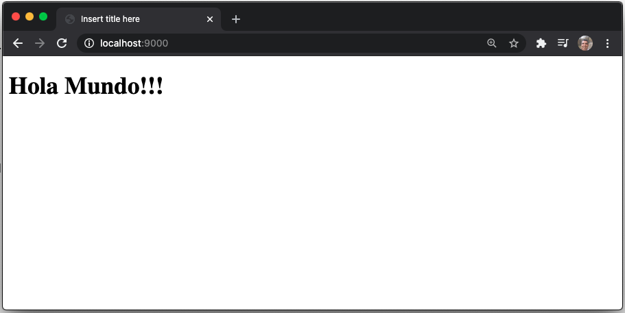

Escribir localhost 9000 y ponerle una barra signifiquen lo mismo de hecho si nosotros se la ponemos posiblemente el navegador la limpie qué es lo que ha sucedido por aquí veamos no bueno por aquí vale vemos que tenemos la clase pollo anotada con arroba controles 10 la manera que tenemos de definir que eso es un controlador y además es un proyecto web pues será un controlador web la notación que va a indicar que este método se invoca cuando se produce una petición que las peticiones que se producen cuando escribimos en el navegador una dirección URL de un recurso suelen ser que vale siempre lo que viene a continuación entre paréntesis es la ruta que está escuchando que en este caso sería la ruta raíz con lo cual cuando se recibe una petición que a esa ruta spring va invocar directamente cemento el nombre del método como decía puede ser cualquiera y no tiene porqué recibir parámetro aunque veremos que será conveniente en la mayoría de los contextos por último y por simplificar veremos que el método devuelve un stream que va a hacer la ruta de la plantilla dentro de la carpeta configurada qué es la carpeta temple sin la extensión sin el sufijo HTML Como habéis comprobado el nombre del fichero era index HTML bueno nosotros hemos puesto solamente index aquí para poder atenderlo y ahora nosotros quisiéramos enviar algún tipo de dato a la vista lo haríamos a través de la clase módem la clase Model es un map que nos permite guardar estructuras clave-valor y con la cual nosotros vamos a poder pasarle al contexto de la vista una serie de objeto identificado vale aquí tenemos la estructura del código que vamos a hacer nosotros si nos venimos aquí podemos ver cómo podemos pasarle en nuestro controlador voy a comentar este porque lo voy a escribir de nuevo para que lo veáis bueno podemos reutilizar este mismo en esta misma ruta welcome ballet podríamos incluir aquí el objeto model vale como podéis comprobar este model es propio spring y bueno pues tiene una serie de métodos adecuados vale tiene una serie de métodos adecuados para que nosotros podamos añadir un atributo con un nombre vamos a mandar un mensaje tuyo valor sea fue

#### Cambios en el Controlador para Enviar Datos a la Vista

```java
@Controller
public class MainController {
	
   @GetMapping("/")
   public String welcome(Model model) {
      model.addAttribute("mensaje", "¡Hola a todos los alumnos de OpenWebinars!");
   }

}
```

#### Cambios en la Vista para Recibir Datos desde el Controlador

```html
<!DOCTYPE html>
<html xlmns:th="http://www.thymeleaf.org">
<head>
<meta charset="UTF-8">
<title>Insert title here</title>
</head>
<body>
   <h1 th:text="${mensaje}">Hola Mundo!!!</h1>
</body>
</html>
```

#### Ejecutar la Aplicación

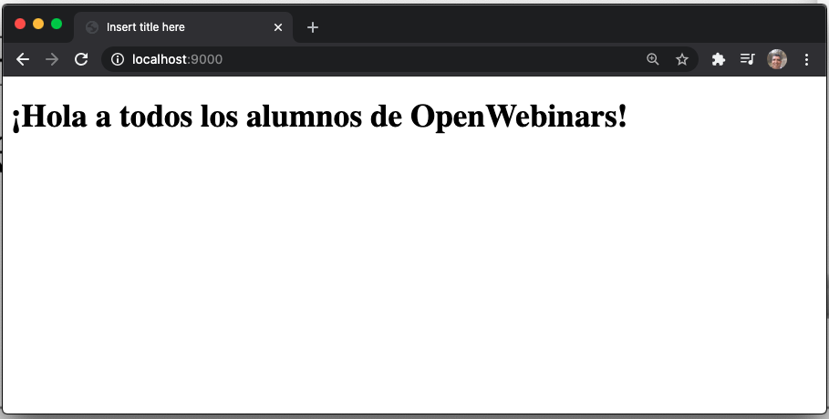


Vale y si nos venimos a nuestro navegador si refrescamos vemos que el mensaje ha cambiado si nosotros cambiáramos este mensaje también estaríamos cambiando lo que va a recibir aquí en la plantilla como podéis comprobar francamente estoy bastante potente ya digo que este móvil es el objeto que podemos utilizar si bien también tenemos otra clase modelmap vale que nos aporta Model es un interfaz model Maps una clase que nos aporta la llamada encadenada métodos podríamos llamar simplemente a y después otra vez a en un estilo que suele ser muy habitual últimamente y podríamos utilizar indistintamente las dos ya también veremos y usaremos la anotación arroba modelattribute que nos permite definir un método entre otros elementos un método que devuelva un objeto y guardar este objeto en el modelo de un controlador para que lo podamos usar siempre lo haremos sobre todo en el proyecto de ejemplo cómo posible argumentos que hemos visto que podía recibir el método del controlador teníamos no solamente modelo modelmap y no modelattribute el controlador también puede recoger una clase que esté anotada con Rico es body y así podremos recoger el cuerpo de la petición Thomann bajo nivel nos permitiría acceder a a la entidad HTTP de la petición con HTTP entity y como respuesta vale nosotros usaremos siempre un string o mejor dicho casi siempre porque es lo más usual últimamente en la última versiones de Spring y en el código de ejemplo que encontré de los últimos años ya que a través del Bio resolver que nosotros configuramos automáticamente con Spring boot y añadiendo same live pues es más sencillo que devolvamos el nombre de la plantilla y el resolver pues encargue de resolver es el nombre con un recurso en particular que vaya a utilizar si bien bueno pues hay otro esquemas de trabajo cómo cómo podemos ver otra manera sería devolver un responsebody y cualquier tipo de dato esto se suele utilizar en otros contextos sobre todo en el caso de las APIs donde el valor se convierte y el de vuelta en el cuerpo de la respuesta vale se convierte a través del conversor que esté configurado también podemos devolver una entera completa devolver un modelo envío vale donde se devuelve el modelo y David en un solo objeto que en la manera que se venía de trabajar antes y que podía encontrar también en la literatura o en ejemplos que sean más antiguos hasta ahora hemos hecho un controlador que tenía un solo método podemos hacer un controlador que tengan más de un método sin la única restricción que vamos a tener es que escuchen ruta diferente y que además no se llama igual como podría tener una restricción de cualquier clase imaginaos que tenemos una plantilla saludo igual que la plantilla que tenemos ahora que esa plantilla saludo espera un mensaje de saludo y que se saludo que habrá dicho antes bueno que como el que hemos estante pues puede hacer seguro que has visto otras plataformas con miles de curso pero no tengo evinar vale pues te ofrecemos otro elemento vamos a ver cómo podríamos crearlo nos vendríamos a nuestros main controller y tendremos crear bueno fue otro método que hemos visto que íbamos a llamar saludo vale anotado con getmapping

#### Modificar el Controlador

```java
@Controller
public class MainController {
	
   @GetMapping("/")
   public String welcome(Model model) {
      model.addAttribute("mensaje", "¡Hola a todos los alumnos de OpenWebinars!");
      return "index";
   }
	
   @GetMapping("/saludo")
   public String saludo(Model model) {
      model.addAttribute("saludo", "Seguro que has visto otras plataformas con miles de cursos, pero en OpenWebinars nos centramos en IT. Como profesional tecnológico debes estar al día en las tecnologías más demandadas y OpenWebinars es la solución.");
      return "saludo";
   }

}
```

#### Añadir Vista `saludo.html`

```html
<!DOCTYPE html>
<html xlmns:th="http://www.thymeleaf.org">
<head>
<meta charset="UTF-8">
<title>Saludo</title>
</head>
<body>
   <h1 th:text="${saludo}">Hola Mundo!!!</h1>
</body>
</html>
```

#### Ejecutar la Aplicación

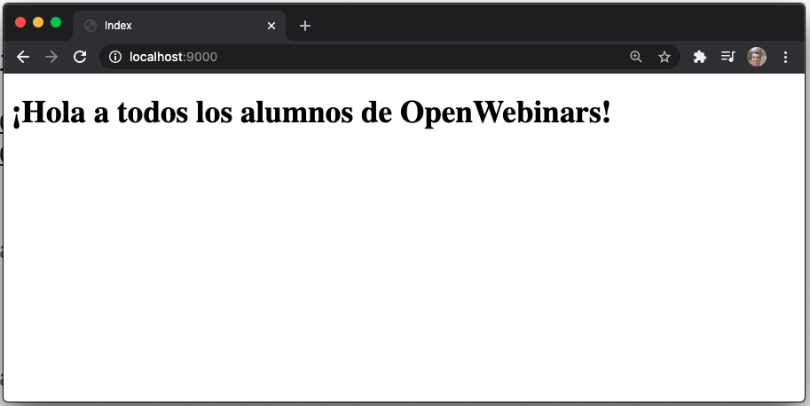
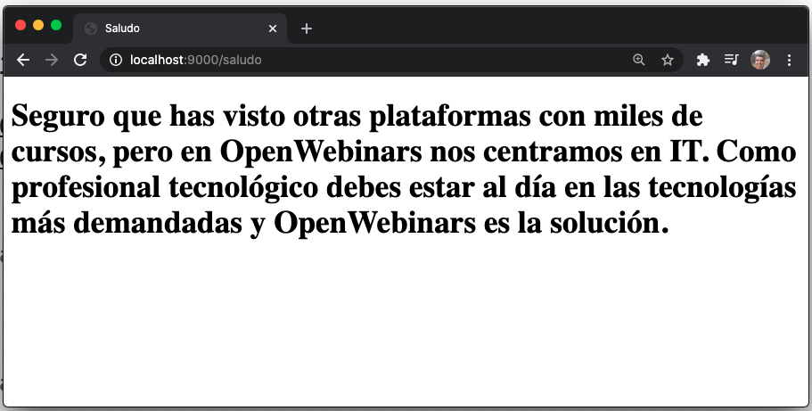

Lanzada tendríamos por aquí que sigue devolviendo no están en la ruta raíz y en saludo vale lo vamos a quitar algo de eso o lo podríamos poner al 100% seguro que has visto otras plataformas con miles de cursos pero no tengo evina nos enteramos emite como profesional tecnológico de ver estar al día en las tecnologías más demandadas yo tengo vida en la solución sería un mensaje que podríamos incluir de saludo en nuestra aplicación como podemos comprobar hemos podido tener en un solo controlador dos métodos diferentes que atienden a dos rutas distintas y que bueno fue terminan renderizando en en dos plantillas diferentes vale con lo cual estoy francamente cómodo en la mayoría de las lesiones que veremos de ahora en adelante os pondré alguna pequeña práctica que en principio no tendréis resuelta y que servirá como acicate vale como reto para que vosotros podáis practicar pasa aplicaron la primera que se está que tenemos aquí imagino que lo encarga en una web que podríamos llamar clásica la web clásica son aquellas que los pequeños negocios con el bueno el boom de las conexiones Internet empezaron a solicitar con el devenir del siglo 21 final del siglo 20 de venir del siglo 21 y en torno al año 2002 mil algo había muchos pequeños negocios que se pirran por poder tener presencia en Internet no esas web era muy sencilla y solían incluir una portada dónde se pone información sobre la organización vale lo que podríamos llamar el quiénes somos otro apartado con el que hacemos o que vendemos y la información de contacto con donde estamos e información de contacto pues yo ánimo a que crees un nuevo proyecto añadiendo los starters de Wendy de finding que creéis un controlador con tres métodos para que atienda la ruta raíz que y contacto que creéis tres plantillas vale de qué y contacto y que podáis pasar el contenido de esas plantillas a través de un objeto model vale podéis recurrir si queréis por ejemplo algún tipo de plantilla ya prevenida dvisual bonita que haya por ahí y te la tarde encajarlo vale si bien o aviso de que si tiene algunos recursos javascript css a lo mejor tenía alguna pequeña dificultad al principio vale si no puede ser algo normal algo normal perdón pero que podáis encajar un controlador con tres métodos tres plantillas distinta y os podéis pelear un poco os recuerdo que para pasar los datos ala vista tendríamos que tener controlado easy y mediante atribut iríamos añadir elemento a nuestra plantilla hasta aquí el capítulo de los controladores en los siguientes capítulos empecemos trabajando con vista y mejorando nuestros controladores para que sea más potente

# 14 Vistas 14:10 

[PDF Vistas.pdf](pdfs/13._Vistas.pdf)

## Resumen Profesor

### Cargar una vista vs. Redirigir a otro controlador

Como hemos visto, la forma más sencilla de que un controlador nos lleve a una vista es devolviendo el nombre de la plantilla a renderizar como un `String`:

```java
@GetMapping("/")
public String welcome(Model model) {
    model.addAttribute("mensaje", "¡Hola a todos!");
    return "index";
}
```

Sin embargo, habrá ocasiones en las que nos interes que un controlador nos lleve directamente a otro. Un escenario típico es, tras haber procesado un formulario (por ejemplo, de inserción de un nuevo registro); posiblemente, después de procesar esa petición, queramos visualizar el listado completo de registros, y así comprobar que el nuevo registro ha sido insertado.

Para poder hacer una redirección, incluimos la palabra `redirect:` en el valor de retorno del método, seguido de la ruta del controlador al cual queremos redirigirnos.

```java
@PostMapping("/empleado/new/submit")
public String nuevoEmpleadoSubmit(@ModelAttribute("empleadoForm") Empleado nuevoEmpleado) {
    servicio.add(nuevoEmpleado);
    return "redirect:/empleado/list";
}
```

## Transcripción

Vamos a hablar ahora de las vista ya sabéis que estamos atacando nuestras aplicaciones desde el patrón modelo vista controlador ya hemos hablado de los controladores aunque volveremos a ellos pero vamos a hablar sobre las vistas en Spring en bici sabemos que la vista dentro del patrón en la parte encargada de renderizar una plantilla que es la que junto con el contenido que muestra ido del modelo se visualizará por el usuario vale dentro del navegador bueno pues tenemos una ventaja tomemoslo como una ventaja y es que con Spring en bici no tenemos una sola manera de hacer la lista y es que spring en bici está totalmente separado de la tecnología concreta de vista que vamos a usar es totalmente independiente imaginas que tenemos un puzzle y que tenemos piezas que encajan entre sí y bueno la vista sería una pieza y spring en bici sería otra totalmente distinta de manera que si queremos cambiar la tecnología de la vista lo podríamos hacer sin que impactará en el resto de la aplicación vale con una serie de pequeños cambios podríamos mudarnos de una manera de hacer la vista a otra podemos elegir entre muchas vale alguna podríamos decir que más privilegiada y otras menos privilegiadas a día de hoy una de las más utilizada stylish vale es un motor de plantilla qué bueno hace énfasis en el uso de los de las conocidas como plantillas natural lo comprobaremos más adelante en uno de los proyectos de ejemplo pero veremos como time live no es nada invasivo a nivel de nuevos elementos en nuestra plantilla con lo cual a nivel de maquetación podremos ver los elementos tal cual fue no pues los ve un diseñador web ya incluso con nuestra elemento de plantilla me refiero que necesitara el motor de plantillas para renderizar porque no es nada invasivo y además veremos como su integración con Spring sobre todo si somos spring boot es totalmente en mediana tenemos otros motores como freemaker de Apache vale que también es sencillo de integral con Spring JSP junto con JS tls1 clásico que viene bueno de todo aquel que en los 90 o a partir de los 2000 programo algo con servlet la vista normalmente bueno pues ya la he empezaban a hacer con las Java server page no y que junto con el con el conjunto de etiquetas de JS tele bueno pues se podían crear página web dinámica tiene la cosa como ventaja sobre time live Valencia no lo he llegado a comprobar pero dice la literatura que suelen ser más rápidas que las plantillas estáis sin embargo vosotros lo podré comprobar si el procesamiento de plantillas que vosotros vais generando el lento Apache tiles vale que es otro conjunto otro sistema de plantillas otro Facebook de plantillas que históricamente se ha usado mucho con Estruch vale con otro otro from Word en bici rubí marca vale que requiere que usemos GroupMe con lo cual para nosotros queda descartado porque no lo vamos a usar en este proyecto e incluso otro conjunto de plantilla vale si utilizamos algún motor de scripting dentro de nuestro proyecto que cumpla con la JS r233 podríamos usar algún tipo de plantillas de ese tipo véase handlebar usted Riad Palais et cetera lo podríamos incluir si será muchas lo aunque ya digo yo no conozco a mucha gente que desarrollo proyectos así ya digo que nosotros trabajaremos containers es un motor de plantilla que significa eso por un lado va a tener una plantilla que va a ser código html podría ser también CSS código de texto vale XML para nosotros va a ser prácticamente siempre HTML si bien podríamos incluir no creo que lo cobramos en este curso algo de uso de dentro de CSS desde javascript tomamos nuestra plantilla HTML tomamos un modelo por ejemplo el resultado de consultar una base de datos y sumamos ambos elementos el resultado de ello o no pues será la vista que sea renderizada por el navegador tenemos un ejemplo muy sencillo con un fragmento de plantilla

Le tenemos una capa donde en dos párrafos distintos se ven el nombre y los apellidos de una persona bueno pues de esa manera nosotros no exactamente la anotación de tráiler pero la he usado para que la podáis ver y comprobar con más con más facilidad porque ya digo si la quisiéramos usar sería más bien está que tenemos por aquí pero es por simplicidad una plantilla que recibe un modelo por ejemplo dos variables distintas de objetos nombre y apellidos Pepe Pérez Pérez lo último quedarán renderizados de esta forma y podríamos ver cómo contenido HTML vale pues en lugar de tener esas expresiones pues tendría el contenido que nosotros queremos ya digo que el hecho de que se puedan hacer plantillas naturales es que en lugar de añadir nuevas etiquetas como por ejemplo hace JSP se añaden nuevos atributos a etiquetas conocidas de html que si vamos a visualizar el fichero HTML sin procesar desde el navegador o el propio navegador descarta y sin embargo si nos muestra el contenido HTML probar a hacer lo mismo con una plantilla de JSP en la cual bueno pues no como añadimos elementos distintos que el navegador no sale procesar posiblemente nos lo muestre como texto plano dentro de la visualización aquí no aquí por ejemplo con esta plantilla que muy sencilla faltaría añadir el espacio de nombre de Tyler vale pero no lo interesante es simplemente que nos centramos en el párrafo y veamos como si recibimos una variable llamada saludo y renderizar con la plantilla ese saludos era el mensaje que se vea y se descarte el hola mundo sin embargo si trabajamos con la plantilla de forma estática tendríamos que veríamos un párrafo con el mensaje hola mundo dentro con lo cual podemos hacer la maquetación HTML CSS encajar todas esas piezas para que se visualicen bien y simplemente después cambiar el contenido por el que venga marcado desde el contexto vale que posiblemente se inyecte desde el controlador Time-Life hablamos del concepto de procesador qué es un objeto que aplica una transformación a un determinado artefacto por ejemplo un procesador que transforma el texto y lo renderiza como un párrafo vale bueno pues un dialecto es un conjunto pequeño mediano grande de procesadores nos ofrece un dialecto específico para spring conocido como el Spring standard viene y que nos va a permitir en lugar de usar el lenguaje de expresiones que utiliza Chinese por defecto usar el lenguaje de expresiones de Spring el conocido como sp-l vale para poder montar la expresión es que irán dentro de las plantillas que posteriormente serán renderizada por los distintos procesadores que conforman el dialecto la manera más sencilla ya la hemos visto de configurar time live como motor de plantillas es simplemente cuando añadamos la dependencia starter web añadir la dependencia starter shiny y por defecto esto no aplicará una configuración no configura el PIN viewresolver en particular del tipo time-resolved qué es el encargado de resolver las vistas otro bean llamado template en Jane man en particular el es springtemplateengine vale y qué indica el dialecto específico de timelib y habilita por tanto el uso de expresiones vale DLC pl el template resolver por último que será de tipo spring sound simple resolver va a permitir acceder físicamente a las plantillas vale cómo recursos vale como rizos va a permitir acceder a la plantilla indicando la ruta vale nosotros ya hemos visto que en el controlador ponen de solamente tendríamos que poner el nombre de la plantilla


Si no tuviéramos el Facebook y lo tuviéramos que configurar manualmente tendríamos que hacer algún código de este tipo con una clase lo podríamos hacer también con XML pero hemos decidido mostrarlo aquí con Java Conchi configurar tres pins que además el uno va a necesitar al otro el timple resolver donde indique haríamos dónde van las plantillas por ejemplo en una carpeta WEB-INF template o en la carpeta hemos visto nosotras en los proyectos que genera spring inicia live sounds indicar el sufijo el modo de plantilla y alguna opción ma en el template engine activamos el compilador del spring Expression Language vale y por último en el viewresolver indicamos o arrastramos de alguna manera la configuración de ambos bean lo ponemos como el primero y le decimos que las pistas vale tendrán sufijo o por ejemplo HTML XHTML vale esta clase de configuración o una bastante parecida a la podemos encontrar en la documentación de time con Spring boot podemos modificar la configuración de Time life por defecto vale que hemos visto que no tenemos que hacer o que si la tuviéramos que hacer esta clase que hemos visto antes pero la podemos hacer vía properties de una manera muy sencilla tenemos aquí alguna serie de propiedades que paso a comentaros rápidamente la propiedad spring thymeleaf th nos permite indicar si se va a utilizar el cacheo de plantilla por defecto está a true porque eso aumenta la velocidad sin embargo si lo establecemos a Falces podemos habilitar lo que se conoce como el job suave que si solamente si tenemos esta propiedad AFOL y solamente cambiamos el contenido de una plantilla y no código de ningún controlador podemos refrescar el navegador que sin necesidad de relanzar el proyecto podemos ver los cambios tenemos también otra cómo son check template template location que comprueban si la plantilla existe o si la ruta de la plantilla existe antes de renderizar las por defecto están a true y es altamente recomendable que así las tengamos podemos indicar directamente y Zayn Live está habilitado o no esto podría ser en un contexto más complejo donde tuviéramos bueno pues distintos perfiles y en unos si quisiéramos tenerlo y en otro no pues quizás podríamos configurarlo de esta manera podemos poner la codificación que por defecto vienen UTF-8 pero si quisiéramos poner otro tipo de codificación por ejemplo en cirílico pues lo podríamos hacer la codificación de las plantillas perdón el el modo en que trabaja por defecto HTML pero existen más modos y podríamos también cambiar el prefijo y el sufijo el sufijo ya hemos visto que por defecto es. HTML y el prefijo normalmente es buscar una carpeta llamada template que esté dentro del Clash está vale que es lo habitual y si usamos spring initialize tampoco nos interesara tanto cambiar esta ruta os recomiendo encarecidamente que paséis por nuestro curso de introducción a time list porque hoy


Por nuestro curso de introducción a time live porque ayudará a profundizar en esta tecnología y si además sois capaces de llevarlo en paralelo veréis que la creación de las plantillas de los proyectos de Spring web en bici que vayamos haciendo serán mucho más fáciles con todo yo iré refrescando o presentando los conceptos de timely necesario que vayamos a utilizar en los distintos ejes como práctica os sugiero que proveía jugar con las distintas propiedades en el fichero de application properties con las que hemos visto antes como por ejemplo la de café poniendo café a true no entro el valor por defecto esto está mal tío me permití os lo cambio y lo vemos directamente si lo cambiamos directamente y lo ponemos a fons nos permitirá realizar los cambios en la plantilla y poder visualizarlo sin tener que relanzar de nuevo el proyecto con lo cual así lo podríamos hacer los cambios bastante más rápido sobre todo si lo que estamos haciendo es maquetación pero dentro de dentro de una aplicación de este también si no nos gusta la extensión HTML podríamos probar a poner otra extensión vale antaño que la extensiones tenían solamente tres caracteres pues los ficheros HTML tenían su extensión htm para cambiar la extensión de los ficheros y la configuración para comprobar que esto funciona con esto dejamos las vistas en la siguiente elección retomamos los controladores para recoger para hacerlo

# 15 @RequestParam 12:42 

[PDF RequestParam_y_PathVariable_.pdf](pdfs/14._RequestParam_y_PathVariable_.pdf)

## Resumen Profesor

### `@PathVariable` y `@RequestMapping`

Podemos declarar variables en el path a nivel de método y a nivel de clase (haciendo uso de `@RequestMapping`):

```java
@Controller
@RequestMapping("/owners/{ownerId}")
public class OwnerController {

    @GetMapping("/pets")
    public Pet findAll(@PathVariable Long ownerId) {
        // ...
    }

    @GetMapping("/pets/{petId}")
    public Pet findPet(@PathVariable Long ownerId, @PathVariable Long petId) {
        // ...
    }
}
```

De esta forma, necesitaríamos inyectar la variable a través de `@PathVariable` en cada método.

## Transcripción

Hola Pili vamos a retomar los controladores y lo vamos a hacer para rescatar parámetros hasta ahora todas las rutas que hemos mapeado eran rutas que podríamos llamar física sin embargo vamos a ver como en la ruta de alguna u otra forma vamos a poder pasar información que podremos utilizar en el controlador para bueno pues bien hacer algún tipo de consulta o utilizar este parámetro dentro de nuestro servicio o para alguna cosa que los parámetros en en una petición porque tenemos bastantes maneras de hacerlo vale si veis este gráfico y recordáis como teníamos estructurado bueno pues recordaréis que vimos que es lo que hacíamos en los controladores era bueno puedes emitir peticiones y recibir respuestas no todo bajo el protocolo HTTP aprovechando esta arquitectura podemos pasar parámetro de dos formas lo que sería en la misma ruta de la URL en la parte que se conoce como el pan que ahora ahora la veremos y también en la parte que se conoce como la query de la URL vale vamos a ver como una URL puede tener más de una paja empecemos por la parte buena porque seguro que os suena y es que ese es muy fácil que hay navegado por alguna página y os hayáis encontrado que en la URL aparece el símbolo del interrogante eso suele ser un delimitador entre la parte paz es decir lo que es puramente la ruta que viene marcada por el protocolo: barra barra usualmente las www.open24.ie eso sería el pub y la parte query en la que viene delimitada por este interrogante es decir todo lo que hay después del interrogante sería la parte fuera usualmente ahí no encontraremos pares nombre o clave igual a valor vale es decir una palabra igual y bueno y un valor quién dice una palabra bueno usualmente la clave el nen no no suele llevar no suele llevar espacio vale pero sin embargo en el valor no podemos encontrar lo que queramos vale y bueno si no mal recuerdo tiene puede tener una longitud de hasta 4096 caracteres decir que puede que podemos pasar bastantes parámetros si queremos pasar más de 1 más de un par clave-valor o nombre valor bueno delimitamos uno y otro a través del carácter Amsterdam vale de forma que si quisiéramos pasar tres valores asociados a tres claves pues lo podríamos hacer como veis en pantalla no tiene uno igual AV1 & N2 igual AV2 & N3 igual outlet cómo podéis comprobar la parte query se suele utilizar para proporcionar al controlador alguna información adicional a la propia ruta para que bueno fue la información que muestre vaya en función de esos datos que hemos pasado en nuestro caso puede comprobar como aquí si está URL existiera completa vale pues seguramente lo que quisiéramos es verde todo el catálogo de cursos de openwebinar aquellos que estén relacionados con programacion backend vale lo bueno que tienen la URL con qué hacen uso de la query es que las podemos guardar en favoritos y entonces una búsqueda concreta bueno con la podríamos tener rápida a la hora de querer rescatarla no veamos cómo se hace esto con los controladores de Spring y bueno pues vamos a poder hacer un controlador muy parecido a los que ya teníamos y que reciba una un nuevo parámetro en la firma del controlador vale que vaya anotado con arroba request para vale de esa manera lo que haremos es buscar en la query de la URL un parámetro que se llame bien como la propia variable aquí lo he puesto que tengan el mismo nombre para ver la sintaxis completa


Buscaremos un para Bretón un parámetro que tuviera este nombre no lo encontramos aquí vemos que este es el valor mi propio nombre Luismi y se inyecta el valor vale dentro de esta variable de manera que ya no podemos tomar lo podríamos pasar al modelo y por ejemplo visualizarlo dentro de la plantilla de esa forma podríamos pues que digo yo personalizar el saludo que vamos a lanzar a a la gente que visite nuestra página en este caso el campo name es de tipo String pero también podría ser un otro valor como por ejemplo entero long de tipo de ir una serie de campos que os tengo puesto en la documentación adicional vale vamos hace referencia la documentación de Spring donde podéis encontrar los tipos de datos más usuales que podrían poner otros campos pero implicarían la programación por nuestra parte de un conversor y eso sí es verdad que es menos menú sua vamos a hacer este ejemplo para ello bueno pues yo he creado una copia del proyecto de la elección de los controladores vale lo tengo por aquí en parámetros 

### :computer: `142-03-RequestParam`
#### Ejemplo de paso de Parámetros al Controlador

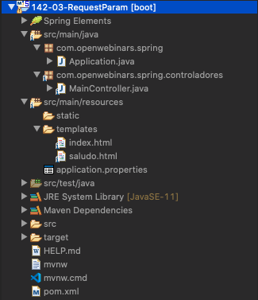

tenemos aquí nuestro controlador o mejor dicho nuestro controladores que hicimos en este momento y bueno tendríamos que añadir al controlador bueno pues este arroba request para vale ya digo si queremos que el parámetro que sepas te tenga el mismo valor que el nombre de la variable no le tenemos que indicar el nombre al rico espada sino me ha dicho esto también lo va a aceptar lo podemos hacer de esta manera y entonces buscaría el parámetro con este nombre dentro de la cuerda vale y lo inyectar y a en esta variable de aquí vale podríamos por ejemplo en lugar de poner este mensaje a hacer un saludo de Hola Mundo personalizado vale lo podemos comentar si queréis nombre INE y ahora en la plantilla en este caso en la plantilla de Indy o podríamos quitar este mensaje donde se va a pasar el nem y en lugar de llamarlo mensaje pues podríamos poner la cadena de caracteres hola más saluda vale saludos tenemos por aquí podemos tratar de de compilarlo vale y de ejecutarlo para ver cómo funciona ejecutamos principio todo va bien y aquí podríamos localcall barra name y por ejemplo podemos poner el mío vale no que yo escrito por aquí para que lo veáis más claro la ruta cómo es la ruta de raíz ponemos directamente la barra vale ponemos el interrogante para delimitar que es una query y ponemos el Parc name que el nombre de la variable igual al valor que en este caso sería Luis vale pues podemos comprobar como ya no aparece por aquí nuestro si lo cambiáramos a otra vale por ejemplo estaríamos saludando a Ángel vale y podríamos cambiar y poner el valor de n que quisiéramos por aquí detrás

#### Modificar el Controlador

```java
@Controller
public class MainController {
	
   @GetMapping("/")
   public String welcome(@RequestParam String name, Model model) {
      model.addAttribute("nombre", name);
      return "index";
   }
	
   ...

}
```

O

```java
@Controller
public class MainController {
	
   @GetMapping("/")
   public String welcome(@RequestParam("name") String name, Model model) {
      model.addAttribute("nombre", name);
      return "index";
   }
	
   ...

}
```

#### Modificar la Vista `index.html`

```html
...
<body>
   <h1 th:text="${'Hola ' + nombre}">Hola Mundo!!!</h1>
</body>
</html>
```

#### Ejecutar la Aplicación

Para ejecutar la aplicación invocamos la URL `http://localhost:9000/?name=Adolfo`

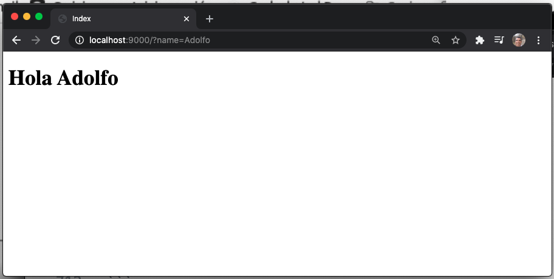
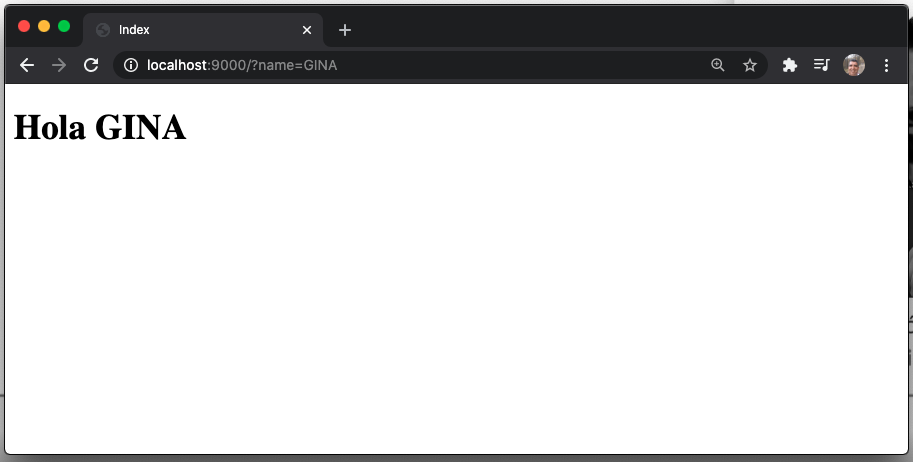


¿Qué pasa si no se le pasa un valor a la URL? 
Si invocamos la URL `http://localhost:9000/`

Podemos comprobar recoger los parámetros desde request param algo francamente sencillo sin embargo nos vamos a encontrar con alguna pequeña dificultad y es que bueno qué pasa si no le pasamos ningún valor a esta ruta vayamos otra vez de nuevo vale al navegador y aquí en lugar de saludar a Ángel no saludamos a nadie cómo nos produce un error de tipo 400 hablábamos en las lecciones anteriores que los errores 400 se producen porque la petición no está bien formada en nuestro caso en el fondo es que no lo hemos programado bien porque lo ideal es que no seamos nosotros como programadores los que le demos un tratamiento y digamos algún tipo de parámetro por defecto vale ya que bueno si no está presente me vale pues el usuario lo quería sería un error que no merece

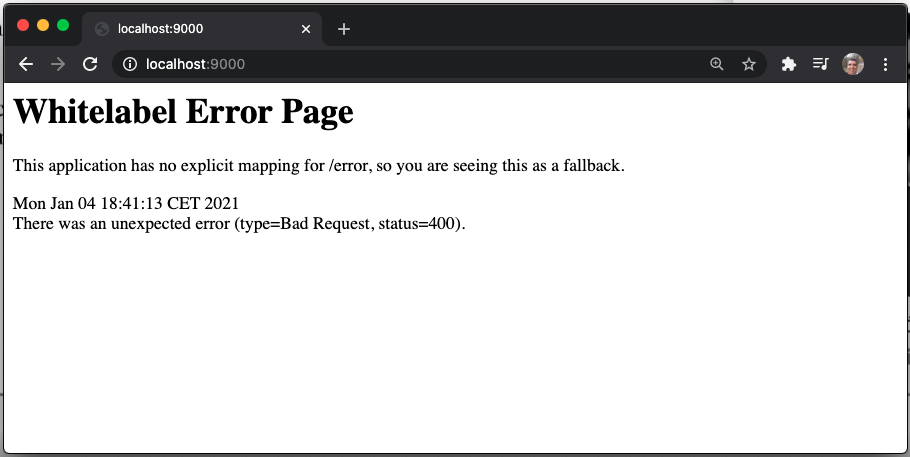

Tenemos un Error `400` por que la petición no esta bien formada.

```java
```


```java
```

```java
```

por defecto como estábamos viendo en la slide request param tiene el atributo Ruiz wild a true es decir que es obligatorio y que se pase parámetros y no se lanza el error 400 tenemos dos opciones que las vamos a ver por un lado tendríamos el poner el retail AFOL y poner un valor por defecto si no pasamos ningún valor se muestra el valor por defecto si pasamos un valor pues se muestra el valor pasado y por otro el uso de la del contenedor opcional vale a la hora de darle tratamiento con lo cual ya sabemos que de Java 8 optional bueno pues no nos va a producir un error simplemente que el contenedor estaría vacío y tendremos que ser nosotros los que le demos tratamiento vamos a ver los dos los dos ejemplos un lado tendremos aquí que en lugar de poner solamente esto de esta forma tendríamos que añadirle algo más darme el nene vale decir que no es obligatorio y tendríamos que dar aquí un valor por defecto que podríamos poner como mundo de esta forma 

```java
@Controller
public class MainController {
	
   @GetMapping("/")
   public String welcome(@RequestParam(name="name", required=false, defaultValue="Mundo") String name, Model model) {
      model.addAttribute("nombre", name);
      return "index";
   }
   
   ...

}
```


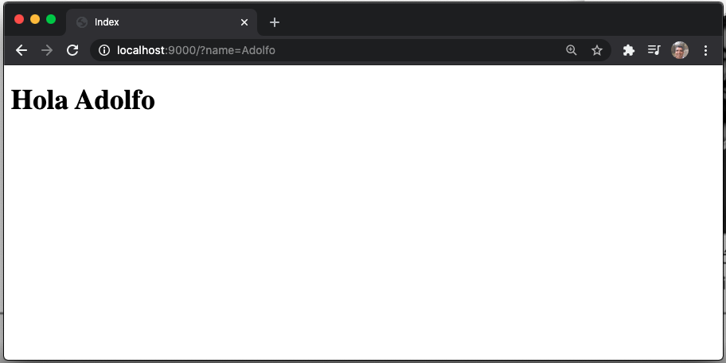


relanzamos y recargamos en este caso sería un opcional de Stream lo que recogería mucho vale como name y nuestros móvil la clase de Java optional Java AWT y ahora que tendríamos que hacer pues aparte de redirigir a la plantilla que va a ser la misma tendríamos que darle tratamiento y recoger valor una manera sencilla de hacer el mismo comportamiento de antes de aquí que tiene valor y si no tiene valor pues puedes pasar directamente la cadena de caracteres vale y en lugar de hacerlo a través de la propia no está haciendo spring lo haríamos con nuestro conocimiento de Java 


```java
@Controller
public class MainController {
	
   @GetMapping("/")
   public String welcome(@RequestParam(name="name") Optional<String> name, Model model) {
      model.addAttribute("nombre", name.orElse("Mundo"));
      return "index";
   }
   
   ...

}
```


vale vemos que sigue saludando a Adolfo pero y lo quitamos vale sigue saludando mundo pero en este caso lo hemos hecho con JAVA 

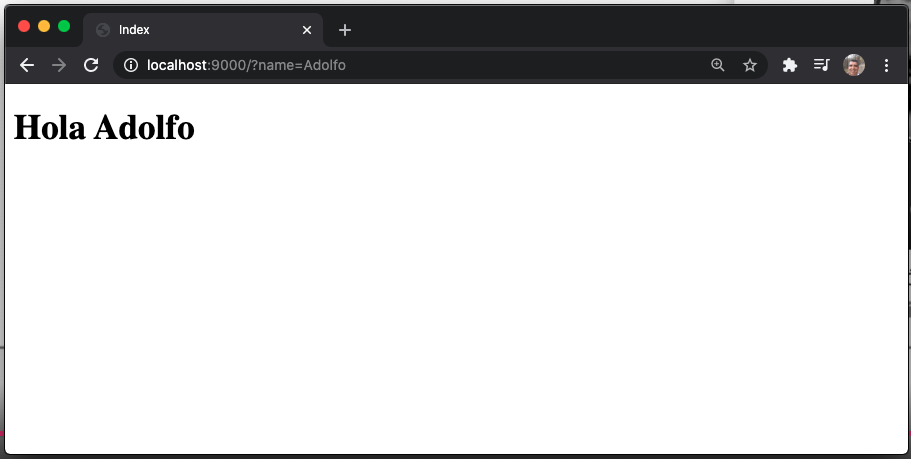
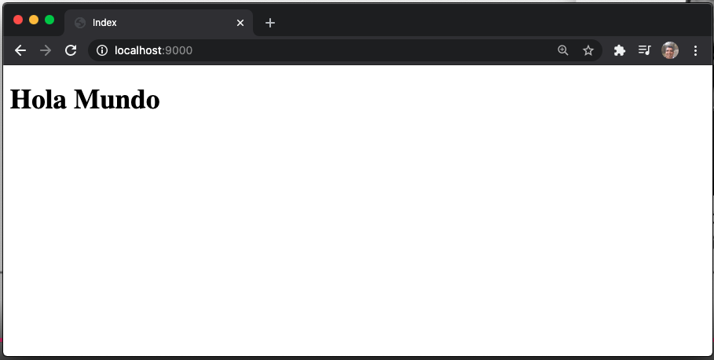

hasta aquí el tratamiento en la parte Queen

# 16 @PathVariable 4:30 

[PDF RequestParam_y_PathVariable_.pdf](pdfs/14._RequestParam_y_PathVariable_.pdf)

## Resumen Profesor

No existe.

## Transcripción


Ahora vamos a ver lo que sería incluir variables dentro del propio paz vale variable siempre vendrán encerrada entre llaves y vienen asociadas bueno pues está a esta moda de URL vale de reescritura de URL que tenemos desde 1 años hacia Castro y es que bueno en lugar de pasar aquí que además ese algo más verbos o pedidos interrogante cliente y de igual al valor del cliente pues lo pasamos directamente aquí y a lo mejor si queremos los pedidos del cliente siete pues es la ruta barra pedidos barrasiete no los valores pueden estar al final de la ruta o en medio de una ruta no sé que hiciéramos los artículos de un determinado pedido pues podríamos plantear un controlador con una ruta sino pedido barra pedido y de mal ejemplo 7 para artículos vale pathvariable funciona de forma similar a Rico es para vale de manera que si queremos con el controlador de saludo que saludé un determinado nombre no podríamos hacer vale y sería menos vergonzoso que en el caso anterior recordad que en este caso no podemos poner valores por defecto porque bueno sería en el fondo el que planteamos otra ruta totalmente distinta que posiblemente necesitará otro por separado siempre da que podríamos añadir más ruta aquí dentro vale ya veremos en alguno de los ejemplos cómo se hace para que un mismo método del controlador pueda mapear más de una vale sería la manera de dar un comportamiento por defecto pero como tal como lo teníamos en Rico es para no lo hay podemos vernos aquí directamente a saludo y tener buenos días queremos saludar a una persona en particular teníamos que inyectar el valor con arroba path variable y aquí lo tendríamos con esta notación y bueno podríamos añadir el saludo lo podemos concatenar directamente aquí sea hola vale más el propio leo hemos pasado lo de volveríamos a saludo vamos a revisar no hemos cambiado nada en la plantilla no lo vamos a quedar directamente aquí vale 


```java
@Controller
public class MainController {
	
   ...
	
   @GetMapping("/saludo/{name}")
   public String saludo(@PathVariable String name, Model model) {
      model.addAttribute("saludo", "Hola " + name);
      return "saludo";
   }

}
```

volvemos a ejecutar saludo tendríamos un error 404 porque esta ruta realmente como tal sola no se encuentra mareada 

http://localhost:9000/saludo

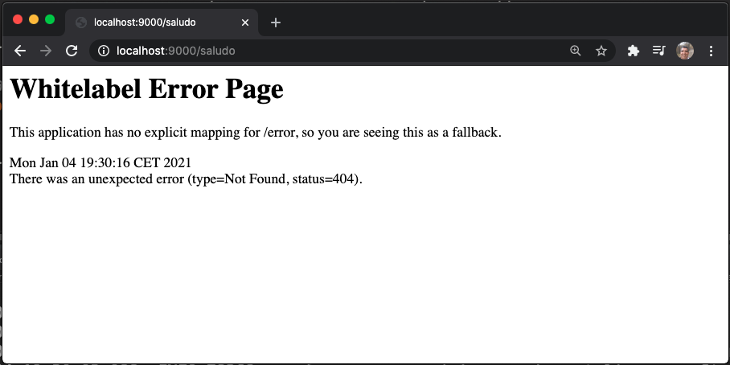

y si ponemos aquí barra Luismi en este caso no estaría haciendo el saludo a nosotros 

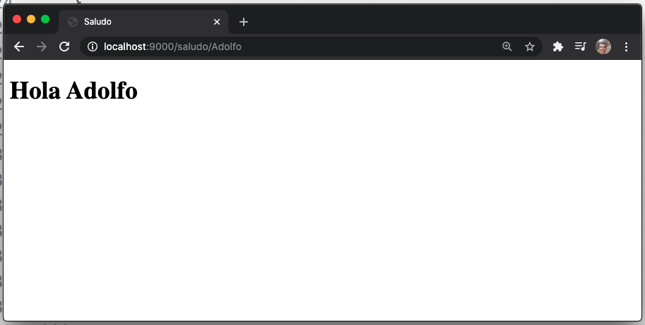

ya digo yo más que para cadena de caracteres que también se utiliza veréis como en los ejemplos lo utilizamos con número asociado a los Ibex vale para que podamos ir rescatando editando o accediendo a un determinado elemento 


como siempre ya he dicho que me estás lecciones centrales vamos a tener algo para que podáis practicar por vuestra cuenta en este caso propongo que modifique y el controlador welcome vale para que reciban lugar de un parámetro en la parámetros en lugar de recibir un hombre puede recibir un fernet y un Lazne aquí os dejo un ejemplo de lo que sería la ruta para que para que podáis hacer vosotros al Mateo ya veréis como podéis ir mapeando cada uno de los elementos que está en la query a través de buenos días notaciones rico estarán en variables diferente podríais capturar los dos valores añadirlo al modelo pasarlo hacia la plantilla y hacer un saludo con nombre y apellido por separadas vale también podría hacer lo mismo pero con pathvariable para que comprobéis que bueno un buen pasando dos variables a través del PAN vale pues también funcionaria incluso lo podéis hacer con la misma plantilla hasta que la recogida de parámetros en la próxima elección vamos a hablar de cómo incluir elemento estático en nuestro proyecto


# 17 Recursos estáticos 10:33 

[PDF Contenido_estático.pdf](pdfs/15._Contenido_estático.pdf)

## Resumen Profesor

No existe.

## Transcripción

Hola a todos vamos a continuar con el bloque de String en bici hablando sobre contenido estático y es que cualquier proyecto web va incluirlo por contenido estático entendemos al contenido de fichero html todo el código HTML imágenes imágenes que que puede incluir ya nuestra plantilla el código CSS destino otro tipo de hojas de estilo JavaScript fichero Pinario etcétera podremos decir casi de esta manera que es todo aquello que no es propiamente pues nuestro código fuente Java ni descriptores XML aproximadamente no bueno pues qué hacemos con el dónde lo ubicamos porque es que ahora hemos visto cómo estructurar la parte del proyecto sobre todo lo que aceptaba al código Java y hemos generado en nuestro proyecto de Spring boot con el servicio de Spring y se laisser con el mismo asistente que nos trae spring tool suite lo normal es que la estructura de ese proyecto generado incluya una ruta dentro de la carpeta SRC main resources vale llamada static y es el sitio idóneo para poder ubicarlo porque al generar el proyecto y utilizar el facebook todo aquello que esté localizada en esa carpeta a entender que es que es un recurso estático sino no interesa o bueno nuestro estilo de funcionamiento nuestra organización de código a distinta spring boot va mapear lo que encuentre tanto en la carpeta static como en la carpeta Public como en la carpeta rizos como meta in Three Souls vale va a hacer un mapeo de todo lo que se encuentre en esa carpeta en la raíz de nuestro proyecto es decir que si queremos un CSS dentro de la carpeta static vía URL decir a a través del navegador no podremos localizar bueno pues con con el la base nuestro dominio vale y justo en la raíz ahí lo tendríamos ubicado de forma que bueno puede spring nos sirve el contenido estático cuando se cuando me refiero a servir me refiero que no nos lo dan no nos sirve el contenido estático de una manera francamente es sencilla vale para comprobarlo vamos a añadir algo de código a nuestra aplicación vamos a copiar y pegar el proyecto de el proyecto anterior vale lo vamos a copiar lo vamos a pegar no vamos a llamar

### :computer: `142-04-ContenidoEstatico`
#### Ejemplo de uso de contenido estático

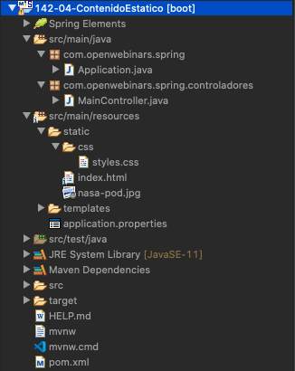

Vale cambiamos para que no haya problema cerrar íbamos añadirle algún elemento cómo podemos comprobar la carpeta static está vacía no bueno pues vamos a añadir por ejemplo una imagen vale dentro de la carpeta static para poder comprobar cómo cómo spring nos sirve ese contenido de una manera sencilla para ello vamos ayer no vale a por ejemplo la cualquier imagen que tengáis de cualquier imagen que tengáis en vuestro ordenador valdrá novio voy a descargarme la imagen de la NASA (https://apod.nasa.gov/apod/astropix.html) del día de hoy vale que bueno pues normalmente pues suelen poner alguna imagen de algún planeta o alguna fotografía espacial vale y esta misma la vamos a almacenar vale en el escritorio cómo Mazda la guardamos ahí mismo vale directamente la podríamos copiar vale desde el escritorio yo la tengo por aquí la podemos copiar vale y ahora estamos nuestro proyecto aquí mismo lo podremos abrir vale aquí no atiende y como como la lesión anterior y si ponemos por aquí el nombre de la imagen podemos ver como como nos está sirviendo este recurso 


`http://localhost:9000/nasa-pod.jpg`

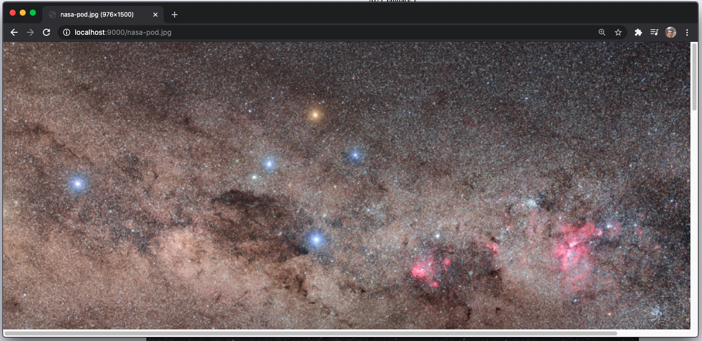

bueno esto como podemos comprobar pues funciona con con sencillez no también podríamos comprobarlo añadiendo algún fichero estático vale de html dentro de la propia carpeta static y podríamos comprobar como como también lo sirve podemos crear aquí un nuevo pero HTML lo vamos a llamar ml le vamos a copiar el código de de alguna plantilla que hemos usado anteriormente vale quitando alguna cosa


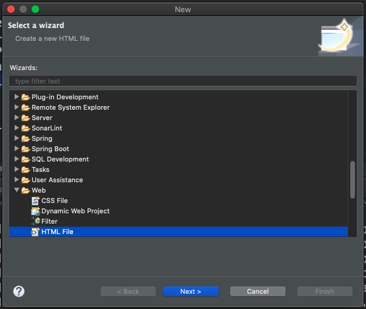
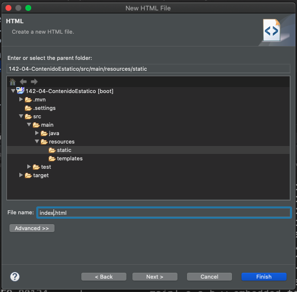

`static\index.html`

```html
<!DOCTYPE html>

<html xmlns:th="http://www.thymeleaf.org">
<head>
<meta charset="utf-8">
<meta http-equiv="X-UA-Compatible" content="IE=edge">
<meta name="viewport" content="width=device-width, initial-scale=1">
<!-- The above 3 meta tags *must* come first in the head; any other head content must come *after* these tags -->
<title>Bootstrap 101 Template</title>
<!-- Bootstrap -->
<link href="https://maxcdn.bootstrapcdn.com/bootstrap/3.3.7/css/bootstrap.min.css"
	rel="stylesheet">

<!-- HTML5 shim and Respond.js for IE8 support of HTML5 elements and media queries -->

<!-- WARNING: Respond.js doesn't work if you view the page via file:// -->

<!--[if lt IE 9]>
      <script src="https://oss.maxcdn.com/html5shiv/3.7.3/html5shiv.min.js"></script>
      <script src="https://oss.maxcdn.com/respond/1.4.2/respond.min.js"></script>
    <![endif]-->

   <link href="/css/styles.css" rel="stylesheet" type="text/css" />
</head>
<body>
   <h1>Openwebinars nos trae la imagen del día de la NASA</h1>
   
   <!-- jQuery (necessary for Bootstrap's JavaScript plugins) -->
   <script src="https://ajax.googleapis.com/ajax/libs/jquery/1.12.4/jquery.min.js"></script>

   <!-- Include all compiled plugins (below), or include individual files as needed -->
   <script src="https://maxcdn.bootstrapcdn.com/bootstrap/3.3.7/js/bootstrap.min.js"></script>

</body>

</html>
```

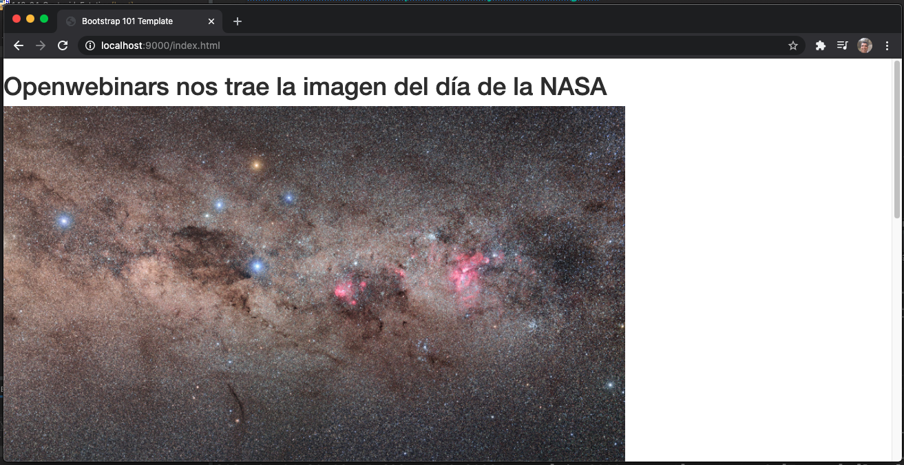

, tenemos aquí a la imagen de como al recargar tenemos aquí a la imagen del día de la NASA el título y todo todo este contenido HTML estático que está haciendo el coche está haciendo servidor fácilmente también podemos organizar el contenido en carpeta y crear aquí una nueva carpeta new folder por ejemplo para para ubicar aquí todos los todas las hojas de estilo CSS no y dentro podríamos crear confitar CCC vale no podríamos llamar FCF y podríamos cambiar en plan todo el cuerpo el color de la fuente fuese rojo la familia de Cifuentes vale tipografía sea por ejemplo área San Félix vale de todas maneras como por debajo está utilizando boostrap ya tiene una bastante parecida a podríamos cambiar quizá bueno pues y añadimos en esta index HTML el enlace adecuado vale cómo podemos comprobar ahora estamos haciendo el referente a la raíz styles.css vale 

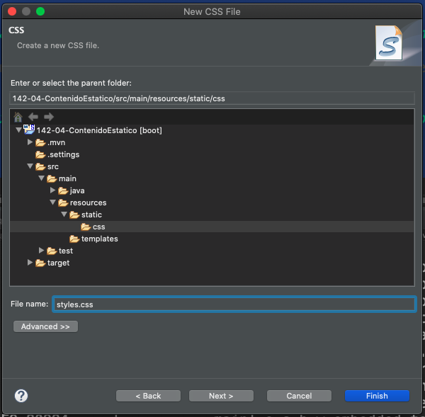
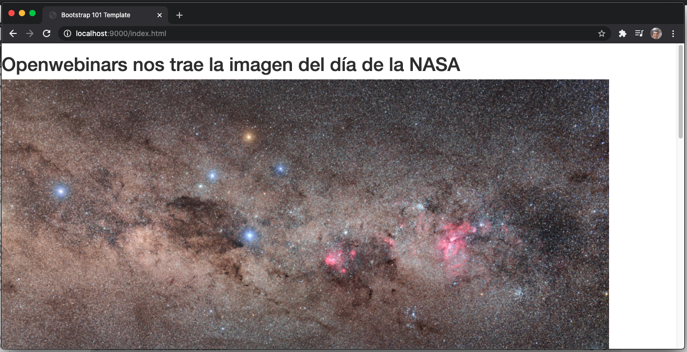

`styles.css`

```css
@charset "UTF-8";

body {
   color: red;
   font-family: 'Times New Roman', sans-serif;
}
```

relanzamos el proyecto el proyecto nos damos cuenta como cambiado la tipografía ha cambiado el color y bueno está sirviendo todo el contenido estático en el siguiente vídeo vamos a ver cómo servir un contenido estático especial como son las webcam que nos van a permitir disponer de las librerías más utilizadas por ejemplo bootstrap y jQuery a través de dependencia en mail

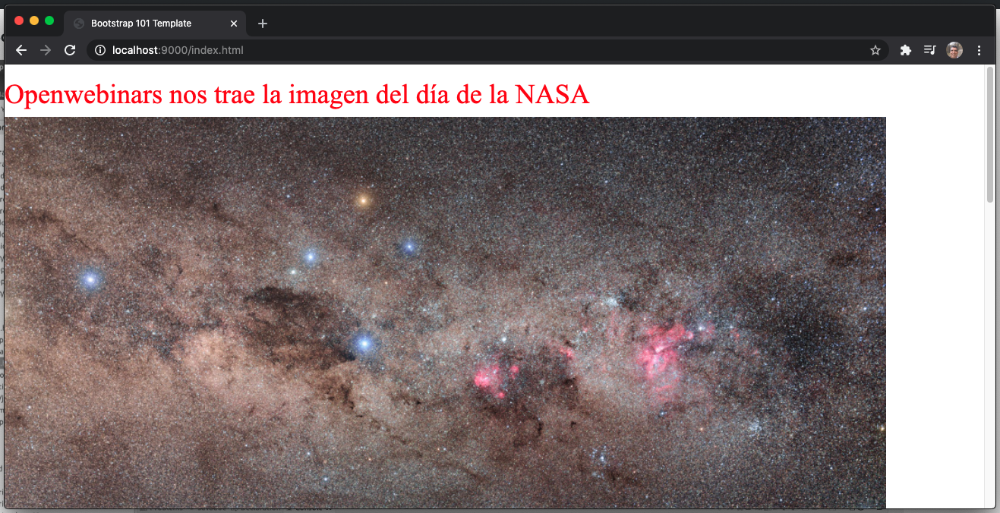


# 18 WebJars 11:33 

## Resumen Profesor

### Dependencias maven más utilizadas

Tan solo cambiando la versión, podemos tener diferentes versiones de bootstrap, jquery, o la librería que estemos vinculando.

```html
<dependency>
    <groupId>org.webjars</groupId>
    <artifactId>bootstrap</artifactId>
    <version>3.3.7-1</version>
</dependency>
 
<dependency>
    <groupId>org.webjars</groupId>
    <artifactId>jquery</artifactId>
    <version>3.3.1-1</version>
</dependency>
 
<dependency>
    <groupId>org.webjars</groupId>
    <artifactId>webjars-locator</artifactId>
    <version>0.34</version>
</dependency>
```

## Transcripción

https://www.webjars.org/

Hola a todos vamos a continuar hablando de recursos estáticos y lo vamos a hacer hablando de las cuencas y es que vamos a comprobar cómo podemos integrar nuestro estilo de trabajo con May venga otra vez de dependencias XML y el uso de alguna de las librerías más más típicas vale que se utilizan en contexto web alguno de los recursos estéticos más utilizados y que son un quebradero de cabeza para el programador pues suelen ser boostrap very moment diferentes librería de JavaScript vale o de hojas de estilo o tema vale que bueno pues que de alguna manera tenemos varias alternativas como suelen ser la primera de todas pues descargarnos y colocarla dentro de nuestra carpeta de recursos estáticos no pero eso es la verdad es que se vuelve tedioso sobre todo de mantener y de actualizar podemos tener al igual que nos sucede con nuestras librería alguna manera de bueno pues declarar una dependencia externa vinculado una versión mediante la cual si actualizamos la versión fue automáticamente desde un servidor remoto se descargue ese nuevo código fuente y lo integran nuestro proyecto pero para ese contenido estático del que estamos hablando antes la respuesta es si vamos a poder añadir estos recursos bootstrap de query a través de Maiden mediante las fuerzas vale podemos comprobar como como tenemos por aquí la posibilidad de integrar al una muchacha de la librería más típica vale utilizando utilizando M&B la verdad es que francamente cómodo la ventaja es que bueno pues no tenemos que descargarnos nosotros este contenido estático y meterlo dentro de nuestro proyecto lo cual requeriría de una automatización dónde que no podríamos automatizar la actualización tendría que ser un proceso manual por qué no nos obliga a que utilicemos un CDN externo que bueno no suelen ser enlace que se rompa con facilidad pero si es verdad que la velocidad de descarga no tiene porqué ser acordé a la de nuestra aplicación web con lo cual bueno pues podría llegar a ser un cuello de botella por mucho ancho de banda por muy rápido que fuesen nuestros servidores y para terminar de cargar nuestra página necesitamos lo estilo o el busca por ejemplo y utilizamos un CDN que sea lento o al final nuestra página también va a salir entonces si lo integramos como dependencia ganamos la ventaja de que la velocidad será acordé y también ganamos como ventaja que bueno que la actualización va a ser sencilla la integración y actualización va a ser sencilla cómo configurar muerto bueno pues spring boot y vuelve otra vez de nuevo a al rescate y es que todas las webcast que nosotros tengamos definidas dentro de nuestro pom.xml como dependencia estarás mapeadas a la ruta barra webhard barra Monopoly la que sea boostrap la librería que sea vale y en esta ruta se estará sirviendo el contenido del fichero heart que se habrá descargado mediante mediante la dependencia Maiden vamos a comprobarlo añadiendo en lugar desde un CDN como hemos hecho en el vídeo anterior que bueno que es donde estaba vinculado ese Asia donde hacíamos referencia para para obtenerlo estilo y el Javascript de de bushcraft de Idella Bakery vamos a usar está Cuenca en concreto utilizaremos una idea podemos comprobarlo hemos visto en su en su web no que podemos


Utilizar una por cada librería que vamos a añadir más una adicional está adicional nos va a permitir disfrutar de versión agnóstica eso qué significa bueno fue si nos fijamos en el código fuente que hemos definido antes hemos tenido que indicar siempre la versión concreta de Jay query me gusta o de la librería en particular que estamos utilizándolo y eso es porque bueno para poder hacer un versionado correcto para mantener distintas versiones hacia las cuales apunten los usuarios en el CDN pues se tiene que decidir la versión hacia la cual pues estamos apuntando sin embargo mediante el uso de la versión agnóstica nosotros vamos a utilizar una versión concreta pero vamos a comprobar como en nuestra ruta no vamos a tener que indicar la versión esto va a ser transparente nos va a permitir hacer transparente el cambio de versión es decir no vamos a tener que visitar todas nuestras plantillas para cambiar por ejemplo de la versión 112 la que sea de Jake weary si se llegará publicar las 1:13 no nos hará falta simplemente con que modifiquemos la versión concreta de Jay query a hacia la cual estamos apuntando en la dependencia se actualizará y no tenemos que cambiar las plantillas como decía vamos añadir estás 3 dependencia a nuestro proyecto vale de recurso estático 

### :computer: `142-05-WebJars`
#### Ejemplo de uso de WebJars

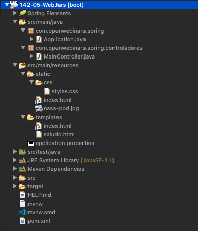

`pom.xml`

```html
...
   <dependency>
      <groupId>org.webjars</groupId>
      <artifactId>bootstrap</artifactId>
      <version>3.3.7-1</version>
   </dependency>

   <dependency>
      <groupId>org.webjars</groupId>
      <artifactId>jquery</artifactId>
      <version>3.3.1-1</version>
   </dependency>

   <dependency>
      <groupId>org.webjars</groupId>
      <artifactId>webjars-locator</artifactId>
      <version>0.34</version>
   </dependency>
...
```

y ahora tenemos que hacer algunos cambios para poder integrar la y es que como decía vamos a tener que hacer algunos cambios en la ruta ya que en lugar de bueno de donde esté en la versión concreta de bus trapo daycare y en el CDN que estemos utilizando o si lo tuviéramos descargado como como un contenido estático dentro de nuestro proyecto lo que vamos a hacer directamente a apuntar a al contenido que nos ofrecen la cuenta vale para ellos lo que vamos a hacer es bueno pues la plantilla que antes teníamos directamente sirviendo en un contenido estático bueno pues todo ese contenido lo vamos a integrar aquí dentro vale vamos a salvar esto lo vamos a poner por aquí arriba y este que era solamente de contenido estático nos lo vamos a traer ahora como plantilla y esta primera línea el título por aquí

`template\index.html`

```html
<!DOCTYPE html>
<html xmlns:th="http://www.thymeleaf.org">
<head>
<meta charset="utf-8">
<meta http-equiv="X-UA-Compatible" content="IE=edge">
<meta name="viewport" content="width=device-width, initial-scale=1">
<!-- The above 3 meta tags *must* come first in the head; any other head content must come *after* these tags -->
<title>Bootstrap 101 Template</title>
<!-- Bootstrap -->
<link href="https://maxcdn.bootstrapcdn.com/bootstrap/3.3.7/css/bootstrap.min.css">

<!-- HTML5 shim and Respond.js for IE8 support of HTML5 elements and media queries -->
<!-- WARNING: Respond.js doesn't work if you view the page via file:// -->

<!--[if lt IE 9]>
      <script src="https://oss.maxcdn.com/html5shiv/3.7.3/html5shiv.min.js"></script>
      <script src="https://oss.maxcdn.com/respond/1.4.2/respond.min.js"></script>
    <![endif]-->
   <link href="/css/styles.css" rel="stylesheet" type="text/css" />
</head>
<body>
   <h1 th:text="${'Hola ' + nombre}">Hola Mundo!</h1>

<!-- 	<h1>Openwebinars nos trae la imagen del día de la NASA</h1>
 -->
   

   <!-- jQuery (necessary for Bootstrap's JavaScript plugins) -->
   <script src="https://ajax.googleapis.com/ajax/libs/jquery/1.12.4/jquery.min.js"></script>

   <!-- Include all compiled plugins (below), or include individual files as needed -->
   <script src="https://maxcdn.bootstrapcdn.com/bootstrap/3.3.7/js/bootstrap.min.js"></script>
</body>
</html>
```

Esta manera pues tenemos la misma de antes vale la imagen de la NASA en lugar de que venga este saludo puede ser hay que teníamos en vídeo anteriores lo tendríamos con vuestra aquí la cuestión sería ahora actualizar las rutas como estábamos diciendo y es que en lugar de él si queremos que apunten al CDN tendríamos que limpiar esta parte de aquí de forma que quedaría así barra la librería correspondiente y en este caso boostrap tiene una parte de CSS y quedaría integrada de esa forma aquí tendríamos que añadir barra rebajar del query por el uso de la Virgen atlántica podemos eliminar el número de versión y aquí pues nos pasaría como antes podemos quitar la versión el contenido JavaScript nos damos cuenta y venimos a las dependencias neiben podemos localizar la webcam Madrid que se han descargado por aquí por ejemplo la de boostrap y podemos comprobar como aquí dentro tenemos todo el contenido vale por ejemplo este que estamos haciendo referencia aquí vale cuando tendríamos directamente aquí pero está haciendo servido en esta ruta vale con lo cual es francamente como principio lo tenemos que tener listo y ejecutamos el proyecto

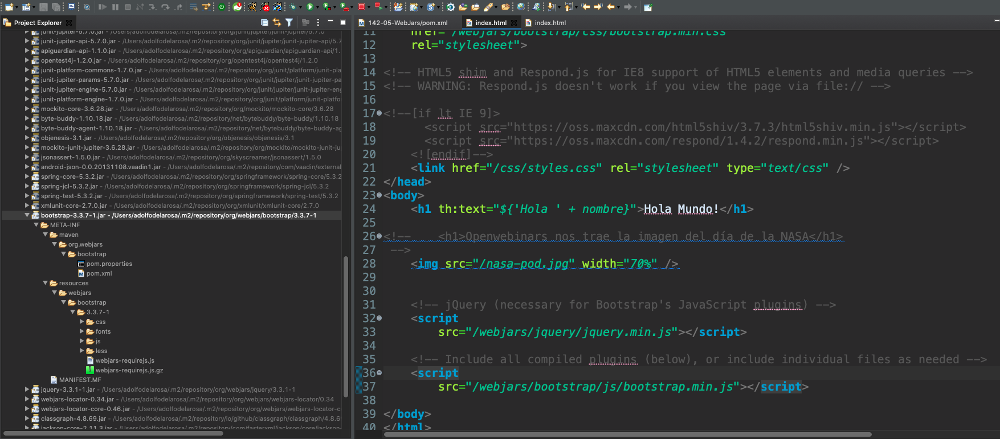

`template\index.html`

```html
<!DOCTYPE html>
<html xmlns:th="http://www.thymeleaf.org">
<head>
<meta charset="utf-8">
<meta http-equiv="X-UA-Compatible" content="IE=edge">
<meta name="viewport" content="width=device-width, initial-scale=1">
<!-- The above 3 meta tags *must* come first in the head; any other head content must come *after* these tags -->
<title>Bootstrap 101 Template</title>
<!-- Bootstrap -->
<link href="/webjars/bootstrap/css/bootstrap.min.css" rel="stylesheet">

<!-- HTML5 shim and Respond.js for IE8 support of HTML5 elements and media queries -->
<!-- WARNING: Respond.js doesn't work if you view the page via file:// -->

<!--[if lt IE 9]>
      <script src="https://oss.maxcdn.com/html5shiv/3.7.3/html5shiv.min.js"></script>
      <script src="https://oss.maxcdn.com/respond/1.4.2/respond.min.js"></script>
    <![endif]-->
   <link href="/css/styles.css" rel="stylesheet" type="text/css" />
</head>
<body>
   <h1 th:text="${'Hola ' + nombre}">Hola Mundo!</h1>

<!-- 	<h1>Openwebinars nos trae la imagen del día de la NASA</h1>
 -->
   

   <!-- jQuery (necessary for Bootstrap's JavaScript plugins) -->
   <script src="/webjars/jquery/jquery.min.js"></script>

   <!-- Include all compiled plugins (below), or include individual files as needed -->
   <script src="/webjars/bootstrap/js/bootstrap.min.js"></script>
</body>
</html>
```

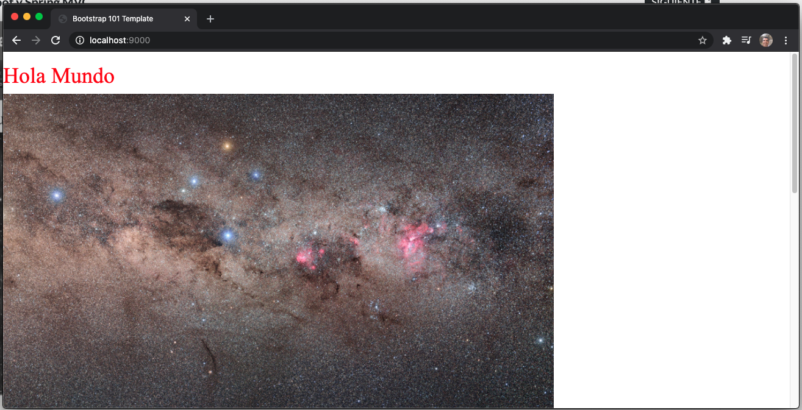

Con Hola Mundo vale en nuestra nuestra plantilla que hemos creado y podemos comprobar como se ha descargado correctamente vale pues todo el contenido y recargamos por aquí o no pues todo el contenido de me gusta pibakery y lo ha hecho desde la ruta a correspondiente es decir que está sirviendo todos los ficheros y lo está haciendo desde nuestro contenido nuestro contenido local que hemos tenido a través de las dependencias


os propongo como en lecciones anteriores para practicar algo con lo que podáis trabajar con el contenido web estático y es que si tenéis ya los conocimientos suficientes de HTML5 CSS3 JavaScript podéis probar a crear un sitio web completo vale típico de pantalla de inicio quiénes somos qué hacemos página de contacto y lo podéis servir entero dentro de la carpeta static y cómo puedes comprobar cómo poder invocar el html en CSS y todo lo podéis hacer en a través de esa carpeta y de cómo sirve el contenido estático spring boot también podéis probar a proyecto anterior en las plantillas añadirle bueno pues en calzado menú Maneto de este contenido HTML dándole estilo CSS propio y guardando esos estilos en un fichero CSS que sea independiente y que tengamos dentro de la carpeta static o en algún subdirectorio del mismo hasta aquí el contenido estático en los siguientes vídeos vamos a trabajar con formularios


# 19 Creación de formularios 20:54 

[PDF Formularios.pdf](pdfs/16._Formularios.pdf)

[ficheros](pdfs/ficheros.zip)

## Resumen Profesor

### Código utilizado en el ejemplo

#### Clase `Empleado`

```java
public class Empleado {

    private long id;
    private String nombre;
    private String email;
    private String telefono;

    //constructores, getters y setters

}
```

#### Clase `EmpleadoService`

```java
package com.openwebinars.spring.servicios;

import java.util.ArrayList;
import java.util.Arrays;
import java.util.List;

import javax.annotation.PostConstruct;

import org.springframework.stereotype.Service;

import com.openwebinars.spring.modelo.Empleado;

@Service
public class EmpleadoService {

    private List<Empleado> repositorio = new ArrayList<>();


    public Empleado add(Empleado e) {
        repositorio.add(e);
        return e;
    }

    public List<Empleado> findAll() {
        return repositorio;
    }

    @PostConstruct
    public void init() {
        repositorio.addAll(
                Arrays.asList(new Empleado(1,"Antonio García", "antonio.garcia@openwebinars.net", "954000000"),
                        new Empleado(2,"María López", "maria.lopez@openwebinars.net", "954000000"),
                        new Empleado(3,"Ángel Antúnez", "angel.antunez@openwebinars.net", "954000000")                        
                        )
                );
    }

}
```

#### Plantilla `list.html`

```java
<!DOCTYPE html>
<html lang="es" xmlns:th="http://www.thymeleaf.org">
  <head>
    <meta charset="utf-8">
    <meta http-equiv="X-UA-Compatible" content="IE=edge">
    <meta name="viewport" content="width=device-width, initial-scale=1">
    <!-- The above 3 meta tags *must* come first in the head; any other head content must come *after* these tags -->
    <meta name="description" content="">
    <meta name="author" content="">

    <title>Starter Template for Bootstrap</title>

    <!-- Bootstrap core CSS -->
    <link href="/webjars/bootstrap/css/bootstrap.min.css" rel="stylesheet">

    <!-- Custom styles for this template -->
    <link href="/css/starter-template.css" rel="stylesheet">


    <!-- HTML5 shim and Respond.js for IE8 support of HTML5 elements and media queries -->
    <!--[if lt IE 9]>
      <script src="https://oss.maxcdn.com/html5shiv/3.7.3/html5shiv.min.js"></script>
      <script src="https://oss.maxcdn.com/respond/1.4.2/respond.min.js"></script>
    <![endif]-->
  </head>

  <body>

    <nav class="navbar navbar-inverse navbar-fixed-top">
      <div class="container">
        <div class="navbar-header">
          <button type="button" class="navbar-toggle collapsed" data-toggle="collapse" data-target="#navbar" aria-expanded="false" aria-controls="navbar">
            <span class="sr-only">Toggle navigation</span>
            <span class="icon-bar"></span>
            <span class="icon-bar"></span>
            <span class="icon-bar"></span>
          </button>
          <a class="navbar-brand" href="#">Miempresa.com</a>
        </div>
        <div id="navbar" class="collapse navbar-collapse">
          <ul class="nav navbar-nav">
            <li class="active"><a href="#">Inicio</a></li>
            <li><a href="/empleado/new">Nuevo empleado</a></li>
          </ul>
        </div><!--/.nav-collapse -->
      </div>
    </nav>

    <div class="container">

      <div class="starter-template">
        <h1>Listado de empleados de la empresa</h1>
      </div>

    </div><!-- /.container -->


    <!-- Bootstrap core JavaScript
    ================================================== -->
    <!-- Placed at the end of the document so the pages load faster -->
    <script src="/webjars/jquery/jquery.min.js"></script>
    <script src="/webjars/bootstrap/js/bootstrap.min.js"></script>
  </body>
</html>
```

Puedes descargar estos tres ficheros pulsando [aquí](pdfs/ficheros.zip).

## Transcripción

Hola a todos vamos a continuar con nuestro curso delfín en bici y vamos a iniciar una serie de vídeos en los que vamos a hablar sobre formularios y vamos a introducirnos en este primer vídeo en cómo crear formularios que nos permitan recoger información del usuario en particular nos va a ofrecer funcionalidades para manejar formularios en conjunción con el sistema de plantillas que se utilizando que nuestro caso está hija integración pues nos permite que a través de un objeto llamado el humano 10 vale podemos recoger la información que el usuario que el usuario escribe es seco mano pie es un bin vale podría llamar bien especial que nos servirá como una especie de copia de respaldo de todo lo que nosotros escribamos en un formulario No vamos a comprobar como estos gestos los con menos 10 deben tener tantos atributos con qué triste tener como campos tenga el formulario sobre el cual está queriendo hacer el respaldo no en alguna ocasiones será nuestro caso podemos utilizar como estos coman objet las propias entidades de nuestro modelo de dominio esto lo comprobaremos y lo entenderemos mejor en lo últimos vídeos del curso cuando hablemos de la integración con base de datos ID spring data JP a veamos con el flujo de un formulario en tengo en el formulario de por ejemplo de creación vale de una nueva instancia de un registro que estemos manejando en nuestra aplicación y lo vamos a comprender entre pasos vale lo vamos a dividir en tres pasos para para poder entenderlo mejor el primer paso lo que tenemos que hacer es enviar S10 al formulario lo hacemos a través de un método en el controlador anotado con getmapping Vale será como escuchara a una petición GET en la cual bueno pues lo que queremos hacer es añadir al modelo de ese controlador es un coma no 10 1 instancia lo normal es que esté vacía o con algún dato por defecto y a partir de ahí añadiendo el sol modelo nos lleve directamente hacia la plantilla del formulario ese sería el primer paso en el segundo paso que lo vivimos bueno pues directamente en la plantilla lo que hacemos es tomar ese coma o 10 y asociamos cada uno de los atributos que incluya con su correspondiente campo en el formulario vale imaginemos por ejemplo que estamos dando de alta a una persona de empleado pues el atributo nombre pues se mapea con el campo el input del formulario nombre el atributo apellidos pues con el campo apellidos y así sucesivamente también tendremos que asociar el formulario con la ruta del controlador que no va a procesar para poder pasar hacia el paso 3 esa ruta debería ser mateada con postmapping Vale y el método de envío del formulario debería ser siempre que tengamos posibilidad haciendo uso de esposo si lo hiciéramos con get se enviarían todos los parámetros en la URL y eso bueno pues en ocasiones no es viable por falta de seguridad que no entre otras cosas en este tercer paso en de nuevo no hay controlador recogemos el objeto enviado desde el formulario ya relleno con los datos del usuario aplicamos la lógica de negocio correspondiente cuando hablamos de lógica de negocio pues nos queremos referir a posiblemente al uso de algún servicio mediante el cual pues lo vamos a almacenar en algún repositorio con algún tipo de procesamiento antes o durante


Vale y cuando ya hemos terminado de gestionar la información recibida del formulario lo normal sería que finalice la acción y para finalizar lo usual es que redirija Moss vale al usuario hacia otro controlador por ejemplo el de inicio el del listado de los registros del cuál hemos dado de alta un nuevo etcétera etcétera vamos a verlo graficamente partimos de un método del controlador anotado con getmapping por ejemplo empleado mío en el cual lo que hacemos es añadir una y nueva instancia del coma no te digo que si es para generar un nuevo lo normal es que esté vacío lo añadimos al modelo y lo mandamos directamente hacia la plantilla del formulario en esa plantilla indicamos por un lado que la acción del formulario va a hacer el paso 3 vale que será el método anotado con post mapping por otro lado recogemos el romano y sigamos vale asociamos cada uno de sus atributos con los distintos campos del formulario cuando el usuario pulse en el botón de enviar se ejecutará la acción que enviar a este Vale y lo recogeremos en otro método de mi controlador anotado con postmapping Vale y a través de la anotación model attribute a través de esa de esa anotación podremos recoger el coma nos 10 inyectarlo en un argumento de este método y dentro del método pues aplicar lo que corresponda como decía antes podría ser la llamada algún tipo de servicio que ese servicio desencadene la lógica de negocio de nuestra aplicación que lee en la base de datos o que haga lo que corresponda por último día digo que lo normal sería que no redirige era bien el listado bien de nuevo el formulario de creación de un nuevo una página de inicio lo que corresponda en nuestra aplicación en particular si trabajamos con con Spring y Time-Life vamos a ver el código que necesitaría y es que tendremos que añadir en el formulario algo de timely vale para poder darle este tratamiento con Express como decíamos antes tenemos que marcar la acción del formulario lo hacemos mediante el atributo Th está expresión que nos permite establecer una URL no nos dice que cuando se pulse o de alguna manera se desencadena el envío del formulario no redirigirá a estar ruta de aquí van enviando los datos por otro lado te hace oye nos permite Siscar el objeto el comando get en el marco de este formulario para poder después hacer el binding la asociación entre cada campo y el atributo del objeto lo cual lo hacemos aquí no por ejemplo en este input de tipo te contesté film vale es lo que hacemos es asociar este campo de texto con esta propiedad vale de este objeto de aquí vamos a hacerlo nosotros en la práctica vamos a partir de este proyecto de base vale proyecto de baja


### `142-06-Formularios`
#### Ejemplo de creación de un formulario

Partimos de una estructura básica que es la siguiente:

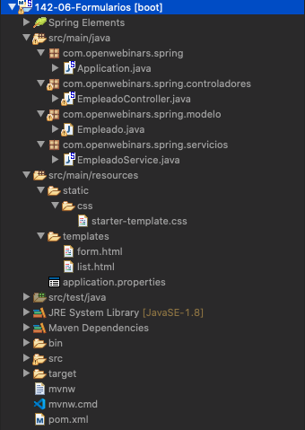

En nuestro archivo `pom.xml` tenemos todas las dependencias necesarias incluyendo los WebJars.

```html
...
   <dependencies>
      <dependency>
         <groupId>org.springframework.boot</groupId>
         <artifactId>spring-boot-starter-thymeleaf</artifactId>
      </dependency>
      <dependency>
         <groupId>org.springframework.boot</groupId>
         <artifactId>spring-boot-starter-web</artifactId>
      </dependency>
      <dependency>
         <groupId>org.springframework.boot</groupId>
         <artifactId>spring-boot-starter-test</artifactId>
         <scope>test</scope>
      </dependency>
      <dependency>
         <groupId>org.webjars</groupId>
         <artifactId>bootstrap</artifactId>
         <version>3.3.7-1</version>
      </dependency>
      <dependency>
         <groupId>org.webjars</groupId>
         <artifactId>jquery</artifactId>
         <version>3.3.1-1</version>
      </dependency>
      <dependency>
         <groupId>org.webjars</groupId>
         <artifactId>webjars-locator</artifactId>
         <version>0.34</version>
      </dependency>
   </dependencies>
...
```

En `application.properties` hemos cambiado el puerto por default 8080 a 9000 tenemos:

```txt
server.port=9000
```

Hemos tomado como plantilla, una de las plantillas started de [Bootstrap de la versión 3.3](https://getbootstrap.com/docs/3.3/examples/starter-template/):

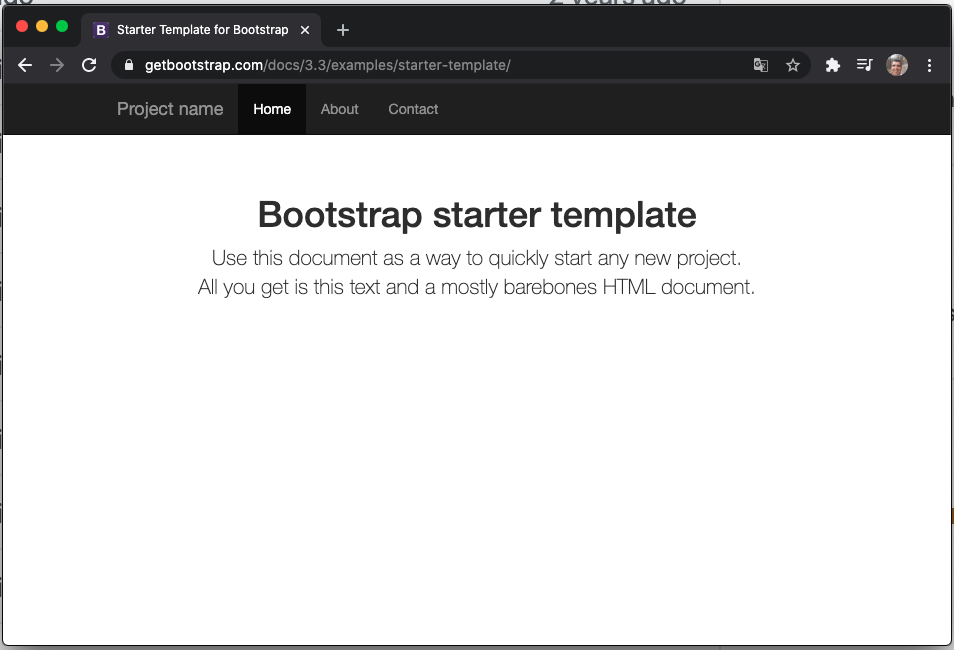

`list.html`

```html
<!DOCTYPE html>
<html lang="es" xmlns:th="http://www.thymeleaf.org">
   <head>
      <meta charset="utf-8">
      <meta http-equiv="X-UA-Compatible" content="IE=edge">
      <meta name="viewport" content="width=device-width, initial-scale=1">
      <!-- The above 3 meta tags *must* come first in the head; any other head content must come *after* these tags -->
      <meta name="description" content="">
      <meta name="author" content="">

      <title>Starter Template for Bootstrap</title>

      <!-- Bootstrap core CSS -->
      <link href="/webjars/bootstrap/css/bootstrap.min.css" rel="stylesheet">

      <!-- Custom styles for this template -->
      <link href="/css/starter-template.css" rel="stylesheet">

      <!-- HTML5 shim and Respond.js for IE8 support of HTML5 elements and media queries -->
      <!--[if lt IE 9]>
      <script src="https://oss.maxcdn.com/html5shiv/3.7.3/html5shiv.min.js"></script>
      <script src="https://oss.maxcdn.com/respond/1.4.2/respond.min.js"></script>
      <![endif]-->
   </head>
   <body>
      <nav class="navbar navbar-inverse navbar-fixed-top">
         <div class="container">
            <div class="navbar-header">
               <button type="button" class="navbar-toggle collapsed" data-toggle="collapse" data-target="#navbar" aria-expanded="false" aria-controls="navbar">
                  <span class="sr-only">Toggle navigation</span>
                  <span class="icon-bar"></span>
                  <span class="icon-bar"></span>
                  <span class="icon-bar"></span>
               </button>
               <a class="navbar-brand" href="#">Miempresa.com</a>
            </div>
            <div id="navbar" class="collapse navbar-collapse">
               <ul class="nav navbar-nav">
                  <li class="active"><a href="#">Inicio</a></li>
                  <li><a href="/empleado/new">Nuevo empleado</a></li>
               </ul>
            </div><!--/.nav-collapse -->
         </div>
      </nav>
      <div class="container">
         <div class="starter-template">
            <h1>Listado de empleados de la empresa</h1>
         </div>  
      </div><!-- /.container -->

      <!-- Bootstrap core JavaScript
      ================================================== -->
      <!-- Placed at the end of the document so the pages load faster -->
      <script src="/webjars/jquery/jquery.min.js"></script>
      <script src="/webjars/bootstrap/js/bootstrap.min.js"></script>
   </body>
</html>
```

Tenemos la plantilla que mencionabamos antes personalizada y adaptada a las WebJars.

Tenemos otra plantilla para el formulario:

`form.html`

```html
<!DOCTYPE html>
<html lang="es" xmlns:th="http://www.thymeleaf.org">
<head>
<meta charset="utf-8">
<meta http-equiv="X-UA-Compatible" content="IE=edge">
<meta name="viewport" content="width=device-width, initial-scale=1">
<!-- The above 3 meta tags *must* come first in the head; any other head content must come *after* these tags -->
<meta name="description" content="">
<meta name="author" content="">

<title>Starter Template for Bootstrap</title>

<!-- Bootstrap core CSS -->
<link href="/webjars/bootstrap/css/bootstrap.min.css" rel="stylesheet">

<!-- Custom styles for this template -->
<link href="/css/starter-template.css" rel="stylesheet">

<!-- HTML5 shim and Respond.js for IE8 support of HTML5 elements and media queries -->
<!--[if lt IE 9]>
      <script src="https://oss.maxcdn.com/html5shiv/3.7.3/html5shiv.min.js"></script>
      <script src="https://oss.maxcdn.com/respond/1.4.2/respond.min.js"></script>
    <![endif]-->
</head>
<body>
   <nav class="navbar navbar-inverse navbar-fixed-top">
      <div class="container">
         <div class="navbar-header">
            <button type="button" class="navbar-toggle collapsed"
					data-toggle="collapse" data-target="#navbar" aria-expanded="false"
					aria-controls="navbar">
               <span class="sr-only">Toggle navigation</span> <span
						class="icon-bar"></span> <span class="icon-bar"></span> <span
						class="icon-bar"></span>
            </button>
            <a class="navbar-brand" href="#">Miempresa.com</a>
         </div>
         <div id="navbar" class="collapse navbar-collapse">
            <ul class="nav navbar-nav">
               <li><a href="/">Inicio</a></li>
               <li class="active"><a href="#">Nuevo empleado</a></li>
            </ul>
         </div>
         <!--/.nav-collapse -->
      </div>
   </nav>
   <div class="container">
      <div class="starter-template">
         <h1>Nuevo empleado</h1>
      </div>
   </div>
   <!-- /.container -->

   <!-- Bootstrap core JavaScript ================================================== -->
   <!-- Placed at the end of the document so the pages load faster -->
   <script src="/webjars/jquery/jquery.min.js"></script>
   <script src="/webjars/bootstrap/js/bootstrap.min.js"></script>
</body>
</html>
```

Tenemos una clase Modelo `Empleado`

`Empleado`

```java
package com.openwebinars.spring.modelo;

public class Empleado {
	
   private long id;
   private String nombre;
   private String email;
   private String telefono;
	
   public Empleado() { }

   public Empleado(long id, String nombre, String email, String telefono) {
      this.id = id;
      this.nombre = nombre;
      this.email = email;
      this.telefono = telefono;
   }

   public long getId() {
      return id;
   }
   public void setId(long id) {
      this.id = id;
   }

   public String getNombre() {
      return nombre;
   }

   public void setNombre(String nombre) {
      this.nombre = nombre;
   }

   public String getEmail() {
      return email;
   }

   public void setEmail(String email) {
      this.email = email;
   }

   public String getTelefono() {
      return telefono;
   }

   public void setTelefono(String telefono) {
      this.telefono = telefono;
   }

   @Override
   public int hashCode() {
      final int prime = 31;
      int result = 1;
      result = prime * result + ((email == null) ? 0 : email.hashCode());
      result = prime * result + (int) (id ^ (id >>> 32));
      result = prime * result + ((nombre == null) ? 0 : nombre.hashCode());
      result = prime * result + ((telefono == null) ? 0 : telefono.hashCode());
      return result;
   }

   @Override
   public boolean equals(Object obj) {
      if (this == obj)
         return true;
      if (obj == null)
         return false;
      if (getClass() != obj.getClass())
         return false;
      Empleado other = (Empleado) obj;
      if (email == null) {
         if (other.email != null)
            return false;
      } else if (!email.equals(other.email))
         return false;
      if (id != other.id)
         return false;
      if (nombre == null) {
         if (other.nombre != null)
            return false;
      } else if (!nombre.equals(other.nombre))
         return false;
      if (telefono == null) {
         if (other.telefono != null)
            return false;
      } else if (!telefono.equals(other.telefono))
         return false;
      return true;
   }

   @Override
   public String toString() {
      return "Empleado [id=" + id + ", nombre=" + nombre + ", email=" + email + ", telefono=" + telefono + "]";
   }

}
```

que va a ser la que vamos a gestionar con este formulario.

También podemos ver como tenemos un pequeño Servicio Dummy que nos va a permitir gestionar los Empleados:

`EmpleadoService`

```java
package com.openwebinars.spring.servicios;

import java.util.ArrayList;
import java.util.Arrays;
import java.util.List;

import javax.annotation.PostConstruct;

import org.springframework.stereotype.Service;

import com.openwebinars.spring.modelo.Empleado;

@Service
public class EmpleadoService {
	
   private List<Empleado> repositorio = new ArrayList<>();

   public Empleado add(Empleado e) {
      repositorio.add(e);
      return e;
   }
	
   public List<Empleado> findAll() {
      return repositorio;
   }
	
   @PostConstruct
   public void init() {
      repositorio.addAll(
         Arrays.asList(new Empleado(1,"Antonio García", "antonio.garcia@openwebinars.net", "954000000"),
                     new Empleado(2,"María López", "maria.lopez@openwebinars.net", "954000000"),
                     new Empleado(3,"Ángel Antúnez", "angel.antunez@openwebinars.net", "954000000")		
         )
      );
   }

}
```

#### Modificar el Controlador

Lo  primero que vamos a hacer es modificar el Controlador que actualmente lo tenemos así:

```java
package com.openwebinars.spring.controladores;

import org.springframework.stereotype.Controller;

@Controller
public class EmpleadoController {

}
```

Vamos a añadir lo necesario para gestionar los Empleados

Lo primero que vamos a hacer es un método para obtener todos los empleados:

```java
@Controller
public class EmpleadoController {
	
   @Autowired
   private EmpleadoService servicio;
	
   @GetMapping({"/", "empleado/list"})
   public String listado(Model model) {
      model.addAttribute("listaEmpleados", servicio.findAll());
      return "list";
   }

}
```

#### Modificar la Vista

Vamos a modificar la plantilla para que muestre el listado de Empleados:

`list.html`

```html
...
   <div class="starter-template">
      <h1>Listado de empleados de la empresa</h1>
      <table class="table">
         <thead>
            <tr>
               <th>ID</th>
               <th>Nombre</th>
               <th>Email</th>
               <th>Teléfono</th>
            </tr>
         </thead>
         <tbody>
            <tr th:each="empleado : ${listaEmpleados}">
               <td th:text="${empleado.id}">ID</td>
               <td th:text="${empleado.nombre}">Pepe Pérez</td>
               <td th:text="${empleado.email}">pepe.perez@openwebinars.net</td>
               <td th:text="${empleado.telefono}">954000000</td>
            </tr>
         </tbody>
      </table>
   </div> 
...
```

#### Ejecutar la Aplicación

Vamos a ejecurar la aplicación y comprobar nuestros cambios

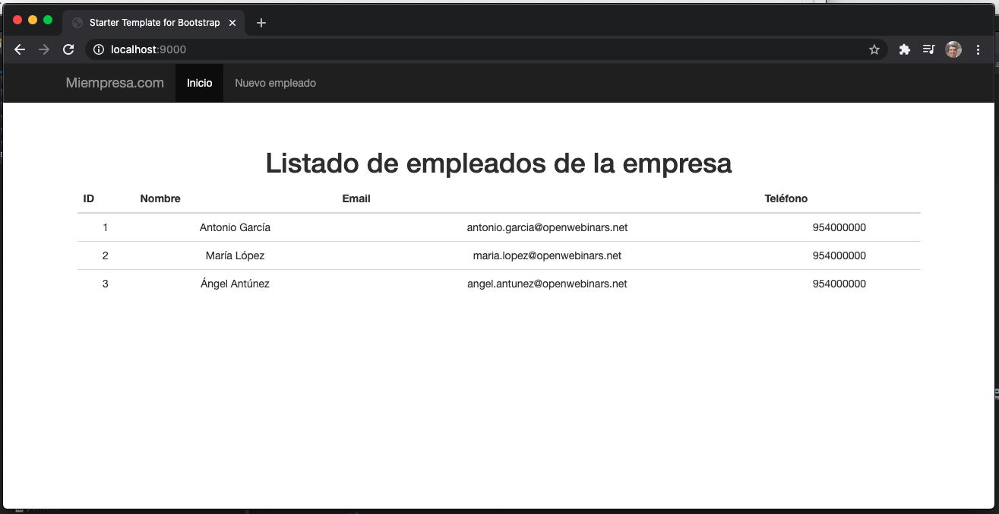

#### Añadir el Formulario

Vamos a añadir lo necesario para pintar el Formulario, para ello añadimos el código de Thymeleaf necesario en la plantilla de formulario `form.htm`


```html
<form method="post" action="#" th:action="@{/empleado/new/submit}" th:object="${empleadoForm}">
	
</form>
```

Observaciones del formulario:

* El formulario tiene el atributo `th:action="@{/empleado/new/submit}"` que apunta a una nueva ruta.
* Con el atributo `th:object="${empleadoForm}"` indicamos donde vamos a recojer el objeto.


Para generar el formulario lo podemos hacer a mano o podemos usar un Servicio Web que es francamente comodo https://bootsnipp.com/forms 

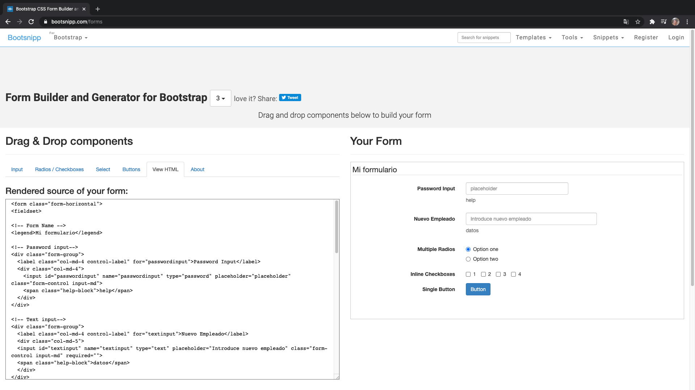

El código del Formulario completo y ajustado con Thymeleaf queda así:

```html
...
   <div class="starter-template">
      <h1>Nuevo empleado</h1>
      <div class="row">
         <div class="col-md-offset-2 col-md-8">
            <form method="post" action="#" th:action="@{/empleado/new/submit}" th:object="${empleadoForm}">
               <h1>Nuevo empleado</h1>
               <div class="form-group">
                  <label for="id">ID</label> <input type="text" class="form-control" id="id" placeholder="1" th:field="*{id}">
               </div>

               <div class="form-group">
                  <label for="nombre">Nombre</label> <input type="text" class="form-control" id="nombre" placeholder="Nombre" th:field="*{nombre}" />
               </div>
               <div class="form-group">
                  <label for="email">Email</label> <input type="email" class="form-control" id="email" placeholder="emple@openwebinars.net" th:field="*{email}" />
               </div>
               <div class="form-group">
                  <label for="telefono">Teléfono</label> <input type="tel" class="form-control" id="telefono" placeholder="954000000" th:field="*{telefono}" />
               </div>
               <button type="submit" class="btn btn-default">Enviar</button>
            </form>
         </div>
      </div>
   </div>
...
```

Observaciones del Formulario:

* En cada campo se ha ido añadiendo el atributo `th:field="*{id}"`, `th:field="*{nombre}"`, `th:field="*{email}"` o `th:field="*{telefono}"` con el nombre del campo según corresponda. Para ir casando cada uno de los atributos del empleado con el campo correspondiente.

Tendríamos la plantilla prerparada.

#### Modificar el Controlador

Para que nuestro formulario funcione tenemos que añadir dos métodos en el Controlador.

```java
@GetMapping("/empleado/new")
public String nuevoEmpleadoForm(Model model) {
   model.addAttribute("empleadoForm", new Empleado());
   return "form";
}
```

En este primer método:

* Tenemos un método `GetMapping`
* Le estamos pasando un atributo `empleadoForm` que es una nueva instancia de `Empleado` para poder pasarle el `CommandObject` 
* Y nos va a permitir redirigirnos a la plantilla del formulario.

```java	
@PostMapping("/empleado/new/submit")
public String nuevoEmpleadoSubmit(@ModelAttribute("empleadoForm") Empleado nuevoEmpleado) {
   servicio.add(nuevoEmpleado);
   return "redirect:/empleado/list";
}
```
Por otro lado tenemos un segundo método con las siguientes observaciones: 

* Tenemos un método `PostMapping`
* Donde recibimos el `CommandObject` a través de la anotación `@ModelAttribute` que lo coje de `"empleadoForm"` desde el formulario, y lo inyecta en el atributo `nuevoEmpleado`.
* Aplicamos la lógica de negocio en este caso es simplemente añadirlo a través del Servicio.
* En este caso vamos a redirigir a traves de otro controlador `/empleado/list` nos lleve directamente al listado de Empleados.

#### Ejecutar la Aplicación

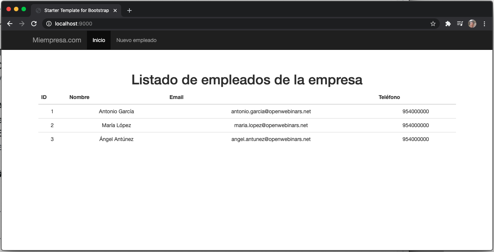
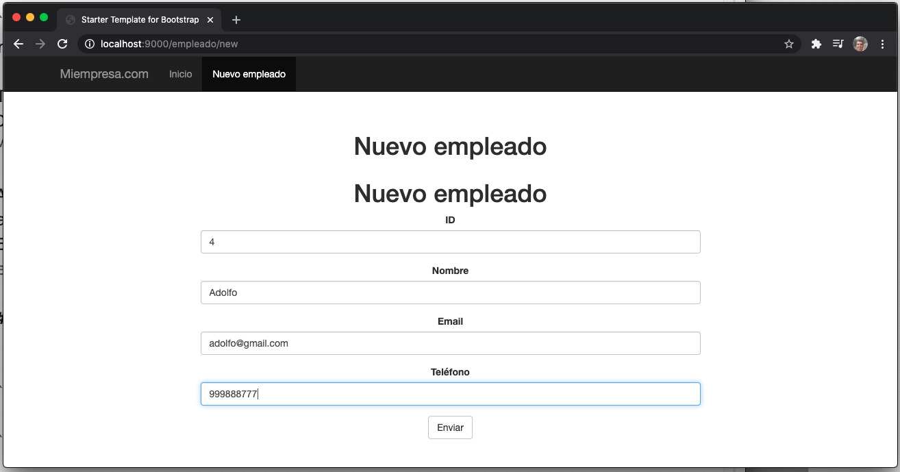
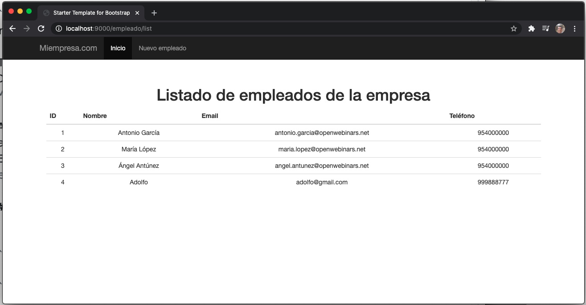

Probar no le hemos cambiado de Lidl se ha quedado entero pero sería lo de menos porque bueno podemos comprobar como aquí se ha quedado añadido nuestro listado se han recogido los datos y buenos hemos añadido ese nuevo empleado a través del servicio al listado de empleado y hemos recogido los datos y y se muestran de nuevo en este listado con lo cual nuestro formulario funciona como práctica os propongo en primer lugar que visite nuestro curso de introducción a timely manner mediante el cual podréis profundizar en el tratamiento de formularios con esta tecnología vale que se puede utilizar de forma conjunta con de forma conjunta con Spring sobre todo para aprender otros tipos de campos que no son los campos de tipo input cómo son los chef y los radios y con ellos propongo que añade añadáis una nueva propiedad al empleador que sea booleana y que nos permita saber si es empleado es un directivo de la empresa honor me tendríais que modificar el código necesario constructor getter setter todo lo necesario añadir el campo check al formulario para saber si es un empleado directivo o no lo es modificar los datos de ejemplo para poner que algunos hilos sea y otro no y en el listado de empleados pues tendría que añadir una nueva columna indicando que empleado es directivo no podrías ponerlo a través de la palabra directivo a través de un color distinto a través de un icono diferenciando el tipo de empleado mediante un icono como sugerencias para que para que podáis practicar hasta que estoy traducción al formulario seguiremos trabajando con formularios de una forma más compleja en los siguientes vídeos.

# 20 Formularios de edición 15:31 

[PDF Formularios_Edicion.pdf](pdfs/17._1_Formularios_Edicion.pdf)

## Resumen Profesor

No existe.

## Transcripción

Hola a todos vamos a continuar con los formularios y en este caso creando un formulario que nos permita evitar los datos los formularios de edición y los de creación son estructuralmente idénticos van a cambiar solamente algunas cosas principalmente como Nokia que antes crea vamos y que no llevaba ningún dato pues ahora lo crearemos teniendo datos esos datos los rescataremos desde nuestro almacén de datos dónde lo tengamos almacenados nuestro repositorio usualmente a través de un servicio y y normalmente está operación de rescate la hacemos a través de Lidl o algún atributo que nos permite identificar unívocamente a ese objeto no vamos a verlo al igual que antes a través del flujo que vamos a llevar y también visualmente cómo podéis comprobar el flujo es casi idéntico algunos cambios que tenemos escrita una petición que MAPI vale añadimos al modelo el comedor en este caso por los datos a editar los rescatamos en base a un y de ese y lo tendremos que recibir en la ruta que invoque el formulario de edición nos vamos hacia la plantilla vale nos dirigimos hacia la plantilla este como no que ya tiene datos al hacer el viernes con los campos del formulario esos campos del formulario mostraran los datos del propio formulario perdón los gatos del coma no viene en el formulario cuando ejecutemos la acción del formulario pues recogeremos al igual que antes esos datos y le tendremos que dar el tratamiento correspondiente graficamente podemos comprobar que le digo que es casi idéntico lo único que van a cambiar son las URL de los demás manejar la operación primera pulsera algo más compleja porque tenemos que de alguna manera a través de S&D de esta de ese atributo univoco rescatar el registro para poder mandarlo al formulario y y bueno la edición que en algunos contextos puede que sea estrictamente idéntica que el almacenamiento no por lo cual en ocasiones será será francamente sencillo nos permitirá utilizar mi momento vamos a partir de este proyecto de ejemplo


### :computer: `142-07-Formularios-de-Edicion`
#### Ejemplo de creación de un formulario de edición y con validación

Partimos de este proyecto base con la siguiente estructura:


#### Modifar el Servicio

En nuestro servicio vamos a añadir los siguientes dos métodos:

Y que además tiene aquí una serie de datos inicializar no a través de bueno del manejo del ciclo de vida de Stevie vamos añadir el siguiente código como no es estrictamente propio de quien simplemente voy a dar la implementación de un método de búsqueda muy ineficiente porque no es lo interesante de aquí y un método de edición pues que se le parece se le parece mucho que nos permita rescatar vale realmente rescatar mediante una búsqueda secuencial un objeto dentro de nuestro listado y la edición mares que también va a ser esa búsqueda secuencial si lo encuentra por lo que hace eliminar el objeto de donde esté y en la posición donde estaba añadir el objeto nuevo la parte que más no ocupa y es que tenemos el código no en el queríamos una búsqueda secuencial mientras no lo hayamos encontrado y no nos hemos salido de la colección pues vamos buscando uno otro se lo encontramos paramos y sino continuamos hasta el final y le dicen que ya digo que se me parece lo único que lo que hacemos es borrarlo y en su sitio lo ponemos ineficiente y fácil de implementar en caso de que estemos editando alguno que no exista pues directamente lo añadiría

```java
...
public Empleado findById(long id) {
   Empleado result = null;
   boolean encontrado = false;
   int i = 0;
   while (!encontrado && i < repositorio.size()) {
      if (repositorio.get(i).getId() == id) {
         encontrado = true;
         result = repositorio.get(i);
      } else {
         i++;
      }
   }
		
   return result;
}
...
```

```java
...
public Empleado edit(Empleado e) {
   boolean encontrado = false;
   int i = 0;
   while (!encontrado && i < repositorio.size()) {
      if (repositorio.get(i).getId() == e.getId()) {
         encontrado = true;
         repositorio.remove(i);
         repositorio.add(i, e);
      } else {
         i++;
      }
   }
		
   if (!encontrado)
      repositorio.add(e);
		
   return e;
}
...	
```

#### Modificar el Controlador

Cambios tenemos que hacer bueno pues ahora tendríamos que añadir en el controlador los mismos métodos que tipos que teníamos antes vale pero para él el formulario de edición así que podemos copiar y pegar en este caso en vez de nuevo máster de edición y di en vez de nuevo master editar vale empleado Ford y editar empleado SAP Malet aquí como no es nuevo pues lo vamos a cambiar el nombre vamos a refactorizar instalación si no terminamos antes aquí seguimos redirigiendo al listado y aquí como decíamos antes en lugar de inyectar uno nuevo lo que hacemos es lo siguiente tendríamos que buscar el empleado Mané en Bastian y de lo vamos a rescatar de aquí variable y como hemos incrementado ante el servicio tiene un nuevo método fine by ve que recibe precisamente que lo que estamos recibiendo desde el para un empleado ese distinto de nulo quiere decir que existe dentro de nuestra colección con lo cual no podemos evitar así que añadiremos este código de aquí por la modificación de que en lugar de que aquí llamemos al constructor directamente estamos pasando está referencia del empleado que acabamos de encontrar y si no lo que hacemos es redirigirlo al formulario de creación del nuevo empleado si quiere evitar si alguien malintencionadamente trata de tocar la ruta del formulario añadiendo nivel de empleado que no existe pues directamente como tiempo lo mandamos al formulario de uno nuevo vale redirigiendo y por aquí abajo lo único que tendríamos que cambiar además estoy aquí lugar de añadir sería editar 


```java
@GetMapping("/empleado/edit/{id}")
public String editarEmpleadoForm(@PathVariable long id, Model model) {

   Empleado empleado = servicio.findById(id);
   if (empleado != null) {
      model.addAttribute("empleadoForm", empleado);
      return "form";
   } else {
      return "redirect:/empleado/new";
   }

}
```

```java
@PostMapping("/empleado/edit/submit")
public String editarEmpleadoSubmit(@Valid @ModelAttribute("empleadoForm") Empleado empleado) {
   servicio.edit(empleado);
   return "redirect:/empleado/list";
}
```

#### Modificar la Vista
Evita los quedaría modificar el formulario aquí tendríamos dos opciones la opción fácil de implementar pero que requerirían de copiar y pegar sería tener 2 plantillas distintas una de creación y una de Edition lo cual le digo a la hora de mantener pues va a ser tedioso si en algún momento determinado queremos añadir una propiedad nueva a este registro pues tendríamos que modificar las dos y queremos cambiar algún tipo de estilo tendríamos que cambiar las dos no nos podemos calentar un poco el tarro con timely y bueno con alguna especiales por aquí por allá podremos utilizar solamente uno que es lo que vamos a hacer nos vamos hacia el formulario hacia la plantilla de formulario y lo que vamos a hacer es lo siguiente directamente vamos a quitar esto de aquí fuera ya que lo tenemos por aquí dentro el título vale estaba duplicado lo vamos a quitar y y lo que vamos a hacer cambiar y diferenciar hacia dónde queremos enviar en función de si estamos editando o de este estamos creando un nuevo enfría vale lo hacemos de la siguiente forma como vamos a saber si estamos editando un un nuevo empleado está meditando un empleado queremos crear un nuevo normal es que los nuevos empleados como el Lidl un long long con minúsculas si no se suele venir con el valor 0 pues nos iremos de eso si el valor de Lidl del empleado es cero lo que haremos será pensar que queremos crear un nuevo con lo cual se quedará como esa hora y si es distinto de cero si un número positivo en 12 / etcétera quiere decir que es un empleado que ya existe con lo cual quiere editar y ya digo que para ellos lo que hacemos aquí dentro del th acción ponemos la siguiente expresión vale empleados foro punto y de es distinto de cero quiere decir que distinto de cero lo que queremos ser evitar y en otro caso crea uno nuevo el pH o que sigue siendo el mismo esta misma expresión la podemos utilizar aquí en este uno mediante THC bueno decirle empleado pero entonces queremos que el texto sea evitar empleado y en otro caso nuevo empleado de esta forma el título también se verá modificado nos quedaría añadir un cambio más y es que hemos dicho antes que cuando editamos hay un campo univoco vale como el Live en el concepto de la base de datos se le suele llamar clave primaria este campo no debería ser susceptible de ser modificado una vez que ya lo hemos creado vale porque el que nos permite identificar de manera que tenemos que bueno pues este campo en particular el de Lidl que cenar lo de tal forma que si no fue estamos creando un nuevo empleado sea editable y si lo que estamos haciendo es editar un o sea de solo lectura vale para que se iré no de pueda cambiar para ellos lo que hacemos ser utilizando la expresión anterior vale y algún y algún truquito de timely que nos va a permitir añadirle un atributo pues le vamos a añadir que sea de solo lectura lo hacemos de la siguiente manera Th2 nos va a permitir añadirle perdón attr Apple nos va a permitir añadir un atributo vale a etiqueta de html atributos el siguiente readonly igual vale y ahora aquí volvemos a meter la expresión de antes vale empleado por punto y desde entonces pero si es distinto de cero quiere decir que va a ser de doble con lo cual quedaría como read only wala read-only en definitiva quiere decir que es de solo lectura y en otro caso si es cero lo ponemos anulo con lo cual este atributo no se añadiría vale perdón igual a no nos añade con lo cual sería evitarla para poder terminar con la edición 

```html
...
   <div class="container">
      <div class="row">
         <div class="col-md-offset-2 col-md-8">
            <form method="post" action="#" 
                  th:action="${empleadoForm.id != 0} ? @{/empleado/edit/submit} : @{/empleado/new/submit}"
                  th:object="${empleadoForm}">
               <h1 th:text="${empleadoForm.id != 0} ? 'Editar empleado' : 'Nuevo empleado'">Nuevo empleado</h1>
               <div class="form-group"
                    th:classappend="${#fields.hasErrors('id')} ? 'has-error'">
                  <label for="id">ID</label> <input type="text"
                                                   class="form-control" id="id" placeholder="1"
                                                   th:field="*{id}"
                                                   th:attrappend="readonly=${empleadoForm.id != 0} ? 'readonly' : null">
               </div>
               <div class="form-group">
                  <label for="nombre">Nombre</label> <input type="text"
                                                   class="form-control" id="nombre" placeholder="Nombre"
                                                   th:field="*{nombre}" />
               </div>
               <div class="form-group">
                  <label for="email">Email</label> <input type="email" 
                                                   class="form-control" id="email"
                                                   placeholder="emple@openwebinars.net"
                                                   th:field="*{email}" />
               </div>
               <div class="form-group">
                  <label for="telefono">Teléfono</label> <input type="tel"
                                                   class="form-control" id="telefono" 
                                                   placeholder="954000000" 
                                                   th:field="*{telefono}" />

               </div>
               <button type="submit" class="btn btn-default">Enviar</button>
            </form>
         </div>
      </div>


   </div>
   <!-- /.container -->
...
```

Para poder terminar con la edición necesitamos además de esto que hemos añadido aquí irnos al listado añadir una nueva columna en la tabla vale que la podríamos llamar operaciones o de la manera que nosotros tenemos conveniente un enlace vale que nos permita y ir a y el formulario de edita hemos visto que este enlace debe incluir el ID del empleado que crees muy lista para ello utilizamos más la expresión de tenis para clase que se dice barra empleado barra Evi nos permite incluir aquí dentro de una variable y a continuación dar los malos no en vive queremos que sea el objeto empleado vale el atributo y de de esa manera este valor de aquí vale está cenando esta variable la busca dentro del PAN y quería que tienes criado del empleado uno pues está expresión se sustituye por uno por un 2 etcétera etcétera hablamos


```html
...
<div class="container">

   <div class="starter-template">
      <h1>Listado de empleados de la empresa</h1>
   </div>  
   <table class="table">
      <thead>
         <tr>
            <th>ID</th>
            <th>Nombre</th>
            <th>Email</th>
            <th>Teléfono</th>
            <th>Operaciones</th>
	 </tr>
      </thead>
      <tbody>
         <tr th:each="empleado : ${listaEmpleados}">
            <td th:text="${empleado.id}">ID</td>
            <td th:text="${empleado.nombre}">Pepe Pérez</td>
            <td th:text="${empleado.email}">pepe.perez@openwebinars.net</td>
            <td th:text="${empleado.telefono}">954000000</td>
            <td><a th:href="@{/empleado/edit/{id}(id=${empleado.id})}">Editar</a></td>     		
         </tr>
      </tbody>
   </table>

</div><!-- /.container -->
...
```

#### Ejecutar la Aplicación

Probar este campo ahora es de solo lectura amanecer estacionamos podemos ver cómo se añadido el readonly vale y si editamos podemos comprobar como se ha editado este campo volver a borrar de José borra el decir que este es el objeto que se está evitando y queremos crear un nuevo bueno pues seguimos teniendo los tendré antes en este caso el campo ya sería editable no podríamos tener aquí vale podíamos cambiar el nombre Elide vuelve a ser de solo lectura Valencia haríamos y quedarían los cambios modificado con esto terminamos los formularios de edición vamos a continuar en el siguiente vídeo haciendo la validación de campos de un formulario

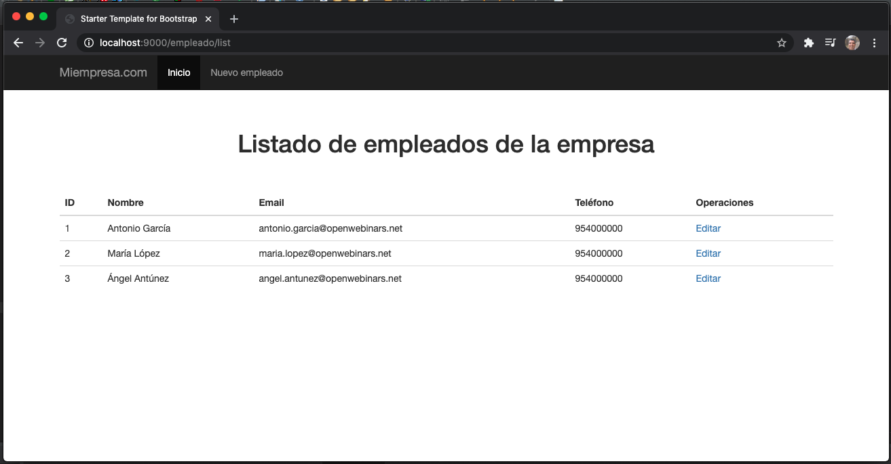
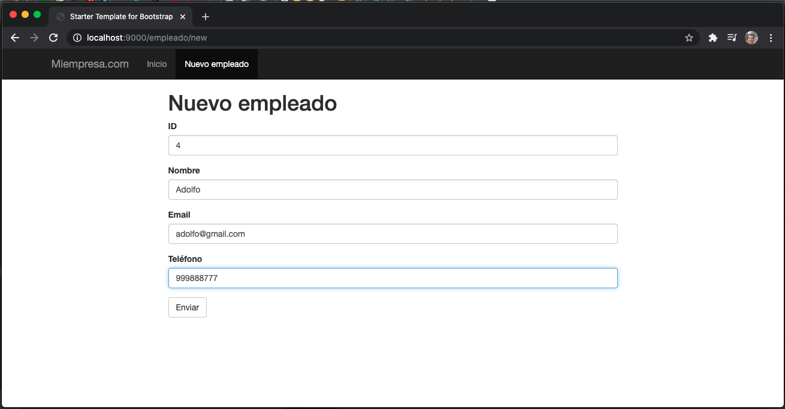
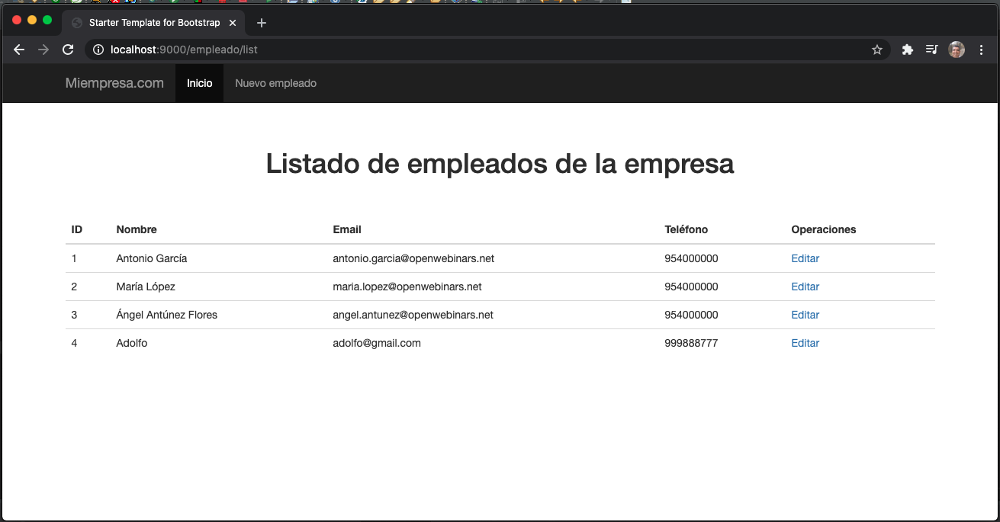
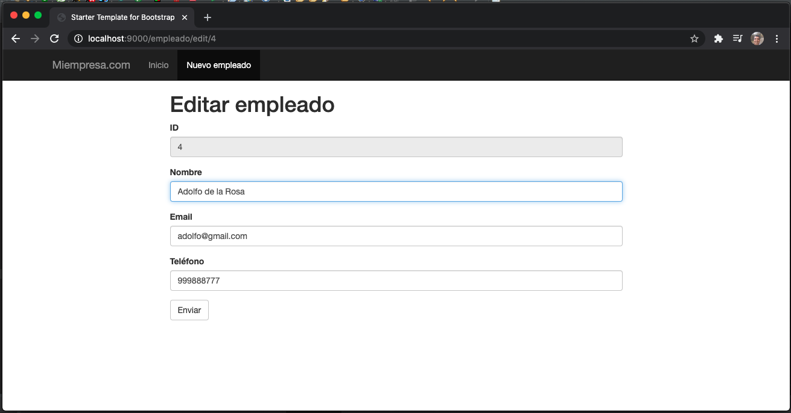
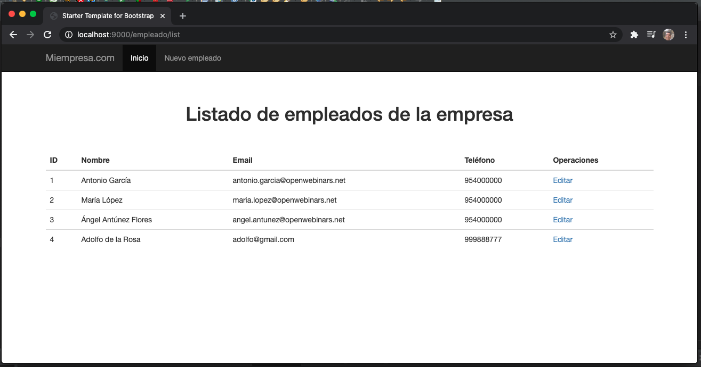


# 21 Validación de datos 21:04 

[PDF Formularios_Validacion.pdf](pdfs/17._2_Formularios_Validacion.pdf)

## Resumen Profesor

### Validación

Spring permite usar el estándar *JSR-303/JSR-380 Bean Validation API*. Spring Boot configura por defecto la implementación de este estándar realizada por *hibernate*.
Permite realizar la validación añadiendo anotaciones en nuestras clases modelo.

### Algunas anotaciones de validación:

* `@NotNull`: el atributo no puede ser nulo
* `@Min`, `@Max`: mayor o igual (o menor o igual) que un valor determinado.
* `@NotEmpty`: el atributo no puede estar vacío (Strings, colecciones, arrays, …)
* `@Email`: el atributo debe ser un email válido.
* `@Size`: el atributo tiene que tener un tamaño según el indicado.

Puedes consultar toda la documentación en https://beanvalidation.org/2.0/spec/#builtinconstraints

### Visualización de errores con Thymeleaf

Thymeleaf nos ofrece algunos elementos para gestionar los errores:

* Algunas funciones del objeto `#fields`: `#fields.hasError(‘...’)` y `#fields.errors(‘...’)`
* Atributos: `th:errors` y `th:errorclass`

Todo esto lo podemos conjugar con el uso de Bootstrap para la visualización de errores:

```html
<div class="form-group"    th:classappend="${#fields.hasErrors('id')} ? 'has-error'">
    <label for="id">ID</label> 
    <input type="text" class="form-control" id="id" placeholder="1"
        th:field="*{id}" th:attrappend="readonly=${empleadoForm.id != 0} ? 'readonly' : null" />
    <span th:if="${#fields.hasErrors('id')}" th:errors="*{id}" class="help-block" id="id-error">Errores</span>
</div>
```

* `th:classappend="${#fields.hasErrors('id')} ? 'has-error'"` nos permite añadir la clase css `has-error`, propia de bootstrap.
* Con `<span th:if="${#fields.hasErrors('id')}" th:errors="*{id}" class="help-block" id="id-error">Errores</span>` añadimos, justo debajo del campo del formulario, el/los mensaje/s de error.

## Transcripción


Hola a todos vamos a continuar hablando de formulario y en este caso vamos a hablar de la validación nos permite realizar la validación de bean de una manera más amplia que tan solo circunscrita a los formularios y es que nos lo permite a través de a través del estándar jsr-303 que se vio actualizado con el jfr 380 para la validación de Bean lo podríamos utilizar con cualquier clan lo que pasa que nosotros lo vamos a aprovechar para hacerlo asociado a los a los objetos que recibimos desde un formulario por defecto spring boot nos permite utilizar la implementación de este estándar vale del JCR 381 proporciona Hibernate ya digo que nos va a permitir hacer la validación de nuestras clases asociadas al uso de formulario a través de anotación alguna de las anotaciones que podemos utilizar son estas de aquí irían colocadas dentro de los coman o pie que en nuestro caso fue te digo que va a ser el mismo objeto que el de modelo del Mini las más usuales suelen ser NOT NULL que no indica no fuerza que el atributo no se anuló mi iMac que nos permiten establecer valores mínimos y máximos para que sea mayor igual o menor o igual vale que en determinado valor not empty el atributo no puede estar vacío haciendo referencia cadena condiciones array etcétera email el atributo tiene que ser tiene que tener por fuerza la estructura de un inválido con 6 le indicamos que tiene que tener un tamaño indicado todas y cada una de estas anotaciones que se pueden utilizar las podéis encontrar fácilmente dentro de la documentación del estándar vale de invalidez vamos a tratar de implementarlo en nuestro proyecto y para ello el código que estábamos trabajando y ya digo serían con anotaciones colocadas sobre nuestra clase coma nadie en particular sobre nuestro modelo vamos añadir alguna no queremos que esté sea negativo vale aunque como bebo el Long son números que pueden tener números negativos bueno pues le vamos a decir que por defecto queremos que este valor se hace un valor como 00 lo vamos a permitir porque hemos comprobado que cuando creamos una nueva instancia espero lo que queremos están valores positivos después para el nombre hemos dicho que para cadena de caracteres vale vamos a solicitar que no esté vacío y para el email aunque ya él lo HTML5 y algunos navegadores con estos campos nuevos que nos proporciona este Telecinco nos permite hacer una primera validación en local vale lo vamos a forzar para si de alguna manera pues se evitará que este campo se un email vale lo haríamos de esta forma no vamos a añadir ninguno más sería y de ahora que tenemos que incluir más pues nos tendríamos que ir a nuestra clase controladora

### :computer: `142-08-Formularios-Validacion`
#### Ejemplo de creación de un formulario de edición y con validación

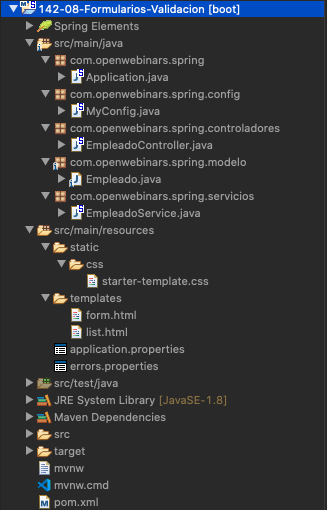

Vamos a partir del proyecto `142-07-Formularios-de-Edicion` haciendo una copia y llamandola `142-08-Formularios-Validacion`, la estructura es la misma que teniamos en el proyecto pasado.

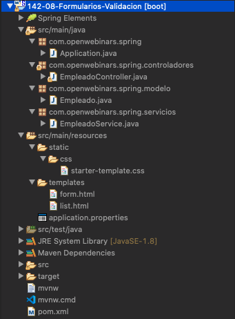

#### Modificar la Clase `Empleado`

```java
...
public class Empleado {
   
   @Min(0)
   private long id;
	
   @NotEmpty
   private String nombre;
	
   @Email
   private String email;
	
   private String telefono;
   
   ...
```

#### Modificar el Controlador

Que tenemos que incluir más pues nos tendríamos que ir a nuestra clase controladora y si queremos que sea válido no tendríamos que ir al método o en este caso los métodos más vale añadiendo lo siguiente lo primero que añadiríamos sería la notación arroba pan hecho para forzar a que cuando recibamos se te ven aquí este 2013 que ser vale por otro lado vamos a añadir la recepción de un nuevo treasure planet que nos va a permitir evaluar el resultado vale de esta validación y saber si el formulario ha incluido errores o no lo ha incluido de la siguiente manera si aquí tenemos errores pues lo que vamos a hacer es volver formulario en otro caso lo que queremos es que te haga lo que veníamos haciendo antes no si no tenemos errores pues no pusiste nada y que nos lleve directamente donde corresponda lo tendríamos que añadir también en el caso de Erika tenemos errores no volvemos al formulario y en otro caso que hacemos lo que tenemos por aquí ahora 

```java
@PostMapping("/empleado/new/submit")
public String nuevoEmpleadoSubmit(@Valid @ModelAttribute("empleadoForm") Empleado nuevoEmpleado, 
                                  BindingResult bindingResult) {

   if (bindingResult.hasErrors()) {
      return "form";
   } else {
      servicio.add(nuevoEmpleado);
      return "redirect:/empleado/list";
   }

}
```

```java
@PostMapping("/empleado/edit/submit")
public String editarEmpleadoSubmit(@Valid @ModelAttribute("empleadoForm") Empleado empleado,
                                   BindingResult bindingResult) {

   if (bindingResult.hasErrors()) {
      return "form";
   } else {
      servicio.edit(empleado);
      return "redirect:/empleado/list";
   }
}
```
#### Modificar la Vista

por último tendríamos que como no hemos dado cuenta aquí vale por ejemplo no volvemos al formulario que sucede allí bueno pues allí podemos recoger en la plantilla el hecho de que existen errores y podemos visualizar para ellos pues

Tiramos también un poco de Time list vale y nos iríamos a la plantilla el formulario y haríamos lo siguiente tiraremos de Time list y también algo de pusta vale boostrap nos permite tener una serie de estilo vale para mostrar errores o mensajes de error o algún tipo de alerta vamos a visualizar los siempre y cuando estés error para ello vamos a utilizar y de cada campo del formulario vamos implementar solamente en este caso y vive en Vic vale bueno pues le vamos a decir que todo este grupo vale toda esta capa en el caso de que haya un error vale se le aplique un determinado estilo qué es el estilo jazz error vale demuestra que va a indicar bueno porque de alguna manera tiene ese lo hacemos de la siguiente manera para evaluar una expresión vale y en el caso de que sea expresión sea verdadera bueno pues va añadir una nueva clase CSS a esta cama la expresiones vale hacemos uso de esta función sin manejar error en particular sobre el campo de Mané y esto nos va a permitir evaluar y de está devolución que nos han hecho al formulario si el campo iré tiene algún tipo de error y en caso de que lo tenga lo que creemos es pequeña da qué señala esta nueva clase vale y este campo tuviera error esta clase genial iría Kinoko la hubiéramos puesto nosotros literal y también vamos a querer que enseñaba este se me permitió lo copio y lo pego lo vamos a hacer aquí abajo un mensaje de texto con el error correspondiente es decir que si hay un error se visualice ese texto lo hacemos a través de una etiqueta span por ejemplo que vuelva a comprobar si hay error vale como hemos hecho aquí y si lo hay porque se span se rellené con el mensaje de error lo hacemos de la manera y hay un error vale hacemos uso de TH error vale para rescatar el error del campo y ve puede que haya más de uno vale porque en la validación nosotros hemos añadido solamente uno pero podría haber más de uno que rescate los errores de Live y estos sean los errores que aquí se visualiza vale salva y vamos a comprobar cómo funciona


```html
...
<div class="container">
   <div class="row">
      <div class="col-md-offset-2 col-md-8">
         <form method="post" action="#" 
               th:action="${empleadoForm.id != 0} ? @{/empleado/edit/submit} : @{/empleado/new/submit}"
               th:object="${empleadoForm}">
            <h1 th:text="${empleadoForm.id != 0} ? 'Editar empleado' : 'Nuevo empleado'">Nuevo empleado</h1>
            <div class="form-group"
                 th:classappend="${#fields.hasErrors('id')} ? 'has-error'">
               <label for="id">ID</label> <input type="text"
                                                 class="form-control" id="id" 
						 placeholder="1"
						 th:field="*{id}"
						 th:attrappend="readonly=${empleadoForm.id != 0} ? 'readonly' : null">
               <span th:if="${#fields.hasErrors('id')}" 
                     th:errors="*{id}"
                     class="help-block" 
		     id="id-error">
                  Errores
               </span>
            </div>
	....	 
```

Estos son los errores que aquí se visualiza vale salva y vamos a comprobar cómo funciona por aquí que nos permita editar leader vamos a tratar de guardar con menos 4 

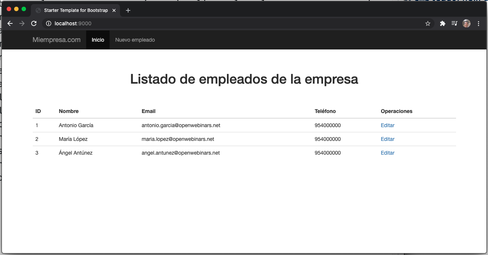
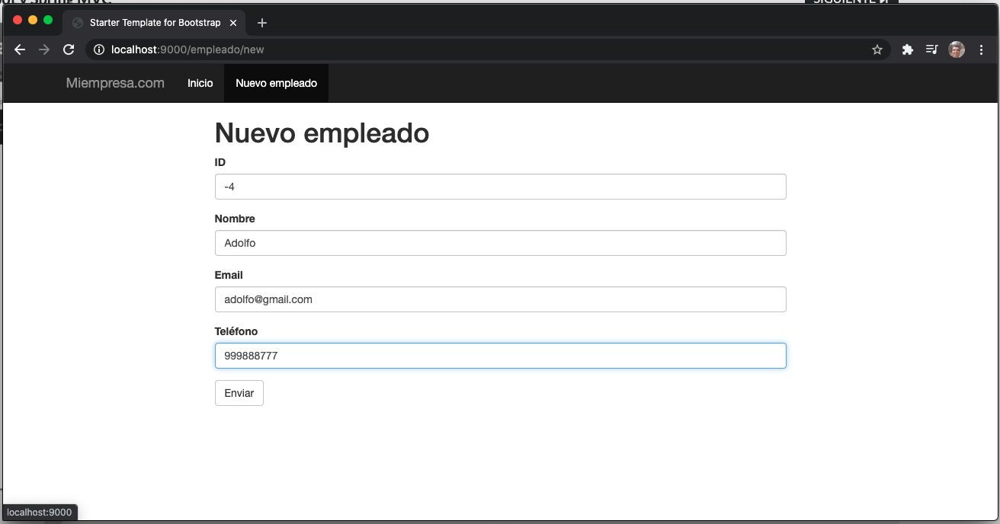
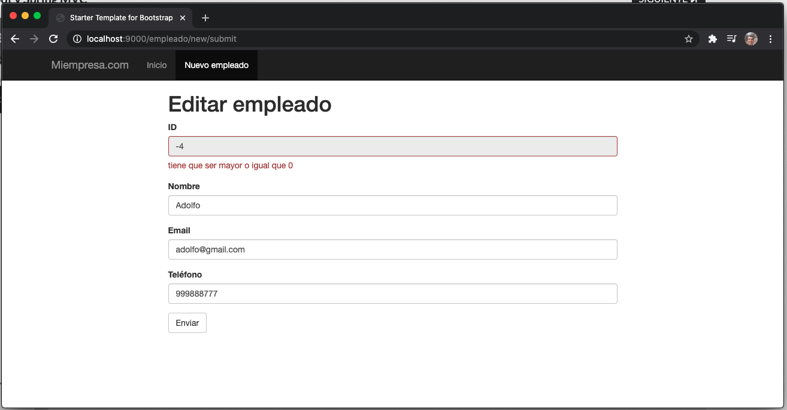

cómo podemos comprobar este valor a la un error si nos damos cuenta nos ha redirigido de nuevo el formulario no ha coloreado el formulario en rojo y se ha añadido un nuevo mensaje en el que nos dice que ese valor tiene que ser mayor o igual que sé la verdad es que está francamente bien ese valor lo pudiéramos editar bueno pues lo podríamos solventar lo hemos hecho de una manera tan sencilla indicando que este valor fuera cero o distinto de cero que realmente tendríamos que haberlo hecho si fuese mayor que cero no porque con el valor 0 en si sería el que tendría creado y si no queremos que sean valores negativos pues ahora mismo no no lo podríamos herida aunque ya digo que no es la parte fundamental porque cuando utilicemos la base de datos en los próximos vídeos 

este valor del Ibex se va otro general y que hace que no nos vamos a tener que preocuparte vamos a poder añadir adicionalmente la customización de los mensajes de validación como hemos comprobado entre string y no ofrecen un mensaje por defecto vale para esta validación sin embargo nosotros nos puede interesar poner mensajes propio porque el error sea de alguna manera más complejo el mensaje de error vaya asociado a la lógica de nuestra aplicación o incluso queremos aplicar algún tipo de internacionalización concreto para ello tenemos varias estrategias uno es directamente en la anotación de validación una cadena hardcodeada o también a través del uso de sistemas de protección vamos a tomar esta segunda opción porque ya digo que nos permitiría incluso hacer una internacionalización de los mensajes pero para poder utilizarlo vamos a necesitar algunos pin vale que nos permitan configurarlo en una clase de configuración nos tendríamos que ir a al código vale para para añadir este este código fuente y que nos permita después vale bueno pues este valor en realidad sería sería 0 no dejar la validación de manera que podamos decir que el mensaje sea bueno fue el que hemos establecido en nuestros ficheros de profe vamos a hacerlo y lo hacemos añadiendo este código en una clase de configuración para ello nos vamos al proyecto podríamos añadir un nuevo paquete un paquete de configuración y aquí podemos crear una clase configuración aquí tendríamos la creación de dos bean vale un lado

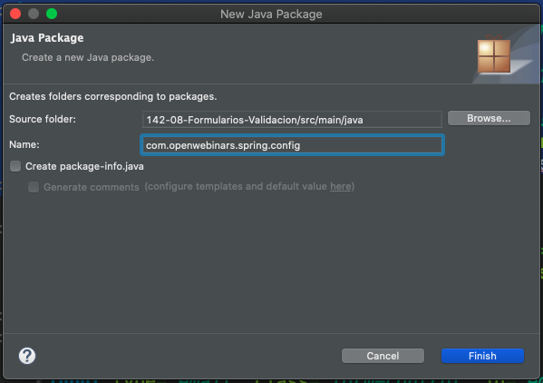


La notación de configuración aquí tendríamos la creación de dos bean vale por un lado bueno eso es lo que nos va a permitir es cargar un recurso que no deja de ser un chistero vale como como un van del mar y nos va a permitir el qué bueno le digamos donde buscarlo o el nombre bajes vale la ruta de raíz y la codificación por defecto de este fichero de profe y lo queremos en el siguiente bien es utilizarlo diciendo que es bueno pues los mensajes el origen de los mensajes de validación vale cómo nombre le decimos que busque en el classpath un fichero llamado erros vale con la tensión que sea le decimos también que la codificación por defecto sea UTF8 por último tendríamos que crea en Cordovín encarga recrear el validador le asignamos el anterior esta clase de aquí implementa esto que seguramente sean interfaz vale y que el que podemos utilizar aquí ya tendríamos la clase de configuración 


```java
package com.openwebinars.spring.config;

import org.springframework.context.MessageSource;
import org.springframework.context.annotation.Bean;
import org.springframework.context.annotation.Configuration;
import org.springframework.context.support.ReloadableResourceBundleMessageSource;
import org.springframework.validation.beanvalidation.LocalValidatorFactoryBean;

@Configuration
public class MyConfig {
	
   @Bean
   public MessageSource messageResource() {
      ReloadableResourceBundleMessageSource messageSource =
                        new ReloadableResourceBundleMessageSource();
		
      messageSource.setBasename("classpath:errors");
      messageSource.setDefaultEncoding("UTF-8");
		
      return messageSource;
   }
	
   @Bean
   public LocalValidatorFactoryBean getValidator() {
      LocalValidatorFactoryBean bean = new LocalValidatorFactoryBean();
      bean.setValidationMessageSource(messageResource());
      return bean;
   }

}
```

#### Crear el Archivo de `properties`

ahora lo que nos quedaría es crear el fichero de properties en el cual vamos a tener nuestro para ellos nos vamos a la carpeta Souls me increase Ousmane y aquí mismo podríamos crear un nuevo fichero

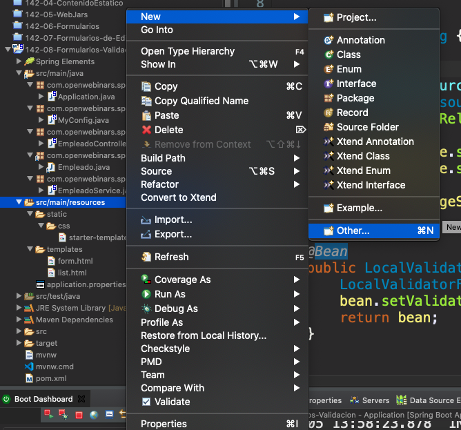
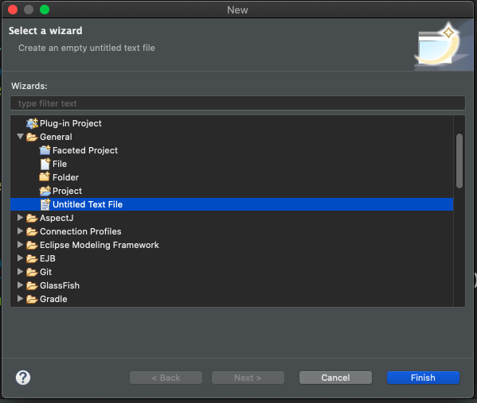
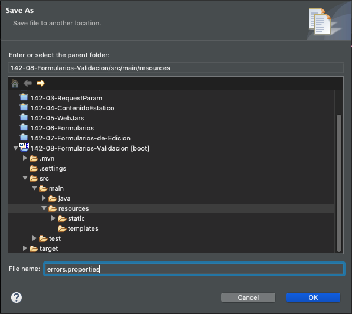

```txt
empleado.id.mayorquecero=El ID del empleado debe ser un numero entero positivo
```

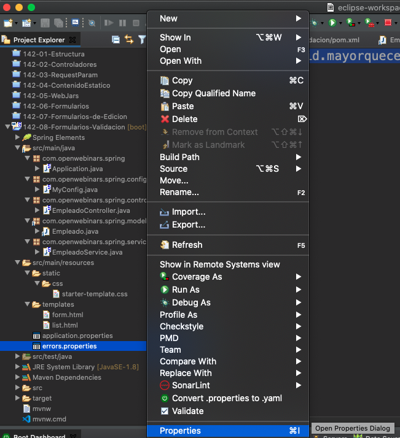
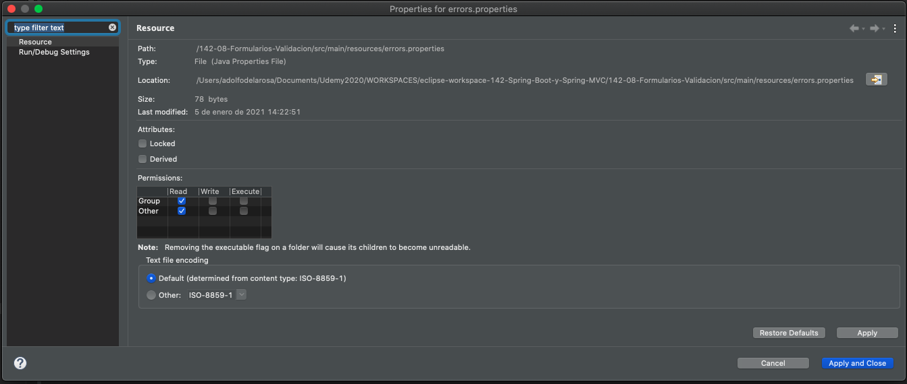
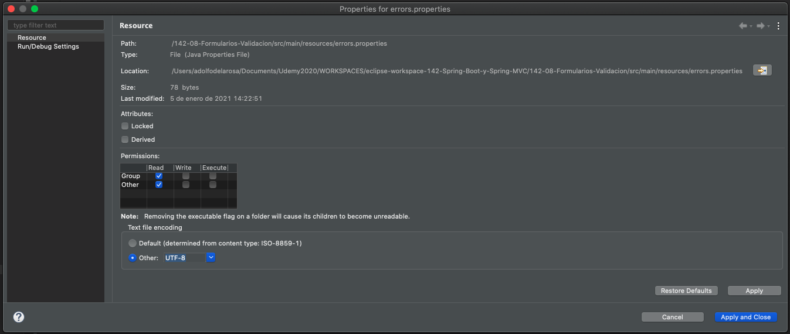

#### Modificar la Clase Empleado

```java
...
public class Empleado {
   @Min(value=0, message="{empleado.id.mayorquecero}")
   private long id;
...   
```

#### Ejecutar la Aplicación

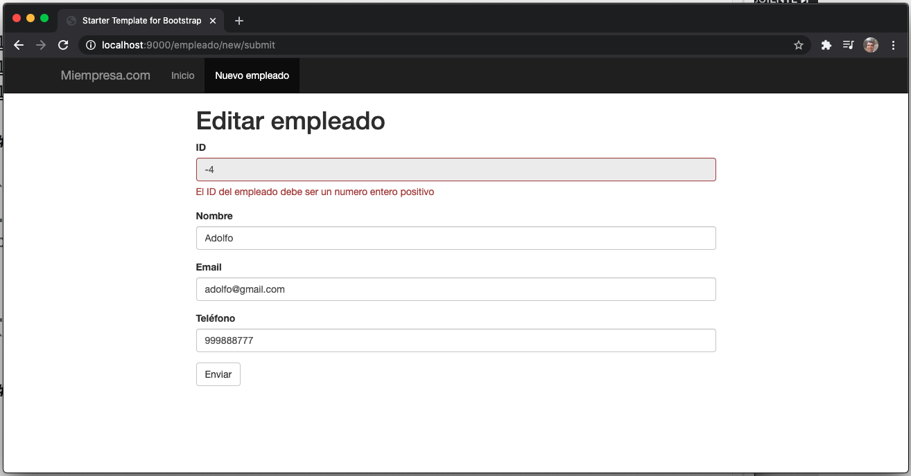

Por las llaves ya ya lo rescatan conecta hemos visto cómo podemos customizar nuestros mensajes de validación y yo animo a que lo podáis a que lo podéis hacer si visitáis nuestro curso de introducción a timely podréis ver algo más sobre validación de formulario y de hecho ánimo como elecciones anteriores que a la hora de practicar pues siguiendo el esquema que hemos seguido en esta lección podáis añadir la validación de todos los campos del formulario que sea necesario añadiendo un mensaje customizado los estilos de error vale para para que podáis completar el formulario de una manera algo más integra con por la gestión de errores con esto terminamos esta parte de validación de formulario no queríamos en los siguientes vídeos que vamos a seguir con formularios son unos formularios especiales nos multiparte que nos van a permitir subir Sitges


# 22 Subida de ficheros 8:12 

[PDF Subida_de_ficheros.pdf](pdfs/18._1_Subida_de_ficheros.pdf)

## Resumen Profesor

### Formularios multiparte

Para que un formulario sea capaz de enviar ficheros, debemos cambiar su tipo de codificación a `multipart/form-data`. Ello lo hacemos mediante la propiedad `enctype`.

```html
<form method="post" enctype="multipart/form-data" action="#"
    th:action="${empleadoForm.id != 0} ? @{/empleado/edit/submit} : @{/empleado/new/submit}"
    th:object="${empleadoForm}">
```    

Si queremos adjuntar un fichero al envío del formulario, lo hacemos mediante un campo de tipo `file`

```html
<div class="form-group">
    <label for="file">Avatar</label>
    <input id="filebutton" name="file" class="form-control input-file" type="file">
</div>
```

### Uso de `@ConfigurationProperties`

Podemos inyectar el valor de una propiedad (por ejemplo, declarada en el fichero `application.properties`) a través de la anotación `@Value`

```java
@Value("{prefijo.propiedad}")
private String cadena;
```

En ocasiones, es posible que nos interese encapsular estas propiedades a través de una clase que:

* Nos ofrezca métodos convenientes para obtener el valor de las propiedades
* Nos permita usar la validación de beans para asegurarnos que las propiedades están correctamente inicializadas.

Para ello, podemos crear una clase, que encapsule las propiedades, y que esté anotada con `@ConfigurationProperties`.

```java
@ConfigurationProperties(prefix="storage")
public class StorageProperties {


    private String location = "upload-dir";

    public String getLocation() {
        return location;
    }

    public void setLocation(String location) {
        this.location = location;
    }

}
```

De esta forma, podemos capturar la propiedad `storage.location` que puede ser definida en un fichero de properties.

Para que esto funcione correctamente, tenemos que habilitar dicha clase mediante la anotación `@EnableConfigurationProperties` en una clase `@Configuration` o en la propia `@SpringBootApplication`.

```java
@Configuration
@EnableConfigurationProperties(StorageProperties.class)
public class MyConfig {

    //... contenido de la clase

}
```

### Algunos aspectos de Thymeleaf
#### Operador elvis

En este ejemplo hemos utilizado un operador de Thymeleaf, llamado operador elvis (`?:`), para montar la URL de la imagen del avatar del empleado.

```html

```

Esta expresión significa:

* Si `${empleado.imagen}` es diferente de `null`, devuelve el valor de `${empleado.imagen}`.
* En otro caso, devuelve la cadena de caracteres que viene después de `?:`

Además, en este valor, hemos usado la potencia de Thymeleaf para incluir el email del empleado como una variable en la propia URL.

Si quieres saber más sobre como montar URLs con Thymeleaf, puedes visitar nuestro **Curso de introducción a Thymeleaf**.

## Transcripción

Hola a todos vamos a continuar hablando de formulario y en particular vamos a hablar ahora de formularios que nos van a permitir subir ficheros lo vamos a hacer primero de todo hablando de las peticiones multiparte en este caso con Spring una petición multiparte un mensaje multiparte es un mensaje vale en HTTP es uno especial que nos va a permitir diferenciar dentro del mensaje diferentes partes de ahí el nombre multiparte cada uno con su correspondiente tipo de contenido de manera que podremos mandar esto plano un fichero vale Génesis que tenemos en la imagen podemos ver como hay un mensaje de texto plano una cadena de caracteres de qué sirve de frontera entre partes y y después viene un stream de objetos que normas que bueno fue un flujo binario no podríamos tener diferentes partes dentro dentro de un mensaje bueno pues vamos a aprovechar este tipo MIME este tipo de codificación para cambiar el tipo de codificación de de nuestro formulario a multipart form-data para que de una sola vez de una tacada podamos enviar un formulario que tenga pues datos textuales y datos binarios los datos de formulario normal que hemos venido enviando y datos binarios adicionalmente nuestro formulario deberá tener un al menos un input que será de tipo especial hasta ahora casi todo han sido el tipo texto o alguno de sus subtipos ombuena email o URL o lo que sea no en este caso será de tipo de tipo fichero lo cual nos permitirá que usualmente se añada un selector de ficheros vale que al pulsarlo pues no aparece un diálogo que nos permita buscar el fichero correspondiente seleccionarlo cuando le demos al botón de enviar de esta forma pues se enviaría el contenido de este sitio ese que estoy como no podía ser de otra manera maneja perfectamente en soporte de peticiones multiparte nos proporciona la clase multipartfile que usada con la anotación request param nos va a permitir procesar las distintas partes de un mensaje multiparte en esta es la firma de este método que tenemos aquí como ejemplo sale un mensaje que en principio tendría dos partes vale una que sería el nombre y otra que se vea el fichero donde uno de ellos es el pizzero esta clase multipartfile tiene todos los métodos convenientes para poder procesar esta parte que contiene el fichero tamaño tipo de contenido el nombre nombre original y este que será el primero que utilizaremos no que si está vacío no si está vacío no es aparte vale con la cual queremos trabajar vamos añadir algunos cambios a nuestro a nuestro proyecto para ello vamos a copiar este proyecto de base qué es similar al anterior dónde lo dejamos

### :computer: `142-09-Upload`
#### Ejemplo de subida de ficheros mediante un formulario

Partimos del proyecto base con la siguiente estructura:

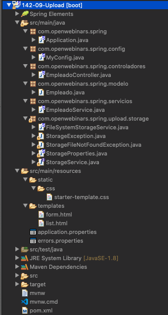

#### Modificar Formulario

Haciendo un poco una vez que lo hemos replicado si nos vamos a los formularios al formulario creemos que está como lo teníamos antes vale lo que teníamos que hacer como hemos dicho antes se cambiar el tipo de codificación vale el en style y lo cambiaríamos a multipart-form-data de manera que ya podremos mandar mensajes o objetos multiparte añadimos además al final un nuevo campo vale después de todo esto que venimos teniendo antes Fire Mané y que nos va a permitir subir de nuestro empleado su avatar vale una imagen que represente su avatar le damos aquí Facebook don vale clases abstractas los permite además de la de Ford control tener un input de tipo file vale me conecto tendríamos más que suficiente a nivel de formulario 


```html
...
<form method="post" action="#" 
                    enctype="multipart/form-data" 
                    th:action="${empleadoForm.id != 0} ? @{/empleado/edit/submit} : @{/empleado/new/submit}"
                    th:object="${empleadoForm}">
...
```

```html
...
<div class="form-group">
   <label for="file">Avatar</label>
   <input type="file" id="filebutton" name="file" class="form-control input-file" />
</div>
...
```

#### Modificar Modelo `Empleado`

para poder almacenarlo asociado nuestro empleado pues nos tendríamos que venir a nuestro modelo añadirle nuevo atributo que sea la imagen vale será de tipo String porque aquí lo que almacenaremos será la ruta de donde tengamos almacenado el filtro para poder gestionarlo lo que vamos a hacer es añadir un nuevo constructor alquila gestión que más os guste vale una un constructor con todos los campos por si alguna veces se utilizara fijado como al añadir la validación por favor añade los elementos de validación también en el constructor tendríamos que añadir lo que te diste el correspondiente y para gestionar el casco de élite y el to screen lo que se muestra regenerarlo y ya está 

`Empleado`

```java
package com.openwebinars.spring.modelo;

import javax.validation.constraints.Email;
import javax.validation.constraints.Min;
import javax.validation.constraints.NotEmpty;

public class Empleado {
	
   @Min(value=0, message="{empleado.id.mayorquecero}")
   private long id;
	
   @NotEmpty
   private String nombre;
	
   @Email
   private String email;
	
   private String telefono;
	
   private String imagen;
	
   public Empleado() { }

   public Empleado(long id, String nombre, String email, String telefono) {
      this.id = id;
      this.nombre = nombre;
      this.email = email;
      this.telefono = telefono;
   }
	

   public Empleado(@Min(value = 0, message = "{empleado.id.mayorquecero}") long id, @NotEmpty String nombre,
			@Email String email, String telefono, String imagen) {
      this.id = id;
      this.nombre = nombre;
      this.email = email;
      this.telefono = telefono;
      this.imagen = imagen;
   }

   public long getId() {
      return id;
   }

   public void setId(long id) {
      this.id = id;
   }
   public String getNombre() {
      return nombre;
   }

   public void setNombre(String nombre) {
      this.nombre = nombre;
   }

   public String getEmail() {
      return email;
   }

   public void setEmail(String email) {
      this.email = email;
   }

   public String getTelefono() {
      return telefono;
   }

   public void setTelefono(String telefono) {
      this.telefono = telefono;
   }

   public String getImagen() {
      return imagen;
   }

   public void setImagen(String imagen) {
      this.imagen = imagen;
   }

   @Override
   public int hashCode() {
      final int prime = 31;
      int result = 1;
      result = prime * result + ((email == null) ? 0 : email.hashCode());
      result = prime * result + (int) (id ^ (id >>> 32));
      result = prime * result + ((imagen == null) ? 0 : imagen.hashCode());
      result = prime * result + ((nombre == null) ? 0 : nombre.hashCode());
      result = prime * result + ((telefono == null) ? 0 : telefono.hashCode());
      return result;
   }

   @Override
   public boolean equals(Object obj) {
      if (this == obj)
         return true;
      if (obj == null)
         return false;
      if (getClass() != obj.getClass())
         return false;
      Empleado other = (Empleado) obj;
      if (email == null) {
         if (other.email != null)
            return false;
      } else if (!email.equals(other.email))
         return false;
      if (id != other.id)
         return false;
      if (imagen == null) {
         if (other.imagen != null)
            return false;
      } else if (!imagen.equals(other.imagen))
         return false;
      if (nombre == null) {
         if (other.nombre != null)
            return false;
      } else if (!nombre.equals(other.nombre))
         return false;
      if (telefono == null) {
         if (other.telefono != null)
            return false;
      } else if (!telefono.equals(other.telefono))
         return false;
      return true;
   }

   @Override
   public String toString() {
      return "Empleado [id=" + id + ", nombre=" + nombre + ", email=" + email + ", telefono=" + telefono + ", imagen="
				+ imagen + "]";
   }
	
}
```

#### Modificar Controlador

qué más necesitamos bueno pues como hemos comprobado antes tenemos que añadir en la petición que va a gestionar la subida del fichero un rico es para de tipo multipartfile bueno pues nos tendríamos que ir en nuestro caso al controlador que va a recibir un nuevo empleado y tendríamos que añadir después del bindingresult Vale un rico estará llamado film que como hemos llamado al campo en el formulario añadir ahora por último la recepción aquí de DS file comprobar está vacío y si no lo está pues tendremos que plantearnos que hacer aquí 

```java
@PostMapping("/empleado/new/submit")
public String nuevoEmpleadoSubmit(@Valid @ModelAttribute("empleadoForm") Empleado nuevoEmpleado,
			BindingResult bindingResult, @RequestParam("file") MultipartFile file) {

   if (bindingResult.hasErrors()) {			
      return "form";	
   } else {
      if (!file.isEmpty()) {
         // Lógica de almacenamiento del fichero
      }
      servicio.add(nuevoEmpleado);
      return "redirect:/empleado/list";
   }
}
```

vale para almacenar el chichero una vez que lo hayamos recibido tendremos que ver dónde lo vamos a almacenar planteamiento o los distintos planteamientos que tengamos de almacenamiento del fichero lo vamos a ver en el siguiente vídeo

# 23 Servicio de almacenamiento de ficheros 6:16 

[PDF Subida_de_ficheros.pdf](pdfs/18._2_Subida_de_ficheros.pdf)

## Resumen Profesor

No existe.

## Transcripción

Hola a todos vamos a continuar con la subida de ficheros ya hemos hecho el código que nos permitía llevar el fichero al servidor pero ahora tenemos que ver qué hacemos con el cómo intentar plantear un servicio de almacenamiento en un proyecto de ejemplo que nos proporciona stream vale y esperamos en esta guía podemos comprobar donde bueno se nos plantean cómo crear un servicio de almacenamiento para poder recoger nuestro fichero almacenarlo en algún lugar y poder después servirnos vale tomaremos este proyecto como ejemplo la idea es crear una interfaz es decir un servicio de almacenamiento que sea tanda y en este caso concreto haremos una implementación en el propio servidor dónde está desplegada la aplicación tuneamos un pelín la interfaz que viene en el ejemplo vale en el proyecto queremos al final sí sí lo tomaremos exactamente igual pero en este caso nos viene bien y hacemos algún pequeño cambio con respecto al del ejemplo y este interfaz pues tendrá una serie de métodos que vamos a ir desgranando la implementación de esta interfaz viene a través de la clase File System storage service vale que nos va a permitir implementar este servicio de almacenamiento en el sistema de ficheros que ya digo que sería una alternativa vayamos viendo los métodos el método Store como hemos visto antes recibe todo el multiparte y un long será el fichero el avatar y el líder del nuevo empleado vamos a suponer eso que estamos subiendo el avatar Mané y lo que haremos será modificar el nombre original del fichero para almacenarlo y le pondremos como nombre Eli ve con la extensión que tenga PNG JPG etcétera por ejemplo si es el empleado 5 pues 5 puntos Meneses o cuatro puntos JPG etcétera el método low lo que nos permitirá será obtener la ruta de un fichero desde su nombre que como podremos comprobar pues la implementación es sencilla lo único que hace es tomar una ruta base vale concatenar la con el nombre del fichero y ya está en otro contexto quizá fuese algo más complejo el método low as reasonably recibe el nombre de un fichero busca el fichero y lo devuelve como la instancia de Guíxols este lo veremos con mayor detenimiento más adelante un revisor un recurso será un envoltorio conveniente para para un fichero y será el que este método el que nos abstraiga entre cómo servimos el fichero y dónde está almacenado otros métodos como son y León nos van a permitir inicializar o eliminar todo el sistema de fichero cosa que nos vendrá muy bien a la hora de trabajar con el ejemplo esta clase File System storage service utiliza algunas clases más una alguna clase de error vale excepciones de configuración y bueno necesitará también ser invocada justo al lanzar el proyecto no con lo cual tendremos que crear también un commandlinerunner vamos a ir viéndolo poco a poco las clases de error grave excepción y straight file not found exception son dos excepciones propias que nos van a permitir gestionar el error de no encontrar un fichero odt un error general en este sistema de almacenamiento decimos que necesitábamos también algo de configuración y es que el valor de la ruta raíz vale lo vamos a tener configurado a través de un properties pero ese property que lo podríamos haber puesto directamente en alguno de los ficheros de Property que tenemos pues lo vamos a envolver mediante una clase que viene anotada con arroba configuration property vale

Que nos va a permitir inyectarlo a través de auto White y no solamente con arroba valió y qué bueno pues nos permite algunas ventajas como por ejemplo el hecho de que algún valor de properties se ha validado con la técnica del Bean Validation que veíamos en vídeo anteriores no en lugar de que si lo hiciéramos con arroba valium pues no podríamos por ejemplo validarlo esta es la manera en la que no puede el personal de Spring pues no ha hecho el ejemplo la clase estoy protegerte y por último como decía a la hora de invocar el lanzamiento del proyecto necesitamos inicializar nuestro servicio y sería bueno que lo limpiaramos de ficheros puesto que vamos a comenzar con una nueva ejecución en nuestro caso ejecución de prueba no pues tendríamos que invocar esos dos lo haríamos a través de un command line crack así vamos a implementar el servicio de almacenamiento que lo haremos dentro de nuestro sistema de ficheros como estábamos diciendo y bueno lo vamos a hacer a través de una interfaz que nos permitiría en un futuro implementar este almacenamiento en otro lugar que no fuese nuestro sistema de fichero o podría ser pues una nube de Amazon en otro sistema externo en un grid FS en otro lugar que nos permitirá que nos permitirá integrarlo en servidor externo la integración con nuestra aplicación directamente la veremos en el siguiente vídeo

# 24 Implementación de la subida de ficheros en nuestro proyecto 22:13 

[PDF Subida_de_ficheros.pdf](pdfs/18._3_Subida_de_ficheros.pdf)

## Resumen Profesor

No existe.

## Transcripción

Hola a todos vamos a continuar con la subida de Cicero y en este caso vamos a ver cómo hacer la integración del ejemplo que veíamos antes de freír en nuestro proyecto lo primero es decir que bueno pues que hemos ido integrando ese código que teníamos del ejemplo de Spring dentro de nuestro proyecto vale vete copiando y pegando esas clases veíamos como como teníamos la interfaz vale del servicio de almacenamiento métodos 

`StorageService`

```java
package com.openwebinars.spring.upload.storage;

import java.nio.file.Path;
import java.util.stream.Stream;

import org.springframework.core.io.Resource;
import org.springframework.web.multipart.MultipartFile;

/**
 * Este interfaz nos permite definir una abstracción de lo que debería
 * ser un almacén secundario de información, de forma que podamos usarlo
 * en un controlador.
 * 
 * De esta forma, vamos a poder utilizar un almacen que acceda a nuestro 
 * sistema de ficheros, o también podríamos implementar otro que estuviera
 * en un sistema remoto, almacenar los ficheros en un sistema GridFS, ...
 * 
 * 
 * @author Equipo de desarrollo de Spring
 *
 */
public interface StorageService {

   void init();
   String store(MultipartFile file, long id);
   Stream<Path> loadAll();
   Path load(String filename);
   Resource loadAsResource(String filename);
   void deleteAll();

}
```


está interfaz que viene implementada por esta clase vale que tiene bueno pues una raíz la localización raíz de todo nuestro de todos nuestros ficheros como se auto inyecta la clase de properties 

```java
package com.openwebinars.spring.upload.storage;

import java.io.IOException;
import java.io.InputStream;
import java.net.MalformedURLException;
import java.nio.file.Files;
import java.nio.file.Path;
import java.nio.file.Paths;
import java.nio.file.StandardCopyOption;
import java.util.stream.Stream;

import org.springframework.beans.factory.annotation.Autowired;
import org.springframework.core.io.Resource;
import org.springframework.core.io.UrlResource;
import org.springframework.stereotype.Service;
import org.springframework.util.FileSystemUtils;
import org.springframework.util.StringUtils;
import org.springframework.web.multipart.MultipartFile;


/**
 * Implementación de un {@link StorageService} que almacena
 * los ficheros subidos dentro del servidor donde se ha desplegado
 * la apliacación.
 * 
 * ESTO SE REALIZA ASÍ PARA NO HACER MÁS COMPLEJO EL EJEMPLO.
 * EN UNA APLICACIÓN EN PRODUCCIÓN POSIBLEMENTE SE UTILICE
 * UN ALMACÉN REMOTO.
 * 
 * 
 * @author Equipo de desarrollo de Spring
 *
 */
@Service
public class FileSystemStorageService implements StorageService{

   // Directorio raiz de nuestro almacén de ficheros 
   private final Path rootLocation;
	
   @Autowired
   public FileSystemStorageService(StorageProperties properties) {
      this.rootLocation = Paths.get(properties.getLocation());
   }

   /**
    * Método que almacena un fichero en el almacenamiento secundario
    * desde un objeto de tipo {@link org.springframework.web.multipart#MultipartFile} MultipartFile
    * 
    * Modificamos el original del ejemplo de Spring para cambiar el nombre
    * del fichero a almacenar. Como lo asociamos al Empleado que se ha
    * dado de alta, usaremos el ID de empleado como nombre de fichero.
    * 
    */
   @Override
   public String store(MultipartFile file, long id) {
      String filename = StringUtils.cleanPath(file.getOriginalFilename());
      String extension = StringUtils.getFilenameExtension(filename);
      String storedFilename = Long.toString(id) + "." + extension;
      try {
         if (file.isEmpty()) {
            throw new StorageException("Failed to store empty file " + filename);
         }
         if (filename.contains("..")) {
            // This is a security check
            throw new StorageException(
               "Cannot store file with relative path outside current directory "
               + filename);
         }
         try (InputStream inputStream = file.getInputStream()) {
            Files.copy(inputStream, this.rootLocation.resolve(storedFilename),
            StandardCopyOption.REPLACE_EXISTING);
            return storedFilename;
         }
      }
      catch (IOException e) {
         throw new StorageException("Failed to store file " + filename, e);
      }
        
    }

   /**
    * Método que devuelve la ruta de todos los ficheros que hay
    * en el almacenamiento secundario del proyecto.
    */
   @Override
   public Stream<Path> loadAll() {
      try {
         return Files.walk(this.rootLocation, 1)
               .filter(path -> !path.equals(this.rootLocation))
              .map(this.rootLocation::relativize);
      }
      catch (IOException e) {
         throw new StorageException("Failed to read stored files", e);
      }

   }

   /**
    * Método que es capaz de cargar un fichero a partir de su nombre
    * Devuelve un objeto de tipo Path
    */
   @Override
   public Path load(String filename) {
      return rootLocation.resolve(filename);
   }

    
   /**
    * Método que es capaz de cargar un fichero a partir de su nombre
    * Devuelve un objeto de tipo Resource
    */
   @Override
   public Resource loadAsResource(String filename) {
      try {
         Path file = load(filename);
         Resource resource = new UrlResource(file.toUri());
         if (resource.exists() || resource.isReadable()) {
            return resource;
         }
         else {
            throw new StorageFileNotFoundException(
                        "Could not read file: " + filename);

         }
      }
      catch (MalformedURLException e) {
         throw new StorageFileNotFoundException("Could not read file: " + filename, e);
      }
   }

   /**
    * Método que elimina todos los ficheros del almacenamiento
    * secundario del proyecto.
    */
   @Override
   public void deleteAll() {
      FileSystemUtils.deleteRecursively(rootLocation.toFile());
   }

   /**
    * Método que inicializa el almacenamiento secundario del proyecto
    */
   @Override
   public void init() {
      try {
         Files.createDirectories(rootLocation);
      }
      catch (IOException e) {
         throw new StorageException("Could not initialize storage", e);
      }
   }

}
```


vale creíamos que esto era ese envoltorio conveniente para para una property o varios properties de manera que la podríamos gestionar desde una clase con getter setter aplicar la validación de bean vale viene directamente inicializada aquí para poder utilizarlo necesita la anotación configuration properties con este prefijo para que después podamos hacer referencia a él 

```java
package com.openwebinars.spring.upload.storage;

import org.springframework.boot.context.properties.ConfigurationProperties;

@ConfigurationProperties(prefix="storage")
public class StorageProperties {

   private String location = "upload-dir";
   
   public String getLocation() {
      return location;
   }

   public void setLocation(String location) {
      this.location = location;
   }

}
```


y también que una clase anotada con arroba configura y son como ya teníamos una tuviera esta anotación de nable configuration properties haciendo referencia a esta clase de aquí 

`MyConfig`

```java
package com.openwebinars.spring.config;

import org.springframework.boot.context.properties.EnableConfigurationProperties;
import org.springframework.context.MessageSource;
import org.springframework.context.annotation.Bean;
import org.springframework.context.annotation.Configuration;
import org.springframework.context.support.ReloadableResourceBundleMessageSource;
import org.springframework.validation.beanvalidation.LocalValidatorFactoryBean;

import com.openwebinars.spring.upload.storage.StorageProperties;

@Configuration
@EnableConfigurationProperties(StorageProperties.class)
public class MyConfig {
	
   @Bean
   public MessageSource messageSource() {
      ReloadableResourceBundleMessageSource messageSource
	      = new ReloadableResourceBundleMessageSource();
	     
      messageSource.setBasename("classpath:errors");
      messageSource.setDefaultEncoding("UTF-8");
      return messageSource;
   }
	
   @Bean
   public LocalValidatorFactoryBean getValidator() {
      LocalValidatorFactoryBean bean = new LocalValidatorFactoryBean();
      bean.setValidationMessageSource(messageSource());
      return bean;
   }

}
```


por último la clase de error vale son simple excepciones que heredan de Ronda en excepción vale y que bueno que solamente mostraran el mensaje o causa cuando corresponda 

`StorageException`

```java
package com.openwebinars.spring.upload.storage;

public class StorageException extends RuntimeException {
	
   public StorageException(String message) {
      super(message);
   }
	
   public StorageException(String message, Throwable cause) {
      super(message, cause);
   }

}
```

`StorageFileNotFoundException`

```java
package com.openwebinars.spring.upload.storage;

public class StorageFileNotFoundException extends StorageException {
	
   public StorageFileNotFoundException(String message) {
      super(message);
   }

   public StorageFileNotFoundException(String message, Throwable cause) {
      super(message, cause);
   }

}
```

#### Modificar el Controlador

ya digo esta integración esta primera parte de la integración es muy muy sencilla ahora a partir de aquí vamos a ver cómo sería la lógica de negocio de nuestra propia aplicación para ver cómo utilizamos este servicio de almacenamiento nosotros queremos que cuando se creó nuevo empleado se suba un fichero y ese fichero pues se almacena la veces almacena el empleado antes de terminar la petición vamos a necesitar la ruta del fichero vale el nombre del fichero para poder guardarlo junto al empleado cuando pasemos a la vista vale al listado de empleado añadiremos lo necesario para poder visualizar en el avatar de desempleado vale y también bueno pues nos vamos a plantear a que la subida de ficheros no sea obligatoria y por ende que pongamos algún avatar aleatorio para que el usuario que no haya subido ninguno vamos a añadir un nuevo método este método será especial también lo hemos tomado del ejemplo de String y lo hemos tuneado para adaptarlo a nuestro proyecto este se lo vamos a ir haciendo poco a poco que es el que va a ser capaz de servirnos un fichero que esté almacenado donde corresponda vale y y así poder y así poder utilizarlo vale es muy importante porque este método nos ahí la del almacenamiento concreto que tengamos y bueno nos permitirá escribir una URL o bueno utilizarla en una etiqueta IMG de html o de timely y de esa manera invocar a una imagen que puede estar almacenada en cualquier implementación ser ya estaré aquí vale que la vamos a añadir a ahora a nuestra clase y controladora por lo pronto no encontramos algunas cosas distintas y otras pruebas alguna de las nueva es la doble anotación en el metro como es que es Martín que lo conocemos y responsebody esta anotación hace que a la hora de tomar el valor de retorno del método en el controlador en lugar de como hasta ahora que devolvamos entre otras cosas un String que se utilizaba para resolver el nombre de una vista no qué hacemos aquí es que con la anotación responsebody lo que se devuelve vale si devolverá tal cual vale se devolverá un recurso completo que en este caso es de tipo response entity esto quiere decir que vamos a devolver nosotros solos vamos a montar la respuesta con su encabezado y su pueblo iPhones en City va a llevar un recurso un risorse vale como parte de su cuerpo está interfaz como decíamos ya es un envoltorio conveniente de un recurso es decir de un fichero binario de un fichero en el classpath de cualquier tipo de recurso un envoltorio conveniente para poder devolverlo en este caso la anotación getmapping podemos comprobar como también tiene algo adicional y es que tiene una expresión vale a la hora de utilizar el pathvariable para qué sirve bueno pues te indica que vamos a tener una variable en el pub que se va a llamar filename vale allí me estás engañando el nombre de la variable y al poner: vale después este punto más nos va a permitir utilizar esta expresión regular vale este punto más para que la URL puede incluir un punto porque si no bueno spring en bici no nos serviría ese URL convenientemente porque cortaría en el path variable no cortaría en el punto no entonces de esa manera configuramos diciendo que el filename va a hacer de forma lo que sea un punto y algo más para poder solicitar la extensión del fichero este find se inyecta con la anotación pathvariable en stream vale que es el que utilizamos con el servicio de almacenamiento para cargar este fichero como un recurso y aquí directamente lo devolveremos aquí lo que hacemos en montar en este escritor montamos la respuesta con responseentity podemos invocar algunos métodos estáticos vale vamos en realidad se trata de un esquema del uso de patrón Builder mediante el cual con okay lo que hacemos es construir una petición de respuesta con código de respuesta 200 ok vale una respuesta 200 y que en el cuerpo lo que llevara será este recurso este sistema esta forma hemos solicitado una imagen en base a su nombre la hemos cargado y la estamos devolviendo de forma que podremos en la ruta va Rafael barra el nombre del fichero solicitar una imagen sobre todo a la hora de visualizar la y la podremos y la podremos servir esta línea de código de aquí nos aísla de dónde está almacenado fichero de imagen en un sistema tercero en remoto traerla a través de un API REST como fuese y de esa forma estamos cargando la imagen y devolviendo se la al usuario este código lo tendríamos que añadir en nuestro controlador


```java
...
@Autowired
private StorageService storageService;

...
@GetMapping("/files/{filename:.+}")
@ResponseBody
public ResponseEntity<Resource> serveFile(@PathVariable String filename) {
   Resource file = storageService.loadAsResource(filename);
   return ResponseEntity.ok().body(file);
}
...
```

En este mismo Controlador nos faltaba implementar la lógica

```java
...
@PostMapping("/empleado/new/submit")
public String nuevoEmpleadoSubmit(@Valid @ModelAttribute("empleadoForm") Empleado nuevoEmpleado,
			BindingResult bindingResult, @RequestParam("file") MultipartFile file) {

   if (bindingResult.hasErrors()) {			
      return "form";	
   } else {
      if (!file.isEmpty()) {
         // Lógica de almacenamiento del fichero
      }
      servicio.add(nuevoEmpleado);
      return "redirect:/empleado/list";
   }
}
...
```


Lo modificamos por:

```java
...
@PostMapping("/empleado/new/submit")
public String nuevoEmpleadoSubmit(@Valid @ModelAttribute("empleadoForm") Empleado nuevoEmpleado,
			BindingResult bindingResult, @RequestParam("file") MultipartFile file) {

   if (bindingResult.hasErrors()) {			
      return "form";	
   } else {
      if (!file.isEmpty()) {
         String avatar = storageService.store(file, nuevoEmpleado.getId());
         nuevoEmpleado.setImagen(MvcUriComponentsBuilder
	 			.fromMethodName(EmpleadoController.class,
					"serveFile",
					avatar).build().toUriString());
      }
      servicio.add(nuevoEmpleado);
      return "redirect:/empleado/list";
   }
}
...
```

Vale a través de la clase en bici uricomponentsbuilder lo que vamos a hacer es utilizar el método cer file junto con el avatar para construir una URL una URI por parte vale de forma que invocar y a a este método que tenemos aquí abajo pasándole este argumento vale este filename el que viene incluido en el avatar y montaría toda la URI completa esto es mucho más seguro que nosotros nos pongamos con las distintas partes de la URI de la URL como trozo de cadena de caracteres a montarme no de esta manera mía digo que podríamos invocar a este método que para eso lo habíamos añadido aquí para pasándole este avatar que se pueda añadir la el parámetro y que nos monte la Lauri correspondiente vale que lo que lo que explicamos en este slime 


por último vamos añadir los cambios necesarios en la visualización del listado y aquí donde entra es que Avatar por defecto que decimos estamos añadir una nueva columna en la tabla dónde se visualiza el avatar a un tamaño conveniente por ejemplo 64 bits en vales para que sea más o menos cuadrado estará bien y en el caso de que la imagen se anula es decir que el usuario al crear pues no tenga un avatar vamos a utilizar el servicio de Avatar adorable vale para poder visualizar un avatar al tamaño que nosotros que nosotros queramos y en base a la dirección de correo del usuario por ejemplo vale si lo hacemos de esta manera con el con el email siempre nos asignará el mismo el mismo avatar 


para ello nos vamos al código del listado y como decía añadiríamos una nueva columna que la vamos a poner aquí en la avatar estaría después del ibex vamos añadir la imagen el atributo shows de HTML puro y duro lo vamos a dejar vacío porque utilizamos el de Time vale y aquí la expresión que vamos a poner en un poco compleja porque lo que le vamos a decir que esto va a ser una VTC y que la URL tiene que ser o viene el valor de empleado con tu imagen vale si el valor de empleado. Imagen no es nulo agua sale de aquí avatar que estábamos viendo que estábamos viendo antes vale avatar el tamaño barra el correo y la extensión PNG F API adorable y barra avatar el tamaño 64 pixel Málaga el email punto PNG y aquí el email vale se lo tenemos que dar a través de esta presión empleado.de email Colón tamaño amanecer nos veremos aquí mismo de 64 mediante el uso del operador Elvis lo que le decimos que de timeslip que si empleado imagen tiene valor que deje empleado imagen y si no lo tiene pues que le de este valor por defecto vale que en la URL que hemos visto que nos va a generar este este avatar 

```html
...
   <table class="table">
      <thead>
         <tr>
            <th>ID</th>
            <th>Avatar</th>
            <th>Nombre</th>
            <th>Email</th>
            <th>Teléfono</th>
            <th>Operaciones</th>
         </tr>		 
      </thead>
      <tbody>
         <tr th:each="empleado : ${listaEmpleados}">
            <td th:text="${empleado.id}">ID</td>
            <td></td>
            <td th:text="${empleado.nombre}">Pepe Pérez</td>
            <td th:text="${empleado.email}">pepe.perez@openwebinars.net</td>
            <td th:text="${empleado.telefono}">954000000</td>
            <td><a th:href="@{/empleado/edit/{id}(id=${empleado.id})}">Editar</a></td>        		
         </tr>
      </tbody>
   </table>
...
```

#### Ejecutar la Aplicación

vamos a comprobar que nuestro proyecto funciona

Equipo de Mos comprobar cómo está cargando los avatares por defecto de no empleado que nosotros teníamos dado de alta por defecto y si nosotros quisiéramos añadir aquí uno nuevo 4 ponte López openwebinar aquí tenemos el campo avatar vale yo tengo por aquí uno de ejemplo que generado he encontrado por internet no podríamos enviar ni aquí podríamos comprobar esta imagen vale la tendríamos que posiblemente me haya equivocado en el aquí en el valor de la propiedad y si ahora lo lanzamos y actualizamos seguro que se ve correctamente cuando lo volvamos a añadir no porque los datos ahora mismo estamos trabajando en memoria y no sé podemos comprobar como el fichero se sube y además lo podemos visualizar 

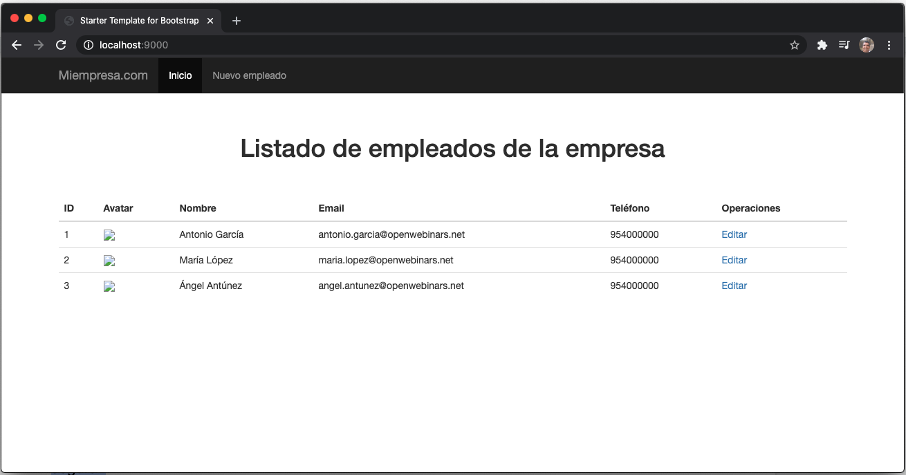
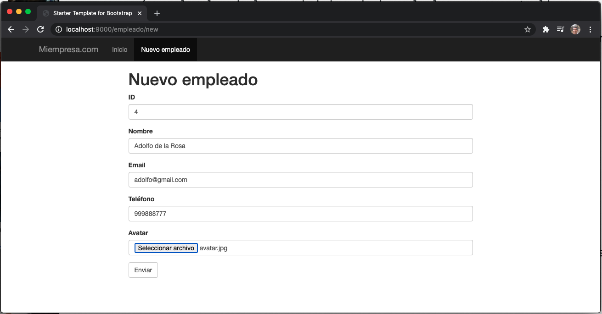
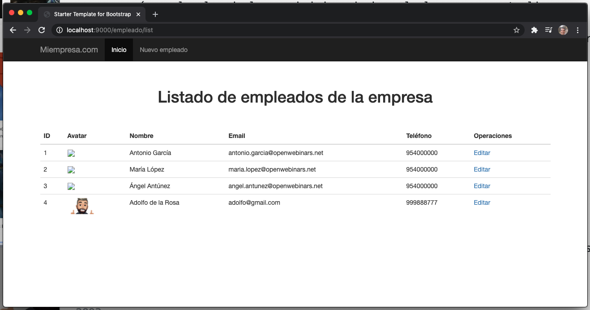


dónde se están subiendo los ficheros pues si recordamos hemos creado la propiedad vale a través de aquí la propiedad en Street properties en un directorio llamado loudeville si nosotros refrescamos nuestro proyecto podremos comprobar que tenemos aquí ese directorio y que dentro tiene el fichero PNG con el avatar que nosotros hemos subido.

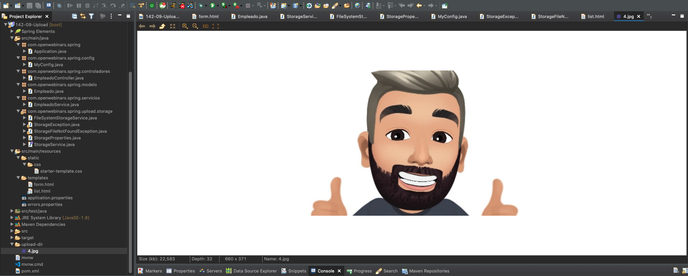

estos ficheros como decíamos a través de este código el command line Runner que se inicia se lanza justo al iniciar la aplicación pues se borran todos vale cuando cuando se lanza el almacenamiento justo antes de inicializar lo para que podamos ir probando lo de forma de forma conveniente 

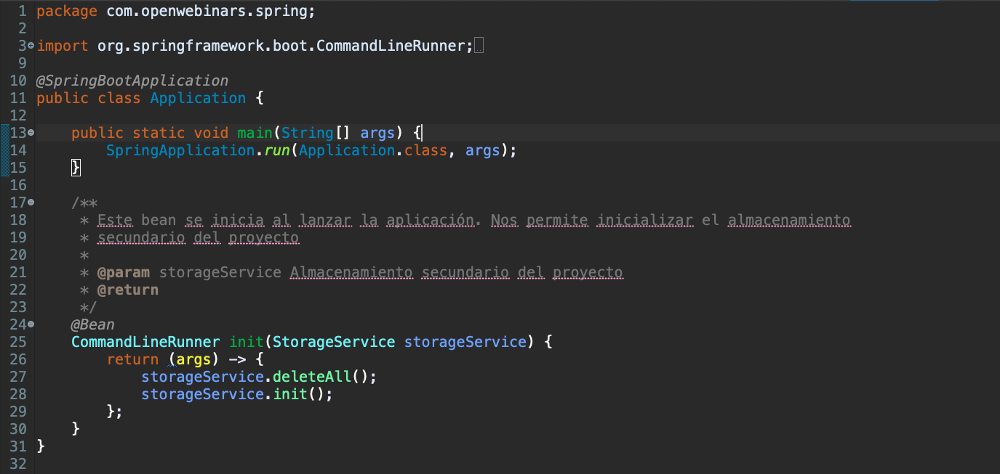

y hasta aquí el ejemplo de subida de ficheros que hemos hecho a lo largo de varios vídeos 

ahora como en los anteriores os dejo algo para práctica cuenta hemos hecho la implementación de la subida de ficheros solamente en a la hora de crear un nuevo empleado os ánimo a que os plantee como se podría hacer a la hora de editar la imagen un registro que ya existe un empleado que ya está lo podríamos intentar atacar desde distinta alternativa como en la ficha de edición mostrar la imagen del empleado tener un botón de borrar o simplemente mostrar la imagen que ya existe y también el campo de edición y el usuario sube una nueva imagen se machaca la anterior si no sube ninguna pues se deja la que hubiera en su en su lugar también te propongo el que puedas cambiar los tipos de Avatar vale lo avatar los avatares adorable no son los únicos que existen podría utilizar Gravatar que si no me equivoco es el que el que utiliza github vale también como como servicio de avatares y sí bueno si maneja y algo más a nivel profesional de reprogramación o podría plantear el cambiar el servicio completo de almacenamiento de ficheros en lugar de hacerlo en el sistema de ficheros del proyecto utilizar algún servicio de almacenamiento de imágenes yo propongo por ejemplo y el de ING Kurt es gratuito nos permite subir imágenes a través de su API la subida pública no requieren de autenticación tan solo que nuestra aplicación esté registrada a través de lápiz de ING curo y podría ser una buena alternativa si queréis más información sobre cómo poder implementarlo vale cómo poder usarlo el lápiz de irme Hepburn desde dejaba ahí os dejo también la URL de la documentación con esto finalizamos los vídeos de subida de ficheros en los siguientes vídeos vamos a ver cómo hacer nuestra aplicación web más segura


# 25 Aplicación web segura con Spring Security 13:31 

[PDF Haciendo_una_aplicación_web_segura.pdf](pdfs/19._Haciendo_una_aplicación_web_segura.pdf)

## Resumen Profesor

### Dependencias

La dependencia *starter* de Spring Security es:

```html
<dependency>
    <groupId>org.springframework.boot</groupId>
    <artifactId>spring-boot-starter-security</artifactId>
</dependency>
```

Y la de los extras de Thymeleaf para Spring Security:

```html
<dependency>
    <groupId>org.thymeleaf.extras</groupId>
    <artifactId>thymeleaf-extras-springsecurity5</artifactId>
    <version>3.0.4.RELEASE</version>
</dependency>
```

### Código de la plantilla de login

El formulario de login lo hemos implementado con una de las plantillas de ejemplo de Bootstrap 3. En particular, el que puedes encontrar en https://getbootstrap.com/docs/3.3/examples/signin/.

A continuación tienes el código algo tuneado, y que se utiliza en el proyecto de ejemplo del vídeo:

* CSS: nuevo fichero `src/main/resources/static/css/signin.css`

```css
@charset "UTF-8";

body {
  padding-top: 40px;
  padding-bottom: 40px;
.form-signin {
  background-color: #eee;
}

  max-width: 330px;
.form-signin .form-signin-heading,
  padding: 15px;
  margin: 0 auto;
}
.form-signin .checkbox {
  font-weight: normal;
  margin-bottom: 10px;
}
.form-signin .checkbox {
}
.form-signin .form-control {
     -moz-box-sizing: border-box;
  position: relative;
  height: auto;
  -webkit-box-sizing: border-box;
.form-signin .form-control:focus {
          box-sizing: border-box;
  padding: 10px;
  font-size: 16px;
}
  z-index: 2;
}
  border-bottom-left-radius: 0;
.form-signin input[type="email"] {
  margin-bottom: -1px;
  border-bottom-right-radius: 0;
}
}
.form-signin input[type="password"] {
  margin-bottom: 10px;
  border-top-left-radius: 0;
  border-top-right-radius: 0;
```  

* Nueva plantilla en `/src/main/resources/templates/login.html`

La plantilla está un poco modificada, con las webjars incluidas y eliminando algún elemento que sobraba.

```html
<!DOCTYPE html>
<html lang="es" xmlns:th="http://www.thymeleaf.org">
<head>
<meta charset="utf-8">
<meta http-equiv="X-UA-Compatible" content="IE=edge">
<meta name="viewport" content="width=device-width, initial-scale=1">
<title>Formulario de login</title>
<meta name="description" content="">
<meta name="author" content="">


<!-- Bootstrap core CSS -->
<!-- Custom styles for this template -->
<link href="/webjars/bootstrap/css/bootstrap.min.css" rel="stylesheet">

<link href="/css/signin.css" rel="stylesheet">


      <script src="https://oss.maxcdn.com/html5shiv/3.7.3/html5shiv.min.js"></script>
<!-- HTML5 shim and Respond.js for IE8 support of HTML5 elements and media queries -->
<!--[if lt IE 9]>
      <script src="https://oss.maxcdn.com/respond/1.4.2/respond.min.js"></script>
    <![endif]-->
            <label for="username" class="sr-only">Username</label> <input
</head>

<body>

    <div class="container">

        <form class="form-signin" th:action="@{/login}" method="post">
            <h2 class="form-signin-heading">Por favor, introduzca sus datos</h2>
                for="password" class="sr-only">Password</label> <input
                type="text" id="username" name="username" class="form-control"
                placeholder="Username" required autofocus> <label
                type="password" name="password"  id="password" class="form-control"
    ================================================== -->
                placeholder="Password" required>
            <button class="btn btn-lg btn-primary btn-block" type="submit">Sign
                in</button>
        </form>

    </div>
    <!-- /container -->

    <!-- Bootstrap core JavaScript
</html>
    <!-- Placed at the end of the document so the pages load faster -->
    <script src="/webjars/jquery/jquery.min.js"></script>
    <script src="/webjars/bootstrap/js/bootstrap.min.js"></script>


</body>
```

### CSRF (*Cross-site request forgery*)
Aunque lo hemos utilizado en el proyecto de ejemplo, el conocimiento en profundidad de este problema de seguridad queda fuera del ámbito del curso. Si te animas a leer algo más sobre exte posible *exploit*, puedes hacerlo en wikipedia: https://es.wikipedia.org/wiki/Cross-site_request_forgery.

## Transcripción

### :computer: `142-10-Seguridad`
#### Ejemplo de integración de Spring Security

Vamos a partir del proyecto base que tiene la siguiente estructura:

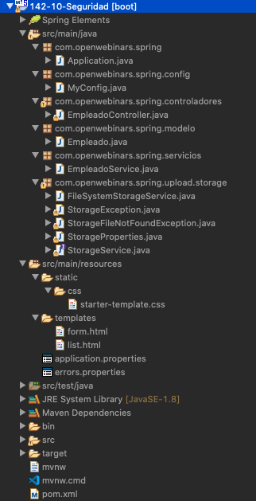

#### Añadir Dependencias de Spring-Security

```html
<dependency>
   <groupId>org.springframework.boot</groupId>
   <artifactId>spring-boot-starter-security</artifactId>
</dependency>
```


#### Paso 1: Configuración de la Seguridad


```java
@Configuration
@EnableWebSecurity
public class SecurityConfig extends WebSecurityConfigurerAdapter {

   @Override
   protected void configure(AuthenticationManagerBuilder auth) throws Exception {
      auth
         .inMemoryAuthentication()
         .passwordEncoder(NoOpPasswordEncoder.getInstance())
         .withUser("admin")
         .password("admin")
         .roles("ADMIN");	
   }
}
```


#### Ejecutar la Aplicación


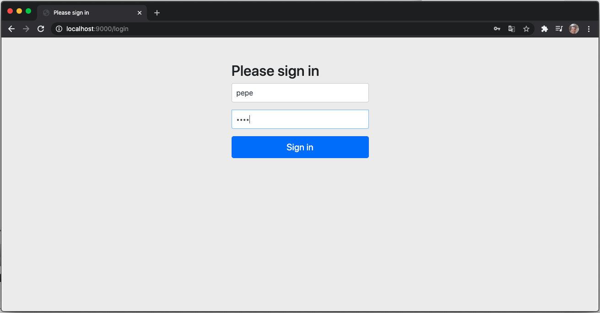
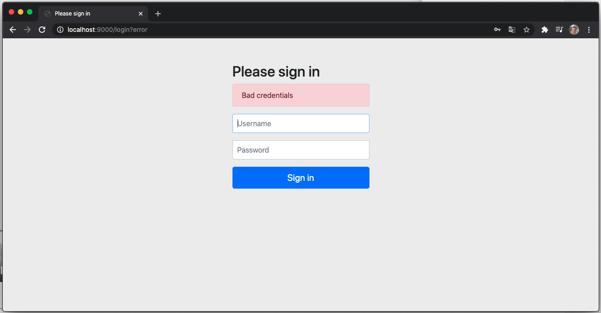
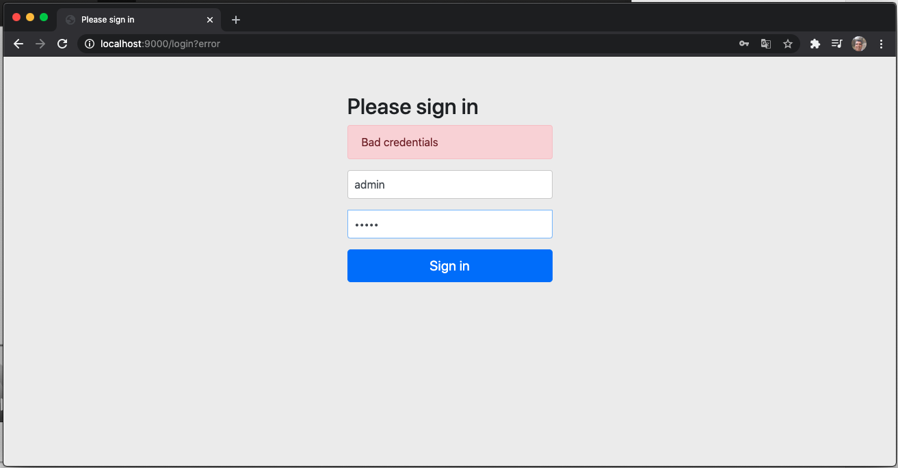


#### Paso 


```java
package com.openwebinars.spring.config;

import org.springframework.context.annotation.Configuration;
import org.springframework.web.servlet.config.annotation.ViewControllerRegistry;
import org.springframework.web.servlet.config.annotation.WebMvcConfigurer;

@Configuration
public class MvcConfig implements WebMvcConfigurer {

   @Override
   public void addViewControllers(ViewControllerRegistry registry) {
      registry.addViewController("/login");
   }	
}
```

# 26 Implementación del login con Spring Security 13:25 

## Resumen Profesor

No existe.

## Transcripción

#### Paso 4

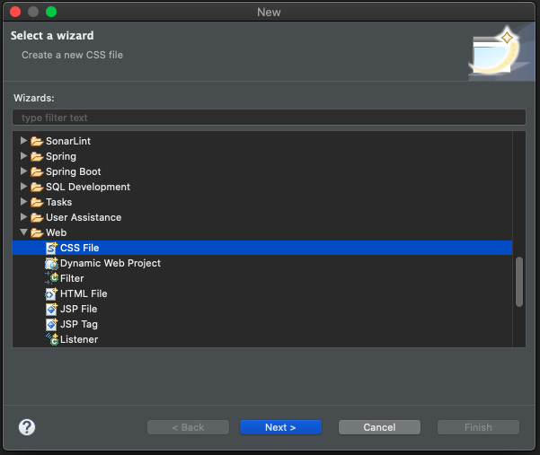
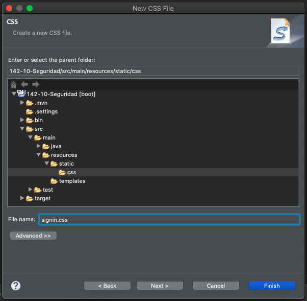


```css
@charset "UTF-8";

body {
  padding-top: 40px;
  padding-bottom: 40px;
  background-color: #eee;
}

.form-signin {
  max-width: 330px;
  padding: 15px;
  margin: 0 auto;
}
.form-signin .form-signin-heading,
.form-signin .checkbox {
  margin-bottom: 10px;
}
.form-signin .checkbox {
  font-weight: normal;
}
.form-signin .form-control {
  position: relative;
  height: auto;
  -webkit-box-sizing: border-box;
     -moz-box-sizing: border-box;
          box-sizing: border-box;
  padding: 10px;
  font-size: 16px;
}
.form-signin .form-control:focus {
  z-index: 2;
}
.form-signin input[type="email"] {
  margin-bottom: -1px;
  border-bottom-right-radius: 0;
  border-bottom-left-radius: 0;
}
.form-signin input[type="password"] {
  margin-bottom: 10px;
  border-top-left-radius: 0;
  border-top-right-radius: 0;
}
```

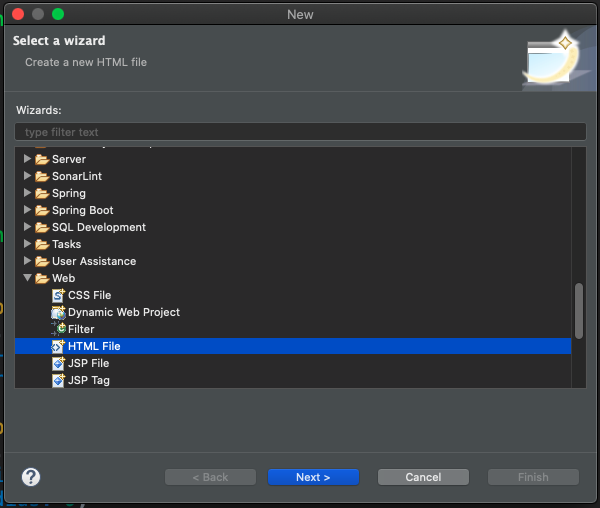
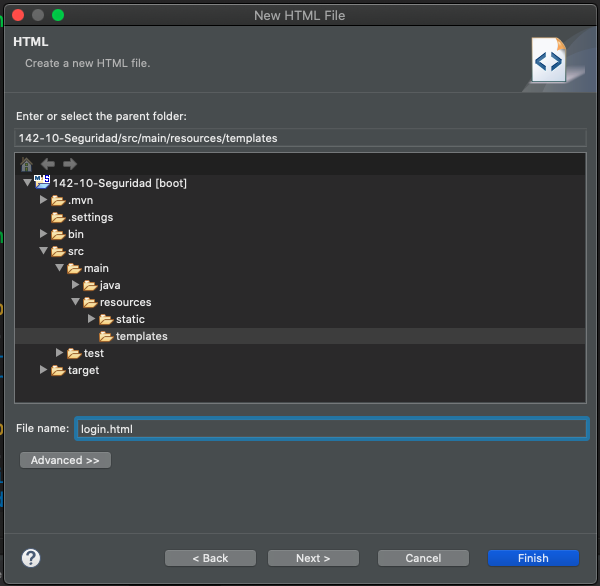

```java
<!DOCTYPE html>
<html lang="es" xmlns:th="http://www.thymeleaf.org">
<head>
<meta charset="utf-8">
<meta http-equiv="X-UA-Compatible" content="IE=edge">
<meta name="viewport" content="width=device-width, initial-scale=1">
<meta name="description" content="">
<meta name="author" content="">

<title>Formulario de login</title>

<!-- Bootstrap core CSS -->
<link href="/webjars/bootstrap/css/bootstrap.min.css" rel="stylesheet">

<!-- Custom styles for this template -->
<link href="/css/signin.css" rel="stylesheet">


<!-- HTML5 shim and Respond.js for IE8 support of HTML5 elements and media queries -->
<!--[if lt IE 9]>
      <script src="https://oss.maxcdn.com/html5shiv/3.7.3/html5shiv.min.js"></script>
      <script src="https://oss.maxcdn.com/respond/1.4.2/respond.min.js"></script>
    <![endif]-->
</head>

<body>

	<div class="container">

		<form class="form-signin" th:action="@{/login}" method="post">
			<h2 class="form-signin-heading">Por favor, introduzca sus datos</h2>
			<label for="username" class="sr-only">Username</label> <input
				type="text" id="username" name="username" class="form-control"
				placeholder="Username" required autofocus> <label
				for="password" class="sr-only">Password</label> <input
				type="password" name="password"  id="password" class="form-control"
				placeholder="Password" required>
			<button class="btn btn-lg btn-primary btn-block" type="submit">Sign
				in</button>
		</form>

	</div>
	<!-- /container -->

	<!-- Bootstrap core JavaScript
    ================================================== -->
	<!-- Placed at the end of the document so the pages load faster -->
	<script src="/webjars/jquery/jquery.min.js"></script>
	<script src="/webjars/bootstrap/js/bootstrap.min.js"></script>


</body>
</html>
```

#### Paso 5: Autorizar Peticiones

AQUIIIIIII

En la Clase de seguridad `SecurityConfig` añadimos el siguiente método:

```java
@Override
protected void configure(HttpSecurity http) throws Exception {
   http
			.authorizeRequests()
				.antMatchers("/webjars/**", "/css/**").permitAll()
				.anyRequest().authenticated()
				.and()
			.formLogin()
				.loginPage("/login")
				.permitAll();
				
	}
```

```java
```

```java
```

# 27 Manejo de sesiones con Spring Session 6:43 

[PDF Manejo_de_sesiones.pdf](pdfs/20._Manejo_de_sesiones.pdf)

## Resumen Profesor

### Dependencias Maven

Necesitamos dos dependencias

```html
<dependency>
   <groupId>org.springframework.boot</groupId>
   <artifactId>spring-boot-starter-data-redis</artifactId>
</dependency>
```

Esta primera dependencia es de Spring Data (en concreto, específicamente para Redis), el API de Spring que nos permite manejar datos en diferentes orígenes (bases de datos relacionales, NoSQL, …) a través de repositorios. Esta dependencia es usada por la siguiente.

```html
<dependency>
   <groupId>org.springframework.session</groupId>
   <artifactId>spring-session-data-redis</artifactId>
</dependency>
```

Esta es la dependencia específica para incluir Spring Session Core y el almacenamiento de sesiones en Redis.

### Instalación de Redis

Para usar Redis vamos a trabajar con Docker. Si quieres saber más sobre esta tecnología, puedes visitar nuestro **Curso de Introducción a Docker** y también nuestro **Curso de Docker para Desarrolladores**.

Una vez instalado docker, el comando para descargar, instalar y lanzar Redis es:

```sh
$ docker run -d --name myredis -p 6379:6379 redis
```

*Si trabajas con Linux, posiblemente necesites poner antes `sudo` para poder ejecutarlo.*

También puedes descargar Redis desde su web: https://redis.io/download.

### Conexión al cliente de Redis

Si quieres conectar con el cliente de Redis lo puedes hacer de la siguiente forma:

```sh
$ docker exec -ti myredis bash
$ redis-cli
```

También lo puedes hacer en una sola línea de código

```sh
$ docker exec -ti myredis redis-cli
```

## Transcripción

# 28 Integración de Spring Session en nuestro proyecto 11:10 

## Resumen Profesor

No existe.

## Transcripción

#  Contenido adicional 17

* [PDF 08._Cómo_funciona_una_aplicación_web.pdf](pdfs/08._Cómo_funciona_una_aplicación_web.pdf)
* [PDF Algunos_patrones_de_diseño.pdf](pdfs/09._Algunos_patrones_de_diseño.pdf)
* [PDF Estructura_de_un_proyecto_web_.pdf](pdfs/10._Estructura_de_un_proyecto_web_.pdf)
* [PDF Estructura_de_un_proyecto_web_.pdf](pdfs/11._Conceptos_de_Java_EE_necesarios.pdf)
* [PDF Controladores.pdf](pdfs/12._Controladores.pdf)
* [PDF Vistas.pdf](pdfs/13._Vistas.pdf)
* [PDF RequestParam_y_PathVariable_.pdf](pdfs/14._RequestParam_y_PathVariable_.pdf)
* [PDF Contenido_estático.pdf](pdfs/15._Contenido_estático.pdf)
* [PDF Formularios.pdf](pdfs/16._Formularios.pdf)
* [PDF Formularios_Edicion.pdf](pdfs/17._1_Formularios_Edicion.pdf)
* [PDF Formularios_Validacion.pdf](pdfs/17._2_Formularios_Validacion.pdf)
* [PDF Subida_de_ficheros.pdf](pdfs/18._1_Subida_de_ficheros.pdf)
* [PDF Subida_de_ficheros.pdf](pdfs/18._2_Subida_de_ficheros.pdf)
* [PDF Subida_de_ficheros.pdf](pdfs/18._3_Subida_de_ficheros.pdf)
* [PDF Haciendo_una_aplicación_web_segura.pdf](pdfs/19._Haciendo_una_aplicación_web_segura.pdf)
* [PDF Manejo_de_sesiones.pdf](pdfs/20._Manejo_de_sesiones.pdf)
* [ficheros](pdfs/ficheros.zip)
