# 4. Spring Data JPA 01:24

* 29 Introducción a Spring Data 12:28 
* 30 Entidades 11:09 
* 31 Integración de las entidades en nuestro proyecto 4:06 
* 32 Repositorios 10:43 
* 33 Integración de los repositorios en nuestro proyecto 13:21 
* 34 Consultas básicas 19:36 
* 35 Otras consultas 12:40 
* Contenido adicional 4

# 29 Introducción a Spring Data 12:28

[PDF Introducción_a_Spring_Data.pdf](pdfs/21._Introducción_a_Spring_Data.pdf)

## Resumen Profesor

### Módulos de Spring Data

Spring Data es un proyecto *paraguas* de otros subproyectos. Ofrece diversos módulos para múltiples formas de almacenar datos:

### Módulos principales

* Spring Data Commons: elementos comunes al todos los demás módulos
* Spring Data JDBC: Repositorios de Spring Data sobre JDBC.
* Spring Data JDBC ext: Soporte para extensiones específicas de algunos SGBD.
* **Spring Data JPA: Spring Data con soporte para JPA**
* Spring Data KeyValue: Repositorios basados en `Map` (almacenes clave/valor)
* Spring Data LDAP: Repositorios con soporte para Spring LDAP.
* Spring Data MnogoDB: Repositorios para Mongodb con soporte objeto-documental.
* Spring Data Redis: Configuración fácil para el uso de Redis en aplicaciones Spring
* Spring Data for Apache Cassandra: Configuración y acceso fácil a Apache Cassandra.
* Spring Data for Apache Geode: Configuración y acceso fácil para Apache Geode.
* Spring Data for Apache Solr: Configuración y acceso fácil para Apache Solr.
* Spring Data for Pivotal GemFire: Configuración y acceso fácil para Pivotal GemFire.

### Módulos de la comunidad

* Spring Data Aerospike: Spring Data para Aerospike.
* Spring Data ArangoDB: Spring Data para ArangoDB.
* Spring Data Couchbase: Spring Data para Couchbase.
* Spring Data Azure Cosmos DB: Spring Data para Microsoft Azure Cosmos DB.
* Spring Data DynamoDB: Spring Data para DynamoDB.
* Spring Data Elasticsearch: Spring Data para Elasticsearch.
* Spring Data Hazelcast - Soporte de repositorios Spring Data para Hazelcast.
* Spring Data Jest - Spring Data para Elasticsearch basado en el cliente REST Jest.
* Spring Data Neo4j - Soporte para repositorios Spring Data para Neo4j.
* Spring Data Vault - Repositorios Vault sobre Spring Data KeyValue.

### Módulos relacionados

* Spring Data JDBC Extensions: extensiones a JDBC provistas en Spring Framework
* Spring para Apache Hadoop: Simplifica Hadoop ofreciendo una configuración y modelo unificado.
* Spring Content: Asociación de contenido con entidades Spring Datay almacenamiento de datos en un abanico de almacenes como S3, Mongo GridFS, …

### Dependencias Maven

Para usar Spring Data JPA, podemos utilizar la dependencia *starter* de Spring Boot:

```html
<dependency>
    <groupId>org.springframework.boot</groupId>
    <artifactId>spring-boot-starter-data-jpa</artifactId>
</dependency>
```

Para poder utilizar H2, usamos la siguiente dependencia:

```html
<dependency>
    <groupId>com.h2database</groupId>
    <artifactId>h2</artifactId>
    <scope>runtime</scope>
</dependency>
```

Esta dependencia no es solo un conector a la base de datos, sino que incluye la base de datos en sí dentro de nuestro proyecto.

## Transcripción

Hola hola todos comenzamos un nuevo bloque de este curso de Spring y no introducimos en el mundo de stringdata primero hablaremos sobre la persistencia de los datos la persistencia de la información hasta ahora todas las aplicaciones que hemos venido desarrollando almacenaban los datos en memoria es decir que entre inicio y reinicio de la aplicación por los datos se perdían la mayoría de las aplicaciones con las que solemos trabajar Mobile suelen trabajar con necesita persistencia de información en decir trabajan con ciclo de vida con trabajan con lógica de aplicación que necesita presentación ya nos la suele aportar cualquier sistema de almacenamiento no vamos a entrar en detalle en los diversos sistemas que ve que podríamos tener eso escapa este curso y nos vamos a centrar en nuestro casa en la base de datos que sería la solución más usual podríamos decir para para persistir información a día de hoy existen dos grandes podremos llamar grupo de base de datos en el fondo son grandes modelo a la hora de representar la información en una en una base de datos por un lado el relacional y por otro lado el no SQL el modelo relacional que nacen los años 70 y que a día de hoy pues sigue siendo fuertemente utilizado se basa en una estructura de datos que es la tabla que es bueno pues está matriz bidimensional de doble entrada con columna y con pila bueno por el propio modelo tenemos una serie de características de ventajas como en la garantía frente a duplicidad de decir jamás podemos tener en una base de datos relacional dos filas que sean exactamente exactamente iguales suelen ser base de datos cuando trabajamos con ellas que normalmente pues tienen un diseño normalizado lo cual también nos ayuda la integridad referencial a poder llevarlo a cabo la integridad referencial es una regla que bueno pues nos permite asociar datos entre tablas y garantizar que esos datos asociados son consistentes y como desventaja porque no todo son ventajas pues encontramos que no son fácilmente escalables es decir que si estamos desarrollando un sistema que en principio está pensado para un manejo de un cierto volumen de datos bueno pues duplicar triplicar ciento plicar este es el volumen de datos no es no es sencillo no en la otra mano tenemos la fase de datos no es sequel frente al modelo relacional no SQL no significa que no sean más se de datos relacionales y no que no solamente son relacionales no porque ofrecen algunas características de las base de datos relacionales y otra adicionales lo primero que nos encontramos que hay distintos modelos y es que podemos encontrar en el mercado diferentes forma de arquitectura vale de modelo de representación de los datos vale aquellos que trabajan con hámsters otros que trabajan con documento diferentes modelo una de las grandes ventajas en la velocidad y la flexibilidad frente al modelo relacional qué es modelo ciertamente rígido tenemos las bases de datos NoSQL que son que tienen un modelo totalmente flexibles no por ejemplo un sistema gestor de base de datos como podría ser Mongo que trabaja con documentos nos permite guardar en una colección dos documentos que no tengan la misma factura lo cual pues nos da mucha fiesta y vida en este caso sí que son francamente más fáciles de escalar vale mediante diferentes técnicas y sobre todo están pensados para un manejo de un gran volumen de datos aunque


Lo podríamos utilizar que así que cualquier contesta como ya decía las bases de datos relacionales que bueno pues llevan imperando de alguna manera desde los años 80 90 siguen siendo a día de hoy muy utilizada sin embargo tienen una dificultad si nosotros pensamos en nuestras aplicaciones Java podremos pensar en clase y en objetos no usamos objetos que es bueno si lo hiciéramos plantear en un dibujo podríamos decir que tienen n dimensiones no porque no pueden tener múltiples atributos asociación entre otros objetos etcétera las bases de datos relacionales basadas en el uso de tabla tienen dos dimensiones no fila y columna no entonces cómo podríamos salvar nosotros este este despacito si lo tuviéramos que programar a mano utilizando JDBC qué es la tecnología podríamos decir más elemental que tiene Java para acceder a base de datos pues tendríamos que programar un código parecido a este no aquí podemos apreciar este desfase objeto-relacional es decir somos nosotros los que tenemos que hacer el mapeo datos datos vale entre cada atributo de en este caso la clase empleado con cada atributo el perdón con cada columna de la base de datos vale que hemos consultado no este código suele ser tedioso muy repetitivo solamente van variando en la termina imágenes las consultas que podemos realizar o bien bueno pues los distintos datos y los tipos de datos que nos devuelve con lo cual es muy propenso a errores no es francamente te vio para salvar esto tenemos bueno fue todo un estilo podríamos llamar día de software porque no es una única solución que es el mapeo objeto relacional y qué es una pieza de software que colocaríamos entre nuestra aplicación y la base de datos y qué se encarga podríamos decir que básicamente de traducir objetos a filas y viceversa es decir que nos va a permitir seguir trabajando con objetos aunque de manera subyacente bueno pues seguirán trabajando con fila y tabla de una base de datos relacional en el mercado podemos encontrar varios si bien estuvimos decir que el rey de todos ellos para Java es Hibernate aparte de Hibernate podemos encontrar Mané a nivel superior como una abstracción por encima el estándar anda vale se define en Java para dar respuesta a esta proliferación de RM que iba surgiendo y bueno para definir un estándar no una especie de contrato al cual seguirnos cuándo vamos a trabajar con persistencia en Java Java no ofrecen ninguna implementación concreta de estancias no sino que todos son implementaciones de terceros podríamos decir que si j.p.a. es el baile por así decirlo vale Hibernate sería el bailarín es decir que podemos trabajar con un esquema donde bueno trabajamos con la notación con las clases interfaces vale con el estilo del estándar j.p.a. pero por debajo sea Hibernate y que vaya trabajando con la aplicación JP no facilita la especificación de como nuestro objeto se asocian al esquema las tablas de la base de datos vale no ofrece manera sencilla de poder hacer operaciones Cruz van a de lectura de inserción de borrado de actualización no ofrece un lenguaje de consulta de datos vale distinto a SQL aunque francamente parecido pero es un lenguaje de consulta sobre objeto y nos da mucho elementos de optimización


Ventajas del propio jpg sin embargo parece que no lo habíamos olvidado de fresno y qué pasa con esto pues no ofrece spring data a la hora de trabajar con base de datos no ofrece un abanico muy amplio de posibilidades stringata digamos que es un paraguas que nos permite trabajar con múltiples tipos de base de datos de una manera similar podemos trabajar directamente con JDBC no podemos hacer con Hibernate no podemos hacer con JP sobre Hibernate vale podemos trabajar de distintas maneras el propio spring data como ya digo no ofrece un modelo consistente para trabajar con base de datos relacionales y base de datos NoSQL decir que podríamos decir que es un paraguas que no ofrece algunas ventajas una serie de repository potente la posibilidad de realizar consulta que se derivan del nombre del método en un repositorio la implementación de entidades la posibilidad de realizar el proceso de auditoría de cambios en cada una de nuestras entidades configuración muy sencilla con Spring boot etcétera etcétera existen muchos sus proyectos de Spring data vale para distintos distintas tecnologías distintos sistemas gestores de base de datos cómo sería spring data JP a el de Casandra Montgó Reddit etcétera etcétera así acceder a la página de Spring data podéis encontrar toda la lista de módulos principales del proyecto de proyectos que son mantenidos por la comunidad yo diría que hay unos 20-25 aproximadamente y para que así que cualquier sistema gestor de base de datos tanto relacional como no es ekuele de los grandes encontremos en el mercado decir entonces que nuestras pila a la hora de trabajar con la persistencia queda en todo lo bajo tendríamos nuestro sistema gestor que en nuestro caso será de 2 es un sistema gestor de base de datos sencillo que nos permite trabajar con él de forma en bebida en nuestro proyecto y que se suele utilizar en muchos casos durante la fase de desarrollo o en prueba vale para hacer prototipado vale sobre todo en las fases iniciales de desarrollo tienda terrible con Maven también tiene cumple con la regla de atomicidad consistencia y la miento y durabilidad vale la la regla las cuatro reglas así que debería cumplir cualquier sistema gestor de base de datos relacional y es muy ligero sobre el bueno pues no encontramos la pila que comentábamos antes JDBC sobre el Hibernate sobre el JP ah y sobre el Spring data J P a S su proyecto es integrar todo lo que podemos hacer con JP y algunas funcionalidades más cómo pueden ser los automáticos a través de los repositorios muchas facilidades a la hora de realizar consulta la posibilidad de realizar consultas con jpql consultas nativa vale nos veremos en alguno de los vídeos posteriores muchas facilidades a la hora de hacer consulta la dependencia que añadiremos después y que nos faltan serían estás de aquí por un lado la dependencia starter de data j.p.a. y por otro lado tendríamos que añadir la dependencia de la base de datos H2 y como decías quedará en bebida dentro de dentro de de nuestra aplicación al igual que nos pasa con nuestro contenedor de servlets y así bueno pues no te preocupare hemos de tener que tener un sistema remoto gestionar conexiones etcétera etcétera hasta aquí la introducción a JP a en el próximo vídeo empezaremos hablando de entidades


# 30 Entidades 11:09 

[PDF Entidades.pdf](pdfs/22._Entidades.pdf)

## Resumen Profesor

No existe.

## Transcripción

Hola a todos vamos a continuar nuestro bloque sobre spring data JP hablando sobre entidades las tareas que se suele realizar a la hora de desarrollar una aplicación sobre todo en las fases iniciales es saber que información vamos a manejar información plasmada normalmente en algún tipo de diagrama por ejemplo URL de llamar el modelo de dominio de nuestro sistema ya digo representa los conceptos propios bueno pues toda la información que vamos a gestionar en el problema que estamos resolviendo vamos hablando por ejemplo de un sistema bancario seguramente en el modelo de dominio aparecerían conceptos como cliente cuenta interés préstamo saldo etcétera etcétera si estuviéramos hablando de bueno pues como tenemos aquí un diagrama de un sistema de transporte de metro pues podríamos tener algunas clases como por ejemplo ticket venta de ticket estación personal viaje usuario si os dais cuenta es el vocabulario específico y los conceptos claves de nuestro sistema a la hora de plantearlo como una estructura para no estar aplicación hablamos de entidades y de relaciones o asociaciones entre esa entidad vale que aquí están plasmadas como como un diagrama de clases de VM y como hablábamos antes en el vídeo anterior vemos cómo vamos a realizar un mapeo de nuestros objetos de nuestras clases en tabla si pensamos que por ejemplo en en la tabla contacto vale por ejemplo una agenda de contacto a una agenda de un sistema de contacto vale podríamos ver cómo toda la entidad toda la clase contacto se va a mapear con una tabla completa y por cada uno de los campos que tengamos vamos a tener una columna de manera que si la tabla perdón si la entidad contacto tiene 123456 tinto pues la tabla tendrá al menos 5 columnas no y normalmente pues se llamará igual no queremos que solo podemos variar ya en el mundo de la programación hablaremos de entidad como una clase Java normal lo que se llama un pollo no cumplen olha oque anotado con arroba en tan solo con añadir esta anotación ya veremos como como tenemos una entidad que será gestionada por spring data JP a adicionalmente necesitamos también como mínimo un atributo que haga las veces de clave primaria este concepto del mundo de las bases de datos por clave primaria entendemos a un atributo o conjunto de atributos que identifican unívocamente a esa instancia de el decir para una persona por ejemplo un atributo que sería bueno como clave primaria por ejemplo podría ser el DNI no atributo tendrá que venir anotado como mínimo con arroba y de tal y como veis en la play vale y veremos como bueno pues de todo eso atributos que vaya teniendo la entidad serán propiedades y serás más real como columna y que deberían también tener metodos getter y métodos ella sobre las 5 más


Cambiar el nombre sino que nos permite identificar algunas propiedades más por ejemplo si vamos a querer que esa columna permita o no valores nulos vale mediante la propiedad anulable y va a poder ser insertable o actualizables entidad vale se utilizara en determinado en determinados contextos como por ejemplo de claves primarias compuestas con Len el tamaño que tendría el campo dentro de la base de datos si es que vamos a generar nosotros el DDL entre otras las propiedades que podemos setear con la natación arroba jo os decía antes también hablando de este ejemplo en particular del anotación generated gratis en muchas ocasiones nos interesara el valor de la clave primaria no sea el usuario quien tenga 15 ptas no sino que se auto género por ejemplo si estamos hablando de la base de datos de Twitter pues la clave primaria de un tweet no sería otro que quizá una conjunción de la fecha exacta con el usuario bueno quizá lo más sencillo sería ir asignándole un número a cada uno de los tweets al primer tweet que se escriba el 1 al 7 el 2 y estoy sucesivamente no sería un esquema francamente sentí bueno a ellos lo podíamos llamar un campo artificial que normalmente suele ser de tipo long se le suele llamar a Ivi y que viene anotado con estas dos anotaciones que veíamos a IBI y Jane Slater pan acompañando a generated value podemos identificar el tipo de esquema de generación de la base de perdón de generación de CD que queremos utilizar con auto lo que permitiremos es que sea j.p.a. en el fondo por debajo Hibernate quién lo decida a la hora de utilizar uno u otra base de datos Hibernate tiene lo que se llama dialectos no que son propiedades concretas del sistema gestor de base de datos con el cual se va contenta va marcando un poco la pista sobre cuál es la mejor estrategia de generación para este sistema gestor de base de datos ya que no todos los sistemas soportan todas las posibilidades entre ellos tenemos tres que son 50 utilizando una secuencia identity utilizando un campo autonumerico o table utilizando una tabla extra special ya digo que en función de qué sistema gestor de base de datos tengamos auto escogerá uno de estos tres a la hora de mapear valores hemos visto que si no queremos modificar el nombre ni añadir ninguna propiedad adicional tan solo con que la clase está anotada con arroba entity los valores que tenga las propiedades que tenga serán mapeados como con los tipos de datos que se mapean directamente son los que tenemos en pantalla los tipos básicos los envoltorios de los tipos básicos son los tipos básicos con mayúscula las clases string y gente que toda esta lista que tenía que las clases serializables las clases que están anotadas con embeddable el resto de tipo de datos por defecto generarían un error vale porque tendríamos que explicarle al sistema cómo poder hacer ese ese mapeo o en el fondo reducirlo a a tipo de datos más elemental desde la versión 53 de Hibernate y el estándar 2.2 de JP a también se soportan las clases de fecha de cada 8 también se soporta para el mapeo de valores más complejos sobre asociaciones j.p.a. nos permite asociar más de una entidad como hemos visto en el diagrama del inicio y eso se hace a través de campos especiales que llevan este tipo de anotación en función de la multiplicidad de los extremos de la Asociación


La más elemental que es many-to-one una asociación muchos a uno suele ser de las que más se nos presente si bien tenemos alguna otra como one to many many to many y cuánto van estos campos me dijo que serán especiales y veremos alguno de ellos en el proyecto de ejemplo aquí por ejemplo tendríamos un fragmento del código de la clase producto que veníamos trayendo y una clase categoría que tendrían una asociación many-to-one ya que muchos productos podrían pertenecer a una categoría vale sin embargo un producto solamente tendrá una sola categoría a la cual pertenece entonces se representaría de esta manera a través de un atributo vale en este caso categoría sería también una una entidad y haríamos referencia que aquí a un campo de asociación con este arroba many-to-one si queréis saber más sobre entidades asociaciones etcétera etcétera o invito a que podáis visitar nuestro curso de Hibernate y JP a dónde se explican todos estos conceptos con mucho más detenimiento en el siguiente vídeo aplicaremos todo esto que hemos explicado y crearemos una entidad en nuestro proyecto y podremos comenzar a dar los primeros pasos para implementar la persistencia en nuestra aplicación


# 31 Integración de las entidades en nuestro proyecto 4:06 

## Resumen Profesor

No existe.

## Transcripción

Hola hola a todos vamos a continuar como decíamos en el vídeo anterior aplicando las entidades a nuestro proyecto para ello vamos a partir de un proyecto de base vale que tenéis por aquí y que podemos copiar pegar bueno este proyecto no es más que el que hemos ido dejando en vídeo en vídeo anteriores 

### :computer: `142-12-Entidades`
#### Ejemplo de manejo de Spring Data JPA

Partimos del proyecto base que tiene la siguiente estructura:

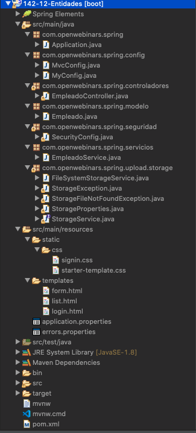


#### Añadir las Dependencias

bueno tendremos que hacer algunos pequeños cambios el primero como habíamos visto era añadir las dependencias de Spring data j.p.a. y de H2 las podemos añadir al final vale tienen que aparecer aún más librería sobre persistencia y H2 vale que la tenemos también por aquí 

```html
...
<dependency>
   <groupId>org.springframework.boot</groupId>
   <artifactId>spring-boot-starter-data-jpa</artifactId>
</dependency>
<dependency>
   <groupId>com.h2database</groupId>
   <artifactId>h2</artifactId>
   <scope>runtime</scope>
</dependency>
...
```

por otro lado tendríamos que modificar nuestra entidad vale por un lado es añadirle arroba gente y nos damos cuenta de la propuesta que no hace de importación del tipo A importa siempre deberíamos escoger las dejaba x persisten y no las anotaciones concretas de Hibernate vale 

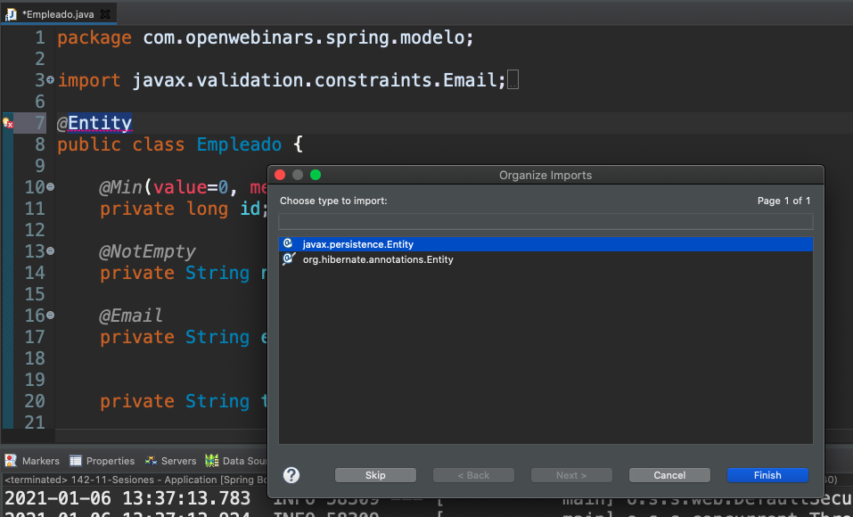

aquí la tendríamos no faltaría identificar nuestro campo y de que ya lo tenemos por aquí vale hemos dicho que vamos a generar el valor cuenta ya lo habíamos puesto de tipo long previendo vamos a añadir algún anotación más por ejemplo ya que este campo no queremos que esté vacío con arroba column vale lo vamos a poner como un roble afannes en esta forma acabamos de generar nuestra nuestra primera entidad 

```java
...
@Entity
public class Empleado {
	
   @Id @GeneratedValue
   @Min(value=0, message="{empleado.id.mayorquecero}")
   private long id;
	
   @Column(nullable=false)
   @NotEmpty
   private String nombre;
   
   ...
```

quiero decir que cuando corramos el proyecto que está todo correctamente configurado tendremos en la base de datos una tabla llamada empleado que tendrá está 5 columna dónde vive será la clave primaria y donde mal nombre no podrá ser nulo a la hora de insertarse cómo vemos es francamente sencillo mucho más que que si hubiéramos tenido que hacer todo este código de JDBC del que hablábamos en el vídeo en el vídeo anterior para poder ver los cambios tendremos que esperarnos al siguiente vídeo donde empezaremos a hablar sobre los repositorios para poder ir trabajando de alguna manera con nuestras entidades y poder persistir información rescatarla etcétera

# 32 Repositorios 10:43 

[PDF Repositorios.pdf](pdfs/23._Repositorios.pdf)

## Resumen Profesor

### Algunos elementos de Spring Framework

Por si tienes oxidados algunos de los elementos de Spring Framework, aprovecho para recordar:

* Si utilizamos la anotacion `@Autowired` sobre una referencia de un tipo interfaz, Spring se encarga de buscar en el *IoC container* una instancia de un *bean* de un tipo que sea compatible, es decir, que implemente dicha interfaz.

* Si Spring encuentra más de una instancia de un tipo de bean (en nuestro caso, hay dos clases que implementan una interfaz, `EmpleadoService`), posiblemente tendríamos una excepción. Al anotar uno de los beans con `@Primary`, Spring escoge dicho bean entre los dos.

### Propiedades en `application.properties` para Spring Data JPA

```html
# URL jdbc de conexión a la base de datos
# spring.datasource.url=jdbc:h2:mem:db
spring.datasource.url=jdbc:h2:./openwebinars

# Usuario y contraseña de la base de datos
spring.datasource.username=sa
spring.datasource.password=

# Habilitamos la consola de H2
# http://localhost:{server.port}/h2-console
# En nuestro caso http://localhost:9000/h2-console
spring.h2.console.enabled=true

# Habilitamos los mensajes sql en el log
spring.jpa.show-sql=true
```

### `CommandLineRunner`

Se trata de una interfaz muy útil, ya que nos permite definir fragmentos de código que se lanzarán justo al iniciar la aplicación.

Si vemos la estructura del código a usar:

```java
@Bean
CommandLineRunner initData(EmpleadoRepository repositorio) {
    return (args) -> {
        //código a ejecutar
    };
}
```

Apreciamos que estamos usando una *expresión lambda* para devolver el objeto. Como los demás métodos anotados con `@Bean`, lo podemos definir en una clase anotada con `@Configuration` o en la clase `@SpringBootApplication`.

### Actualización en la seguridad

Como hemos visto en las propiedades, hemos habilitado la posibilidad de acceder a la consola de H2, pero al ser un acceso web que está dentro de nuestro proyecto, tenemos que darle “via libre” para entre en la configuración de seguridad.

*Vamos a dar un acceso total al cualquier usuario porque estamos aprendiendo. En otro caso, esto no sería una buena práctica, y solamente deberíamos dar acceso a algún usuario que cumpliera alguna característica, como tener el rol de administrador. Otra solución podría ser tener dos beans de configuración de la seguridad, y activar uno u otro en base a los perfiles. Si quieres saber cómo hacer esto, puedes visitar nuestro Curso de Spring Core.*

El código del método que gestiona la autorización debería quedar como sigue:

```java
@Configuration
@EnableWebSecurity
public class SecurityConfig extends WebSecurityConfigurerAdapter {

    //... otros métodos

    @Override
    protected void configure(HttpSecurity http) throws Exception {  
        http
            .authorizeRequests()
                .antMatchers("/webjars/**", "/css/**", "/h2-console/**").permitAll()
                .anyRequest().authenticated()
            .and()
            .formLogin()
                .loginPage("/login")
                .permitAll()
            .and()
                .logout();

            http.csrf().disable();
            http.headers().frameOptions().disable();

    }    
}
```

Necesitamos esto porque:

* Tenemos que dar acceso a la ruta concreta de acceso a la consola, `/h2-console/`
* Por defecto, Spring Security habilita la protección contra CSRF, y para usar la consola de H2 esta no puede estar habilitada.
* La interfaz de usuario de la consola utiliza frames, y Spring Security no los permite por defecto (envía la cabecera `X-Frame-Options: DENY`). Al deshabilitar esa cabecera, ya podemos cargar frames.

## Transcripción

Hola a todos vamos a continuar hablando de Spring data JP y en particular sobre los repositorios spring data define una interfaz principal llamada repository y nos permite tomar una entidad su tipo de ID y trabajar con ella es una entidad perdona una interfaz muy muy básica pero se define una jerarquía de interfaces que nos permiten bueno pues tomar alguna como punto de partida como por ejemplo es Cruz repository este interfaz no incluye todas las operaciones Cruz es decir insertar actualizar borrar obtener toda la distancia obtener una envase Aribe contar cuántas hay verificar la existencia en base a nivel etcétera etcétera es decir nos permite la posibilidad de incluir muchas de ellas para usarlo para usar Cruz de repository tan solo tendríamos que extender ese repositorio con una interfaz vale indicándole como decía el tipo de dato de la entidad y el tipo de datos de la clave primaria y sin tener que implementar nada más que que dónde está la magia de este sin tener que añadir ninguna línea de código más de hecho no nos hace falta ni siquiera añadirle nada anotación@repository sin añadir como decía ninguna línea más tenemos todas estas funcionalidades le digo que quiero dónde viene la magia vamos a ver algo de esto en acción para estamos de este proyecto base

### :computer: `142-13-Repositorios`
#### Ejemplo de manejo de Spring Data JPA

Partimos del proyecto base con la siguiente estructura:

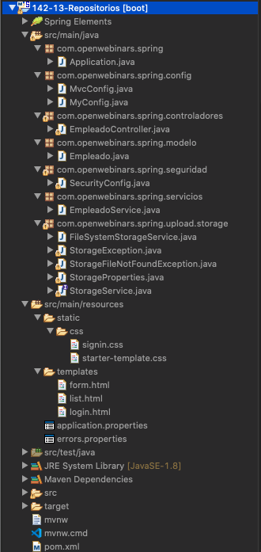

Vamos a hacer algunos cambios lo primero de todo lo primero de todo que vamos a hacer es crear un nuevo paquete llamado repositorio dentro del paquete raíz que estamos utilizando repositorios y aquí dentro vamos a crear una nueva interfaz está interfaz la vamos a llamar empleado repository el nombre no es prescriptivo siempre y cuando sea una que sea identificable fácilmente y hemos dicho que vamos a extender Cruz repository de empleado que es de nuestra clase modelo y luego hacemos los import correspondientes aquí tenemos el código cómo podemos ver muy muy muy sencillo añadir algún cambio más

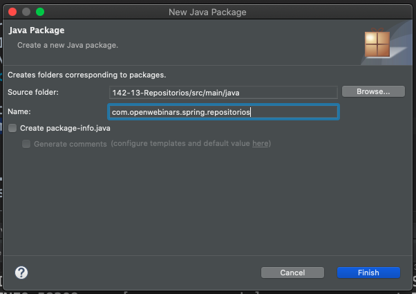
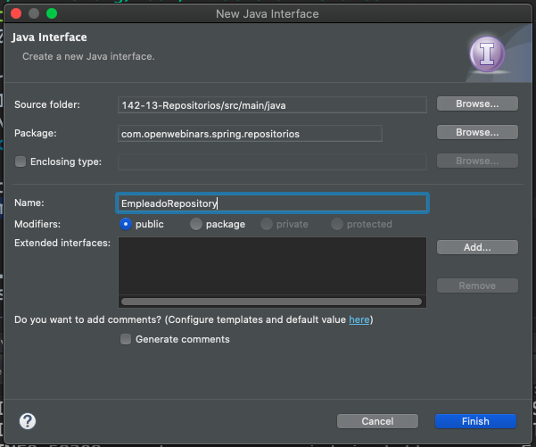

```java
package com.openwebinars.spring.repositorios;

import org.springframework.data.jpa.repository.JpaRepository;

import com.openwebinars.spring.modelo.Empleado;

public interface EmpleadoRepository extends CrudRepository<Empleado, Long>{

}
```

Por ejemplo en el modelo vamos a crear un constructor esto de estar autogenerado con todos los datos y recordáis como añadimos posteriormente la imagen pues generamos un nuevo constructor necesitaríamos un constructor que no incluyera Elide porque live va a ser autogenerado lo podríamos generar también aquí con el nombre por ejemplo el email y el teléfono ya que también vimos que el campo imagen no era obligatorio lo podríamos tener por aquí 


```java
...
public Empleado(String nombre, String email, String telefono) {
   this.nombre = nombre;
   this.email = email;
   this.telefono = telefono;
}
...
```

queremos comprobar ya que esto funciona la integración podríamos decir que es bueno la haremos después pero si queremos y somos impacientes y queremos comprobar que esto funciona podemos venirnos a la clase aplicación crear un nuevo commandlinerunner donde interactuar con el repositorio me vaya a permitir pero vaya creando por aquí crear al recibir aquí este empleado repositorio he repository es como si lo estuviéramos inyectando directamente vale aquí devolvemos el command line Runner y el cuerpo del método aquí y aquí podríamos crear uno o dos empleados y después almacenarlo en el repositorio mediante su método 6 que tengo el código por aquí como podéis comprobaremos que le ha creado dos nuevos creados mejor no empleado y los vamos a almacenar este repositorio este este interfaz que tiende a Cruz del repository incluye algunos métodos que vamos a ver después como sí que nos va a permitir almacenar una entidad y entre otros también tiene un método que faynore te devuelve en el caso de cruz de repository un iterable que nos va a permitir obtener todos y cada uno de los elementos de ese tipo que tengamos en la base de datos vale directamente los podríamos imprimir de esta zona 


```java
...
@Bean
CommandLineRunner initData(EmpleadoRepository repositorio) {
   return (args) -> {

      Empleado empleado = new Empleado("Luis Miguel López", "luismi.lopez@openwebinars.net", "954000000");
      Empleado empleado2 = new Empleado("José García", "jose.garcia@openwebinars.net", "954000000");
			
      repositorio.save(empleado);
      repositorio.save(empleado2);
			
      repositorio.findAll().forEach(System.out::println);
      
   };
}
...
```

ejecutamos esta aplicación Vale me voy a perdonar tengo que levantar que no estaba levantado ahora sí y aquí podemos comprobar como se han impreso por consola vale los dos empleados que hemos almacenado en la base de datos con los ID 1 y 2 y que no tienen imagen Héctor repositorio ya digo que francamente molan porque nos van a permitir hacer todas las operaciones cruz sin que nosotros tengamos que implementar nada de nada

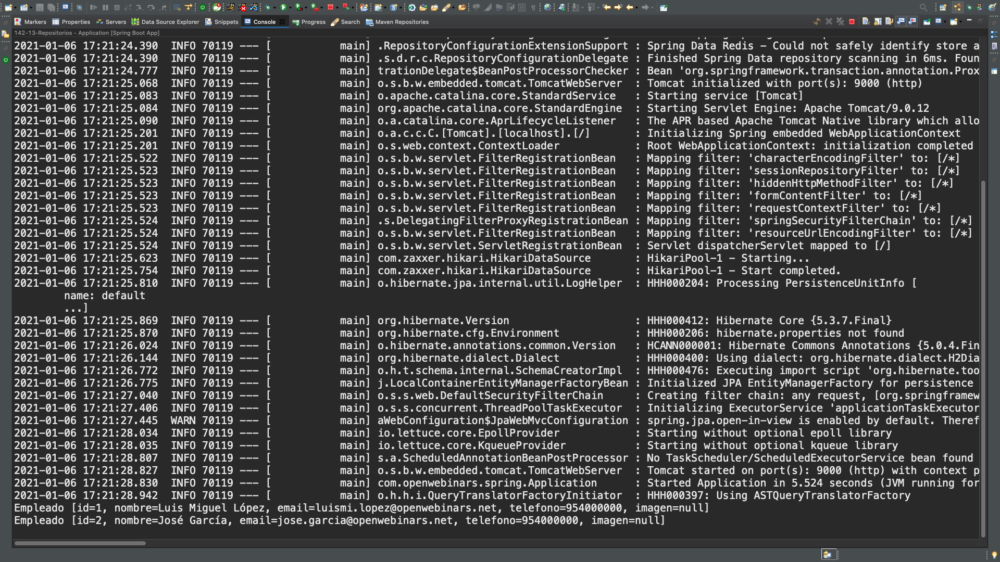

Spring data JP and ofrece una cadena de repositorios de hecho Cruz de repository lo tenemos presente en más sus proyectos de Spring data y nos ofrece una jerarquía que nos va a permitir tener poco a poco algunos métodos más no si visitamos la documentación de crudo repository https://docs.spring.io/spring-data/commons/docs/current/api/org/springframework/data/repository/CrudRepository.html

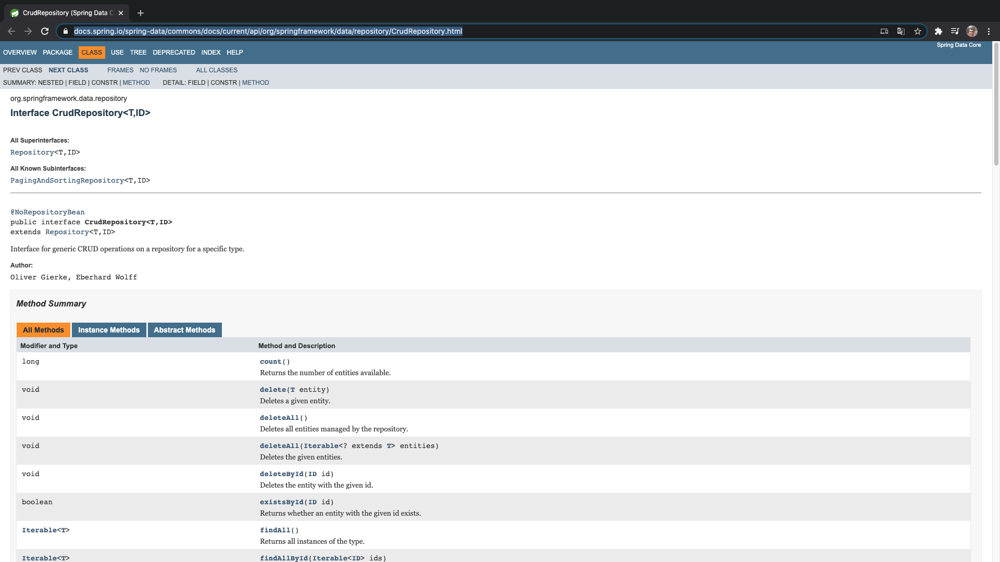
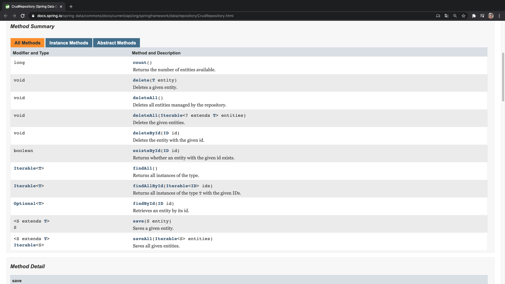
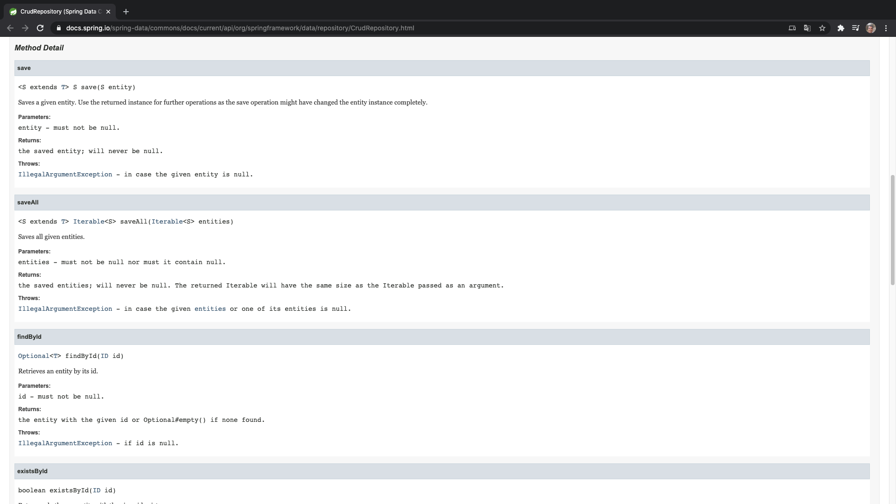
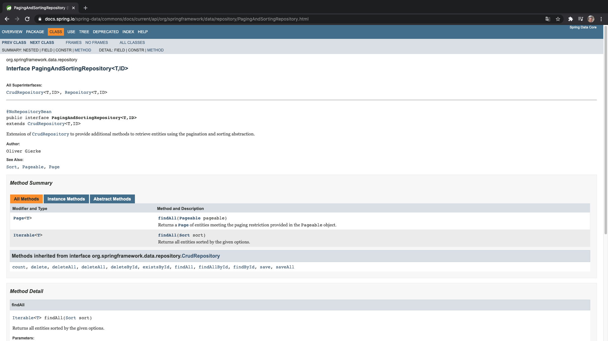
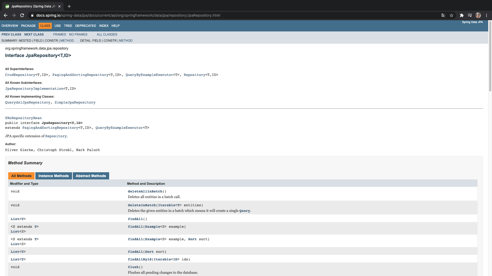
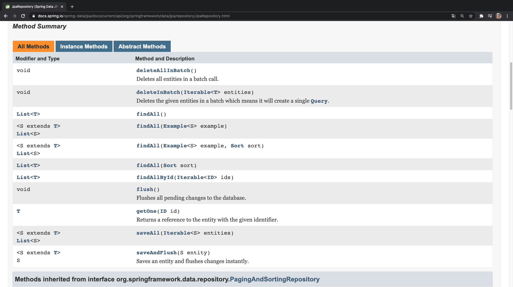

podemos ver la cantidad de métodos que tenemos que son los más elementales para salvar para obtener todos para poder borrar borrar todo y trabaja casi siempre con iterable no si vamos visitando el resto de su interfaz es que podemos encontrar como paging and sorting ojo tapea podremos ver que adicionalmente se van añadiendo algunos más algunos métodos más en el caso de cruz repository tenemos los métodos más básicos y que casi siempre trabajan con iterable si damos el salto al uso de paging and sorting repository tenemos todo lo que tiene crudo repository y además tenemos la posibilidad de obtener todos los datos con un determinado orden y obtener todos los datos por página los Juan nos permitiría paginar resultados es decir si queremos tener en nuestra aplicación los resultados que se visualicen siempre de 20 en 20 aunque tengamos un millón vale pues las consultas funcionaria mejor ya que se irían trayendo esos resultados de en páginas de tamaño 20 no para poder página vamos que como el más concreto y asociado a JP a tenemos JP repository que añade todo lo que teníamos antes del crudo y del facebook con la posibilidad de estos métodos no para que devuelvan un lis vale que suele ser más utilizado para nosotros que iterable 6 también puede devolver un Lis y estamos hablando varios plus 6 plus vale que permite descargar todas las tareas pendientes de la base de datos el borrado en un proceso por lotes elimina también un iterable de entidades etcétera etcétera es decir que podemos tener bastantes más operaciones y que sean francamente más cómoda y ya digo que para ello tan solo perdón tendríamos que en lugar de usar Bluetooth repository usar repository y nuestro proyecto en principio función haría igual los relanzamos funcionaria igual 

```java
package com.openwebinars.spring.repositorios;

import org.springframework.data.jpa.repository.JpaRepository;
import com.openwebinars.spring.modelo.Empleado;

public interface EmpleadoRepository extends JpaRepository<Empleado, Long>{

}
```


pero tendríamos adicionalmente a la hora de trabajar con este repositorio otra serie de metros como decía antes por ejemplo faenol ahora si devuelve un listado en lugar de devolver un iterable en el siguiente vídeo vamos a hacer la integración de estos repositorios con nuestro proyecto vamos a modificar el servicio para que lo pueda utilizar convenientemente vale y lo vamos a hacer paso a paso para que lo podáis aprender de la mejor manera posible


# 33 Integración de los repositorios en nuestro proyecto 13:21 

## Resumen Profesor

No existe.

## Transcripción

Hola a todos vamos a aplicar lo que hemos aprendido sobre repositorios en el vídeo anterior a nuestro proyecto vamos a dar varios paso lo primero de todo que vamos a refactorizar la clase que hemos venido utilizando como servicio y la vamos a renombrar empleado service memory services memory con mamado oculte eso es porque será un servicio que nos permitiría gestionar los empleados pero siempre almacenando los mejores vamos a crear una interfaz llamada empleado services que tendría el contrato la firma de los métodos que debería tener un servicio que se tiene empleada adicionalmente vamos a crear un servicio llamado empleado services bien vale que nos va a permitir almacenarlo empleado esta vez y en una base de datos cargaremos algunos datos de ejemplo a través del command line Runner configuraremos algunas properties para que nuestra base de datos realmente se almacenes en un en un fichero qué es lo que hace H2 almacenar todos los datos en un fichero hasta ahora cuando hemos trabajado con H2 como no hemos indicado lo contrario bueno pues spring boot no está configurando la base de datos en memoria actualizaremos la seguridad de nuestro proyecto para que nos permita hacer alguna operación es más como por ejemplo visitar la consola de la base de datos y veremos si es necesario o no actualizar el formulario vayamos poco a poco como decía nos tendríamos que venir a los servicio y en este caso tendríamos que refactorizar esta clase vamos a llamarme

#### Refactorizar `EmpleadoService` a `EmpleadoService`

Ademas le añadimos un nombre

```java
...
@Service("empleadoServiceMemory")
public class EmpleadoServiceMemory {
...
```

#### Crear nueva Interface `EmpleadoService`

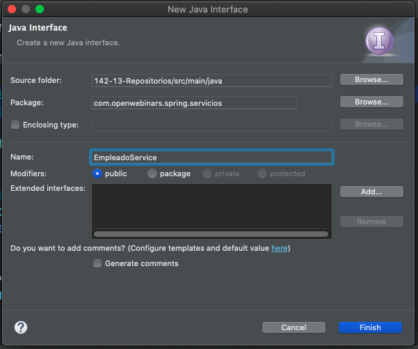


```java
package com.openwebinars.spring.servicios;

import java.util.List;

import com.openwebinars.spring.modelo.Empleado;

public interface EmpleadoService {

	public Empleado add(Empleado e);
	public List<Empleado> findAll();
	public Empleado findById(long id);
	public Empleado edit(Empleado e);
}
```

#### Crear nueva clase `EmpleadoServiceDB`

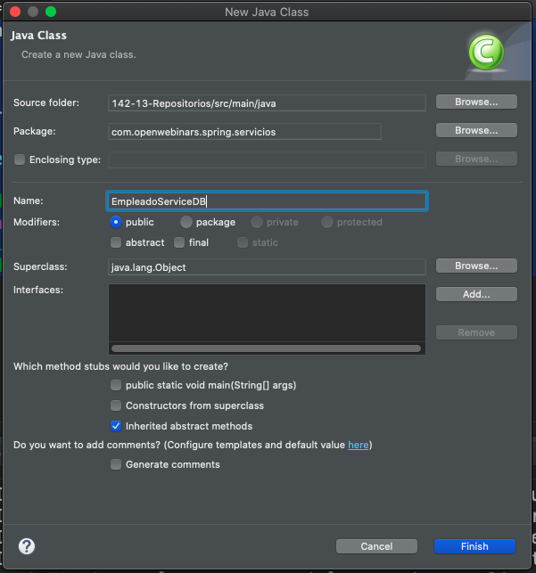
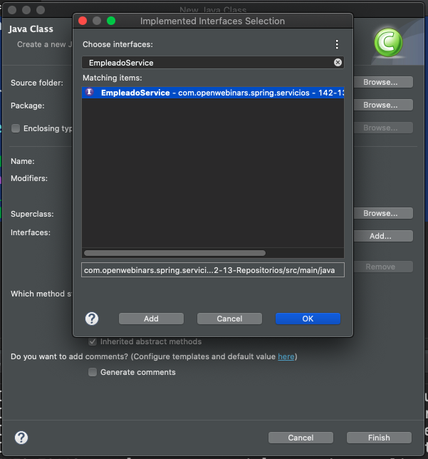
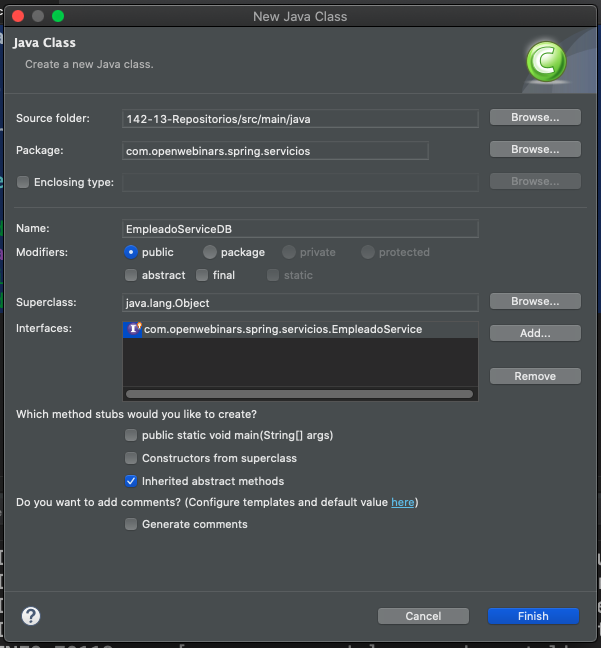


En lugar de utilizando como hemos venido usando aquí una lista como repositorio aquí utilizaremos un auténtico repositorio que ya tenemos definido no bueno esta implementación vamos a ver cómo es francamente sencilla porque nos va a permitir nos va a permitir hacer todas las operaciones de una manera muy fácil por ejemplo aquí hemos visto que el método 6 nos permitía almacenar una entidad y además podemos ver en la firma del método que devuelve la entidad recién guardada además con esos campos como el libre actualizados prefería así de sencillo tenemos otro método ya llamado también faenón en el repositorio vale con lo cual es simplemente un recubrimiento también tenemos uno lo tenemos por aquí aquí lo que nos damos cuenta es que el método Find hay desde repositorio devuelve un opcional para no tener que cambiar más cosas podemos hacer esta pequeña triquiñuela la clase obtiene al es un envoltorio conveniente para para objetos para evitar posibles errores de tipo NullPointerException para poder burlar la de alguna manera lo podemos hacer así esto devuelve un opcional y el método devuelve la distancia de empleados es que lo ha encontrado o en otro caso devuelve nulo tendremos por aquí la posibilidad de evitar vale editar no es más que en principio aplicar el mismo método seis ya que el dato que perdón la entidad que vamos almacenar ya tiene un y de lo que hace es evitar el que el que tengamos ahora hemos dicho que íbamos añadir algunos datos de ejemplo en el command line Runner lo que podríamos hacer comentaristas de aquí mira algunos


```java
package com.openwebinars.spring.servicios;

import java.util.List;

import org.springframework.beans.factory.annotation.Autowired;
import org.springframework.context.annotation.Primary;
import org.springframework.stereotype.Service;

import com.openwebinars.spring.modelo.Empleado;
import com.openwebinars.spring.repositorios.EmpleadoRepository;

@Primary
@Service("empleadoServiceDB")
public class EmpleadoServiceDB implements EmpleadoService {
	
   @Autowired
   private EmpleadoRepository repositorio;

   @Override
   public Empleado add(Empleado e) {
      return repositorio.save(e);
   }

   @Override
   public List<Empleado> findAll() {
      return repositorio.findAll();
   }

   @Override
   public Empleado findById(long id) {
      return repositorio.findById(id).orElse(null);
   }

   @Override
   public Empleado edit(Empleado e) {
      return repositorio.save(e);
   }
	
   public void delete(Empleado e) {
      repositorio.delete(e);
   }

}
```

y como aquí puede haber puede no lo habría de hecho ahora mismo una colisión entre los dos servicios lo que hacemos es añadir aquel servicio en base de datos el principal en prima de esta manera aquí a la hora de inyectar buscar a primero en le va a hacer el rato y si no estuviera disponible vale pues utilizaría el almacenamiento en memoria

#### Ingresar Datos de Inicio

Permitir los podemos copiar por aquí lo único que va a hacer es salvar de una vez tres empleados cuyos datos ya teníamos de algún ejemplo anterior

```java
@Bean
	CommandLineRunner initData(EmpleadoRepository repositorio) {
		return (args) -> {

//			Empleado empleado = new Empleado("Luis Miguel López", "luismi.lopez@openwebinars.net", "954000000");
//			Empleado empleado2 = new Empleado("José García", "jose.garcia@openwebinars.net", "954000000");
//			
//			repositorio.save(empleado);
//			repositorio.save(empleado2);
//			
//			repositorio.findAll().forEach(System.out::println);

			repositorio.saveAll(
					Arrays.asList(new Empleado(1, "Antonio García", "antonio.garcia@openwebinars.net", "954000000"),
							new Empleado(2, "María López", "maria.lopez@openwebinars.net", "954000000"),
							new Empleado(3, "Ángel Antúnez", "angel.antunez@openwebinars.net", "954000000")));

		};
	}
```


#### Modificar `EmpleadoController`


también nos quedaría venir una a nuestra clase controlador como podemos comprobar ahora aquí al refactorizar lo que está haciendo es mirad el servicio en memoria queríamos que tirará a través de la interfaz 


```java
...
@Autowired
private EmpleadoService servicio;
...
```

 como decía otro de los pasos que vamos a hacer es añadir una serie de propiedades en el application properties


AQUIIIIIIIIIIIIIIII


# 34 Consultas básicas 19:36 

[PDF Consultas.pdf](pdfs/24._Consultas.pdf)

## Resumen Profesor

### *Keywords* a usar en las consultas derivadas del nombre del método

Hemos visto que Spring Data nos permite utilizar algunas palabras especiales en las consultas derivadas del nombre del método. La lista completa de palabras con su correspondencia lógica es la siguiente:

Expresión lógica | Expresión Spring Data
-----------------|----------------------
AND | and
OR |	or
AFTER | After, IsAfter
BEFORE | Before, IsBefore
CONTAINING | Containing, IsContaining, Contains
BETWEEN | Between, IsBetween
ENDING_WITH | EndingWith, IsEndingWith, EndsWith
EXISTS | Exists
FALSE | False, IsFalse
GREATER_THAN | GreaterThan, IsGreaterThan
GREATER_THAN_EQUALS | GreaterThanEqual, IsGreaterThanEqual
IN | In, IsIn
IS | Is, Equals
IS_EMPTY | IsEmpty, Empty
IS_NOT_EMPTY | IsNotEmpty, NotEmpty
IS_NOT_NULL | NotNull, IsNotNull
IS_NULL | Null, IsNull
LESS_THAN | LessThan, IsLessThan
LESS_THAN_EQUAL | LessThanEqual, IsLessThanEqual
LIKE | Like, IsLike
NEAR | Near, IsNear
NOT | Not, IsNot
NOT_IN | NotIn, IsNotIn
NOT_LIKE | NotLike, IsNotLike
REGEX | Regex, MatchesRegex, Matches
STARTING_WITH | StartingWith, IsStartingWith, StartsWith
TRUE | True, IsTrue
WITHIN | Within, IsWithin

En la documentación de Spring Data JPA podemos encontrar la correspondencia entre estas *keywords* y el correspondiente snippet de código JPQL https://docs.spring.io/spring-data/jpa/docs/current/reference/html/#jpa.query-methods.query-creation.

### Querydsl

La dependencia maven a incluir sería:

```html
<dependency>
   <groupId>com.querydsl</groupId>               
   <artifactId>querydsl-jpa</artifactId>
</dependency>
```

Además, necesitamos añadir un plugin, que es el que creará las clases derivadas de nuestro modelo de datos que se utilizan para consultar

```html
<plugin>
    <groupId>com.mysema.maven</groupId>
    <artifactId>apt-maven-plugin</artifactId>
    <version>1.1.3</version>
    <executions>
        <execution>
            <goals>
                <goal>process</goal>
            </goals>
            <configuration>
                <outputDirectory>target/generated-sources/java</outputDirectory>
                <processor>com.querydsl.apt.jpa.JPAAnnotationProcessor</processor>
            </configuration>
        </execution>
    </executions>
</plugin>
```

### Query by Example

Si nos fijamos en la especificación de métodos de `JpaRepositoriy<T, ID>`, nos damos cuenta de que podemos utilizar algún método que hace uso de `Example<S>`.

```java
public interface JpaRepository<T, ID> extends PagingAndSortingRepository<T, ID>, QueryByExampleExecutor<T> {

    // otros métodos

    @Override
    <S extends T> List<S> findAll(Example<S> example);

    @Override
    <S extends T> List<S> findAll(Example<S> example, Sort sort);
}
```

## Transcripción

# 35 Otras consultas 12:40 

## Resumen Profesor

No existe.

## Transcripción

# Contenido adicional 4

* [PDF Introducción_a_Spring_Data.pdf](pdfs/21._Introducción_a_Spring_Data.pdf)
* [PDF Entidades.pdf](pdfs/22._Entidades.pdf)
* [PDF Repositorios.pdf](pdfs/23._Repositorios.pdf)
* [PDF Consultas.pdf](pdfs/24._Consultas.pdf)

