# 2. Primer servicio REST con Spring Boot 76m

* 08 Mi primer servicio REST 9:33 
* 09 Puesta en marcha de la aplicación 7:48 
* 10 Estructura de las rutas 15:31 
* 11 Clases y anotaciones de Spring 14:25 
* 12 Uso del patrón Data Transfer Object (DTO) 11:25 
* 13 Implementando DTO con ModelMapper 17:58 
* Contenido adicional 6


# 08 Mi primer servicio REST 9:33 

[PDF Mi_primer_servicio_REST.pdf](pdfs/07_Mi_primer_servicio_REST.pdf)

## Resumen Profesor

### Ejemplo

El ejemplo que se utiliza en esta lección está accesible desde la web de Spring en la siguiente url: https://spring.io/guides/gs/rest-service/.

También se puede descargar desde dentro del propio IDE, a través de *New > Import Spring Getting Started Content* y seleccionando **Rest Service**.

## Transcripción


Vamos a comenzar el segundo bloque y vamos a crear nuestro primera API REST, nuestro primer servicio API REST.

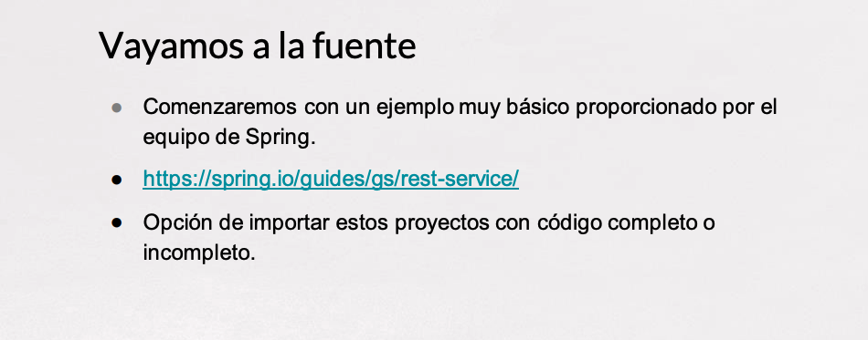

Para ello nos vamos a ir a la fuente, nos vamos a ir directamente a [Building a RESTful Web Service](https://spring.io/guides/gs/rest-service/) o directamente desde nuestro Spring Tool Suite. 

Vamos a ver un ejemplo muy básico que vamos a ir desgranando poco a poco de hecho vamos a traernos el código completo y lo vamos a ir analizando para aprender los distintos elementos que lo componen y en las siguientes lecciones, poder crearlo por nuestra cuenta.

Ya digo desde esta web URL https://spring.io/guides/gs/rest-service/ que podemos visitar tendríamos la posibilidad si queréis lo podemos buscar en las guias este primero cómo construir un servicio web sera el que vayamos trabajando.

Para traernos el código desde Spring Tool Suite lo podríamos hacer así nos venimos a File - New - Import Spring Getting Started Content 

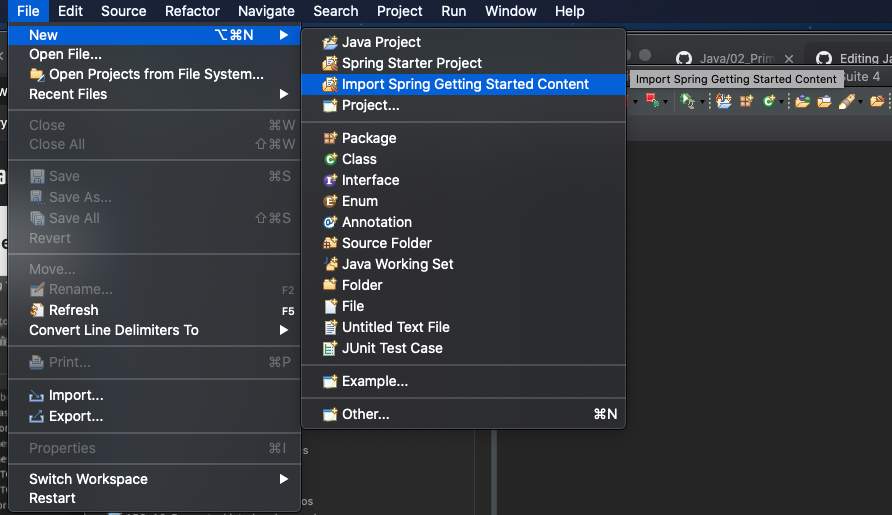

y lo podríamos buscar aquí sería si buscamos `Rest Service`.

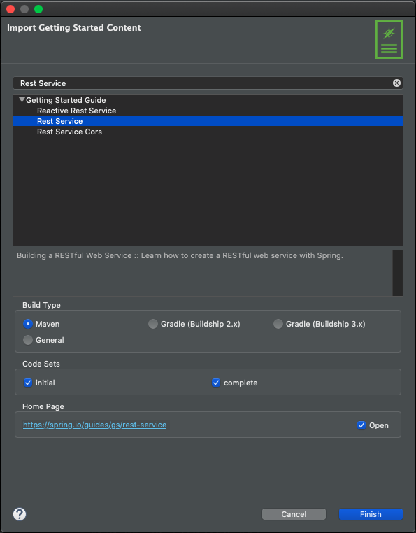

y nos traemos solamente el código completo 

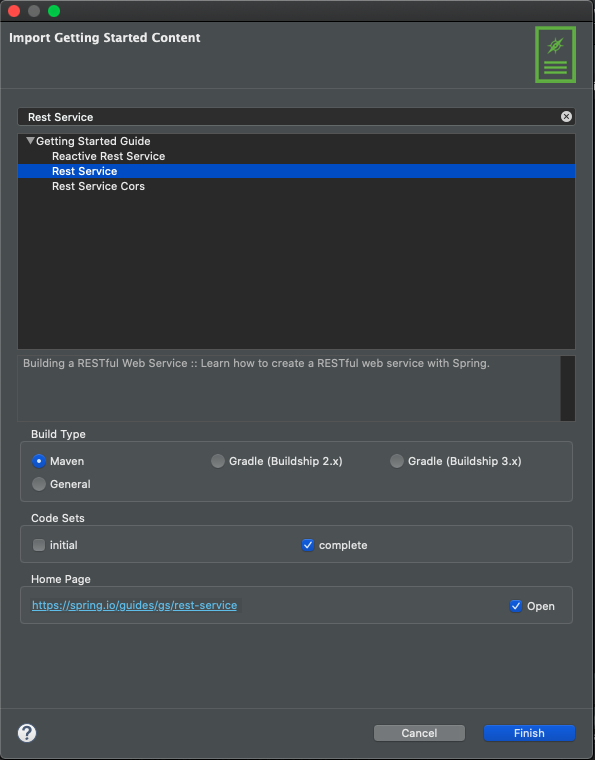

le damos a Finish, nos importaría todo el proyecto `gs-rest-service-complete`, nos abre una ventana incluso con el tutorial.

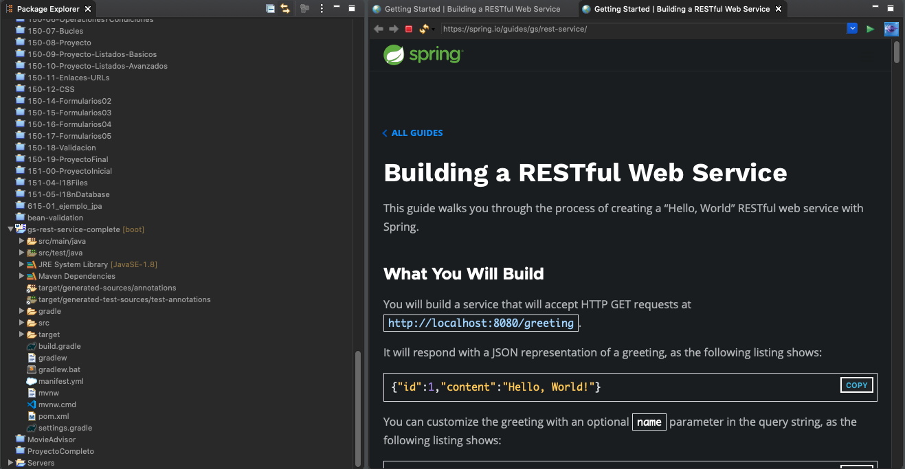

No nos va a hacer falta y tendríamos el código fuente disponible por aquí.

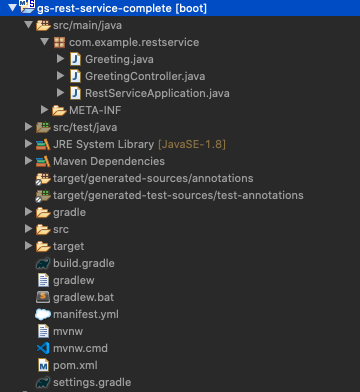

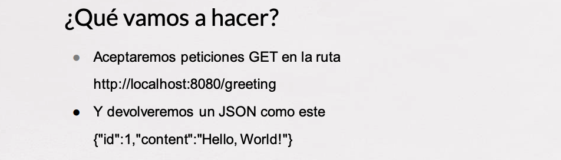

Vamos ir desgranandolo poquito a poco. Primero nos vamos a situar, ¿Qué es lo que vamos a hacer? vamos a implementar una aplicación de servidor que va a aceptar peticiones GET en una determinada ruta `/greeting` y que nos va a devolver un JSON como el de la transparencia. Un mensaje de respuesta que vas a tener un `id` que va a ser de tipo numérico un long y un mensaje en una cadena de caracteres petición-respuesta como hemos ido viendo y en una determinada URL devolveremos un JSON. 

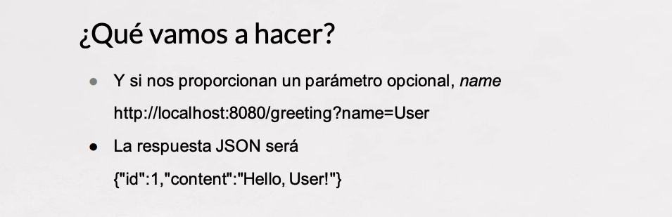

Si además le proporcionamos como parámetro opcional `name` este `/greeting` de manera que podríamos tener una URL como está `/greeting?name=User` cambiaremos en lugar de decir hola mundo haremos un hola usuario, de manera que lo podemos cambiar.

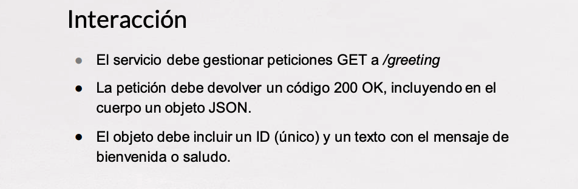

La interacción cómo podemos ver va a ser hacer peticiones GET a `/greeting` y como respuesta deberíamos obtener un código 200 OK y en el cuerpo de la respuesta deberíamos tener un JSON como el que hemos visto antes, si pasamos `/greeting?name=User` pues obtendríamos el hello con el name en partícular. El objeto además llevará un id que veremos cómo se va incrementándo si hacemos más de una petición. 

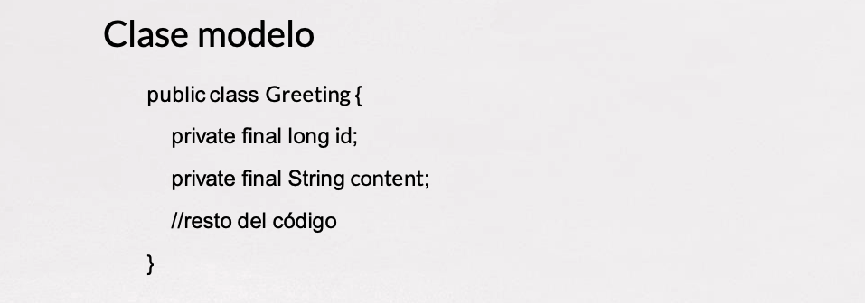

Para gestionar este modelo de datos vamos a tener una clase modelo `Greeting` que ya incluso la podemos ver por aquí:

*`Greeting`*

```java
package com.example.restservice;

public class Greeting {

   private final long id;
   private final String content;

   public Greeting(long id, String content) {
      this.id = id;
      this.content = content;
   }

   public long getId() {
      return id;
   }

   public String getContent() {
      return content;
   }
}
```

Y que incluye solamente dos datos que sería un `id` y `content` de tipo String y además tendríamos un controlador `GreetingController`:

*`GreetingController`*

```java
package com.example.restservice;

import java.util.concurrent.atomic.AtomicLong;

import org.springframework.web.bind.annotation.GetMapping;
import org.springframework.web.bind.annotation.RequestParam;
import org.springframework.web.bind.annotation.RestController;

@RestController
public class GreetingController {

   private static final String template = "Hello, %s!";
   private final AtomicLong counter = new AtomicLong();

   @GetMapping("/greeting")
   public Greeting greeting(@RequestParam(value = "name", defaultValue = "World") String name) {
      return new Greeting(counter.incrementAndGet(), String.format(template, name));
   }
}
```

Que para aquellos que tenga ya algunos conocimientos de Spring MVC llamara la atención que en lugar de ser con el `@Controller` esto ya lo comentamos también antes sera con `@RestController` esto es la combinación de `@Controller` y `@ResponseBody` tenemos también la versión con `@GetMapping` pero hay otra con `@RequestMapping` yo que tengo son SonarLint  me hace algunos análisis del código que voy poniendo y entonces no no invita que pongamos el código correcto por lo que `@RequestMapping` debería quedar así: `@RequestMapping(value = "/greeting", method = RequestMethod.GET)`, definitivamente la anotación `@GetMapping("/greeting")` es más comoda sea como fuere tendríamos que aceptar peticiones GET en una determinada URL que hara que se invoque este método. 

Además podemos ver como el método `greeting(@RequestParam(value = "name", defaultValue = "World") String name)` recibe un parámetro que será el parámetro `name` lo inyectamos con `@RequestParam` recogera de la parte `query` de la URL algo llamado `value = "name"` y lo inyectará en `name`, sino lo encuentra inyectara un valor por defecto `defaultValue = "World"` para poderlo utilizar en el método.  

Como deciamos como se devuelve JSON si el método lo que retorna es un objeto de tipo `Greeting`:

`return new Greeting(counter.incrementAndGet(), String.format(template, name));`

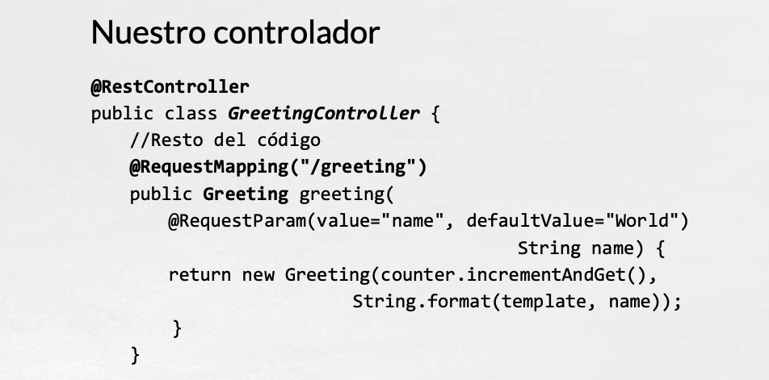

Bueno podemos verlo por aquí.

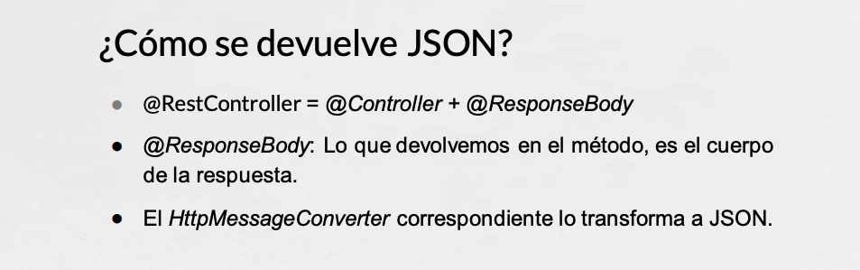

`@RestController` como hemos dicho es la combinación de `@Controller` + `@ResponseBody` y `@ResponseBody` lo que hace es que lo que se devuelve en el método como cuerpo de la respuesta, si recordáis el formato de los mensajes de respuesta como un cajón que tenía las cabeceras y el cuerpo, pues dentro del cuerpo lo que se hace es poner lo que nosotros devolvamos, lo que pasa, es que pasa antes por el filtro de un `HTTPMessageConverter` que lo que hace es transformarlo de un objeto Java a un objeto de tipo JSON, a una cadena de tipo JSON.

### Probando la Aplicación

Vamos a probar a ponerlo en ejecución la aplicación.

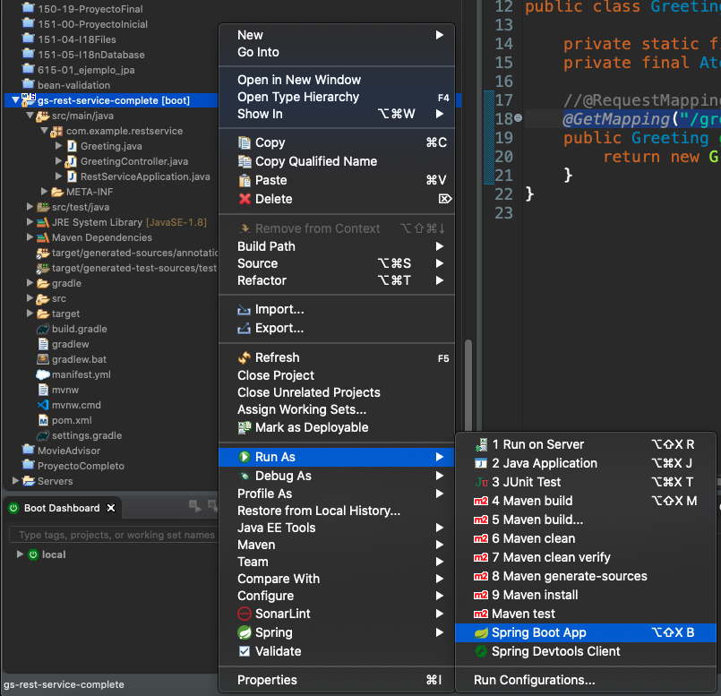

Vemos como nuestra aplicación se ha lanzado.

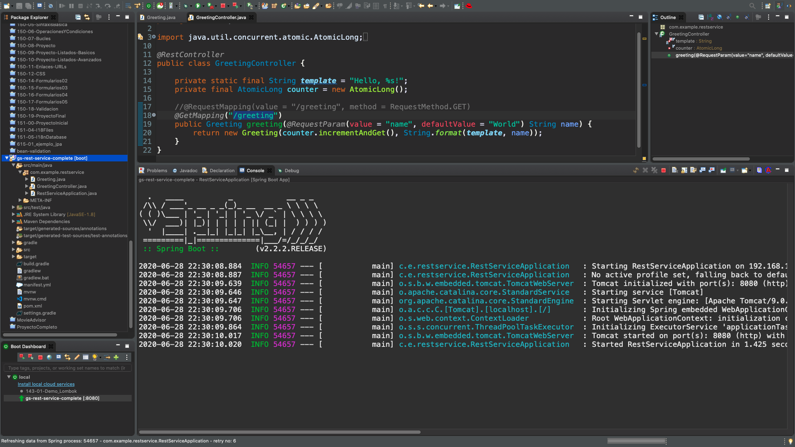

Ya estaría disponible en el puerto 8080 y en primera instancia podríamos comprobarlo desde el propio navegador con el URL `http://localhost:8080/greeting` y aquí tendríamos nuestro `Hello, World!`.

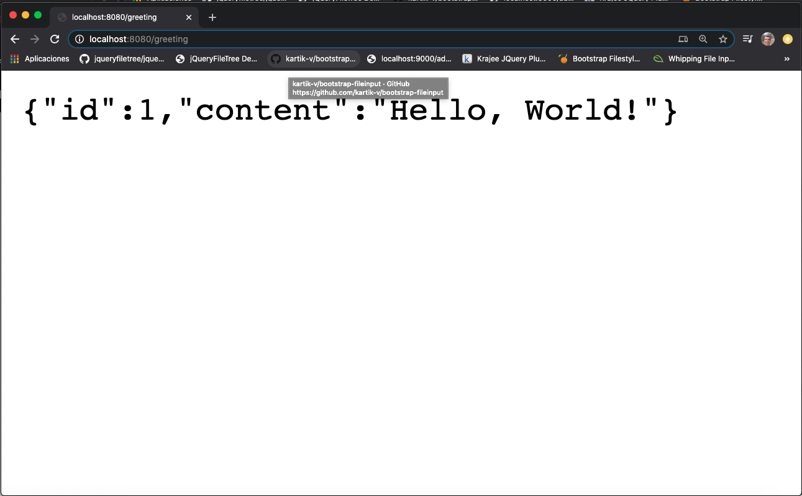

Cómo podemos ver la creación de un servicio es bastante sencillo, solo necesitaríamos tener una clase controladora anotada con `@RestController` en la que tengamos algunos métodos anotado bien con `@RequestMapping` o `@GetMapping` y el método correspondiente cómo podría ser con `@GetMapping`, `@PostMapping`, `@PutMapping` o `@DeleteMapping` y en el cual pues podamos atender peticiones que recibirán o no alguna serie de argumentos y en la que podamos devolver valores que dentro de este método estamos devolviendo una clase Java que serán transformadas a través de un `HTTPMessageConverter`.

Aunque tengamos solamente el navegador y le damos a inspeccionar Network y recargamos podríamos ver que ha sucedido por aquí detrás y si pinchamos en greeting

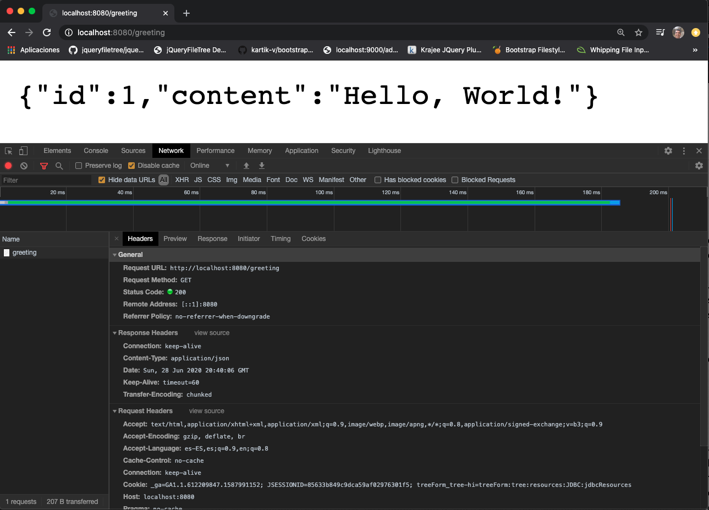

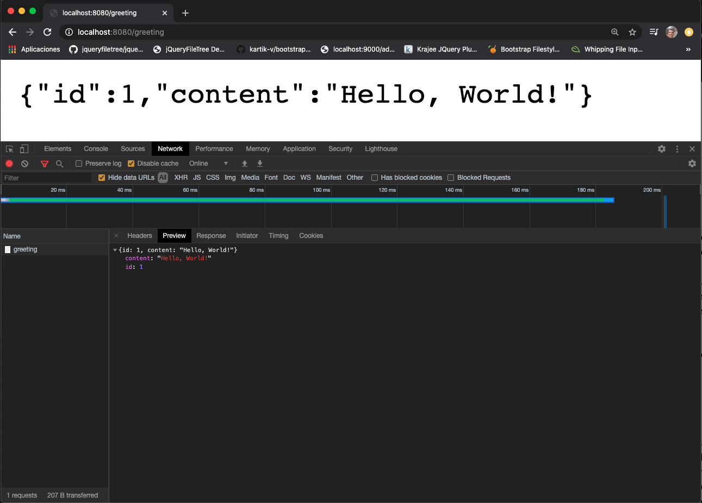

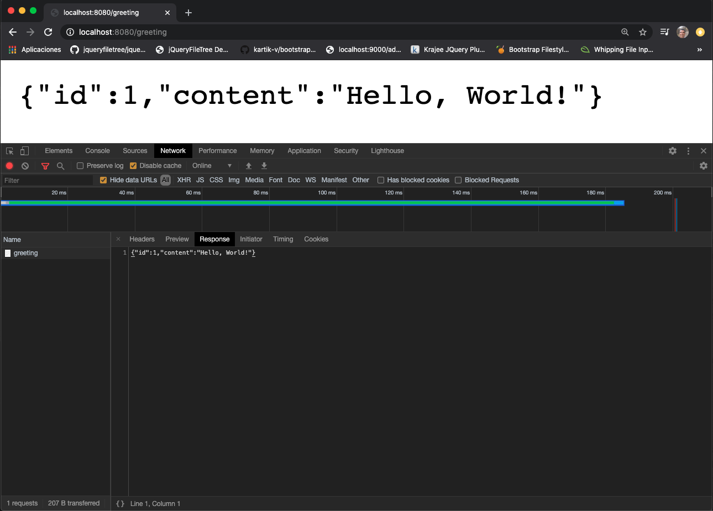

podemos ver como el navegador por detrás con esa petición GET ha enviado alguna serie de elementos y ha recibido la respuesta, tendríamos incluso los encabezados de la respuesta así como de la petición, como lo ha ido gestionando el propio navegador para que veamos que todo eso va sucediendo de verdad. todas las anotaciones que hemos visto antes se van utilizando tanto en peticiones como en respuestas, el tipo de contenido, la fecha, el código de estado 200 y lo ponen en verde como OK, lo que nosotros hemos enviado como parte de la petición para que veamos que esto ha sucedido conforme a nosotros lo hemos programado.

Podemos probar mandando un nombre con el URL `http://localhost:8080/greeting?name=Pedro` obtenemos.


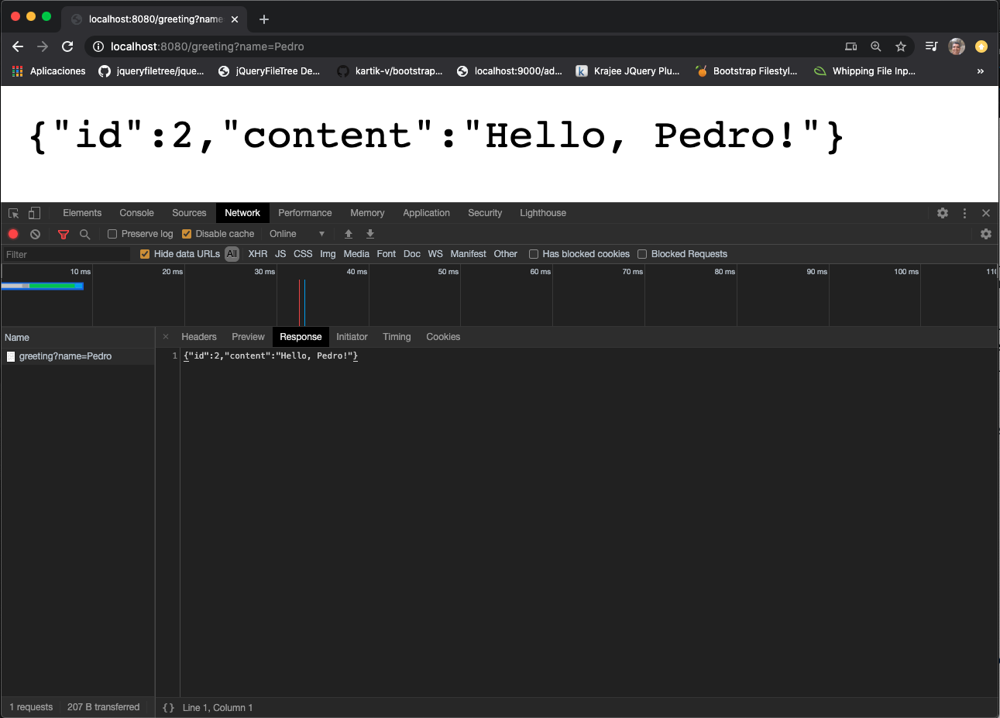

Hasta aquí nuestro primer servicio, vamos a ver ahora como con Postman como cliente en el lugar del propio navegador poder interactuar con nuestro API REST.

### :computer: Código Completo - gs-rest-service-complete -  143-02-API_REST


*`pom.xml`*

```html
<?xml version="1.0" encoding="UTF-8"?>
<project xmlns="http://maven.apache.org/POM/4.0.0" xmlns:xsi="http://www.w3.org/2001/XMLSchema-instance"
	xsi:schemaLocation="http://maven.apache.org/POM/4.0.0 https://maven.apache.org/xsd/maven-4.0.0.xsd">
	<modelVersion>4.0.0</modelVersion>
	<parent>
		<groupId>org.springframework.boot</groupId>
		<artifactId>spring-boot-starter-parent</artifactId>
		<version>2.2.2.RELEASE</version>
		<relativePath/> <!-- lookup parent from repository -->
	</parent>
	<groupId>com.example</groupId>
	<artifactId>rest-service</artifactId>
	<version>0.0.1-SNAPSHOT</version>
	<name>rest-service</name>
	<description>Demo project for Spring Boot</description>

	<properties>
		<java.version>1.8</java.version>
	</properties>

	<dependencies>
		<dependency>
			<groupId>org.springframework.boot</groupId>
			<artifactId>spring-boot-starter-web</artifactId>
		</dependency>

		<dependency>
			<groupId>org.springframework.boot</groupId>
			<artifactId>spring-boot-starter-test</artifactId>
			<scope>test</scope>
			<exclusions>
				<exclusion>
					<groupId>org.junit.vintage</groupId>
					<artifactId>junit-vintage-engine</artifactId>
				</exclusion>
			</exclusions>
		</dependency>
	</dependencies>

	<build>
		<plugins>
			<plugin>
				<groupId>org.springframework.boot</groupId>
				<artifactId>spring-boot-maven-plugin</artifactId>
			</plugin>
		</plugins>
	</build>

</project>
```

*`Greeting`*

```java
package com.example.restservice;

public class Greeting {

	private final long id;
	private final String content;

	public Greeting(long id, String content) {
		this.id = id;
		this.content = content;
	}

	public long getId() {
		return id;
	}

	public String getContent() {
		return content;
	}
}
```

*`GreetingController`*

```java
package com.example.restservice;

import java.util.concurrent.atomic.AtomicLong;

import org.springframework.web.bind.annotation.GetMapping;
import org.springframework.web.bind.annotation.RequestMapping;
import org.springframework.web.bind.annotation.RequestMethod;
import org.springframework.web.bind.annotation.RequestParam;
import org.springframework.web.bind.annotation.RestController;

@RestController
public class GreetingController {

	private static final String template = "Hello, %s!";
	private final AtomicLong counter = new AtomicLong();

	//@RequestMapping(value = "/greeting", method = RequestMethod.GET)
	@GetMapping("/greeting")
	public Greeting greeting(@RequestParam(value = "name", defaultValue = "World") String name) {
		return new Greeting(counter.incrementAndGet(), String.format(template, name));
	}
}
```

*`RestServiceApplication`*

```java
package com.example.restservice;

import org.springframework.boot.SpringApplication;
import org.springframework.boot.autoconfigure.SpringBootApplication;

@SpringBootApplication
public class RestServiceApplication {

    public static void main(String[] args) {
        SpringApplication.run(RestServiceApplication.class, args);
    }

}
```

# 09 Puesta en marcha de la aplicación 7:48 

[PDF Puesta_en_marcha_de_la_aplicación.pdf](pdfs/08_Puesta_en_marcha_de_la_aplicación.pdf)

## Resumen Profesor

### Ejecución de la aplicación

Para ejecutar la aplicación desde el terminal, debemos ejecutar desde el directorio raíz de la misma:

```sh
mvn clean
mvn install
mvn spring-boot:run
```

## Transcripción


Ya que hemos hecho nuestra primera API REST con Spring Boot es sencilla pero es completa, vamos a poner en marcha la aplicación a través de las diferentes posibilidades que tenemos, aunque antes ya lo hemos hecho vamos a repasar esta parte, vamos a ver que tenemos diferente alternativa y vamos a consumir nuestra API desde Postman para que lo podamos ver convenientemente.

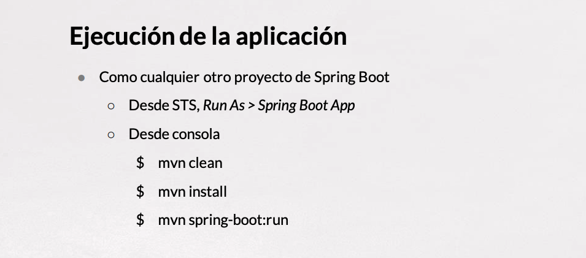
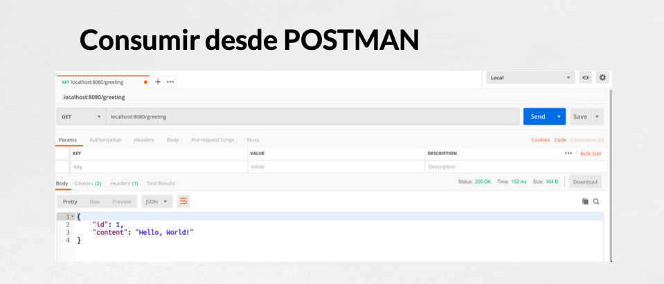
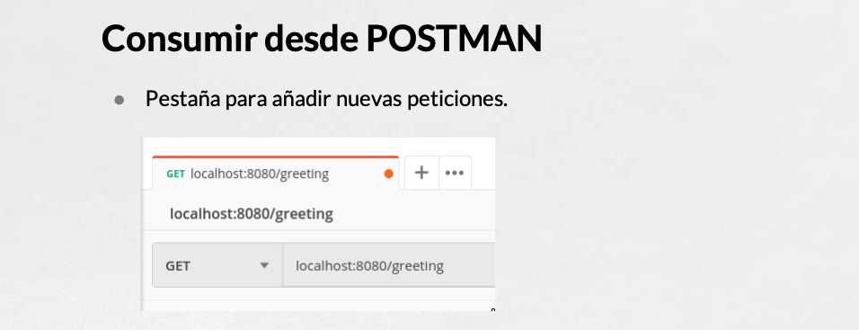
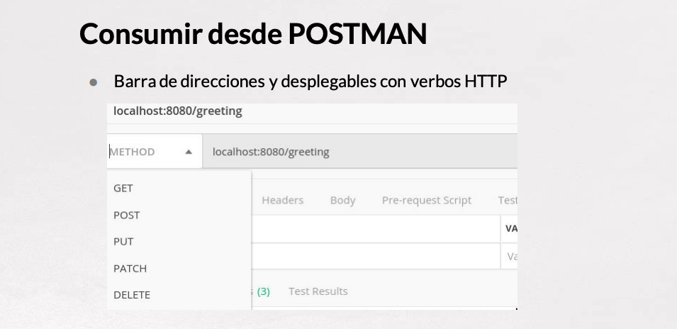
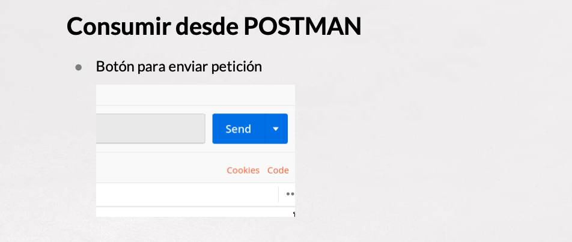
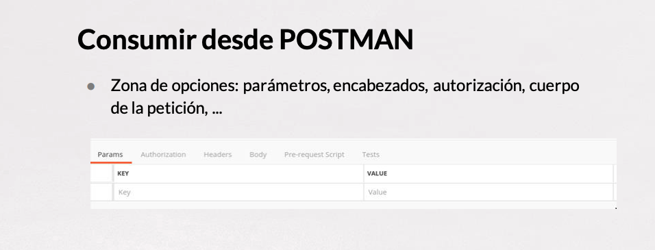
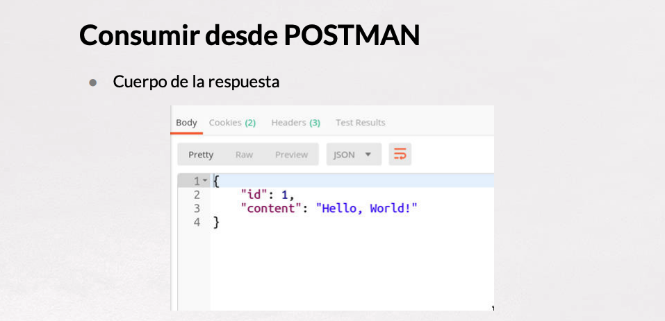
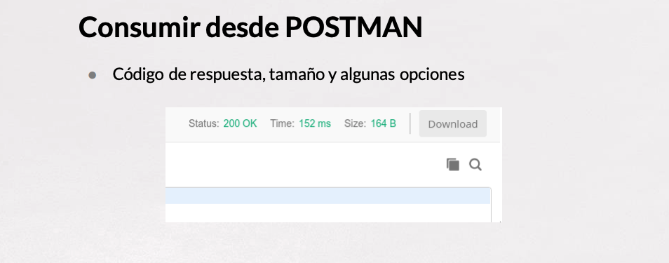

Para ejecutar nuestra aplicación tenemos dos mecanismos, hacerlo desde el propio IDE, ya hemos visto que se puede hacer sobre la aplicación, botón derecho, ejecutar como Spring Boot App y esto nos permitiría ejecutar aplicación perfectamente bien o también podemos hacerlo desde un terminal cualquiera y hacerla opciones:

```sh
$ mvn clean
$ mvn install
$ mvn spring-boot:run
```


Con `mvn clean` y `mvn install` para que todas las dependencias las tengamos claras y luego `mvn spring-boot:run` para poder ejecutarla, la podríamos ver por aquí, tendríamos que estar en el directorio raíz de la aplicación y tener instalado Maven 

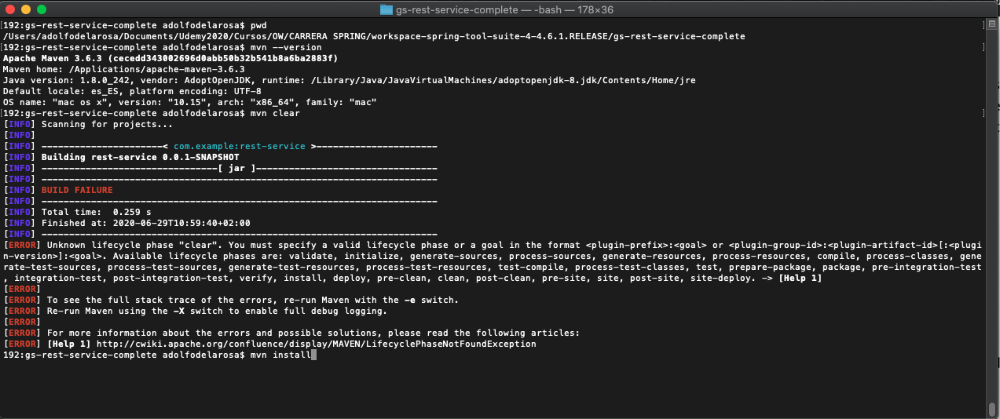

Con `mvn clean` hariamos alguna limpieza con cosas que no esten bien y con `mvn install` para realizar las descargas de las dependencias y todo lo que necesite. 

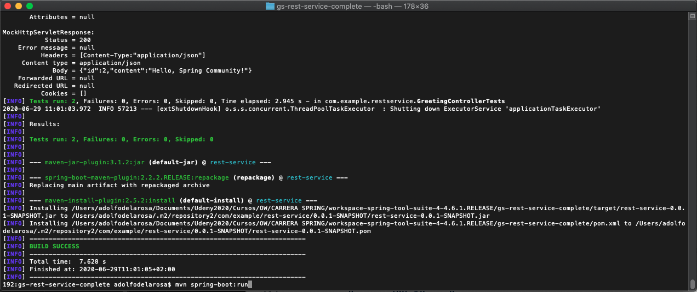

Y con `mvn spring-boot:run` que nos permite ejecutar la aplicación sin necesidad de estar dentro del IDE, con el IDE apagado podríamos hacer estar puesta en marcha de la propia aplicación.

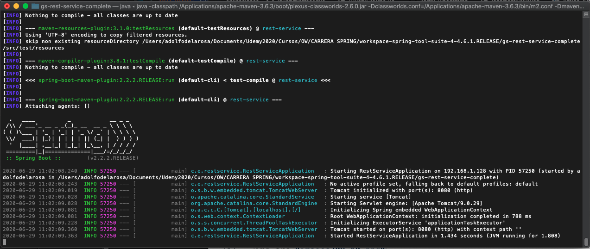

Ya tenemos arrancada nuestra aplicación cuando desemos detenerla bastaría hacer Ctrl+C sería más que suficiente.

La ventaja de usar el IDE es que tenemos varios botones que nos permiten hacer varias cosas como:

* Botón de parada 
* Botón de relanzamiento de la aplicación
* Botón Relauch que resulta súper cómodo cuando estamos trabajando y si no estamos utilizando DevTools que no puede relanzar la aplicación con cambios de código para parar la aplicación y volverla a lanzar.


Bueno ya que tenemos lanzada la aplicación desde la terminal con Maven vamos a tratar de consuimir nuestra API desde Postman.


si queremos controlarlo nosotros no podremos dar aquí que para la aplicación y la vuelve a lanzar no esté uno de los botones que más utilizaré a la hora de desarrollar no ya tenemos nuestra aplicación ejecutándose vamos a tratar de consumir con rapidez e post Postman que ya lo hemos instalado en alguno de en algunas de las lecciones anteriores es francamente cómodo nos permite en un sistema de pestañas poder poder consumir desde nuestra y no tendríamos que hacer algún tipo de petición poniendo el verbo la URL la ejecutamos y nos devolvería el resultado vale el cuerpo con el código de estado vale si nos damos cuenta tenemos aquí para poder crear nuevas peticiones no vamos a ir viendo desde Pomba yo ya lo ejecutado no tenemos por aquí para crear nuevas peticiones tenemos este nuevo botón de aquí que añadiría nuevas pestañas las pestañas las podemos almacenar incluso si queremos para guardarla y gestionarla en colecciones como yo tengo por aquí a la izquierda no podemos hacer la petición como decía Mante método vale tenemos un desplegable por aquí que nos permite en lugar de hacer peticiones que poder hacer peticiones post put delete Eva G opción copy link unlink etcétera etcétera vale un montón de peticiones tenemos la barra dónde podemos escribir la URL dónde podemos pasar diferentes parámetros que nos vamos a ver dónde poder enviar nuestra petición vale le digo que también la podemos hablar y a nivel de respuesta ya podemos ver que tenemos por aquí dónde consultar el código de estado podemos salvar la respuesta en un fichero vale donde la podemos ver en diferentes formatos vales en formato que no hubiera llegado no lo hubiera reconocido automáticamente no podemos aplicar vale hija como Jason si lo ponen la vista cities en la vista Raúl no nos lo muestra en crudo y bueno algunas vistas más no serían preview Invisalign que no usaremos durante el curso aquí y pulsaremos sobre todo la vista ricino como hemos visto el botón para enviar en la zona de opciones vamos a poder lanzar ahora vale estas son imágenes de lo que hemos ido viendo en la zona de opciones podemos mandar lanzar en el que por ejemplo hemos dicho que si pasamos el parámetro name por lo cual si no queremos tener que escribirlo directamente en la URL no podríamos escribir aquí nene y un determinado valor vale ahora nos vamos a saludar a nosotros mismos había que irme si cambiáramos el nombre otro nombre pues sería entonces a Cristina la que saludaría ya digo si queremos salvar está petición con el Estado que tiene ahora mismo lo que podríamos hacer este la podremos salvar en el raid o incluso en una colección que tuviéramos por aquí o incluso crear una colección de aquí no le podríamos dar un nombre a la petición en principio nos propone la propia URL le podríamos dar otro nombre otro nombre vale le podemos añadir aquí una descripción que incluso soporta Masgrau por documentar nuestra aplicación y podríamos crear una nueva colección Mané y aquí mismo poder salvar Nano y más adelante la cerramos la tenemos aquí para rescatarla vale o incluso si cerramos Postman y los volvemos a abrir tendríamos la opción de poder encontrarnos late nuevo y así si estamos desarrollando durante varios días varias semana una serie de peticiones sobre una misma API la podemos dejar guardada y documentada de hecho estas colecciones también si queréis se pueden exportar se pueden compartir para que se la podéis pasar a gente si fuese necesario llevar Honda incluso desde un equipo a otro hemos visto cómo trabajar con Postman y de verdad quería prender por Juan tenemos un curso estupendo dentro de nuestro de nuestro catálogo nosotros vamos a seguir en las siguientes lecciones creando una API que que incluya todos los métodos no solamente método que y que bueno pues nos dejes de una vez por todas teclear de verdad vale y darle caña al código para seguir aprendiendo a crear mensaje


# 10 Estructura de las rutas 15:31 

[PDF Estructura_de_las_rutas.pdf](pdfs/09_Estructura_de_las_rutas.pdf)

## Resumen Profesor

### Mapeo de verbos HTTP a operaciones CRUD

Verbo HTTP | Anotación Spring | Operación CRUD
-----------|------------------|---------------
GET | `@GetMapping` | Read
POST | `@PostMapping` | Create
PUT | `@PutMapping` | Update
DELETE | `@DeleteMapping` | Delete

### Lombok en controladores y servicios

Desde la versión 5 de Spring, podemos ahorranos el uso de la anotación `@Autowired` para realizar la inyección automática entre beans. De hecho, la inyección por constructor sería a día de hoy la más recomendable.

Si unimos esto último, con el uso de Lombok, podemos *ahorrarnos* escribir los constructores de nuestras clases servicio, controladores, etc… si en ellos solo vamos a hacer una asignación o inicialización de los atributos en los cuales queremos inyectar la dependencia. Podemos aprovechar la potencia de lombok, a través de su anotación `@RequiredArgsConstructor`, para que sea quién se encargue de generar dicho constructor, y después Spring lo utilice para realizar la inyección automática.

```java
@RestController
@RequiredArgsConstructor
public class ProductoController {

    private final ProductoRepositorio productoRepositorio;

    // Resto del código

}
```

## Transcripción


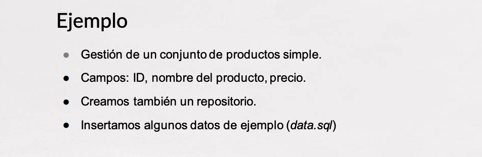
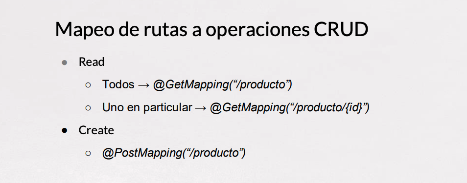
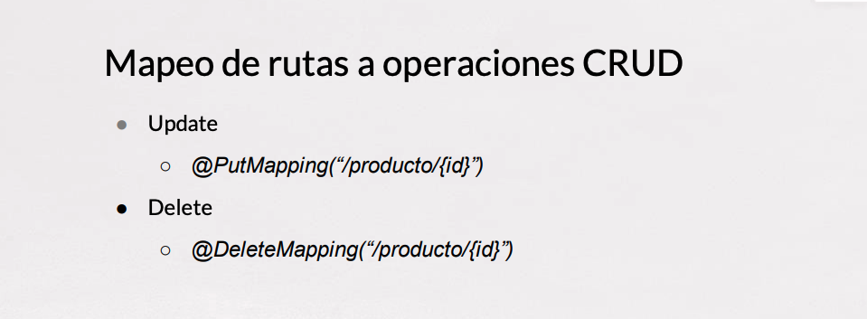
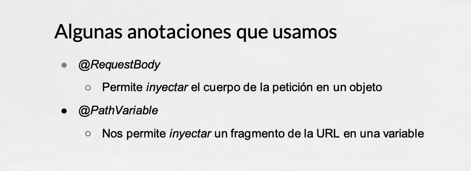
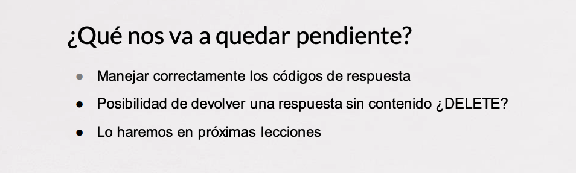

# 11 Clases y anotaciones de Spring 14:25 

[PDF Algunas_clases_y_anotaciones.pdf](pdfs/10_Algunas_clases_y_anotaciones.pdf)

## Resumen Profesor

### Clases `HttpEntity`, `RequestEntity` y `ResponseEntity`

* `HttpEntity: representa una petición o respuesta HTTP, consistente en una serie de encabezados y un cuerpo.
* `RequestEntity: extensión de HttpEntity que añade un método (verbo HTTP) y una URI
* `ResponseEntity: extensión de HttpEntity que añade un código de respuesta (HttpStatus).

### Códigos de respuesta según petición

Verbo HTTP | Código operación correcta | Código operación incorrecta
-----------|---------------------------|----------------------------
GET	| `200 OK` | 404 Not Found
POST| `201 Create` | 	 
PUT	| `200 OK` | 404 Not Found
DELETE | `204 No Content` | 	 

## Transcripción


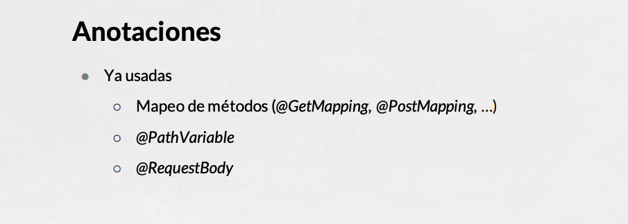
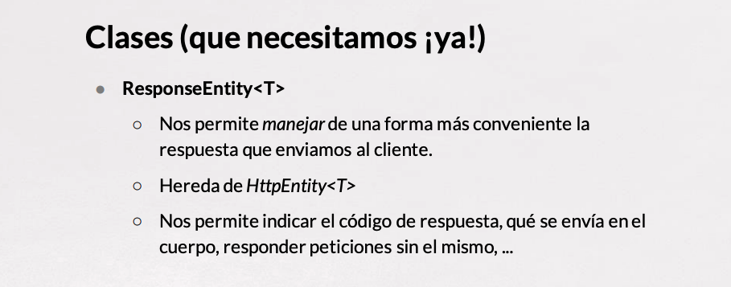
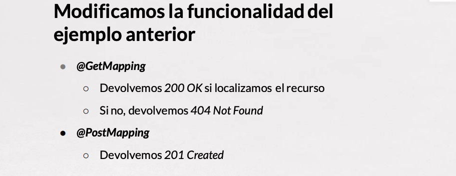
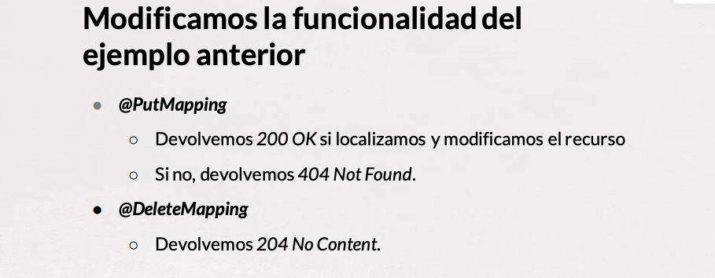

# 12 Uso del patrón Data Transfer Object (DTO) 11:25 

[PDF Uso_del_patrón_DTO.pdf](pdfs/11_Uso_del_patrón_DTO.pdf)

## Resumen Profesor

No existe.

## Transcripción


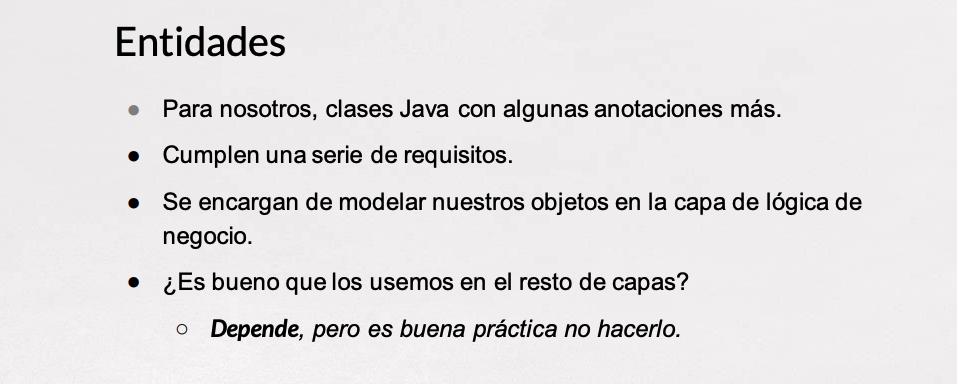
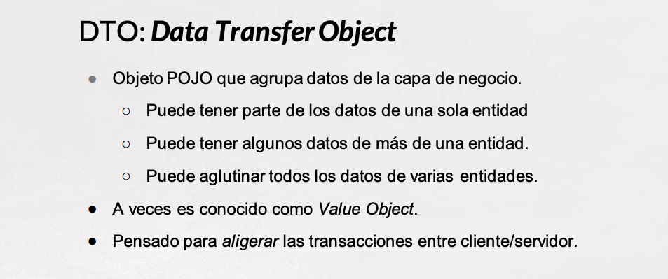
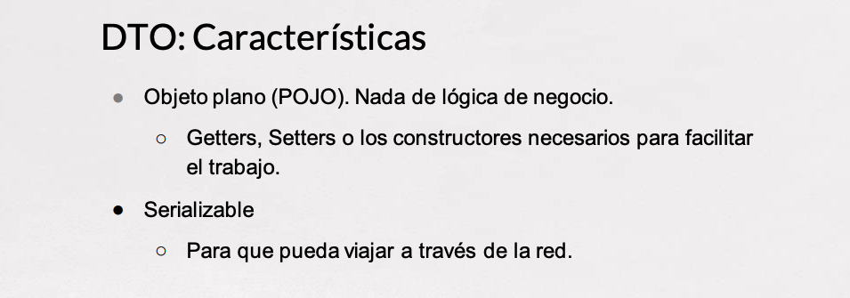
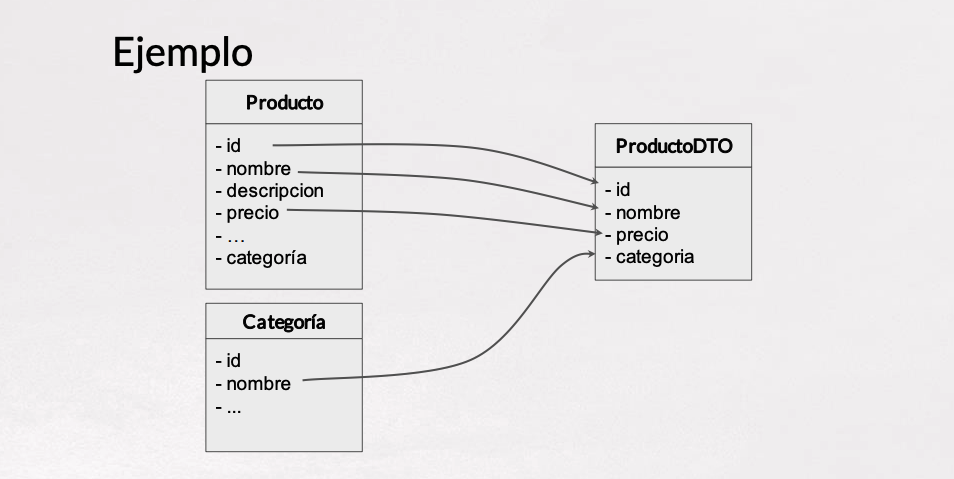
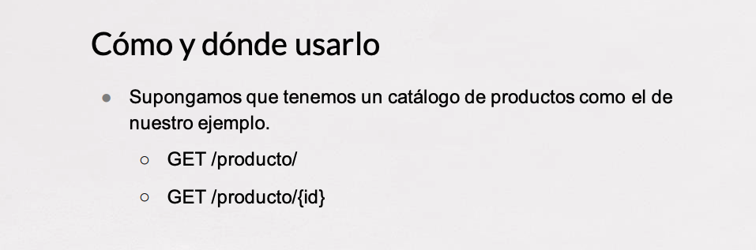
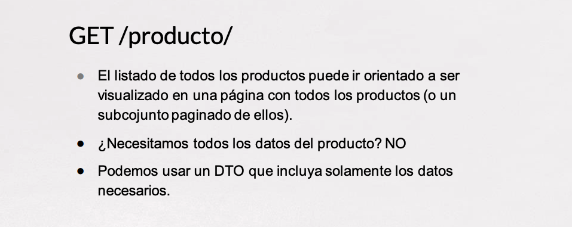
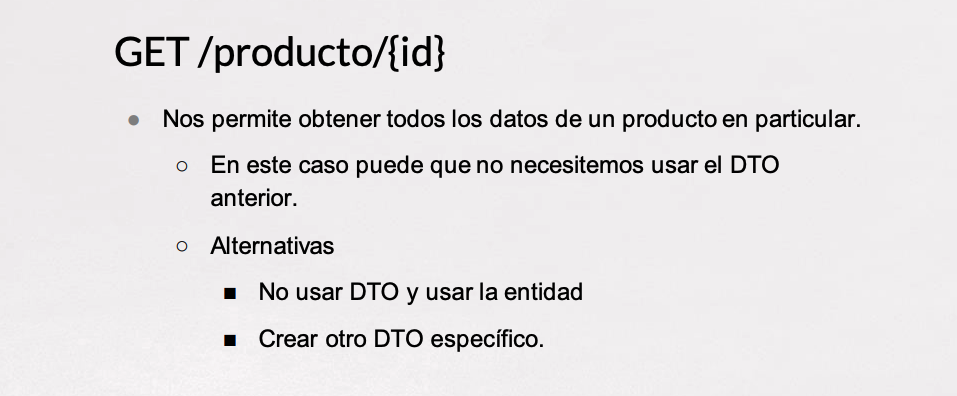
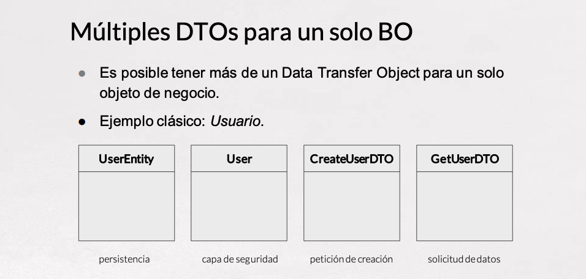
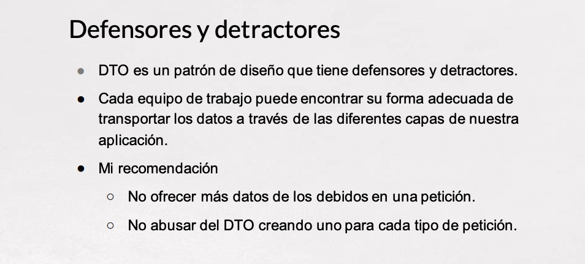
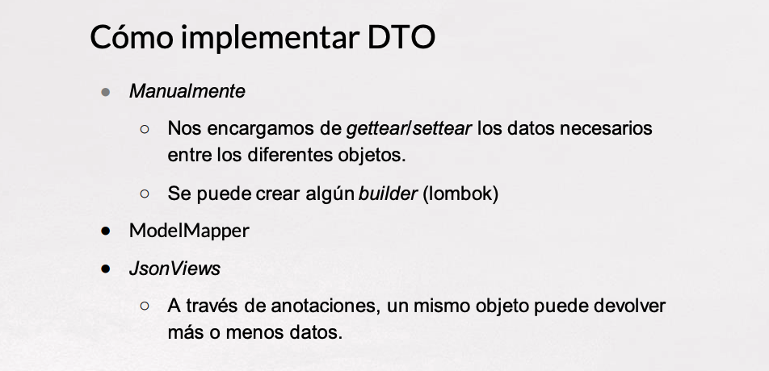

# 13 Implementando DTO con ModelMapper 17:58 

[PDF DTO_con_ModelMapper.pdf](pdfs/12_DTO_con_ModelMapper.pdf)

## Resumen Profesor

La dependencia a añadir en el `pom.xml` es:

```html
<dependency>
   <groupId>org.modelmapper</groupId>
   <artifactId>modelmapper</artifactId>
   <version>2.3.5</version>
</dependency>
```

Si queremos buscar la última dependencia disponible, podemos mirar en https://mvnrepository.com/artifact/org.modelmapper/modelmapper.

### Estrategia de asignación de propiedades

ModelMapper incluye tres tipos de estrategia a la hora de asignar valores entre clases:

* `Standard`: es la estrategia por defecto. Permite que las propiedades de origen coincidan de forma inteligente con las de destino.
* `Loose`: la estrategia flexible permite que las propiedades de origen coincidan libremente con las de destino.
* `Strict`: la estrategia estricta permite una precisión completa, asegurando que no se produzcan ambigüedades.

Para cambiar la estrategia, podemos usar el siguiente código:

```java
modelMapper.getConfiguration()
  .setMatchingStrategy(MatchingStrategies.LOOSE);
```

### Ajustando manualmente la transformación

En ocasiones, nos interesará ajustar manualmente la transformación entre dos objetos, bien porque no queramos cambiar la estrategia para todos los atributos, o porque se trate de una asignación muy particular. Para ello tenemos varios mecanismos, pero uno de ellos a través de la creación de un `PropertyMap<S,D>`.

Por ejemplo, si en nuestro ejemplo queremos que la clase DTO quede como sigue:

```java
@Getter
@Setter
public class ProductoDTO {

    private long id;
    private String nombre;
    private String categoria;

}
```

Podemos realizar *manualmente* la transformación de `categoria.nombre` en `Producto` a `categoria` en `ProductoDTO`. Para ello, podemos añadir este código en nuestro componente de conversión:

```java
@Component
@RequiredArgsConstructor
public class ProductoDTOConverter {

    private final ModelMapper modelMapper;


    @PostConstruct
    public void init() {
        modelMapper.addMappings(new PropertyMap<Producto, ProductoDTO>() {

            @Override
            protected void configure() {
                map().setCategoria(source.getCategoria().getNombre());
            }
        });
    }

    public ProductoDTO convertToDto(Producto producto) {
        return modelMapper.map(producto, ProductoDTO.class);

    }

}
```

## Transcripción

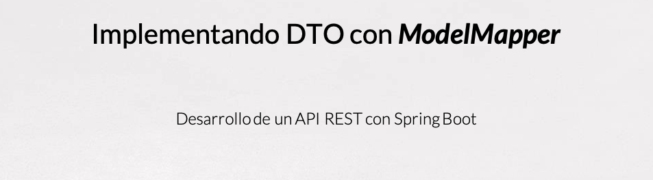
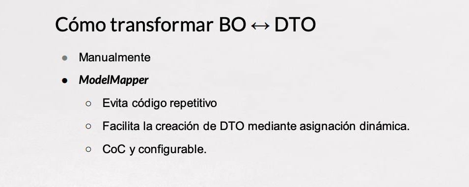

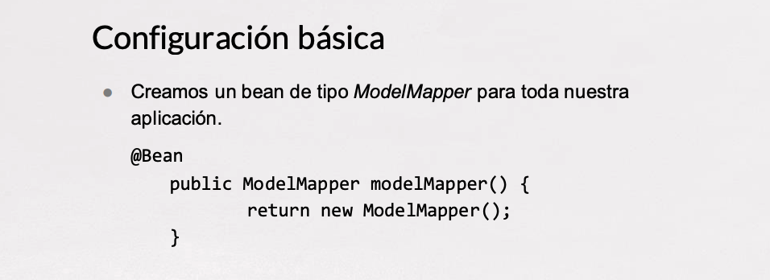
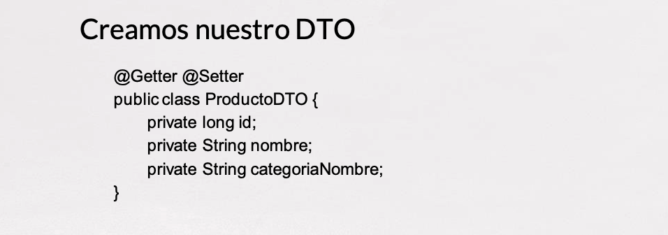
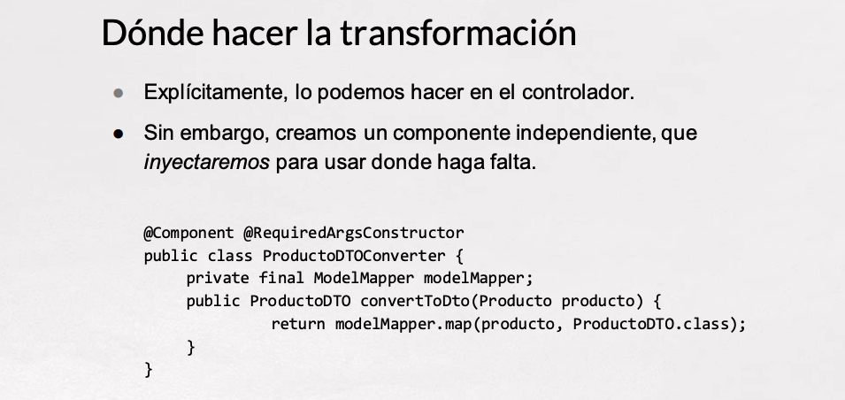
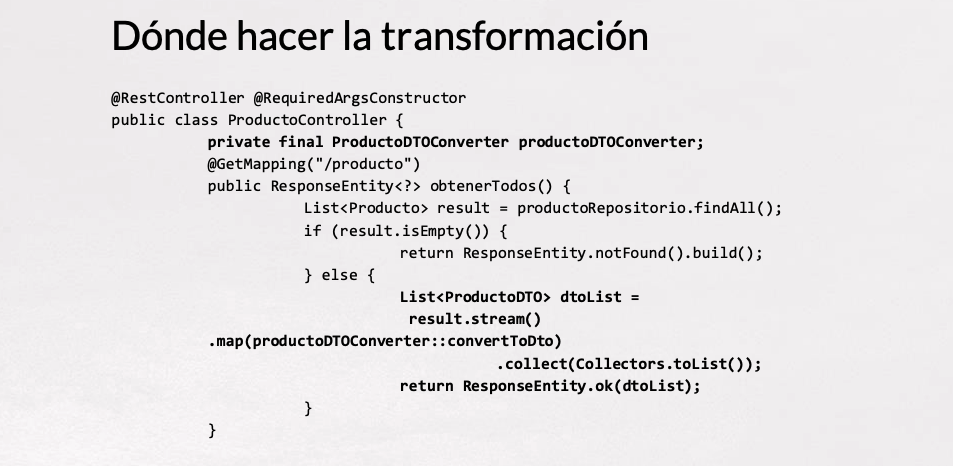
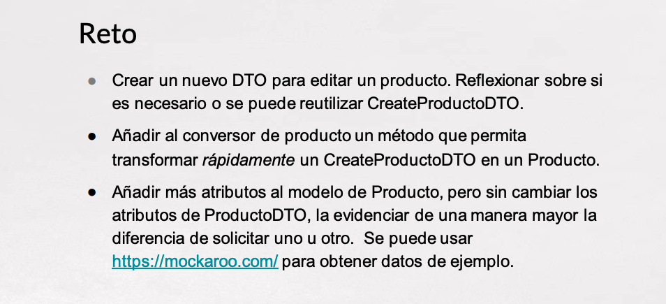

# Contenido adicional 6

* [PDF Mi_primer_servicio_REST.pdf](pdfs/07_Mi_primer_servicio_REST.pdf)
* [PDF Puesta_en_marcha_de_la_aplicación.pdf](pdfs/08_Puesta_en_marcha_de_la_aplicación.pdf)
* [PDF Estructura_de_las_rutas.pdf](pdfs/09_Estructura_de_las_rutas.pdf)
* [PDF Algunas_clases_y_anotaciones.pdf](pdfs/10_Algunas_clases_y_anotaciones.pdf)
* [PDF Uso_del_patrón_DTO.pdf](pdfs/11_Uso_del_patrón_DTO.pdf)
* [PDF DTO_con_ModelMapper.pdf](pdfs/12_DTO_con_ModelMapper.pdf)
