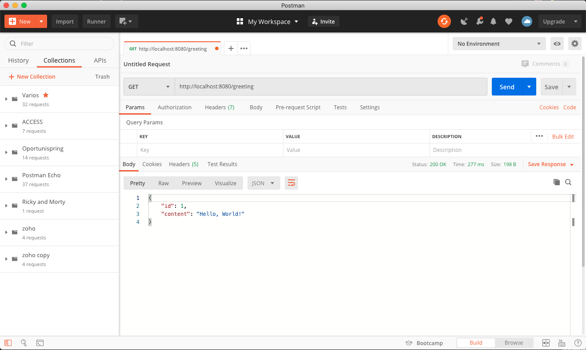
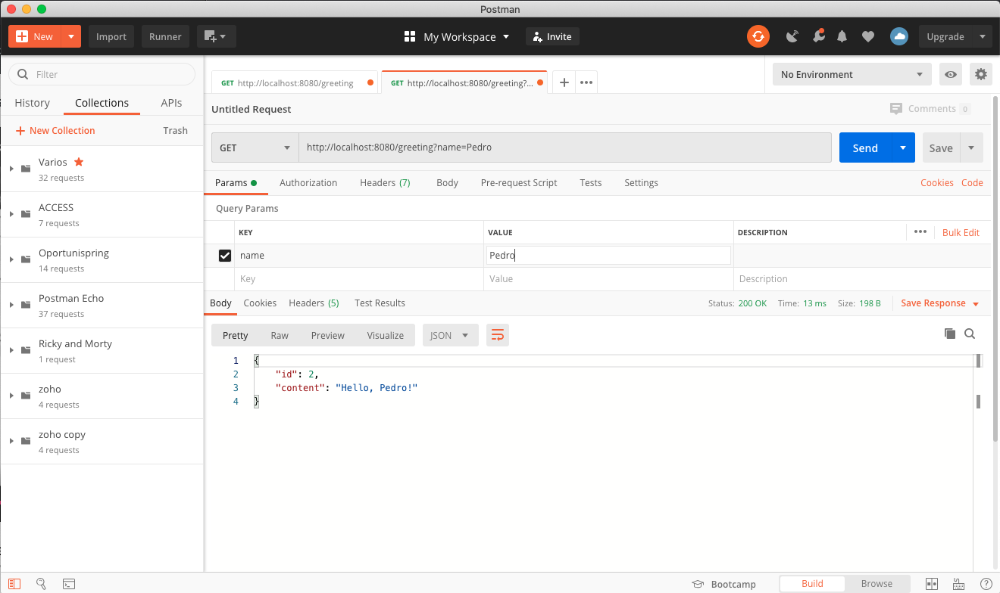
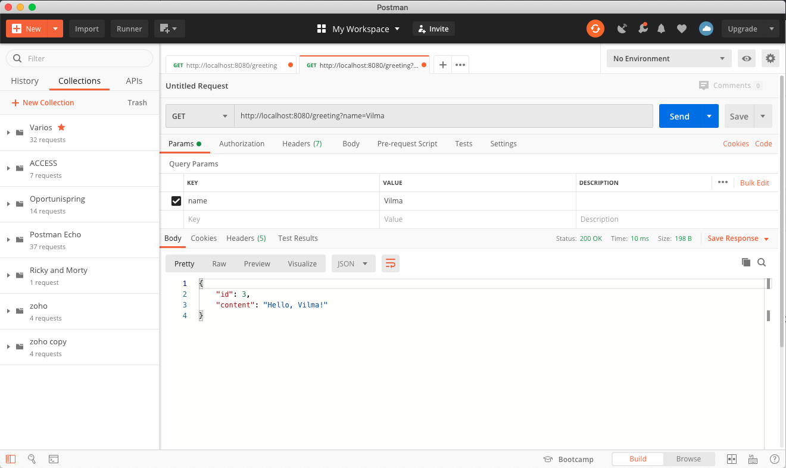
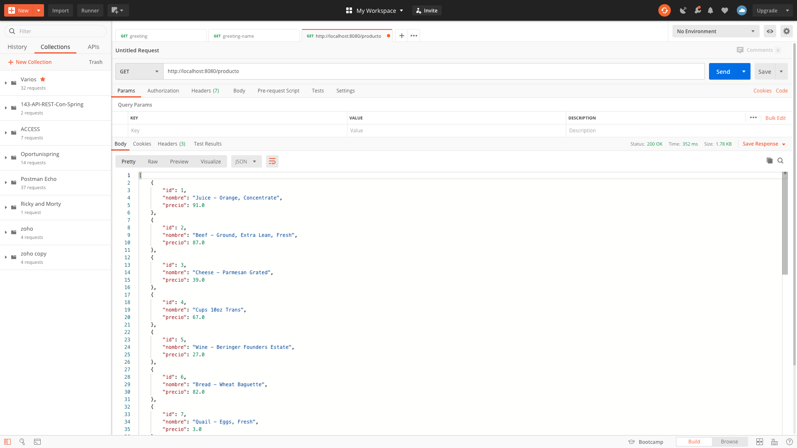
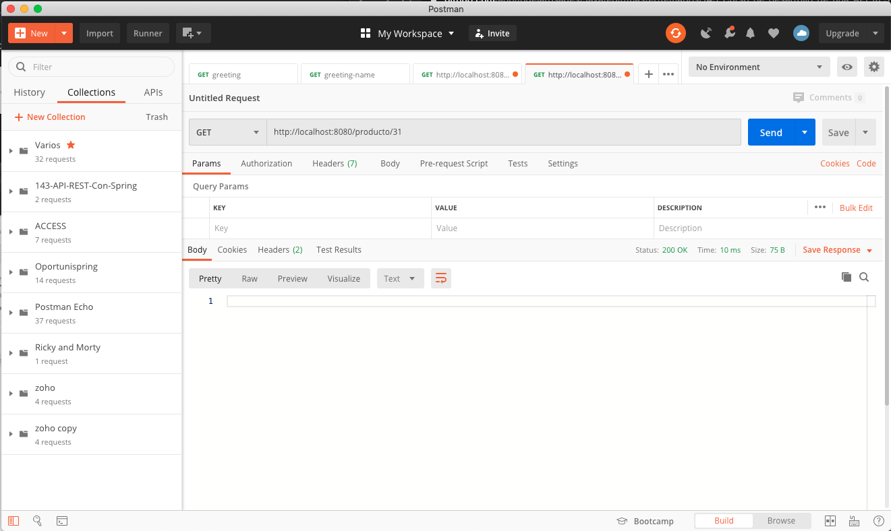
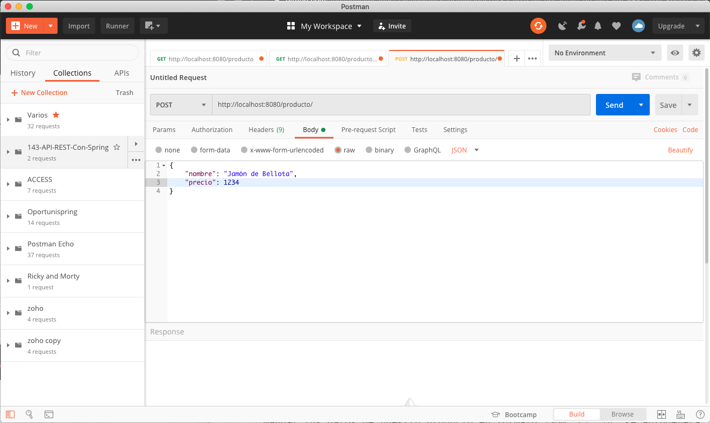
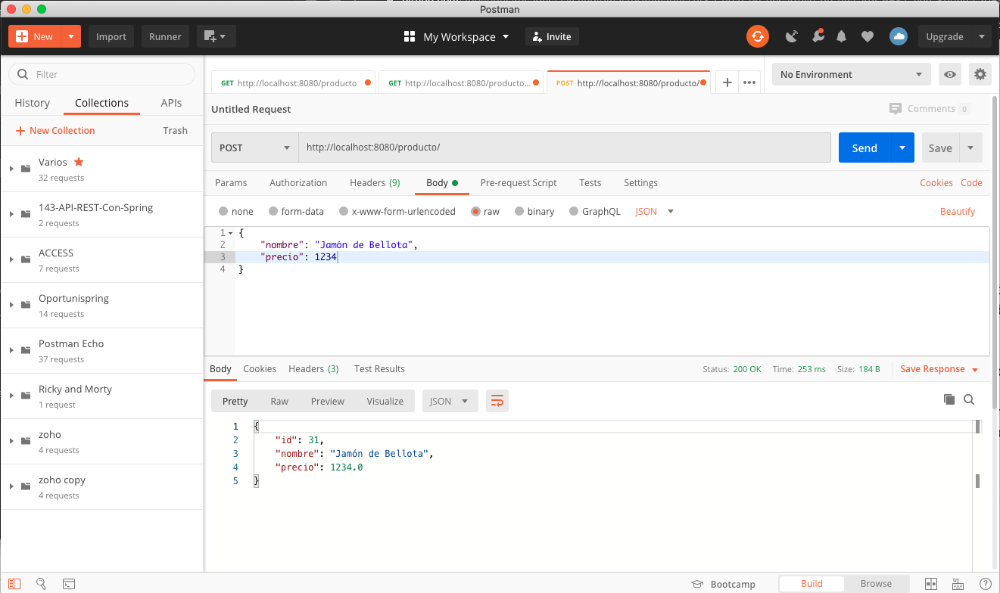

# 2. Primer servicio REST con Spring Boot 76m

* 08 Mi primer servicio REST 9:33 
* 09 Puesta en marcha de la aplicación 7:48 
* 10 Estructura de las rutas 15:31 
* 11 Clases y anotaciones de Spring 14:25 
* 12 Uso del patrón Data Transfer Object (DTO) 11:25 
* 13 Implementando DTO con ModelMapper 17:58 
* Contenido adicional 6


# 08 Mi primer servicio REST 9:33 

[PDF Mi_primer_servicio_REST.pdf](pdfs/07_Mi_primer_servicio_REST.pdf)

## Resumen Profesor

### Ejemplo

El ejemplo que se utiliza en esta lección está accesible desde la web de Spring en la siguiente url: https://spring.io/guides/gs/rest-service/.

También se puede descargar desde dentro del propio IDE, a través de *New > Import Spring Getting Started Content* y seleccionando **Rest Service**.

## Transcripción


Vamos a comenzar el segundo bloque y vamos a crear nuestro primera API REST, nuestro primer servicio API REST.


Para ello nos vamos a ir a la fuente, nos vamos a ir directamente a [Building a RESTful Web Service](https://spring.io/guides/gs/rest-service/) o directamente desde nuestro Spring Tool Suite. 

Vamos a ver un ejemplo muy básico que vamos a ir desgranando poco a poco de hecho vamos a traernos el código completo y lo vamos a ir analizando para aprender los distintos elementos que lo componen y en las siguientes lecciones, poder crearlo por nuestra cuenta.

Ya digo desde esta web URL https://spring.io/guides/gs/rest-service/ que podemos visitar tendríamos la posibilidad si queréis lo podemos buscar en las guias este primero cómo construir un servicio web sera el que vayamos trabajando.

Para traernos el código desde Spring Tool Suite lo podríamos hacer así nos venimos a File - New - Import Spring Getting Started Content 


y lo podríamos buscar aquí sería si buscamos `Rest Service`.


y nos traemos solamente el código completo 


le damos a Finish, nos importaría todo el proyecto `gs-rest-service-complete`, nos abre una ventana incluso con el tutorial.


No nos va a hacer falta y tendríamos el código fuente disponible por aquí.


Vamos ir desgranandolo poquito a poco. Primero nos vamos a situar, ¿Qué es lo que vamos a hacer? vamos a implementar una aplicación de servidor que va a aceptar peticiones GET en una determinada ruta `/greeting` y que nos va a devolver un JSON como el de la transparencia. Un mensaje de respuesta que vas a tener un `id` que va a ser de tipo numérico un long y un mensaje en una cadena de caracteres petición-respuesta como hemos ido viendo y en una determinada URL devolveremos un JSON. 


Si además le proporcionamos como parámetro opcional `name` este `/greeting` de manera que podríamos tener una URL como está `/greeting?name=User` cambiaremos en lugar de decir hola mundo haremos un hola usuario, de manera que lo podemos cambiar.


La interacción cómo podemos ver va a ser hacer peticiones GET a `/greeting` y como respuesta deberíamos obtener un código 200 OK y en el cuerpo de la respuesta deberíamos tener un JSON como el que hemos visto antes, si pasamos `/greeting?name=User` pues obtendríamos el hello con el name en partícular. El objeto además llevará un id que veremos cómo se va incrementándo si hacemos más de una petición. 


Para gestionar este modelo de datos vamos a tener una clase modelo `Greeting` que ya incluso la podemos ver por aquí:

*`Greeting`*

```java
package com.example.restservice;

public class Greeting {

   private final long id;
   private final String content;

   public Greeting(long id, String content) {
      this.id = id;
      this.content = content;
   }

   public long getId() {
      return id;
   }

   public String getContent() {
      return content;
   }
}
```

Y que incluye solamente dos datos que sería un `id` y `content` de tipo String y además tendríamos un controlador `GreetingController`:

*`GreetingController`*

```java
package com.example.restservice;

import java.util.concurrent.atomic.AtomicLong;

import org.springframework.web.bind.annotation.GetMapping;
import org.springframework.web.bind.annotation.RequestParam;
import org.springframework.web.bind.annotation.RestController;

@RestController
public class GreetingController {

   private static final String template = "Hello, %s!";
   private final AtomicLong counter = new AtomicLong();

   @GetMapping("/greeting")
   public Greeting greeting(@RequestParam(value = "name", defaultValue = "World") String name) {
      return new Greeting(counter.incrementAndGet(), String.format(template, name));
   }
}
```

Que para aquellos que tenga ya algunos conocimientos de Spring MVC llamara la atención que en lugar de ser con el `@Controller` esto ya lo comentamos también antes sera con `@RestController` esto es la combinación de `@Controller` y `@ResponseBody` tenemos también la versión con `@GetMapping` pero hay otra con `@RequestMapping` yo que tengo son SonarLint  me hace algunos análisis del código que voy poniendo y entonces no no invita que pongamos el código correcto por lo que `@RequestMapping` debería quedar así: `@RequestMapping(value = "/greeting", method = RequestMethod.GET)`, definitivamente la anotación `@GetMapping("/greeting")` es más comoda sea como fuere tendríamos que aceptar peticiones GET en una determinada URL que hara que se invoque este método. 

Además podemos ver como el método `greeting(@RequestParam(value = "name", defaultValue = "World") String name)` recibe un parámetro que será el parámetro `name` lo inyectamos con `@RequestParam` recogera de la parte `query` de la URL algo llamado `value = "name"` y lo inyectará en `name`, sino lo encuentra inyectara un valor por defecto `defaultValue = "World"` para poderlo utilizar en el método.  

Como deciamos como se devuelve JSON si el método lo que retorna es un objeto de tipo `Greeting`:

`return new Greeting(counter.incrementAndGet(), String.format(template, name));`


Bueno podemos verlo por aquí.


`@RestController` como hemos dicho es la combinación de `@Controller` + `@ResponseBody` y `@ResponseBody` lo que hace es que lo que se devuelve en el método como cuerpo de la respuesta, si recordáis el formato de los mensajes de respuesta como un cajón que tenía las cabeceras y el cuerpo, pues dentro del cuerpo lo que se hace es poner lo que nosotros devolvamos, lo que pasa, es que pasa antes por el filtro de un `HTTPMessageConverter` que lo que hace es transformarlo de un objeto Java a un objeto de tipo JSON, a una cadena de tipo JSON.

### Probando la Aplicación

Vamos a probar a ponerlo en ejecución la aplicación.


Vemos como nuestra aplicación se ha lanzado.


Ya estaría disponible en el puerto 8080 y en primera instancia podríamos comprobarlo desde el propio navegador con el URL `http://localhost:8080/greeting` y aquí tendríamos nuestro `Hello, World!`.


Cómo podemos ver la creación de un servicio es bastante sencillo, solo necesitaríamos tener una clase controladora anotada con `@RestController` en la que tengamos algunos métodos anotado bien con `@RequestMapping` o `@GetMapping` y el método correspondiente cómo podría ser con `@GetMapping`, `@PostMapping`, `@PutMapping` o `@DeleteMapping` y en el cual pues podamos atender peticiones que recibirán o no alguna serie de argumentos y en la que podamos devolver valores que dentro de este método estamos devolviendo una clase Java que serán transformadas a través de un `HTTPMessageConverter`.

Aunque tengamos solamente el navegador y le damos a inspeccionar Network y recargamos podríamos ver que ha sucedido por aquí detrás y si pinchamos en greeting


podemos ver como el navegador por detrás con esa petición GET ha enviado alguna serie de elementos y ha recibido la respuesta, tendríamos incluso los encabezados de la respuesta así como de la petición, como lo ha ido gestionando el propio navegador para que veamos que todo eso va sucediendo de verdad. todas las anotaciones que hemos visto antes se van utilizando tanto en peticiones como en respuestas, el tipo de contenido, la fecha, el código de estado 200 y lo ponen en verde como OK, lo que nosotros hemos enviado como parte de la petición para que veamos que esto ha sucedido conforme a nosotros lo hemos programado.

Podemos probar mandando un nombre con el URL `http://localhost:8080/greeting?name=Pedro` obtenemos.


Hasta aquí nuestro primer servicio, vamos a ver ahora como con Postman como cliente en el lugar del propio navegador poder interactuar con nuestro API REST.

### :computer: Código Completo - gs-rest-service-complete -  143-02-API_REST


*`pom.xml`*

```html
<?xml version="1.0" encoding="UTF-8"?>
<project xmlns="http://maven.apache.org/POM/4.0.0" xmlns:xsi="http://www.w3.org/2001/XMLSchema-instance"
	xsi:schemaLocation="http://maven.apache.org/POM/4.0.0 https://maven.apache.org/xsd/maven-4.0.0.xsd">
	<modelVersion>4.0.0</modelVersion>
	<parent>
		<groupId>org.springframework.boot</groupId>
		<artifactId>spring-boot-starter-parent</artifactId>
		<version>2.2.2.RELEASE</version>
		<relativePath/> <!-- lookup parent from repository -->
	</parent>
	<groupId>com.example</groupId>
	<artifactId>rest-service</artifactId>
	<version>0.0.1-SNAPSHOT</version>
	<name>rest-service</name>
	<description>Demo project for Spring Boot</description>

	<properties>
		<java.version>1.8</java.version>
	</properties>

	<dependencies>
		<dependency>
			<groupId>org.springframework.boot</groupId>
			<artifactId>spring-boot-starter-web</artifactId>
		</dependency>

		<dependency>
			<groupId>org.springframework.boot</groupId>
			<artifactId>spring-boot-starter-test</artifactId>
			<scope>test</scope>
			<exclusions>
				<exclusion>
					<groupId>org.junit.vintage</groupId>
					<artifactId>junit-vintage-engine</artifactId>
				</exclusion>
			</exclusions>
		</dependency>
	</dependencies>

	<build>
		<plugins>
			<plugin>
				<groupId>org.springframework.boot</groupId>
				<artifactId>spring-boot-maven-plugin</artifactId>
			</plugin>
		</plugins>
	</build>

</project>
```

*`Greeting`*

```java
package com.example.restservice;

public class Greeting {

	private final long id;
	private final String content;

	public Greeting(long id, String content) {
		this.id = id;
		this.content = content;
	}

	public long getId() {
		return id;
	}

	public String getContent() {
		return content;
	}
}
```

*`GreetingController`*

```java
package com.example.restservice;

import java.util.concurrent.atomic.AtomicLong;

import org.springframework.web.bind.annotation.GetMapping;
import org.springframework.web.bind.annotation.RequestMapping;
import org.springframework.web.bind.annotation.RequestMethod;
import org.springframework.web.bind.annotation.RequestParam;
import org.springframework.web.bind.annotation.RestController;

@RestController
public class GreetingController {

	private static final String template = "Hello, %s!";
	private final AtomicLong counter = new AtomicLong();

	//@RequestMapping(value = "/greeting", method = RequestMethod.GET)
	@GetMapping("/greeting")
	public Greeting greeting(@RequestParam(value = "name", defaultValue = "World") String name) {
		return new Greeting(counter.incrementAndGet(), String.format(template, name));
	}
}
```

*`RestServiceApplication`*

```java
package com.example.restservice;

import org.springframework.boot.SpringApplication;
import org.springframework.boot.autoconfigure.SpringBootApplication;

@SpringBootApplication
public class RestServiceApplication {

    public static void main(String[] args) {
        SpringApplication.run(RestServiceApplication.class, args);
    }

}
```

# 09 Puesta en marcha de la aplicación 7:48 

[PDF Puesta_en_marcha_de_la_aplicación.pdf](pdfs/08_Puesta_en_marcha_de_la_aplicación.pdf)

## Resumen Profesor

### Ejecución de la aplicación

Para ejecutar la aplicación desde el terminal, debemos ejecutar desde el directorio raíz de la misma:

```sh
mvn clean
mvn install
mvn spring-boot:run
```

## Transcripción


Ya que hemos hecho nuestra primera API REST con Spring Boot es sencilla pero es completa, vamos a poner en marcha la aplicación a través de las diferentes posibilidades que tenemos, aunque antes ya lo hemos hecho vamos a repasar esta parte, vamos a ver que tenemos diferente alternativa y vamos a consumir nuestra API desde Postman para que lo podamos ver convenientemente.

Para ejecutar nuestra aplicación tenemos dos mecanismos, hacerlo desde el propio IDE, ya hemos visto que se puede hacer sobre la aplicación, botón derecho, ejecutar como Spring Boot App y esto nos permitiría ejecutar aplicación perfectamente bien.

La ventaja de usar el IDE es que tenemos varios botones que nos permiten hacer varias cosas como:

* Botón de parada 
* Botón de relanzamiento de la aplicación
* Botón Relauch que resulta súper cómodo cuando estamos trabajando y si no estamos utilizando DevTools que no puede relanzar la aplicación con cambios de código para parar la aplicación y volverla a lanzar.


También podemos hacerlo desde una terminal y usando Maven para ejecutar la aplicación usando los siguientes comandos:

```sh
$ mvn clean
$ mvn install
$ mvn spring-boot:run
```

Tendríamos que estar en el directorio raíz de la aplicación y tener instalado Maven. 


Con `mvn clean` hariamos alguna limpieza con cosas que no esten bien y con `mvn install` para realizar las descargas de las dependencias y todo lo que necesite. 


Y con `mvn spring-boot:run` que nos permite ejecutar la aplicación sin necesidad de estar dentro del IDE, con el IDE apagado podríamos hacer estar puesta en marcha de la propia aplicación.


Ya tenemos arrancada nuestra aplicación cuando deseemos detenerla bastaría pulsar Ctrl+C, sería más que suficiente.

Bueno ya que tenemos lanzada la aplicación desde la terminal con Maven vamos a consuimir nuestra API desde Postman.

Postman es muy cómodo nos permite en un sistema de pestañas poder consumir desde nuestra API REST, tendríamos que hacer algún tipo de petición poniendo el verbo, la URL y la ejecutamos.


Y nos devolvería el resultado.



Tenemos el botón + para poder crear nuevas peticiones añadiendo nuevas pestaña.


Al ingresar el URL debemos presionar el botón Send para hacer la petición al Servidor.


Se nos muestra la respuesta.


La respuesta la podemos ver en diferentes formatos JSON, XML, HTML, Text y Auto  si el formato que no hubiera llegado no lo hubiera reconocido automáticamente podemos cambiarlo en el desplegable. Ademas tenemos una vista Pretty que pinta el JSON con formato, Raw lo muestra en crudo y algunas vistas más como Preview y Visualice pero la que se usa más es Pretty. 

Y a nivel de respuesta podemos ver el código de estado, tiempo que tarde en ejecutase, tamaño de respuesta, también podemos salvar la respuesta en un fichero.


Tenemos una secció dónde podemos pasar diferentes parámetros a nuestra petición.


Vamos abrir unanueva pestaña y lanzar la petición mandando el parámetro `name`.



Si no queremos tener que escribir el parámetro directamente en la URL lo podríamos escribir en la sección `Query Params` indicando una Key/Value, en este caso name/Pedro.

Vemos como la respuesta donde saludamos a Pedro.

Podemos saludar a otra persona cambiando el valor de `name`.



Las pestañas las podemos almacenar en la raíz o incluso si queremos gestionarlas en colecciones que se muestran a la izquierda. Al presionar Save sobre una pestaña se nos muestra la siguiente ventana:


Donde le podemos dar un nombre a la petición de primeras pone la URL de la petición, le podemos añadir una descripción que incluso soporta Markdown, e indicarle en que colección la debe almacenar.


Y ya del lado izquierdo tenemos nuestra colección `143-API-REST-Con-Spring` con nuestras dos peticiones.


Con esto ya podemos recuperarlas y ejecutarlas cuando volvamos a acceder a Postman sin necesidad de volver a crearlas y así si estamos desarrollando durante varios días, varias semana una serie de peticiones sobre una misma API la podemos dejar guardada y documentada de hecho estas colecciones también si queréis se pueden exportar se pueden compartir para que se la podéis pasar a gente si fuese necesario incluso llevarla desde un equipo a otro.


También podemos trabajar con diferentes métodos, tenemos un desplegable para seleccionarlos.


Para que en lugar de hacer peticiones GET poder hacer peticiones POST, PUT, PATCH, DELETE, etc. un montón de peticiones.

# 10 Estructura de las rutas 15:31 

[PDF Estructura_de_las_rutas.pdf](pdfs/09_Estructura_de_las_rutas.pdf)

## Resumen Profesor

### Mapeo de verbos HTTP a operaciones CRUD

Verbo HTTP | Anotación Spring | Operación CRUD
-----------|------------------|---------------
GET | `@GetMapping` | Read
POST | `@PostMapping` | Create
PUT | `@PutMapping` | Update
DELETE | `@DeleteMapping` | Delete

### Lombok en controladores y servicios

Desde la versión 5 de Spring, podemos ahorranos el uso de la anotación `@Autowired` para realizar la inyección automática entre beans. De hecho, la inyección por constructor sería a día de hoy la más recomendable.

Si unimos esto último, con el uso de Lombok, podemos *ahorrarnos* escribir los constructores de nuestras clases servicio, controladores, etc… si en ellos solo vamos a hacer una asignación o inicialización de los atributos en los cuales queremos inyectar la dependencia. Podemos aprovechar la potencia de lombok, a través de su anotación `@RequiredArgsConstructor`, para que sea quién se encargue de generar dicho constructor, y después Spring lo utilice para realizar la inyección automática.

```java
@RestController
@RequiredArgsConstructor
public class ProductoController {

    private final ProductoRepositorio productoRepositorio;

    // Resto del código

}
```

## Transcripción


Hola a todos vamos a seguir con nuestro curso en el que estamos aprendiendo a desarrollar una API con Sprint Boot, a partir de esta lección vamos a desarrollar una API casi desde cero, os dejo un pequeño código base para no pararnos en cosas que ya hemos aprendido antes, vamos a partir de una estructura de un controlador que vamos a explicar y lo vamos a ir completando poco a poco.


El ejemplo va a ser una especie de API de productos, vamos a gestionar una serie de productos simples, como campo van a tener un ID, el nombre del producto y el precio. Vamos a crear también un repositorio y vamos a insertar unos datos de ejemplo desde `data.sql`, ya digo esto este código de base ya lo vas a tener en el repositorio del curso para que no tengas que pararnos a crear la clase Modelo, el repositorio, para que no tengáis que hacer la creación de datos de ejemplo, cosas que si habéis visitado los otros cursos como por ejemplo el de Spring Boot y Spring Web se explica con mayor detenimiento, es cuestión de que nos parecemos en la capa de acceso a datos en esta parte, sino que nos vamos a centrar sobre todo en el controlador y en la parte más REST.


Vamos a ver cómo mapear las rutas de nuestro controlador con las diferentes operaciones CRUD, en el fondo vamos hacer un CRUD de productos y entonces necesitamos para cada una de las operaciones CRUD hacer una determinada ruta en el controlador, esta estructura veréis que va a ser muy común si lo que necesitáis es generar CRUD y de hecho si trabajáis alguna vez con Spring Data REST veréis que no dista de la que genera automáticamente,

Dentro de CRUD la operación `Read` la de obtener datos la haremos a través de peticiones de tipo `GET` es decirme métodos del controlador que irán anotados con `@GetMapping` y como nosotros vamos a trabajar con productos la ruta de obtener todos los productos será una petición `@GetMapping("/producto")` lo vamos a poner en singular, tampoco sería demasiado dramático si lo pusieramos en plural, si queremos obtener un producto en particular lo haremos con su `id` y entonces será la ruta `@GetMapping("/producto/{id}")` el producto 1, el 2 el producto 114, ambas peticiones de tipo `GET`.

Para crear un producto lo que haremos será una petición de tipo POST anotada con `@PostMapping` a la propia ruta `/producto` es decir `@PostMapping("/producto")`.


Para actualizar la petición de tipo UPDATE será con `Put` con una anotación `@PutMapping` y está usualmente aunque el `id` vaya dentro del objeto que le estamos pasando es muy habitual que se lo proporcionemos dentro de la ruta y entonces así lo vamos a hacer con `@PutMapping("/producto/{id}")` 

La estructura sería la misma para la petición de borrado sería con un deleite mapping y también sería con la anotación `@DeleteMapping` completa tendríamos `@DeleteMapping("/producto/{id}")`.


Algunas notaciones que vamos a usar para que no nos suenen raro y que las reconozcamos sería la anotación `@RequestBody` que nos va a permitir inyectar el cuerpo de la petición en un objeto, es decir nos enviara una petición, aquello trae datos y hemos visto que cuando nosotros en una petición GET devolvemos algo en el cuerpo el `HTTPMessageConverter` transforma nuestro objeto Java en un JSON, pero ahora lo necesitamos a la hora de recibirlo, vamos a recibir una petición en la cual se va a enviar un JSON y vamos a necesitar sacar ese JSON como un objeto Java para poder interactuar con nuestro repositorio y almacenarlo en  la base de datos.

Hasta aquí ya nos podemos venir a nuestro código vamos al proyecto base lo vamos a copiar y pegar del repositorio y le vamos a asignar el nombre `143-03-09_EstructuraRutas`.


Tenemos nuestro archivo `pom.xml`.

*`pom.xml`*

```html
<?xml version="1.0" encoding="UTF-8"?>
<project xmlns="http://maven.apache.org/POM/4.0.0" xmlns:xsi="http://www.w3.org/2001/XMLSchema-instance"
	xsi:schemaLocation="http://maven.apache.org/POM/4.0.0 https://maven.apache.org/xsd/maven-4.0.0.xsd">
	<modelVersion>4.0.0</modelVersion>
	<parent>
		<groupId>org.springframework.boot</groupId>
		<artifactId>spring-boot-starter-parent</artifactId>
		<version>2.1.8.RELEASE</version>
		<relativePath/> <!-- lookup parent from repository -->
	</parent>
	<groupId>com.openwebinars.rest</groupId>
	<artifactId>143-03-09_EstructuraRutas</artifactId>
	<version>0.0.1-SNAPSHOT</version>
	<name>143-03-09_EstructuraRutas</name>
	<description>Ejemplo de métodos crud en un API REST</description>

	<properties>
		<java.version>1.8</java.version>
	</properties>

	<dependencies>
		<dependency>
			<groupId>org.springframework.boot</groupId>
			<artifactId>spring-boot-starter-data-jpa</artifactId>
		</dependency>
		<dependency>
			<groupId>org.springframework.boot</groupId>
			<artifactId>spring-boot-starter-web</artifactId>
		</dependency>

		<dependency>
			<groupId>com.h2database</groupId>
			<artifactId>h2</artifactId>
			<scope>runtime</scope>
		</dependency>
		<dependency>
			<groupId>org.projectlombok</groupId>
			<artifactId>lombok</artifactId>
			<optional>true</optional>
		</dependency>
		<dependency>
			<groupId>org.springframework.boot</groupId>
			<artifactId>spring-boot-starter-test</artifactId>
			<scope>test</scope>
		</dependency>
	</dependencies>

	<build>
		<plugins>
			<plugin>
				<groupId>org.springframework.boot</groupId>
				<artifactId>spring-boot-maven-plugin</artifactId>
			</plugin>
		</plugins>
	</build>

</project>
```

Tenemos una clase Modelo `Producto`.

*`Producto`*

```java
package com.openwebinars.rest.modelo;

import javax.persistence.Entity;
import javax.persistence.GeneratedValue;
import javax.persistence.Id;

import lombok.AllArgsConstructor;
import lombok.Data;
import lombok.NoArgsConstructor;

@Data @NoArgsConstructor @AllArgsConstructor
@Entity
public class Producto {

   @Id @GeneratedValue
   private Long id;
	
   private String nombre;
	
   private float precio;
	
}
```

En esta clase `Producto` usamos Lombok lo cual la hace muy sencilla con una `id` y ya sabéis que Spring Data JPA nos permite tener estas anotación `@Id @GeneratedValue` y que tiene que tener `@Entity` para que sea una auténtica entidad, las demás anotaciones `@Data @NoArgsConstructor @AllArgsConstructor` son de Lombok. Vemos cómo tiene los atributos `id`, `nombre` y `precio`.

*`ProductoRepositorio`*

```java
package com.openwebinars.rest.modelo;

import org.springframework.data.jpa.repository.JpaRepository;

public interface ProductoRepositorio extends JpaRepository<Producto, Long> {

}
```

El repositorio es sencillo no vamos a necesitar ninguna consulta rara para hacerlo, entiende a los repositorios de `JpaRepository`.

*`ProductoRepositorio`*

```java
package com.openwebinars.rest.controller;

import java.util.List;

import org.springframework.web.bind.annotation.DeleteMapping;
import org.springframework.web.bind.annotation.GetMapping;
import org.springframework.web.bind.annotation.PathVariable;
import org.springframework.web.bind.annotation.PostMapping;
import org.springframework.web.bind.annotation.PutMapping;
import org.springframework.web.bind.annotation.RequestBody;
import org.springframework.web.bind.annotation.RestController;

import com.openwebinars.rest.modelo.Producto;
import com.openwebinars.rest.modelo.ProductoRepositorio;

import lombok.RequiredArgsConstructor;

@RestController
@RequiredArgsConstructor
public class ProductoController {

   private final ProductoRepositorio productoRepositorio;

   /**
    * Obtenemos todos los productos
    * 
    * @return
    */
   @GetMapping("/producto")
   public List<Producto> obtenerTodos() {
      // Vamos a modificar este código
      return null;
   }

   /**
    * Obtenemos un producto en base a su ID
    * 
    * @param id
    * @return Null si no encuentra el producto
    */
   @GetMapping("/producto/{id}")
   public Producto obtenerUno(@PathVariable Long id) {
      // Vamos a modificar este código
      return null;
   }

   /**
    * Insertamos un nuevo producto
    * 
    * @param nuevo
    * @return producto insertado
    */
   @PostMapping("/producto")
   public Producto nuevoProducto(@RequestBody Producto nuevo) {
      // Vamos a modificar este código
      return null;
   }

   /**
    * 
    * @param editar
    * @param id
    * @return
    */
   @PutMapping("/producto/{id}")
   public Producto editarProducto(@RequestBody Producto editar, @PathVariable Long id) {
      // Vamos a modificar este código
      return null;
   }

   /**
    * Borra un producto del catálogo en base a su id
    * @param id
    * @return
    */
   @DeleteMapping("/producto/{id}")
   public Producto borrarProducto(@PathVariable Long id) {
      // Vamos a modificar este código
      return null;
   }
}
```

Tendríamos el controlador del cual yo les doy el esqueleto que vamos a ver ahora y a partir de aquí vamos a ir programando.

Tendríamos el método `obtenerTodos()` anotado con `@GetMapping("/producto")`  para obtener todos los productos.

```java
   /**
    * Obtenemos todos los productos
    * 
    * @return
    */
   @GetMapping("/producto")
   public List<Producto> obtenerTodos() {
      // Vamos a modificar este código
      return null;
   }
```

que devolverá un listado de productos.

El método `obtenerUno(@PathVariable Long id)` anotado con `@GetMapping("/producto/{id}")` que devolvera un producto. 


```java
/**
    * Obtenemos un producto en base a su ID
    * 
    * @param id
    * @return Null si no encuentra el producto
    */
   @GetMapping("/producto/{id}")
   public Producto obtenerUno(@PathVariable Long id) {
      // Vamos a modificar este código
      return null;
   }
```

El método `nuevoProducto(@RequestBody Producto nuevo)` anotado con `@PostMapping("/producto")` para insertar un nuevo producto que lo recoge con `@RequestBody Producto nuevo`

```java
 /**
    * Insertamos un nuevo producto
    * 
    * @param nuevo
    * @return producto insertado
    */
   @PostMapping("/producto")
   public Producto nuevoProducto(@RequestBody Producto nuevo) {
      // Vamos a modificar este código
      return null;
   }
```

El método `editarProducto(@RequestBody Producto editar, @PathVariable Long id)` para editar un producto anotado con `@PutMapping("/producto/{id}")`.

```java
   /**
    * 
    * @param editar
    * @param id
    * @return
    */
   @PutMapping("/producto/{id}")
   public Producto editarProducto(@RequestBody Producto editar, @PathVariable Long id) {
      // Vamos a modificar este código
      return null;
   }
```

que también lo recoge con `@RequestBody Producto editar` y con `@PathVariable Long id` lo que vamos a hacer es inyectar el `{id}` del `@PutMapping` dentro del valor `id` del `@PathVariable`.


El método `borrarProducto(@PathVariable Long id)` para eliminar un producto anotado con `@DeleteMapping("/producto/{id}")`.

```java
   /**
    * Borra un producto del catálogo en base a su id
    * @param id
    * @return
    */
   @DeleteMapping("/producto/{id}")
   public Producto borrarProducto(@PathVariable Long id) {
      // Vamos a modificar este código
      return null;
   }

```

También usa `@PathVariable` para inyectar el valor de la ruta y tomarlo como parámetro.

Bueno pues por lo pronto lo que necesitamos aquí es obtener el repositorio que lo tenemos declarado con la línea `private final ProductoRepositorio productoRepositorio;` aque ahora iremos utilizando.

Fijarnos que no hemos utilizado la anotación `@Autowire` ni nada, Lombok nos permite también anotar con la anotación `@RequiredArgsConstructor` un controlador y como este repositorio no se va a haber modificado, lo podemos declarar como final y directamente cuando se instancie el Bean se autoinyectaran las dependencias y lo hacemos de una manera limpia y utilizándo Lombok.


```java
@RestController
@RequiredArgsConstructor
public class ProductoController {

   private final ProductoRepositorio productoRepositorio;
   
   ....
   
```

También contamos dentro de los recursos contamos con el archivo `data.sql` con el siguiente contenido.

```sql
insert into producto (id, nombre, precio) values (NEXTVAL('hibernate_sequence'), 'Juice - Orange, Concentrate', 91);
insert into producto (id, nombre, precio) values (NEXTVAL('hibernate_sequence'), 'Beef - Ground, Extra Lean, Fresh', 87);
insert into producto (id, nombre, precio) values (NEXTVAL('hibernate_sequence'), 'Cheese - Parmesan Grated', 39);
insert into producto (id, nombre, precio) values (NEXTVAL('hibernate_sequence'), 'Cups 10oz Trans', 67);
insert into producto (id, nombre, precio) values (NEXTVAL('hibernate_sequence'), 'Wine - Beringer Founders Estate', 27);
insert into producto (id, nombre, precio) values (NEXTVAL('hibernate_sequence'), 'Bread - Wheat Baguette', 82);
insert into producto (id, nombre, precio) values (NEXTVAL('hibernate_sequence'), 'Quail - Eggs, Fresh', 3);
insert into producto (id, nombre, precio) values (NEXTVAL('hibernate_sequence'), 'Cheese - Mascarpone', 97);
insert into producto (id, nombre, precio) values (NEXTVAL('hibernate_sequence'), 'Mace', 25);
insert into producto (id, nombre, precio) values (NEXTVAL('hibernate_sequence'), 'Oil - Shortening - All - Purpose', 63);
insert into producto (id, nombre, precio) values (NEXTVAL('hibernate_sequence'), 'Marjoram - Fresh', 60);
insert into producto (id, nombre, precio) values (NEXTVAL('hibernate_sequence'), 'Turnip - White', 74);
insert into producto (id, nombre, precio) values (NEXTVAL('hibernate_sequence'), 'Pork Salted Bellies', 38);
insert into producto (id, nombre, precio) values (NEXTVAL('hibernate_sequence'), 'Longos - Greek Salad', 15);
insert into producto (id, nombre, precio) values (NEXTVAL('hibernate_sequence'), 'Amaretto', 85);
insert into producto (id, nombre, precio) values (NEXTVAL('hibernate_sequence'), 'Godiva White Chocolate', 97);
insert into producto (id, nombre, precio) values (NEXTVAL('hibernate_sequence'), 'Tomatoes - Roma', 61);
insert into producto (id, nombre, precio) values (NEXTVAL('hibernate_sequence'), 'Oven Mitt - 13 Inch', 1);
insert into producto (id, nombre, precio) values (NEXTVAL('hibernate_sequence'), 'Vermouth - White, Cinzano', 72);
insert into producto (id, nombre, precio) values (NEXTVAL('hibernate_sequence'), 'Club Soda - Schweppes, 355 Ml', 38);
insert into producto (id, nombre, precio) values (NEXTVAL('hibernate_sequence'), 'Fenngreek Seed', 1);
insert into producto (id, nombre, precio) values (NEXTVAL('hibernate_sequence'), 'Dill Weed - Dry', 72);
insert into producto (id, nombre, precio) values (NEXTVAL('hibernate_sequence'), 'Pepper - Green', 56);
insert into producto (id, nombre, precio) values (NEXTVAL('hibernate_sequence'), 'Bacardi Breezer - Tropical', 35);
insert into producto (id, nombre, precio) values (NEXTVAL('hibernate_sequence'), 'Wine - Merlot Vina Carmen', 14);
insert into producto (id, nombre, precio) values (NEXTVAL('hibernate_sequence'), 'Sauce - Black Current, Dry Mix', 9);
insert into producto (id, nombre, precio) values (NEXTVAL('hibernate_sequence'), 'Crab - Soft Shell', 17);
insert into producto (id, nombre, precio) values (NEXTVAL('hibernate_sequence'), 'Jameson Irish Whiskey', 19);
insert into producto (id, nombre, precio) values (NEXTVAL('hibernate_sequence'), 'Muffin Chocolate Individual Wrap', 77);
insert into producto (id, nombre, precio) values (NEXTVAL('hibernate_sequence'), 'Mussels - Frozen', 95);
```

Tenéis aquí una serie de productos de ejemplo que yo en generado, lo he sacado de un servicio que hay de Mocking de datos llamado [MOCKAROO](https://www.mockaroo.com/) que ha generado estas sentencias SQL para poder insertar esta serie de productos que tiene un `id` que se autogenera a través de una secuencia, un nombre y un precio.

Lo primero que vamos a hacer es modificar el método `obtenerTodos()`ya que actualmente nos devuelve `null`.

```java
   @GetMapping("/producto")
   public List<Producto> obtenerTodos() {
      // Vamos a modificar este código
      return null;
   }
```

Lo podemos hacer tan sencillo utilizando nuestro `productoRepositorio`

```java
   @GetMapping("/producto")
   public List<Producto> obtenerTodos() {
      return productoRepositorio.findAll();
   }
```

Con esto ya se devolverían todos los productos.

Para devolver un solo producto lo que podríamos hacer es cambiar el método `obtenerUno(@PathVariable Long id)`. 


```java
   @GetMapping("/producto/{id}")
   public Producto obtenerUno(@PathVariable Long id) {
      // Vamos a modificar este código
      return null;
   }
```

Por esto, ya sabes que el `productoRepositorio` tiene una serie de métodos solo basta buscar el adecuado.

```java
   @GetMapping("/producto/{id}")
   public Producto obtenerUno(@PathVariable Long id) {
      return productoRepositorio.findById(id).orElse(null);
   }
```

Como `findById` devuelve un opcional y no nos vamos a poner a manejar los errores, sino lo encuentra usamos `orElse(null)` para mandar un nulo.

Con estas dos peticiones modificadas ya podemos probarlas con Postman e ir haciendo peticiones a estos URL.


Empezamos por hacer una petición a `http://localhost:8080/producto`.



En la cual obtenemos un código 200 OK y todos los productos que tenemos ahora mismo en la base de datos que son 30.

Si hacemos la petición para obtener un solo producto `http://localhost:8080/producto/3`.


Nos devuelve solamente el producto con el `id` indicado.

Si hacemos la petición de un producto que no existe `http://localhost:8080/producto/31`.



Es una situación que ahora mismo no estamos contemplando, devolvemos nulo pero todavía no lo estamos gestionando lo haremos más adelante.

Faltaría que implementaramos la petición para insertar un nuevo producto por lo que cambiamos el método `nuevoProducto(@RequestBody Producto nuevo)` 

```java
   @PostMapping("/producto")
   public Producto nuevoProducto(@RequestBody Producto nuevo) {
      // Vamos a modificar este código
      return null;
   }
```

Por 

```java
   @PostMapping("/producto")
   public Producto nuevoProducto(@RequestBody Producto nuevo) {
      return productoRepositorio.save(nuevo);
   }
```

Bastaría devolver lo que almacenemos aquí como nuevo, esto lo que hace es recoger `nuevo` a través del repositorio lo salva, lo devuelve con el `id` generado y todo lo demás y lo devolvemos directamente.

Vamos a relanzar la aplicación con el botón `Relaunch` y comprobar que funciona.

Tendríamos que hacer una petición a `http://localhost:8080/producto/` y tendríamos que usar el verbo POST, y para enviar datos en el cuerpo tenemos que irnos a Body - raw - JSON y mandar los datos de nuestro producto en formato JSON. El `id` se autogenera, necesitariamos mandar un nombre y precio de nuestro producto.



Al enviar la petición nos indica que se ha generado un nuevo Producto con un `id` 31 y vemos también algo que tendremos que gestionar después y es el código de respuesta en este caso nos a devuelto 200 OK que esta más asociado a obtener un recurso, el 101 esta más asociado a la creación de un nuevo recurso, veremos como hacerlo en siguientes lecciones. 



Nos faltaría el método `editarProducto(@RequestBody Producto editar, @PathVariable Long id)` para editar un producto.

```java
   @PutMapping("/producto/{id}")
   public Producto editarProducto(@RequestBody Producto editar, @PathVariable Long id) {
      // Vamos a modificar este código
      return null;
   }
```

Tendríamos diferentes de hacerlo lo haremos de una manera muy sencilla 

```java
   @PutMapping("/producto/{id}")
   public Producto editarProducto(@RequestBody Producto editar, @PathVariable Long id) {
      if(productoRepositorio.existsById(id)) {
         editar.setId(id);
	 return productoRepositorio.save(editar);
      }else {
	 return null;
      }
   }
```

Si el producto existe lo que hacemos es asegurarnos que el objeto `editar` que recogemos tenga el `id`, salvamos el objeto y lo devolvemos y sino devolvemos nulo. En posteriores lecciones optimizaremos este código. Pero por ahora nos puede servir si lo encontramos lo modificamos y sino lo encontramos devolvemos nulo.

Vamos a relanzar la aplicación y probar a modificar el `Jamón de Bellota` para que sea un `Jamón Ibérico de Bellota`. En este caso usamos el verbo PUT con el URL `http://localhost:8080/producto/31` y con el Body

```html
{
   "nombre": "Jamón Ibérico de Bellota",
   "precio": 1234
}
```


Obtenemos los datos del Producto actualizado.

**NOTA**: Como estamos relanzando de nuevo la aplicación es necesario rimero volver a insertar el Producto 31 antes de quererlo modificar, por que cada que se relanza la aplicación se vuelve a inicializar la base de datos.


Por último nos queda el método `borrarProducto(@PathVariable Long id)` para eliminar un producto.

```java
   @DeleteMapping("/producto/{id}")
   public Producto borrarProducto(@PathVariable Long id) {
      // Vamos a modificar este código
      return null;
   }
```

Si queremos devolver el producto que acabemos de borrar lo podemos hacer muy similar a la modificación del Producto.

```java
   @DeleteMapping("/producto/{id}")
   public Producto borrarProducto(@PathVariable Long id) {
      if(productoRepositorio.existsById(id)) {
         Producto producto = productoRepositorio.findById(id).get();
         productoRepositorio.deleteById(id);
         return producto;
      }else {
         return null;
      }
   }
```

Buscamos el producto y lo recuperamos con `get()`, borramos al producto por `id` y lo devolvemos. Esta es una opción donde obtenemos el producto cuando lo eliminamos.

Vamos a reelanzar la aplicación para comprobar que esto funciona.

Damos de alta el Jamón y ahora hacemos una petción `DELETE` a la URL `http://localhost:8080/producto/31`


A la hora de enviar nos regresa como respuesta el objeto eliminado, si lo solicitamos con un GET veremos que el producto realmente ya no existe.


Con lo cual ya hemos implementado CRUD completo tenemos los métodos:

```java
@PostMapping("/producto")
public Producto nuevoProducto(@RequestBody Producto nuevo)
 
@GetMapping("/producto/{id}")
public Producto obtenerUno(@PathVariable Long id)

@PostMapping("/producto")
public Producto nuevoProducto(@RequestBody Producto nuevo)

@PutMapping("/producto/{id}")
public Producto editarProducto(@RequestBody Producto editar, @PathVariable Long id)

@DeleteMapping("/producto/{id}")
public Producto borrarProducto(@PathVariable Long id)   
```


¿Qué nos faltaría entonces? Nos falta manejar correctamente los cóigos de respuesta, las peticiones de creación deberían devolver un 201, las peticiones que no encuentren un recurso 
deberían devolver un 404, si la petición de borrado devuelve datos esta bien que devuelva un 200 pero si no devuelve datos deveria devolver un 204 que es vacío, todo eso lo haremos en las próximas lecciones donde iremos modificando este código poco a poco.

:+1:


# 11 Clases y anotaciones de Spring 14:25 

[PDF Algunas_clases_y_anotaciones.pdf](pdfs/10_Algunas_clases_y_anotaciones.pdf)

## Resumen Profesor

### Clases `HttpEntity`, `RequestEntity` y `ResponseEntity`

* `HttpEntity: representa una petición o respuesta HTTP, consistente en una serie de encabezados y un cuerpo.
* `RequestEntity: extensión de HttpEntity que añade un método (verbo HTTP) y una URI
* `ResponseEntity: extensión de HttpEntity que añade un código de respuesta (HttpStatus).

### Códigos de respuesta según petición

Verbo HTTP | Código operación correcta | Código operación incorrecta
-----------|---------------------------|----------------------------
GET	| `200 OK` | 404 Not Found
POST| `201 Create` | 	 
PUT	| `200 OK` | 404 Not Found
DELETE | `204 No Content` | 	 

## Transcripción


# 12 Uso del patrón Data Transfer Object (DTO) 11:25 

[PDF Uso_del_patrón_DTO.pdf](pdfs/11_Uso_del_patrón_DTO.pdf)

## Resumen Profesor

No existe.

## Transcripción


# 13 Implementando DTO con ModelMapper 17:58 

[PDF DTO_con_ModelMapper.pdf](pdfs/12_DTO_con_ModelMapper.pdf)

## Resumen Profesor

La dependencia a añadir en el `pom.xml` es:

```html
<dependency>
   <groupId>org.modelmapper</groupId>
   <artifactId>modelmapper</artifactId>
   <version>2.3.5</version>
</dependency>
```

Si queremos buscar la última dependencia disponible, podemos mirar en https://mvnrepository.com/artifact/org.modelmapper/modelmapper.

### Estrategia de asignación de propiedades

ModelMapper incluye tres tipos de estrategia a la hora de asignar valores entre clases:

* `Standard`: es la estrategia por defecto. Permite que las propiedades de origen coincidan de forma inteligente con las de destino.
* `Loose`: la estrategia flexible permite que las propiedades de origen coincidan libremente con las de destino.
* `Strict`: la estrategia estricta permite una precisión completa, asegurando que no se produzcan ambigüedades.

Para cambiar la estrategia, podemos usar el siguiente código:

```java
modelMapper.getConfiguration()
  .setMatchingStrategy(MatchingStrategies.LOOSE);
```

### Ajustando manualmente la transformación

En ocasiones, nos interesará ajustar manualmente la transformación entre dos objetos, bien porque no queramos cambiar la estrategia para todos los atributos, o porque se trate de una asignación muy particular. Para ello tenemos varios mecanismos, pero uno de ellos a través de la creación de un `PropertyMap<S,D>`.

Por ejemplo, si en nuestro ejemplo queremos que la clase DTO quede como sigue:

```java
@Getter
@Setter
public class ProductoDTO {

    private long id;
    private String nombre;
    private String categoria;

}
```

Podemos realizar *manualmente* la transformación de `categoria.nombre` en `Producto` a `categoria` en `ProductoDTO`. Para ello, podemos añadir este código en nuestro componente de conversión:

```java
@Component
@RequiredArgsConstructor
public class ProductoDTOConverter {

    private final ModelMapper modelMapper;


    @PostConstruct
    public void init() {
        modelMapper.addMappings(new PropertyMap<Producto, ProductoDTO>() {

            @Override
            protected void configure() {
                map().setCategoria(source.getCategoria().getNombre());
            }
        });
    }

    public ProductoDTO convertToDto(Producto producto) {
        return modelMapper.map(producto, ProductoDTO.class);

    }

}
```

## Transcripción


# Contenido adicional 6

* [PDF Mi_primer_servicio_REST.pdf](pdfs/07_Mi_primer_servicio_REST.pdf)
* [PDF Puesta_en_marcha_de_la_aplicación.pdf](pdfs/08_Puesta_en_marcha_de_la_aplicación.pdf)
* [PDF Estructura_de_las_rutas.pdf](pdfs/09_Estructura_de_las_rutas.pdf)
* [PDF Algunas_clases_y_anotaciones.pdf](pdfs/10_Algunas_clases_y_anotaciones.pdf)
* [PDF Uso_del_patrón_DTO.pdf](pdfs/11_Uso_del_patrón_DTO.pdf)
* [PDF DTO_con_ModelMapper.pdf](pdfs/12_DTO_con_ModelMapper.pdf)
