# 3. Manejo de errores y excepciones

* 14 Manejo básico de errores 14:40 
* 15 Modelo para la respuesta de un error 4:58 
* 16 Manejo de errores con @ExceptionHandler 12:25 
* 17 Manejo de errores con @ControllerAdvice (Parte I) 11:22 
* 18 Manejo de errores con @ControllerAdvice (Parte II) 8:06 
* 19 Novedades en Spring 5: ResponseStatusException 12:39 
* Contenido adicional 6

# 14 Manejo básico de errores 14:40 

[PDF Manejo_básico_de_errores.pdf](pdfs/13_Manejo_básico_de_errores.pdf)

## Resumen Profesor

La información sobre la anotación `@ResponseStatus` la puedes encontrar aquí :https://docs.spring.io/spring/docs/current/javadoc-api/org/springframework/web/bind/annotation/ResponseStatus.html.

## Transcripción


Vamos a continuar nuestro curso con un nuevo bloque en el que vamos a ir gestionando las posibles situaciones de error o de excepción que se nos pueden presentar, en esta lección vamos a hacer un manejo elemental de errores e iremos viendo como Spring nos ofrece diferentes alternativas para poder hacer dicha gestión.


La posibles situaciones de error que se nos pueden presentar pueden ser muy variopintas, algunas de ellas vendrán asociadas a la lógica de negocio, por ejemplo imaginemos que nosotros estamos gestionándo los usuarios y no queremos que se repita el nombre de usuario o el email o estamos haciendo un API dónde se gestionan ventas y entonces no queremos dar de alta una ventana vacía en la que no se compre ningún tipo de producto, esas serían situaciones de error asociadas a la lógica de negocio de nuestro sistema, otras también lo serán pero son mucho más comunes, por ejemplo el que vayamos a buscar un recurso, un elemento en nuestro caso por ejemplo un producto, véase por su ID o por algún atributo y que no lo encontremos, eso sería algo muy común, buscar un recurso o sobre un conjunto de recursos y no encontrarlos, es una situación que será bastante común. 


Hasta ahora el tratamiento que hemos hecho es francamente artesanal, si recordáis de las lecciones anteriores hemos ido modulando de alguna manera el `ResposeEntity` que se devolvía, para establecer nosotros el código y si no encontrábamos algo entonces estabamos devolviendo un error `404`, sin embargo eso no estaría excesivamente bien porque no nos deberíamos dedicar a eso, nos deberíamos dedicar a programar, a manejar situaciones excepcionales, posiblemente utilizando el mecanismo de Java y que fuese ese mecanismo de excepciones el que detectará, si no hemos encontrado un producto lanzamos una excepción de producto no encontrado y que a partir de eso se devuelva al cliente la respuesta más conveniente como un `404`, vamos a ver cómo podemos crear excepciones como en cualquier aplicación Java, las podemos aderezar un poco para que la respuesta que se vea sea con el código de respuesta que nosotros queramos.


Por ejemplo podríamos tener una excepción que fuera producto no encontrado, `ProductoNotFoundException` que suele ser un nombre común ese `NotFoundException` suele ser bastante habitual y en el que simplemente podríamos tener un constructor con un método que llame al constructor de la clase base `RuntimeException`  y qué le pasará un determinado mensaje muy sencillo, podríamos entrar en la internacionalización de estos mensajes a través de ficheros properties, yo los dejo a vosotros si queréis saber como internacionalizar podéis visitar el ***curso de Thymelife*** donde los elementos de internacionalización van a ser comunes y a través de las distintas propiedades poder ir rescatarlo, en este caso solo lo vamos a hacer simplemente en castellano y veremos cómo lo que esperamos que de alguna manera ese mensaje llegue al cliente creando una excepción cómo está, lo haremos ahora más adelante, esto nos podría venir bien para peticiones `GET`, peticiones `PUT` y peticiones `DELETE`.


Si lo implementamos vamos a ver como la respuesta al tratarse de una excepción será `500`, veíamos los códigos de respuesta por parte del servidor al cliente y veíamos que había un conjunto, yo os remitía al material adicional donde podéis encontrar una lista completa, les recuerdo que el conjunto `200` son respuesta correctas, el `OK`, `Created`, `Not Content` pero respuestas correctas, los de `400` eran errores por parte del cliente y lo de `500` errores de servidor, bueno en realidad aquí no es que se haya producido ningún tipo de error en el servidor, sino que simplemente no hay productos por el ID que hemos solicitado. Ya hemos visto que un código acertado serían `Not Found` el código con el número `404`, bueno pues vamos a ver cómo Spring tiene la solución para que aunque estemos lanzando una excepción se devuelva un código `404`.


A nivel elemental, es decir lo más básico que tiene Spring para que podamos hacer eso es la anotación `@ResponseStatus` que nos va a permitir anotar una excepción y cuando se lance esa excepción de alguna manera se va a capturar que la respuesta debe llevar un código de respuesta como el que le estamos proporcionando en la propia excepción, también podríamos añadir un mensaje, lo que pasa que aquí el mensaje lo estamos indicando dentro de la propia excepción así que por eso no lo vamos a hacer, pero anotando esta excepción, ahora lo vamos a hacer en un ejemplo, vamos a poder comprobar como el código de respuesta que obtendríamos sería un `404` y no un `500`, para ello vamos ir modificando el código que habíamos hecho en la lección anterior y en lugar de manejar con `if-else`y en función de una cosa u otra devolver dos tipos de `ResponseEntity` lo vamos a simplificar para que lo hagamos gestionando excepciones y de esa manera si por ejemplo no encontramos un producto devolvamos la excepción y sea la excepción la que devuelva la respuesta correcta.

### :computer: `143-05-ManejoBasicoErrores` Ejemplo para manejar Excepciónes

Partiendo del proyecto `143-04-ImplementacionDTO` vamos a hacer una copia y renombrar el proyecto como `143-05-ManejoBasicoErrores`

#### 01. Modificar `pom.xml`

Cambiar en el `pom.xml` el `artifactId` y el `name`

```html
...
<artifactId>143-05-ManejoBasicoErrores</artifactId>
<version>0.0.1-SNAPSHOT</version>
<name>143-05-ManejoBasicoErrores</name>
...
```

#### 02. Crear la Clase `ProductoNotFoundException`

Dentro del paquete `error` donde vamos ir poniendo cuestiones de error o de excepciones vamos a crear la clase `ProductoNotFoundException`.

`ProductoNotFoundException`

```java
@ResponseStatus(HttpStatus.NOT_FOUND)
public class ProductoNotFoundException extends RuntimeException{

   private static final long serialVersionUID = 1L;

   public ProductoNotFoundException(Long id) {
      super("No se puede encontrar el producto con el ID: " + id);
   }
}
```

Observaciones de `ProductoNotFoundException`

* Extiende a `RuntimeException`
* Añadimos el `serialVersionUID` por si la clase es serializable
* Creamos el constructor que recibe el ID del producto no encontrado y creamos un mensaje a partir de el.
* Anotamos la clase con `@ResponseStatus(HttpStatus.NOT_FOUND)` que nos permite indicar el estado `NOT_FOUND` que indicará que no hemos encontrado el producto.

De esta manera cuando devolvamos la excepción será un código `404` el que reciba el cliente.

#### 03. Modificar el Controlador 


Actualente tenemos nuestro método `obtenerUno` con el siguiente código:

```java
@GetMapping("/producto/{id}")
public ResponseEntity<?> obtenerUno(@PathVariable Long id) {
   Producto result = productoRepositorio.findById(id).orElse(null);
	if (result == null)
      return ResponseEntity.notFound().build();
   else
      return ResponseEntity.ok(result);
}
```

Lo vamos a refactorizar por lo siguiente:

```java
@GetMapping("/producto/{id}")
public Producto obtenerUno(@PathVariable Long id) {
   return productoRepositorio.findById(id)
              .orElseThrow(() -> new ProductoNotFoundException(id));
}
```

Observaciones.

* `findById(id)` nos devuelve un Optional por lo que si lo encuentra devolvemos el `Producto`
* Si no lo encuentra en lugar de usar el `.orElse(...)` normal, hay otro que es `.orElseThrow(...)`
* `.orElseThrow(...)` nos permite poder lanzar una excepción. 
* `.orElseThrow(...)` lo que espera es un `Supplier` es decir lo tenemos que realizar con una expresión lambda.
* Debemos devolver un `Producto` en lugar del `ResponseEntity` que usabamos antes.

Así que si encuentra el `Producto` lo devuelve con un código `200` y si no lanzará una excepción.

Vamos a comprobar que esto funciona y después hacemos el resto de cambios en el código.

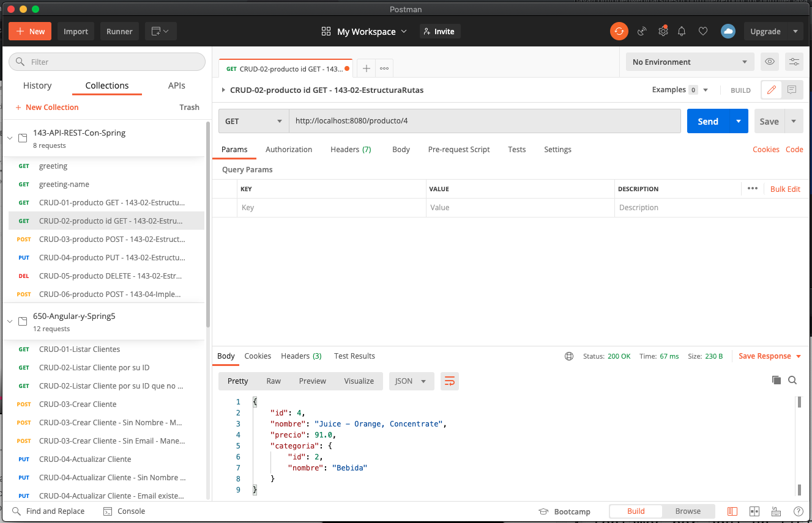

Si nos venimos a Postman podríamos buscar el producto 4.


Lo encontraríamos perfectamente, si buscamos el 44.

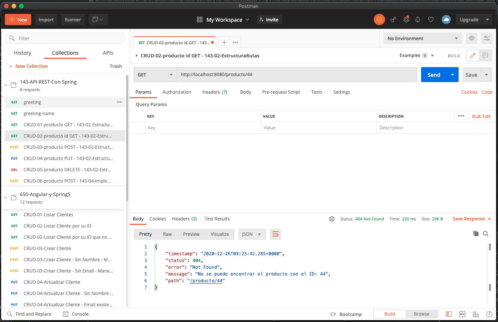

Podemos ver cómo se ha producido una excepción, la respuesta es diferente nos da algo así como el momento en el que se produce la excepción, el código de estado, el error, el mensaje que le hemos proporcionado nosotros `"No se puede encontrar el producto con el ID: 44"`, y el `path` sobre el que se ha producido el error.

```html
{
   "timestamp": "2020-12-26T09:25:42.285+0000",
   "status": 404,
   "error": "Not Found",
   "message": "No se puede encontrar el producto con el ID: 44",
   "path": "/producto/44"
}
```

De esta manera podemos comprobar como estamos obteniendo un mensaje de error y el cliente lo podría aprovechar para incluso el mensaje `"No se puede encontrar el producto con el ID: 44"` poder imprimirlo al usuario, indicándole que no se han podido encontrar el producto con ese ID o alguna otra versión de este mismo mensaje.

El otro cambio que podemos hacer es sombre el método `editarProducto(...)` que actualmente lo tenemos así:

```java
@PutMapping("/producto/{id}")
public ResponseEntity<?> editarProducto(@RequestBody Producto editar, @PathVariable Long id) {

   return productoRepositorio.findById(id).map(p -> {
			p.setNombre(editar.getNombre());
			p.setPrecio(editar.getPrecio());
			return ResponseEntity.ok(productoRepositorio.save(p));
		}).orElseGet(() -> {
			return ResponseEntity.notFound().build();
   });
}
```

En lugar de devolver un `ResponseEntity` y hacer un `orElseGet(...)`, podemos cambiarlo por lo siguiente:

```java
@PutMapping("/producto/{id}")
public Producto editarProducto(@RequestBody Producto editar, @PathVariable Long id) {

   return productoRepositorio.findById(id).map(p -> {
			p.setNombre(editar.getNombre());
			p.setPrecio(editar.getPrecio());
			return productoRepositorio.save(p);
   }).orElseThrow(() -> new ProductoNotFoundException(id));
}
```

Observaciones:

* En caso de que lo encuentre en lugar de devolver el `ResponseEntity` devolvemos el `Producto` recien guardado.
* Si no lo encuentra devuelve un `ProductoNotFoundException`.
* El método ya no devuelve un `ResponseEntity` sino un `Producto`.

De esta forma si se encuentra el `Producto` se edita y se devuelve y sino lanzamos un `ProductoNotFoundException`.

Vamos a hacer también el codigo para el método `borrarProducto(...)` que actualmente lo tenemos así:

```java
@DeleteMapping("/producto/{id}")
public ResponseEntity<?> borrarProducto(@PathVariable Long id) {
   productoRepositorio.deleteById(id);
   return ResponseEntity.noContent().build();
}
```

Si queremos mamejar la situación de que no encontramos el `Producto` a eliminar vamos a cambiarlo como sigue:

```java
@DeleteMapping("/producto/{id}")
public ResponseEntity<?> borrarProducto(@PathVariable Long id) {
   Producto producto = productoRepositorio.findById(id)
				.orElseThrow(() -> new ProductoNotFoundException(id));
		
   productoRepositorio.delete(producto);
	return ResponseEntity.noContent().build();
}
```

Observaciones:

* Primero buscamos el `Producto` y si no lo encontramos devuelve un `ProductoNotFoundException`.
* Si lo encuentra lo elimina y devolvemos `ResponseEntity.noContent().build();`
* Estamos dejando como respuesta del método un `ResponseEntity` para la respuesta correcta.

Vamos a probar nuestros cambios.

Primero creamos un nuevo producto.

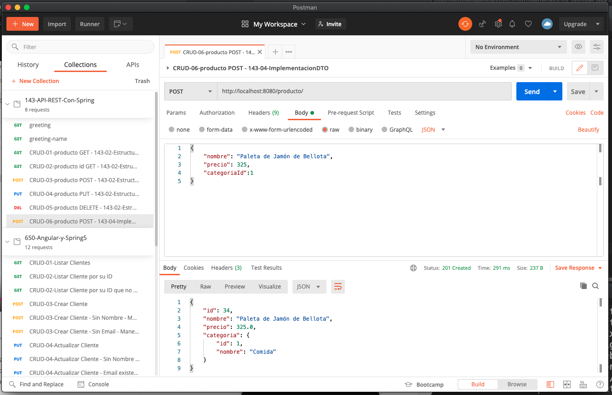

Ahora vamos a hacer el `PUT` para modificar el producto.

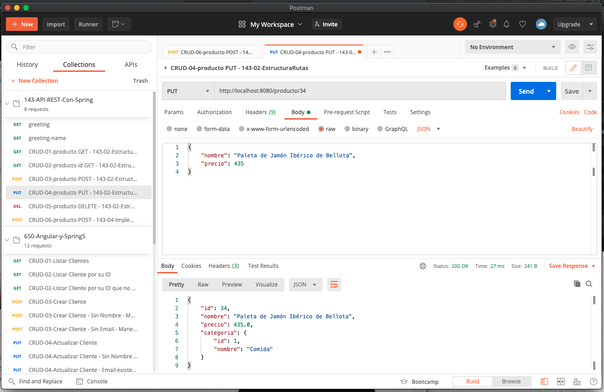

Si intentamos modificar un `Producto` que no existe tenemos:

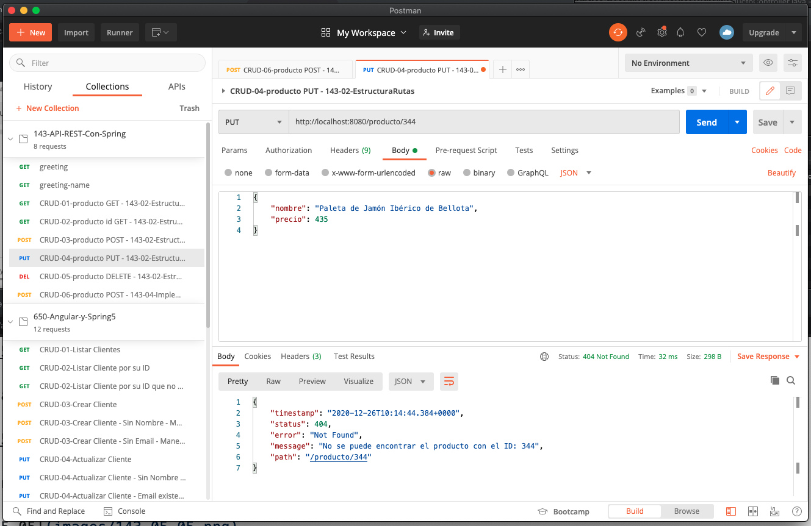

Nos devuelve lo esperado.

Y si tratamos de eliminar el `Producto` 34

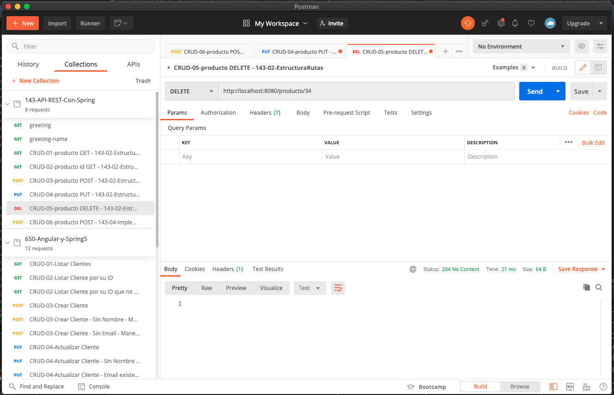

Lo elimina correctamente y si lo intento borrar nuevamente ya me devuelve un `404` que es lo correcto junto con el mensaje.

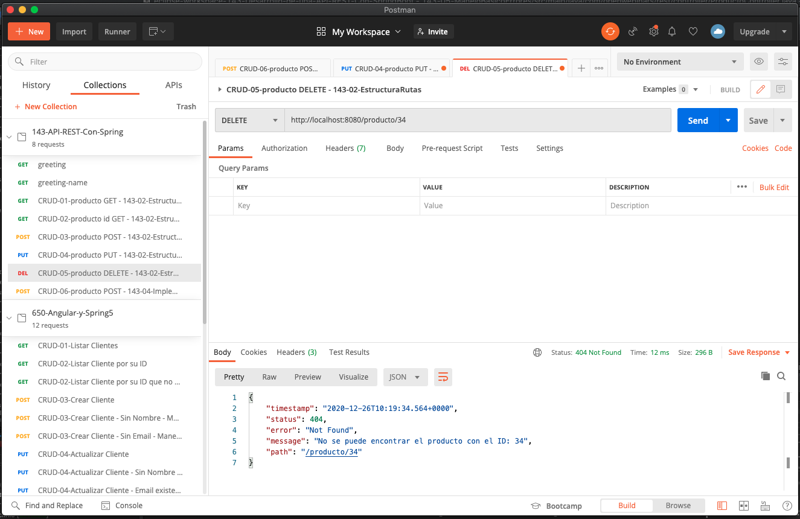

De esta manera como podemos comprobar podemos asociar el mecanismo de manejo de excepciones de Java cortocircuitandolo de determinada manera con Spring para que produzca una un mensaje, un código de respuesta más adecuada.

### :computer: Código Completo `143-05-ManejoBasicoErrores` Ejemplo para manejar Excepciónes

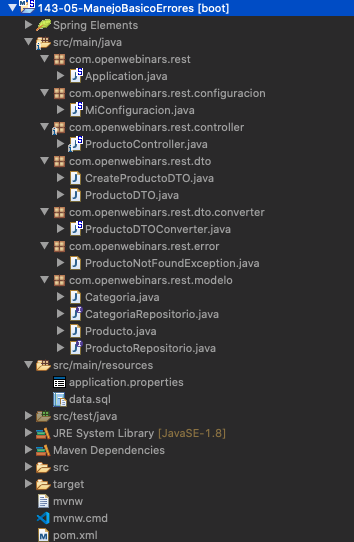

Vamos a poner solo el código de las clases nuevas o modificadas respecto al proyecto anterior.

`ProductoNotFoundException`

```java
package com.openwebinars.rest.error;

import org.springframework.http.HttpStatus;
import org.springframework.web.bind.annotation.ResponseStatus;

@ResponseStatus(HttpStatus.NOT_FOUND)
public class ProductoNotFoundException extends RuntimeException{

   private static final long serialVersionUID = 1L;

   public ProductoNotFoundException(Long id) {
      super("No se puede encontrar el producto con el ID: " + id);
   }
}
```

`ProductoController`

```java
package com.openwebinars.rest.controller;

import java.util.List;
import java.util.stream.Collectors;

import org.springframework.http.HttpStatus;
import org.springframework.http.ResponseEntity;
import org.springframework.web.bind.annotation.DeleteMapping;
import org.springframework.web.bind.annotation.GetMapping;
import org.springframework.web.bind.annotation.PathVariable;
import org.springframework.web.bind.annotation.PostMapping;
import org.springframework.web.bind.annotation.PutMapping;
import org.springframework.web.bind.annotation.RequestBody;
import org.springframework.web.bind.annotation.RestController;

import com.openwebinars.rest.dto.CreateProductoDTO;
import com.openwebinars.rest.dto.ProductoDTO;
import com.openwebinars.rest.dto.converter.ProductoDTOConverter;
import com.openwebinars.rest.error.ProductoNotFoundException;
import com.openwebinars.rest.modelo.Categoria;
import com.openwebinars.rest.modelo.CategoriaRepositorio;
import com.openwebinars.rest.modelo.Producto;
import com.openwebinars.rest.modelo.ProductoRepositorio;

import lombok.RequiredArgsConstructor;

@RestController
@RequiredArgsConstructor
public class ProductoController {

   private final ProductoRepositorio productoRepositorio;
   private final CategoriaRepositorio categoriaRepositorio;
   private final ProductoDTOConverter productoDTOConverter;

   /**
    * Obtenemos todos los productos
    * 
    * @return 404 si no hay productos, 200 y lista de productos si hay uno o más
    */
   @GetMapping("/producto")
   public ResponseEntity<?> obtenerTodos() {
      List<Producto> result = productoRepositorio.findAll();

      if (result.isEmpty()) {
         return ResponseEntity.notFound().build();
      } else {

         List<ProductoDTO> dtoList = result.stream().map(productoDTOConverter::convertToDto)
					.collect(Collectors.toList());
         return ResponseEntity.ok(dtoList);
      }

   }

   /**
    * Obtenemos un producto en base a su ID
    * 
    * @param id
    * @return 404 si no encuentra el producto, 200 y el producto si lo encuentra
    */
   @GetMapping("/producto/{id}")
   public Producto obtenerUno(@PathVariable Long id) {
      return productoRepositorio.findById(id)
				.orElseThrow(() -> new ProductoNotFoundException(id));
   }

   /**
    * Insertamos un nuevo producto
    * 
    * @param nuevo
    * @return 201 y el producto insertado
    */
   @PostMapping("/producto")
   public ResponseEntity<?> nuevoProducto(@RequestBody CreateProductoDTO nuevo) {
      // En este caso, para contrastar, lo hacemos manualmente
		
      // Este código sería más propio de un servicio. Lo implementamos aquí
      // por no hacer más complejo el ejercicio.
      Producto nuevoProducto = new Producto();
      nuevoProducto.setNombre(nuevo.getNombre());
      nuevoProducto.setPrecio(nuevo.getPrecio());
      Categoria categoria = categoriaRepositorio.findById(nuevo.getCategoriaId()).orElse(null);
      nuevoProducto.setCategoria(categoria);
      return ResponseEntity.status(HttpStatus.CREATED).body(productoRepositorio.save(nuevoProducto));
   }

   /**
    * 
    * @param editar
    * @param id
    * @return 200 Ok si la edición tiene éxito, 404 si no se encuentra el producto
    */
   @PutMapping("/producto/{id}")
   public Producto editarProducto(@RequestBody Producto editar, @PathVariable Long id) {

      return productoRepositorio.findById(id).map(p -> {
			p.setNombre(editar.getNombre());
			p.setPrecio(editar.getPrecio());
			return productoRepositorio.save(p);
		}).orElseThrow(() -> new ProductoNotFoundException(id));
   }

   /**
    * Borra un producto del catálogo en base a su id
    * 
    * @param id
    * @return Código 204 sin contenido
    */
   @DeleteMapping("/producto/{id}")
   public ResponseEntity<?> borrarProducto(@PathVariable Long id) {
      Producto producto = productoRepositorio.findById(id)
				.orElseThrow(() -> new ProductoNotFoundException(id));
		
      productoRepositorio.delete(producto);
      return ResponseEntity.noContent().build();
   }

}
```


Llegado este punto os propongo como reto que podáis crear algún tipo de error más, por ejemplo uno que se lance cuando no haya productos en el catálogo y se solicite todos, es posible que podíamos devolver el `404`, podrían crear otra excepción que sería `CatalogoProductosVaciosException` o algo por el estilo o por ejemplo también podrían bien gestionar bien la creación de un nuevo producto y si hay algo, algún dato que esperamos y que no viene o algo por el estilo, crear una excepción también que devolviera el código correcto que en este caso sería un `Bad Request` un `400`. Esto como reto para que lo podáis ir haciendo vosotros.

En las siguientes lecciones de este bloque vamos a seguir manejando errores de otras maneras que nos ofrece Spring.

# 15 Modelo para la respuesta de un error 4:58 

[PDF Modelo_de_respuesta_para_un_error.pdf](pdfs/14_Modelo_de_respuesta_para_un_error.pdf)

## Resumen Profesor

### Modelo de error más complejo

Algunos autores, como `Bruno Leite`, proponen una implementación del modelo de respuesta más complejo como esta:

```java
class ApiError {

   private HttpStatus status;
   @JsonFormat(shape = JsonFormat.Shape.STRING, pattern = "dd-MM-yyyy hh:mm:ss")
   private LocalDateTime timestamp;
   private String message;
   private String debugMessage;
   private List<ApiSubError> subErrors;

   private ApiError() {
       timestamp = LocalDateTime.now();
   }

   ApiError(HttpStatus status) {
       this();
       this.status = status;
   }

   ApiError(HttpStatus status, Throwable ex) {
       this();
       this.status = status;
       this.message = "Unexpected error";
       this.debugMessage = ex.getLocalizedMessage();
   }

   ApiError(HttpStatus status, String message, Throwable ex) {
       this();
       this.status = status;
       this.message = message;
       this.debugMessage = ex.getLocalizedMessage();
   }
}
 
abstract class ApiSubError {

}

@Data
@EqualsAndHashCode(callSuper = false)
@AllArgsConstructor
class ApiValidationError extends ApiSubError {
   private String object;
   private String field;
   private Object rejectedValue;
   private String message;

   ApiValidationError(String object, String message) {
       this.object = object;
       this.message = message;
   }
}
```
## Transcripción


Vamos a seguir manejando errores en nuestra API REST, en este caso vamos a reflexionar un poco sobre la información que enviamos al cliente cuándo se produce un error, una excepción.


En el ejemplo anterior veíamos como podíamos utilizar con `@ResponseStatus(...)` determinadas excepciones y que se devolvierá un código de respuesta mas adecuado, pero la información que se devuelve en el mensaje de error por defecto lo fábrica Spring, contiene la *fecha*, el *estado*, el *nombre del error*, un *mensaje* y la *ruta* en la cual se ha producido. 


Podemos ver alguno como el anterior en el que nosotros habíamos modificado el mensaje, pero el resto de datos vienen tal cual. En realidad lo que nos está devolviendo es una especie de instancia de `DefaultErrorAttribute` que lo podemos ver en la [documentación oficial](https://docs.spring.io/spring-boot/docs/current/api/org/springframework/boot/web/servlet/error/DefaultErrorAttributes.html).

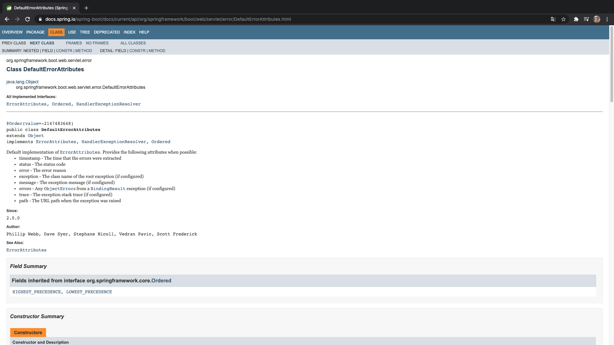

`DefaultErrorAttribute` es una clase que contiene todo lo que veniamos comentando. Tiene todos los campos de error que podemos ver en la imagen y es la implementación por defecto de la `Interface ErrorAttributes` que es la que utiliza Spring a la hora de devolver un error.

Una de las maneras que tendríamos lo podemos ver incluso más adelante de modificar lo que se devuelve como error sería hacer nuestra implementación de l`Interface ErrorAttributes` o extender la clase `DefaultErrorAttribute`. En este caso vamos a crear nosotros un modelo de error y lo haremos desde cero.

Nos interesaría customizarlo porque en realidad aquí hay determinados datos que bien son redundante como el tema de `404`, el `Not found` quizás si sea interesante pero el `404` lo podemos sacar desde el propio código de respuesta, la fecha viene en un formato que ciertamente es poco legible para nosotros.


Puede que nos interese customizarlo y agregar algunos campos nuevos, hacer algunos cambios, si estamos implementando un mecanismo de validación imaginos que mandamos un formulario entero en el cual se producen más de un error y queremos mandar de un golpe varios errores por que determinado campo lo han deja vacío y no debería o determinado campo numérico debería estar en un rango y no lo han puesto en su rango, nos podría interesar también tener una respuesta que tuviera adentro varios errores de alguna forma anidados o en alguna colección.


El modelo para un error que vamos implementar sería una clase plana de Java, de hecho vamos a poder utilizar Lombok si lo estimamos necesario y pondremos los campos que nosotros creamos conveniente.


Vamos a partir de un modelo base con el que solamente vamos a poner el *Estado* como en el de antes del `404` obviaríamos el número nos quedaríamos con el `Not Found`, ya digo el número lo podemos sacar del propio código de respuesta, la *Fecha* pero formateada de una forma adecuada a través de un `LocalDateTime` y un mensaje como `String`, ese sería un modelo en el que básicamente le podíamos decir este el tipo de error que ha sucedido en este momento con este mensaje de error. 


Podríamos pensar en algún modelo más complejo que incluyera además del *Estado* y la *Fecha* una lista de mensajes en lugar de indicar solamente un mensaje, como deciamos antes en una situación de validación podríamos devolver todos los mensajes de una vez y que el cliente ya se encargará de pintarlos.


Podríamos tener un modelo aún más complejo en el que tuviéramos varias clases anidadas, podríamos imaginarnos, aprovechando que las excepciones suelen tener también un mensaje corto y uno más largo, podríamos tener esos 2 mensajes, sobre todo por incluir el mensaje con mayor grado de descripción y tener una lista de sub-errores.


Y para cada sub-error pues posiblemente nos interesaría o bien definir uno Abstracto o tener uno Genérico o como decía tener uno Abstracto y crear subtipos, por ejemplo el de validación y en el que incluya, bueno esto ha sucedido en este objeto, sobre este campo o con determinado valor, toma este mensaje de validación, en el que lo podíamos dar de una forma un poco más completa.


Bueno pues vamos a ver en la próxima lección como incluirlo dentro de nuestro ejemplo, vamos a crear nuestro propio modelo para manejar las excepciones, en la respuesta que le vamos a dar al cliente y vamos a ver cómo implementarlo y cuál sería la respuesta que recibirían los clientes.

# 16 Manejo de errores con `@ExceptionHandler` 12:25 

[PDF ExceptionHandler.pdf](pdfs/15_ExceptionHandler.pdf)

## Resumen Profesor

La información sobre la anotación `@ExceptionHandler` la puedes encontrar aquí: https://docs.spring.io/spring-framework/docs/current/javadoc-api/org/springframework/web/bind/annotation/ExceptionHandler.html.

## Transcripción


Vamos a ver ahora en esta nueva lección cómo incorporar el modelo de error que teníamos antes y hacer el manejo de errores con `@ExceptionHandler`


Nuestro modelo de error que proponíamos en la clase anterior de manera teórica, lo vamos a implementar a través de una clase plana de Java, vamos a utilizar las anotaciones `@Getter` y `@Setter` de **Lombok** para poder incluirla y decíamos que iba a tener solamente tres atributos el `estado` que será el mensaje del Estado que podemos sacar de la enumeración `HttpStatus`, la `fecha` y hora y un `mensaje`. La fecha y hora aprovecharemos la ***anotaciones de Lombok*** `@JsonFormat` para indicar que la queremos obtener como un `String` con el patrón que indicamos a la derecha en pantalla el día barra mes barra año con cuatro cifras horas minutos y segundos que en el contexto por lo menos castellano a nivel europeo se utiliza mucho, lo podríamos cambiar si nuestro formato de hora fuese diferente lo podríamos cambiar en el patrón que utilizaría para enviarlo lo más acordé a lo que necesitamos, desde luego quizás sea un poco más interpretando que el formato que nos brinda por defecto Spring.


De manera que lo que buscamos sean errores de este tipo frente a los que veíamos en lecciones anteriores  donde el código de estado, bueno podemos aprovechar directamente la enumeración no tener que hacer una traducción, que bueno si alguien le interesara podría hacer una traducción de esa enumeración a algún otro texto, la fecha que podría ser con este formato día mes año hora minuto segundo y con el mensaje que sería el mismo de antes pero en un campo llamado mensaje.


Lo que tenemos que ver es cómo poder utilizar este modelo de excepción, como lo vamos a poder utilizar. Vamos a tener que tratar de encajar dos cosas, utilizar este mensaje personalizado y el tratamiento de excepciones y ellos lo vamos a hacer a través de la anotación `@ExceptionHandler` esa anotación aceptará un tipo o varios tipos de excepción y aunque una primera aproximación nos permite ubicarla en un método cualquiera del controlador, ya veremos que se puede poner en más sitios, en sitios quizás más adecuado y será la encargada de manejar las excepción de uno o varios tipos dependiendo de los que les hayamos asociados cuando se produzcan en un determinado controlador, esto nos va a permitir que el tratamiento de la excepción se cortocircuita, se haga a través de este método que hemos anotado con esta excepción y bueno pues ahí podemos hacer lo que estime conveniente como por ejemplo devolver una respuesta con el tipo de error que hemos definido antes.


Lo podemos hacer anotando un método del controlador, decir también que puede tener una firma bastante variopinta, es decir que lo podemos encontrar recibiendo diferentes tipos de argumento y devolviendo diferentes tipos de datos, puede recibir una instancia de una excepción que se haya producido, la propia excepción que queremos en ese sentido cortocircuitar y capturar, los objetos de petición y respuesta por si queremos sacar algo de información de la petición, aportar algo a la respuesta, si tenemos sesiones activas los objetos de sesión, si nos manejamos en un entorno internacionalizado el `Locale` para saber el idioma en el que se ha producido ese error.


Y como tipo de retorno puede volver vacío en un contexto en el que usemos un motor de plantillas cómo  Thymeleaf objetos `Model`, `ModelAndView`, `Map` que se utilizan, puede devolver una cadena de caracteres, puede devolver algo anotado con `@ResponseBody` o incluso un `HTTPEntity` o `ResponseEntity` y que será para nosotros francamente comodo. 


En definitiva vamos a ver qué podemos añadir a nuestro proyecto lo que vamos a hacer es tener dos métodos `handleProductoNotFoundException` para manejar excepciones de productos no encontrados y vamos a manejar otra excepción que aunque no sea nuestra también se puede producir que son errores en el Parseo a la hora de crear o editar un producto, a la hora de serializar o deserializar podemos encontrar algún tipo de problema, todo ello produciría un error de tipo `JsonMappingException` vamos a ver como capturarla y que entoces el error que produzca sea el que a nosotros nos pueda interesar.

### :computer: `143-06-ExceptionHandler` Manejo de errores con `@ExceptionHandler`

Partimos del proyecto `143-05-ManejoBasicoErrores` y realizamos una copia y le llamaremos `143-06-ExceptionHandler`.

#### 01. Modificar el `pom.xml`

```html
<artifactId>143-06-ExceptionHandler</artifactId>
<version>0.0.1-SNAPSHOT</version>
<name>143-06-ExceptionHandler</name>
<description>Ejemplo de manejo de errores con ExceptionHandler</description>
```

#### 02. Crear la Clase `ApiError`

Dentro del paquete `error` creamos la clase `ApiError`

`ApiError`

```java
@Setter @Getter
public class ApiError {
	
   private HttpStatus estado;
	
   @JsonFormat(shape = Shape.STRING, pattern="dd/MM/yyyy hh:mm:ss")
   private LocalDateTime fecha;
	
   private String mensaje;

}
```

Observaciones de `ApiError`

* Anotada con `@Setter` y `@Getter` de Lombok
* Usamos la anotación ` @JsonFormat` para dar un formato a nuestro `LocalDateTime`


Ya veríamos si nos puede interesar agregar un `Builder` o un constructor lo podríamos hacer si nos interesa más adelante.

#### 03. Modificar el Controlador

Vamos a añadir los métodos anotados con `@ExceptionHandler(...)`

```java
@ExceptionHandler(ProductoNotFoundException.class)
public ResponseEntity<ApiError> handleProductoNoEncontrado(ProductoNotFoundException ex) {
   ApiError apiError = new ApiError();
   apiError.setEstado(HttpStatus.NOT_FOUND);
   apiError.setFecha(LocalDateTime.now());
   apiError.setMensaje(ex.getMessage());
   return ResponseEntity.status(HttpStatus.NOT_FOUND).body(apiError);
}
```

Método `handleProductoNoEncontrado`

En el momento que se produzca una excepción del tipo `ProductoNotFoundException` en lugar de hacer el tratamiento de errores por defecto se vendrá a este método, pasará la excepción como argumento y regresamos una respuesta del tipo `ResponseEntity`.

* Anotado con `@ExceptionHandler(ProductoNotFoundException.class)`
* Retorna un `ResponseEntity<ApiError>`
* Recibe una excepción de tipo  `ProductoNotFoundException`
* Creamos el objeto `ApiError` y asignamos los valores a sus atributos
* Devolvemos un `ResponseEntity` con un estado `HttpStatus.NOT_FOUND` y en el cuerpo devolvemos el `apiError` que creamos.

De esta manera ahora comprobaremos que cuando vayamos a buscar un producto y no se encuentre, el error en lugar de ser el que veniamos teniendo hasta este momento será este que acabamos de definir.

Si volvemos a Postman este es el mensaje que mostrabamos antes:

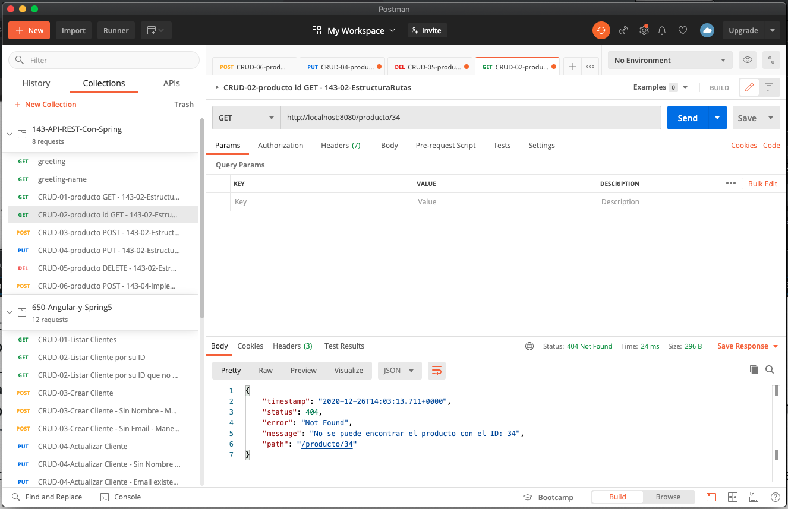

Si probamos nuestro nueva aplicación al hacer lo mismo obtendremos lo siguiente:

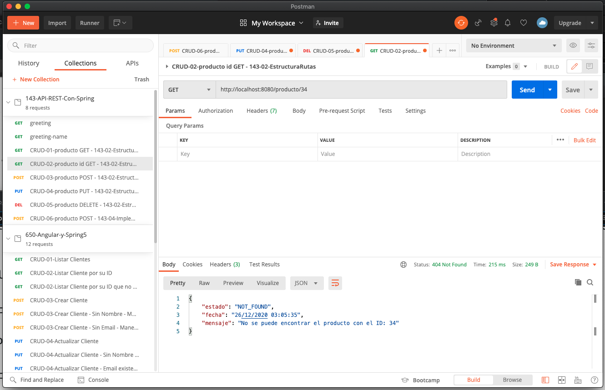

La respuesta ya esta totalmente personalizada a nuestro gusto.

```json
{
    "estado": "NOT_FOUND",
    "fecha": "26/12/2020 03:05:35",
    "mensaje": "No se puede encontrar el producto con el ID: 34"
}
```

Vamos a realizar la implementación del otro método `handleJsonMappingException` el cual se va a parecer mucho.

```java
@ExceptionHandler(JsonMappingException.class)
public ResponseEntity<ApiError> handleJsonMappingException(JsonMappingException ex) {
   ApiError apiError = new ApiError();
   apiError.setEstado(HttpStatus.BAD_REQUEST);
   apiError.setFecha(LocalDateTime.now());
   apiError.setMensaje(ex.getMessage());
   return ResponseEntity.status(HttpStatus.BAD_REQUEST).body(apiError);
}
```

Método `handleJsonMappingException`

* Anotado con `@ExceptionHandler(JsonMappingException.class)`
* Retorna un `ResponseEntity<ApiError>`
* Recibe una excepción de tipo  `JsonMappingException`
* Creamos el objeto `ApiError` y asignamos los valores a sus atributos
* Devolvemos un `ResponseEntity` con un estado `HttpStatus.BAD_REQUEST` y en el cuerpo devolvemos el `apiError` que creamos.

Ambos métodos son tan parecidos que nos da la pista para en un futuro optimizar nuestro código.

Vamos a probar nuestra aplicación en Postman comprobando que si damos de alta un producto correcto no pasaría nada.

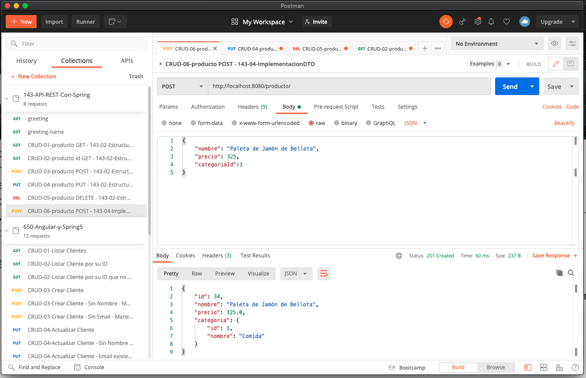

Pero si en lugar de pasar un Producto correcto pasamos uno incorrecto donde los campos númericos los pasamos como `String` se nos indica lo siguiente:

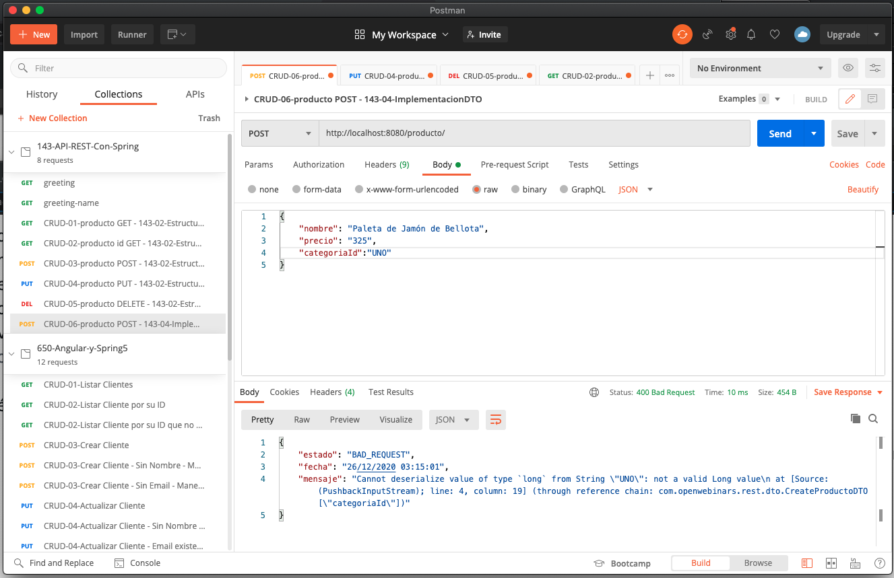

Se nos produce un `BAD_REQUEST` donde el mensaje es el que se nos da por defecto:

```sh
"mensaje": "Cannot deserialize value of type `long` from String \"UNO\": not a valid Long value\n at [Source: (PushbackInputStream); line: 4, column: 19] (through reference chain: com.openwebinars.rest.dto.CreateProductoDTO[\"categoriaId\"])"
```

Es un mensaje de la propia librería Jackson de la excepción `JsonMappingException` que de alguna manera nos esta devolviendo este mensaje de error. Podríamos crear nosotros una excepción que la extendiera y así también customizar el mensaje de error para que fuera lo más adecuado posible.

### :computer: Código Completa `143-06-ExceptionHandler` Manejo de errores con `@ExceptionHandler`

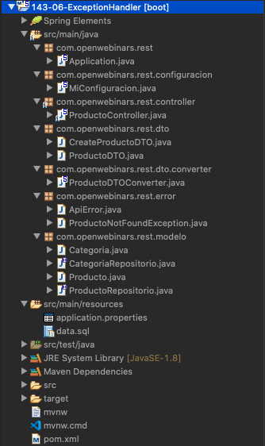

Vamos a listar las clases nuevas o modificadas que se han realizado en este proyecto.

`ApiError`

```java
package com.openwebinars.rest.error;

import java.time.LocalDateTime;

import org.springframework.http.HttpStatus;

import com.fasterxml.jackson.annotation.JsonFormat;
import com.fasterxml.jackson.annotation.JsonFormat.Shape;

import lombok.Getter;
import lombok.Setter;

@Setter @Getter
public class ApiError {
	
   private HttpStatus estado;
	
   @JsonFormat(shape = Shape.STRING, pattern="dd/MM/yyyy hh:mm:ss")
   private LocalDateTime fecha;
	
   private String mensaje;

}
```

`ProductoController`

```java
package com.openwebinars.rest.controller;

import java.time.LocalDateTime;
import java.util.List;
import java.util.stream.Collectors;

import org.springframework.http.HttpStatus;
import org.springframework.http.ResponseEntity;
import org.springframework.web.bind.annotation.DeleteMapping;
import org.springframework.web.bind.annotation.ExceptionHandler;
import org.springframework.web.bind.annotation.GetMapping;
import org.springframework.web.bind.annotation.PathVariable;
import org.springframework.web.bind.annotation.PostMapping;
import org.springframework.web.bind.annotation.PutMapping;
import org.springframework.web.bind.annotation.RequestBody;
import org.springframework.web.bind.annotation.RestController;

import com.fasterxml.jackson.databind.JsonMappingException;
import com.openwebinars.rest.dto.CreateProductoDTO;
import com.openwebinars.rest.dto.ProductoDTO;
import com.openwebinars.rest.dto.converter.ProductoDTOConverter;
import com.openwebinars.rest.error.ApiError;
import com.openwebinars.rest.error.ProductoNotFoundException;
import com.openwebinars.rest.modelo.Categoria;
import com.openwebinars.rest.modelo.CategoriaRepositorio;
import com.openwebinars.rest.modelo.Producto;
import com.openwebinars.rest.modelo.ProductoRepositorio;

import lombok.RequiredArgsConstructor;

@RestController
@RequiredArgsConstructor
public class ProductoController {

   private final ProductoRepositorio productoRepositorio;
   private final ProductoDTOConverter productoDTOConverter;
   private final CategoriaRepositorio categoriaRepositorio;

   /**
    * Obtenemos todos los productos
    * 
    * @return 404 si no hay productos, 200 y lista de productos si hay uno o más
    */
   @GetMapping("/producto")
   public ResponseEntity<?> obtenerTodos() {
      List<Producto> result = productoRepositorio.findAll();

      if (result.isEmpty()) {
         return ResponseEntity.notFound().build();
      } else {
         //return ResponseEntity.ok(result);
         List<ProductoDTO> dtoList = 
                              result.stream()
                                 .map(productoDTOConverter::convertToDto)
                                 .collect(Collectors.toList());
         return ResponseEntity.ok(dtoList);
      }

   }

   /**
    * Obtenemos un producto en base a su ID
    * 
    * @param id
    * @return 404 si no encuentra el producto, 200 y el producto si lo encuentra
    */
   @GetMapping("/producto/{id}")
   public Producto obtenerUno(@PathVariable Long id) {
      return productoRepositorio.findById(id)
				.orElseThrow(() -> new ProductoNotFoundException(id));
   }

   /**
    * Insertamos un nuevo producto
    * 
    * @param nuevo
    * @return 201 y el producto insertado
    */
   @PostMapping("/producto")
   public ResponseEntity<?> nuevoProducto(@RequestBody CreateProductoDTO nuevo) {
      // En este caso, para contrastar, lo hacemos manualmente
		
      // Este código sería más propio de un servicio. Lo implementamos aquí
      // por no hacer más complejo el ejercicio.
      Producto nuevoProducto = new Producto();
      nuevoProducto.setNombre(nuevo.getNombre());
      nuevoProducto.setPrecio(nuevo.getPrecio());
		
      //Rescatamos la categoría para poder asignarla
      Categoria categoria = categoriaRepositorio.findById(nuevo.getCategoriaId()).orElse(null);
      nuevoProducto.setCategoria(categoria);
		
      //salvar y devolver
      return ResponseEntity.status(HttpStatus.CREATED).body(productoRepositorio.save(nuevoProducto));
		
   }

   /**
    * 
    * @param editar
    * @param id
    * @return 200 Ok si la edición tiene éxito, 404 si no se encuentra el producto
    */
   @PutMapping("/producto/{id}")
   public Producto editarProducto(@RequestBody Producto editar, @PathVariable Long id) {

      return productoRepositorio.findById(id).map(p -> {
			p.setNombre(editar.getNombre());
			p.setPrecio(editar.getPrecio());
			return productoRepositorio.save(p);
      }).orElseThrow(() -> new ProductoNotFoundException(id));
   }

   /**
    * Borra un producto del catálogo en base a su id
    * 
    * @param id
    * @return Código 204 sin contenido
    */
   @DeleteMapping("/producto/{id}")
   public ResponseEntity<?> borrarProducto(@PathVariable Long id) {
      Producto producto = productoRepositorio.findById(id)
                              .orElseThrow(() -> new ProductoNotFoundException(id));
		
      productoRepositorio.delete(producto);
      return ResponseEntity.noContent().build();
   }
	
   @ExceptionHandler(ProductoNotFoundException.class)
   public ResponseEntity<ApiError> handleProductoNoEncontrado(ProductoNotFoundException ex) {
      ApiError apiError = new ApiError();
      apiError.setEstado(HttpStatus.NOT_FOUND);
      apiError.setFecha(LocalDateTime.now());
      apiError.setMensaje(ex.getMessage());
      return ResponseEntity.status(HttpStatus.NOT_FOUND).body(apiError);
   }
	
   @ExceptionHandler(JsonMappingException.class)
   public ResponseEntity<ApiError> handleJsonMappingException(JsonMappingException ex) {
      ApiError apiError = new ApiError();
      apiError.setEstado(HttpStatus.BAD_REQUEST);
      apiError.setFecha(LocalDateTime.now());
      apiError.setMensaje(ex.getMessage());
      return ResponseEntity.status(HttpStatus.BAD_REQUEST).body(apiError);
   }

}
```

Hasta aquí poco a poco vamos mejorando nuestro modelo de error, el tratamiento de errores, en las próximas lecciones vamos a ver que más alternativas para este tratamiento de errores nos ofrece Spring.

# 17 Manejo de errores con `@ControllerAdvice` (Parte I) 11:22 

[PDF ControllerAdvice.pdf](pdfs/16_ControllerAdvice.pdf)

## Resumen Profesor

La información sobre la clase `ResponseEntityExceptionHandler` la puedes encontrar aquí: https://docs.spring.io/spring-framework/docs/current/javadoc-api/org/springframework/web/servlet/mvc/method/annotation/ResponseEntityExceptionHandler.html

## Transcripción


Vamos a continuar manejando los errores de nuestra API REST con Spring Boot y en este caso lo vamos a hacer utilizando `@ControllerAdvise`.


Hasta ahora hemos podido manejar excepciones lo cual ha estado bien, nuestro mensaje de error es personalizado y entonces nos podemos preguntar ¿y que nos falta? bueno el tema es que `@ExceptionHandler` ***solo nos permite manejar las excepciones que se escriben en ese controlador*** tal y como lo hemos planteado en la lección anterior, entonces si quisiéramos hacer una gestión global de errores, si tuviéramos diferentes controladores que en algún caso utilizan los productos, imaginado el propio controlador de producto y el controlador de ventas, y en las ventas necesitamos buscar algún tipo de producto también, utilizando el mismo servicio pero en controladores diferentes, allí el manejo del producto no encontrado debería ser el mismo, no deberíamos de tener porque replicar el manejo de error en uno y en otro y en otro controlador, porque eso sería inmantenible. Necesitamos de alguna manera una gestión global de errores. Si utilizamos `@ExceptionHandler` a nivel de un método de un controlador solamente funcionar allí.


Vamos a ver como la anotación `@ControllerAdvise` nos va a permitir aportar esa gestión global, se trata de una especialización de la anotación `@Component` que está orientada a tener métodos anotados a su vez con `@ExceptionHandler` que serán los que nosotros utilizamos y alguna otra anotación.

Existe también la especialización `@RestControllerAdvise` de hecho será la que utilicemos, sería también la combinación al igual que pasaba con `@RestController` es la combinación de `@ControllerAdvise` y `@ResponseBody` pensando en que lo que devuelvan los métodos será algo que se devuelva directamente al cliente.

Para manejar una determinada excepción, cómo estás clases podrán tener varios métodos, lo que hará Spring será el primer método que encuentre dentro de esa clase que esté anotado para tratar esa excepción será quién lo trate, ***tenemos que ser cuidadoso en ese sentido, en el orden.*** 


Podríamos tener más de una clase anotada con `@ControllerAdvise` si queremos tener diferentes prioridades o un orden determinado, en determinados casos utilizar siempre y si no está otra y está otra, podríamos anotarlas con `@Order` o `@Priority` para que pudiéramos establecer una secuencia en ese tratamiento de errores, una presedencia y también tendremos que tener cuidado en las jerarquías de errores, por si estamos tratando antes la `IOException` qué es una excepción más general y entonces a lo mejor no va a entrar nunca hacer el tratamiento de un `FileNotFoundException` qué es de alguna manera una hija de esta primera, de `IOException`, tenemos que ser cuidadoso en el diseño de nuestras clases con `@ControllerAdvise` o `@RestControllerAdvise` y cómo van a hacer el tratamiento de errores. 


Si no indicamos nada `@ControllerAdvise` o `@RestControllerAdvise` estás anotaciones harán que se traten las excepciones de cualquier controlador, pero es verdad que lo podemos acotar, lo podemos acotar a través de el nombre del paquete como una cadena de caracteres, las dos primeras son equivalentes. 

Con `basePackages` el `@ControllerAdvise` hara referencia a ese paquete. 

Con `basePackagesClasses` afecta a la clase que indiquemos.

Con `assignableTypes` podemos listar una serie de clases.

Con `annotations` con aquellos controladores que tengan una determinada anotación, como por ejemplo puede darle tratamiento si tenemos controladores Rest  y controladores normal, es darle tratamiento solamente a los controladores que sean de tipo RestController también lo podríamos hacer.

Nosotros haremos un tratamiento en principio para todos los controladores que tengamos, pero ya digo que podríamos acotar el uso que se pueda tener.


Un primer ejemplo puede ser la anterior donde la arquitectura de la clase es así de sencilla, una clase llamada `GlobalControllerAdvice` para denotar que es un tratamiento de errores global anotada con `@RestControllerAdvise` y dentro vamos a incluir los métodos `@ExceptionHandler(...)` que veniamos definiendo antes.


También vamos a incluir en el ejemplo que vamos a hacer ahora algunas mejoras en las clases del Modelo de error, por que hemos visto antes que se ha hecho un poco pesado estaban definidas muy básicamente por lo que vamos a meter algunas mejoras, podemos usar algunas otras anotaciones de Lombok como la de un constructor con argumentos requeridos `@RequiredArgsConstructor` para que genere almenos un constructor del `estado` y el `mensaje`, un constructor vacío con `@NoArgsConstructor` por si alguna vez nos hace falta y la fecha y hora del momento que la podemos asignar por defecto. Vamos ir incluyendo estos cambios.

### :computer: `143-07-ControllerAdvice` Manejo de errores con `@ControllerAdvise` o `@RestControllerAdvise`

Partiendo del proyecto `143-06-ExceptionHandler` vamos a copiarlo y crear el proyecto `143-07-ControllerAdvice`

#### 01. Modificar el `pom.xml`

```html
<artifactId>143-07-ControllerAdvice</artifactId>
<version>0.0.1-SNAPSHOT</version>
<name>143-07-ControllerAdvice</name>
<description>Ejemplo de manejo de errores con ControllerAdvice</description>
```

#### 02. Mejoramos nuestra `ApiError`

Vamos a hacer mejoras en nuestra `ApiError`

`ApiError`

```java
@Setter
@Getter
@RequiredArgsConstructor
@NoArgsConstructor
public class ApiError {

   @NonNull
   private HttpStatus estado;
   @JsonFormat(shape = Shape.STRING, pattern = "dd/MM/yyyy hh:mm:ss")
   private LocalDateTime fecha = LocalDateTime.now();
   @NonNull
   private String mensaje;
	
}
```

Observaciones de `ApiError`

* Le hemos añadido las anotaciones `@RequiredArgsConstructor` y `@NoArgsConstructor`.
* Añadimos la anotación `@NonNull` de Lombok a los campos que no queremos que sean nulos.
* Le asignamos un valor por defecto a la `fecha`.

Ya tenemos mejorado nuestr Modelo de error.

#### 03. Crear la Clase `GlobalControllerAdvice`

Creamos la clase `GlobalControllerAdvice` dentro del paquete `error`

`GlobalControllerAdvice`

```java
@RestControllerAdvice
public class GlobalControllerAdvice {
	
   @ExceptionHandler(ProductoNotFoundException.class)
   public ResponseEntity<ApiError> handleProductoNoEncontrado(ProductoNotFoundException ex) {
      ApiError apiError = new ApiError(HttpStatus.NOT_FOUND, ex.getMessage());
      return ResponseEntity.status(HttpStatus.NOT_FOUND).body(apiError);
   }
	
   @ExceptionHandler(JsonMappingException.class)
   public ResponseEntity<ApiError> handleJsonMappingException(JsonMappingException ex) {
      ApiError apiError = new ApiError(HttpStatus.BAD_REQUEST, ex.getMessage());
      return ResponseEntity.status(HttpStatus.BAD_REQUEST).body(apiError);
   }

}
```

Observaciones de `GlobalControllerAdvice`

* Clase anotada con @RestControllerAdvice
* Hemos movidos los métodos definidos en el Controller y los hemos incluido aquí, para que el tratamiento que se haga sea totalmente global.
* Como ya tenemos constructor en el `ApiError` lo utilizamos para construir nuestro objeto.

Al igualmente estos métodos se pueden optimizar ya que son muy parecidos.

Ya no solo se manejaria en el `ProductoController` sino que si tuvieramos más controllers se podría manejar.

Si comprobamos nuestra aplicación buscando el `Producto` 34.

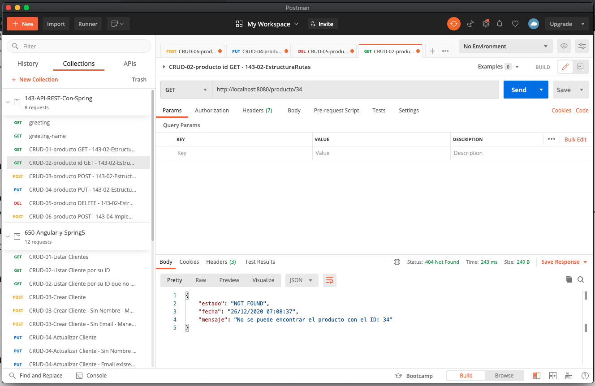

La respuesta sigue siendo la misma solo cambia la hora obviamente, pero el tratamiento de errores lo estamos haciendo de una forma global.

Esta otra petición sigue dando los mismos resultados, pero el tratamiento de errores lo estamos haciendo de una forma global.

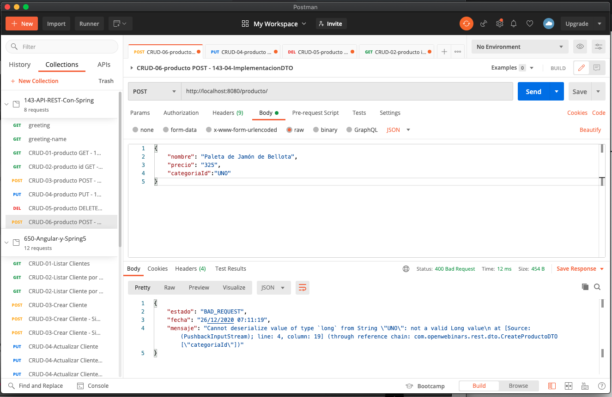

### :computer: Código Completo `143-07-ControllerAdvice` Manejo de errores con `@ControllerAdvise` o `@RestControllerAdvise`

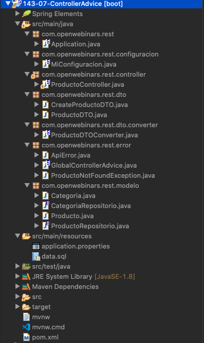

Vamos a listar las clases modificadas o nuevas.

`ApiError`

```java
package com.openwebinars.rest.error;

import java.time.LocalDateTime;

import org.springframework.http.HttpStatus;

import com.fasterxml.jackson.annotation.JsonFormat;
import com.fasterxml.jackson.annotation.JsonFormat.Shape;

import lombok.Getter;
import lombok.NoArgsConstructor;
import lombok.NonNull;
import lombok.RequiredArgsConstructor;
import lombok.Setter;

@Setter
@Getter
@RequiredArgsConstructor
@NoArgsConstructor
public class ApiError {

   @NonNull
   private HttpStatus estado;
   @JsonFormat(shape = Shape.STRING, pattern = "dd/MM/yyyy hh:mm:ss")
   private LocalDateTime fecha = LocalDateTime.now();
   @NonNull
   private String mensaje;
	
}
```


`GlobalControllerAdvice`

```java
package com.openwebinars.rest.error;

import org.springframework.http.HttpStatus;
import org.springframework.http.ResponseEntity;
import org.springframework.web.bind.annotation.ExceptionHandler;
import org.springframework.web.bind.annotation.RestControllerAdvice;

import com.fasterxml.jackson.databind.JsonMappingException;

@RestControllerAdvice
public class GlobalControllerAdvice {
	
   @ExceptionHandler(ProductoNotFoundException.class)
   public ResponseEntity<ApiError> handleProductoNoEncontrado(ProductoNotFoundException ex) {
      ApiError apiError = new ApiError(HttpStatus.NOT_FOUND, ex.getMessage());
      return ResponseEntity.status(HttpStatus.NOT_FOUND).body(apiError);
   }
	
   @ExceptionHandler(JsonMappingException.class)
   public ResponseEntity<ApiError> handleJsonMappingException(JsonMappingException ex) {
      ApiError apiError = new ApiError(HttpStatus.BAD_REQUEST, ex.getMessage());
      return ResponseEntity.status(HttpStatus.BAD_REQUEST).body(apiError);
   }

}
```

`ProductoController`

```java
package com.openwebinars.rest.controller;

import java.time.LocalDateTime;
import java.util.List;
import java.util.stream.Collectors;

import org.springframework.http.HttpStatus;
import org.springframework.http.ResponseEntity;
import org.springframework.web.bind.annotation.DeleteMapping;
import org.springframework.web.bind.annotation.ExceptionHandler;
import org.springframework.web.bind.annotation.GetMapping;
import org.springframework.web.bind.annotation.PathVariable;
import org.springframework.web.bind.annotation.PostMapping;
import org.springframework.web.bind.annotation.PutMapping;
import org.springframework.web.bind.annotation.RequestBody;
import org.springframework.web.bind.annotation.RestController;

import com.fasterxml.jackson.databind.JsonMappingException;
import com.openwebinars.rest.dto.CreateProductoDTO;
import com.openwebinars.rest.dto.ProductoDTO;
import com.openwebinars.rest.dto.converter.ProductoDTOConverter;
import com.openwebinars.rest.error.ApiError;
import com.openwebinars.rest.error.ProductoNotFoundException;
import com.openwebinars.rest.modelo.Categoria;
import com.openwebinars.rest.modelo.CategoriaRepositorio;
import com.openwebinars.rest.modelo.Producto;
import com.openwebinars.rest.modelo.ProductoRepositorio;

import lombok.RequiredArgsConstructor;

@RestController
@RequiredArgsConstructor
public class ProductoController {

   private final ProductoRepositorio productoRepositorio;
   private final ProductoDTOConverter productoDTOConverter;
   private final CategoriaRepositorio categoriaRepositorio;

   /**
    * Obtenemos todos los productos
    * 
    * @return 404 si no hay productos, 200 y lista de productos si hay uno o más
    */
   @GetMapping("/producto")
   public ResponseEntity<?> obtenerTodos() {
      List<Producto> result = productoRepositorio.findAll();

      if (result.isEmpty()) {
         return ResponseEntity.notFound().build();
      } else {
         //return ResponseEntity.ok(result);
         List<ProductoDTO> dtoList = 
                              result.stream()
                                 .map(productoDTOConverter::convertToDto)
                                 .collect(Collectors.toList());
         return ResponseEntity.ok(dtoList);
      }

   }

   /**
    * Obtenemos un producto en base a su ID
    * 
    * @param id
    * @return 404 si no encuentra el producto, 200 y el producto si lo encuentra
    */
   @GetMapping("/producto/{id}")
   public Producto obtenerUno(@PathVariable Long id) {
      return productoRepositorio.findById(id)
				.orElseThrow(() -> new ProductoNotFoundException(id));
   }

   /**
    * Insertamos un nuevo producto
    * 
    * @param nuevo
    * @return 201 y el producto insertado
    */
   @PostMapping("/producto")
   public ResponseEntity<?> nuevoProducto(@RequestBody CreateProductoDTO nuevo) {
      // En este caso, para contrastar, lo hacemos manualmente
		
      // Este código sería más propio de un servicio. Lo implementamos aquí
      // por no hacer más complejo el ejercicio.
      Producto nuevoProducto = new Producto();
      nuevoProducto.setNombre(nuevo.getNombre());
      nuevoProducto.setPrecio(nuevo.getPrecio());
		
      //Rescatamos la categoría para poder asignarla
      Categoria categoria = categoriaRepositorio.findById(nuevo.getCategoriaId()).orElse(null);
      nuevoProducto.setCategoria(categoria);
		
      //salvar y devolver
      return ResponseEntity.status(HttpStatus.CREATED).body(productoRepositorio.save(nuevoProducto));
		
   }

   /**
    * 
    * @param editar
    * @param id
    * @return 200 Ok si la edición tiene éxito, 404 si no se encuentra el producto
    */
   @PutMapping("/producto/{id}")
   public Producto editarProducto(@RequestBody Producto editar, @PathVariable Long id) {

      return productoRepositorio.findById(id).map(p -> {
			p.setNombre(editar.getNombre());
			p.setPrecio(editar.getPrecio());
			return productoRepositorio.save(p);
      }).orElseThrow(() -> new ProductoNotFoundException(id));
   }

   /**
    * Borra un producto del catálogo en base a su id
    * 
    * @param id
    * @return Código 204 sin contenido
    */
   @DeleteMapping("/producto/{id}")
   public ResponseEntity<?> borrarProducto(@PathVariable Long id) {
      Producto producto = productoRepositorio.findById(id)
                              .orElseThrow(() -> new ProductoNotFoundException(id));
		
      productoRepositorio.delete(producto);
      return ResponseEntity.noContent().build();
   }
   
}
```


Lo prometido es deuda os decía de hacer un reto ahora es un buen momento,  hemos sobrepasado el ecuador del curso y es un buen momento para que vayáis soltando con alguna de las cosas que veníamos haciendo hasta ahora, he ído soltando algunos pequeños retos en alguna lección, ahora sería un buen momento para que, ya que tenéis un modelo de categoría pudierais crear a partir del repositorio que tenemos, un servicio y un controlador que nos permitirá poder interactuar tal y como hicimos con el de producto, de hecho os podéis basar en ese esqueleto de controlador que teníais por ahí, que en una lección para crear los productos que fuimos rellenando poco a poco y que hemos ido mejorando, pues podéis crear el controlador de categoría para obtener todas las categorías, una categoría por el ID, crear nuevas categorías, actualizar una categoría y borrarlas también.


Complementariamente con lo de errores pues también podríais crear alguna subclase de `ApiError` donde el código de estado se pueda añadir por defecto, ya digo cada vez el mecanismo de lanzamiento de excepción sea mas sencillo, por ejemplo podremos crear una `NotFoundApierror` en el que el código de estado `404` ya estuviera por defecto, incluso como los invitaba también a crear algún tipo de método dentro de la propia clase `GlobalControllerAdvice` en el que se fabrique el `ResponseEntity` para devolverlo directamente y de esta manera quizá podríamos resumir el cuerpo de cada uno de esos métodos en una sola línea de código.

Hasta aquí esta primera aproximación a `ControllerAdvice` vamos a hacer una mejora de nuestro código también avanzando en este sentido con el `RestControllerAdvice` en la siguiente lección.

# 18 Manejo de errores con `@ControllerAdvice (Parte II)` 8:06 

[PDF Controller_Advice_II.pdf](pdfs/17_Controller_Advice_II.pdf)

## Resumen Profesor

No existe.

## Transcripción


Vamos a continuar hablando del manejo de errores y de excepciones y vamos a hacer mejoras en nuestra clase la que hemos creado en la lección anterior utilizando una clase base conveniente.


Como veíamos en la lección anterior hemos anotado una clase para el manejo de errores pero, ¿no hay ninguna clase base o una interfaz que pudiéramos implementar para tener un tratamiento sistemático conveniente de más tipos de errores que no nos obligue a ir nosotros uno a uno? pues la respuesta es que sí y es la clase `ResponseEntityExceptionHandler` según la propiedad documentación de Spring se trata de una clase base conveniente para `@ControllerAdvice` y también `@RestControllerAdvice`, para ese tipo de clases que desea proporcionar un manejo de errores centralizado en todos los métodos `@RequestMapping` o sus derivados a través de métodos `@ExceptionHandler`

De hecho si vemos la documentación oficial de [`ResponseEntityExceptionHandler`](https://docs.spring.io/spring-framework/docs/current/javadoc-api/org/springframework/web/servlet/mvc/method/annotation/ResponseEntityExceptionHandler.html)

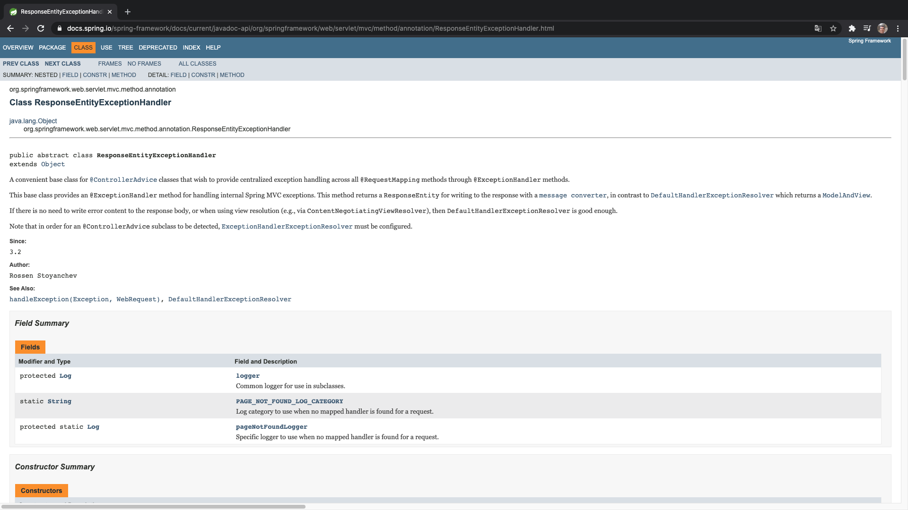

La cual tiene un monton de métodos para manejar diferentes tipos de excepciones.

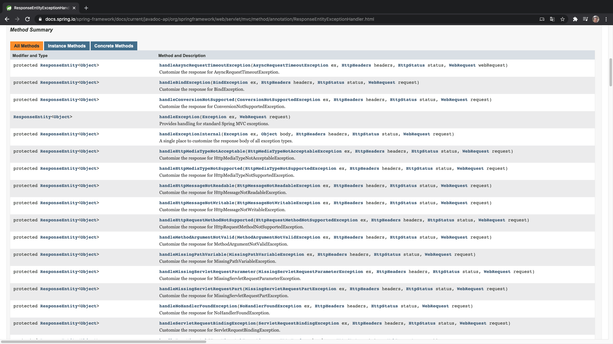

Hay un método especial que es el siguiente:


que como nos dice es un buen sitio común para customizar el tipo de respuesta de error, para cualquier excepción y es que va a ser el momento en el que vamos a poder conseguir que casi cualquier tipo de error que nos devuelva Spring en nuestro API de los que ya veníamos manejando u otros que no nos hemos planteado, como por ejemplo pedirle una conversión XML que antes no lo habíamos hecho, un mediatype no soportado, o un mensaje que no fuera elegible, algo de los que todavía ni siquiera habíamos interactuado con él, bueno pues ya todos esos mensajes se van a encausar a través de este método y ya veréis como vamos a conseguir entonces que el tratamiento de errores sea totalmente comodo.


Con `haddleExceptionInternal` lo vamos a hacer, tenemos algunos más, una serie de tratamiento de errores frecuentes o comunes que podéis ver en la documentación de la clase y que podéis customizar si es que nos hace falta, pero la customización más básica va a ser la de este método que va a incidir en el resto, porque ya digo que nos va a permitir ajustar la salida comun de todos los errores.


Que es lo que venía contando hasta ahora, vamos a hacerlo en nuestro código.

### :computer: `143-08-ControllerAdviceII`

Partiendo del proyecto anterior `143-07-ControllerAdvice` vamos a hacer una copia y lo vamos a llamar `143-08-ControllerAdviceII`

#### 01. Modificar el `pom.xml`

```html
<artifactId>143-08-ControllerAdviceII</artifactId>
<version>0.0.1-SNAPSHOT</version>
<name>143-08-ControllerAdviceII</name>
<description>Ejemplo de manejo de errores con ControllerAdvice y ResponseEntityExceptionHandler</description>
```

#### 02. Modificar la Clase `GlobalControllerAdvice`

Vamos a modificar el método `handleExceptionInternal` del `GlobalControllerAdvice`

`GlobalControllerAdvice`

```java
@Override
protected ResponseEntity<Object> handleExceptionInternal(Exception ex, Object body, HttpHeaders headers,
			HttpStatus status, WebRequest request) {
   ApiError  apiError = new ApiError(status, ex.getMessage());
   return ResponseEntity.status(status).headers(headers).body(apiError);
}
```

Observaciones de `GlobalControllerAdvice`

* Extendemos `ResponseEntityExceptionHandler`
* El método `handleJsonMappingException` ya no lo vamos a usar
* Vamos a sobreescribir el método `handleExceptionInternal` el cual recibe la excepción que se produce, el cuerpo para la respuesta, los encabezados, el estado y la petición. Podemos tomar solo lo que nos haga falta.
* Lo implementamos con nuestra clase `ApiError`, el estado lo tomamos directamente de lo que recibimos. Ya el estado de cualquiera de los otros métodos de esta clase lo tendra marcado, a lo mejor un 415 o cualquier error que no veniamos manejando hasta ahora, ya lo tenemos desde aquí tomando el `status`.
* El mensaje va a seguir siendo el de la propia excepción.
* Devolvemos un `ResponseEntity` con su respectivo `status`
* Podemos añadir para la devolución alguna cabecera que ya se nos proporciona con `headers(headers)` y que puede contener alguna información de error que desemos informar.
* Y en la devolución devolvemos dentro del cuerpo el propio ApiError con `body(apiError)`.

Si lanzamos la aplicación para probar la nueva excepción vamos a ver en que cambia, lo que se nos mostraba antes del cambio era esto:

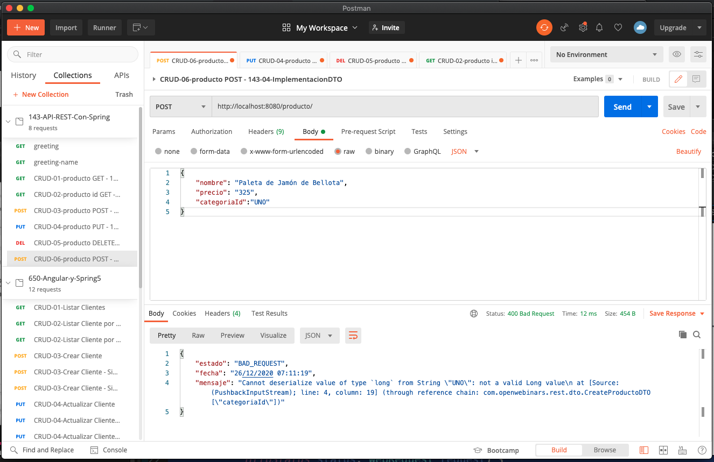

Con el cambio ahora se nos muestra esto:

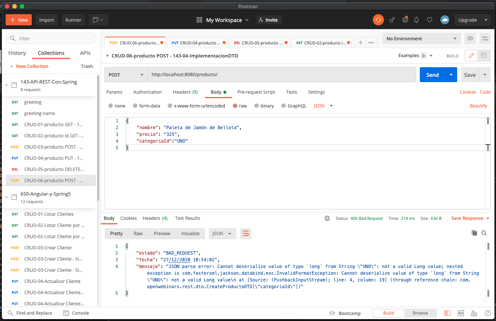

Hemos quitado el mapeo de esa excepción pero nos sigue dando el mensaje aun que es distinto por que el cause de la excepción va a ser diferente pero básicamente el error sigue consistiendo en lo mismo que "UNO" no es un número y no es capaz de formatearlo donde es necesario.

```json
{
    "estado": "BAD_REQUEST",
    "fecha": "27/12/2020 10:54:02",
    "mensaje": "JSON parse error: Cannot deserialize value of type `long` from String \"UNO\": not a valid Long value; nested exception is com.fasterxml.jackson.databind.exc.InvalidFormatException: Cannot deserialize value of type `long` from String \"UNO\": not a valid Long value\n at [Source: (PushbackInputStream); line: 4, column: 19] (through reference chain: com.openwebinars.rest.dto.CreateProductoDTO[\"categoriaId\"])"
}
```

De esta manera estamos manejando algún tipo de error como es el mapeo a Jackson desde Java o viceversa y lo estamos haciendo a través del propio mecanismo interno, esto no nos quita que las excepciones asociadas a nuestro modelo de datos como por ejemplo `handleProductoNoEncontrado(...)` la tengamos que seguir manteniendo, recojamos una excepción personalizada por nosotros y que sigamos dandole este tipo de tratamiento.

Sin embargo para los errores comunes, si no los queremos sobreescribir, también podemos sobreescribir cualquiera de los métodos de `ResponseEntityExceptionHandler` que son el tratamiento de excepciones que se producen por defecto.

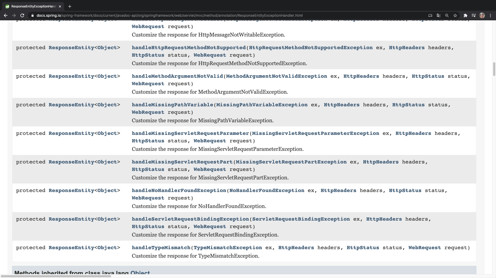

Podríamos hacer el tratamiento personalizado de cualquiera de estas excepciones, pero si no queremos hacerlo ya nos hemos dado cuenta que con el código anterior le estamos dando una especie de embudo donde salen todos por el mismo cause y utilizaría nuestra clase `ApiError` como un modelo de error bastante mas conveniente. 

Les invito a que el tratamiento que haciamos en el reto anterior lo puedan modificar ahora para ver si ese nuevo controlador de categorias junto con las excepciones que hayan podido crear se pueden ir también manejando en una clase `ControllerAdvice` que extienda `ResponseEntityExceptionHandler` y poder allí combinando los diferentes elementos que vayamos viendo durante el curso.


### :computer: Código Completo `143-08-ControllerAdviceII`

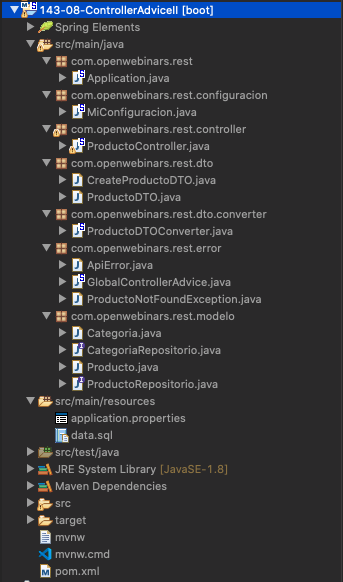

La unica clase que se modifico con respecto al proyecto anterior es `GlobalControllerAdvice` donde eliminamos un método y sobreescribimos otro.

`GlobalControllerAdvice`

```java
package com.openwebinars.rest.error;

import org.springframework.http.HttpHeaders;
import org.springframework.http.HttpStatus;
import org.springframework.http.ResponseEntity;
import org.springframework.web.bind.annotation.ExceptionHandler;
import org.springframework.web.bind.annotation.RestControllerAdvice;
import org.springframework.web.context.request.WebRequest;
import org.springframework.web.servlet.mvc.method.annotation.ResponseEntityExceptionHandler;

@RestControllerAdvice
public class GlobalControllerAdvice extends ResponseEntityExceptionHandler {
	
   @ExceptionHandler(ProductoNotFoundException.class)
   public ResponseEntity<ApiError> handleProductoNoEncontrado(ProductoNotFoundException ex) {
      ApiError apiError = new ApiError(HttpStatus.NOT_FOUND, ex.getMessage());
      return ResponseEntity.status(HttpStatus.NOT_FOUND).body(apiError);
   }
	
   @Override
   protected ResponseEntity<Object> handleExceptionInternal(Exception ex, Object body, HttpHeaders headers,
			HttpStatus status, WebRequest request) {
      ApiError  apiError = new ApiError(status, ex.getMessage());
      return ResponseEntity.status(status).headers(headers).body(apiError);
   }

}
```

En la próxima lección vamos a seguir trabajando con errores pero con un enfoque un poco diferente.

# 19 Novedades en Spring 5: ResponseStatusException 12:39 

[PDF ResponseStatusException.pdf](pdfs/18_ResponseStatusException.pdf)

## Resumen Profesor

La información sobre la clase `ResponseStatusException` la puedes encontrar aquí: https://docs.spring.io/spring-framework/docs/current/javadoc-api/org/springframework/web/server/ResponseStatusException.html.

Puede ser interesante fijarse en algunas de sus subclases:

* `MediaTypeNotSupportedStatusException`: excepción que encaja con el código de respuesta 415.
* `MethodNotAllowedException`: excepción que encaja con el código de respuesta 405.
* `NotAcceptableStatusException`: excepción que encaja con el código de respuesta 406
* `ServerErrorException`: excepción para el código 500 que expone información extra.
* `ServerWebInputException`: excepción que encaja con el código de respuesta 400 para ser usada en aplicaciones web.
* `UnsupportedMediaTypeStatusException`: excepción que encaja con el código de respuesta 415.

## Transcripción


Vamos a cerrar el bloque del tratamiento de excepciones con el manejo de errores con `ResponseStatusException`.


Alguno podrían decir, ¿oye no hemos dado un paso atrás? porque eso de `ResponseStatusException` nos recuerda a la primera lección de este bloque en la cual dabamos un tratamiento a los errores con la anotación `@ResponseStatus`, no son lo mismo pero ciertamente si podríamos decir que están relacionados y es que el modelo de errores que hemos presentado en las lecciones anteriores si es verdad que sería compatible con lo que hemos visto hasta ahora, pero vamos a tratar de poner las cosas en su sitio. 


Presentamos este esquema para el tratamiento de excepciones, el último de todo porque es el último que ha llegado a la familia de Spring de hecho si vuestro proyecto no trabaja con Spring 5 no podréir plantearos utilizarlo, tendrían que usar alguno de los elementos anteriores que vienen algunos, desde Spring 3 y pico y otros desde Spring 4, este está solo disponible desde Spring 5.

Se trata como cualquier otra excepción, de hecho tendremos que hacer un `throw new...` y sería de un tipo de excepción, sin embargo lo que pasa que nos permite indicar un *estado* obligatorio, una *razón* opcional con un `String` y un `Throwable`, la *causa* que también sería opcional.


Veámoslo en su contexto, esto sería la modificación de uno de los de los ejemplos que hemos venido haciendo hasta ahora, en el cual haríamos el tratamiento con `ResponseStatusException` ya digo que parece quedamos un pequeño paso hacia atrás pero bueno ahora podremos explicar el por qué, vemos como se lanzaría como una excepción cualquiera pasándole un código de estado y un determinado mensaje.


El manejo que nos permite esto nos permitiría integrarlo con el tratamiento del resto de excepciones, de hecho podríamos hacer un `try-catch`, incluso recoger nuestras propias excepciones definidas antes como la de `ProductoNotFoundException` y aprovechar digamos para mutar un poco la excepción y lanzar entonces una excepción de este tipo que devolvería una respuesta con un determinado código y un mensaje.


Qué ventajas tiene el uso de `ResponseStatusException`, cuando se comienza a desarrollar un API suele ser bastante cómodo porque nos permite hacer el manejo de errores con muy poco esfuerzo, si en un determinado contexto en una aplicación, un mismo tipo de excepción puede tener distintos código de respuesta dependiendo de alguna situación, con lo que veníamos haciendo hasta ahora sería un poquito complicado para tener diferentes tipos de código de estado, sin embargo aquí cómo lo podemos lanzar sobre la marcha el tratamiento es programático, podemos hacer un `throw new...` donde queramos y podríamos cambiar el código de estado con mucho más tranquilidad. Además si no queremos ir creando tantas clases de excepción, imaginemos que nuestro modelo no fuese tan sencillo como el de este ejemplo, sino que tuviera muchas más clases, por cada `Not Found` ¿vamos a ir creando una excepción personalizada?  `Producto Not Found`,  `Categoria Not Found`, `User Not Found`, posiblemente esto nos simplificaría ese manejo.


Por contra también tiene unas desventajas y es que hemos perdido la globalidad ganada con `@ControllerAdvice`, tenemos que lanzar en cada sitio la excepción para que se le dé el tratamiento y por tanto tendremos a duplicar el código y veremos cómo puede que demos un paso atrás y que el modelo volvamos a tener el del `DefaultErrorAttributes` y tengamos que hacer alguna modificación.


¿Qué conclusiones sacamos de todo esto? bueno no tenemos que casarnos con un esquema exclusivamente , podemos hacer una combinación de ambos, podemos combinar el uso de `@ControllerAdvice` o `@RestControllerAdvice` para elementos globales con `ResponseStatusException` para elementos muy peculiares, puntuales o específico, si es verdad que nos tenemos que guardar muy mucho de hacer el tratamiento de una excepción específica más de una vez con ambos tipos, no con `ResponseStatusException` y con `@ControllerAdvice`, tenemos que tener ciertamente cuidado.

### :computer: `143-09-ResponseStatusException`

Partiendo del proyecto `143-08-ControllerAdviceII` vamos a hacer una copia y vamos a llamar el proyecto como `143-09-ResponseStatusException`.

#### 01. Modificar el `pom.xml`

```html
<artifactId>143-09-ResponseStatusException</artifactId>
<version>0.0.1-SNAPSHOT</version>
<name>143-09-ResponseStatusException</name>
<description>Ejemplo de manejo de errores con ResponseStatusException</description>
```

#### 02. Eliminación de `ApiError` y `GlobalControllerAdvice`

Nosotros lo vamos a hacer un poco heavy y lo que vamos a hacer es eliminar las dos clases que veníamos construyendo en las lecciones anteriores que se encuentran en el paquete `error`, es decir eliminamos `ApiError` y `GlobalControllerAdvice` solo conservamos `ProductoNotFoundException`.

#### 03. Cambios en el Controller

Vamos a volver al controlador y vamos a hacer algunos cambios en el código, vamos a modificar el método `obtenerTodos()` que actualmente lo tenemos así:

```java
@GetMapping("/producto")
public ResponseEntity<?> obtenerTodos() {
   List<Producto> result = productoRepositorio.findAll();

   if (result.isEmpty()) {
      return ResponseEntity.notFound().build();
   } else {
      //return ResponseEntity.ok(result);
      List<ProductoDTO> dtoList = 
                          result.stream()
                                  .map(productoDTOConverter::convertToDto)
                                  .collect(Collectors.toList());
      return ResponseEntity.ok(dtoList);
   }

}
```

Y lo vamos a cambiar para que en el caso de que el resultado este vacío en lugar de devolver ese código de respuesta lo cambiamos para lanzar una excepción:

```java
@GetMapping("/producto")
public ResponseEntity<?> obtenerTodos() {
   List<Producto> result = productoRepositorio.findAll();

   if (result.isEmpty()) {
      throw new ResponseStatusException(HttpStatus.NOT_FOUND, "No hay productos registrados");
   } else {
      //return ResponseEntity.ok(result);
      List<ProductoDTO> dtoList = 
                          result.stream()
                                  .map(productoDTOConverter::convertToDto)
                                  .collect(Collectors.toList());
      return ResponseEntity.ok(dtoList);
   }

}
```

Observaciones

* en lugar de devolver ese código de respuesta lo cambiamos para lanzar una excepción `ResponseStatusException` con un `status` y un mensaje de error.

También vamos a modificar el método `obtenerUno(...)` que actualmente lo tenemos así:

```java
@GetMapping("/producto/{id}")
public Producto obtenerUno(@PathVariable Long id) {
   return productoRepositorio.findById(id)
		.orElseThrow(() -> new ProductoNotFoundException(id));
}
```

Como nos interesa mantener la excepción `ProductoNotFoundException` la encerramos en un `try-catch` para relanzarla con el estado `NOT_FOUND` y el mensaje que le corresponda. El código nos queda así:

```java
@GetMapping("/producto/{id}")
public Producto obtenerUno(@PathVariable Long id) {
   try {
      return productoRepositorio.findById(id)
		.orElseThrow(() -> new ProductoNotFoundException(id));
   } catch (ProductoNotFoundException ex) {
      throw new ResponseStatusException(HttpStatus.NOT_FOUND, ex.getMessage());
   }
}
```

Vamos a lanzar el proyecto y vamos a ver qué nos devuelve. Si buscamos el producto 34 antes teniamos esto:

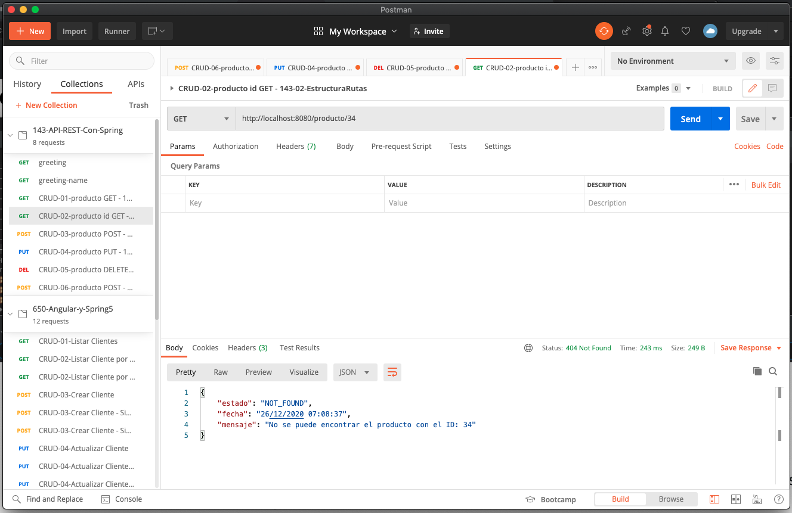

Pero con los cambios realizados ahora tendremos esto:

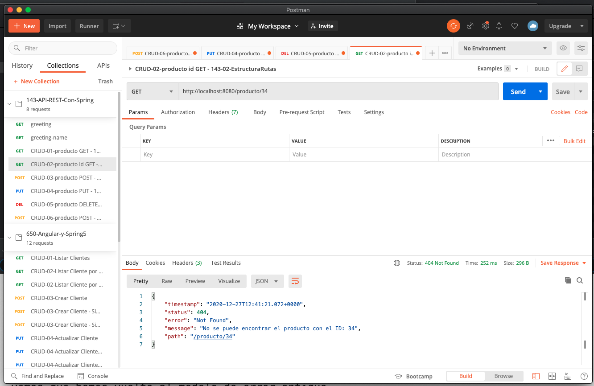

Vemos que hemos vuelto al modelo de error antiguo y eso es verdad que era previsible que nos pasará, porque volvemos a tener ese `DefaultErrorAttributes`.


¿Qué podemos hacer al respecto? podemos crear nuestros propios componentes de error, creando un componente (`@Component`) que extienda a este `DefaultErrorAttributes` y dándole un tratamiento. 

Este es un código que vamos a crear nosotros en nuestro paquete de `error`.

#### 04. Crear la clase `ApiErrorAttributes`

`ApiErrorAttributes`

```java
@Component
public class ApiErrorAttributes extends DefaultErrorAttributes {

@Override
public Map<String, Object> getErrorAttributes(WebRequest webRequest, boolean includeStackTrace) {
   
   Map<String, Object> allErrorAttributes = super.getErrorAttributes(webRequest, includeStackTrace);
   Map<String, Object> errorAttributes = new HashMap<>();
   int statusCode = (int) allErrorAttributes.get("status");
   errorAttributes.put("estado", HttpStatus.valueOf(statusCode));
   errorAttributes.put("fecha", LocalDateTime.now().format(DateTimeFormatter.ofPattern("dd/MM/yyyy HH:mm:ss")));

   String mensaje = "";
		
   Throwable throwable = getError(webRequest);
		
   if (throwable instanceof ResponseStatusException) {
      ResponseStatusException responseStatusException = (ResponseStatusException) throwable;
      mensaje = responseStatusException.getReason() == null ? "" : responseStatusException.getReason(); 
   } else {
      if (throwable.getCause() != null)
         mensaje = throwable.getCause().getMessage() == null ? throwable.getCause().toString() 
							     : throwable.getCause().getMessage();
      else
         mensaje = throwable.toString();
      }
		
      errorAttributes.put("mensaje", mensaje);
		
      return errorAttributes;
   }

}
```

Observaciones de `ApiErrorAttributes`

* Como es un componente lo anotamos con `@Component`
* Extiende a `DefaultErrorAttributes`
* Sobreescribimos el método `getErrorAttributes` el cual retorna un `Map`
   * Disfrazamos un poco nuestra salida de error para que se parezca a lo que veniamos teniendo en nuestro ApiError.
   * Retorna un `Map` por que esto se puede montar en una versión Web
   * El `Map` es transformado a un Jackson con la clave y el Objeto
   * Obtenemos todos los errores
   * Obtenemos el `statusCode`
   * Establecemos el `status` y la `fecha`
   * Dependiendo del tipo de error de clase que nos venga armamos un `mensaje`
   * Retornamos el `Map` armado.
   
Si ejecutamos el proyecto la salida se vuelve a parecer a lo que veniamos teniendo hasta ajora.

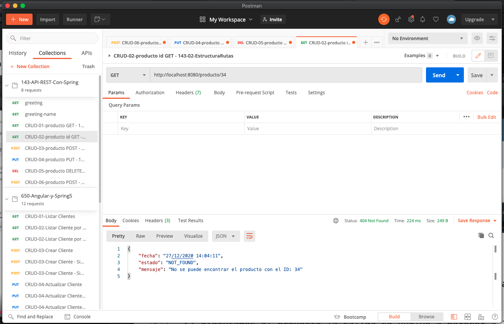

Para lo que tuvimos que modificar el `DefaultErrorAttributes`

### :computer: Código Completo `143-09-ResponseStatusException`

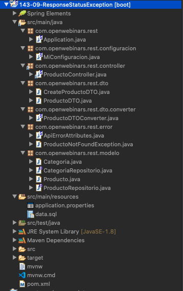

Vamos a listar solo las clases modificadas.

`ProductoController`

```java
package com.openwebinars.rest.controller;

import java.util.List;
import java.util.stream.Collectors;

import org.springframework.http.HttpStatus;
import org.springframework.http.ResponseEntity;
import org.springframework.web.bind.annotation.DeleteMapping;
import org.springframework.web.bind.annotation.GetMapping;
import org.springframework.web.bind.annotation.PathVariable;
import org.springframework.web.bind.annotation.PostMapping;
import org.springframework.web.bind.annotation.PutMapping;
import org.springframework.web.bind.annotation.RequestBody;
import org.springframework.web.bind.annotation.RestController;
import org.springframework.web.server.ResponseStatusException;

import com.openwebinars.rest.dto.CreateProductoDTO;
import com.openwebinars.rest.dto.ProductoDTO;
import com.openwebinars.rest.dto.converter.ProductoDTOConverter;
import com.openwebinars.rest.error.ProductoNotFoundException;
import com.openwebinars.rest.modelo.Categoria;
import com.openwebinars.rest.modelo.CategoriaRepositorio;
import com.openwebinars.rest.modelo.Producto;
import com.openwebinars.rest.modelo.ProductoRepositorio;

import lombok.RequiredArgsConstructor;

@RestController
@RequiredArgsConstructor
public class ProductoController {

   private final ProductoRepositorio productoRepositorio;
   private final ProductoDTOConverter productoDTOConverter;
   private final CategoriaRepositorio categoriaRepositorio;

   /**
    * Obtenemos todos los productos
    * 
    * @return 404 si no hay productos, 200 y lista de productos si hay uno o más
    */
   @GetMapping("/producto")
   public ResponseEntity<?> obtenerTodos() {
      List<Producto> result = productoRepositorio.findAll();

      if (result.isEmpty()) {
         throw new ResponseStatusException(HttpStatus.NOT_FOUND, "No hay productos registrados");
      } else {
         //return ResponseEntity.ok(result);
         List<ProductoDTO> dtoList = 
               result.stream()
                        .map(productoDTOConverter::convertToDto)
                        .collect(Collectors.toList());
         return ResponseEntity.ok(dtoList);
      }

   }

   /**
    * Obtenemos un producto en base a su ID
    * 
    * @param id
    * @return 404 si no encuentra el producto, 200 y el producto si lo encuentra
    */
   @GetMapping("/producto/{id}")
   public Producto obtenerUno(@PathVariable Long id) {
      try {
         return productoRepositorio.findById(id)
                  .orElseThrow(() -> new ProductoNotFoundException(id));
      } catch (ProductoNotFoundException ex) {
         throw new ResponseStatusException(HttpStatus.NOT_FOUND, ex.getMessage());
      }
   }

   /**
    * Insertamos un nuevo producto
    * 
    * @param nuevo
    * @return 201 y el producto insertado
    */
   @PostMapping("/producto")
   public ResponseEntity<?> nuevoProducto(@RequestBody CreateProductoDTO nuevo) {
      // En este caso, para contrastar, lo hacemos manualmente
		
      // Este código sería más propio de un servicio. Lo implementamos aquí
      // por no hacer más complejo el ejercicio.
      Producto nuevoProducto = new Producto();
      nuevoProducto.setNombre(nuevo.getNombre());
      nuevoProducto.setPrecio(nuevo.getPrecio());
		
      //Rescatamos la categoría para poder asignarla
      Categoria categoria = categoriaRepositorio.findById(nuevo.getCategoriaId()).orElse(null);
      nuevoProducto.setCategoria(categoria);
		
      //salvar y devolver
      return ResponseEntity.status(HttpStatus.CREATED).body(productoRepositorio.save(nuevoProducto));
		
   }

   /**
    * 
    * @param editar
    * @param id
    * @return 200 Ok si la edición tiene éxito, 404 si no se encuentra el producto
    */
   @PutMapping("/producto/{id}")
   public Producto editarProducto(@RequestBody Producto editar, @PathVariable Long id) {

      return productoRepositorio.findById(id).map(p -> {
			p.setNombre(editar.getNombre());
			p.setPrecio(editar.getPrecio());
			return productoRepositorio.save(p);
      }).orElseThrow(() -> new ProductoNotFoundException(id));
   }

   /**
    * Borra un producto del catálogo en base a su id
    * 
    * @param id
    * @return Código 204 sin contenido
    */
   @DeleteMapping("/producto/{id}")
   public ResponseEntity<?> borrarProducto(@PathVariable Long id) {
      Producto producto = productoRepositorio.findById(id)
				.orElseThrow(() -> new ProductoNotFoundException(id));
		
      productoRepositorio.delete(producto);
      return ResponseEntity.noContent().build();
   }

}
```

`ApiErrorAttributes`

```java
package com.openwebinars.rest.error;

import java.time.LocalDateTime;
import java.time.format.DateTimeFormatter;
import java.util.HashMap;
import java.util.Map;

import org.springframework.boot.web.servlet.error.DefaultErrorAttributes;
import org.springframework.http.HttpStatus;
import org.springframework.stereotype.Component;
import org.springframework.web.context.request.WebRequest;
import org.springframework.web.server.ResponseStatusException;

@Component
public class ApiErrorAttributes extends DefaultErrorAttributes {

   @Override
   public Map<String, Object> getErrorAttributes(WebRequest webRequest, boolean includeStackTrace) {
      Map<String, Object> allErrorAttributes = super.getErrorAttributes(webRequest, includeStackTrace);

      Map<String, Object> errorAttributes = new HashMap<>();
      int statusCode = (int) allErrorAttributes.get("status");
      errorAttributes.put("estado", HttpStatus.valueOf(statusCode));
      errorAttributes.put("fecha", LocalDateTime.now().format(DateTimeFormatter.ofPattern("dd/MM/yyyy HH:mm:ss")));

      String mensaje = "";
		
      Throwable throwable = getError(webRequest);
		
      if (throwable instanceof ResponseStatusException) {
         ResponseStatusException responseStatusException = (ResponseStatusException) throwable;
         mensaje = responseStatusException.getReason() == null ? "" : responseStatusException.getReason(); 
      } else {
         if (throwable.getCause() != null)
            mensaje = throwable.getCause().getMessage() == null ? throwable.getCause().toString() 
	                                                        : throwable.getCause().getMessage();
         else
            mensaje = throwable.toString();
      }
		
      errorAttributes.put("mensaje", mensaje);
		
      return errorAttributes;
   }

}
```

Se Eliminarón las clases `ApiError` y `GlobalControllerAdvice`


Cómo reto os propongo extenderé este tipo de manejo de error al resto de métodos del controlador y que podáis hacer una comparativa entre el uso del tratamiento global y de este tipo de tratamiento. Os recomiendo poder utilizarlo sobre todo cuando estoy empezando un API nueva, si está definida sobre Spring 5 si es nueva debería estarlo siempre y que podáis hacer el manejo de errores rápido hasta que podáis refactorizar dicho código y a lo mejor hacer un tratamiento más global.

También podéis jugar con los posibles campos de error si queréis meter alguno más, si queréis anidar un objeto dentro de otro, no tendréis más que como parte de este código del tratamiento de errores, ver como se mapea un String y un Object, lo que podríamos hacer es que el Object, si quisiéramos anidar un objeto dentro de otro, este Object fuera otro más y entonces tendríamos un objeto anidado dentro, por si queréis hacer un modelo de error que fuese algo más complejo.

Esto lo propongo como reto, para cerrar también este bloque en el que hemos venido trabajando con los errores y las excepciones de nuestra API REST con Spring boot.

# Contenido adicional 6

* [PDF Manejo_básico_de_errores.pdf](pdfs/13_Manejo_básico_de_errores.pdf)
* [PDF Modelo_de_respuesta_para_un_error.pdf](pdfs/14_Modelo_de_respuesta_para_un_error.pdf)
* [PDF ExceptionHandler.pdf](pdfs/15_ExceptionHandler.pdf)
* [PDF ControllerAdvice.pdf](pdfs/16_ControllerAdvice.pdf)
* [PDF Controller_Advice_II.pdf](pdfs/17_Controller_Advice_II.pdf)
* [PDF ResponseStatusException.pdf](pdfs/18_ResponseStatusException.pdf)
