# 4. Manejo de CORS 19m

* 20 ¿Qué es CORS y por qué me va a dar problemas? 6:28 
* 21 ¿Cómo habilitar a nivel de método? 4:51 
* 22 Configuración CORS global 8:22 
* Contenido adicional 3

# 20 ¿Qué es CORS y por qué me va a dar problemas? 6:28

[PDF 19_Qué_es_CORS.pdf](pdfs/19_Qué_es_CORS.pdf)

## Resumen Profesor

Si quieres saber más sobre CORS, puedes visitar la documentación (en castellano) de desarrolladores de Mozila (MDN web docs) en https://developer.mozilla.org/es/docs/Web/HTTP/Access_control_CORS.

## Transcripción


Vamos a comenzar un nuevo bloque en el que vamos a hacer tratamiento de un mecanismo de seguridad que se llama **CORS**, en principio será algo que nos va a dar problema, entonces vamos a ver que es CORS y qué problemas nos va a dar y cómo podemos hacer el tratamiento.

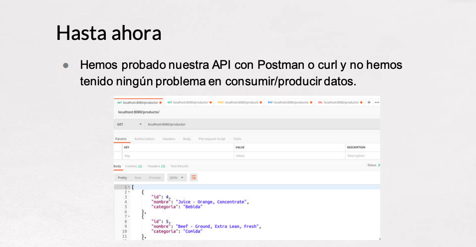

Hasta ahora hemos probado nuestra API con Postman o hicimos una prueba al principio con CURL y no hemos tenido ningún problema a la hora de consumir o producir datos, hemos pedido los productos nos los ha devuelto, hemos pedido uno y lo ha devuelto, le hemos pasado un producto y lo hemos podido crear, lo hemos podido modificar, lo hemos podido borrar y hasta ahora no hemos tenido problemas.

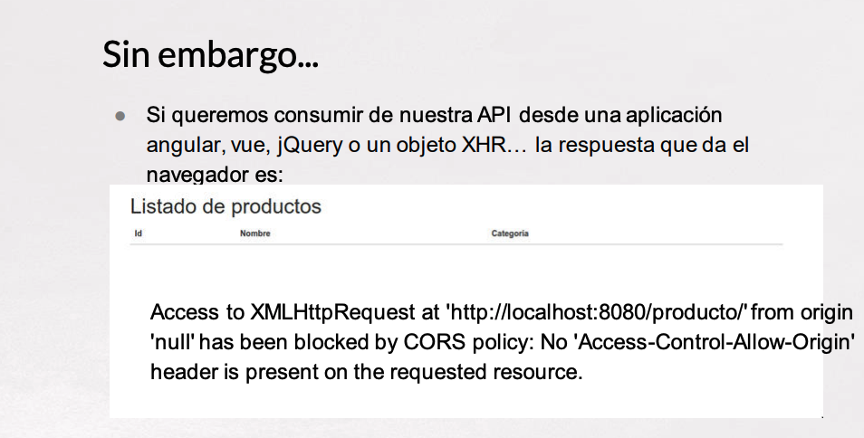

Sin embargo si queremos consumir nuestra API por ejemplo desde una aplicación Angular, JQuery, con JavaScript directamente a través de un objeto XHR, la respuesta del navegador va a ser distinta.

Vamos a hacer una prueba en directo.

### :computer: `143-10-ProblemasCORS`

Vamos a hacer una copia del proyecto `143-09-ResponseStatusException` y lo llamaremos `143-10-ProblemasCORS` es un proyecto exactamente igual, solo cambiamos el `pom.xml` para que tenga el nuevo nombre pero ningún cambio más.

#### 01. Modificar el `pom.xml`

```html
<artifactId>143-10-ProblemasCORS</artifactId>
<version>0.0.1-SNAPSHOT</version>
<name>143-10-ProblemasCORS</name>
<description>Ejemplo de problema provocado por la no configuración de CORS</description>
```

Este proyecto es nuestro BACK, necesitamos tener la aplicación Cliente.

### :computer: `143-10-ProblemasCORSCliente`

Vamos a descargar del repositorio del curso el proyecto `19_ProblemasCORSCliente` y lo copiamos con el nombre `143-10-ProblemasCORSCliente`. Su estructura es la siguiente:

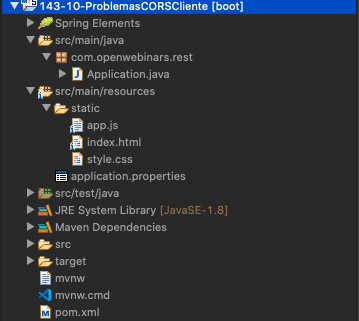

Vamos a poner todo el código de este proyecto.

`pom.xml`

```html
<?xml version="1.0" encoding="UTF-8"?>
<project xmlns="http://maven.apache.org/POM/4.0.0"
	xmlns:xsi="http://www.w3.org/2001/XMLSchema-instance"
	xsi:schemaLocation="http://maven.apache.org/POM/4.0.0 https://maven.apache.org/xsd/maven-4.0.0.xsd">
   <modelVersion>4.0.0</modelVersion>
   <parent>
      <groupId>org.springframework.boot</groupId>
      <artifactId>spring-boot-starter-parent</artifactId>
      <version>2.1.8.RELEASE</version>
      <relativePath /> <!-- lookup parent from repository -->
   </parent>
   <groupId>com.openwebinars.rest</groupId>
   <artifactId>143-10-ProblemasCORSCliente</artifactId>
   <version>0.0.1-SNAPSHOT</version>
   <name>143-10-ProblemasCORSCliente</name>
   <description>Ejemplo de problema provocado por la no configuración de CORS </description>

   <properties>
      <java.version>1.8</java.version>
   </properties>

   <dependencies>
      <dependency>
         <groupId>org.springframework.boot</groupId>
         <artifactId>spring-boot-starter-data-jpa</artifactId>
      </dependency>
      <dependency>
         <groupId>org.springframework.boot</groupId>
         <artifactId>spring-boot-starter-web</artifactId>
      </dependency>

      <dependency>
         <groupId>com.h2database</groupId>
         <artifactId>h2</artifactId>
         <scope>runtime</scope>
      </dependency>
      <dependency>
         <groupId>org.projectlombok</groupId>
         <artifactId>lombok</artifactId>
         <optional>true</optional>
      </dependency>
      <dependency>
         <groupId>org.springframework.boot</groupId>
         <artifactId>spring-boot-starter-test</artifactId>
         <scope>test</scope>
      </dependency>
      <dependency>
         <groupId>org.modelmapper</groupId>
         <artifactId>modelmapper</artifactId>
         <version>2.3.5</version>
      </dependency>
   </dependencies>

   <build>
      <plugins>
         <plugin>
            <groupId>org.springframework.boot</groupId>
            <artifactId>spring-boot-maven-plugin</artifactId>
         </plugin>
      </plugins>
   </build>

</project>
```

`application.properties`

```html
server.port=9001
```

`index.html`

```html
<!DOCTYPE html>
<html lang="en">
<head>
   <meta charset="utf-8">
   <meta http-equiv="X-UA-Compatible" content="IE=edge">
   <meta name="viewport" content="width=device-width, initial-scale=1">
   <meta name="description" content="">
   <meta name="author" content="">

   <title>Ejemplo de AJAX</title>

   <!-- Bootstrap core CSS -->
   <!-- Latest compiled and minified CSS -->
   <link rel="stylesheet"
   	href="https://maxcdn.bootstrapcdn.com/bootstrap/3.3.7/css/bootstrap.min.css" />
   <!-- Custom styles for this template -->
   <link href="style.css" rel="stylesheet" />
</head>
<body>
   <div class="container">
      <h1>Listado de productos</h1>		

      <div id="productos">
         <table class="table table-hover">
            <thead>
               <tr>
                  <th>Id</th>
                  <th>Nombre</th>
                  <th>Categoría</th>
               </tr>
            </thead>
            <tbody id="productos-table-body">
				
            </tbody>
         </table>
      </div>
   </div>
   <!-- /container -->

   <!-- Bootstrap core JavaScript
    ================================================== -->
   <!-- Placed at the end of the document so the pages load faster -->
   <script src="https://ajax.googleapis.com/ajax/libs/jquery/1.12.4/jquery.min.js"></script>
   <script src="https://maxcdn.bootstrapcdn.com/bootstrap/3.3.7/js/bootstrap.min.js"></script>
   <script src="app.js"></script>
</body>
</html>
```

`style.css`

```css
body {
   padding-top: 20px;
   padding-bottom: 20px;
}

.navbar {
   margin-bottom: 20px;
}
```

`app.js`

```js
$(document).ready(function(){
	
   $.ajax({
      url: 'http://localhost:8080/producto/',
      type: 'GET',
      success: function(data) {
         var html = "";
         $.each(data, function(index, value){
            html += '<tr>';
            html += '<td>'+ value.id+'</td>';
            html += '<td>'+ value.nombre+'</td>';
            html += '<td>'+ value.categoria+'</td>';
            html += '</tr>';
         });
         $("#productos-table-body").append(html);
		   },
		error: function(error) {
			console.log("Error: " + error);
		}
	});
	
});
```

`Application`

```java
package com.openwebinars.rest;

import org.springframework.boot.SpringApplication;
import org.springframework.boot.autoconfigure.SpringBootApplication;

@SpringBootApplication
public class Application {

   public static void main(String[] args) {
      SpringApplication.run(Application.class, args);
   }

}
```

Vamos a ejecutar la aplicación más bien las dos aplicaciones por un lado el API con la que veníamos trabajando hasta ahora y la otra una especie de aplicación cliente, aun que también sería una aplicación web. La aplicación cliente se va a ejecutar en el puerto 9001 y que sería una interfaz de usuario, un listado de los productos. 

Podríamos venir al navegador y cargar la URL `http://localhost:9001/` con el siguiente resultado:

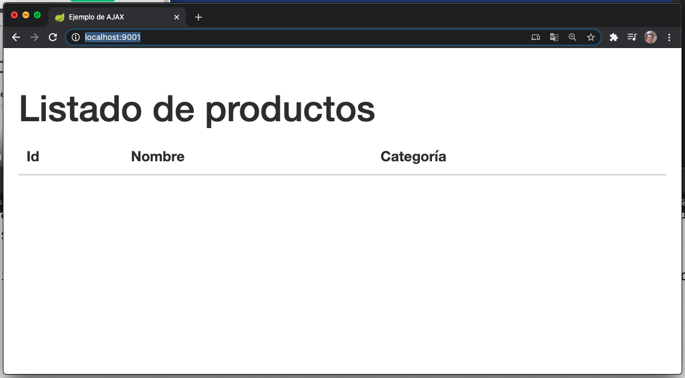

¿Y donde estan nuestros productos?

Si inspeccionamos en la consola podemos ver que se ha producido un error:

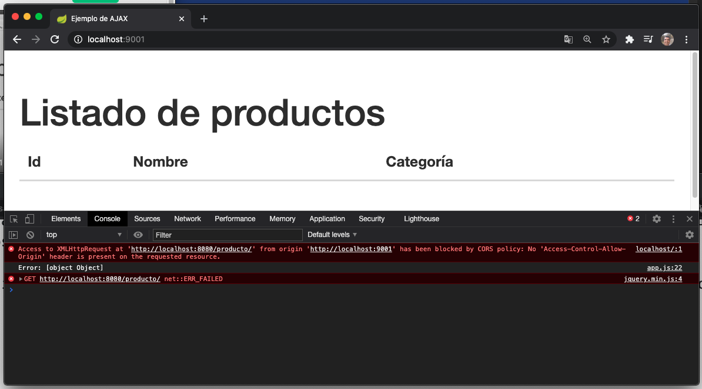

```sh
Access to XMLHttpRequest at 'http://localhost:8080/producto/' from origin 'http://localhost:9001' has been blocked by CORS policy: No 'Access-Control-Allow-Origin' header is present on the requested resource.
```
y que no permite que desde el origen `http://localhost:9001/` se haga una petición a `http://localhost:8080/producto/` no se detecta un determinado encabezado,  ¿y esto qué significa? estamos teniendo una dificultad a la hora de poder acceder.


¿Qué es lo que hemos hecho mal? para que nuestra API que venía funcionando con mucha alegría, ahora cuando de verdad queremos programar un cliente nos esté bloqueando por un problema. 

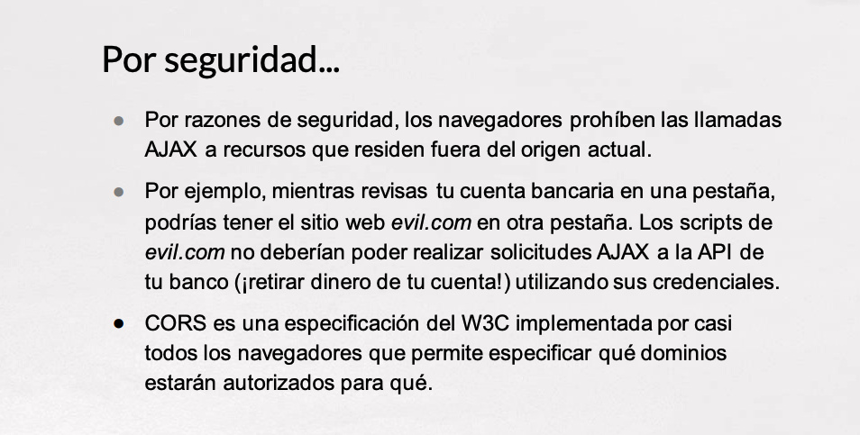

Por seguridad los navegadores prohíben las llamadas Ajax a recursos fuera del origen actual, ¿Por qué? bueno pues pongámonos en situación, supongamos que nosotros estamos con el navegador y varias pestañas abiertas, una de las pestañas que tenemos abiertas es nuestro banco online que estamos haciendo para hacer algún tipo de transacción y en otra pestaña sin querer tenemos abierto un sitio que tiene código malicioso llamémoslo ***evil.com***, los script de este sitio malicioso, si no existiera este bloqueo podrían acceder a otra pestaña del navegador, porque a través de JavaScript se podría y realizar algún tipo de solicitud AJAX podrían escanear los bancos más usuales, algún tipo de transacción y hacer solicitudes AJAXs a la API del banco para hacer que digo yo una transferencia, eso es peligroso, bueno pues esto no debería de poder hacerse, quién dice la transferencia de dinero podría ser simplemente de datos que en ocasiones puede ser tan o más dañina, entonces no debería poder hacerse ese tipo de peticiones porque si estamos logeados en el banco con nuestras credenciales a lo mejor si no está bien protegido el sitio del banco lo podría hacer. Bueno pues CORS lo prohíbe.

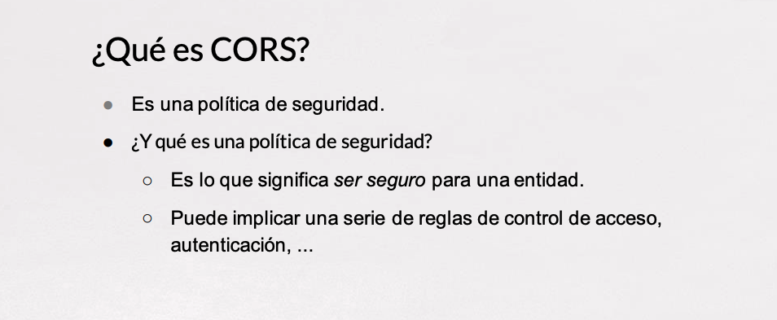

CORS es una especificación del Consorcio W3C que está implementada prácticamente en la totalidad de los navegadores y que permite especificar qué dominios podrán acceder a un determinado servidor, en nuestro caso a nuestra API REST  y para que estarán autorizados, para qué tipo de peticiones estarán autorizados, por tanto podemos decir que ***CORS es una política de seguridad** es decir una forma de entender que es ser seguro para unas determinadas entidades.

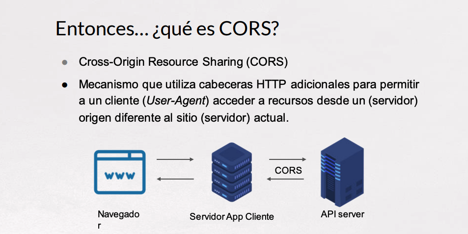

Veamoslo en un gráfico **CORS** significa ***Cross-Origin Resource Sharing*** en el que vamos a delimitar cómo se va a hacer el intercambio, el compartir los recursos entre distintos orígenes y este gráfico refleja la situación que hemos tenido antes, tenemos un servidor, tenemos otro servidor, en este caso la aplicación cliente se ha ejecutado en el contexto de otro servidor Tomcat que teníamos dentro del proyecto, el servidor de la App Cliente ha hecho una petición al servidor de la API y CORS lo ha bloqueado porque es un origen no permitido, todo ello nosotros lo hemos visto en nuestro navegador.

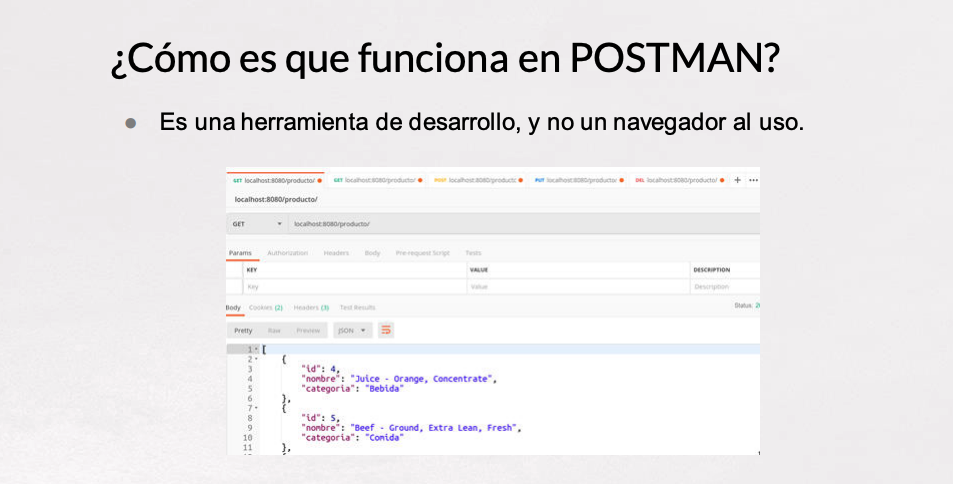

Postman sí que funciona porque es una herramienta de desarrollo y no un navegador al uso y entonces sí que utiliza algún tipo de mecanismo para que funcione, pero realmente ya digo que nuestro problema de CORS sigue ahí, si no lo sabemos manejar.

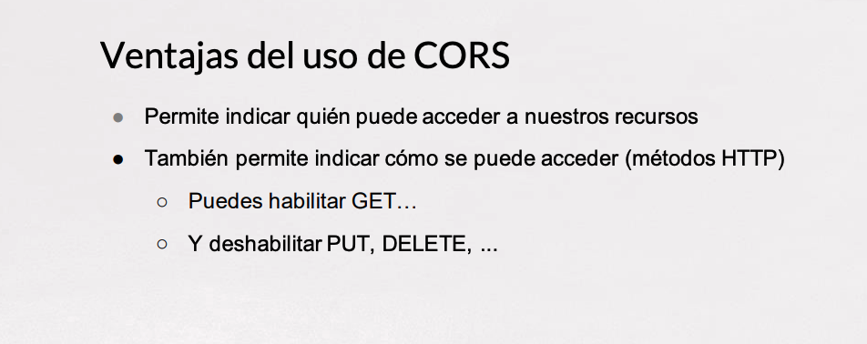

No es un problema realmente es una ventaja permite que nosotros protejamos nuestra API y permitamos indicar que orígenes sí que van a poder acceder a nuestros recursos, también nos permite segmentar qué tipo de métodos, de verbos, de HTTP, por ejemplo podríamos decir que cualquier origen pudiera hacer un GET, pero no el resto de verbos, podríamos decir que un origen si pudiera hacer un GET y POST pero no un PUT y DELETE y  deshabilitarlos, así que francamente sería bastante útil.

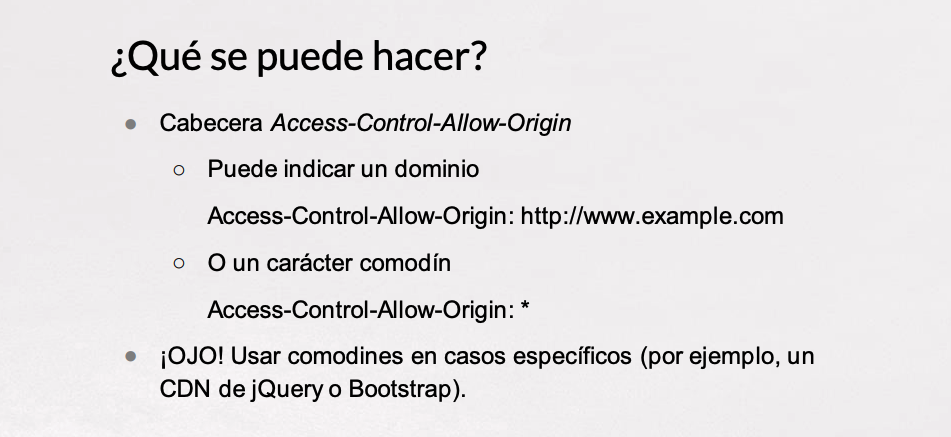

Toda esta cuestión de CORS veréis que se va a manejar al final a través de una serie de encabezados como `Access-Control-Allow-Origin` dónde se puede indicar el dominio, en carácter comodín, ojo con usar los comodines en casos específicos como los CDN. 

Hay una serie de encabezados más que vamos a ver en alguna de las lecciones próximas y que se utilizan con esto de CORS.


En las próximas lecciones vamos a ver cómo Spring nos permite gestionar esto de CORS, permitir determinados orígenes para que nuestras aplicaciones cliente pueden consumir desde nuestra API y lo podamos hacer con garantías.

# 21 ¿Cómo habilitar a nivel de método? 4:51 

[PDF CORS_mediante_anotación_CrossOrigin.pdf](pdfs/20_CORS_mediante_anotación_CrossOrigin.pdf)

## Resumen Profesor

La información sobre la anotación @CrossOrigin la puedes encontrar aquí: https://docs.spring.io/spring-framework/docs/5.2.0.RELEASE/javadoc-api/org/springframework/web/bind/annotation/CrossOrigin.html

## Transcripción

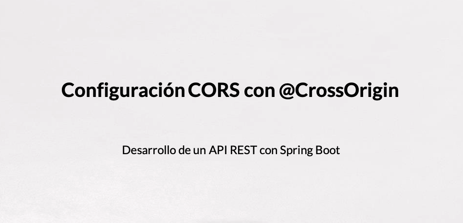

Vamos a seguir hablando de CORS y vamos a ver cómo podemos configurar CORS en nuestro servidor, en nuestra API REST con la anotación `@CrossOrigin`.

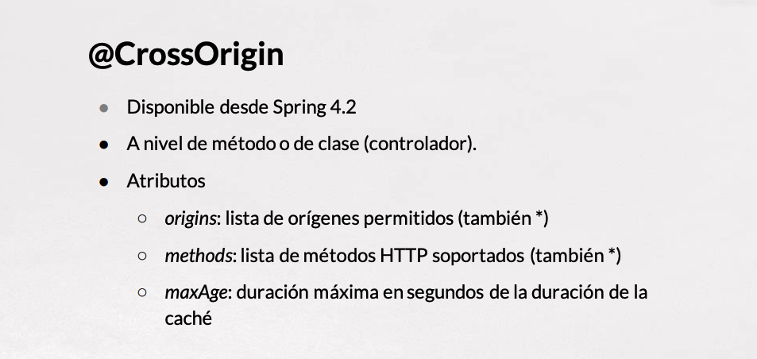

`@CrossOrigin` está disponible desde la versión 4.2 de Spring y la podemos utilizar a nivel de método o a nivel de una clase controladora. Tiene una serie de atributos como pueden ser:

* `origins` donde nos permite utilizar o bien un asterisco (`*`) para indicar cualquier origen, no sería una práctica excesivamente adecuada, o una lista de orígenes que serían permitidos.

* `methods` por si quisiéramos segmentar qué métodos se van a poder soportar, imaginemos a nivel de una clase controladora podríamos decir que aplicará para un determinado origen, para las peticiones tipo GET y POST y a lo mejor luego a nivel de métodos podríamos permitirle otro tipo de PUT o DELETE a algún sitio en particular.

* `maxAge` también el atributo `maxAge` la duración máxima en segundos de la caché, también lo podríamos indicar.

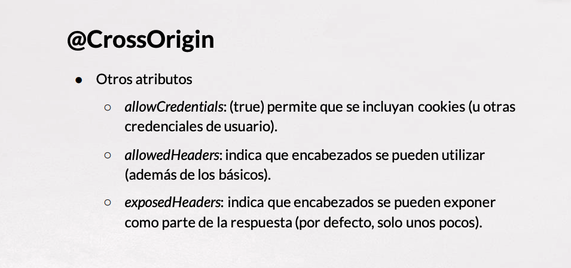

Tiene otra serie de atributos como:

* `allowCredentials`
* `allowHeaders`
* `exposedHeaders`

que también tienen que ver con todo esto de CORS y que os dejo que investiguen un poco por su cuenta, habla de Cookies, de encabezados que se pueden exponer, que no, que encabezados si nos permitiría un determinado origen enviar, cuales no, nos vamos a entrar mucho en esa parte nos vamos a centrar en ver el código.

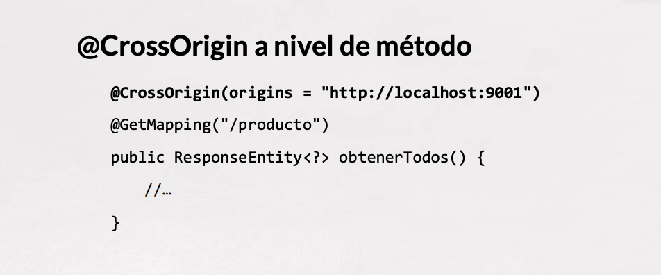

Esto nos permitiría tener un código así el que pudiéramos revisar CORS a nivel de un método en particular del GET del producto, para que el proyecto como el que teníamos antes si pudiera hacer un tipo de petición GET sobre este método. 


Vamos a ver cómo sería a nivel de clase, lo podremos tener igual y fijado como podríamos indicar también los métodos para este mismo origen que solamente se pudieran hacer peticiones GET o POST.

### :computer: `143-11-CORSMetodo`

Vamos a copiar el proyecto `143-10-ProblemasCORS` y los renombraremos como `143-11-CORSMetodo`. Realmente solo vamos a añadir una línea en el Controller. 

En el proyecto `143-11-CORSMetodo` cambiamos el `pom.xml`

`pom.xml`

```html
<artifactId>143-11-CORSMetodo</artifactId>
<version>0.0.1-SNAPSHOT</version>
<name>143-11-CORSMetodo</name>
<description>Ejemplo de manejo de CORS a nivel de método</description>
```

**NOTA** ***Para que obtuviera la misma salida tuve que hacer ajustes en las clases `ProductoDTO` y 
`ProductoDTOConverter` que no se a partir de que proyecto cambiaron, Abría que revisar donde se cambio***

`ProductoDTO`

```java
package com.openwebinars.rest.dto;

import lombok.Getter;
import lombok.Setter;

@Getter @Setter
public class ProductoDTO {
	
   private long id;
   private String nombre;
   private String categoria;

}
```

`ProductoDTOConverter`

```java
package com.openwebinars.rest.dto.converter;

import javax.annotation.PostConstruct;

import org.modelmapper.ModelMapper;
import org.modelmapper.PropertyMap;
import org.springframework.stereotype.Component;

import com.openwebinars.rest.dto.ProductoDTO;
import com.openwebinars.rest.modelo.Producto;

import lombok.RequiredArgsConstructor;

@Component
@RequiredArgsConstructor
public class ProductoDTOConverter {
	
   private final ModelMapper modelMapper;
	
   @PostConstruct
   public void init() {
      modelMapper.addMappings(new PropertyMap<Producto, ProductoDTO>() {

         @Override
         protected void configure() {
            map().setCategoria(source.getCategoria().getNombre());
         }
      });
   }
	
   public ProductoDTO convertToDto(Producto producto) {
      return modelMapper.map(producto,  ProductoDTO.class);
   }
}
```

Y en el controlador solo añadimos la línea `@CrossOrigin(origins = "http://localhost:9001")` al método `obtenerTodos()`.

```java
@CrossOrigin(origins = "http://localhost:9001")
@GetMapping("/producto")
public ResponseEntity<?> obtenerTodos() {
   ...
```

Como Cliente vamos a seguir usando `143-10-ProblemasCORSCliente`.

Vamos a lanzar ambas aplicaciones y ver los resultados y tenemos como salida lo siguiente:

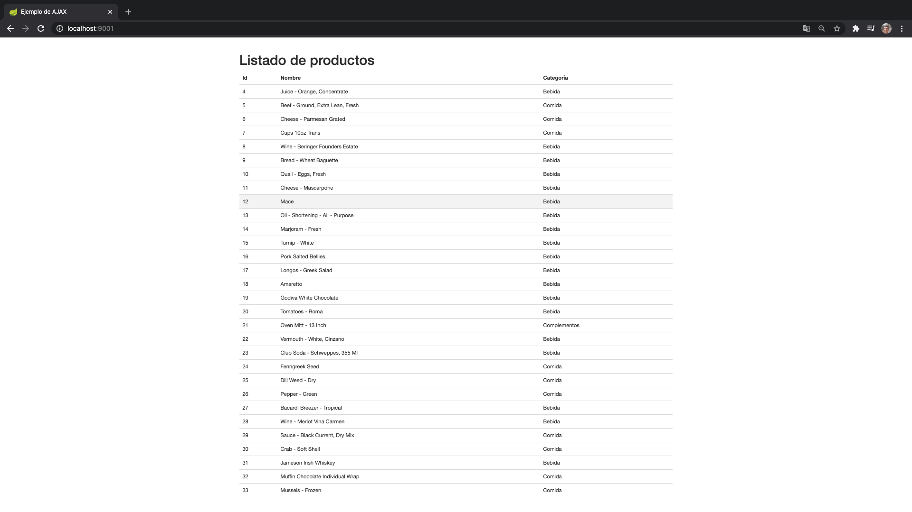

Nos aparece nuestro listado de productos porque se ha hecho la petición AJAX a la URL `http://localhost:8080/producto/`, se ha traído todo el Jackson, ha montado la tabla HTML y nos lo está pintando.

Cómo podéis comprobar esta sola anotación `@CrossOrigin(origins = "http://localhost:9001")` ha marcado la diferencia para permitir al origen `9001` el hecho de que se pudiera hacer la petición.

Si paramos el cliente y nos viniéramos a cambiar el puerto sobre el que se ejecuta teniendo el servidor todavía ejecutándose, cambiamos para que el cliente se ejecute en el puerto `9002` en `application.properties`

```html
server.port=9002
```

y volvemos a ejecutar el cliente vamos a tener:

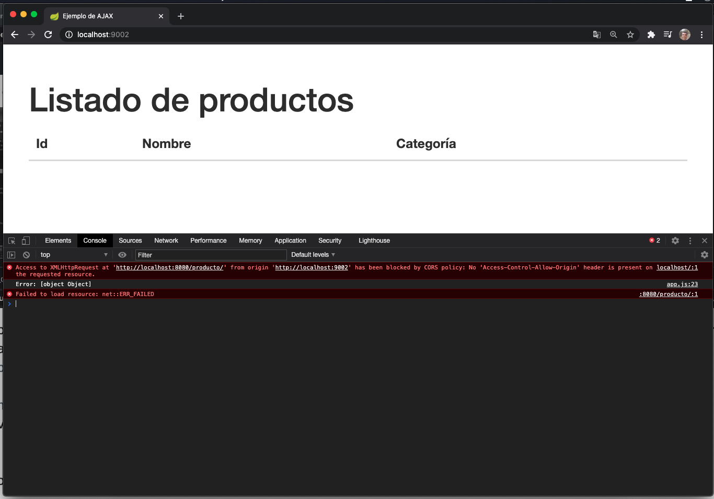

Ahora nosotros hiciéramos la petición desde `http://localhost:9002/` y CORS vuelve a bloquear ya que no es un origen que esté permitido y entonces no podríamos hacer la petición.

### :computer: Código Completo `143-11-CORSMetodo`

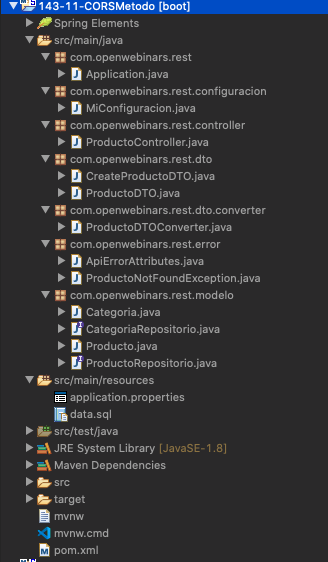

Solo se añadio la linea `@CrossOrigin(origins = "http://localhost:9001")` en el Controller.
 
Esta es un sencillo tratamiento de CORS a nivel de método de clase, vamos a ver en la siguiente lección cómo podemos hacer un tratamiento global que nos va a permitir, para diferentes controladores aplicar una política común.

# 22 Configuración CORS global 8:22 

[PDF Configuración_CORS_Global.pdf](pdfs/21_Configuración_CORS_Global.pdf)

## Resumen Profesor

No existe.

## Transcripción

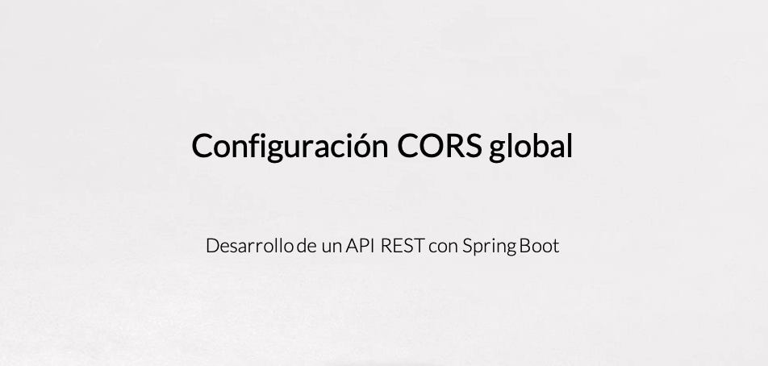

Vamos a seguir hablando de CORS y en este caso vamos a hacer una configuración global.

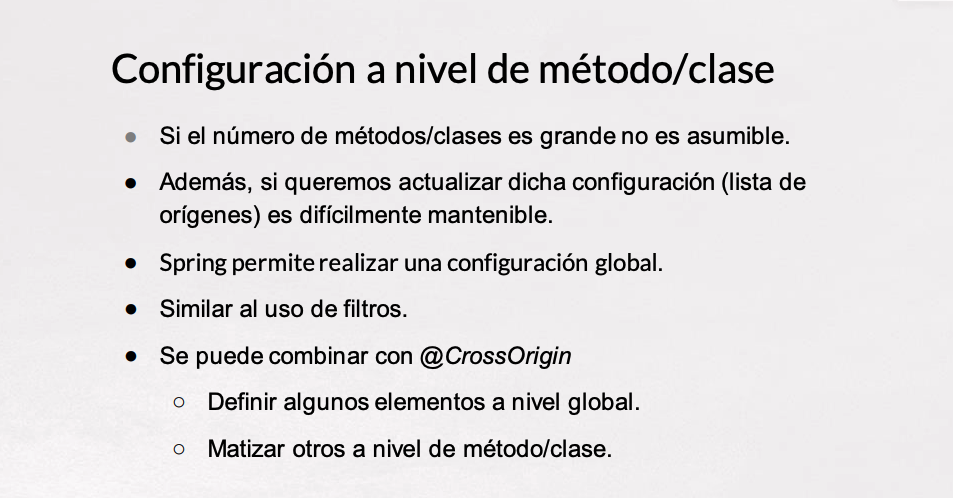

La configuración a nivel de clase o método es asumible si el número de métodos o clases no es muy grande y si empieza a crecer se empieza a volver un poco inmanejable, imaginemse por cada método de cada controlador, si tenemos decenas de controladores, decenas de métodos en cada uno, múltiples peticiones, acordarnos de ir poniendo la anotación, no sería asumible. 

Si queremos actualizar la configuración y añadir un nuevo origen porque además de la aplicación Angular tenemos una aplicación Android, tampoco sería demasiado interesante, quién dice una aplicación en lugar de Android podría ser de otro servidor o que nuestra API pudiera servir para APIs de terceros, si tuviéramos la lista de orígenes sería difícilmente mantenible. 

Spring nos permite realizar una configuración global para todos los controladores que es similar al uso de filtros, que funcionará básicamente cómo si fuera un filtro, esto no nos obliga a descartar `@CrossOrigin`  podemos definir elemento a nivel global y matizarlo a nivel local con la anotación `@CrossOrigin` tanto a nivel de método o a nivel de clase. 

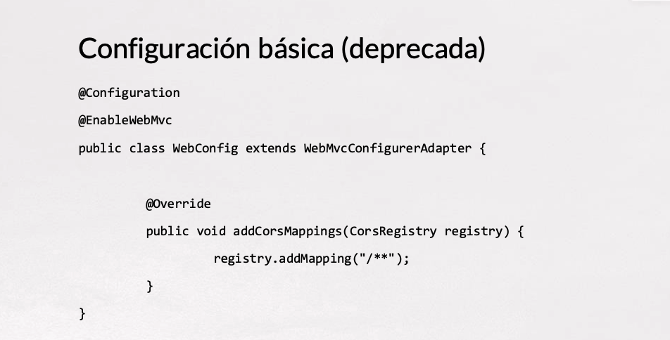

Una configuración básica que está algo deprecada sería como en esta clase, tendríamos un método `addCorsMappings` y le daría tarifa plana a todo (`"/**"`) pero la configuración básica utilizando Spring Boot sería más recomendable de esta manera que tenemos por aquí. A diferencia del uso de la clase `WebMvcConfigurerAdapter()` podríamos devolver un `WebMvcConfigurer` como un Bean configurando CORS y esto sería una configuración que quizá nos valdría al inicio del desarrollo en el que nuestra API esta todavía desplegada en algún tipo de servidor ciertamente local y que le daremos acceso a cualquiera.

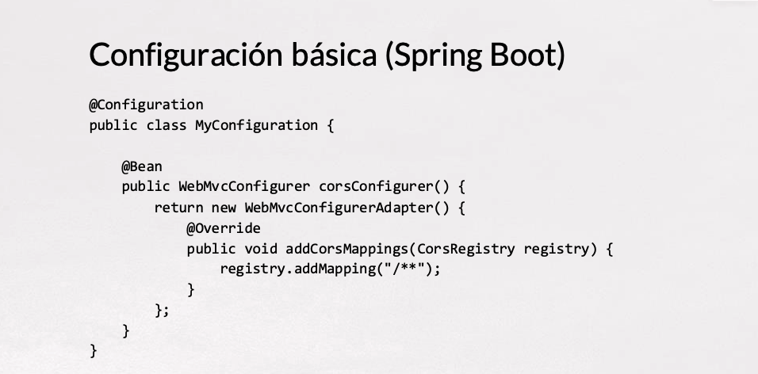

Una configuración más ajustada si que nos invitaría a que restringieramos determinada ruta, para permitir determinados orígenes, solamente determinados métodos, quizá con una caché que dure un cierto tiempo y que nos permita segmentar muy bien y proteger muy bien toda nuestra API.

Vamos a aprobar a alguno de estos códigos.

### :computer: `143-12-CORSGlobal`

Vamos a coger el proyecto `143-11-CORSMetodo` y vamos a hacer una copia que llamaremos `143-12-CORSGlobal`.

#### 01. Modificar el `pom.xml`

```html
<artifactId>143-12-CORSGlobal</artifactId>
<version>0.0.1-SNAPSHOT</version>
<name>143-12-CORSGlobal</name>
<description>Ejemplo de solución CORS global</description>
```

#### 02. Modificar la Clase `MiConfiguracion`

Esta clase anotada con `@Configuration` que nos permite lanzar Beans podemos crear un nuevo método, vamos a empezar con una configuración más laxa que permita acceder a más gente, vamos a llamar al método `corsConfigurer`.

```java
/**
 * Configuración más básica. Por defecto se permite
 * - Todos los orígnenes
 * - Métodos GET, HEAD, POST
 * 
 */
@Bean
public WebMvcConfigurer corsConfigurer() {
   return new WebMvcConfigurer() {

      @Override
      public void addCorsMappings(CorsRegistry registry) {
         registry.addMapping("/**");
      }
			
   };
}
```

Observaciones del método `corsConfigurer`

* Anotado con `@Bean`
* Devuelve un Bean del tipo `WebMvcConfigurer`
* Como es una Interfaz lo creamos así.
* Sobreescribimos el método `addCorsMappings` en el que hacemos una configuración más global.

Vamos a ejecutar la aplicación y nuestro Cliente en el puerto 9001.

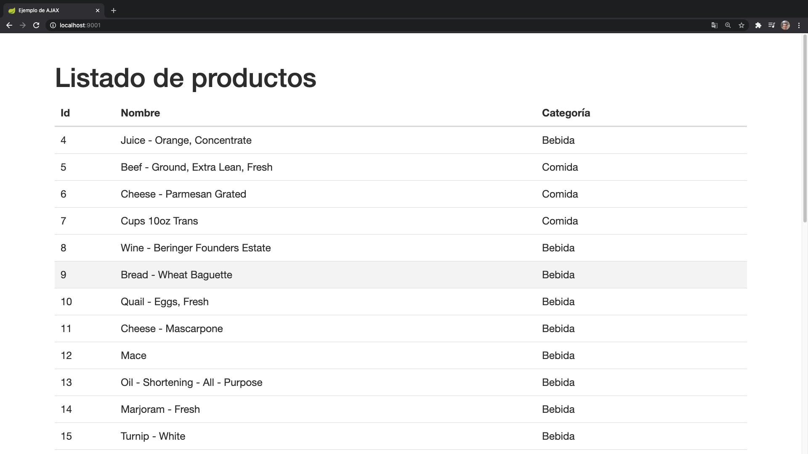

Nos permite hacer la petición `http://localhost:9001/` por que hemos hecho una configuración un poco más laxa y nos permitiria hacer peticiones de cualquier tipo.

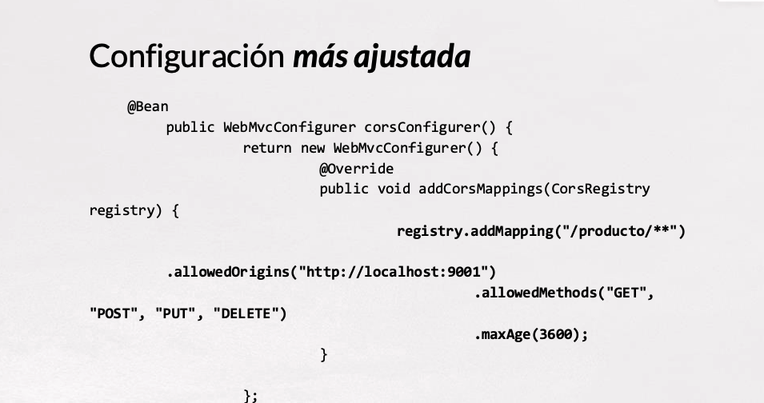

Sin embargo si nos regresamos al código y queremos hacer una configuración más ajustada vamos a tener:

```java
/**
 * Configuración más ajustada.
 */
@Bean
public WebMvcConfigurer corsConfigurer() {
   return new WebMvcConfigurer() {

      @Override
      public void addCorsMappings(CorsRegistry registry) {
                  registry.addMapping("/producto/**")
                        .allowedOrigins("http://localhost:9001")
                        .allowedMethods("GET", "POST", "PUT", "DELETE")
                        .maxAge(3600);
      }		
   };
}
```

Observaciones del método `corsConfigurer` más ajustado.

* Solo permitimos la ruta de Producto y no de Categorias.
* Solo permitimos el origen `http://localhost:9001`, normalmente aquí van dominios.
* Podemos limitar a los métodos que deseemos `"GET", "POST", "PUT", "DELETE"`, Angular podría usar alguno más como `OPTIONS`.
* Asignamos valor para `maxAge`.

Vamos a volver a probar la aplicación con estas modificaciones,


El listado lo seguimos pudiendo recuperar sin ningún tipo de problema. Pero si cambiamos el Cliente al puerto 9002 tendremos.

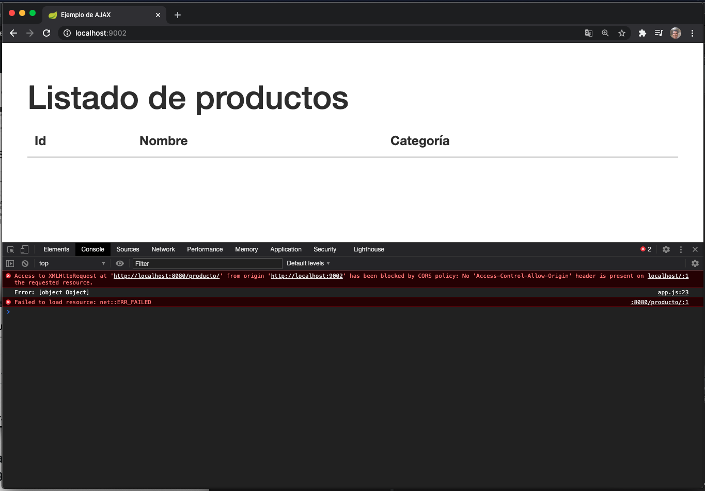

El problema de que no es un origen permitido por lo cual no nos deja hacer la petición desde `http://localhost:9002`, de esta manera bloqueamos a un origen que no sea permitido y si daríamos acceso a uno que si con una politica un poco más global.

### :computer: código Completo `143-12-CORSGlobal`


La clase que se modifico es `MiConfiguracion`

`MiConfiguracion`

```java
package com.openwebinars.rest.configuracion;

import org.modelmapper.ModelMapper;
import org.springframework.context.annotation.Bean;
import org.springframework.context.annotation.Configuration;
import org.springframework.web.servlet.config.annotation.CorsRegistry;
import org.springframework.web.servlet.config.annotation.WebMvcConfigurer;

@Configuration
public class MiConfiguracion {
	
   @Bean
   public ModelMapper modelMapper() {
      return new ModelMapper();
   }
	
   /**
    * Configuración más básica. Por defecto se permite
    * - Todos los orígnenes
    * - Métodos GET, HEAD, POST
    * 
    */
	
//	@Bean
//	public WebMvcConfigurer corsConfigurer() {
//		return new WebMvcConfigurer() {
//
//			@Override
//			public void addCorsMappings(CorsRegistry registry) {
//				registry.addMapping("/**");
//			}
//			
//		};
//	}
	
   /**
    * Configuración más ajustada.
    */
   @Bean
   public WebMvcConfigurer corsConfigurer() {
      return new WebMvcConfigurer() {

         @Override
         public void addCorsMappings(CorsRegistry registry) {
            registry.addMapping("/producto/**")
                     .allowedOrigins("http://localhost:9001")
                     .allowedMethods("GET", "POST", "PUT", "DELETE")
                     .maxAge(3600);
            }
			
      };
   }

}
```

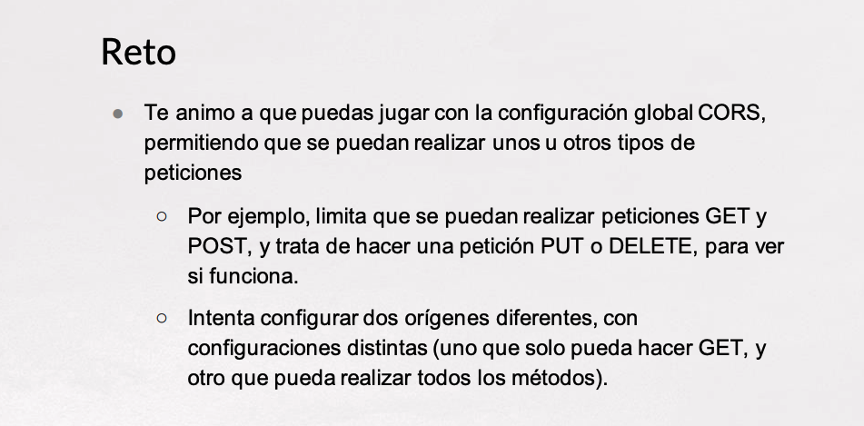

Como reto les animo a que jueguen un poco con la configuración global de CORS permitiendo una URL si y otra no, podemos añadir dos origenes 9001 y 9002 y ejecutar dos clientes diferentes en cada puerto verificar que lo permita, pueden limitar el tipo de peticiones que todos puedan hacer GET pero solo alguno de ellos pueda hacer POST y así ver como la configuración de CORS va funcionando de la manera más adecuada posible.

Hasta aquí este bloque de CORS, en el bloque siguiente vamos a seguir trabajando con nuestro API REST añadiendole nuevas funcionalidades.

# Contenido adicional 3

* [PDF 19_Qué_es_CORS.pdf](pdfs/19_Qué_es_CORS.pdf)
* [PDF CORS_mediante_anotación_CrossOrigin.pdf](pdfs/20_CORS_mediante_anotación_CrossOrigin.pdf)
* [PDF Configuración_CORS_Global.pdf](pdfs/21_Configuración_CORS_Global.pdf)
