# 5. Subida de ficheros 31m

* 23 Servicio de subida 8:07 
* 24 Implementación de la subida de ficheros 17:45 
* 25 Uso del servicio 5:13 
* Contenido adicional 3

# 23 Servicio de subida 8:07

[PDF Servicio_de_subida_de_ficheros.pdf](pdfs/22_Servicio_de_subida_de_ficheros.pdf)

## Resumen Profesor

El código en el que nos hemos basado para implementar este ejemplo es una guía oficial de Spring: https://spring.io/guides/gs/uploading-files/.

## Transcripción
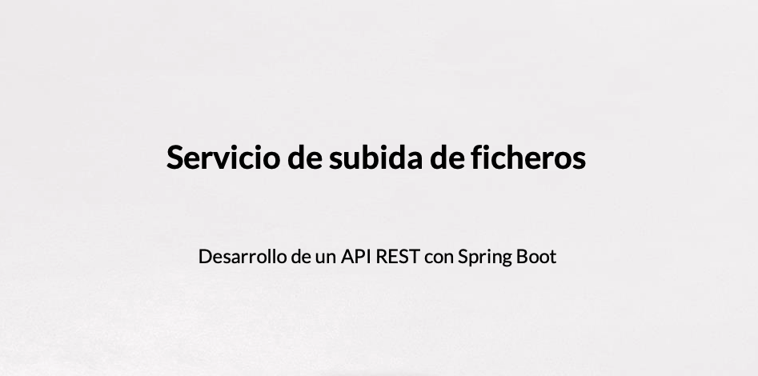

Vamos a continuar con nuestro curso de desarrollo de un API REST con Spring Boots y vamos a abrir un nuevo bloque en el que vamos a poder implementar la subida de ficheros a nuestro API REST.

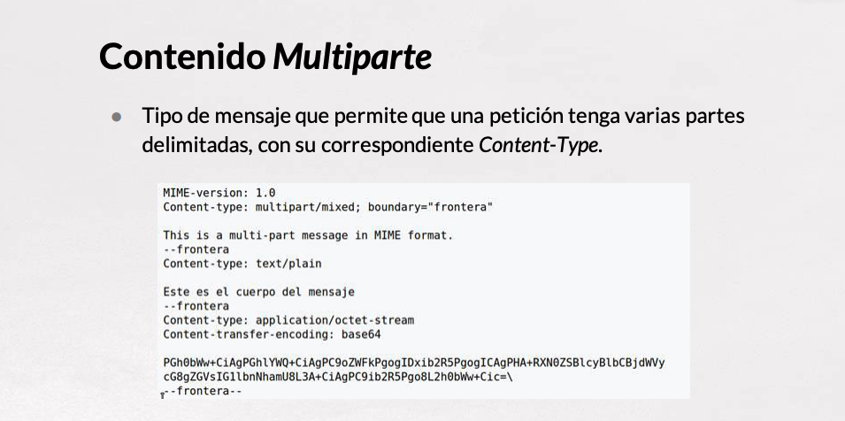

Vamos a implementar un servicio de subida de ficheros, tenemos que comenzar hablando entonces, en el marco del protocolo HTTP de las peticiones o ***Contenido Multiparte***, hasta ahora todos los mensajes que hemos hecho eran mensajes que en su cuerpo tenían un bloque, un monolito, una sola parte aunque fuesen diferentes campos, diferentes tipos de atributos, si queremos enviar diferentes tipo de contenido, contenido con diferente ***Content-Type*** deberíamos implementarlo a través de contenidos Multiparte, en realidad es otro tipo de contenido, el Multiparte, que nos permite definir en el cuerpo de una petición diferentes partes cada una de ellas con su Content-Type delimitada por una frontera y que nos permitiría enviar texto plano, nos permitiría enviar por ejemplo un fichero, más texto plano, otro fichero, otro tipo de tipo MIME una imagen, lo podríamos mezclar todo y dentro del cuerpo se irían estableciendo diferentes partes cada una delimitada por sus fronteras.

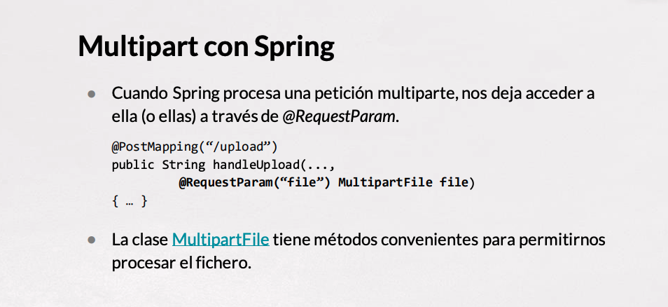

Spring nos permite implementar Multipart a través de dos anotaciones en este caso hablaremos con `@RequestParam` se podría hacer también con `@RequestPart` y nos va a permitir con `@RequestParam` y la clase `MultipartFile` el poder recibir, que nos inyecte en un método del controlador, en ese `MultipartFile` un fichero que hayamos subido desde una determinada petición.

Vamos a ver [la documentación de `MultipartFile`](https://docs.spring.io/spring-framework/docs/current/javadoc-api/org/springframework/web/multipart/MultipartFile.html)

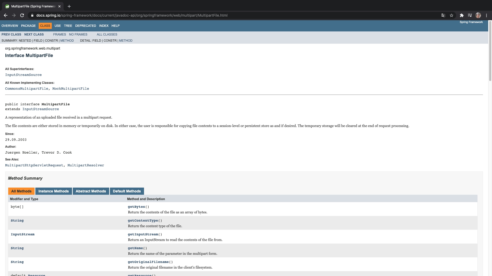

Podemos ver qué es un fichero por ahora que esta en un sitio temporal y que nos debemos encargar de copiarlo en un sitio persistente o alla donde necesitemos, quizá también en otro sitio temporal y que nos permite acceder por diferentes vías al fichero y algunos de sus metadatos y de esta manera nosotros podremos recoger ese fichero y almacenarlo en un sitio conveniente.

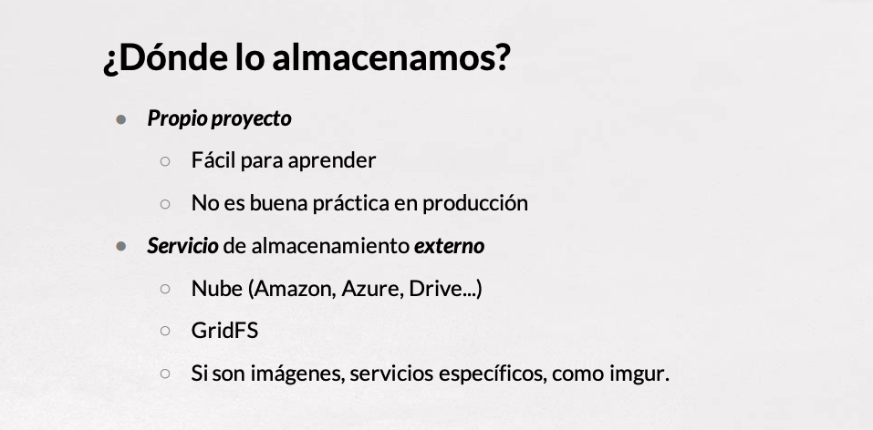

¿Dónde lo almacenamos? bueno pues en el propio proyecto como haremos nosotros ahora es fácil para aprender, para poder separarnos de otro elemento cómo sería subirlo a un servicio externo, en una aplicación en producción sería lo ideal el tener algún tipo de nube ***Amazon***, ***Azure***, ***Drive*** a algún tipo de almacenamiento por ejemplo ***MongoDB*** tiene el ***GridFS*** si son solamente imágenes podríamos tener algún paquete contratado con ***Imgur*** o alguno de estos servidores de subida de imágenes que a través de su API nos permitirían rebotar la subida y guardarla allí, nosotros como nos vamos a centrar en la parte de los controladores lo haremos en el propio proyecto y lo haremos a partir de un ejemplo que Spring ofrece en su web.

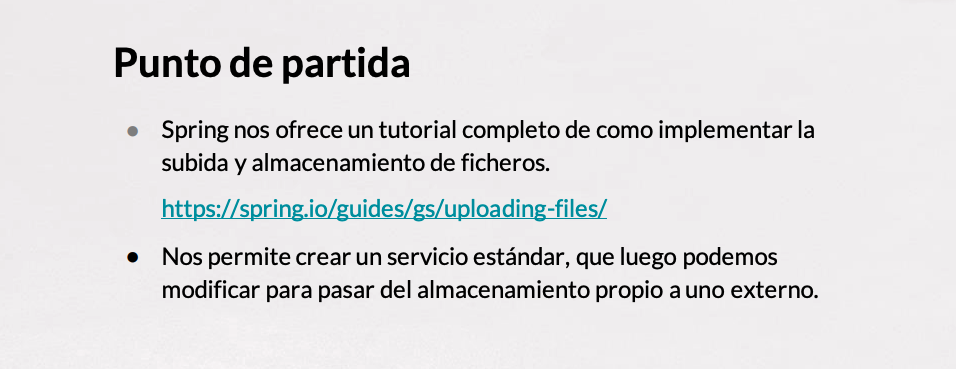

Aquí tenéis el enlace de la guía https://spring.io/guides/gs/uploading-files/, los que vengáis de haber hecho también alguno de los cursos de Spring o Thymeleaf lo habréis encontrado por allí, porque es la misma implementación que vamos siguiendo y por lo menos lo que es la parte del servicio de implementacion la podríamos seguir a partir del código que nos ofrece este ejemplo, en el que tenemos un controlador dónde se suben los distintos ficheros y tendríamos una interfaz de almacenamiento de ficheros, esto nos va a permitir el que utilicemos ahora mismo un almacenamiento en el sistema de ficheros, mañana lo podemos cambiar por otro servicio que implemente estos mismos métodos pero lo haga quizás la nube o en otro tipo de almacenamiento y lo podamos subir. Vamos a ir analizando el código que vamos a utilizar en la lección siguiente.

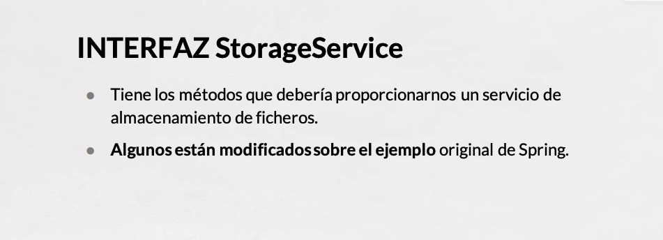

Por lo pronto tenemos la interfaz `StorageService` que nos permite definir el contrato de un servicio de almacenamiento. Quizas sobre el ejemplo podemos hacer alguna modificación.

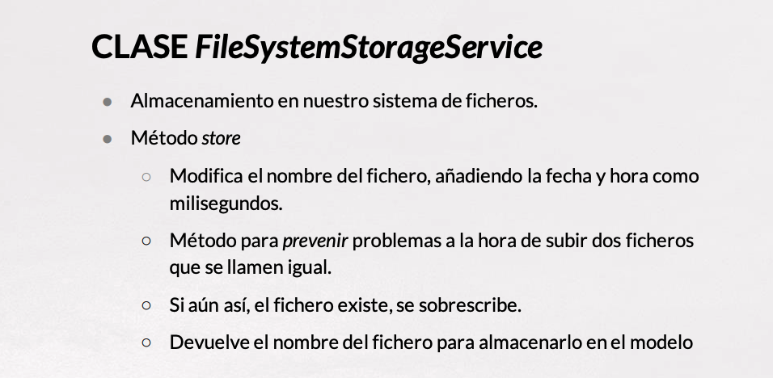

La implementación que haremos en el sistema de fichero nos obligara hacer un método de almacenamiento, en el cual lo que vamos a hacer es modificar el nombre del fichero que se nos suba, imaginar lo peculiar que sería que subiéramos un segundo fichero que se llame igual que el primero y machaque aquello en el servidor, lo deberíamos contemplar, cantidad de fotos que se suben en cualquier red social y que se llamen igual, por coincidencia en el tiempo en una red social global a nivel mundial con millones de usuarios seguro que hay dos IMG y un montón de numeritos, posiblemente coincidiera, no estaría bien que la foto de un usuario machacara la de otro, bueno pues lo sobreescribiremos, como en el nuestro ejemplo tenemos una previsión de un uso un poco menor le añadiremos solamente a ese nombre de fichero la fecha y hora como milisegundo para poder implementarlo. Este método ya digo que nos previene de problemas a la hora de subir dos ficheros que se llamen igual, si aún así ya coincidiera eso ya queda fuera del alcance de este curso, se podría definir algún otro tipo de mecanismo, podría comprobar, añadir una extensión 2, 3, algunos números, no vamos a entrar tampoco en hilar tan fino. Lo que haría este método es devolver el nombre del fichero, la ruta, para poder almacenarlo en el modelo.

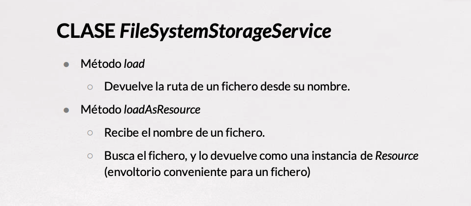

Tendremos más métodos como el método de carga de un fichero (`load`) que devuelve la ruta de un fichero a partir de su nombre, cargar como un recurso (`loadAsResource`) que lo que hará será a través de la ruta de un fichero lo devuelve como una instancia de `Resource` qué es un envoltorio conveniente que noslo ofrece Spring para que después podamos devolver este fichero.


Tendremos también el mecanismo de error con las clases `StorageException` y `StorageFileNotFoundException` para ver si hay algún error a la hora de acceder al fichero, que no lo localicemos etc. 

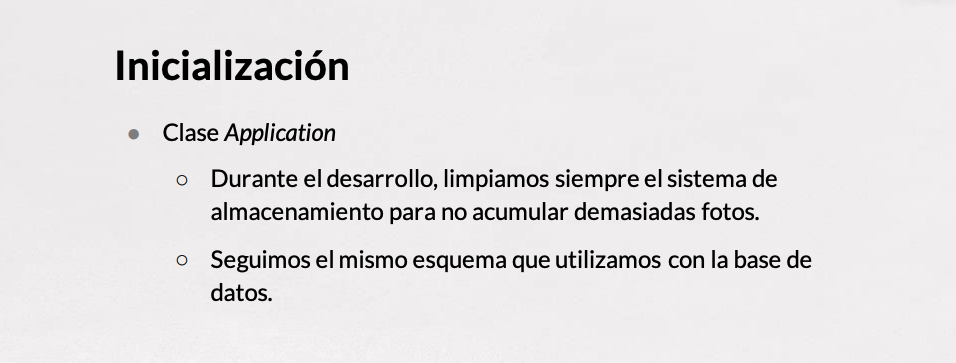

Tendremos una inicializacion en la clase `Application`, hasta ahora hemos venido desarrollando y al igual que hemos utilizado un esquema de `Create-Drop` en nuestra base de datos en el cual se va borrando cuando paramos el proyecto y se vuelve a crear al principio del proyecto, que bueno que durante el desarrollo es quizá, sobre todo a principio de los primeros estadios un buen esquema en el que no nos centramos en que hay algún problema en la base de dato para ir solventando y lo dejamos para más adelante, pues vamos a también a añadir el código que inicializa el sistema de ficheros y cada vez que empecemos limpiaremos el directorio de ficheros subido anteriormente.

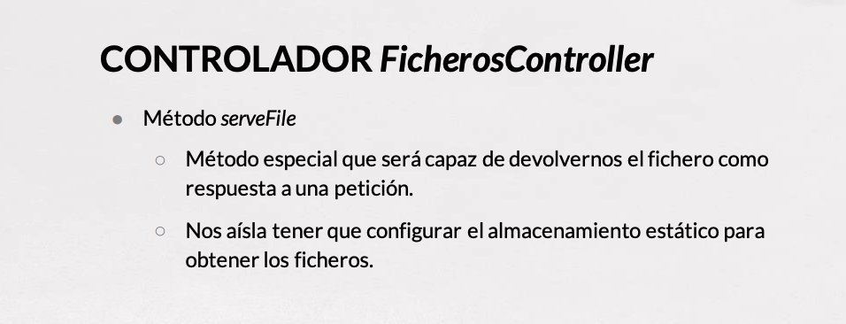

Por último tendremos un controlador específico que será el que se encargue de atender a la petición de obtener un fichero y devolverlo, este un controlador que de alguna manera encapsula el lugar en el que tenemos almacenados los ficheros, tendremos una interfaz común que será, simularemos que todos nuestros ficheros están en un determinado directorio jugando con que la URL se parece a un sistema de carpetas, pero realmente lo tendremos en un directorio un poco diferente y veremos como así hacemos peticiones GET a esa URL y podemos tenerlos diferentes ficheros.


Este código de base nos lo encontraremos en el siguiente ejemplo en el cual añadiremos los elementos que estrictamente nos hacen falta para que nuestra API REST poder incorporar la subida de ficheros y poder hacer el almacenamiento en local y guardar la ruta en nuestro Modelo para que cuando tengamos nuestro modelo nos devuelva la ruta del fichero que acabamos de subir, eso lo haremos en la próxima lección.

# 24 Implementación de la subida de ficheros 17:45 

[PDF Implementación_de_la_subida_de_ficheros.pdf](pdfs/23_Implementación_de_la_subida_de_ficheros.pdf)

## Resumen Profesor

No existe.

## Transcripción

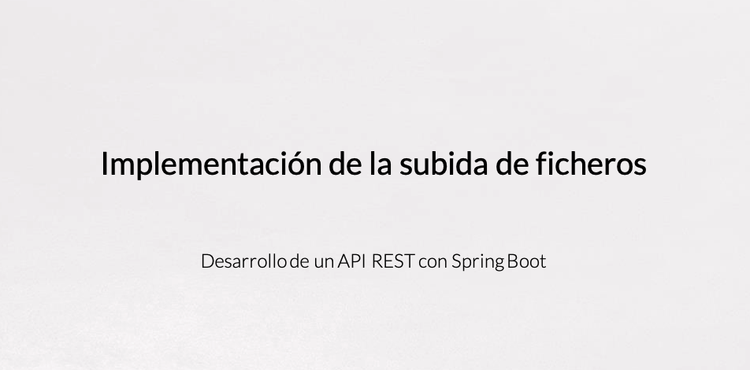

Vamos a implementar entonces ya que lo hemos explicado en la lección anterior cómo sería la subida de ficheros en nuestra API REST.

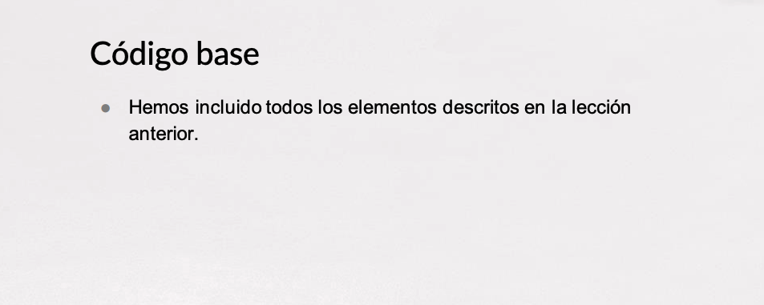


### :computer: `143-13-Upload` Subida de Ficheros

Vamos a partir del proyecto base del repositorio del curso `23_UploadBase` y haremos una copia con el nombre `143-13-Upload`, la estructura base de la cual partimos es la siguiente:

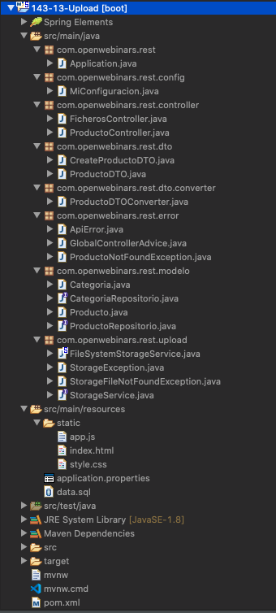

#### 01. Modificar el `pom.xml`

```html
<artifactId>143-13-Upload</artifactId>
<version>0.0.1-SNAPSHOT</version>
<name>143-13-Upload</name>
<description>Ejemplo de subida de ficheros</description>
```

#### PAQUETE `upload`

Todo el código Base que comentamos en la lección anterior lo tenemos en el paquete `upload`.

Para empezar tenemos la `interface StorageService`:

`StorageService`

```java
package com.openwebinars.rest.upload;

import java.nio.file.Path;
import java.util.stream.Stream;

import org.springframework.core.io.Resource;
import org.springframework.web.multipart.MultipartFile;

/**
 * Este interfaz nos permite definir una abstracción de lo que debería
 * ser un almacén secundario de información, de forma que podamos usarlo
 * en un controlador.
 * 
 * De esta forma, vamos a poder utilizar un almacen que acceda a nuestro 
 * sistema de ficheros, o también podríamos implementar otro que estuviera
 * en un sistema remoto, almacenar los ficheros en un sistema GridFS, ...
 * 
 * 
 * @author Equipo de desarrollo de Spring
 *
 */
public interface StorageService {

   void init();

   String store(MultipartFile file);

   Stream<Path> loadAll();

   Path load(String filename);

   Resource loadAsResource(String filename);
    
   void delete(String filename);

   void deleteAll();

}
```

Se ha modificado minimamente en qcomparación del tutorial que nos ofrece Spring.

También tenemos la clase `FileSystemStorageService`

`FileSystemStorageService`

```java
package com.openwebinars.rest.upload;

import java.io.IOException;
import java.io.InputStream;
import java.net.MalformedURLException;
import java.nio.file.Files;
import java.nio.file.Path;
import java.nio.file.Paths;
import java.nio.file.StandardCopyOption;
import java.util.stream.Stream;

import org.springframework.beans.factory.annotation.Value;
import org.springframework.core.io.Resource;
import org.springframework.core.io.UrlResource;
import org.springframework.stereotype.Service;
import org.springframework.util.FileSystemUtils;
import org.springframework.util.StringUtils;
import org.springframework.web.multipart.MultipartFile;


/**
 * Implementación de un {@link StorageService} que almacena
 * los ficheros subidos dentro del servidor donde se ha desplegado
 * la apliacación.
 * 
 * ESTO SE REALIZA ASÍ PARA NO HACER MÁS COMPLEJO EL EJEMPLO.
 * EN UNA APLICACIÓN EN PRODUCCIÓN POSIBLEMENTE SE UTILICE
 * UN ALMACÉN REMOTO.
 * 
 * 
 * @author Equipo de desarrollo de Spring
 *
 */
@Service
public class FileSystemStorageService implements StorageService{

   // Directorio raiz de nuestro almacén de ficheros
   private final Path rootLocation;

   public FileSystemStorageService(@Value("${upload.root-location}") String path) {
      this.rootLocation = Paths.get(path);
   }
    
   /**
    * Método que almacena un fichero en el almacenamiento secundario
    * desde un objeto de tipo {@link org.springframework.web.multipart#MultipartFile} MultipartFile
    * 
    * Modificamos el original del ejemplo de Spring para cambiar el nombre
    * del fichero a almacenar. Como lo asociamos al Empleado que se ha
    * dado de alta, usaremos el ID de empleado como nombre de fichero.
    * 
    */
   @Override
   public String store(MultipartFile file) {
      String filename = StringUtils.cleanPath(file.getOriginalFilename());
      String extension = StringUtils.getFilenameExtension(filename);
      String justFilename = filename.replace("."+extension, "");
      String storedFilename = System.currentTimeMillis() + "_" + justFilename + "." + extension;
      try {
         if (file.isEmpty()) {
            throw new StorageException("Failed to store empty file " + filename);
         }
         if (filename.contains("..")) {
            // This is a security check
            throw new StorageException(
                  "Cannot store file with relative path outside current directory "
                              + filename);
         }
         try (InputStream inputStream = file.getInputStream()) {
            Files.copy(inputStream, this.rootLocation.resolve(storedFilename),
                     StandardCopyOption.REPLACE_EXISTING);
            return storedFilename;
         }
      }
      catch (IOException e) {
         throw new StorageException("Failed to store file " + filename, e);
      }  
   }

   /**
    * Método que devuelve la ruta de todos los ficheros que hay
    * en el almacenamiento secundario del proyecto.
    */
   @Override
   public Stream<Path> loadAll() {
      try {
         return Files.walk(this.rootLocation, 1)
                  .filter(path -> !path.equals(this.rootLocation))
                  .map(this.rootLocation::relativize);
      }
      catch (IOException e) {
         throw new StorageException("Failed to read stored files", e);
      }

   }

   /**
    * Método que es capaz de cargar un fichero a partir de su nombre
    * Devuelve un objeto de tipo Path
    */
   @Override
   public Path load(String filename) {
      return rootLocation.resolve(filename);
   }

   /**
    * Método que es capaz de cargar un fichero a partir de su nombre
    * Devuelve un objeto de tipo Resource
    */
   @Override
   public Resource loadAsResource(String filename) {
      try {
         Path file = load(filename);
         Resource resource = new UrlResource(file.toUri());
         if (resource.exists() || resource.isReadable()) {
            return resource;
         }
         else {
            throw new StorageFileNotFoundException("Could not read file: " + filename);
         }
      }
      catch (MalformedURLException e) {
         throw new StorageFileNotFoundException("Could not read file: " + filename, e);
      }
   }

   /**
    * Método que elimina todos los ficheros del almacenamiento
    * secundario del proyecto.
   */
   @Override
   public void deleteAll() {
      FileSystemUtils.deleteRecursively(rootLocation.toFile());
   }

   /**
    * Método que inicializa el almacenamiento secundario del proyecto
    */
   @Override
   public void init() {
      try {
         Files.createDirectories(rootLocation);
      }
      catch (IOException e) {
         throw new StorageException("Could not initialize storage", e);
      }
   }

   @Override
   public void delete(String filename) {
      String justFilename = StringUtils.getFilename(filename);
      try {
         Path file = load(justFilename);
         Files.deleteIfExists(file);
      } catch (IOException e) {
         throw new StorageException("Error al eliminar un fichero", e);
      }
   }
}
```
El método `store(...)`

* El método `store(...)` que es el método de almacenamiento lo que hace es tomar el `MultipartFile` y arma los nombres de `filename`, `extension`, `justFilename`, `storedFilename`.
* Si el archivo esta vacío o es un archivo raro dispara una excepción.
* Si todo va bien lo tratamos de almacenar a través de `Files.copy(...)` (Java 7)


También tenemos dos archivos para manejar las excepciones.

`StorageException`

```java
package com.openwebinars.rest.upload;

public class StorageException extends RuntimeException {

   private static final long serialVersionUID = -5502351264978098291L;

   public StorageException(String message) {
      super(message);
   }

   public StorageException(String message, Throwable cause) {
      super(message, cause);
   }

}
```

`StorageFileNotFoundException`

```java
package com.openwebinars.rest.upload;

public class StorageFileNotFoundException extends StorageException {
	
   private static final long serialVersionUID = 8482217129851689197L;

   public StorageFileNotFoundException(String message) {
      super(message);
   }

   public StorageFileNotFoundException(String message, Throwable cause) {
      super(message, cause);
   }

}
```

#### PAQUETE `controller`

Dentro del paquete `controller` tenemos la clase 

`FicherosController`

```java
package com.openwebinars.rest.controller;

import java.io.IOException;

import javax.servlet.http.HttpServletRequest;

import org.slf4j.Logger;
import org.slf4j.LoggerFactory;
import org.springframework.core.io.Resource;
import org.springframework.http.MediaType;
import org.springframework.http.ResponseEntity;
import org.springframework.stereotype.Controller;
import org.springframework.web.bind.annotation.GetMapping;
import org.springframework.web.bind.annotation.PathVariable;
import org.springframework.web.bind.annotation.ResponseBody;

import com.openwebinars.rest.upload.StorageService;

import lombok.RequiredArgsConstructor;

@Controller
@RequiredArgsConstructor
public class FicherosController {
	
   private static final Logger logger = LoggerFactory.getLogger(FicherosController.class);
   private final StorageService storageService;
	
   @GetMapping(value="/files/{filename:.+}")
   @ResponseBody
   public ResponseEntity<Resource> serveFile(@PathVariable String filename, HttpServletRequest request) {
      Resource file = storageService.loadAsResource(filename);
		
      String contentType = null;
      try {
         contentType = request.getServletContext().getMimeType(file.getFile().getAbsolutePath());
      } catch (IOException ex) {
         logger.info("Could not determine file type.");
      }

      if(contentType == null) {
         contentType = "application/octet-stream";
      }
		
      return ResponseEntity.ok()
            .contentType(MediaType.parseMediaType(contentType))
            .body(file);
   }

}
```

Observaciones de `FicherosController`

* Este controlador se encarga de cargar un fichero como un recurso
* Sacar el `contentType` para dejarlo establecido en la respuesta 
* Y poder devolver una respuesta `200` con el respectivo `contentType` (podriamos tener ademas de las imagenes archivos PDFs u otros)
* Si no somos capaces de determinar el `contentType` devolvemos un `application/octet-stream` que significa que es un fichero generico.

#### PAQUETE `modelo`

Dentro del paquete también hemos realizado algunas modificaciones.

`Producto`

```java
package com.openwebinars.rest.modelo;

import javax.persistence.Entity;
import javax.persistence.GeneratedValue;
import javax.persistence.Id;
import javax.persistence.JoinColumn;
import javax.persistence.ManyToOne;

import lombok.AllArgsConstructor;
import lombok.Data;
import lombok.NoArgsConstructor;

@Data @NoArgsConstructor @AllArgsConstructor
@Entity
public class Producto {

   @Id @GeneratedValue
   private Long id;
	
   private String nombre;
	 private float precio;
   private String imagen;
	
   @ManyToOne
   @JoinColumn(name="categoria_id")
   private Categoria categoria;
	
}
```

#### PAQUETE `dto`

En el `ProductoDTO` hemos añadido el atributo `imagen` para poder devolver la imagen.

`ProductoDTO`

```java
package com.openwebinars.rest.dto;

import lombok.Getter;
import lombok.Setter;

@Getter
@Setter
public class ProductoDTO {
	
   private long id;
   private String nombre;
   private String imagen;
   private String categoria;

}
```

El almacenamiento de la imagen no se hace embebido en la BD sino que lo hacemos en un sitio de nuestro sistema de ficheros y lo que le damos a la BD es el URL de la imagen.

#### PAQUETE `rest`

Por ultimo lo que hacemos al iniciar la aplicación es borrar todos los ficheros y después inicializar el servicio justo para empezar.

`Application`

```java
package com.openwebinars.rest;

import org.springframework.boot.CommandLineRunner;
import org.springframework.boot.SpringApplication;
import org.springframework.boot.autoconfigure.SpringBootApplication;
import org.springframework.context.annotation.Bean;

import com.openwebinars.rest.upload.StorageService;

@SpringBootApplication
public class Application {

   public static void main(String[] args) {
      SpringApplication.run(Application.class, args);
   }
	
   @Bean
   public CommandLineRunner init(StorageService storageService) {
      return args -> {
            // Inicializamos el servicio de ficheros
            storageService.deleteAll();
            storageService.init();
      };
   }
}
```

Este es el código base que tenemos.

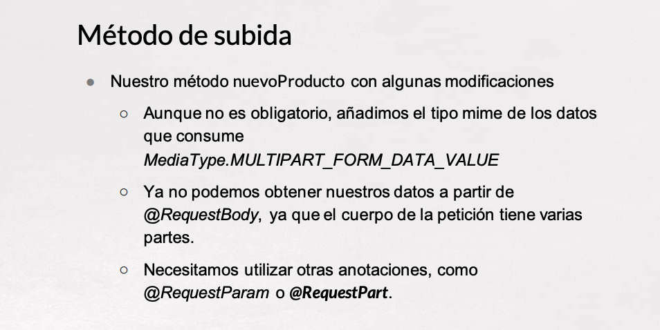

Vamos a implementar ahora un método de subida, lo vamos a llamar `nuevoProducto` con algunas modificaciones para que veamos cómo se puede utilizar, no es obligatorio pero le vamos a indicar el tipo MIME de datos indicando qué es un `MULTIPART_FORM_DATA_VALUE` qué es el que ***nos permite subir muchas partes dentro de una petición***.

Es verdad que no vamos a poder obtener como teníamos antes con `@RequestBody` inyectar todo el cuerpo en un objeto Java porque vamos a tener diferentes partes.

Tenemos dos alternativas `@RequestParam` o `@RequestPart` y vamos a utilizar esta segunda y vamos a ver por qué.

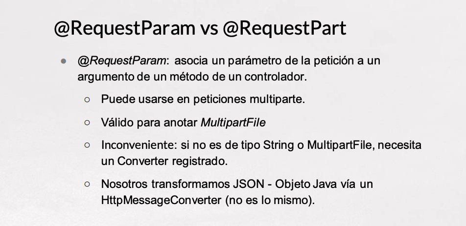

`@RequestParam` asocia un parámetro de la petición a un argumento de un método de controlador, una especie de inyección, se puede usar en peticiones multiparte y es válido para anotar `MultipartFile`, el inconveniente que tenemos es que si no es de tipo `String` o `MultipartFile` entonces necesita un `Converter`, y como nosotros transformamos de Jackson a objetos Java o viceversa vía un `HttpMessageConverter` que no es lo mismo de antes, tendríamos que crear un `Converter` para poder, todo lo que no sea el multipart.

Imaginar que ahora vamos a dar de alta un nuevo productoDTO con una imagen y queremos mandarlo todo de una vez, como no lo hagamos en una misma petición tuviéramos que hacer un `Converter` para ese Jackson, no sería la transformación del Jackson a un objeto Java y nosotros queremos ya que tenemos definido el mensaje `MessageConverter` de Jackson, de nuestra librería de Jackson queremos aprovecharlo. 

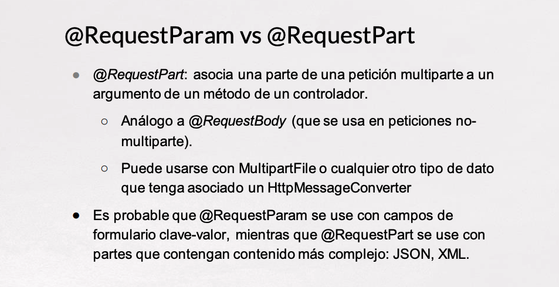

¿Cómo lo podemos hacer?, utilizando `@RequestPart` que nos permite asociar una parte de una petición multiparte a un argumento del método del controlador.

En realidad es análogo a `@RequestBody`, puede usarse como `MultipartFile` o con cualquier otro tipo de dato que tenga asociado un `HttpMessageConverter` es decir, lo que nosotros buscamos.

Con lo cual podríamos diferenciar si lo que nos envié el cliente es un Jackson y un `MultipartFile`, un fichero, usaríamos `@RequestPart` y si lo que nos envía es un formulario por campos clave-valor, clave-valor, clave-valor en multipartes sí que podríamos utilizar `@RequestParam`, nosotros usaremos `@RequestPart` nos quedamos con la segunda opción.

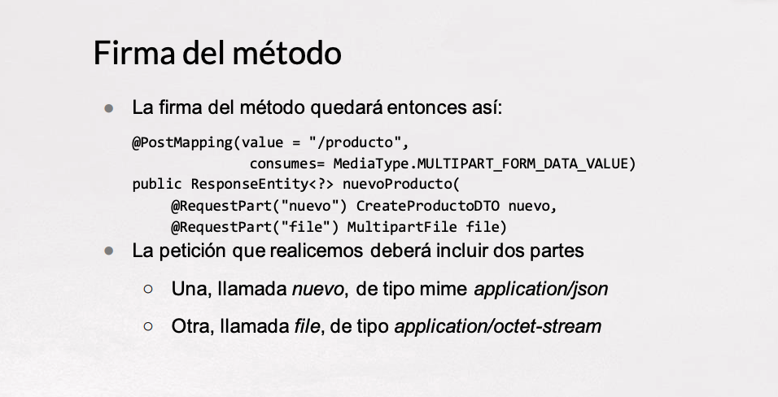

Con lo cual la firma del método va a quedar de esta manera, si nos damos cuenta será una petición POST que va a obtener `MULTIPART_FORM_DATA` es lo que va a consumir, que se llama `nuevoProducto(...)`, que después devolvera un `ResponseEntity` y que recibe dos argumentos, el `createProductoDTO`  dónde vendrán todos los campos textuales o todo aquellos que sean de tipo numérico, Booleano, todo lo que va a llegar en el Jackson, en una parte que se llamará `nuevo` y el fichero que llevara en una parte que se llamará `file`.

Como digo, la petición que realizamos deberá incluir dos partes, la que vaya en Jackson llamada `nuevo` y la otra `file` que será de tipo fichero, un `octet-stream`.

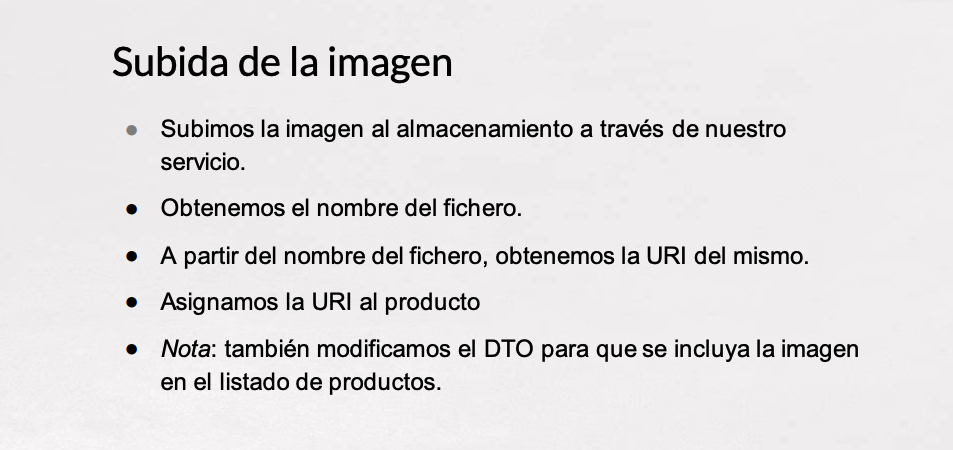

La subida de la imagen la haremos a través de nuestro servicio, obtendremos el nombre del fichero, a partir del nombre del fichero obtendremos la URI del mismo, vamos a ver que tendremos por ahí un mecanismo para hacerlo, asignamos la URI al producto y entonces podremos almacenarlo en la base de datos.

Después veremos cómo se puede hacer una modificación, la hemos visto antes, pero en el código para que el DTO incluya la imágenes en el listado de productos, lo hemos visto en el modelo el cambio que tendríamos que hacer también en el código del controlador a la hora de devolver ese DTO para que lo incluyera.

Vamos a verlo como lo haríamos en nuestro código nos vamos a ir

#### Modificar `ProductoController`

Vamos a modificar el método `nuevoProducto` que actualmente lo tenemos así:

```java
@PostMapping("/producto")
public ResponseEntity<?> nuevoProducto(@RequestBody CreateProductoDTO nuevo) {
   // En este caso, para contrastar, lo hacemos manualmente
		
   // Este código sería más propio de un servicio. Lo implementamos aquí
   // por no hacer más complejo el ejercicio.
   Producto nuevoProducto = new Producto();
   nuevoProducto.setNombre(nuevo.getNombre());
   nuevoProducto.setPrecio(nuevo.getPrecio());
   Categoria categoria = categoriaRepositorio.findById(nuevo.getCategoriaId()).orElse(null);
   nuevoProducto.setCategoria(categoria);
   return ResponseEntity.status(HttpStatus.CREATED).body(productoRepositorio.save(nuevoProducto));
}
```

Lo vamos a cambiar por 

```java
...
private final StorageService storageService;
...

@PostMapping(value = "/producto", consumes= MediaType.MULTIPART_FORM_DATA_VALUE) //Aunque no es obligatorio, podemos indicar que se consume multipart/form-data
public ResponseEntity<?> nuevoProducto(@RequestPart("nuevo") CreateProductoDTO nuevo, @RequestPart("file") MultipartFile file) {
		
   // Almacenamos el fichero y obtenemos su URL
   String urlImagen = null;
		
   if (!file.isEmpty()) {
      String imagen = storageService.store(file);
      urlImagen = MvcUriComponentsBuilder
         // El segundo argumento es necesario solo cuando queremos obtener la imagen
         // En este caso tan solo necesitamos obtener la URL
         .fromMethodName(FicherosController.class, "serveFile", imagen, null)  
         .build().toUriString();
   }
		
   // Construimos nuestro nuevo Producto a partir del DTO
   // Como decíamos en ejemplos anteriores, esto podría ser más bien código
   // de un servicio, pero lo dejamos aquí para no hacer más complejo el código.
   Producto nuevoProducto = new Producto();
   nuevoProducto.setNombre(nuevo.getNombre());
   nuevoProducto.setPrecio(nuevo.getPrecio());
   nuevoProducto.setImagen(urlImagen);
   Categoria categoria = categoriaRepositorio.findById(nuevo.getCategoriaId()).orElse(null);
   nuevoProducto.setCategoria(categoria);
   return ResponseEntity.status(HttpStatus.CREATED).body(productoRepositorio.save(nuevoProducto));
}	
```

Observaciones del método `nuevoProducto(...)`

* Complementamos la anotación `@PostMapping(value = "/producto", consumes= MediaType.MULTIPART_FORM_DATA_VALUE)`
* Modificamos la firma del método `nuevoProducto(@RequestPart("nuevo") CreateProductoDTO nuevo, @RequestPart("file") MultipartFile file)` para recibir los dos datos `nuevo` y `file` con `@RequestPart`.
* Si el fichero no esta vacío obtenemos el nombre de la imagen usando el `StorageService` que debemos inyectar.
* Obtenemos la URL de la imagen, para crear la URI de manera conveniente invocamos a la clase `MvcUriComponentsBuilder` y su método `.fromMethodName(...)` que lo que hace es cojer el nombre del fichero, y construye la URI completa que vamos a almacenar en la BD invocando al método `serveFile(...)` del controlador `FicherosController`.

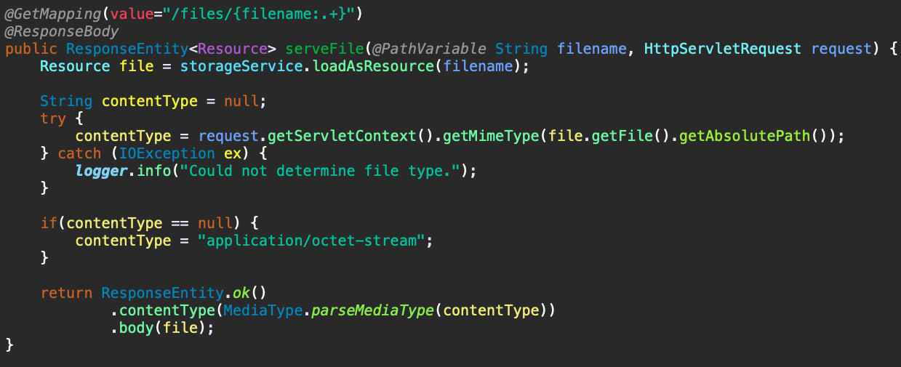

* Si nos damos cuenta esta definido sonre una URI `"/files/{filename:.+}"`, pasa ese nombre aquí como argumento y devuelve la URL que se devolvería con todo ello. 
* Si ejecutamos nuestro proyecto con `http://localhost:8080/` y la imagen se llama `imagen.jpg` la URL que devolvería la llamada al método `.fromMethodName(...)` sería `http://localhost:8080/files/imagen.jpg` por lo que montamos convenientemente la URI.
* Si en algun momento queremos cambiar la ruta de almacenamiento solo lo hacemos en `FicherosController`, `ProductoController` no sufriría ningún cambio.
* El parámetro `null` que mandamos en `.fromMethodName(...)` es solo por que en otras acciones necesita ese parámetro pero para este caso es inecesario por eso pasamos `null`.
* Finalmente esta URL obtenida la asignamos en nuestro producto `nuevoProducto.setImagen(urlImagen);` 


De esta manera ya tenemos la implementación de subida de ficheros. En resumen si subimos un fichero y no esta vacío lo almacenamos con el Servicio de almacenamiento, tomamos la URL y la asignamos al nuevo producto.

Vamos a probar la aplicación.

Si intentamos ejecutar la petición para crear un nuevo Producto como lo veniamos haciendo hasta ahora:

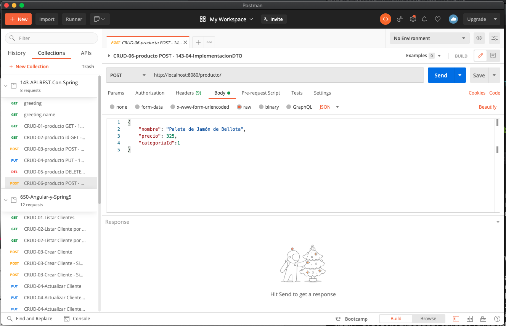

Vamos a obtener lo siguiente:

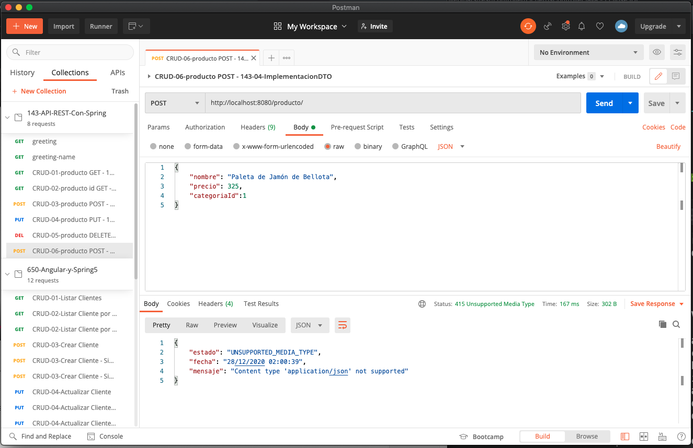

Ya no lo podemos mandar como antes ya que la petición tiene que ser de forma MultiParte, rescatamos también lo que hablabamos sobre el tratamiento de errores no hemos tratado explicitamente los errores `415` pero con el tratamiento global de errores tendríamos que nuestro APIError nos devuelve:

```json
{
   "estado": "UNSUPPORTED_MEDIA_TYPE",
   "fecha": "28/12/2020 02:00:39",
   "mensaje": "Content type 'application/json' not supported"
}
```


Para probar esta aplicación desde Postman es de una manera y desde una aplicación Cliente se haría algo diferente.

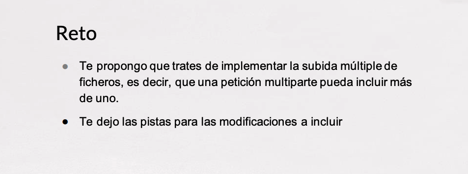

Antes de seguir con la siguiente lección vamos a proponer un reto en el que podáis implementar en lugar de la subida de un solo fichero, si les interesara dar de alta un producto en el contexto de un producto la verdad que tendría mucho sentido subir varios ficheros de una vez, os dejo las pistas para poder implementarlo.

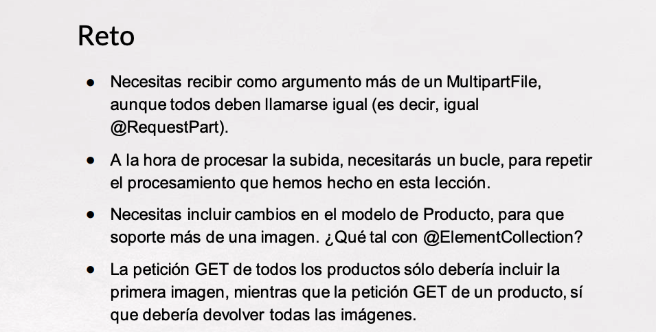

Necesitan recibir como argumento más de un MultipartFile aunque todos se llamarían igual, es decir en el mismo `@RequestPart` varios MultipartFile con lo cual posiblemente lo pueda hacer a partir de un array de MultipartFile.

A la hora de procesar la subida de fichero necesitarás un bucle para repetir el procesamiento que hemos hecho sobre un solo fichero sobre varios.

Tendrás que incluir algún cambio en el modelo de producto para que soporte más de una imagen, si estamos guardando un Stream podría hacer un List de Streams y qué tal usar `@ElementCollection` para no meternos en tener que crear otra nueva entidad, asociaciones y tal, sería una buena pista.

La petición GET de todos los productos solo debería incluir la primera imagen, mientras que la petición GET es de un producto es verdad que debería devolver todas las imágenes para que podamos diferenciarlo.

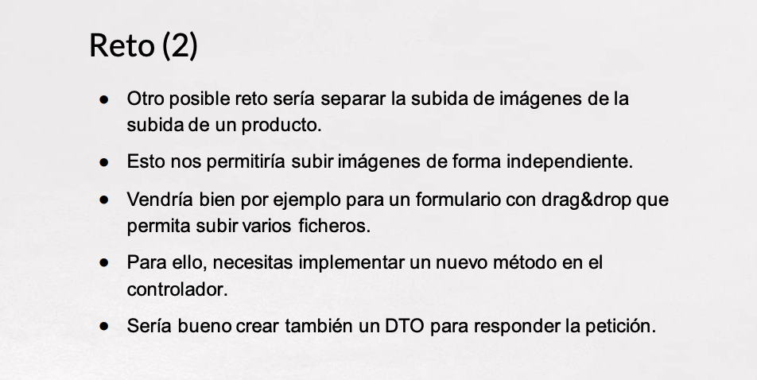

Otro posible reto sería la subida de imágenes, separar la subida imágenes de la subida de un producto y esto nos permitiría hacerlo de forma independiente.

Si por ejemplo quisiéramos implementar un Drag and Drop en nuestra aplicación cliente en el que fuéramos subiendo diferentes ficheros, aun que fuesen de uno en uno o incluso de varios en varios, lo podríamos tener por separado y lo invocaremos y no tendría que enviarsé toda la información en una misma petición.

Para ello ya digo que tendríamos que desgajar está petición en dos y una sería atender la subida de ficheros y otra el envío de información. Si lo haces también necesitarías tener, ya que vas a recibir directamente solo el MultipartFile solo uno o varios dentro de este nuevo método en el controlador, tendrías que crear una especie de DTO de respuesta, para que esa aplicación cliente fuera recibiendo lo que has subido vía AJAX y tuviera la información por ejemplo los nombres de los archivos o sus rutas completa o lo que vosotros crean conveniente.

Todo ello ya digo lo podríais plantear como retos, estos dos retos para para poder implementarlos en este segundo caso en el contexto del uso de un  Drag and Drop.

En la siguiente lección vamos a ver cómo utilizar el servicio que hemos implementado desde Postman.

# 25 Uso del servicio 5:13 

[PDF Uso_del_servicio.pdf](pdfs/24_Uso_del_servicio.pdf)

## Resumen Profesor

No existe.

## Transcripción

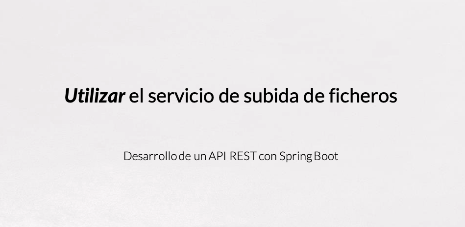

Vamos a cerrar este bloque de subida de ficheros haciendo la prueba del servicio que hemos implementado en la lección anterior.

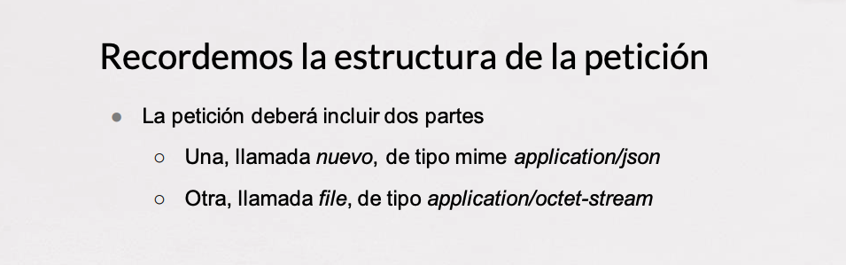

Recordemos la estructura de la petición, tiene que recibir dos partes una llamado `nuevo` de tipo `application/json` y otra llamada `file` de tipo `application/octet-stream` en recibir un fichero.

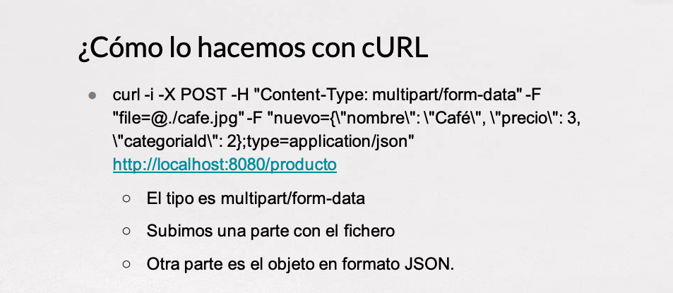

Podemos probarlo vía CURL o vía Postman, vamos a empezar por CURL, tendríamos que hacer una petición como está:

```sh
curl -i -X POST 
-H "Content-Type: multipart/form-data" 
-F "file=@./cafe.jpg" 
-F "nuevo={\"nombre\":\"Café\", \"precio\": 3, \"categoriaId\": 2};type=application/json" http://localhost:8080/producto
```

* En la que indiquemos qué es una petición de tipo POST.
* Donde vamos a pasar contenido MultiParte.
* En el que vamos a mandar dos partes:
   * La primera el fichero `file`, en la parte del fichero solamente tenemos que indicar el nombre y la ruta este `@./cafe.jpg`, por facilidad nos vamos a ubicar en la ruta donde esté el fichero.
   * Y por otro lado mandaríamos el objeto JSON tenemos que poner el objeto encerrado entre llave, la parte llamada `nuevo`, fijarse que tenemos que escapar las comillas para que se metan dentro de la cadena de caracteres, que sería el objeto JSON y al finalizar con `;type=application/json`

Sería lo que tendríamos que escribirse en la consola con las diferentes opciones, si hacemos la petición.

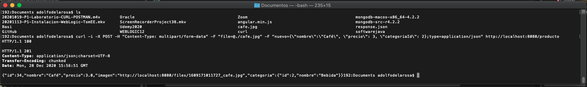

Vemos que la respuesta es `201` creado y que nos está devolviendo nuestro objeto con ID 34, café, con el precio y la URL de la imagen y además lo hemos metido dentro de la categoría de bebida.

Si nos vamos el proyecto en ejecución y refrescamos, podemos comprobar como en la carpeta `upload-dir` que es donde hemos configurado que se suban los ficheros tendríamos nuestra imagen del café y se ha subido todo correctamente.

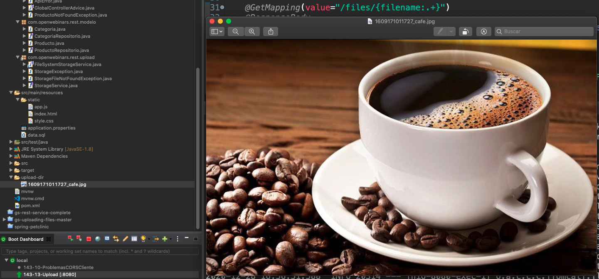

Tanto que hiciéramos ahora la petición del producto 34 también lo podríamos recuperar.

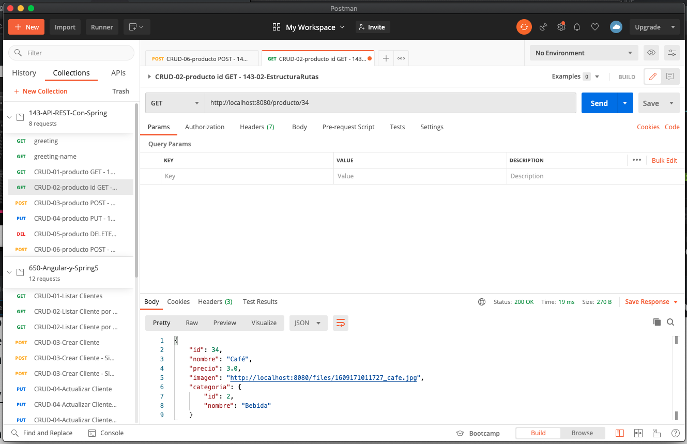


Vamos a ver cómo lo podríamos hacer con Postman, tendríamos que hacer una petición de tipo POST donde el cuerpo (body) ya hemos visto que no puede ser con `raw` tiene que ser con `form-data` donde le pasamos dos partes. En `form-data` tenemos la dificultad de que no vamos a poder escribir, no lo podríamos hacer de una manera sencilla y es más fácil encapsular el JSON en un fichero por ejemplo `cafe.json`, tener en cuenta que no vamos a desarrollar nunca una API para qué se utilizada solamente por Postman, lo más normal es que desarrollemos un API para que otra persona, nosotros o un tercero pueda desarrollar una aplicación cliente en cualquier tecnología, Angular, Vue, simplemente JavaScript, para Android, iOS, cualquiera, una aplicación cliente que interactúe con nuestro API y ya se encargará de montar en dicha tecnología la petición y pasar el JSON como corresponda.

Pero para poder testearlo desde Postman tendríamos que hacerlo pasándole el fichero `cafe.jpg` la imagen que corresponda y el JSON lo vamos a pasar en un fichero `cafe.json` que tendrá solamente ese contenido JSON y que lo vamos a mandar en una parte que se llame `nuevo`.

`cafe.json`

```json
{
   "nombre": "Café", 
   "precio": 3,
   "categoriaId": 2
}
```

Si nos venimos a Postman sería una petición POST y dentro de Body seleccionamos la opción `form-data` y entonces tendríamos que pasar la parte nuevo que hace referencia al archivo JSON `cafe.json` y por otro lado tenemos `file` que hace referencia al archivo de imagen `cafe.jpg`.

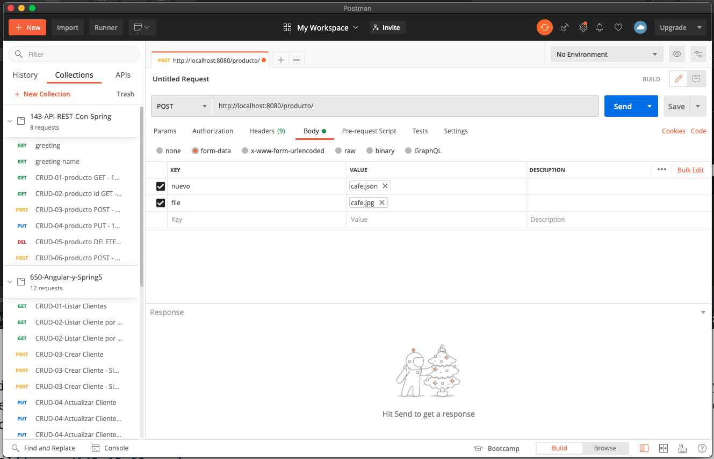

Al hacer la petición:


Vemos como se ha dado de alta el Café, podemos comprobar que el propio enlace de la imagen funciona desde Postman si lo invocamos.

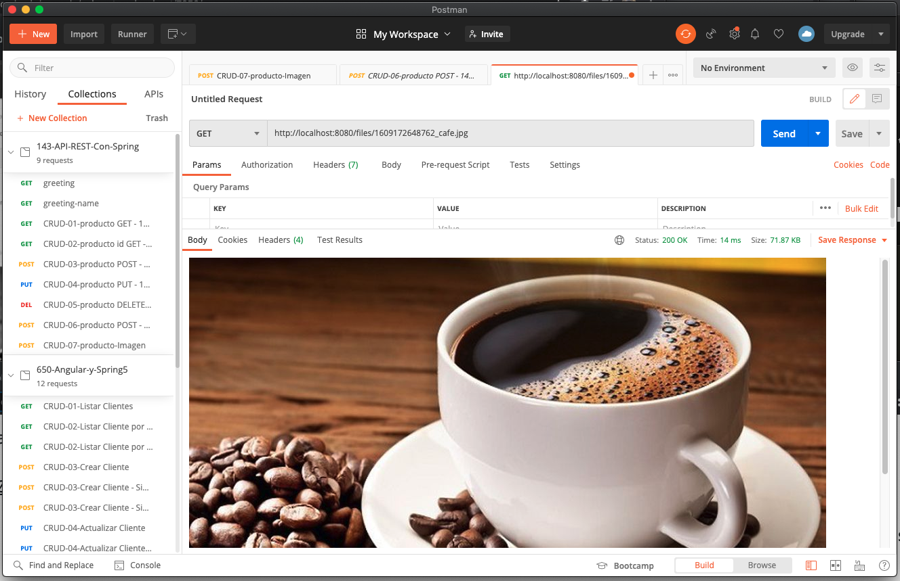

Y si refrescamos la carpeta del proyecto vemos como se ha subido esta segunda imagen.


si no le cambiamos el tipo antes no suele dejar vale a tipo file nuevo ahora lo marcaremos buscamos por aquí café Jason que lo tenemos por aquí haciendo la prueba del servicio que me comentaron interior competición c
``
```java
```

``
```java
```

``
```java
```

``
```java
```


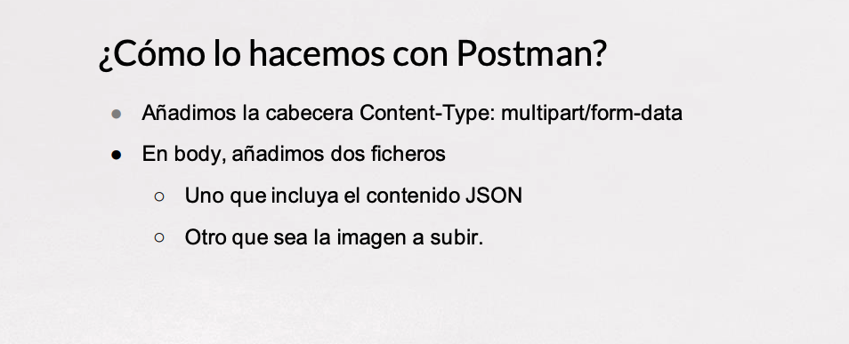

# Contenido adicional 3

* [PDF Servicio_de_subida_de_ficheros.pdf](pdfs/22_Servicio_de_subida_de_ficheros.pdf)
* [PDF Implementación_de_la_subida_de_ficheros.pdf](pdfs/23_Implementación_de_la_subida_de_ficheros.pdf)
* [PDF Uso_del_servicio.pdf](pdfs/24_Uso_del_servicio.pdf)
