# 6. Documentando nuestra API REST 22m

* 26 ¿Qué es Swagger? 5:43 
* 27 ¿Cómo incluir Swagger en nuestra API? 17:13 
* Contenido adicional 2

# 26 ¿Qué es Swagger? 5:43 

[PDF Qué_es_Swagger_.pdf](pdfs/25_Qué_es_Swagger_.pdf)

## Resumen Profesor

### Dependencias en el `pom.xml`

En primera instancia, nos basta con añadir las siguientes dependencias:

```html
<dependency>
<groupId>io.springfox</groupId>
    <artifactId>springfox-swagger2</artifactId>
    <version>2.9.2</version>
</dependency>
<dependency>
    <groupId>io.springfox</groupId>
    <artifactId>springfox-swagger-ui</artifactId>
    <version>2.9.2</version>
</dependency>
```

Sin embargo, se ha detectado que a día de hoy se puede producir en el log una excepción de tipo `NumberFormatException` al cargar la UI. Este error viene provocado por alguna de las librerías que usa SpringFox y Swagger internamente. Tenemos dos alternativas:

* Deshabilitar el log para esas librerías (y así, ni nos enteraremos de que ha sucedido).
* Ajustar las dependencias para incluir determinadas versiones concretas que no incluyen el error.

Para la segunda solución, debemos modificar las dependencias anteriores por estas:

```html
   <dependency>
      <groupId>io.springfox</groupId>
      <artifactId>springfox-swagger2</artifactId>
      <version>2.9.2</version>
      <exclusions>
         <exclusion>
            <groupId>io.swagger</groupId>
            <artifactId>swagger-annotations</artifactId>
         </exclusion>
         <exclusion>
            <groupId>io.swagger</groupId>
            <artifactId>swagger-models</artifactId>
         </exclusion>
      </exclusions>
   </dependency>
   <dependency>
      <groupId>io.springfox</groupId>
      <artifactId>springfox-swagger-ui</artifactId>
      <version>2.9.2</version>
   </dependency>
   <dependency>
      <groupId>io.swagger</groupId>
      <artifactId>swagger-annotations</artifactId>
      <version>1.5.21</version>
   </dependency>
   <dependency>
      <groupId>io.swagger</groupId>
      <artifactId>swagger-models</artifactId>
      <version>1.5.21</version>
   </dependency>
```

La versión correcta de *annotations* y *models* eliminan dicho error.

### Lista completa de anotaciones

En los ejemplos de esta lección hemos usado algunas anotaciones. La lista completa de todas ellas la puedes encontrar en https://github.com/swagger-api/swagger-core/wiki/Annotations-1.5.X.

## Transcripción

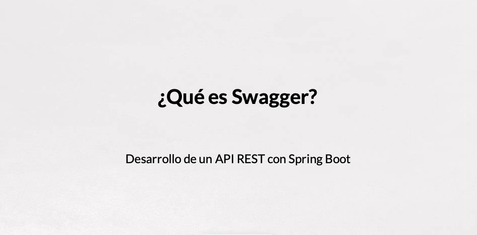

Vamos a continuar con el último bloque del curso en el que vamos a documentar nuestra API con **Swagger**.

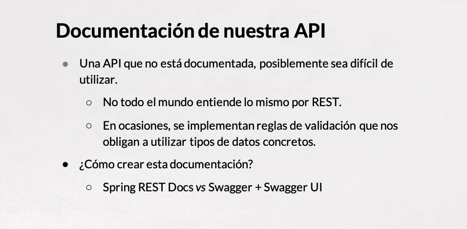

Hablemos de documentación de API, una API qué no está documentada posiblemente sea sino imposible muy difícil de utilizar, sobre todo si es un API que queremos ofrecer a terceros, no a gente de nuestra organización.

No todo el mundo va a entender lo mismo por REST, hay gente que por ejemplo aún hace peticiones POST para modificar y no crear recursos nuevos, cosa que por ejemplo nosotros no hemos venido implementando, la modificación se hace con PUT, con POST se hace la creación de recurso. 

O en ocasiones tenemos determinadas reglas de validación que nos obligan a utilizar un tipo de dato concreto, números con decimales, cadena de caracteres que sigan un determinado patrón, etc. que estaría muy bien que aquellow usuarios, recordar que desarrollamos nuestra API para otros programadores, que aquellos otros programadores que vayan a interactuar con nuestro API deberán conocer.

¿Cómo podemos crear la documentación? tenemos dos posibilidades **Spring Rest Docs** y **Swagger** con **Swagger UI**, vamos a ver las dos alternativas.

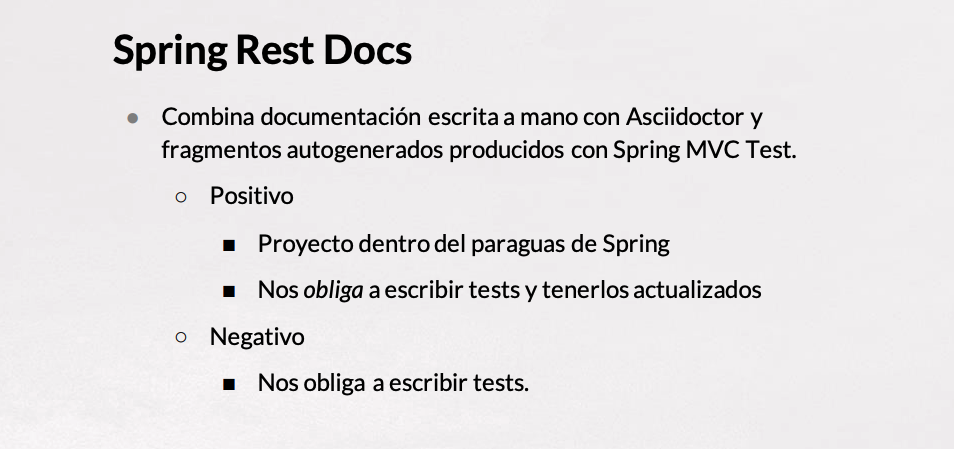

**Spring Rest Docs** combina la documentación escrita a mano con **Asciidoctor** con fragmentos autogenerado y producidos por **Spring MVC Test**.

¿Qué tiene de positivo? En definitiva lo que hacemos es escribir nuestros tests y a partir de ahí generar la documentación y tiene como positivo que nos obliga, nos invita, nos conmina a que escribamos los test y a tenerlos actualizados para tener nuestra documentación actualizada y que es un proyecto dentro del paraguas de lo que sería la gran familia de Spring.

La parte negativa es que si no queremos implementar los test de la manera de **Spring Testing** nos obligaría a escribir unos test que posiblemente en un determinado momento a lo mejor no vayamos a utilizar, no es que no no séa bueno que designemos los test, pero a lo mejor no queremos poner el énfasis en esa parte y si es verdad que queremos tener unos una documentación o queremos tener la documentación antes de escribir los test, bueno entonces eso sería un elemento que podría ser un poco dificultosos.

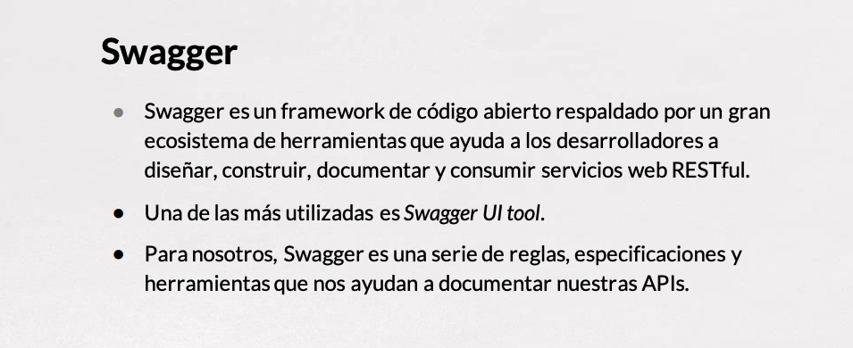

En la otra mano tenemos **Swagger**, Swagger no solamente es para documentar nuestra API, es todo un Framework de código abierto respaldado por un gran ecosistema de herramientas que nos va a permitir diseñar, construir, documentar, consumir nuestra API REST FULL.

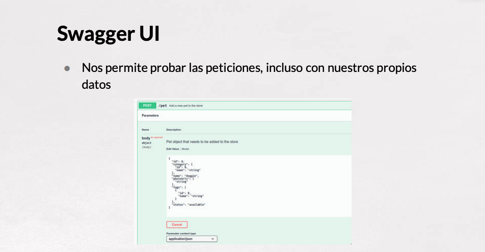

Entre todas las herramientas que tiene Swagger, una de las más útiles, la más conocida es **Swagger UI Tools** que nos va a permitir interactuar con nuestra API, con una interfaz bastante bastante cómoda, diría que incluso bonita y muy muy muy útil.

Con lo cual para nosotros en el contexto de este bloque Swagger será una serie de reglas, especificaciones y herramientas que nos ayudan a documentar nuestra API.

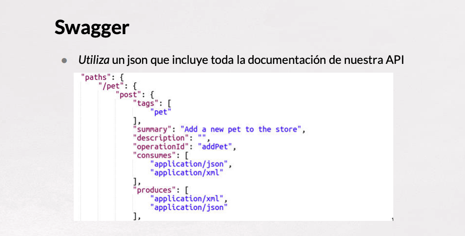

El corazón de lo que va de lo que vamos a tener con Swagger es utilizar un JSON que describe por completo toda nuestra API y dónde va a estar totalmente, ya digamos una especie de catálogo, de meta información de toda nuestra API y dónde están documentadas todas las peticiones, los verbos que se pueden hacer, para qué sirve cada una, qué tipo de datos consume, qué tipo de datos produce, los diferentes datos, qué tipos tienen, las posibles respuestas, códigos de respuesta de error, etc., eso sería lo que nosotros en principio, si utilizáramos Swagger a secas, tendríamos que escribir a mano y alguien se puede echar las manos a la cabeza, eso es complicado de escribir, sí, pero bueno nosotros vamos a tener una determinada herramienta que nos va ayudar que se llamará **SpringFox** y que hará la generación de este JSON de manera automática.

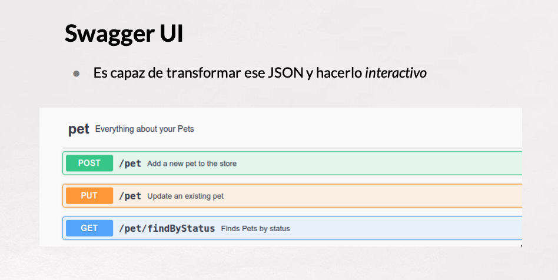

Este JSON utilizado por Swagger UI transforma esto en una web que podríamos llamar interactiva y que nos va a permitir bueno pues ver nuestra API de una manera pues súper conveniente.

Vamos a abrir la documentación de un proyecto, el típico [***Petstore***](https://petstore.swagger.io/v2/swagger.json) o PetClinic que es un proyecto recurrente que existe en el ecosistema Java.

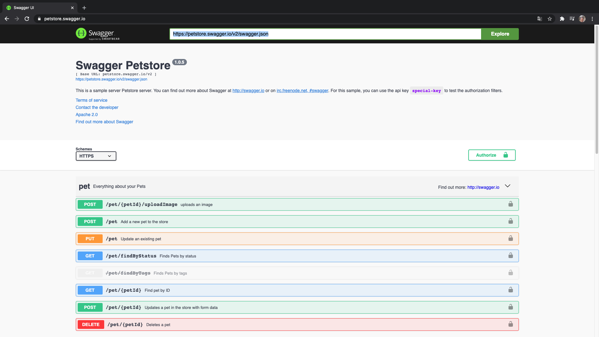

Tendríamos aquí para la versión que tiene un API la documentación con Swagger, esto nos muestra los diferentes controladores, nos va mostrando cuáles serían las peticiones, la descripción de la misma, el dato que tendríamos que pasarle, nos ofrese incluso la posibilidad de probarlo.

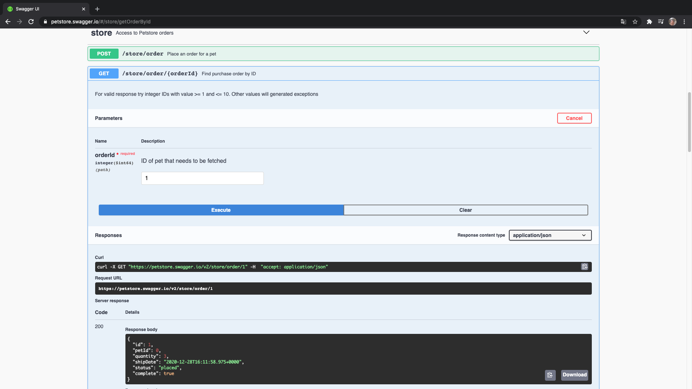

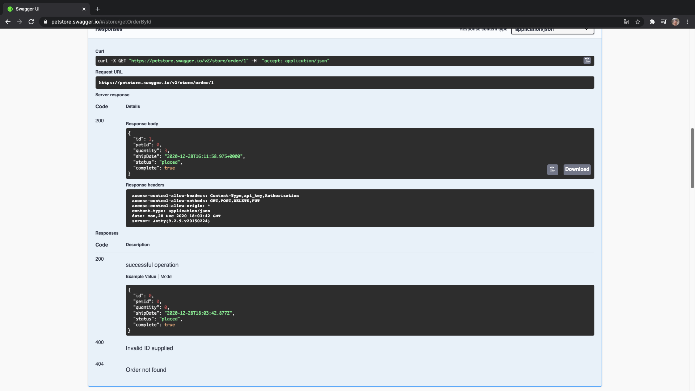

Esta herramienta es un verdadero Cañon que nos va a permitir no solamente que la gente pueda conocer la estructura de nuestra API sino que comprobarla para ir montando sus clientes


Lo que nos quedaría en la próxima lección sería ver los elementos que nos van a hacer falta para integrar Swagger con Spring Boots dentro de nuestro proyecto.

# 27 ¿Cómo incluir Swagger en nuestra API? 17:13 

[PDF Cómo_incluir_Swagger_en_nuestro_proyecto.pdf](pdfs/26_Cómo_incluir_Swagger_en_nuestro_proyecto.pdf)

## Resumen Profesor

No existe.

## Transcripción

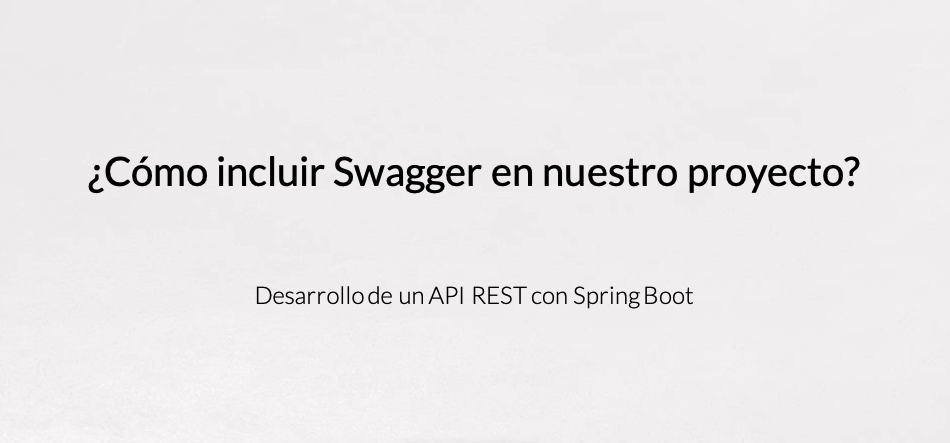
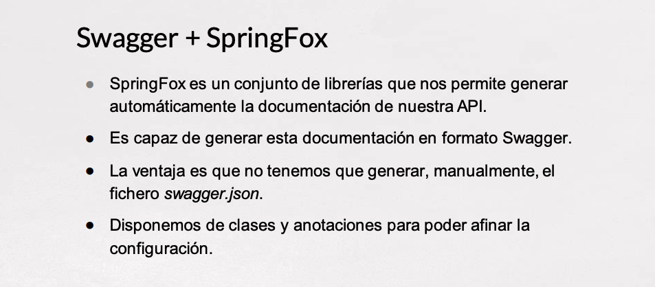
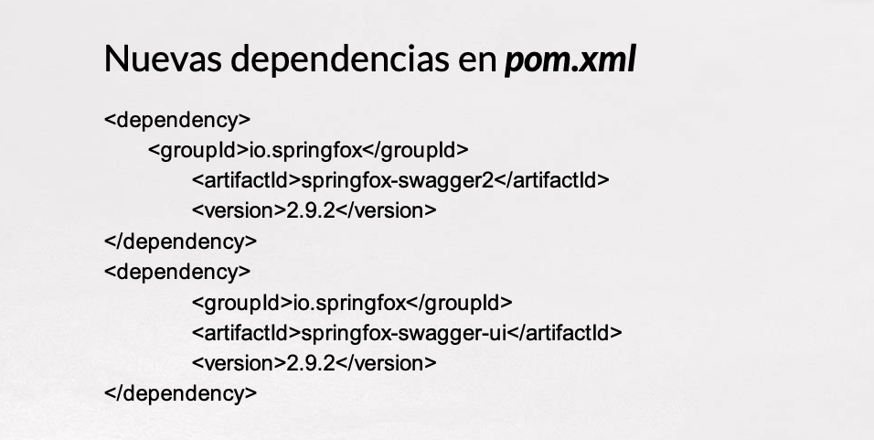
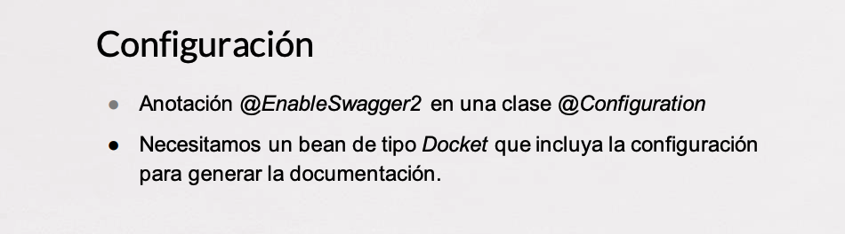
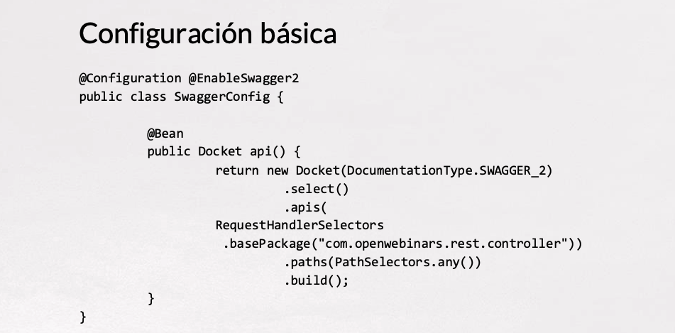
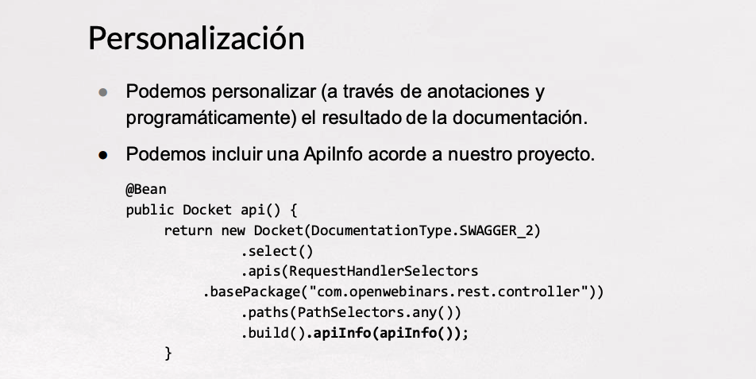
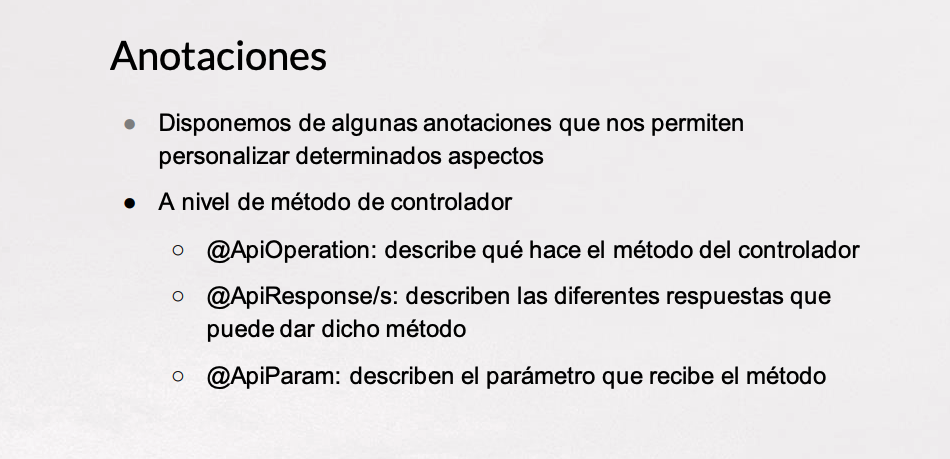
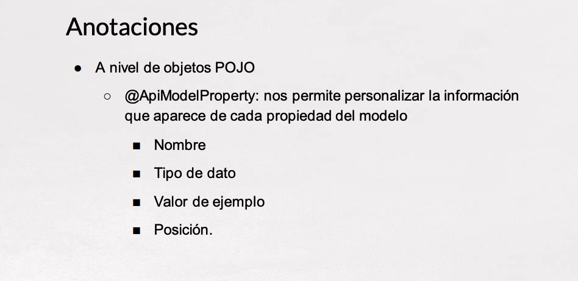
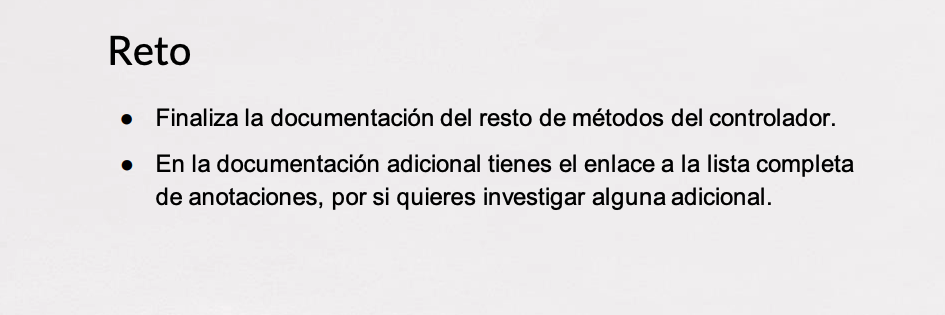

# Contenido adicional 2

* [PDF Qué_es_Swagger_.pdf](pdfs/25_Qué_es_Swagger_.pdf)
* [PDF Cómo_incluir_Swagger_en_nuestro_proyecto.pdf](pdfs/26_Cómo_incluir_Swagger_en_nuestro_proyecto.pdf)
