# 1. Introducción 18m

* 01 Presentación 8:42 
* 02 Proyecto de ejemplo 9:58 
* Contenido adicional 1

# 01 Presentación 8:42 

[PDF Presentacion.pdf](pdfs/pdfs/0._Presentacion.pdf)

## Resumen Profesor

No existe.

## Transcripción

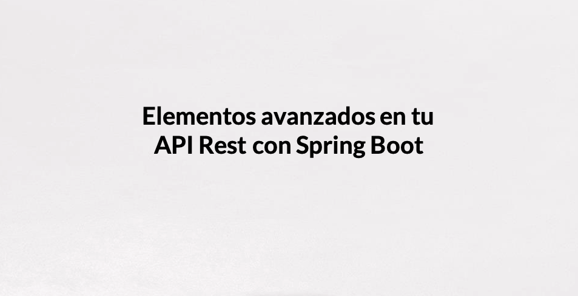

Hoy vengo a presentaros el curso de ***Elemento Avanzados en tu API REST con Spring Boot*** 

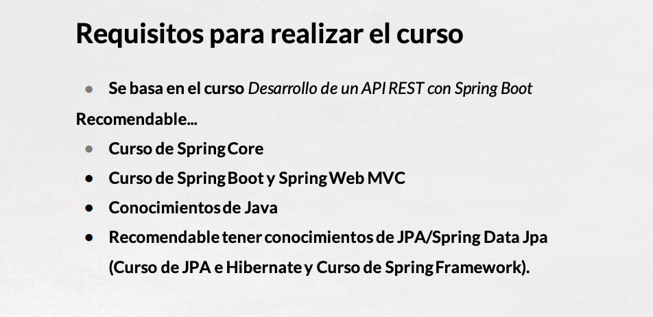

Para realizar este curso de Elemento Avanzados en tu API REST con Spring Boot sería bueno que hayáis podido hacer el curso de ***Desarrollo de una API REST con Spring Boot*** porque de alguna manera vamos a continuar en el punto en el que en ese curso lo hemos dejado.

Daremos por supuesto algunos conocimientos de ***Spring Core*** sobre todo a lo que hace referencia a `Beans`, Inyecciones automáticas, el *Contenedor de Inversión de Control* y toda esa parte. 

Si no lo habéis hecho también sería bueno por si no manejáis que se ***Spring Boot*** y también una manera de acercarse a ***String*** tenéis disponible el curso de ***Spring Boot y Spring Web MVC***.

Son necesario tener conocimientos de ***Java*** si no lo habéis hecho también tenéis en nuestro catálogo varios cursos disponibles como el curso de ***Java 8 Desde Cero*** o el de -***Java 8 para Programadores Java***.

También fuertemente recomendable, de hecho es uno de los bloques fundamentales de este curso, será la parte del *Modelado de Datos* y cómo encajar eso dentro de nuestro API REST, el tener conocimientos de ***JPA*** o ***Spring data JPA***, si necesitáis algo más de conocimientos también podéis visitar nuestro curso de ***JPA e Hibernate*** o el curso de ***Spring Framework***

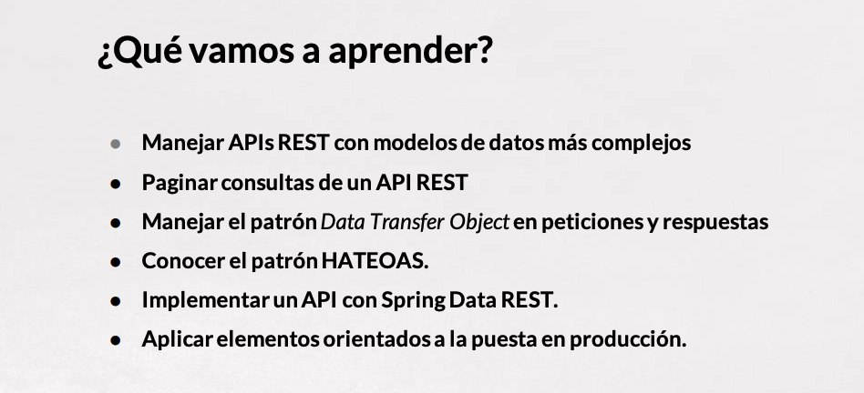

¿Qué es lo que vamos a aprender? Vamos a aprender varias cosas, lo primero es que, veníamos de manejar o crear una API que tenía un modelo de datos que era excesivamente sencillo o solamente orientado a aplicaciones muy sencillas, vamos a complicar el modelo es decir, vamos a crear un modelo de datos más complejo y vamos a ver cómo poder manejarlo dentro de nuestra API REST y ver cuando tengamos diferentes entidades con asociaciones, cómo podemos manejar esas asociaciones tanto en las peticiones como en las respuestas.

También vamos a poder paginar y realizar búsqueda en nuestras consultas de nuestra API REST y ver cómo gestionar eso al devolver los resultados.

Aprenderemos a manejar convenientemente el patrón ***Data Transfer Object*** el patrón ***DTO*** tanto en peticiones como respuesta y veremos alternativas a la hora de generar esos diferentes objetos.

Conoceremos lo que es el ***Patrón Arquitectónico HATEOAS*** y veremos qué es, lo que significa, hablaremos un poco sobre el modelo de madurez de una API REST de Richardson y veremos cómo cómo lo podemos incluir dentro de nuestra API REST.

Conoceremos también el proyecto ***Spring Data Rest*** mediante el cual podemos crear API REST a partir del repositorio de ***Spring Data*** de una manera bastante rápida.
 
Y trataremos de ver algunos de elemento orientados a la puesta en producción de nuestra API REST, trataremos de ver cómo manejar diferentes perfiles, subirlo a alguna nube y ver cómo podemos incluir también algunos elementos que nos puedan servir para monitorizar nuestra API cuando esté en producción.


Vamos a dividir todo ello en cuatro bloques de contenido. 

Primero veremos que mejoras sobre un proyecto inicial podemos incluir en nuestra API REST, el tema de paginacion de resultados, de consulta etc.

Hablaremos de modelos de datos más complejos con asociaciones y dentro de ellos encajaremos lo que veíamos del patrón DTO y cómo transformar objetos que vienen de asociaciones más complejas.

Un tercer bloque en el que presentaremos el modelo HATEOAS y cómo lo podemos utilizar con Spring Data Rest.

Por último un último bloque en el que en el que hablaremos de esos elementos orientados a producción que comentaba.

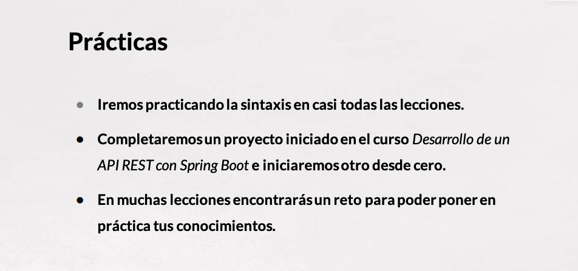

Con respecto a las prácticas iremos practicando paso a paso en cada lección, la sintaxis. En la gran mayoría de ellos iremos completando código, de hecho en la primera parte del curso sobre todo iremos completando un proyecto inicial, que no es otra cosa que el producto que se obtiene al realizar el curso de Desarrollo de una API REST con Spring Boot, lo iremos completando y añadiéndole funcionalidades.

Iniciaremos otro desde cero en el bloque de HATEOAS y de Spring Data REST dónde lo iremos construyendo también paso a paso. 

Además en muchas de las lesiones al final os plantearé encontraré algún reto, en el que podréis poner en práctica nuestros conocimientos, lo que hayamos trabajado en esa lección o incluso alguno que vendrá acumulado de varias lecciones atrás en el que el reto quizás sea un poco más grande.

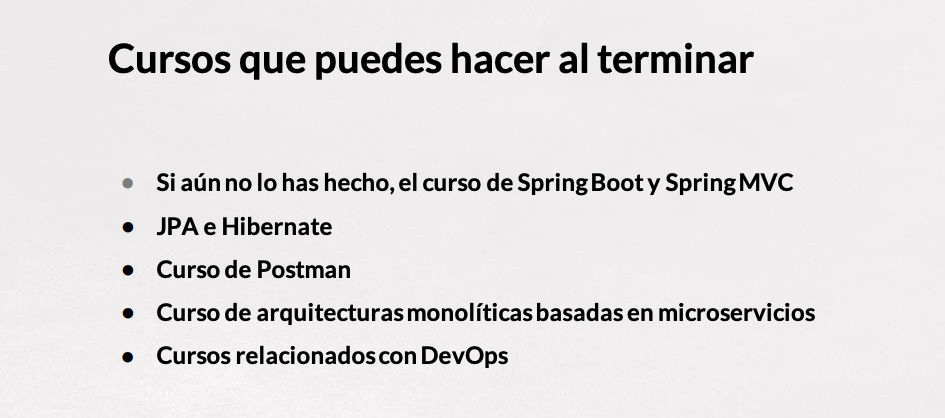

Al terminar este Curso nos podemos plantear hacer algún otro, consolidar vuestros conocimientos sobre Spring, podéis hacer el curso de ***Spring Boot y Spring MVC***, si veis sobre todo en el en el segundo bloque con respecto al modelo de datos pues necesitáis completar vuestros conocimientos tenéis el curso de ***JPA e Hibernate***, para la parte de manejar el API con un cliente tenéis también un buen curso de ***Postman*** y si queréis comenzar también a dar vuestros pasos con el desarrollo de APIs orientadas también o utilizando conceptos de microservicios tenéis disponible un curso de ***Arquitectura Monolítica Basada en Microservicios*** que aunque no utiliza Spring pero si os puede servir para empezar a amueblar la cabeza con eso de los microservicios y cómo utilizar algunos de esos elementos a la hora de desarrollar una aplicación. 

Por último como veremos en el último bloque elementos orientados a la producción, todos aquellos cursos que tenemos en el catálogo relacionados con ***DevOps*** también nos pueden servir como todos los cursos que haya sobre ***Docker***, hablaremos algo sobre Docker en nuestro curso pero lo podéis completar, cursos sobre ***Kubernetes*** sobre las distintas nubes, podréis consultar esos cursos porque os podrán servir para la puesta en producción de vuestras aplicaciones que podáis desarrollar.

Bueno pues sin más animaros a que disfrutéis mucho del curso quedo a vuestra disposición para resolver todas las dudas o todas las cuestiones que tengáis y espero que el aprendizaje de lo que podáis ver en este curso os sirva francamente en el desarrollo de nuestra carrera profesional.

# 02 Proyecto de ejemplo 9:58 

## Resumen Profesor

No existe.

## Transcripción

En este curso seguiremos hablando del desarrollo de aplicaciones con Spring Boot en particular el desarrollo de API REST en el cual vamos a ir incluyendo algunos elementos que podríamos decir que son un poco más avanzados, que se van distanciando un poco de los elementos base. 

A lo largo del curso de ***Desarrollo de un API REST con Spring Boot*** habéis podido ir aprendiendo poco a poco y de cero a desarrollar un API sencilla con Spring Boot que incluia alguna clase de modelo y en el cual hemos ido incluyendo una serie de elementos cómo sería la parte de acceso a datos a través del modelo, la transformación de esos objetos que vamos a necesitar en DTOs, la creación de unos controladores que manejan las peticiones necesarias para hacer un CRUD, para crear nuevos elementos, consultar, actualizar y borrar. También la gestión de errores, la gestión de la seguridad a nivel de CORS y la subida de ficheros. 

Ese era el proyecto de ejemplo del cual vamos a partir en este nuevo curso en el que veremos elemento avanzada. Cabe aclarar que en comparación con el proyecto que terminamos en el curso pasado, este del cual partimos esta más estructurado ya que se separan las capas de repositorio y ya se tiene una capa de servicios que antes no teniamos entre algunos detalles más.

Veamos el código, si veis que hay alguno de los elementos en el código que suenan un poco más raro o no lo conocéis, sería bueno que primero pudiera ir a repasar con ese curso el ***Desarrollo de un API REST con Spring Boot*** antes de empezar este.

### :computer: `144-00-Proyecto-Inicial`

Vamos a descargar del repositorio del curso el proyecto llamado `00_ProyectoInicial` y lo vamos a copiarlo con el nombre `144-00-Proyecto-Inicial`.


Vamos a empezar la visita de arriba a abajo en el código. 

Partimos de un controlador que sería `ProductoController` y qué es el controlador REST (`@RestController`) que expone ese CRUD en este caso de `Productos`, de un catálogo de productos  que lo expone hacia los clientes.

Una primera petición básica sería la petición que tendríamos directamente para `/producto` y que haría una consulta de todos los productos que tuviéramos en la base de datos y devolvería el resultado.

```java
@GetMapping("/producto")
public ResponseEntity<?> obtenerTodos() {
   List<Producto> result = productoServicio.findAll();

   if (result.isEmpty()) {
			   throw new ProductoNotFoundException();
		 } else {
			   List<ProductoDTO> dtoList = result.stream().map(productoDTOConverter::convertToDto)
					.collect(Collectors.toList());

      return ResponseEntity.ok(dtoList);
   }

}
```

En el curso anterior hacíamos distintas versiones de este método sobre todo en lo concerniente a la gestión de errores que veremos después, aquí tenemos un ejemplo en el que lo manejamos lanzando directamente una excepción propia llamada `ProductoNotFoundException` y vemos cómo está lista de productos antes de enviarla como resultado al cliente, la tratamos a través de un `Converter` que hemos definido y que transforma nuestra clase modelo `Producto` en un `ProductoDTO`, en este momento vamos a detenernos y vamos a ver esas dos clases.

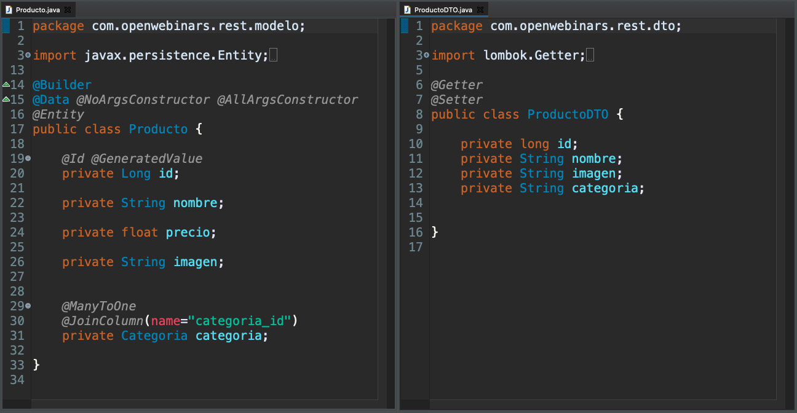

La clase `Producto` que es una clase modelo francamente sencilla, que tiene solamente el nombre del producto, el precio, la URL de la imagen y la referencia a la categoría a la cual pertenece este producto que sería nuestra entidad podríamos llamar básica con la cual se va funcionando en este ejemplo.

Los DTOs aunque también hablaremos de ellos en este curso, se presentaban en el de en el curso *Desarrollo de un API REST con Spring Boot* no son más que clases Java que nosotros vamos a utilizar para transportar información entre las distintas capas, en nuestro caso desde el cliente externo a nosotros hacia dentro del API o desde dentro del API hacia el cliente.

Como por ejemplo `ProductoDTO` que nos permitía resumir las propiedades más fundamentales como podían ser el nombre, la imagen y el nombre de la categoría que tendríamos dentro de una sola clase, es una especie de resumen de ambas clases en un solo objeto que nos permiten en una sola petición mandarlo todo hacia el cliente esto es lo que devolvería el método `"/producto" .... obtenerTodos()` del `ProductoController`. 


También teníamos el método `"/producto/{id}" .... obtenerUno(@PathVariable Long id)`,

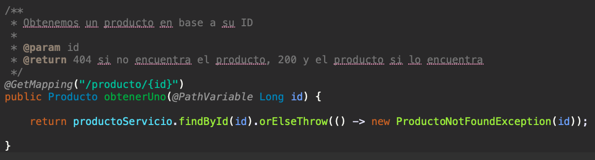

que nos devolvía la información de un producto en particular al cual le proporcionamos un `id`, podemos ver como se recoje este `id` con un `@PathVariable`, buscamos a través del servicio correspondiente el producto si no lo encontramos remitimos una excepción.

Sobre excepciones hablamos ahora y decir que en el curso pasado habíamos planteado varias estrategías, aquí nos hemos quedado con una gestión de errores a traves de un `ControllerAdvice` en particular con la anotación `@RestControllerAdvice`.

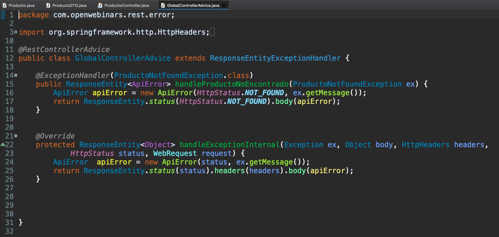

Dónde encausabamos, para dar un modelo personalizado de error de todas a través del método `handleExceptionInternal` y en el cual definiamos una clase de error `ApiError`

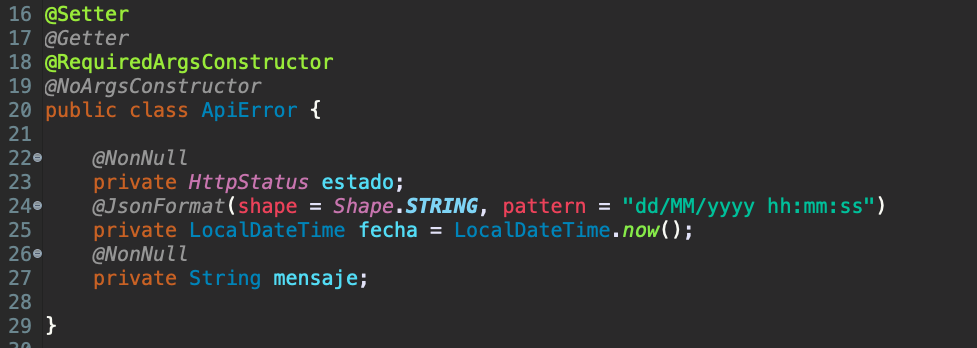

que fuera algo más sencilla, de toda la información, en algún caso repetitiva, que nos daba Spring por defecto, dando el estado de la petición, en este caso el *estado del error*, el *código numérico* también vendrá no hace falta resumirlo en este objeto JSON, la *fecha y hora* en un formato que fuera más amigable para nosotros y un *mensaje*. 


Todas las excepciones se encausarían por el método `handleExceptionInternal` y se les daría este tipo de tratamiento. En particular las excepciones nuevas definidas por nosotros como `ProductoNotFoundException` también las podemos manejar aquí para dar una respuesta, en nuestro caso un `404` con el mensaje de error correspondiente, el que pudiéramos definir, por ejemplo como el que tenemos por aquí, si entramos dentro de la clase `ProductoNotFoundException`

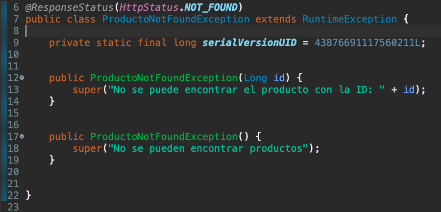

vemos nuestros mensajes personalizados.

En el Controller tendríamos algún tipo de petición más, cómo sería la petición `POST` que nos permite crear un nuevo `Producto`.

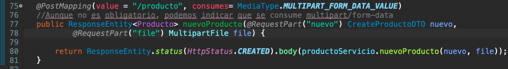

En el proyecto anterior llegábamos a incluir en uno del último aparcados la subida de ficheros, mediante la cual en una petición multiparte podíamos pasarle dos partes, una con el DTO con los datos en JSON que queríamos incluir como nuevo producto y otra parte, un fichero con la imagen que queríamos incluir.

Dentro del servicio de producto `ProductoServicio` que lo tenemos definido por aquí.

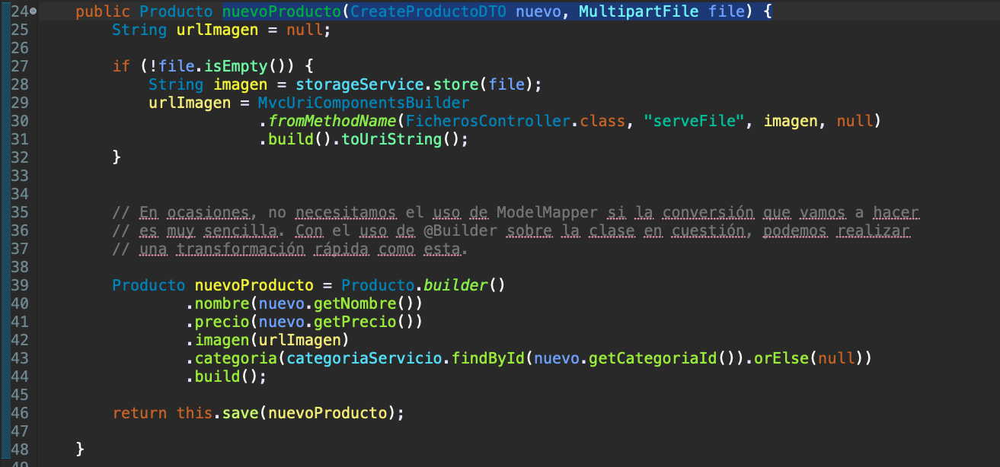

Teníamos el método `nuevoProducto(CreateProductoDTO nuevo, MultipartFile file) {`  de nuevo producto que recibe ese DTO, recibe el fichero multiparte, guardaba el fichero si es que no estaba vacío y transformaba el `ProductoDTO` en un nuevo `Producto` para almacenarlo en la base de datos y devolverlo al controlador.

En el controlador tenemos también la posibilidad de actualizar un producto que ya existe en la base de datos.

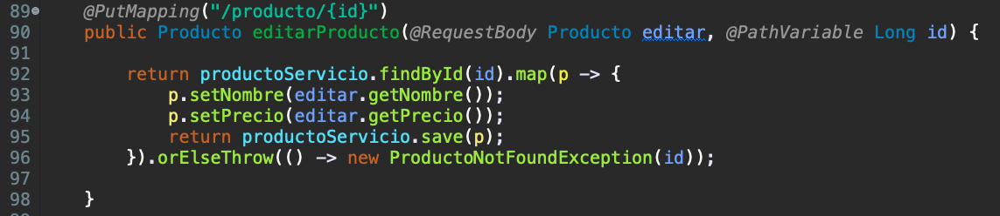

O la posibilidad de borrar productos que ya existe en la base de datos.

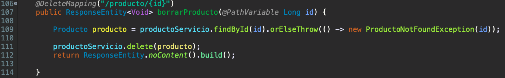

Nos queda poco por ver del ejemplo, solamente decir que en este primer proyecto, parte del tratamiento DTO se realiza en esta clase Converter `ProductoDTOConverter`

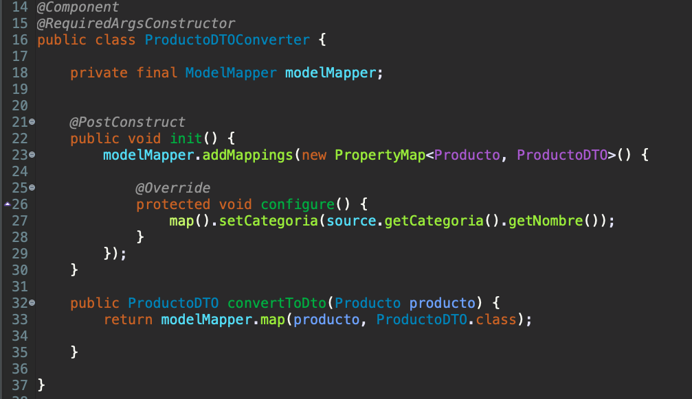

Qué es capaz de transformar un `Producto` en un `ProductoDTO` y se realiza con `ModelMapper` era la manera de tratar DTOs que veíamos en ese curso de *Desarrollo de un API REST con Spring Boot*, en este en particular, complementaremos lo que ya sabemos de DTO dando otro tipo de tratamiento, ya veremos qué lo haremos incluso con el propio Lombok o con algunas anotaciones de Jackson cómo son los `JSONViews`. Para incluir `ModelMapper` requeríamos de una pequeña configuración en la clase `MiConfiguracion` para incluirlo como un `Bean` diferente.

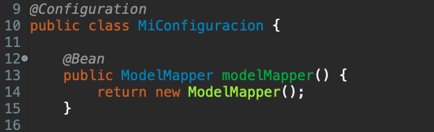

También estuvimos viendo la configuración de CORS tambien en `MiConfiguracion`

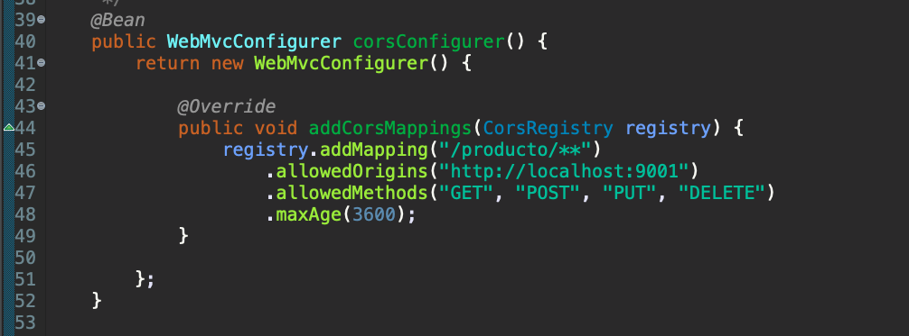

y veíamos cómo incluir, ya lo vimos en su momento y no lo vamos a tocar, cómo generar la documentación con *SpringFox* y *Swagger* con una clase de configuración `SwaggerConfig`.

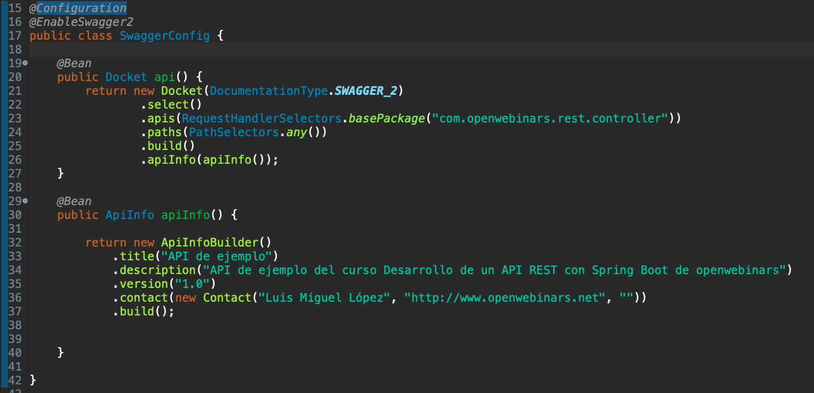

Con lo que podíamos incluir toda la documentación de nuestra API REST para incluir también el componente de Swagger UI y poder hacer una consulta sobre los distintos elementos, los distintos controladores que tenemos definido dentro de nuestro proyecto.

Como podemos comprobar es un proyecto bastante extenso, aunque en apariencia cuando consultamos sobre el puede resultar sencillo.

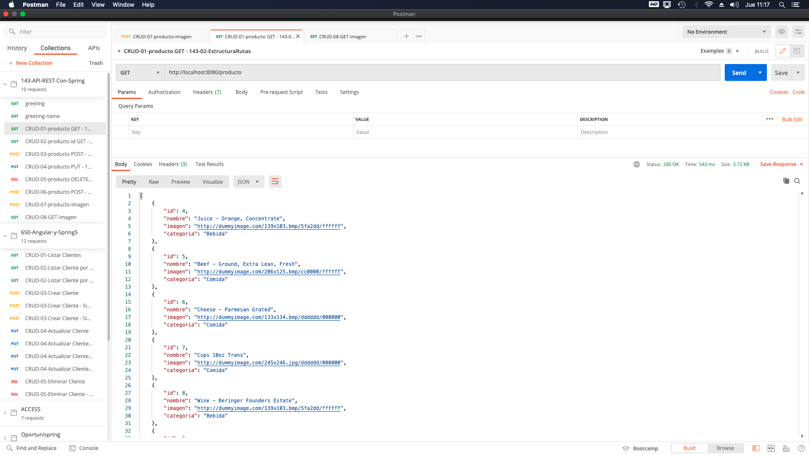

Pero a nivel de clases la verdad que es bastante extenso. Nos vamos a apoyar sobre el e iremos trabajando en los diferentes bloques sobre todo en los dos primero a partir del tercer bloque crearemos, utilizando otra parte de lo que nos ofrece Spring un proyecto nuevo desde cero, pero este proyecto en los dos primeros bloques lo iremos mejorando con funcionalidades como podrían ser la paginación de resultados, la inclusion de consulta para afinar más en los resultados que queremos obtener, la posibilidad de negociar el contenido en XML, crear un modelo de datos más complejo para que se parezca más a un proyecto real. 

# Contenido adicional 1

* [PDF Presentacion.pdf](pdfs/pdfs/0._Presentacion.pdf)
