# 2. Algunas mejoras para nuestra API 62m

* 03 Paginación de resultados 20:46 
* 04 Manejo de parámetros en el Query (Parte I) 16:49 
* 05 Manejo de parámetros en el Query (Parte II) 17:25 
* 06 Soporte para XML 7:19 
* Contenido adicional 4

# 03 Paginación de resultados 20:46 

[PDF Paginación_de_resultados.pdf](pdfs/01_Paginación_de_resultados.pdf)

## Resumen Profesor

### Paginación

Algunas de las clases/interfaces que se utilizan durante esta lección son estas:

* PagingAndSortingRepository: https://docs.spring.io/spring-data/commons/docs/current/api/org/springframework/data/repository/PagingAndSortingRepository.html
* Page: https://docs.spring.io/spring-data/commons/docs/current/api/org/springframework/data/domain/Page.html
* Pageable: https://docs.spring.io/spring-data/commons/docs/current/api/org/springframework/data/domain/Pageable.html.
* @PageableDefault: https://docs.spring.io/spring-data/commons/docs/current/api/org/springframework/data/web/PageableDefault.html

### RFC 5988

Según el *request for comments* 5988, en un API Rest paginado deberíamos incluir el encabezado *link*, siguiendo una estructura como la que sigue en el ejemplo:

```html
<http://localhost:8080/producto/?page=2&size=10>; rel="next", 
<http://localhost:8080/producto/?page=0&size=10>; rel="prev", 
<http://localhost:8080/producto/?page=0&size=10>; rel="first", 
<http://localhost:8080/producto/?page=2&size=10>; rel="last"
```

## Transcripción

AQUIIIIIIIIII

Hola a todos vamos a comenzar a añadir nuevas funcionalidades al proyecto base que presentábamos en la lección anterior y vamos a comenzar con la paginacion de resultados la paginacion de resultados se vuelve necesaria cuando el número de resultados que potencialmente puede devolver un en Point grande o muy grande no supongamos que quisiéramos consultar los productos de Amazon y entonces bueno pues no paginar amor resultado y dijéramos todos los productos de Amazon entonces todos los millones de productos que tiene Amazon los tendrían que aparecer en una página y eso sería inviable porque bueno pues por dos razones elementales eficiencia por un lado que eso supondría que nos tendremos que ir a la base de datos de Amazon hacer una consulta super larga que consumían mucha memoria del servidor de base de datos dando más memoria en nuestro servidor Web imaginaos lo que tardaría en procesar esa petición que se nos devuelve a nuestro cliente la carga sería enorme no y además estaríamos bloqueando peticiones que alomejor estarían haciendo otro cliente y también la experiencia de usuario imagino que no aparecen todos esos productos en una aplicación cliente donde el scroll es casi eterno eso no sería una una buena práctica de ahí que cuando el número de resultado va a ser grande pues lo normal será obtener un subconjunto de ellos llamado página qué Twitter no te volviera todos los tweets de nuestro Timeline desde que nos dimos de alta en Twitter de un solo golpe lo que son en cierto. Dependiendo del número de seguidores que tengamos tendría que hacer el infinito no sería ciertamente inviable que no ofrece spring para realizar la paginación bueno pues lo tenemos entre dos manos en una mano tenemos spring data en particulares 30 JP a qué es lo que venimos utilizando en este proyecto bien pues los repositorios de por si nos ofrecen la posibilidad de realizar consultas páginas mínimo utilizando en nuestro proyecto de ejemplo JP repository que tiende a paging and sorting repository qué es el que añade la posibilidad de realizar estas consultas paginadas porque añade la posibilidad de traer todos los resultados a través del método fino pero pasándole un objeto de tipo béisbol como tenemos aquí en pantalla realizar nuestras propias consultas derivada del nombre le podríamos le podíamos pasar un objeto de tipo béisbol en el cual bueno pues vendrá la información sobre la paginación béisbol qué es elemento de entrada y que define de alguna manera que elementos de entre todos queremos obtener tiene métodos cómo peinarme para obtener el número de página el tamaño de página la ordenación que queremos y como digo sería el elemento de entrada veremos ahora como lo podemos crear que será bastante sencillo page a su ex mal en la otra mano es el elemento de salida el resultado es un subconjunto del conjunto total pero no basta con que se una sublista sino que aparte de ser un subconjunto del total de elementos de resultado tiene información sobre el total de elementos que tenemos cómo resultado de la consulta si no estuviera página da el número total de página en qué página no encontramos todo estos métodos que podéis ver en pantalla no sobre el propio contenido de la página el número total de página el tamaño de página actual el número de páginas toile etcétera etcétera hablamos de estas cosas fea pero sin embargo nosotros vamos a querer hacer las consultas paginadas desde nuestros en Point red no bueno pues ahí tenemos a spring data websupport que nos va a permitir utilizar elementos de Spring data en la capa de los controladores es decir que vamos a poder utilizar este elemento pero llevo en directamente en un controlador y no es que desde allí lo tengamos que construir que también lo podríamos hacer es que incluso directamente lo vamos a poder recibir como argumento de un método de un controlador con los valores por defecto de argumentos de la query page size is short vale si solamente le pasará no eso spring boot sería capaz de crear un objeto de tipo P llevo vale con esos datos que nosotros le hemos pasado y no tendríamos que hacer manualmente la recogida de alguno de esos tres parámetros posiblemente a través 1 opcional si está no está

para poder hacer esta consulta paginada además por si no se proporcionada alguno de ellos podemos utilizar o bien properties o bien anotación estoy llevo el de FOL para poder dar unos valores por defecto no oye pues si no se proporciona ningún tipo de valor por defecto empezamos en la página 0 y con un conjunto de 5 resultados en total como tamaño de página pensar también para estar paginacion cuál va a ser nuestro modelo y es que hasta ahora para tener una lista de productos utilizamos un jabalí UTMB live pero qué pasa ahora con la paginación bueno pues aquí es verdad que vosotros podríais batir el cobre para pensar en cuál sería el mejor modelo que conteniendo la lista de resultado podría tener algunos datos más para proporcionárselo al cliente dependerá de la necesidad de cada proyecto y como decía en el curso de desarrollo de una red con Spring boot la clave está en pensar cuando desarrollamos APIs rest en que no estamos desarrollando para un cliente final sino que nuestro trabajo está haciendo ofrecido a otros programadores decir que es lo que van a necesitar ellos para desarrollar sus aplicaciones cliente no cliente con angular un cliente con JavaScript a un cliente Android qué es lo que van a necesitar ello debemos facilitar el trabajo por ejemplo para que puedas navegar entre páginas nosotros different implementación phase-in quedará un montón de información y ya digo si alguna vez que la información que da es excesiva o que necesitáis menos datos pues puedes crear vuestros propios modelos que aglutinará la información necesaria hacer la transformación y devolverlo uno de los documentos de Internet del rfc-598 bueno pues en aquel momento en que usemos paginacion tendríamos que incluir una cabecera link con la información de paginación y se deberían incluir una serie de enlaces que facilitará a quién ha obtenido como respuesta a esta petición este conjunto de elementos página dos pues los enlaces para consumir rápidamente la información que esté alrededor es decir la primera página la página anterior la siguiente página y la última el contenido del cine la estructura de lo que veía abajo en pantalla y debería incluir a través de la etiqueta REM el tipo de enlace no y me dijo la URL completa de lo que del enlace para poder consumir la página siguiente anterior primera y última dependiendo en la primera página pues no no debería poner ni página anterior ni primera solamente la siguiente última serie resultado análogamente si estuviéramos en la última dependiendo del número de elementos que tengamos el tamaño de página bueno pues se deberían construir estos enlace para poder dar facilidades al cliente a que pudiera navegar vayamos al código vamos a partir de un proyecto master que tendremos casi siempre en todos los cursos no y el que vamos a duplicar en el que vamos a incluir los elementos de página cierto bueno lo primero que vamos a hacer antes nos comentaba que nuestros servicios lo hemos podido ver pero no hemos llegado a ver lo del todo nuestro servicio es tienden a un servicio base que tenemos por aquí definido qué es abstracto y qué bueno nos permiten en lugar de tener que usar en los controladores tantos servicios como repositorio este servicio envuelve a cualquier repositorio y nos permite usar en los controladores solo servicios y hacen bueno pues llamada mía dime envoltorio a los que tengamos definido dentro del repositorio vamos añadir un nuevo método que aparte de tener el final sin paginación pues nos permita tener el final compaginacion esto va a devolver un facebook del tipo de esta clase utiliza genéricos vale me llevo y que va a devolver un repository la llamada al método correspondiente de paging and sorting repository y que devuelve un pedido ya lo tenemos definido por tanto ya lo tenemos disponible en producto servicio o en cualquier otro servicio que entienda a este servicio va vamos a crear un nuevo paquete


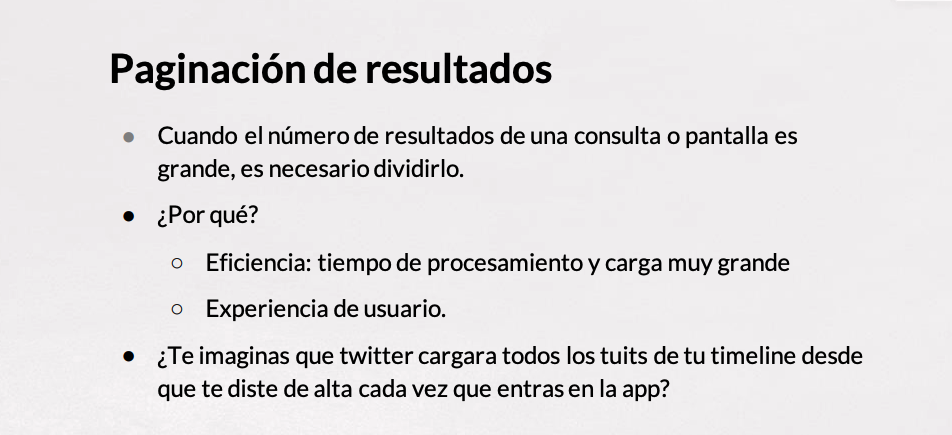
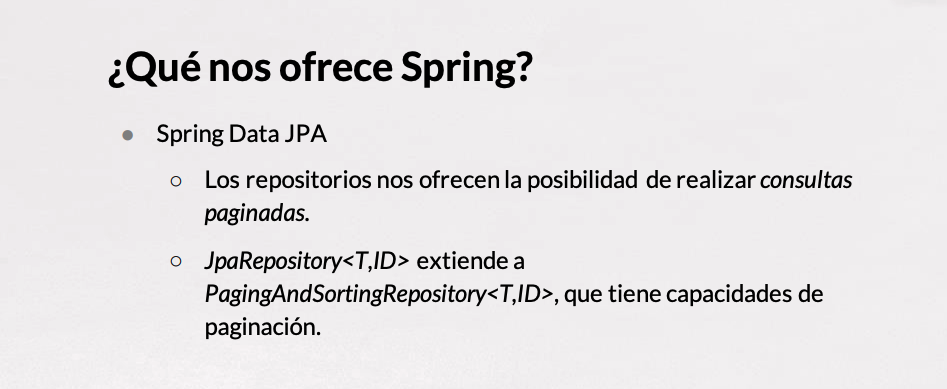
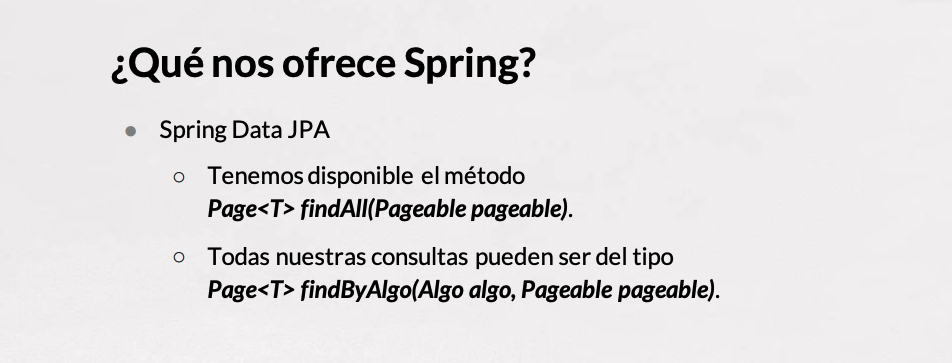
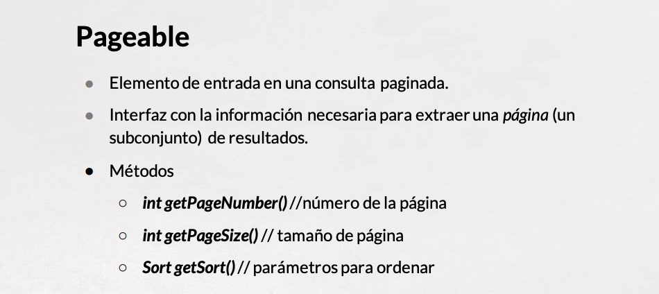
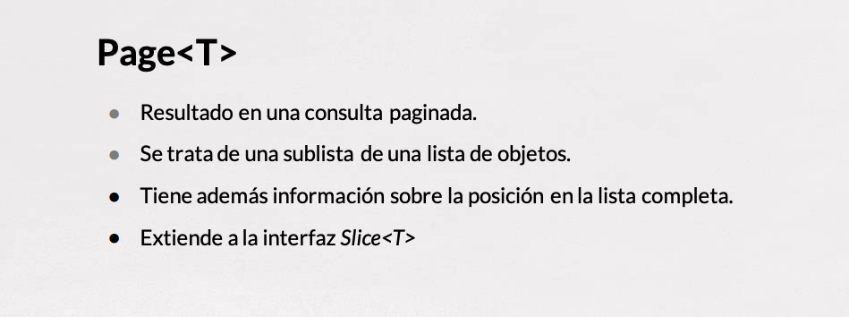
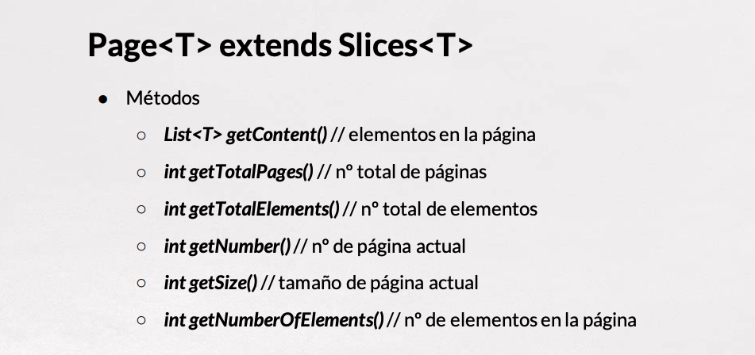
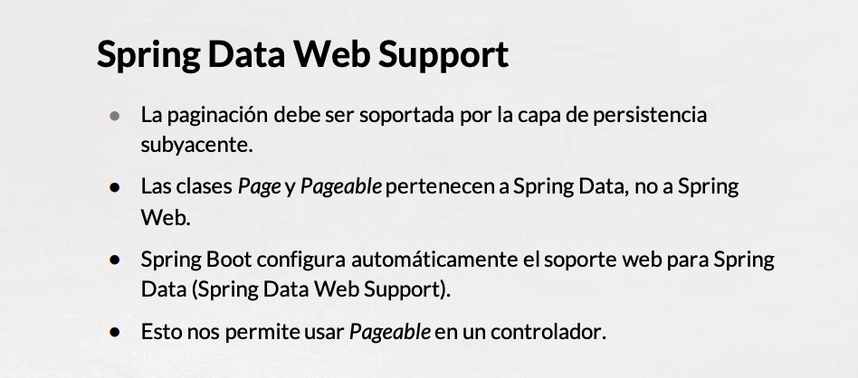
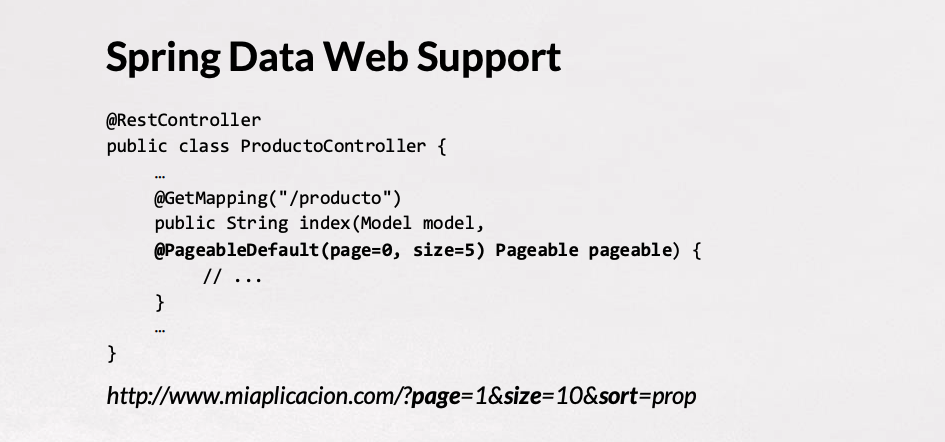
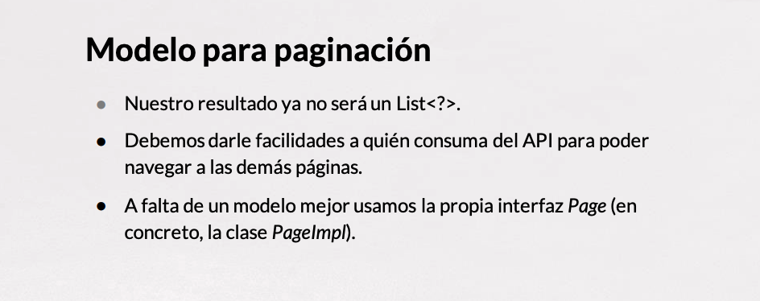
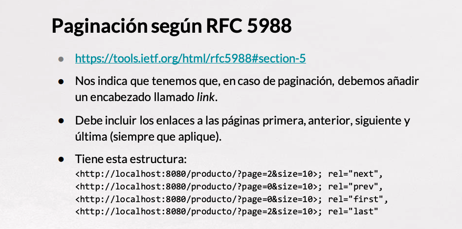


# 04 Manejo de parámetros en el Query (Parte I) 16:49 

[PDF Manejo_de_parámetros_en_el_query.pdf](pdfs/02_Manejo_de_parámetros_en_el_query.pdf)

## Resumen Profesor

### Anotación @RequestParam

Esta anotación puede tomar los siguientes argumentos:

* `name` o `value`: nombre del parámetro que vamos a recoger de la URL.
* `required`: Indica si el parámetro es o no obligatorio.
* `defaultValue`: proporciona un valor por defecto en el caso de que el usuario no lo haya proporcionado.

### `@RequestParam` y `Optional<T>`

Podemos combinar el uso de `@RequestParam` para que, en lugar de recibir un parámetro `String`, `Integer`, `Long`, ..., recibamos un `Optional` de algún tipo, con todas sus posibles ventajas:

```java
@GetMapping("/path")
public ResponseEntity<?> controllerMethod(@RequestParam("param") Optional<String> param)
```

Si bien con la propia anotación `@RequestParam` podemos *jugar* con `required` y `defaultValue`, el uso de `Optional` nos permite construir métodos versátiles con garantías de evitar cadenas vacías, número inicializados a cero o situaciones similares.

## Transcripción


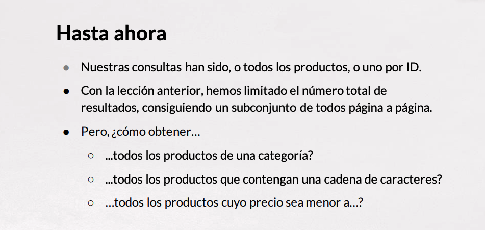
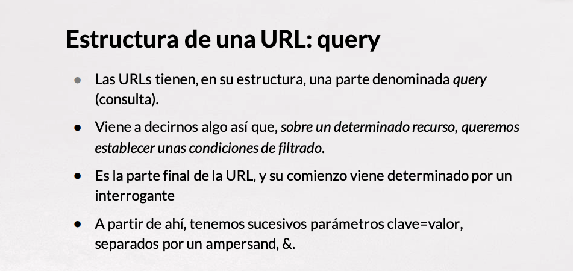

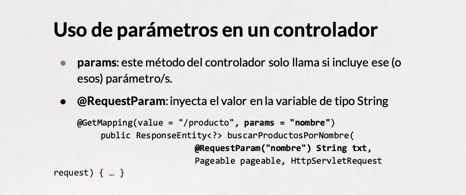
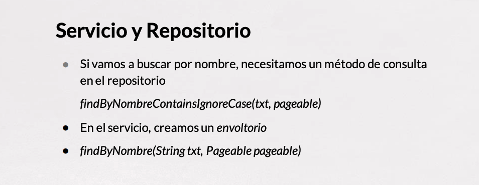

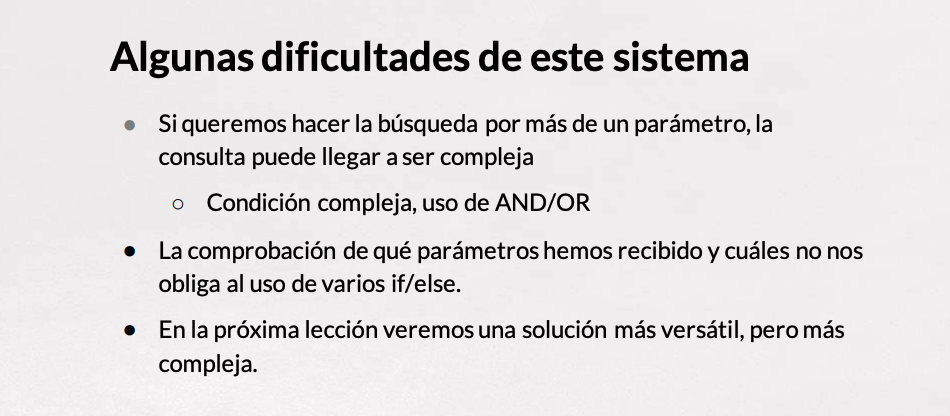
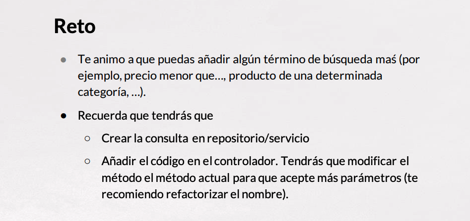

# 05 Manejo de parámetros en el Query (Parte II) 17:25 

[PDF Manejo_de_parámetros_de_consulta_2.pdf](pdfs/03_Manejo_de_parámetros_de_consulta_2.pdf)

## Resumen Profesor

### Criteria API

*Criteria* es una forma de realizar consultas en JPA. En lugar de utilizar el enfoque JPQL (similar a SQL), se trata de utilizar un enfoque programático. De hecho, suele ser muy cómodo para aquellos programadores que no se llevan muy bien con SQL o bases de datos relacionales. Dentro del paquete `javax.persistencia.criteria` encontramos todas las clases e interfaces que se pueden utilizar.

Puedes encontrar más información sobre Criteria en el tutorial de Java EE 7: https://docs.oracle.com/javaee/7/tutorial/persistence-criteria.htm#GJITV.

### Specification Args Resolver

Se trata de un proyecto de Tomasz Kaczmarzyk (@tratif) para el filtrado *fácil* de datos con Spring MVC y Spring Data JPA. Nos permite **evitar** tener que definir una clase por cada `Specification` que queramos utilizar. A través de algunas anotaciones con argumentos, y con los mismos parámetros que reciben nuestros métodos en el controlador, esta librería es capaz de generar las consultas necesarias.

*Puedes encontrar la información completa de este proyecto en su repositorio de github:* 

https://github.com/tkaczmarzyk/specification-arg-resolver

Según la documentación de la librería, una petición como esta:

```sh
GET http://myhost/api/customers?firstName=Homer
```

podría ser manejada con un método como este:

```java
@RequestMapping(value = "/customers", params = "firstName")
public Iterable<Customer> findByFirstName(  
      @Spec(path = "firstName", spec = Like.class) Specification<Customer> spec) {

    return customerRepo.findAll(spec);
}
```

*Nótese el uso de la anotación `@Spec`, que permite indicar la especificación.*

Esto daría como resultado la siguiente consulta:

```sql
select c from Customer c where c.firstName like '%Homer%'
```

### Uso de la librería

Para utilizar esta librería, tenemos que añadir la siguiente dependencia maven:

```html
<dependency>
    <groupId>net.kaczmarzyk</groupId>
    <artifactId>specification-arg-resolver</artifactId>
    <version>2.1.1</version>
</dependency>
```

*Esta versión trabaja con Java 1.8 y ha sido compilada y probada con Spring Boot 2.1. En la web del proyecto se pueden encontrar versiones anteriores.*

Y añadir en la configuración el bean `SpecificationArgumentResolver`.

```java
@Configuration
public class MyConfig implements WebMvcConfigurer {

    @Override
    public void addArgumentResolvers(List<HandlerMethodArgumentResolver> argumentResolvers) {
        argumentResolvers.add(new SpecificationArgumentResolver());
    }

    ...
}
```

## Transcripción


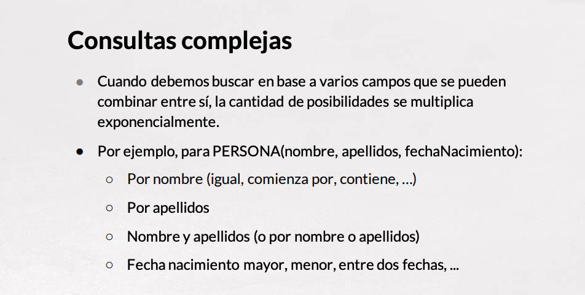
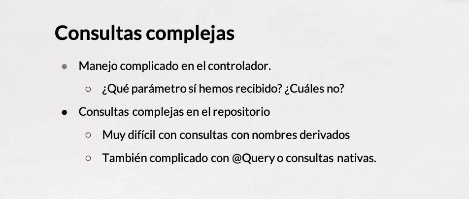
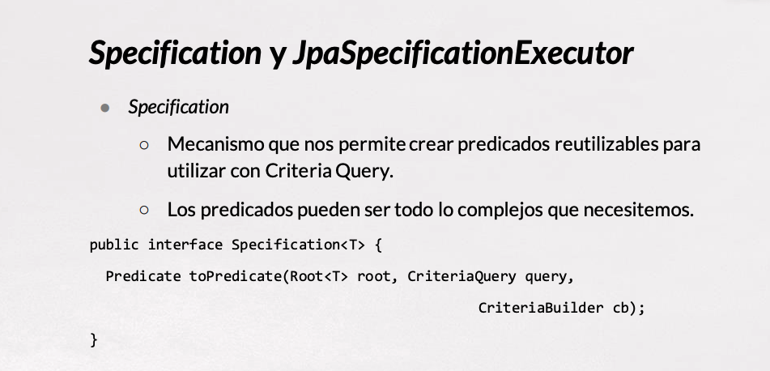
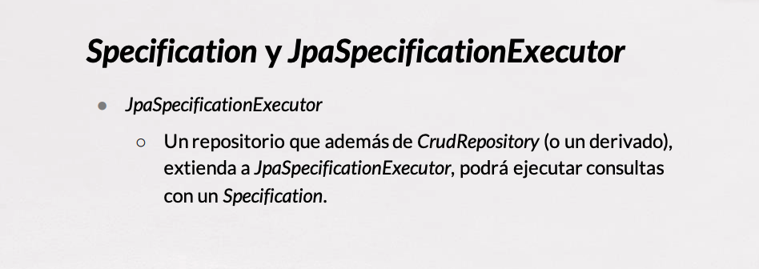


# 06 Soporte para XML 7:19 

[PDF Soporte_para_XML.pdf](pdfs/04_Soporte_para_XML.pdf)

## Resumen Profesor

La dependencia de Jackson para poder transformar en XML es:

```html
<dependency>
    <groupId>com.fasterxml.jackson.dataformat</groupId>
    <artifactId>jackson-dataformat-xml</artifactId>
</dependency>
```

## Transcripción


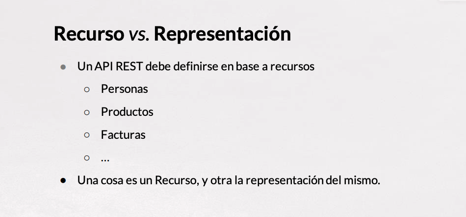
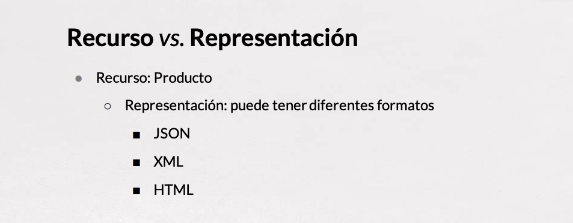
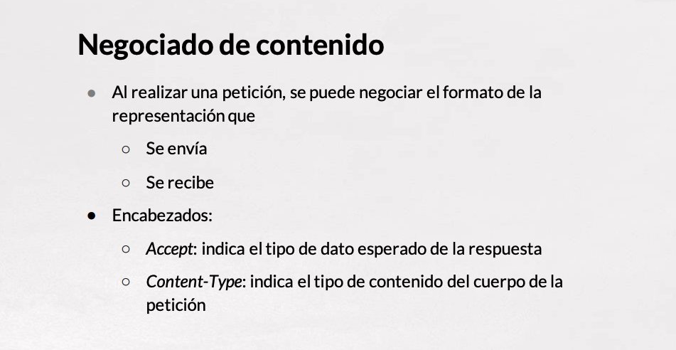
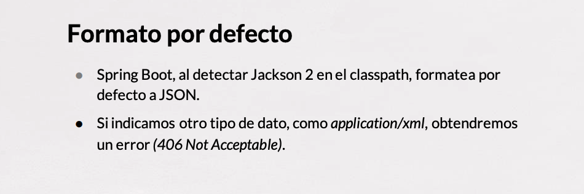
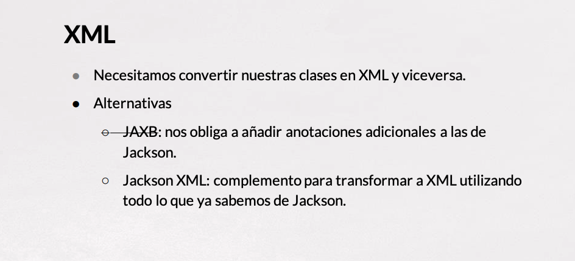
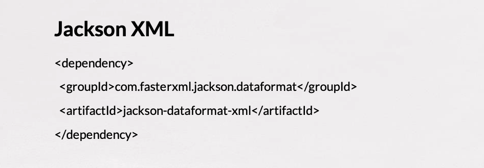

# Contenido adicional 4

* [PDF Paginación_de_resultados.pdf](pdfs/01_Paginación_de_resultados.pdf)
* [PDF Manejo_de_parámetros_en_el_query.pdf](pdfs/02_Manejo_de_parámetros_en_el_query.pdf)
* [PDF Manejo_de_parámetros_de_consulta_2.pdf](pdfs/03_Manejo_de_parámetros_de_consulta_2.pdf)
* [PDF Soporte_para_XML.pdf](pdfs/04_Soporte_para_XML.pdf)
