# 2. Gestión de usuarios 63m

* 06 Modelo de usuario y rol 15:31 
* 07 Repositorio y servicio 7:19 
* 08 Servicio UserDetailsService 8:12 
* 09 Controlador de registro 12:37 
* 10 Refactorización para usar DTO 20:12 
* Contenido adicional 5

# 06 Modelo de usuario y rol 15:31 

[PDF Modelo_de_usuario_y_rol.pdf](pdfs/05_Modelo_de_usuario_y_rol.pdf)

## Resumen Profesor

No existe.

## Transcripción

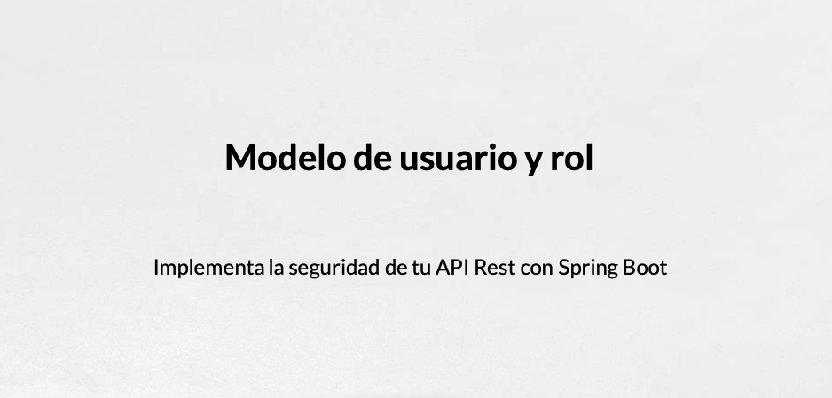
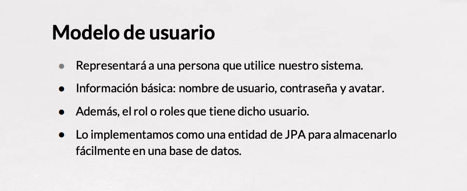
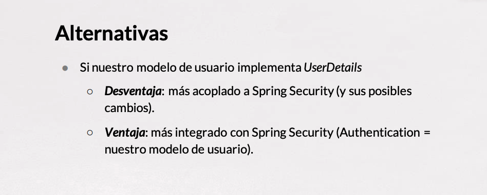
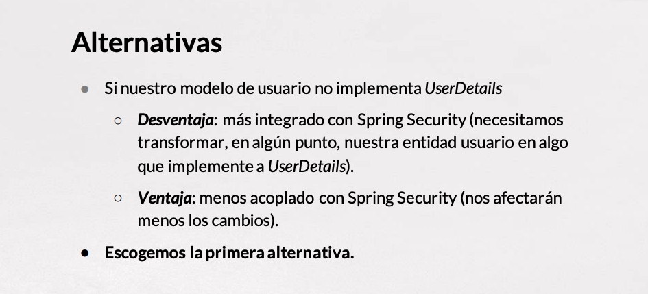
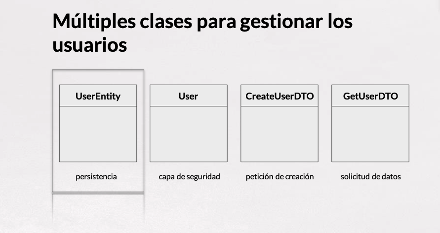
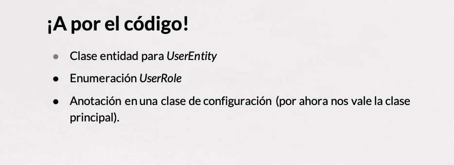
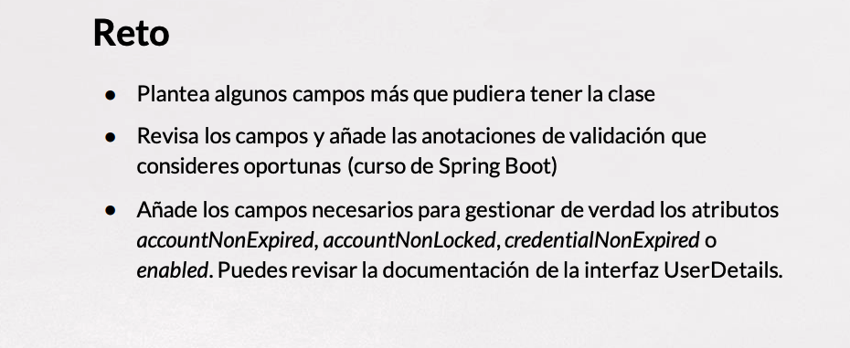

# 07 Repositorio y servicio 7:19 

[PDF Repositorio_y_servicios.pdf](pdfs/06_Repositorio_y_servicios.pdf)

## Resumen Profesor

No existe.

## Transcripción

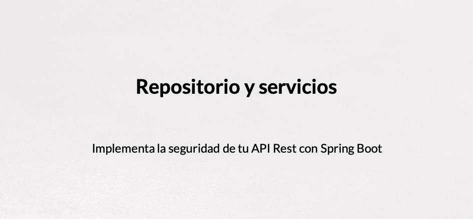
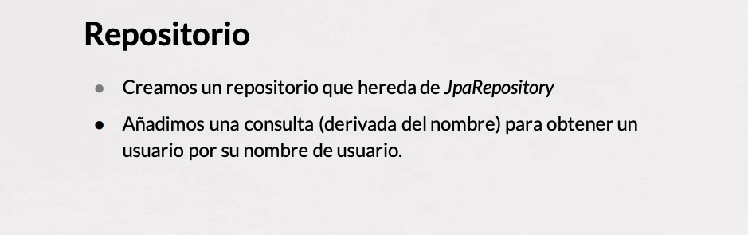
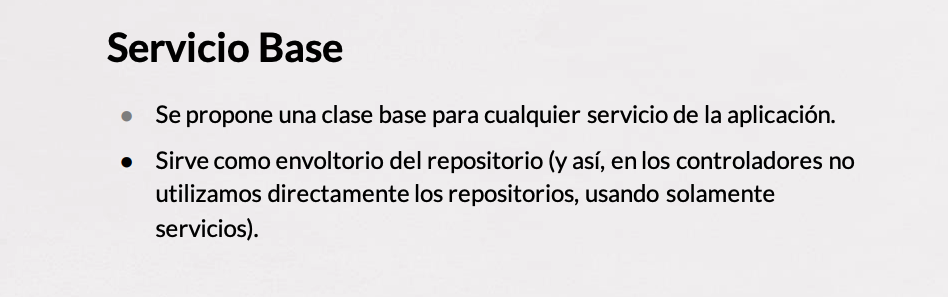
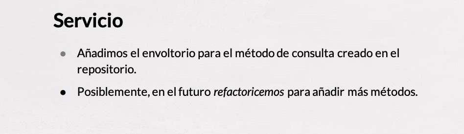

# 08 Servicio UserDetailsService 8:12 

[PDF UserDetailsService.pdf](pdfs/07_UserDetailsService.pdf)

## Resumen Profesor

No existe.

## Transcripción

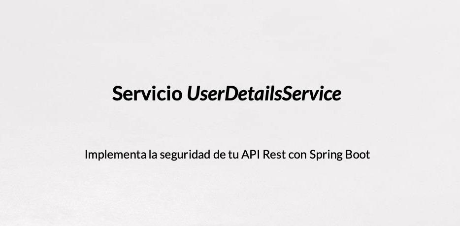
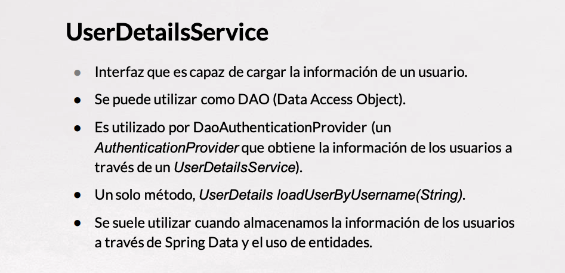
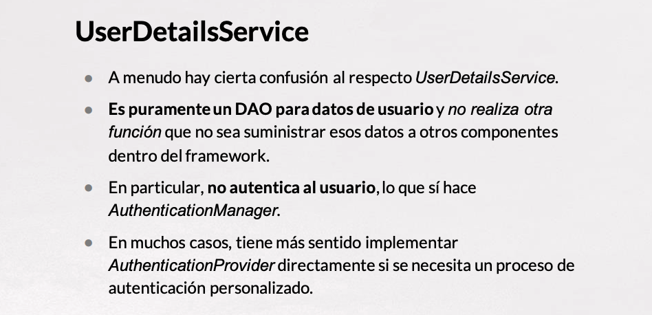
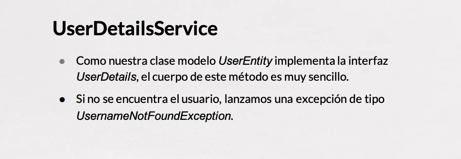

# 09 Controlador de registro 12:37 

[PDF Controlador_de_registro.pdf](pdfs/08_Controlador_de_registro.pdf)

## Resumen Profesor

No existe.

## Transcripción

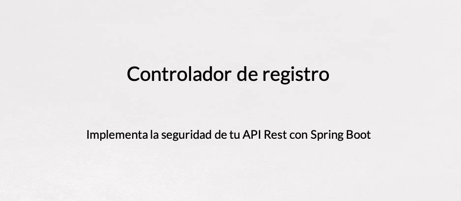
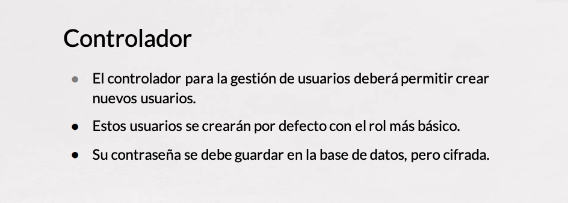
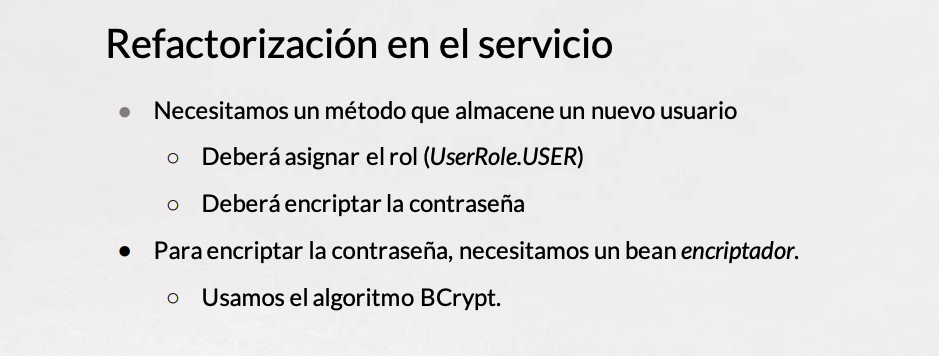
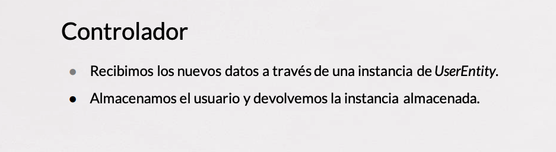

# 10 Refactorización para usar DTO 20:12 

[PDF RefactorizaDto.pdf](pdfs/09_RefactorizaDto.pdf)

## Resumen Profesor

No existe.

## Transcripción

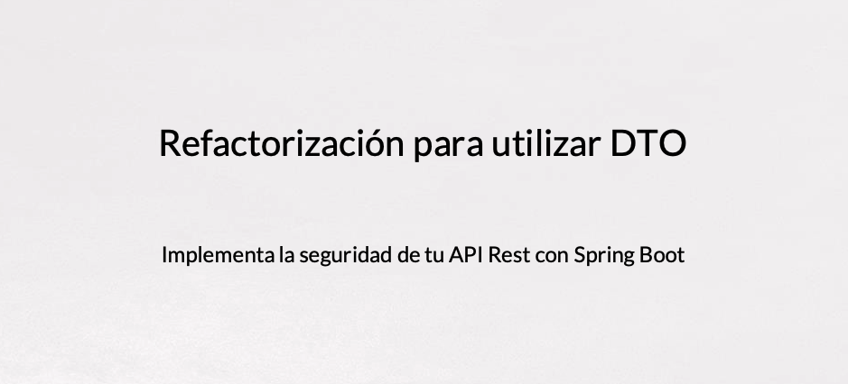
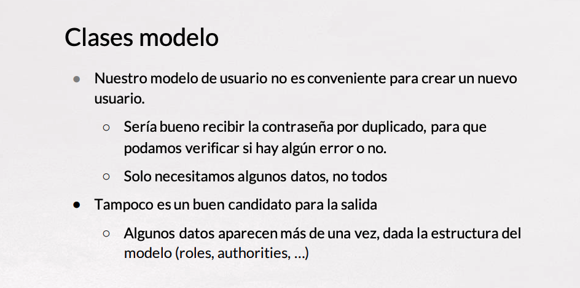
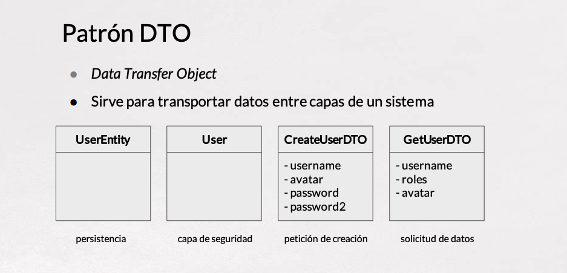

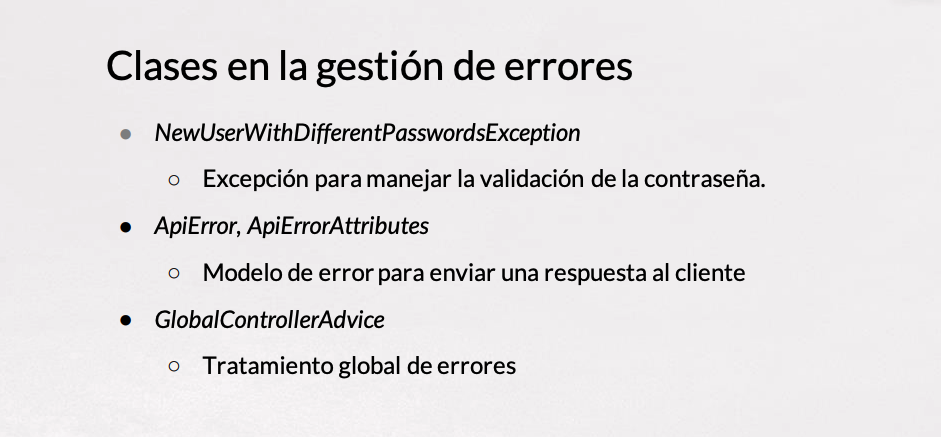

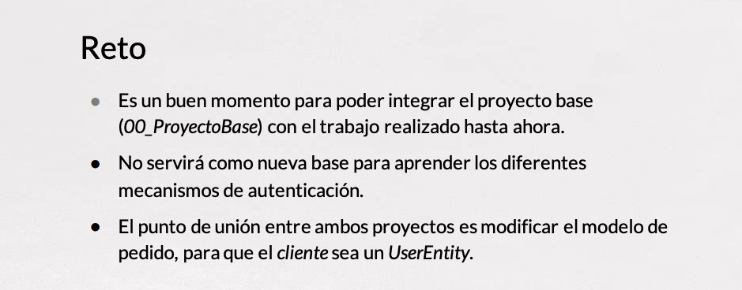

# Contenido adicional 5

* [PDF Modelo_de_usuario_y_rol.pdf](pdfs/05_Modelo_de_usuario_y_rol.pdf)
* [PDF Repositorio_y_servicios.pdf](pdfs/06_Repositorio_y_servicios.pdf)
* [PDF UserDetailsService.pdf](pdfs/07_UserDetailsService.pdf)
* [PDF Controlador_de_registro.pdf](pdfs/08_Controlador_de_registro.pdf)
* [PDF RefactorizaDto.pdf](pdfs/09_RefactorizaDto.pdf)
