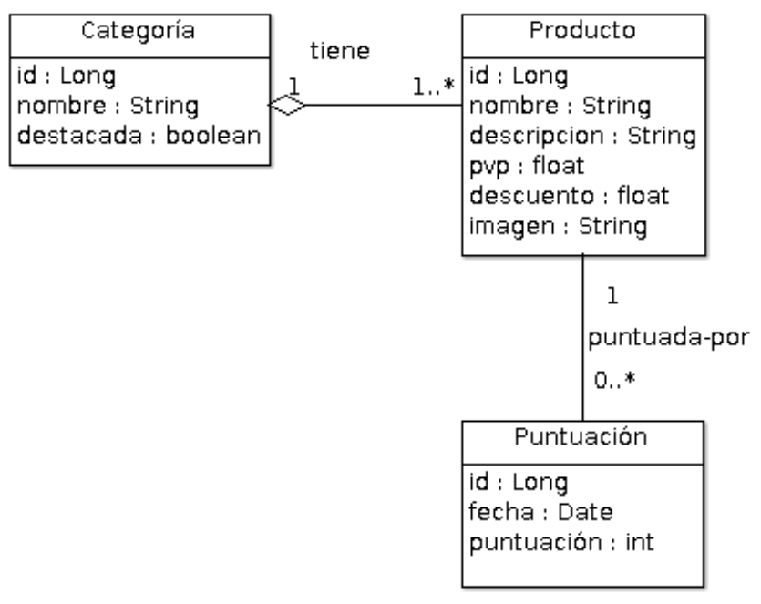

# 2. Sintaxis básica 1:04
   * 08 Texto y variables 10:57 
   * 09 Sintaxis básica: Expresiones 12:19 
   * 10 Sintaxis básica: Expresiones de utilidad 5:07 
   * 11 Operaciones aritméticas, condiciones y comparaciones 14:19 
   * 12 Bucles e iteraciones 10:22 
   * 13 Presentación del proyecto de ejemplo 11:01 
   * Contenido adicional 8
   
# 08 Texto y variables 10:57

[PDF 04_Texto_y_variables.pdf](pdfs/04_Texto_y_variables.pdf)

## Resumen Profesor

Lo podemos manejar mediante los atributos `th:text` y `th:utext`. Con ellos, podemos inyectar cualquier tipo de contenido textual.

```html
<span th:text="${nombre}">mundo</span>
```

Si el texto a inyectar incluye etiquetas HTML y queremos que estas sean procesadas, `th:text` no va a producir el resultado esperado. Para ello, deberíamos usar `th:utext`, que *mostrará* el texto sin procesarlas.

También podemos utilizar `th:text` y `th:utext` para inyectar valores numéricos. Se realizará el casting correspondiente para mostrarlo como texto.

## Transcripción

# 09 Sintaxis básica: Expresiones 12:19 

[PDF 05_Sintaxis_basica.pdf](pdfs/05_Sintaxis_basica.pdf)

## Resumen Profesor

### Lenguaje de expresión

Thymeleaf utiliza en su dialecto estándar el lenguaje OGNL (Object-Graph Navigation Language), un lenguaje de expresiones para Java, que permite trabajar con objetos, tomando y estableciendo propiedades, haciendo llamadas a métodos, manejo de arrays, ...

Sin embargo, el dialecto para Spring utiliza SpEL (Spring Expression Language), otro lenguaje de expresiones que es común a todos los módulos y tecnologías de Spring, con análgas funcionalidades.

En nuestro caso, dado que utilizaremos Thymeleaf con Spring (con su correspondiente dialecto), tendremos que hacer uso de SpEL, si bien, en la gran mayoría de los casos, las expresiones OGNL y SpEL serán iguales.

### Expresiones básicas

SpEL (y OGNL) nos proveen de diferentes tipos de expresiones. Algunas las dejaremos para el curso avanzado de Thymeleaf.

* **Expresiones variables**: `${...}`
* **Expresiones variables de selección**: `*{...}`
* Expresiones de mensaje: `#{...}`
* **Expresiones de enlaces**: `@{...}`
* Expresiones de fragmentos: `~{...}`

También podemos hacer uso de literales, como en otros lenguajes de expresión (textuales, numéricos, booleanos, nulos, …)

### Expresiones variables

Dada una expresión, como `${today}`, Thymeleaf buscará en el contexto una variable llamada *today*.

Tenemos también múltiples posibilidades, con la notación de punto (`${persona.nombre}`) o de corchete (`${persona['padre']['nombre']}`); así como la manipulación de *maps* (`${personas['Luismi'].edad}`) y arrays (`${arrayPersonas[0].nombre}`).

También podemos realizar llamadas a métodos definidos en los objetos (`${persona.nombreCompleto()}`).

### Expresiones de selección

Las expresiones de selección o expresiones en selección son expresiones variables que nos permiten ejecutarlas en el marco de un objeto, creando entonces expresiones más abreviadas.

Los siguientes fragmentos de una plantilla nos ilustrarán como ejemplo, y son equivalentes.

```html
<div th:object="${session.usuario}">
    <p>Nombre: <span th:text="*{nombre}">Luis Miguel</span>.</p>
    <p>Apellidos: <span th:text="*{apellidos}">López</span>.</p>
    <p>Nacionalidad: <span th:text="*{nacionalidad}">Español</span>.</p>
</div>
 
<div>
    <p>Nombre: <span th:text="${session.usuario.nombre}">Luis Miguel</span>.</p>
    <p>Apellidos: <span th:text="${session.usuario.apellidos}">López</span>.</p>
    <p>Nationality: <span th:text="${session.usuario.nacionalidad}">Español</span>.</p>
</div>
```

## Transcripción

# 10 Sintaxis básica: Expresiones de utilidad 5:07 

[PDF 05-2_Sintaxis_basica__expresiones_de_utilidad.pdf](pdfs/05-2_Sintaxis_basica__expresiones_de_utilidad.pdf)

## Resumen Profesor

Disponemos de múltiples objetos de utilidad, con decenas de métodos, que nos ayudarán en las tareas más comunes:

* `#execInfo`: información sobre la plantilla que estamos procesando.
* `#messages`: tratamiento de expresiones de mensajes conjuntamente con expresiones variables.
* `#uris`: métodos para el tratamiento de URLs/URIs
* `#conversions`: métodos para ejecutar conversiones (si es que las hay configuradas)
* `#dates`: tratamiento de fechas `java.util.Date`.
* `#calendars`: tratamiento de fechas `java.util.Calendar`.
* `#numbers`: formateo de números
* `#strings`: tratamiento de cadenas de caracteres.
* `#objects`: métodos para objetos en general.
* `#bools`: métodos para la evaluación de booleanos
* `#arrays`: métodos para el tratamiento de arrays.
* `#lists`: métodos para el tratamiento de listas.
* `#sets`: métodos para el tratamiento de *sets*.
* `#maps`: métodos para el tratamiento de *maps*.
* `#aggregates`: metodos para el cálculo de medias aritméticas y sumas en arrays o colecciones.
* `#ids`: métodos para la gestión del atributo id.

Dada la cantidad de clases y métodos disponibles, os animo a que visitéis la documentación del paquete org.thymeleaf.expressions, donde están definidos los métodos de cada uno de estos objetos: https://www.thymeleaf.org/apidocs/thymeleaf/3.0.0.RELEASE/org/thymeleaf/expression/package-summary.html

## Transcripción

# 11 Operaciones aritméticas, condiciones y comparaciones 14:19 

[PDF 06_Operaciones_aritmeticas_condiciones_y_comparaciones.pdf](pdfs/06_Operaciones_aritmeticas_condiciones_y_comparaciones.pdf)

## Resumen Profesor

### Operadores aritméticos

* Suma: `${4 + 0.2}`
* Resta: `${3 - 0.12}`
* Multiplicación: `${4 * 3}`
* Divisón entera: `${4 / 3}`
* Resto: `${5 % 3}`
* Divisón no entera `${4 / 3.0}`
* Potencia `${4^3}`
* Cambio de signo `${-(-2)}`

### Operadores textuales

* Concatenación: `${'Hola ' + 'mundo'}`
* Sustitución de literales: `|Mi nombre es ${nombre}|`

### Operadores relacionales

* Menor: `${3 < 2}` o `${3 lt 2}`
* Menor o igual: `${3 <= 3}` o `${3 le 3}`
* Mayor: `${3 > 2}` o `${3 gt 2}`
* Mayor o igual: `${3 >= 3}` o `${3 ge 3}`
* Igual: `${'hola' == 'Hola'} ${'hola' eq 'Hola'}`
* Distinto: `${'hola' != 'Hola'}` o `${'hola' ne 'Hola'}`

### Operadores booleanos

* And: `${(3 < 4) and (4 < 5)}`
* Or: `${(3 > 4) or (4 < 5)}`
* Negacion: `${ not (3 < 4) }`

### Comparaciones `th:if` y `th:unless`

```html
<div th:if="${not #lists.isEmpty(lista)}">
  <p th:text="|Nombre del producto: ${lista[0].nombre}|">nombre</p>
</div>
<div th:unless="${not #lists.isEmpty(lista)}">
  <p>No hay productos disponibles en la lista</p>
</div>
```

### Operadores condicionales

Mediante el uso del operador *condición ? valor si verdadero : valor si falso*

```html
<p th:text="${not #lists.isEmpty(lista)} ? |Nombre del producto: ${lista[0].nombre}| : 'No hay productos disponibles en la lista'">nombre</p>
```

### Expresiones por defecto

```html
<p th:text="*{descripcion}?: 'Si quiere más información sobre nuestro productos, no dude en contactar con nosotros'">texto</p>
```

### Token *no-op*

```html
<p th:text="*{descripcion}?: _">Si quiere más información sobre nuestro productos, no dude en contactar con nosotros</p>
```

### Elemento `th:block` (o `th-block`)

`th:block` es un contenedor de atributos Thymeleaf. Estos atributos serán procesados, y posteriormente desaparecerá el bloque, pero no su contenido. Es muy útil en varios contextos, como aplicación de condiciones a un grupo de elementos.

Por ejemplo:

```html
<table>
    <th:block th:each="user : ${users}">
        <tr>
            <td th:text="${user.login}">...</td>
            <td th:text="${user.name}">...</td>
        </tr>
        <tr>
            <td colspan="2" th:text="${user.address}">...</td>
        </tr>
    </th:block>
</table>
```

## Transcripción

# 12 Bucles e iteraciones 10:22 

[PDF 07_Bucles_e_iteraciones.pdf](pdfs/07_Bucles_e_iteraciones.pdf)

## Resumen Profesor

### Iterar con Thymeleaf

Thymeleaf nos permite iterar sobre colecciones utilizando el atributo `th:each`.

```html
<tr th:each="producto : ${productos}">
  <td th:text="${producto.nombre}">Nombre</td>
  <td th:text="${producto.precio}">1.00</td>
</tr>
```

Nos permite iterar sobre un extenso elenco de colecciones

* `java.util.List`.
Arrays
* `java.util.Iterable`.
* `java.util.Collection`.
* `java.util.Enumeration`.
* `java.util.Iterator`.
* `java.util.Map` (devuelve objetos de tipo `java.util.Map.Entry`)

### Estado de la iteración

Al usar `th:each`, Thymeleaf nos ofrece un buen mecanismo para identificar el estado de la iteraciones: la variable *status*:

* El índice actual (`index`), con valor inicial 0.
* El índice actual (`count`), con valor inicial 1.
* El número total de elementos (`size`).
* Si la iteración es par o impar (`even`/`odd`).
* Si es la primera iteración (`first`) o la última (`last`).

## Transcripción

# 13 Presentación del proyecto de ejemplo 11:01 

[PDF 08_Presentacion_del_proyecto_de_ejemplo.pdf](pdfs/08_Presentacion_del_proyecto_de_ejemplo.pdf)
[datos.ods](pdfs/datos.ods)
[diagrama.zargo](diagrama.zargo)

## Resumen Profesor

### Temática

Versará sobre un catálogo de productos on-line, con el siguiente diagrama de clases:



*Diagrama de clases*

### Plantilla

Usaremos una plantilla básica de bootstrap 3. Como punto de partida, hemos usado esta:

http://getbootstrap.com/docs/3.3/examples/starter-template/

### Funcionalidades

### Subsistema cliente

* Visualización de un número de productos al azar.
* Visualización de las categorías.
* Filtrado de productos por categorías.
* Detalles de un producto.

### Subsistema de administración

* Listado de todas las categorías
* Creación, edición y borrado de categorías.
* Listado de todos los productos
* Creación, edición y borrado de productos.
* Validación de la creación-edición de productos y gestión de errores.

### Controladores

* `MainController`
   * `/` → página principal
   * `/product/{id}` → detalle de un producto
* `CategoriaController` (`/admin/categoria`)
   * `/` → listado categorías
   * `/nueva` → formulario nueva categoría
   * `/editar/{id}` → formulario de edición de categorías
   * `/borrar/{id}` → borrado de categorías.
* `ProductoController` (`/admin/producto`)
   * `/` → listado productos
   * `/nuevo` → formulario nuevo producto
   * `/editar/{id}` → formulario de edición de productos
   * `/borrar/{id}` → borrado de productos.

## Transcripción

# Contenido adicional 8   

* [PDF 04_Texto_y_variables.pdf](pdfs/04_Texto_y_variables.pdf)
* [PDF 05_Sintaxis_basica.pdf](pdfs/05_Sintaxis_basica.pdf)
* [PDF 05-2_Sintaxis_basica__expresiones_de_utilidad.pdf](pdfs/05-2_Sintaxis_basica__expresiones_de_utilidad.pdf)
* [PDF 06_Operaciones_aritmeticas_condiciones_y_comparaciones.pdf]
* [PDF 07_Bucles_e_iteraciones.pdf](pdfs/07_Bucles_e_iteraciones.pdf)
* [PDF 08_Presentacion_del_proyecto_de_ejemplo.pdf](pdfs/08_Presentacion_del_proyecto_de_ejemplo.pdf)
* [datos.ods](pdfs/datos.ods)
* [diagrama.zargo](diagrama.zargo)
