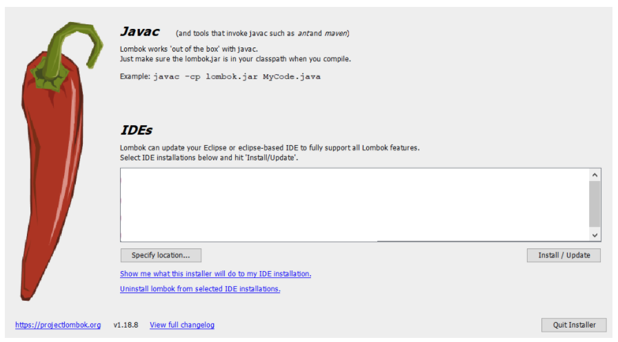

# 1. Introducción 34m

   * 01 Presentación 5:25 
   * 02 ¿Qué puede hacer Thymeleaf por mi? 9:28 
   * 03 Elementos de Spring Framework necesarios para el curso 9:31 
   * 04 Ejemplo a desarrollar durante el curso 10:19 
   * Contenido adicional 4
   
# 01 Presentación 5:25

[PDF Presentacion_del_curso.pdf](pdfs/00_Presentacion_del_curso.pdf)

## Resumen Profesor

No existe.

## Transcripción

# 02 ¿Qué puede hacer Thymeleaf por mi? 9:28 

[PDF Que_puede_hacer_Thymeleaf_por_mi.pdf](pdfs/01_Que_puede_hacer_Thymeleaf_por_mi.pdf)

## Resumen Profesor

No existe.

## Transcripción

# 03 Elementos de Spring Framework necesarios para el curso 9:31 

[PDF Elementos_de_Spring_Framework_necesarios_para_el_curso.pdf](pdfs/02_Elementos_de_Spring_Framework_necesarios_para_el_curso.pdf)

## Resumen Profesor

### Spring

Spring es todo un ecosistema de proyectos que nos dan soporte para el desarrollo de aplicaciones empresariales robustas.

Puedes conocer todos los proyectos de Spring en https://spring.io/projects.

### Spring Tool Suite

En el curso trabajaremos con Spring Tool Suite sobre eclipse. Si tienes dudas sobre su instalación, puedes encontrar más instrucciones en nuestro curso de Spring Core o de Spring Boot y Spring MVC. Para descargarlo, puedes pulsar [aquí](https://spring.io/tools).

## Transcripción

# 04 Ejemplo a desarrollar durante el curso 10:19 

[PDF Ejemplo_a_desarrollar_durante_el_curso.pdf](pdfs/03_Ejemplo_a_desarrollar_durante_el_curso.pdf)

## Resumen Profesor

Partiremos del proyecto de ejemplo del **Curso de Introducción a Thymeleaf**, en el que desarrollamos un catálgo de productos, con algunos pequeños ajustes.

### Uso de *Project Lombok*

Según su propia web https://projectlombok.org/, *Lombok* es una librería de Java que se conecta automáticamente a nuestro IDE y crea herramientas, *condimentando* nuestro código. Nunca volveremos a escribir otro método *getter o equals*; con una anotación nuestras clases tendrán un generador con todas las funciones.

Para instalarlo, tan solo tenemos que descargar la última versión en https://projectlombok.org/download y ejecutarlo (haciendo doble click o mediante un terminal a través de `java -jar lombok.jar`).

Aparecerá entonces un asistente en el que se listarán las instancias de eclipse (o sus derivados) instalados en el sistema. Si no aparece la instalación deseada, la podemos buscar pulsando el botón *specify location*. Para terminar la instalación, pulsaremos el botón *Install/Update*.

### Anotaciones más usuales

Las anotaciones más usuales de lombok son:

* `@Getter`: a nivel de clase, genera un método *getter* para todos los atributos de la clase.
* `@Setter`: a nivel de clase, genera un método *setter* para todos los atributos de la clase.
* `@RequiredArgsConstructor`: genera un constructor para los atributos marcados con `@NonNull` o que sean `final`.
* `@AllArgsConstructor`: genera un constructor para todos los atributos de la clase.
* `@NoArgsConstructor`: genera un constructor sin argumentos.
* `@EqualsAndHashCode`: genera los métodos `equals` y `hashCode`.
* `@ToString`: genera el método `toString`.

También hay algunas anotaciones equivalentes a un conjunto de las anteriores, muy útiles:

* `@Data`: equivalente a `@Getter`, `@Setter`, `@RequiredArgsConstructor`, `@EqualsAndHashCode` y `@ToString`.

Puedes encontrar más información en https://projectlombok.org/features/all y en https://projectlombok.org/api/lombok/package-summary.html.

### Refactorización de algún código

Se ha refactorizado algún código, para dejar de usar la anotación `@Autowired`, ya que no es obligatoria si tenemos un constructor con los parámetros correspondientes. Este estilo de inyección (via constructor) nos permite algunas ventajas:

* Mejores opciones de cara a la implementación de tests.
* Posibilidad, si alguna vez lo necesitáramos, de realizar una instanciación de la clase (realmente, tiene que ver con el punto anterior).

También hemos utilizado `Optional` para manejar aquellos parámetros que no son obligatorios en algún controlador.

### Qué queremos desarrollar

* Internacionalización (basada en ficheros y en base de datos).
* Uso de fragmentos.
* Uso de AJAX.
* Manejo de la seguridad.
* Paginación de resultados.
* Modelos de datos más complejos y su impacto en los formularios.
* Subida de ficheros.

## Transcripción

# Contenido adicional 4   

* [PDF Presentacion_del_curso.pdf](pdfs/00_Presentacion_del_curso.pdf)
* [PDF Que_puede_hacer_Thymeleaf_por_mi.pdf](pdfs/01_Que_puede_hacer_Thymeleaf_por_mi.pdf)
* [PDF Elementos_de_Spring_Framework_necesarios_para_el_curso.pdf](pdfs/02_Elementos_de_Spring_Framework_necesarios_para_el_curso.pdf)
* [PDF Ejemplo_a_desarrollar_durante_el_curso.pdf](pdfs/03_Ejemplo_a_desarrollar_durante_el_curso.pdf)
