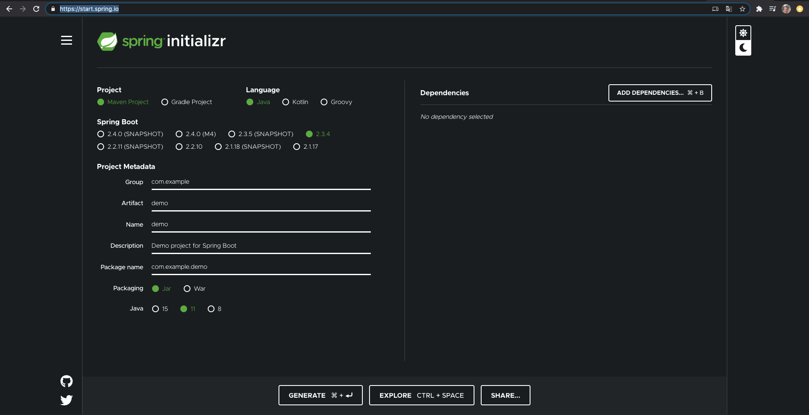

# 2. Building a Spring Boot Web App • 19 clases • 2h 24min

* Introduction 03:14
* Spring Initializer 15:25
* Open Project in IntelliJ 08:52
* Create New Spring Boot Project 1 preguntas
* GitHub Workflow 12:20
* JPA Entities 13:01
* Equality in Hibernate 05:07
* Spring Data Repositories 04:56
* Initializing Data with Spring 08:31
* Add Publisher Entity 1 preguntas
* Publisher Relationships 08:35
* H2 Database Console 05:09
* Introduction to Spring MVC 05:11
* Configuring Spring MVC Controllers 06:14
* Thymeleaf Templates 11:10
* Display List of Authors 1 preguntas
* Introduction to Spring Pet Clinic 07:22
* Running Spring Pet Clinic 03:52
* Intro to SFG Version of Spring PetClinic Application 04:53
* Spring Pet Clinic - Initializing Spring PetClinic Application 13:52
* Spring Pet Clinic - Task Planning 05:47
* Conclusion 00:32

## Introduction 03:14

## Spring Initializer 15:25

En este video, le mostraré lo fácil que es crear un proyecto Spring Framework.

Ahora, en mis primeros días con Spring Framework y esto se remonta algunos años, lamentablemente. El Spring Framework ha existido por mucho tiempo. Cuando comencé a usar Spring Framework alrededor de la Versión 2, si recuerdo bien, no teníamos nada como Spring Initializr. Todo lo que tenía que hacer sería enrollado a mano, por lo que tendría que pasar y crear un nuevo proyecto Maven, salir e investigar la pila de dependencias que necesitaba incorporar al proyecto para conectar estos diferentes componentes Spring.

Lo que Spring Initializr hace es que se apaga y le brinda opciones comunes para las cosas comunes que traerá. Por lo tanto, es posible que desee tener como Thymeleaf en su proyecto. Vas a hacer un proyecto web de Spring.

Todos estos son conjuntos de dependencias que podemos conectar con Spring Initializr. Lo que va a hacer es formar el proyecto y darle opciones de Spring down, ya sea Maven build o Gradle build y armar un proyecto para usted.

Y con solo unos pocos clics del mouse que puede hacer de manera efectiva, me llevaría 10 años atrás, una tarde de investigación y ensamblaje de todas estas dependencias. 

Por lo tanto, es un gran ahorro de tiempo tener este tipo de tecnología ahora.

Es realmente sorprendente, especialmente para mí viniendo de los viejos tiempos donde tenía que hacer todo esto manualmente.

Así que ustedes estarán un poco mimados. Así que saltemos y echemos un vistazo al proyecto Spring Initializr en GitHub y hablemos más sobre sus capacidades.

Spring Initializr es un proyecto de código abierto, por supuesto, y puedes ver el proyecto aquí en GitHub. Si quieres, ve y revisa el proyecto tú mismo. 

En realidad, lo encontré buscando en Google Spring Initializr. Lo deletrean divertido sin una E entre la Z y la R.

Creo que eso es posiblemente una cosa europea para deletrear de esa manera.

En los Estados Unidos usamos una E allí. Pero aquí está el proyecto y si se reduce a leerme, puede obtener toda la información sobre el proyecto en sí y lo que hay allí, los diferentes módulos. Pero lo principal que le interesará es generar un proyecto y en realidad hay varias técnicas diferentes que puede hacer para generar un proyecto. Puede verificar esto, ejecutarlo localmente y puede ejecutar comandos curl contra start. primavera. io para descargar esto y hay una serie de parámetros diferentes.

Y no voy a entrar en cómo usar esto desde la línea de comandos. Eso está un poco más allá del alcance que quiero hacer.

Echaremos un vistazo a la interfaz web, pero la conclusión principal que quería que se alejara de esto es que hay un proyecto de código abierto detrás de ella. 

Puede usarlo mediante programación o ir al sitio web y usarlo.

Muchos de los IDE tienen una integración, por lo que pueden abstraerlo para usted, lo cual es bueno o puede comenzar. Spring.io y lo veremos específicamente en un próximo segmento de esta lección.

Ahora, una de las cosas principales detrás de Spring Initializr son los Spring Boot Starters. Spring Boot Starters son básicamente un conjunto de dependencias seleccionadas y hablaremos de esto a lo largo del curso como un conjunto de dependencias seleccionadas. Concepto muy muy poderoso.

Entonces, si recuerdan que dije al principio cuando tenía que hacer todo esto manualmente, lo que Spring nos está dando son básicamente listas de materiales de Maven que nos dan una lista de materiales, un conjunto de componentes conocidos que funcionan juntos.

Como si quisiéramos incorporar mensajes JMS a nuestra aplicación Spring, incluiríamos una dependencia de este Spring Boot Starter y traeríamos los diferentes componentes que necesitaría para conectar ese sabor particular de JMS.

Entonces, lo que voy a hacer ahora es saltar al navegador y echar un vistazo a algunas de estas dependencias y mostrarle cómo funcionan en cuanto a cómo Spring está organizando estas y la cantidad de dependencias diferentes que puede incorporar. Debido a que Java es una comunidad tan grande, tiene varias opciones para elegir.

Puedes ver mi pantalla aquí que tengo GitHub arriba. Este es el proyecto Spring Boot y puedes ver que estoy en el subdirectorio de Spring Boot Starters.

Ahora todos estos aquí son diferentes entrantes que están disponibles.

Por lo tanto, tenemos ActiveMQ, AMPQP, diferentes conectores en la nube, JDBC, Solr, FreeMarker, para que pueda ver muchos proyectos populares de código abierto muy comunes, así que entremos aquí y echemos un vistazo al ActiveMQ aquí. Y esto es solo un POM Maven y echemos un vistazo a este POM y verá y aquí tiene las dependencias enumeradas.

Entonces esto dice que necesito el Spring Boot Starter. También necesito Spring JMS y necesito un broker ActiveMQ y están haciendo una exclusión allí, así como Jakarta JMS.

Entonces esto trae una implementación de la API JMS.

Estas son las diferentes dependencias que necesitaría para mostrar un mensaje de ActiveMQ.

Así que esto es algo muy bueno.

Sin esto, lo que tendríamos que hacer es incluir todas estas interdependencias. Entonces, lo que sucederá es que esto funciona con la administración de dependencias de Maven para incorporar estas bibliotecas a nuestro proyecto y crear estas dependencias.

Entonces, al incluir esta dependencia, obtenemos todas estas otras dependencias.

Entonces, si está un poco confundido sobre cómo funcionan las dependencias dentro de un entorno Maven, tengo un curso completo sobre Maven y hablaremos más sobre este curso. Pero en ese otro curso me sumerjo profundamente en esto.

La conclusión principal aquí es entender que tenemos lo que se llama una lista de materiales y Spring Boot Starter trae los diferentes componentes con los que vamos a trabajar para nuestro proyecto Spring Framework. Su reloj Josh Long habla quién es un defensor de desarrolladores para Pivotal que promueve el Spring Framework para desarrolladores que hablan en todo el mundo.

Su sitio web favorito en el mundo es https://start.spring.io/ Este es el sitio web alojado por Pivotal para que lo usemos para crear proyectos de Spring Framework.

Es un sitio web muy agradable. Y debajo de las cubiertas, lo que está sucediendo allí es recordar en ese primer segmento de esta lección que vimos en Spring Initializr. 

Esto es solo un front-end web en Spring Initializr.

Entonces, hay una aplicación web que podemos usar y seleccionar los componentes que queremos en nuestro proyecto Spring Boot.

Los componentes son los Spring Boot Starters que queremos incluir y esto nos dará un artefacto un archivo zip todo comprimido de un proyecto de inicio para que podamos comenzar a desarrollar con las dependencias preconfiguradas basadas en nuestras selecciones.

Así que vayamos a la Web y echemos un vistazo al https://start.spring.io/ Bien, puedes ver en la pantalla.

He navegado para https://start.spring.io/ El sitio web favorito de io Josh Long en todo el mundo.

Así que echemos un vistazo a algunas de las características de este sitio web.

Y solo como advertencia, esta es la última edición del sitio web alrededor de diciembre de 2019.(Octubre 2020)

A medida que avance en el curso, verá algunas versiones anteriores. Estoy tratando de actualizar esos videos, pero todavía estoy bastante familiarizado y esto también puede cambiar en el futuro. De hecho, han estado evolucionando bastante esta interfaz de usuario e hicieron algunos cambios realmente agradables.

Así que echemos un vistazo a algunas de las características. Justo en la parte superior aquí tienes algunos enlaces y tienes una opción para alternar la interfaz de usuario oscura y la interfaz de usuario clara. Y luego puedes saltar a GitHub.

Ya vimos eso. Twitter o diferentes opciones de ayuda.

Ahora la generación del proyecto tiene una opción de un proyecto Maven y un proyecto Gradle. Principalmente nos quedaremos con Maven por ahora como nuestra herramienta de compilación. Tienes opciones de idioma para Java Kotllin y Groovy. Nos quedaremos con Java.

Ahora puede ver las diferentes versiones de Spring Boot que están disponibles para usar en esta herramienta.

Para el propósito de este curso, no use las versiones de instantáneas. Elijo un Spring Boot 2. 2) 2 o más alto.

Y en eso nos centraremos tanto como sea posible en el curso.

Y luego aquí tienes una sección sobre Metadatos del Proyecto. Tienes el artefacto grupal y luego las opciones.

Creo que por defecto será un colapso así.

Por lo tanto, puede expandir eso y configurar un nombre para la descripción de su proyecto, el nombre del paquete predeterminado y luego también si desea empaquetar jar o war. Nos centraremos y utilizaremos los frascos ejecutables en este curso.

Entonces, una buena característica de Spring Boot.

Hablaremos de eso a medida que avancemos en el curso. Versiones de Java.

Muchas compañías todavía están en Java 8. La mayor parte de este curso se desarrolló originalmente en Java 8. Java 11 está comenzando a ser adoptado.

Comenzaré a avanzar con Java 11 actualizando el curso a Java 11. Java 13.

No voy a usar esa versión. Java 11 es una versión de soporte a largo plazo, por lo que me centraré en admitir las versiones LTS de Java.

Si desea utilizar Java 13, es probable que esté seguro, pero no hablaré de ninguna característica específica de Java 13. Solo actualizaré a las versiones LTS de Java. Ahora dependencias. Aquí puedes bajar.

Puedes hacer una búsqueda. Puedes hacer cosas como el conejo. Puedes ver aquí que trae diferentes opciones para el conejo.

Principalmente una primavera para RabbitMQ.

Si crees que un gran proyecto de código abierto lo escribes y lo buscas o tienes la opción de entrar aquí y hacer clic en esta lista y ahora puedes ver todas estas cosas diferentes.

Y detrás de estos están Spring Boot Starter o un conjunto de Spring Boot Starters.

Aquí puedes ver herramientas de desarrollo. Lombok definitivamente jugará con eso en el curso.

Web, Reactivo, entonces tiene diferentes motores de plantillas, valores, SQL, NoSQL, Mensajería. Entonces puede ver que hay muchas opciones, muchas cosas diferentes que podemos hacer con Spring Framework.

Obviamente no vamos a cubrir todas y cada una de estas opciones. Usaremos un conjunto muy pequeño de estos.

Existen varias opciones preconfiguradas para trabajar con proyectos de Spring Framework.

Obviamente la primavera es muy muy popular.

Así que hay muchas opciones que podemos utilizar.

Lo que vamos a hacer en esta sección del curso es simplemente crear una aplicación web simple y comenzaremos a hablar de eso en la siguiente sección del curso.

Hay muchas opciones dentro de Spring Initializr.

Me imagino que puede ser un poco abrumador.

No se preocupe, vamos a comenzar con algunos muy pequeños y muy simples solo para mojarse los pies con Spring Framework.

Entonces, lo que quiero hacer es crear una aplicación web muy simple en esta sección del curso, así que vamos a saltar sobre Spring Initializr y tomar las dependencias y los entrantes que necesitamos hacer. 

Solo una simple aplicación web. Y mediante una aplicación web, quiero poder crear una página web y recuperarla con la base de datos y obtener esa otra base de datos. Así que no hay nada que hacer allí, pero vamos a revisarlo paso a paso y usar Spring Initializr para crear ese proyecto inicial para nosotros.

Y lo que les voy a mostrar es que literalmente me llevó al menos medio día hacerlo. Antes teníamos la herramienta Spring 
Initializr. Bien, estoy de vuelta al https://start.spring.io/ así que voy a entrar aquí y crear un proyecto. Quiero un proyecto Maven y quiero Java y luego hagamos 2. 2) 2)

Ese es el ejemplo más actual. Voy a nombrar a mi grupo guru. Recuerde que es solo una convención común de Java para usar el reverso de su nombre de dominio para el grupo y llamemos a esta **spring5webapp** así y veamos las opciones. spring5webapp. Luego diremos que la aplicación web simple y el nombre del paquete están predeterminados para el grupo I. RE. y el nombre de la aplicación, así que está perfectamente bien conmigo. Vamos a seguir con un jar ejecutable y luego llevemos esto a Java 11. Si tiene instalado Java 8, continúe y use Java 8. Probablemente no entrará en las características específicas de Java 11. Y veamos aquí.

Expandamos las dependencias para que esto sea un poco más fácil para nosotros. No necesitaremos herramientas de desarrollo.

Queremos Spring Web, así que eso traerá Spring MVC y vamos aquí y vamos a SQL. Vamos a trabajar con Spring Data JPA para hacernos la vida mucho más fácil.

Entonces agregaremos eso. La única otra cosa que quiero traer es la Base de datos H2.

Esto nos dará una base de datos en memoria. Y esas son todas mis selecciones. Entonces puedes ver aquí tenemos tres seleccionados.

Solo ve y verifica dos veces. 

Bien, sigamos adelante y voy a decir generar. Haga clic en esta pestaña de generación aquí abajo en la parte inferior. Puedes verlo mirando en la parte inferior de mi pantalla, ha bajado un archivo zip. Por lo tanto, es un buen archivo zip que contiene un proyecto preconfigurado para nosotros. Para que pueda ver lo fácil que fue generar un proyecto Spring 
Framework para https://start.spring.io/.

Solo unos pocos clics en el mapa y un poco de escritura.

Pude generar mis proyectos, así que bajé ese archivo zip. Dentro de ese archivo zip hay un proyecto Spring Framework completamente funcional que utiliza la herramienta de compilación Maven.

Creo que si la memoria me sirve bien, todo lo que necesitaría tener es Java instalado en su sistema. Viene con el envoltorio Maven, por lo que puede usar el script de shell para ejecutar esto realmente en un sistema que no tiene instalado Maven pero solo Java.

Entonces esto es muy simple.

Esto literalmente es un gran ahorro de tiempo en comparación con hacer todos estos pasos manualmente.

Así que vamos a echar un vistazo a lo que hay dentro de ese archivo zip.

Lo que en Spring Initializr nos proporcionó para nuestro proyecto web Spring.

Bueno.

Puedes ver que he entrado en mi directorio de descargas y aquí en la pantalla he abierto esta aplicación web de Spring 5 y ves que se trata de todos los archivos que estaban dentro de ese archivo zip. Cualquier utilidad zip abrirá este archivo para usted.

Tengo un .gitignore y aquí está. mvn así que aquí es donde está el contenedor Maven. Un pequeño archivo de rebajas de ayuda. Y luego dos archivos aquí, mvnw, que son para sistemas PASOK, así que si estás en OSX o Mac OS ahora y sigue llamando a OSX, ese es el archivo que ejecutarás. Linux también. O Windows, desearía que el archivo de comando lo ejecute y ejecute Maven por usted. Podemos ver aquí que tengo un archivo Maven pom. Echaremos un vistazo a eso en un video diferente.

Y luego aquí tenemos una carpeta de origen.

Esta es la fuente principal de diseño de proyecto estándar de Maven.

Entonces tengo Java.

Y luego puedes ver aquí está mi paquete.

Ese es el paquete que ingresamos. Una clase de Java. Y también aquí, obtendremos un directorio de recursos del proyecto.

Entonces tenemos propiedades de aplicación.

Y si tuviéramos alguna plantilla que pondríamos allí o recursos web estáticos, los generaría porque seleccionamos los 
proyectos web, por lo que nos dio esos directorios.

Y luego también aquí tenemos prueba. Estas son las pruebas y tenemos un proyecto estándar y luego una configuración de una clase de prueba de las cosas que estaban en ese archivo.

Echaremos un vistazo a estos.

¿Cuál es el contenido de estos archivos una vez que lo ingresas en IntelliJ?

Danos un poco más de tiempo para discutir eso con la clase Java como la clase principal.

Y luego, la otra es una clase de prueba y veremos tanto las dependencias de Maven como las que se incorporarán al proyecto en un próximo video.

En este video, le mostraré lo fácil que es crear un proyecto Spring Framework.

## Open Project in IntelliJ 08:52
## Create New Spring Boot Project 1 preguntas
## GitHub Workflow 12:20
## JPA Entities 13:01
## Equality in Hibernate 05:07
## Spring Data Repositories 04:56
## Initializing Data with Spring 08:31
## Add Publisher Entity 1 preguntas
## Publisher Relationships 08:35
## H2 Database Console 05:09
## Introduction to Spring MVC 05:11
## Configuring Spring MVC Controllers 06:14
## Thymeleaf Templates 11:10
## Display List of Authors 1 preguntas
## Introduction to Spring Pet Clinic 07:22
## Running Spring Pet Clinic 03:52
## Intro to SFG Version of Spring PetClinic Application 04:53
## Spring Pet Clinic - Initializing Spring PetClinic Application 13:52
## Spring Pet Clinic - Task Planning 05:47
## Conclusion 00:32
