# 002 Variables en Java • 8 clases • 55 min

* 006 Variables en Java - 05:03
* 007 Tipos Enteros y Tipo String en Java - 09:07
* 008 Inferencia de Tipos en Java - 08:21
* 009 Ejercicio: Reglas para definir una variable en Java - 04:03
* 010 Ejercicio: Concatenación con Java - 11:46
* 011 Ejercicio: Caracteres Especiales con Java - 08:31
* 012 Ejercicio: Clase Scanner en Java - 07:58
* 013 Preguntas de Variables - 5 preguntas
* Detalles Libro - 1 preguntas
* Detalles Libro (Solución) - 00:09

## [Resumen Profesor](/temarios/301_Fundamentos_de_Java/pdfs/006-CFJ-A-Leccion-Variables.pdf)

# 006 Variables en Java - 05:03

Hola, que tal y bienvenidos a esta lección. A continuación van a estudiar el tema de variables en Java, están listos? Vamos.


Bien, como podemos ver en la figura, una variable nos va a permitir almacenar información. Esta información van a ser los datos que vamos a procesar con este programa, así que estos datos van a variar según la información que estemos recibiendo por parte del usuario o del tipo de información que estemos procesando.

Una variable va a tener un identificador y va a almacenar entonces un valor, pero este valor que va a almacenar puede cambiar al pasar el tiempo. Así que precisamente su nombre de variable, debido a que el valor que almacena puede modificarse al pasar el tiempo al ejecutarse nuestro programa. Ahora nuestras variables pueden almacenar diferentes tipos de datos, por ejemplo, tenemos datos como pueden ser números, también pueden ser textos o cadenas, o también pueden ser referencias a objetos.

Esto lo vamos a ver más adelante y en estas primeras lecciones vamos a comenzar con dos tipos.

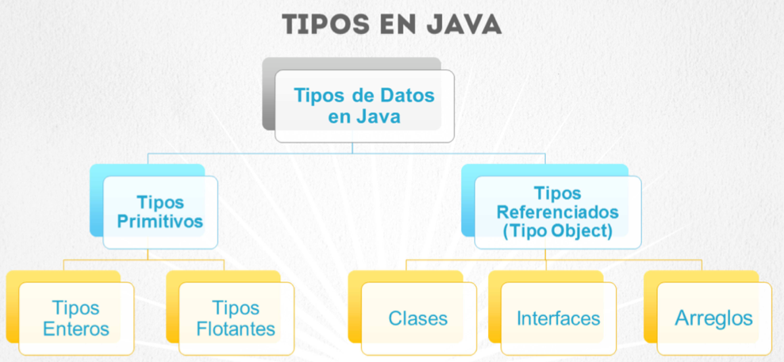

En Java existen diferentes tipos de datos, pero en esta lección vamos a comenzar con lo que se conoce

como tipos primitivos.

Por ejemplo, en este caso tenemos los tipos primitivos de tipo entero y también los tipos primitivos de tipo flotante, así que son los tipos con los que vamos a empezar. Sin embargo, también existe un tipo especial en Java que se conoce como `String` y nos va a permitir manejar las cadenas que vamos a trabajar en Java. Esto ya lo trabajamos en nuestra primera lección, pero en esta lección vamos a ir profundizando más en ese tipo de dato que es una cadena y esto lo vamos a conocer como un *tipo referenciado*. Sin embargo, esto lo vamos a ver a detalle en clases posteriores. Pero la clasificación de tipos referenciados va a ser *clases*, *interfaces* y *arreglos*. Todo eso lo vamos a ver a detalle posteriormente. Así que tengan paciencia.

De momento vamos a trabajar con los tipos primitivos, *enteros* y *flotantes*, y también respecto de los tipos referenciados, como hemos comentado vamos a trabajar con el tipo `String` o cadena.

Así que vamos a empezar nuestra lección, lo que van a hacer es abrir su IDE de NetBeans.

Recordemos que el método `main` nos va a permitir ejecutar nuestro programa, así que de momento vamos a entender que este método únicamente lo estamos utilizando para poder ejecutar las líneas de código que están contenidas dentro de este método `main`.

Para definir una variable existen diferentes reglas, *primero tenemos que especificar el tipo en Java que vamos a utilizar* por ejemplo, podemos definir una variable primitiva de tipo entero, `int` es la palabra reservada que vamos a utilizar para definir una variable de tipo entero y posteriormente utilizamos un identificador, es decir, el nombre de la variable por ejemplo, `miVariableEntera`.  

```java
int miVariableEntera = 10;
```

Podemos observar que el nombre de la variable inicia con minúscula y posteriormente, si tenemos más de una palabra, entonces se recomienda utilizar la primera letra en mayúscula, por ejemplo, la palabra variable, la V que es la primer letra de esta palabra inicia mayúscula y también la E inicia con mayúscula.

A este tipo de notación se le conoce como **notación de camello o notación de altas y bajas**, y se conoce así debido a la forma que se genera. Como podemos observar de altas y bajas o notación de camello.

Así que eso es lo más común que vamos a encontrar cuando trabajamos en Java, incluso es una buena práctica, por lo tanto, es recomendable que nos empecemos a familiarizar con esto desde un inicio.

Podemos ver que **la variable inicia con letra minúscula** y posteriormente, después de definir la variable y su tipo, vamos a asignarle un valor para poder asignar un valor vamos a utilizar el operador de igual, es decir, el operador de asignación y le podemos asignar cualquier valor, por ejemplo, el valor de 10 y como es una línea de código en Java, debe determinar con punto y coma. Así que todas las líneas en Java terminan con punto y coma. 

Ahora lo que vamos a hacer es imprimir el valor de esta variable.

```java
int miVariableEntera = 10;
System.out.println(miVariableEntera);
```

Guardamos cambios, ya sea presionando este icono o presionando la combinación de teclas CTRL+S. Bien guardamos cambios y ejecutamos, **para ejecutar** vamos a dar clic derecho sobre nuestro archivo y seleccionamos la opción de ***Run File***.

### :computer: `006-VariablesJava`

*`Variables`*
```java
//Variables Java
public class Variables {
   public static void main(String arg[]){
      int miVariableEntera = 10;
      System.out.println(miVariableEntera);
   }
}
```

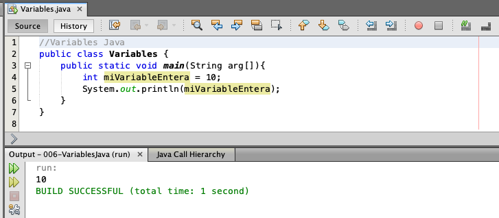

Y podemos observar que nos despliega el valor de 10.

Así que con esto ya estamos declarando nuestra variable, la estamos mandando a imprimir y obtenemos el resultado de 10.

Eso es todo en esta lección y en las siguientes lecciones vamos a continuar con el tema de variables en Java. Nos vemos en la siguiente lección. Saludos.

# 007 Tipos Enteros y Tipo String en Java - 09:07

Bien, vamos a continuar con la selección de variables. Ya hemos definido nuestra variable entera. Ahora una de las ventajas de haber definido esta variable es que la podemos utilizar a lo largo del programa y cambiar su valor conforme lo necesitemos. 

Por ejemplo, si escribimos de nueva cuenta el nombre de nuestra variable `miVariableEntera`, recuerden que debemos de respetar mayúsculas y minúsculas. Así es el lenguaje de Java es sensible a mayúsculas y minúsculas, por lo tanto, cualquier diferencia no va a reconocer el nombre de su variable. Ahora lo que podemos hacer es asignarle un nuevo valor, por ejemplo, el valor de 5, y podemos saber que esta variable ya fue definida debido a que ya no estamos indicando el tipo de dato. Una vez que vamos a utilizar nuestra variable, una vez que ya fue definida, ya no es necesario volver a especificar el tipo de dato. De hecho, si lo hacemos, el compilador nos va a decir que esta variable ya fue definida. Según podemos ver, el mensaje que nos manda nos indica que esta variable ya fue definida dentro de nuestro programa, así que no podemos volver a definir una variable que ya ha sido definida anteriormente.

```java
//Modificamos el valor de la variable
miVariableEntera = 5;
```

Así que en esta línea, lo que estamos haciendo es modificando el valor de nuestra variable. Ahora vamos a imprimir este valor, podemos volver a escribir `System.out.println` o podemos utilizar un atajo que nos brinda NetBeans, este tipo de atajos existe en la mayoría de los IDEs en la mayoría de las herramientas para trabajar con Java, así que cualquier duda pueden revisar la documentación del IDE que estén utilizando, pero en este caso con Apache NetBeans vamos a escribir **`sout`** y posteriormente presionamos la tecla de tabulador, y podemos observar que nos complementa en automático esta línea de código `System.out.println` y con esto se manda llamar el método para imprimir a consola. Debido a que en este caso no vamos a imprimir una cadena, un texto, podemos quitar la doble comilla y podemos imprimir de nueva cuenta solamente el valor de nuestra variable. Por ejemplo.

```java
//Modificamos el valor de la variable
miVariableEntera = 5;
System.out.println(miVariableEntera);
```

Guardamos cambios presionando CTRL+S, recuerden que con cada cambio en su código deben de guardar estos cambios, ya sea presionando el icono de los discos o presionando CTRL+S, incluso pueden observar que en este momento ya se ha guardado el código debido a que ya está en gris, ya fueron guardados todos los cambios. Bien guardamos cambios, ejecutamos, damos clic derecho Run File. Y podemos observar que en primer lugar mandamos a imprimir el valor de la variable entera con el valor de 10 y posteriormente mandamos a imprimir este mismo valor con el valor de 5.

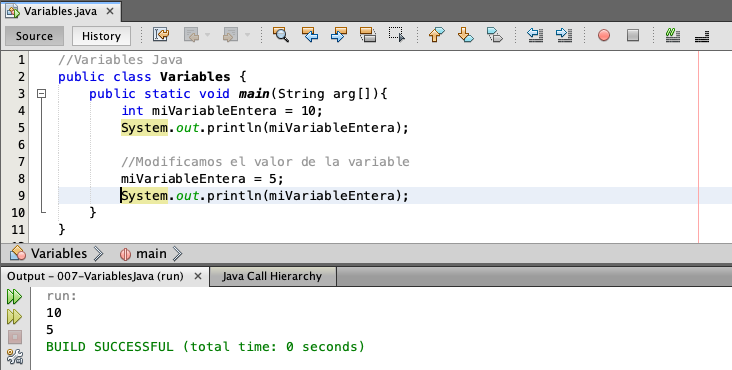

Así que de esta manera estamos definiendo una variable y su primer valor es el valor de 10 y posteriormente modificamos esta variable y le asignamos el valor de 5. Volvemos a imprimir esta variable y entonces observamos ahora el nuevo valor.

Así que ese es el concepto básico de nuestras variables en Java vamos a poder definir una variable y 
reutilizarla a lo largo de nuestro programa. Sin embargo, el uso de las variables tiene restricciones. Más adelante vamos a ver a detalle el tema de métodos y una variable que fue definida dentro de un método, por ejemplo, en este caso dentro del método `main` no va a poder ser utilizada fuera de este método.

A esto se le va conocer como el **alcance de una variable**, pero esto lo vamos a ver más adelante, simplemente para que sepan que existen también restricciones cuando estamos trabajando con nuestras variables, así que no la podemos acceder en cualquier parte de nuestro programa, sino que dependiendo donde sea definido esta variable va a ser en los lugares donde podemos utilizar esta variable.

Bien, por último, vamos a utilizar ahora el tipo `String` para definir una variable de tipo `String` vamos a hacer lo siguiente, vamos a utilizar el tipo de dato `String`, podemos observar que es con S mayúscula, debido a que no es un tipo primitivo, sino es una clase de Java.

Todo eso lo vamos a ver más adelante, pero tenemos que adelantar el uso de la clase `String` debido a que va a ser uno de los tipos más utilizados y posteriormente vamos a ver a detalle qué significa esto del uso de clases, cómo crearlas y cómo crear objetos de una clase.

Así que ponemos el tipo `String`, el cual ya podemos utilizar por default en Java y ahora agregamos el identificador, por ejemplo, `miVariableCadena`, puede ser cualquier otro nombre, en este caso simplemente estamos poniendo un nombre muy explícito para que sepamos qué valor va a almacenar esta variable y le asignamos un valor, los valores de las cadenas, vamos a asignarle el valor utilizando doble comillas, así que le podemos poner un primer valor y como es una línea de código en Java es una nueva línea de código, terminamos con punto y coma. Vamos a imprimir el valor de esta variable, así que ponemos `sout` y tabulador e imprimimos el valor de nuestra variable.

Para que nos ayude el IDE para desplegar las variables que tenemos definidas en nuestro programa podemos presionar `mi` y la combinación de teclas CTRL + ESPACIO. Así que si presionamos CTRL + ESPACIO podemos observar que nos muestren las variables que hemos definido, `miVariableCadena` y `miVariableEntera`. En este caso queremos mandar imprimir `miVariableCadena` así que seleccionamos esta variable y damos ENTER.

```java
String miVariableCadena = "Saludos";
System.out.println(miVariableCadena);
```

Guardamos cambios con CTRL+S y ejecutamos nuestro programa Click Derecho Run File.

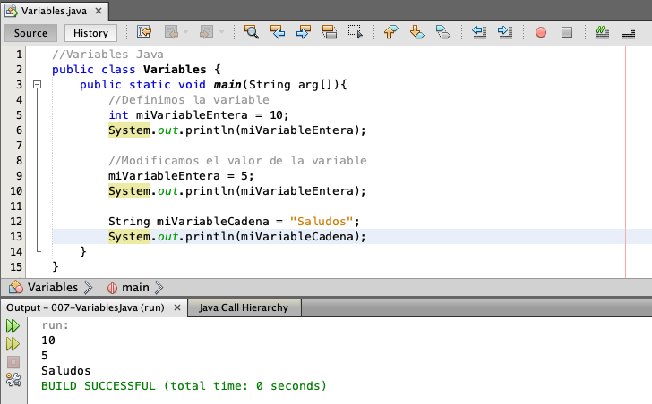

Y podemos observar ahora que se está desplegando el valor de nuestra variable, el valor de `Saludos`. Ahora se les vea como ejercicio volver a utilizar esta variable, pero ahora asignarle el valor de `Adiós` y posteriormente, una vez modificado el valor de esta variable, manden imprimir nuevamente. Les vamos a dar unos segundos para que realicen este ejercicio y vamos a continuar.

Bien, si ya lo hicieron, vamos a hacer lo siguiente, entonces vamos a ver la solución, vamos a utilizar nuestra variable `miVariableCadena`, recuerden que ya no es necesario poner el tipo de dato, solamente el nombre de nuestra variable, `miVariableCadena` a ahora le vamos a asignar otro valor por ejemplo, el valor de `Adiós`, punto y coma y mandamos a imprimir de nueva cuenta. Recuerden respetar mayúsculas y minúsculas.

```java
miVariableCadena = "Adiós";
System.out.println(miVariableCadena);
```

Por ejemplo, en este caso, si pongo minúscula, nos manda un error indicando que no reconoce el símbolo ni variable `miVariablecadena` debido a que la C debe de ser mayúscula. Así que corregimos con mayúscula y entonces ya no reconoce la variable.

Incluso si damos CTRL+CLIC sobre esta variable nos lleva a la definición, a la línea de código donde se definió esta variable y así cualquier otra variable. Por ejemplo, en este caso de `miVariableEntera`, si presiono CTRL+CLIC me lleva a la definición de esta variable. Esto quiere decir que nuestro IDE el compilador está reconociendo donde se está definiendo esta variable.

Así que con eso ya tenemos nuestro código, guardamos cambios y ejecutamos.

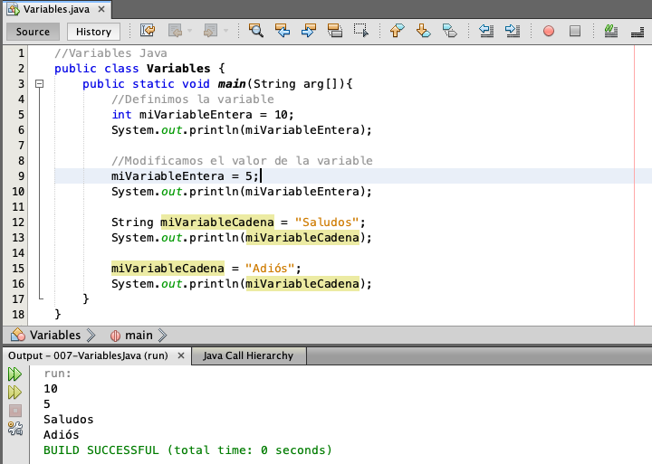

Y podemos observar ahora el nuevo valor de la variable `miVariablecadena` se está mostrando el valor de `Adiós`. 

Así que con esto hemos revisado más temas respecto al uso de variables en Java hemos visto el tipo primitivo `int` el cual nos va a servir para asignar números y el tipo de `String` que nos va a permitir asignar cadenas. Así que hasta el momento hemos visto estos dos tipos de datos conforme avancemos vamos a ver más tipos de datos, pero de momento son es más básicos que vamos a empezar a trabajar números y textos, así que eso es suficiente para comenzar a trabajar con Java.

Ahora, si observan, yo estoy ocultando y mostrando la consola, esta consola pueden dejarla fija en su IDE o en este caso yo la estoy ocultando para que puedan visualizar el código, pero en dado caso de que se oculte y ya nos esté mostrando para que la puedan mostrar de nueva cuenta sin problema, van a la *opción de Windows y posteriormente dan CLIC en Reset Windows* y esto va a restablecer todas las ventanas de su IDE, así que vamos a dar clic. Y con eso se debe de haber restablecido las ventanas, en dado caso de que aún así todavía no se visualice la opción de Outputs o la ventana que están buscando, pueden ir de nueva cuenta a la opción de Windows y, por ejemplo, en este caso, habilitar la opción de Output y pueden observar de nueva cuenta la consola.

Así que todas las ventanas internas del IDE aquí en la opción de Windows pueden revisar todas las opciones que se tienen porque aquí se habilitan o deshabilitar estas opciones.

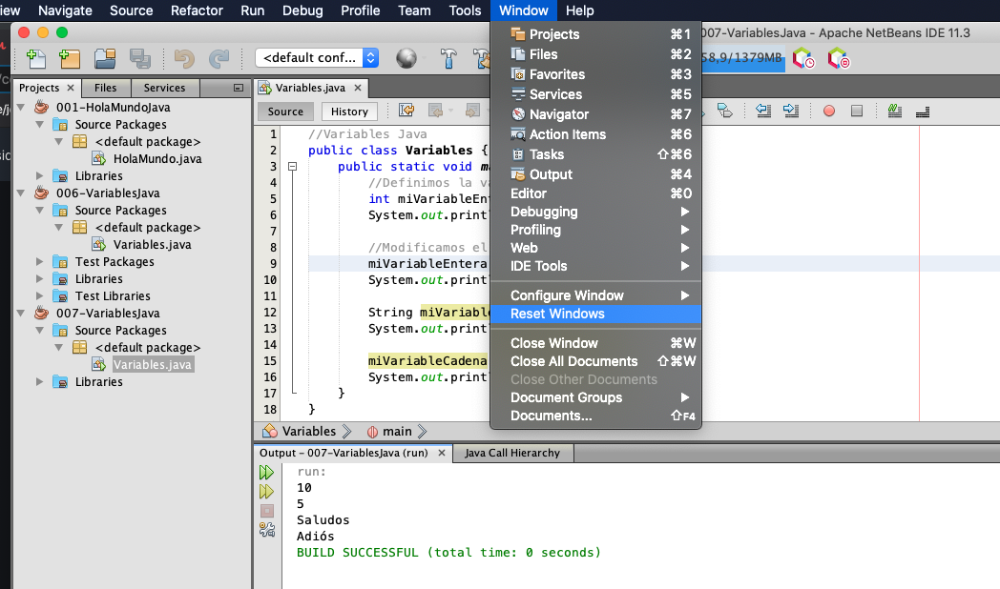

Así que prueben hasta aquí y confirmen que no tengan ningún problema con la ejecución de su código.

### :computer: `007-VariablesJava`

*`Variables`*
```java
//Variables Java
public class Variables {
   public static void main(String arg[]){
      //Definimos la variable
      int miVariableEntera = 10;
      System.out.println(miVariableEntera);
        
      //Modificamos el valor de la variable
      miVariableEntera = 5;
      System.out.println(miVariableEntera);
        
      String miVariableCadena = "Saludos";
      System.out.println(miVariableCadena);
        
      miVariableCadena = "Adiós";
      System.out.println(miVariableCadena);
    }
}
```

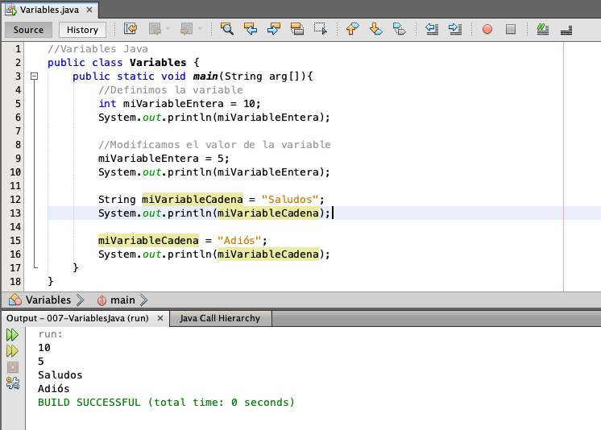

Es todo por esta lección y nos vemos en la siguiente lección. Saludos!

# 008 Inferencia de Tipos en Java - 08:21

Hola y bienvenidos a esta lección.

A continuación vamos a ver el uso de la palabra reservada `var` en Java están listos? Vamos. 

Continuando con nuestro ejercicio, 

*`Variables`*
```java
//Variables Java
public class Variables {
   public static void main(String arg[]){
      //Definimos la variable
      int miVariableEntera = 10;
      System.out.println(miVariableEntera);
        
      //Modificamos el valor de la variable
      miVariableEntera = 5;
      System.out.println(miVariableEntera);
        
      String miVariableCadena = "Saludos";
      System.out.println(miVariableCadena);
        
      miVariableCadena = "Adiós";
      System.out.println(miVariableCadena);
    }
}
```

Hemos visto cómo definir una variable utilizando un tipo de dato, posteriormente el identificador o nombre de la variable y asignándole un valor. Este valor se va a conocer como una **literal** y en este caso las literales numéricas en Java van a ser de tipo `int`.

Así que no solamente la variable va a tener un tipo, sino también las literales es decir, los valores que asignamos a nuestras variables también van a tener un tipo en Java, así que cualquier tipo numérico que no tenga punto flotante va a ser de tipo `int`. Por ejemplo, en este caso 10 y 5 son de tipo `int`.

Y una literal de tipo cadena en automático su tipo va a ser de tipo `String`. 

Ahora, por qué les comento esto?

Porque **a partir de la versión 10 de Java podemos utilizar la palabra reservada `var`** en lugar de utilizar el tipo de dato definido, podemos simplemente poner `var` para que Java infiera el tipo de dato que estamos utilizando, pero **el tipo de dato lo va a inferir a partir de la literal que estamos utilizando**.

Recuerden que la literal es de tipo entero en este caso de 5 y 10, ya que es un número sin punto flotante y en caso de "Saludo" la literal es de tipo `String` debido a que estamos utilizando comillas dobles.

Ahora vamos a ver cómo utilizar `var`, `var` va a hacer inferencia de tipos en Java, a partir del valor que le vamos a asignar de nuestra literal, así que para definir una variable de tipo entero, en lugar de utilizar `int` por ejemplo:

```java
int miVariableEntera2 = 10;
```

En lugar de hacerlo así, podemos sino poner ahora la palabra reservada `var`.

```java
//var - Inferencia de tipos en Java
var miVariableEntera2 = 10;
```

Y con esto vamos a lograr varias cosas, pero básicamente nuestro código se va a simplificar debido a que vamos a utilizar tipos de datos mucho más complejos y simplemente utilizando `var` en automático Java va a inferir el tipo de dato según el valor que le estemos asignando del lado derecho. Así que según el valor que asignemos en este caso puede ser una literal, pero más adelante vamos a ver que le podemos asignar referencias de objetos y aquí es en el tema de la inferencia de tipos va a ser mucho más poderoso.

En este caso es más simple debido a que la literal 10 es de tipo entero, según hemos comentado. Por lo tanto, la variable que estamos definiendo `miVariableEntera2` también va a ser de tipo entero.

Vamos a imprimir ahora esta variable, `sout` más tabulador. Ponemos las primeras letras de nuestra variable y posteriormente CTRL+ESPACIO para que nos dé la ayuda y seleccionamos la variable `miVariableEntera2`. Ya estamos utilizando el valor de 10, por lo tanto vamos a usar uno distinto, por ejemplo el valor de 15 para que veamos el nuevo valor en guardamos cambios y ejecutamos.

```java
//var - Inferencia de tipos en Java
var miVariableEntera2 = 15;
System.out.println(miVariableEntera2);
```

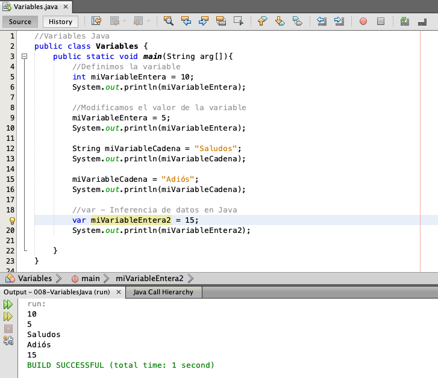

Y podemos observar el nuevo valor de nuestra variable, el valor de 15 así que está funcionando sin ningún problema. En dado caso de que el uso de `var` no funcione en su programa, deben de revisar que en su proyecto tengan la última versión del JDK. Puede ser una versión 10 o superior.

Por ejemplo, en este caso damos clic derecho en el nombre del proyecto, propiedades 

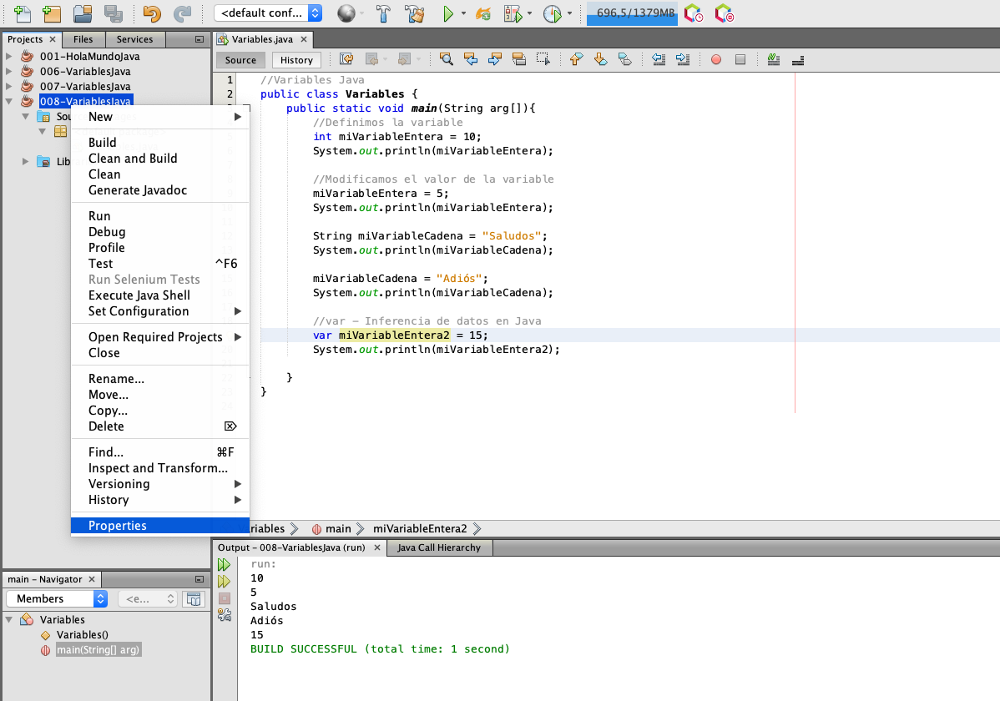

y aquí, en el icono de Sources podemos observar una parte inferior que estamos seleccionando el JDK 14, que es la última versión que tenemos al día de hoy.

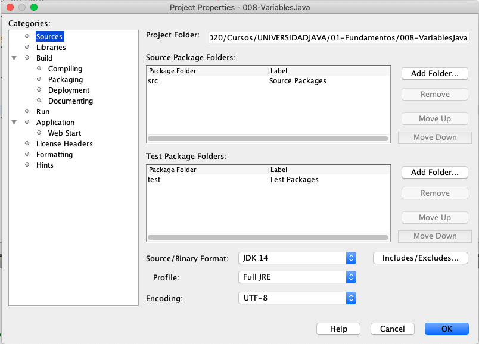

Si tienen una versión más reciente no hay ningún problema pueden seleccionarla, pero pueden observar que su proyecto lo pueden poner a cualquier otra versión, pero en este caso, **a partir de la versión 10 es cuando se introdujo el concepto de variables inferencia de tipos**.

Y también aquí en la sección de Libraries deben de verificar que estén seleccionando el JDK 14, de lo contrario no va a funcionar correctamente su programa, ya que no va a reconocer el uso de `var`.

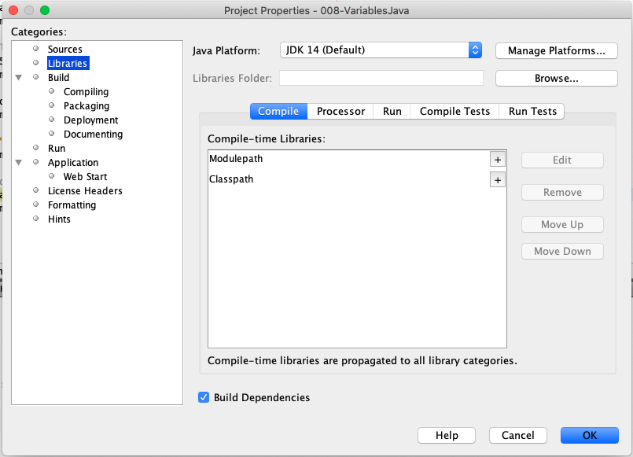

Así que el uso de `var` nos va a simplificar la definición de variables sin embargo, **todo el poder del uso de `var` lo vamos a ver más adelante, cuando ya estudiamos el tema de objetos, en el cual vamos a poder crear nuestros propios tipos de datos utilizando clases en Java**.

Bien les dejamos como ejercicio ahora definir una variable de tipo cadena llamada `miVariableCadena2` y mandan a imprimir esta nueva variable, pero ya no van a utilizar el tipo `String`, sino van a utilizar el tipo de dato `var`. Les damos unos segundos y continuamos.

```java
//var - Inferencia de tipos en Java
var miVariableCadena2 = "Hello";
System.out.println(miVariableCadena2);
```

Bien, si ya lo realizaron, vamos a comprobar la solución. Vamos a definir nuestra variable de tipo `String`, pero podemos observar que ya no es necesario utilizar el tipo de dato `String`, sino que lo vamos a inferir a partir del valor que le vamos a asignar, por ejemplo, en este caso utilizamos `var`, `miVariableCadena2` y le asignamos un valor, este valor va a ser una literal de tipo cadena y le asignamos cualquier valor, por ejemplo, `"Hello"`.

Para mandar a imprimir directamente el valor de la variable en lugar de usar `sout` podeos usar el atajo **`soutv`** y al presinar TABULADOR nos pone `System.out.println("miVariableCadena2 = " + miVariableCadena2);`
nos manda a imprimir la última variable que hemos definido en este caso nos va a mandar el texto `miVariableCadena2 = ` y posteriormente va a imprimir el valor de la variable `miVariableCadena2`.

Posteriormente vamos a ver este **concepto que se conoce como concatenación de cadenas**. Podemos observar en este caso para unir dos cadenas ya utiliza el operador de `+`. Así que no solamente el operador de `+` se puede utilizar para sumar números, como vamos a ver más adelante, sino que en este caso también lo vamos a utilizar para unir cadenas. A este concepto se le conoce como concatenación de cadenas y esto lo vamos a ver al detalle más adelante. Pero pueden observar que en este momento ya estamos uniendo la cadena `"miVariableCadena2 = "` con el valor de la variable `miVariableCadena2`.

Vamos a guardar cambios, ejecutamos.


Y podemos observar ahora el valor de nuestra variable primero el texto `"miVariableCadena2 = "` y se imprime el valor de nuestra variable `miVariableCadena2`.

Todo esto lo podemos hacer en las impresiones anteriores de las variables para que sepamos cuál es el valor de la variable que estamos imprimiendo.

Por qué en los primeros casos ya no sabemos cuál es la variable y que valor tiene. Por lo tanto, es recomendable que mandemos a imprimir el nombre de la variable y posteriormente su valor. Simplemente es una práctica común. Y para ello nos va a servir entonces el atajo de `soutv` 

Así que esperemos que hayan llegado a la misma solución, en este caso solamente con la diferencia de que estamos agregando el nombre de nuestra variable. Y en conclusión, si están utilizando una versión del JDK anterior a la versión 10, entonces tienen que indicar el tipo de dato.

Por ejemplo, en este caso que es de tipo `int`, que es de tipo `String`, etc. pero si están trabajando con una versión de JDK superior a la versión 10, entonces pueden utilizar el tipo `var` para la inferencia de tipos y el tipo se va a inferir a partir del valor que le estamos asignando.

Más adelante vamos a ver qué restricciones existen respecto al uso de `var`, pero en resumen podríamos decir que sí van a definir una variable dentro de un método por ejemplo, en este caso dentro del método `main` lo van a poder utilizar sin problema, pero si ya están fuera de un método, entonces ya no pueden utilizar `var`. Así que es parte de las restricciones que vamos a ir estudiando poco a poco.

### :computer: `008-VariablesJava`

*`Variables`*
```java
//Variables Java
public class Variables {
   public static void main(String arg[]){
      //Definimos la variable
      int miVariableEntera = 10;
      System.out.println(miVariableEntera);
        
      //Modificamos el valor de la variable
      miVariableEntera = 5;
      System.out.println(miVariableEntera);
        
      String miVariableCadena = "Saludos";
      System.out.println(miVariableCadena);
        
      miVariableCadena = "Adiós";
      System.out.println(miVariableCadena);
      
      //var - Inferencia de datos en Java
      var miVariableEntera2 = 15;
      System.out.println(miVariableEntera2);
        
      var miVariableCadena2 = "Hello";
      System.out.println("miVariableCadena2 = " + miVariableCadena2);
    }
}
```

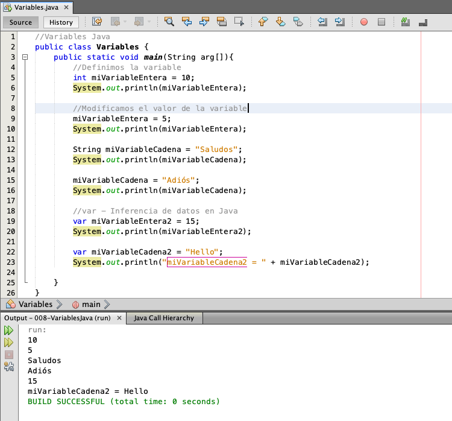

Es todo por este video y nos vemos en la siguiente elección.

Saludos.

# 009 Ejercicio: Reglas para definir una variable en Java - 04:03

Hola, que tal y bienvenidos a esta lección.

A continuación vamos a ver las reglas para definir el nombre de una variable en Java están listos? Vamos.

Hasta ese momento ya hemos visto cómo definir una variable y el nombre que hemos utilizado ha sido de manera muy explícita. Sin embargo, existen reglas para definir el nombre de una variable en Java, por ejemplo en Java, el primer carácter del nombre de nuestra variable debe de ser como sigue.

Podemos utilizar cualquier letra del alfabeto en mayúsculas o en minúsculas sin embargo, por convención se recomienda que utilicemos la primer letra en minúscula y como hemos comentado ya después, si tenemos más palabras, la primera letra de cada palabra debe ir también en mayúscula. Sin embargo, no podemos utilizar números como primer carácter de nuestra variable.

Por ejemplo, si ponemos:

```java
var 1MiVariable = 3;
```

El compilador nos manda un error debido a que no reconoce este nombre de la variable. Así que no es posible utilizar números o caracteres especiales para definir una variable. Este primer carácter debe de ser una letra, pero no puede tener caracteres especiales como podemos observar.

```java
var %MiVariable = 3;
```

Pero sí puede tener, por ejemplo, guion bajo, el guion bajo es uno de los caracteres permitidos para iniciar el nombre de una variable. No es tan común definir así nuestras variables, pero si está permitido

```java
var _MiVariable = 3;
```

y también podemos utilizar por ejemplo, el símbolo de dólar.

```java
var $MiVariable = 3;
```

Así que vamos a agregar algunos ejemplos.

```java
//Valores permitidos en el nombre de variables
var miVariable = 1;
var _miVariable = 2;
var $miVariable = 3;
```

Así que cualquiera de estos casos son valores permitidos. Valores permitidos en el nombre de nuestras variables.

Y por ejemplo, si queremos utilizar acentos en nuestras variables podemos observar que sí es posible. Sin embargo, tampoco se recomienda no porque nos lo prohíba el lenguaje, sino porque podemos tener problemas por el juego de caracteres que estamos utilizando, así que también las letras con acento no se recomienda utilizarla para definir nombres de variables.

```java
var árbol = 10;
```

**Aunque es posible, no lo recomendamos utilizar.** Así que vamos a poner esto entre comentarios, con el comentario no se recomienda utilizar.

Y si queremos utilizar un carácter especial, por ejemplo el símbolo de gato o de número y le asignamos algún valor.

```java
var #miVariable = 2;
```

Podemos observar que el compilador nos manda que este carácter, es un carácter ilegal para definir el nombre de una variable, así que cualquier carácter especial no está permitido utilizarlo.

Así que los únicos valores permitidos son una letra en minúscula o en mayúscula, pero se recomienda utilizar minúscula para iniciar nuestra variable. Podemos utilizar un guion bajo y podemos utilizar símbolo de dólar, así que son las reglas para definir los nombres de nuestras variables.

### :computer: `009-VariablesJava`

*`Variables`*
```java
//Variables Java
public class Variables {
   public static void main(String arg[]){
      //Definimos la variable
      int miVariableEntera = 10;
      System.out.println(miVariableEntera);
        
      //Modificamos el valor de la variable
      miVariableEntera = 5;
      System.out.println(miVariableEntera);
        
      String miVariableCadena = "Saludos";
      System.out.println(miVariableCadena);
        
      miVariableCadena = "Adiós";
      System.out.println(miVariableCadena);
      
      //var - Inferencia de datos en Java
      var miVariableEntera2 = 15;
      System.out.println(miVariableEntera2);
        
      var miVariableCadena2 = "Hello";
      System.out.println("miVariableCadena2 = " + miVariableCadena2);
      
      //Valores permitidos en el nombre de variables
      var miVariable = 1;
      var _miVariable = 2;
      var $miVariable = 3;
        
      var árbol = 10; //Aunque es posible no se recomienda utilizar
        
      //var #miVariable = 2; no se permiten utilizar carácteres especiales
    }
}
```

Pongan en práctica lo que hemos visto en esta elección. Creen sus propias variables para que comprueben todo lo que les hemos comentado. Recuerden que si no escriben el código, entonces no van a aprender. Así que todo lo que vamos enseñando lo deben de ir escribiendo en el IDE y cada uno de los ejercicios lo deben ir realizando paso a paso de lo contrario, no van a aprender y no van a retener la información que les estamos brindando, ya que va a ser bastante información y se va a ir acumulando muy rápidamente.

Es todo por esta lección y nos vemos en la siguiente lección.

Saludos.

# 010 Ejercicio: Concatenación con Java - 11:46

Hola, bienvenidos a esta lección.

A continuación vamos a ver el tema de concatenación de cadenas en Java. Están listos? Vamos.

Vamos a ver el tema de concatenación de cadenas, para ello vamos a definir dos variables de tipo `String` y vamos a unirlas por medio del operador `+`.

Por ejemplo:

```java
var usuario = "Juan";
var titulo = "Ingeniero";
```

Y lo que vamos a hacer es crear una tercera variable para unir estas dos variables, así que vamos a hacer lo siguiente. Vamos a definir una variable llamada `union` y para unir estas dos variables vamos a hacer lo siguiente.

```java
var union = titulo + usuario;
```

Y vamos a imprimir el valor de la variable `union`, recordemos usar el atajo `soutv` más TABULADOR.

```java
var union = titulo + usuario;
System.out.println("union = " + union);
```

Vamos a guardar cambios, presionamos CTRL+S y ejecutamos clic derecho Run File.

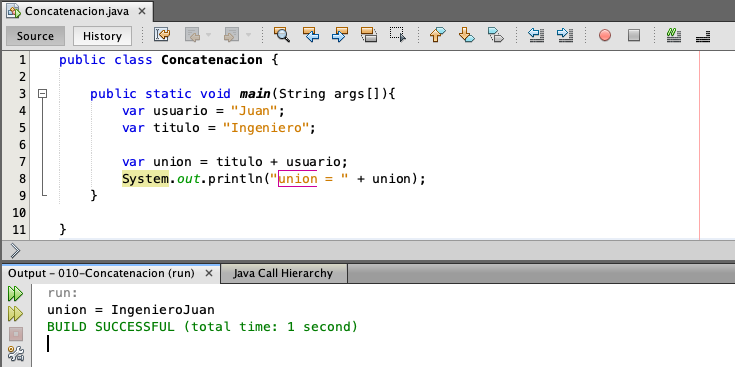

Y podemos observar que la variable `union` tiene el valor de `IngenieroJuan`, podemos ver que ya es una sola cadena. Sin embargo, cuando unimos cadenas es común que también adjuntemos otro carácter para separar estas cadenas. Por ejemplo, en este caso en la `union` tenemos el operador de `+`, pero ahora vamos a concatenar un espacio en blanco, así que ponemos la cadena de espacio en blanco y volvemos a concatenar el valor de la variable usuario, así que ya tenemos el valor de la variable título que va a imprimir Ingeniero posteriormente concatenados el espacio y finalmente concatenados el valor de la variable usuario que va a ser Juan. Vamos a comprobar.

```java
var union = titulo + " " + usuario;
System.out.println("union = " + union);
```

Guardamos cambios, presionamos CTRL+S. Click derecho Run File.

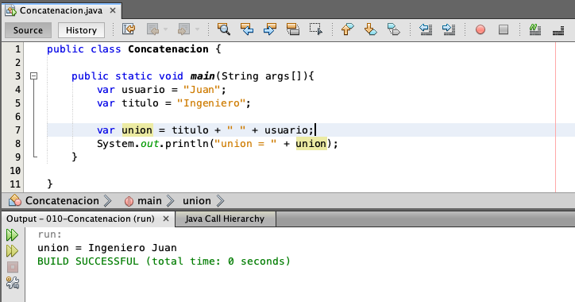

La variable unión tiene el valor de `Ingeniero Juan`

Así que el operador de más no solamente nos va a permitir sumar números, sino que también nos permite concatenar cadenas.

Atajo para formatear nuestro código, presionamos el botón derecho y seleccionamos FORMAT.

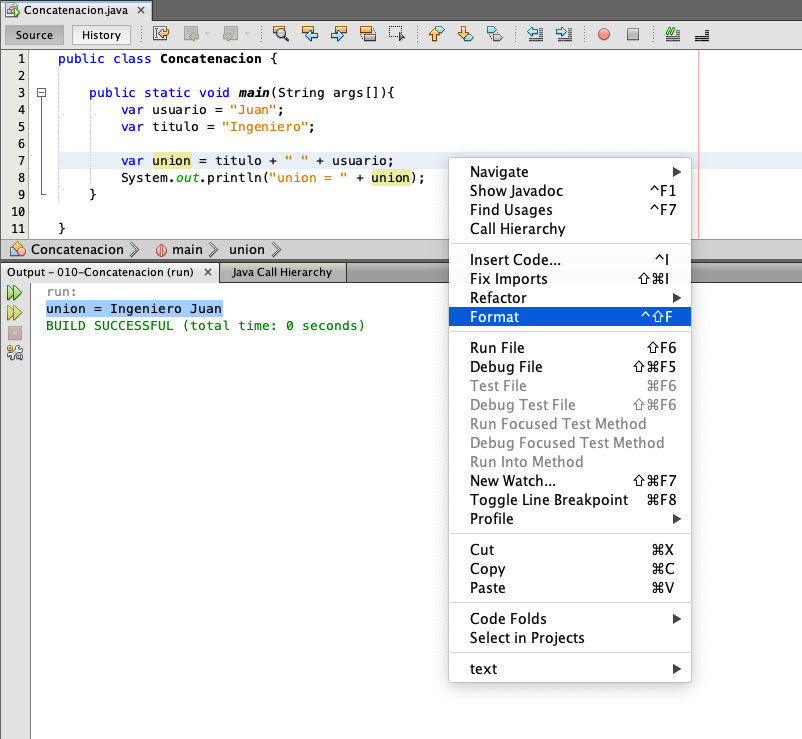

Y podemos ver que nuestra clase en automático reajusta cada uno de sus elementos, a esto se le conoce como formato de nuestro código dar formato.

Bien, ahora vamos a definir dos variables de tipo entero.

```java
var i = 3;
var j = 4;
```

No es recomendable utilizar nombres tan cortos en los nombres de nuestras variables, pero en este caso simplemente es para poner un ejemplo, ese tipo de nombres de variables los vamos a utilizar cuando veamos el tema de ciclos en Java. Pero no es recomendable en otros casos simplemente poner una letra. Se recomienda utilizar un nombre que reconozcamos de manera automática. 

Y también el nombre de nuestra variable no puede coincidir con ninguna palabra reservada en Java. En la figura pueden observar las palabras reservadas en Java.

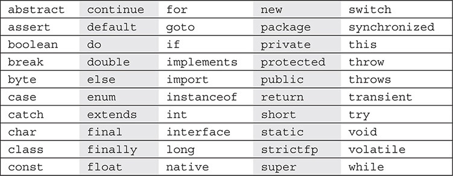

Pero por ejemplo, no pueden utilizar `int` para definir el nombre de su variable, ya que éste es un tipo primitivo y es una palabra que está reservada, tampoco se pueden utilizar `void`, ya que este nombre también es una palabra reservada que vamos a estudiar más adelante y cualquier nombre de palabra reservada no lo pueden utilizar. Por ejemplo, la palabra reservada `new` es otra palabra reservada que no pueden utilizar, y si tratan de utilizarlo, entonces les dice el compilador que no reconoce esta sentencia, así que deben utilizar nombres de variables que no coincidan con las palabras reservadas en Java.

Obviamente, esta cantidad de palabras reservadas no se las van a aprender de memoria de manera inmediata, sino que poco a poco nos vamos a ir familiarizando con cada una de ellas y así van a saber a qué se refiere cada una de ellas cuando estemos trabajando en nuestras lecciones. Así que esto va a ser poco a poco.

Bien, con esto ya hemos definido nuestras variables `i` y `j` que son el tipo entero. Recuerden que es de tipo entero porque estamos infiriendo el tipo que le estamos asignando. A partir de la literal entera y por lo tanto, entonces nuestra variable también es de tipo entero. 

Por lo tanto, si mandamos a imprimir utilizando el mismo operador de suma vamos a ver cómo se comporta, así que guardamos cambios, ejecutamos.


```java
var i = 3;
var j = 4;

System.out.println(i + j); //Se realiza la suma de números
```

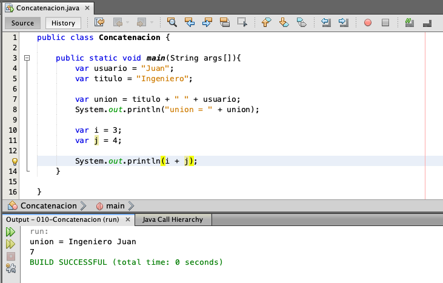

Y podemos observar que en este caso nos devuelve el valor de 7. Esto quiere decir que se está realizando la suma correctamente 3 más 4 nos da 7. Pero qué pasa con los siguientes casos?

De igual manera, en los comentarios aunque podemos utilizar acentos, no se recomienda, ya que los acentos pueden provocar problemas cuando estamos guardando nuestros programas y a su vez abriéndolas desde otras herramientas. Así que por lo tanto, **se recomienda que no utilicemos acentos en nuestros programas**, aunque si lo permite no es recomendable.

Bien, vamos a ver entonces el siguiente caso. Qué pasa si queremos concatenar lo siguiente:

```java
var i = 3;
var j = 4;

System.out.println(i + j); //Se realiza la suma de números
System.out.println(i + j + usuario);
```

Vamos a ver el resultado. Guardamos cambios y ejecutamos.

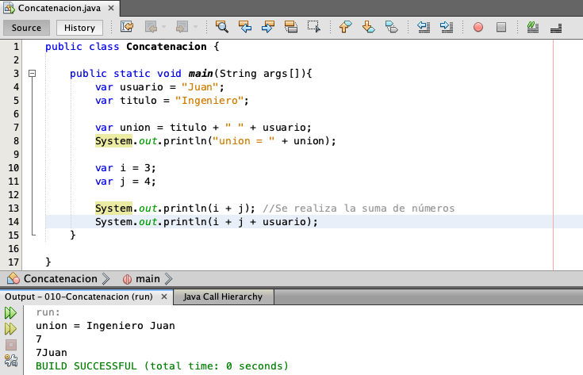

Recordemos que el último resultado es el que estamos analizando. En este caso tenemos 3 + 4 nos da el valor de 7 y posteriormente tenemos la unión con la cadena de usuario, con el valor de Juan y por lo tanto podemos observar que primero se realizó la suma y posteriormente se realizó la concatenación, la unión con la cadena de Juan. Por lo tanto, aquí la regla es que si de izquierda a derecha encontramos primeros números, entonces se realiza primero la suma y posteriormente se sigue avanzando en la evaluación de esta expresión y se realiza la concatenación de este valor. 

Así que de izquierda a derecha se evalúan las expresiones.

Pero ahora qué pasa si hacemos lo contrario?

Vamos a poner ahora el código.

```java
var i = 3;
var j = 4;

System.out.println(i + j); //Se realiza la suma de números
System.out.println(i + j + usuario);
System.out.println(usuario + i + j);
```

Primero vamos a poner usuario, posteriormente concatenados `i` y `j`, vamos a ver qué sucede. Vamos a guardar cambios, ejecutamos.

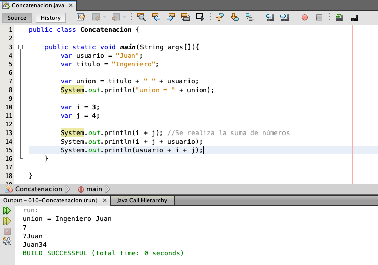

Y en este caso podemos observar que el primero nos muestra la cadena de Juan, el valor de la variable usuario y posteriormente `i` y la `j` no está realizando la suma, sino está realizando una concatenación. Así que el 3 y el 4 los toma como una cadena. Esto se debe a que en Java a esto se le conoce como **contexto cadena**. Así que nuestra expresión evaluada de izquierda a derecha, **si primero encuentra una cadena, todo lo demás lo va a tomar como una cadena**. Así que, por lo tanto, el valor de Juan lo está concatenando con el valor de la variable `i` que es el valor de 3 y posteriormente concatena este valor de la variable `j` el valor de 4, pero nunca realiza aquí la suma. Debido al concepto de contexto cadena, si primero encuentra una cadena, entonces todo lo demás lo va a concatenar.

Pero si del lado izquierdo encuentra números como en el ejemplo anterior, si primero tenemos números y después la cadena, primero realiza la suma y después la concatenación de la cadena.

Ahora, por último, cabe mencionar que podemos modificarlo utilizando parentesis. Así que si queremos realizar la concatenación de la variable usuario, pero además llevar a cabo la suma de estas dos variables para que realmente realice la suma, podemos utilizar paréntesis. Si utilizamos paréntesis, esto quiere decir que estamos modificando la prioridad al evaluar esta expresión.

```java
var i = 3;
var j = 4;

System.out.println(i + j); //Se realiza la suma de números
System.out.println(i + j + usuario);
System.out.println(usuario + i + j);
System.out.println(usuario + (i + j));
```

Así que primero se va a realizar la suma y posteriormente el resultado de esta suma se va concatenar con la variable de usuario. Así que la evaluación de esta expresión de izquierda a derecha evalúa si tenemos paréntesis y los paréntesis toman la máxima prioridad. Por lo tanto, primero se realiza la suma. Así que en este caso aquí vamos a tener un 7 y posteriormente, una vez que termina de evaluar los paréntesis, vuelve a evaluar toda nuestra expresión. En este caso, revisá que tenemos la variable usuario, así que pone el valor de Juan. Y posteriormente, con el operador de más, lo que va a hacer es concatenar el valor de 7 como una cadena, ya que en este caso como primero encontró una cadena, lo demás lo va a tomar como una cadena, pero debido a que esto lo pusimos entre paréntesis, primero se realizó la operación de suma y posteriormente la operación de concatenación.

Vamos a revisar. Así aguardamos cambios y ejecutamos.

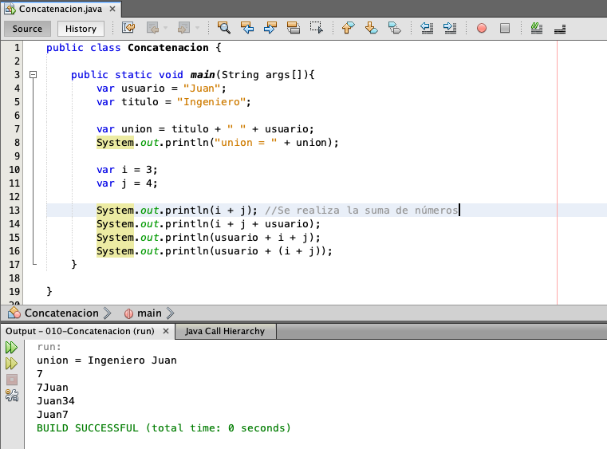

Y podemos observar que ya tenemos el resultado de `Juan7`.

Así que en este caso, si se realizó la suma, primero se evalúa la suma de números y posteriormente se revisa la concatenación de usuario, más el resultado de lo que tenían los paréntesis, es decir, del resultado de la suma que fue 7, por lo tanto tenemos el resultado de `Juan7`. Pero esto finalmente es una concatenación.

### :computer: `010-Concatenacion`

*`Concatenacion`*

```java
public class Concatenacion {
    
   public static void main(String args[]){
      var usuario = "Juan";
      var titulo = "Ingeniero";
        
      var union = titulo + " " + usuario;
      System.out.println("union = " + union);
        
      var i = 3;
      var j = 4;
        
      System.out.println(i + j); //Se realiza la suma de números
      System.out.println(i + j + usuario); // Evaluación de izq a der, realiza suma
      System.out.println(usuario + i + j); // Contexto cadena, todo es una cadena
      System.out.println(usuario + (i + j));// Uso de parentesis modifican la prioridad en la evaluación
   } 
}
```

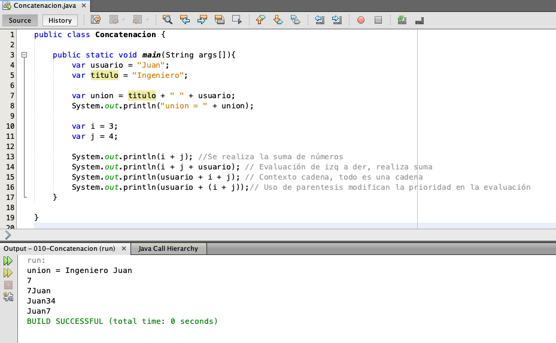

Bien es todo por este lección y nos vemos en la siguiente lección.

Saludos.

# 011 Ejercicio: Caracteres Especiales con Java - 08:31

Hola, que tal y bienvenidos a esta lección.

A continuación vamos a ver el tema de caracteres especiales en Java están listos? Vamos.

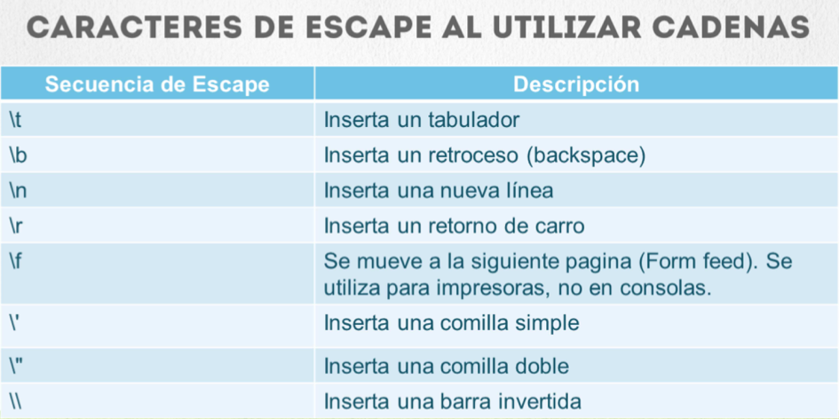

Vamos a ver esta lección algunos de los caracteres especiales que podemos utilizar en Java y así poder visualizarlos en nuestra consola, vamos a comenzar definiendo una variable de tipo `String` llamada `nombre` y le asignamos el valor de `Karla`.

```java
var nombre = "Karla";
```

Ahora vamos a trabajar con esta variable para poder revisar cómo funcionan algunos de los caracteres especiales que podemos utilizar en Java.

Por ejemplo, tenemos el carácter de salto de línea  `\n`, el cual nos va a dar un salto de línea en la consola y posteriormente concatenamos el valor de nuestra variable para que visualicemos cómo afecta este carácter de salto de línea en la salida de nuestro programa.

```java
var nombre = "Karla";
System.out.println("Nueva línea: \n" + nombre);
```

Vamos a guardar cambios con CTRL+S y ejecutamos nuestro programa.

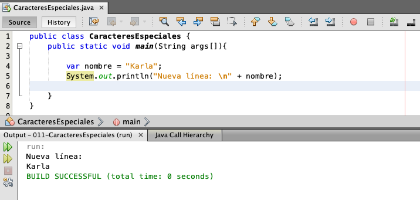

Observamos que el nombre de `Karla` ya no se visualiza en la misma línea, sino que ya generamos una nueva línea y el nombre se imprimió en la siguiente línea, así que para ello nos va a servir este carácter.

También tenemos el carácter de tabulador `\t` para poder imprimir un tabulador y vamos a ver qué es lo que significa concatenando la variable de nombre.

```java
var nombre = "Karla";
System.out.println("Nueva línea: \n" + nombre);
System.out.println("Tabulador: \t" + nombre);
```

Bien, guardamos cambios y ejecutamos.

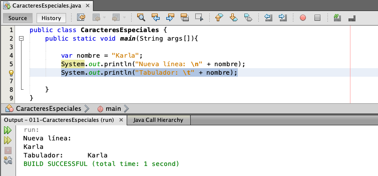

Y podemos ver que un tabulador básicamente es un espacio definido a partir del último carácter, se presenta un tabulador y posteriormente el nombre de nuestra variable.

También tenemos el carácter de retroceso `\b`.

```java
var nombre = "Karla";
System.out.println("Nueva línea: \n" + nombre);
System.out.println("Tabulador: \t" + nombre);
System.out.println("Retroceso: \b" + nombre);
```

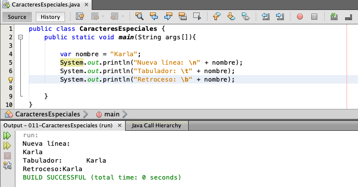

Podemos observar que se imprime el texto `Retroceso:Karla`.

Sin embargo, podemos observar que habíamos dejado un espacio en blanco, así que este espacio en blanco se ha perdido debido precisamente al uso del carácter de retroceso. Así que básicamente en este caso este carácter nos está regresando una posición en la salida de nuestro programa, si utilizamos dos caracteres de retroceso ya no aparecerían los dos puntos `RetrocesoKarla`. Va a ir retrocediendo la cantidad de caracteres de retroceso que tengamos en nuestra salida.

También tenemos el uso de comida simple y comilla doble, vamos a probar el uso de comilla simple usando `\'` aun que en este caso podemos simplemente usar la comilla simple sin la barra diagonal `'`. Vamos a poner nuestro nombre entre comillas simple usando el caracter especial de comilla simple y simplemente la comilla.

```java
var nombre = "Karla";
System.out.println("Nueva línea: \n" + nombre);
System.out.println("Tabulador: \t" + nombre);
System.out.println("Retroceso: \b" + nombre);
System.out.println("Comilla simple: \'" + nombre + "\'");
System.out.println("Comilla simple: '" + nombre + "'");
```

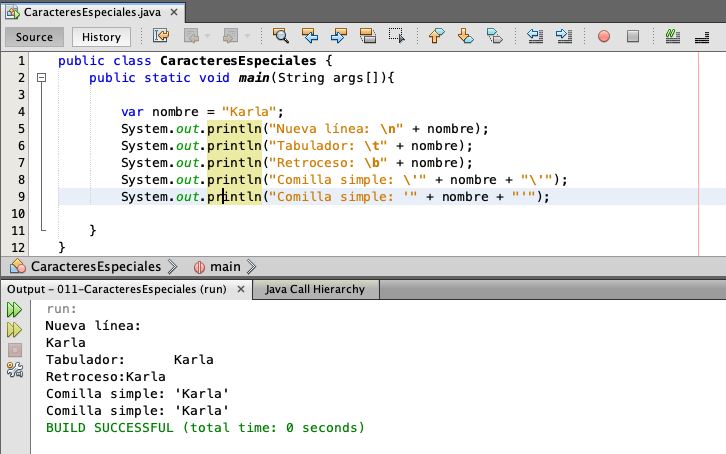

Si quisieramos hacer esto ultimo con la comilla doble es decir:

```java
System.out.println("Comilla simple: "" + nombre + """);
```

Podemos observar que no se está generando correctamente nuestra cadena, ya que si utilizamos la comilla doble dentro de una cadena, entonces el compilador entiende que ya se acabó la cadena. Por lo tanto, para que podamos imprimir la comida doble podemos utilizar el caracter de escape, así que vamos a poner diagonal inversa `\"`.

```java
System.out.println("Comilla simple: \"" + nombre + "\"");
```

Lo que estamos haciendo es simplemente imprimir el carácter de comida doble en la consola. Así que para poder utilizar este carácter dentro de una cadena, entonces tenemos que utilizar el carácter de escape `\"`.


```java
var nombre = "Karla";
System.out.println("Nueva línea: \n" + nombre);
System.out.println("Tabulador: \t" + nombre);
System.out.println("Retroceso: \b" + nombre);
System.out.println("Comilla simple: \'" + nombre + "\'");
System.out.println("Comilla simple: '" + nombre + "'");
System.out.println("Comilla doble: \"" + nombre + "\"");
```

Vamos a guardar cambios y vamos a comprobar.

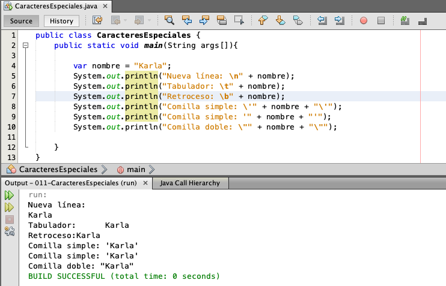

Podemos observar que en este caso tenemos la comida doble abriendo y cerrando al nombre.

### :computer: `011-CaracteresEspeciales`

*`Concatenacion`*

```java
public class CaracteresEspeciales {
   public static void main(String args[]){
        
      var nombre = "Karla";
      System.out.println("Nueva línea: \n" + nombre);
      System.out.println("Tabulador: \t" + nombre);
      System.out.println("Retroceso: \b" + nombre);
      System.out.println("Comilla simple: \'" + nombre + "\'");
      System.out.println("Comilla simple: '" + nombre + "'");
      System.out.println("Comilla doble: \"" + nombre + "\"");
        
   }
}
```


Es todo por esta lección y nos vemos en la siguiente lección.

Saludos!


# 012 Ejercicio: Clase Scanner en Java - 07:58

Hola, bienvenidos a esta elección.

A continuación vamos a ver el uso de la clase escaner en Java.

Están listos?

Vamos.

Hasta el momento hemos definido nuestras variables, pero hasta el momento la información que le estamos

asignando a nuestras variables se conoce como información en código duro, es decir, que este valor

no lo está introduciendo el usuario.

Ahora, aunque el tema de la clase escaner es un tema más avanzado.

De momento vamos a adelantarlo debido a que lo vamos a necesitar para capturar la información que escriba

el usuario y va a ser muy importante para hacer más dinámicos nuestros programas, así que vamos a utilizar

esta clase escáner y vamos a ver cómo hacerlo.

Vamos a quitar este código.

Vamos a definir una variable, por ejemplo la variable usuario y le vamos a asignar cualquier valor.

Por ejemplo, en este caso el valor de Carlos punto y coma y mandamos a imprimir esta variable, como

ya sabemos, ese aleví.

Se va a imprimir el valor de esta variable.

Guardamos cambios, ejecutamos.

Y hasta aquí no hay ningún problema.

Es exactamente lo mismo que hemos venido trabajando.

Estamos creando una variable, le asignamos un valor y lo mandamos a imprimir.

Pero ahora qué pasa si queremos capturar esta información?

No directamente el nombre de Carlos, sino cualquier otro valor que quiera proporcionar el usuario en

nuestra consola.

Para ello vamos a hacer lo siguiente vamos a mandar un mensaje a la consola.

Solicitando que el usuario escriba una información.

Por ejemplo, escribe tu nombre dos puntos.

Y posteriormente vamos a utilizar una clase llamada escáner que nos va a permitir leer información de

la consola.

Para ello vamos a utilizar el siguiente código vamos a escribir.

Recuerden que debe de ser tal cual como se muestra, respetando mayúsculas y minúsculas.

Escribimos escáner con doble n.

Este va a ser el tipo de nuestra variable, posiblemente vamos a ver a detalle el uso de clases y la

creación de objetos, como hemos comentado, nos estamos adelantando un poco a estos temas para que

podamos leer información de la consola, pero básicamente aquí estamos utilizando la clase escaner,

que es un tipo ya definido dentro de las clases de IAVA.

Posteriormente definimos el nombre de nuestra variable llamada consola.

Este va a ser el nombre de esta variable y posteriormente para poder leer información de la consola

escribimos lo siguiente Vamos a crear un nuevo objeto de esta clase utilizando la palabra reservada

Danio escaner, que es el nombre de nuestra clase, y entre paréntesis escribimos Sistem puntos.

Básicamente con esto lo que estamos diciendo es que vamos a leer información de la consola.

Y es de imput, así que la información de la consola y System es una clase también de IAVA que nos va

a permitir acceder a la consola a través de esta variable.

Y cerramos con punto y coma.

Ahora esta sintaxis de crear un objeto de la clase escaner es lo que vamos a ver a detalle posteriormente.

De momento solamente escribano y más adelante lo vamos a explicar a detalle.

Es necesario importar esta clase, ya que se encuentra definida en otra parte de las clases de IAVA,

así que las clases que vamos a utilizar en Java normalmente las vamos a clasificar y empaquetar en folders.

A esto se le conoce como paquetes, así que esta clase se encuentra en un paquete llamado Java punto

y útil, así que vamos a dar clic sobre esta línea Add Import, Java Punto y útil y la clase Escaner.

Así que básicamente le estamos diciendo que dentro del paquete Java punto y útil va a importar la clase

escaner para que podamos utilizarla también.

Todo esto lo vamos a ver a detalle más adelante, solamente lo estamos viendo a grandes rasgos para

que podamos utilizar la consola y así leer información de manera dinámica por parte del usuario.

Ahora esta variable consola la podemos utilizar una o varias veces.

No solamente es para leer una vez de la consola, sino que una vez que ya tenemos esta variable, la

podemos utilizar para leer varias veces de la consola y en lugar de asignarle directamente el valor

de Carlos, ahora vamos a utilizar nuestra variable consola.

Vamos a utilizar el método NEX Line.

Aunque existen otros métodos para leer información de la consola, de momento ese es el método que le

recomendamos utilizar, ya que este método lo que va a hacer es leer una línea completa de la consola,

así que ese es el método que más van a utilizar cuando lean información de la consola.

Bien, y posteriormente aquí lo que va a hacer el programa es que se va a detener hasta que el usuario

escriba una información y una vez que escribe la información y da enter.

Entonces el valor que escribe se asigna a la variable usuario y finalmente se va a imprimir este valor.

Bien, vamos a poner en práctica esto, vamos a guardar cambios y ejecutamos.

Así que en primer lugar se ejecuta la línea 9, se manda imprimir.

Escribe tu nombre.

Y Podemos se va que nuestro programa se detiene, así que nos está esperando para que escribamos un

valor, vamos a escribir cualquier valor, por ejemplo el valor de Juan y hasta que damos enter.

Entonces la consola va a procesar el método next line y el resultado de procesar Next Line se va a asignar

a nuestra variable usuario.

Bien, así que vamos a dar enter.

Y podemos observar finalmente que se imprime usuario igual al valor de la variable usuario, en este

caso el valor que proporcionó el usuario, que es el valor de Juan.

Así que con estas líneas de manera dinámica estamos recuperando el valor de Juan utilizando el método

Next Line, y este método next line lo que hace es detener la ejecución de nuestro programa para esperar

a que el usuario escriba una información y una vez que da enter.

Entonces el resultado se asigna a la variable usuario de manera automática y por ello es cuando mandamos

a imprimir.

Esta variable se imprime el valor que escribió el usuario en la consola y así podemos volver a utilizar

esta variable.

Por ejemplo.

Similar al ejercicio que hemos creado anteriormente para solicitar un título.

Así que volvemos a utilizar la variable consola y el método next line.

Punto y coma y volvemos a imprimir la variable de título, pero además vamos a imprimir, ponemos lo

siguiente.

Resultado?

Dos puntos imprimimos la variable de título.

Y posteriormente concatenados la variable de usuario.

Pero primero con un espacio entre estas dos variables.

Para que tengamos un espacio.

Cuando se imprimen estas variables bien guardamos cambios y ejecutamos.

Podemos ver que el programa nos pide escribe tu nombre, escribimos el valor de Juan y aquí podemos

observar que se detuvo también el programa, pero lo recomendable es poner un texto antes de utilizar

la consola para que el usuario entienda qué es lo que se le está solicitando.

Vamos a detener la ejecución de nuestro programa presionando este icono el botón de Stop.

Y antes de mandar a llamar de nueva cuenta esta línea, voy a poner un texto, voy a mandar un texto

a la consola.

El texto describe.

El título.

Para que el usuario sepa qué es lo que debe de escribir.

Bien guardamos cambios.

Ejecutamos.

Escribimos el nombre Juan y posteriormente nos pide el título, en este caso ingeniero.

Y finalmente, el resultado es la concatenación de la variable ingeniero espacio y el nombre que hemos

proporcionado.

Ingeniero Juan.

Así que con esta línea estamos definiendo la variable consola, la cual nos va a servir para solicitar

información al usuario por medio del método Next Line.

Como hemos comentado, existen otros métodos, pero es el método que más van a utilizar para que no

tengan problemas para leer la información de la consola.

Es todo por este vídeo y nos vemos en la siguiente elección.

Saludos.

# 013 Preguntas de Variables - 5 preguntas

Pregunta 1:
Cuál es la salida del siguiente código:

var nombre = “Juan”;
System.out.println(nombre);
nombre = “Carlos”;
System.out.println(nombre);

Pregunta 2:
¿Cuál es la salida del siguiente código?:

String color;
System.out.println(color);
color = “Rojo”;

ERROR

¡Buen trabajo!
¡Correcto! En el momento en que se imprime la variable, no se ha asignado aún un valor a la variable y el compilador manda el error: variable color might not have been initialized (la variable color tal vez no ha sido inicializada)

Pregunta 3:
¿Qué variable se nombra correctamente?

Pregunta 4:
¿Qué variable se nombra correctamente?

Pregunta 5:
¿Cuál es la salida del siguiente código?:

a = “A”;
System.out.println(a);
a = “B”;
System.out.println(b);

ERROR

Correcto. La variable a no se ha definido, no tiene un tipo definido.


# Detalles Libro - 1 preguntas

Tarea: Detalles Libro

se solicita agregar la siguiente información de un Libro

# Detalles Libro (Solución) - 00:09

```java
import java.util.Scanner;
 
public class Main {
   public static void main(String[] args) {
      Scanner scanner = new Scanner(System.in);
      // Escribe tu solucion aqui
      System.out.println("Proporciona el titulo:");
      String titulo = scanner.nextLine();
      System.out.println("Proporciona el autor:");
      String autor = scanner.nextLine();
      System.out.println(titulo + " fue escrito por " + autor);
    }
}
```
