# 003 Tipos Primitivos en Java • 9 clases • 1 h 14 min

## [Resumen Profesor](/temarios/301_Fundamentos_de_Java/pdfs/01-VariablesJava.pdf)

* 014 Tipos Primitivos en Java - 06:51
* 015 Tipos Numéricos Enteros - 09:06
* 016 Ejercicio: Tipos Primitivos tipos Flotantes - 08:11
* 017 Ejercicio: Inferencia de Tipos con Var y tipos Primitivos - 07:55
* 018 Ejercicio: Tipos Primitivos tipo char - 11:34
* 019 Ejercicio: Tipos Primitivos tipo boolean - 07:42
* 020 Ejercicio: Conversión de Tipos Primitivos en Java - parte 1 - 11:58
* 021 Ejercicio: Conversión de Tipos Primitivos en Java - parte 2 - 10:38
* Cuestionario 2: Preguntas de Números - 6 preguntas
* Tarea 3: Tienda de Libros - 1 preguntas
* 022 Tienda de Libros (Solución) - 00:11

# 014 Tipos Primitivos en Java - 06:51

Hola, bienvenidos a esta lección.

A continuación vamos a estudiar los tipos primitivos de tipo entero en Java están listos? Vamos.

#### Comentarios

Podemos poner un comentario, como hemos visto, de una sola línea utilizarnos `//` un comentario de una sola línea, pero si queremos poner un comentario que abarque varias líneas, ponemos `/* ...*/`.


En Java, los tipos primitivos se clasifican de la siguiente manera podemos tener tipos primitivos que almacenan solamente enteros o tipos primitivos que almacenan tipos flotantes.  

Así que en esta primera lección vamos a ver los tipos primitivos que solamente almacenan tipos enteros sin punto flotante.

### Tipos Enteros

Los tipos primitivos de tipo entero que podemos manejar son los siguientes:

* `byte`
* `short`
* `int`
* `long`

Básicamente el tipo `byte` es el tipo más pequeño, sin embargo, no porque utilicemos el tipo más pequeño significa que vamos a ahorrar espacio, ya que recordemos que lo sepais al día de hoy utilizan arquitecturas de 32 o 64 bits.

En este caso, el `byte` utiliza 8 bits, el tipo `short` 16 bits, el tipo `int` 32 bits y el tipo `long` 64 bits. Por lo tanto, el tipo más común que vamos a utilizar cuando programamos en Java es el tipo entero `int`, debido a que los CPU son de 32 o de 64 bits, así que por lo tanto, si queremos ahorrar la mayor cantidad de espacio, normalmente utilizamos tipos enteros.

**El tipo `byte` sí puede ser utilizado sin embargo, esto no garantiza que utilicemos solamente 8 bits, ya que posiblemente estos 8 bits se van a almacenar en los 32 bits que componen una palabra de una arquitectura de 32 bits**. Eso es un detalle algo más técnico, pero es importante que lo sepan, ya que, como hemos comentado, el tipo más común que vamos a utilizar si queremos ahorrar la mayor cantidad de espacio es el tipo entero `int`. De ahí en adelante podemos utilizar, por ejemplo, el `long` y posteriormente vamos a ver otros tipos, el tipo flotante, que también puede almacenar más información.

Bien, vamos a ver cómo definir estos tipos.

Por ejemplo, para definir un tipo `byte` utilizamos la palabra reservada `byte`:

```java
byte numeroByte = 10;
```

Aunque esta literal es de tipo entero, podemos asignar este valor 10 al tipo `byte` sin ningún problema ya que el tipo `byte` tiene un rango y este rango lo podemos visualizar en la imagen.


o también tenemos el siguiente código que podemos utilizar para saber el valor mínimo y el valor máximo que puede almacenar un tipo `byte`, así que podemos utilizar el siguiente código.

```java
byte numeroByte = 10;
System.out.println("Valor mínimo byte: " + Byte.MIN_VALUE);
System.out.println("Valor máximo byte: " + Byte.MAX_VALUE);
```


`Byte.MIN_VALUE` nos permite recuperar el valor mínimo de un tipo `byte` y  `Byte.MAX_VALUE` nos permite recuperar el valor máximo de un tipo `byte`.

Los tipos enteros no solamente almacenan valores positivos, sino que también pueden almacenar valores negativos. Así que en este caso el rango de números que puede dar un tipo `byte` va desde el valor -128 hasta el valor 127.

Por lo tanto, es que podemos asignar el valor 10 a este tipo `byte` sin ningún problema, pero por ejemplo, si queremos asignar el valor 129.

```java
byte numeroByte = 129;
```

El cual ya se pasó del rango que puede aceptar el tipo `byte` podemos observar que nos manda un error y el error que nos manda es `incompatible types: possible lossy conversion from int to byte`, debido a que ese valor entero ya superó el valor máximo que puede almacenar un `byte`.

Sin embargo, aún así todavía es posible asignar este valor 129 a un tipo `byte` esto se conoce como conversión de tipos. Podemos observar que 129 sigue siendo una literal de tipo entero. Por default así lo maneja Java y para convertirlo a un tipo `byte`, lo que tenemos que hacer es anteponer entre paréntesis el tipo al cual queremos convertir.

```java
byte numeroByte = (byte)129;
```

Así que esta literal 129 que es de tipo entero con esto, con esta sintaxis, lo que estamos haciendo es convertirlo a un tipo `byte` y lo que le estamos diciendo al compilador es que estamos obligando a convertir este valor numérico de tipo entero a un tipo `byte`. Y como podemos observar con esto, ya no nos marca ningún error de compilación. Sin embargo, si mandamos a imprimir este número. Vamos a visualizar el valor de nuestra variable `byte`.


**Podemos observar que no está almacenando el valor de 129, como habíamos indicado, aquí estamos almacenando el valor de 129 y el valor que se está imprimiendo es el valor de -127, así que por ello es que el compilador nos mandó un aviso de que nosotros debemos de estar seguros lo que estamos haciendo, ya que si queremos almacenar un valor que supera el rango que soporta este tipo, entonces podemos tener este tipo de imprecisiones, así que por ello es importante saber el valor máximo que puede soportar un tipo `byte`**.

### :computer: `014-TiposPrimitivos` 

```java
public class TiposPrimitivos {
   public static void main(String args[]){
        
      /*
         Tipos primitivos enteros: byte, short, int, long
      */
        
      byte numeroByte = (byte)129;
      System.out.println("numeroByte = " + numeroByte);        
      System.out.println("Valor mínimo byte: " + Byte.MIN_VALUE);
      System.out.println("Valor máximo byte: " + Byte.MAX_VALUE);
   }
}
```


En la siguiente lección vamos a empezar a analizar los demás tipos, así que nos vemos en la siguiente lección. 

Saludos!

# 015 Tipos Numéricos Enteros - 09:06

Bien, vamos a continuar con esta lección. Ahora el siguiente tipo que podemos utilizar es el tipo `short`, este tipo puede almacenar hasta 16 bits. Vamos a hacer lo siguiente:

```java
short numeroShort = 10;
System.out.println("numeroShort = " + numeroShort);        
System.out.println("Valor mínimo short: " + Short.MIN_VALUE);
System.out.println("Valor máximo short: " + Short.MAX_VALUE);
```


Podemos observar el valor mínimo es -32768 y el valor máximo 32767. De igual forma que con `byte` si asignamos un valor fuera de rango para `short` nos mandara el mismo error `incompatible types: possible lossy conversion from int to short`.

```java
short numeroShort = 32768;
```

De igual manera podemos obligar al compilador a que haga esta conversión, pero con el riesgo de la pérdida de precisión, así que podemos indicar que queremos aún así convertirlo a un tipo `short`. Pero si mandamos a imprimir esto, vamos a ver el resultado.

```java
short numeroShort = (short)32768;
System.out.println("numeroByte = " + numeroShort);
```


Aunque `numeroShort` le estamos asignando un valor positivo, podemos observar que se imprime un valor negativo y esto es debido a la pérdida de bits al momento de hacer la conversión. Así que son simples detalles. Normalmente eso no va a ser un problema en la vida real.

Sin embargo, son detalles que deben de tener en cuenta al seleccionar el tipo primitivo que van a utilizar.

Por lo tanto, lo más recomendable, como les hemos comentado, es utilizar el tipo primitivo `int`. Vamos a crear una variable de este tipo e imprimir sus valores mínimos y máximos.

```java
int numeroInt = 10;
System.out.println("numeroInt = " + numeroInt);        
System.out.println("Valor mínimo int: " + Integer.MIN_VALUE);
System.out.println("Valor máximo int: " + Integer.MAX_VALUE);
```


Podemos observar el valor mínimo es -2147483648 y el máximo 2147483647.

Así que vamos a tomar el valor máximo más 1 y se lo vamos a asignar a `numeroInt`.

```java
int numeroInt = 2147483648;        
```

Al superarlo por uno sumamos uno nos manda el siguiente mensaje `integer number too large`, el valor integer que estamos tratando de utilizar es un valor muy grande. Sin embargo, este caso es un caso especial, ya que incluso aunque pongamos la conversión de entero esto no resuelve el problema.

```java
int numeroInt = (int)2147483648;        
```

Podemos observar que nos siguen mandando el problema de que el valor numérico es muy grande `integer number too large` y si recordamos **esta literal es una literal de tipo entero por default**. Sin embargo, las literales enteras son de tipo `int` por lo tanto, estamos superando el valor máximo para una literal de tipo entero. Por ello el error es diferente, incluso aunque tratemos de hacer la asignación a nuestra variable de tipo entero. Aquí el problema es que la literal también ya se pasó de valor.

Y para resolver esto tenemos que ver ahora el tipo `long` y para manejar literales de tipo `long` lo que vamos a hacer es utilizar una `L` al final de nuestra literal. Puede ser una l minúscula o una L mayúscula, pero si observamos si ponemos una l minúscula, parece que es el valor de 1. Por lo tanto, se le recomienda utilizar una L mayúscula para no confundir el 1 con una L y L lo que significa es que es una literal de tipo `long`.

```java
int numeroInt = (int)2147483648L;        
```

Por lo tanto, esta literal entera, al ser ya superior a un tipo entero, al poner una L, se está convirtiendo a un tipo superior de 32bits que puede ocupar el tipo entero a 64bits que puede ocupar el tipo `long`. Así que con eso se corrige ese problema, ya que la literal ya es de tipo `long`.

Y una vez que corregimos el problema de la literal.

Entonces si quitamos esta conversión.

```java
int numeroInt = 2147483648L;        
```

Podemos observar que el error cambia, ya no es el error de superar el tipo entero de la literal, sino que ahora volvemos a tener el problema de la conversión de tipo `incompatible types: possible lossy conversion from long to int`, ya que estamos tratando de convertir un tipo `long` a un tipo `int`.  

Y para corregir esto podemos utilizar un valor inferior o podemos indicar al compilador que de cualquier 
manera haga la conversión tal como lo hemos visto anteriormente, y con esto se corrige el problema.

```java
int numeroInt = (int)2147483648L;
System.out.println("numeroInt = " + numeroInt);
```

Sin embargo, si volvemos a imprimir nuestro resultado. Podemos observar que asignamos un valor positivo y lo que se está imprimiendo es un valor negativo.


Esto es debido a la pérdida de precisión cuando estamos convirtiendo los tipos de `long` a entero. **Así que también debemos tener en cuenta estos detalles**.

Y por último, vamos a ver el tipo `long`

Definimos una variable de tipo `long` no le asignamos cualquier valor, imprimimos esta variable. Vamos a imprimir los números mínimo y máximo.

```java
long numeroLong = 10;
System.out.println("numeroInt = " + numeroLong);        
System.out.println("Valor mínimo long: " + Long.MIN_VALUE);
System.out.println("Valor máximo long: " + Long.MAX_VALUE);      
```


Podemos observar que ya es un número muchísimo más grande el que soporta el tipo `long`. En muchas ocasiones no es necesario almacenar un número tan grande. Por ello es que lo recomendable es utilizar el tipo `int` cuando seleccionemos un tipo primitivo, ya que el tipo `long` es un número mucho más grande.

Bien vamos a seguir haciendo la prueba, vamos a tomar el número máximo y en este caso sigue siendo el mismo problema de la literal, que ya hemos superado el tipo entero de la literal para convertirlo a una literal de tipo `int`.

```java
long numeroLong = 9223372036854775807;    
```

Tenemos que poner una L al final.

```java
long numeroLong = 9223372036854775807L;    
```

Con eso se corrige el problema de la literal, pero ahora si incrementamos en 1 este valor entonces ya tenemos el problema de que hemos superado el valor que soporta una literal de tipo entero `integer number too large`.

```java
long numeroLong = 9223372036854775808L;    
```

No importa que sea una literal de tipo `long` en sí, ya superamos cualquier valor que soportan los tipos enteros y para ello tenemos que empezar con el tema de los tipos flotantes, que pueden ser un tipo `float` o un tipo `double`.

```java
long numeroLong = 9223372036854775808F;    
```

```java
long numeroLong = 9223372036854775808D;    
```

Sin embargo, como ya nos pasamos del valor que soporta el tipo, entonces tenemos que hacer la conversión de manera explícita podemos ver que ya funciona de nueva cuenta nuestro código.

```java
long numeroLong = (long)9223372036854775808D;    
```

Pero esto lo vamos a ver a detalle en la siguiente lección. De momento es importante que reconozcan los tipos primitivos de tipo entero.

### :computer: `015-TiposPrimitivos` 

*`TiposPrimitivos`*

```java
public class TiposPrimitivos {
   public static void main(String args[]){
        
      /*
         Tipos primitivos enteros: byte, short, int, long
      */
        
      short numeroShort = (short)32768;
      System.out.println("numeroShort = " + numeroShort);        
      System.out.println("Valor mínimo short: " + Short.MIN_VALUE);
      System.out.println("Valor máximo short: " + Short.MAX_VALUE);
          
      int numeroInt = (int)2147483648L;
      System.out.println("numeroInt = " + numeroInt);        
      System.out.println("Valor mínimo int: " + Integer.MIN_VALUE);
      System.out.println("Valor máximo int: " + Integer.MAX_VALUE);
        
      long numeroLong = (long)9223372036854775807L;
      System.out.println("numeroInt = " + numeroLong);        
      System.out.println("Valor mínimo long: " + Long.MIN_VALUE);
      System.out.println("Valor máximo long: " + Long.MAX_VALUE);
   }
}
```


Es todo por esta lección y nos vemos en el siguiente.

Saludos!

# 016 Ejercicio: Tipos Primitivos tipos Flotantes - 08:11

Hola y bienvenidos a esta lección.

A continuación vamos a ver los tipos primitivos de tipo flotante. Están listos? Vamos.

En este momento hemos visto los tipos primitivos `byte`, `short`, `int` y `long`, los cuales únicamente permiten recibir valores de tipo entero.

Ahora vamos a ver los tipos que nos permiten recibir valores de tipo flotante, es decir, con punto decimal.

### Tipos Flotantes

Los tipos primitivos de tipo flotante que podemos manejar son los siguientes:

* `float` 
* `double`


El tipo `float` utiliza 32 bits y el tipo `double` utiliza 64 bits. Sin embargo, simplemente al utilizar notación de punto flotante, el tipo flow puede almacenar valores más grandes que un tipo `int` o un tipo `long` simplemente por utilizar notación exponencial.

Vamos a definir una variable de tipo `float` y le asignamos cualquier valor, por ejemplo el valor de 10, en este caso este valor de 10 puede ser una literal de tipo primitivo de tipo entero:

```java
float numeroFloat = 10;    
```

ya que en este caso es una literal de tipo entero o puede ser una literal de punto flotante, por ejemplo, en este caso 10.0

```java
float numeroFloat = 10.0;    
```

Sin embargo, **las literales de punto flotante en Java por default son de tipo doble**. Así que un `double` que tiene 64 bits no se puede almacenar de manera inmediata a un tipo `float`. Por lo tanto, para corregir esto podemos hacer dos cosas, podemos indicar que esta literal sea de tipo F de tipo flotante, puede ser una f minúscula o una f mayúscula, pero de igual manera lo recomendable es utilizar la F mayúscula para que se entienda que es una literal de tipo flotante.

```java
float numeroFloat = 10.0F;    
```

Así que esta es una forma o podemos indicar al compilador que haga la conversión al tipo `float`.

```java
float numeroFloat = (float)10.0;
System.out.println("numeroFloat = " + numeroFloat);
```

Así que en este caso está literal `10.0` ese tipo de `double` por default en Java las literales flotantes son de tipo `double`, pero con esta indicación le estamos diciendo al compilador que de cualquier manera 
lo convierte a un tipo `float` y debido a que es un valor que puede soportar el tipo flotante si lo mandamos a imprimir deberemos observar que el resultado es correcto, así que guardamos cambios, ejecutamos y podemos observar que el resultado no se altera, por lo tanto esta conversión es válida y además no hubo pérdida de precisión.

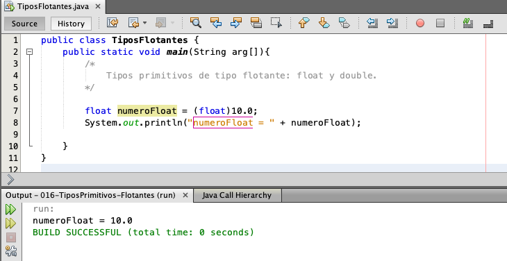

Pero qué pasa si nos vamos a los límites del punto flotante? Vamos a imprimir los valores límite mínimo y máximo.

```java
float numeroFloat = (float)10.0;    
System.out.println("numeroFloat = " + numeroFloat);
System.out.println("Valor mínimo tipo float: " + Float.MIN_VALUE);
System.out.println("Valor máximo tipo float: " + Float.MAX_VALUE);
```

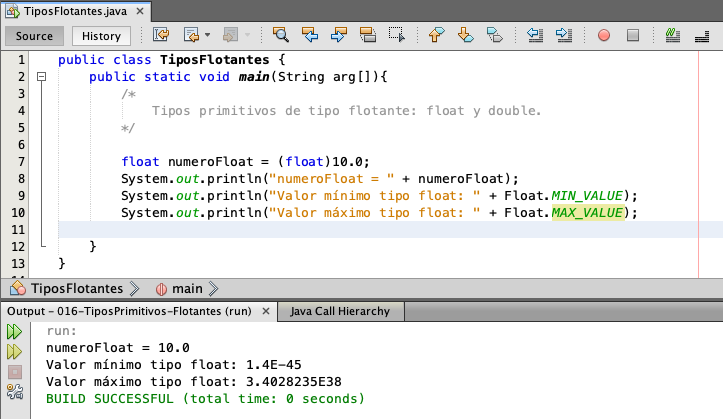

Podemos observar que tenemos un valor negativo `1.4E-45`, pero utilizando notación exponencial, si no están familiarizados con esto, pueden revisar cualquier referencia en Google para revisar la notación exponencial de los números pero básicamente es utilizar la letra de exponente y posteriormente indicamos en cuántas posiciones se va a mover. Este valor simplemente es un número más grande, pero utilizar esta notación para que no se despliegue todo este número, sino que se simplifique la impresión de números del tipo flotante, ya que pueden ser valores muy grandes. El valor máximo es 3.4028235E38, así que tenemos 38 posiciones hacia la derecha y en este caso 45 posiciones hacia la izquierda y por lo tanto podemos observar que es un número bastante grande.

Y si nos vamos al límite?

Utilizando la notación exponencial vamos a asignar este valor. Vamos a indicar que esta literal sea de tipo flotante, ponemos una F y podemos ver que ya no tenemos ningún problema. Estamos en el límite, pero todavía podemos utilizarlo, así que tenemos exponente a la 38.

```java
float numeroFloat = 3.4028235E38F;    
```

Pero si sumamos un 1 a este valor, es decir que nos vamos al valor de 36.

```java
float numeroFloat = 3.4028236E38F;    
```

Podemos observar que estamos superando el valor soportado por la literal de tipo flotante `floating point number too large`. Así que esto lo podemos resolver de dos maneras podemos indicar que esta literal sea de tipo doble.

```java
float numeroFloat = 3.4028236E38D;    
```

Sin embargo, si indicamos esto, tenemos que hacer la conversión de manera explícita, así que estamos convirtiendo una literal de tipo doble.

```java
float numeroFloat = (float)3.4028236E38D;    
```

Y lo estamos asignando a una variable de tipo flotante, vamos a ver el resultado.

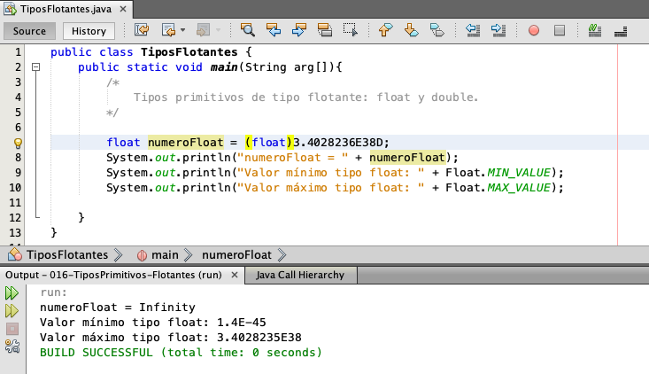

Y en este caso, debido a que ya estamos utilizando un número mayor soportado por el tipo `float`, vamos a tener pérdida de precisión, así que guardamos cambios, ejecutamos y podemos observar el valor de `Infinity`.

Esto quiere decir que ya no pudimos asignar el valor de manera correcta y por lo tanto el compilador ya no se puede interpretar. Este valor nos manda el valor de `Infinity` y por lo tanto fue un valor inválido. Para asignar al tipo flotante se perdió la precisión. Ya no fue el valor que intentamos asignar de tipo `double`, sino que ya no soportó este valor y por lo tanto nos manda el valor de `Infinity`.

Así que vamos a dejar simplemente el valor máximo que puede soportar.

```java
float numeroFloat = (float)3.4028235E38D;    
```
Guardamos cambios, ejecutamos.

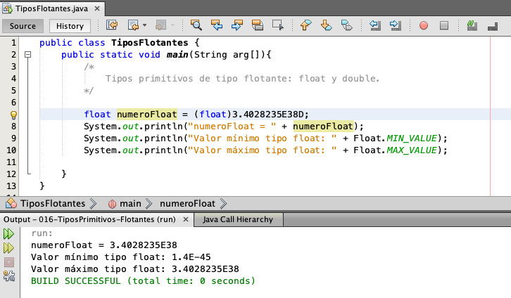

y podemos observar que en este caso es exactamente el mismo valor máximo que soporta el tipo flotante.

Y por último, vamos a ver el tipo `double`. Definimos una variable de tipo doble.

```java
double numeroDouble = 10;    
```

Le asignamos cualquier valor, por ejemplo, el valor de 10 no tiene que ser de punto flotante en automático 
la literal, el tipo entero se puede asignar a un tipo `double` sin realizar ningún tipo de conversión. Debido a que los tipos enteros se pueden almacenar en los tipos `double` sin ningún problema, vamos a imprimir esta variable número `double`. Vamos a imprimir los valores mínimo y máximo. Y la clase que vamos a utilizar es la clase de `Double` para saber el valor mínimo y máximo.

```java
double numeroDouble = 10;
System.out.println("numeroDouble = " + numeroDouble);
System.out.println("Valor mínimo tipo double: " + Double.MIN_VALUE);
System.out.println("Valor máximo tipo double: " + Double.MAX_VALUE);
```

Guardamos cambios, ejecutamos.

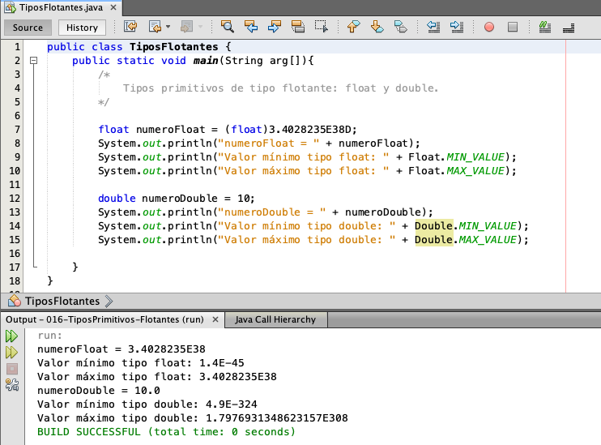

Y podemos observar que también este es un número ya muchísimo más grande. El tipo flotante tiene 45 posiciones hacia la izquierda y en este caso el valor mínimo de un `double` tiene menos 324 posiciones hacia la izquierda. Cuando trabajamos con el tipo `double` y en el tipo `float` tenemos 38 posiciones hacia la derecha y en este caso de `double` tenemos 308 posiciones en valor positivo, así que podemos observar que es un número muchísimo más grande.

Por ello es que el tipo de `double` es el tipo más grande en Java.

Es el tipo de dato que puede almacenar los valores mayores. Vamos a asignarle el valor máximo para hacer la prueba.

```java
double numeroDouble = 1.7976931348623157E308;
System.out.println("numeroDouble = " + numeroDouble);
System.out.println("Valor mínimo tipo double: " + Double.MIN_VALUE);
System.out.println("Valor máximo tipo double: " + Double.MAX_VALUE);
```

Guardamos cambios, imprimimos.


Observamos que el número `double` es exactamente igual al valor máximo que soporta este tipo de doble. Y podemos ver que tampoco fue necesario indicar que esta literal es de tipo doble, ya que en Java por default, las literales de punto flotante simplemente contener un punto entonces ya son de tipo `double`, así que eso es opcional se puede poner o no la `D`.

### :computer: `016-TiposPrimitivos-Flotantes` 

*`TiposPrimitivos`*

```java
public class TiposFlotantes {
   public static void main(String arg[]){
      /*
         Tipos primitivos de tipo flotante: float y double.
      */
        
      float numeroFloat = (float)3.4028235E38D;
      System.out.println("numeroFloat = " + numeroFloat);
      System.out.println("Valor mínimo tipo float: " + Float.MIN_VALUE);
      System.out.println("Valor máximo tipo float: " + Float.MAX_VALUE);
        
      double numeroDouble = 1.7976931348623157E308; 
      System.out.println("numeroDouble = " + numeroDouble);
      System.out.println("Valor mínimo tipo double: " + Double.MIN_VALUE);
      System.out.println("Valor máximo tipo double: " + Double.MAX_VALUE);

   }
}
```


Es todo por esta lección y nos vemos en la siguiente.

Saludos.

# 017 Ejercicio: Inferencia de Tipos con Var y tipos Primitivos - 07:55

Hola, bienvenidos a esta lección.

A continuación vamos a ver algunos detalles más del uso de la palabra reservada `var` en Java. Están listos? Vamos.

Ahora, una vez que ya hemos visto los tipos primitivos, tanto de tipo entero como de tipo flotante, podemos entonces entender a más detalle el uso de la palabra reservada. Por ejemplo, si vamos a definir una variable de tipo entero, podemos utilizar:

```java
var numeroEntero = 10;
```

Recordemos que las literales que no tienen punto flotante en Java y que son de tipo numérico en automático son de tipo `int`, por ello, el tipo de esta variable va a ser de tipo `int`. Vamos a imprimir esto.

```java
var numeroEntero = 10;
System.out.println("numeroEntero = " + numeroEntero);
```

Vamos a imprimir esto, guardamos cambios y ejecutamos.

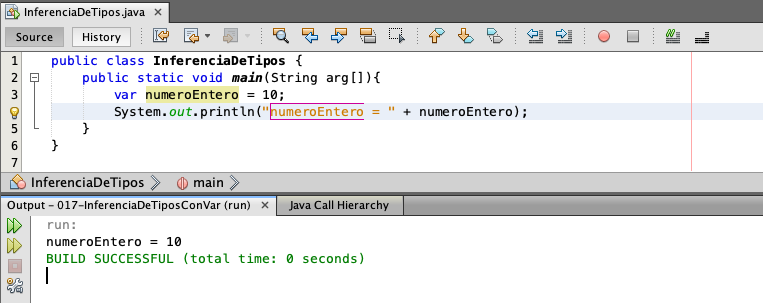

Y observamos el valor de 10.

Una forma de saber rápidamente el tipo de dato de esta variable, vamos a hacer lo siguiente, vamos a ejecutar nuestro programa paso a paso. Esto se conoce como el **modo Debug** y la mayoría de las herramientas en Java soporta este tipo de ejecución, la ejecución paso a paso.

Así que para ello tenemos que agregar, en primer lugar, lo que se conoce como un **punto de ruptura** para que se detenga la ejecución de nuestro programa donde nosotros indiquemos. No puede ser en cualquier parte, sino que tiene que ser en una línea de código que pueda ser ejecutada. Así que en este caso esta línea de código es una línea de código válida. Ponemos un punto de ruptura en esta sección, simplemente vamos a dar clic, así que damos clic y podemos observar que este cuadro rojo y el mensaje que no se agrega es una línea, es un punto de ruptura.

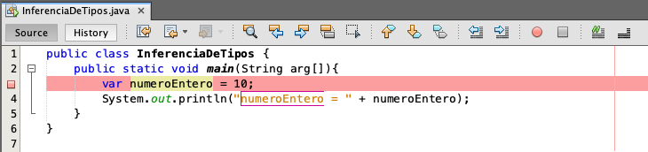

Así que aquí se va a detener la ejecución de nuestro programa cuando lo ejecutemos en modo Debug y ahora, 
para que se ejecute en modo paso a paso, damos clic derecho y en lugar de seleccionar **Run file**, seleccionamos **Debug File**. Así que vamos a dar clic.

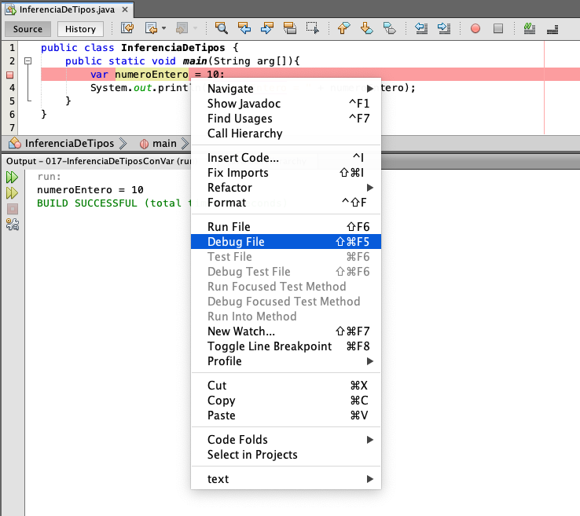

Y podemos observar que inicia la ejecución paso a paso en la parte inferior tenemos diferentes ventanas, tenemos diferentes Tabs y el Tab que nos interesa es el Tab de variables.

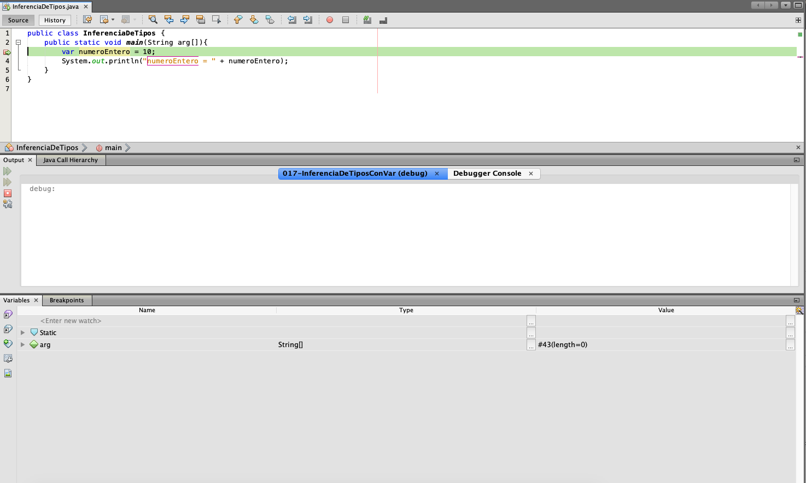

Si por alguna razón este Tab no se despliega o lo cerramos por algún error, entonces vamos a la sección de Window y en el apartado de Debugging podemos observar las diferentes opciones que tenemos para analizar nuestro código, en este caso vamos a dar clic sobre la sección de Variables.

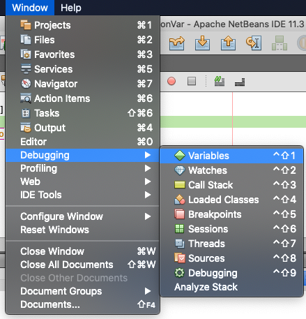


Así que damos clic y podemos ver que nos vuelve a desplegar la sección de variables. Ahora esto es importante porque aquí es donde vamos a ver el tipo de dato de esta variable y debido a que estamos en la ejecución paso a paso para avanzar a la siguiente línea, vamos a presionar la tecla de F8 o lo que se conoce también como **Step Over**, es decir, que vamos a ejecutar esta línea y vamos a pasar a la siguiente.


Así que presionamos este icono o presionamos F8. 


Y podemos observar que ya pasamos a la siguiente línea y además nos agregó en la parte inferior el valor 
de nuestra variable. En este caso la variable de número entero con el valor de 10. Pero además nos está indicando que su tipo es de tipo entero. Esto quiere decir que la inferencia de tipos en Java ya hizo su trabajo. Es decir, que esta literal es de tipo entero y por lo tanto, al momento de definir esta  variable, cuando se crea, entonces se asigna el tipo de la variable y por lo tanto ahora ya reconoce que la variable es de tipo entero.

Para terminar la ejecución paso a paso, en este caso, como ya es la última línea de código, podemos 
presionar F8 o podemos presionar este botón para que se ejecute todo nuestro programa.


Y también otra opción es que podemos detener la ejecución paso a paso con este botón.


Vamos a presionar el botón para que se ejecute todo nuestro programa y con ello termina la ejecución paso a paso.

Así que es una forma de saber el tipo de nuestras variables. Vamos a probar con otra variable.

```java
var numeroDouble = 10.0;
System.out.println("numeroDouble = " + numeroDouble);
```

Y recordemos que si utilizamos un tipo flotante simplemente por poner el punto cero, entonces esta variable ya es de tipo flotante. Vamos a comprobarlo.

Imprimimos esta variable, pero además vamos a realizar la ejecución paso a paso. Así que mantenemos nuestro punto de ruptura para quitarlo, simplemente volvemos a dar click y para volverlo a agregar en otra parte de nuestro código, volvemos a dar clic donde queremos que se detenga nuestro programa. En este caso vamos a detenerlo en la primer línea. Recuerden que ya debemos de haber guardado cambios. Damos clic derecho y seleccionamos Debug File. Y comienza la ejecución de nuestro programa paso a paso vamos a presionar F8. En este momento vamos al Tab de variables. Ya se creó nuestra variable de número entero y podemos observar su tipo, que es de tipo entero, según ya habíamos analizado. Ahora vamos a presionar de nueva cuenta F8 y esta es la línea de código que nos interesa en este momento. Esta literal es de tipo doble. Por lo tanto, si presionamos F8, entonces observamos que ahora esta variable número doble ya se creó en este momento es de tipo doble y el valor que asignamos es de tipo flotante 10.0, así que esta variable en automático se creó de tipo double.

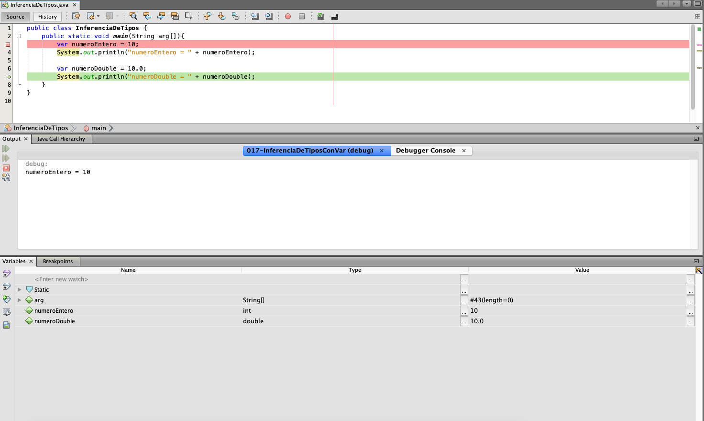

Por lo tanto, ya podemos entender a más detalle la inferencia de tipos. Vamos a detener esta ejecución paso a paso.

Y vamos a ver un último ejemplo qué pasa si queremos definir una variable por ejemplo, de tipo float, recordemos que si le asignamos el valor de 10.0, si lo dejamos así en automático esta variable, esta variable no va a ser el tipo float, sino va a ser de tipo double, ya que la literal es de tipo double y por lo tanto la inferencia de tipos va a reconocer que la variable la va a crear de tipo double.

```java
var numeroFloat = 10.0;
```

Así que para que la cree de tipo float, entonces podemos utilizar la F.

```java
var numeroFloat = 10.0F;
```

Recordemos que utilizar la F, entonces esta literal es de tipo float. Un detalle es que estas letras no las tenemos en todos los tipos, solamente lo tenemos para ciertos tipos como son los tipos long, float y double, así que solamente para estos tipos podemos indicar ese tipo de literales.

Por último, vamos a imprimir esta variable, la variable float, y vamos a ver el tipo ejecutemos paso 
a paso nuestro programa, así que mantenemos el punto de ruptura.

```java
var numeroFloat = 10.0F;
System.out.println("numeroFloat = " + numeroFloat);
```

Damos clic Derecho Debug File. Empezamos a ejecutar. Observamos nuestra variable número entero, que es de tipo int. Vamos a continuar. Se crean otras variables de tipo double. También podemos llevar que es de tipo double sin ningún problema. Y por último, vamos a crear la variable número float y podemos observar en este caso que se ha creado correctamente.


El tipo es de tipo float y aunque el valor es 10.0, esta literal hemos indicado que va a ser de tipo flotante 10.0F, por lo tanto, la inferencia de tipos al momento en que se creó esta variable también está reconociendo que este tipo debe de ser de tipo float. Así que con esto ya tenemos a más detalle el uso de la inferencia de tipos. Esto cuando estamos trabajando con tipos enteros o con tipos flotantes.

Bien terminamos la ejecución y con eso termina nuestro programa.

También ya podemos quitar el punto de ruptura.

Y para ejecutar nuestro programa de manera normal, simplemente damos clic Derecho Run File.

Y tenemos el resultado como lo hemos venido trabajando.

### :computer: `017-InferenciaDeTiposConVar` 

*`InferenciaDeTipos`*

```java
public class InferenciaDeTipos {
   public static void main(String arg[]){
      var numeroEntero = 10;
      System.out.println("numeroEntero = " + numeroEntero);
        
      var numeroDouble = 10.0;
      System.out.println("numeroDouble = " + numeroDouble);
        
      var numeroFloat = 10.0F;
      System.out.println("numeroFloat = " + numeroFloat);
   }
}
```

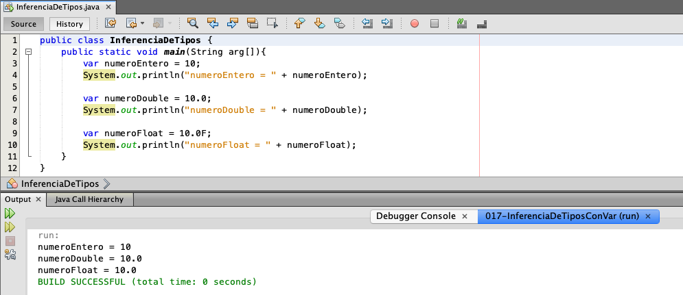

Así que todo por esta lección.

Saludos!


# 018 Ejercicio: Tipos Primitivos tipo char - 11:34

Hola y bienvenidos a esta elección.

A continuación estudiar el tipo Char en Java.

Están listos?

Vamos.

Y ya hemos visto hasta el momento varios tipos numéricos, como es el tipo in long, flagg y doble.

Pero ahora falta ver algunos otros tipos como es el tipo Char.

Así que vamos a escribir lo siguiente vamos a limpiar nuestro método main.

Para declarar una variable de tipo char simplemente utilizamos la palabra reservada char, ponemos el

nombre de la variable.

Y básicamente, un tipo achar tiene la característica que es solamente un carácter, así que puede almacenar

solamente un carácter, y para utilizar un carácter en Java utilizamos comilla simple.

Terminemos con punto y coma.

Y en este momento podemos asignar cualquier carácter, por ejemplo el carácter A vamos a imprimir esta

variable.

Guardamos cambios, ejecutamos.

Y Podemos se va a dar resultado.

Mi carácter, el valor de A.

Sin embargo, los caracteres se rigen por una lista de caracteres que se conoce como la lista de caracteres

Unicode.

Existen varios tipos de juegos de caracteres, pero el más común es el juego de caracteres Unicode.

Si conocen esta lista de caracteres, pueden buscar en Internet escriben List Unicode para ver una lista

de caracteres de tipo Unicode, entramos a este link que nos muestra en Wikipedia.

Ya que nos da una breve descripción del tipo de caracteres Unicode, el cual cuenta con 140 y 3000 859

caracteres.

Pero dependiendo de la región, ese juego de caracteres que vamos a utilizar más comúnmente.

Y en particular cuando estamos trabajando con el tipo Achar en Java, tenemos diferentes opciones para

poder trabajar con un char, ya sea utilizando el código Unicode.

También podemos utilizar el valor decimal o podemos utilizar directamente el carácter de tipo Unicode.

Por ejemplo, si bajamos más en esta lista.

Podemos observar la lista de caracteres latinos Bãsico.

Y observamos el código único que podemos utilizar posteriormente.

El carácter y también el valor decimal que podemos utilizar, así que cualquiera de esos tres valores

lo podemos utilizar en nuestro código.

Vamos a ver un ejemplo de esto.

El tipo char tiene 16bits, así que es la misma cantidad de bits que un tipo llort.

Sin embargo, un tipo almacena únicamente valores decimales sin punto flotante.

En cambio, un valor char puede almacenar un carácter, pero también valores decimales.

Vamos a ver cómo es esto.

Vamos a definir otra variable de tipo char.

Se va a llamar la variable marchar.

Y le asignamos directamente un valor, pero ahora utilizando el código Unicode.

Para ello vamos a utilizar diagonal inversa.

Y con esto estamos indicando aullaba que vamos a asignar un valor con el código Unicode.

Así que podemos tomar cualquier valor de estos, en este caso tenemos el cero cero veintiuno, vamos

a utilizar este carácter, el carácter de admiración.

Así que indicamos el código en este caso cero cero 21.

íbamos a imprimir este valor.

Así que imprimimos esta variable, guardamos cambios, ejecutamos.

Y Podemos se va que nos está imprimiendo el carácter deseado, que es el carácter de signos de admiración.

Sin embargo, no es la única forma de representar este carácter, como hemos comentado, también podemos

utilizar el código decimal asociado.

Así que vamos a definir la variable marchar, pero ahora en decimal.

Y si vamos a nuestra tabla, únicoque podemos observar que en este caso el valor decimal asociado a

este carácter de admiración es el valor decimal de 33.

Así que en ese caso también podemos asignar un valor en decimal y debido a que estamos indicando que

esta variable es de tipo char y no de tipo int, entonces el valor lo debe de convertir a un tipo char.

Vamos a ver el resultado.

Imprimimos esta variable y guardamos cambios, ejecutamos.

Y observamos exactamente el mismo resultado, aunque le asignamos el valor de 33.

Podemos observar en la salida que se está visualizando el carácter de signo de admiración.

Así que es otra forma de asignar un valor cuando estamos trabajando con tipos char y esto es importante

porque en ocasiones vamos a visualizar el código de esta forma, pero también podríamos visualizar un

código decimal y en este caso no quiere decir que el valor es 33, sino que representa el valor decimal

de este carácter.

Así que para saber cuál es el carácter podemos mandarlo a imprimir o consultar la tabla de caracteres

Unicode.

Como estamos realizando?

Y por último, también podemos asignar.

Directamente el símbolo.

Para utilizar el símbolo vamos a poner comilla simple.

Y si tenemos el símbolo disponible, se lo podemos asignar directamente.

Así que en este caso voy a copiar el signo de admiración.

Obviamente no pueden escribir del teclado, pero en este caso lo voy a copiar, ya que en su lista de

caracteres Unicode podría necesitar de un carácter especial que no pueden sacar directamente del teclado.

Así que por ello también estamos demostrando que podemos copiar y pegar este carácter directamente,

vamos a imprimir este valor.

Se imprime de marchar, pero ahora utilizando directamente el símbolo.

Observamos el mismo resultado en los tres casos estamos visualizando el carácter de símbolo de admiración.

Ahora, por último, vamos a ver el caso, cuando estamos trabajando con Bahr ya hemos utilizado el

tipo Char.

Vamos a copiar esas tres líneas y ahora vamos a utilizar Bahr, así que en los tres casos.

Vamos a utilizar en lugar de echar.

Vamos a utilizar Bahr.

Vamos a renombrar estas variables.

Simplemente hacemos un cambio en el nombre para que podamos utilizar esta nueva variable.

Y también en la impresión cambiamos el nombre para que sepamos.

A qué valor corresponde?

A qué variable?

Así que en este primer caso estamos utilizando también el símbolo único y lo estamos asignando a un

tipo bar.

En este caso, debido a que ya va, va a ser una inferencia de tipo al detectar que estamos utilizando

un carácter único.

Entonces la variable de tipo bar, el tipo va a ser de tipo char.

Esto se debe a que estamos indicando que va a ser un carácter de tipo único.

Y por lo tanto, si mandamos a imprimir aquí se va a visualizar correctamente el carácter de símbolo

de admiración.

Sin embargo, en el caso del valor decimal que le estamos asignando el valor de 33 cuando lo asignamos

directamente a una variable que utiliza Baur, entonces la inferencia de tipos.

Recordemos que esta literal es de tipo entera, así que al asignarlo a una variable de tipo VaR, el

compilador de Java va a inferir el tipo de la literal.

Así que en este caso no va a crear una variable de tipo char, sino una variable de tipo int, según

hemos analizado anteriormente.

Así que en este caso ya no se va a imprimir el carácter de símbolo de admiración, sino que se va a

imprimir el valor de 33 de tipo entero.

Así que en ese caso debemos de tener cuidado, ya que no podemos asignar directamente el valor decimal

asociado a un carácter y querer asignarle a un tipo VaR, ya que esto va a tomar un tipo entero y no

un tipo char.

Y por último, si tratamos de asignar directamente un carácter, en este caso también va a funcionar,

ya que Bahr va a detectar que del lado derecho tenemos solamente un carácter, así que esta variable

la va a crear de tipo char.

Así que con esta explicación vamos a modificar las variables que se van a imprimir para visualizar los

resultados.

Marchar 1.

Marchar decimal.

2.

Y marchar símbolo tres, ya que son los nombres de las nuevas variables.

Vamos a abordar cambios, ejecutamos.

Y observamos en el primer caso parchar 1.

Hemos comentado que funciona sin ningún problema, porque al detectar el carácter de escape de únicoque

entonces el compilador detecta que es un tipo char.

Pero en el caso de parchar decimal, al utilizar bahr no se encuentra ningún tipo char, sino un tipo

int, una literal de tipo entera.

Por lo tanto este valor es de tipo entero y no es de tipo char, por ello es que podemos observar directamente

el valor de 33.

A diferencia del caso, cuando asignamos el parchar decimal utilizando un tipo char a diferencia de

un ninth, entonces en este caso sí podíamos visualizar correctamente el carácter.

Y por último, en el caso también de que estamos utilizando el símbolo directamente, aunque utilicemos

bahar.

También el compilador detecta que estamos asignando un carácter y por lo tanto esta variable es de tipo

char y no de tipo entera.

Y por último, también vamos a comentar un detalle un tipo char se puede convertir a un tipo entero.

Sin embargo, si hacemos esta conversión que sucede de manera automática, ya que un tipo char ocupa

16bits y un tipo entero ocupa 32bits.

Por lo tanto, si hacemos lo siguiente y.

Variable entera.

Pero con símbolos.

Vamos a asignarle el símbolo de admiración.

Podemos observar que el compilador no marca ningún problema, ya que un char se puede asignar sin problema

a un tipo entero, ya que lo soporta.

Pero si queremos mandar a imprimir esta variable, vamos a ver el resultado.

Guardamos cambios y ejecutamos.

Y observamos el valor de 33.

Así que aunque el tipo Char fue correcto, es un carácter solamente cuando le estamos asignando a un

tipo entero.

Entonces se convierte de manera automática a su código decimal.

Recordemos que el código decimal de este carácter es el valor de 33.

Por lo tanto, cuando estamos imprimiendo este valor, en lugar de visualizar el símbolo, lo que estamos

visualizando es el código decimal asociado a este símbolo.

Y esto va a ser muy común, ya que en ocasiones vamos a ver este tipo de código.

Por ejemplo, definir una letra.

Le asignamos el valor de una letra y mandamos a imprimir esta variable de letra y vamos a ver qué es

lo que imprime.

Si ya entendieron cuál es el resultado.

Les vamos a dar unos segundos para que revisen su tabla único para el carácter de minuscula, así que

les damos unos segundos para que tengan la solución.

Bien, si ya saben cuál es el valor, entonces ya deberían saber qué es lo que se va a imprimir en este

momento, así que guardamos cambios, vamos a imprimir.

Ejecutamos y vemos el valor de 97 y si comprobamos en nuestra lista de caracteres únicos vamos a buscar.

El carácter en este caso podemos observar que no es lo mismo la letra A en mayúscula que la letra A

en minúscula.

Así que en este caso estamos visualizando la letra en minúscula con el valor de 97.

Y si tratamos de imprimir la letra A, pero en mayúscula, entonces vamos a visualizar otro valor.

Guardamos cambios, ejecutamos y el valor es el código asociado de 65.

Así que revisen a detalle esta elección, ya que es importante que conozcan también cómo se manejan

los caracteres en Java, ya que se pueden encontrar este tipo de códigos y si no entienden a detalle

cómo funciona esto, pueden tener problemas para resolver cualquier detalle que se les presente cuando

trabajan con caracteres en Java.

Esto por esta elección y nos vemos en el siguiente vídeo.

Saludos!

# 019 Ejercicio: Tipos Primitivos tipo boolean - 07:42

Hola y bienvenidos a esta elección.

A continuación van a estudiar el tema del tipo booleano en Java están listos?

Vamos.

Llamado a seguir trabajando con nuestro proyecto, vamos a quitar este código.

Y vamos a ver ahora los tipos julianos, un tipo vulcano en Java almacena los valores únicamente de

falso o verdadero, es decir, chú o fouls, así que vamos a ver cómo trabajar con ese tipo de dato.

Para definir una variable de tipo bullían, simplemente utilizamos la palabra reservada, bullían,

agregamos el nombre de la variable.

Bar de tipo bullían y le asignamos un valor, este valor puede ser el tipo chú o de tipo fouls.

Debe de respetarse mayúsculas y minúsculas, tal cual como lo estamos observando en este caso, los

valores de chú y fouls deben ir en minúsculas.

Vamos a comenzar el valor con verdadero ya ese tipo de datos también se le conoce como valores de tipo

bandera.

Una bandera básicamente es como un semáforo, si está en verde, entonces quiere decir que podemos continuar.

Si está en rojo quiere decir que debemos de detenernos y por ello es que ese tipo de auto también se

le va a conocer como tipos bandera.

Así que la bandera en este caso está puesto.

El valor de chú, por lo tanto, quiere decir que está en verdadero.

Ahora vamos a imprimir este valor.

Guardamos cambios y ejecutamos.

Y podemos observar el valor de verdadero.

Si modificamos este valor.

Ahora, por el valor de fouls, guardamos cambios, ejecutamos.

Observamos el valor de fouls, así que son los dos valores que podemos almacenar en ese tipo de variables.

Sin embargo, ese tipo de variables nos va a servir para mucho más que solamente tener los valores de

chú y fours.

El tipo de valor bullían.

No lo vamos a utilizar muchísimo en esos algoritmos.

De momento vamos a adelantarnos un poco y utilizar la estructura y es para que vean un ejemplo de cómo

podemos utilizar esos tipos vulcanos, así que vamos a hacer lo siguiente.

Vamos a utilizar IBF y entre paréntesis vamos a poner la expresión booleana para comprobar si el valor

es verdadero o falso.

Así que vamos a preguntar si la variable de tipo bullían.

Contiene el valor de verdadero.

Esto no era necesario escribirlo.

Esto es opcional, así que de manera explícita estamos diciendo si es igual a verdadero, pero también

si solamente ponemos si bahr bullían, entonces también estamos preguntando si esta variable contiene

el valor de verdadero.

Abrimos llaves, damos enter y en caso de que esta variable bar bullían sea verdadera, entonces vamos

a mandar imprimir un mensaje.

La bandera es verdadera.

De lo contrario, escribimos.

La bandera.

Es falsa, así que dependiendo del valor de esta variable de tipo bullían, vamos a entrar al IBF o

vamos a entrar al Alex, se va a ejecutar una u otra sentencia dependiendo del valor de nuestra bandera.

Así que vamos a guardar cambios.

En este caso el valor está igual a fouls, así que revisamos nuestro código.

No debería de imprimirse la bandera verdadera, sino que debería imprimirse solamente.

El código de la bandera es falsa.

Vamos a comprobarlo.

Guardamos cambios, ejecutamos.

Y podemos llevar en este caso la bandera es falsa y si cambiamos el valor a tu?

Guardamos cambios y ejecutamos.

Entonces ahora vemos únicamente el texto la bandera es verdadera, ya no se visualiza el texto de que

la bandera es falsa, debido a que la condición no se comprobó para el caso de fouls, solamente para

el caso de Tru.

Así que solamente es un pequeño ejemplo para que podamos entender cómo vamos a utilizar estos tipos

booleanos.

Si el valor de esta variable es verdadera, entonces se va a ejecutar una parte de nuestro código.

Si es falsa, se va a ejecutar otra parte de nuestro código.

Y por último, vamos a ver también otro pequeño ejemplo para que podamos aterrizar más esta idea.

Vamos a hacer un pequeño algoritmo para saber si una persona es mayor de edad, así que vamos a definir

una variable llamada edad.

Le asignamos una literal de tipo entera con el valor de 30, así que esta persona vamos a suponer que

tiene 30 años.

Ahora vamos a definir otra variable llamada Es adulto.

Y no le vamos a asignar directamente un valor de Fool's, sino que vamos a escribir una expresión y

vamos a preguntar si la variable de edad, en este caso de la persona que estamos suponiendo que tiene

30 años, es igual o mayor al valor que considera a una persona como mayor de edad, en este caso de

18 años.

Así que vamos a preguntar si la edad.

Es mayor o igual?

Qué 18?

Más adelante vamos a ver a detalle todo esto.

Simplemente nos estamos adelantando un poco para que podamos entender cómo utilizar también estos tipos

vulcanos, no solamente con variables, sino también ya en este caso con expresiones.

Así que estamos preguntando si esta variable de edad 30 es mayor o igual a 18.

Esta pregunta nos va a regresar un valor de tipo juliano, así que nos va a regresar Chú o Fool's.

En este caso 30 es mayor a 18, por lo tanto, resultado la variable de adulto va a tener el valor de

chuc.

Podemos observar que también estamos utilizando Baur en lugar de bullían sin ningún problema.

Estamos utilizando la inferencia de tipos y en este caso el compilador de Java sabe que es un tipo julianos,

debido a que esa expresión va a regresar a un fouls y por lo tanto esta variable va a ser de tipo.

Bullían bien, íbamos a utilizar de nueva cuenta la estructura IFF para preguntar si es adulto.

Si es adulto.

Entonces abrimos yaveh, mandamos a imprimir.

Eres mayor de edad?

De lo contrario.

Mandamos a imprimir el mensaje Eres menor de edad?

Así que vamos a comprobar con estos valores cuál es el resultado final.

Guardamos cambios y ejecutamos.

Y en este caso, debido a que la edad de la persona que estamos suponiendo tiene un valor de 30, entonces

30 es mayor que 18.

Por lo tanto es un adulto y nos manda el mensaje eres mayor de edad?

Pero si ponemos, por ejemplo, el valor de diez años.

Guardamos cambios, ejecutamos y observamos.

Eres menor de edad.

Así que esa expresión básicamente es lo que va a definir la secuencia de nuestro código, en este caso

es un pequeño algoritmo muy sencillo, pero es para que empecemos a entender cómo funciona este tipo,

bullían.

Ahora esta línea podemos ahorrarla.

Y poner esta expresión directamente.

En la pregunta de nuestro IF.

Así que no era necesario volver a crear otra variable, esto podemos omitirlo y preguntamos directamente

si la edad de la persona proporcionada es mayor o igual que 18, entonces va a ejecutar esta parte del

código.

De lo contrario, ejecuta esta parte y omite la parte anterior.

Bien, simplemente vamos a comprobar si sigue funcionando, igual ejecutamos y observamos eres menor

de edad debido a que el valor es igual a 10 10 años, no es mayor igual a 18.

Por lo tanto, aquí nos va a regresar falso y no se va a imprimir este valor, sino que se va a imprimir

el valor de eres menor de edad.

Así que como podemos observar el tipo bullían, lo vamos a estar utilizando bastante cuando estemos

trabajando con nuestros algoritmos, así que es muy importante que nos empecemos a familiarizar con

ese tipo de dato.

Todo por esta elección y nos vemos en el siguiente video.

Saludos.

# 020 Ejercicio: Conversión de Tipos Primitivos en Java - parte 1 - 11:58

Hola, bienvenidos a esta elección.

A continuación vamos a ver el tema de conversiones de tipos utilizando tipos primitivos en Java están

listos?

Vamos.

Bien, vamos a quitar este código.

Vamos a trabajar con nuestro método main.

Y lo que vamos a ver a continuación son algunas conversiones de tipos, ya que las vamos a necesitar

cuando estamos trabajando con sus programas en Java.

Por ejemplo, una conversión muy común es convertir un tipo string a un tipo entero y viceversa, un

tipo entero a un tipo string, así que vamos a ver cómo realizar esta conversión.

Así que vamos a agregar el comentario.

Convertir un tipo string a un tipo INT.

Para esto vamos a utilizar una función que ya viene predefinida en Java, la cual nos permite convertir

una cadena a un tipo entero, así que vamos a escribir el siguiente código.

Definimos nuestra variable llamada edad y esta variable no estamos indicando todavía el tipo el tipo,

recordemos que Yabal lo va a inferir dependiendo de lo que tengamos del lado derecho.

Así que vamos, escribió lo siguiente asignamos el valor de 20, pero podemos observar que estamos utilizando

una cadena.

Así que si asignamos directamente este valor de 20 a una variable de tipo VAR, esta variable va a ser

el tipo instruían y no de tipo int.

Y nosotros queremos que esta variable sea de tipo INT para que podamos realizar operaciones con esta

variable.

Así que para convertir esta cadena a un tipo entero vamos a utilizar nuestra clase Integer.

Y esta clase tiene un método llamado Parcent y este método nos va a permitir precisamente convertir

el valor de la cadena 20 y pasarlo a un tipo entero.

Posiblemente vamos a ver a detalle cómo crear nuestros propios métodos y cómo mandarlos llamar, pero

en este caso estamos observando cómo podemos mandar a llamar un método.

En este caso el método se llama Hint, se encuentra definido dentro de la clase Integer.

Y este método lo que hace básicamente es recibir un valor de una cadena, recibe esta cadena un tipo

de string y lo va a convertir a un tipo entero.

Este valor se regresa y entonces se asigna a la variable de edad.

Por lo tanto, ahora la variable, en lugar de ser de tipo string, va a ser de tipo entero.

Vamos a comprobar esto, vamos a mandar a imprimir esta variable.

La variable de edad.

Guardamos cambios, ejecutamos y hasta el momento estamos viendo el valor de 20.

Pero qué pasa si esta variable le sumamos el valor de uno?

Vamos a ponerlo entre paréntesis.

Ya que recordemos que debe de realizar primero la operación de suma y posteriormente la concatenación.

Esto ya lo hemos visto anteriormente, así que estamos realizando primero la suma y por ello ponemos

esta operación entre paréntesis y posteriormente se realiza la concatenación con este texto bien, así

que guardamos cambios, ejecutamos y podemos observar el valor de 21, así que está funcionando correctamente

nuestra conversión, ya que este es un tipo entero y no un tipo estrechen.

Ahora, si fuera un tipo de string vamos a ver el resultado.

Vamos a utilizar esta misma variable de edad, pero sin realizar la conversión.

Y vamos a ver el resultado.

En lugar de tener el resultado de 21, vamos a ver cuál es el resultado y podemos observar que tenemos

el resultado de 201, y también el detalle es que esto no es un hit, sino que es un tipo string.

Por lo tanto, es una concatenación de la cadena de edad que vale 20 y se concatena con el valor de

1.

Y aunque es una literal de tipo entera, debido a que del lado izquierdo tenemos un string.

Entonces recordemos que aquí se aplica el contexto, estrellen.

Por lo tanto, todo se concatenan y el resultado es 20 concatenado con 1 y por lo tanto el resultado

es 20 1.

Realmente no es el número 201, sino la cadena 20.

1.

Así que este detalle es importante convertir un tipo string a un tipo entero para que podamos realizar

operaciones con estos tipos de datos de tipo entero.

Esto mismo lo podemos hacer con tipos, por ejemplo, de tipos de fútbol.

La clase que vamos a utilizar en lugar de integer vamos a utilizar la clase de doble.

Así que vamos a definir una variable.

Simplemente para representar el valor de Pi, el valor matemático de 3.14 16.

Bien, para ello vamos a utilizar la clase doble y en lugar de utilizar el método Parse, en este caso

vamos utilizar el método doble, que es el que está definido dentro de esta clase y podemos observar

que lo que está esperando es una string, así que vamos a pasarle un string.

En este caso el valor de 3.14 16.

Qué es el valor de PIN y mandamos a imprimir esta variable de PIN, guardamos cambios y ejecutamos.

Y observamos el valor de 3.14 16.

Sin embargo, de igual manera en este caso es un tipo doble y no un tipo estrellen.

Ahora para verificar esto podemos ejecutar paso a paso.

Vamos a poner un punto de ruptura.

También esto ya lo hemos hecho anteriormente.

Ponemos el punto de ruptura.

Damos clic derecho y en lugar de rompibles seleccionamos Buffalo.

íbamos a ejecutar paso a paso.

Estamos en nuestra primera línea, en la cual estamos haciendo la conversión de la cadena 20 hacia el

tipo de dato entero de edad, así que vamos a ver qué tipo de dato finalmente tiene esta variable de

edad.

Vamos a presionar F8 para que se ejecute esta línea.

Podemos ver que nuestro código ya pasa a la siguiente línea la línea que está en verde es la línea que

se está ejecutando.

Como podemos observar, la línea que está en rojo es donde se detuvo nuestro programa, pero en este

momento ya pasamos a la siguiente línea.

Por lo tanto, esta variable ya fue creada.

Observamos a quienes la parte inferior, la variable de edad es de tipo int, así que ya se realizó

correctamente la conversión con el valor de 20.

Si la conversión no se hubiera realizado entonces esto hubiera sido un tipo de string en lugar de un

tipo int.

Vamos a continuar para verificar ahora el valor de la variable PI.

Presionamos F8 de nueva cuenta F8 y vamos a revisar el valor de la variable PIN.

Ya se ha creado esta variable y podemos ver que es de tipo doble, así que también la conversión se

está realizando correctamente a partir del método Pardal recibe una cadena y el resultado de la conversión

se asigna a la variable valor.

Y por lo tanto, el compilador infiere el tipo que se le está asignando, que es un valor de tipo doble,

ya que ya se hizo la conversión y entonces ahora la variable es de tipo doble con el valor de 3.14 16

y con este valor entonces ya podemos realizar cualquier operación matemática que necesitemos.

Observamos la realidad, el valor de edad 21.

Si presionamos F8.

Vemos el valor también de valor PI 3.14 16.

Presionamos F8 para que termine nuestro programa o con este botón para detener la ejecución.

También del modo debug.

Y con eso ya termina la discusión en nuestro programa podemos quitar el punto de ruptura.

Ahora esto nos va a servir, por ejemplo, cuando estamos trabajando con esta clase escaner para solicitar

información al usuario.

La clase escaner y su método Next Line regresa un tipo de.

Por tanto, es necesario convertirlo a un tipo entero para poder realizar operaciones matemáticas con

ese valor.

Así que vamos a ver el siguiente ejercicio.

Vamos a pedir un valor, pero utilizando nuestra clase escaner también, esto ya lo hemos visto anteriormente.

Vamos a repasarlo, vamos a definir nuestra variable llamada consola, puede ser cualquier nombre,

pero en este caso lo voy a poner consola para que sepamos que vamos a trabajar con la consola.

Creamos un nuevo objeto de nuestra clase escaner.

Posteriormente vamos a ver a detalle esta sintaxis, pero con esto básicamente vamos a poder utilizar

nuestra clase Escanes y como parámetro para poder crear este objeto, pasamos la consola utilizando

la clase System y posteriormente el atributo de estamos indicando que vamos a trabajar con la consola

y debido a que ya habíamos trabajado con esta clase escaner ya tenemos este importe, pero si no lo

tuvieran voy a quitarlo.

Y en este caso nos está solicitando importar esta clase, así que damos clic e importamos esta clase

de IAVA punto y útil.

En dado caso de que no lo tuvieran.

Y podemos observar que este importe debe estar definido fuera de la definición de la clase.

Bien, con esto ya tenemos nuestra variable escaner y ahora lo que vamos a hacer es solicitar un dato

al usuario.

Vamos a utilizar nuestra misma variable de edad y le vamos a asignar un nuevo valor en lugar del valor

de 20 que le asignamos.

En primer lugar, ahora vamos a reutilizar esta variable y vamos a cambiarle su valor para cambiar su

valor.

Vamos a utilizar.

La variable de consola.

Vamos a utilizar el método NEX Line.

Sin embargo, podemos observar que esta variable de edad es de tipo entero, debido a que en este caso

ya identificó de qué tipo va a ser esta variable, ya sabe el compilador que va a ser de tipo entero

debido a la inferencia de tipos y por ello en este caso no podemos hacer esta asignación directamente.

Tenemos que convertir este tipo de dato.

Así que para ello vamos a utilizar la clase Integer y el método INT.

Así que volvemos a utilizar este método y envolvemos la llamada a la consola.

Entre paréntesis podemos observar que ahora este va a ser el valor que estamos pasando a este método

de Parcent.

Así que en este caso estamos pasando el argumento de la consola y se va a realizar la conversión, podemos

ver que aún nos marca error.

Ahora, antes de utilizar la consola, vamos a solicitar al usuario que proporcione un valor.

El mensaje de texto proporciona a tu edad.

Una vez que proporciona la edad aquí va a proporcionar su valor, se lee el valor de la consola y posteriormente

se hace una conversión y una vez que se hace la conversión, este valor se asigna a la variable edad.

Vamos a imprimir de nueva cuenta el valor de la variable edad.

En este caso trata de imprimir el valor de la variable consola.

Esto no es lo correcto.

Queremos imprimir el valor de la variable edad, por lo tanto escribimos el nombre de la variable edad

y posteriormente damos enter.

Bien, y con eso ya tenemos que va a imprimir el valor de la variable edad, vamos a guardar cambios

y vamos a ejecutar.

Y en ese caso nos pide Proporcionã tu edad, vamos a proporcionar el valor, por ejemplo, de 10.

Observamos correctamente el valor de 10.

Pero aquí un detalle.

Por ejemplo, si damos un derecho Rohn y proporcionamos una edad, pero que no corresponde a una edad,

sino por ejemplo, un texto.

Cualquier texto, por ejemplo a Dios podemos observar que nos manda un error.

Indicando el error que el valor que hemos proporcionado no es un número, debido a que este método de

parship intenta tomar una cadena y convertirla a un entero.

Pero si por alguna razón este valor no es de tipo entero, entonces va arrojar el error que hemos visualizado

de nombrar format exception.

De momento, el tema de manejo de excepciones todavía no lo vamos a trabajar, lo vamos a ver posteriormente,

pero con esto ya estamos poniendo en práctica el concepto de conversión de tipos.

Estamos recibiendo un tipo string y este valor lo convertimos a un tipo entero.

Bien vamos a entender hasta aquí este video y vamos a continuar el siguiente.

Saludos.

# 021 Ejercicio: Conversión de Tipos Primitivos en Java - parte 2 - 10:38

Bien, vamos a continuar con esta elección.

Todavía nos falta comentar algunos temas más para poder terminar este ejercicio.

Ahora lo que vamos a hacer es convertir un tipo INT a un tipo string, así que es el proceso inverso.

Pero para ello no vamos a utilizar la consola, simplemente vamos a hacer la conversión directamente,

así que vamos a definir una variable.

Edad, pero en texto.

Y lo que vamos a hacer es utilizar ahora nuestra clase estribe.

íbamos a utilizar el método Valio Of.

Y podemos observar que este método puede recibir varios tipos para convertir el tipo que estamos proporcionando

y lo va a convertir a un estreno.

En este caso nos interesa convertir un hit a un string, pero podemos utilizar cualquier otro tipo.

Más adelante vamos a ver a detalle cada uno de estos tipos, así que no se preocupen, ya hemos visto

varios, pero todavía nos falta ver varios más.

En este momento vamos a proporcionar un valor, por ejemplo el valor de 10 y vamos a imprimir esta variable.

La variable edad texto.

Vamos a poner este comentario esta parte de código para que no nos pida un valor, para poner entre

comentarios toda esta parte de código, tenemos este icono y simplemente si damos clic.

Entonces todo lo pone entre comentarios.

Si queremos quitar los comentarios, damos clic sobre este otro icono para quitar todos los comentarios.

Si por alguna razón no visibilizan esta barra, pueden ir avío y en este caso selecciona la opción de

editor turbar.

Así que pueden seleccionar o de seleccionar esta opción.

Bien, ya tenemos nuestro código comentado, vamos a ejecutarlo, guardamos cambios.

Ruffin Observamos el de texto, tenemos el valor de 10.

Sin embargo, en este caso este valor no es un tipo int, sino que ya se convirtió a un tipo string.

Vamos a comprobarlo.

Vamos a poner un punto de ruptura en esta línea de código, ya que es la que nos interesa analizar,

así que damos clic Derecho y Brookfield.

Podemos se va que en este momento ya se crearon las variables declaradas anterior a esta línea de código,

pero en este caso apenas queremos analizar esta línea de código.

Vamos a presionar F8 para que se ejecute esta línea y podemos ver que ya se que era la variable era

texto y esta variable de texto podemos llevar el detalle siguiente es de tipo string y además el valor

podemos observar que tiene comillas.

No es directamente el valor, como en este caso el valor de 20 de la variable de edad, sino que en

este caso, como es un string, este valor de 10 se convirtió a un string y por lo tanto tiene comillas.

Así que de esta forma podemos convertir tipos enteros a un tipo string e incluso cualquier otro tipo,

según hemos visualizado que son varios tipos los que soporta este método valio off para convertir un

tipo proporcionado a un tipo de string.

Bien vamos a detener la ejecución de nuestro programa, quitamos el punto de ruptura y vamos a continuar

ahora.

Un detalle también importante es que si queremos solicitar solamente un carácter, asignarlo a una variable

de tipo char, esto no es tan directo.

Tenemos que hacer lo siguiente en primer lugar, vamos a estudiar cómo recuperar un carácter de una

cadena.

Por ejemplo, definimos la variable llamada carácter.

Aquí, en esta variable solamente queremos asignar una cadena.

Por ejemplo, en la cadena de Hola!

Pero recordemos que un tipo achar solamente puede almacenar un carácter, así que en este caso no se

estaría creando una variable de tipo char, sino una variable de tipo string, ya que del lado derecho

tenemos un string.

Pero para que esta variable realmente sea de tipo char, entonces podemos solicitarle a esta cadena

que nos regrese solamente un valor para ello.

A esta cadena de Hola le podemos solicitar solamente un carácter.

Utilizando el método Charata.

Así que después de la cadena ponemos punto y podemos ver que tenemos varios métodos disponibles debido

a que esto es una cadena y recordemos que una cadena no es un tipo primitivo, sino un tipo obvie,

es la clase destruí, así que vamos a utilizar este método Charata y básicamente este método.

Txarrak Lo que vamos a hacer es proporcionar un índice de los caracteres que contiene esta cadena.

Por ejemplo, esta cadena podemos observar que contiene cuatro caracteres, pero para poder recuperar

un carácter de esta cadena tenemos que asignarle un índice.

En este caso, los índices en Java comienzan en cero.

Por lo tanto, este carácter tendría el índice cero.

Este siguiente carácter tendría el índice 1.

La L tendría el índice 2.

Y la tendría el índice 3 y dependiendo del carácter que queramos recuperar, entonces es el índice que

debemos de proporcionar en este método.

Por lo tanto, si pasamos el valor de cero, entonces nos va a regresar solamente un carácter el carácter

de H.

No toda la cadena de Hola, sino que solamente el carácter de H.

Y si pasamos en lugar de cero pasamos el índice de uno.

Entonces nos va a regresar el carácter de Oh!

Y así podemos probar con cualquier elemento.

Si pasamos el índice 2 nos va a regresar el carácter de L.

Y si pasamos el índice 3, nos va a regresar el valor de A. El carácter.

Y si proporcionamos un valor de índice que no sea válido, entonces nos va a marcar una excepción.

De igual manera, de momento todavía no vamos a trabajar con excepciones.

Esto lo vamos a ver más adelante.

Así que vamos a comprobar, vamos a pasar el valor de cero.

Vamos a imprimir este carácter.

Guardamos cambios, ejecutamos y podemos observar que solamente nos está imprimiendo el valor de H,

ya que en este caso le estamos solicitando el índice cero.

Si pasamos, por ejemplo, el índice 1, guardamos cambios, ejecutamos.

Observamos que nos está regresando el carácter o y por lo tanto esta variable ya no es de tipo string,

sino de tipo char.

Vamos a comprobarlo.

Ponemos un punto de ruptura de Buffy.

Presionamos F8.

Y aquí en la parte de variables.

No en opus, sino en el tabulador de variables podemos observar la variable de carácter y esta variable

de carácter, podemos observar su tipo que es de tipo char y le estamos asignando el char de o qué es

la letra, o incluso podemos llevar la comida simple que esté envolviendo a este carácter, indicando

que es un tipo char.

Así que de esta manera estamos recuperando un tipo char.

Ahora para qué nos va a servir esto?

Esto nos va a servir para, cuando solicitemos información de la consola, poder solicitar solamente

un carácter al usuario, así que vamos a hacerlo.

Vamos a mandar un mensaje a la consola.

Proporciona un carácter.

Y podemos utilizar nuestra variable de carácter.

Utilizaron variables de consola.

Vamos a habilitarla.

Esta línea de código vamos a habilitarla.

Solamente esta línea.

Vamos a utilizar esa variable de consola.

Y utilizamos el método NEX Line.

Aunque tenemos otros métodos.

De momento les recomendamos solamente utilizar este método.

Existen otros métodos como NEX y NEX doble, etcétera, pero esos métodos hay que saber utilizarlos

para que nuestro programa se comporte como necesitamos.

Así que, de momento, para no meternos en complicaciones les sugiero utilizar el método Next Line.

Ya más adelante vamos a ver cómo utilizar esos otros métodos.

Y Podemos se va que en este caso el método Next Line no regresa un string.

Por lo tanto, el compilador nos indica un error que no podemos convertir un string a un tipo char debido

a que esta variable llamada cáracter recordemos que anteriormente ya la definimos y por inferencia de

tipos el compilador ya detectó que va a ser de tipo char.

Por lo tanto, una vez que se crea esta variable siempre va a ser de tipo char y en este momento el

compilador detecta que esta variable es de tipo char y no podemos asignar un string a un tipo char.

Ahora, entonces, cómo resolvemos este detalle?

Vamos a hacer lo mismo en lugar de asignar completa la cadena, lo que vamos a hacer es solicitarle

a esta cadena el método Char ADP y vamos a indicar que nos aparece solamente el primer carácter, ya

que es el que nos interesa.

Cuando el usuario escriba un carácter solamente vamos a recuperar el primer carácter, aunque escriba

varios y finalmente mandamos a imprimir de nueva cuenta.

Esta variable de carácter, así que vamos a comprobar, guardamos cambios y ejecutamos.

No solicita un carácter proporcionemos, por ejemplo, el valor de A damos enter y observamos que funciona

sin ningún problema.

No se asigna el carácter de A.

No es un string, sino es un tipo char.

Ahora vamos a ver qué pasa si escribimos una cadena completa.

Vamos a volver a ejecutar clic derecho Ruffin.

Y escribíamos, por ejemplo en la cadena de audios damos enter.

Y podemos ver que incluso aunque hemos proporcionado una cadena, cuando estamos procesando nuestro

código solamente estamos recuperando el primer carácter, ya que recordemos que estamos pasando el índice

cero y por lo tanto solamente recuperamos el primer carácter de la cadena que estemos proporcionando.

Y el primer carácter es el carácter de.

Podemos probar con cualquier otra cadena.

Damos su derecho Roffé y ponemos la cadena.

Hasta luego damos enter y observamos el carácter.

H.

Y qué pasa si proporcionamos, por ejemplo, un valor numérico?

Vamos a revisarlo.

Damos clic derecho Rombai.

proporcionemos, por ejemplo, el valor de 10 y podemos observar que realmente no está convirtiendo

a un tipo entero, sino que es una cadena, ya que recordemos que el método Next Line recupera cadenas

y no directamente a tipos enteros.

Si quisiéramos el tipo entero primero tendríamos que convertirlo, pero ya no podríamos solicitar el

método Charata, ya que da un valor de tipo entero.

No contiene este método de Echarate, solamente los tipos string contienen este método.

Así que en este caso estamos trabajando con la cadena de 10 y no con el valor entero de 10 y por lo

tanto estamos recuperando solamente el primer carácter y entonces la variable de carácter imprime solamente

el primer caracter, que es el valor de 1.

Bien revisen a detalle este código, ya que lo van a utilizar para el ejercicio que van a realizar posteriormente.

Bien, esto por selección y nos vemos en el siguiente video.

Saludos.

# Cuestionario 2: Preguntas de Números - 6 preguntas

Pregunta 1:
¿Cuál es el tipo de datos de esta variable?

var a = 0; 

Correcto. int es el tipo por default cuando usamos var

Pregunta 2:
¿Cuál es el rango del tipo short ?

-32,768 a 32,767

Pregunta 3:
¿Cuántos bytes tiene una variable de tipo long?

8

Pregunta 4:
¿Cuántos bits toma una variable de tipo int?

32

Pregunta 5:
¿Cuál es el tipo de dato para esta variable?

var a = 5.3; 

double

Pregunta 6:
¿Cuántos bits toma una variable de tipo flotante?

32

# Tarea 3: Tienda de Libros - 1 preguntas

Tarea: Tienda de Libros
10 minutos para finalizar3.355 soluciones del estudiante
Se solicita capturar la siguiente información de una tienda de libros

# 022 Tienda de Libros (Solución) - 00:11

Tienda de Libros (Solución)

```java
import java.util.Scanner;
 
public class Libro {
    public static void main(String[] args) {
        Scanner scanner = new Scanner(System.in);
        System.out.println("Proporciona el nombre:");
        String nombre = scanner.nextLine();
        System.out.println("Proporciona el id:");
        int id = Integer.parseInt(scanner.nextLine());
        System.out.println("Proporciona el precio:");
        double precio = Double.parseDouble(scanner.nextLine());
        System.out.println("Proporciona el envio gratuito:");
        boolean envioGratuito = Boolean.parseBoolean(scanner.nextLine());
 
        System.out.println(nombre + " #" + id);
        System.out.println("Precio: $" + precio);
        System.out.println("Envio Gratuito: " + envioGratuito);
    }
}
```
