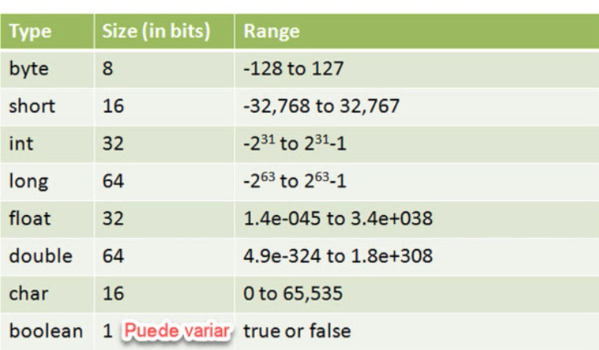
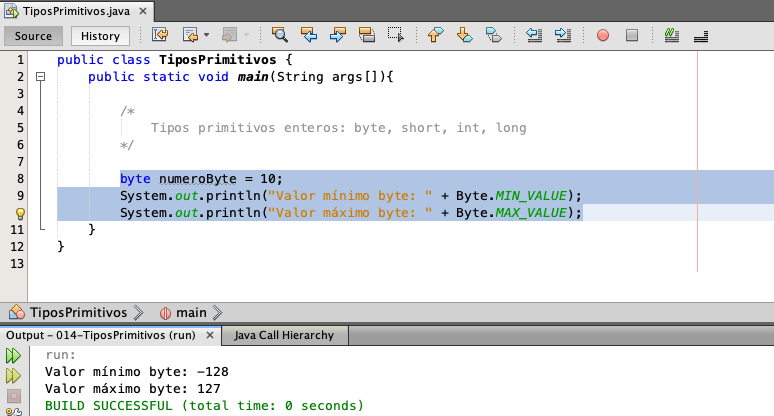
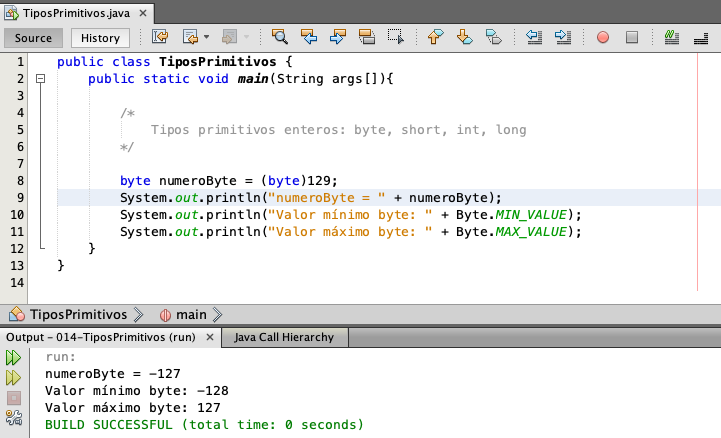
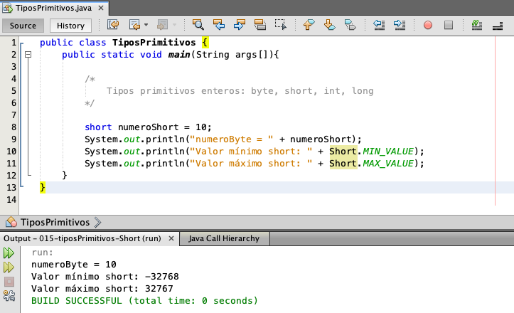
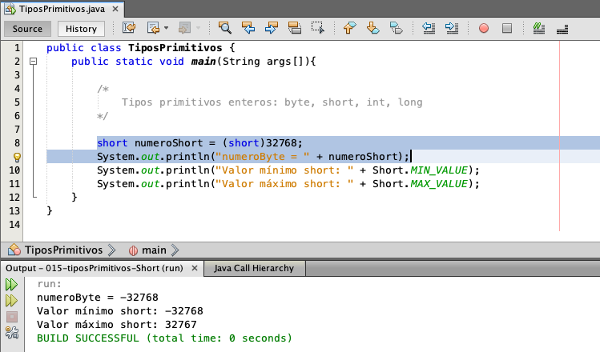
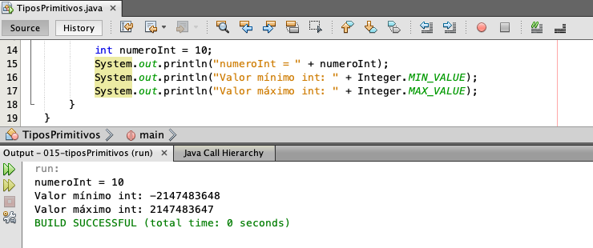
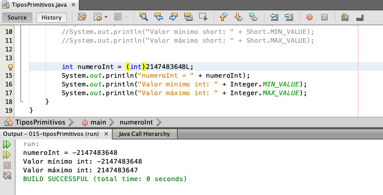
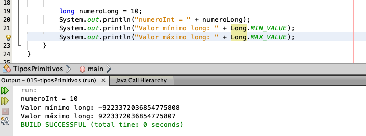
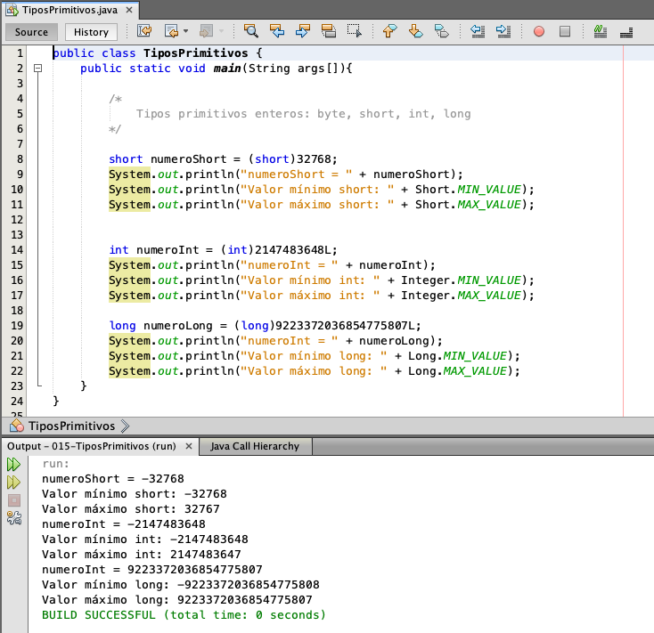

# 003 Tipos Primitivos en Java • 9 clases • 1 h 14 min

## [Resumen Profesor](/temarios/301_Fundamentos_de_Java/pdfs/01-VariablesJava.pdf)

* 014 Tipos Primitivos en Java - 06:51
* 015 Tipos Numéricos Enteros - 09:06
* 016 Ejercicio: Tipos Primitivos tipos Flotantes - 08:11
* 017 Ejercicio: Inferencia de Tipos con Var y tipos Primitivos - 07:55
* 018 Ejercicio: Tipos Primitivos tipo char - 11:34
* 019 Ejercicio: Tipos Primitivos tipo boolean - 07:42
* 020 Ejercicio: Conversión de Tipos Primitivos en Java - parte 1 - 11:58
* 021 Ejercicio: Conversión de Tipos Primitivos en Java - parte 2 - 10:38
* Cuestionario 2: Preguntas de Números - 6 preguntas
* Tarea 3: Tienda de Libros - 1 preguntas
* 022 Tienda de Libros (Solución) - 00:11

# 014 Tipos Primitivos en Java - 06:51

Hola, bienvenidos a esta lección.

A continuación vamos a estudiar los tipos primitivos de tipo entero en Java están listos? Vamos.

#### Comentarios

Podemos poner un comentario, como hemos visto, de una sola línea utilizarnos `//` un comentario de una sola línea, pero si queremos poner un comentario que abarque varias líneas, ponemos `/* ...*/`.


En Java, los tipos primitivos se clasifican de la siguiente manera podemos tener tipos primitivos que almacenan solamente enteros o tipos primitivos que almacenan tipos flotantes.  

Así que en esta primera lección vamos a ver los tipos primitivos que solamente almacenan tipos enteros sin punto flotante.

### Tipos Enteros

Los tipos primitivos de tipo entero que podemos manejar son los siguientes:

* `byte`
* `short`
* `int`
* `long`

Básicamente el tipo `byte` es el tipo más pequeño, sin embargo, no porque utilicemos el tipo más pequeño significa que vamos a ahorrar espacio, ya que recordemos que lo sepais al día de hoy utilizan arquitecturas de 32 o 64 bits.

En este caso, el `byte` utiliza 8 bits, el tipo `short` 16 bits, el tipo `int` 32 bits y el tipo `long` 64 bits. Por lo tanto, el tipo más común que vamos a utilizar cuando programamos en Java es el tipo entero `int`, debido a que los CPU son de 32 o de 64 bits, así que por lo tanto, si queremos ahorrar la mayor cantidad de espacio, normalmente utilizamos tipos enteros.

**El tipo `byte` sí puede ser utilizado sin embargo, esto no garantiza que utilicemos solamente 8 bits, ya que posiblemente estos 8 bits se van a almacenar en los 32 bits que componen una palabra de una arquitectura de 32 bits**. Eso es un detalle algo más técnico, pero es importante que lo sepan, ya que, como hemos comentado, el tipo más común que vamos a utilizar si queremos ahorrar la mayor cantidad de espacio es el tipo entero `int`. De ahí en adelante podemos utilizar, por ejemplo, el `long` y posteriormente vamos a ver otros tipos, el tipo flotante, que también puede almacenar más información.

Bien, vamos a ver cómo definir estos tipos.

Por ejemplo, para definir un tipo `byte` utilizamos la palabra reservada `byte`:

```java
byte numeroByte = 10;
```

Aunque esta literal es de tipo entero, podemos asignar este valor 10 al tipo `byte` sin ningún problema ya que el tipo `byte` tiene un rango y este rango lo podemos visualizar en la imagen.



o también tenemos el siguiente código que podemos utilizar para saber el valor mínimo y el valor máximo que puede almacenar un tipo `byte`, así que podemos utilizar el siguiente código.

```java
byte numeroByte = 10;
System.out.println("Valor mínimo byte: " + Byte.MIN_VALUE);
System.out.println("Valor máximo byte: " + Byte.MAX_VALUE);
```



`Byte.MIN_VALUE` nos permite recuperar el valor mínimo de un tipo `byte` y  `Byte.MAX_VALUE` nos permite recuperar el valor máximo de un tipo `byte`.

Los tipos enteros no solamente almacenan valores positivos, sino que también pueden almacenar valores negativos. Así que en este caso el rango de números que puede dar un tipo `byte` va desde el valor -128 hasta el valor 127.

Por lo tanto, es que podemos asignar el valor 10 a este tipo `byte` sin ningún problema, pero por ejemplo, si queremos asignar el valor 129.

```java
byte numeroByte = 129;
```

El cual ya se pasó del rango que puede aceptar el tipo `byte` podemos observar que nos manda un error y el error que nos manda es `incompatible types: possible lossy conversion from int to byte`, debido a que ese valor entero ya superó el valor máximo que puede almacenar un `byte`.

Sin embargo, aún así todavía es posible asignar este valor 129 a un tipo `byte` esto se conoce como conversión de tipos. Podemos observar que 129 sigue siendo una literal de tipo entero. Por default así lo maneja Java y para convertirlo a un tipo `byte`, lo que tenemos que hacer es anteponer entre paréntesis el tipo al cual queremos convertir.

```java
byte numeroByte = (byte)129;
```

Así que esta literal 129 que es de tipo entero con esto, con esta sintaxis, lo que estamos haciendo es convertirlo a un tipo `byte` y lo que le estamos diciendo al compilador es que estamos obligando a convertir este valor numérico de tipo entero a un tipo `byte`. Y como podemos observar con esto, ya no nos marca ningún error de compilación. Sin embargo, si mandamos a imprimir este número. Vamos a visualizar el valor de nuestra variable `byte`.



**Podemos observar que no está almacenando el valor de 129, como habíamos indicado, aquí estamos almacenando el valor de 129 y el valor que se está imprimiendo es el valor de -127, así que por ello es que el compilador nos mandó un aviso de que nosotros debemos de estar seguros lo que estamos haciendo, ya que si queremos almacenar un valor que supera el rango que soporta este tipo, entonces podemos tener este tipo de imprecisiones, así que por ello es importante saber el valor máximo que puede soportar un tipo `byte`**.

### :computer: `014-TiposPrimitivos` 

```java
public class TiposPrimitivos {
   public static void main(String args[]){
        
      /*
         Tipos primitivos enteros: byte, short, int, long
      */
        
      byte numeroByte = (byte)129;
      System.out.println("numeroByte = " + numeroByte);        
      System.out.println("Valor mínimo byte: " + Byte.MIN_VALUE);
      System.out.println("Valor máximo byte: " + Byte.MAX_VALUE);
   }
}
```


En la siguiente lección vamos a empezar a analizar los demás tipos, así que nos vemos en la siguiente lección. 

Saludos!

# 015 Tipos Numéricos Enteros - 09:06

Bien, vamos a continuar con esta lección. Ahora el siguiente tipo que podemos utilizar es el tipo `short`, este tipo puede almacenar hasta 16 bits. Vamos a hacer lo siguiente:

```java
short numeroShort = 10;
System.out.println("numeroShort = " + numeroShort);        
System.out.println("Valor mínimo short: " + Short.MIN_VALUE);
System.out.println("Valor máximo short: " + Short.MAX_VALUE);
```



Podemos observar el valor mínimo es -32768 y el valor máximo 32767. De igual forma que con `byte` si asignamos un valor fuera de rango para `short` nos mandara el mismo error `incompatible types: possible lossy conversion from int to short`.

```java
short numeroShort = 32768;
```

De igual manera podemos obligar al compilador a que haga esta conversión, pero con el riesgo de la pérdida de precisión, así que podemos indicar que queremos aún así convertirlo a un tipo `short`. Pero si mandamos a imprimir esto, vamos a ver el resultado.

```java
short numeroShort = (short)32768;
System.out.println("numeroByte = " + numeroShort);
```



Aunque `numeroShort` le estamos asignando un valor positivo, podemos observar que se imprime un valor negativo y esto es debido a la pérdida de bits al momento de hacer la conversión. Así que son simples detalles. Normalmente eso no va a ser un problema en la vida real.

Sin embargo, son detalles que deben de tener en cuenta al seleccionar el tipo primitivo que van a utilizar.

Por lo tanto, lo más recomendable, como les hemos comentado, es utilizar el tipo primitivo `int`. Vamos a crear una variable de este tipo e imprimir sus valores mínimos y máximos.

```java
int numeroInt = 10;
System.out.println("numeroInt = " + numeroInt);        
System.out.println("Valor mínimo int: " + Integer.MIN_VALUE);
System.out.println("Valor máximo int: " + Integer.MAX_VALUE);
```



Podemos observar el valor mínimo es -2147483648 y el máximo 2147483647.

Así que vamos a tomar el valor máximo más 1 y se lo vamos a asignar a `numeroInt`.

```java
int numeroInt = 2147483648;        
```

Al superarlo por uno sumamos uno nos manda el siguiente mensaje `integer number too large`, el valor integer que estamos tratando de utilizar es un valor muy grande. Sin embargo, este caso es un caso especial, ya que incluso aunque pongamos la conversión de entero esto no resuelve el problema.

```java
int numeroInt = (int)2147483648;        
```

Podemos observar que nos siguen mandando el problema de que el valor numérico es muy grande `integer number too large` y si recordamos **esta literal es una literal de tipo entero por default**. Sin embargo, las literales enteras son de tipo `int` por lo tanto, estamos superando el valor máximo para una literal de tipo entero. Por ello el error es diferente, incluso aunque tratemos de hacer la asignación a nuestra variable de tipo entero. Aquí el problema es que la literal también ya se pasó de valor.

Y para resolver esto tenemos que ver ahora el tipo `long` y para manejar literales de tipo `long` lo que vamos a hacer es utilizar una `L` al final de nuestra literal. Puede ser una l minúscula o una L mayúscula, pero si observamos si ponemos una l minúscula, parece que es el valor de 1. Por lo tanto, se le recomienda utilizar una L mayúscula para no confundir el 1 con una L y L lo que significa es que es una literal de tipo `long`.

```java
int numeroInt = (int)2147483648L;        
```

Por lo tanto, esta literal entera, al ser ya superior a un tipo entero, al poner una L, se está convirtiendo a un tipo superior de 32bits que puede ocupar el tipo entero a 64bits que puede ocupar el tipo `long`. Así que con eso se corrige ese problema, ya que la literal ya es de tipo `long`.

Y una vez que corregimos el problema de la literal.

Entonces si quitamos esta conversión.

```java
int numeroInt = 2147483648L;        
```

Podemos observar que el error cambia, ya no es el error de superar el tipo entero de la literal, sino que ahora volvemos a tener el problema de la conversión de tipo `incompatible types: possible lossy conversion from long to int`, ya que estamos tratando de convertir un tipo `long` a un tipo `int`.  

Y para corregir esto podemos utilizar un valor inferior o podemos indicar al compilador que de cualquier 
manera haga la conversión tal como lo hemos visto anteriormente, y con esto se corrige el problema.

```java
int numeroInt = (int)2147483648L;
System.out.println("numeroInt = " + numeroInt);
```

Sin embargo, si volvemos a imprimir nuestro resultado. Podemos observar que asignamos un valor positivo y lo que se está imprimiendo es un valor negativo.



Esto es debido a la pérdida de precisión cuando estamos convirtiendo los tipos de `long` a entero. **Así que también debemos tener en cuenta estos detalles**.

Y por último, vamos a ver el tipo `long`

Definimos una variable de tipo `long` no le asignamos cualquier valor, imprimimos esta variable. Vamos a imprimir los números mínimo y máximo.

```java
long numeroLong = 10;
System.out.println("numeroInt = " + numeroLong);        
System.out.println("Valor mínimo long: " + Long.MIN_VALUE);
System.out.println("Valor máximo long: " + Long.MAX_VALUE);      
```



Podemos observar que ya es un número muchísimo más grande el que soporta el tipo `long`. En muchas ocasiones no es necesario almacenar un número tan grande. Por ello es que lo recomendable es utilizar el tipo `int` cuando seleccionemos un tipo primitivo, ya que el tipo `long` es un número mucho más grande.

Bien vamos a seguir haciendo la prueba, vamos a tomar el número máximo y en este caso sigue siendo el mismo problema de la literal, que ya hemos superado el tipo entero de la literal para convertirlo a una literal de tipo `int`.

```java
long numeroLong = 9223372036854775807;    
```

Tenemos que poner una L al final.

```java
long numeroLong = 9223372036854775807L;    
```

Con eso se corrige el problema de la literal, pero ahora si incrementamos en 1 este valor entonces ya tenemos el problema de que hemos superado el valor que soporta una literal de tipo entero `integer number too large`.

```java
long numeroLong = 9223372036854775808L;    
```

No importa que sea una literal de tipo `long` en sí, ya superamos cualquier valor que soportan los tipos enteros y para ello tenemos que empezar con el tema de los tipos flotantes, que pueden ser un tipo `float` o un tipo `double`.

```java
long numeroLong = 9223372036854775808F;    
```

```java
long numeroLong = 9223372036854775808D;    
```

Sin embargo, como ya nos pasamos del valor que soporta el tipo, entonces tenemos que hacer la conversión de manera explícita podemos ver que ya funciona de nueva cuenta nuestro código.

```java
long numeroLong = (long)9223372036854775808D;    
```

Pero esto lo vamos a ver a detalle en la siguiente lección. De momento es importante que reconozcan los tipos primitivos de tipo entero.

### :computer: `015-TiposPrimitivos` 

*`TiposPrimitivos`*

```java
public class TiposPrimitivos {
   public static void main(String args[]){
        
      /*
         Tipos primitivos enteros: byte, short, int, long
      */
        
      short numeroShort = (short)32768;
      System.out.println("numeroShort = " + numeroShort);        
      System.out.println("Valor mínimo short: " + Short.MIN_VALUE);
      System.out.println("Valor máximo short: " + Short.MAX_VALUE);
          
      int numeroInt = (int)2147483648L;
      System.out.println("numeroInt = " + numeroInt);        
      System.out.println("Valor mínimo int: " + Integer.MIN_VALUE);
      System.out.println("Valor máximo int: " + Integer.MAX_VALUE);
        
      long numeroLong = (long)9223372036854775807L;
      System.out.println("numeroInt = " + numeroLong);        
      System.out.println("Valor mínimo long: " + Long.MIN_VALUE);
      System.out.println("Valor máximo long: " + Long.MAX_VALUE);
   }
}
```



Es todo por esta lección y nos vemos en el siguiente.

Saludos!

# 016 Ejercicio: Tipos Primitivos tipos Flotantes - 08:11

Hola y bienvenidos a esta lección.

A continuación vamos a ver los tipos primitivos de tipo flotante. Están listos? Vamos.

En este momento hemos visto los tipos primitivos `byte`, `short`, `int` y `long`, los cuales únicamente permiten recibir valores de tipo entero.

Ahora vamos a ver los tipos que nos permiten recibir valores de tipo flotante, es decir, con punto decimal que son los tipos `float` y `double`.


Ahora el tipo Flagg utiliza 32bits y el tipo de árbol utiliza 64bits.

Sin embargo, simplemente al utilizar notación de punto flotante, el tipo flow puede almacenar valores

más grandes que un tipo int o un tipo longe simplemente por utilizar notación exponencial.

Así que vamos a ver lo siguiente definimos una variable.

Número float.

Y le asignamos cualquier valor, por ejemplo el valor de 10, en este caso este valor de 10 puede ser

una literal de tipo primitivo de tipo entero, ya que en este caso es una literal de tipo entero o puede

ser una literal de punto flotante, por ejemplo, en este caso 10 puntos cero.

Sin embargo, las literales de punto flotante en Java por default son de tipo doble.

Así que un Nobol que tiene 64 bits no se puede almacenar de manera inmediata a un tipo flop.

Por lo tanto, para corregir esto podemos hacer dos cosas.

Podemos indicar que esta literal sea de tipo F de tipo flotante.

Puede ser una f minúscula o una f mayúscula, pero de igual manera lo recomendable es utilizar la f

mayúscula para que se entienda que es una literal de tipo flotante.

Así que esa es una forma o podemos indicar al compilador que haga la conversión.

Al Tipo flotante.

Así que en este caso está literal ese tipo de doble por default en Java las literales flotantes son

el tipo de fútbol, pero con esta indicación le estamos diciendo al compilador que de cualquier manera

lo convierte a un tipo flow y debido a que es un valor que puede soportar el tipo flotante si lo mandamos

a imprimir.

Deberemos observar que el resultado es correcto, así que guardamos cambios, ejecutamos y podemos dejar

que el resultado no se altera, por lo tanto esta conversión es válida y además no hubo pérdida de precisión.

Pero qué pasa si nos vamos a los límites del punto flotante?

Vamos a imprimir los valores límite valor.

Valor mínimo.

Tipo float.

Lo mandamos a imprimir utilizando la clase float y accedemos al valor de 1000 valio.

Imprimimos el valor de mil BALIO y vamos a hacer lo mismo.

Para Max Valio.

Así que imprimimos el valor máximo del tipo flop, guardamos cambios, vamos a ejecutar.

Y podemos observar que tenemos un valor negativo, pero utilizando notación exponencial, si no están

familiarizados con esto, pueden revisar cualquier referencia en Ghoul para revisar la notación exponencial

de los números, pero básicamente es utilizar la letra de exponente y posteriormente indicamos en cuántas

posiciones se va a mover.

Este valor simplemente es un número más grande, pero utilizar esta notación para que no se despliegue

todo este número, sino que se simplifique la impresión de números del tipo flotante, ya que pueden

ser valores muy grandes y también el valor máximo es 3.4, pero exponente 38.

Así que tenemos 38 posiciones hacia la derecha y en este caso 45 posiciones hacia la izquierda y por

lo tanto podemos observar que es un número bastante grande.

Y si nos vamos al límite?

Utilizando la notación exponencial vamos a asignar este valor.

Este valor todavía soportado vamos a quitar esta conversión.

Vamos a indicar que esta literal sea de tipo flotante, ponemos una F y podemos ver que ya no tenemos

ningún problema.

Estamos en el límite, pero todavía podemos utilizarlo, así que tenemos exponente a la 38, pero si

sumamos un 1 a este valor, es decir que nos vamos al valor de 36.

Podemos observar que estamos superando el valor soportado por la literal de tipo flotante.

Así que esto lo podemos resolver de dos maneras podemos indicar que esta literal sea de tipo doble.

Sin embargo, si indicamos esto, tenemos que hacer la conversión.

De manera explícita, así que estamos convirtiendo una literal de tipo doble.

Y lo estamos asignando a una variable de tipo flotante.

Vamos a ver el resultado.

Y en este caso, debido a que ya estamos utilizando un número mayor soportado por el tipo flop, vamos

a tener pérdida de precisión, así que guardamos cambios, ejecutamos y podemos observar el valor de

Infinity.

Esto quiere decir que ya no pudimos asignar el valor de manera correcta y por lo tanto el compilador

ya no se puede interpretar.

Este valor nos manda el valor de Infinity y por lo tanto fue un valor inválido.

Para asignar al tipo flotante se perdió la precisión.

Ya no fue el valor que intentamos asignar de tipo doble, sino que ya no soportó este valor y por lo

tanto nos manda el valor de Infiniti.

Así que vamos a dejar simplemente el valor máximo que puede soportar.

Guardamos cambios, ejecutamos y podemos saber que en este caso es exactamente el mismo valor máximo

que soporta el tipo flotante.

Y por último, vamos a ver el tipo de fútbol.

Definimos una variable de tipo doble.

Le asignamos cualquier valor, por ejemplo, el valor de 10 no tiene que ser de punto flotante en automático

la literal, el tipo entero se puede asignar a un tipo doble sin realizar ningún tipo de conversión.

Debido a que los tipos enteros se pueden almacenar en los tipos doble sin ningún problema, vamos a

imprimir esta variable número doble.

Vamos a imprimir los valores mínimo y máximo.

Y la clase que vamos a utilizar es la clase de doble.

Así que vamos a utilizar la clase doble.

Para saber el valor mínimo y máximo, guardamos cambios, ejecutamos.

Y podemos observar que también este es un número ya muchísimo más grande.

El tipo flotante tiene 45 posiciones hacia la izquierda y en este caso el valor mínimo tiene menos 324

posiciones hacia la izquierda.

Cuando trabajamos con el tipo doble y en el tipo flotante tenemos 38 posiciones hacia la derecha y en

este caso tenemos 300, ocho posiciones en valor positivo, así que podemos observar que es un número

muchísimo más grande.

Por ello es que el tipo de doble es el tipo más grande en Java.

Es el tipo de dato que puede mencionar los valores mayores.

Vamos a asignarle el valor máximo para hacer la prueba.

Guardamos cambios, imprimimos.

Observamos que el número doble es exactamente igual al valor máximo que soporta este tipo de doble.

Y podemos ver que tampoco fue necesario indicar que esta literal es de tipo doble, ya que en Java por

default, las literales de punto flotante simplemente contener un punto entonces ya son de tipo doble.

Así que eso es opcional.

Se puede poner o no la de.

Así que revisen hasta aquí su código, realicen los ejercicios que hemos visto hasta el momento.

Y cualquier duda.

Recuerden que también les adjuntamos la tabla con el detalle de cada uno de estos tipos enteros y flotantes.

Todo por este vídeo y nos vemos en la siguiente elección.

Saludos.

# 017 Ejercicio: Inferencia de Tipos con Var y tipos Primitivos - 07:55
# 018 Ejercicio: Tipos Primitivos tipo char - 11:34
# 019 Ejercicio: Tipos Primitivos tipo boolean - 07:42
# 020 Ejercicio: Conversión de Tipos Primitivos en Java - parte 1 - 11:58
# 021 Ejercicio: Conversión de Tipos Primitivos en Java - parte 2 - 10:38
# Cuestionario 2: Preguntas de Números - 6 preguntas
# Tarea 3: Tienda de Libros - 1 preguntas
# 022 Tienda de Libros (Solución) - 00:11
