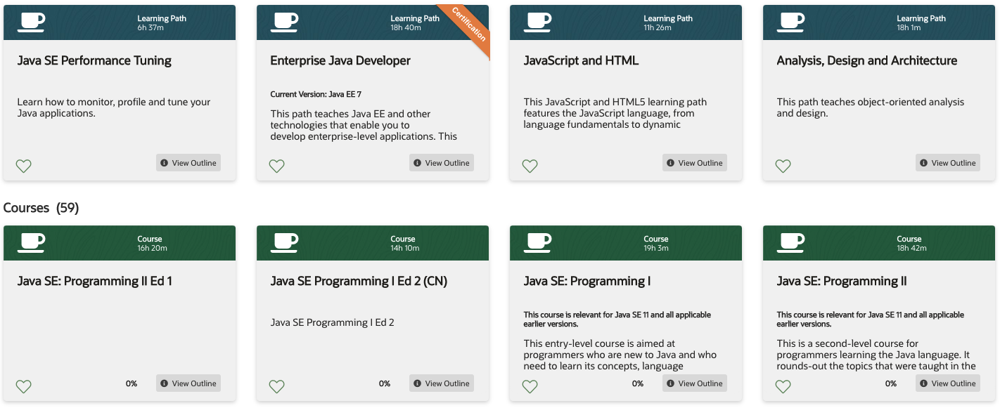
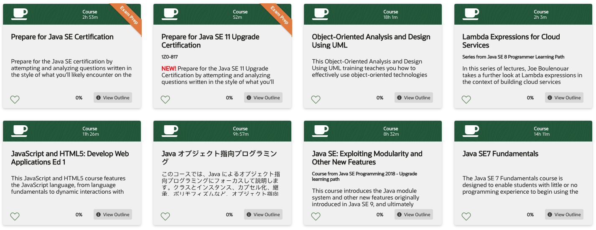
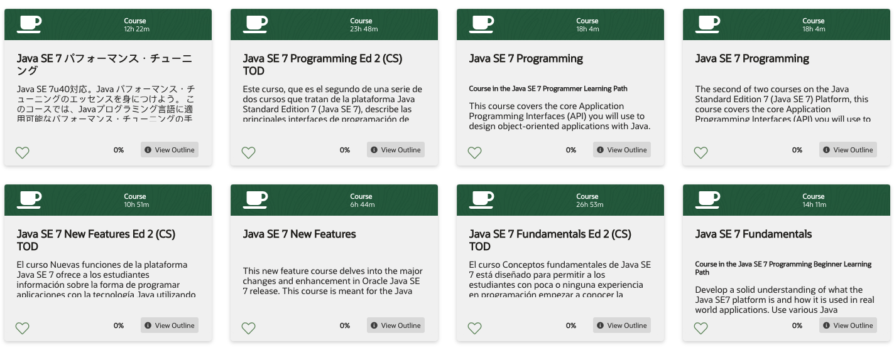
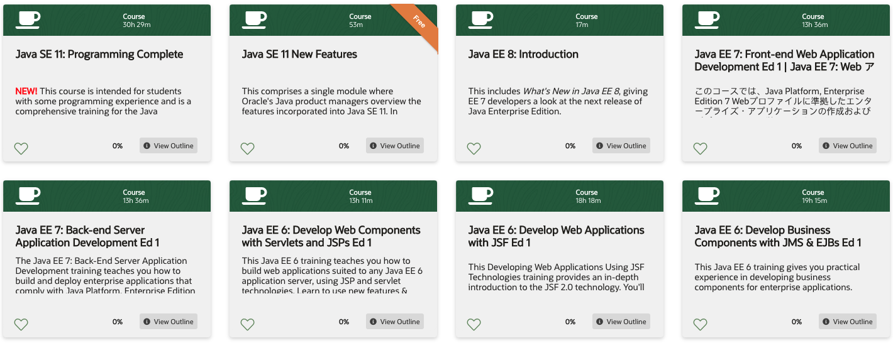
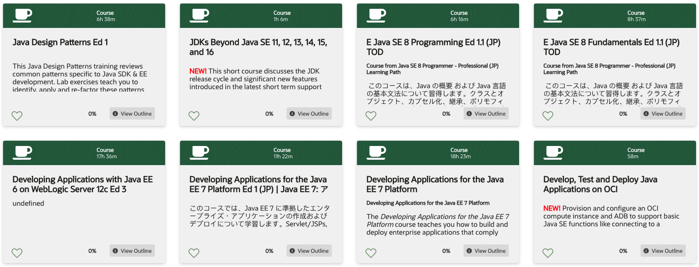
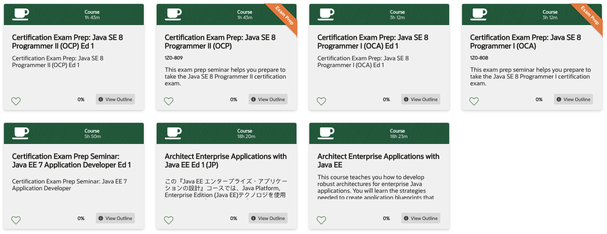

# 500 Java Oracle University

Java Learning Subscription

### [505 Java Explorer](500-Java-Oracle-University/505-Java-Explorer.md)

Java Explorer

Learn Java programming basics such as variables, classes, objects, loops, arrays, and decision constructs. Get introduced to Java's

### [510 Java SE 11 Developer](500-Java-Oracle-University/510_Java_SE_11_Developer.md)

Java SE 11 Developer

NEW!   Get a complete view of Java SE 11 technology and prepare for the certification exam.
 
### [512 Java SE on OCI](500-Java-Oracle-University/512-Java-SE-on-OCI.md)

Current version: Java 11

NEW!   Craft custom Java solutions that leverage OCI DevOps, cloud-native services like functions, APIs and streaming, perform

### [514 Beyond Java SE 11](500-Java-Oracle-University/514-Beyond-Java-SE-11.md)

Beyond Java SE 11 with JDKs 12, 13, 14, 15, and 16

NEW!   This learning path discusses the JDK release cycle and significant new features introduced in the latest short term support

### [516 Java SE 11 Upgrade](500-Java-Oracle-University/516-Java-SE-11-Upgrade.md)

This path is for experienced Java SE 8 programmers who need to update their skills to Java SE 11, including features introduced in

### [518 Java SE 8 Programmer - Associate](500-Java-Oracle-University/518-Java-SE-8-Programmer-Associate.md)

Programmers who will use Java SE 8 but are new to the Java language

### [520 Java SE 8 Programmer - Professional](500-Java-Oracle-University/520-Java-SE-8-Programmer-Professional.md)

Programmers who have completed "Java SE 8 Fundamentals"

### [522 Java SE 7 Programmer](500-Java-Oracle-University/522-Java-SE-7-Programmer.md)

The legacy courses included in this path teach you about the Java language for SE 7.

### [524 Java SE Performance Tuning](500-Java-Oracle-University/524-Java-SE-Performance-Tuning.md)

Learn how to monitor, profile and tune your Java applications.

## [526 Enterprise Java Developer](500-Java-Oracle-University/526-Enterprise-Java-Developer.md)

This path teaches Java EE and other technologies that enable you to develop enterprise-level applications. 

## [528 JavaScript and HTML](500-Java-Oracle-University/528-JavaScript-and-HTML.md)

This JavaScript and HTML5 learning path features the JavaScript language, from language fundamentals to dynamic

## [530 Analysis, Design and Architecture](500-Java-Oracle-University/530-Analysis-Design-and-Architecture.md)

This path teaches object-oriented analysis and design.

## [Java SE: Programming II Ed 1]()

## [Java SE Programming I Ed 2 (CN)]()

Java SE Programming I Ed 2

## [Java SE: Programming I]()

This entry-level course is aimed at programmers who are new to Java and who need to learn its concepts, language

## [Java SE: Programming II]()

This is a second-level course for programmers learning the Java language. It rounds-out the topics that were taught in the

## [555 Java EE 6: Develop Web Services with JAX-WS and JAX-RS](https://github.com/adolfodelarosades/Java/blob/master/temarios/500-Java-Oracle-University/555-Java-EE-6-Develop-Web-Services-with-JAX-WS-and-JAX-RS-Ed-1.md)

This Java EE 6 programming course covers the design and creation of SOAP and RESTful web services and clients. You'll use the

## [XML Fundamentals Ed 1.1]()

This XML Fundamentals training introduces you to the basics of XML. In this 2 day hands on course, you will learn the central XML

## [Java EE 7: Front-end Web Application Development Ed 1]()

This Java EE 7: Front-end Web Application Development training helps you explore building and deploying enterprise

## 👍 [Developing Applications for the Java EE 7 Platform Ed 1]()

Course from Java Track

Learn how to use Java Persistence and Java Transaction APIs,create a flexible component model using EJB and CDI technology,provide

## 👍 [Java Performance Tuning]()

In this course, you will learn how to Monitor, profile and tune your Java applications, to use command line and visual tools to perform

## [Develop Mobile Front Ends Using Mobile Application Framework Ed 1]()

This Develop Mobile Front Ends Using Mobile Application Framework training teaches you how to use Oracle Mobile Application Framework (MAF) to develop application

## 👎 [資格試験準備セミナー: OCJP Silver SE 8]()

この資格試験準備セミナーは、OCJP Silver SE 8   認定資格試験の受験準備に役立ちます。
試験の頻出トピックを模擬試験とインストラ

## 👎 [資格試験準備セミナー: OCJP Gold SE 8]()

この資格試験準備セミナーは、OCJP Gold SE 8  認定資格試験の受験準備に役立ちます。
試験の頻出トピックを模擬試験とインストラ

## 👍 [Prepare for Java SE Certification]()

Prepare for the Java SE certification by attempting and analyzing questions written in the style of what you'll likely encounter on the

## 👍 [Prepare for Java SE 11 Upgrade Certification]()

1Z0-817

NEW! Prepare for the Java SE 11 Upgrade Certification by attempting and analyzing questions written in the style of what you'll likely encounter on the exam.

## 👍 [Object-Oriented Analysis and Design Using UML]()

This Object-Oriented Analysis and Design Using UML training teaches you how to effectively use object-oriented technologies

## 👍 [Lambda Expressions for Cloud Services]()

Series from Java SE 8 Programmer Learning Path
In this series of lectures, Joe Boulenouar takes a further look at Lambda expressions in the context of building cloud services

## 👍 [JavaScript and HTML5: Develop Web Applications Ed 1]()

This JavaScript and HTML5 course features the JavaScript language, from language fundamentals to dynamic interactions with

## 👎 [Java オブジェクト指向プログラミング]()

このコースでは、Java によるオブジェクト指向プログラミングにフォーカスして説明します。クラスとインスタンス、カプセル化、継承、ポリモフィズムなど、オブジェクト指向

## 👍 [Java on OCI: Develop a REST-based Microservice]()

Java on OCI: Develop a REST-based Microservice

## 👍 [Java SE: Exploiting Modularity and Other New Features]()

Course from Java SE Programming 2018 - Upgrade learning path
This course introduces the Java module system and other new features originally introduced in Java SE 9, and ultimately

## 👍 [Java SE7 Fundamentals]()

This course will be archived on 05/21/2021
The Java SE 7 Fundamentals course is designed to enable students with little or no programming experience to begin using the

## 👎 [Java SE Exploiting Modularity and Other New Features Ed 1 (JP)]()

このコースでは Java SE 9 から導入されたJava モジュール・システムと JShel, Stream API の変更点、新たに追加された便利なメソ

## 👍 [Java SE 8 Programming Ed 1]()

This Java SE 8 Programming training covers the core language features and Application Programming Interfaces (API) you will use to

## 👍 [Java SE 8 Programming]()

Course in the Java SE 8 Programmer Learning Path
This covers the core language features and Application Programming Interfaces (API) you will use to design object-oriented applications

## 👎 [Java SE 8 New Features Ed 1 (JP) TOD]()

Course from Java SE 8 Programmer - Professional (JP) Learning Path
このコースでは、Java SE 8 の新機能について学習します。わかりやすい講義と実践的な演習を通して Java SE 8 の変更点を理解するこ

## [Java SE 8 New Features Ed 1]()

This Java SE 8 New Features training highlights the major changes of Oracle Java SE 8. Expert Oracle University instructors teach you through interactive instruction a

## [Java SE 8 Fundamentals Ed 1]()

This Java SE 8 Fundamentals training enables those with little or no programming experience to learn object-oriented programming using the Java language

## 👍 [Java SE 8 Fundamentals]()

Course from Java SE 8 Programming Beginner Learning Path
This course introduces the essential concepts of Java and teaches you the syntax and constructs of the language. You learn how to

## 👍 [Java SE 8 Advanced Topics]()

Course from Java SE 8 Programmer Learning Path

This series provides additional Java SE 8 topics, notably Utilize Java Mission Control, which shows you a set of tools for performance monitoring / profiling

## 👎 [Java SE 7 パフォーマンス・チューニング]()

Java SE 7u40対応。Java パフォーマンス・チューニングのエッセンスを身につけよう。 このコースでは、Javaプログラミング言語に適用可能なパフォーマンス・チューニングの手

## :es: [Java SE 7 Programming Ed 2 (CS) TOD](https://github.com/adolfodelarosades/Java/blob/master/temarios/500-Java-Oracle-University/552-Java-SE-7-Programming-Ed-2-CS-TOD.md)

Este curso, que es el segundo de una serie de dos cursos que tratan de la plataforma Java Standard Edition 7 (Java SE 7), describe las principales interfaces de programación de

## 👍 [Java SE 7 Programming]()

Course in the Java SE 7 Programmer Learning Path
This course covers the core Application Programming Interfaces (API) you will use to design object-oriented applications with Java.

## 👍 [Java SE 7 Programming]()

This course will be archived on 05/21/2021

The second of two courses on the Java Standard Edition 7 (Java SE 7) Platform, this course covers the core Application

## :es: [533 Java SE 7 New Features Ed 2 (CS) TOD](https://github.com/adolfodelarosades/Java/blob/master/temarios/500-Java-Oracle-University/553-Java-SE-7-New-Features-Ed-2-CS-TOD.md)

El curso Nuevas funciones de la plataforma Java SE 7 ofrece a los estudiantes información sobre la forma de programar aplicaciones con la tecnología Java utilizando

## [Java SE 7 New Features]()

This new feature course delves into the major changes and enhancement in Oracle Java SE 7 release. This course is meant for the Java

## :es: [551 Java SE 7 Fundamentals Ed 2 (CS) TOD](https://github.com/adolfodelarosades/Java/blob/master/temarios/500-Java-Oracle-University/551-Java-SE-7-Fundamentals-Ed-2-CS-TOD.md)

This course will be archived on 05/21/2021

El curso Conceptos fundamentales de Java SE 7 está diseñado para permitir a los estudiantes con poca o ninguna experiencia

## 👍 [Java SE 7 Fundamentals]()

Course in the Java SE 7 Programming Beginner Learning Path

Develop a solid understanding of what the Java SE7 platform is and how it is used in real world applications. Use various Java

## 👍 [Java SE 11: Programming Complete]()

NEW! This course is intended for students with some programming experience and is a comprehensive training for the Java programming language.

## 👍 [Java SE 11 New Features]()

This comprises a single module where Oracle's Java product managers overview the features incorporated into Java SE 11. In addition, Oracle University staff provide

## 👍 [Java EE 8: Introduction]()

This includes What's New in Java EE 8, giving EE 7 developers a look at the next release of Java Enterprise Edition.

## 👎 [Java EE 7: Front-end Web Application Development Ed 1 | Java EE 7: Web アプリケーション開発]()

このコースでは、Java Platform, Enterprise Edition 7 Webプロファイルに準拠したエンタープライズ・アプリケーションの作成およびデプロイについて学習します。このコースで

## [Java EE 7: Back-end Server Application Development Ed 1]()

The Java EE 7: Back-End Server Application Development training teaches you how to build and deploy enterprise applications that comply with Java Platform, Enterprise Edition

## [Java EE 6: Develop Web Components with Servlets and JSPs Ed 1]()

This Java EE 6 training teaches you how to build web applications suited to any Java EE 6 application server, using JSP and servlet technologies. Learn to use new features &

## [554 Java EE 6: Develop Web Applications with JSF Ed 1](https://github.com/adolfodelarosades/Java/blob/master/temarios/500-Java-Oracle-University/554-Java-EE-6-Develop-Web-Applications-with-JSF-Ed-1.md)

This course will be archived on 05/21/2021

This Developing Web Applications Using JSF Technologies training provides an in-depth introduction to the JSF 2.0 technology. You'll perform hands-on lab exercises using the

## [Java EE 6: Develop Business Components with JMS & EJBs Ed 1]()

This Java EE 6 training gives you practical experience in developing business components for enterprise applications. Learn to do so using the EJB technology a

## [Java Design Patterns Ed 1]()

This Java Design Patterns training reviews common patterns specific to Java SDK & EE development. Lab exercises teach you to identify, apply and re-factor these patterns

## 👍 [JDKs Beyond Java SE 11, 12, 13, 14, 15, and 16]()

NEW! This short course discusses the JDK release cycle and significant new features introduced in the latest short term support

## 👎 [E Java SE 8 Programming Ed 1.1 (JP) TOD]()

Course from Java SE 8 Programmer - Professional (JP) Learning Path
 このコースは、Java の概要 および Java 言語の基本文法について習得します。クラスとオブジェクト、カプセル化、継承、ポリモフィ
 
## 👎 [E Java SE 8 Fundamentals Ed 1.1 (JP) TOD]()

Course from Java SE 8 Programmer - Professional (JP) Learning Path
 このコースは、Java の概要 および Java 言語の基本文法について習得します。クラスとオブジェクト、カプセル化、継承、ポリモフィ

## 👎[E Building Internet System Quick Start using Oracle Products Ed 3 (JP)]()

-データベースとアプリケーション・サーバーによるWeb3階層システムの全体像-
現代のWebシステムは非常に複雑化しています。これらを理解し構築できるようになるた

## [Developing Applications with Java EE 6 on WebLogic Server 12c Ed 3]()

undefined

## 👎 [Developing Applications for the Java EE 7 Platform Ed 1 (JP) | Java EE 7: アプリケーション開発]()

このコースでは、Java EE 7 に準拠したエンタープライズ・アプリケーションの作成およびデプロイについて学習します。Servlet/JSPs, JSF, CDI, JPA, JTA, EJB, JAX-RS, WebSockets,

## 👍 [Developing Applications for the Java EE 7 Platform]()

The Developing Applications for the Java EE 7 Platform course teaches you how to build and deploy enterprise applications that comply

## 👍 [Develop, Test and Deploy Java Applications on OCI]()

NEW! Provision and configure an OCI compute instance and ADB to support basic Java SE functions like connecting to a

## 👍[Certification Exam Prep: Java SE 8 Programmer II (OCP) Ed 1]()

Certification Exam Prep: Java SE 8 Programmer II (OCP) Ed 1

## 👍 [Certification Exam Prep: Java SE 8 Programmer II (OCP)]()

1Z0-809

This exam prep seminar helps you prepare to take the Java SE 8 Programmer II certification exam.

## 👍 [Certification Exam Prep: Java SE 8 Programmer I (OCA) Ed 1]()

Certification Exam Prep: Java SE 8 Programmer I (OCA) Ed 1

## 👍 [Certification Exam Prep: Java SE 8 Programmer I (OCA)]()

1Z0-808

This exam prep seminar helps you prepare to take the Java SE 8 Programmer I certification exam.

## [Certification Exam Prep Seminar: Java EE 7 Application Developer Ed 1]()

Certification Exam Prep Seminar: Java EE 7 Application Developer

## 👎 [Architect Enterprise Applications with Java EE Ed 1 (JP)]()

この『Java EE エンタープライズ・アプリケーションの設計』コースでは、Java Platform, Enterprise Edition (Java EE)テクノロジを使用したエンタープライズJavaアプリケーション

## [Architect Enterprise Applications with Java EE]()

This course teaches you how to develop robust architectures for enterprise Java applications. You will learn the strategies needed to create application blueprints that work well when implementing Java EE
