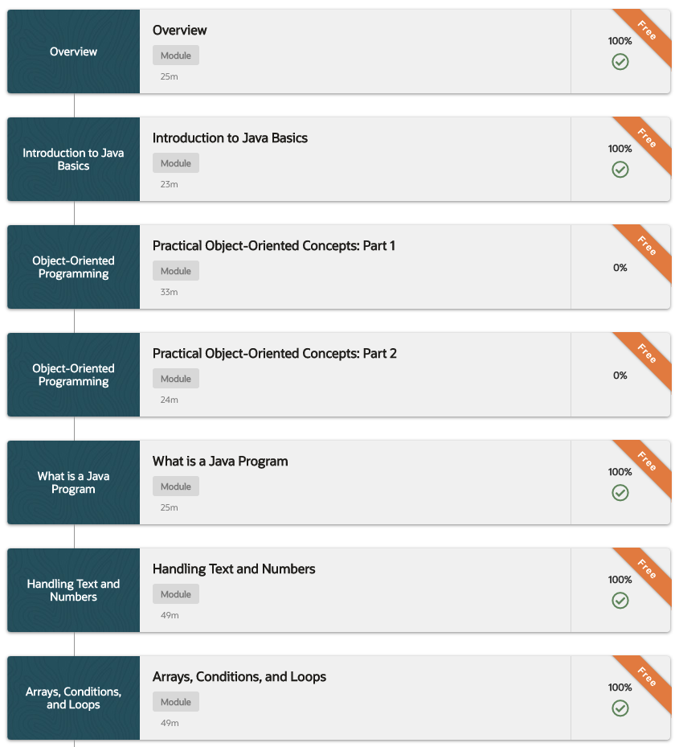
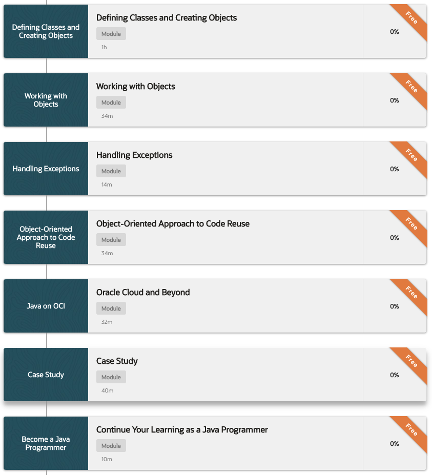
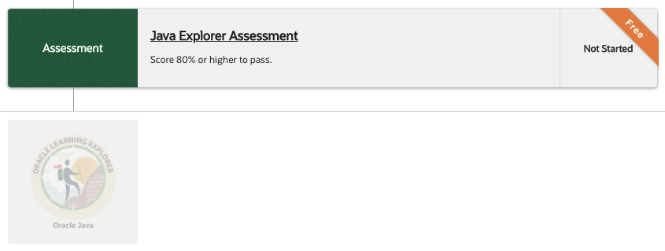

# 505 Java Explorer

Ruta de aprendizaje 7h 26m

Aprenda los conceptos básicos de programación de Java, como variables, clases, objetos, bucles, arrays y construcciones de decisiones. Conozca las capacidades orientadas a objetos de Java. Aprenda a jugar con Java utilizando NetBeans IDE, así como Oracle Cloud. ¡Anímate y gana la insignia de explorador!

Esta ruta de aprendizaje proporciona una introducción a Java para:

* Desarrolladores
* Diseñadores, administradores y arquitectos
* Ingenieros de soporte y control de calidad

Esta ruta de aprendizaje cubre:

* Una descripción general de Java
* Texto y números en Java
* Arrays, condiciones y bucles
* Clases y objetos
* Manejo de excepciones
* Herencia e interfaces
* Java en OCI

